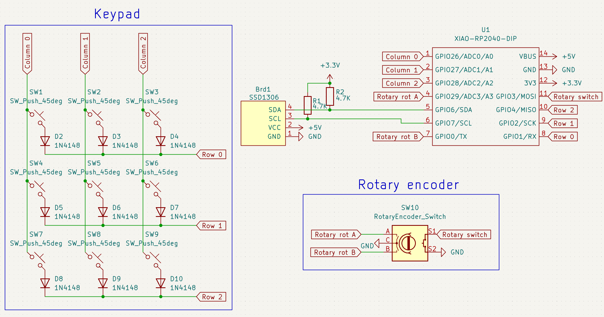
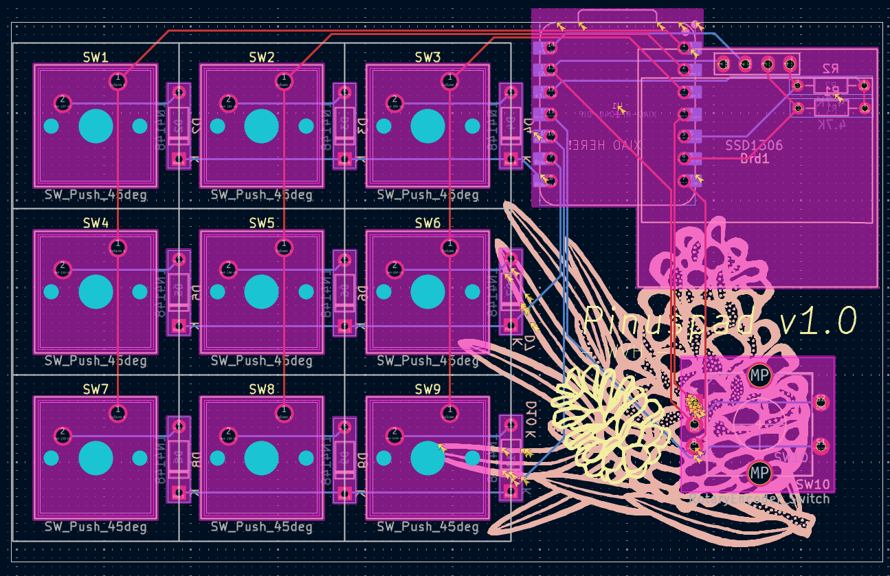

# Pinuspad

The macropad of your Dreams (or at least mine)!

The process of making this was surprisingly painless. Even things I thought were going to pose big challenges, such as the pcb wiring, turned out to be quite simple. I wanted a simple but powerful macropad with a big rotary encoder. I haven't decided on the cap for it yet but a large circular one would be ideal. Just imagine how satisfying it'd be to adjust the volume of your _10h baby shark loop_ with this knob. 

### Featuring:

- 9 customizable mechanical buttons
- A rotary encoder
- A fancy 0,96" oled display

### Take a look

### Firmware

Pinuspad uses custom QMK firmware. Please note that this won't be the final version. I will iron it out once I have assembled Pinuspad.

### Bill of Materials

- 1x SEEED XIAO RP2040
- 9x Cherry MX style brown switches
- 9x blank black DSA keycaps
- 9x Through-hole 1N4148 Diodes
- 1x EC11 Rotary encoder
- 1x SSD1306 128x64O LED (5V VCC, 3.3V logic, I2C)
- 2x 4.7k resistor
- 4x same screws as orpheuspad and corresponding nuts
- 1x white 3d printed case bottom
- 1x white 3d printed case top

### No-supports version

You can find both versions in the "cad" directory. "Production" only contains the supportsless file.