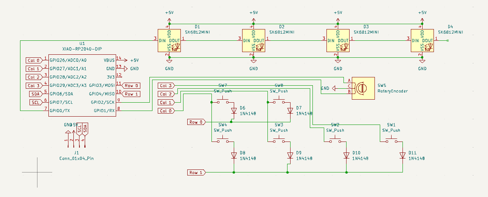
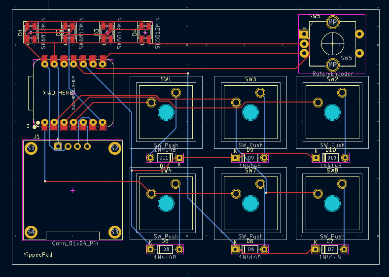
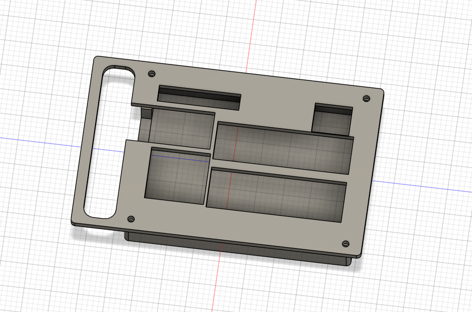
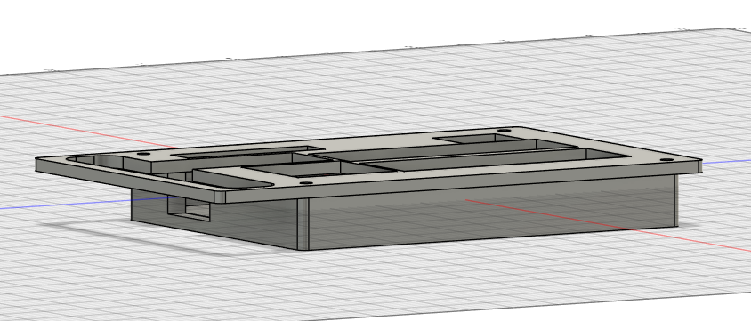

# Hackyippee

Hackyippee acts as a volume controller and audio controller with a programmable 128x64 OLED display. The Xiao MCU also has a USB port for usage with other devices. Finally, there are some LEDs for party lighting and fun effects.

## Inspiration

I wanted to make something for my baby cousin to more easily control her parents' music speaker with. She will be unstoppable with full aux capabilities.

## BOM (Bill of Materials)

* 1x XIAO RP2040

* 4x SK6812Mini-E

* 1x J1 conn 01x04 pin

* 6x Cherry MX Switches

* 6x Blank DSA Keycaps

* 6x 1N4148 Diodes

* 1x SW5 Rotary Encoder

* 1x 128x64 OLED Display

* 1x Case (2 printed parts)

Sourcing myself:

* 4x 15mm screws

## Images

 
 
 
 