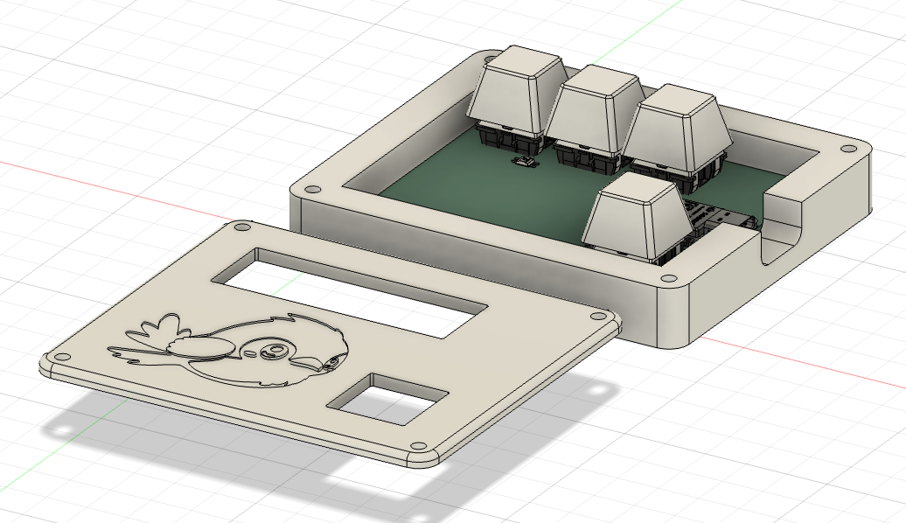
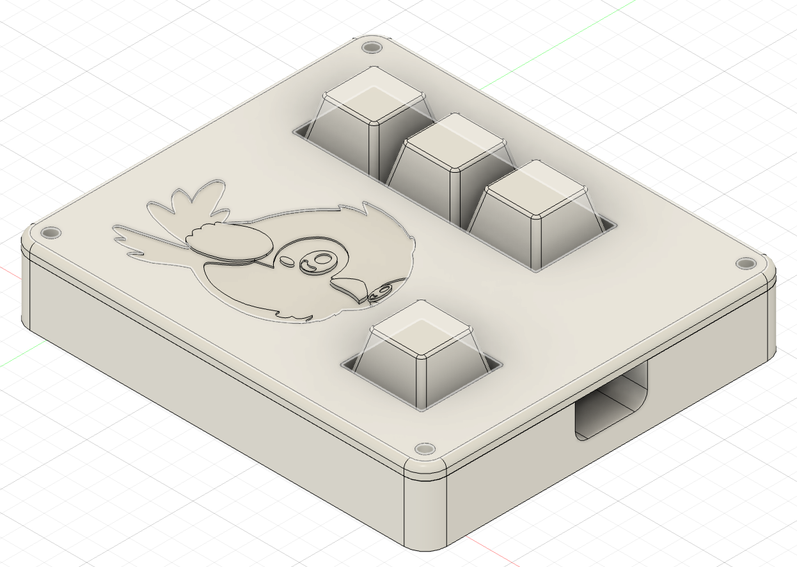
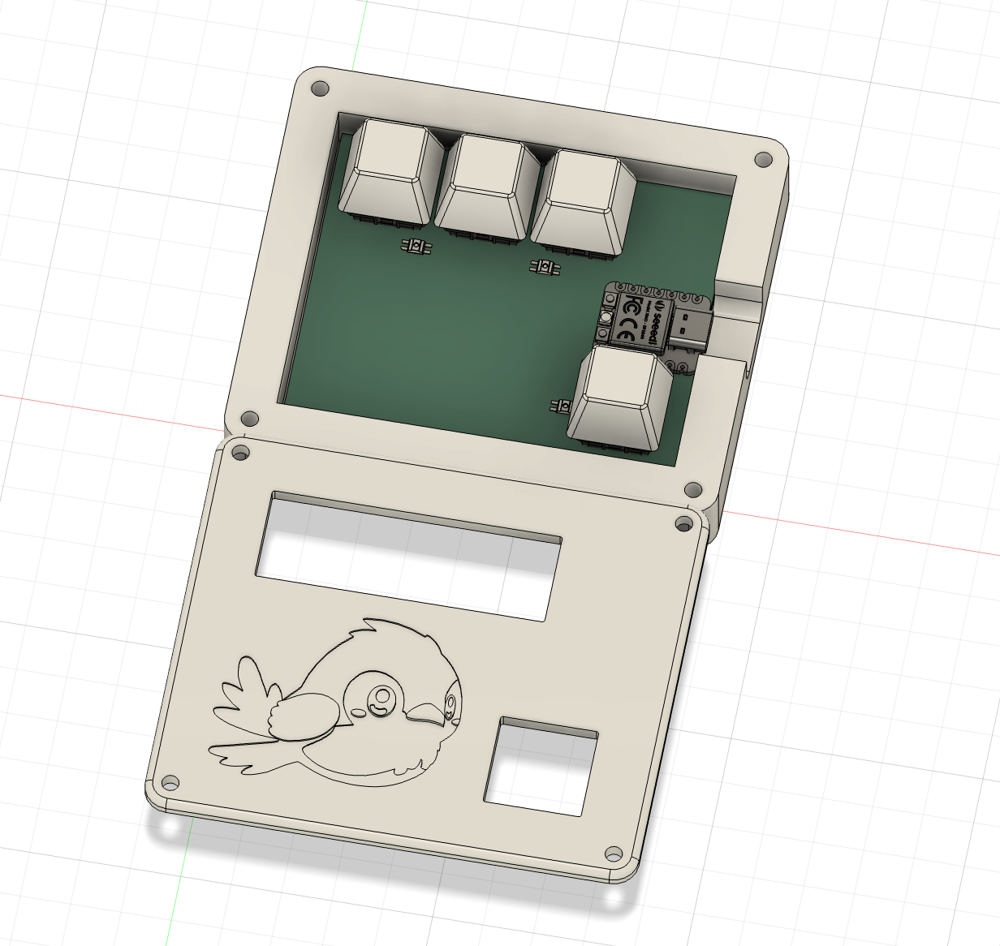
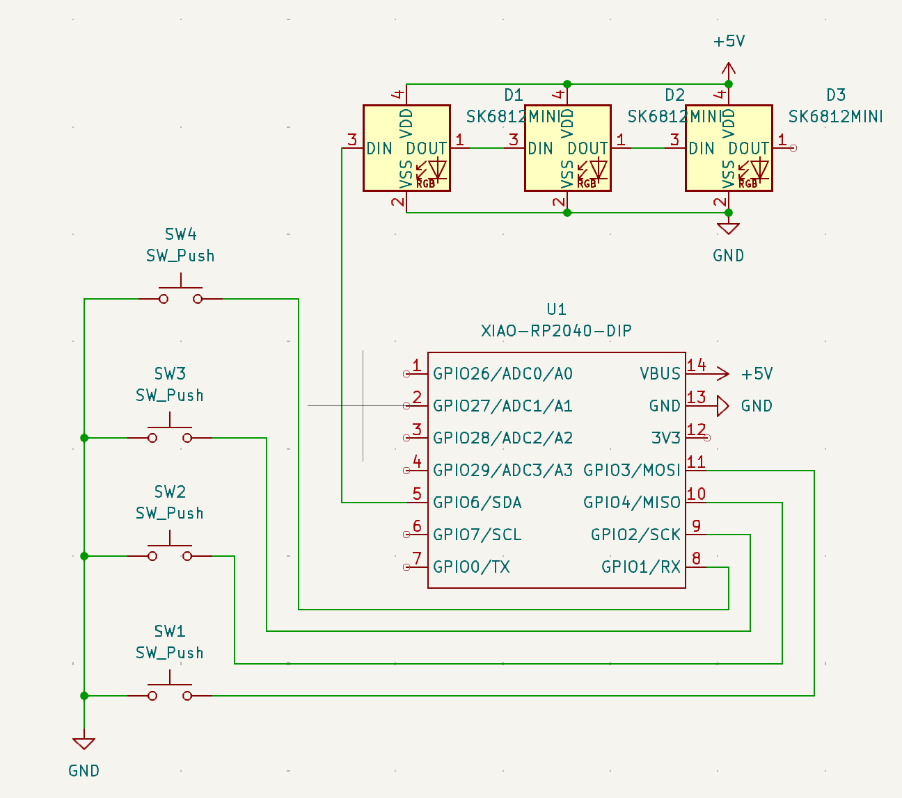
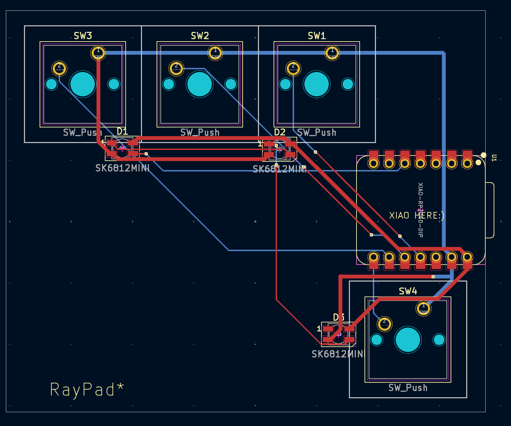

# RayPad\*
RayPad* is a 4-key macropad with 3 LEDs, and uses KMK firmware.

## Features
* 4 keys
* 3 LEDs (diffuse through the case)
* Case: Main body and top cover

## CAD Model
The case has two pieces. The main body, where the PCB is mounted, and the top cover. It is designed in Fusion 360.

## PCB
The PCB is designed in KiCad. It uses the Seeed Studio XIAO RP2040 microcontroller.

##### Schematic:

##### PCB:

## Firmware
The firmware is written in KMK. There are 2 layers: one for basic functions and one for changing the LED modes.

## BOM
* 4x Cherry MX Switches
* 4x DSA Keycaps
* 4x M3x16mm screws
* 4x M3x5x4 heatset inserts
* 3x SK6812MINI LED
* 1x XIAO RP2040
* 1x Case (2 printed parts)
