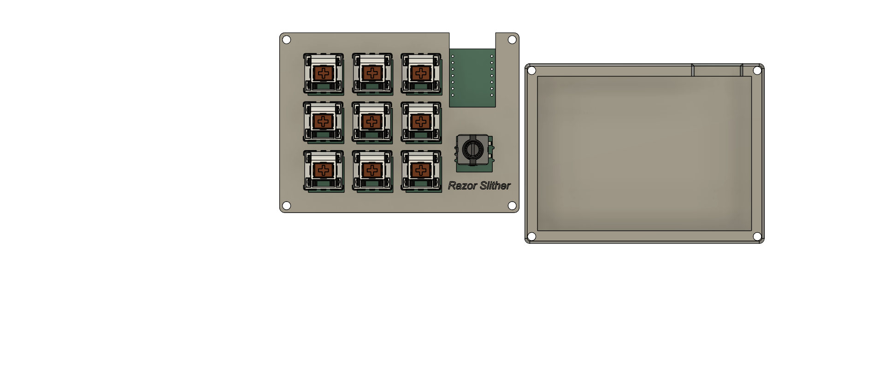
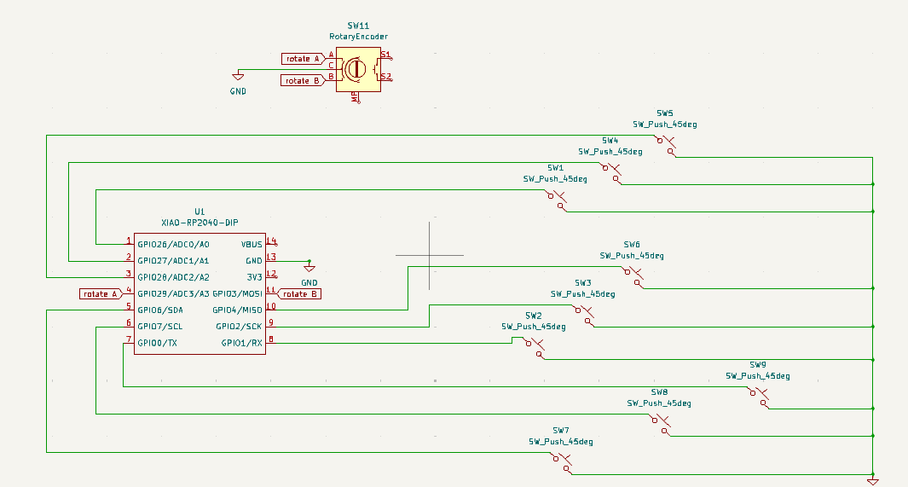
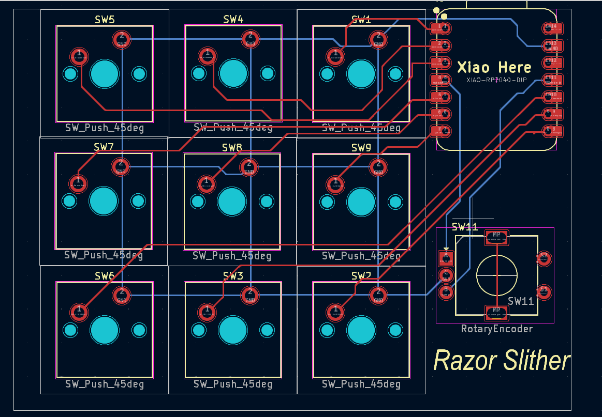
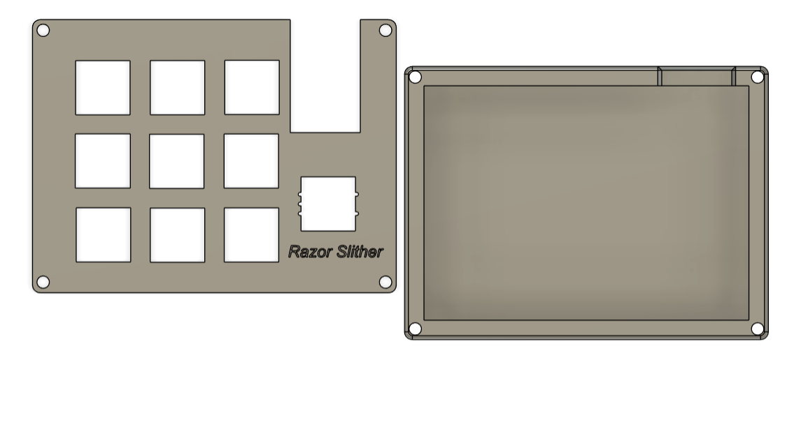

# Razor Slither

# Inspiration
I wanted to create this macropad for doing pixel art. I created a macropad using 1 rp2040, 9 switches, and rotary encoder.

# Challenges
It was really hard for me to do all the routing in the pcb in kicad and the extrude part was also really hard. I had to watch a ton of video guides and even had to ask gemini for help but in the end I somehow made it and I think the end design is really good.

# Specifications:

BOM:

 - 9x Cherry MX Switches
 - 1x XIAO RP2040
 - 4x Blank White DSA Keycaps
 - 3x Blank Red DSA Keycaps
 - 2x Blank Black DSA Keycaps
 - 1x Rotary Encoder
 - 4x M3x16 Bolt
 - 4x M3 Heatset

# Others

 - qmk
 - Top Case.stl
 - Bottom Case.stl

| Schematic | PCB | Case |
|---|---|---|
|  |  |  |

