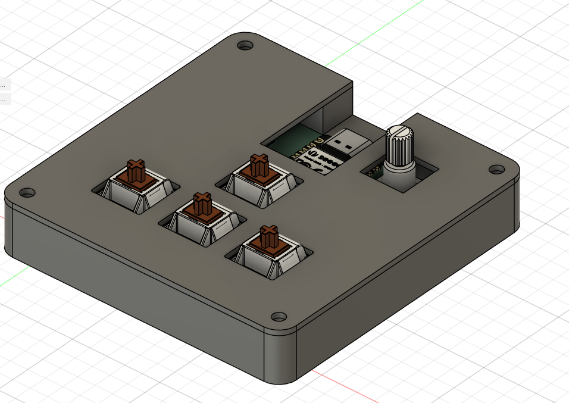
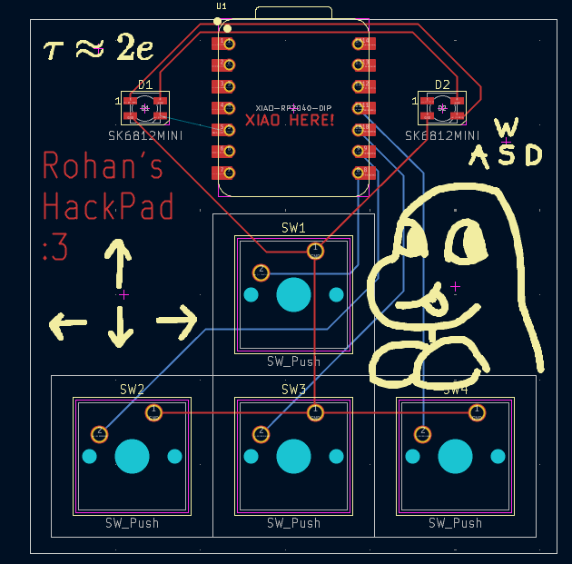
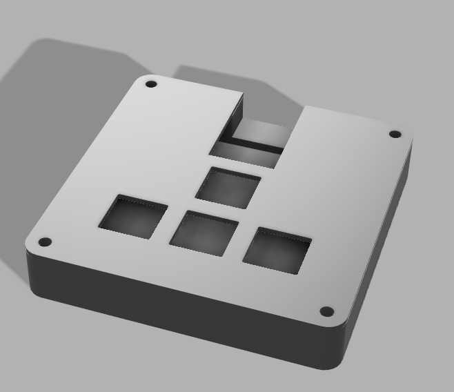

# RohansMacroPad

## What it is
I wanted to follow the tutorial on [hackpad.hackclub.com](hackpad.hackclub.com) accurately and make a macropad.

### Specs
BOM:
- 4x Cherry MX Switches
- 2x SK6812 MINI Leds
- 1x XIAO RP2040
- 4x Blank DSA Keycaps
- 4x M3x16 Bolt
- 4x M3 Heatset

Others:
- KMK - main.py
- Hackpad Base.step
- Hackpad Cover.step

## What it does
Gives me one point on Highway per extra key I will now have to press and make my computer do things.

## What it looks like
This is an image of the PCB plan, from KiCad.

This is an image of the schematic, from KiCad.

This is an image of the Hackpad case.

## How I made it
I followed the tutorial on Hackclub's website! It was very good at teaching me the basics of everything!
I kinda gave up for a few weeks before picking it back up again. I am working on my Summer of Making project at the same time!

I made a big mistake, and tried to submit the same thing as in the tutorial. I missed the part where it specifies that it must be something different, LOL.
I fixed it all up pretty quick after that, though, spending two days making my own unique design and submitting it.
