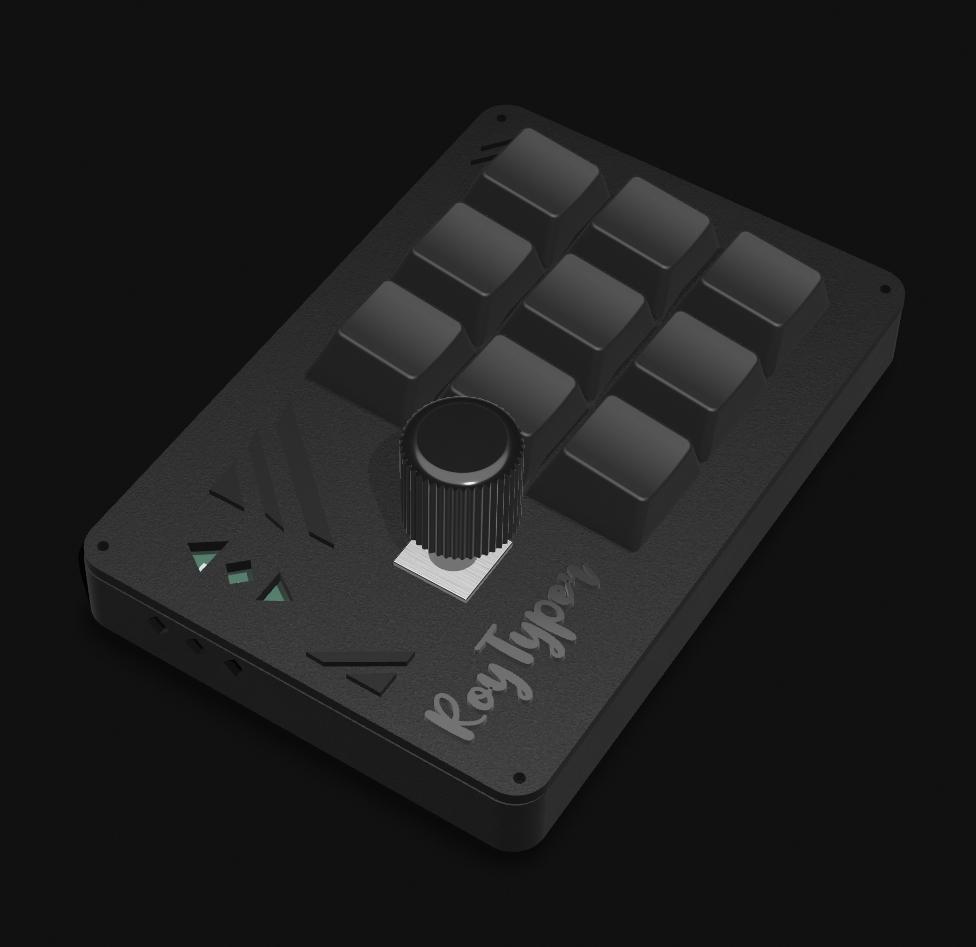
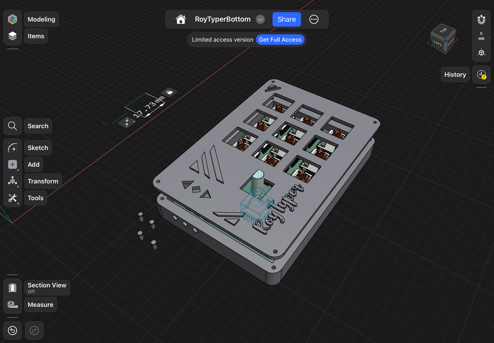
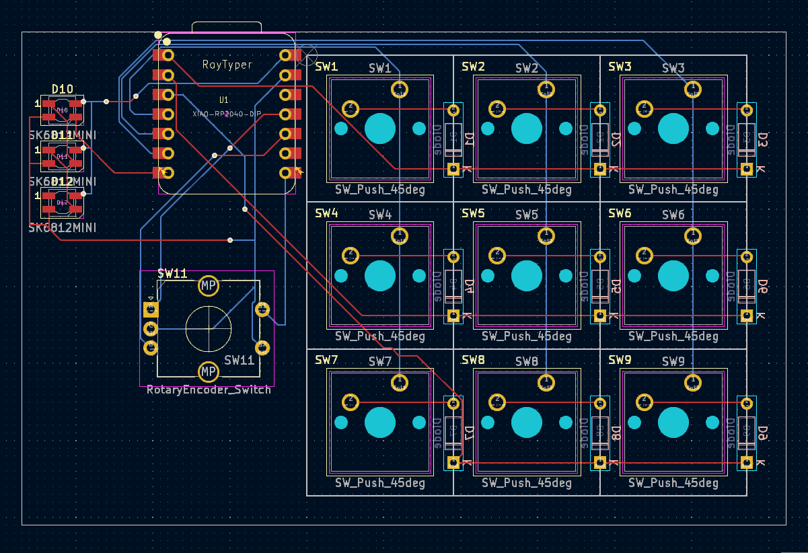
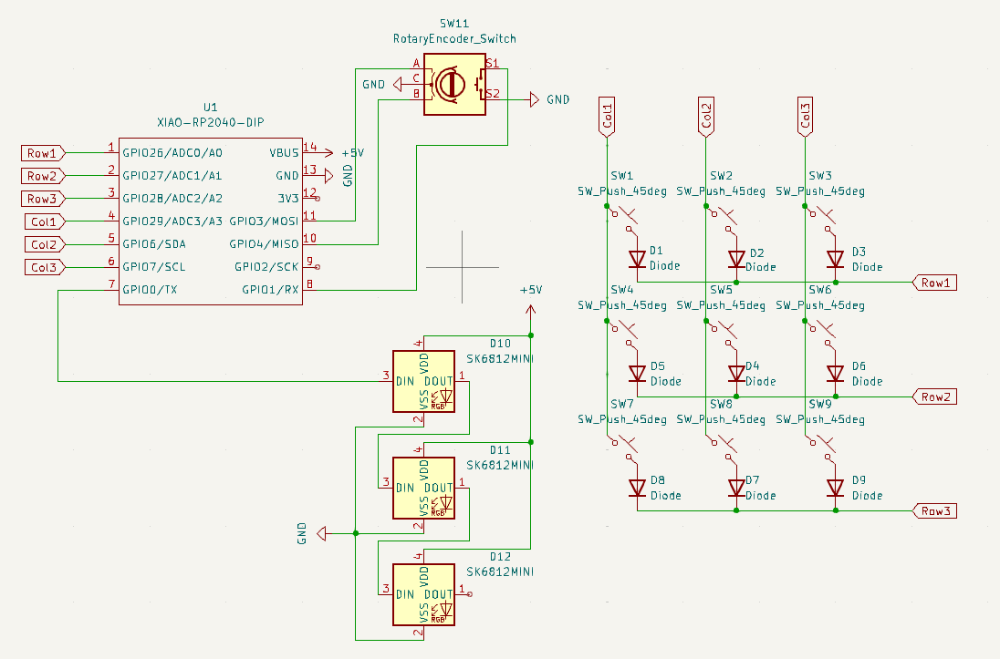

# RoyTyper 

A Custom macropad that I made myself! Its a part of the [hackpad](hackpad.hackclub.com) event by [Hackclub](hackclub.com)!
This is my first ever proper hardware project!

## Features 😎

- Includes RGB lights
- Has 1 rotary encoder, but has multiple functions
- Consists of 9 other keys with cool functions!
- You can control the RGB light brightness too

## What components does it use?

- SK6812 Mini as RGB Lights (x3 of them)
- x1 Rotary Encoder (EC11 Vertical Circular mounted)
- x9 Cherry MX Keys
- x1 XIAO RP2040

## Demo

## What tools did I use?

- [kiCad](https://www.kicad.org/) : For PCB designing
- [shapr3d](https://www.shapr3d.com/) : For Case designing

## Firmware

As of now, the firmware is untested, and is written with [kmk](https://github.com/KMKfw/kmk_firmware/blob/main/docs/en/Getting_Started.md).
Its pretty simple, there are keys to do my most repeated activities, and some include additional functionality discussed below.

## Usage

The RGB lights act kind of like indicators, which indicate 1 of 3 modes.
The first mode is Volume, when all the lights are blue in color. In this mode, the rotary encoder is set to control the volume.

The second mode is Brightness, when all the lights are red in color. In this mode, the rotary encoder 

The third mode is what I call the *Rizz Mode*, in this mode, the RGB lights go crazy and do a rgb color cycle. In this the rotary encoder controls the color brightness.

Except for that the key mapping goes as follows:

| Keys | Action |
| :--- | :--- |
| <kbd>1st</kbd> | Opens Browser |
| <kbd>2nd</kbd> | Opens Youtube |
| <kbd>3rd</kbd> | Opens Slack |
| <kbd>4th</kbd> | Starts Terminal |
| <kbd>5th</kbd> | Kills current  window (qtile) |
| <kbd>6th</kbd> | Full screen toggle (qtile)|
| <kbd>7th</kbd> | macropad mode toggle |
| <kbd>8th</kbd> | Most used sentence |
| <kbd>9th</kbd> | Mouse mode toggle (upcoming feature)|

## Bill of materials

Check BOM.md for that please!

## Inspiration & Challenges

This design is inspired by [this](https://hackclub.slack.com/archives/C07LESGH0B0/p1739321918184579) post on the hackpad channel in Hackclub's slack 
The grills look cool to me, so I thought to make something which uses something similar but better. I also tried to add triangular shapes to give it an aesthetic look. Moreover, I think having too many holes/cutouts in the case will make the macropad more prone to dust, and so rather than making those designs inwards, I made it go outwards.

While making the PCB I had to struggle to get the RGB lights connected properly, I apparently had no idea how they were connected and I made a mess, with some help from other members of the YSWS I was *finally able to complete it!*

## To-Do 🛠️
- Do testing
- Add the mouse mode toggle feature

## Known bugs 🐞
- not yet tested, so no idea:/ , lmk if you find any!

## Contributing 🤝

Everyone is welcome to contribute to the code!

You can also raise an issue, or suggest any features that you think would be great :)

> ✨ Please star this repository if you liked this project 😁
