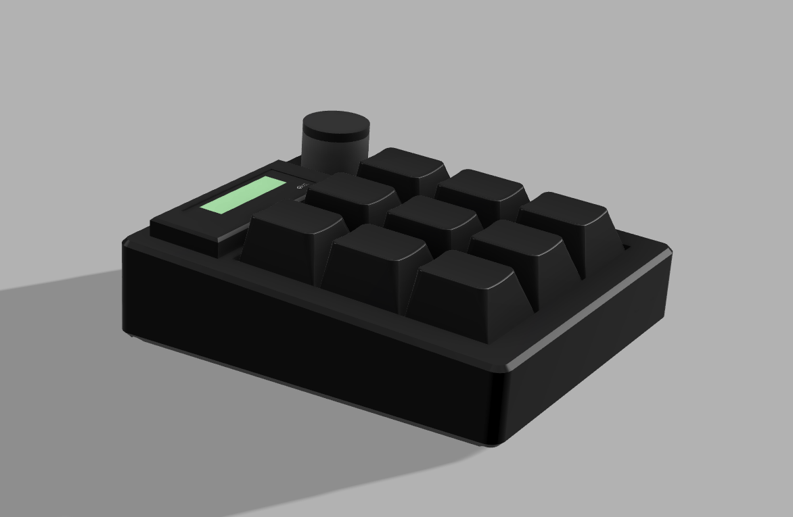

# Scottpad V1
Scottpad V1 is a 3x3 macropad with an OLED display and Multi-Use Volume Knob
-----
I created this macropad because I really liked the design of the [Printed Pad](https://protadesigns.com/products/printed-pad?variant=41279531253817) and the functionality, but I perfer a knob better and to have the screen on the other side. I also wanted it to be more customizable and I plan on updating the firmware to display the weather, news, etc. I plan on also adding the feature where I can update the keymaps when I click on the rotary encoder.
- I faced a lot of challenges, including settling on a design I liked (case)
-----
Bill Of Materials (Per Macropad):
- XIAO RP 2040 (x1)
- Gateron Milky Yellow Switches (x9)
- Mill Max inserts (x18)
- Heatset Inserts (x8)
- EC11 Encoder (x1)
- Through-hole 1N4148 Diodes (x9)
- [128x32 0.91 OLED Display](https://www.lcsc.com/product-detail/OLED-Display_HS-HS91L02W2C01_C5248081.html) (x1)
- Screws (x8)

.png)
