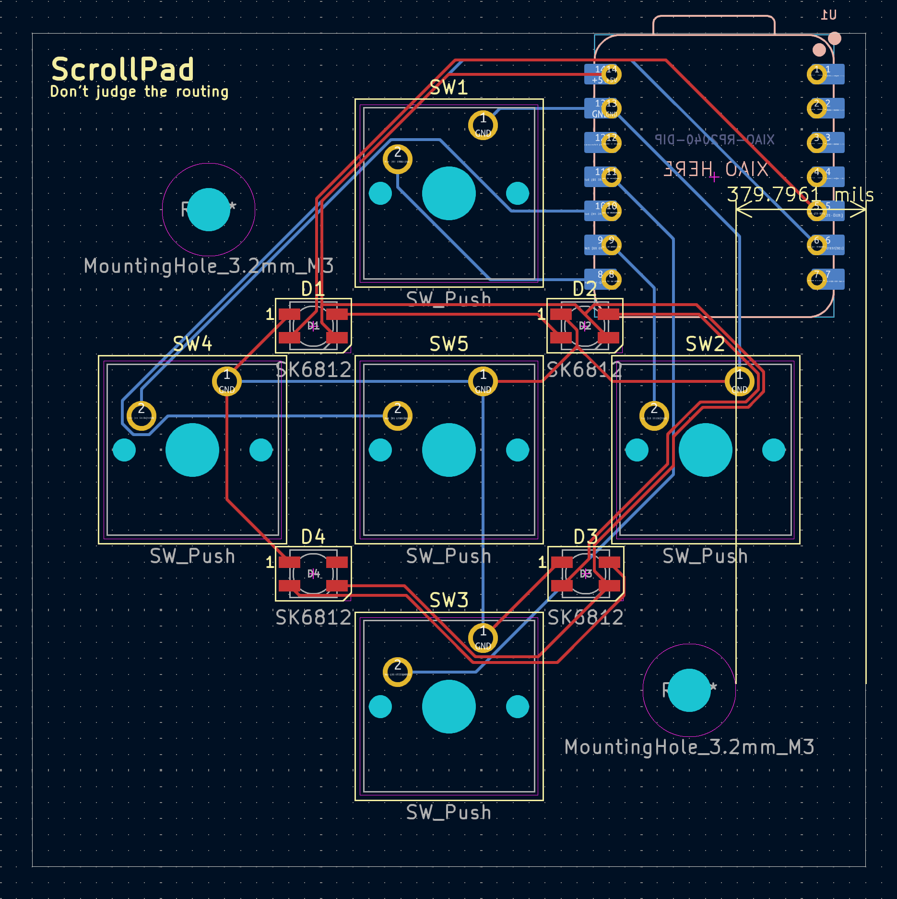

# ScrollPad

ScrollPad lets you control your laptop from anywhere. I keep having to move to my desk when I'm at my workbench, just to scroll down on my laptop, so this is supposed to change that.

## Features

- Mouse scroll keys (Scroll: Left, Right, Up, Down) + enter, for navigation
- Volume and media controls (Previous, Next, Volume Up/Down) when holding down the enter/middle key
- KMK firmware with MouseKeys
- RGB layer indication
- Ikea Skadis Hackpad Holder

## Firmware Overview

The firmware is written in Python using KMK. It uses a dual-layer keymap which can be switched by holding the KC.LT key (the enter/middle key). It also has RGB layer indication.

## PCB

Here's a picture of the schematic and the PCB

Schematic            |  PCB
:-------------------------:|:-------------------------:
  |  

## Case

The case and the Ikea Skadis holder I made in Onshape:

Case            |  Case + Ikea Skadis holder
:-------------------------:|:-------------------------:
  |  

## TODO

I found this YSWS like 2 days before it's end, so I still want to add/change a few things:

- **~~LED Layer Indication:~~**
  ~~LED color should show active layer~~ **Done**

- **~~Mouse Scrolling Functionality:~~**
  ~~Potentially port to QMK in order to use mouse scrolls as control instead of arrow keys~~ **Done with KMK Mouse Keys**

- **~~Change LED position on PCB:~~**
  ~~Move the LEDs so their light isn't blocked by the case~~ **Done**

- **~~Add PCB mounting holes:~~**
  ~~Add M3 mounting holes on the PCB and the case~~ **Done**

- **~~Improve PCB routing:~~**
  ~~Change the PCB routing so it's slightly prettier to look at and work with~~ **Done**

- **~~Fix the case cover:~~**
  ~~Change the x/y of the cover so it actually fits on the base~~ **Done**

- **~~Add PCB spacer:~~**
  ~~Add a spacer that lifts the PCB of the bottom so the port of the chip is reachable~~ **Done**

- **~~Ikea Skadis Holder:~~**
  ~~Create an Ikea Skadis compatible(using the T-nuts mounting system) holder for this HackPad~~ **Done**

## BOM

Approved parts:
- XIAO RP2040
- 5x Cherry MX switches
- 5x DSA keycaps(white)
- 4x SK6812 MINI-E LEDs
- 5x M3x5x4mm heatset inserts