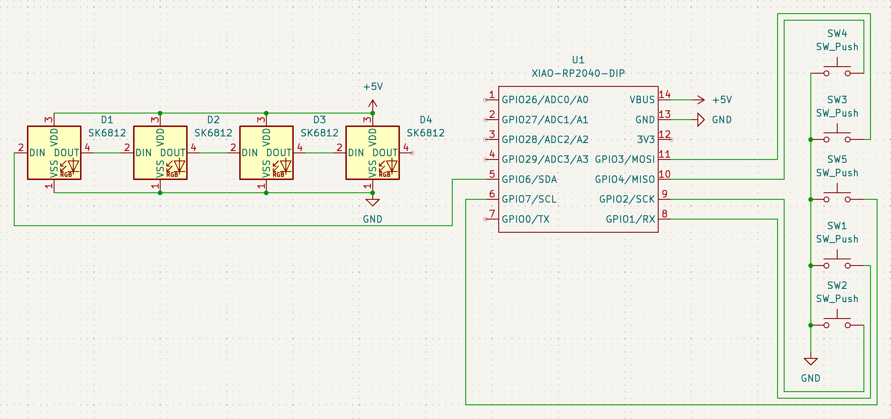
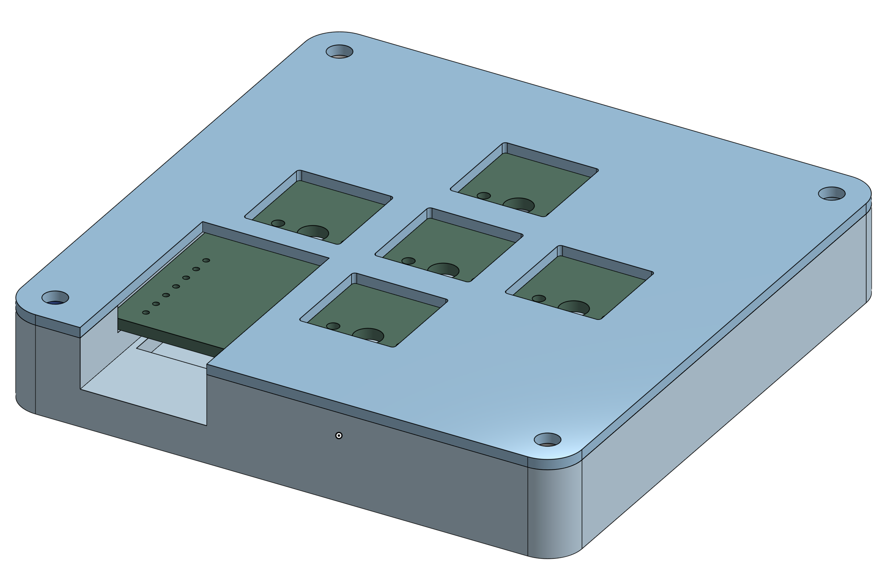

# ScrollPad

ScrollPad lets you control your laptop from anywhere. I keep having to move to my desk from my workbench just to scroll down on my laptop, so this is supposed to change that.

## Features

- Arrow keys (Left, Right, Up, Down) + enter for navigation.
- Volume controls when holding down the enter key
- KMK firmware

## Firmware Overview

The firmware is written in Python using KMK. It sets up a KeysScanner and uses a dual-layer keymap which can be switched by a dual-role key(enter)

## PCB

Here's a picture of the schematic and the PCB

Schematic            |  PCB
:-------------------------:|:-------------------------:
  |  

## Case

The case, I made it with Onshape:

## TODO

I found this YSWS like yesterday, so I still want to add/change a few things:

- **LED Layer Indication:**  
  LED color should show active layer

- **Mouse Scrolling Functionality:**  
  Potentially port to QMK in order to use mouse scrolls as control instead of arrow keys

- **Ikea Skadis Holder:**  
  Create an Ikea Skadis compatible(using T-nuts) holder for this HackPad

## BOM

Approved parts:
- XIAO RP2040
- 5x MX switches
- 4x SK6812 MINI-E LEDs
- 8x M3x5mx4mm heatset inserts
