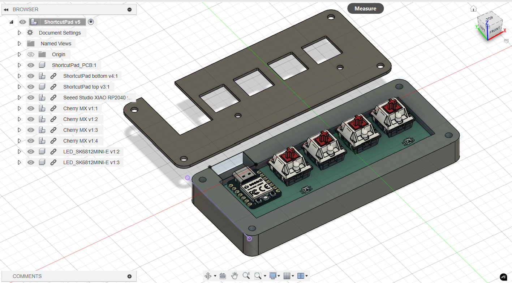
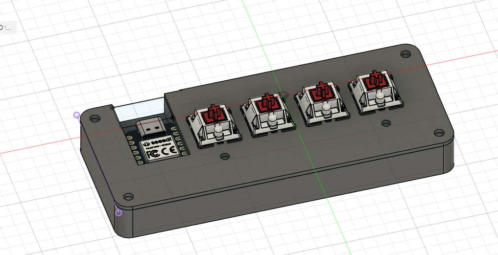
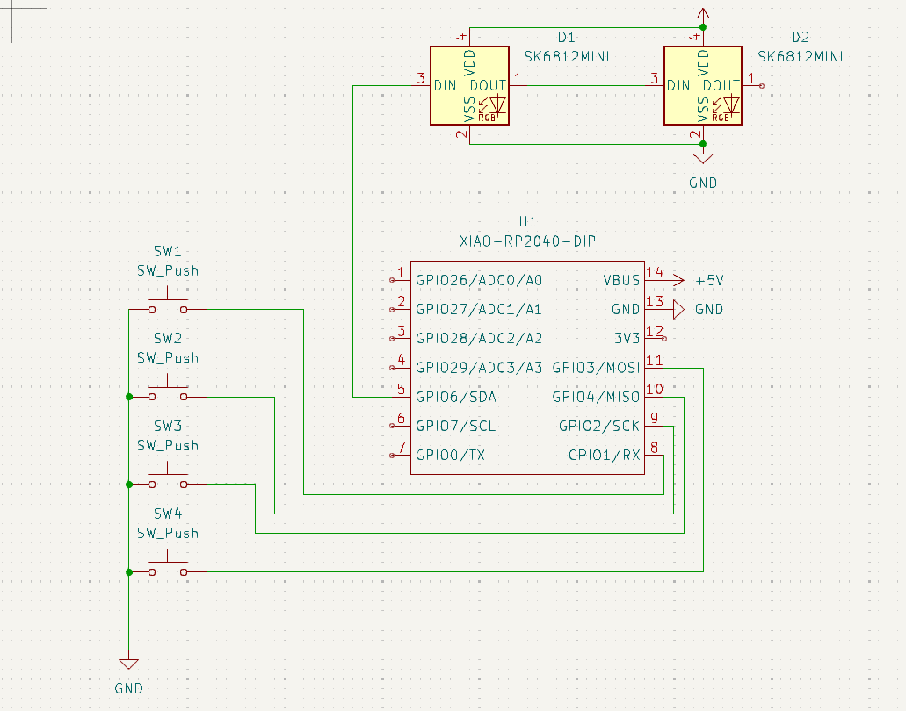
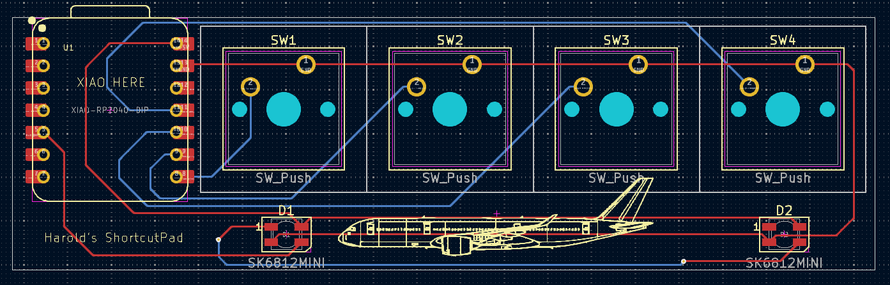

# ShortcutPad
ShortcutPad is a 4 key macropad with 2 LEDs and uses KMK firmware.

It is my first PCB design project and is a submission to the Hackpad YSWS program.

I decided to take part of this program to learn how to design PCBs and make CAD models in Fusion. I have taken inspiration from Taran Van Hemert's obsession with macros to try using macros in my own computing usage. During this process, I had to restart my KiCad project multiple times due to random issues that I just didn't account for, and I was too lazy to figure out how to just fix those issues. I also have no clue how pull requests work.

# CAD:
Everything fits together using 4 M3 bolts and heatset inserts. It consists of 2 separate pieces, a bottom and a top case.

Created in Fusion360.

# Schematic:
The schematic is created in KiCad. The XIAO symbol is imported from the Seeed OPL library.

# PCB

The PCB is also designed in KiCad. The XIAO footprint is imported from the Seeed OPL library.

The plane at the bottom of the macropad is an Airbus A350-900.

# Firmware 
The firmware of this ShortcutPad is made using KMK in Python. Currently, the firmware only has the keys set to trigger certain letter presses as I have not decided what shortcuts the keys should perform yet.

# Parts needed
- PCB
- Case (2 printed Parts)
- Soldering iron
- 1x Seeed XIAO RP2040
- 4x Blank DSA Keycaps
- 4x M3x16mm screws
- 4x M3x5mx4mm heatset inserts
- 2x SK6812 MINI-E LEDs