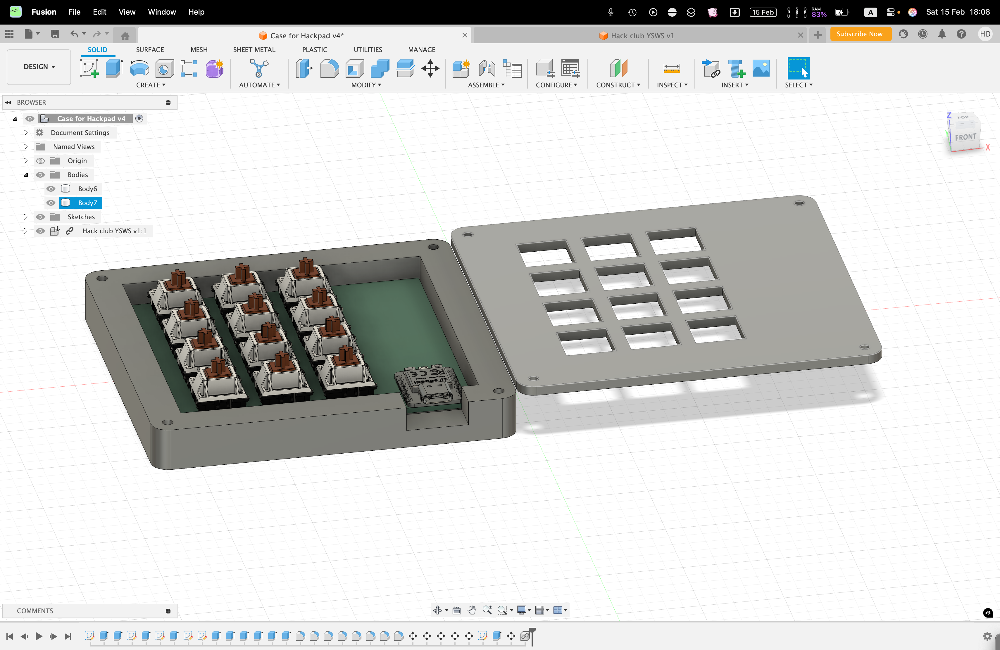
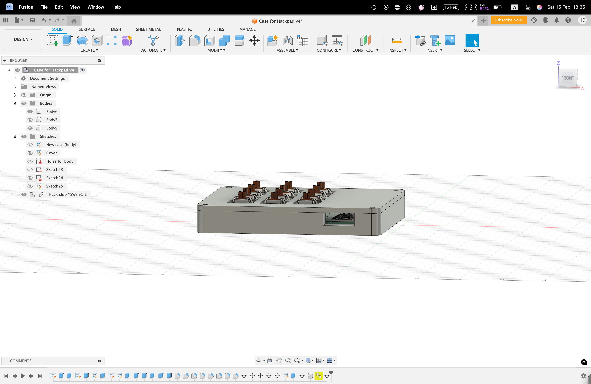
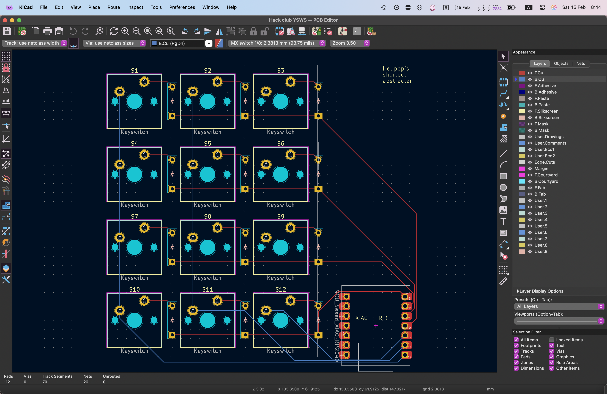

This project made me learn fusion 360, which I hope is (and want it to be) the temporary platform before I switch to Blender.

**Inspiration**:
I use a macbook, which is notorious for its keyboard being shiny due to use over time. I wanted to create a macropad that can remove some of the stress by using it to type in my keyboard shortcuts. 

**Challenges**:
Getting the right size for the keys were a challenge for me. I had to redo the drill holes because they were placed wrongly. I think soldering might be another challenge, but I will find out in the future.

BOM:

- 1x SEEEDUINO XIAO RP2040
- 14x Cherry MX Purple Switches (from Glarses, please use [this](https://ktechs.store/products/cherry-purple-tactile-switches) if possible)
- 14x 1N4148 diodes
- 4x M3x16mm screws
- 4x M3 hex nuts
- 7x Neon Green DSA Keycaps for MX Compatible Switches (please use [this](https://www.adafruit.com/product/5015) if possible)
- 7x Dark Blue DSA Keycaps for MX Compatible Switches (please use [this](https://www.adafruit.com/product/5016) if possible)

(Extras for backup)
