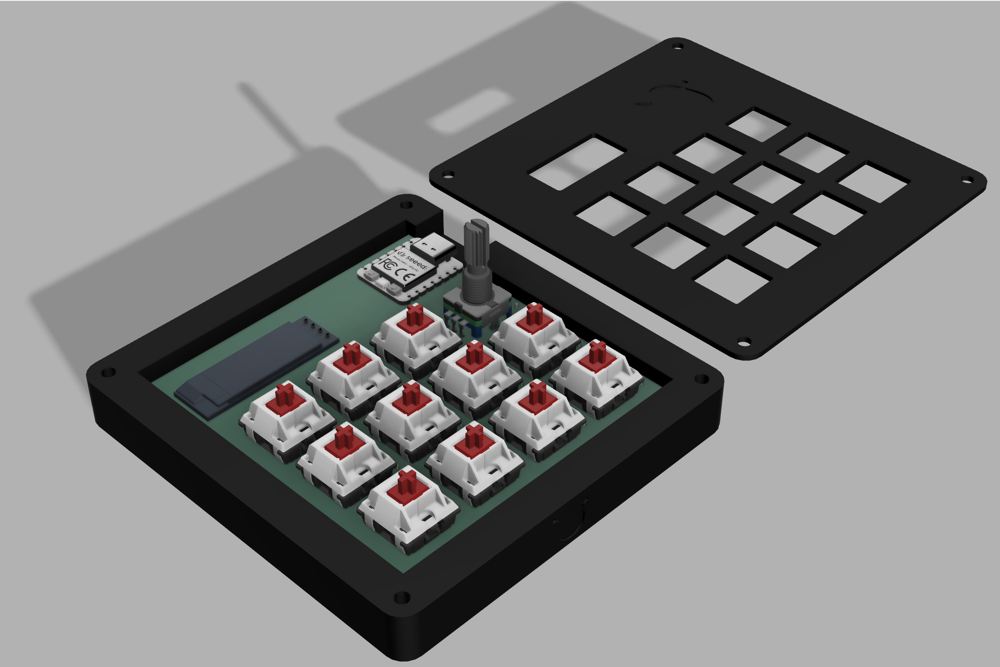
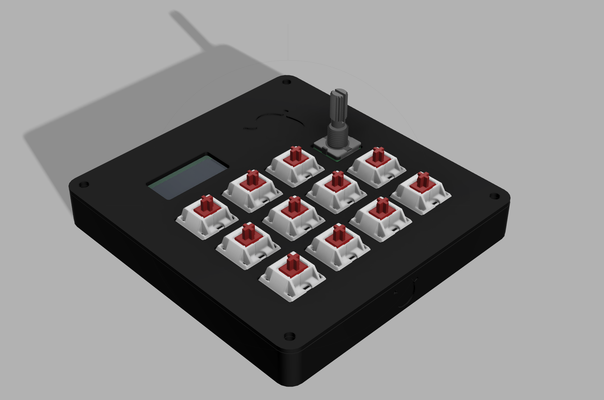
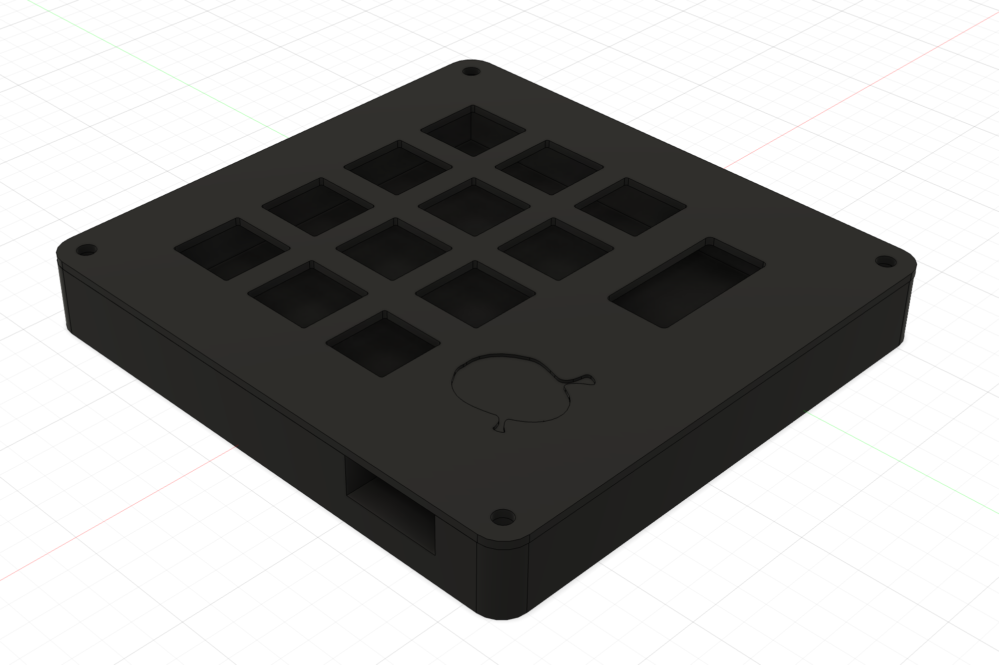
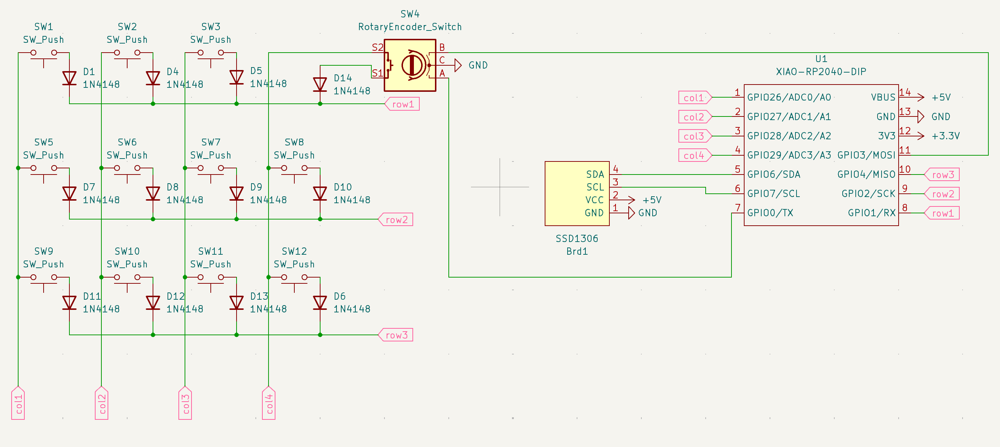
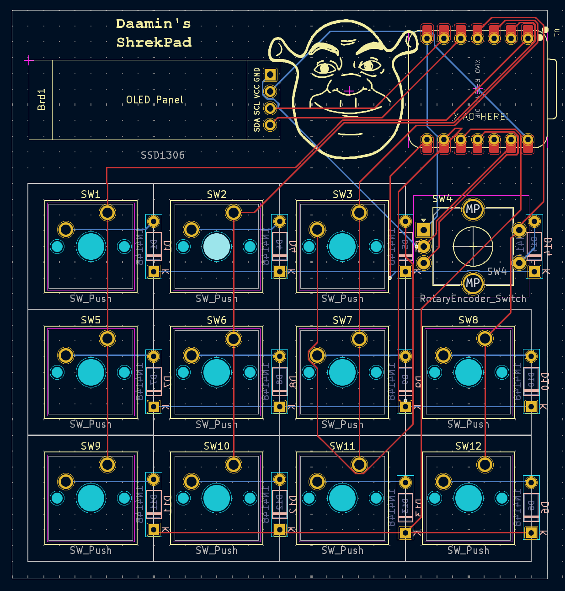
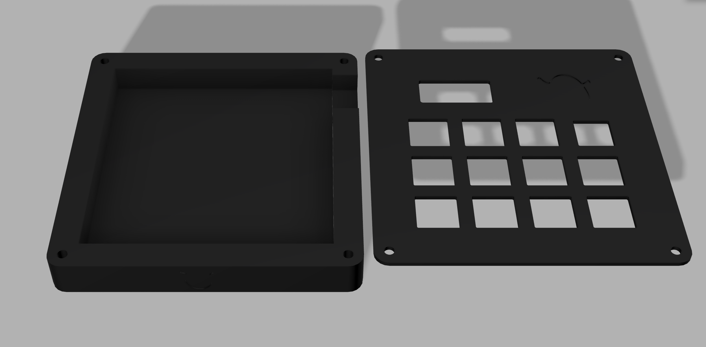

# Daamin's ShrekPad

### Inspiration

I wanted to boost my productivity and add an aesthetic looking device to my desk setup.

### Challenges

Believe it or not, this was my first time using Fusion 360! I spammed ChatGPT and #hackpad with queries. It also took me a lotta time making the PCB and routing it 😭. I had to reroute a hundred times.

### Specifications

BOM:

- 11x Blank DSA Keycaps (6x Black, 3x White, 2x Red)
- 11x Cherry MX Switches
- 12x 1N4148 diodes
- 1x XIAO RP2040
- 4x M3x16 Bolt
- 4x M3 Heatset
- 1x SSD1306 128x32 0.91" OLED (5V VCC, 3.3V logic, I2C)
- 1x EC11 Rotary Encoder
- 1x PCB
- 1x Case (I would like both the TOP and BOTTOM to be printed in Black, if not available: Message me @Daamin on Slack)

Others:

- KMK Firmware
- TOP.step
- BOTTOM.step

|           Schematic            |           PCB            |            Case            |
| :----------------------------: | :----------------------: | :------------------------: |
|  |  |  |
