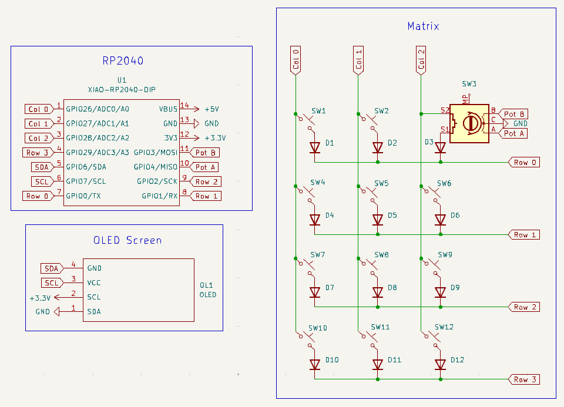
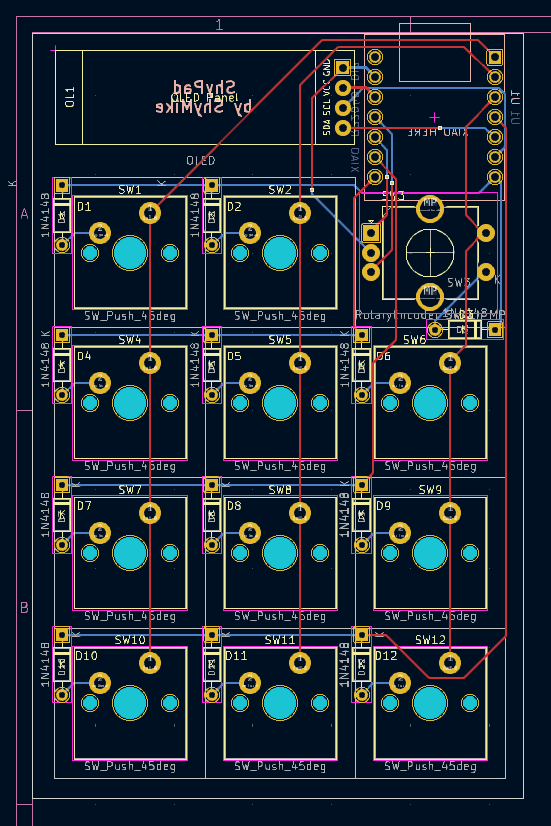

# ShyPad

ShyPad is a simple 11 key macropad with a rotary encoder and an OLED display.
The hardest part about this project was the case design and using a parametric 3D modeling software for the first time.

## BOM

- 1x Seeed XIAO RP2040 Microcontroller
- 11x MX-Style switches
- 11x Blank DSA keycaps
- 1x EC11 Rotary encoder
- 12x Through-hole 1N4148 Diodes
- 1x 0.91 inch SSD1306 OLED
- 1x 3D Printed Case + Knob (All black if possible)
- 1x PCB

## Preview


Schematic            |  PCB         |   3D PCB
:-------------------------:|:-------------------------:|:-------------------------:|
|  |  |  |

## Case

```stl
solid ASCII
  facet normal 9.996827e-01 -2.518734e-02 0.000000e+00
    outer loop
      vertex   6.780000e+01 -2.000000e+00 1.300000e+01
      vertex   6.778673e+01 -2.526614e+00 1.300000e+01
      vertex   6.780000e+01 -2.000000e+00 0.000000e+00
    endloop
  endfacet
  facet normal 9.996814e-01 -2.523924e-02 -2.103599e-06
    outer loop
      vertex   6.780000e+01 -2.000000e+00 0.000000e+00
      vertex   6.778673e+01 -2.526614e+00 1.300000e+01
      vertex   6.778666e+01 -2.528512e+00 0.000000e+00
    endloop
  endfacet
  facet normal 9.935522e-01 -1.133752e-01 1.079969e-05
    outer loop
      vertex   6.778666e+01 -2.528512e+00 0.000000e+00
      vertex   6.778673e+01 -2.526614e+00 1.300000e+01
      vertex   6.775522e+01 -2.802766e+00 1.300000e+01
    endloop
  endfacet
  facet normal 9.934772e-01 -1.140308e-01 -3.213747e-06
    outer loop
      vertex   6.778666e+01 -2.528512e+00 0.000000e+00
      vertex   6.775522e+01 -2.802766e+00 1.300000e+01
      vertex   6.775496e+01 -2.804633e+00 0.000000e+00
    endloop
  endfacet
  facet normal 9.776017e-01 -2.104634e-01 1.095039e-05
    outer loop
      vertex   6.775496e+01 -2.804633e+00 0.000000e+00
      vertex   6.775522e+01 -2.802766e+00 1.300000e+01
      vertex   6.769385e+01 -3.087809e+00 1.300000e+01
    endloop
  endfacet
  facet normal 9.769245e-01 -2.135851e-01 -6.023142e-05
    outer loop
      vertex   6.775496e+01 -2.804633e+00 0.000000e+00
      vertex   6.769385e+01 -3.087809e+00 1.300000e+01
      vertex   6.769013e+01 -3.101163e+00 0.000000e+00
    endloop
  endfacet
  facet normal 9.462385e-01 -3.234699e-01 6.142815e-05
    outer loop
      vertex   6.769013e+01 -3.101163e+00 0.000000e+00
      vertex   6.769385e+01 -3.087809e+00 1.300000e+01
      vertex   6.759554e+01 -3.375396e+00 1.300000e+01
    endloop
  endfacet
  facet normal 9.416726e-01 -3.365303e-01 -2.473008e-04
    outer loop
      vertex   6.769013e+01 -3.101163e+00 0.000000e+00
      vertex   6.759554e+01 -3.375396e+00 1.300000e+01
      vertex   6.757516e+01 -3.422876e+00 0.000000e+00
    endloop
  endfacet
  facet normal 8.992128e-01 -4.375115e-01 1.880865e-04
    outer loop
      vertex   6.757516e+01 -3.422876e+00 0.000000e+00
      vertex   6.759554e+01 -3.375396e+00 1.300000e+01
      vertex   6.746296e+01 -3.647903e+00 1.300000e+01
    endloop
  endfacet
  facet normal 8.829801e-01 -4.694101e-01 -5.041779e-04
    outer loop
      vertex   6.757516e+01 -3.422876e+00 0.000000e+00
      vertex   6.746296e+01 -3.647903e+00 1.300000e+01
      vertex   6.739945e+01 -3.753388e+00 0.000000e+00
    endloop
  endfacet
  facet normal 8.391639e-01 -5.438785e-01 3.141075e-04
    outer loop
      vertex   6.739945e+01 -3.753388e+00 0.000000e+00
      vertex   6.746296e+01 -3.647903e+00 1.300000e+01
      vertex   6.729601e+01 -3.905491e+00 1.300000e+01
    endloop
  endfacet
  facet normal 8.072166e-01 -5.902551e-01 -4.827273e-04
    outer loop
      vertex   6.739945e+01 -3.753388e+00 0.000000e+00
      vertex   6.729601e+01 -3.905491e+00 1.300000e+01
      vertex   6.718565e+01 -4.045774e+00 0.000000e+00
    endloop
  endfacet
  facet normal 7.700537e-01 -6.379790e-01 3.477238e-04
    outer loop
      vertex   6.718565e+01 -4.045774e+00 0.000000e+00
      vertex   6.729601e+01 -3.905491e+00 1.300000e+01
      vertex   6.709313e+01 -4.150369e+00 1.300000e+01
    endloop
  endfacet
  facet normal 7.245627e-01 -6.892088e-01 -3.882386e-04
    outer loop
      vertex   6.718565e+01 -4.045774e+00 0.000000e+00
      vertex   6.709313e+01 -4.150369e+00 1.300000e+01
      vertex   6.695037e+01 -4.293129e+00 0.000000e+00
    endloop
  endfacet
  facet normal 6.892088e-01 -7.245627e-01 3.882386e-04
    outer loop
      vertex   6.695037e+01 -4.293129e+00 0.000000e+00
      vertex   6.709313e+01 -4.150369e+00 1.300000e+01
      vertex   6.684577e+01 -4.385655e+00 1.300000e+01
    endloop
  endfacet
  facet normal 6.379790e-01 -7.700537e-01 -3.477238e-04
    outer loop
      vertex   6.695037e+01 -4.293129e+00 0.000000e+00
      vertex   6.684577e+01 -4.385655e+00 1.300000e+01
      vertex   6.670549e+01 -4.496007e+00 0.000000e+00
    endloop
  endfacet
  facet normal 5.902551e-01 -8.072166e-01 4.827273e-04
    outer loop
      vertex   6.670549e+01 -4.496007e+00 0.000000e+00
      vertex   6.684577e+01 -4.385655e+00 1.300000e+01
      vertex   6.655339e+01 -4.599454e+00 1.300000e+01
    endloop
  endfacet
  facet normal 5.438785e-01 -8.391639e-01 -3.141075e-04
    outer loop
      vertex   6.670549e+01 -4.496007e+00 0.000000e+00
      vertex   6.655339e+01 -4.599454e+00 1.300000e+01
      vertex   6.644790e+01 -4.662955e+00 0.000000e+00
    endloop
  endfacet
  facet normal 4.694101e-01 -8.829801e-01 5.041779e-04
    outer loop
      vertex   6.644790e+01 -4.662955e+00 0.000000e+00
      vertex   6.655339e+01 -4.599454e+00 1.300000e+01
      vertex   6.622288e+01 -4.775161e+00 1.300000e+01
    endloop
  endfacet
  facet normal 4.375115e-01 -8.992128e-01 -1.880865e-04
    outer loop
      vertex   6.644790e+01 -4.662955e+00 0.000000e+00
      vertex   6.622288e+01 -4.775161e+00 1.300000e+01
      vertex   6.617540e+01 -4.795543e+00 0.000000e+00
    endloop
  endfacet
  facet normal 3.365303e-01 -9.416726e-01 2.473008e-04
    outer loop
      vertex   6.617540e+01 -4.795543e+00 0.000000e+00
      vertex   6.622288e+01 -4.775161e+00 1.300000e+01
      vertex   6.590116e+01 -4.890133e+00 1.300000e+01
    endloop
  endfacet
  facet normal 3.234699e-01 -9.462385e-01 -6.142815e-05
    outer loop
      vertex   6.617540e+01 -4.795543e+00 0.000000e+00
      vertex   6.590116e+01 -4.890133e+00 1.300000e+01
      vertex   6.588781e+01 -4.893854e+00 0.000000e+00
    endloop
  endfacet
  facet normal 2.135851e-01 -9.769245e-01 6.023142e-05
    outer loop
      vertex   6.588781e+01 -4.893854e+00 0.000000e+00
      vertex   6.590116e+01 -4.890133e+00 1.300000e+01
      vertex   6.560463e+01 -4.954963e+00 1.300000e+01
    endloop
  endfacet
  facet normal 2.104634e-01 -9.776017e-01 -1.095039e-05
    outer loop
      vertex   6.588781e+01 -4.893854e+00 0.000000e+00
      vertex   6.560463e+01 -4.954963e+00 1.300000e+01
      vertex   6.560277e+01 -4.955220e+00 0.000000e+00
    endloop
  endfacet
  facet normal 1.140308e-01 -9.934772e-01 3.213747e-06
    outer loop
      vertex   6.560277e+01 -4.955220e+00 0.000000e+00
      vertex   6.560463e+01 -4.954963e+00 1.300000e+01
      vertex   6.532851e+01 -4.986657e+00 1.300000e+01
    endloop
  endfacet
  facet normal 1.133752e-01 -9.935522e-01 -1.079969e-05
    outer loop
      vertex   6.560277e+01 -4.955220e+00 0.000000e+00
      vertex   6.532851e+01 -4.986657e+00 1.300000e+01
      vertex   6.532661e+01 -4.986732e+00 0.000000e+00
    endloop
  endfacet
  facet normal 2.523924e-02 -9.996814e-01 2.103599e-06
    outer loop
      vertex   6.532661e+01 -4.986732e+00 0.000000e+00
      vertex   6.532851e+01 -4.986657e+00 1.300000e+01
      vertex   6.480000e+01 -5.000000e+00 1.300000e+01
    endloop
  endfacet
  facet normal 2.518734e-02 -9.996827e-01 0.000000e+00
    outer loop
      vertex   6.532661e+01 -4.986732e+00 0.000000e+00
      vertex   6.480000e+01 -5.000000e+00 1.300000e+01
      vertex   6.480000e+01 -5.000000e+00 0.000000e+00
    endloop
  endfacet
  facet normal 1.000000e+00 0.000000e+00 0.000000e+00
    outer loop
      vertex   6.780000e+01 -2.000000e+00 0.000000e+00
      vertex   6.780000e+01 9.960000e+01 0.000000e+00
      vertex   6.780000e+01 -2.000000e+00 1.300000e+01
    endloop
  endfacet
  facet normal 1.000000e+00 -0.000000e+00 0.000000e+00
    outer loop
      vertex   6.780000e+01 -2.000000e+00 1.300000e+01
      vertex   6.780000e+01 9.960000e+01 0.000000e+00
      vertex   6.780000e+01 9.960000e+01 1.300000e+01
    endloop
  endfacet
  facet normal -0.000000e+00 0.000000e+00 -1.000000e+00
    outer loop
      vertex   6.778666e+01 -2.528512e+00 0.000000e+00
      vertex   6.757516e+01 -3.422876e+00 0.000000e+00
      vertex   6.780000e+01 -2.000000e+00 0.000000e+00
    endloop
  endfacet
  facet normal 0.000000e+00 0.000000e+00 -1.000000e+00
    outer loop
      vertex   6.780000e+01 -2.000000e+00 0.000000e+00
      vertex   6.757516e+01 -3.422876e+00 0.000000e+00
      vertex   6.739945e+01 -3.753388e+00 0.000000e+00
    endloop
  endfacet
  facet normal 0.000000e+00 0.000000e+00 -1.000000e+00
    outer loop
      vertex   6.780000e+01 -2.000000e+00 0.000000e+00
      vertex   6.739945e+01 -3.753388e+00 0.000000e+00
      vertex   6.718565e+01 -4.045774e+00 0.000000e+00
    endloop
  endfacet
  facet normal 0.000000e+00 0.000000e+00 -1.000000e+00
    outer loop
      vertex   6.778666e+01 -2.528512e+00 0.000000e+00
      vertex   6.775496e+01 -2.804633e+00 0.000000e+00
      vertex   6.757516e+01 -3.422876e+00 0.000000e+00
    endloop
  endfacet
  facet normal 0.000000e+00 0.000000e+00 -1.000000e+00
    outer loop
      vertex   6.757516e+01 -3.422876e+00 0.000000e+00
      vertex   6.775496e+01 -2.804633e+00 0.000000e+00
      vertex   6.769013e+01 -3.101163e+00 0.000000e+00
    endloop
  endfacet
  facet normal -0.000000e+00 0.000000e+00 -1.000000e+00
    outer loop
      vertex   6.718565e+01 -4.045774e+00 0.000000e+00
      vertex   6.695037e+01 -4.293129e+00 0.000000e+00
      vertex   6.780000e+01 -2.000000e+00 0.000000e+00
    endloop
  endfacet
  facet normal 0.000000e+00 0.000000e+00 -1.000000e+00
    outer loop
      vertex   6.780000e+01 -2.000000e+00 0.000000e+00
      vertex   6.695037e+01 -4.293129e+00 0.000000e+00
      vertex   6.670549e+01 -4.496007e+00 0.000000e+00
    endloop
  endfacet
  facet normal 0.000000e+00 0.000000e+00 -1.000000e+00
    outer loop
      vertex   6.780000e+01 -2.000000e+00 0.000000e+00
      vertex   6.670549e+01 -4.496007e+00 0.000000e+00
      vertex   6.644790e+01 -4.662955e+00 0.000000e+00
    endloop
  endfacet
  facet normal -0.000000e+00 0.000000e+00 -1.000000e+00
    outer loop
      vertex   6.644790e+01 -4.662955e+00 0.000000e+00
      vertex   6.617540e+01 -4.795543e+00 0.000000e+00
      vertex   6.780000e+01 -2.000000e+00 0.000000e+00
    endloop
  endfacet
  facet normal 0.000000e+00 0.000000e+00 -1.000000e+00
    outer loop
      vertex   6.780000e+01 -2.000000e+00 0.000000e+00
      vertex   6.617540e+01 -4.795543e+00 0.000000e+00
      vertex   6.588781e+01 -4.893854e+00 0.000000e+00
    endloop
  endfacet
  facet normal 0.000000e+00 0.000000e+00 -1.000000e+00
    outer loop
      vertex   6.780000e+01 -2.000000e+00 0.000000e+00
      vertex   6.588781e+01 -4.893854e+00 0.000000e+00
      vertex   6.560277e+01 -4.955220e+00 0.000000e+00
    endloop
  endfacet
  facet normal -0.000000e+00 0.000000e+00 -1.000000e+00
    outer loop
      vertex   6.560277e+01 -4.955220e+00 0.000000e+00
      vertex   6.532661e+01 -4.986732e+00 0.000000e+00
      vertex   6.780000e+01 -2.000000e+00 0.000000e+00
    endloop
  endfacet
  facet normal 0.000000e+00 0.000000e+00 -1.000000e+00
    outer loop
      vertex   6.780000e+01 -2.000000e+00 0.000000e+00
      vertex   6.532661e+01 -4.986732e+00 0.000000e+00
      vertex   6.480000e+01 -5.000000e+00 0.000000e+00
    endloop
  endfacet
  facet normal -0.000000e+00 0.000000e+00 -1.000000e+00
    outer loop
      vertex   6.780000e+01 -2.000000e+00 0.000000e+00
      vertex   6.480000e+01 -5.000000e+00 0.000000e+00
      vertex   3.388882e+01 3.823385e+01 0.000000e+00
    endloop
  endfacet
  facet normal 0.000000e+00 -0.000000e+00 -1.000000e+00
    outer loop
      vertex   3.388882e+01 3.823385e+01 0.000000e+00
      vertex   6.480000e+01 -5.000000e+00 0.000000e+00
      vertex   3.381473e+01 3.801043e+01 0.000000e+00
    endloop
  endfacet
  facet normal 0.000000e+00 -0.000000e+00 -1.000000e+00
    outer loop
      vertex   3.381473e+01 3.801043e+01 0.000000e+00
      vertex   6.480000e+01 -5.000000e+00 0.000000e+00
      vertex   3.372266e+01 3.782712e+01 0.000000e+00
    endloop
  endfacet
  facet normal 0.000000e+00 -0.000000e+00 -1.000000e+00
    outer loop
      vertex   3.372266e+01 3.782712e+01 0.000000e+00
      vertex   6.480000e+01 -5.000000e+00 0.000000e+00
      vertex   3.361310e+01 3.765787e+01 0.000000e+00
    endloop
  endfacet
  facet normal 0.000000e+00 -0.000000e+00 -1.000000e+00
    outer loop
      vertex   3.361310e+01 3.765787e+01 0.000000e+00
      vertex   6.480000e+01 -5.000000e+00 0.000000e+00
      vertex   3.347344e+01 3.751284e+01 0.000000e+00
    endloop
  endfacet
  facet normal 0.000000e+00 -0.000000e+00 -1.000000e+00
    outer loop
      vertex   3.347344e+01 3.751284e+01 0.000000e+00
      vertex   6.480000e+01 -5.000000e+00 0.000000e+00
      vertex   3.331508e+01 3.738288e+01 0.000000e+00
    endloop
  endfacet
  facet normal 0.000000e+00 -0.000000e+00 -1.000000e+00
    outer loop
      vertex   3.331508e+01 3.738288e+01 0.000000e+00
      vertex   6.480000e+01 -5.000000e+00 0.000000e+00
      vertex   3.314905e+01 3.729306e+01 0.000000e+00
    endloop
  endfacet
  facet normal 0.000000e+00 -0.000000e+00 -1.000000e+00
    outer loop
      vertex   3.314905e+01 3.729306e+01 0.000000e+00
      vertex   6.480000e+01 -5.000000e+00 0.000000e+00
      vertex   3.297712e+01 3.722279e+01 0.000000e+00
    endloop
  endfacet
  facet normal 0.000000e+00 -0.000000e+00 -1.000000e+00
    outer loop
      vertex   3.297712e+01 3.722279e+01 0.000000e+00
      vertex   6.480000e+01 -5.000000e+00 0.000000e+00
      vertex   3.279525e+01 3.718543e+01 0.000000e+00
    endloop
  endfacet
  facet normal 0.000000e+00 -0.000000e+00 -1.000000e+00
    outer loop
      vertex   3.279525e+01 3.718543e+01 0.000000e+00
      vertex   6.480000e+01 -5.000000e+00 0.000000e+00
      vertex   3.260737e+01 3.716801e+01 0.000000e+00
    endloop
  endfacet
  facet normal 0.000000e+00 -0.000000e+00 -1.000000e+00
    outer loop
      vertex   3.260737e+01 3.716801e+01 0.000000e+00
      vertex   6.480000e+01 -5.000000e+00 0.000000e+00
      vertex   3.050641e+01 3.697701e+01 0.000000e+00
    endloop
  endfacet
  facet normal -0.000000e+00 0.000000e+00 -1.000000e+00
    outer loop
      vertex   3.260737e+01 3.716801e+01 0.000000e+00
      vertex   3.050641e+01 3.697701e+01 0.000000e+00
      vertex   3.244299e+01 3.718108e+01 0.000000e+00
    endloop
  endfacet
  facet normal -0.000000e+00 0.000000e+00 -1.000000e+00
    outer loop
      vertex   3.244299e+01 3.718108e+01 0.000000e+00
      vertex   3.050641e+01 3.697701e+01 0.000000e+00
      vertex   3.228336e+01 3.721083e+01 0.000000e+00
    endloop
  endfacet
  facet normal -0.000000e+00 0.000000e+00 -1.000000e+00
    outer loop
      vertex   3.228336e+01 3.721083e+01 0.000000e+00
      vertex   3.050641e+01 3.697701e+01 0.000000e+00
      vertex   3.213171e+01 3.726870e+01 0.000000e+00
    endloop
  endfacet
  facet normal -0.000000e+00 0.000000e+00 -1.000000e+00
    outer loop
      vertex   3.213171e+01 3.726870e+01 0.000000e+00
      vertex   3.050641e+01 3.697701e+01 0.000000e+00
      vertex   3.198492e+01 3.734365e+01 0.000000e+00
    endloop
  endfacet
  facet normal -0.000000e+00 0.000000e+00 -1.000000e+00
    outer loop
      vertex   3.198492e+01 3.734365e+01 0.000000e+00
      vertex   3.050641e+01 3.697701e+01 0.000000e+00
      vertex   3.184391e+01 3.745530e+01 0.000000e+00
    endloop
  endfacet
  facet normal -0.000000e+00 0.000000e+00 -1.000000e+00
    outer loop
      vertex   3.184391e+01 3.745530e+01 0.000000e+00
      vertex   3.050641e+01 3.697701e+01 0.000000e+00
      vertex   3.171689e+01 3.757933e+01 0.000000e+00
    endloop
  endfacet
  facet normal -0.000000e+00 0.000000e+00 -1.000000e+00
    outer loop
      vertex   3.171689e+01 3.757933e+01 0.000000e+00
      vertex   3.050641e+01 3.697701e+01 0.000000e+00
      vertex   3.161185e+01 3.772282e+01 0.000000e+00
    endloop
  endfacet
  facet normal 0.000000e+00 0.000000e+00 -1.000000e+00
    outer loop
      vertex   3.161185e+01 3.772282e+01 0.000000e+00
      vertex   3.050641e+01 3.697701e+01 0.000000e+00
      vertex   3.056098e+01 3.760116e+01 0.000000e+00
    endloop
  endfacet
  facet normal -0.000000e+00 0.000000e+00 -1.000000e+00
    outer loop
      vertex   3.161185e+01 3.772282e+01 0.000000e+00
      vertex   3.056098e+01 3.760116e+01 0.000000e+00
      vertex   3.151937e+01 3.787742e+01 0.000000e+00
    endloop
  endfacet
  facet normal -0.000000e+00 0.000000e+00 -1.000000e+00
    outer loop
      vertex   3.151937e+01 3.787742e+01 0.000000e+00
      vertex   3.056098e+01 3.760116e+01 0.000000e+00
      vertex   3.142196e+01 3.811222e+01 0.000000e+00
    endloop
  endfacet
  facet normal -0.000000e+00 0.000000e+00 -1.000000e+00
    outer loop
      vertex   3.142196e+01 3.811222e+01 0.000000e+00
      vertex   3.056098e+01 3.760116e+01 0.000000e+00
      vertex   3.133687e+01 3.835115e+01 0.000000e+00
    endloop
  endfacet
  facet normal -0.000000e+00 0.000000e+00 -1.000000e+00
    outer loop
      vertex   3.133687e+01 3.835115e+01 0.000000e+00
      vertex   3.056098e+01 3.760116e+01 0.000000e+00
      vertex   3.126787e+01 3.859547e+01 0.000000e+00
    endloop
  endfacet
  facet normal -0.000000e+00 0.000000e+00 -1.000000e+00
    outer loop
      vertex   3.126787e+01 3.859547e+01 0.000000e+00
      vertex   3.056098e+01 3.760116e+01 0.000000e+00
      vertex   3.120730e+01 3.884263e+01 0.000000e+00
    endloop
  endfacet
  facet normal 0.000000e+00 0.000000e+00 -1.000000e+00
    outer loop
      vertex   3.120730e+01 3.884263e+01 0.000000e+00
      vertex   3.056098e+01 3.760116e+01 0.000000e+00
      vertex   3.039856e+01 3.762802e+01 0.000000e+00
    endloop
  endfacet
  facet normal -0.000000e+00 0.000000e+00 -1.000000e+00
    outer loop
      vertex   3.120730e+01 3.884263e+01 0.000000e+00
      vertex   3.039856e+01 3.762802e+01 0.000000e+00
      vertex   3.115372e+01 3.906725e+01 0.000000e+00
    endloop
  endfacet
  facet normal 0.000000e+00 0.000000e+00 -1.000000e+00
    outer loop
      vertex   3.115372e+01 3.906725e+01 0.000000e+00
      vertex   3.039856e+01 3.762802e+01 0.000000e+00
      vertex   3.024057e+01 3.766774e+01 0.000000e+00
    endloop
  endfacet
  facet normal -0.000000e+00 0.000000e+00 -1.000000e+00
    outer loop
      vertex   3.115372e+01 3.906725e+01 0.000000e+00
      vertex   3.024057e+01 3.766774e+01 0.000000e+00
      vertex   3.109670e+01 3.929091e+01 0.000000e+00
    endloop
  endfacet
  facet normal 0.000000e+00 0.000000e+00 -1.000000e+00
    outer loop
      vertex   3.109670e+01 3.929091e+01 0.000000e+00
      vertex   3.024057e+01 3.766774e+01 0.000000e+00
      vertex   3.009043e+01 3.773025e+01 0.000000e+00
    endloop
  endfacet
  facet normal -0.000000e+00 0.000000e+00 -1.000000e+00
    outer loop
      vertex   3.109670e+01 3.929091e+01 0.000000e+00
      vertex   3.009043e+01 3.773025e+01 0.000000e+00
      vertex   3.103293e+01 3.951266e+01 0.000000e+00
    endloop
  endfacet
  facet normal 0.000000e+00 0.000000e+00 -1.000000e+00
    outer loop
      vertex   3.103293e+01 3.951266e+01 0.000000e+00
      vertex   3.009043e+01 3.773025e+01 0.000000e+00
      vertex   2.994536e+01 3.780750e+01 0.000000e+00
    endloop
  endfacet
  facet normal 0.000000e+00 0.000000e+00 -1.000000e+00
    outer loop
      vertex   3.103293e+01 3.951266e+01 0.000000e+00
      vertex   2.994536e+01 3.780750e+01 0.000000e+00
      vertex   2.982300e+01 3.791344e+01 0.000000e+00
    endloop
  endfacet
  facet normal 0.000000e+00 0.000000e+00 -1.000000e+00
    outer loop
      vertex   6.480000e+01 -5.000000e+00 0.000000e+00
      vertex   -2.000000e+00 -5.000000e+00 0.000000e+00
      vertex   3.050641e+01 3.697701e+01 0.000000e+00
    endloop
  endfacet
  facet normal -0.000000e+00 0.000000e+00 -1.000000e+00
    outer loop
      vertex   3.050641e+01 3.697701e+01 0.000000e+00
      vertex   -2.000000e+00 -5.000000e+00 0.000000e+00
      vertex   3.026829e+01 3.700197e+01 0.000000e+00
    endloop
  endfacet
  facet normal -0.000000e+00 0.000000e+00 -1.000000e+00
    outer loop
      vertex   3.026829e+01 3.700197e+01 0.000000e+00
      vertex   -2.000000e+00 -5.000000e+00 0.000000e+00
      vertex   3.003743e+01 3.705051e+01 0.000000e+00
    endloop
  endfacet
  facet normal -0.000000e+00 0.000000e+00 -1.000000e+00
    outer loop
      vertex   3.003743e+01 3.705051e+01 0.000000e+00
      vertex   -2.000000e+00 -5.000000e+00 0.000000e+00
      vertex   2.981884e+01 3.713891e+01 0.000000e+00
    endloop
  endfacet
  facet normal -0.000000e+00 0.000000e+00 -1.000000e+00
    outer loop
      vertex   2.981884e+01 3.713891e+01 0.000000e+00
      vertex   -2.000000e+00 -5.000000e+00 0.000000e+00
      vertex   2.960771e+01 3.725157e+01 0.000000e+00
    endloop
  endfacet
  facet normal -0.000000e+00 0.000000e+00 -1.000000e+00
    outer loop
      vertex   2.960771e+01 3.725157e+01 0.000000e+00
      vertex   -2.000000e+00 -5.000000e+00 0.000000e+00
      vertex   2.942178e+01 3.740064e+01 0.000000e+00
    endloop
  endfacet
  facet normal -0.000000e+00 0.000000e+00 -1.000000e+00
    outer loop
      vertex   2.942178e+01 3.740064e+01 0.000000e+00
      vertex   -2.000000e+00 -5.000000e+00 0.000000e+00
      vertex   2.925630e+01 3.756670e+01 0.000000e+00
    endloop
  endfacet
  facet normal -0.000000e+00 0.000000e+00 -1.000000e+00
    outer loop
      vertex   2.925630e+01 3.756670e+01 0.000000e+00
      vertex   -2.000000e+00 -5.000000e+00 0.000000e+00
      vertex   2.912447e+01 3.776068e+01 0.000000e+00
    endloop
  endfacet
  facet normal -0.000000e+00 0.000000e+00 -1.000000e+00
    outer loop
      vertex   2.912447e+01 3.776068e+01 0.000000e+00
      vertex   -2.000000e+00 -5.000000e+00 0.000000e+00
      vertex   2.901255e+01 3.797121e+01 0.000000e+00
    endloop
  endfacet
  facet normal 0.000000e+00 0.000000e+00 -1.000000e+00
    outer loop
      vertex   2.901255e+01 3.797121e+01 0.000000e+00
      vertex   -2.000000e+00 -5.000000e+00 0.000000e+00
      vertex   -5.000000e+00 -2.000000e+00 0.000000e+00
    endloop
  endfacet
  facet normal -0.000000e+00 0.000000e+00 -1.000000e+00
    outer loop
      vertex   2.901255e+01 3.797121e+01 0.000000e+00
      vertex   -5.000000e+00 -2.000000e+00 0.000000e+00
      vertex   2.892270e+01 3.824822e+01 0.000000e+00
    endloop
  endfacet
  facet normal -0.000000e+00 0.000000e+00 -1.000000e+00
    outer loop
      vertex   2.892270e+01 3.824822e+01 0.000000e+00
      vertex   -5.000000e+00 -2.000000e+00 0.000000e+00
      vertex   2.885624e+01 3.852948e+01 0.000000e+00
    endloop
  endfacet
  facet normal -0.000000e+00 0.000000e+00 -1.000000e+00
    outer loop
      vertex   2.885624e+01 3.852948e+01 0.000000e+00
      vertex   -5.000000e+00 -2.000000e+00 0.000000e+00
      vertex   2.747528e+01 4.573692e+01 0.000000e+00
    endloop
  endfacet
  facet normal 0.000000e+00 0.000000e+00 -1.000000e+00
    outer loop
      vertex   2.885624e+01 3.852948e+01 0.000000e+00
      vertex   2.747528e+01 4.573692e+01 0.000000e+00
      vertex   2.882548e+01 3.881725e+01 0.000000e+00
    endloop
  endfacet
  facet normal 0.000000e+00 0.000000e+00 -1.000000e+00
    outer loop
      vertex   2.882548e+01 3.881725e+01 0.000000e+00
      vertex   2.747528e+01 4.573692e+01 0.000000e+00
      vertex   2.750505e+01 4.564004e+01 0.000000e+00
    endloop
  endfacet
  facet normal 0.000000e+00 0.000000e+00 -1.000000e+00
    outer loop
      vertex   2.882548e+01 3.881725e+01 0.000000e+00
      vertex   2.750505e+01 4.564004e+01 0.000000e+00
      vertex   2.881473e+01 3.910866e+01 0.000000e+00
    endloop
  endfacet
  facet normal 0.000000e+00 0.000000e+00 -1.000000e+00
    outer loop
      vertex   2.881473e+01 3.910866e+01 0.000000e+00
      vertex   2.750505e+01 4.564004e+01 0.000000e+00
      vertex   2.882810e+01 3.935693e+01 0.000000e+00
    endloop
  endfacet
  facet normal 0.000000e+00 0.000000e+00 -1.000000e+00
    outer loop
      vertex   2.882810e+01 3.935693e+01 0.000000e+00
      vertex   2.750505e+01 4.564004e+01 0.000000e+00
      vertex   2.886047e+01 3.960126e+01 0.000000e+00
    endloop
  endfacet
  facet normal 0.000000e+00 0.000000e+00 -1.000000e+00
    outer loop
      vertex   2.886047e+01 3.960126e+01 0.000000e+00
      vertex   2.750505e+01 4.564004e+01 0.000000e+00
      vertex   2.890000e+01 4.178260e+01 0.000000e+00
    endloop
  endfacet
  facet normal 0.000000e+00 0.000000e+00 -1.000000e+00
    outer loop
      vertex   2.886047e+01 3.960126e+01 0.000000e+00
      vertex   2.890000e+01 4.178260e+01 0.000000e+00
      vertex   2.892551e+01 3.983882e+01 0.000000e+00
    endloop
  endfacet
  facet normal 0.000000e+00 0.000000e+00 -1.000000e+00
    outer loop
      vertex   2.892551e+01 3.983882e+01 0.000000e+00
      vertex   2.890000e+01 4.178260e+01 0.000000e+00
      vertex   2.901085e+01 4.007217e+01 0.000000e+00
    endloop
  endfacet
  facet normal 0.000000e+00 0.000000e+00 -1.000000e+00
    outer loop
      vertex   2.901085e+01 4.007217e+01 0.000000e+00
      vertex   2.890000e+01 4.178260e+01 0.000000e+00
      vertex   2.911574e+01 4.026363e+01 0.000000e+00
    endloop
  endfacet
  facet normal 0.000000e+00 0.000000e+00 -1.000000e+00
    outer loop
      vertex   2.911574e+01 4.026363e+01 0.000000e+00
      vertex   2.890000e+01 4.178260e+01 0.000000e+00
      vertex   2.923793e+01 4.044050e+01 0.000000e+00
    endloop
  endfacet
  facet normal 0.000000e+00 0.000000e+00 -1.000000e+00
    outer loop
      vertex   2.923793e+01 4.044050e+01 0.000000e+00
      vertex   2.890000e+01 4.178260e+01 0.000000e+00
      vertex   2.938976e+01 4.059235e+01 0.000000e+00
    endloop
  endfacet
  facet normal 0.000000e+00 0.000000e+00 -1.000000e+00
    outer loop
      vertex   2.938976e+01 4.059235e+01 0.000000e+00
      vertex   2.890000e+01 4.178260e+01 0.000000e+00
      vertex   2.955996e+01 4.072872e+01 0.000000e+00
    endloop
  endfacet
  facet normal 0.000000e+00 0.000000e+00 -1.000000e+00
    outer loop
      vertex   2.955996e+01 4.072872e+01 0.000000e+00
      vertex   2.890000e+01 4.178260e+01 0.000000e+00
      vertex   2.973650e+01 4.082389e+01 0.000000e+00
    endloop
  endfacet
  facet normal 0.000000e+00 0.000000e+00 -1.000000e+00
    outer loop
      vertex   2.973650e+01 4.082389e+01 0.000000e+00
      vertex   2.890000e+01 4.178260e+01 0.000000e+00
      vertex   2.991923e+01 4.089851e+01 0.000000e+00
    endloop
  endfacet
  facet normal 0.000000e+00 0.000000e+00 -1.000000e+00
    outer loop
      vertex   2.991923e+01 4.089851e+01 0.000000e+00
      vertex   2.890000e+01 4.178260e+01 0.000000e+00
      vertex   3.011243e+01 4.093843e+01 0.000000e+00
    endloop
  endfacet
  facet normal 0.000000e+00 0.000000e+00 -1.000000e+00
    outer loop
      vertex   3.011243e+01 4.093843e+01 0.000000e+00
      vertex   2.890000e+01 4.178260e+01 0.000000e+00
      vertex   3.031200e+01 4.095723e+01 0.000000e+00
    endloop
  endfacet
  facet normal 0.000000e+00 0.000000e+00 -1.000000e+00
    outer loop
      vertex   3.031200e+01 4.095723e+01 0.000000e+00
      vertex   2.890000e+01 4.178260e+01 0.000000e+00
      vertex   3.050075e+01 4.094227e+01 0.000000e+00
    endloop
  endfacet
  facet normal 0.000000e+00 0.000000e+00 -1.000000e+00
    outer loop
      vertex   3.050075e+01 4.094227e+01 0.000000e+00
      vertex   2.890000e+01 4.178260e+01 0.000000e+00
      vertex   3.068361e+01 4.090740e+01 0.000000e+00
    endloop
  endfacet
  facet normal 0.000000e+00 0.000000e+00 -1.000000e+00
    outer loop
      vertex   3.068361e+01 4.090740e+01 0.000000e+00
      vertex   2.890000e+01 4.178260e+01 0.000000e+00
      vertex   3.390000e+01 4.178260e+01 0.000000e+00
    endloop
  endfacet
  facet normal 0.000000e+00 0.000000e+00 -1.000000e+00
    outer loop
      vertex   3.068361e+01 4.090740e+01 0.000000e+00
      vertex   3.390000e+01 4.178260e+01 0.000000e+00
      vertex   3.085644e+01 4.083867e+01 0.000000e+00
    endloop
  endfacet
  facet normal 0.000000e+00 0.000000e+00 -1.000000e+00
    outer loop
      vertex   3.085644e+01 4.083867e+01 0.000000e+00
      vertex   3.390000e+01 4.178260e+01 0.000000e+00
      vertex   3.249140e+01 4.080716e+01 0.000000e+00
    endloop
  endfacet
  facet normal 0.000000e+00 0.000000e+00 -1.000000e+00
    outer loop
      vertex   3.085644e+01 4.083867e+01 0.000000e+00
      vertex   3.249140e+01 4.080716e+01 0.000000e+00
      vertex   3.102312e+01 4.074918e+01 0.000000e+00
    endloop
  endfacet
  facet normal 0.000000e+00 0.000000e+00 -1.000000e+00
    outer loop
      vertex   3.102312e+01 4.074918e+01 0.000000e+00
      vertex   3.249140e+01 4.080716e+01 0.000000e+00
      vertex   3.118152e+01 4.061296e+01 0.000000e+00
    endloop
  endfacet
  facet normal 0.000000e+00 0.000000e+00 -1.000000e+00
    outer loop
      vertex   3.118152e+01 4.061296e+01 0.000000e+00
      vertex   3.249140e+01 4.080716e+01 0.000000e+00
      vertex   3.132217e+01 4.046242e+01 0.000000e+00
    endloop
  endfacet
  facet normal 0.000000e+00 0.000000e+00 -1.000000e+00
    outer loop
      vertex   3.132217e+01 4.046242e+01 0.000000e+00
      vertex   3.249140e+01 4.080716e+01 0.000000e+00
      vertex   3.143536e+01 4.028976e+01 0.000000e+00
    endloop
  endfacet
  facet normal 0.000000e+00 0.000000e+00 -1.000000e+00
    outer loop
      vertex   3.143536e+01 4.028976e+01 0.000000e+00
      vertex   3.249140e+01 4.080716e+01 0.000000e+00
      vertex   3.153302e+01 4.010457e+01 0.000000e+00
    endloop
  endfacet
  facet normal 0.000000e+00 0.000000e+00 -1.000000e+00
    outer loop
      vertex   3.153302e+01 4.010457e+01 0.000000e+00
      vertex   3.249140e+01 4.080716e+01 0.000000e+00
      vertex   3.244366e+01 4.017278e+01 0.000000e+00
    endloop
  endfacet
  facet normal 0.000000e+00 0.000000e+00 -1.000000e+00
    outer loop
      vertex   3.153302e+01 4.010457e+01 0.000000e+00
      vertex   3.244366e+01 4.017278e+01 0.000000e+00
      vertex   3.163021e+01 3.983309e+01 0.000000e+00
    endloop
  endfacet
  facet normal 0.000000e+00 0.000000e+00 -1.000000e+00
    outer loop
      vertex   3.163021e+01 3.983309e+01 0.000000e+00
      vertex   3.244366e+01 4.017278e+01 0.000000e+00
      vertex   3.171612e+01 3.955825e+01 0.000000e+00
    endloop
  endfacet
  facet normal 0.000000e+00 0.000000e+00 -1.000000e+00
    outer loop
      vertex   3.171612e+01 3.955825e+01 0.000000e+00
      vertex   3.244366e+01 4.017278e+01 0.000000e+00
      vertex   3.178773e+01 3.927914e+01 0.000000e+00
    endloop
  endfacet
  facet normal 0.000000e+00 0.000000e+00 -1.000000e+00
    outer loop
      vertex   3.178773e+01 3.927914e+01 0.000000e+00
      vertex   3.244366e+01 4.017278e+01 0.000000e+00
      vertex   3.185191e+01 3.899781e+01 0.000000e+00
    endloop
  endfacet
  facet normal 0.000000e+00 0.000000e+00 -1.000000e+00
    outer loop
      vertex   3.185191e+01 3.899781e+01 0.000000e+00
      vertex   3.244366e+01 4.017278e+01 0.000000e+00
      vertex   3.264698e+01 4.013487e+01 0.000000e+00
    endloop
  endfacet
  facet normal 0.000000e+00 0.000000e+00 -1.000000e+00
    outer loop
      vertex   3.185191e+01 3.899781e+01 0.000000e+00
      vertex   3.264698e+01 4.013487e+01 0.000000e+00
      vertex   3.190929e+01 3.873608e+01 0.000000e+00
    endloop
  endfacet
  facet normal 0.000000e+00 0.000000e+00 -1.000000e+00
    outer loop
      vertex   3.190929e+01 3.873608e+01 0.000000e+00
      vertex   3.264698e+01 4.013487e+01 0.000000e+00
      vertex   3.283762e+01 4.007154e+01 0.000000e+00
    endloop
  endfacet
  facet normal 0.000000e+00 0.000000e+00 -1.000000e+00
    outer loop
      vertex   3.190929e+01 3.873608e+01 0.000000e+00
      vertex   3.283762e+01 4.007154e+01 0.000000e+00
      vertex   3.300593e+01 3.996345e+01 0.000000e+00
    endloop
  endfacet
  facet normal 0.000000e+00 0.000000e+00 -1.000000e+00
    outer loop
      vertex   -2.000000e+00 -5.000000e+00 0.000000e+00
      vertex   -2.528512e+00 -4.986657e+00 0.000000e+00
      vertex   -5.000000e+00 -2.000000e+00 0.000000e+00
    endloop
  endfacet
  facet normal 0.000000e+00 0.000000e+00 -1.000000e+00
    outer loop
      vertex   -5.000000e+00 -2.000000e+00 0.000000e+00
      vertex   -2.528512e+00 -4.986657e+00 0.000000e+00
      vertex   -2.804633e+00 -4.954963e+00 0.000000e+00
    endloop
  endfacet
  facet normal 0.000000e+00 0.000000e+00 -1.000000e+00
    outer loop
      vertex   -5.000000e+00 -2.000000e+00 0.000000e+00
      vertex   -2.804633e+00 -4.954963e+00 0.000000e+00
      vertex   -3.101163e+00 -4.890133e+00 0.000000e+00
    endloop
  endfacet
  facet normal 0.000000e+00 0.000000e+00 -1.000000e+00
    outer loop
      vertex   -3.101163e+00 -4.890133e+00 0.000000e+00
      vertex   -3.422876e+00 -4.775161e+00 0.000000e+00
      vertex   -5.000000e+00 -2.000000e+00 0.000000e+00
    endloop
  endfacet
  facet normal 0.000000e+00 0.000000e+00 -1.000000e+00
    outer loop
      vertex   -5.000000e+00 -2.000000e+00 0.000000e+00
      vertex   -3.422876e+00 -4.775161e+00 0.000000e+00
      vertex   -3.753388e+00 -4.599454e+00 0.000000e+00
    endloop
  endfacet
  facet normal 0.000000e+00 0.000000e+00 -1.000000e+00
    outer loop
      vertex   -5.000000e+00 -2.000000e+00 0.000000e+00
      vertex   -3.753388e+00 -4.599454e+00 0.000000e+00
      vertex   -4.045774e+00 -4.385655e+00 0.000000e+00
    endloop
  endfacet
  facet normal 0.000000e+00 0.000000e+00 -1.000000e+00
    outer loop
      vertex   -4.045774e+00 -4.385655e+00 0.000000e+00
      vertex   -4.293129e+00 -4.150369e+00 0.000000e+00
      vertex   -5.000000e+00 -2.000000e+00 0.000000e+00
    endloop
  endfacet
  facet normal 0.000000e+00 0.000000e+00 -1.000000e+00
    outer loop
      vertex   -5.000000e+00 -2.000000e+00 0.000000e+00
      vertex   -4.293129e+00 -4.150369e+00 0.000000e+00
      vertex   -4.496007e+00 -3.905491e+00 0.000000e+00
    endloop
  endfacet
  facet normal 0.000000e+00 0.000000e+00 -1.000000e+00
    outer loop
      vertex   -5.000000e+00 -2.000000e+00 0.000000e+00
      vertex   -4.496007e+00 -3.905491e+00 0.000000e+00
      vertex   -4.662955e+00 -3.647903e+00 0.000000e+00
    endloop
  endfacet
  facet normal 0.000000e+00 0.000000e+00 -1.000000e+00
    outer loop
      vertex   -4.795543e+00 -3.375396e+00 0.000000e+00
      vertex   -4.955220e+00 -2.802766e+00 0.000000e+00
      vertex   -4.662955e+00 -3.647903e+00 0.000000e+00
    endloop
  endfacet
  facet normal 0.000000e+00 0.000000e+00 -1.000000e+00
    outer loop
      vertex   -4.662955e+00 -3.647903e+00 0.000000e+00
      vertex   -4.955220e+00 -2.802766e+00 0.000000e+00
      vertex   -4.986732e+00 -2.526614e+00 0.000000e+00
    endloop
  endfacet
  facet normal 0.000000e+00 0.000000e+00 -1.000000e+00
    outer loop
      vertex   -4.662955e+00 -3.647903e+00 0.000000e+00
      vertex   -4.986732e+00 -2.526614e+00 0.000000e+00
      vertex   -5.000000e+00 -2.000000e+00 0.000000e+00
    endloop
  endfacet
  facet normal 0.000000e+00 0.000000e+00 -1.000000e+00
    outer loop
      vertex   -4.795543e+00 -3.375396e+00 0.000000e+00
      vertex   -4.893854e+00 -3.087809e+00 0.000000e+00
      vertex   -4.955220e+00 -2.802766e+00 0.000000e+00
    endloop
  endfacet
  facet normal 0.000000e+00 0.000000e+00 -1.000000e+00
    outer loop
      vertex   -5.000000e+00 9.960000e+01 0.000000e+00
      vertex   2.743001e+01 4.603567e+01 0.000000e+00
      vertex   -5.000000e+00 -2.000000e+00 0.000000e+00
    endloop
  endfacet
  facet normal 0.000000e+00 0.000000e+00 -1.000000e+00
    outer loop
      vertex   -5.000000e+00 -2.000000e+00 0.000000e+00
      vertex   2.743001e+01 4.603567e+01 0.000000e+00
      vertex   2.743735e+01 4.593466e+01 0.000000e+00
    endloop
  endfacet
  facet normal 0.000000e+00 0.000000e+00 -1.000000e+00
    outer loop
      vertex   -5.000000e+00 -2.000000e+00 0.000000e+00
      vertex   2.743735e+01 4.593466e+01 0.000000e+00
      vertex   2.745124e+01 4.583486e+01 0.000000e+00
    endloop
  endfacet
  facet normal 0.000000e+00 -0.000000e+00 -1.000000e+00
    outer loop
      vertex   -4.986657e+00 1.001285e+02 0.000000e+00
      vertex   -4.599454e+00 1.013534e+02 0.000000e+00
      vertex   -5.000000e+00 9.960000e+01 0.000000e+00
    endloop
  endfacet
  facet normal 0.000000e+00 0.000000e+00 -1.000000e+00
    outer loop
      vertex   -5.000000e+00 9.960000e+01 0.000000e+00
      vertex   -4.599454e+00 1.013534e+02 0.000000e+00
      vertex   -4.385655e+00 1.016458e+02 0.000000e+00
    endloop
  endfacet
  facet normal 0.000000e+00 0.000000e+00 -1.000000e+00
    outer loop
      vertex   -5.000000e+00 9.960000e+01 0.000000e+00
      vertex   -4.385655e+00 1.016458e+02 0.000000e+00
      vertex   -4.150369e+00 1.018931e+02 0.000000e+00
    endloop
  endfacet
  facet normal 0.000000e+00 0.000000e+00 -1.000000e+00
    outer loop
      vertex   -4.986657e+00 1.001285e+02 0.000000e+00
      vertex   -4.954963e+00 1.004046e+02 0.000000e+00
      vertex   -4.599454e+00 1.013534e+02 0.000000e+00
    endloop
  endfacet
  facet normal 0.000000e+00 0.000000e+00 -1.000000e+00
    outer loop
      vertex   -4.599454e+00 1.013534e+02 0.000000e+00
      vertex   -4.954963e+00 1.004046e+02 0.000000e+00
      vertex   -4.890133e+00 1.007012e+02 0.000000e+00
    endloop
  endfacet
  facet normal 0.000000e+00 0.000000e+00 -1.000000e+00
    outer loop
      vertex   -4.599454e+00 1.013534e+02 0.000000e+00
      vertex   -4.890133e+00 1.007012e+02 0.000000e+00
      vertex   -4.775161e+00 1.010229e+02 0.000000e+00
    endloop
  endfacet
  facet normal 0.000000e+00 -0.000000e+00 -1.000000e+00
    outer loop
      vertex   -4.150369e+00 1.018931e+02 0.000000e+00
      vertex   -3.905491e+00 1.020960e+02 0.000000e+00
      vertex   -5.000000e+00 9.960000e+01 0.000000e+00
    endloop
  endfacet
  facet normal 0.000000e+00 0.000000e+00 -1.000000e+00
    outer loop
      vertex   -5.000000e+00 9.960000e+01 0.000000e+00
      vertex   -3.905491e+00 1.020960e+02 0.000000e+00
      vertex   -3.647903e+00 1.022630e+02 0.000000e+00
    endloop
  endfacet
  facet normal 0.000000e+00 0.000000e+00 -1.000000e+00
    outer loop
      vertex   -5.000000e+00 9.960000e+01 0.000000e+00
      vertex   -3.647903e+00 1.022630e+02 0.000000e+00
      vertex   -3.375396e+00 1.023955e+02 0.000000e+00
    endloop
  endfacet
  facet normal 0.000000e+00 -0.000000e+00 -1.000000e+00
    outer loop
      vertex   -3.375396e+00 1.023955e+02 0.000000e+00
      vertex   -3.087809e+00 1.024939e+02 0.000000e+00
      vertex   -5.000000e+00 9.960000e+01 0.000000e+00
    endloop
  endfacet
  facet normal 0.000000e+00 0.000000e+00 -1.000000e+00
    outer loop
      vertex   -5.000000e+00 9.960000e+01 0.000000e+00
      vertex   -3.087809e+00 1.024939e+02 0.000000e+00
      vertex   -2.802766e+00 1.025552e+02 0.000000e+00
    endloop
  endfacet
  facet normal 0.000000e+00 0.000000e+00 -1.000000e+00
    outer loop
      vertex   -5.000000e+00 9.960000e+01 0.000000e+00
      vertex   -2.802766e+00 1.025552e+02 0.000000e+00
      vertex   -2.526614e+00 1.025867e+02 0.000000e+00
    endloop
  endfacet
  facet normal 0.000000e+00 -0.000000e+00 -1.000000e+00
    outer loop
      vertex   -2.526614e+00 1.025867e+02 0.000000e+00
      vertex   -2.000000e+00 1.026000e+02 0.000000e+00
      vertex   -5.000000e+00 9.960000e+01 0.000000e+00
    endloop
  endfacet
  facet normal 0.000000e+00 0.000000e+00 -1.000000e+00
    outer loop
      vertex   -5.000000e+00 9.960000e+01 0.000000e+00
      vertex   -2.000000e+00 1.026000e+02 0.000000e+00
      vertex   2.890000e+01 6.062299e+01 0.000000e+00
    endloop
  endfacet
  facet normal 0.000000e+00 0.000000e+00 -1.000000e+00
    outer loop
      vertex   -5.000000e+00 9.960000e+01 0.000000e+00
      vertex   2.890000e+01 6.062299e+01 0.000000e+00
      vertex   2.881814e+01 5.904045e+01 0.000000e+00
    endloop
  endfacet
  facet normal 0.000000e+00 0.000000e+00 -1.000000e+00
    outer loop
      vertex   2.881814e+01 5.904045e+01 0.000000e+00
      vertex   2.890000e+01 6.062299e+01 0.000000e+00
      vertex   2.890000e+01 6.005341e+01 0.000000e+00
    endloop
  endfacet
  facet normal 0.000000e+00 0.000000e+00 -1.000000e+00
    outer loop
      vertex   2.881814e+01 5.904045e+01 0.000000e+00
      vertex   2.890000e+01 6.005341e+01 0.000000e+00
      vertex   2.885810e+01 5.934455e+01 0.000000e+00
    endloop
  endfacet
  facet normal 0.000000e+00 0.000000e+00 -1.000000e+00
    outer loop
      vertex   2.885810e+01 5.934455e+01 0.000000e+00
      vertex   2.890000e+01 6.005341e+01 0.000000e+00
      vertex   2.889408e+01 5.948801e+01 0.000000e+00
    endloop
  endfacet
  facet normal 0.000000e+00 0.000000e+00 -1.000000e+00
    outer loop
      vertex   2.889408e+01 5.948801e+01 0.000000e+00
      vertex   2.890000e+01 6.005341e+01 0.000000e+00
      vertex   2.894925e+01 5.962117e+01 0.000000e+00
    endloop
  endfacet
  facet normal 0.000000e+00 0.000000e+00 -1.000000e+00
    outer loop
      vertex   2.894925e+01 5.962117e+01 0.000000e+00
      vertex   2.890000e+01 6.005341e+01 0.000000e+00
      vertex   2.902819e+01 5.974158e+01 0.000000e+00
    endloop
  endfacet
  facet normal 0.000000e+00 0.000000e+00 -1.000000e+00
    outer loop
      vertex   2.902819e+01 5.974158e+01 0.000000e+00
      vertex   2.890000e+01 6.005341e+01 0.000000e+00
      vertex   2.912685e+01 5.985140e+01 0.000000e+00
    endloop
  endfacet
  facet normal 0.000000e+00 0.000000e+00 -1.000000e+00
    outer loop
      vertex   2.912685e+01 5.985140e+01 0.000000e+00
      vertex   2.890000e+01 6.005341e+01 0.000000e+00
      vertex   2.935703e+01 6.005341e+01 0.000000e+00
    endloop
  endfacet
  facet normal 0.000000e+00 0.000000e+00 -1.000000e+00
    outer loop
      vertex   2.890000e+01 6.062299e+01 0.000000e+00
      vertex   -2.000000e+00 1.026000e+02 0.000000e+00
      vertex   3.390000e+01 6.062299e+01 0.000000e+00
    endloop
  endfacet
  facet normal 0.000000e+00 0.000000e+00 -1.000000e+00
    outer loop
      vertex   3.390000e+01 6.062299e+01 0.000000e+00
      vertex   -2.000000e+00 1.026000e+02 0.000000e+00
      vertex   6.480000e+01 1.026000e+02 0.000000e+00
    endloop
  endfacet
  facet normal 0.000000e+00 0.000000e+00 -1.000000e+00
    outer loop
      vertex   3.390000e+01 6.062299e+01 0.000000e+00
      vertex   6.480000e+01 1.026000e+02 0.000000e+00
      vertex   6.780000e+01 9.960000e+01 0.000000e+00
    endloop
  endfacet
  facet normal 0.000000e+00 0.000000e+00 -1.000000e+00
    outer loop
      vertex   6.780000e+01 9.960000e+01 0.000000e+00
      vertex   6.480000e+01 1.026000e+02 0.000000e+00
      vertex   6.532851e+01 1.025867e+02 0.000000e+00
    endloop
  endfacet
  facet normal 0.000000e+00 0.000000e+00 -1.000000e+00
    outer loop
      vertex   6.780000e+01 9.960000e+01 0.000000e+00
      vertex   6.532851e+01 1.025867e+02 0.000000e+00
      vertex   6.560463e+01 1.025550e+02 0.000000e+00
    endloop
  endfacet
  facet normal 0.000000e+00 0.000000e+00 -1.000000e+00
    outer loop
      vertex   6.560463e+01 1.025550e+02 0.000000e+00
      vertex   6.590116e+01 1.024901e+02 0.000000e+00
      vertex   6.780000e+01 9.960000e+01 0.000000e+00
    endloop
  endfacet
  facet normal 0.000000e+00 0.000000e+00 -1.000000e+00
    outer loop
      vertex   6.780000e+01 9.960000e+01 0.000000e+00
      vertex   6.590116e+01 1.024901e+02 0.000000e+00
      vertex   6.622288e+01 1.023752e+02 0.000000e+00
    endloop
  endfacet
  facet normal 0.000000e+00 0.000000e+00 -1.000000e+00
    outer loop
      vertex   6.780000e+01 9.960000e+01 0.000000e+00
      vertex   6.622288e+01 1.023752e+02 0.000000e+00
      vertex   6.655339e+01 1.021995e+02 0.000000e+00
    endloop
  endfacet
  facet normal 0.000000e+00 0.000000e+00 -1.000000e+00
    outer loop
      vertex   6.655339e+01 1.021995e+02 0.000000e+00
      vertex   6.684577e+01 1.019857e+02 0.000000e+00
      vertex   6.780000e+01 9.960000e+01 0.000000e+00
    endloop
  endfacet
  facet normal 0.000000e+00 0.000000e+00 -1.000000e+00
    outer loop
      vertex   6.780000e+01 9.960000e+01 0.000000e+00
      vertex   6.684577e+01 1.019857e+02 0.000000e+00
      vertex   6.709313e+01 1.017504e+02 0.000000e+00
    endloop
  endfacet
  facet normal 0.000000e+00 0.000000e+00 -1.000000e+00
    outer loop
      vertex   6.780000e+01 9.960000e+01 0.000000e+00
      vertex   6.709313e+01 1.017504e+02 0.000000e+00
      vertex   6.729601e+01 1.015055e+02 0.000000e+00
    endloop
  endfacet
  facet normal -0.000000e+00 -0.000000e+00 -1.000000e+00
    outer loop
      vertex   6.746296e+01 1.012479e+02 0.000000e+00
      vertex   6.775522e+01 1.004028e+02 0.000000e+00
      vertex   6.729601e+01 1.015055e+02 0.000000e+00
    endloop
  endfacet
  facet normal 0.000000e+00 0.000000e+00 -1.000000e+00
    outer loop
      vertex   6.729601e+01 1.015055e+02 0.000000e+00
      vertex   6.775522e+01 1.004028e+02 0.000000e+00
      vertex   6.778673e+01 1.001266e+02 0.000000e+00
    endloop
  endfacet
  facet normal 0.000000e+00 0.000000e+00 -1.000000e+00
    outer loop
      vertex   6.729601e+01 1.015055e+02 0.000000e+00
      vertex   6.778673e+01 1.001266e+02 0.000000e+00
      vertex   6.780000e+01 9.960000e+01 0.000000e+00
    endloop
  endfacet
  facet normal 0.000000e+00 0.000000e+00 -1.000000e+00
    outer loop
      vertex   6.746296e+01 1.012479e+02 0.000000e+00
      vertex   6.759554e+01 1.009754e+02 0.000000e+00
      vertex   6.775522e+01 1.004028e+02 0.000000e+00
    endloop
  endfacet
  facet normal 0.000000e+00 0.000000e+00 -1.000000e+00
    outer loop
      vertex   6.775522e+01 1.004028e+02 0.000000e+00
      vertex   6.759554e+01 1.009754e+02 0.000000e+00
      vertex   6.769385e+01 1.006878e+02 0.000000e+00
    endloop
  endfacet
  facet normal 0.000000e+00 0.000000e+00 -1.000000e+00
    outer loop
      vertex   6.780000e+01 -2.000000e+00 0.000000e+00
      vertex   3.390000e+01 4.923827e+01 0.000000e+00
      vertex   6.780000e+01 9.960000e+01 0.000000e+00
    endloop
  endfacet
  facet normal 0.000000e+00 0.000000e+00 -1.000000e+00
    outer loop
      vertex   6.780000e+01 9.960000e+01 0.000000e+00
      vertex   3.390000e+01 4.923827e+01 0.000000e+00
      vertex   3.390000e+01 5.112435e+01 0.000000e+00
    endloop
  endfacet
  facet normal 0.000000e+00 0.000000e+00 -1.000000e+00
    outer loop
      vertex   6.780000e+01 9.960000e+01 0.000000e+00
      vertex   3.390000e+01 5.112435e+01 0.000000e+00
      vertex   3.389854e+01 5.131522e+01 0.000000e+00
    endloop
  endfacet
  facet normal 0.000000e+00 0.000000e+00 -1.000000e+00
    outer loop
      vertex   2.982300e+01 3.791344e+01 0.000000e+00
      vertex   2.971506e+01 3.803075e+01 0.000000e+00
      vertex   3.103293e+01 3.951266e+01 0.000000e+00
    endloop
  endfacet
  facet normal 0.000000e+00 0.000000e+00 -1.000000e+00
    outer loop
      vertex   3.103293e+01 3.951266e+01 0.000000e+00
      vertex   2.971506e+01 3.803075e+01 0.000000e+00
      vertex   2.962948e+01 3.816567e+01 0.000000e+00
    endloop
  endfacet
  facet normal 0.000000e+00 0.000000e+00 -1.000000e+00
    outer loop
      vertex   3.103293e+01 3.951266e+01 0.000000e+00
      vertex   2.962948e+01 3.816567e+01 0.000000e+00
      vertex   2.955655e+01 3.831057e+01 0.000000e+00
    endloop
  endfacet
  facet normal 0.000000e+00 0.000000e+00 -1.000000e+00
    outer loop
      vertex   2.955655e+01 3.831057e+01 0.000000e+00
      vertex   2.949187e+01 3.849698e+01 0.000000e+00
      vertex   3.103293e+01 3.951266e+01 0.000000e+00
    endloop
  endfacet
  facet normal 0.000000e+00 0.000000e+00 -1.000000e+00
    outer loop
      vertex   3.103293e+01 3.951266e+01 0.000000e+00
      vertex   2.949187e+01 3.849698e+01 0.000000e+00
      vertex   2.944264e+01 3.868644e+01 0.000000e+00
    endloop
  endfacet
  facet normal 0.000000e+00 0.000000e+00 -1.000000e+00
    outer loop
      vertex   3.103293e+01 3.951266e+01 0.000000e+00
      vertex   2.944264e+01 3.868644e+01 0.000000e+00
      vertex   2.941821e+01 3.888078e+01 0.000000e+00
    endloop
  endfacet
  facet normal 0.000000e+00 0.000000e+00 -1.000000e+00
    outer loop
      vertex   2.941821e+01 3.888078e+01 0.000000e+00
      vertex   2.940818e+01 3.907797e+01 0.000000e+00
      vertex   3.103293e+01 3.951266e+01 0.000000e+00
    endloop
  endfacet
  facet normal -0.000000e+00 0.000000e+00 -1.000000e+00
    outer loop
      vertex   3.103293e+01 3.951266e+01 0.000000e+00
      vertex   2.940818e+01 3.907797e+01 0.000000e+00
      vertex   3.014259e+01 4.030791e+01 0.000000e+00
    endloop
  endfacet
  facet normal 0.000000e+00 0.000000e+00 -1.000000e+00
    outer loop
      vertex   3.103293e+01 3.951266e+01 0.000000e+00
      vertex   3.014259e+01 4.030791e+01 0.000000e+00
      vertex   3.025743e+01 4.031944e+01 0.000000e+00
    endloop
  endfacet
  facet normal 0.000000e+00 0.000000e+00 -1.000000e+00
    outer loop
      vertex   2.940818e+01 3.907797e+01 0.000000e+00
      vertex   2.941528e+01 3.924873e+01 0.000000e+00
      vertex   3.014259e+01 4.030791e+01 0.000000e+00
    endloop
  endfacet
  facet normal 0.000000e+00 0.000000e+00 -1.000000e+00
    outer loop
      vertex   3.014259e+01 4.030791e+01 0.000000e+00
      vertex   2.941528e+01 3.924873e+01 0.000000e+00
      vertex   3.003205e+01 4.028325e+01 0.000000e+00
    endloop
  endfacet
  facet normal 0.000000e+00 0.000000e+00 -1.000000e+00
    outer loop
      vertex   3.003205e+01 4.028325e+01 0.000000e+00
      vertex   2.941528e+01 3.924873e+01 0.000000e+00
      vertex   2.992862e+01 4.023699e+01 0.000000e+00
    endloop
  endfacet
  facet normal 0.000000e+00 0.000000e+00 -1.000000e+00
    outer loop
      vertex   2.992862e+01 4.023699e+01 0.000000e+00
      vertex   2.941528e+01 3.924873e+01 0.000000e+00
      vertex   2.943345e+01 3.941758e+01 0.000000e+00
    endloop
  endfacet
  facet normal 0.000000e+00 0.000000e+00 -1.000000e+00
    outer loop
      vertex   2.992862e+01 4.023699e+01 0.000000e+00
      vertex   2.943345e+01 3.941758e+01 0.000000e+00
      vertex   2.947097e+01 3.958308e+01 0.000000e+00
    endloop
  endfacet
  facet normal 0.000000e+00 -0.000000e+00 -1.000000e+00
    outer loop
      vertex   2.952074e+01 3.974645e+01 0.000000e+00
      vertex   2.973034e+01 4.008602e+01 0.000000e+00
      vertex   2.947097e+01 3.958308e+01 0.000000e+00
    endloop
  endfacet
  facet normal 0.000000e+00 0.000000e+00 -1.000000e+00
    outer loop
      vertex   2.947097e+01 3.958308e+01 0.000000e+00
      vertex   2.973034e+01 4.008602e+01 0.000000e+00
      vertex   2.982940e+01 4.017790e+01 0.000000e+00
    endloop
  endfacet
  facet normal 0.000000e+00 0.000000e+00 -1.000000e+00
    outer loop
      vertex   2.947097e+01 3.958308e+01 0.000000e+00
      vertex   2.982940e+01 4.017790e+01 0.000000e+00
      vertex   2.992862e+01 4.023699e+01 0.000000e+00
    endloop
  endfacet
  facet normal 0.000000e+00 0.000000e+00 -1.000000e+00
    outer loop
      vertex   2.952074e+01 3.974645e+01 0.000000e+00
      vertex   2.957679e+01 3.986973e+01 0.000000e+00
      vertex   2.973034e+01 4.008602e+01 0.000000e+00
    endloop
  endfacet
  facet normal 0.000000e+00 0.000000e+00 -1.000000e+00
    outer loop
      vertex   2.973034e+01 4.008602e+01 0.000000e+00
      vertex   2.957679e+01 3.986973e+01 0.000000e+00
      vertex   2.964384e+01 3.998497e+01 0.000000e+00
    endloop
  endfacet
  facet normal 0.000000e+00 0.000000e+00 -1.000000e+00
    outer loop
      vertex   3.025743e+01 4.031944e+01 0.000000e+00
      vertex   3.036824e+01 4.030940e+01 0.000000e+00
      vertex   3.103293e+01 3.951266e+01 0.000000e+00
    endloop
  endfacet
  facet normal 0.000000e+00 0.000000e+00 -1.000000e+00
    outer loop
      vertex   3.103293e+01 3.951266e+01 0.000000e+00
      vertex   3.036824e+01 4.030940e+01 0.000000e+00
      vertex   3.096344e+01 3.973281e+01 0.000000e+00
    endloop
  endfacet
  facet normal 0.000000e+00 0.000000e+00 -1.000000e+00
    outer loop
      vertex   3.096344e+01 3.973281e+01 0.000000e+00
      vertex   3.036824e+01 4.030940e+01 0.000000e+00
      vertex   3.090984e+01 3.985899e+01 0.000000e+00
    endloop
  endfacet
  facet normal 0.000000e+00 0.000000e+00 -1.000000e+00
    outer loop
      vertex   3.090984e+01 3.985899e+01 0.000000e+00
      vertex   3.036824e+01 4.030940e+01 0.000000e+00
      vertex   3.084600e+01 3.997825e+01 0.000000e+00
    endloop
  endfacet
  facet normal 0.000000e+00 0.000000e+00 -1.000000e+00
    outer loop
      vertex   3.084600e+01 3.997825e+01 0.000000e+00
      vertex   3.036824e+01 4.030940e+01 0.000000e+00
      vertex   3.076354e+01 4.008491e+01 0.000000e+00
    endloop
  endfacet
  facet normal 0.000000e+00 0.000000e+00 -1.000000e+00
    outer loop
      vertex   3.076354e+01 4.008491e+01 0.000000e+00
      vertex   3.036824e+01 4.030940e+01 0.000000e+00
      vertex   3.047470e+01 4.028638e+01 0.000000e+00
    endloop
  endfacet
  facet normal 0.000000e+00 0.000000e+00 -1.000000e+00
    outer loop
      vertex   3.076354e+01 4.008491e+01 0.000000e+00
      vertex   3.047470e+01 4.028638e+01 0.000000e+00
      vertex   3.057380e+01 4.024139e+01 0.000000e+00
    endloop
  endfacet
  facet normal 0.000000e+00 0.000000e+00 -1.000000e+00
    outer loop
      vertex   3.057380e+01 4.024139e+01 0.000000e+00
      vertex   3.066842e+01 4.018301e+01 0.000000e+00
      vertex   3.076354e+01 4.008491e+01 0.000000e+00
    endloop
  endfacet
  facet normal 0.000000e+00 0.000000e+00 -1.000000e+00
    outer loop
      vertex   3.388882e+01 3.823385e+01 0.000000e+00
      vertex   3.394534e+01 3.846059e+01 0.000000e+00
      vertex   6.780000e+01 -2.000000e+00 0.000000e+00
    endloop
  endfacet
  facet normal 0.000000e+00 0.000000e+00 -1.000000e+00
    outer loop
      vertex   6.780000e+01 -2.000000e+00 0.000000e+00
      vertex   3.394534e+01 3.846059e+01 0.000000e+00
      vertex   3.397355e+01 3.869268e+01 0.000000e+00
    endloop
  endfacet
  facet normal 0.000000e+00 0.000000e+00 -1.000000e+00
    outer loop
      vertex   6.780000e+01 -2.000000e+00 0.000000e+00
      vertex   3.397355e+01 3.869268e+01 0.000000e+00
      vertex   3.398527e+01 3.892790e+01 0.000000e+00
    endloop
  endfacet
  facet normal 0.000000e+00 0.000000e+00 -1.000000e+00
    outer loop
      vertex   3.398527e+01 3.892790e+01 0.000000e+00
      vertex   3.397387e+01 3.917930e+01 0.000000e+00
      vertex   6.780000e+01 -2.000000e+00 0.000000e+00
    endloop
  endfacet
  facet normal 0.000000e+00 0.000000e+00 -1.000000e+00
    outer loop
      vertex   6.780000e+01 -2.000000e+00 0.000000e+00
      vertex   3.397387e+01 3.917930e+01 0.000000e+00
      vertex   3.390000e+01 4.239652e+01 0.000000e+00
    endloop
  endfacet
  facet normal 0.000000e+00 0.000000e+00 -1.000000e+00
    outer loop
      vertex   6.780000e+01 -2.000000e+00 0.000000e+00
      vertex   3.390000e+01 4.239652e+01 0.000000e+00
      vertex   3.390000e+01 4.923827e+01 0.000000e+00
    endloop
  endfacet
  facet normal 0.000000e+00 0.000000e+00 -1.000000e+00
    outer loop
      vertex   3.390000e+01 4.923827e+01 0.000000e+00
      vertex   3.390000e+01 4.239652e+01 0.000000e+00
      vertex   3.252210e+01 4.598110e+01 0.000000e+00
    endloop
  endfacet
  facet normal 0.000000e+00 0.000000e+00 -1.000000e+00
    outer loop
      vertex   3.390000e+01 4.923827e+01 0.000000e+00
      vertex   3.252210e+01 4.598110e+01 0.000000e+00
      vertex   3.252210e+01 4.802408e+01 0.000000e+00
    endloop
  endfacet
  facet normal 0.000000e+00 -0.000000e+00 -1.000000e+00
    outer loop
      vertex   3.252210e+01 4.802408e+01 0.000000e+00
      vertex   3.252210e+01 4.598110e+01 0.000000e+00
      vertex   3.042456e+01 4.673486e+01 0.000000e+00
    endloop
  endfacet
  facet normal 0.000000e+00 0.000000e+00 -1.000000e+00
    outer loop
      vertex   3.252210e+01 4.802408e+01 0.000000e+00
      vertex   3.042456e+01 4.673486e+01 0.000000e+00
      vertex   3.041091e+01 4.724986e+01 0.000000e+00
    endloop
  endfacet
  facet normal 0.000000e+00 -0.000000e+00 -1.000000e+00
    outer loop
      vertex   3.041091e+01 4.724986e+01 0.000000e+00
      vertex   3.042456e+01 4.673486e+01 0.000000e+00
      vertex   3.021695e+01 4.680735e+01 0.000000e+00
    endloop
  endfacet
  facet normal 0.000000e+00 0.000000e+00 -1.000000e+00
    outer loop
      vertex   3.041091e+01 4.724986e+01 0.000000e+00
      vertex   3.021695e+01 4.680735e+01 0.000000e+00
      vertex   3.020684e+01 4.717934e+01 0.000000e+00
    endloop
  endfacet
  facet normal 0.000000e+00 -0.000000e+00 -1.000000e+00
    outer loop
      vertex   3.020684e+01 4.717934e+01 0.000000e+00
      vertex   3.021695e+01 4.680735e+01 0.000000e+00
      vertex   3.000815e+01 4.687607e+01 0.000000e+00
    endloop
  endfacet
  facet normal 0.000000e+00 0.000000e+00 -1.000000e+00
    outer loop
      vertex   3.020684e+01 4.717934e+01 0.000000e+00
      vertex   3.000815e+01 4.687607e+01 0.000000e+00
      vertex   3.000153e+01 4.711288e+01 0.000000e+00
    endloop
  endfacet
  facet normal 0.000000e+00 -0.000000e+00 -1.000000e+00
    outer loop
      vertex   3.000153e+01 4.711288e+01 0.000000e+00
      vertex   3.000815e+01 4.687607e+01 0.000000e+00
      vertex   2.979742e+01 4.693860e+01 0.000000e+00
    endloop
  endfacet
  facet normal 0.000000e+00 0.000000e+00 -1.000000e+00
    outer loop
      vertex   3.000153e+01 4.711288e+01 0.000000e+00
      vertex   2.979742e+01 4.693860e+01 0.000000e+00
      vertex   2.979415e+01 4.705316e+01 0.000000e+00
    endloop
  endfacet
  facet normal 0.000000e+00 -0.000000e+00 -1.000000e+00
    outer loop
      vertex   2.979415e+01 4.705316e+01 0.000000e+00
      vertex   2.979742e+01 4.693860e+01 0.000000e+00
      vertex   2.958554e+01 4.699747e+01 0.000000e+00
    endloop
  endfacet
  facet normal 0.000000e+00 0.000000e+00 -1.000000e+00
    outer loop
      vertex   3.390000e+01 4.239652e+01 0.000000e+00
      vertex   3.397387e+01 3.917930e+01 0.000000e+00
      vertex   3.390000e+01 4.178260e+01 0.000000e+00
    endloop
  endfacet
  facet normal 0.000000e+00 0.000000e+00 -1.000000e+00
    outer loop
      vertex   3.390000e+01 4.178260e+01 0.000000e+00
      vertex   3.397387e+01 3.917930e+01 0.000000e+00
      vertex   3.394487e+01 3.942740e+01 0.000000e+00
    endloop
  endfacet
  facet normal 0.000000e+00 -0.000000e+00 -1.000000e+00
    outer loop
      vertex   3.390000e+01 4.178260e+01 0.000000e+00
      vertex   3.394487e+01 3.942740e+01 0.000000e+00
      vertex   3.388523e+01 3.966974e+01 0.000000e+00
    endloop
  endfacet
  facet normal 0.000000e+00 0.000000e+00 -1.000000e+00
    outer loop
      vertex   3.388523e+01 3.966974e+01 0.000000e+00
      vertex   3.380621e+01 3.990846e+01 0.000000e+00
      vertex   3.390000e+01 4.178260e+01 0.000000e+00
    endloop
  endfacet
  facet normal 0.000000e+00 0.000000e+00 -1.000000e+00
    outer loop
      vertex   3.390000e+01 4.178260e+01 0.000000e+00
      vertex   3.380621e+01 3.990846e+01 0.000000e+00
      vertex   3.370818e+01 4.009916e+01 0.000000e+00
    endloop
  endfacet
  facet normal 0.000000e+00 0.000000e+00 -1.000000e+00
    outer loop
      vertex   3.390000e+01 4.178260e+01 0.000000e+00
      vertex   3.370818e+01 4.009916e+01 0.000000e+00
      vertex   3.359211e+01 4.027520e+01 0.000000e+00
    endloop
  endfacet
  facet normal 0.000000e+00 0.000000e+00 -1.000000e+00
    outer loop
      vertex   3.359211e+01 4.027520e+01 0.000000e+00
      vertex   3.344521e+01 4.042614e+01 0.000000e+00
      vertex   3.390000e+01 4.178260e+01 0.000000e+00
    endloop
  endfacet
  facet normal 0.000000e+00 0.000000e+00 -1.000000e+00
    outer loop
      vertex   3.390000e+01 4.178260e+01 0.000000e+00
      vertex   3.344521e+01 4.042614e+01 0.000000e+00
      vertex   3.327926e+01 4.056159e+01 0.000000e+00
    endloop
  endfacet
  facet normal 0.000000e+00 0.000000e+00 -1.000000e+00
    outer loop
      vertex   3.390000e+01 4.178260e+01 0.000000e+00
      vertex   3.327926e+01 4.056159e+01 0.000000e+00
      vertex   3.309415e+01 4.066075e+01 0.000000e+00
    endloop
  endfacet
  facet normal 0.000000e+00 0.000000e+00 -1.000000e+00
    outer loop
      vertex   3.309415e+01 4.066075e+01 0.000000e+00
      vertex   3.290251e+01 4.073908e+01 0.000000e+00
      vertex   3.390000e+01 4.178260e+01 0.000000e+00
    endloop
  endfacet
  facet normal 0.000000e+00 0.000000e+00 -1.000000e+00
    outer loop
      vertex   3.390000e+01 4.178260e+01 0.000000e+00
      vertex   3.290251e+01 4.073908e+01 0.000000e+00
      vertex   3.270013e+01 4.078323e+01 0.000000e+00
    endloop
  endfacet
  facet normal 0.000000e+00 0.000000e+00 -1.000000e+00
    outer loop
      vertex   3.390000e+01 4.178260e+01 0.000000e+00
      vertex   3.270013e+01 4.078323e+01 0.000000e+00
      vertex   3.249140e+01 4.080716e+01 0.000000e+00
    endloop
  endfacet
  facet normal 0.000000e+00 -0.000000e+00 -1.000000e+00
    outer loop
      vertex   3.300593e+01 3.996345e+01 0.000000e+00
      vertex   3.315989e+01 3.982660e+01 0.000000e+00
      vertex   3.190929e+01 3.873608e+01 0.000000e+00
    endloop
  endfacet
  facet normal 0.000000e+00 0.000000e+00 -1.000000e+00
    outer loop
      vertex   3.190929e+01 3.873608e+01 0.000000e+00
      vertex   3.315989e+01 3.982660e+01 0.000000e+00
      vertex   3.327339e+01 3.962456e+01 0.000000e+00
    endloop
  endfacet
  facet normal 0.000000e+00 0.000000e+00 -1.000000e+00
    outer loop
      vertex   3.190929e+01 3.873608e+01 0.000000e+00
      vertex   3.327339e+01 3.962456e+01 0.000000e+00
      vertex   3.335542e+01 3.941313e+01 0.000000e+00
    endloop
  endfacet
  facet normal 0.000000e+00 -0.000000e+00 -1.000000e+00
    outer loop
      vertex   3.335542e+01 3.941313e+01 0.000000e+00
      vertex   3.339137e+01 3.918793e+01 0.000000e+00
      vertex   3.190929e+01 3.873608e+01 0.000000e+00
    endloop
  endfacet
  facet normal 0.000000e+00 0.000000e+00 -1.000000e+00
    outer loop
      vertex   3.190929e+01 3.873608e+01 0.000000e+00
      vertex   3.339137e+01 3.918793e+01 0.000000e+00
      vertex   3.198145e+01 3.848009e+01 0.000000e+00
    endloop
  endfacet
  facet normal 0.000000e+00 0.000000e+00 -1.000000e+00
    outer loop
      vertex   3.198145e+01 3.848009e+01 0.000000e+00
      vertex   3.339137e+01 3.918793e+01 0.000000e+00
      vertex   3.340205e+01 3.895518e+01 0.000000e+00
    endloop
  endfacet
  facet normal 0.000000e+00 0.000000e+00 -1.000000e+00
    outer loop
      vertex   3.198145e+01 3.848009e+01 0.000000e+00
      vertex   3.340205e+01 3.895518e+01 0.000000e+00
      vertex   3.208251e+01 3.823533e+01 0.000000e+00
    endloop
  endfacet
  facet normal 0.000000e+00 0.000000e+00 -1.000000e+00
    outer loop
      vertex   3.208251e+01 3.823533e+01 0.000000e+00
      vertex   3.340205e+01 3.895518e+01 0.000000e+00
      vertex   3.339457e+01 3.872333e+01 0.000000e+00
    endloop
  endfacet
  facet normal 0.000000e+00 0.000000e+00 -1.000000e+00
    outer loop
      vertex   3.208251e+01 3.823533e+01 0.000000e+00
      vertex   3.339457e+01 3.872333e+01 0.000000e+00
      vertex   3.336343e+01 3.849803e+01 0.000000e+00
    endloop
  endfacet
  facet normal 0.000000e+00 0.000000e+00 -1.000000e+00
    outer loop
      vertex   3.336343e+01 3.849803e+01 0.000000e+00
      vertex   3.328837e+01 3.828487e+01 0.000000e+00
      vertex   3.208251e+01 3.823533e+01 0.000000e+00
    endloop
  endfacet
  facet normal 0.000000e+00 0.000000e+00 -1.000000e+00
    outer loop
      vertex   3.208251e+01 3.823533e+01 0.000000e+00
      vertex   3.328837e+01 3.828487e+01 0.000000e+00
      vertex   3.307145e+01 3.796834e+01 0.000000e+00
    endloop
  endfacet
  facet normal 0.000000e+00 0.000000e+00 -1.000000e+00
    outer loop
      vertex   3.208251e+01 3.823533e+01 0.000000e+00
      vertex   3.307145e+01 3.796834e+01 0.000000e+00
      vertex   3.280671e+01 3.783019e+01 0.000000e+00
    endloop
  endfacet
  facet normal 0.000000e+00 0.000000e+00 -1.000000e+00
    outer loop
      vertex   3.280671e+01 3.783019e+01 0.000000e+00
      vertex   3.307145e+01 3.796834e+01 0.000000e+00
      vertex   3.288029e+01 3.785014e+01 0.000000e+00
    endloop
  endfacet
  facet normal 0.000000e+00 0.000000e+00 -1.000000e+00
    outer loop
      vertex   3.288029e+01 3.785014e+01 0.000000e+00
      vertex   3.307145e+01 3.796834e+01 0.000000e+00
      vertex   3.294915e+01 3.787939e+01 0.000000e+00
    endloop
  endfacet
  facet normal 0.000000e+00 0.000000e+00 -1.000000e+00
    outer loop
      vertex   3.328837e+01 3.828487e+01 0.000000e+00
      vertex   3.318206e+01 3.808035e+01 0.000000e+00
      vertex   3.307145e+01 3.796834e+01 0.000000e+00
    endloop
  endfacet
  facet normal -0.000000e+00 0.000000e+00 -1.000000e+00
    outer loop
      vertex   3.280671e+01 3.783019e+01 0.000000e+00
      vertex   3.265170e+01 3.780579e+01 0.000000e+00
      vertex   3.208251e+01 3.823533e+01 0.000000e+00
    endloop
  endfacet
  facet normal 0.000000e+00 0.000000e+00 -1.000000e+00
    outer loop
      vertex   3.208251e+01 3.823533e+01 0.000000e+00
      vertex   3.265170e+01 3.780579e+01 0.000000e+00
      vertex   3.252589e+01 3.782045e+01 0.000000e+00
    endloop
  endfacet
  facet normal 0.000000e+00 0.000000e+00 -1.000000e+00
    outer loop
      vertex   3.208251e+01 3.823533e+01 0.000000e+00
      vertex   3.252589e+01 3.782045e+01 0.000000e+00
      vertex   3.240819e+01 3.785350e+01 0.000000e+00
    endloop
  endfacet
  facet normal 0.000000e+00 0.000000e+00 -1.000000e+00
    outer loop
      vertex   3.240819e+01 3.785350e+01 0.000000e+00
      vertex   3.230412e+01 3.791748e+01 0.000000e+00
      vertex   3.208251e+01 3.823533e+01 0.000000e+00
    endloop
  endfacet
  facet normal 0.000000e+00 0.000000e+00 -1.000000e+00
    outer loop
      vertex   3.208251e+01 3.823533e+01 0.000000e+00
      vertex   3.230412e+01 3.791748e+01 0.000000e+00
      vertex   3.220832e+01 3.800020e+01 0.000000e+00
    endloop
  endfacet
  facet normal 0.000000e+00 0.000000e+00 -1.000000e+00
    outer loop
      vertex   2.750970e+01 4.642184e+01 0.000000e+00
      vertex   2.883313e+01 5.459993e+01 0.000000e+00
      vertex   2.757156e+01 4.654045e+01 0.000000e+00
    endloop
  endfacet
  facet normal 0.000000e+00 0.000000e+00 -1.000000e+00
    outer loop
      vertex   2.757156e+01 4.654045e+01 0.000000e+00
      vertex   2.883313e+01 5.459993e+01 0.000000e+00
      vertex   2.887789e+01 5.436110e+01 0.000000e+00
    endloop
  endfacet
  facet normal 0.000000e+00 0.000000e+00 -1.000000e+00
    outer loop
      vertex   2.757156e+01 4.654045e+01 0.000000e+00
      vertex   2.887789e+01 5.436110e+01 0.000000e+00
      vertex   2.890000e+01 4.989993e+01 0.000000e+00
    endloop
  endfacet
  facet normal 0.000000e+00 0.000000e+00 -1.000000e+00
    outer loop
      vertex   2.890000e+01 4.989993e+01 0.000000e+00
      vertex   2.887789e+01 5.436110e+01 0.000000e+00
      vertex   2.897610e+01 5.414025e+01 0.000000e+00
    endloop
  endfacet
  facet normal 0.000000e+00 0.000000e+00 -1.000000e+00
    outer loop
      vertex   2.890000e+01 4.989993e+01 0.000000e+00
      vertex   2.897610e+01 5.414025e+01 0.000000e+00
      vertex   2.910975e+01 5.393131e+01 0.000000e+00
    endloop
  endfacet
  facet normal -0.000000e+00 0.000000e+00 -1.000000e+00
    outer loop
      vertex   2.883313e+01 5.459993e+01 0.000000e+00
      vertex   2.750970e+01 4.642184e+01 0.000000e+00
      vertex   2.881814e+01 5.484877e+01 0.000000e+00
    endloop
  endfacet
  facet normal 0.000000e+00 0.000000e+00 -1.000000e+00
    outer loop
      vertex   2.881814e+01 5.484877e+01 0.000000e+00
      vertex   2.750970e+01 4.642184e+01 0.000000e+00
      vertex   2.746269e+01 4.629898e+01 0.000000e+00
    endloop
  endfacet
  facet normal -0.000000e+00 0.000000e+00 -1.000000e+00
    outer loop
      vertex   2.881814e+01 5.484877e+01 0.000000e+00
      vertex   2.746269e+01 4.629898e+01 0.000000e+00
      vertex   2.881814e+01 5.904045e+01 0.000000e+00
    endloop
  endfacet
  facet normal -0.000000e+00 0.000000e+00 -1.000000e+00
    outer loop
      vertex   2.881814e+01 5.904045e+01 0.000000e+00
      vertex   2.746269e+01 4.629898e+01 0.000000e+00
      vertex   -5.000000e+00 9.960000e+01 0.000000e+00
    endloop
  endfacet
  facet normal -0.000000e+00 0.000000e+00 -1.000000e+00
    outer loop
      vertex   2.746269e+01 4.629898e+01 0.000000e+00
      vertex   2.743947e+01 4.616930e+01 0.000000e+00
      vertex   -5.000000e+00 9.960000e+01 0.000000e+00
    endloop
  endfacet
  facet normal 0.000000e+00 0.000000e+00 -1.000000e+00
    outer loop
      vertex   -5.000000e+00 9.960000e+01 0.000000e+00
      vertex   2.743947e+01 4.616930e+01 0.000000e+00
      vertex   2.743001e+01 4.603567e+01 0.000000e+00
    endloop
  endfacet
  facet normal 0.000000e+00 -0.000000e+00 -1.000000e+00
    outer loop
      vertex   2.745124e+01 4.583486e+01 0.000000e+00
      vertex   2.747528e+01 4.573692e+01 0.000000e+00
      vertex   -5.000000e+00 -2.000000e+00 0.000000e+00
    endloop
  endfacet
  facet normal -0.000000e+00 -0.000000e+00 -1.000000e+00
    outer loop
      vertex   2.808145e+01 4.557183e+01 0.000000e+00
      vertex   2.890000e+01 4.411889e+01 0.000000e+00
      vertex   2.750505e+01 4.564004e+01 0.000000e+00
    endloop
  endfacet
  facet normal 0.000000e+00 0.000000e+00 -1.000000e+00
    outer loop
      vertex   2.750505e+01 4.564004e+01 0.000000e+00
      vertex   2.890000e+01 4.411889e+01 0.000000e+00
      vertex   2.890000e+01 4.239652e+01 0.000000e+00
    endloop
  endfacet
  facet normal 0.000000e+00 0.000000e+00 -1.000000e+00
    outer loop
      vertex   2.750505e+01 4.564004e+01 0.000000e+00
      vertex   2.890000e+01 4.239652e+01 0.000000e+00
      vertex   2.890000e+01 4.178260e+01 0.000000e+00
    endloop
  endfacet
  facet normal 0.000000e+00 0.000000e+00 -1.000000e+00
    outer loop
      vertex   2.806010e+01 4.565850e+01 0.000000e+00
      vertex   2.839743e+01 4.650552e+01 0.000000e+00
      vertex   2.808145e+01 4.557183e+01 0.000000e+00
    endloop
  endfacet
  facet normal 0.000000e+00 0.000000e+00 -1.000000e+00
    outer loop
      vertex   2.808145e+01 4.557183e+01 0.000000e+00
      vertex   2.839743e+01 4.650552e+01 0.000000e+00
      vertex   2.851076e+01 4.655462e+01 0.000000e+00
    endloop
  endfacet
  facet normal 0.000000e+00 0.000000e+00 -1.000000e+00
    outer loop
      vertex   2.808145e+01 4.557183e+01 0.000000e+00
      vertex   2.851076e+01 4.655462e+01 0.000000e+00
      vertex   2.890000e+01 4.473281e+01 0.000000e+00
    endloop
  endfacet
  facet normal 0.000000e+00 0.000000e+00 -1.000000e+00
    outer loop
      vertex   2.890000e+01 4.473281e+01 0.000000e+00
      vertex   2.851076e+01 4.655462e+01 0.000000e+00
      vertex   2.862635e+01 4.659835e+01 0.000000e+00
    endloop
  endfacet
  facet normal 0.000000e+00 0.000000e+00 -1.000000e+00
    outer loop
      vertex   2.890000e+01 4.473281e+01 0.000000e+00
      vertex   2.862635e+01 4.659835e+01 0.000000e+00
      vertex   2.874311e+01 4.663936e+01 0.000000e+00
    endloop
  endfacet
  facet normal 0.000000e+00 0.000000e+00 -1.000000e+00
    outer loop
      vertex   2.839743e+01 4.650552e+01 0.000000e+00
      vertex   2.806010e+01 4.565850e+01 0.000000e+00
      vertex   2.828608e+01 4.645177e+01 0.000000e+00
    endloop
  endfacet
  facet normal 0.000000e+00 0.000000e+00 -1.000000e+00
    outer loop
      vertex   2.828608e+01 4.645177e+01 0.000000e+00
      vertex   2.806010e+01 4.565850e+01 0.000000e+00
      vertex   2.804273e+01 4.574576e+01 0.000000e+00
    endloop
  endfacet
  facet normal 0.000000e+00 0.000000e+00 -1.000000e+00
    outer loop
      vertex   2.828608e+01 4.645177e+01 0.000000e+00
      vertex   2.804273e+01 4.574576e+01 0.000000e+00
      vertex   2.803246e+01 4.583409e+01 0.000000e+00
    endloop
  endfacet
  facet normal 0.000000e+00 0.000000e+00 -1.000000e+00
    outer loop
      vertex   2.802687e+01 4.592312e+01 0.000000e+00
      vertex   2.813407e+01 4.630916e+01 0.000000e+00
      vertex   2.803246e+01 4.583409e+01 0.000000e+00
    endloop
  endfacet
  facet normal 0.000000e+00 0.000000e+00 -1.000000e+00
    outer loop
      vertex   2.803246e+01 4.583409e+01 0.000000e+00
      vertex   2.813407e+01 4.630916e+01 0.000000e+00
      vertex   2.817786e+01 4.636321e+01 0.000000e+00
    endloop
  endfacet
  facet normal 0.000000e+00 0.000000e+00 -1.000000e+00
    outer loop
      vertex   2.803246e+01 4.583409e+01 0.000000e+00
      vertex   2.817786e+01 4.636321e+01 0.000000e+00
      vertex   2.822961e+01 4.640973e+01 0.000000e+00
    endloop
  endfacet
  facet normal 0.000000e+00 0.000000e+00 -1.000000e+00
    outer loop
      vertex   2.802687e+01 4.592312e+01 0.000000e+00
      vertex   2.803017e+01 4.600802e+01 0.000000e+00
      vertex   2.813407e+01 4.630916e+01 0.000000e+00
    endloop
  endfacet
  facet normal 0.000000e+00 0.000000e+00 -1.000000e+00
    outer loop
      vertex   2.813407e+01 4.630916e+01 0.000000e+00
      vertex   2.803017e+01 4.600802e+01 0.000000e+00
      vertex   2.806353e+01 4.617190e+01 0.000000e+00
    endloop
  endfacet
  facet normal 0.000000e+00 0.000000e+00 -1.000000e+00
    outer loop
      vertex   2.813407e+01 4.630916e+01 0.000000e+00
      vertex   2.806353e+01 4.617190e+01 0.000000e+00
      vertex   2.809509e+01 4.625054e+01 0.000000e+00
    endloop
  endfacet
  facet normal 0.000000e+00 0.000000e+00 -1.000000e+00
    outer loop
      vertex   2.803017e+01 4.600802e+01 0.000000e+00
      vertex   2.804050e+01 4.609136e+01 0.000000e+00
      vertex   2.806353e+01 4.617190e+01 0.000000e+00
    endloop
  endfacet
  facet normal 0.000000e+00 -0.000000e+00 -1.000000e+00
    outer loop
      vertex   2.822961e+01 4.640973e+01 0.000000e+00
      vertex   2.828608e+01 4.645177e+01 0.000000e+00
      vertex   2.803246e+01 4.583409e+01 0.000000e+00
    endloop
  endfacet
  facet normal 0.000000e+00 0.000000e+00 -1.000000e+00
    outer loop
      vertex   2.874311e+01 4.663936e+01 0.000000e+00
      vertex   2.878081e+01 4.665250e+01 0.000000e+00
      vertex   2.890000e+01 4.473281e+01 0.000000e+00
    endloop
  endfacet
  facet normal 0.000000e+00 0.000000e+00 -1.000000e+00
    outer loop
      vertex   2.890000e+01 4.473281e+01 0.000000e+00
      vertex   2.878081e+01 4.665250e+01 0.000000e+00
      vertex   2.881839e+01 4.666595e+01 0.000000e+00
    endloop
  endfacet
  facet normal 0.000000e+00 0.000000e+00 -1.000000e+00
    outer loop
      vertex   2.890000e+01 4.473281e+01 0.000000e+00
      vertex   2.881839e+01 4.666595e+01 0.000000e+00
      vertex   2.885583e+01 4.667982e+01 0.000000e+00
    endloop
  endfacet
  facet normal 0.000000e+00 0.000000e+00 -1.000000e+00
    outer loop
      vertex   2.885583e+01 4.667982e+01 0.000000e+00
      vertex   2.889318e+01 4.669392e+01 0.000000e+00
      vertex   2.890000e+01 4.473281e+01 0.000000e+00
    endloop
  endfacet
  facet normal 0.000000e+00 0.000000e+00 -1.000000e+00
    outer loop
      vertex   2.890000e+01 4.473281e+01 0.000000e+00
      vertex   2.889318e+01 4.669392e+01 0.000000e+00
      vertex   3.119536e+01 4.473281e+01 0.000000e+00
    endloop
  endfacet
  facet normal 0.000000e+00 0.000000e+00 -1.000000e+00
    outer loop
      vertex   3.119536e+01 4.473281e+01 0.000000e+00
      vertex   2.889318e+01 4.669392e+01 0.000000e+00
      vertex   3.252210e+01 4.531944e+01 0.000000e+00
    endloop
  endfacet
  facet normal 0.000000e+00 0.000000e+00 -1.000000e+00
    outer loop
      vertex   3.119536e+01 4.473281e+01 0.000000e+00
      vertex   3.252210e+01 4.531944e+01 0.000000e+00
      vertex   3.140302e+01 4.472831e+01 0.000000e+00
    endloop
  endfacet
  facet normal 0.000000e+00 0.000000e+00 -1.000000e+00
    outer loop
      vertex   3.140302e+01 4.472831e+01 0.000000e+00
      vertex   3.252210e+01 4.531944e+01 0.000000e+00
      vertex   3.160833e+01 4.471011e+01 0.000000e+00
    endloop
  endfacet
  facet normal 0.000000e+00 0.000000e+00 -1.000000e+00
    outer loop
      vertex   3.160833e+01 4.471011e+01 0.000000e+00
      vertex   3.252210e+01 4.531944e+01 0.000000e+00
      vertex   3.180926e+01 4.466651e+01 0.000000e+00
    endloop
  endfacet
  facet normal 0.000000e+00 0.000000e+00 -1.000000e+00
    outer loop
      vertex   3.180926e+01 4.466651e+01 0.000000e+00
      vertex   3.252210e+01 4.531944e+01 0.000000e+00
      vertex   3.200709e+01 4.460491e+01 0.000000e+00
    endloop
  endfacet
  facet normal 0.000000e+00 0.000000e+00 -1.000000e+00
    outer loop
      vertex   3.200709e+01 4.460491e+01 0.000000e+00
      vertex   3.252210e+01 4.531944e+01 0.000000e+00
      vertex   3.214131e+01 4.452440e+01 0.000000e+00
    endloop
  endfacet
  facet normal 0.000000e+00 0.000000e+00 -1.000000e+00
    outer loop
      vertex   3.214131e+01 4.452440e+01 0.000000e+00
      vertex   3.252210e+01 4.531944e+01 0.000000e+00
      vertex   3.226184e+01 4.442965e+01 0.000000e+00
    endloop
  endfacet
  facet normal 0.000000e+00 0.000000e+00 -1.000000e+00
    outer loop
      vertex   3.226184e+01 4.442965e+01 0.000000e+00
      vertex   3.252210e+01 4.531944e+01 0.000000e+00
      vertex   3.236012e+01 4.431175e+01 0.000000e+00
    endloop
  endfacet
  facet normal 0.000000e+00 0.000000e+00 -1.000000e+00
    outer loop
      vertex   3.236012e+01 4.431175e+01 0.000000e+00
      vertex   3.252210e+01 4.531944e+01 0.000000e+00
      vertex   3.244536e+01 4.418028e+01 0.000000e+00
    endloop
  endfacet
  facet normal 0.000000e+00 0.000000e+00 -1.000000e+00
    outer loop
      vertex   3.244536e+01 4.418028e+01 0.000000e+00
      vertex   3.252210e+01 4.531944e+01 0.000000e+00
      vertex   3.251525e+01 4.401253e+01 0.000000e+00
    endloop
  endfacet
  facet normal 0.000000e+00 0.000000e+00 -1.000000e+00
    outer loop
      vertex   3.251525e+01 4.401253e+01 0.000000e+00
      vertex   3.252210e+01 4.531944e+01 0.000000e+00
      vertex   3.256806e+01 4.384080e+01 0.000000e+00
    endloop
  endfacet
  facet normal 0.000000e+00 0.000000e+00 -1.000000e+00
    outer loop
      vertex   3.256806e+01 4.384080e+01 0.000000e+00
      vertex   3.252210e+01 4.531944e+01 0.000000e+00
      vertex   3.390000e+01 4.239652e+01 0.000000e+00
    endloop
  endfacet
  facet normal 0.000000e+00 0.000000e+00 -1.000000e+00
    outer loop
      vertex   3.256806e+01 4.384080e+01 0.000000e+00
      vertex   3.390000e+01 4.239652e+01 0.000000e+00
      vertex   3.259379e+01 4.366276e+01 0.000000e+00
    endloop
  endfacet
  facet normal 0.000000e+00 0.000000e+00 -1.000000e+00
    outer loop
      vertex   3.259379e+01 4.366276e+01 0.000000e+00
      vertex   3.390000e+01 4.239652e+01 0.000000e+00
      vertex   3.260396e+01 4.348110e+01 0.000000e+00
    endloop
  endfacet
  facet normal 0.000000e+00 -0.000000e+00 -1.000000e+00
    outer loop
      vertex   3.260396e+01 4.348110e+01 0.000000e+00
      vertex   3.390000e+01 4.239652e+01 0.000000e+00
      vertex   3.256486e+01 4.317078e+01 0.000000e+00
    endloop
  endfacet
  facet normal 0.000000e+00 -0.000000e+00 -1.000000e+00
    outer loop
      vertex   3.256486e+01 4.317078e+01 0.000000e+00
      vertex   3.390000e+01 4.239652e+01 0.000000e+00
      vertex   3.247915e+01 4.288185e+01 0.000000e+00
    endloop
  endfacet
  facet normal 0.000000e+00 -0.000000e+00 -1.000000e+00
    outer loop
      vertex   3.247915e+01 4.288185e+01 0.000000e+00
      vertex   3.390000e+01 4.239652e+01 0.000000e+00
      vertex   3.231583e+01 4.262852e+01 0.000000e+00
    endloop
  endfacet
  facet normal 0.000000e+00 -0.000000e+00 -1.000000e+00
    outer loop
      vertex   3.231583e+01 4.262852e+01 0.000000e+00
      vertex   3.390000e+01 4.239652e+01 0.000000e+00
      vertex   3.210600e+01 4.239652e+01 0.000000e+00
    endloop
  endfacet
  facet normal 0.000000e+00 0.000000e+00 -1.000000e+00
    outer loop
      vertex   3.252210e+01 4.531944e+01 0.000000e+00
      vertex   3.252210e+01 4.598110e+01 0.000000e+00
      vertex   3.390000e+01 4.239652e+01 0.000000e+00
    endloop
  endfacet
  facet normal 0.000000e+00 0.000000e+00 -1.000000e+00
    outer loop
      vertex   3.252210e+01 4.802408e+01 0.000000e+00
      vertex   3.252210e+01 4.863799e+01 0.000000e+00
      vertex   3.390000e+01 4.923827e+01 0.000000e+00
    endloop
  endfacet
  facet normal -0.000000e+00 0.000000e+00 -1.000000e+00
    outer loop
      vertex   3.390000e+01 4.923827e+01 0.000000e+00
      vertex   3.252210e+01 4.863799e+01 0.000000e+00
      vertex   2.890000e+01 4.923827e+01 0.000000e+00
    endloop
  endfacet
  facet normal 0.000000e+00 -0.000000e+00 -1.000000e+00
    outer loop
      vertex   2.890000e+01 4.923827e+01 0.000000e+00
      vertex   3.252210e+01 4.863799e+01 0.000000e+00
      vertex   2.883861e+01 4.726009e+01 0.000000e+00
    endloop
  endfacet
  facet normal 0.000000e+00 0.000000e+00 -1.000000e+00
    outer loop
      vertex   2.890000e+01 4.923827e+01 0.000000e+00
      vertex   2.883861e+01 4.726009e+01 0.000000e+00
      vertex   2.862964e+01 4.718213e+01 0.000000e+00
    endloop
  endfacet
  facet normal -0.000000e+00 0.000000e+00 -1.000000e+00
    outer loop
      vertex   2.862964e+01 4.718213e+01 0.000000e+00
      vertex   2.842233e+01 4.710026e+01 0.000000e+00
      vertex   2.890000e+01 4.923827e+01 0.000000e+00
    endloop
  endfacet
  facet normal 0.000000e+00 0.000000e+00 -1.000000e+00
    outer loop
      vertex   2.890000e+01 4.923827e+01 0.000000e+00
      vertex   2.842233e+01 4.710026e+01 0.000000e+00
      vertex   2.821823e+01 4.701089e+01 0.000000e+00
    endloop
  endfacet
  facet normal 0.000000e+00 0.000000e+00 -1.000000e+00
    outer loop
      vertex   2.890000e+01 4.923827e+01 0.000000e+00
      vertex   2.821823e+01 4.701089e+01 0.000000e+00
      vertex   2.801664e+01 4.691562e+01 0.000000e+00
    endloop
  endfacet
  facet normal -0.000000e+00 0.000000e+00 -1.000000e+00
    outer loop
      vertex   2.801664e+01 4.691562e+01 0.000000e+00
      vertex   2.788984e+01 4.683990e+01 0.000000e+00
      vertex   2.890000e+01 4.923827e+01 0.000000e+00
    endloop
  endfacet
  facet normal 0.000000e+00 0.000000e+00 -1.000000e+00
    outer loop
      vertex   2.890000e+01 4.923827e+01 0.000000e+00
      vertex   2.788984e+01 4.683990e+01 0.000000e+00
      vertex   2.777106e+01 4.675484e+01 0.000000e+00
    endloop
  endfacet
  facet normal -0.000000e+00 0.000000e+00 -1.000000e+00
    outer loop
      vertex   2.890000e+01 4.923827e+01 0.000000e+00
      vertex   2.777106e+01 4.675484e+01 0.000000e+00
      vertex   2.890000e+01 4.989993e+01 0.000000e+00
    endloop
  endfacet
  facet normal 0.000000e+00 0.000000e+00 -1.000000e+00
    outer loop
      vertex   2.890000e+01 4.989993e+01 0.000000e+00
      vertex   2.777106e+01 4.675484e+01 0.000000e+00
      vertex   2.766661e+01 4.665311e+01 0.000000e+00
    endloop
  endfacet
  facet normal 0.000000e+00 0.000000e+00 -1.000000e+00
    outer loop
      vertex   2.890000e+01 4.989993e+01 0.000000e+00
      vertex   2.766661e+01 4.665311e+01 0.000000e+00
      vertex   2.757156e+01 4.654045e+01 0.000000e+00
    endloop
  endfacet
  facet normal 0.000000e+00 0.000000e+00 -1.000000e+00
    outer loop
      vertex   3.093274e+01 4.989993e+01 0.000000e+00
      vertex   2.890000e+01 4.989993e+01 0.000000e+00
      vertex   3.093274e+01 5.118233e+01 0.000000e+00
    endloop
  endfacet
  facet normal -0.000000e+00 0.000000e+00 -1.000000e+00
    outer loop
      vertex   3.093274e+01 5.118233e+01 0.000000e+00
      vertex   2.890000e+01 4.989993e+01 0.000000e+00
      vertex   3.094551e+01 5.158184e+01 0.000000e+00
    endloop
  endfacet
  facet normal -0.000000e+00 0.000000e+00 -1.000000e+00
    outer loop
      vertex   3.094551e+01 5.158184e+01 0.000000e+00
      vertex   2.890000e+01 4.989993e+01 0.000000e+00
      vertex   2.964424e+01 5.363451e+01 0.000000e+00
    endloop
  endfacet
  facet normal 0.000000e+00 0.000000e+00 -1.000000e+00
    outer loop
      vertex   3.094551e+01 5.158184e+01 0.000000e+00
      vertex   2.964424e+01 5.363451e+01 0.000000e+00
      vertex   2.985498e+01 5.361071e+01 0.000000e+00
    endloop
  endfacet
  facet normal 0.000000e+00 0.000000e+00 -1.000000e+00
    outer loop
      vertex   3.389854e+01 5.131522e+01 0.000000e+00
      vertex   3.389190e+01 5.150573e+01 0.000000e+00
      vertex   6.780000e+01 9.960000e+01 0.000000e+00
    endloop
  endfacet
  facet normal 0.000000e+00 0.000000e+00 -1.000000e+00
    outer loop
      vertex   6.780000e+01 9.960000e+01 0.000000e+00
      vertex   3.389190e+01 5.150573e+01 0.000000e+00
      vertex   3.390000e+01 6.001248e+01 0.000000e+00
    endloop
  endfacet
  facet normal 0.000000e+00 0.000000e+00 -1.000000e+00
    outer loop
      vertex   6.780000e+01 9.960000e+01 0.000000e+00
      vertex   3.390000e+01 6.001248e+01 0.000000e+00
      vertex   3.390000e+01 6.062299e+01 0.000000e+00
    endloop
  endfacet
  facet normal 0.000000e+00 0.000000e+00 -1.000000e+00
    outer loop
      vertex   3.389190e+01 5.150573e+01 0.000000e+00
      vertex   3.387557e+01 5.169557e+01 0.000000e+00
      vertex   3.390000e+01 6.001248e+01 0.000000e+00
    endloop
  endfacet
  facet normal 0.000000e+00 0.000000e+00 -1.000000e+00
    outer loop
      vertex   3.390000e+01 6.001248e+01 0.000000e+00
      vertex   3.387557e+01 5.169557e+01 0.000000e+00
      vertex   3.385225e+01 5.188492e+01 0.000000e+00
    endloop
  endfacet
  facet normal 0.000000e+00 0.000000e+00 -1.000000e+00
    outer loop
      vertex   3.390000e+01 6.001248e+01 0.000000e+00
      vertex   3.385225e+01 5.188492e+01 0.000000e+00
      vertex   3.381696e+01 5.204816e+01 0.000000e+00
    endloop
  endfacet
  facet normal 0.000000e+00 0.000000e+00 -1.000000e+00
    outer loop
      vertex   3.381696e+01 5.204816e+01 0.000000e+00
      vertex   3.376953e+01 5.220672e+01 0.000000e+00
      vertex   3.390000e+01 6.001248e+01 0.000000e+00
    endloop
  endfacet
  facet normal 0.000000e+00 0.000000e+00 -1.000000e+00
    outer loop
      vertex   3.390000e+01 6.001248e+01 0.000000e+00
      vertex   3.376953e+01 5.220672e+01 0.000000e+00
      vertex   3.370084e+01 5.235709e+01 0.000000e+00
    endloop
  endfacet
  facet normal 0.000000e+00 0.000000e+00 -1.000000e+00
    outer loop
      vertex   3.390000e+01 6.001248e+01 0.000000e+00
      vertex   3.370084e+01 5.235709e+01 0.000000e+00
      vertex   3.361862e+01 5.250225e+01 0.000000e+00
    endloop
  endfacet
  facet normal 0.000000e+00 0.000000e+00 -1.000000e+00
    outer loop
      vertex   3.351616e+01 5.262414e+01 0.000000e+00
      vertex   3.260396e+01 5.535014e+01 0.000000e+00
      vertex   3.361862e+01 5.250225e+01 0.000000e+00
    endloop
  endfacet
  facet normal 0.000000e+00 0.000000e+00 -1.000000e+00
    outer loop
      vertex   3.361862e+01 5.250225e+01 0.000000e+00
      vertex   3.260396e+01 5.535014e+01 0.000000e+00
      vertex   3.259884e+01 5.554199e+01 0.000000e+00
    endloop
  endfacet
  facet normal 0.000000e+00 0.000000e+00 -1.000000e+00
    outer loop
      vertex   3.361862e+01 5.250225e+01 0.000000e+00
      vertex   3.259884e+01 5.554199e+01 0.000000e+00
      vertex   3.390000e+01 6.001248e+01 0.000000e+00
    endloop
  endfacet
  facet normal 0.000000e+00 0.000000e+00 -1.000000e+00
    outer loop
      vertex   3.390000e+01 6.001248e+01 0.000000e+00
      vertex   3.259884e+01 5.554199e+01 0.000000e+00
      vertex   3.258242e+01 5.573210e+01 0.000000e+00
    endloop
  endfacet
  facet normal 0.000000e+00 0.000000e+00 -1.000000e+00
    outer loop
      vertex   3.390000e+01 6.001248e+01 0.000000e+00
      vertex   3.258242e+01 5.573210e+01 0.000000e+00
      vertex   3.254553e+01 5.591906e+01 0.000000e+00
    endloop
  endfacet
  facet normal 0.000000e+00 -0.000000e+00 -1.000000e+00
    outer loop
      vertex   3.260396e+01 5.535014e+01 0.000000e+00
      vertex   3.351616e+01 5.262414e+01 0.000000e+00
      vertex   3.259607e+01 5.514078e+01 0.000000e+00
    endloop
  endfacet
  facet normal 0.000000e+00 0.000000e+00 -1.000000e+00
    outer loop
      vertex   3.259607e+01 5.514078e+01 0.000000e+00
      vertex   3.351616e+01 5.262414e+01 0.000000e+00
      vertex   3.340351e+01 5.273388e+01 0.000000e+00
    endloop
  endfacet
  facet normal 0.000000e+00 -0.000000e+00 -1.000000e+00
    outer loop
      vertex   3.259607e+01 5.514078e+01 0.000000e+00
      vertex   3.340351e+01 5.273388e+01 0.000000e+00
      vertex   3.257553e+01 5.493345e+01 0.000000e+00
    endloop
  endfacet
  facet normal 0.000000e+00 0.000000e+00 -1.000000e+00
    outer loop
      vertex   3.257553e+01 5.493345e+01 0.000000e+00
      vertex   3.340351e+01 5.273388e+01 0.000000e+00
      vertex   3.327452e+01 5.282411e+01 0.000000e+00
    endloop
  endfacet
  facet normal 0.000000e+00 -0.000000e+00 -1.000000e+00
    outer loop
      vertex   3.257553e+01 5.493345e+01 0.000000e+00
      vertex   3.327452e+01 5.282411e+01 0.000000e+00
      vertex   3.253285e+01 5.472968e+01 0.000000e+00
    endloop
  endfacet
  facet normal 0.000000e+00 0.000000e+00 -1.000000e+00
    outer loop
      vertex   3.253285e+01 5.472968e+01 0.000000e+00
      vertex   3.327452e+01 5.282411e+01 0.000000e+00
      vertex   3.313602e+01 5.290300e+01 0.000000e+00
    endloop
  endfacet
  facet normal 0.000000e+00 -0.000000e+00 -1.000000e+00
    outer loop
      vertex   3.253285e+01 5.472968e+01 0.000000e+00
      vertex   3.313602e+01 5.290300e+01 0.000000e+00
      vertex   3.247606e+01 5.452817e+01 0.000000e+00
    endloop
  endfacet
  facet normal 0.000000e+00 0.000000e+00 -1.000000e+00
    outer loop
      vertex   3.247606e+01 5.452817e+01 0.000000e+00
      vertex   3.313602e+01 5.290300e+01 0.000000e+00
      vertex   3.297161e+01 5.296817e+01 0.000000e+00
    endloop
  endfacet
  facet normal 0.000000e+00 0.000000e+00 -1.000000e+00
    outer loop
      vertex   3.247606e+01 5.452817e+01 0.000000e+00
      vertex   3.297161e+01 5.296817e+01 0.000000e+00
      vertex   3.280381e+01 5.301828e+01 0.000000e+00
    endloop
  endfacet
  facet normal 0.000000e+00 0.000000e+00 -1.000000e+00
    outer loop
      vertex   3.263048e+01 5.304378e+01 0.000000e+00
      vertex   3.233157e+01 5.423100e+01 0.000000e+00
      vertex   3.280381e+01 5.301828e+01 0.000000e+00
    endloop
  endfacet
  facet normal 0.000000e+00 0.000000e+00 -1.000000e+00
    outer loop
      vertex   3.280381e+01 5.301828e+01 0.000000e+00
      vertex   3.233157e+01 5.423100e+01 0.000000e+00
      vertex   3.241056e+01 5.437497e+01 0.000000e+00
    endloop
  endfacet
  facet normal 0.000000e+00 0.000000e+00 -1.000000e+00
    outer loop
      vertex   3.280381e+01 5.301828e+01 0.000000e+00
      vertex   3.241056e+01 5.437497e+01 0.000000e+00
      vertex   3.247606e+01 5.452817e+01 0.000000e+00
    endloop
  endfacet
  facet normal 0.000000e+00 -0.000000e+00 -1.000000e+00
    outer loop
      vertex   3.233157e+01 5.423100e+01 0.000000e+00
      vertex   3.263048e+01 5.304378e+01 0.000000e+00
      vertex   3.222892e+01 5.410326e+01 0.000000e+00
    endloop
  endfacet
  facet normal 0.000000e+00 0.000000e+00 -1.000000e+00
    outer loop
      vertex   3.222892e+01 5.410326e+01 0.000000e+00
      vertex   3.263048e+01 5.304378e+01 0.000000e+00
      vertex   3.245389e+01 5.305477e+01 0.000000e+00
    endloop
  endfacet
  facet normal 0.000000e+00 -0.000000e+00 -1.000000e+00
    outer loop
      vertex   3.222892e+01 5.410326e+01 0.000000e+00
      vertex   3.245389e+01 5.305477e+01 0.000000e+00
      vertex   3.211112e+01 5.398588e+01 0.000000e+00
    endloop
  endfacet
  facet normal 0.000000e+00 0.000000e+00 -1.000000e+00
    outer loop
      vertex   3.211112e+01 5.398588e+01 0.000000e+00
      vertex   3.245389e+01 5.305477e+01 0.000000e+00
      vertex   3.215675e+01 5.302512e+01 0.000000e+00
    endloop
  endfacet
  facet normal 0.000000e+00 -0.000000e+00 -1.000000e+00
    outer loop
      vertex   3.211112e+01 5.398588e+01 0.000000e+00
      vertex   3.215675e+01 5.302512e+01 0.000000e+00
      vertex   3.196660e+01 5.389344e+01 0.000000e+00
    endloop
  endfacet
  facet normal 0.000000e+00 -0.000000e+00 -1.000000e+00
    outer loop
      vertex   3.196660e+01 5.389344e+01 0.000000e+00
      vertex   3.215675e+01 5.302512e+01 0.000000e+00
      vertex   3.181571e+01 5.381541e+01 0.000000e+00
    endloop
  endfacet
  facet normal 0.000000e+00 0.000000e+00 -1.000000e+00
    outer loop
      vertex   3.181571e+01 5.381541e+01 0.000000e+00
      vertex   3.215675e+01 5.302512e+01 0.000000e+00
      vertex   3.187430e+01 5.295677e+01 0.000000e+00
    endloop
  endfacet
  facet normal 0.000000e+00 -0.000000e+00 -1.000000e+00
    outer loop
      vertex   3.181571e+01 5.381541e+01 0.000000e+00
      vertex   3.187430e+01 5.295677e+01 0.000000e+00
      vertex   3.165497e+01 5.375964e+01 0.000000e+00
    endloop
  endfacet
  facet normal 0.000000e+00 -0.000000e+00 -1.000000e+00
    outer loop
      vertex   3.165497e+01 5.375964e+01 0.000000e+00
      vertex   3.187430e+01 5.295677e+01 0.000000e+00
      vertex   3.161676e+01 5.282286e+01 0.000000e+00
    endloop
  endfacet
  facet normal 0.000000e+00 0.000000e+00 -1.000000e+00
    outer loop
      vertex   3.165497e+01 5.375964e+01 0.000000e+00
      vertex   3.161676e+01 5.282286e+01 0.000000e+00
      vertex   3.148868e+01 5.371644e+01 0.000000e+00
    endloop
  endfacet
  facet normal 0.000000e+00 -0.000000e+00 -1.000000e+00
    outer loop
      vertex   3.148868e+01 5.371644e+01 0.000000e+00
      vertex   3.161676e+01 5.282286e+01 0.000000e+00
      vertex   3.137442e+01 5.264891e+01 0.000000e+00
    endloop
  endfacet
  facet normal -0.000000e+00 0.000000e+00 -1.000000e+00
    outer loop
      vertex   3.148868e+01 5.371644e+01 0.000000e+00
      vertex   3.137442e+01 5.264891e+01 0.000000e+00
      vertex   3.061892e+01 5.395507e+01 0.000000e+00
    endloop
  endfacet
  facet normal 0.000000e+00 -0.000000e+00 -1.000000e+00
    outer loop
      vertex   3.061892e+01 5.395507e+01 0.000000e+00
      vertex   3.137442e+01 5.264891e+01 0.000000e+00
      vertex   3.053658e+01 5.386922e+01 0.000000e+00
    endloop
  endfacet
  facet normal 0.000000e+00 0.000000e+00 -1.000000e+00
    outer loop
      vertex   3.053658e+01 5.386922e+01 0.000000e+00
      vertex   3.137442e+01 5.264891e+01 0.000000e+00
      vertex   3.115769e+01 5.231804e+01 0.000000e+00
    endloop
  endfacet
  facet normal 0.000000e+00 -0.000000e+00 -1.000000e+00
    outer loop
      vertex   3.053658e+01 5.386922e+01 0.000000e+00
      vertex   3.115769e+01 5.231804e+01 0.000000e+00
      vertex   3.044231e+01 5.379660e+01 0.000000e+00
    endloop
  endfacet
  facet normal 0.000000e+00 -0.000000e+00 -1.000000e+00
    outer loop
      vertex   3.044231e+01 5.379660e+01 0.000000e+00
      vertex   3.115769e+01 5.231804e+01 0.000000e+00
      vertex   3.034099e+01 5.373178e+01 0.000000e+00
    endloop
  endfacet
  facet normal 0.000000e+00 0.000000e+00 -1.000000e+00
    outer loop
      vertex   3.034099e+01 5.373178e+01 0.000000e+00
      vertex   3.115769e+01 5.231804e+01 0.000000e+00
      vertex   3.106998e+01 5.214565e+01 0.000000e+00
    endloop
  endfacet
  facet normal 0.000000e+00 -0.000000e+00 -1.000000e+00
    outer loop
      vertex   3.034099e+01 5.373178e+01 0.000000e+00
      vertex   3.106998e+01 5.214565e+01 0.000000e+00
      vertex   3.022490e+01 5.367998e+01 0.000000e+00
    endloop
  endfacet
  facet normal 0.000000e+00 0.000000e+00 -1.000000e+00
    outer loop
      vertex   3.022490e+01 5.367998e+01 0.000000e+00
      vertex   3.106998e+01 5.214565e+01 0.000000e+00
      vertex   3.100649e+01 5.196512e+01 0.000000e+00
    endloop
  endfacet
  facet normal 0.000000e+00 -0.000000e+00 -1.000000e+00
    outer loop
      vertex   3.022490e+01 5.367998e+01 0.000000e+00
      vertex   3.100649e+01 5.196512e+01 0.000000e+00
      vertex   3.010582e+01 5.364005e+01 0.000000e+00
    endloop
  endfacet
  facet normal 0.000000e+00 -0.000000e+00 -1.000000e+00
    outer loop
      vertex   3.010582e+01 5.364005e+01 0.000000e+00
      vertex   3.100649e+01 5.196512e+01 0.000000e+00
      vertex   2.998185e+01 5.361962e+01 0.000000e+00
    endloop
  endfacet
  facet normal 0.000000e+00 0.000000e+00 -1.000000e+00
    outer loop
      vertex   2.998185e+01 5.361962e+01 0.000000e+00
      vertex   3.100649e+01 5.196512e+01 0.000000e+00
      vertex   3.094551e+01 5.158184e+01 0.000000e+00
    endloop
  endfacet
  facet normal 0.000000e+00 -0.000000e+00 -1.000000e+00
    outer loop
      vertex   2.998185e+01 5.361962e+01 0.000000e+00
      vertex   3.094551e+01 5.158184e+01 0.000000e+00
      vertex   2.985498e+01 5.361071e+01 0.000000e+00
    endloop
  endfacet
  facet normal -0.000000e+00 0.000000e+00 -1.000000e+00
    outer loop
      vertex   2.890000e+01 5.630511e+01 0.000000e+00
      vertex   2.882684e+01 5.502179e+01 0.000000e+00
      vertex   2.890000e+01 5.694631e+01 0.000000e+00
    endloop
  endfacet
  facet normal -0.000000e+00 0.000000e+00 -1.000000e+00
    outer loop
      vertex   2.890000e+01 5.694631e+01 0.000000e+00
      vertex   2.882684e+01 5.502179e+01 0.000000e+00
      vertex   2.881814e+01 5.904045e+01 0.000000e+00
    endloop
  endfacet
  facet normal 0.000000e+00 0.000000e+00 -1.000000e+00
    outer loop
      vertex   2.890000e+01 5.694631e+01 0.000000e+00
      vertex   2.881814e+01 5.904045e+01 0.000000e+00
      vertex   2.883686e+01 5.882908e+01 0.000000e+00
    endloop
  endfacet
  facet normal -0.000000e+00 -0.000000e+00 -1.000000e+00
    outer loop
      vertex   2.900780e+01 5.626048e+01 0.000000e+00
      vertex   2.902016e+01 5.570202e+01 0.000000e+00
      vertex   2.890000e+01 5.630511e+01 0.000000e+00
    endloop
  endfacet
  facet normal 0.000000e+00 0.000000e+00 -1.000000e+00
    outer loop
      vertex   2.890000e+01 5.630511e+01 0.000000e+00
      vertex   2.902016e+01 5.570202e+01 0.000000e+00
      vertex   2.893752e+01 5.552578e+01 0.000000e+00
    endloop
  endfacet
  facet normal 0.000000e+00 -0.000000e+00 -1.000000e+00
    outer loop
      vertex   2.890000e+01 5.630511e+01 0.000000e+00
      vertex   2.893752e+01 5.552578e+01 0.000000e+00
      vertex   2.888632e+01 5.536033e+01 0.000000e+00
    endloop
  endfacet
  facet normal 0.000000e+00 0.000000e+00 -1.000000e+00
    outer loop
      vertex   2.902016e+01 5.570202e+01 0.000000e+00
      vertex   2.900780e+01 5.626048e+01 0.000000e+00
      vertex   2.911414e+01 5.587128e+01 0.000000e+00
    endloop
  endfacet
  facet normal 0.000000e+00 0.000000e+00 -1.000000e+00
    outer loop
      vertex   2.911414e+01 5.587128e+01 0.000000e+00
      vertex   2.900780e+01 5.626048e+01 0.000000e+00
      vertex   2.911781e+01 5.622372e+01 0.000000e+00
    endloop
  endfacet
  facet normal 0.000000e+00 0.000000e+00 -1.000000e+00
    outer loop
      vertex   2.911414e+01 5.587128e+01 0.000000e+00
      vertex   2.911781e+01 5.622372e+01 0.000000e+00
      vertex   2.922555e+01 5.602983e+01 0.000000e+00
    endloop
  endfacet
  facet normal 0.000000e+00 0.000000e+00 -1.000000e+00
    outer loop
      vertex   2.922555e+01 5.602983e+01 0.000000e+00
      vertex   2.911781e+01 5.622372e+01 0.000000e+00
      vertex   2.923130e+01 5.619944e+01 0.000000e+00
    endloop
  endfacet
  facet normal 0.000000e+00 0.000000e+00 -1.000000e+00
    outer loop
      vertex   2.922555e+01 5.602983e+01 0.000000e+00
      vertex   2.923130e+01 5.619944e+01 0.000000e+00
      vertex   2.934679e+01 5.618233e+01 0.000000e+00
    endloop
  endfacet
  facet normal -0.000000e+00 0.000000e+00 -1.000000e+00
    outer loop
      vertex   2.888632e+01 5.536033e+01 0.000000e+00
      vertex   2.884692e+01 5.519278e+01 0.000000e+00
      vertex   2.890000e+01 5.630511e+01 0.000000e+00
    endloop
  endfacet
  facet normal 0.000000e+00 0.000000e+00 -1.000000e+00
    outer loop
      vertex   2.890000e+01 5.630511e+01 0.000000e+00
      vertex   2.884692e+01 5.519278e+01 0.000000e+00
      vertex   2.882684e+01 5.502179e+01 0.000000e+00
    endloop
  endfacet
  facet normal -0.000000e+00 0.000000e+00 -1.000000e+00
    outer loop
      vertex   2.882684e+01 5.502179e+01 0.000000e+00
      vertex   2.881814e+01 5.484877e+01 0.000000e+00
      vertex   2.881814e+01 5.904045e+01 0.000000e+00
    endloop
  endfacet
  facet normal 0.000000e+00 -0.000000e+00 -1.000000e+00
    outer loop
      vertex   2.910975e+01 5.393131e+01 0.000000e+00
      vertex   2.927145e+01 5.379441e+01 0.000000e+00
      vertex   2.890000e+01 4.989993e+01 0.000000e+00
    endloop
  endfacet
  facet normal 0.000000e+00 0.000000e+00 -1.000000e+00
    outer loop
      vertex   2.890000e+01 4.989993e+01 0.000000e+00
      vertex   2.927145e+01 5.379441e+01 0.000000e+00
      vertex   2.944670e+01 5.368877e+01 0.000000e+00
    endloop
  endfacet
  facet normal 0.000000e+00 0.000000e+00 -1.000000e+00
    outer loop
      vertex   2.890000e+01 4.989993e+01 0.000000e+00
      vertex   2.944670e+01 5.368877e+01 0.000000e+00
      vertex   2.964424e+01 5.363451e+01 0.000000e+00
    endloop
  endfacet
  facet normal 0.000000e+00 0.000000e+00 -1.000000e+00
    outer loop
      vertex   3.061892e+01 5.395507e+01 0.000000e+00
      vertex   3.069400e+01 5.404898e+01 0.000000e+00
      vertex   3.148868e+01 5.371644e+01 0.000000e+00
    endloop
  endfacet
  facet normal 0.000000e+00 0.000000e+00 -1.000000e+00
    outer loop
      vertex   3.148868e+01 5.371644e+01 0.000000e+00
      vertex   3.069400e+01 5.404898e+01 0.000000e+00
      vertex   3.075679e+01 5.415368e+01 0.000000e+00
    endloop
  endfacet
  facet normal 0.000000e+00 0.000000e+00 -1.000000e+00
    outer loop
      vertex   3.148868e+01 5.371644e+01 0.000000e+00
      vertex   3.075679e+01 5.415368e+01 0.000000e+00
      vertex   3.081268e+01 5.426155e+01 0.000000e+00
    endloop
  endfacet
  facet normal 0.000000e+00 0.000000e+00 -1.000000e+00
    outer loop
      vertex   3.148868e+01 5.371644e+01 0.000000e+00
      vertex   3.081268e+01 5.426155e+01 0.000000e+00
      vertex   3.140682e+01 5.431671e+01 0.000000e+00
    endloop
  endfacet
  facet normal -0.000000e+00 0.000000e+00 -1.000000e+00
    outer loop
      vertex   3.140682e+01 5.431671e+01 0.000000e+00
      vertex   3.081268e+01 5.426155e+01 0.000000e+00
      vertex   3.085728e+01 5.437458e+01 0.000000e+00
    endloop
  endfacet
  facet normal 0.000000e+00 0.000000e+00 -1.000000e+00
    outer loop
      vertex   3.140682e+01 5.431671e+01 0.000000e+00
      vertex   3.085728e+01 5.437458e+01 0.000000e+00
      vertex   3.089522e+01 5.449065e+01 0.000000e+00
    endloop
  endfacet
  facet normal 0.000000e+00 0.000000e+00 -1.000000e+00
    outer loop
      vertex   3.089522e+01 5.449065e+01 0.000000e+00
      vertex   3.092441e+01 5.462600e+01 0.000000e+00
      vertex   3.140682e+01 5.431671e+01 0.000000e+00
    endloop
  endfacet
  facet normal 0.000000e+00 0.000000e+00 -1.000000e+00
    outer loop
      vertex   3.140682e+01 5.431671e+01 0.000000e+00
      vertex   3.092441e+01 5.462600e+01 0.000000e+00
      vertex   3.094978e+01 5.476202e+01 0.000000e+00
    endloop
  endfacet
  facet normal 0.000000e+00 0.000000e+00 -1.000000e+00
    outer loop
      vertex   3.140682e+01 5.431671e+01 0.000000e+00
      vertex   3.094978e+01 5.476202e+01 0.000000e+00
      vertex   3.096993e+01 5.489895e+01 0.000000e+00
    endloop
  endfacet
  facet normal 0.000000e+00 0.000000e+00 -1.000000e+00
    outer loop
      vertex   3.096993e+01 5.489895e+01 0.000000e+00
      vertex   3.098731e+01 5.503635e+01 0.000000e+00
      vertex   3.140682e+01 5.431671e+01 0.000000e+00
    endloop
  endfacet
  facet normal 0.000000e+00 0.000000e+00 -1.000000e+00
    outer loop
      vertex   3.140682e+01 5.431671e+01 0.000000e+00
      vertex   3.098731e+01 5.503635e+01 0.000000e+00
      vertex   3.155912e+01 5.436278e+01 0.000000e+00
    endloop
  endfacet
  facet normal 0.000000e+00 0.000000e+00 -1.000000e+00
    outer loop
      vertex   3.155912e+01 5.436278e+01 0.000000e+00
      vertex   3.098731e+01 5.503635e+01 0.000000e+00
      vertex   3.102237e+01 5.531365e+01 0.000000e+00
    endloop
  endfacet
  facet normal 0.000000e+00 0.000000e+00 -1.000000e+00
    outer loop
      vertex   3.155912e+01 5.436278e+01 0.000000e+00
      vertex   3.102237e+01 5.531365e+01 0.000000e+00
      vertex   3.170233e+01 5.442412e+01 0.000000e+00
    endloop
  endfacet
  facet normal 0.000000e+00 0.000000e+00 -1.000000e+00
    outer loop
      vertex   3.170233e+01 5.442412e+01 0.000000e+00
      vertex   3.102237e+01 5.531365e+01 0.000000e+00
      vertex   3.182890e+01 5.451340e+01 0.000000e+00
    endloop
  endfacet
  facet normal 0.000000e+00 0.000000e+00 -1.000000e+00
    outer loop
      vertex   3.182890e+01 5.451340e+01 0.000000e+00
      vertex   3.102237e+01 5.531365e+01 0.000000e+00
      vertex   3.201708e+01 5.477270e+01 0.000000e+00
    endloop
  endfacet
  facet normal 0.000000e+00 0.000000e+00 -1.000000e+00
    outer loop
      vertex   3.182890e+01 5.451340e+01 0.000000e+00
      vertex   3.201708e+01 5.477270e+01 0.000000e+00
      vertex   3.194400e+01 5.462196e+01 0.000000e+00
    endloop
  endfacet
  facet normal 0.000000e+00 -0.000000e+00 -1.000000e+00
    outer loop
      vertex   3.106616e+01 5.558919e+01 0.000000e+00
      vertex   3.209577e+01 5.526146e+01 0.000000e+00
      vertex   3.102237e+01 5.531365e+01 0.000000e+00
    endloop
  endfacet
  facet normal 0.000000e+00 0.000000e+00 -1.000000e+00
    outer loop
      vertex   3.102237e+01 5.531365e+01 0.000000e+00
      vertex   3.209577e+01 5.526146e+01 0.000000e+00
      vertex   3.209043e+01 5.509311e+01 0.000000e+00
    endloop
  endfacet
  facet normal 0.000000e+00 0.000000e+00 -1.000000e+00
    outer loop
      vertex   3.102237e+01 5.531365e+01 0.000000e+00
      vertex   3.209043e+01 5.509311e+01 0.000000e+00
      vertex   3.206882e+01 5.492898e+01 0.000000e+00
    endloop
  endfacet
  facet normal 0.000000e+00 -0.000000e+00 -1.000000e+00
    outer loop
      vertex   3.112639e+01 5.586141e+01 0.000000e+00
      vertex   3.150466e+01 5.612825e+01 0.000000e+00
      vertex   3.106616e+01 5.558919e+01 0.000000e+00
    endloop
  endfacet
  facet normal 0.000000e+00 0.000000e+00 -1.000000e+00
    outer loop
      vertex   3.106616e+01 5.558919e+01 0.000000e+00
      vertex   3.150466e+01 5.612825e+01 0.000000e+00
      vertex   3.164353e+01 5.610334e+01 0.000000e+00
    endloop
  endfacet
  facet normal 0.000000e+00 0.000000e+00 -1.000000e+00
    outer loop
      vertex   3.106616e+01 5.558919e+01 0.000000e+00
      vertex   3.164353e+01 5.610334e+01 0.000000e+00
      vertex   3.170839e+01 5.607821e+01 0.000000e+00
    endloop
  endfacet
  facet normal 0.000000e+00 -0.000000e+00 -1.000000e+00
    outer loop
      vertex   3.119877e+01 5.613117e+01 0.000000e+00
      vertex   3.123884e+01 5.613227e+01 0.000000e+00
      vertex   3.112639e+01 5.586141e+01 0.000000e+00
    endloop
  endfacet
  facet normal 0.000000e+00 0.000000e+00 -1.000000e+00
    outer loop
      vertex   3.112639e+01 5.586141e+01 0.000000e+00
      vertex   3.123884e+01 5.613227e+01 0.000000e+00
      vertex   3.127891e+01 5.613326e+01 0.000000e+00
    endloop
  endfacet
  facet normal 0.000000e+00 0.000000e+00 -1.000000e+00
    outer loop
      vertex   3.112639e+01 5.586141e+01 0.000000e+00
      vertex   3.127891e+01 5.613326e+01 0.000000e+00
      vertex   3.131899e+01 5.613402e+01 0.000000e+00
    endloop
  endfacet
  facet normal 0.000000e+00 -0.000000e+00 -1.000000e+00
    outer loop
      vertex   3.131899e+01 5.613402e+01 0.000000e+00
      vertex   3.135907e+01 5.613459e+01 0.000000e+00
      vertex   3.112639e+01 5.586141e+01 0.000000e+00
    endloop
  endfacet
  facet normal 0.000000e+00 0.000000e+00 -1.000000e+00
    outer loop
      vertex   3.112639e+01 5.586141e+01 0.000000e+00
      vertex   3.135907e+01 5.613459e+01 0.000000e+00
      vertex   3.150466e+01 5.612825e+01 0.000000e+00
    endloop
  endfacet
  facet normal 0.000000e+00 -0.000000e+00 -1.000000e+00
    outer loop
      vertex   3.170839e+01 5.607821e+01 0.000000e+00
      vertex   3.177000e+01 5.604409e+01 0.000000e+00
      vertex   3.106616e+01 5.558919e+01 0.000000e+00
    endloop
  endfacet
  facet normal 0.000000e+00 0.000000e+00 -1.000000e+00
    outer loop
      vertex   3.106616e+01 5.558919e+01 0.000000e+00
      vertex   3.177000e+01 5.604409e+01 0.000000e+00
      vertex   3.198478e+01 5.580021e+01 0.000000e+00
    endloop
  endfacet
  facet normal 0.000000e+00 0.000000e+00 -1.000000e+00
    outer loop
      vertex   3.106616e+01 5.558919e+01 0.000000e+00
      vertex   3.198478e+01 5.580021e+01 0.000000e+00
      vertex   3.205517e+01 5.563127e+01 0.000000e+00
    endloop
  endfacet
  facet normal 0.000000e+00 0.000000e+00 -1.000000e+00
    outer loop
      vertex   3.177000e+01 5.604409e+01 0.000000e+00
      vertex   3.188772e+01 5.596064e+01 0.000000e+00
      vertex   3.198478e+01 5.580021e+01 0.000000e+00
    endloop
  endfacet
  facet normal 0.000000e+00 -0.000000e+00 -1.000000e+00
    outer loop
      vertex   3.205517e+01 5.563127e+01 0.000000e+00
      vertex   3.208628e+01 5.544981e+01 0.000000e+00
      vertex   3.106616e+01 5.558919e+01 0.000000e+00
    endloop
  endfacet
  facet normal 0.000000e+00 0.000000e+00 -1.000000e+00
    outer loop
      vertex   3.106616e+01 5.558919e+01 0.000000e+00
      vertex   3.208628e+01 5.544981e+01 0.000000e+00
      vertex   3.209577e+01 5.526146e+01 0.000000e+00
    endloop
  endfacet
  facet normal -0.000000e+00 0.000000e+00 -1.000000e+00
    outer loop
      vertex   3.206882e+01 5.492898e+01 0.000000e+00
      vertex   3.201708e+01 5.477270e+01 0.000000e+00
      vertex   3.102237e+01 5.531365e+01 0.000000e+00
    endloop
  endfacet
  facet normal 0.000000e+00 0.000000e+00 -1.000000e+00
    outer loop
      vertex   3.254553e+01 5.591906e+01 0.000000e+00
      vertex   3.249482e+01 5.610389e+01 0.000000e+00
      vertex   3.390000e+01 6.001248e+01 0.000000e+00
    endloop
  endfacet
  facet normal 0.000000e+00 0.000000e+00 -1.000000e+00
    outer loop
      vertex   3.390000e+01 6.001248e+01 0.000000e+00
      vertex   3.249482e+01 5.610389e+01 0.000000e+00
      vertex   3.254622e+01 5.859146e+01 0.000000e+00
    endloop
  endfacet
  facet normal 0.000000e+00 0.000000e+00 -1.000000e+00
    outer loop
      vertex   3.390000e+01 6.001248e+01 0.000000e+00
      vertex   3.254622e+01 5.859146e+01 0.000000e+00
      vertex   3.258622e+01 5.879906e+01 0.000000e+00
    endloop
  endfacet
  facet normal 0.000000e+00 0.000000e+00 -1.000000e+00
    outer loop
      vertex   3.254622e+01 5.859146e+01 0.000000e+00
      vertex   3.249482e+01 5.610389e+01 0.000000e+00
      vertex   3.246877e+01 5.839483e+01 0.000000e+00
    endloop
  endfacet
  facet normal 0.000000e+00 -0.000000e+00 -1.000000e+00
    outer loop
      vertex   3.246877e+01 5.839483e+01 0.000000e+00
      vertex   3.249482e+01 5.610389e+01 0.000000e+00
      vertex   3.244454e+01 5.622262e+01 0.000000e+00
    endloop
  endfacet
  facet normal 0.000000e+00 0.000000e+00 -1.000000e+00
    outer loop
      vertex   3.246877e+01 5.839483e+01 0.000000e+00
      vertex   3.244454e+01 5.622262e+01 0.000000e+00
      vertex   3.236862e+01 5.820484e+01 0.000000e+00
    endloop
  endfacet
  facet normal 0.000000e+00 0.000000e+00 -1.000000e+00
    outer loop
      vertex   3.236862e+01 5.820484e+01 0.000000e+00
      vertex   3.244454e+01 5.622262e+01 0.000000e+00
      vertex   3.238486e+01 5.633513e+01 0.000000e+00
    endloop
  endfacet
  facet normal 0.000000e+00 -0.000000e+00 -1.000000e+00
    outer loop
      vertex   3.236862e+01 5.820484e+01 0.000000e+00
      vertex   3.238486e+01 5.633513e+01 0.000000e+00
      vertex   3.230824e+01 5.643643e+01 0.000000e+00
    endloop
  endfacet
  facet normal 0.000000e+00 0.000000e+00 -1.000000e+00
    outer loop
      vertex   3.236862e+01 5.820484e+01 0.000000e+00
      vertex   3.230824e+01 5.643643e+01 0.000000e+00
      vertex   3.222878e+01 5.803287e+01 0.000000e+00
    endloop
  endfacet
  facet normal 0.000000e+00 -0.000000e+00 -1.000000e+00
    outer loop
      vertex   3.222878e+01 5.803287e+01 0.000000e+00
      vertex   3.230824e+01 5.643643e+01 0.000000e+00
      vertex   3.222026e+01 5.653022e+01 0.000000e+00
    endloop
  endfacet
  facet normal 0.000000e+00 0.000000e+00 -1.000000e+00
    outer loop
      vertex   3.222878e+01 5.803287e+01 0.000000e+00
      vertex   3.222026e+01 5.653022e+01 0.000000e+00
      vertex   3.207257e+01 5.788115e+01 0.000000e+00
    endloop
  endfacet
  facet normal 0.000000e+00 0.000000e+00 -1.000000e+00
    outer loop
      vertex   3.207257e+01 5.788115e+01 0.000000e+00
      vertex   3.222026e+01 5.653022e+01 0.000000e+00
      vertex   3.212393e+01 5.659547e+01 0.000000e+00
    endloop
  endfacet
  facet normal 0.000000e+00 -0.000000e+00 -1.000000e+00
    outer loop
      vertex   3.207257e+01 5.788115e+01 0.000000e+00
      vertex   3.212393e+01 5.659547e+01 0.000000e+00
      vertex   3.202301e+01 5.665082e+01 0.000000e+00
    endloop
  endfacet
  facet normal 0.000000e+00 0.000000e+00 -1.000000e+00
    outer loop
      vertex   3.207257e+01 5.788115e+01 0.000000e+00
      vertex   3.202301e+01 5.665082e+01 0.000000e+00
      vertex   3.188984e+01 5.776226e+01 0.000000e+00
    endloop
  endfacet
  facet normal 0.000000e+00 0.000000e+00 -1.000000e+00
    outer loop
      vertex   3.188984e+01 5.776226e+01 0.000000e+00
      vertex   3.202301e+01 5.665082e+01 0.000000e+00
      vertex   3.191482e+01 5.669051e+01 0.000000e+00
    endloop
  endfacet
  facet normal 0.000000e+00 -0.000000e+00 -1.000000e+00
    outer loop
      vertex   3.188984e+01 5.776226e+01 0.000000e+00
      vertex   3.191482e+01 5.669051e+01 0.000000e+00
      vertex   3.180245e+01 5.672121e+01 0.000000e+00
    endloop
  endfacet
  facet normal 0.000000e+00 0.000000e+00 -1.000000e+00
    outer loop
      vertex   3.188984e+01 5.776226e+01 0.000000e+00
      vertex   3.180245e+01 5.672121e+01 0.000000e+00
      vertex   3.169161e+01 5.766255e+01 0.000000e+00
    endloop
  endfacet
  facet normal 0.000000e+00 -0.000000e+00 -1.000000e+00
    outer loop
      vertex   3.169161e+01 5.766255e+01 0.000000e+00
      vertex   3.180245e+01 5.672121e+01 0.000000e+00
      vertex   3.166145e+01 5.673731e+01 0.000000e+00
    endloop
  endfacet
  facet normal 0.000000e+00 0.000000e+00 -1.000000e+00
    outer loop
      vertex   3.169161e+01 5.766255e+01 0.000000e+00
      vertex   3.166145e+01 5.673731e+01 0.000000e+00
      vertex   3.145187e+01 5.758392e+01 0.000000e+00
    endloop
  endfacet
  facet normal 0.000000e+00 0.000000e+00 -1.000000e+00
    outer loop
      vertex   3.145187e+01 5.758392e+01 0.000000e+00
      vertex   3.166145e+01 5.673731e+01 0.000000e+00
      vertex   3.152009e+01 5.674795e+01 0.000000e+00
    endloop
  endfacet
  facet normal 0.000000e+00 -0.000000e+00 -1.000000e+00
    outer loop
      vertex   3.145187e+01 5.758392e+01 0.000000e+00
      vertex   3.152009e+01 5.674795e+01 0.000000e+00
      vertex   3.137830e+01 5.675171e+01 0.000000e+00
    endloop
  endfacet
  facet normal 0.000000e+00 0.000000e+00 -1.000000e+00
    outer loop
      vertex   3.145187e+01 5.758392e+01 0.000000e+00
      vertex   3.137830e+01 5.675171e+01 0.000000e+00
      vertex   3.120864e+01 5.752399e+01 0.000000e+00
    endloop
  endfacet
  facet normal 0.000000e+00 0.000000e+00 -1.000000e+00
    outer loop
      vertex   3.120864e+01 5.752399e+01 0.000000e+00
      vertex   3.137830e+01 5.675171e+01 0.000000e+00
      vertex   3.123629e+01 5.675191e+01 0.000000e+00
    endloop
  endfacet
  facet normal 0.000000e+00 -0.000000e+00 -1.000000e+00
    outer loop
      vertex   3.120864e+01 5.752399e+01 0.000000e+00
      vertex   3.123629e+01 5.675191e+01 0.000000e+00
      vertex   3.095977e+01 5.749413e+01 0.000000e+00
    endloop
  endfacet
  facet normal 0.000000e+00 -0.000000e+00 -1.000000e+00
    outer loop
      vertex   3.095977e+01 5.749413e+01 0.000000e+00
      vertex   3.123629e+01 5.675191e+01 0.000000e+00
      vertex   3.070764e+01 5.748178e+01 0.000000e+00
    endloop
  endfacet
  facet normal 0.000000e+00 -0.000000e+00 -1.000000e+00
    outer loop
      vertex   3.070764e+01 5.748178e+01 0.000000e+00
      vertex   3.123629e+01 5.675191e+01 0.000000e+00
      vertex   3.041773e+01 5.675191e+01 0.000000e+00
    endloop
  endfacet
  facet normal -0.000000e+00 0.000000e+00 -1.000000e+00
    outer loop
      vertex   3.070764e+01 5.748178e+01 0.000000e+00
      vertex   3.041773e+01 5.675191e+01 0.000000e+00
      vertex   3.045400e+01 5.749485e+01 0.000000e+00
    endloop
  endfacet
  facet normal -0.000000e+00 0.000000e+00 -1.000000e+00
    outer loop
      vertex   3.045400e+01 5.749485e+01 0.000000e+00
      vertex   3.041773e+01 5.675191e+01 0.000000e+00
      vertex   3.020441e+01 5.752741e+01 0.000000e+00
    endloop
  endfacet
  facet normal 0.000000e+00 -0.000000e+00 -1.000000e+00
    outer loop
      vertex   3.020441e+01 5.752741e+01 0.000000e+00
      vertex   3.041773e+01 5.675191e+01 0.000000e+00
      vertex   3.014653e+01 5.675108e+01 0.000000e+00
    endloop
  endfacet
  facet normal -0.000000e+00 0.000000e+00 -1.000000e+00
    outer loop
      vertex   3.020441e+01 5.752741e+01 0.000000e+00
      vertex   3.014653e+01 5.675108e+01 0.000000e+00
      vertex   2.996184e+01 5.759376e+01 0.000000e+00
    endloop
  endfacet
  facet normal 0.000000e+00 -0.000000e+00 -1.000000e+00
    outer loop
      vertex   2.996184e+01 5.759376e+01 0.000000e+00
      vertex   3.014653e+01 5.675108e+01 0.000000e+00
      vertex   2.987556e+01 5.675517e+01 0.000000e+00
    endloop
  endfacet
  facet normal -0.000000e+00 0.000000e+00 -1.000000e+00
    outer loop
      vertex   2.996184e+01 5.759376e+01 0.000000e+00
      vertex   2.987556e+01 5.675517e+01 0.000000e+00
      vertex   2.972367e+01 5.768131e+01 0.000000e+00
    endloop
  endfacet
  facet normal 0.000000e+00 -0.000000e+00 -1.000000e+00
    outer loop
      vertex   2.972367e+01 5.768131e+01 0.000000e+00
      vertex   2.987556e+01 5.675517e+01 0.000000e+00
      vertex   2.960501e+01 5.676892e+01 0.000000e+00
    endloop
  endfacet
  facet normal -0.000000e+00 0.000000e+00 -1.000000e+00
    outer loop
      vertex   2.972367e+01 5.768131e+01 0.000000e+00
      vertex   2.960501e+01 5.676892e+01 0.000000e+00
      vertex   2.952962e+01 5.778979e+01 0.000000e+00
    endloop
  endfacet
  facet normal 0.000000e+00 -0.000000e+00 -1.000000e+00
    outer loop
      vertex   2.952962e+01 5.778979e+01 0.000000e+00
      vertex   2.960501e+01 5.676892e+01 0.000000e+00
      vertex   2.933486e+01 5.679113e+01 0.000000e+00
    endloop
  endfacet
  facet normal 0.000000e+00 0.000000e+00 -1.000000e+00
    outer loop
      vertex   2.952962e+01 5.778979e+01 0.000000e+00
      vertex   2.933486e+01 5.679113e+01 0.000000e+00
      vertex   2.922160e+01 5.681717e+01 0.000000e+00
    endloop
  endfacet
  facet normal -0.000000e+00 0.000000e+00 -1.000000e+00
    outer loop
      vertex   2.952962e+01 5.778979e+01 0.000000e+00
      vertex   2.922160e+01 5.681717e+01 0.000000e+00
      vertex   2.935026e+01 5.791557e+01 0.000000e+00
    endloop
  endfacet
  facet normal 0.000000e+00 0.000000e+00 -1.000000e+00
    outer loop
      vertex   2.935026e+01 5.791557e+01 0.000000e+00
      vertex   2.922160e+01 5.681717e+01 0.000000e+00
      vertex   2.911084e+01 5.685021e+01 0.000000e+00
    endloop
  endfacet
  facet normal 0.000000e+00 0.000000e+00 -1.000000e+00
    outer loop
      vertex   2.935026e+01 5.791557e+01 0.000000e+00
      vertex   2.911084e+01 5.685021e+01 0.000000e+00
      vertex   2.900419e+01 5.689482e+01 0.000000e+00
    endloop
  endfacet
  facet normal 0.000000e+00 0.000000e+00 -1.000000e+00
    outer loop
      vertex   2.900419e+01 5.689482e+01 0.000000e+00
      vertex   2.890000e+01 5.694631e+01 0.000000e+00
      vertex   2.935026e+01 5.791557e+01 0.000000e+00
    endloop
  endfacet
  facet normal -0.000000e+00 0.000000e+00 -1.000000e+00
    outer loop
      vertex   2.935026e+01 5.791557e+01 0.000000e+00
      vertex   2.890000e+01 5.694631e+01 0.000000e+00
      vertex   2.919590e+01 5.807078e+01 0.000000e+00
    endloop
  endfacet
  facet normal -0.000000e+00 0.000000e+00 -1.000000e+00
    outer loop
      vertex   2.919590e+01 5.807078e+01 0.000000e+00
      vertex   2.890000e+01 5.694631e+01 0.000000e+00
      vertex   2.905689e+01 5.824407e+01 0.000000e+00
    endloop
  endfacet
  facet normal -0.000000e+00 0.000000e+00 -1.000000e+00
    outer loop
      vertex   2.905689e+01 5.824407e+01 0.000000e+00
      vertex   2.890000e+01 5.694631e+01 0.000000e+00
      vertex   2.895626e+01 5.843089e+01 0.000000e+00
    endloop
  endfacet
  facet normal -0.000000e+00 0.000000e+00 -1.000000e+00
    outer loop
      vertex   2.895626e+01 5.843089e+01 0.000000e+00
      vertex   2.890000e+01 5.694631e+01 0.000000e+00
      vertex   2.887794e+01 5.862441e+01 0.000000e+00
    endloop
  endfacet
  facet normal -0.000000e+00 -0.000000e+00 -1.000000e+00
    outer loop
      vertex   2.887794e+01 5.862441e+01 0.000000e+00
      vertex   2.890000e+01 5.694631e+01 0.000000e+00
      vertex   2.883686e+01 5.882908e+01 0.000000e+00
    endloop
  endfacet
  facet normal 0.000000e+00 0.000000e+00 -1.000000e+00
    outer loop
      vertex   3.258622e+01 5.879906e+01 0.000000e+00
      vertex   3.260396e+01 5.901317e+01 0.000000e+00
      vertex   3.390000e+01 6.001248e+01 0.000000e+00
    endloop
  endfacet
  facet normal 0.000000e+00 0.000000e+00 -1.000000e+00
    outer loop
      vertex   3.390000e+01 6.001248e+01 0.000000e+00
      vertex   3.260396e+01 5.901317e+01 0.000000e+00
      vertex   3.259445e+01 5.916500e+01 0.000000e+00
    endloop
  endfacet
  facet normal 0.000000e+00 0.000000e+00 -1.000000e+00
    outer loop
      vertex   3.390000e+01 6.001248e+01 0.000000e+00
      vertex   3.259445e+01 5.916500e+01 0.000000e+00
      vertex   3.257159e+01 5.931362e+01 0.000000e+00
    endloop
  endfacet
  facet normal 0.000000e+00 0.000000e+00 -1.000000e+00
    outer loop
      vertex   3.257159e+01 5.931362e+01 0.000000e+00
      vertex   3.252581e+01 5.945671e+01 0.000000e+00
      vertex   3.390000e+01 6.001248e+01 0.000000e+00
    endloop
  endfacet
  facet normal 0.000000e+00 0.000000e+00 -1.000000e+00
    outer loop
      vertex   3.390000e+01 6.001248e+01 0.000000e+00
      vertex   3.252581e+01 5.945671e+01 0.000000e+00
      vertex   3.246583e+01 5.959638e+01 0.000000e+00
    endloop
  endfacet
  facet normal 0.000000e+00 0.000000e+00 -1.000000e+00
    outer loop
      vertex   3.390000e+01 6.001248e+01 0.000000e+00
      vertex   3.246583e+01 5.959638e+01 0.000000e+00
      vertex   3.239212e+01 5.971451e+01 0.000000e+00
    endloop
  endfacet
  facet normal 0.000000e+00 0.000000e+00 -1.000000e+00
    outer loop
      vertex   3.239212e+01 5.971451e+01 0.000000e+00
      vertex   3.230964e+01 5.982503e+01 0.000000e+00
      vertex   3.390000e+01 6.001248e+01 0.000000e+00
    endloop
  endfacet
  facet normal 0.000000e+00 0.000000e+00 -1.000000e+00
    outer loop
      vertex   3.390000e+01 6.001248e+01 0.000000e+00
      vertex   3.230964e+01 5.982503e+01 0.000000e+00
      vertex   3.221234e+01 5.992268e+01 0.000000e+00
    endloop
  endfacet
  facet normal -0.000000e+00 0.000000e+00 -1.000000e+00
    outer loop
      vertex   3.390000e+01 6.001248e+01 0.000000e+00
      vertex   3.221234e+01 5.992268e+01 0.000000e+00
      vertex   3.210600e+01 6.001248e+01 0.000000e+00
    endloop
  endfacet
  facet normal 0.000000e+00 0.000000e+00 -1.000000e+00
    outer loop
      vertex   2.890000e+01 4.239652e+01 0.000000e+00
      vertex   2.890000e+01 4.411889e+01 0.000000e+00
      vertex   3.088158e+01 4.239652e+01 0.000000e+00
    endloop
  endfacet
  facet normal 0.000000e+00 0.000000e+00 -1.000000e+00
    outer loop
      vertex   3.088158e+01 4.239652e+01 0.000000e+00
      vertex   2.890000e+01 4.411889e+01 0.000000e+00
      vertex   3.119536e+01 4.411889e+01 0.000000e+00
    endloop
  endfacet
  facet normal 0.000000e+00 0.000000e+00 -1.000000e+00
    outer loop
      vertex   3.088158e+01 4.239652e+01 0.000000e+00
      vertex   3.119536e+01 4.411889e+01 0.000000e+00
      vertex   3.105225e+01 4.240066e+01 0.000000e+00
    endloop
  endfacet
  facet normal 0.000000e+00 0.000000e+00 -1.000000e+00
    outer loop
      vertex   3.105225e+01 4.240066e+01 0.000000e+00
      vertex   3.119536e+01 4.411889e+01 0.000000e+00
      vertex   3.122112e+01 4.241559e+01 0.000000e+00
    endloop
  endfacet
  facet normal 0.000000e+00 0.000000e+00 -1.000000e+00
    outer loop
      vertex   3.122112e+01 4.241559e+01 0.000000e+00
      vertex   3.119536e+01 4.411889e+01 0.000000e+00
      vertex   3.138673e+01 4.245034e+01 0.000000e+00
    endloop
  endfacet
  facet normal 0.000000e+00 0.000000e+00 -1.000000e+00
    outer loop
      vertex   3.138673e+01 4.245034e+01 0.000000e+00
      vertex   3.119536e+01 4.411889e+01 0.000000e+00
      vertex   3.137656e+01 4.411112e+01 0.000000e+00
    endloop
  endfacet
  facet normal 0.000000e+00 0.000000e+00 -1.000000e+00
    outer loop
      vertex   3.138673e+01 4.245034e+01 0.000000e+00
      vertex   3.137656e+01 4.411112e+01 0.000000e+00
      vertex   3.155007e+01 4.249884e+01 0.000000e+00
    endloop
  endfacet
  facet normal 0.000000e+00 0.000000e+00 -1.000000e+00
    outer loop
      vertex   3.155007e+01 4.249884e+01 0.000000e+00
      vertex   3.137656e+01 4.411112e+01 0.000000e+00
      vertex   3.155090e+01 4.408220e+01 0.000000e+00
    endloop
  endfacet
  facet normal 0.000000e+00 0.000000e+00 -1.000000e+00
    outer loop
      vertex   3.155007e+01 4.249884e+01 0.000000e+00
      vertex   3.155090e+01 4.408220e+01 0.000000e+00
      vertex   3.166549e+01 4.256258e+01 0.000000e+00
    endloop
  endfacet
  facet normal 0.000000e+00 0.000000e+00 -1.000000e+00
    outer loop
      vertex   3.166549e+01 4.256258e+01 0.000000e+00
      vertex   3.155090e+01 4.408220e+01 0.000000e+00
      vertex   3.177016e+01 4.263844e+01 0.000000e+00
    endloop
  endfacet
  facet normal 0.000000e+00 0.000000e+00 -1.000000e+00
    outer loop
      vertex   3.177016e+01 4.263844e+01 0.000000e+00
      vertex   3.155090e+01 4.408220e+01 0.000000e+00
      vertex   3.171263e+01 4.401436e+01 0.000000e+00
    endloop
  endfacet
  facet normal 0.000000e+00 0.000000e+00 -1.000000e+00
    outer loop
      vertex   3.177016e+01 4.263844e+01 0.000000e+00
      vertex   3.171263e+01 4.401436e+01 0.000000e+00
      vertex   3.185717e+01 4.273416e+01 0.000000e+00
    endloop
  endfacet
  facet normal 0.000000e+00 0.000000e+00 -1.000000e+00
    outer loop
      vertex   3.185717e+01 4.273416e+01 0.000000e+00
      vertex   3.171263e+01 4.401436e+01 0.000000e+00
      vertex   3.193376e+01 4.284161e+01 0.000000e+00
    endloop
  endfacet
  facet normal 0.000000e+00 0.000000e+00 -1.000000e+00
    outer loop
      vertex   3.193376e+01 4.284161e+01 0.000000e+00
      vertex   3.171263e+01 4.401436e+01 0.000000e+00
      vertex   3.199315e+01 4.296333e+01 0.000000e+00
    endloop
  endfacet
  facet normal 0.000000e+00 0.000000e+00 -1.000000e+00
    outer loop
      vertex   3.199315e+01 4.296333e+01 0.000000e+00
      vertex   3.171263e+01 4.401436e+01 0.000000e+00
      vertex   3.203951e+01 4.308864e+01 0.000000e+00
    endloop
  endfacet
  facet normal 0.000000e+00 0.000000e+00 -1.000000e+00
    outer loop
      vertex   3.203951e+01 4.308864e+01 0.000000e+00
      vertex   3.171263e+01 4.401436e+01 0.000000e+00
      vertex   3.206400e+01 4.321996e+01 0.000000e+00
    endloop
  endfacet
  facet normal 0.000000e+00 0.000000e+00 -1.000000e+00
    outer loop
      vertex   3.206400e+01 4.321996e+01 0.000000e+00
      vertex   3.171263e+01 4.401436e+01 0.000000e+00
      vertex   3.207531e+01 4.335491e+01 0.000000e+00
    endloop
  endfacet
  facet normal 0.000000e+00 0.000000e+00 -1.000000e+00
    outer loop
      vertex   3.207531e+01 4.335491e+01 0.000000e+00
      vertex   3.171263e+01 4.401436e+01 0.000000e+00
      vertex   3.206305e+01 4.351159e+01 0.000000e+00
    endloop
  endfacet
  facet normal 0.000000e+00 0.000000e+00 -1.000000e+00
    outer loop
      vertex   3.206305e+01 4.351159e+01 0.000000e+00
      vertex   3.171263e+01 4.401436e+01 0.000000e+00
      vertex   3.195962e+01 4.379439e+01 0.000000e+00
    endloop
  endfacet
  facet normal 0.000000e+00 0.000000e+00 -1.000000e+00
    outer loop
      vertex   3.206305e+01 4.351159e+01 0.000000e+00
      vertex   3.195962e+01 4.379439e+01 0.000000e+00
      vertex   3.202984e+01 4.366016e+01 0.000000e+00
    endloop
  endfacet
  facet normal -0.000000e+00 -0.000000e+00 -1.000000e+00
    outer loop
      vertex   2.890000e+01 4.473281e+01 0.000000e+00
      vertex   2.890000e+01 4.411889e+01 0.000000e+00
      vertex   2.808145e+01 4.557183e+01 0.000000e+00
    endloop
  endfacet
  facet normal 0.000000e+00 0.000000e+00 -1.000000e+00
    outer loop
      vertex   3.171263e+01 4.401436e+01 0.000000e+00
      vertex   3.186555e+01 4.391937e+01 0.000000e+00
      vertex   3.195962e+01 4.379439e+01 0.000000e+00
    endloop
  endfacet
  facet normal 9.996827e-01 2.518734e-02 -0.000000e+00
    outer loop
      vertex   6.780000e+01 9.960000e+01 0.000000e+00
      vertex   6.778673e+01 1.001266e+02 0.000000e+00
      vertex   6.780000e+01 9.960000e+01 1.300000e+01
    endloop
  endfacet
  facet normal 9.996814e-01 2.523924e-02 2.103599e-06
    outer loop
      vertex   6.780000e+01 9.960000e+01 1.300000e+01
      vertex   6.778673e+01 1.001266e+02 0.000000e+00
      vertex   6.778666e+01 1.001285e+02 1.300000e+01
    endloop
  endfacet
  facet normal 9.935522e-01 1.133752e-01 -1.079969e-05
    outer loop
      vertex   6.778666e+01 1.001285e+02 1.300000e+01
      vertex   6.778673e+01 1.001266e+02 0.000000e+00
      vertex   6.775522e+01 1.004028e+02 0.000000e+00
    endloop
  endfacet
  facet normal 9.934772e-01 1.140308e-01 3.213747e-06
    outer loop
      vertex   6.778666e+01 1.001285e+02 1.300000e+01
      vertex   6.775522e+01 1.004028e+02 0.000000e+00
      vertex   6.775496e+01 1.004046e+02 1.300000e+01
    endloop
  endfacet
  facet normal 9.776017e-01 2.104634e-01 -1.095039e-05
    outer loop
      vertex   6.775496e+01 1.004046e+02 1.300000e+01
      vertex   6.775522e+01 1.004028e+02 0.000000e+00
      vertex   6.769385e+01 1.006878e+02 0.000000e+00
    endloop
  endfacet
  facet normal 9.769245e-01 2.135851e-01 6.023142e-05
    outer loop
      vertex   6.775496e+01 1.004046e+02 1.300000e+01
      vertex   6.769385e+01 1.006878e+02 0.000000e+00
      vertex   6.769013e+01 1.007012e+02 1.300000e+01
    endloop
  endfacet
  facet normal 9.462385e-01 3.234699e-01 -6.142815e-05
    outer loop
      vertex   6.769013e+01 1.007012e+02 1.300000e+01
      vertex   6.769385e+01 1.006878e+02 0.000000e+00
      vertex   6.759554e+01 1.009754e+02 0.000000e+00
    endloop
  endfacet
  facet normal 9.416726e-01 3.365303e-01 2.473008e-04
    outer loop
      vertex   6.769013e+01 1.007012e+02 1.300000e+01
      vertex   6.759554e+01 1.009754e+02 0.000000e+00
      vertex   6.757516e+01 1.010229e+02 1.300000e+01
    endloop
  endfacet
  facet normal 8.992128e-01 4.375115e-01 -1.880865e-04
    outer loop
      vertex   6.757516e+01 1.010229e+02 1.300000e+01
      vertex   6.759554e+01 1.009754e+02 0.000000e+00
      vertex   6.746296e+01 1.012479e+02 0.000000e+00
    endloop
  endfacet
  facet normal 8.829801e-01 4.694101e-01 5.041779e-04
    outer loop
      vertex   6.757516e+01 1.010229e+02 1.300000e+01
      vertex   6.746296e+01 1.012479e+02 0.000000e+00
      vertex   6.739945e+01 1.013534e+02 1.300000e+01
    endloop
  endfacet
  facet normal 8.391639e-01 5.438785e-01 -3.141075e-04
    outer loop
      vertex   6.739945e+01 1.013534e+02 1.300000e+01
      vertex   6.746296e+01 1.012479e+02 0.000000e+00
      vertex   6.729601e+01 1.015055e+02 0.000000e+00
    endloop
  endfacet
  facet normal 8.072166e-01 5.902551e-01 4.827273e-04
    outer loop
      vertex   6.739945e+01 1.013534e+02 1.300000e+01
      vertex   6.729601e+01 1.015055e+02 0.000000e+00
      vertex   6.718565e+01 1.016458e+02 1.300000e+01
    endloop
  endfacet
  facet normal 7.700537e-01 6.379790e-01 -3.477238e-04
    outer loop
      vertex   6.718565e+01 1.016458e+02 1.300000e+01
      vertex   6.729601e+01 1.015055e+02 0.000000e+00
      vertex   6.709313e+01 1.017504e+02 0.000000e+00
    endloop
  endfacet
  facet normal 7.245627e-01 6.892088e-01 3.882386e-04
    outer loop
      vertex   6.718565e+01 1.016458e+02 1.300000e+01
      vertex   6.709313e+01 1.017504e+02 0.000000e+00
      vertex   6.695037e+01 1.018931e+02 1.300000e+01
    endloop
  endfacet
  facet normal 6.892088e-01 7.245627e-01 -3.882386e-04
    outer loop
      vertex   6.695037e+01 1.018931e+02 1.300000e+01
      vertex   6.709313e+01 1.017504e+02 0.000000e+00
      vertex   6.684577e+01 1.019857e+02 0.000000e+00
    endloop
  endfacet
  facet normal 6.379790e-01 7.700537e-01 3.477238e-04
    outer loop
      vertex   6.695037e+01 1.018931e+02 1.300000e+01
      vertex   6.684577e+01 1.019857e+02 0.000000e+00
      vertex   6.670549e+01 1.020960e+02 1.300000e+01
    endloop
  endfacet
  facet normal 5.902551e-01 8.072166e-01 -4.827273e-04
    outer loop
      vertex   6.670549e+01 1.020960e+02 1.300000e+01
      vertex   6.684577e+01 1.019857e+02 0.000000e+00
      vertex   6.655339e+01 1.021995e+02 0.000000e+00
    endloop
  endfacet
  facet normal 5.438785e-01 8.391639e-01 3.141075e-04
    outer loop
      vertex   6.670549e+01 1.020960e+02 1.300000e+01
      vertex   6.655339e+01 1.021995e+02 0.000000e+00
      vertex   6.644790e+01 1.022630e+02 1.300000e+01
    endloop
  endfacet
  facet normal 4.694101e-01 8.829801e-01 -5.041779e-04
    outer loop
      vertex   6.644790e+01 1.022630e+02 1.300000e+01
      vertex   6.655339e+01 1.021995e+02 0.000000e+00
      vertex   6.622288e+01 1.023752e+02 0.000000e+00
    endloop
  endfacet
  facet normal 4.375115e-01 8.992128e-01 1.880865e-04
    outer loop
      vertex   6.644790e+01 1.022630e+02 1.300000e+01
      vertex   6.622288e+01 1.023752e+02 0.000000e+00
      vertex   6.617540e+01 1.023955e+02 1.300000e+01
    endloop
  endfacet
  facet normal 3.365303e-01 9.416726e-01 -2.473008e-04
    outer loop
      vertex   6.617540e+01 1.023955e+02 1.300000e+01
      vertex   6.622288e+01 1.023752e+02 0.000000e+00
      vertex   6.590116e+01 1.024901e+02 0.000000e+00
    endloop
  endfacet
  facet normal 3.234699e-01 9.462385e-01 6.142815e-05
    outer loop
      vertex   6.617540e+01 1.023955e+02 1.300000e+01
      vertex   6.590116e+01 1.024901e+02 0.000000e+00
      vertex   6.588781e+01 1.024939e+02 1.300000e+01
    endloop
  endfacet
  facet normal 2.135851e-01 9.769245e-01 -6.023142e-05
    outer loop
      vertex   6.588781e+01 1.024939e+02 1.300000e+01
      vertex   6.590116e+01 1.024901e+02 0.000000e+00
      vertex   6.560463e+01 1.025550e+02 0.000000e+00
    endloop
  endfacet
  facet normal 2.104634e-01 9.776017e-01 1.095039e-05
    outer loop
      vertex   6.588781e+01 1.024939e+02 1.300000e+01
      vertex   6.560463e+01 1.025550e+02 0.000000e+00
      vertex   6.560277e+01 1.025552e+02 1.300000e+01
    endloop
  endfacet
  facet normal 1.140308e-01 9.934772e-01 -3.213747e-06
    outer loop
      vertex   6.560277e+01 1.025552e+02 1.300000e+01
      vertex   6.560463e+01 1.025550e+02 0.000000e+00
      vertex   6.532851e+01 1.025867e+02 0.000000e+00
    endloop
  endfacet
  facet normal 1.133752e-01 9.935522e-01 1.079969e-05
    outer loop
      vertex   6.560277e+01 1.025552e+02 1.300000e+01
      vertex   6.532851e+01 1.025867e+02 0.000000e+00
      vertex   6.532661e+01 1.025867e+02 1.300000e+01
    endloop
  endfacet
  facet normal 2.523924e-02 9.996814e-01 -2.103599e-06
    outer loop
      vertex   6.532661e+01 1.025867e+02 1.300000e+01
      vertex   6.532851e+01 1.025867e+02 0.000000e+00
      vertex   6.480000e+01 1.026000e+02 0.000000e+00
    endloop
  endfacet
  facet normal 2.518734e-02 9.996827e-01 0.000000e+00
    outer loop
      vertex   6.532661e+01 1.025867e+02 1.300000e+01
      vertex   6.480000e+01 1.026000e+02 0.000000e+00
      vertex   6.480000e+01 1.026000e+02 1.300000e+01
    endloop
  endfacet
  facet normal 0.000000e+00 1.000000e+00 0.000000e+00
    outer loop
      vertex   5.454000e+01 1.026000e+02 2.545000e+00
      vertex   6.480000e+01 1.026000e+02 0.000000e+00
      vertex   4.810000e+01 1.026000e+02 2.545000e+00
    endloop
  endfacet
  facet normal 0.000000e+00 1.000000e+00 0.000000e+00
    outer loop
      vertex   4.810000e+01 1.026000e+02 2.545000e+00
      vertex   6.480000e+01 1.026000e+02 0.000000e+00
      vertex   -2.000000e+00 1.026000e+02 0.000000e+00
    endloop
  endfacet
  facet normal 0.000000e+00 1.000000e+00 0.000000e+00
    outer loop
      vertex   4.810000e+01 1.026000e+02 2.545000e+00
      vertex   -2.000000e+00 1.026000e+02 0.000000e+00
      vertex   4.762247e+01 1.026000e+02 2.586779e+00
    endloop
  endfacet
  facet normal 0.000000e+00 1.000000e+00 0.000000e+00
    outer loop
      vertex   4.762247e+01 1.026000e+02 2.586779e+00
      vertex   -2.000000e+00 1.026000e+02 0.000000e+00
      vertex   4.715944e+01 1.026000e+02 2.710845e+00
    endloop
  endfacet
  facet normal 0.000000e+00 1.000000e+00 0.000000e+00
    outer loop
      vertex   4.715944e+01 1.026000e+02 2.710845e+00
      vertex   -2.000000e+00 1.026000e+02 0.000000e+00
      vertex   4.672500e+01 1.026000e+02 2.913430e+00
    endloop
  endfacet
  facet normal 0.000000e+00 1.000000e+00 0.000000e+00
    outer loop
      vertex   4.672500e+01 1.026000e+02 2.913430e+00
      vertex   -2.000000e+00 1.026000e+02 0.000000e+00
      vertex   4.633233e+01 1.026000e+02 3.188378e+00
    endloop
  endfacet
  facet normal 0.000000e+00 1.000000e+00 0.000000e+00
    outer loop
      vertex   4.633233e+01 1.026000e+02 3.188378e+00
      vertex   -2.000000e+00 1.026000e+02 0.000000e+00
      vertex   4.599338e+01 1.026000e+02 3.527334e+00
    endloop
  endfacet
  facet normal 0.000000e+00 1.000000e+00 0.000000e+00
    outer loop
      vertex   4.599338e+01 1.026000e+02 3.527334e+00
      vertex   -2.000000e+00 1.026000e+02 0.000000e+00
      vertex   4.571843e+01 1.026000e+02 3.920000e+00
    endloop
  endfacet
  facet normal 0.000000e+00 1.000000e+00 0.000000e+00
    outer loop
      vertex   4.571843e+01 1.026000e+02 3.920000e+00
      vertex   -2.000000e+00 1.026000e+02 0.000000e+00
      vertex   4.551585e+01 1.026000e+02 4.354445e+00
    endloop
  endfacet
  facet normal 0.000000e+00 1.000000e+00 0.000000e+00
    outer loop
      vertex   4.551585e+01 1.026000e+02 4.354445e+00
      vertex   -2.000000e+00 1.026000e+02 0.000000e+00
      vertex   4.539178e+01 1.026000e+02 4.817468e+00
    endloop
  endfacet
  facet normal 0.000000e+00 1.000000e+00 0.000000e+00
    outer loop
      vertex   4.539178e+01 1.026000e+02 4.817468e+00
      vertex   -2.000000e+00 1.026000e+02 0.000000e+00
      vertex   4.535000e+01 1.026000e+02 5.295000e+00
    endloop
  endfacet
  facet normal 0.000000e+00 1.000000e+00 -0.000000e+00
    outer loop
      vertex   4.535000e+01 1.026000e+02 5.295000e+00
      vertex   -2.000000e+00 1.026000e+02 0.000000e+00
      vertex   4.535000e+01 1.026000e+02 5.505000e+00
    endloop
  endfacet
  facet normal 0.000000e+00 1.000000e+00 -0.000000e+00
    outer loop
      vertex   4.535000e+01 1.026000e+02 5.505000e+00
      vertex   -2.000000e+00 1.026000e+02 0.000000e+00
      vertex   4.539178e+01 1.026000e+02 5.982532e+00
    endloop
  endfacet
  facet normal 0.000000e+00 1.000000e+00 0.000000e+00
    outer loop
      vertex   4.539178e+01 1.026000e+02 5.982532e+00
      vertex   -2.000000e+00 1.026000e+02 0.000000e+00
      vertex   -2.000000e+00 1.026000e+02 1.300000e+01
    endloop
  endfacet
  facet normal 0.000000e+00 1.000000e+00 -0.000000e+00
    outer loop
      vertex   4.539178e+01 1.026000e+02 5.982532e+00
      vertex   -2.000000e+00 1.026000e+02 1.300000e+01
      vertex   4.551585e+01 1.026000e+02 6.445555e+00
    endloop
  endfacet
  facet normal 0.000000e+00 1.000000e+00 -0.000000e+00
    outer loop
      vertex   4.551585e+01 1.026000e+02 6.445555e+00
      vertex   -2.000000e+00 1.026000e+02 1.300000e+01
      vertex   4.571843e+01 1.026000e+02 6.880000e+00
    endloop
  endfacet
  facet normal 0.000000e+00 1.000000e+00 -0.000000e+00
    outer loop
      vertex   4.571843e+01 1.026000e+02 6.880000e+00
      vertex   -2.000000e+00 1.026000e+02 1.300000e+01
      vertex   4.599338e+01 1.026000e+02 7.272666e+00
    endloop
  endfacet
  facet normal 0.000000e+00 1.000000e+00 -0.000000e+00
    outer loop
      vertex   4.599338e+01 1.026000e+02 7.272666e+00
      vertex   -2.000000e+00 1.026000e+02 1.300000e+01
      vertex   4.633233e+01 1.026000e+02 7.611622e+00
    endloop
  endfacet
  facet normal 0.000000e+00 1.000000e+00 -0.000000e+00
    outer loop
      vertex   4.633233e+01 1.026000e+02 7.611622e+00
      vertex   -2.000000e+00 1.026000e+02 1.300000e+01
      vertex   4.672500e+01 1.026000e+02 7.886570e+00
    endloop
  endfacet
  facet normal 0.000000e+00 1.000000e+00 -0.000000e+00
    outer loop
      vertex   4.672500e+01 1.026000e+02 7.886570e+00
      vertex   -2.000000e+00 1.026000e+02 1.300000e+01
      vertex   4.715944e+01 1.026000e+02 8.089155e+00
    endloop
  endfacet
  facet normal 0.000000e+00 1.000000e+00 -0.000000e+00
    outer loop
      vertex   4.715944e+01 1.026000e+02 8.089155e+00
      vertex   -2.000000e+00 1.026000e+02 1.300000e+01
      vertex   4.762247e+01 1.026000e+02 8.213221e+00
    endloop
  endfacet
  facet normal 0.000000e+00 1.000000e+00 -0.000000e+00
    outer loop
      vertex   4.762247e+01 1.026000e+02 8.213221e+00
      vertex   -2.000000e+00 1.026000e+02 1.300000e+01
      vertex   6.480000e+01 1.026000e+02 1.300000e+01
    endloop
  endfacet
  facet normal 0.000000e+00 1.000000e+00 0.000000e+00
    outer loop
      vertex   4.762247e+01 1.026000e+02 8.213221e+00
      vertex   6.480000e+01 1.026000e+02 1.300000e+01
      vertex   4.810000e+01 1.026000e+02 8.255000e+00
    endloop
  endfacet
  facet normal 0.000000e+00 1.000000e+00 0.000000e+00
    outer loop
      vertex   4.810000e+01 1.026000e+02 8.255000e+00
      vertex   6.480000e+01 1.026000e+02 1.300000e+01
      vertex   5.404000e+01 1.026000e+02 8.255000e+00
    endloop
  endfacet
  facet normal -0.000000e+00 1.000000e+00 0.000000e+00
    outer loop
      vertex   5.404000e+01 1.026000e+02 8.255000e+00
      vertex   6.480000e+01 1.026000e+02 1.300000e+01
      vertex   5.451753e+01 1.026000e+02 8.213221e+00
    endloop
  endfacet
  facet normal -0.000000e+00 1.000000e+00 0.000000e+00
    outer loop
      vertex   5.451753e+01 1.026000e+02 8.213221e+00
      vertex   6.480000e+01 1.026000e+02 1.300000e+01
      vertex   5.498056e+01 1.026000e+02 8.089155e+00
    endloop
  endfacet
  facet normal -0.000000e+00 1.000000e+00 0.000000e+00
    outer loop
      vertex   5.498056e+01 1.026000e+02 8.089155e+00
      vertex   6.480000e+01 1.026000e+02 1.300000e+01
      vertex   5.541500e+01 1.026000e+02 7.886570e+00
    endloop
  endfacet
  facet normal -0.000000e+00 1.000000e+00 0.000000e+00
    outer loop
      vertex   5.541500e+01 1.026000e+02 7.886570e+00
      vertex   6.480000e+01 1.026000e+02 1.300000e+01
      vertex   5.580767e+01 1.026000e+02 7.611622e+00
    endloop
  endfacet
  facet normal -0.000000e+00 1.000000e+00 0.000000e+00
    outer loop
      vertex   5.580767e+01 1.026000e+02 7.611622e+00
      vertex   6.480000e+01 1.026000e+02 1.300000e+01
      vertex   5.614662e+01 1.026000e+02 7.272666e+00
    endloop
  endfacet
  facet normal -0.000000e+00 1.000000e+00 0.000000e+00
    outer loop
      vertex   5.614662e+01 1.026000e+02 7.272666e+00
      vertex   6.480000e+01 1.026000e+02 1.300000e+01
      vertex   5.642157e+01 1.026000e+02 6.880000e+00
    endloop
  endfacet
  facet normal -0.000000e+00 1.000000e+00 0.000000e+00
    outer loop
      vertex   5.642157e+01 1.026000e+02 6.880000e+00
      vertex   6.480000e+01 1.026000e+02 1.300000e+01
      vertex   5.662415e+01 1.026000e+02 6.445555e+00
    endloop
  endfacet
  facet normal -0.000000e+00 1.000000e+00 0.000000e+00
    outer loop
      vertex   5.662415e+01 1.026000e+02 6.445555e+00
      vertex   6.480000e+01 1.026000e+02 1.300000e+01
      vertex   5.674822e+01 1.026000e+02 5.982532e+00
    endloop
  endfacet
  facet normal -0.000000e+00 1.000000e+00 0.000000e+00
    outer loop
      vertex   5.674822e+01 1.026000e+02 5.982532e+00
      vertex   6.480000e+01 1.026000e+02 1.300000e+01
      vertex   6.480000e+01 1.026000e+02 0.000000e+00
    endloop
  endfacet
  facet normal 0.000000e+00 1.000000e+00 0.000000e+00
    outer loop
      vertex   5.674822e+01 1.026000e+02 5.982532e+00
      vertex   6.480000e+01 1.026000e+02 0.000000e+00
      vertex   5.679000e+01 1.026000e+02 5.505000e+00
    endloop
  endfacet
  facet normal 0.000000e+00 1.000000e+00 0.000000e+00
    outer loop
      vertex   5.679000e+01 1.026000e+02 5.505000e+00
      vertex   6.480000e+01 1.026000e+02 0.000000e+00
      vertex   5.679000e+01 1.026000e+02 4.795000e+00
    endloop
  endfacet
  facet normal 0.000000e+00 1.000000e+00 0.000000e+00
    outer loop
      vertex   5.679000e+01 1.026000e+02 4.795000e+00
      vertex   6.480000e+01 1.026000e+02 0.000000e+00
      vertex   5.674677e+01 1.026000e+02 4.356047e+00
    endloop
  endfacet
  facet normal 0.000000e+00 1.000000e+00 0.000000e+00
    outer loop
      vertex   5.674677e+01 1.026000e+02 4.356047e+00
      vertex   6.480000e+01 1.026000e+02 0.000000e+00
      vertex   5.661873e+01 1.026000e+02 3.933962e+00
    endloop
  endfacet
  facet normal 0.000000e+00 1.000000e+00 0.000000e+00
    outer loop
      vertex   5.661873e+01 1.026000e+02 3.933962e+00
      vertex   6.480000e+01 1.026000e+02 0.000000e+00
      vertex   5.641081e+01 1.026000e+02 3.544967e+00
    endloop
  endfacet
  facet normal 0.000000e+00 1.000000e+00 0.000000e+00
    outer loop
      vertex   5.641081e+01 1.026000e+02 3.544967e+00
      vertex   6.480000e+01 1.026000e+02 0.000000e+00
      vertex   5.613099e+01 1.026000e+02 3.204010e+00
    endloop
  endfacet
  facet normal 0.000000e+00 1.000000e+00 0.000000e+00
    outer loop
      vertex   5.613099e+01 1.026000e+02 3.204010e+00
      vertex   6.480000e+01 1.026000e+02 0.000000e+00
      vertex   5.579003e+01 1.026000e+02 2.924193e+00
    endloop
  endfacet
  facet normal 0.000000e+00 1.000000e+00 0.000000e+00
    outer loop
      vertex   5.579003e+01 1.026000e+02 2.924193e+00
      vertex   6.480000e+01 1.026000e+02 0.000000e+00
      vertex   5.540104e+01 1.026000e+02 2.716271e+00
    endloop
  endfacet
  facet normal 0.000000e+00 1.000000e+00 0.000000e+00
    outer loop
      vertex   5.540104e+01 1.026000e+02 2.716271e+00
      vertex   6.480000e+01 1.026000e+02 0.000000e+00
      vertex   5.497895e+01 1.026000e+02 2.588233e+00
    endloop
  endfacet
  facet normal 0.000000e+00 1.000000e+00 0.000000e+00
    outer loop
      vertex   5.497895e+01 1.026000e+02 2.588233e+00
      vertex   6.480000e+01 1.026000e+02 0.000000e+00
      vertex   5.454000e+01 1.026000e+02 2.545000e+00
    endloop
  endfacet
  facet normal -2.518734e-02 9.996827e-01 0.000000e+00
    outer loop
      vertex   -2.000000e+00 1.026000e+02 0.000000e+00
      vertex   -2.526614e+00 1.025867e+02 0.000000e+00
      vertex   -2.000000e+00 1.026000e+02 1.300000e+01
    endloop
  endfacet
  facet normal -2.523924e-02 9.996814e-01 2.103599e-06
    outer loop
      vertex   -2.000000e+00 1.026000e+02 1.300000e+01
      vertex   -2.526614e+00 1.025867e+02 0.000000e+00
      vertex   -2.528512e+00 1.025867e+02 1.300000e+01
    endloop
  endfacet
  facet normal -1.133752e-01 9.935522e-01 -1.079969e-05
    outer loop
      vertex   -2.528512e+00 1.025867e+02 1.300000e+01
      vertex   -2.526614e+00 1.025867e+02 0.000000e+00
      vertex   -2.802766e+00 1.025552e+02 0.000000e+00
    endloop
  endfacet
  facet normal -1.140308e-01 9.934772e-01 3.213747e-06
    outer loop
      vertex   -2.528512e+00 1.025867e+02 1.300000e+01
      vertex   -2.802766e+00 1.025552e+02 0.000000e+00
      vertex   -2.804633e+00 1.025550e+02 1.300000e+01
    endloop
  endfacet
  facet normal -2.104634e-01 9.776017e-01 -1.095039e-05
    outer loop
      vertex   -2.804633e+00 1.025550e+02 1.300000e+01
      vertex   -2.802766e+00 1.025552e+02 0.000000e+00
      vertex   -3.087809e+00 1.024939e+02 0.000000e+00
    endloop
  endfacet
  facet normal -2.135851e-01 9.769245e-01 6.023142e-05
    outer loop
      vertex   -2.804633e+00 1.025550e+02 1.300000e+01
      vertex   -3.087809e+00 1.024939e+02 0.000000e+00
      vertex   -3.101163e+00 1.024901e+02 1.300000e+01
    endloop
  endfacet
  facet normal -3.234699e-01 9.462385e-01 -6.142815e-05
    outer loop
      vertex   -3.101163e+00 1.024901e+02 1.300000e+01
      vertex   -3.087809e+00 1.024939e+02 0.000000e+00
      vertex   -3.375396e+00 1.023955e+02 0.000000e+00
    endloop
  endfacet
  facet normal -3.365303e-01 9.416726e-01 2.473008e-04
    outer loop
      vertex   -3.101163e+00 1.024901e+02 1.300000e+01
      vertex   -3.375396e+00 1.023955e+02 0.000000e+00
      vertex   -3.422876e+00 1.023752e+02 1.300000e+01
    endloop
  endfacet
  facet normal -4.375115e-01 8.992128e-01 -1.880865e-04
    outer loop
      vertex   -3.422876e+00 1.023752e+02 1.300000e+01
      vertex   -3.375396e+00 1.023955e+02 0.000000e+00
      vertex   -3.647903e+00 1.022630e+02 0.000000e+00
    endloop
  endfacet
  facet normal -4.694101e-01 8.829801e-01 5.041779e-04
    outer loop
      vertex   -3.422876e+00 1.023752e+02 1.300000e+01
      vertex   -3.647903e+00 1.022630e+02 0.000000e+00
      vertex   -3.753388e+00 1.021995e+02 1.300000e+01
    endloop
  endfacet
  facet normal -5.438785e-01 8.391639e-01 -3.141075e-04
    outer loop
      vertex   -3.753388e+00 1.021995e+02 1.300000e+01
      vertex   -3.647903e+00 1.022630e+02 0.000000e+00
      vertex   -3.905491e+00 1.020960e+02 0.000000e+00
    endloop
  endfacet
  facet normal -5.902551e-01 8.072166e-01 4.827273e-04
    outer loop
      vertex   -3.753388e+00 1.021995e+02 1.300000e+01
      vertex   -3.905491e+00 1.020960e+02 0.000000e+00
      vertex   -4.045774e+00 1.019857e+02 1.300000e+01
    endloop
  endfacet
  facet normal -6.379790e-01 7.700537e-01 -3.477238e-04
    outer loop
      vertex   -4.045774e+00 1.019857e+02 1.300000e+01
      vertex   -3.905491e+00 1.020960e+02 0.000000e+00
      vertex   -4.150369e+00 1.018931e+02 0.000000e+00
    endloop
  endfacet
  facet normal -6.892088e-01 7.245627e-01 3.882386e-04
    outer loop
      vertex   -4.045774e+00 1.019857e+02 1.300000e+01
      vertex   -4.150369e+00 1.018931e+02 0.000000e+00
      vertex   -4.293129e+00 1.017504e+02 1.300000e+01
    endloop
  endfacet
  facet normal -7.245627e-01 6.892088e-01 -3.882386e-04
    outer loop
      vertex   -4.293129e+00 1.017504e+02 1.300000e+01
      vertex   -4.150369e+00 1.018931e+02 0.000000e+00
      vertex   -4.385655e+00 1.016458e+02 0.000000e+00
    endloop
  endfacet
  facet normal -7.700537e-01 6.379790e-01 3.477238e-04
    outer loop
      vertex   -4.293129e+00 1.017504e+02 1.300000e+01
      vertex   -4.385655e+00 1.016458e+02 0.000000e+00
      vertex   -4.496007e+00 1.015055e+02 1.300000e+01
    endloop
  endfacet
  facet normal -8.072166e-01 5.902551e-01 -4.827273e-04
    outer loop
      vertex   -4.496007e+00 1.015055e+02 1.300000e+01
      vertex   -4.385655e+00 1.016458e+02 0.000000e+00
      vertex   -4.599454e+00 1.013534e+02 0.000000e+00
    endloop
  endfacet
  facet normal -8.391639e-01 5.438785e-01 3.141075e-04
    outer loop
      vertex   -4.496007e+00 1.015055e+02 1.300000e+01
      vertex   -4.599454e+00 1.013534e+02 0.000000e+00
      vertex   -4.662955e+00 1.012479e+02 1.300000e+01
    endloop
  endfacet
  facet normal -8.829801e-01 4.694101e-01 -5.041779e-04
    outer loop
      vertex   -4.662955e+00 1.012479e+02 1.300000e+01
      vertex   -4.599454e+00 1.013534e+02 0.000000e+00
      vertex   -4.775161e+00 1.010229e+02 0.000000e+00
    endloop
  endfacet
  facet normal -8.992128e-01 4.375115e-01 1.880865e-04
    outer loop
      vertex   -4.662955e+00 1.012479e+02 1.300000e+01
      vertex   -4.775161e+00 1.010229e+02 0.000000e+00
      vertex   -4.795543e+00 1.009754e+02 1.300000e+01
    endloop
  endfacet
  facet normal -9.416726e-01 3.365303e-01 -2.473008e-04
    outer loop
      vertex   -4.795543e+00 1.009754e+02 1.300000e+01
      vertex   -4.775161e+00 1.010229e+02 0.000000e+00
      vertex   -4.890133e+00 1.007012e+02 0.000000e+00
    endloop
  endfacet
  facet normal -9.462385e-01 3.234699e-01 6.142815e-05
    outer loop
      vertex   -4.795543e+00 1.009754e+02 1.300000e+01
      vertex   -4.890133e+00 1.007012e+02 0.000000e+00
      vertex   -4.893854e+00 1.006878e+02 1.300000e+01
    endloop
  endfacet
  facet normal -9.769245e-01 2.135851e-01 -6.023142e-05
    outer loop
      vertex   -4.893854e+00 1.006878e+02 1.300000e+01
      vertex   -4.890133e+00 1.007012e+02 0.000000e+00
      vertex   -4.954963e+00 1.004046e+02 0.000000e+00
    endloop
  endfacet
  facet normal -9.776017e-01 2.104634e-01 1.095039e-05
    outer loop
      vertex   -4.893854e+00 1.006878e+02 1.300000e+01
      vertex   -4.954963e+00 1.004046e+02 0.000000e+00
      vertex   -4.955220e+00 1.004028e+02 1.300000e+01
    endloop
  endfacet
  facet normal -9.934772e-01 1.140308e-01 -3.213747e-06
    outer loop
      vertex   -4.955220e+00 1.004028e+02 1.300000e+01
      vertex   -4.954963e+00 1.004046e+02 0.000000e+00
      vertex   -4.986657e+00 1.001285e+02 0.000000e+00
    endloop
  endfacet
  facet normal -9.935522e-01 1.133752e-01 1.079969e-05
    outer loop
      vertex   -4.955220e+00 1.004028e+02 1.300000e+01
      vertex   -4.986657e+00 1.001285e+02 0.000000e+00
      vertex   -4.986732e+00 1.001266e+02 1.300000e+01
    endloop
  endfacet
  facet normal -9.996814e-01 2.523924e-02 -2.103599e-06
    outer loop
      vertex   -4.986732e+00 1.001266e+02 1.300000e+01
      vertex   -4.986657e+00 1.001285e+02 0.000000e+00
      vertex   -5.000000e+00 9.960000e+01 0.000000e+00
    endloop
  endfacet
  facet normal -9.996827e-01 2.518734e-02 0.000000e+00
    outer loop
      vertex   -4.986732e+00 1.001266e+02 1.300000e+01
      vertex   -5.000000e+00 9.960000e+01 0.000000e+00
      vertex   -5.000000e+00 9.960000e+01 1.300000e+01
    endloop
  endfacet
  facet normal -1.000000e+00 0.000000e+00 0.000000e+00
    outer loop
      vertex   -5.000000e+00 9.960000e+01 0.000000e+00
      vertex   -5.000000e+00 -2.000000e+00 0.000000e+00
      vertex   -5.000000e+00 9.960000e+01 1.300000e+01
    endloop
  endfacet
  facet normal -1.000000e+00 -0.000000e+00 0.000000e+00
    outer loop
      vertex   -5.000000e+00 9.960000e+01 1.300000e+01
      vertex   -5.000000e+00 -2.000000e+00 0.000000e+00
      vertex   -5.000000e+00 -2.000000e+00 1.300000e+01
    endloop
  endfacet
  facet normal -2.518734e-02 -9.996827e-01 -0.000000e+00
    outer loop
      vertex   -2.000000e+00 -5.000000e+00 1.300000e+01
      vertex   -2.526614e+00 -4.986732e+00 1.300000e+01
      vertex   -2.000000e+00 -5.000000e+00 0.000000e+00
    endloop
  endfacet
  facet normal -2.523924e-02 -9.996814e-01 -2.103599e-06
    outer loop
      vertex   -2.000000e+00 -5.000000e+00 0.000000e+00
      vertex   -2.526614e+00 -4.986732e+00 1.300000e+01
      vertex   -2.528512e+00 -4.986657e+00 0.000000e+00
    endloop
  endfacet
  facet normal -1.133752e-01 -9.935522e-01 1.079969e-05
    outer loop
      vertex   -2.528512e+00 -4.986657e+00 0.000000e+00
      vertex   -2.526614e+00 -4.986732e+00 1.300000e+01
      vertex   -2.802766e+00 -4.955220e+00 1.300000e+01
    endloop
  endfacet
  facet normal -1.140308e-01 -9.934772e-01 -3.213747e-06
    outer loop
      vertex   -2.528512e+00 -4.986657e+00 0.000000e+00
      vertex   -2.802766e+00 -4.955220e+00 1.300000e+01
      vertex   -2.804633e+00 -4.954963e+00 0.000000e+00
    endloop
  endfacet
  facet normal -2.104634e-01 -9.776017e-01 1.095039e-05
    outer loop
      vertex   -2.804633e+00 -4.954963e+00 0.000000e+00
      vertex   -2.802766e+00 -4.955220e+00 1.300000e+01
      vertex   -3.087809e+00 -4.893854e+00 1.300000e+01
    endloop
  endfacet
  facet normal -2.135851e-01 -9.769245e-01 -6.023142e-05
    outer loop
      vertex   -2.804633e+00 -4.954963e+00 0.000000e+00
      vertex   -3.087809e+00 -4.893854e+00 1.300000e+01
      vertex   -3.101163e+00 -4.890133e+00 0.000000e+00
    endloop
  endfacet
  facet normal -3.234699e-01 -9.462385e-01 6.142815e-05
    outer loop
      vertex   -3.101163e+00 -4.890133e+00 0.000000e+00
      vertex   -3.087809e+00 -4.893854e+00 1.300000e+01
      vertex   -3.375396e+00 -4.795543e+00 1.300000e+01
    endloop
  endfacet
  facet normal -3.365303e-01 -9.416726e-01 -2.473008e-04
    outer loop
      vertex   -3.101163e+00 -4.890133e+00 0.000000e+00
      vertex   -3.375396e+00 -4.795543e+00 1.300000e+01
      vertex   -3.422876e+00 -4.775161e+00 0.000000e+00
    endloop
  endfacet
  facet normal -4.375115e-01 -8.992128e-01 1.880865e-04
    outer loop
      vertex   -3.422876e+00 -4.775161e+00 0.000000e+00
      vertex   -3.375396e+00 -4.795543e+00 1.300000e+01
      vertex   -3.647903e+00 -4.662955e+00 1.300000e+01
    endloop
  endfacet
  facet normal -4.694101e-01 -8.829801e-01 -5.041779e-04
    outer loop
      vertex   -3.422876e+00 -4.775161e+00 0.000000e+00
      vertex   -3.647903e+00 -4.662955e+00 1.300000e+01
      vertex   -3.753388e+00 -4.599454e+00 0.000000e+00
    endloop
  endfacet
  facet normal -5.438785e-01 -8.391639e-01 3.141075e-04
    outer loop
      vertex   -3.753388e+00 -4.599454e+00 0.000000e+00
      vertex   -3.647903e+00 -4.662955e+00 1.300000e+01
      vertex   -3.905491e+00 -4.496007e+00 1.300000e+01
    endloop
  endfacet
  facet normal -5.902551e-01 -8.072166e-01 -4.827273e-04
    outer loop
      vertex   -3.753388e+00 -4.599454e+00 0.000000e+00
      vertex   -3.905491e+00 -4.496007e+00 1.300000e+01
      vertex   -4.045774e+00 -4.385655e+00 0.000000e+00
    endloop
  endfacet
  facet normal -6.379790e-01 -7.700537e-01 3.477238e-04
    outer loop
      vertex   -4.045774e+00 -4.385655e+00 0.000000e+00
      vertex   -3.905491e+00 -4.496007e+00 1.300000e+01
      vertex   -4.150369e+00 -4.293129e+00 1.300000e+01
    endloop
  endfacet
  facet normal -6.892088e-01 -7.245627e-01 -3.882386e-04
    outer loop
      vertex   -4.045774e+00 -4.385655e+00 0.000000e+00
      vertex   -4.150369e+00 -4.293129e+00 1.300000e+01
      vertex   -4.293129e+00 -4.150369e+00 0.000000e+00
    endloop
  endfacet
  facet normal -7.245627e-01 -6.892088e-01 3.882386e-04
    outer loop
      vertex   -4.293129e+00 -4.150369e+00 0.000000e+00
      vertex   -4.150369e+00 -4.293129e+00 1.300000e+01
      vertex   -4.385655e+00 -4.045774e+00 1.300000e+01
    endloop
  endfacet
  facet normal -7.700537e-01 -6.379790e-01 -3.477238e-04
    outer loop
      vertex   -4.293129e+00 -4.150369e+00 0.000000e+00
      vertex   -4.385655e+00 -4.045774e+00 1.300000e+01
      vertex   -4.496007e+00 -3.905491e+00 0.000000e+00
    endloop
  endfacet
  facet normal -8.072166e-01 -5.902551e-01 4.827273e-04
    outer loop
      vertex   -4.496007e+00 -3.905491e+00 0.000000e+00
      vertex   -4.385655e+00 -4.045774e+00 1.300000e+01
      vertex   -4.599454e+00 -3.753388e+00 1.300000e+01
    endloop
  endfacet
  facet normal -8.391639e-01 -5.438785e-01 -3.141075e-04
    outer loop
      vertex   -4.496007e+00 -3.905491e+00 0.000000e+00
      vertex   -4.599454e+00 -3.753388e+00 1.300000e+01
      vertex   -4.662955e+00 -3.647903e+00 0.000000e+00
    endloop
  endfacet
  facet normal -8.829801e-01 -4.694101e-01 5.041779e-04
    outer loop
      vertex   -4.662955e+00 -3.647903e+00 0.000000e+00
      vertex   -4.599454e+00 -3.753388e+00 1.300000e+01
      vertex   -4.775161e+00 -3.422876e+00 1.300000e+01
    endloop
  endfacet
  facet normal -8.992128e-01 -4.375115e-01 -1.880865e-04
    outer loop
      vertex   -4.662955e+00 -3.647903e+00 0.000000e+00
      vertex   -4.775161e+00 -3.422876e+00 1.300000e+01
      vertex   -4.795543e+00 -3.375396e+00 0.000000e+00
    endloop
  endfacet
  facet normal -9.416726e-01 -3.365303e-01 2.473008e-04
    outer loop
      vertex   -4.795543e+00 -3.375396e+00 0.000000e+00
      vertex   -4.775161e+00 -3.422876e+00 1.300000e+01
      vertex   -4.890133e+00 -3.101163e+00 1.300000e+01
    endloop
  endfacet
  facet normal -9.462385e-01 -3.234699e-01 -6.142815e-05
    outer loop
      vertex   -4.795543e+00 -3.375396e+00 0.000000e+00
      vertex   -4.890133e+00 -3.101163e+00 1.300000e+01
      vertex   -4.893854e+00 -3.087809e+00 0.000000e+00
    endloop
  endfacet
  facet normal -9.769245e-01 -2.135851e-01 6.023142e-05
    outer loop
      vertex   -4.893854e+00 -3.087809e+00 0.000000e+00
      vertex   -4.890133e+00 -3.101163e+00 1.300000e+01
      vertex   -4.954963e+00 -2.804633e+00 1.300000e+01
    endloop
  endfacet
  facet normal -9.776017e-01 -2.104634e-01 -1.095039e-05
    outer loop
      vertex   -4.893854e+00 -3.087809e+00 0.000000e+00
      vertex   -4.954963e+00 -2.804633e+00 1.300000e+01
      vertex   -4.955220e+00 -2.802766e+00 0.000000e+00
    endloop
  endfacet
  facet normal -9.934772e-01 -1.140308e-01 3.213747e-06
    outer loop
      vertex   -4.955220e+00 -2.802766e+00 0.000000e+00
      vertex   -4.954963e+00 -2.804633e+00 1.300000e+01
      vertex   -4.986657e+00 -2.528512e+00 1.300000e+01
    endloop
  endfacet
  facet normal -9.935522e-01 -1.133752e-01 -1.079969e-05
    outer loop
      vertex   -4.955220e+00 -2.802766e+00 0.000000e+00
      vertex   -4.986657e+00 -2.528512e+00 1.300000e+01
      vertex   -4.986732e+00 -2.526614e+00 0.000000e+00
    endloop
  endfacet
  facet normal -9.996814e-01 -2.523924e-02 2.103599e-06
    outer loop
      vertex   -4.986732e+00 -2.526614e+00 0.000000e+00
      vertex   -4.986657e+00 -2.528512e+00 1.300000e+01
      vertex   -5.000000e+00 -2.000000e+00 1.300000e+01
    endloop
  endfacet
  facet normal -9.996827e-01 -2.518734e-02 0.000000e+00
    outer loop
      vertex   -4.986732e+00 -2.526614e+00 0.000000e+00
      vertex   -5.000000e+00 -2.000000e+00 1.300000e+01
      vertex   -5.000000e+00 -2.000000e+00 0.000000e+00
    endloop
  endfacet
  facet normal -0.000000e+00 -1.000000e+00 -0.000000e+00
    outer loop
      vertex   6.480000e+01 -5.000000e+00 1.300000e+01
      vertex   -2.000000e+00 -5.000000e+00 1.300000e+01
      vertex   6.480000e+01 -5.000000e+00 0.000000e+00
    endloop
  endfacet
  facet normal 0.000000e+00 -1.000000e+00 0.000000e+00
    outer loop
      vertex   6.480000e+01 -5.000000e+00 0.000000e+00
      vertex   -2.000000e+00 -5.000000e+00 1.300000e+01
      vertex   -2.000000e+00 -5.000000e+00 0.000000e+00
    endloop
  endfacet
  facet normal 1.000000e+00 0.000000e+00 0.000000e+00
    outer loop
      vertex   1.000000e+01 8.760000e+01 3.000000e+00
      vertex   1.000000e+01 9.760000e+01 3.000000e+00
      vertex   1.000000e+01 8.760000e+01 8.000000e+00
    endloop
  endfacet
  facet normal 1.000000e+00 -0.000000e+00 0.000000e+00
    outer loop
      vertex   1.000000e+01 8.760000e+01 8.000000e+00
      vertex   1.000000e+01 9.760000e+01 3.000000e+00
      vertex   1.000000e+01 9.760000e+01 8.000000e+00
    endloop
  endfacet
  facet normal 0.000000e+00 -1.000000e+00 0.000000e+00
    outer loop
      vertex   2.247181e-32 8.760000e+01 3.000000e+00
      vertex   1.000000e+01 8.760000e+01 3.000000e+00
      vertex   2.247181e-32 8.760000e+01 8.000000e+00
    endloop
  endfacet
  facet normal 0.000000e+00 -1.000000e+00 0.000000e+00
    outer loop
      vertex   2.247181e-32 8.760000e+01 8.000000e+00
      vertex   1.000000e+01 8.760000e+01 3.000000e+00
      vertex   1.000000e+01 8.760000e+01 8.000000e+00
    endloop
  endfacet
  facet normal 0.000000e+00 0.000000e+00 1.000000e+00
    outer loop
      vertex   1.000000e+01 9.760000e+01 8.000000e+00
      vertex   2.503709e-32 9.760000e+01 8.000000e+00
      vertex   1.000000e+01 8.760000e+01 8.000000e+00
    endloop
  endfacet
  facet normal 0.000000e+00 0.000000e+00 1.000000e+00
    outer loop
      vertex   1.000000e+01 8.760000e+01 8.000000e+00
      vertex   2.503709e-32 9.760000e+01 8.000000e+00
      vertex   2.247181e-32 8.760000e+01 8.000000e+00
    endloop
  endfacet
  facet normal 1.000000e+00 -5.480930e-34 0.000000e+00
    outer loop
      vertex   0.000000e+00 4.660000e+01 3.000000e+00
      vertex   2.247181e-32 8.760000e+01 3.000000e+00
      vertex   0.000000e+00 4.660000e+01 8.000000e+00
    endloop
  endfacet
  facet normal 1.000000e+00 -5.480930e-34 0.000000e+00
    outer loop
      vertex   0.000000e+00 4.660000e+01 8.000000e+00
      vertex   2.247181e-32 8.760000e+01 3.000000e+00
      vertex   2.247181e-32 8.760000e+01 8.000000e+00
    endloop
  endfacet
  facet normal 1.000000e+00 -5.480930e-34 5.590549e-33
    outer loop
      vertex   0.000000e+00 4.660000e+01 8.000000e+00
      vertex   2.247181e-32 8.760000e+01 8.000000e+00
      vertex   0.000000e+00 9.760000e+01 1.300000e+01
    endloop
  endfacet
  facet normal 1.000000e+00 -2.565276e-34 5.007418e-33
    outer loop
      vertex   0.000000e+00 9.760000e+01 1.300000e+01
      vertex   2.247181e-32 8.760000e+01 8.000000e+00
      vertex   2.503709e-32 9.760000e+01 8.000000e+00
    endloop
  endfacet
  facet normal 1.000000e+00 0.000000e+00 0.000000e+00
    outer loop
      vertex   0.000000e+00 9.760000e+01 1.300000e+01
      vertex   0.000000e+00 0.000000e+00 1.300000e+01
      vertex   0.000000e+00 4.660000e+01 8.000000e+00
    endloop
  endfacet
  facet normal 1.000000e+00 0.000000e+00 0.000000e+00
    outer loop
      vertex   0.000000e+00 4.660000e+01 8.000000e+00
      vertex   0.000000e+00 0.000000e+00 1.300000e+01
      vertex   0.000000e+00 4.260000e+01 8.000000e+00
    endloop
  endfacet
  facet normal 1.000000e+00 7.868944e-35 6.704340e-34
    outer loop
      vertex   0.000000e+00 4.260000e+01 8.000000e+00
      vertex   0.000000e+00 0.000000e+00 1.300000e+01
      vertex   2.565276e-33 1.000000e+01 8.000000e+00
    endloop
  endfacet
  facet normal 1.000000e+00 7.868944e-35 0.000000e+00
    outer loop
      vertex   0.000000e+00 4.260000e+01 8.000000e+00
      vertex   2.565276e-33 1.000000e+01 8.000000e+00
      vertex   0.000000e+00 4.260000e+01 3.000000e+00
    endloop
  endfacet
  facet normal 1.000000e+00 7.868944e-35 0.000000e+00
    outer loop
      vertex   0.000000e+00 4.260000e+01 3.000000e+00
      vertex   2.565276e-33 1.000000e+01 8.000000e+00
      vertex   2.565276e-33 1.000000e+01 3.000000e+00
    endloop
  endfacet
  facet normal 1.000000e+00 -2.565276e-34 0.000000e+00
    outer loop
      vertex   0.000000e+00 0.000000e+00 1.300000e+01
      vertex   0.000000e+00 0.000000e+00 8.000000e+00
      vertex   2.565276e-33 1.000000e+01 8.000000e+00
    endloop
  endfacet
  facet normal 0.000000e+00 -1.000000e+00 0.000000e+00
    outer loop
      vertex   0.000000e+00 4.260000e+01 3.000000e+00
      vertex   6.280000e+01 4.260000e+01 3.000000e+00
      vertex   0.000000e+00 4.260000e+01 8.000000e+00
    endloop
  endfacet
  facet normal 0.000000e+00 -1.000000e+00 0.000000e+00
    outer loop
      vertex   0.000000e+00 4.260000e+01 8.000000e+00
      vertex   6.280000e+01 4.260000e+01 3.000000e+00
      vertex   6.280000e+01 4.260000e+01 8.000000e+00
    endloop
  endfacet
  facet normal 0.000000e+00 1.000000e+00 -0.000000e+00
    outer loop
      vertex   6.280000e+01 4.660000e+01 3.000000e+00
      vertex   0.000000e+00 4.660000e+01 3.000000e+00
      vertex   6.280000e+01 4.660000e+01 8.000000e+00
    endloop
  endfacet
  facet normal 0.000000e+00 1.000000e+00 0.000000e+00
    outer loop
      vertex   6.280000e+01 4.660000e+01 8.000000e+00
      vertex   0.000000e+00 4.660000e+01 3.000000e+00
      vertex   0.000000e+00 4.660000e+01 8.000000e+00
    endloop
  endfacet
  facet normal 0.000000e+00 0.000000e+00 1.000000e+00
    outer loop
      vertex   6.280000e+01 4.660000e+01 8.000000e+00
      vertex   0.000000e+00 4.660000e+01 8.000000e+00
      vertex   6.280000e+01 4.260000e+01 8.000000e+00
    endloop
  endfacet
  facet normal 0.000000e+00 0.000000e+00 1.000000e+00
    outer loop
      vertex   6.280000e+01 4.260000e+01 8.000000e+00
      vertex   0.000000e+00 4.660000e+01 8.000000e+00
      vertex   0.000000e+00 4.260000e+01 8.000000e+00
    endloop
  endfacet
  facet normal -1.000000e+00 0.000000e+00 0.000000e+00
    outer loop
      vertex   6.280000e+01 4.660000e+01 3.000000e+00
      vertex   6.280000e+01 4.660000e+01 8.000000e+00
      vertex   6.280000e+01 9.760000e+01 3.000000e+00
    endloop
  endfacet
  facet normal -1.000000e+00 0.000000e+00 0.000000e+00
    outer loop
      vertex   6.280000e+01 9.760000e+01 3.000000e+00
      vertex   6.280000e+01 4.660000e+01 8.000000e+00
      vertex   6.280000e+01 9.760000e+01 1.300000e+01
    endloop
  endfacet
  facet normal -1.000000e+00 -0.000000e+00 0.000000e+00
    outer loop
      vertex   6.280000e+01 9.760000e+01 1.300000e+01
      vertex   6.280000e+01 4.660000e+01 8.000000e+00
      vertex   6.280000e+01 0.000000e+00 1.300000e+01
    endloop
  endfacet
  facet normal -1.000000e+00 0.000000e+00 0.000000e+00
    outer loop
      vertex   6.280000e+01 0.000000e+00 1.300000e+01
      vertex   6.280000e+01 4.660000e+01 8.000000e+00
      vertex   6.280000e+01 4.260000e+01 8.000000e+00
    endloop
  endfacet
  facet normal -1.000000e+00 0.000000e+00 0.000000e+00
    outer loop
      vertex   6.280000e+01 0.000000e+00 1.300000e+01
      vertex   6.280000e+01 4.260000e+01 8.000000e+00
      vertex   6.280000e+01 1.000000e+01 8.000000e+00
    endloop
  endfacet
  facet normal -1.000000e+00 0.000000e+00 0.000000e+00
    outer loop
      vertex   6.280000e+01 1.000000e+01 8.000000e+00
      vertex   6.280000e+01 4.260000e+01 8.000000e+00
      vertex   6.280000e+01 1.000000e+01 3.000000e+00
    endloop
  endfacet
  facet normal -1.000000e+00 0.000000e+00 0.000000e+00
    outer loop
      vertex   6.280000e+01 1.000000e+01 3.000000e+00
      vertex   6.280000e+01 4.260000e+01 8.000000e+00
      vertex   6.280000e+01 4.260000e+01 3.000000e+00
    endloop
  endfacet
  facet normal -1.000000e+00 0.000000e+00 0.000000e+00
    outer loop
      vertex   6.280000e+01 1.000000e+01 8.000000e+00
      vertex   6.280000e+01 0.000000e+00 8.000000e+00
      vertex   6.280000e+01 0.000000e+00 1.300000e+01
    endloop
  endfacet
  facet normal -0.000000e+00 0.000000e+00 1.000000e+00
    outer loop
      vertex   0.000000e+00 4.260000e+01 3.000000e+00
      vertex   1.000000e+01 1.000000e+01 3.000000e+00
      vertex   6.280000e+01 4.260000e+01 3.000000e+00
    endloop
  endfacet
  facet normal 0.000000e+00 0.000000e+00 1.000000e+00
    outer loop
      vertex   6.280000e+01 4.260000e+01 3.000000e+00
      vertex   1.000000e+01 1.000000e+01 3.000000e+00
      vertex   5.280000e+01 1.000000e+01 3.000000e+00
    endloop
  endfacet
  facet normal 0.000000e+00 0.000000e+00 1.000000e+00
    outer loop
      vertex   6.280000e+01 4.260000e+01 3.000000e+00
      vertex   5.280000e+01 1.000000e+01 3.000000e+00
      vertex   6.280000e+01 1.000000e+01 3.000000e+00
    endloop
  endfacet
  facet normal 0.000000e+00 0.000000e+00 1.000000e+00
    outer loop
      vertex   0.000000e+00 4.260000e+01 3.000000e+00
      vertex   2.565276e-33 1.000000e+01 3.000000e+00
      vertex   1.000000e+01 1.000000e+01 3.000000e+00
    endloop
  endfacet
  facet normal 0.000000e+00 0.000000e+00 1.000000e+00
    outer loop
      vertex   1.000000e+01 0.000000e+00 3.000000e+00
      vertex   5.280000e+01 0.000000e+00 3.000000e+00
      vertex   1.000000e+01 1.000000e+01 3.000000e+00
    endloop
  endfacet
  facet normal -0.000000e+00 0.000000e+00 1.000000e+00
    outer loop
      vertex   1.000000e+01 1.000000e+01 3.000000e+00
      vertex   5.280000e+01 0.000000e+00 3.000000e+00
      vertex   5.280000e+01 1.000000e+01 3.000000e+00
    endloop
  endfacet
  facet normal 0.000000e+00 -1.000000e+00 0.000000e+00
    outer loop
      vertex   2.600000e+01 8.760000e+01 3.000000e+00
      vertex   3.600000e+01 8.760000e+01 3.000000e+00
      vertex   2.600000e+01 8.760000e+01 8.000000e+00
    endloop
  endfacet
  facet normal 0.000000e+00 -1.000000e+00 0.000000e+00
    outer loop
      vertex   2.600000e+01 8.760000e+01 8.000000e+00
      vertex   3.600000e+01 8.760000e+01 3.000000e+00
      vertex   3.600000e+01 8.760000e+01 8.000000e+00
    endloop
  endfacet
  facet normal -1.000000e+00 0.000000e+00 0.000000e+00
    outer loop
      vertex   2.600000e+01 9.760000e+01 3.000000e+00
      vertex   2.600000e+01 8.760000e+01 3.000000e+00
      vertex   2.600000e+01 9.760000e+01 8.000000e+00
    endloop
  endfacet
  facet normal -1.000000e+00 -0.000000e+00 0.000000e+00
    outer loop
      vertex   2.600000e+01 9.760000e+01 8.000000e+00
      vertex   2.600000e+01 8.760000e+01 3.000000e+00
      vertex   2.600000e+01 8.760000e+01 8.000000e+00
    endloop
  endfacet
  facet normal 1.000000e+00 0.000000e+00 0.000000e+00
    outer loop
      vertex   3.600000e+01 8.760000e+01 3.000000e+00
      vertex   3.600000e+01 9.760000e+01 3.000000e+00
      vertex   3.600000e+01 8.760000e+01 8.000000e+00
    endloop
  endfacet
  facet normal 1.000000e+00 -0.000000e+00 0.000000e+00
    outer loop
      vertex   3.600000e+01 8.760000e+01 8.000000e+00
      vertex   3.600000e+01 9.760000e+01 3.000000e+00
      vertex   3.600000e+01 9.760000e+01 8.000000e+00
    endloop
  endfacet
  facet normal 0.000000e+00 0.000000e+00 1.000000e+00
    outer loop
      vertex   3.600000e+01 9.760000e+01 8.000000e+00
      vertex   2.600000e+01 9.760000e+01 8.000000e+00
      vertex   3.600000e+01 8.760000e+01 8.000000e+00
    endloop
  endfacet
  facet normal 0.000000e+00 0.000000e+00 1.000000e+00
    outer loop
      vertex   3.600000e+01 8.760000e+01 8.000000e+00
      vertex   2.600000e+01 9.760000e+01 8.000000e+00
      vertex   2.600000e+01 8.760000e+01 8.000000e+00
    endloop
  endfacet
  facet normal -3.552714e-15 -1.000000e+00 0.000000e+00
    outer loop
      vertex   1.000000e+01 9.760000e+01 3.000000e+00
      vertex   2.600000e+01 9.760000e+01 3.000000e+00
      vertex   1.000000e+01 9.760000e+01 8.000000e+00
    endloop
  endfacet
  facet normal -3.552714e-15 -1.000000e+00 0.000000e+00
    outer loop
      vertex   1.000000e+01 9.760000e+01 8.000000e+00
      vertex   2.600000e+01 9.760000e+01 3.000000e+00
      vertex   2.600000e+01 9.760000e+01 8.000000e+00
    endloop
  endfacet
  facet normal -3.552714e-15 -1.000000e+00 -2.984279e-14
    outer loop
      vertex   1.000000e+01 9.760000e+01 8.000000e+00
      vertex   2.600000e+01 9.760000e+01 8.000000e+00
      vertex   0.000000e+00 9.760000e+01 1.300000e+01
    endloop
  endfacet
  facet normal -5.684342e-15 -1.000000e+00 -4.092726e-14
    outer loop
      vertex   0.000000e+00 9.760000e+01 1.300000e+01
      vertex   2.600000e+01 9.760000e+01 8.000000e+00
      vertex   3.600000e+01 9.760000e+01 8.000000e+00
    endloop
  endfacet
  facet normal 0.000000e+00 -1.000000e+00 0.000000e+00
    outer loop
      vertex   0.000000e+00 9.760000e+01 1.300000e+01
      vertex   3.600000e+01 9.760000e+01 8.000000e+00
      vertex   6.280000e+01 9.760000e+01 1.300000e+01
    endloop
  endfacet
  facet normal 0.000000e+00 -1.000000e+00 0.000000e+00
    outer loop
      vertex   6.280000e+01 9.760000e+01 1.300000e+01
      vertex   3.600000e+01 9.760000e+01 8.000000e+00
      vertex   4.810000e+01 9.760000e+01 8.255000e+00
    endloop
  endfacet
  facet normal 0.000000e+00 -1.000000e+00 0.000000e+00
    outer loop
      vertex   6.280000e+01 9.760000e+01 1.300000e+01
      vertex   4.810000e+01 9.760000e+01 8.255000e+00
      vertex   5.404000e+01 9.760000e+01 8.255000e+00
    endloop
  endfacet
  facet normal 0.000000e+00 -1.000000e+00 0.000000e+00
    outer loop
      vertex   3.600000e+01 9.760000e+01 3.000000e+00
      vertex   4.535000e+01 9.760000e+01 5.505000e+00
      vertex   3.600000e+01 9.760000e+01 8.000000e+00
    endloop
  endfacet
  facet normal 0.000000e+00 -1.000000e+00 0.000000e+00
    outer loop
      vertex   3.600000e+01 9.760000e+01 8.000000e+00
      vertex   4.535000e+01 9.760000e+01 5.505000e+00
      vertex   4.539178e+01 9.760000e+01 5.982532e+00
    endloop
  endfacet
  facet normal 0.000000e+00 -1.000000e+00 0.000000e+00
    outer loop
      vertex   3.600000e+01 9.760000e+01 8.000000e+00
      vertex   4.539178e+01 9.760000e+01 5.982532e+00
      vertex   4.551585e+01 9.760000e+01 6.445555e+00
    endloop
  endfacet
  facet normal 0.000000e+00 -1.000000e+00 0.000000e+00
    outer loop
      vertex   4.658492e+01 9.760000e+01 3.000000e+00
      vertex   4.622944e+01 9.760000e+01 3.279186e+00
      vertex   3.600000e+01 9.760000e+01 3.000000e+00
    endloop
  endfacet
  facet normal 0.000000e+00 -1.000000e+00 0.000000e+00
    outer loop
      vertex   3.600000e+01 9.760000e+01 3.000000e+00
      vertex   4.622944e+01 9.760000e+01 3.279186e+00
      vertex   4.592450e+01 9.760000e+01 3.612831e+00
    endloop
  endfacet
  facet normal 0.000000e+00 -1.000000e+00 0.000000e+00
    outer loop
      vertex   3.600000e+01 9.760000e+01 3.000000e+00
      vertex   4.592450e+01 9.760000e+01 3.612831e+00
      vertex   4.567833e+01 9.760000e+01 3.991922e+00
    endloop
  endfacet
  facet normal -0.000000e+00 -1.000000e+00 0.000000e+00
    outer loop
      vertex   4.567833e+01 9.760000e+01 3.991922e+00
      vertex   4.549758e+01 9.760000e+01 4.406217e+00
      vertex   3.600000e+01 9.760000e+01 3.000000e+00
    endloop
  endfacet
  facet normal 0.000000e+00 -1.000000e+00 0.000000e+00
    outer loop
      vertex   3.600000e+01 9.760000e+01 3.000000e+00
      vertex   4.549758e+01 9.760000e+01 4.406217e+00
      vertex   4.538715e+01 9.760000e+01 4.844524e+00
    endloop
  endfacet
  facet normal 0.000000e+00 -1.000000e+00 0.000000e+00
    outer loop
      vertex   3.600000e+01 9.760000e+01 3.000000e+00
      vertex   4.538715e+01 9.760000e+01 4.844524e+00
      vertex   4.535000e+01 9.760000e+01 5.295000e+00
    endloop
  endfacet
  facet normal -0.000000e+00 -1.000000e+00 0.000000e+00
    outer loop
      vertex   4.535000e+01 9.760000e+01 5.295000e+00
      vertex   4.535000e+01 9.760000e+01 5.505000e+00
      vertex   3.600000e+01 9.760000e+01 3.000000e+00
    endloop
  endfacet
  facet normal 0.000000e+00 -1.000000e+00 0.000000e+00
    outer loop
      vertex   4.551585e+01 9.760000e+01 6.445555e+00
      vertex   4.571843e+01 9.760000e+01 6.880000e+00
      vertex   3.600000e+01 9.760000e+01 8.000000e+00
    endloop
  endfacet
  facet normal 0.000000e+00 -1.000000e+00 0.000000e+00
    outer loop
      vertex   3.600000e+01 9.760000e+01 8.000000e+00
      vertex   4.571843e+01 9.760000e+01 6.880000e+00
      vertex   4.599338e+01 9.760000e+01 7.272666e+00
    endloop
  endfacet
  facet normal 0.000000e+00 -1.000000e+00 0.000000e+00
    outer loop
      vertex   3.600000e+01 9.760000e+01 8.000000e+00
      vertex   4.599338e+01 9.760000e+01 7.272666e+00
      vertex   4.633233e+01 9.760000e+01 7.611622e+00
    endloop
  endfacet
  facet normal 0.000000e+00 -1.000000e+00 0.000000e+00
    outer loop
      vertex   4.633233e+01 9.760000e+01 7.611622e+00
      vertex   4.672500e+01 9.760000e+01 7.886570e+00
      vertex   3.600000e+01 9.760000e+01 8.000000e+00
    endloop
  endfacet
  facet normal 0.000000e+00 -1.000000e+00 0.000000e+00
    outer loop
      vertex   3.600000e+01 9.760000e+01 8.000000e+00
      vertex   4.672500e+01 9.760000e+01 7.886570e+00
      vertex   4.715944e+01 9.760000e+01 8.089155e+00
    endloop
  endfacet
  facet normal 0.000000e+00 -1.000000e+00 0.000000e+00
    outer loop
      vertex   3.600000e+01 9.760000e+01 8.000000e+00
      vertex   4.715944e+01 9.760000e+01 8.089155e+00
      vertex   4.762247e+01 9.760000e+01 8.213221e+00
    endloop
  endfacet
  facet normal -0.000000e+00 -1.000000e+00 0.000000e+00
    outer loop
      vertex   4.762247e+01 9.760000e+01 8.213221e+00
      vertex   4.810000e+01 9.760000e+01 8.255000e+00
      vertex   3.600000e+01 9.760000e+01 8.000000e+00
    endloop
  endfacet
  facet normal 0.000000e+00 -1.000000e+00 0.000000e+00
    outer loop
      vertex   5.404000e+01 9.760000e+01 8.255000e+00
      vertex   5.451753e+01 9.760000e+01 8.213221e+00
      vertex   6.280000e+01 9.760000e+01 1.300000e+01
    endloop
  endfacet
  facet normal 0.000000e+00 -1.000000e+00 0.000000e+00
    outer loop
      vertex   6.280000e+01 9.760000e+01 1.300000e+01
      vertex   5.451753e+01 9.760000e+01 8.213221e+00
      vertex   5.498056e+01 9.760000e+01 8.089155e+00
    endloop
  endfacet
  facet normal 0.000000e+00 -1.000000e+00 0.000000e+00
    outer loop
      vertex   6.280000e+01 9.760000e+01 1.300000e+01
      vertex   5.498056e+01 9.760000e+01 8.089155e+00
      vertex   5.541500e+01 9.760000e+01 7.886570e+00
    endloop
  endfacet
  facet normal 0.000000e+00 -1.000000e+00 0.000000e+00
    outer loop
      vertex   5.541500e+01 9.760000e+01 7.886570e+00
      vertex   5.580767e+01 9.760000e+01 7.611622e+00
      vertex   6.280000e+01 9.760000e+01 1.300000e+01
    endloop
  endfacet
  facet normal 0.000000e+00 -1.000000e+00 0.000000e+00
    outer loop
      vertex   6.280000e+01 9.760000e+01 1.300000e+01
      vertex   5.580767e+01 9.760000e+01 7.611622e+00
      vertex   5.614662e+01 9.760000e+01 7.272666e+00
    endloop
  endfacet
  facet normal 0.000000e+00 -1.000000e+00 0.000000e+00
    outer loop
      vertex   6.280000e+01 9.760000e+01 1.300000e+01
      vertex   5.614662e+01 9.760000e+01 7.272666e+00
      vertex   5.642157e+01 9.760000e+01 6.880000e+00
    endloop
  endfacet
  facet normal 0.000000e+00 -1.000000e+00 -0.000000e+00
    outer loop
      vertex   6.280000e+01 9.760000e+01 1.300000e+01
      vertex   5.642157e+01 9.760000e+01 6.880000e+00
      vertex   6.280000e+01 9.760000e+01 3.000000e+00
    endloop
  endfacet
  facet normal 0.000000e+00 -1.000000e+00 0.000000e+00
    outer loop
      vertex   6.280000e+01 9.760000e+01 3.000000e+00
      vertex   5.642157e+01 9.760000e+01 6.880000e+00
      vertex   5.662415e+01 9.760000e+01 6.445555e+00
    endloop
  endfacet
  facet normal 0.000000e+00 -1.000000e+00 0.000000e+00
    outer loop
      vertex   6.280000e+01 9.760000e+01 3.000000e+00
      vertex   5.662415e+01 9.760000e+01 6.445555e+00
      vertex   5.674822e+01 9.760000e+01 5.982532e+00
    endloop
  endfacet
  facet normal 0.000000e+00 -1.000000e+00 0.000000e+00
    outer loop
      vertex   5.674822e+01 9.760000e+01 5.982532e+00
      vertex   5.679000e+01 9.760000e+01 5.505000e+00
      vertex   6.280000e+01 9.760000e+01 3.000000e+00
    endloop
  endfacet
  facet normal 0.000000e+00 -1.000000e+00 0.000000e+00
    outer loop
      vertex   6.280000e+01 9.760000e+01 3.000000e+00
      vertex   5.679000e+01 9.760000e+01 5.505000e+00
      vertex   5.679000e+01 9.760000e+01 4.795000e+00
    endloop
  endfacet
  facet normal 0.000000e+00 -1.000000e+00 0.000000e+00
    outer loop
      vertex   6.280000e+01 9.760000e+01 3.000000e+00
      vertex   5.679000e+01 9.760000e+01 4.795000e+00
      vertex   5.675172e+01 9.760000e+01 4.381739e+00
    endloop
  endfacet
  facet normal 0.000000e+00 -1.000000e+00 -0.000000e+00
    outer loop
      vertex   5.675172e+01 9.760000e+01 4.381739e+00
      vertex   5.663819e+01 9.760000e+01 3.982540e+00
      vertex   6.280000e+01 9.760000e+01 3.000000e+00
    endloop
  endfacet
  facet normal 0.000000e+00 -1.000000e+00 0.000000e+00
    outer loop
      vertex   6.280000e+01 9.760000e+01 3.000000e+00
      vertex   5.663819e+01 9.760000e+01 3.982540e+00
      vertex   5.645327e+01 9.760000e+01 3.610984e+00
    endloop
  endfacet
  facet normal 0.000000e+00 -1.000000e+00 0.000000e+00
    outer loop
      vertex   6.280000e+01 9.760000e+01 3.000000e+00
      vertex   5.645327e+01 9.760000e+01 3.610984e+00
      vertex   5.620325e+01 9.760000e+01 3.279713e+00
    endloop
  endfacet
  facet normal 0.000000e+00 -1.000000e+00 -0.000000e+00
    outer loop
      vertex   5.620325e+01 9.760000e+01 3.279713e+00
      vertex   5.589664e+01 9.760000e+01 3.000000e+00
      vertex   6.280000e+01 9.760000e+01 3.000000e+00
    endloop
  endfacet
  facet normal 1.136868e-14 -1.000000e+00 5.692775e-47
    outer loop
      vertex   0.000000e+00 9.760000e+01 1.300000e+01
      vertex   2.503709e-32 9.760000e+01 8.000000e+00
      vertex   1.000000e+01 9.760000e+01 8.000000e+00
    endloop
  endfacet
  facet normal -1.000000e+00 0.000000e+00 0.000000e+00
    outer loop
      vertex   5.280000e+01 1.000000e+01 3.000000e+00
      vertex   5.280000e+01 0.000000e+00 3.000000e+00
      vertex   5.280000e+01 1.000000e+01 8.000000e+00
    endloop
  endfacet
  facet normal -1.000000e+00 -0.000000e+00 0.000000e+00
    outer loop
      vertex   5.280000e+01 1.000000e+01 8.000000e+00
      vertex   5.280000e+01 0.000000e+00 3.000000e+00
      vertex   5.280000e+01 0.000000e+00 8.000000e+00
    endloop
  endfacet
  facet normal 0.000000e+00 1.000000e+00 -0.000000e+00
    outer loop
      vertex   6.280000e+01 1.000000e+01 3.000000e+00
      vertex   5.280000e+01 1.000000e+01 3.000000e+00
      vertex   6.280000e+01 1.000000e+01 8.000000e+00
    endloop
  endfacet
  facet normal 0.000000e+00 1.000000e+00 0.000000e+00
    outer loop
      vertex   6.280000e+01 1.000000e+01 8.000000e+00
      vertex   5.280000e+01 1.000000e+01 3.000000e+00
      vertex   5.280000e+01 1.000000e+01 8.000000e+00
    endloop
  endfacet
  facet normal 0.000000e+00 0.000000e+00 1.000000e+00
    outer loop
      vertex   5.280000e+01 0.000000e+00 8.000000e+00
      vertex   6.280000e+01 0.000000e+00 8.000000e+00
      vertex   5.280000e+01 1.000000e+01 8.000000e+00
    endloop
  endfacet
  facet normal -0.000000e+00 0.000000e+00 1.000000e+00
    outer loop
      vertex   5.280000e+01 1.000000e+01 8.000000e+00
      vertex   6.280000e+01 0.000000e+00 8.000000e+00
      vertex   6.280000e+01 1.000000e+01 8.000000e+00
    endloop
  endfacet
  facet normal -0.000000e+00 0.000000e+00 1.000000e+00
    outer loop
      vertex   2.247181e-32 8.760000e+01 3.000000e+00
      vertex   0.000000e+00 4.660000e+01 3.000000e+00
      vertex   1.000000e+01 8.760000e+01 3.000000e+00
    endloop
  endfacet
  facet normal 0.000000e+00 0.000000e+00 1.000000e+00
    outer loop
      vertex   1.000000e+01 8.760000e+01 3.000000e+00
      vertex   0.000000e+00 4.660000e+01 3.000000e+00
      vertex   2.600000e+01 8.760000e+01 3.000000e+00
    endloop
  endfacet
  facet normal -0.000000e+00 0.000000e+00 1.000000e+00
    outer loop
      vertex   1.000000e+01 8.760000e+01 3.000000e+00
      vertex   2.600000e+01 8.760000e+01 3.000000e+00
      vertex   1.000000e+01 9.760000e+01 3.000000e+00
    endloop
  endfacet
  facet normal 0.000000e+00 0.000000e+00 1.000000e+00
    outer loop
      vertex   1.000000e+01 9.760000e+01 3.000000e+00
      vertex   2.600000e+01 8.760000e+01 3.000000e+00
      vertex   2.600000e+01 9.760000e+01 3.000000e+00
    endloop
  endfacet
  facet normal -0.000000e+00 0.000000e+00 1.000000e+00
    outer loop
      vertex   2.600000e+01 8.760000e+01 3.000000e+00
      vertex   0.000000e+00 4.660000e+01 3.000000e+00
      vertex   3.600000e+01 8.760000e+01 3.000000e+00
    endloop
  endfacet
  facet normal 0.000000e+00 0.000000e+00 1.000000e+00
    outer loop
      vertex   3.600000e+01 8.760000e+01 3.000000e+00
      vertex   0.000000e+00 4.660000e+01 3.000000e+00
      vertex   6.280000e+01 4.660000e+01 3.000000e+00
    endloop
  endfacet
  facet normal -0.000000e+00 0.000000e+00 1.000000e+00
    outer loop
      vertex   3.600000e+01 8.760000e+01 3.000000e+00
      vertex   6.280000e+01 4.660000e+01 3.000000e+00
      vertex   5.589664e+01 9.660000e+01 3.000000e+00
    endloop
  endfacet
  facet normal -0.000000e+00 0.000000e+00 1.000000e+00
    outer loop
      vertex   5.589664e+01 9.660000e+01 3.000000e+00
      vertex   6.280000e+01 4.660000e+01 3.000000e+00
      vertex   6.280000e+01 9.760000e+01 3.000000e+00
    endloop
  endfacet
  facet normal 0.000000e+00 0.000000e+00 1.000000e+00
    outer loop
      vertex   5.589664e+01 9.660000e+01 3.000000e+00
      vertex   6.280000e+01 9.760000e+01 3.000000e+00
      vertex   5.589664e+01 9.760000e+01 3.000000e+00
    endloop
  endfacet
  facet normal 0.000000e+00 0.000000e+00 1.000000e+00
    outer loop
      vertex   5.589664e+01 9.660000e+01 3.000000e+00
      vertex   4.658492e+01 9.660000e+01 3.000000e+00
      vertex   3.600000e+01 8.760000e+01 3.000000e+00
    endloop
  endfacet
  facet normal 0.000000e+00 0.000000e+00 1.000000e+00
    outer loop
      vertex   3.600000e+01 8.760000e+01 3.000000e+00
      vertex   4.658492e+01 9.660000e+01 3.000000e+00
      vertex   3.600000e+01 9.760000e+01 3.000000e+00
    endloop
  endfacet
  facet normal -0.000000e+00 0.000000e+00 1.000000e+00
    outer loop
      vertex   3.600000e+01 9.760000e+01 3.000000e+00
      vertex   4.658492e+01 9.660000e+01 3.000000e+00
      vertex   4.658492e+01 9.760000e+01 3.000000e+00
    endloop
  endfacet
  facet normal 0.000000e+00 1.000000e+00 -0.000000e+00
    outer loop
      vertex   1.000000e+01 1.000000e+01 3.000000e+00
      vertex   2.565276e-33 1.000000e+01 3.000000e+00
      vertex   1.000000e+01 1.000000e+01 8.000000e+00
    endloop
  endfacet
  facet normal 0.000000e+00 1.000000e+00 0.000000e+00
    outer loop
      vertex   1.000000e+01 1.000000e+01 8.000000e+00
      vertex   2.565276e-33 1.000000e+01 3.000000e+00
      vertex   2.565276e-33 1.000000e+01 8.000000e+00
    endloop
  endfacet
  facet normal 1.000000e+00 0.000000e+00 0.000000e+00
    outer loop
      vertex   1.000000e+01 0.000000e+00 3.000000e+00
      vertex   1.000000e+01 1.000000e+01 3.000000e+00
      vertex   1.000000e+01 0.000000e+00 8.000000e+00
    endloop
  endfacet
  facet normal 1.000000e+00 -0.000000e+00 0.000000e+00
    outer loop
      vertex   1.000000e+01 0.000000e+00 8.000000e+00
      vertex   1.000000e+01 1.000000e+01 3.000000e+00
      vertex   1.000000e+01 1.000000e+01 8.000000e+00
    endloop
  endfacet
  facet normal 0.000000e+00 0.000000e+00 1.000000e+00
    outer loop
      vertex   0.000000e+00 0.000000e+00 8.000000e+00
      vertex   1.000000e+01 0.000000e+00 8.000000e+00
      vertex   2.565276e-33 1.000000e+01 8.000000e+00
    endloop
  endfacet
  facet normal -0.000000e+00 0.000000e+00 1.000000e+00
    outer loop
      vertex   2.565276e-33 1.000000e+01 8.000000e+00
      vertex   1.000000e+01 0.000000e+00 8.000000e+00
      vertex   1.000000e+01 1.000000e+01 8.000000e+00
    endloop
  endfacet
  facet normal 0.000000e+00 1.000000e+00 -0.000000e+00
    outer loop
      vertex   5.280000e+01 0.000000e+00 3.000000e+00
      vertex   1.000000e+01 0.000000e+00 3.000000e+00
      vertex   5.280000e+01 0.000000e+00 8.000000e+00
    endloop
  endfacet
  facet normal 0.000000e+00 1.000000e+00 0.000000e+00
    outer loop
      vertex   5.280000e+01 0.000000e+00 8.000000e+00
      vertex   1.000000e+01 0.000000e+00 3.000000e+00
      vertex   1.000000e+01 0.000000e+00 8.000000e+00
    endloop
  endfacet
  facet normal 0.000000e+00 1.000000e+00 -0.000000e+00
    outer loop
      vertex   5.280000e+01 0.000000e+00 8.000000e+00
      vertex   1.000000e+01 0.000000e+00 8.000000e+00
      vertex   6.280000e+01 0.000000e+00 1.300000e+01
    endloop
  endfacet
  facet normal 0.000000e+00 1.000000e+00 0.000000e+00
    outer loop
      vertex   6.280000e+01 0.000000e+00 1.300000e+01
      vertex   1.000000e+01 0.000000e+00 8.000000e+00
      vertex   0.000000e+00 0.000000e+00 1.300000e+01
    endloop
  endfacet
  facet normal 0.000000e+00 1.000000e+00 0.000000e+00
    outer loop
      vertex   0.000000e+00 0.000000e+00 1.300000e+01
      vertex   1.000000e+01 0.000000e+00 8.000000e+00
      vertex   0.000000e+00 0.000000e+00 8.000000e+00
    endloop
  endfacet
  facet normal 0.000000e+00 1.000000e+00 0.000000e+00
    outer loop
      vertex   6.280000e+01 0.000000e+00 1.300000e+01
      vertex   6.280000e+01 0.000000e+00 8.000000e+00
      vertex   5.280000e+01 0.000000e+00 8.000000e+00
    endloop
  endfacet
  facet normal 0.000000e+00 -1.000000e+00 0.000000e+00
    outer loop
      vertex   2.890000e+01 4.239652e+01 0.000000e+00
      vertex   3.088158e+01 4.239652e+01 0.000000e+00
      vertex   2.890000e+01 4.239652e+01 2.000000e-01
    endloop
  endfacet
  facet normal 0.000000e+00 -1.000000e+00 0.000000e+00
    outer loop
      vertex   2.890000e+01 4.239652e+01 2.000000e-01
      vertex   3.088158e+01 4.239652e+01 0.000000e+00
      vertex   3.088158e+01 4.239652e+01 2.000000e-01
    endloop
  endfacet
  facet normal 2.422782e-02 -9.997065e-01 0.000000e+00
    outer loop
      vertex   3.088158e+01 4.239652e+01 0.000000e+00
      vertex   3.105225e+01 4.240066e+01 0.000000e+00
      vertex   3.088158e+01 4.239652e+01 2.000000e-01
    endloop
  endfacet
  facet normal 2.422782e-02 -9.997065e-01 0.000000e+00
    outer loop
      vertex   3.088158e+01 4.239652e+01 2.000000e-01
      vertex   3.105225e+01 4.240066e+01 0.000000e+00
      vertex   3.105225e+01 4.240066e+01 2.000000e-01
    endloop
  endfacet
  facet normal 8.807650e-02 -9.961137e-01 0.000000e+00
    outer loop
      vertex   3.105225e+01 4.240066e+01 2.000000e-01
      vertex   3.105225e+01 4.240066e+01 0.000000e+00
      vertex   3.122112e+01 4.241559e+01 0.000000e+00
    endloop
  endfacet
  facet normal 8.807650e-02 -9.961137e-01 0.000000e+00
    outer loop
      vertex   3.105225e+01 4.240066e+01 2.000000e-01
      vertex   3.122112e+01 4.241559e+01 0.000000e+00
      vertex   3.122112e+01 4.241559e+01 2.000000e-01
    endloop
  endfacet
  facet normal 2.053879e-01 -9.786806e-01 0.000000e+00
    outer loop
      vertex   3.122112e+01 4.241559e+01 2.000000e-01
      vertex   3.122112e+01 4.241559e+01 0.000000e+00
      vertex   3.138673e+01 4.245034e+01 0.000000e+00
    endloop
  endfacet
  facet normal 2.053879e-01 -9.786806e-01 0.000000e+00
    outer loop
      vertex   3.122112e+01 4.241559e+01 2.000000e-01
      vertex   3.138673e+01 4.245034e+01 0.000000e+00
      vertex   3.138673e+01 4.245034e+01 2.000000e-01
    endloop
  endfacet
  facet normal 2.846071e-01 -9.586442e-01 0.000000e+00
    outer loop
      vertex   3.138673e+01 4.245034e+01 2.000000e-01
      vertex   3.138673e+01 4.245034e+01 0.000000e+00
      vertex   3.155007e+01 4.249884e+01 0.000000e+00
    endloop
  endfacet
  facet normal 2.846071e-01 -9.586442e-01 0.000000e+00
    outer loop
      vertex   3.138673e+01 4.245034e+01 2.000000e-01
      vertex   3.155007e+01 4.249884e+01 0.000000e+00
      vertex   3.155007e+01 4.249884e+01 2.000000e-01
    endloop
  endfacet
  facet normal 4.834229e-01 -8.753870e-01 0.000000e+00
    outer loop
      vertex   3.155007e+01 4.249884e+01 0.000000e+00
      vertex   3.166549e+01 4.256258e+01 0.000000e+00
      vertex   3.155007e+01 4.249884e+01 2.000000e-01
    endloop
  endfacet
  facet normal 4.834229e-01 -8.753870e-01 0.000000e+00
    outer loop
      vertex   3.155007e+01 4.249884e+01 2.000000e-01
      vertex   3.166549e+01 4.256258e+01 0.000000e+00
      vertex   3.166549e+01 4.256258e+01 2.000000e-01
    endloop
  endfacet
  facet normal 5.868552e-01 -8.096919e-01 0.000000e+00
    outer loop
      vertex   3.166549e+01 4.256258e+01 2.000000e-01
      vertex   3.166549e+01 4.256258e+01 0.000000e+00
      vertex   3.177016e+01 4.263844e+01 0.000000e+00
    endloop
  endfacet
  facet normal 5.868552e-01 -8.096919e-01 0.000000e+00
    outer loop
      vertex   3.166549e+01 4.256258e+01 2.000000e-01
      vertex   3.177016e+01 4.263844e+01 0.000000e+00
      vertex   3.177016e+01 4.263844e+01 2.000000e-01
    endloop
  endfacet
  facet normal 7.399436e-01 -6.726690e-01 0.000000e+00
    outer loop
      vertex   3.177016e+01 4.263844e+01 2.000000e-01
      vertex   3.177016e+01 4.263844e+01 0.000000e+00
      vertex   3.185717e+01 4.273416e+01 0.000000e+00
    endloop
  endfacet
  facet normal 7.399436e-01 -6.726690e-01 0.000000e+00
    outer loop
      vertex   3.177016e+01 4.263844e+01 2.000000e-01
      vertex   3.185717e+01 4.273416e+01 0.000000e+00
      vertex   3.185717e+01 4.273416e+01 2.000000e-01
    endloop
  endfacet
  facet normal 8.143022e-01 -5.804412e-01 0.000000e+00
    outer loop
      vertex   3.185717e+01 4.273416e+01 2.000000e-01
      vertex   3.185717e+01 4.273416e+01 0.000000e+00
      vertex   3.193376e+01 4.284161e+01 0.000000e+00
    endloop
  endfacet
  facet normal 8.143022e-01 -5.804412e-01 0.000000e+00
    outer loop
      vertex   3.185717e+01 4.273416e+01 2.000000e-01
      vertex   3.193376e+01 4.284161e+01 0.000000e+00
      vertex   3.193376e+01 4.284161e+01 2.000000e-01
    endloop
  endfacet
  facet normal 8.987383e-01 -4.384854e-01 0.000000e+00
    outer loop
      vertex   3.193376e+01 4.284161e+01 0.000000e+00
      vertex   3.199315e+01 4.296333e+01 0.000000e+00
      vertex   3.193376e+01 4.284161e+01 2.000000e-01
    endloop
  endfacet
  facet normal 8.987383e-01 -4.384854e-01 0.000000e+00
    outer loop
      vertex   3.193376e+01 4.284161e+01 2.000000e-01
      vertex   3.199315e+01 4.296333e+01 0.000000e+00
      vertex   3.199315e+01 4.296333e+01 2.000000e-01
    endloop
  endfacet
  facet normal 9.378938e-01 -3.469224e-01 0.000000e+00
    outer loop
      vertex   3.199315e+01 4.296333e+01 2.000000e-01
      vertex   3.199315e+01 4.296333e+01 0.000000e+00
      vertex   3.203951e+01 4.308864e+01 0.000000e+00
    endloop
  endfacet
  facet normal 9.378938e-01 -3.469224e-01 0.000000e+00
    outer loop
      vertex   3.199315e+01 4.296333e+01 2.000000e-01
      vertex   3.203951e+01 4.308864e+01 0.000000e+00
      vertex   3.203951e+01 4.308864e+01 2.000000e-01
    endloop
  endfacet
  facet normal 9.830433e-01 -1.833737e-01 0.000000e+00
    outer loop
      vertex   3.203951e+01 4.308864e+01 2.000000e-01
      vertex   3.203951e+01 4.308864e+01 0.000000e+00
      vertex   3.206400e+01 4.321996e+01 0.000000e+00
    endloop
  endfacet
  facet normal 9.830433e-01 -1.833737e-01 0.000000e+00
    outer loop
      vertex   3.203951e+01 4.308864e+01 2.000000e-01
      vertex   3.206400e+01 4.321996e+01 0.000000e+00
      vertex   3.206400e+01 4.321996e+01 2.000000e-01
    endloop
  endfacet
  facet normal 9.965100e-01 -8.347357e-02 0.000000e+00
    outer loop
      vertex   3.206400e+01 4.321996e+01 2.000000e-01
      vertex   3.206400e+01 4.321996e+01 0.000000e+00
      vertex   3.207531e+01 4.335491e+01 0.000000e+00
    endloop
  endfacet
  facet normal 9.965100e-01 -8.347357e-02 0.000000e+00
    outer loop
      vertex   3.206400e+01 4.321996e+01 2.000000e-01
      vertex   3.207531e+01 4.335491e+01 0.000000e+00
      vertex   3.207531e+01 4.335491e+01 2.000000e-01
    endloop
  endfacet
  facet normal 9.969541e-01 7.799016e-02 -0.000000e+00
    outer loop
      vertex   3.207531e+01 4.335491e+01 0.000000e+00
      vertex   3.206305e+01 4.351159e+01 0.000000e+00
      vertex   3.207531e+01 4.335491e+01 2.000000e-01
    endloop
  endfacet
  facet normal 9.969541e-01 7.799016e-02 0.000000e+00
    outer loop
      vertex   3.207531e+01 4.335491e+01 2.000000e-01
      vertex   3.206305e+01 4.351159e+01 0.000000e+00
      vertex   3.206305e+01 4.351159e+01 2.000000e-01
    endloop
  endfacet
  facet normal 9.759089e-01 2.181785e-01 0.000000e+00
    outer loop
      vertex   3.206305e+01 4.351159e+01 2.000000e-01
      vertex   3.206305e+01 4.351159e+01 0.000000e+00
      vertex   3.202984e+01 4.366016e+01 0.000000e+00
    endloop
  endfacet
  facet normal 9.759089e-01 2.181785e-01 0.000000e+00
    outer loop
      vertex   3.206305e+01 4.351159e+01 2.000000e-01
      vertex   3.202984e+01 4.366016e+01 0.000000e+00
      vertex   3.202984e+01 4.366016e+01 2.000000e-01
    endloop
  endfacet
  facet normal 8.861025e-01 4.634893e-01 0.000000e+00
    outer loop
      vertex   3.202984e+01 4.366016e+01 2.000000e-01
      vertex   3.202984e+01 4.366016e+01 0.000000e+00
      vertex   3.195962e+01 4.379439e+01 0.000000e+00
    endloop
  endfacet
  facet normal 8.861025e-01 4.634893e-01 0.000000e+00
    outer loop
      vertex   3.202984e+01 4.366016e+01 2.000000e-01
      vertex   3.195962e+01 4.379439e+01 0.000000e+00
      vertex   3.195962e+01 4.379439e+01 2.000000e-01
    endloop
  endfacet
  facet normal 7.989784e-01 6.013597e-01 0.000000e+00
    outer loop
      vertex   3.195962e+01 4.379439e+01 2.000000e-01
      vertex   3.195962e+01 4.379439e+01 0.000000e+00
      vertex   3.186555e+01 4.391937e+01 0.000000e+00
    endloop
  endfacet
  facet normal 7.989784e-01 6.013597e-01 0.000000e+00
    outer loop
      vertex   3.195962e+01 4.379439e+01 2.000000e-01
      vertex   3.186555e+01 4.391937e+01 0.000000e+00
      vertex   3.186555e+01 4.391937e+01 2.000000e-01
    endloop
  endfacet
  facet normal 5.276331e-01 8.494724e-01 -0.000000e+00
    outer loop
      vertex   3.186555e+01 4.391937e+01 0.000000e+00
      vertex   3.171263e+01 4.401436e+01 0.000000e+00
      vertex   3.186555e+01 4.391937e+01 2.000000e-01
    endloop
  endfacet
  facet normal 5.276331e-01 8.494724e-01 0.000000e+00
    outer loop
      vertex   3.186555e+01 4.391937e+01 2.000000e-01
      vertex   3.171263e+01 4.401436e+01 0.000000e+00
      vertex   3.171263e+01 4.401436e+01 2.000000e-01
    endloop
  endfacet
  facet normal 3.868509e-01 9.221423e-01 0.000000e+00
    outer loop
      vertex   3.171263e+01 4.401436e+01 2.000000e-01
      vertex   3.171263e+01 4.401436e+01 0.000000e+00
      vertex   3.155090e+01 4.408220e+01 0.000000e+00
    endloop
  endfacet
  facet normal 3.868509e-01 9.221423e-01 0.000000e+00
    outer loop
      vertex   3.171263e+01 4.401436e+01 2.000000e-01
      vertex   3.155090e+01 4.408220e+01 0.000000e+00
      vertex   3.155090e+01 4.408220e+01 2.000000e-01
    endloop
  endfacet
  facet normal 1.636330e-01 9.865213e-01 0.000000e+00
    outer loop
      vertex   3.155090e+01 4.408220e+01 2.000000e-01
      vertex   3.155090e+01 4.408220e+01 0.000000e+00
      vertex   3.137656e+01 4.411112e+01 0.000000e+00
    endloop
  endfacet
  facet normal 1.636330e-01 9.865213e-01 0.000000e+00
    outer loop
      vertex   3.155090e+01 4.408220e+01 2.000000e-01
      vertex   3.137656e+01 4.411112e+01 0.000000e+00
      vertex   3.137656e+01 4.411112e+01 2.000000e-01
    endloop
  endfacet
  facet normal 4.286152e-02 9.990810e-01 0.000000e+00
    outer loop
      vertex   3.137656e+01 4.411112e+01 2.000000e-01
      vertex   3.137656e+01 4.411112e+01 0.000000e+00
      vertex   3.119536e+01 4.411889e+01 0.000000e+00
    endloop
  endfacet
  facet normal 4.286152e-02 9.990810e-01 0.000000e+00
    outer loop
      vertex   3.137656e+01 4.411112e+01 2.000000e-01
      vertex   3.119536e+01 4.411889e+01 0.000000e+00
      vertex   3.119536e+01 4.411889e+01 2.000000e-01
    endloop
  endfacet
  facet normal 3.095560e-15 1.000000e+00 -0.000000e+00
    outer loop
      vertex   3.119536e+01 4.411889e+01 0.000000e+00
      vertex   2.890000e+01 4.411889e+01 0.000000e+00
      vertex   3.119536e+01 4.411889e+01 2.000000e-01
    endloop
  endfacet
  facet normal 3.095560e-15 1.000000e+00 0.000000e+00
    outer loop
      vertex   3.119536e+01 4.411889e+01 2.000000e-01
      vertex   2.890000e+01 4.411889e+01 0.000000e+00
      vertex   2.890000e+01 4.411889e+01 2.000000e-01
    endloop
  endfacet
  facet normal 1.000000e+00 0.000000e+00 0.000000e+00
    outer loop
      vertex   2.890000e+01 4.411889e+01 0.000000e+00
      vertex   2.890000e+01 4.473281e+01 0.000000e+00
      vertex   2.890000e+01 4.411889e+01 2.000000e-01
    endloop
  endfacet
  facet normal 1.000000e+00 -0.000000e+00 0.000000e+00
    outer loop
      vertex   2.890000e+01 4.411889e+01 2.000000e-01
      vertex   2.890000e+01 4.473281e+01 0.000000e+00
      vertex   2.890000e+01 4.473281e+01 2.000000e-01
    endloop
  endfacet
  facet normal -3.095560e-15 -1.000000e+00 0.000000e+00
    outer loop
      vertex   2.890000e+01 4.473281e+01 0.000000e+00
      vertex   3.119536e+01 4.473281e+01 0.000000e+00
      vertex   2.890000e+01 4.473281e+01 2.000000e-01
    endloop
  endfacet
  facet normal -3.095560e-15 -1.000000e+00 0.000000e+00
    outer loop
      vertex   2.890000e+01 4.473281e+01 2.000000e-01
      vertex   3.119536e+01 4.473281e+01 0.000000e+00
      vertex   3.119536e+01 4.473281e+01 2.000000e-01
    endloop
  endfacet
  facet normal -2.164035e-02 -9.997658e-01 0.000000e+00
    outer loop
      vertex   3.119536e+01 4.473281e+01 0.000000e+00
      vertex   3.140302e+01 4.472831e+01 0.000000e+00
      vertex   3.119536e+01 4.473281e+01 2.000000e-01
    endloop
  endfacet
  facet normal -2.164035e-02 -9.997658e-01 0.000000e+00
    outer loop
      vertex   3.119536e+01 4.473281e+01 2.000000e-01
      vertex   3.140302e+01 4.472831e+01 0.000000e+00
      vertex   3.140302e+01 4.472831e+01 2.000000e-01
    endloop
  endfacet
  facet normal -8.831043e-02 -9.960930e-01 -0.000000e+00
    outer loop
      vertex   3.140302e+01 4.472831e+01 2.000000e-01
      vertex   3.140302e+01 4.472831e+01 0.000000e+00
      vertex   3.160833e+01 4.471011e+01 0.000000e+00
    endloop
  endfacet
  facet normal -8.831043e-02 -9.960930e-01 0.000000e+00
    outer loop
      vertex   3.140302e+01 4.472831e+01 2.000000e-01
      vertex   3.160833e+01 4.471011e+01 0.000000e+00
      vertex   3.160833e+01 4.471011e+01 2.000000e-01
    endloop
  endfacet
  facet normal -2.120812e-01 -9.772520e-01 -0.000000e+00
    outer loop
      vertex   3.160833e+01 4.471011e+01 2.000000e-01
      vertex   3.160833e+01 4.471011e+01 0.000000e+00
      vertex   3.180926e+01 4.466651e+01 0.000000e+00
    endloop
  endfacet
  facet normal -2.120812e-01 -9.772520e-01 0.000000e+00
    outer loop
      vertex   3.160833e+01 4.471011e+01 2.000000e-01
      vertex   3.180926e+01 4.466651e+01 0.000000e+00
      vertex   3.180926e+01 4.466651e+01 2.000000e-01
    endloop
  endfacet
  facet normal -2.972708e-01 -9.547932e-01 -0.000000e+00
    outer loop
      vertex   3.180926e+01 4.466651e+01 2.000000e-01
      vertex   3.180926e+01 4.466651e+01 0.000000e+00
      vertex   3.200709e+01 4.460491e+01 0.000000e+00
    endloop
  endfacet
  facet normal -2.972708e-01 -9.547932e-01 0.000000e+00
    outer loop
      vertex   3.180926e+01 4.466651e+01 2.000000e-01
      vertex   3.200709e+01 4.460491e+01 0.000000e+00
      vertex   3.200709e+01 4.460491e+01 2.000000e-01
    endloop
  endfacet
  facet normal -5.143873e-01 -8.575580e-01 0.000000e+00
    outer loop
      vertex   3.200709e+01 4.460491e+01 0.000000e+00
      vertex   3.214131e+01 4.452440e+01 0.000000e+00
      vertex   3.200709e+01 4.460491e+01 2.000000e-01
    endloop
  endfacet
  facet normal -5.143873e-01 -8.575580e-01 0.000000e+00
    outer loop
      vertex   3.200709e+01 4.460491e+01 2.000000e-01
      vertex   3.214131e+01 4.452440e+01 0.000000e+00
      vertex   3.214131e+01 4.452440e+01 2.000000e-01
    endloop
  endfacet
  facet normal -6.180354e-01 -7.861503e-01 -0.000000e+00
    outer loop
      vertex   3.214131e+01 4.452440e+01 2.000000e-01
      vertex   3.214131e+01 4.452440e+01 0.000000e+00
      vertex   3.226184e+01 4.442965e+01 0.000000e+00
    endloop
  endfacet
  facet normal -6.180354e-01 -7.861503e-01 0.000000e+00
    outer loop
      vertex   3.214131e+01 4.452440e+01 2.000000e-01
      vertex   3.226184e+01 4.442965e+01 0.000000e+00
      vertex   3.226184e+01 4.442965e+01 2.000000e-01
    endloop
  endfacet
  facet normal -7.681186e-01 -6.403076e-01 -0.000000e+00
    outer loop
      vertex   3.226184e+01 4.442965e+01 2.000000e-01
      vertex   3.226184e+01 4.442965e+01 0.000000e+00
      vertex   3.236012e+01 4.431175e+01 0.000000e+00
    endloop
  endfacet
  facet normal -7.681186e-01 -6.403076e-01 0.000000e+00
    outer loop
      vertex   3.226184e+01 4.442965e+01 2.000000e-01
      vertex   3.236012e+01 4.431175e+01 0.000000e+00
      vertex   3.236012e+01 4.431175e+01 2.000000e-01
    endloop
  endfacet
  facet normal -8.390659e-01 -5.440298e-01 -0.000000e+00
    outer loop
      vertex   3.236012e+01 4.431175e+01 2.000000e-01
      vertex   3.236012e+01 4.431175e+01 0.000000e+00
      vertex   3.244536e+01 4.418028e+01 0.000000e+00
    endloop
  endfacet
  facet normal -8.390659e-01 -5.440298e-01 0.000000e+00
    outer loop
      vertex   3.236012e+01 4.431175e+01 2.000000e-01
      vertex   3.244536e+01 4.418028e+01 0.000000e+00
      vertex   3.244536e+01 4.418028e+01 2.000000e-01
    endloop
  endfacet
  facet normal -9.230791e-01 -3.846102e-01 0.000000e+00
    outer loop
      vertex   3.244536e+01 4.418028e+01 0.000000e+00
      vertex   3.251525e+01 4.401253e+01 0.000000e+00
      vertex   3.244536e+01 4.418028e+01 2.000000e-01
    endloop
  endfacet
  facet normal -9.230791e-01 -3.846102e-01 0.000000e+00
    outer loop
      vertex   3.244536e+01 4.418028e+01 2.000000e-01
      vertex   3.251525e+01 4.401253e+01 0.000000e+00
      vertex   3.251525e+01 4.401253e+01 2.000000e-01
    endloop
  endfacet
  facet normal -9.558306e-01 -2.939181e-01 -0.000000e+00
    outer loop
      vertex   3.251525e+01 4.401253e+01 2.000000e-01
      vertex   3.251525e+01 4.401253e+01 0.000000e+00
      vertex   3.256806e+01 4.384080e+01 0.000000e+00
    endloop
  endfacet
  facet normal -9.558306e-01 -2.939181e-01 0.000000e+00
    outer loop
      vertex   3.251525e+01 4.401253e+01 2.000000e-01
      vertex   3.256806e+01 4.384080e+01 0.000000e+00
      vertex   3.256806e+01 4.384080e+01 2.000000e-01
    endloop
  endfacet
  facet normal -9.897176e-01 -1.430351e-01 -0.000000e+00
    outer loop
      vertex   3.256806e+01 4.384080e+01 2.000000e-01
      vertex   3.256806e+01 4.384080e+01 0.000000e+00
      vertex   3.259379e+01 4.366276e+01 0.000000e+00
    endloop
  endfacet
  facet normal -9.897176e-01 -1.430351e-01 0.000000e+00
    outer loop
      vertex   3.256806e+01 4.384080e+01 2.000000e-01
      vertex   3.259379e+01 4.366276e+01 0.000000e+00
      vertex   3.259379e+01 4.366276e+01 2.000000e-01
    endloop
  endfacet
  facet normal -9.984384e-01 -5.586307e-02 -0.000000e+00
    outer loop
      vertex   3.259379e+01 4.366276e+01 2.000000e-01
      vertex   3.259379e+01 4.366276e+01 0.000000e+00
      vertex   3.260396e+01 4.348110e+01 0.000000e+00
    endloop
  endfacet
  facet normal -9.984384e-01 -5.586307e-02 0.000000e+00
    outer loop
      vertex   3.259379e+01 4.366276e+01 2.000000e-01
      vertex   3.260396e+01 4.348110e+01 0.000000e+00
      vertex   3.260396e+01 4.348110e+01 2.000000e-01
    endloop
  endfacet
  facet normal -9.921586e-01 1.249852e-01 0.000000e+00
    outer loop
      vertex   3.260396e+01 4.348110e+01 0.000000e+00
      vertex   3.256486e+01 4.317078e+01 0.000000e+00
      vertex   3.260396e+01 4.348110e+01 2.000000e-01
    endloop
  endfacet
  facet normal -9.921586e-01 1.249852e-01 0.000000e+00
    outer loop
      vertex   3.260396e+01 4.348110e+01 2.000000e-01
      vertex   3.256486e+01 4.317078e+01 0.000000e+00
      vertex   3.256486e+01 4.317078e+01 2.000000e-01
    endloop
  endfacet
  facet normal -9.587028e-01 2.844099e-01 0.000000e+00
    outer loop
      vertex   3.256486e+01 4.317078e+01 2.000000e-01
      vertex   3.256486e+01 4.317078e+01 0.000000e+00
      vertex   3.247915e+01 4.288185e+01 0.000000e+00
    endloop
  endfacet
  facet normal -9.587028e-01 2.844099e-01 0.000000e+00
    outer loop
      vertex   3.256486e+01 4.317078e+01 2.000000e-01
      vertex   3.247915e+01 4.288185e+01 0.000000e+00
      vertex   3.247915e+01 4.288185e+01 2.000000e-01
    endloop
  endfacet
  facet normal -8.404744e-01 5.418513e-01 0.000000e+00
    outer loop
      vertex   3.247915e+01 4.288185e+01 2.000000e-01
      vertex   3.247915e+01 4.288185e+01 0.000000e+00
      vertex   3.231583e+01 4.262852e+01 0.000000e+00
    endloop
  endfacet
  facet normal -8.404744e-01 5.418513e-01 0.000000e+00
    outer loop
      vertex   3.247915e+01 4.288185e+01 2.000000e-01
      vertex   3.231583e+01 4.262852e+01 0.000000e+00
      vertex   3.231583e+01 4.262852e+01 2.000000e-01
    endloop
  endfacet
  facet normal -7.416551e-01 6.707814e-01 0.000000e+00
    outer loop
      vertex   3.231583e+01 4.262852e+01 2.000000e-01
      vertex   3.231583e+01 4.262852e+01 0.000000e+00
      vertex   3.210600e+01 4.239652e+01 0.000000e+00
    endloop
  endfacet
  facet normal -7.416551e-01 6.707814e-01 0.000000e+00
    outer loop
      vertex   3.231583e+01 4.262852e+01 2.000000e-01
      vertex   3.210600e+01 4.239652e+01 0.000000e+00
      vertex   3.210600e+01 4.239652e+01 2.000000e-01
    endloop
  endfacet
  facet normal 0.000000e+00 -1.000000e+00 0.000000e+00
    outer loop
      vertex   3.210600e+01 4.239652e+01 0.000000e+00
      vertex   3.390000e+01 4.239652e+01 0.000000e+00
      vertex   3.210600e+01 4.239652e+01 2.000000e-01
    endloop
  endfacet
  facet normal 0.000000e+00 -1.000000e+00 0.000000e+00
    outer loop
      vertex   3.210600e+01 4.239652e+01 2.000000e-01
      vertex   3.390000e+01 4.239652e+01 0.000000e+00
      vertex   3.390000e+01 4.239652e+01 2.000000e-01
    endloop
  endfacet
  facet normal -1.000000e+00 0.000000e+00 0.000000e+00
    outer loop
      vertex   3.390000e+01 4.239652e+01 0.000000e+00
      vertex   3.390000e+01 4.178260e+01 0.000000e+00
      vertex   3.390000e+01 4.239652e+01 2.000000e-01
    endloop
  endfacet
  facet normal -1.000000e+00 -0.000000e+00 0.000000e+00
    outer loop
      vertex   3.390000e+01 4.239652e+01 2.000000e-01
      vertex   3.390000e+01 4.178260e+01 0.000000e+00
      vertex   3.390000e+01 4.178260e+01 2.000000e-01
    endloop
  endfacet
  facet normal 1.421085e-15 1.000000e+00 -0.000000e+00
    outer loop
      vertex   3.390000e+01 4.178260e+01 0.000000e+00
      vertex   2.890000e+01 4.178260e+01 0.000000e+00
      vertex   3.390000e+01 4.178260e+01 2.000000e-01
    endloop
  endfacet
  facet normal 1.421085e-15 1.000000e+00 0.000000e+00
    outer loop
      vertex   3.390000e+01 4.178260e+01 2.000000e-01
      vertex   2.890000e+01 4.178260e+01 0.000000e+00
      vertex   2.890000e+01 4.178260e+01 2.000000e-01
    endloop
  endfacet
  facet normal 1.000000e+00 0.000000e+00 0.000000e+00
    outer loop
      vertex   2.890000e+01 4.178260e+01 0.000000e+00
      vertex   2.890000e+01 4.239652e+01 0.000000e+00
      vertex   2.890000e+01 4.178260e+01 2.000000e-01
    endloop
  endfacet
  facet normal 1.000000e+00 -0.000000e+00 0.000000e+00
    outer loop
      vertex   2.890000e+01 4.178260e+01 2.000000e-01
      vertex   2.890000e+01 4.239652e+01 0.000000e+00
      vertex   2.890000e+01 4.239652e+01 2.000000e-01
    endloop
  endfacet
  facet normal 0.000000e+00 0.000000e+00 -1.000000e+00
    outer loop
      vertex   2.890000e+01 4.239652e+01 2.000000e-01
      vertex   3.088158e+01 4.239652e+01 2.000000e-01
      vertex   2.890000e+01 4.178260e+01 2.000000e-01
    endloop
  endfacet
  facet normal 0.000000e+00 0.000000e+00 -1.000000e+00
    outer loop
      vertex   2.890000e+01 4.178260e+01 2.000000e-01
      vertex   3.088158e+01 4.239652e+01 2.000000e-01
      vertex   3.105225e+01 4.240066e+01 2.000000e-01
    endloop
  endfacet
  facet normal 0.000000e+00 0.000000e+00 -1.000000e+00
    outer loop
      vertex   2.890000e+01 4.178260e+01 2.000000e-01
      vertex   3.105225e+01 4.240066e+01 2.000000e-01
      vertex   3.390000e+01 4.178260e+01 2.000000e-01
    endloop
  endfacet
  facet normal 0.000000e+00 0.000000e+00 -1.000000e+00
    outer loop
      vertex   3.390000e+01 4.178260e+01 2.000000e-01
      vertex   3.105225e+01 4.240066e+01 2.000000e-01
      vertex   3.210600e+01 4.239652e+01 2.000000e-01
    endloop
  endfacet
  facet normal 0.000000e+00 0.000000e+00 -1.000000e+00
    outer loop
      vertex   3.390000e+01 4.178260e+01 2.000000e-01
      vertex   3.210600e+01 4.239652e+01 2.000000e-01
      vertex   3.390000e+01 4.239652e+01 2.000000e-01
    endloop
  endfacet
  facet normal 0.000000e+00 0.000000e+00 -1.000000e+00
    outer loop
      vertex   3.105225e+01 4.240066e+01 2.000000e-01
      vertex   3.122112e+01 4.241559e+01 2.000000e-01
      vertex   3.210600e+01 4.239652e+01 2.000000e-01
    endloop
  endfacet
  facet normal 0.000000e+00 0.000000e+00 -1.000000e+00
    outer loop
      vertex   3.210600e+01 4.239652e+01 2.000000e-01
      vertex   3.122112e+01 4.241559e+01 2.000000e-01
      vertex   3.138673e+01 4.245034e+01 2.000000e-01
    endloop
  endfacet
  facet normal 0.000000e+00 0.000000e+00 -1.000000e+00
    outer loop
      vertex   3.210600e+01 4.239652e+01 2.000000e-01
      vertex   3.138673e+01 4.245034e+01 2.000000e-01
      vertex   3.155007e+01 4.249884e+01 2.000000e-01
    endloop
  endfacet
  facet normal 0.000000e+00 0.000000e+00 -1.000000e+00
    outer loop
      vertex   3.155007e+01 4.249884e+01 2.000000e-01
      vertex   3.166549e+01 4.256258e+01 2.000000e-01
      vertex   3.210600e+01 4.239652e+01 2.000000e-01
    endloop
  endfacet
  facet normal 9.073606e-17 2.406979e-16 -1.000000e+00
    outer loop
      vertex   3.210600e+01 4.239652e+01 2.000000e-01
      vertex   3.166549e+01 4.256258e+01 2.000000e-01
      vertex   3.177016e+01 4.263844e+01 2.000000e-01
    endloop
  endfacet
  facet normal -5.004217e-17 4.526006e-17 -1.000000e+00
    outer loop
      vertex   3.210600e+01 4.239652e+01 2.000000e-01
      vertex   3.177016e+01 4.263844e+01 2.000000e-01
      vertex   3.231583e+01 4.262852e+01 2.000000e-01
    endloop
  endfacet
  facet normal -5.522455e-17 -2.397684e-16 -1.000000e+00
    outer loop
      vertex   3.231583e+01 4.262852e+01 2.000000e-01
      vertex   3.177016e+01 4.263844e+01 2.000000e-01
      vertex   3.185717e+01 4.273416e+01 2.000000e-01
    endloop
  endfacet
  facet normal 0.000000e+00 0.000000e+00 -1.000000e+00
    outer loop
      vertex   3.231583e+01 4.262852e+01 2.000000e-01
      vertex   3.185717e+01 4.273416e+01 2.000000e-01
      vertex   3.193376e+01 4.284161e+01 2.000000e-01
    endloop
  endfacet
  facet normal 4.494574e-17 8.058656e-17 -1.000000e+00
    outer loop
      vertex   3.231583e+01 4.262852e+01 2.000000e-01
      vertex   3.193376e+01 4.284161e+01 2.000000e-01
      vertex   3.247915e+01 4.288185e+01 2.000000e-01
    endloop
  endfacet
  facet normal 5.279216e-17 -2.575676e-17 -1.000000e+00
    outer loop
      vertex   3.247915e+01 4.288185e+01 2.000000e-01
      vertex   3.193376e+01 4.284161e+01 2.000000e-01
      vertex   3.199315e+01 4.296333e+01 2.000000e-01
    endloop
  endfacet
  facet normal 5.377563e-17 -1.989134e-17 -1.000000e+00
    outer loop
      vertex   3.247915e+01 4.288185e+01 2.000000e-01
      vertex   3.199315e+01 4.296333e+01 2.000000e-01
      vertex   3.203951e+01 4.308864e+01 2.000000e-01
    endloop
  endfacet
  facet normal 1.574868e-17 -1.007343e-16 -1.000000e+00
    outer loop
      vertex   3.247915e+01 4.288185e+01 2.000000e-01
      vertex   3.203951e+01 4.308864e+01 2.000000e-01
      vertex   3.256486e+01 4.317078e+01 2.000000e-01
    endloop
  endfacet
  facet normal -0.000000e+00 0.000000e+00 -1.000000e+00
    outer loop
      vertex   3.256486e+01 4.317078e+01 2.000000e-01
      vertex   3.203951e+01 4.308864e+01 2.000000e-01
      vertex   3.206400e+01 4.321996e+01 2.000000e-01
    endloop
  endfacet
  facet normal 0.000000e+00 0.000000e+00 -1.000000e+00
    outer loop
      vertex   3.256486e+01 4.317078e+01 2.000000e-01
      vertex   3.206400e+01 4.321996e+01 2.000000e-01
      vertex   3.207531e+01 4.335491e+01 2.000000e-01
    endloop
  endfacet
  facet normal 0.000000e+00 0.000000e+00 -1.000000e+00
    outer loop
      vertex   3.256486e+01 4.317078e+01 2.000000e-01
      vertex   3.207531e+01 4.335491e+01 2.000000e-01
      vertex   3.260396e+01 4.348110e+01 2.000000e-01
    endloop
  endfacet
  facet normal -0.000000e+00 0.000000e+00 -1.000000e+00
    outer loop
      vertex   3.260396e+01 4.348110e+01 2.000000e-01
      vertex   3.207531e+01 4.335491e+01 2.000000e-01
      vertex   3.206305e+01 4.351159e+01 2.000000e-01
    endloop
  endfacet
  facet normal 0.000000e+00 0.000000e+00 -1.000000e+00
    outer loop
      vertex   3.260396e+01 4.348110e+01 2.000000e-01
      vertex   3.206305e+01 4.351159e+01 2.000000e-01
      vertex   3.259379e+01 4.366276e+01 2.000000e-01
    endloop
  endfacet
  facet normal 0.000000e+00 0.000000e+00 -1.000000e+00
    outer loop
      vertex   3.259379e+01 4.366276e+01 2.000000e-01
      vertex   3.206305e+01 4.351159e+01 2.000000e-01
      vertex   3.202984e+01 4.366016e+01 2.000000e-01
    endloop
  endfacet
  facet normal -7.208720e-19 1.557929e-16 -1.000000e+00
    outer loop
      vertex   3.259379e+01 4.366276e+01 2.000000e-01
      vertex   3.202984e+01 4.366016e+01 2.000000e-01
      vertex   3.256806e+01 4.384080e+01 2.000000e-01
    endloop
  endfacet
  facet normal 4.386732e-17 2.294546e-17 -1.000000e+00
    outer loop
      vertex   3.256806e+01 4.384080e+01 2.000000e-01
      vertex   3.202984e+01 4.366016e+01 2.000000e-01
      vertex   3.195962e+01 4.379439e+01 2.000000e-01
    endloop
  endfacet
  facet normal 5.661970e-17 -1.442126e-16 -1.000000e+00
    outer loop
      vertex   3.256806e+01 4.384080e+01 2.000000e-01
      vertex   3.195962e+01 4.379439e+01 2.000000e-01
      vertex   3.251525e+01 4.401253e+01 2.000000e-01
    endloop
  endfacet
  facet normal 0.000000e+00 0.000000e+00 -1.000000e+00
    outer loop
      vertex   3.251525e+01 4.401253e+01 2.000000e-01
      vertex   3.195962e+01 4.379439e+01 2.000000e-01
      vertex   3.186555e+01 4.391937e+01 2.000000e-01
    endloop
  endfacet
  facet normal -0.000000e+00 0.000000e+00 -1.000000e+00
    outer loop
      vertex   3.251525e+01 4.401253e+01 2.000000e-01
      vertex   3.186555e+01 4.391937e+01 2.000000e-01
      vertex   3.244536e+01 4.418028e+01 2.000000e-01
    endloop
  endfacet
  facet normal 0.000000e+00 0.000000e+00 -1.000000e+00
    outer loop
      vertex   3.244536e+01 4.418028e+01 2.000000e-01
      vertex   3.186555e+01 4.391937e+01 2.000000e-01
      vertex   3.171263e+01 4.401436e+01 2.000000e-01
    endloop
  endfacet
  facet normal -0.000000e+00 0.000000e+00 -1.000000e+00
    outer loop
      vertex   3.244536e+01 4.418028e+01 2.000000e-01
      vertex   3.171263e+01 4.401436e+01 2.000000e-01
      vertex   3.236012e+01 4.431175e+01 2.000000e-01
    endloop
  endfacet
  facet normal -0.000000e+00 0.000000e+00 -1.000000e+00
    outer loop
      vertex   3.236012e+01 4.431175e+01 2.000000e-01
      vertex   3.171263e+01 4.401436e+01 2.000000e-01
      vertex   3.226184e+01 4.442965e+01 2.000000e-01
    endloop
  endfacet
  facet normal 0.000000e+00 0.000000e+00 -1.000000e+00
    outer loop
      vertex   3.226184e+01 4.442965e+01 2.000000e-01
      vertex   3.171263e+01 4.401436e+01 2.000000e-01
      vertex   3.155090e+01 4.408220e+01 2.000000e-01
    endloop
  endfacet
  facet normal -0.000000e+00 0.000000e+00 -1.000000e+00
    outer loop
      vertex   3.226184e+01 4.442965e+01 2.000000e-01
      vertex   3.155090e+01 4.408220e+01 2.000000e-01
      vertex   3.214131e+01 4.452440e+01 2.000000e-01
    endloop
  endfacet
  facet normal -0.000000e+00 0.000000e+00 -1.000000e+00
    outer loop
      vertex   3.214131e+01 4.452440e+01 2.000000e-01
      vertex   3.155090e+01 4.408220e+01 2.000000e-01
      vertex   3.200709e+01 4.460491e+01 2.000000e-01
    endloop
  endfacet
  facet normal -0.000000e+00 0.000000e+00 -1.000000e+00
    outer loop
      vertex   3.200709e+01 4.460491e+01 2.000000e-01
      vertex   3.155090e+01 4.408220e+01 2.000000e-01
      vertex   3.180926e+01 4.466651e+01 2.000000e-01
    endloop
  endfacet
  facet normal 0.000000e+00 0.000000e+00 -1.000000e+00
    outer loop
      vertex   3.180926e+01 4.466651e+01 2.000000e-01
      vertex   3.155090e+01 4.408220e+01 2.000000e-01
      vertex   3.137656e+01 4.411112e+01 2.000000e-01
    endloop
  endfacet
  facet normal -0.000000e+00 0.000000e+00 -1.000000e+00
    outer loop
      vertex   3.180926e+01 4.466651e+01 2.000000e-01
      vertex   3.137656e+01 4.411112e+01 2.000000e-01
      vertex   3.160833e+01 4.471011e+01 2.000000e-01
    endloop
  endfacet
  facet normal -0.000000e+00 0.000000e+00 -1.000000e+00
    outer loop
      vertex   3.160833e+01 4.471011e+01 2.000000e-01
      vertex   3.137656e+01 4.411112e+01 2.000000e-01
      vertex   3.140302e+01 4.472831e+01 2.000000e-01
    endloop
  endfacet
  facet normal 0.000000e+00 0.000000e+00 -1.000000e+00
    outer loop
      vertex   3.140302e+01 4.472831e+01 2.000000e-01
      vertex   3.137656e+01 4.411112e+01 2.000000e-01
      vertex   3.119536e+01 4.411889e+01 2.000000e-01
    endloop
  endfacet
  facet normal -0.000000e+00 0.000000e+00 -1.000000e+00
    outer loop
      vertex   3.140302e+01 4.472831e+01 2.000000e-01
      vertex   3.119536e+01 4.411889e+01 2.000000e-01
      vertex   3.119536e+01 4.473281e+01 2.000000e-01
    endloop
  endfacet
  facet normal 0.000000e+00 -0.000000e+00 -1.000000e+00
    outer loop
      vertex   3.119536e+01 4.473281e+01 2.000000e-01
      vertex   3.119536e+01 4.411889e+01 2.000000e-01
      vertex   2.890000e+01 4.411889e+01 2.000000e-01
    endloop
  endfacet
  facet normal -0.000000e+00 0.000000e+00 -1.000000e+00
    outer loop
      vertex   3.119536e+01 4.473281e+01 2.000000e-01
      vertex   2.890000e+01 4.411889e+01 2.000000e-01
      vertex   2.890000e+01 4.473281e+01 2.000000e-01
    endloop
  endfacet
  facet normal 7.200010e-01 -6.939730e-01 0.000000e+00
    outer loop
      vertex   3.176153e+01 5.838731e+01 0.000000e+00
      vertex   3.190047e+01 5.853146e+01 0.000000e+00
      vertex   3.176153e+01 5.838731e+01 2.000000e-01
    endloop
  endfacet
  facet normal 7.200010e-01 -6.939730e-01 0.000000e+00
    outer loop
      vertex   3.176153e+01 5.838731e+01 2.000000e-01
      vertex   3.190047e+01 5.853146e+01 0.000000e+00
      vertex   3.190047e+01 5.853146e+01 2.000000e-01
    endloop
  endfacet
  facet normal 8.239533e-01 -5.666577e-01 0.000000e+00
    outer loop
      vertex   3.190047e+01 5.853146e+01 2.000000e-01
      vertex   3.190047e+01 5.853146e+01 0.000000e+00
      vertex   3.200954e+01 5.869007e+01 0.000000e+00
    endloop
  endfacet
  facet normal 8.239533e-01 -5.666577e-01 0.000000e+00
    outer loop
      vertex   3.190047e+01 5.853146e+01 2.000000e-01
      vertex   3.200954e+01 5.869007e+01 0.000000e+00
      vertex   3.200954e+01 5.869007e+01 2.000000e-01
    endloop
  endfacet
  facet normal 9.300925e-01 -3.673253e-01 0.000000e+00
    outer loop
      vertex   3.200954e+01 5.869007e+01 2.000000e-01
      vertex   3.200954e+01 5.869007e+01 0.000000e+00
      vertex   3.204459e+01 5.877881e+01 0.000000e+00
    endloop
  endfacet
  facet normal 9.300925e-01 -3.673253e-01 0.000000e+00
    outer loop
      vertex   3.200954e+01 5.869007e+01 2.000000e-01
      vertex   3.204459e+01 5.877881e+01 0.000000e+00
      vertex   3.204459e+01 5.877881e+01 2.000000e-01
    endloop
  endfacet
  facet normal 9.703842e-01 -2.415667e-01 0.000000e+00
    outer loop
      vertex   3.204459e+01 5.877881e+01 2.000000e-01
      vertex   3.204459e+01 5.877881e+01 0.000000e+00
      vertex   3.206807e+01 5.887314e+01 0.000000e+00
    endloop
  endfacet
  facet normal 9.703842e-01 -2.415667e-01 0.000000e+00
    outer loop
      vertex   3.204459e+01 5.877881e+01 2.000000e-01
      vertex   3.206807e+01 5.887314e+01 0.000000e+00
      vertex   3.206807e+01 5.887314e+01 2.000000e-01
    endloop
  endfacet
  facet normal 9.903575e-01 -1.385354e-01 0.000000e+00
    outer loop
      vertex   3.206807e+01 5.887314e+01 2.000000e-01
      vertex   3.206807e+01 5.887314e+01 0.000000e+00
      vertex   3.209577e+01 5.907114e+01 0.000000e+00
    endloop
  endfacet
  facet normal 9.903575e-01 -1.385354e-01 0.000000e+00
    outer loop
      vertex   3.206807e+01 5.887314e+01 2.000000e-01
      vertex   3.209577e+01 5.907114e+01 0.000000e+00
      vertex   3.209577e+01 5.907114e+01 2.000000e-01
    endloop
  endfacet
  facet normal 9.898888e-01 1.418457e-01 -0.000000e+00
    outer loop
      vertex   3.209577e+01 5.907114e+01 0.000000e+00
      vertex   3.206646e+01 5.927571e+01 0.000000e+00
      vertex   3.209577e+01 5.907114e+01 2.000000e-01
    endloop
  endfacet
  facet normal 9.898888e-01 1.418457e-01 0.000000e+00
    outer loop
      vertex   3.209577e+01 5.907114e+01 2.000000e-01
      vertex   3.206646e+01 5.927571e+01 0.000000e+00
      vertex   3.206646e+01 5.927571e+01 2.000000e-01
    endloop
  endfacet
  facet normal 9.694818e-01 2.451635e-01 0.000000e+00
    outer loop
      vertex   3.206646e+01 5.927571e+01 2.000000e-01
      vertex   3.206646e+01 5.927571e+01 0.000000e+00
      vertex   3.204182e+01 5.937313e+01 0.000000e+00
    endloop
  endfacet
  facet normal 9.694818e-01 2.451635e-01 0.000000e+00
    outer loop
      vertex   3.206646e+01 5.927571e+01 2.000000e-01
      vertex   3.204182e+01 5.937313e+01 0.000000e+00
      vertex   3.204182e+01 5.937313e+01 2.000000e-01
    endloop
  endfacet
  facet normal 9.285672e-01 3.711643e-01 0.000000e+00
    outer loop
      vertex   3.204182e+01 5.937313e+01 2.000000e-01
      vertex   3.204182e+01 5.937313e+01 0.000000e+00
      vertex   3.200521e+01 5.946473e+01 0.000000e+00
    endloop
  endfacet
  facet normal 9.285672e-01 3.711643e-01 0.000000e+00
    outer loop
      vertex   3.204182e+01 5.937313e+01 2.000000e-01
      vertex   3.200521e+01 5.946473e+01 0.000000e+00
      vertex   3.200521e+01 5.946473e+01 2.000000e-01
    endloop
  endfacet
  facet normal 8.221079e-01 5.693317e-01 0.000000e+00
    outer loop
      vertex   3.200521e+01 5.946473e+01 2.000000e-01
      vertex   3.200521e+01 5.946473e+01 0.000000e+00
      vertex   3.189187e+01 5.962839e+01 0.000000e+00
    endloop
  endfacet
  facet normal 8.221079e-01 5.693317e-01 0.000000e+00
    outer loop
      vertex   3.200521e+01 5.946473e+01 2.000000e-01
      vertex   3.189187e+01 5.962839e+01 0.000000e+00
      vertex   3.189187e+01 5.962839e+01 2.000000e-01
    endloop
  endfacet
  facet normal 7.185368e-01 6.954889e-01 0.000000e+00
    outer loop
      vertex   3.189187e+01 5.962839e+01 2.000000e-01
      vertex   3.189187e+01 5.962839e+01 0.000000e+00
      vertex   3.174789e+01 5.977714e+01 0.000000e+00
    endloop
  endfacet
  facet normal 7.185368e-01 6.954889e-01 0.000000e+00
    outer loop
      vertex   3.189187e+01 5.962839e+01 2.000000e-01
      vertex   3.174789e+01 5.977714e+01 0.000000e+00
      vertex   3.174789e+01 5.977714e+01 2.000000e-01
    endloop
  endfacet
  facet normal 4.756505e-01 8.796344e-01 -0.000000e+00
    outer loop
      vertex   3.174789e+01 5.977714e+01 0.000000e+00
      vertex   3.149389e+01 5.991449e+01 0.000000e+00
      vertex   3.174789e+01 5.977714e+01 2.000000e-01
    endloop
  endfacet
  facet normal 4.756505e-01 8.796344e-01 0.000000e+00
    outer loop
      vertex   3.174789e+01 5.977714e+01 2.000000e-01
      vertex   3.149389e+01 5.991449e+01 0.000000e+00
      vertex   3.149389e+01 5.991449e+01 2.000000e-01
    endloop
  endfacet
  facet normal 3.450749e-01 9.385752e-01 0.000000e+00
    outer loop
      vertex   3.149389e+01 5.991449e+01 2.000000e-01
      vertex   3.149389e+01 5.991449e+01 0.000000e+00
      vertex   3.122849e+01 6.001206e+01 0.000000e+00
    endloop
  endfacet
  facet normal 3.450749e-01 9.385752e-01 0.000000e+00
    outer loop
      vertex   3.149389e+01 5.991449e+01 2.000000e-01
      vertex   3.122849e+01 6.001206e+01 0.000000e+00
      vertex   3.122849e+01 6.001206e+01 2.000000e-01
    endloop
  endfacet
  facet normal 1.443176e-01 9.895314e-01 0.000000e+00
    outer loop
      vertex   3.122849e+01 6.001206e+01 2.000000e-01
      vertex   3.122849e+01 6.001206e+01 0.000000e+00
      vertex   3.094687e+01 6.005314e+01 0.000000e+00
    endloop
  endfacet
  facet normal 1.443176e-01 9.895314e-01 0.000000e+00
    outer loop
      vertex   3.122849e+01 6.001206e+01 2.000000e-01
      vertex   3.094687e+01 6.005314e+01 0.000000e+00
      vertex   3.094687e+01 6.005314e+01 2.000000e-01
    endloop
  endfacet
  facet normal 3.615106e-02 9.993463e-01 0.000000e+00
    outer loop
      vertex   3.094687e+01 6.005314e+01 2.000000e-01
      vertex   3.094687e+01 6.005314e+01 0.000000e+00
      vertex   3.065648e+01 6.006364e+01 0.000000e+00
    endloop
  endfacet
  facet normal 3.615106e-02 9.993463e-01 0.000000e+00
    outer loop
      vertex   3.094687e+01 6.005314e+01 2.000000e-01
      vertex   3.065648e+01 6.006364e+01 0.000000e+00
      vertex   3.065648e+01 6.006364e+01 2.000000e-01
    endloop
  endfacet
  facet normal -4.305472e-02 9.990727e-01 0.000000e+00
    outer loop
      vertex   3.065648e+01 6.006364e+01 0.000000e+00
      vertex   3.038756e+01 6.005205e+01 0.000000e+00
      vertex   3.065648e+01 6.006364e+01 2.000000e-01
    endloop
  endfacet
  facet normal -4.305472e-02 9.990727e-01 0.000000e+00
    outer loop
      vertex   3.065648e+01 6.006364e+01 2.000000e-01
      vertex   3.038756e+01 6.005205e+01 0.000000e+00
      vertex   3.038756e+01 6.005205e+01 2.000000e-01
    endloop
  endfacet
  facet normal -1.565918e-01 9.876634e-01 0.000000e+00
    outer loop
      vertex   3.038756e+01 6.005205e+01 2.000000e-01
      vertex   3.038756e+01 6.005205e+01 0.000000e+00
      vertex   3.012762e+01 6.001084e+01 0.000000e+00
    endloop
  endfacet
  facet normal -1.565918e-01 9.876634e-01 0.000000e+00
    outer loop
      vertex   3.038756e+01 6.005205e+01 2.000000e-01
      vertex   3.012762e+01 6.001084e+01 0.000000e+00
      vertex   3.012762e+01 6.001084e+01 2.000000e-01
    endloop
  endfacet
  facet normal -3.652340e-01 9.309158e-01 0.000000e+00
    outer loop
      vertex   3.012762e+01 6.001084e+01 2.000000e-01
      vertex   3.012762e+01 6.001084e+01 0.000000e+00
      vertex   2.988414e+01 5.991532e+01 0.000000e+00
    endloop
  endfacet
  facet normal -3.652340e-01 9.309158e-01 0.000000e+00
    outer loop
      vertex   3.012762e+01 6.001084e+01 2.000000e-01
      vertex   2.988414e+01 5.991532e+01 0.000000e+00
      vertex   2.988414e+01 5.991532e+01 2.000000e-01
    endloop
  endfacet
  facet normal -4.973290e-01 8.675620e-01 0.000000e+00
    outer loop
      vertex   2.988414e+01 5.991532e+01 2.000000e-01
      vertex   2.988414e+01 5.991532e+01 0.000000e+00
      vertex   2.965205e+01 5.978227e+01 0.000000e+00
    endloop
  endfacet
  facet normal -4.973290e-01 8.675620e-01 0.000000e+00
    outer loop
      vertex   2.988414e+01 5.991532e+01 2.000000e-01
      vertex   2.965205e+01 5.978227e+01 0.000000e+00
      vertex   2.965205e+01 5.978227e+01 2.000000e-01
    endloop
  endfacet
  facet normal -7.297302e-01 6.837352e-01 0.000000e+00
    outer loop
      vertex   2.965205e+01 5.978227e+01 0.000000e+00
      vertex   2.951587e+01 5.963693e+01 0.000000e+00
      vertex   2.965205e+01 5.978227e+01 2.000000e-01
    endloop
  endfacet
  facet normal -7.297302e-01 6.837352e-01 0.000000e+00
    outer loop
      vertex   2.965205e+01 5.978227e+01 2.000000e-01
      vertex   2.951587e+01 5.963693e+01 0.000000e+00
      vertex   2.951587e+01 5.963693e+01 2.000000e-01
    endloop
  endfacet
  facet normal -8.292750e-01 5.588407e-01 0.000000e+00
    outer loop
      vertex   2.951587e+01 5.963693e+01 2.000000e-01
      vertex   2.951587e+01 5.963693e+01 0.000000e+00
      vertex   2.940865e+01 5.947782e+01 0.000000e+00
    endloop
  endfacet
  facet normal -8.292750e-01 5.588407e-01 0.000000e+00
    outer loop
      vertex   2.951587e+01 5.963693e+01 2.000000e-01
      vertex   2.940865e+01 5.947782e+01 0.000000e+00
      vertex   2.940865e+01 5.947782e+01 2.000000e-01
    endloop
  endfacet
  facet normal -9.530855e-01 3.027012e-01 0.000000e+00
    outer loop
      vertex   2.940865e+01 5.947782e+01 2.000000e-01
      vertex   2.940865e+01 5.947782e+01 0.000000e+00
      vertex   2.935068e+01 5.929531e+01 0.000000e+00
    endloop
  endfacet
  facet normal -9.530855e-01 3.027012e-01 0.000000e+00
    outer loop
      vertex   2.940865e+01 5.947782e+01 2.000000e-01
      vertex   2.935068e+01 5.929531e+01 0.000000e+00
      vertex   2.935068e+01 5.929531e+01 2.000000e-01
    endloop
  endfacet
  facet normal -9.902025e-01 1.396385e-01 0.000000e+00
    outer loop
      vertex   2.935068e+01 5.929531e+01 2.000000e-01
      vertex   2.935068e+01 5.929531e+01 0.000000e+00
      vertex   2.932292e+01 5.909843e+01 0.000000e+00
    endloop
  endfacet
  facet normal -9.902025e-01 1.396385e-01 0.000000e+00
    outer loop
      vertex   2.935068e+01 5.929531e+01 2.000000e-01
      vertex   2.932292e+01 5.909843e+01 0.000000e+00
      vertex   2.932292e+01 5.909843e+01 2.000000e-01
    endloop
  endfacet
  facet normal -9.885297e-01 -1.510263e-01 0.000000e+00
    outer loop
      vertex   2.932292e+01 5.909843e+01 0.000000e+00
      vertex   2.935350e+01 5.889828e+01 0.000000e+00
      vertex   2.932292e+01 5.909843e+01 2.000000e-01
    endloop
  endfacet
  facet normal -9.885297e-01 -1.510263e-01 0.000000e+00
    outer loop
      vertex   2.932292e+01 5.909843e+01 2.000000e-01
      vertex   2.935350e+01 5.889828e+01 0.000000e+00
      vertex   2.935350e+01 5.889828e+01 2.000000e-01
    endloop
  endfacet
  facet normal -9.672541e-01 -2.538102e-01 -0.000000e+00
    outer loop
      vertex   2.935350e+01 5.889828e+01 2.000000e-01
      vertex   2.935350e+01 5.889828e+01 0.000000e+00
      vertex   2.937851e+01 5.880295e+01 0.000000e+00
    endloop
  endfacet
  facet normal -9.672541e-01 -2.538102e-01 0.000000e+00
    outer loop
      vertex   2.935350e+01 5.889828e+01 2.000000e-01
      vertex   2.937851e+01 5.880295e+01 0.000000e+00
      vertex   2.937851e+01 5.880295e+01 2.000000e-01
    endloop
  endfacet
  facet normal -9.255114e-01 -3.787196e-01 -0.000000e+00
    outer loop
      vertex   2.937851e+01 5.880295e+01 2.000000e-01
      vertex   2.937851e+01 5.880295e+01 0.000000e+00
      vertex   2.941520e+01 5.871330e+01 0.000000e+00
    endloop
  endfacet
  facet normal -9.255114e-01 -3.787196e-01 0.000000e+00
    outer loop
      vertex   2.937851e+01 5.880295e+01 2.000000e-01
      vertex   2.941520e+01 5.871330e+01 0.000000e+00
      vertex   2.941520e+01 5.871330e+01 2.000000e-01
    endloop
  endfacet
  facet normal -8.212618e-01 -5.705515e-01 -0.000000e+00
    outer loop
      vertex   2.941520e+01 5.871330e+01 2.000000e-01
      vertex   2.941520e+01 5.871330e+01 0.000000e+00
      vertex   2.952682e+01 5.855263e+01 0.000000e+00
    endloop
  endfacet
  facet normal -8.212618e-01 -5.705515e-01 0.000000e+00
    outer loop
      vertex   2.941520e+01 5.871330e+01 2.000000e-01
      vertex   2.952682e+01 5.855263e+01 0.000000e+00
      vertex   2.952682e+01 5.855263e+01 2.000000e-01
    endloop
  endfacet
  facet normal -7.216795e-01 -6.922273e-01 -0.000000e+00
    outer loop
      vertex   2.952682e+01 5.855263e+01 2.000000e-01
      vertex   2.952682e+01 5.855263e+01 0.000000e+00
      vertex   2.966740e+01 5.840607e+01 0.000000e+00
    endloop
  endfacet
  facet normal -7.216795e-01 -6.922273e-01 0.000000e+00
    outer loop
      vertex   2.952682e+01 5.855263e+01 2.000000e-01
      vertex   2.966740e+01 5.840607e+01 0.000000e+00
      vertex   2.966740e+01 5.840607e+01 2.000000e-01
    endloop
  endfacet
  facet normal -4.984830e-01 -8.668995e-01 0.000000e+00
    outer loop
      vertex   2.966740e+01 5.840607e+01 0.000000e+00
      vertex   2.990772e+01 5.826788e+01 0.000000e+00
      vertex   2.966740e+01 5.840607e+01 2.000000e-01
    endloop
  endfacet
  facet normal -4.984830e-01 -8.668995e-01 0.000000e+00
    outer loop
      vertex   2.966740e+01 5.840607e+01 2.000000e-01
      vertex   2.990772e+01 5.826788e+01 0.000000e+00
      vertex   2.990772e+01 5.826788e+01 2.000000e-01
    endloop
  endfacet
  facet normal -3.670902e-01 -9.301854e-01 -0.000000e+00
    outer loop
      vertex   2.990772e+01 5.826788e+01 2.000000e-01
      vertex   2.990772e+01 5.826788e+01 0.000000e+00
      vertex   3.015982e+01 5.816839e+01 0.000000e+00
    endloop
  endfacet
  facet normal -3.670902e-01 -9.301854e-01 0.000000e+00
    outer loop
      vertex   2.990772e+01 5.826788e+01 2.000000e-01
      vertex   3.015982e+01 5.816839e+01 0.000000e+00
      vertex   3.015982e+01 5.816839e+01 2.000000e-01
    endloop
  endfacet
  facet normal -1.584452e-01 -9.873678e-01 -0.000000e+00
    outer loop
      vertex   3.015982e+01 5.816839e+01 2.000000e-01
      vertex   3.015982e+01 5.816839e+01 0.000000e+00
      vertex   3.042905e+01 5.812519e+01 0.000000e+00
    endloop
  endfacet
  facet normal -1.584452e-01 -9.873678e-01 0.000000e+00
    outer loop
      vertex   3.015982e+01 5.816839e+01 2.000000e-01
      vertex   3.042905e+01 5.812519e+01 0.000000e+00
      vertex   3.042905e+01 5.812519e+01 2.000000e-01
    endloop
  endfacet
  facet normal -4.458223e-02 -9.990057e-01 -0.000000e+00
    outer loop
      vertex   3.042905e+01 5.812519e+01 2.000000e-01
      vertex   3.042905e+01 5.812519e+01 0.000000e+00
      vertex   3.070764e+01 5.811275e+01 0.000000e+00
    endloop
  endfacet
  facet normal -4.458223e-02 -9.990057e-01 0.000000e+00
    outer loop
      vertex   3.042905e+01 5.812519e+01 2.000000e-01
      vertex   3.070764e+01 5.811275e+01 0.000000e+00
      vertex   3.070764e+01 5.811275e+01 2.000000e-01
    endloop
  endfacet
  facet normal 3.522675e-02 -9.993793e-01 0.000000e+00
    outer loop
      vertex   3.070764e+01 5.811275e+01 0.000000e+00
      vertex   3.098787e+01 5.812263e+01 0.000000e+00
      vertex   3.070764e+01 5.811275e+01 2.000000e-01
    endloop
  endfacet
  facet normal 3.522675e-02 -9.993793e-01 0.000000e+00
    outer loop
      vertex   3.070764e+01 5.811275e+01 2.000000e-01
      vertex   3.098787e+01 5.812263e+01 0.000000e+00
      vertex   3.098787e+01 5.812263e+01 2.000000e-01
    endloop
  endfacet
  facet normal 1.428256e-01 -9.897479e-01 0.000000e+00
    outer loop
      vertex   3.098787e+01 5.812263e+01 2.000000e-01
      vertex   3.098787e+01 5.812263e+01 0.000000e+00
      vertex   3.125973e+01 5.816186e+01 0.000000e+00
    endloop
  endfacet
  facet normal 1.428256e-01 -9.897479e-01 0.000000e+00
    outer loop
      vertex   3.098787e+01 5.812263e+01 2.000000e-01
      vertex   3.125973e+01 5.816186e+01 0.000000e+00
      vertex   3.125973e+01 5.816186e+01 2.000000e-01
    endloop
  endfacet
  facet normal 3.428183e-01 -9.394017e-01 0.000000e+00
    outer loop
      vertex   3.125973e+01 5.816186e+01 2.000000e-01
      vertex   3.125973e+01 5.816186e+01 0.000000e+00
      vertex   3.151610e+01 5.825542e+01 0.000000e+00
    endloop
  endfacet
  facet normal 3.428183e-01 -9.394017e-01 0.000000e+00
    outer loop
      vertex   3.125973e+01 5.816186e+01 2.000000e-01
      vertex   3.151610e+01 5.825542e+01 0.000000e+00
      vertex   3.151610e+01 5.825542e+01 2.000000e-01
    endloop
  endfacet
  facet normal 4.733751e-01 -8.808610e-01 0.000000e+00
    outer loop
      vertex   3.151610e+01 5.825542e+01 2.000000e-01
      vertex   3.151610e+01 5.825542e+01 0.000000e+00
      vertex   3.176153e+01 5.838731e+01 0.000000e+00
    endloop
  endfacet
  facet normal 4.733751e-01 -8.808610e-01 0.000000e+00
    outer loop
      vertex   3.151610e+01 5.825542e+01 2.000000e-01
      vertex   3.176153e+01 5.838731e+01 0.000000e+00
      vertex   3.176153e+01 5.838731e+01 2.000000e-01
    endloop
  endfacet
  facet normal -1.421085e-15 -1.000000e+00 0.000000e+00
    outer loop
      vertex   2.890000e+01 6.062299e+01 0.000000e+00
      vertex   3.390000e+01 6.062299e+01 0.000000e+00
      vertex   2.890000e+01 6.062299e+01 2.000000e-01
    endloop
  endfacet
  facet normal -1.421085e-15 -1.000000e+00 0.000000e+00
    outer loop
      vertex   2.890000e+01 6.062299e+01 2.000000e-01
      vertex   3.390000e+01 6.062299e+01 0.000000e+00
      vertex   3.390000e+01 6.062299e+01 2.000000e-01
    endloop
  endfacet
  facet normal -1.000000e+00 0.000000e+00 0.000000e+00
    outer loop
      vertex   3.390000e+01 6.062299e+01 0.000000e+00
      vertex   3.390000e+01 6.001248e+01 0.000000e+00
      vertex   3.390000e+01 6.062299e+01 2.000000e-01
    endloop
  endfacet
  facet normal -1.000000e+00 -0.000000e+00 0.000000e+00
    outer loop
      vertex   3.390000e+01 6.062299e+01 2.000000e-01
      vertex   3.390000e+01 6.001248e+01 0.000000e+00
      vertex   3.390000e+01 6.001248e+01 2.000000e-01
    endloop
  endfacet
  facet normal 0.000000e+00 1.000000e+00 -0.000000e+00
    outer loop
      vertex   3.390000e+01 6.001248e+01 0.000000e+00
      vertex   3.210600e+01 6.001248e+01 0.000000e+00
      vertex   3.390000e+01 6.001248e+01 2.000000e-01
    endloop
  endfacet
  facet normal 0.000000e+00 1.000000e+00 0.000000e+00
    outer loop
      vertex   3.390000e+01 6.001248e+01 2.000000e-01
      vertex   3.210600e+01 6.001248e+01 0.000000e+00
      vertex   3.210600e+01 6.001248e+01 2.000000e-01
    endloop
  endfacet
  facet normal -6.451906e-01 -7.640217e-01 0.000000e+00
    outer loop
      vertex   3.210600e+01 6.001248e+01 0.000000e+00
      vertex   3.221234e+01 5.992268e+01 0.000000e+00
      vertex   3.210600e+01 6.001248e+01 2.000000e-01
    endloop
  endfacet
  facet normal -6.451906e-01 -7.640217e-01 0.000000e+00
    outer loop
      vertex   3.210600e+01 6.001248e+01 2.000000e-01
      vertex   3.221234e+01 5.992268e+01 0.000000e+00
      vertex   3.221234e+01 5.992268e+01 2.000000e-01
    endloop
  endfacet
  facet normal -7.083779e-01 -7.058334e-01 -0.000000e+00
    outer loop
      vertex   3.221234e+01 5.992268e+01 2.000000e-01
      vertex   3.221234e+01 5.992268e+01 0.000000e+00
      vertex   3.230964e+01 5.982503e+01 0.000000e+00
    endloop
  endfacet
  facet normal -7.083779e-01 -7.058334e-01 0.000000e+00
    outer loop
      vertex   3.221234e+01 5.992268e+01 2.000000e-01
      vertex   3.230964e+01 5.982503e+01 0.000000e+00
      vertex   3.230964e+01 5.982503e+01 2.000000e-01
    endloop
  endfacet
  facet normal -8.014540e-01 -5.980564e-01 -0.000000e+00
    outer loop
      vertex   3.230964e+01 5.982503e+01 2.000000e-01
      vertex   3.230964e+01 5.982503e+01 0.000000e+00
      vertex   3.239212e+01 5.971451e+01 0.000000e+00
    endloop
  endfacet
  facet normal -8.014540e-01 -5.980564e-01 0.000000e+00
    outer loop
      vertex   3.230964e+01 5.982503e+01 2.000000e-01
      vertex   3.239212e+01 5.971451e+01 0.000000e+00
      vertex   3.239212e+01 5.971451e+01 2.000000e-01
    endloop
  endfacet
  facet normal -8.483785e-01 -5.293901e-01 -0.000000e+00
    outer loop
      vertex   3.239212e+01 5.971451e+01 2.000000e-01
      vertex   3.239212e+01 5.971451e+01 0.000000e+00
      vertex   3.246583e+01 5.959638e+01 0.000000e+00
    endloop
  endfacet
  facet normal -8.483785e-01 -5.293901e-01 0.000000e+00
    outer loop
      vertex   3.239212e+01 5.971451e+01 2.000000e-01
      vertex   3.246583e+01 5.959638e+01 0.000000e+00
      vertex   3.246583e+01 5.959638e+01 2.000000e-01
    endloop
  endfacet
  facet normal -9.188423e-01 -3.946250e-01 0.000000e+00
    outer loop
      vertex   3.246583e+01 5.959638e+01 0.000000e+00
      vertex   3.252581e+01 5.945671e+01 0.000000e+00
      vertex   3.246583e+01 5.959638e+01 2.000000e-01
    endloop
  endfacet
  facet normal -9.188423e-01 -3.946250e-01 0.000000e+00
    outer loop
      vertex   3.246583e+01 5.959638e+01 2.000000e-01
      vertex   3.252581e+01 5.945671e+01 0.000000e+00
      vertex   3.252581e+01 5.945671e+01 2.000000e-01
    endloop
  endfacet
  facet normal -9.524499e-01 -3.046953e-01 -0.000000e+00
    outer loop
      vertex   3.252581e+01 5.945671e+01 2.000000e-01
      vertex   3.252581e+01 5.945671e+01 0.000000e+00
      vertex   3.257159e+01 5.931362e+01 0.000000e+00
    endloop
  endfacet
  facet normal -9.524499e-01 -3.046953e-01 0.000000e+00
    outer loop
      vertex   3.252581e+01 5.945671e+01 2.000000e-01
      vertex   3.257159e+01 5.931362e+01 0.000000e+00
      vertex   3.257159e+01 5.931362e+01 2.000000e-01
    endloop
  endfacet
  facet normal -9.883759e-01 -1.520299e-01 -0.000000e+00
    outer loop
      vertex   3.257159e+01 5.931362e+01 2.000000e-01
      vertex   3.257159e+01 5.931362e+01 0.000000e+00
      vertex   3.259445e+01 5.916500e+01 0.000000e+00
    endloop
  endfacet
  facet normal -9.883759e-01 -1.520299e-01 0.000000e+00
    outer loop
      vertex   3.257159e+01 5.931362e+01 2.000000e-01
      vertex   3.259445e+01 5.916500e+01 0.000000e+00
      vertex   3.259445e+01 5.916500e+01 2.000000e-01
    endloop
  endfacet
  facet normal -9.980455e-01 -6.249133e-02 -0.000000e+00
    outer loop
      vertex   3.259445e+01 5.916500e+01 2.000000e-01
      vertex   3.259445e+01 5.916500e+01 0.000000e+00
      vertex   3.260396e+01 5.901317e+01 0.000000e+00
    endloop
  endfacet
  facet normal -9.980455e-01 -6.249133e-02 0.000000e+00
    outer loop
      vertex   3.259445e+01 5.916500e+01 2.000000e-01
      vertex   3.260396e+01 5.901317e+01 0.000000e+00
      vertex   3.260396e+01 5.901317e+01 2.000000e-01
    endloop
  endfacet
  facet normal -9.965884e-01 8.253214e-02 0.000000e+00
    outer loop
      vertex   3.260396e+01 5.901317e+01 0.000000e+00
      vertex   3.258622e+01 5.879906e+01 0.000000e+00
      vertex   3.260396e+01 5.901317e+01 2.000000e-01
    endloop
  endfacet
  facet normal -9.965884e-01 8.253214e-02 0.000000e+00
    outer loop
      vertex   3.260396e+01 5.901317e+01 2.000000e-01
      vertex   3.258622e+01 5.879906e+01 0.000000e+00
      vertex   3.258622e+01 5.879906e+01 2.000000e-01
    endloop
  endfacet
  facet normal -9.819378e-01 1.892041e-01 0.000000e+00
    outer loop
      vertex   3.258622e+01 5.879906e+01 2.000000e-01
      vertex   3.258622e+01 5.879906e+01 0.000000e+00
      vertex   3.254622e+01 5.859146e+01 0.000000e+00
    endloop
  endfacet
  facet normal -9.819378e-01 1.892041e-01 0.000000e+00
    outer loop
      vertex   3.258622e+01 5.879906e+01 2.000000e-01
      vertex   3.254622e+01 5.859146e+01 0.000000e+00
      vertex   3.254622e+01 5.859146e+01 2.000000e-01
    endloop
  endfacet
  facet normal -9.304151e-01 3.665074e-01 0.000000e+00
    outer loop
      vertex   3.254622e+01 5.859146e+01 2.000000e-01
      vertex   3.254622e+01 5.859146e+01 0.000000e+00
      vertex   3.246877e+01 5.839483e+01 0.000000e+00
    endloop
  endfacet
  facet normal -9.304151e-01 3.665074e-01 0.000000e+00
    outer loop
      vertex   3.254622e+01 5.859146e+01 2.000000e-01
      vertex   3.246877e+01 5.839483e+01 0.000000e+00
      vertex   3.246877e+01 5.839483e+01 2.000000e-01
    endloop
  endfacet
  facet normal -8.846301e-01 4.662934e-01 0.000000e+00
    outer loop
      vertex   3.246877e+01 5.839483e+01 2.000000e-01
      vertex   3.246877e+01 5.839483e+01 0.000000e+00
      vertex   3.236862e+01 5.820484e+01 0.000000e+00
    endloop
  endfacet
  facet normal -8.846301e-01 4.662934e-01 0.000000e+00
    outer loop
      vertex   3.246877e+01 5.839483e+01 2.000000e-01
      vertex   3.236862e+01 5.820484e+01 0.000000e+00
      vertex   3.236862e+01 5.820484e+01 2.000000e-01
    endloop
  endfacet
  facet normal -7.758576e-01 6.309081e-01 0.000000e+00
    outer loop
      vertex   3.236862e+01 5.820484e+01 0.000000e+00
      vertex   3.222878e+01 5.803287e+01 0.000000e+00
      vertex   3.236862e+01 5.820484e+01 2.000000e-01
    endloop
  endfacet
  facet normal -7.758576e-01 6.309081e-01 0.000000e+00
    outer loop
      vertex   3.236862e+01 5.820484e+01 2.000000e-01
      vertex   3.222878e+01 5.803287e+01 0.000000e+00
      vertex   3.222878e+01 5.803287e+01 2.000000e-01
    endloop
  endfacet
  facet normal -6.967091e-01 7.173538e-01 0.000000e+00
    outer loop
      vertex   3.222878e+01 5.803287e+01 2.000000e-01
      vertex   3.222878e+01 5.803287e+01 0.000000e+00
      vertex   3.207257e+01 5.788115e+01 0.000000e+00
    endloop
  endfacet
  facet normal -6.967091e-01 7.173538e-01 0.000000e+00
    outer loop
      vertex   3.222878e+01 5.803287e+01 2.000000e-01
      vertex   3.207257e+01 5.788115e+01 0.000000e+00
      vertex   3.207257e+01 5.788115e+01 2.000000e-01
    endloop
  endfacet
  facet normal -5.453880e-01 8.381837e-01 0.000000e+00
    outer loop
      vertex   3.207257e+01 5.788115e+01 2.000000e-01
      vertex   3.207257e+01 5.788115e+01 0.000000e+00
      vertex   3.188984e+01 5.776226e+01 0.000000e+00
    endloop
  endfacet
  facet normal -5.453880e-01 8.381837e-01 0.000000e+00
    outer loop
      vertex   3.207257e+01 5.788115e+01 2.000000e-01
      vertex   3.188984e+01 5.776226e+01 0.000000e+00
      vertex   3.188984e+01 5.776226e+01 2.000000e-01
    endloop
  endfacet
  facet normal -4.493314e-01 8.933652e-01 0.000000e+00
    outer loop
      vertex   3.188984e+01 5.776226e+01 2.000000e-01
      vertex   3.188984e+01 5.776226e+01 0.000000e+00
      vertex   3.169161e+01 5.766255e+01 0.000000e+00
    endloop
  endfacet
  facet normal -4.493314e-01 8.933652e-01 0.000000e+00
    outer loop
      vertex   3.188984e+01 5.776226e+01 2.000000e-01
      vertex   3.169161e+01 5.766255e+01 0.000000e+00
      vertex   3.169161e+01 5.766255e+01 2.000000e-01
    endloop
  endfacet
  facet normal -3.116434e-01 9.501991e-01 0.000000e+00
    outer loop
      vertex   3.169161e+01 5.766255e+01 0.000000e+00
      vertex   3.145187e+01 5.758392e+01 0.000000e+00
      vertex   3.169161e+01 5.766255e+01 2.000000e-01
    endloop
  endfacet
  facet normal -3.116434e-01 9.501991e-01 0.000000e+00
    outer loop
      vertex   3.169161e+01 5.766255e+01 2.000000e-01
      vertex   3.145187e+01 5.758392e+01 0.000000e+00
      vertex   3.145187e+01 5.758392e+01 2.000000e-01
    endloop
  endfacet
  facet normal -2.392667e-01 9.709539e-01 0.000000e+00
    outer loop
      vertex   3.145187e+01 5.758392e+01 2.000000e-01
      vertex   3.145187e+01 5.758392e+01 0.000000e+00
      vertex   3.120864e+01 5.752399e+01 0.000000e+00
    endloop
  endfacet
  facet normal -2.392667e-01 9.709539e-01 0.000000e+00
    outer loop
      vertex   3.145187e+01 5.758392e+01 2.000000e-01
      vertex   3.120864e+01 5.752399e+01 0.000000e+00
      vertex   3.120864e+01 5.752399e+01 2.000000e-01
    endloop
  endfacet
  facet normal -1.191023e-01 9.928820e-01 0.000000e+00
    outer loop
      vertex   3.120864e+01 5.752399e+01 2.000000e-01
      vertex   3.120864e+01 5.752399e+01 0.000000e+00
      vertex   3.095977e+01 5.749413e+01 0.000000e+00
    endloop
  endfacet
  facet normal -1.191023e-01 9.928820e-01 0.000000e+00
    outer loop
      vertex   3.120864e+01 5.752399e+01 2.000000e-01
      vertex   3.095977e+01 5.749413e+01 0.000000e+00
      vertex   3.095977e+01 5.749413e+01 2.000000e-01
    endloop
  endfacet
  facet normal -4.891853e-02 9.988028e-01 0.000000e+00
    outer loop
      vertex   3.095977e+01 5.749413e+01 2.000000e-01
      vertex   3.095977e+01 5.749413e+01 0.000000e+00
      vertex   3.070764e+01 5.748178e+01 0.000000e+00
    endloop
  endfacet
  facet normal -4.891853e-02 9.988028e-01 0.000000e+00
    outer loop
      vertex   3.095977e+01 5.749413e+01 2.000000e-01
      vertex   3.070764e+01 5.748178e+01 0.000000e+00
      vertex   3.070764e+01 5.748178e+01 2.000000e-01
    endloop
  endfacet
  facet normal 5.143822e-02 9.986762e-01 -0.000000e+00
    outer loop
      vertex   3.070764e+01 5.748178e+01 0.000000e+00
      vertex   3.045400e+01 5.749485e+01 0.000000e+00
      vertex   3.070764e+01 5.748178e+01 2.000000e-01
    endloop
  endfacet
  facet normal 5.143822e-02 9.986762e-01 0.000000e+00
    outer loop
      vertex   3.070764e+01 5.748178e+01 2.000000e-01
      vertex   3.045400e+01 5.749485e+01 0.000000e+00
      vertex   3.045400e+01 5.749485e+01 2.000000e-01
    endloop
  endfacet
  facet normal 1.293631e-01 9.915973e-01 0.000000e+00
    outer loop
      vertex   3.045400e+01 5.749485e+01 2.000000e-01
      vertex   3.045400e+01 5.749485e+01 0.000000e+00
      vertex   3.020441e+01 5.752741e+01 0.000000e+00
    endloop
  endfacet
  facet normal 1.293631e-01 9.915973e-01 0.000000e+00
    outer loop
      vertex   3.045400e+01 5.749485e+01 2.000000e-01
      vertex   3.020441e+01 5.752741e+01 0.000000e+00
      vertex   3.020441e+01 5.752741e+01 2.000000e-01
    endloop
  endfacet
  facet normal 2.638199e-01 9.645720e-01 0.000000e+00
    outer loop
      vertex   3.020441e+01 5.752741e+01 2.000000e-01
      vertex   3.020441e+01 5.752741e+01 0.000000e+00
      vertex   2.996184e+01 5.759376e+01 0.000000e+00
    endloop
  endfacet
  facet normal 2.638199e-01 9.645720e-01 0.000000e+00
    outer loop
      vertex   3.020441e+01 5.752741e+01 2.000000e-01
      vertex   2.996184e+01 5.759376e+01 0.000000e+00
      vertex   2.996184e+01 5.759376e+01 2.000000e-01
    endloop
  endfacet
  facet normal 3.450433e-01 9.385868e-01 0.000000e+00
    outer loop
      vertex   2.996184e+01 5.759376e+01 2.000000e-01
      vertex   2.996184e+01 5.759376e+01 0.000000e+00
      vertex   2.972367e+01 5.768131e+01 0.000000e+00
    endloop
  endfacet
  facet normal 3.450433e-01 9.385868e-01 0.000000e+00
    outer loop
      vertex   2.996184e+01 5.759376e+01 2.000000e-01
      vertex   2.972367e+01 5.768131e+01 0.000000e+00
      vertex   2.972367e+01 5.768131e+01 2.000000e-01
    endloop
  endfacet
  facet normal 4.879727e-01 8.728589e-01 -0.000000e+00
    outer loop
      vertex   2.972367e+01 5.768131e+01 0.000000e+00
      vertex   2.952962e+01 5.778979e+01 0.000000e+00
      vertex   2.972367e+01 5.768131e+01 2.000000e-01
    endloop
  endfacet
  facet normal 4.879727e-01 8.728589e-01 0.000000e+00
    outer loop
      vertex   2.972367e+01 5.768131e+01 2.000000e-01
      vertex   2.952962e+01 5.778979e+01 0.000000e+00
      vertex   2.952962e+01 5.778979e+01 2.000000e-01
    endloop
  endfacet
  facet normal 5.741498e-01 8.187503e-01 0.000000e+00
    outer loop
      vertex   2.952962e+01 5.778979e+01 2.000000e-01
      vertex   2.952962e+01 5.778979e+01 0.000000e+00
      vertex   2.935026e+01 5.791557e+01 0.000000e+00
    endloop
  endfacet
  facet normal 5.741498e-01 8.187503e-01 0.000000e+00
    outer loop
      vertex   2.952962e+01 5.778979e+01 2.000000e-01
      vertex   2.935026e+01 5.791557e+01 0.000000e+00
      vertex   2.935026e+01 5.791557e+01 2.000000e-01
    endloop
  endfacet
  facet normal 7.090528e-01 7.051554e-01 0.000000e+00
    outer loop
      vertex   2.935026e+01 5.791557e+01 2.000000e-01
      vertex   2.935026e+01 5.791557e+01 0.000000e+00
      vertex   2.919590e+01 5.807078e+01 0.000000e+00
    endloop
  endfacet
  facet normal 7.090528e-01 7.051554e-01 0.000000e+00
    outer loop
      vertex   2.935026e+01 5.791557e+01 2.000000e-01
      vertex   2.919590e+01 5.807078e+01 0.000000e+00
      vertex   2.919590e+01 5.807078e+01 2.000000e-01
    endloop
  endfacet
  facet normal 7.800175e-01 6.257577e-01 0.000000e+00
    outer loop
      vertex   2.919590e+01 5.807078e+01 2.000000e-01
      vertex   2.919590e+01 5.807078e+01 0.000000e+00
      vertex   2.905689e+01 5.824407e+01 0.000000e+00
    endloop
  endfacet
  facet normal 7.800175e-01 6.257577e-01 0.000000e+00
    outer loop
      vertex   2.919590e+01 5.807078e+01 2.000000e-01
      vertex   2.905689e+01 5.824407e+01 0.000000e+00
      vertex   2.905689e+01 5.824407e+01 2.000000e-01
    endloop
  endfacet
  facet normal 8.804038e-01 4.742247e-01 -0.000000e+00
    outer loop
      vertex   2.905689e+01 5.824407e+01 0.000000e+00
      vertex   2.895626e+01 5.843089e+01 0.000000e+00
      vertex   2.905689e+01 5.824407e+01 2.000000e-01
    endloop
  endfacet
  facet normal 8.804038e-01 4.742247e-01 0.000000e+00
    outer loop
      vertex   2.905689e+01 5.824407e+01 2.000000e-01
      vertex   2.895626e+01 5.843089e+01 0.000000e+00
      vertex   2.895626e+01 5.843089e+01 2.000000e-01
    endloop
  endfacet
  facet normal 9.269693e-01 3.751371e-01 0.000000e+00
    outer loop
      vertex   2.895626e+01 5.843089e+01 2.000000e-01
      vertex   2.895626e+01 5.843089e+01 0.000000e+00
      vertex   2.887794e+01 5.862441e+01 0.000000e+00
    endloop
  endfacet
  facet normal 9.269693e-01 3.751371e-01 0.000000e+00
    outer loop
      vertex   2.895626e+01 5.843089e+01 2.000000e-01
      vertex   2.887794e+01 5.862441e+01 0.000000e+00
      vertex   2.887794e+01 5.862441e+01 2.000000e-01
    endloop
  endfacet
  facet normal 9.804464e-01 1.967861e-01 0.000000e+00
    outer loop
      vertex   2.887794e+01 5.862441e+01 2.000000e-01
      vertex   2.887794e+01 5.862441e+01 0.000000e+00
      vertex   2.883686e+01 5.882908e+01 0.000000e+00
    endloop
  endfacet
  facet normal 9.804464e-01 1.967861e-01 0.000000e+00
    outer loop
      vertex   2.887794e+01 5.862441e+01 2.000000e-01
      vertex   2.883686e+01 5.882908e+01 0.000000e+00
      vertex   2.883686e+01 5.882908e+01 2.000000e-01
    endloop
  endfacet
  facet normal 9.961018e-01 8.821067e-02 0.000000e+00
    outer loop
      vertex   2.883686e+01 5.882908e+01 2.000000e-01
      vertex   2.883686e+01 5.882908e+01 0.000000e+00
      vertex   2.881814e+01 5.904045e+01 0.000000e+00
    endloop
  endfacet
  facet normal 9.961018e-01 8.821067e-02 0.000000e+00
    outer loop
      vertex   2.883686e+01 5.882908e+01 2.000000e-01
      vertex   2.881814e+01 5.904045e+01 0.000000e+00
      vertex   2.881814e+01 5.904045e+01 2.000000e-01
    endloop
  endfacet
  facet normal 9.914782e-01 -1.302727e-01 0.000000e+00
    outer loop
      vertex   2.881814e+01 5.904045e+01 0.000000e+00
      vertex   2.885810e+01 5.934455e+01 0.000000e+00
      vertex   2.881814e+01 5.904045e+01 2.000000e-01
    endloop
  endfacet
  facet normal 9.914782e-01 -1.302727e-01 0.000000e+00
    outer loop
      vertex   2.881814e+01 5.904045e+01 2.000000e-01
      vertex   2.885810e+01 5.934455e+01 0.000000e+00
      vertex   2.885810e+01 5.934455e+01 2.000000e-01
    endloop
  endfacet
  facet normal 9.699657e-01 -2.432417e-01 0.000000e+00
    outer loop
      vertex   2.885810e+01 5.934455e+01 2.000000e-01
      vertex   2.885810e+01 5.934455e+01 0.000000e+00
      vertex   2.889408e+01 5.948801e+01 0.000000e+00
    endloop
  endfacet
  facet normal 9.699657e-01 -2.432417e-01 0.000000e+00
    outer loop
      vertex   2.885810e+01 5.934455e+01 2.000000e-01
      vertex   2.889408e+01 5.948801e+01 0.000000e+00
      vertex   2.889408e+01 5.948801e+01 2.000000e-01
    endloop
  endfacet
  facet normal 9.238340e-01 -3.827934e-01 0.000000e+00
    outer loop
      vertex   2.889408e+01 5.948801e+01 2.000000e-01
      vertex   2.889408e+01 5.948801e+01 0.000000e+00
      vertex   2.894925e+01 5.962117e+01 0.000000e+00
    endloop
  endfacet
  facet normal 9.238340e-01 -3.827934e-01 0.000000e+00
    outer loop
      vertex   2.889408e+01 5.948801e+01 2.000000e-01
      vertex   2.894925e+01 5.962117e+01 0.000000e+00
      vertex   2.894925e+01 5.962117e+01 2.000000e-01
    endloop
  endfacet
  facet normal 8.362929e-01 -5.482830e-01 0.000000e+00
    outer loop
      vertex   2.894925e+01 5.962117e+01 2.000000e-01
      vertex   2.894925e+01 5.962117e+01 0.000000e+00
      vertex   2.902819e+01 5.974158e+01 0.000000e+00
    endloop
  endfacet
  facet normal 8.362929e-01 -5.482830e-01 0.000000e+00
    outer loop
      vertex   2.894925e+01 5.962117e+01 2.000000e-01
      vertex   2.902819e+01 5.974158e+01 0.000000e+00
      vertex   2.902819e+01 5.974158e+01 2.000000e-01
    endloop
  endfacet
  facet normal 7.439122e-01 -6.682773e-01 0.000000e+00
    outer loop
      vertex   2.902819e+01 5.974158e+01 2.000000e-01
      vertex   2.902819e+01 5.974158e+01 0.000000e+00
      vertex   2.912685e+01 5.985140e+01 0.000000e+00
    endloop
  endfacet
  facet normal 7.439122e-01 -6.682773e-01 0.000000e+00
    outer loop
      vertex   2.902819e+01 5.974158e+01 2.000000e-01
      vertex   2.912685e+01 5.985140e+01 0.000000e+00
      vertex   2.912685e+01 5.985140e+01 2.000000e-01
    endloop
  endfacet
  facet normal 6.596183e-01 -7.516008e-01 0.000000e+00
    outer loop
      vertex   2.912685e+01 5.985140e+01 2.000000e-01
      vertex   2.912685e+01 5.985140e+01 0.000000e+00
      vertex   2.935703e+01 6.005341e+01 0.000000e+00
    endloop
  endfacet
  facet normal 6.596183e-01 -7.516008e-01 0.000000e+00
    outer loop
      vertex   2.912685e+01 5.985140e+01 2.000000e-01
      vertex   2.935703e+01 6.005341e+01 0.000000e+00
      vertex   2.935703e+01 6.005341e+01 2.000000e-01
    endloop
  endfacet
  facet normal 0.000000e+00 1.000000e+00 -0.000000e+00
    outer loop
      vertex   2.935703e+01 6.005341e+01 0.000000e+00
      vertex   2.890000e+01 6.005341e+01 0.000000e+00
      vertex   2.935703e+01 6.005341e+01 2.000000e-01
    endloop
  endfacet
  facet normal 0.000000e+00 1.000000e+00 0.000000e+00
    outer loop
      vertex   2.935703e+01 6.005341e+01 2.000000e-01
      vertex   2.890000e+01 6.005341e+01 0.000000e+00
      vertex   2.890000e+01 6.005341e+01 2.000000e-01
    endloop
  endfacet
  facet normal 1.000000e+00 0.000000e+00 0.000000e+00
    outer loop
      vertex   2.890000e+01 6.005341e+01 0.000000e+00
      vertex   2.890000e+01 6.062299e+01 0.000000e+00
      vertex   2.890000e+01 6.005341e+01 2.000000e-01
    endloop
  endfacet
  facet normal 1.000000e+00 -0.000000e+00 0.000000e+00
    outer loop
      vertex   2.890000e+01 6.005341e+01 2.000000e-01
      vertex   2.890000e+01 6.062299e+01 0.000000e+00
      vertex   2.890000e+01 6.062299e+01 2.000000e-01
    endloop
  endfacet
  facet normal 0.000000e+00 0.000000e+00 -1.000000e+00
    outer loop
      vertex   2.890000e+01 6.005341e+01 2.000000e-01
      vertex   2.890000e+01 6.062299e+01 2.000000e-01
      vertex   2.935703e+01 6.005341e+01 2.000000e-01
    endloop
  endfacet
  facet normal 0.000000e+00 0.000000e+00 -1.000000e+00
    outer loop
      vertex   2.935703e+01 6.005341e+01 2.000000e-01
      vertex   2.890000e+01 6.062299e+01 2.000000e-01
      vertex   3.012762e+01 6.001084e+01 2.000000e-01
    endloop
  endfacet
  facet normal 0.000000e+00 0.000000e+00 -1.000000e+00
    outer loop
      vertex   2.935703e+01 6.005341e+01 2.000000e-01
      vertex   3.012762e+01 6.001084e+01 2.000000e-01
      vertex   2.988414e+01 5.991532e+01 2.000000e-01
    endloop
  endfacet
  facet normal -0.000000e+00 0.000000e+00 -1.000000e+00
    outer loop
      vertex   3.390000e+01 6.062299e+01 2.000000e-01
      vertex   3.094687e+01 6.005314e+01 2.000000e-01
      vertex   2.890000e+01 6.062299e+01 2.000000e-01
    endloop
  endfacet
  facet normal 0.000000e+00 0.000000e+00 -1.000000e+00
    outer loop
      vertex   2.890000e+01 6.062299e+01 2.000000e-01
      vertex   3.094687e+01 6.005314e+01 2.000000e-01
      vertex   3.065648e+01 6.006364e+01 2.000000e-01
    endloop
  endfacet
  facet normal 0.000000e+00 0.000000e+00 -1.000000e+00
    outer loop
      vertex   2.890000e+01 6.062299e+01 2.000000e-01
      vertex   3.065648e+01 6.006364e+01 2.000000e-01
      vertex   3.038756e+01 6.005205e+01 2.000000e-01
    endloop
  endfacet
  facet normal 0.000000e+00 0.000000e+00 -1.000000e+00
    outer loop
      vertex   3.390000e+01 6.001248e+01 2.000000e-01
      vertex   3.210600e+01 6.001248e+01 2.000000e-01
      vertex   3.390000e+01 6.062299e+01 2.000000e-01
    endloop
  endfacet
  facet normal 0.000000e+00 0.000000e+00 -1.000000e+00
    outer loop
      vertex   3.390000e+01 6.062299e+01 2.000000e-01
      vertex   3.210600e+01 6.001248e+01 2.000000e-01
      vertex   3.094687e+01 6.005314e+01 2.000000e-01
    endloop
  endfacet
  facet normal -0.000000e+00 0.000000e+00 -1.000000e+00
    outer loop
      vertex   3.221234e+01 5.992268e+01 2.000000e-01
      vertex   3.174789e+01 5.977714e+01 2.000000e-01
      vertex   3.210600e+01 6.001248e+01 2.000000e-01
    endloop
  endfacet
  facet normal 0.000000e+00 0.000000e+00 -1.000000e+00
    outer loop
      vertex   3.210600e+01 6.001248e+01 2.000000e-01
      vertex   3.174789e+01 5.977714e+01 2.000000e-01
      vertex   3.149389e+01 5.991449e+01 2.000000e-01
    endloop
  endfacet
  facet normal 0.000000e+00 0.000000e+00 -1.000000e+00
    outer loop
      vertex   3.210600e+01 6.001248e+01 2.000000e-01
      vertex   3.149389e+01 5.991449e+01 2.000000e-01
      vertex   3.122849e+01 6.001206e+01 2.000000e-01
    endloop
  endfacet
  facet normal 0.000000e+00 -0.000000e+00 -1.000000e+00
    outer loop
      vertex   3.221234e+01 5.992268e+01 2.000000e-01
      vertex   3.230964e+01 5.982503e+01 2.000000e-01
      vertex   3.174789e+01 5.977714e+01 2.000000e-01
    endloop
  endfacet
  facet normal 0.000000e+00 0.000000e+00 -1.000000e+00
    outer loop
      vertex   3.174789e+01 5.977714e+01 2.000000e-01
      vertex   3.230964e+01 5.982503e+01 2.000000e-01
      vertex   3.189187e+01 5.962839e+01 2.000000e-01
    endloop
  endfacet
  facet normal 0.000000e+00 0.000000e+00 -1.000000e+00
    outer loop
      vertex   3.189187e+01 5.962839e+01 2.000000e-01
      vertex   3.230964e+01 5.982503e+01 2.000000e-01
      vertex   3.239212e+01 5.971451e+01 2.000000e-01
    endloop
  endfacet
  facet normal 0.000000e+00 0.000000e+00 -1.000000e+00
    outer loop
      vertex   3.189187e+01 5.962839e+01 2.000000e-01
      vertex   3.239212e+01 5.971451e+01 2.000000e-01
      vertex   3.200521e+01 5.946473e+01 2.000000e-01
    endloop
  endfacet
  facet normal 0.000000e+00 0.000000e+00 -1.000000e+00
    outer loop
      vertex   3.200521e+01 5.946473e+01 2.000000e-01
      vertex   3.239212e+01 5.971451e+01 2.000000e-01
      vertex   3.246583e+01 5.959638e+01 2.000000e-01
    endloop
  endfacet
  facet normal 0.000000e+00 0.000000e+00 -1.000000e+00
    outer loop
      vertex   3.200521e+01 5.946473e+01 2.000000e-01
      vertex   3.246583e+01 5.959638e+01 2.000000e-01
      vertex   3.252581e+01 5.945671e+01 2.000000e-01
    endloop
  endfacet
  facet normal 0.000000e+00 0.000000e+00 -1.000000e+00
    outer loop
      vertex   3.200521e+01 5.946473e+01 2.000000e-01
      vertex   3.252581e+01 5.945671e+01 2.000000e-01
      vertex   3.204182e+01 5.937313e+01 2.000000e-01
    endloop
  endfacet
  facet normal -3.174360e-17 1.838109e-16 -1.000000e+00
    outer loop
      vertex   3.204182e+01 5.937313e+01 2.000000e-01
      vertex   3.252581e+01 5.945671e+01 2.000000e-01
      vertex   3.257159e+01 5.931362e+01 2.000000e-01
    endloop
  endfacet
  facet normal -5.392392e-17 -1.363633e-17 -1.000000e+00
    outer loop
      vertex   3.204182e+01 5.937313e+01 2.000000e-01
      vertex   3.257159e+01 5.931362e+01 2.000000e-01
      vertex   3.206646e+01 5.927571e+01 2.000000e-01
    endloop
  endfacet
  facet normal -4.046321e-17 -1.929821e-16 -1.000000e+00
    outer loop
      vertex   3.206646e+01 5.927571e+01 2.000000e-01
      vertex   3.257159e+01 5.931362e+01 2.000000e-01
      vertex   3.259445e+01 5.916500e+01 2.000000e-01
    endloop
  endfacet
  facet normal 0.000000e+00 0.000000e+00 -1.000000e+00
    outer loop
      vertex   3.206646e+01 5.927571e+01 2.000000e-01
      vertex   3.259445e+01 5.916500e+01 2.000000e-01
      vertex   3.209577e+01 5.907114e+01 2.000000e-01
    endloop
  endfacet
  facet normal 0.000000e+00 0.000000e+00 -1.000000e+00
    outer loop
      vertex   3.209577e+01 5.907114e+01 2.000000e-01
      vertex   3.259445e+01 5.916500e+01 2.000000e-01
      vertex   3.260396e+01 5.901317e+01 2.000000e-01
    endloop
  endfacet
  facet normal 0.000000e+00 -0.000000e+00 -1.000000e+00
    outer loop
      vertex   3.209577e+01 5.907114e+01 2.000000e-01
      vertex   3.260396e+01 5.901317e+01 2.000000e-01
      vertex   3.206807e+01 5.887314e+01 2.000000e-01
    endloop
  endfacet
  facet normal 0.000000e+00 0.000000e+00 -1.000000e+00
    outer loop
      vertex   3.206807e+01 5.887314e+01 2.000000e-01
      vertex   3.260396e+01 5.901317e+01 2.000000e-01
      vertex   3.258622e+01 5.879906e+01 2.000000e-01
    endloop
  endfacet
  facet normal 0.000000e+00 -0.000000e+00 -1.000000e+00
    outer loop
      vertex   3.206807e+01 5.887314e+01 2.000000e-01
      vertex   3.258622e+01 5.879906e+01 2.000000e-01
      vertex   3.204459e+01 5.877881e+01 2.000000e-01
    endloop
  endfacet
  facet normal 0.000000e+00 0.000000e+00 -1.000000e+00
    outer loop
      vertex   3.204459e+01 5.877881e+01 2.000000e-01
      vertex   3.258622e+01 5.879906e+01 2.000000e-01
      vertex   3.254622e+01 5.859146e+01 2.000000e-01
    endloop
  endfacet
  facet normal 0.000000e+00 -0.000000e+00 -1.000000e+00
    outer loop
      vertex   3.204459e+01 5.877881e+01 2.000000e-01
      vertex   3.254622e+01 5.859146e+01 2.000000e-01
      vertex   3.200954e+01 5.869007e+01 2.000000e-01
    endloop
  endfacet
  facet normal 0.000000e+00 0.000000e+00 -1.000000e+00
    outer loop
      vertex   3.200954e+01 5.869007e+01 2.000000e-01
      vertex   3.254622e+01 5.859146e+01 2.000000e-01
      vertex   3.246877e+01 5.839483e+01 2.000000e-01
    endloop
  endfacet
  facet normal 0.000000e+00 -0.000000e+00 -1.000000e+00
    outer loop
      vertex   3.200954e+01 5.869007e+01 2.000000e-01
      vertex   3.246877e+01 5.839483e+01 2.000000e-01
      vertex   3.190047e+01 5.853146e+01 2.000000e-01
    endloop
  endfacet
  facet normal 0.000000e+00 0.000000e+00 -1.000000e+00
    outer loop
      vertex   3.190047e+01 5.853146e+01 2.000000e-01
      vertex   3.246877e+01 5.839483e+01 2.000000e-01
      vertex   3.236862e+01 5.820484e+01 2.000000e-01
    endloop
  endfacet
  facet normal 0.000000e+00 -0.000000e+00 -1.000000e+00
    outer loop
      vertex   3.190047e+01 5.853146e+01 2.000000e-01
      vertex   3.236862e+01 5.820484e+01 2.000000e-01
      vertex   3.176153e+01 5.838731e+01 2.000000e-01
    endloop
  endfacet
  facet normal 0.000000e+00 0.000000e+00 -1.000000e+00
    outer loop
      vertex   3.176153e+01 5.838731e+01 2.000000e-01
      vertex   3.236862e+01 5.820484e+01 2.000000e-01
      vertex   3.222878e+01 5.803287e+01 2.000000e-01
    endloop
  endfacet
  facet normal 0.000000e+00 -0.000000e+00 -1.000000e+00
    outer loop
      vertex   3.176153e+01 5.838731e+01 2.000000e-01
      vertex   3.222878e+01 5.803287e+01 2.000000e-01
      vertex   3.151610e+01 5.825542e+01 2.000000e-01
    endloop
  endfacet
  facet normal 0.000000e+00 0.000000e+00 -1.000000e+00
    outer loop
      vertex   3.151610e+01 5.825542e+01 2.000000e-01
      vertex   3.222878e+01 5.803287e+01 2.000000e-01
      vertex   3.207257e+01 5.788115e+01 2.000000e-01
    endloop
  endfacet
  facet normal 0.000000e+00 0.000000e+00 -1.000000e+00
    outer loop
      vertex   3.151610e+01 5.825542e+01 2.000000e-01
      vertex   3.207257e+01 5.788115e+01 2.000000e-01
      vertex   3.188984e+01 5.776226e+01 2.000000e-01
    endloop
  endfacet
  facet normal 0.000000e+00 -0.000000e+00 -1.000000e+00
    outer loop
      vertex   3.151610e+01 5.825542e+01 2.000000e-01
      vertex   3.188984e+01 5.776226e+01 2.000000e-01
      vertex   3.125973e+01 5.816186e+01 2.000000e-01
    endloop
  endfacet
  facet normal 0.000000e+00 0.000000e+00 -1.000000e+00
    outer loop
      vertex   3.125973e+01 5.816186e+01 2.000000e-01
      vertex   3.188984e+01 5.776226e+01 2.000000e-01
      vertex   3.169161e+01 5.766255e+01 2.000000e-01
    endloop
  endfacet
  facet normal 0.000000e+00 0.000000e+00 -1.000000e+00
    outer loop
      vertex   3.125973e+01 5.816186e+01 2.000000e-01
      vertex   3.169161e+01 5.766255e+01 2.000000e-01
      vertex   3.145187e+01 5.758392e+01 2.000000e-01
    endloop
  endfacet
  facet normal 0.000000e+00 -0.000000e+00 -1.000000e+00
    outer loop
      vertex   3.125973e+01 5.816186e+01 2.000000e-01
      vertex   3.145187e+01 5.758392e+01 2.000000e-01
      vertex   3.098787e+01 5.812263e+01 2.000000e-01
    endloop
  endfacet
  facet normal 0.000000e+00 0.000000e+00 -1.000000e+00
    outer loop
      vertex   3.098787e+01 5.812263e+01 2.000000e-01
      vertex   3.145187e+01 5.758392e+01 2.000000e-01
      vertex   3.120864e+01 5.752399e+01 2.000000e-01
    endloop
  endfacet
  facet normal 0.000000e+00 -0.000000e+00 -1.000000e+00
    outer loop
      vertex   3.098787e+01 5.812263e+01 2.000000e-01
      vertex   3.120864e+01 5.752399e+01 2.000000e-01
      vertex   3.095977e+01 5.749413e+01 2.000000e-01
    endloop
  endfacet
  facet normal 0.000000e+00 0.000000e+00 -1.000000e+00
    outer loop
      vertex   3.098787e+01 5.812263e+01 2.000000e-01
      vertex   3.095977e+01 5.749413e+01 2.000000e-01
      vertex   3.070764e+01 5.811275e+01 2.000000e-01
    endloop
  endfacet
  facet normal 0.000000e+00 0.000000e+00 -1.000000e+00
    outer loop
      vertex   3.070764e+01 5.811275e+01 2.000000e-01
      vertex   3.095977e+01 5.749413e+01 2.000000e-01
      vertex   3.070764e+01 5.748178e+01 2.000000e-01
    endloop
  endfacet
  facet normal 0.000000e+00 -0.000000e+00 -1.000000e+00
    outer loop
      vertex   3.070764e+01 5.811275e+01 2.000000e-01
      vertex   3.070764e+01 5.748178e+01 2.000000e-01
      vertex   3.045400e+01 5.749485e+01 2.000000e-01
    endloop
  endfacet
  facet normal -0.000000e+00 0.000000e+00 -1.000000e+00
    outer loop
      vertex   3.070764e+01 5.811275e+01 2.000000e-01
      vertex   3.045400e+01 5.749485e+01 2.000000e-01
      vertex   3.042905e+01 5.812519e+01 2.000000e-01
    endloop
  endfacet
  facet normal 0.000000e+00 -0.000000e+00 -1.000000e+00
    outer loop
      vertex   3.042905e+01 5.812519e+01 2.000000e-01
      vertex   3.045400e+01 5.749485e+01 2.000000e-01
      vertex   3.020441e+01 5.752741e+01 2.000000e-01
    endloop
  endfacet
  facet normal 0.000000e+00 0.000000e+00 -1.000000e+00
    outer loop
      vertex   3.042905e+01 5.812519e+01 2.000000e-01
      vertex   3.020441e+01 5.752741e+01 2.000000e-01
      vertex   2.996184e+01 5.759376e+01 2.000000e-01
    endloop
  endfacet
  facet normal -0.000000e+00 0.000000e+00 -1.000000e+00
    outer loop
      vertex   3.042905e+01 5.812519e+01 2.000000e-01
      vertex   2.996184e+01 5.759376e+01 2.000000e-01
      vertex   3.015982e+01 5.816839e+01 2.000000e-01
    endloop
  endfacet
  facet normal 0.000000e+00 0.000000e+00 -1.000000e+00
    outer loop
      vertex   3.015982e+01 5.816839e+01 2.000000e-01
      vertex   2.996184e+01 5.759376e+01 2.000000e-01
      vertex   2.972367e+01 5.768131e+01 2.000000e-01
    endloop
  endfacet
  facet normal 0.000000e+00 0.000000e+00 -1.000000e+00
    outer loop
      vertex   3.015982e+01 5.816839e+01 2.000000e-01
      vertex   2.972367e+01 5.768131e+01 2.000000e-01
      vertex   2.952962e+01 5.778979e+01 2.000000e-01
    endloop
  endfacet
  facet normal -0.000000e+00 0.000000e+00 -1.000000e+00
    outer loop
      vertex   3.015982e+01 5.816839e+01 2.000000e-01
      vertex   2.952962e+01 5.778979e+01 2.000000e-01
      vertex   2.990772e+01 5.826788e+01 2.000000e-01
    endloop
  endfacet
  facet normal -9.954232e-17 7.872413e-17 -1.000000e+00
    outer loop
      vertex   2.990772e+01 5.826788e+01 2.000000e-01
      vertex   2.952962e+01 5.778979e+01 2.000000e-01
      vertex   2.935026e+01 5.791557e+01 2.000000e-01
    endloop
  endfacet
  facet normal 3.882365e-17 -1.402128e-16 -1.000000e+00
    outer loop
      vertex   2.990772e+01 5.826788e+01 2.000000e-01
      vertex   2.935026e+01 5.791557e+01 2.000000e-01
      vertex   2.919590e+01 5.807078e+01 2.000000e-01
    endloop
  endfacet
  facet normal -0.000000e+00 0.000000e+00 -1.000000e+00
    outer loop
      vertex   2.990772e+01 5.826788e+01 2.000000e-01
      vertex   2.919590e+01 5.807078e+01 2.000000e-01
      vertex   2.966740e+01 5.840607e+01 2.000000e-01
    endloop
  endfacet
  facet normal 0.000000e+00 0.000000e+00 -1.000000e+00
    outer loop
      vertex   2.966740e+01 5.840607e+01 2.000000e-01
      vertex   2.919590e+01 5.807078e+01 2.000000e-01
      vertex   2.905689e+01 5.824407e+01 2.000000e-01
    endloop
  endfacet
  facet normal -0.000000e+00 0.000000e+00 -1.000000e+00
    outer loop
      vertex   2.966740e+01 5.840607e+01 2.000000e-01
      vertex   2.905689e+01 5.824407e+01 2.000000e-01
      vertex   2.952682e+01 5.855263e+01 2.000000e-01
    endloop
  endfacet
  facet normal 0.000000e+00 0.000000e+00 -1.000000e+00
    outer loop
      vertex   2.952682e+01 5.855263e+01 2.000000e-01
      vertex   2.905689e+01 5.824407e+01 2.000000e-01
      vertex   2.895626e+01 5.843089e+01 2.000000e-01
    endloop
  endfacet
  facet normal -0.000000e+00 0.000000e+00 -1.000000e+00
    outer loop
      vertex   2.952682e+01 5.855263e+01 2.000000e-01
      vertex   2.895626e+01 5.843089e+01 2.000000e-01
      vertex   2.941520e+01 5.871330e+01 2.000000e-01
    endloop
  endfacet
  facet normal 0.000000e+00 0.000000e+00 -1.000000e+00
    outer loop
      vertex   2.941520e+01 5.871330e+01 2.000000e-01
      vertex   2.895626e+01 5.843089e+01 2.000000e-01
      vertex   2.887794e+01 5.862441e+01 2.000000e-01
    endloop
  endfacet
  facet normal -0.000000e+00 0.000000e+00 -1.000000e+00
    outer loop
      vertex   2.941520e+01 5.871330e+01 2.000000e-01
      vertex   2.887794e+01 5.862441e+01 2.000000e-01
      vertex   2.937851e+01 5.880295e+01 2.000000e-01
    endloop
  endfacet
  facet normal -0.000000e+00 0.000000e+00 -1.000000e+00
    outer loop
      vertex   2.937851e+01 5.880295e+01 2.000000e-01
      vertex   2.887794e+01 5.862441e+01 2.000000e-01
      vertex   2.883686e+01 5.882908e+01 2.000000e-01
    endloop
  endfacet
  facet normal 0.000000e+00 0.000000e+00 -1.000000e+00
    outer loop
      vertex   2.937851e+01 5.880295e+01 2.000000e-01
      vertex   2.883686e+01 5.882908e+01 2.000000e-01
      vertex   2.935350e+01 5.889828e+01 2.000000e-01
    endloop
  endfacet
  facet normal -0.000000e+00 0.000000e+00 -1.000000e+00
    outer loop
      vertex   2.935350e+01 5.889828e+01 2.000000e-01
      vertex   2.883686e+01 5.882908e+01 2.000000e-01
      vertex   2.881814e+01 5.904045e+01 2.000000e-01
    endloop
  endfacet
  facet normal 0.000000e+00 0.000000e+00 -1.000000e+00
    outer loop
      vertex   2.935350e+01 5.889828e+01 2.000000e-01
      vertex   2.881814e+01 5.904045e+01 2.000000e-01
      vertex   2.932292e+01 5.909843e+01 2.000000e-01
    endloop
  endfacet
  facet normal -0.000000e+00 0.000000e+00 -1.000000e+00
    outer loop
      vertex   2.932292e+01 5.909843e+01 2.000000e-01
      vertex   2.881814e+01 5.904045e+01 2.000000e-01
      vertex   2.885810e+01 5.934455e+01 2.000000e-01
    endloop
  endfacet
  facet normal 0.000000e+00 0.000000e+00 -1.000000e+00
    outer loop
      vertex   2.932292e+01 5.909843e+01 2.000000e-01
      vertex   2.885810e+01 5.934455e+01 2.000000e-01
      vertex   2.935068e+01 5.929531e+01 2.000000e-01
    endloop
  endfacet
  facet normal 0.000000e+00 0.000000e+00 -1.000000e+00
    outer loop
      vertex   2.935068e+01 5.929531e+01 2.000000e-01
      vertex   2.885810e+01 5.934455e+01 2.000000e-01
      vertex   2.889408e+01 5.948801e+01 2.000000e-01
    endloop
  endfacet
  facet normal 0.000000e+00 0.000000e+00 -1.000000e+00
    outer loop
      vertex   2.935068e+01 5.929531e+01 2.000000e-01
      vertex   2.889408e+01 5.948801e+01 2.000000e-01
      vertex   2.940865e+01 5.947782e+01 2.000000e-01
    endloop
  endfacet
  facet normal 0.000000e+00 0.000000e+00 -1.000000e+00
    outer loop
      vertex   2.940865e+01 5.947782e+01 2.000000e-01
      vertex   2.889408e+01 5.948801e+01 2.000000e-01
      vertex   2.894925e+01 5.962117e+01 2.000000e-01
    endloop
  endfacet
  facet normal 0.000000e+00 0.000000e+00 -1.000000e+00
    outer loop
      vertex   2.940865e+01 5.947782e+01 2.000000e-01
      vertex   2.894925e+01 5.962117e+01 2.000000e-01
      vertex   2.951587e+01 5.963693e+01 2.000000e-01
    endloop
  endfacet
  facet normal -0.000000e+00 0.000000e+00 -1.000000e+00
    outer loop
      vertex   2.951587e+01 5.963693e+01 2.000000e-01
      vertex   2.894925e+01 5.962117e+01 2.000000e-01
      vertex   2.902819e+01 5.974158e+01 2.000000e-01
    endloop
  endfacet
  facet normal 0.000000e+00 0.000000e+00 -1.000000e+00
    outer loop
      vertex   2.951587e+01 5.963693e+01 2.000000e-01
      vertex   2.902819e+01 5.974158e+01 2.000000e-01
      vertex   2.912685e+01 5.985140e+01 2.000000e-01
    endloop
  endfacet
  facet normal 0.000000e+00 0.000000e+00 -1.000000e+00
    outer loop
      vertex   2.951587e+01 5.963693e+01 2.000000e-01
      vertex   2.912685e+01 5.985140e+01 2.000000e-01
      vertex   2.965205e+01 5.978227e+01 2.000000e-01
    endloop
  endfacet
  facet normal 0.000000e+00 0.000000e+00 -1.000000e+00
    outer loop
      vertex   2.965205e+01 5.978227e+01 2.000000e-01
      vertex   2.912685e+01 5.985140e+01 2.000000e-01
      vertex   2.935703e+01 6.005341e+01 2.000000e-01
    endloop
  endfacet
  facet normal 0.000000e+00 0.000000e+00 -1.000000e+00
    outer loop
      vertex   2.965205e+01 5.978227e+01 2.000000e-01
      vertex   2.935703e+01 6.005341e+01 2.000000e-01
      vertex   2.988414e+01 5.991532e+01 2.000000e-01
    endloop
  endfacet
  facet normal 0.000000e+00 0.000000e+00 -1.000000e+00
    outer loop
      vertex   3.122849e+01 6.001206e+01 2.000000e-01
      vertex   3.094687e+01 6.005314e+01 2.000000e-01
      vertex   3.210600e+01 6.001248e+01 2.000000e-01
    endloop
  endfacet
  facet normal -0.000000e+00 0.000000e+00 -1.000000e+00
    outer loop
      vertex   3.038756e+01 6.005205e+01 2.000000e-01
      vertex   3.012762e+01 6.001084e+01 2.000000e-01
      vertex   2.890000e+01 6.062299e+01 2.000000e-01
    endloop
  endfacet
  facet normal -2.110566e-02 9.997773e-01 0.000000e+00
    outer loop
      vertex   3.049277e+01 5.613117e+01 0.000000e+00
      vertex   3.033551e+01 5.612785e+01 0.000000e+00
      vertex   3.049277e+01 5.613117e+01 2.000000e-01
    endloop
  endfacet
  facet normal -2.110566e-02 9.997773e-01 0.000000e+00
    outer loop
      vertex   3.049277e+01 5.613117e+01 2.000000e-01
      vertex   3.033551e+01 5.612785e+01 0.000000e+00
      vertex   3.033551e+01 5.612785e+01 2.000000e-01
    endloop
  endfacet
  facet normal -8.954138e-02 9.959831e-01 0.000000e+00
    outer loop
      vertex   3.033551e+01 5.612785e+01 2.000000e-01
      vertex   3.033551e+01 5.612785e+01 0.000000e+00
      vertex   3.018013e+01 5.611388e+01 0.000000e+00
    endloop
  endfacet
  facet normal -8.954138e-02 9.959831e-01 0.000000e+00
    outer loop
      vertex   3.033551e+01 5.612785e+01 2.000000e-01
      vertex   3.018013e+01 5.611388e+01 0.000000e+00
      vertex   3.018013e+01 5.611388e+01 2.000000e-01
    endloop
  endfacet
  facet normal -2.169663e-01 9.761791e-01 0.000000e+00
    outer loop
      vertex   3.018013e+01 5.611388e+01 2.000000e-01
      vertex   3.018013e+01 5.611388e+01 0.000000e+00
      vertex   3.002825e+01 5.608012e+01 0.000000e+00
    endloop
  endfacet
  facet normal -2.169663e-01 9.761791e-01 0.000000e+00
    outer loop
      vertex   3.018013e+01 5.611388e+01 2.000000e-01
      vertex   3.002825e+01 5.608012e+01 0.000000e+00
      vertex   3.002825e+01 5.608012e+01 2.000000e-01
    endloop
  endfacet
  facet normal -3.050855e-01 9.523250e-01 0.000000e+00
    outer loop
      vertex   3.002825e+01 5.608012e+01 2.000000e-01
      vertex   3.002825e+01 5.608012e+01 0.000000e+00
      vertex   2.987885e+01 5.603227e+01 0.000000e+00
    endloop
  endfacet
  facet normal -3.050855e-01 9.523250e-01 0.000000e+00
    outer loop
      vertex   3.002825e+01 5.608012e+01 2.000000e-01
      vertex   2.987885e+01 5.603227e+01 0.000000e+00
      vertex   2.987885e+01 5.603227e+01 2.000000e-01
    endloop
  endfacet
  facet normal -5.214970e-01 8.532531e-01 0.000000e+00
    outer loop
      vertex   2.987885e+01 5.603227e+01 0.000000e+00
      vertex   2.975069e+01 5.595393e+01 0.000000e+00
      vertex   2.987885e+01 5.603227e+01 2.000000e-01
    endloop
  endfacet
  facet normal -5.214970e-01 8.532531e-01 0.000000e+00
    outer loop
      vertex   2.987885e+01 5.603227e+01 2.000000e-01
      vertex   2.975069e+01 5.595393e+01 0.000000e+00
      vertex   2.975069e+01 5.595393e+01 2.000000e-01
    endloop
  endfacet
  facet normal -6.175595e-01 7.865242e-01 0.000000e+00
    outer loop
      vertex   2.975069e+01 5.595393e+01 2.000000e-01
      vertex   2.975069e+01 5.595393e+01 0.000000e+00
      vertex   2.963467e+01 5.586284e+01 0.000000e+00
    endloop
  endfacet
  facet normal -6.175595e-01 7.865242e-01 0.000000e+00
    outer loop
      vertex   2.975069e+01 5.595393e+01 2.000000e-01
      vertex   2.963467e+01 5.586284e+01 0.000000e+00
      vertex   2.963467e+01 5.586284e+01 2.000000e-01
    endloop
  endfacet
  facet normal -7.590012e-01 6.510892e-01 0.000000e+00
    outer loop
      vertex   2.963467e+01 5.586284e+01 2.000000e-01
      vertex   2.963467e+01 5.586284e+01 0.000000e+00
      vertex   2.953857e+01 5.575080e+01 0.000000e+00
    endloop
  endfacet
  facet normal -7.590012e-01 6.510892e-01 0.000000e+00
    outer loop
      vertex   2.963467e+01 5.586284e+01 2.000000e-01
      vertex   2.953857e+01 5.575080e+01 0.000000e+00
      vertex   2.953857e+01 5.575080e+01 2.000000e-01
    endloop
  endfacet
  facet normal -8.277360e-01 5.611177e-01 0.000000e+00
    outer loop
      vertex   2.953857e+01 5.575080e+01 2.000000e-01
      vertex   2.953857e+01 5.575080e+01 0.000000e+00
      vertex   2.945423e+01 5.562640e+01 0.000000e+00
    endloop
  endfacet
  facet normal -8.277360e-01 5.611177e-01 0.000000e+00
    outer loop
      vertex   2.953857e+01 5.575080e+01 2.000000e-01
      vertex   2.945423e+01 5.562640e+01 0.000000e+00
      vertex   2.945423e+01 5.562640e+01 2.000000e-01
    endloop
  endfacet
  facet normal -9.130082e-01 4.079413e-01 0.000000e+00
    outer loop
      vertex   2.945423e+01 5.562640e+01 0.000000e+00
      vertex   2.938693e+01 5.547578e+01 0.000000e+00
      vertex   2.945423e+01 5.562640e+01 2.000000e-01
    endloop
  endfacet
  facet normal -9.130082e-01 4.079413e-01 0.000000e+00
    outer loop
      vertex   2.945423e+01 5.562640e+01 2.000000e-01
      vertex   2.938693e+01 5.547578e+01 0.000000e+00
      vertex   2.938693e+01 5.547578e+01 2.000000e-01
    endloop
  endfacet
  facet normal -9.489129e-01 3.155381e-01 0.000000e+00
    outer loop
      vertex   2.938693e+01 5.547578e+01 2.000000e-01
      vertex   2.938693e+01 5.547578e+01 0.000000e+00
      vertex   2.933553e+01 5.532119e+01 0.000000e+00
    endloop
  endfacet
  facet normal -9.489129e-01 3.155381e-01 0.000000e+00
    outer loop
      vertex   2.938693e+01 5.547578e+01 2.000000e-01
      vertex   2.933553e+01 5.532119e+01 0.000000e+00
      vertex   2.933553e+01 5.532119e+01 2.000000e-01
    endloop
  endfacet
  facet normal -9.874694e-01 1.578106e-01 0.000000e+00
    outer loop
      vertex   2.933553e+01 5.532119e+01 2.000000e-01
      vertex   2.933553e+01 5.532119e+01 0.000000e+00
      vertex   2.930980e+01 5.516018e+01 0.000000e+00
    endloop
  endfacet
  facet normal -9.874694e-01 1.578106e-01 0.000000e+00
    outer loop
      vertex   2.933553e+01 5.532119e+01 2.000000e-01
      vertex   2.930980e+01 5.516018e+01 0.000000e+00
      vertex   2.930980e+01 5.516018e+01 2.000000e-01
    endloop
  endfacet
  facet normal -9.978772e-01 6.512310e-02 0.000000e+00
    outer loop
      vertex   2.930980e+01 5.516018e+01 2.000000e-01
      vertex   2.930980e+01 5.516018e+01 0.000000e+00
      vertex   2.929905e+01 5.499543e+01 0.000000e+00
    endloop
  endfacet
  facet normal -9.978772e-01 6.512310e-02 0.000000e+00
    outer loop
      vertex   2.930980e+01 5.516018e+01 2.000000e-01
      vertex   2.929905e+01 5.499543e+01 0.000000e+00
      vertex   2.929905e+01 5.499543e+01 2.000000e-01
    endloop
  endfacet
  facet normal -9.986013e-01 -5.287171e-02 0.000000e+00
    outer loop
      vertex   2.929905e+01 5.499543e+01 0.000000e+00
      vertex   2.930681e+01 5.484878e+01 0.000000e+00
      vertex   2.929905e+01 5.499543e+01 2.000000e-01
    endloop
  endfacet
  facet normal -9.986013e-01 -5.287171e-02 0.000000e+00
    outer loop
      vertex   2.929905e+01 5.499543e+01 2.000000e-01
      vertex   2.930681e+01 5.484878e+01 0.000000e+00
      vertex   2.930681e+01 5.484878e+01 2.000000e-01
    endloop
  endfacet
  facet normal -9.850678e-01 -1.721671e-01 -0.000000e+00
    outer loop
      vertex   2.930681e+01 5.484878e+01 2.000000e-01
      vertex   2.930681e+01 5.484878e+01 0.000000e+00
      vertex   2.933149e+01 5.470756e+01 0.000000e+00
    endloop
  endfacet
  facet normal -9.850678e-01 -1.721671e-01 0.000000e+00
    outer loop
      vertex   2.930681e+01 5.484878e+01 2.000000e-01
      vertex   2.933149e+01 5.470756e+01 0.000000e+00
      vertex   2.933149e+01 5.470756e+01 2.000000e-01
    endloop
  endfacet
  facet normal -9.216472e-01 -3.880289e-01 -0.000000e+00
    outer loop
      vertex   2.933149e+01 5.470756e+01 2.000000e-01
      vertex   2.933149e+01 5.470756e+01 0.000000e+00
      vertex   2.938680e+01 5.457618e+01 0.000000e+00
    endloop
  endfacet
  facet normal -9.216472e-01 -3.880289e-01 0.000000e+00
    outer loop
      vertex   2.933149e+01 5.470756e+01 2.000000e-01
      vertex   2.938680e+01 5.457618e+01 0.000000e+00
      vertex   2.938680e+01 5.457618e+01 2.000000e-01
    endloop
  endfacet
  facet normal -8.541552e-01 -5.200182e-01 -0.000000e+00
    outer loop
      vertex   2.938680e+01 5.457618e+01 2.000000e-01
      vertex   2.938680e+01 5.457618e+01 0.000000e+00
      vertex   2.946276e+01 5.445143e+01 0.000000e+00
    endloop
  endfacet
  facet normal -8.541552e-01 -5.200182e-01 0.000000e+00
    outer loop
      vertex   2.938680e+01 5.457618e+01 2.000000e-01
      vertex   2.946276e+01 5.445143e+01 0.000000e+00
      vertex   2.946276e+01 5.445143e+01 2.000000e-01
    endloop
  endfacet
  facet normal -6.648257e-01 -7.469985e-01 0.000000e+00
    outer loop
      vertex   2.946276e+01 5.445143e+01 0.000000e+00
      vertex   2.955067e+01 5.437319e+01 0.000000e+00
      vertex   2.946276e+01 5.445143e+01 2.000000e-01
    endloop
  endfacet
  facet normal -6.648257e-01 -7.469985e-01 0.000000e+00
    outer loop
      vertex   2.946276e+01 5.445143e+01 2.000000e-01
      vertex   2.955067e+01 5.437319e+01 0.000000e+00
      vertex   2.955067e+01 5.437319e+01 2.000000e-01
    endloop
  endfacet
  facet normal -5.369178e-01 -8.436345e-01 -0.000000e+00
    outer loop
      vertex   2.955067e+01 5.437319e+01 2.000000e-01
      vertex   2.955067e+01 5.437319e+01 0.000000e+00
      vertex   2.964642e+01 5.431225e+01 0.000000e+00
    endloop
  endfacet
  facet normal -5.369178e-01 -8.436345e-01 0.000000e+00
    outer loop
      vertex   2.955067e+01 5.437319e+01 2.000000e-01
      vertex   2.964642e+01 5.431225e+01 0.000000e+00
      vertex   2.964642e+01 5.431225e+01 2.000000e-01
    endloop
  endfacet
  facet normal -2.823476e-01 -9.593122e-01 -0.000000e+00
    outer loop
      vertex   2.964642e+01 5.431225e+01 2.000000e-01
      vertex   2.964642e+01 5.431225e+01 0.000000e+00
      vertex   2.975529e+01 5.428021e+01 0.000000e+00
    endloop
  endfacet
  facet normal -2.823476e-01 -9.593122e-01 0.000000e+00
    outer loop
      vertex   2.964642e+01 5.431225e+01 2.000000e-01
      vertex   2.975529e+01 5.428021e+01 0.000000e+00
      vertex   2.975529e+01 5.428021e+01 2.000000e-01
    endloop
  endfacet
  facet normal -1.245654e-01 -9.922114e-01 -0.000000e+00
    outer loop
      vertex   2.975529e+01 5.428021e+01 2.000000e-01
      vertex   2.975529e+01 5.428021e+01 0.000000e+00
      vertex   2.987203e+01 5.426555e+01 0.000000e+00
    endloop
  endfacet
  facet normal -1.245654e-01 -9.922114e-01 0.000000e+00
    outer loop
      vertex   2.975529e+01 5.428021e+01 2.000000e-01
      vertex   2.987203e+01 5.426555e+01 0.000000e+00
      vertex   2.987203e+01 5.426555e+01 2.000000e-01
    endloop
  endfacet
  facet normal 8.389944e-02 -9.964742e-01 0.000000e+00
    outer loop
      vertex   2.987203e+01 5.426555e+01 0.000000e+00
      vertex   2.994928e+01 5.427205e+01 0.000000e+00
      vertex   2.987203e+01 5.426555e+01 2.000000e-01
    endloop
  endfacet
  facet normal 8.389944e-02 -9.964742e-01 0.000000e+00
    outer loop
      vertex   2.987203e+01 5.426555e+01 2.000000e-01
      vertex   2.994928e+01 5.427205e+01 0.000000e+00
      vertex   2.994928e+01 5.427205e+01 2.000000e-01
    endloop
  endfacet
  facet normal 1.906869e-01 -9.816509e-01 0.000000e+00
    outer loop
      vertex   2.994928e+01 5.427205e+01 2.000000e-01
      vertex   2.994928e+01 5.427205e+01 0.000000e+00
      vertex   3.002417e+01 5.428660e+01 0.000000e+00
    endloop
  endfacet
  facet normal 1.906869e-01 -9.816509e-01 0.000000e+00
    outer loop
      vertex   2.994928e+01 5.427205e+01 2.000000e-01
      vertex   3.002417e+01 5.428660e+01 0.000000e+00
      vertex   3.002417e+01 5.428660e+01 2.000000e-01
    endloop
  endfacet
  facet normal 3.675848e-01 -9.299900e-01 0.000000e+00
    outer loop
      vertex   3.002417e+01 5.428660e+01 2.000000e-01
      vertex   3.002417e+01 5.428660e+01 0.000000e+00
      vertex   3.009510e+01 5.431464e+01 0.000000e+00
    endloop
  endfacet
  facet normal 3.675848e-01 -9.299900e-01 0.000000e+00
    outer loop
      vertex   3.002417e+01 5.428660e+01 2.000000e-01
      vertex   3.009510e+01 5.431464e+01 0.000000e+00
      vertex   3.009510e+01 5.431464e+01 2.000000e-01
    endloop
  endfacet
  facet normal 4.668216e-01 -8.843515e-01 0.000000e+00
    outer loop
      vertex   3.009510e+01 5.431464e+01 2.000000e-01
      vertex   3.009510e+01 5.431464e+01 0.000000e+00
      vertex   3.016364e+01 5.435082e+01 0.000000e+00
    endloop
  endfacet
  facet normal 4.668216e-01 -8.843515e-01 0.000000e+00
    outer loop
      vertex   3.009510e+01 5.431464e+01 2.000000e-01
      vertex   3.016364e+01 5.435082e+01 0.000000e+00
      vertex   3.016364e+01 5.435082e+01 2.000000e-01
    endloop
  endfacet
  facet normal 6.260299e-01 -7.797991e-01 0.000000e+00
    outer loop
      vertex   3.016364e+01 5.435082e+01 0.000000e+00
      vertex   3.022607e+01 5.440094e+01 0.000000e+00
      vertex   3.016364e+01 5.435082e+01 2.000000e-01
    endloop
  endfacet
  facet normal 6.260299e-01 -7.797991e-01 0.000000e+00
    outer loop
      vertex   3.016364e+01 5.435082e+01 2.000000e-01
      vertex   3.022607e+01 5.440094e+01 0.000000e+00
      vertex   3.022607e+01 5.440094e+01 2.000000e-01
    endloop
  endfacet
  facet normal 7.098845e-01 -7.043181e-01 0.000000e+00
    outer loop
      vertex   3.022607e+01 5.440094e+01 2.000000e-01
      vertex   3.022607e+01 5.440094e+01 0.000000e+00
      vertex   3.028154e+01 5.445684e+01 0.000000e+00
    endloop
  endfacet
  facet normal 7.098845e-01 -7.043181e-01 0.000000e+00
    outer loop
      vertex   3.022607e+01 5.440094e+01 2.000000e-01
      vertex   3.028154e+01 5.445684e+01 0.000000e+00
      vertex   3.028154e+01 5.445684e+01 2.000000e-01
    endloop
  endfacet
  facet normal 8.285299e-01 -5.599448e-01 0.000000e+00
    outer loop
      vertex   3.028154e+01 5.445684e+01 2.000000e-01
      vertex   3.028154e+01 5.445684e+01 0.000000e+00
      vertex   3.032567e+01 5.452215e+01 0.000000e+00
    endloop
  endfacet
  facet normal 8.285299e-01 -5.599448e-01 0.000000e+00
    outer loop
      vertex   3.028154e+01 5.445684e+01 2.000000e-01
      vertex   3.032567e+01 5.452215e+01 0.000000e+00
      vertex   3.032567e+01 5.452215e+01 2.000000e-01
    endloop
  endfacet
  facet normal 8.838077e-01 -4.678504e-01 0.000000e+00
    outer loop
      vertex   3.032567e+01 5.452215e+01 2.000000e-01
      vertex   3.032567e+01 5.452215e+01 0.000000e+00
      vertex   3.036316e+01 5.459297e+01 0.000000e+00
    endloop
  endfacet
  facet normal 8.838077e-01 -4.678504e-01 0.000000e+00
    outer loop
      vertex   3.032567e+01 5.452215e+01 2.000000e-01
      vertex   3.036316e+01 5.459297e+01 0.000000e+00
      vertex   3.036316e+01 5.459297e+01 2.000000e-01
    endloop
  endfacet
  facet normal 9.520508e-01 -3.059401e-01 0.000000e+00
    outer loop
      vertex   3.036316e+01 5.459297e+01 0.000000e+00
      vertex   3.040530e+01 5.472408e+01 0.000000e+00
      vertex   3.036316e+01 5.459297e+01 2.000000e-01
    endloop
  endfacet
  facet normal 9.520508e-01 -3.059401e-01 0.000000e+00
    outer loop
      vertex   3.036316e+01 5.459297e+01 2.000000e-01
      vertex   3.040530e+01 5.472408e+01 0.000000e+00
      vertex   3.040530e+01 5.472408e+01 2.000000e-01
    endloop
  endfacet
  facet normal 9.672298e-01 -2.539024e-01 0.000000e+00
    outer loop
      vertex   3.040530e+01 5.472408e+01 2.000000e-01
      vertex   3.040530e+01 5.472408e+01 0.000000e+00
      vertex   3.044017e+01 5.485694e+01 0.000000e+00
    endloop
  endfacet
  facet normal 9.672298e-01 -2.539024e-01 0.000000e+00
    outer loop
      vertex   3.040530e+01 5.472408e+01 2.000000e-01
      vertex   3.044017e+01 5.485694e+01 0.000000e+00
      vertex   3.044017e+01 5.485694e+01 2.000000e-01
    endloop
  endfacet
  facet normal 9.828198e-01 -1.845677e-01 0.000000e+00
    outer loop
      vertex   3.044017e+01 5.485694e+01 2.000000e-01
      vertex   3.044017e+01 5.485694e+01 0.000000e+00
      vertex   3.046555e+01 5.499209e+01 0.000000e+00
    endloop
  endfacet
  facet normal 9.828198e-01 -1.845677e-01 0.000000e+00
    outer loop
      vertex   3.044017e+01 5.485694e+01 2.000000e-01
      vertex   3.046555e+01 5.499209e+01 0.000000e+00
      vertex   3.046555e+01 5.499209e+01 2.000000e-01
    endloop
  endfacet
  facet normal 9.889982e-01 -1.479274e-01 0.000000e+00
    outer loop
      vertex   3.046555e+01 5.499209e+01 2.000000e-01
      vertex   3.046555e+01 5.499209e+01 0.000000e+00
      vertex   3.048595e+01 5.512844e+01 0.000000e+00
    endloop
  endfacet
  facet normal 9.889982e-01 -1.479274e-01 0.000000e+00
    outer loop
      vertex   3.046555e+01 5.499209e+01 2.000000e-01
      vertex   3.048595e+01 5.512844e+01 0.000000e+00
      vertex   3.048595e+01 5.512844e+01 2.000000e-01
    endloop
  endfacet
  facet normal 9.884502e-01 -1.515460e-01 0.000000e+00
    outer loop
      vertex   3.048595e+01 5.512844e+01 0.000000e+00
      vertex   3.052508e+01 5.538366e+01 0.000000e+00
      vertex   3.048595e+01 5.512844e+01 2.000000e-01
    endloop
  endfacet
  facet normal 9.884502e-01 -1.515460e-01 0.000000e+00
    outer loop
      vertex   3.048595e+01 5.512844e+01 2.000000e-01
      vertex   3.052508e+01 5.538366e+01 0.000000e+00
      vertex   3.052508e+01 5.538366e+01 2.000000e-01
    endloop
  endfacet
  facet normal 9.821475e-01 -1.881124e-01 0.000000e+00
    outer loop
      vertex   3.052508e+01 5.538366e+01 2.000000e-01
      vertex   3.052508e+01 5.538366e+01 0.000000e+00
      vertex   3.057353e+01 5.563664e+01 0.000000e+00
    endloop
  endfacet
  facet normal 9.821475e-01 -1.881124e-01 0.000000e+00
    outer loop
      vertex   3.052508e+01 5.538366e+01 2.000000e-01
      vertex   3.057353e+01 5.563664e+01 0.000000e+00
      vertex   3.057353e+01 5.563664e+01 2.000000e-01
    endloop
  endfacet
  facet normal 9.666851e-01 -2.559687e-01 0.000000e+00
    outer loop
      vertex   3.057353e+01 5.563664e+01 2.000000e-01
      vertex   3.057353e+01 5.563664e+01 0.000000e+00
      vertex   3.063940e+01 5.588542e+01 0.000000e+00
    endloop
  endfacet
  facet normal 9.666851e-01 -2.559687e-01 0.000000e+00
    outer loop
      vertex   3.057353e+01 5.563664e+01 2.000000e-01
      vertex   3.063940e+01 5.588542e+01 0.000000e+00
      vertex   3.063940e+01 5.588542e+01 2.000000e-01
    endloop
  endfacet
  facet normal 9.526194e-01 -3.041648e-01 0.000000e+00
    outer loop
      vertex   3.063940e+01 5.588542e+01 2.000000e-01
      vertex   3.063940e+01 5.588542e+01 0.000000e+00
      vertex   3.071787e+01 5.613117e+01 0.000000e+00
    endloop
  endfacet
  facet normal 9.526194e-01 -3.041648e-01 0.000000e+00
    outer loop
      vertex   3.063940e+01 5.588542e+01 2.000000e-01
      vertex   3.071787e+01 5.613117e+01 0.000000e+00
      vertex   3.071787e+01 5.613117e+01 2.000000e-01
    endloop
  endfacet
  facet normal 0.000000e+00 1.000000e+00 -0.000000e+00
    outer loop
      vertex   3.071787e+01 5.613117e+01 0.000000e+00
      vertex   3.049277e+01 5.613117e+01 0.000000e+00
      vertex   3.071787e+01 5.613117e+01 2.000000e-01
    endloop
  endfacet
  facet normal 0.000000e+00 1.000000e+00 0.000000e+00
    outer loop
      vertex   3.071787e+01 5.613117e+01 2.000000e-01
      vertex   3.049277e+01 5.613117e+01 0.000000e+00
      vertex   3.049277e+01 5.613117e+01 2.000000e-01
    endloop
  endfacet
  facet normal 1.000000e+00 0.000000e+00 0.000000e+00
    outer loop
      vertex   2.890000e+01 5.630511e+01 0.000000e+00
      vertex   2.890000e+01 5.694631e+01 0.000000e+00
      vertex   2.890000e+01 5.630511e+01 2.000000e-01
    endloop
  endfacet
  facet normal 1.000000e+00 -0.000000e+00 0.000000e+00
    outer loop
      vertex   2.890000e+01 5.630511e+01 2.000000e-01
      vertex   2.890000e+01 5.694631e+01 0.000000e+00
      vertex   2.890000e+01 5.694631e+01 2.000000e-01
    endloop
  endfacet
  facet normal -4.430409e-01 -8.965014e-01 0.000000e+00
    outer loop
      vertex   2.890000e+01 5.694631e+01 0.000000e+00
      vertex   2.900419e+01 5.689482e+01 0.000000e+00
      vertex   2.890000e+01 5.694631e+01 2.000000e-01
    endloop
  endfacet
  facet normal -4.430409e-01 -8.965014e-01 0.000000e+00
    outer loop
      vertex   2.890000e+01 5.694631e+01 2.000000e-01
      vertex   2.900419e+01 5.689482e+01 0.000000e+00
      vertex   2.900419e+01 5.689482e+01 2.000000e-01
    endloop
  endfacet
  facet normal -3.859045e-01 -9.225387e-01 -0.000000e+00
    outer loop
      vertex   2.900419e+01 5.689482e+01 2.000000e-01
      vertex   2.900419e+01 5.689482e+01 0.000000e+00
      vertex   2.911084e+01 5.685021e+01 0.000000e+00
    endloop
  endfacet
  facet normal -3.859045e-01 -9.225387e-01 0.000000e+00
    outer loop
      vertex   2.900419e+01 5.689482e+01 2.000000e-01
      vertex   2.911084e+01 5.685021e+01 0.000000e+00
      vertex   2.911084e+01 5.685021e+01 2.000000e-01
    endloop
  endfacet
  facet normal -2.858623e-01 -9.582707e-01 -0.000000e+00
    outer loop
      vertex   2.911084e+01 5.685021e+01 2.000000e-01
      vertex   2.911084e+01 5.685021e+01 0.000000e+00
      vertex   2.922160e+01 5.681717e+01 0.000000e+00
    endloop
  endfacet
  facet normal -2.858623e-01 -9.582707e-01 0.000000e+00
    outer loop
      vertex   2.911084e+01 5.685021e+01 2.000000e-01
      vertex   2.922160e+01 5.681717e+01 0.000000e+00
      vertex   2.922160e+01 5.681717e+01 2.000000e-01
    endloop
  endfacet
  facet normal -2.240653e-01 -9.745741e-01 -0.000000e+00
    outer loop
      vertex   2.922160e+01 5.681717e+01 2.000000e-01
      vertex   2.922160e+01 5.681717e+01 0.000000e+00
      vertex   2.933486e+01 5.679113e+01 0.000000e+00
    endloop
  endfacet
  facet normal -2.240653e-01 -9.745741e-01 0.000000e+00
    outer loop
      vertex   2.922160e+01 5.681717e+01 2.000000e-01
      vertex   2.933486e+01 5.679113e+01 0.000000e+00
      vertex   2.933486e+01 5.679113e+01 2.000000e-01
    endloop
  endfacet
  facet normal -8.194788e-02 -9.966366e-01 0.000000e+00
    outer loop
      vertex   2.933486e+01 5.679113e+01 0.000000e+00
      vertex   2.960501e+01 5.676892e+01 0.000000e+00
      vertex   2.933486e+01 5.679113e+01 2.000000e-01
    endloop
  endfacet
  facet normal -8.194788e-02 -9.966366e-01 0.000000e+00
    outer loop
      vertex   2.933486e+01 5.679113e+01 2.000000e-01
      vertex   2.960501e+01 5.676892e+01 0.000000e+00
      vertex   2.960501e+01 5.676892e+01 2.000000e-01
    endloop
  endfacet
  facet normal -5.074252e-02 -9.987118e-01 -0.000000e+00
    outer loop
      vertex   2.960501e+01 5.676892e+01 2.000000e-01
      vertex   2.960501e+01 5.676892e+01 0.000000e+00
      vertex   2.987556e+01 5.675517e+01 0.000000e+00
    endloop
  endfacet
  facet normal -5.074252e-02 -9.987118e-01 0.000000e+00
    outer loop
      vertex   2.960501e+01 5.676892e+01 2.000000e-01
      vertex   2.987556e+01 5.675517e+01 0.000000e+00
      vertex   2.987556e+01 5.675517e+01 2.000000e-01
    endloop
  endfacet
  facet normal -1.509101e-02 -9.998861e-01 -0.000000e+00
    outer loop
      vertex   2.987556e+01 5.675517e+01 2.000000e-01
      vertex   2.987556e+01 5.675517e+01 0.000000e+00
      vertex   3.014653e+01 5.675108e+01 0.000000e+00
    endloop
  endfacet
  facet normal -1.509101e-02 -9.998861e-01 0.000000e+00
    outer loop
      vertex   2.987556e+01 5.675517e+01 2.000000e-01
      vertex   3.014653e+01 5.675108e+01 0.000000e+00
      vertex   3.014653e+01 5.675108e+01 2.000000e-01
    endloop
  endfacet
  facet normal 3.039828e-03 -9.999954e-01 0.000000e+00
    outer loop
      vertex   3.014653e+01 5.675108e+01 2.000000e-01
      vertex   3.014653e+01 5.675108e+01 0.000000e+00
      vertex   3.041773e+01 5.675191e+01 0.000000e+00
    endloop
  endfacet
  facet normal 3.039828e-03 -9.999954e-01 0.000000e+00
    outer loop
      vertex   3.014653e+01 5.675108e+01 2.000000e-01
      vertex   3.041773e+01 5.675191e+01 0.000000e+00
      vertex   3.041773e+01 5.675191e+01 2.000000e-01
    endloop
  endfacet
  facet normal 0.000000e+00 -1.000000e+00 0.000000e+00
    outer loop
      vertex   3.041773e+01 5.675191e+01 0.000000e+00
      vertex   3.123629e+01 5.675191e+01 0.000000e+00
      vertex   3.041773e+01 5.675191e+01 2.000000e-01
    endloop
  endfacet
  facet normal 0.000000e+00 -1.000000e+00 0.000000e+00
    outer loop
      vertex   3.041773e+01 5.675191e+01 2.000000e-01
      vertex   3.123629e+01 5.675191e+01 0.000000e+00
      vertex   3.123629e+01 5.675191e+01 2.000000e-01
    endloop
  endfacet
  facet normal -1.373115e-03 -9.999991e-01 0.000000e+00
    outer loop
      vertex   3.123629e+01 5.675191e+01 0.000000e+00
      vertex   3.137830e+01 5.675171e+01 0.000000e+00
      vertex   3.123629e+01 5.675191e+01 2.000000e-01
    endloop
  endfacet
  facet normal -1.373115e-03 -9.999991e-01 0.000000e+00
    outer loop
      vertex   3.123629e+01 5.675191e+01 2.000000e-01
      vertex   3.137830e+01 5.675171e+01 0.000000e+00
      vertex   3.137830e+01 5.675171e+01 2.000000e-01
    endloop
  endfacet
  facet normal -2.654805e-02 -9.996475e-01 -0.000000e+00
    outer loop
      vertex   3.137830e+01 5.675171e+01 2.000000e-01
      vertex   3.137830e+01 5.675171e+01 0.000000e+00
      vertex   3.152009e+01 5.674795e+01 0.000000e+00
    endloop
  endfacet
  facet normal -2.654805e-02 -9.996475e-01 0.000000e+00
    outer loop
      vertex   3.137830e+01 5.675171e+01 2.000000e-01
      vertex   3.152009e+01 5.674795e+01 0.000000e+00
      vertex   3.152009e+01 5.674795e+01 2.000000e-01
    endloop
  endfacet
  facet normal -7.505784e-02 -9.971792e-01 -0.000000e+00
    outer loop
      vertex   3.152009e+01 5.674795e+01 2.000000e-01
      vertex   3.152009e+01 5.674795e+01 0.000000e+00
      vertex   3.166145e+01 5.673731e+01 0.000000e+00
    endloop
  endfacet
  facet normal -7.505784e-02 -9.971792e-01 0.000000e+00
    outer loop
      vertex   3.152009e+01 5.674795e+01 2.000000e-01
      vertex   3.166145e+01 5.673731e+01 0.000000e+00
      vertex   3.166145e+01 5.673731e+01 2.000000e-01
    endloop
  endfacet
  facet normal -1.134305e-01 -9.935459e-01 -0.000000e+00
    outer loop
      vertex   3.166145e+01 5.673731e+01 2.000000e-01
      vertex   3.166145e+01 5.673731e+01 0.000000e+00
      vertex   3.180245e+01 5.672121e+01 0.000000e+00
    endloop
  endfacet
  facet normal -1.134305e-01 -9.935459e-01 0.000000e+00
    outer loop
      vertex   3.166145e+01 5.673731e+01 2.000000e-01
      vertex   3.180245e+01 5.672121e+01 0.000000e+00
      vertex   3.180245e+01 5.672121e+01 2.000000e-01
    endloop
  endfacet
  facet normal -2.635324e-01 -9.646506e-01 0.000000e+00
    outer loop
      vertex   3.180245e+01 5.672121e+01 0.000000e+00
      vertex   3.191482e+01 5.669051e+01 0.000000e+00
      vertex   3.180245e+01 5.672121e+01 2.000000e-01
    endloop
  endfacet
  facet normal -2.635324e-01 -9.646506e-01 0.000000e+00
    outer loop
      vertex   3.180245e+01 5.672121e+01 2.000000e-01
      vertex   3.191482e+01 5.669051e+01 0.000000e+00
      vertex   3.191482e+01 5.669051e+01 2.000000e-01
    endloop
  endfacet
  facet normal -3.443974e-01 -9.388240e-01 -0.000000e+00
    outer loop
      vertex   3.191482e+01 5.669051e+01 2.000000e-01
      vertex   3.191482e+01 5.669051e+01 0.000000e+00
      vertex   3.202301e+01 5.665082e+01 0.000000e+00
    endloop
  endfacet
  facet normal -3.443974e-01 -9.388240e-01 0.000000e+00
    outer loop
      vertex   3.191482e+01 5.669051e+01 2.000000e-01
      vertex   3.202301e+01 5.665082e+01 0.000000e+00
      vertex   3.202301e+01 5.665082e+01 2.000000e-01
    endloop
  endfacet
  facet normal -4.808823e-01 -8.767851e-01 -0.000000e+00
    outer loop
      vertex   3.202301e+01 5.665082e+01 2.000000e-01
      vertex   3.202301e+01 5.665082e+01 0.000000e+00
      vertex   3.212393e+01 5.659547e+01 0.000000e+00
    endloop
  endfacet
  facet normal -4.808823e-01 -8.767851e-01 0.000000e+00
    outer loop
      vertex   3.202301e+01 5.665082e+01 2.000000e-01
      vertex   3.212393e+01 5.659547e+01 0.000000e+00
      vertex   3.212393e+01 5.659547e+01 2.000000e-01
    endloop
  endfacet
  facet normal -5.608611e-01 -8.279099e-01 -0.000000e+00
    outer loop
      vertex   3.212393e+01 5.659547e+01 2.000000e-01
      vertex   3.212393e+01 5.659547e+01 0.000000e+00
      vertex   3.222026e+01 5.653022e+01 0.000000e+00
    endloop
  endfacet
  facet normal -5.608611e-01 -8.279099e-01 0.000000e+00
    outer loop
      vertex   3.212393e+01 5.659547e+01 2.000000e-01
      vertex   3.222026e+01 5.653022e+01 0.000000e+00
      vertex   3.222026e+01 5.653022e+01 2.000000e-01
    endloop
  endfacet
  facet normal -7.293192e-01 -6.841736e-01 0.000000e+00
    outer loop
      vertex   3.222026e+01 5.653022e+01 0.000000e+00
      vertex   3.230824e+01 5.643643e+01 0.000000e+00
      vertex   3.222026e+01 5.653022e+01 2.000000e-01
    endloop
  endfacet
  facet normal -7.293192e-01 -6.841736e-01 0.000000e+00
    outer loop
      vertex   3.222026e+01 5.653022e+01 2.000000e-01
      vertex   3.230824e+01 5.643643e+01 0.000000e+00
      vertex   3.230824e+01 5.643643e+01 2.000000e-01
    endloop
  endfacet
  facet normal -7.975285e-01 -6.032812e-01 -0.000000e+00
    outer loop
      vertex   3.230824e+01 5.643643e+01 2.000000e-01
      vertex   3.230824e+01 5.643643e+01 0.000000e+00
      vertex   3.238486e+01 5.633513e+01 0.000000e+00
    endloop
  endfacet
  facet normal -7.975285e-01 -6.032812e-01 0.000000e+00
    outer loop
      vertex   3.230824e+01 5.643643e+01 2.000000e-01
      vertex   3.238486e+01 5.633513e+01 0.000000e+00
      vertex   3.238486e+01 5.633513e+01 2.000000e-01
    endloop
  endfacet
  facet normal -8.834492e-01 -4.685270e-01 -0.000000e+00
    outer loop
      vertex   3.238486e+01 5.633513e+01 2.000000e-01
      vertex   3.238486e+01 5.633513e+01 0.000000e+00
      vertex   3.244454e+01 5.622262e+01 0.000000e+00
    endloop
  endfacet
  facet normal -8.834492e-01 -4.685270e-01 0.000000e+00
    outer loop
      vertex   3.238486e+01 5.633513e+01 2.000000e-01
      vertex   3.244454e+01 5.622262e+01 0.000000e+00
      vertex   3.244454e+01 5.622262e+01 2.000000e-01
    endloop
  endfacet
  facet normal -9.208386e-01 -3.899439e-01 -0.000000e+00
    outer loop
      vertex   3.244454e+01 5.622262e+01 2.000000e-01
      vertex   3.244454e+01 5.622262e+01 0.000000e+00
      vertex   3.249482e+01 5.610389e+01 0.000000e+00
    endloop
  endfacet
  facet normal -9.208386e-01 -3.899439e-01 0.000000e+00
    outer loop
      vertex   3.244454e+01 5.622262e+01 2.000000e-01
      vertex   3.249482e+01 5.610389e+01 0.000000e+00
      vertex   3.249482e+01 5.610389e+01 2.000000e-01
    endloop
  endfacet
  facet normal -9.643538e-01 -2.646162e-01 0.000000e+00
    outer loop
      vertex   3.249482e+01 5.610389e+01 0.000000e+00
      vertex   3.254553e+01 5.591906e+01 0.000000e+00
      vertex   3.249482e+01 5.610389e+01 2.000000e-01
    endloop
  endfacet
  facet normal -9.643538e-01 -2.646162e-01 0.000000e+00
    outer loop
      vertex   3.249482e+01 5.610389e+01 2.000000e-01
      vertex   3.254553e+01 5.591906e+01 0.000000e+00
      vertex   3.254553e+01 5.591906e+01 2.000000e-01
    endloop
  endfacet
  facet normal -9.810823e-01 -1.935909e-01 -0.000000e+00
    outer loop
      vertex   3.254553e+01 5.591906e+01 2.000000e-01
      vertex   3.254553e+01 5.591906e+01 0.000000e+00
      vertex   3.258242e+01 5.573210e+01 0.000000e+00
    endloop
  endfacet
  facet normal -9.810823e-01 -1.935909e-01 0.000000e+00
    outer loop
      vertex   3.254553e+01 5.591906e+01 2.000000e-01
      vertex   3.258242e+01 5.573210e+01 0.000000e+00
      vertex   3.258242e+01 5.573210e+01 2.000000e-01
    endloop
  endfacet
  facet normal -9.962933e-01 -8.602123e-02 -0.000000e+00
    outer loop
      vertex   3.258242e+01 5.573210e+01 2.000000e-01
      vertex   3.258242e+01 5.573210e+01 0.000000e+00
      vertex   3.259884e+01 5.554199e+01 0.000000e+00
    endloop
  endfacet
  facet normal -9.962933e-01 -8.602123e-02 0.000000e+00
    outer loop
      vertex   3.258242e+01 5.573210e+01 2.000000e-01
      vertex   3.259884e+01 5.554199e+01 0.000000e+00
      vertex   3.259884e+01 5.554199e+01 2.000000e-01
    endloop
  endfacet
  facet normal -9.996443e-01 -2.666895e-02 -0.000000e+00
    outer loop
      vertex   3.259884e+01 5.554199e+01 2.000000e-01
      vertex   3.259884e+01 5.554199e+01 0.000000e+00
      vertex   3.260396e+01 5.535014e+01 0.000000e+00
    endloop
  endfacet
  facet normal -9.996443e-01 -2.666895e-02 0.000000e+00
    outer loop
      vertex   3.259884e+01 5.554199e+01 2.000000e-01
      vertex   3.260396e+01 5.535014e+01 0.000000e+00
      vertex   3.260396e+01 5.535014e+01 2.000000e-01
    endloop
  endfacet
  facet normal -9.992910e-01 3.764993e-02 0.000000e+00
    outer loop
      vertex   3.260396e+01 5.535014e+01 0.000000e+00
      vertex   3.259607e+01 5.514078e+01 0.000000e+00
      vertex   3.260396e+01 5.535014e+01 2.000000e-01
    endloop
  endfacet
  facet normal -9.992910e-01 3.764993e-02 0.000000e+00
    outer loop
      vertex   3.260396e+01 5.535014e+01 2.000000e-01
      vertex   3.259607e+01 5.514078e+01 0.000000e+00
      vertex   3.259607e+01 5.514078e+01 2.000000e-01
    endloop
  endfacet
  facet normal -9.951295e-01 9.857582e-02 0.000000e+00
    outer loop
      vertex   3.259607e+01 5.514078e+01 2.000000e-01
      vertex   3.259607e+01 5.514078e+01 0.000000e+00
      vertex   3.257553e+01 5.493345e+01 0.000000e+00
    endloop
  endfacet
  facet normal -9.951295e-01 9.857582e-02 0.000000e+00
    outer loop
      vertex   3.259607e+01 5.514078e+01 2.000000e-01
      vertex   3.257553e+01 5.493345e+01 0.000000e+00
      vertex   3.257553e+01 5.493345e+01 2.000000e-01
    endloop
  endfacet
  facet normal -9.787577e-01 2.050202e-01 0.000000e+00
    outer loop
      vertex   3.257553e+01 5.493345e+01 2.000000e-01
      vertex   3.257553e+01 5.493345e+01 0.000000e+00
      vertex   3.253285e+01 5.472968e+01 0.000000e+00
    endloop
  endfacet
  facet normal -9.787577e-01 2.050202e-01 0.000000e+00
    outer loop
      vertex   3.257553e+01 5.493345e+01 2.000000e-01
      vertex   3.253285e+01 5.472968e+01 0.000000e+00
      vertex   3.253285e+01 5.472968e+01 2.000000e-01
    endloop
  endfacet
  facet normal -9.625074e-01 2.712556e-01 0.000000e+00
    outer loop
      vertex   3.253285e+01 5.472968e+01 2.000000e-01
      vertex   3.253285e+01 5.472968e+01 0.000000e+00
      vertex   3.247606e+01 5.452817e+01 0.000000e+00
    endloop
  endfacet
  facet normal -9.625074e-01 2.712556e-01 0.000000e+00
    outer loop
      vertex   3.253285e+01 5.472968e+01 2.000000e-01
      vertex   3.247606e+01 5.452817e+01 0.000000e+00
      vertex   3.247606e+01 5.452817e+01 2.000000e-01
    endloop
  endfacet
  facet normal -9.194863e-01 3.931221e-01 0.000000e+00
    outer loop
      vertex   3.247606e+01 5.452817e+01 0.000000e+00
      vertex   3.241056e+01 5.437497e+01 0.000000e+00
      vertex   3.247606e+01 5.452817e+01 2.000000e-01
    endloop
  endfacet
  facet normal -9.194863e-01 3.931221e-01 0.000000e+00
    outer loop
      vertex   3.247606e+01 5.452817e+01 2.000000e-01
      vertex   3.241056e+01 5.437497e+01 0.000000e+00
      vertex   3.241056e+01 5.437497e+01 2.000000e-01
    endloop
  endfacet
  facet normal -8.767257e-01 4.809907e-01 0.000000e+00
    outer loop
      vertex   3.241056e+01 5.437497e+01 2.000000e-01
      vertex   3.241056e+01 5.437497e+01 0.000000e+00
      vertex   3.233157e+01 5.423100e+01 0.000000e+00
    endloop
  endfacet
  facet normal -8.767257e-01 4.809907e-01 0.000000e+00
    outer loop
      vertex   3.241056e+01 5.437497e+01 2.000000e-01
      vertex   3.233157e+01 5.423100e+01 0.000000e+00
      vertex   3.233157e+01 5.423100e+01 2.000000e-01
    endloop
  endfacet
  facet normal -7.795050e-01 6.263960e-01 0.000000e+00
    outer loop
      vertex   3.233157e+01 5.423100e+01 2.000000e-01
      vertex   3.233157e+01 5.423100e+01 0.000000e+00
      vertex   3.222892e+01 5.410326e+01 0.000000e+00
    endloop
  endfacet
  facet normal -7.795050e-01 6.263960e-01 0.000000e+00
    outer loop
      vertex   3.233157e+01 5.423100e+01 2.000000e-01
      vertex   3.222892e+01 5.410326e+01 0.000000e+00
      vertex   3.222892e+01 5.410326e+01 2.000000e-01
    endloop
  endfacet
  facet normal -7.058299e-01 7.083814e-01 0.000000e+00
    outer loop
      vertex   3.222892e+01 5.410326e+01 2.000000e-01
      vertex   3.222892e+01 5.410326e+01 0.000000e+00
      vertex   3.211112e+01 5.398588e+01 0.000000e+00
    endloop
  endfacet
  facet normal -7.058299e-01 7.083814e-01 0.000000e+00
    outer loop
      vertex   3.222892e+01 5.410326e+01 2.000000e-01
      vertex   3.211112e+01 5.398588e+01 0.000000e+00
      vertex   3.211112e+01 5.398588e+01 2.000000e-01
    endloop
  endfacet
  facet normal -5.388471e-01 8.424036e-01 0.000000e+00
    outer loop
      vertex   3.211112e+01 5.398588e+01 0.000000e+00
      vertex   3.196660e+01 5.389344e+01 0.000000e+00
      vertex   3.211112e+01 5.398588e+01 2.000000e-01
    endloop
  endfacet
  facet normal -5.388471e-01 8.424036e-01 0.000000e+00
    outer loop
      vertex   3.211112e+01 5.398588e+01 2.000000e-01
      vertex   3.196660e+01 5.389344e+01 0.000000e+00
      vertex   3.196660e+01 5.389344e+01 2.000000e-01
    endloop
  endfacet
  facet normal -4.593377e-01 8.882617e-01 0.000000e+00
    outer loop
      vertex   3.196660e+01 5.389344e+01 2.000000e-01
      vertex   3.196660e+01 5.389344e+01 0.000000e+00
      vertex   3.181571e+01 5.381541e+01 0.000000e+00
    endloop
  endfacet
  facet normal -4.593377e-01 8.882617e-01 0.000000e+00
    outer loop
      vertex   3.196660e+01 5.389344e+01 2.000000e-01
      vertex   3.181571e+01 5.381541e+01 0.000000e+00
      vertex   3.181571e+01 5.381541e+01 2.000000e-01
    endloop
  endfacet
  facet normal -3.278115e-01 9.447432e-01 0.000000e+00
    outer loop
      vertex   3.181571e+01 5.381541e+01 2.000000e-01
      vertex   3.181571e+01 5.381541e+01 0.000000e+00
      vertex   3.165497e+01 5.375964e+01 0.000000e+00
    endloop
  endfacet
  facet normal -3.278115e-01 9.447432e-01 0.000000e+00
    outer loop
      vertex   3.181571e+01 5.381541e+01 2.000000e-01
      vertex   3.165497e+01 5.375964e+01 0.000000e+00
      vertex   3.165497e+01 5.375964e+01 2.000000e-01
    endloop
  endfacet
  facet normal -2.514235e-01 9.678772e-01 0.000000e+00
    outer loop
      vertex   3.165497e+01 5.375964e+01 2.000000e-01
      vertex   3.165497e+01 5.375964e+01 0.000000e+00
      vertex   3.148868e+01 5.371644e+01 0.000000e+00
    endloop
  endfacet
  facet normal -2.514235e-01 9.678772e-01 0.000000e+00
    outer loop
      vertex   3.165497e+01 5.375964e+01 2.000000e-01
      vertex   3.148868e+01 5.371644e+01 0.000000e+00
      vertex   3.148868e+01 5.371644e+01 2.000000e-01
    endloop
  endfacet
  facet normal 9.908299e-01 1.351150e-01 -0.000000e+00
    outer loop
      vertex   3.148868e+01 5.371644e+01 0.000000e+00
      vertex   3.140682e+01 5.431671e+01 0.000000e+00
      vertex   3.148868e+01 5.371644e+01 2.000000e-01
    endloop
  endfacet
  facet normal 9.908299e-01 1.351150e-01 0.000000e+00
    outer loop
      vertex   3.148868e+01 5.371644e+01 2.000000e-01
      vertex   3.140682e+01 5.431671e+01 0.000000e+00
      vertex   3.140682e+01 5.431671e+01 2.000000e-01
    endloop
  endfacet
  facet normal 2.895466e-01 -9.571639e-01 0.000000e+00
    outer loop
      vertex   3.140682e+01 5.431671e+01 0.000000e+00
      vertex   3.155912e+01 5.436278e+01 0.000000e+00
      vertex   3.140682e+01 5.431671e+01 2.000000e-01
    endloop
  endfacet
  facet normal 2.895466e-01 -9.571639e-01 0.000000e+00
    outer loop
      vertex   3.140682e+01 5.431671e+01 2.000000e-01
      vertex   3.155912e+01 5.436278e+01 0.000000e+00
      vertex   3.155912e+01 5.436278e+01 2.000000e-01
    endloop
  endfacet
  facet normal 3.936895e-01 -9.192435e-01 0.000000e+00
    outer loop
      vertex   3.155912e+01 5.436278e+01 2.000000e-01
      vertex   3.155912e+01 5.436278e+01 0.000000e+00
      vertex   3.170233e+01 5.442412e+01 0.000000e+00
    endloop
  endfacet
  facet normal 3.936895e-01 -9.192435e-01 0.000000e+00
    outer loop
      vertex   3.155912e+01 5.436278e+01 2.000000e-01
      vertex   3.170233e+01 5.442412e+01 0.000000e+00
      vertex   3.170233e+01 5.442412e+01 2.000000e-01
    endloop
  endfacet
  facet normal 5.764443e-01 -8.171365e-01 0.000000e+00
    outer loop
      vertex   3.170233e+01 5.442412e+01 2.000000e-01
      vertex   3.170233e+01 5.442412e+01 0.000000e+00
      vertex   3.182890e+01 5.451340e+01 0.000000e+00
    endloop
  endfacet
  facet normal 5.764443e-01 -8.171365e-01 0.000000e+00
    outer loop
      vertex   3.170233e+01 5.442412e+01 2.000000e-01
      vertex   3.182890e+01 5.451340e+01 0.000000e+00
      vertex   3.182890e+01 5.451340e+01 2.000000e-01
    endloop
  endfacet
  facet normal 6.861449e-01 -7.274649e-01 0.000000e+00
    outer loop
      vertex   3.182890e+01 5.451340e+01 2.000000e-01
      vertex   3.182890e+01 5.451340e+01 0.000000e+00
      vertex   3.194400e+01 5.462196e+01 0.000000e+00
    endloop
  endfacet
  facet normal 6.861449e-01 -7.274649e-01 0.000000e+00
    outer loop
      vertex   3.182890e+01 5.451340e+01 2.000000e-01
      vertex   3.194400e+01 5.462196e+01 0.000000e+00
      vertex   3.194400e+01 5.462196e+01 2.000000e-01
    endloop
  endfacet
  facet normal 8.998205e-01 -4.362603e-01 0.000000e+00
    outer loop
      vertex   3.194400e+01 5.462196e+01 0.000000e+00
      vertex   3.201708e+01 5.477270e+01 0.000000e+00
      vertex   3.194400e+01 5.462196e+01 2.000000e-01
    endloop
  endfacet
  facet normal 8.998205e-01 -4.362603e-01 0.000000e+00
    outer loop
      vertex   3.194400e+01 5.462196e+01 2.000000e-01
      vertex   3.201708e+01 5.477270e+01 0.000000e+00
      vertex   3.201708e+01 5.477270e+01 2.000000e-01
    endloop
  endfacet
  facet normal 9.493198e-01 -3.143119e-01 0.000000e+00
    outer loop
      vertex   3.201708e+01 5.477270e+01 2.000000e-01
      vertex   3.201708e+01 5.477270e+01 0.000000e+00
      vertex   3.206882e+01 5.492898e+01 0.000000e+00
    endloop
  endfacet
  facet normal 9.493198e-01 -3.143119e-01 0.000000e+00
    outer loop
      vertex   3.201708e+01 5.477270e+01 2.000000e-01
      vertex   3.206882e+01 5.492898e+01 0.000000e+00
      vertex   3.206882e+01 5.492898e+01 2.000000e-01
    endloop
  endfacet
  facet normal 9.914465e-01 -1.305136e-01 0.000000e+00
    outer loop
      vertex   3.206882e+01 5.492898e+01 2.000000e-01
      vertex   3.206882e+01 5.492898e+01 0.000000e+00
      vertex   3.209043e+01 5.509311e+01 0.000000e+00
    endloop
  endfacet
  facet normal 9.914465e-01 -1.305136e-01 0.000000e+00
    outer loop
      vertex   3.206882e+01 5.492898e+01 2.000000e-01
      vertex   3.209043e+01 5.509311e+01 0.000000e+00
      vertex   3.209043e+01 5.509311e+01 2.000000e-01
    endloop
  endfacet
  facet normal 9.994970e-01 -3.171255e-02 0.000000e+00
    outer loop
      vertex   3.209043e+01 5.509311e+01 2.000000e-01
      vertex   3.209043e+01 5.509311e+01 0.000000e+00
      vertex   3.209577e+01 5.526146e+01 0.000000e+00
    endloop
  endfacet
  facet normal 9.994970e-01 -3.171255e-02 0.000000e+00
    outer loop
      vertex   3.209043e+01 5.509311e+01 2.000000e-01
      vertex   3.209577e+01 5.526146e+01 0.000000e+00
      vertex   3.209577e+01 5.526146e+01 2.000000e-01
    endloop
  endfacet
  facet normal 9.987325e-01 5.033293e-02 -0.000000e+00
    outer loop
      vertex   3.209577e+01 5.526146e+01 0.000000e+00
      vertex   3.208628e+01 5.544981e+01 0.000000e+00
      vertex   3.209577e+01 5.526146e+01 2.000000e-01
    endloop
  endfacet
  facet normal 9.987325e-01 5.033293e-02 0.000000e+00
    outer loop
      vertex   3.209577e+01 5.526146e+01 2.000000e-01
      vertex   3.208628e+01 5.544981e+01 0.000000e+00
      vertex   3.208628e+01 5.544981e+01 2.000000e-01
    endloop
  endfacet
  facet normal 9.856218e-01 1.689664e-01 0.000000e+00
    outer loop
      vertex   3.208628e+01 5.544981e+01 2.000000e-01
      vertex   3.208628e+01 5.544981e+01 0.000000e+00
      vertex   3.205517e+01 5.563127e+01 0.000000e+00
    endloop
  endfacet
  facet normal 9.856218e-01 1.689664e-01 0.000000e+00
    outer loop
      vertex   3.208628e+01 5.544981e+01 2.000000e-01
      vertex   3.205517e+01 5.563127e+01 0.000000e+00
      vertex   3.205517e+01 5.563127e+01 2.000000e-01
    endloop
  endfacet
  facet normal 9.230684e-01 3.846359e-01 0.000000e+00
    outer loop
      vertex   3.205517e+01 5.563127e+01 2.000000e-01
      vertex   3.205517e+01 5.563127e+01 0.000000e+00
      vertex   3.198478e+01 5.580021e+01 0.000000e+00
    endloop
  endfacet
  facet normal 9.230684e-01 3.846359e-01 0.000000e+00
    outer loop
      vertex   3.205517e+01 5.563127e+01 2.000000e-01
      vertex   3.198478e+01 5.580021e+01 0.000000e+00
      vertex   3.198478e+01 5.580021e+01 2.000000e-01
    endloop
  endfacet
  facet normal 8.556187e-01 5.176067e-01 0.000000e+00
    outer loop
      vertex   3.198478e+01 5.580021e+01 2.000000e-01
      vertex   3.198478e+01 5.580021e+01 0.000000e+00
      vertex   3.188772e+01 5.596064e+01 0.000000e+00
    endloop
  endfacet
  facet normal 8.556187e-01 5.176067e-01 0.000000e+00
    outer loop
      vertex   3.198478e+01 5.580021e+01 2.000000e-01
      vertex   3.188772e+01 5.596064e+01 0.000000e+00
      vertex   3.188772e+01 5.596064e+01 2.000000e-01
    endloop
  endfacet
  facet normal 5.782981e-01 8.158255e-01 -0.000000e+00
    outer loop
      vertex   3.188772e+01 5.596064e+01 0.000000e+00
      vertex   3.177000e+01 5.604409e+01 0.000000e+00
      vertex   3.188772e+01 5.596064e+01 2.000000e-01
    endloop
  endfacet
  facet normal 5.782981e-01 8.158255e-01 0.000000e+00
    outer loop
      vertex   3.188772e+01 5.596064e+01 2.000000e-01
      vertex   3.177000e+01 5.604409e+01 0.000000e+00
      vertex   3.177000e+01 5.604409e+01 2.000000e-01
    endloop
  endfacet
  facet normal 4.844789e-01 8.748030e-01 0.000000e+00
    outer loop
      vertex   3.177000e+01 5.604409e+01 2.000000e-01
      vertex   3.177000e+01 5.604409e+01 0.000000e+00
      vertex   3.170839e+01 5.607821e+01 0.000000e+00
    endloop
  endfacet
  facet normal 4.844789e-01 8.748030e-01 0.000000e+00
    outer loop
      vertex   3.177000e+01 5.604409e+01 2.000000e-01
      vertex   3.170839e+01 5.607821e+01 0.000000e+00
      vertex   3.170839e+01 5.607821e+01 2.000000e-01
    endloop
  endfacet
  facet normal 3.613450e-01 9.324322e-01 0.000000e+00
    outer loop
      vertex   3.170839e+01 5.607821e+01 2.000000e-01
      vertex   3.170839e+01 5.607821e+01 0.000000e+00
      vertex   3.164353e+01 5.610334e+01 0.000000e+00
    endloop
  endfacet
  facet normal 3.613450e-01 9.324322e-01 0.000000e+00
    outer loop
      vertex   3.170839e+01 5.607821e+01 2.000000e-01
      vertex   3.164353e+01 5.610334e+01 0.000000e+00
      vertex   3.164353e+01 5.610334e+01 2.000000e-01
    endloop
  endfacet
  facet normal 1.765375e-01 9.842939e-01 0.000000e+00
    outer loop
      vertex   3.164353e+01 5.610334e+01 2.000000e-01
      vertex   3.164353e+01 5.610334e+01 0.000000e+00
      vertex   3.150466e+01 5.612825e+01 0.000000e+00
    endloop
  endfacet
  facet normal 1.765375e-01 9.842939e-01 0.000000e+00
    outer loop
      vertex   3.164353e+01 5.610334e+01 2.000000e-01
      vertex   3.150466e+01 5.612825e+01 0.000000e+00
      vertex   3.150466e+01 5.612825e+01 2.000000e-01
    endloop
  endfacet
  facet normal 4.347655e-02 9.990544e-01 0.000000e+00
    outer loop
      vertex   3.150466e+01 5.612825e+01 2.000000e-01
      vertex   3.150466e+01 5.612825e+01 0.000000e+00
      vertex   3.135907e+01 5.613459e+01 0.000000e+00
    endloop
  endfacet
  facet normal 4.347655e-02 9.990544e-01 0.000000e+00
    outer loop
      vertex   3.150466e+01 5.612825e+01 2.000000e-01
      vertex   3.135907e+01 5.613459e+01 0.000000e+00
      vertex   3.135907e+01 5.613459e+01 2.000000e-01
    endloop
  endfacet
  facet normal -1.404531e-02 9.999014e-01 0.000000e+00
    outer loop
      vertex   3.135907e+01 5.613459e+01 0.000000e+00
      vertex   3.131899e+01 5.613402e+01 0.000000e+00
      vertex   3.135907e+01 5.613459e+01 2.000000e-01
    endloop
  endfacet
  facet normal -1.404531e-02 9.999014e-01 0.000000e+00
    outer loop
      vertex   3.135907e+01 5.613459e+01 2.000000e-01
      vertex   3.131899e+01 5.613402e+01 0.000000e+00
      vertex   3.131899e+01 5.613402e+01 2.000000e-01
    endloop
  endfacet
  facet normal -1.898523e-02 9.998198e-01 0.000000e+00
    outer loop
      vertex   3.131899e+01 5.613402e+01 2.000000e-01
      vertex   3.131899e+01 5.613402e+01 0.000000e+00
      vertex   3.127891e+01 5.613326e+01 0.000000e+00
    endloop
  endfacet
  facet normal -1.898523e-02 9.998198e-01 0.000000e+00
    outer loop
      vertex   3.131899e+01 5.613402e+01 2.000000e-01
      vertex   3.127891e+01 5.613326e+01 0.000000e+00
      vertex   3.127891e+01 5.613326e+01 2.000000e-01
    endloop
  endfacet
  facet normal -2.463354e-02 9.996965e-01 0.000000e+00
    outer loop
      vertex   3.127891e+01 5.613326e+01 2.000000e-01
      vertex   3.127891e+01 5.613326e+01 0.000000e+00
      vertex   3.123884e+01 5.613227e+01 0.000000e+00
    endloop
  endfacet
  facet normal -2.463354e-02 9.996965e-01 0.000000e+00
    outer loop
      vertex   3.127891e+01 5.613326e+01 2.000000e-01
      vertex   3.123884e+01 5.613227e+01 0.000000e+00
      vertex   3.123884e+01 5.613227e+01 2.000000e-01
    endloop
  endfacet
  facet normal -2.750908e-02 9.996216e-01 0.000000e+00
    outer loop
      vertex   3.123884e+01 5.613227e+01 2.000000e-01
      vertex   3.123884e+01 5.613227e+01 0.000000e+00
      vertex   3.119877e+01 5.613117e+01 0.000000e+00
    endloop
  endfacet
  facet normal -2.750908e-02 9.996216e-01 0.000000e+00
    outer loop
      vertex   3.123884e+01 5.613227e+01 2.000000e-01
      vertex   3.119877e+01 5.613117e+01 0.000000e+00
      vertex   3.119877e+01 5.613117e+01 2.000000e-01
    endloop
  endfacet
  facet normal -9.658372e-01 2.591494e-01 0.000000e+00
    outer loop
      vertex   3.119877e+01 5.613117e+01 0.000000e+00
      vertex   3.112639e+01 5.586141e+01 0.000000e+00
      vertex   3.119877e+01 5.613117e+01 2.000000e-01
    endloop
  endfacet
  facet normal -9.658372e-01 2.591494e-01 0.000000e+00
    outer loop
      vertex   3.119877e+01 5.613117e+01 2.000000e-01
      vertex   3.112639e+01 5.586141e+01 0.000000e+00
      vertex   3.112639e+01 5.586141e+01 2.000000e-01
    endloop
  endfacet
  facet normal -9.763856e-01 2.160350e-01 0.000000e+00
    outer loop
      vertex   3.112639e+01 5.586141e+01 2.000000e-01
      vertex   3.112639e+01 5.586141e+01 0.000000e+00
      vertex   3.106616e+01 5.558919e+01 0.000000e+00
    endloop
  endfacet
  facet normal -9.763856e-01 2.160350e-01 0.000000e+00
    outer loop
      vertex   3.112639e+01 5.586141e+01 2.000000e-01
      vertex   3.106616e+01 5.558919e+01 0.000000e+00
      vertex   3.106616e+01 5.558919e+01 2.000000e-01
    endloop
  endfacet
  facet normal -9.876068e-01 1.569485e-01 0.000000e+00
    outer loop
      vertex   3.106616e+01 5.558919e+01 2.000000e-01
      vertex   3.106616e+01 5.558919e+01 0.000000e+00
      vertex   3.102237e+01 5.531365e+01 0.000000e+00
    endloop
  endfacet
  facet normal -9.876068e-01 1.569485e-01 0.000000e+00
    outer loop
      vertex   3.106616e+01 5.558919e+01 2.000000e-01
      vertex   3.102237e+01 5.531365e+01 0.000000e+00
      vertex   3.102237e+01 5.531365e+01 2.000000e-01
    endloop
  endfacet
  facet normal -9.921018e-01 1.254352e-01 0.000000e+00
    outer loop
      vertex   3.102237e+01 5.531365e+01 2.000000e-01
      vertex   3.102237e+01 5.531365e+01 0.000000e+00
      vertex   3.098731e+01 5.503635e+01 0.000000e+00
    endloop
  endfacet
  facet normal -9.921018e-01 1.254352e-01 0.000000e+00
    outer loop
      vertex   3.102237e+01 5.531365e+01 2.000000e-01
      vertex   3.098731e+01 5.503635e+01 0.000000e+00
      vertex   3.098731e+01 5.503635e+01 2.000000e-01
    endloop
  endfacet
  facet normal -9.920951e-01 1.254881e-01 0.000000e+00
    outer loop
      vertex   3.098731e+01 5.503635e+01 0.000000e+00
      vertex   3.096993e+01 5.489895e+01 0.000000e+00
      vertex   3.098731e+01 5.503635e+01 2.000000e-01
    endloop
  endfacet
  facet normal -9.920951e-01 1.254881e-01 0.000000e+00
    outer loop
      vertex   3.098731e+01 5.503635e+01 2.000000e-01
      vertex   3.096993e+01 5.489895e+01 0.000000e+00
      vertex   3.096993e+01 5.489895e+01 2.000000e-01
    endloop
  endfacet
  facet normal -9.893396e-01 1.456265e-01 0.000000e+00
    outer loop
      vertex   3.096993e+01 5.489895e+01 2.000000e-01
      vertex   3.096993e+01 5.489895e+01 0.000000e+00
      vertex   3.094978e+01 5.476202e+01 0.000000e+00
    endloop
  endfacet
  facet normal -9.893396e-01 1.456265e-01 0.000000e+00
    outer loop
      vertex   3.096993e+01 5.489895e+01 2.000000e-01
      vertex   3.094978e+01 5.476202e+01 0.000000e+00
      vertex   3.094978e+01 5.476202e+01 2.000000e-01
    endloop
  endfacet
  facet normal -9.830513e-01 1.833308e-01 0.000000e+00
    outer loop
      vertex   3.094978e+01 5.476202e+01 2.000000e-01
      vertex   3.094978e+01 5.476202e+01 0.000000e+00
      vertex   3.092441e+01 5.462600e+01 0.000000e+00
    endloop
  endfacet
  facet normal -9.830513e-01 1.833308e-01 0.000000e+00
    outer loop
      vertex   3.094978e+01 5.476202e+01 2.000000e-01
      vertex   3.092441e+01 5.462600e+01 0.000000e+00
      vertex   3.092441e+01 5.462600e+01 2.000000e-01
    endloop
  endfacet
  facet normal -9.775331e-01 2.107820e-01 0.000000e+00
    outer loop
      vertex   3.092441e+01 5.462600e+01 2.000000e-01
      vertex   3.092441e+01 5.462600e+01 0.000000e+00
      vertex   3.089522e+01 5.449065e+01 0.000000e+00
    endloop
  endfacet
  facet normal -9.775331e-01 2.107820e-01 0.000000e+00
    outer loop
      vertex   3.092441e+01 5.462600e+01 2.000000e-01
      vertex   3.089522e+01 5.449065e+01 0.000000e+00
      vertex   3.089522e+01 5.449065e+01 2.000000e-01
    endloop
  endfacet
  facet normal -9.505051e-01 3.107091e-01 0.000000e+00
    outer loop
      vertex   3.089522e+01 5.449065e+01 0.000000e+00
      vertex   3.085728e+01 5.437458e+01 0.000000e+00
      vertex   3.089522e+01 5.449065e+01 2.000000e-01
    endloop
  endfacet
  facet normal -9.505051e-01 3.107091e-01 0.000000e+00
    outer loop
      vertex   3.089522e+01 5.449065e+01 2.000000e-01
      vertex   3.085728e+01 5.437458e+01 0.000000e+00
      vertex   3.085728e+01 5.437458e+01 2.000000e-01
    endloop
  endfacet
  facet normal -9.302088e-01 3.670308e-01 0.000000e+00
    outer loop
      vertex   3.085728e+01 5.437458e+01 2.000000e-01
      vertex   3.085728e+01 5.437458e+01 0.000000e+00
      vertex   3.081268e+01 5.426155e+01 0.000000e+00
    endloop
  endfacet
  facet normal -9.302088e-01 3.670308e-01 0.000000e+00
    outer loop
      vertex   3.085728e+01 5.437458e+01 2.000000e-01
      vertex   3.081268e+01 5.426155e+01 0.000000e+00
      vertex   3.081268e+01 5.426155e+01 2.000000e-01
    endloop
  endfacet
  facet normal -8.878892e-01 4.600574e-01 0.000000e+00
    outer loop
      vertex   3.081268e+01 5.426155e+01 2.000000e-01
      vertex   3.081268e+01 5.426155e+01 0.000000e+00
      vertex   3.075679e+01 5.415368e+01 0.000000e+00
    endloop
  endfacet
  facet normal -8.878892e-01 4.600574e-01 0.000000e+00
    outer loop
      vertex   3.081268e+01 5.426155e+01 2.000000e-01
      vertex   3.075679e+01 5.415368e+01 0.000000e+00
      vertex   3.075679e+01 5.415368e+01 2.000000e-01
    endloop
  endfacet
  facet normal -8.575910e-01 5.143322e-01 0.000000e+00
    outer loop
      vertex   3.075679e+01 5.415368e+01 2.000000e-01
      vertex   3.075679e+01 5.415368e+01 0.000000e+00
      vertex   3.069400e+01 5.404898e+01 0.000000e+00
    endloop
  endfacet
  facet normal -8.575910e-01 5.143322e-01 0.000000e+00
    outer loop
      vertex   3.075679e+01 5.415368e+01 2.000000e-01
      vertex   3.069400e+01 5.404898e+01 0.000000e+00
      vertex   3.069400e+01 5.404898e+01 2.000000e-01
    endloop
  endfacet
  facet normal -7.810543e-01 6.244631e-01 0.000000e+00
    outer loop
      vertex   3.069400e+01 5.404898e+01 0.000000e+00
      vertex   3.061892e+01 5.395507e+01 0.000000e+00
      vertex   3.069400e+01 5.404898e+01 2.000000e-01
    endloop
  endfacet
  facet normal -7.810543e-01 6.244631e-01 0.000000e+00
    outer loop
      vertex   3.069400e+01 5.404898e+01 2.000000e-01
      vertex   3.061892e+01 5.395507e+01 0.000000e+00
      vertex   3.061892e+01 5.395507e+01 2.000000e-01
    endloop
  endfacet
  facet normal -7.216852e-01 6.922214e-01 0.000000e+00
    outer loop
      vertex   3.061892e+01 5.395507e+01 2.000000e-01
      vertex   3.061892e+01 5.395507e+01 0.000000e+00
      vertex   3.053658e+01 5.386922e+01 0.000000e+00
    endloop
  endfacet
  facet normal -7.216852e-01 6.922214e-01 0.000000e+00
    outer loop
      vertex   3.061892e+01 5.395507e+01 2.000000e-01
      vertex   3.053658e+01 5.386922e+01 0.000000e+00
      vertex   3.053658e+01 5.386922e+01 2.000000e-01
    endloop
  endfacet
  facet normal -6.103212e-01 7.921541e-01 0.000000e+00
    outer loop
      vertex   3.053658e+01 5.386922e+01 2.000000e-01
      vertex   3.053658e+01 5.386922e+01 0.000000e+00
      vertex   3.044231e+01 5.379660e+01 0.000000e+00
    endloop
  endfacet
  facet normal -6.103212e-01 7.921541e-01 0.000000e+00
    outer loop
      vertex   3.053658e+01 5.386922e+01 2.000000e-01
      vertex   3.044231e+01 5.379660e+01 0.000000e+00
      vertex   3.044231e+01 5.379660e+01 2.000000e-01
    endloop
  endfacet
  facet normal -5.388740e-01 8.423864e-01 0.000000e+00
    outer loop
      vertex   3.044231e+01 5.379660e+01 2.000000e-01
      vertex   3.044231e+01 5.379660e+01 0.000000e+00
      vertex   3.034099e+01 5.373178e+01 0.000000e+00
    endloop
  endfacet
  facet normal -5.388740e-01 8.423864e-01 0.000000e+00
    outer loop
      vertex   3.044231e+01 5.379660e+01 2.000000e-01
      vertex   3.034099e+01 5.373178e+01 0.000000e+00
      vertex   3.034099e+01 5.373178e+01 2.000000e-01
    endloop
  endfacet
  facet normal -4.074874e-01 9.132108e-01 0.000000e+00
    outer loop
      vertex   3.034099e+01 5.373178e+01 0.000000e+00
      vertex   3.022490e+01 5.367998e+01 0.000000e+00
      vertex   3.034099e+01 5.373178e+01 2.000000e-01
    endloop
  endfacet
  facet normal -4.074874e-01 9.132108e-01 0.000000e+00
    outer loop
      vertex   3.034099e+01 5.373178e+01 2.000000e-01
      vertex   3.022490e+01 5.367998e+01 0.000000e+00
      vertex   3.022490e+01 5.367998e+01 2.000000e-01
    endloop
  endfacet
  facet normal -3.178978e-01 9.481250e-01 0.000000e+00
    outer loop
      vertex   3.022490e+01 5.367998e+01 2.000000e-01
      vertex   3.022490e+01 5.367998e+01 0.000000e+00
      vertex   3.010582e+01 5.364005e+01 0.000000e+00
    endloop
  endfacet
  facet normal -3.178978e-01 9.481250e-01 0.000000e+00
    outer loop
      vertex   3.022490e+01 5.367998e+01 2.000000e-01
      vertex   3.010582e+01 5.364005e+01 0.000000e+00
      vertex   3.010582e+01 5.364005e+01 2.000000e-01
    endloop
  endfacet
  facet normal -1.626474e-01 9.866843e-01 0.000000e+00
    outer loop
      vertex   3.010582e+01 5.364005e+01 2.000000e-01
      vertex   3.010582e+01 5.364005e+01 0.000000e+00
      vertex   2.998185e+01 5.361962e+01 0.000000e+00
    endloop
  endfacet
  facet normal -1.626474e-01 9.866843e-01 0.000000e+00
    outer loop
      vertex   3.010582e+01 5.364005e+01 2.000000e-01
      vertex   2.998185e+01 5.361962e+01 0.000000e+00
      vertex   2.998185e+01 5.361962e+01 2.000000e-01
    endloop
  endfacet
  facet normal -7.008211e-02 9.975412e-01 0.000000e+00
    outer loop
      vertex   2.998185e+01 5.361962e+01 2.000000e-01
      vertex   2.998185e+01 5.361962e+01 0.000000e+00
      vertex   2.985498e+01 5.361071e+01 0.000000e+00
    endloop
  endfacet
  facet normal -7.008211e-02 9.975412e-01 0.000000e+00
    outer loop
      vertex   2.998185e+01 5.361962e+01 2.000000e-01
      vertex   2.985498e+01 5.361071e+01 0.000000e+00
      vertex   2.985498e+01 5.361071e+01 2.000000e-01
    endloop
  endfacet
  facet normal 1.122543e-01 9.936795e-01 -0.000000e+00
    outer loop
      vertex   2.985498e+01 5.361071e+01 0.000000e+00
      vertex   2.964424e+01 5.363451e+01 0.000000e+00
      vertex   2.985498e+01 5.361071e+01 2.000000e-01
    endloop
  endfacet
  facet normal 1.122543e-01 9.936795e-01 0.000000e+00
    outer loop
      vertex   2.985498e+01 5.361071e+01 2.000000e-01
      vertex   2.964424e+01 5.363451e+01 0.000000e+00
      vertex   2.964424e+01 5.363451e+01 2.000000e-01
    endloop
  endfacet
  facet normal 2.648447e-01 9.642911e-01 0.000000e+00
    outer loop
      vertex   2.964424e+01 5.363451e+01 2.000000e-01
      vertex   2.964424e+01 5.363451e+01 0.000000e+00
      vertex   2.944670e+01 5.368877e+01 0.000000e+00
    endloop
  endfacet
  facet normal 2.648447e-01 9.642911e-01 0.000000e+00
    outer loop
      vertex   2.964424e+01 5.363451e+01 2.000000e-01
      vertex   2.944670e+01 5.368877e+01 0.000000e+00
      vertex   2.944670e+01 5.368877e+01 2.000000e-01
    endloop
  endfacet
  facet normal 5.162757e-01 8.564224e-01 0.000000e+00
    outer loop
      vertex   2.944670e+01 5.368877e+01 2.000000e-01
      vertex   2.944670e+01 5.368877e+01 0.000000e+00
      vertex   2.927145e+01 5.379441e+01 0.000000e+00
    endloop
  endfacet
  facet normal 5.162757e-01 8.564224e-01 0.000000e+00
    outer loop
      vertex   2.944670e+01 5.368877e+01 2.000000e-01
      vertex   2.927145e+01 5.379441e+01 0.000000e+00
      vertex   2.927145e+01 5.379441e+01 2.000000e-01
    endloop
  endfacet
  facet normal 6.461383e-01 7.632203e-01 0.000000e+00
    outer loop
      vertex   2.927145e+01 5.379441e+01 2.000000e-01
      vertex   2.927145e+01 5.379441e+01 0.000000e+00
      vertex   2.910975e+01 5.393131e+01 0.000000e+00
    endloop
  endfacet
  facet normal 6.461383e-01 7.632203e-01 0.000000e+00
    outer loop
      vertex   2.927145e+01 5.379441e+01 2.000000e-01
      vertex   2.910975e+01 5.393131e+01 0.000000e+00
      vertex   2.910975e+01 5.393131e+01 2.000000e-01
    endloop
  endfacet
  facet normal 8.424028e-01 5.388483e-01 -0.000000e+00
    outer loop
      vertex   2.910975e+01 5.393131e+01 0.000000e+00
      vertex   2.897610e+01 5.414025e+01 0.000000e+00
      vertex   2.910975e+01 5.393131e+01 2.000000e-01
    endloop
  endfacet
  facet normal 8.424028e-01 5.388483e-01 0.000000e+00
    outer loop
      vertex   2.910975e+01 5.393131e+01 2.000000e-01
      vertex   2.897610e+01 5.414025e+01 0.000000e+00
      vertex   2.897610e+01 5.414025e+01 2.000000e-01
    endloop
  endfacet
  facet normal 9.137342e-01 4.063124e-01 0.000000e+00
    outer loop
      vertex   2.897610e+01 5.414025e+01 2.000000e-01
      vertex   2.897610e+01 5.414025e+01 0.000000e+00
      vertex   2.887789e+01 5.436110e+01 0.000000e+00
    endloop
  endfacet
  facet normal 9.137342e-01 4.063124e-01 0.000000e+00
    outer loop
      vertex   2.897610e+01 5.414025e+01 2.000000e-01
      vertex   2.887789e+01 5.436110e+01 0.000000e+00
      vertex   2.887789e+01 5.436110e+01 2.000000e-01
    endloop
  endfacet
  facet normal 9.828861e-01 1.842145e-01 0.000000e+00
    outer loop
      vertex   2.887789e+01 5.436110e+01 2.000000e-01
      vertex   2.887789e+01 5.436110e+01 0.000000e+00
      vertex   2.883313e+01 5.459993e+01 0.000000e+00
    endloop
  endfacet
  facet normal 9.828861e-01 1.842145e-01 0.000000e+00
    outer loop
      vertex   2.887789e+01 5.436110e+01 2.000000e-01
      vertex   2.883313e+01 5.459993e+01 0.000000e+00
      vertex   2.883313e+01 5.459993e+01 2.000000e-01
    endloop
  endfacet
  facet normal 9.981907e-01 6.012698e-02 0.000000e+00
    outer loop
      vertex   2.883313e+01 5.459993e+01 2.000000e-01
      vertex   2.883313e+01 5.459993e+01 0.000000e+00
      vertex   2.881814e+01 5.484877e+01 0.000000e+00
    endloop
  endfacet
  facet normal 9.981907e-01 6.012698e-02 0.000000e+00
    outer loop
      vertex   2.883313e+01 5.459993e+01 2.000000e-01
      vertex   2.881814e+01 5.484877e+01 0.000000e+00
      vertex   2.881814e+01 5.484877e+01 2.000000e-01
    endloop
  endfacet
  facet normal 9.987399e-01 -5.018536e-02 0.000000e+00
    outer loop
      vertex   2.881814e+01 5.484877e+01 0.000000e+00
      vertex   2.882684e+01 5.502179e+01 0.000000e+00
      vertex   2.881814e+01 5.484877e+01 2.000000e-01
    endloop
  endfacet
  facet normal 9.987399e-01 -5.018536e-02 0.000000e+00
    outer loop
      vertex   2.881814e+01 5.484877e+01 2.000000e-01
      vertex   2.882684e+01 5.502179e+01 0.000000e+00
      vertex   2.882684e+01 5.502179e+01 2.000000e-01
    endloop
  endfacet
  facet normal 9.931723e-01 -1.166564e-01 0.000000e+00
    outer loop
      vertex   2.882684e+01 5.502179e+01 2.000000e-01
      vertex   2.882684e+01 5.502179e+01 0.000000e+00
      vertex   2.884692e+01 5.519278e+01 0.000000e+00
    endloop
  endfacet
  facet normal 9.931723e-01 -1.166564e-01 0.000000e+00
    outer loop
      vertex   2.882684e+01 5.502179e+01 2.000000e-01
      vertex   2.884692e+01 5.519278e+01 0.000000e+00
      vertex   2.884692e+01 5.519278e+01 2.000000e-01
    endloop
  endfacet
  facet normal 9.734526e-01 -2.288887e-01 0.000000e+00
    outer loop
      vertex   2.884692e+01 5.519278e+01 2.000000e-01
      vertex   2.884692e+01 5.519278e+01 0.000000e+00
      vertex   2.888632e+01 5.536033e+01 0.000000e+00
    endloop
  endfacet
  facet normal 9.734526e-01 -2.288887e-01 0.000000e+00
    outer loop
      vertex   2.884692e+01 5.519278e+01 2.000000e-01
      vertex   2.888632e+01 5.536033e+01 0.000000e+00
      vertex   2.888632e+01 5.536033e+01 2.000000e-01
    endloop
  endfacet
  facet normal 9.553064e-01 -2.956173e-01 0.000000e+00
    outer loop
      vertex   2.888632e+01 5.536033e+01 2.000000e-01
      vertex   2.888632e+01 5.536033e+01 0.000000e+00
      vertex   2.893752e+01 5.552578e+01 0.000000e+00
    endloop
  endfacet
  facet normal 9.553064e-01 -2.956173e-01 0.000000e+00
    outer loop
      vertex   2.888632e+01 5.536033e+01 2.000000e-01
      vertex   2.893752e+01 5.552578e+01 0.000000e+00
      vertex   2.893752e+01 5.552578e+01 2.000000e-01
    endloop
  endfacet
  facet normal 9.053954e-01 -4.245695e-01 0.000000e+00
    outer loop
      vertex   2.893752e+01 5.552578e+01 0.000000e+00
      vertex   2.902016e+01 5.570202e+01 0.000000e+00
      vertex   2.893752e+01 5.552578e+01 2.000000e-01
    endloop
  endfacet
  facet normal 9.053954e-01 -4.245695e-01 0.000000e+00
    outer loop
      vertex   2.893752e+01 5.552578e+01 2.000000e-01
      vertex   2.902016e+01 5.570202e+01 0.000000e+00
      vertex   2.902016e+01 5.570202e+01 2.000000e-01
    endloop
  endfacet
  facet normal 8.742835e-01 -4.854157e-01 0.000000e+00
    outer loop
      vertex   2.902016e+01 5.570202e+01 2.000000e-01
      vertex   2.902016e+01 5.570202e+01 0.000000e+00
      vertex   2.911414e+01 5.587128e+01 0.000000e+00
    endloop
  endfacet
  facet normal 8.742835e-01 -4.854157e-01 0.000000e+00
    outer loop
      vertex   2.902016e+01 5.570202e+01 2.000000e-01
      vertex   2.911414e+01 5.587128e+01 0.000000e+00
      vertex   2.911414e+01 5.587128e+01 2.000000e-01
    endloop
  endfacet
  facet normal 8.181793e-01 -5.749632e-01 0.000000e+00
    outer loop
      vertex   2.911414e+01 5.587128e+01 2.000000e-01
      vertex   2.911414e+01 5.587128e+01 0.000000e+00
      vertex   2.922555e+01 5.602983e+01 0.000000e+00
    endloop
  endfacet
  facet normal 8.181793e-01 -5.749632e-01 0.000000e+00
    outer loop
      vertex   2.911414e+01 5.587128e+01 2.000000e-01
      vertex   2.922555e+01 5.602983e+01 0.000000e+00
      vertex   2.922555e+01 5.602983e+01 2.000000e-01
    endloop
  endfacet
  facet normal 7.827711e-01 -6.223098e-01 0.000000e+00
    outer loop
      vertex   2.922555e+01 5.602983e+01 2.000000e-01
      vertex   2.922555e+01 5.602983e+01 0.000000e+00
      vertex   2.934679e+01 5.618233e+01 0.000000e+00
    endloop
  endfacet
  facet normal 7.827711e-01 -6.223098e-01 0.000000e+00
    outer loop
      vertex   2.922555e+01 5.602983e+01 2.000000e-01
      vertex   2.934679e+01 5.618233e+01 0.000000e+00
      vertex   2.934679e+01 5.618233e+01 2.000000e-01
    endloop
  endfacet
  facet normal 1.465805e-01 9.891987e-01 -0.000000e+00
    outer loop
      vertex   2.934679e+01 5.618233e+01 0.000000e+00
      vertex   2.923130e+01 5.619944e+01 0.000000e+00
      vertex   2.934679e+01 5.618233e+01 2.000000e-01
    endloop
  endfacet
  facet normal 1.465805e-01 9.891987e-01 0.000000e+00
    outer loop
      vertex   2.934679e+01 5.618233e+01 2.000000e-01
      vertex   2.923130e+01 5.619944e+01 0.000000e+00
      vertex   2.923130e+01 5.619944e+01 2.000000e-01
    endloop
  endfacet
  facet normal 2.092037e-01 9.778721e-01 0.000000e+00
    outer loop
      vertex   2.923130e+01 5.619944e+01 2.000000e-01
      vertex   2.923130e+01 5.619944e+01 0.000000e+00
      vertex   2.911781e+01 5.622372e+01 0.000000e+00
    endloop
  endfacet
  facet normal 2.092037e-01 9.778721e-01 0.000000e+00
    outer loop
      vertex   2.923130e+01 5.619944e+01 2.000000e-01
      vertex   2.911781e+01 5.622372e+01 0.000000e+00
      vertex   2.911781e+01 5.622372e+01 2.000000e-01
    endloop
  endfacet
  facet normal 3.168888e-01 9.484627e-01 0.000000e+00
    outer loop
      vertex   2.911781e+01 5.622372e+01 2.000000e-01
      vertex   2.911781e+01 5.622372e+01 0.000000e+00
      vertex   2.900780e+01 5.626048e+01 0.000000e+00
    endloop
  endfacet
  facet normal 3.168888e-01 9.484627e-01 0.000000e+00
    outer loop
      vertex   2.911781e+01 5.622372e+01 2.000000e-01
      vertex   2.900780e+01 5.626048e+01 0.000000e+00
      vertex   2.900780e+01 5.626048e+01 2.000000e-01
    endloop
  endfacet
  facet normal 3.825309e-01 9.239427e-01 0.000000e+00
    outer loop
      vertex   2.900780e+01 5.626048e+01 2.000000e-01
      vertex   2.900780e+01 5.626048e+01 0.000000e+00
      vertex   2.890000e+01 5.630511e+01 0.000000e+00
    endloop
  endfacet
  facet normal 3.825309e-01 9.239427e-01 0.000000e+00
    outer loop
      vertex   2.900780e+01 5.626048e+01 2.000000e-01
      vertex   2.890000e+01 5.630511e+01 0.000000e+00
      vertex   2.890000e+01 5.630511e+01 2.000000e-01
    endloop
  endfacet
  facet normal 0.000000e+00 0.000000e+00 -1.000000e+00
    outer loop
      vertex   2.923130e+01 5.619944e+01 2.000000e-01
      vertex   2.933486e+01 5.679113e+01 2.000000e-01
      vertex   2.934679e+01 5.618233e+01 2.000000e-01
    endloop
  endfacet
  facet normal 0.000000e+00 0.000000e+00 -1.000000e+00
    outer loop
      vertex   2.934679e+01 5.618233e+01 2.000000e-01
      vertex   2.933486e+01 5.679113e+01 2.000000e-01
      vertex   2.960501e+01 5.676892e+01 2.000000e-01
    endloop
  endfacet
  facet normal 0.000000e+00 0.000000e+00 -1.000000e+00
    outer loop
      vertex   2.934679e+01 5.618233e+01 2.000000e-01
      vertex   2.960501e+01 5.676892e+01 2.000000e-01
      vertex   2.987885e+01 5.603227e+01 2.000000e-01
    endloop
  endfacet
  facet normal 0.000000e+00 0.000000e+00 -1.000000e+00
    outer loop
      vertex   2.987885e+01 5.603227e+01 2.000000e-01
      vertex   2.960501e+01 5.676892e+01 2.000000e-01
      vertex   2.987556e+01 5.675517e+01 2.000000e-01
    endloop
  endfacet
  facet normal 0.000000e+00 0.000000e+00 -1.000000e+00
    outer loop
      vertex   2.987885e+01 5.603227e+01 2.000000e-01
      vertex   2.987556e+01 5.675517e+01 2.000000e-01
      vertex   3.002825e+01 5.608012e+01 2.000000e-01
    endloop
  endfacet
  facet normal 0.000000e+00 0.000000e+00 -1.000000e+00
    outer loop
      vertex   3.002825e+01 5.608012e+01 2.000000e-01
      vertex   2.987556e+01 5.675517e+01 2.000000e-01
      vertex   3.014653e+01 5.675108e+01 2.000000e-01
    endloop
  endfacet
  facet normal 0.000000e+00 0.000000e+00 -1.000000e+00
    outer loop
      vertex   3.002825e+01 5.608012e+01 2.000000e-01
      vertex   3.014653e+01 5.675108e+01 2.000000e-01
      vertex   3.018013e+01 5.611388e+01 2.000000e-01
    endloop
  endfacet
  facet normal 0.000000e+00 0.000000e+00 -1.000000e+00
    outer loop
      vertex   3.018013e+01 5.611388e+01 2.000000e-01
      vertex   3.014653e+01 5.675108e+01 2.000000e-01
      vertex   3.033551e+01 5.612785e+01 2.000000e-01
    endloop
  endfacet
  facet normal 0.000000e+00 0.000000e+00 -1.000000e+00
    outer loop
      vertex   3.033551e+01 5.612785e+01 2.000000e-01
      vertex   3.014653e+01 5.675108e+01 2.000000e-01
      vertex   3.041773e+01 5.675191e+01 2.000000e-01
    endloop
  endfacet
  facet normal 0.000000e+00 0.000000e+00 -1.000000e+00
    outer loop
      vertex   3.033551e+01 5.612785e+01 2.000000e-01
      vertex   3.041773e+01 5.675191e+01 2.000000e-01
      vertex   3.049277e+01 5.613117e+01 2.000000e-01
    endloop
  endfacet
  facet normal 0.000000e+00 0.000000e+00 -1.000000e+00
    outer loop
      vertex   3.049277e+01 5.613117e+01 2.000000e-01
      vertex   3.041773e+01 5.675191e+01 2.000000e-01
      vertex   3.071787e+01 5.613117e+01 2.000000e-01
    endloop
  endfacet
  facet normal 0.000000e+00 0.000000e+00 -1.000000e+00
    outer loop
      vertex   3.071787e+01 5.613117e+01 2.000000e-01
      vertex   3.041773e+01 5.675191e+01 2.000000e-01
      vertex   3.123629e+01 5.675191e+01 2.000000e-01
    endloop
  endfacet
  facet normal 0.000000e+00 0.000000e+00 -1.000000e+00
    outer loop
      vertex   3.071787e+01 5.613117e+01 2.000000e-01
      vertex   3.123629e+01 5.675191e+01 2.000000e-01
      vertex   3.119877e+01 5.613117e+01 2.000000e-01
    endloop
  endfacet
  facet normal 0.000000e+00 0.000000e+00 -1.000000e+00
    outer loop
      vertex   3.119877e+01 5.613117e+01 2.000000e-01
      vertex   3.123629e+01 5.675191e+01 2.000000e-01
      vertex   3.123884e+01 5.613227e+01 2.000000e-01
    endloop
  endfacet
  facet normal 0.000000e+00 0.000000e+00 -1.000000e+00
    outer loop
      vertex   3.123884e+01 5.613227e+01 2.000000e-01
      vertex   3.123629e+01 5.675191e+01 2.000000e-01
      vertex   3.127891e+01 5.613326e+01 2.000000e-01
    endloop
  endfacet
  facet normal 0.000000e+00 0.000000e+00 -1.000000e+00
    outer loop
      vertex   3.127891e+01 5.613326e+01 2.000000e-01
      vertex   3.123629e+01 5.675191e+01 2.000000e-01
      vertex   3.131899e+01 5.613402e+01 2.000000e-01
    endloop
  endfacet
  facet normal 0.000000e+00 0.000000e+00 -1.000000e+00
    outer loop
      vertex   3.131899e+01 5.613402e+01 2.000000e-01
      vertex   3.123629e+01 5.675191e+01 2.000000e-01
      vertex   3.137830e+01 5.675171e+01 2.000000e-01
    endloop
  endfacet
  facet normal 0.000000e+00 0.000000e+00 -1.000000e+00
    outer loop
      vertex   3.131899e+01 5.613402e+01 2.000000e-01
      vertex   3.137830e+01 5.675171e+01 2.000000e-01
      vertex   3.135907e+01 5.613459e+01 2.000000e-01
    endloop
  endfacet
  facet normal -1.955910e-16 6.095245e-18 -1.000000e+00
    outer loop
      vertex   3.135907e+01 5.613459e+01 2.000000e-01
      vertex   3.137830e+01 5.675171e+01 2.000000e-01
      vertex   3.152009e+01 5.674795e+01 2.000000e-01
    endloop
  endfacet
  facet normal -1.946999e-18 -4.474039e-17 -1.000000e+00
    outer loop
      vertex   3.135907e+01 5.613459e+01 2.000000e-01
      vertex   3.152009e+01 5.674795e+01 2.000000e-01
      vertex   3.150466e+01 5.612825e+01 2.000000e-01
    endloop
  endfacet
  facet normal 1.926231e-16 -4.958690e-17 -1.000000e+00
    outer loop
      vertex   3.150466e+01 5.612825e+01 2.000000e-01
      vertex   3.152009e+01 5.674795e+01 2.000000e-01
      vertex   3.166145e+01 5.673731e+01 2.000000e-01
    endloop
  endfacet
  facet normal 0.000000e+00 0.000000e+00 -1.000000e+00
    outer loop
      vertex   3.150466e+01 5.612825e+01 2.000000e-01
      vertex   3.166145e+01 5.673731e+01 2.000000e-01
      vertex   3.164353e+01 5.610334e+01 2.000000e-01
    endloop
  endfacet
  facet normal 0.000000e+00 0.000000e+00 -1.000000e+00
    outer loop
      vertex   3.164353e+01 5.610334e+01 2.000000e-01
      vertex   3.166145e+01 5.673731e+01 2.000000e-01
      vertex   3.180245e+01 5.672121e+01 2.000000e-01
    endloop
  endfacet
  facet normal 0.000000e+00 0.000000e+00 -1.000000e+00
    outer loop
      vertex   3.164353e+01 5.610334e+01 2.000000e-01
      vertex   3.180245e+01 5.672121e+01 2.000000e-01
      vertex   3.191482e+01 5.669051e+01 2.000000e-01
    endloop
  endfacet
  facet normal 0.000000e+00 0.000000e+00 -1.000000e+00
    outer loop
      vertex   2.923130e+01 5.619944e+01 2.000000e-01
      vertex   2.911781e+01 5.622372e+01 2.000000e-01
      vertex   2.933486e+01 5.679113e+01 2.000000e-01
    endloop
  endfacet
  facet normal -0.000000e+00 0.000000e+00 -1.000000e+00
    outer loop
      vertex   2.933486e+01 5.679113e+01 2.000000e-01
      vertex   2.911781e+01 5.622372e+01 2.000000e-01
      vertex   2.922160e+01 5.681717e+01 2.000000e-01
    endloop
  endfacet
  facet normal 0.000000e+00 0.000000e+00 -1.000000e+00
    outer loop
      vertex   2.922160e+01 5.681717e+01 2.000000e-01
      vertex   2.911781e+01 5.622372e+01 2.000000e-01
      vertex   2.900780e+01 5.626048e+01 2.000000e-01
    endloop
  endfacet
  facet normal 0.000000e+00 0.000000e+00 -1.000000e+00
    outer loop
      vertex   2.922160e+01 5.681717e+01 2.000000e-01
      vertex   2.900780e+01 5.626048e+01 2.000000e-01
      vertex   2.890000e+01 5.630511e+01 2.000000e-01
    endloop
  endfacet
  facet normal 0.000000e+00 0.000000e+00 -1.000000e+00
    outer loop
      vertex   2.890000e+01 5.694631e+01 2.000000e-01
      vertex   2.900419e+01 5.689482e+01 2.000000e-01
      vertex   2.890000e+01 5.630511e+01 2.000000e-01
    endloop
  endfacet
  facet normal 0.000000e+00 0.000000e+00 -1.000000e+00
    outer loop
      vertex   2.890000e+01 5.630511e+01 2.000000e-01
      vertex   2.900419e+01 5.689482e+01 2.000000e-01
      vertex   2.911084e+01 5.685021e+01 2.000000e-01
    endloop
  endfacet
  facet normal 0.000000e+00 0.000000e+00 -1.000000e+00
    outer loop
      vertex   2.890000e+01 5.630511e+01 2.000000e-01
      vertex   2.911084e+01 5.685021e+01 2.000000e-01
      vertex   2.922160e+01 5.681717e+01 2.000000e-01
    endloop
  endfacet
  facet normal 0.000000e+00 0.000000e+00 -1.000000e+00
    outer loop
      vertex   3.164353e+01 5.610334e+01 2.000000e-01
      vertex   3.191482e+01 5.669051e+01 2.000000e-01
      vertex   3.170839e+01 5.607821e+01 2.000000e-01
    endloop
  endfacet
  facet normal 0.000000e+00 0.000000e+00 -1.000000e+00
    outer loop
      vertex   3.170839e+01 5.607821e+01 2.000000e-01
      vertex   3.191482e+01 5.669051e+01 2.000000e-01
      vertex   3.202301e+01 5.665082e+01 2.000000e-01
    endloop
  endfacet
  facet normal 0.000000e+00 0.000000e+00 -1.000000e+00
    outer loop
      vertex   3.170839e+01 5.607821e+01 2.000000e-01
      vertex   3.202301e+01 5.665082e+01 2.000000e-01
      vertex   3.212393e+01 5.659547e+01 2.000000e-01
    endloop
  endfacet
  facet normal 0.000000e+00 0.000000e+00 -1.000000e+00
    outer loop
      vertex   3.170839e+01 5.607821e+01 2.000000e-01
      vertex   3.212393e+01 5.659547e+01 2.000000e-01
      vertex   3.177000e+01 5.604409e+01 2.000000e-01
    endloop
  endfacet
  facet normal 0.000000e+00 0.000000e+00 -1.000000e+00
    outer loop
      vertex   3.177000e+01 5.604409e+01 2.000000e-01
      vertex   3.212393e+01 5.659547e+01 2.000000e-01
      vertex   3.222026e+01 5.653022e+01 2.000000e-01
    endloop
  endfacet
  facet normal 0.000000e+00 0.000000e+00 -1.000000e+00
    outer loop
      vertex   3.177000e+01 5.604409e+01 2.000000e-01
      vertex   3.222026e+01 5.653022e+01 2.000000e-01
      vertex   3.230824e+01 5.643643e+01 2.000000e-01
    endloop
  endfacet
  facet normal 0.000000e+00 0.000000e+00 -1.000000e+00
    outer loop
      vertex   3.177000e+01 5.604409e+01 2.000000e-01
      vertex   3.230824e+01 5.643643e+01 2.000000e-01
      vertex   3.188772e+01 5.596064e+01 2.000000e-01
    endloop
  endfacet
  facet normal 0.000000e+00 0.000000e+00 -1.000000e+00
    outer loop
      vertex   3.188772e+01 5.596064e+01 2.000000e-01
      vertex   3.230824e+01 5.643643e+01 2.000000e-01
      vertex   3.238486e+01 5.633513e+01 2.000000e-01
    endloop
  endfacet
  facet normal 0.000000e+00 0.000000e+00 -1.000000e+00
    outer loop
      vertex   3.188772e+01 5.596064e+01 2.000000e-01
      vertex   3.238486e+01 5.633513e+01 2.000000e-01
      vertex   3.244454e+01 5.622262e+01 2.000000e-01
    endloop
  endfacet
  facet normal 0.000000e+00 -0.000000e+00 -1.000000e+00
    outer loop
      vertex   3.244454e+01 5.622262e+01 2.000000e-01
      vertex   3.249482e+01 5.610389e+01 2.000000e-01
      vertex   3.188772e+01 5.596064e+01 2.000000e-01
    endloop
  endfacet
  facet normal 0.000000e+00 0.000000e+00 -1.000000e+00
    outer loop
      vertex   3.188772e+01 5.596064e+01 2.000000e-01
      vertex   3.249482e+01 5.610389e+01 2.000000e-01
      vertex   3.198478e+01 5.580021e+01 2.000000e-01
    endloop
  endfacet
  facet normal 0.000000e+00 0.000000e+00 -1.000000e+00
    outer loop
      vertex   3.198478e+01 5.580021e+01 2.000000e-01
      vertex   3.249482e+01 5.610389e+01 2.000000e-01
      vertex   3.254553e+01 5.591906e+01 2.000000e-01
    endloop
  endfacet
  facet normal 0.000000e+00 0.000000e+00 -1.000000e+00
    outer loop
      vertex   3.198478e+01 5.580021e+01 2.000000e-01
      vertex   3.254553e+01 5.591906e+01 2.000000e-01
      vertex   3.205517e+01 5.563127e+01 2.000000e-01
    endloop
  endfacet
  facet normal 0.000000e+00 0.000000e+00 -1.000000e+00
    outer loop
      vertex   3.205517e+01 5.563127e+01 2.000000e-01
      vertex   3.254553e+01 5.591906e+01 2.000000e-01
      vertex   3.258242e+01 5.573210e+01 2.000000e-01
    endloop
  endfacet
  facet normal 0.000000e+00 0.000000e+00 -1.000000e+00
    outer loop
      vertex   3.205517e+01 5.563127e+01 2.000000e-01
      vertex   3.258242e+01 5.573210e+01 2.000000e-01
      vertex   3.259884e+01 5.554199e+01 2.000000e-01
    endloop
  endfacet
  facet normal 0.000000e+00 0.000000e+00 -1.000000e+00
    outer loop
      vertex   3.205517e+01 5.563127e+01 2.000000e-01
      vertex   3.259884e+01 5.554199e+01 2.000000e-01
      vertex   3.208628e+01 5.544981e+01 2.000000e-01
    endloop
  endfacet
  facet normal 0.000000e+00 0.000000e+00 -1.000000e+00
    outer loop
      vertex   3.208628e+01 5.544981e+01 2.000000e-01
      vertex   3.259884e+01 5.554199e+01 2.000000e-01
      vertex   3.260396e+01 5.535014e+01 2.000000e-01
    endloop
  endfacet
  facet normal 0.000000e+00 0.000000e+00 -1.000000e+00
    outer loop
      vertex   3.208628e+01 5.544981e+01 2.000000e-01
      vertex   3.260396e+01 5.535014e+01 2.000000e-01
      vertex   3.209577e+01 5.526146e+01 2.000000e-01
    endloop
  endfacet
  facet normal 0.000000e+00 0.000000e+00 -1.000000e+00
    outer loop
      vertex   3.209577e+01 5.526146e+01 2.000000e-01
      vertex   3.260396e+01 5.535014e+01 2.000000e-01
      vertex   3.259607e+01 5.514078e+01 2.000000e-01
    endloop
  endfacet
  facet normal 0.000000e+00 -0.000000e+00 -1.000000e+00
    outer loop
      vertex   3.209577e+01 5.526146e+01 2.000000e-01
      vertex   3.259607e+01 5.514078e+01 2.000000e-01
      vertex   3.209043e+01 5.509311e+01 2.000000e-01
    endloop
  endfacet
  facet normal 0.000000e+00 0.000000e+00 -1.000000e+00
    outer loop
      vertex   3.209043e+01 5.509311e+01 2.000000e-01
      vertex   3.259607e+01 5.514078e+01 2.000000e-01
      vertex   3.257553e+01 5.493345e+01 2.000000e-01
    endloop
  endfacet
  facet normal 0.000000e+00 -0.000000e+00 -1.000000e+00
    outer loop
      vertex   3.209043e+01 5.509311e+01 2.000000e-01
      vertex   3.257553e+01 5.493345e+01 2.000000e-01
      vertex   3.206882e+01 5.492898e+01 2.000000e-01
    endloop
  endfacet
  facet normal 0.000000e+00 0.000000e+00 -1.000000e+00
    outer loop
      vertex   3.206882e+01 5.492898e+01 2.000000e-01
      vertex   3.257553e+01 5.493345e+01 2.000000e-01
      vertex   3.253285e+01 5.472968e+01 2.000000e-01
    endloop
  endfacet
  facet normal 0.000000e+00 -0.000000e+00 -1.000000e+00
    outer loop
      vertex   3.206882e+01 5.492898e+01 2.000000e-01
      vertex   3.253285e+01 5.472968e+01 2.000000e-01
      vertex   3.201708e+01 5.477270e+01 2.000000e-01
    endloop
  endfacet
  facet normal 0.000000e+00 0.000000e+00 -1.000000e+00
    outer loop
      vertex   3.201708e+01 5.477270e+01 2.000000e-01
      vertex   3.253285e+01 5.472968e+01 2.000000e-01
      vertex   3.247606e+01 5.452817e+01 2.000000e-01
    endloop
  endfacet
  facet normal 0.000000e+00 -0.000000e+00 -1.000000e+00
    outer loop
      vertex   3.201708e+01 5.477270e+01 2.000000e-01
      vertex   3.247606e+01 5.452817e+01 2.000000e-01
      vertex   3.194400e+01 5.462196e+01 2.000000e-01
    endloop
  endfacet
  facet normal 0.000000e+00 0.000000e+00 -1.000000e+00
    outer loop
      vertex   3.194400e+01 5.462196e+01 2.000000e-01
      vertex   3.247606e+01 5.452817e+01 2.000000e-01
      vertex   3.241056e+01 5.437497e+01 2.000000e-01
    endloop
  endfacet
  facet normal 0.000000e+00 0.000000e+00 -1.000000e+00
    outer loop
      vertex   3.194400e+01 5.462196e+01 2.000000e-01
      vertex   3.241056e+01 5.437497e+01 2.000000e-01
      vertex   3.233157e+01 5.423100e+01 2.000000e-01
    endloop
  endfacet
  facet normal 0.000000e+00 -0.000000e+00 -1.000000e+00
    outer loop
      vertex   3.194400e+01 5.462196e+01 2.000000e-01
      vertex   3.233157e+01 5.423100e+01 2.000000e-01
      vertex   3.182890e+01 5.451340e+01 2.000000e-01
    endloop
  endfacet
  facet normal 0.000000e+00 0.000000e+00 -1.000000e+00
    outer loop
      vertex   3.182890e+01 5.451340e+01 2.000000e-01
      vertex   3.233157e+01 5.423100e+01 2.000000e-01
      vertex   3.222892e+01 5.410326e+01 2.000000e-01
    endloop
  endfacet
  facet normal 0.000000e+00 -0.000000e+00 -1.000000e+00
    outer loop
      vertex   3.182890e+01 5.451340e+01 2.000000e-01
      vertex   3.222892e+01 5.410326e+01 2.000000e-01
      vertex   3.170233e+01 5.442412e+01 2.000000e-01
    endloop
  endfacet
  facet normal 0.000000e+00 0.000000e+00 -1.000000e+00
    outer loop
      vertex   3.170233e+01 5.442412e+01 2.000000e-01
      vertex   3.222892e+01 5.410326e+01 2.000000e-01
      vertex   3.211112e+01 5.398588e+01 2.000000e-01
    endloop
  endfacet
  facet normal 0.000000e+00 0.000000e+00 -1.000000e+00
    outer loop
      vertex   3.170233e+01 5.442412e+01 2.000000e-01
      vertex   3.211112e+01 5.398588e+01 2.000000e-01
      vertex   3.196660e+01 5.389344e+01 2.000000e-01
    endloop
  endfacet
  facet normal 0.000000e+00 -0.000000e+00 -1.000000e+00
    outer loop
      vertex   3.170233e+01 5.442412e+01 2.000000e-01
      vertex   3.196660e+01 5.389344e+01 2.000000e-01
      vertex   3.155912e+01 5.436278e+01 2.000000e-01
    endloop
  endfacet
  facet normal 0.000000e+00 0.000000e+00 -1.000000e+00
    outer loop
      vertex   3.155912e+01 5.436278e+01 2.000000e-01
      vertex   3.196660e+01 5.389344e+01 2.000000e-01
      vertex   3.181571e+01 5.381541e+01 2.000000e-01
    endloop
  endfacet
  facet normal 0.000000e+00 0.000000e+00 -1.000000e+00
    outer loop
      vertex   3.155912e+01 5.436278e+01 2.000000e-01
      vertex   3.181571e+01 5.381541e+01 2.000000e-01
      vertex   3.165497e+01 5.375964e+01 2.000000e-01
    endloop
  endfacet
  facet normal 0.000000e+00 0.000000e+00 -1.000000e+00
    outer loop
      vertex   3.148868e+01 5.371644e+01 2.000000e-01
      vertex   3.140682e+01 5.431671e+01 2.000000e-01
      vertex   3.165497e+01 5.375964e+01 2.000000e-01
    endloop
  endfacet
  facet normal 0.000000e+00 0.000000e+00 -1.000000e+00
    outer loop
      vertex   3.165497e+01 5.375964e+01 2.000000e-01
      vertex   3.140682e+01 5.431671e+01 2.000000e-01
      vertex   3.155912e+01 5.436278e+01 2.000000e-01
    endloop
  endfacet
  facet normal -0.000000e+00 0.000000e+00 -1.000000e+00
    outer loop
      vertex   3.119877e+01 5.613117e+01 2.000000e-01
      vertex   3.112639e+01 5.586141e+01 2.000000e-01
      vertex   3.071787e+01 5.613117e+01 2.000000e-01
    endloop
  endfacet
  facet normal 0.000000e+00 -0.000000e+00 -1.000000e+00
    outer loop
      vertex   3.071787e+01 5.613117e+01 2.000000e-01
      vertex   3.112639e+01 5.586141e+01 2.000000e-01
      vertex   3.063940e+01 5.588542e+01 2.000000e-01
    endloop
  endfacet
  facet normal 0.000000e+00 0.000000e+00 -1.000000e+00
    outer loop
      vertex   3.063940e+01 5.588542e+01 2.000000e-01
      vertex   3.112639e+01 5.586141e+01 2.000000e-01
      vertex   3.106616e+01 5.558919e+01 2.000000e-01
    endloop
  endfacet
  facet normal 0.000000e+00 -0.000000e+00 -1.000000e+00
    outer loop
      vertex   3.063940e+01 5.588542e+01 2.000000e-01
      vertex   3.106616e+01 5.558919e+01 2.000000e-01
      vertex   3.057353e+01 5.563664e+01 2.000000e-01
    endloop
  endfacet
  facet normal 0.000000e+00 0.000000e+00 -1.000000e+00
    outer loop
      vertex   3.057353e+01 5.563664e+01 2.000000e-01
      vertex   3.106616e+01 5.558919e+01 2.000000e-01
      vertex   3.102237e+01 5.531365e+01 2.000000e-01
    endloop
  endfacet
  facet normal 0.000000e+00 -0.000000e+00 -1.000000e+00
    outer loop
      vertex   3.057353e+01 5.563664e+01 2.000000e-01
      vertex   3.102237e+01 5.531365e+01 2.000000e-01
      vertex   3.052508e+01 5.538366e+01 2.000000e-01
    endloop
  endfacet
  facet normal 0.000000e+00 -0.000000e+00 -1.000000e+00
    outer loop
      vertex   3.052508e+01 5.538366e+01 2.000000e-01
      vertex   3.102237e+01 5.531365e+01 2.000000e-01
      vertex   3.048595e+01 5.512844e+01 2.000000e-01
    endloop
  endfacet
  facet normal 0.000000e+00 0.000000e+00 -1.000000e+00
    outer loop
      vertex   3.048595e+01 5.512844e+01 2.000000e-01
      vertex   3.102237e+01 5.531365e+01 2.000000e-01
      vertex   3.098731e+01 5.503635e+01 2.000000e-01
    endloop
  endfacet
  facet normal 0.000000e+00 -0.000000e+00 -1.000000e+00
    outer loop
      vertex   3.048595e+01 5.512844e+01 2.000000e-01
      vertex   3.098731e+01 5.503635e+01 2.000000e-01
      vertex   3.046555e+01 5.499209e+01 2.000000e-01
    endloop
  endfacet
  facet normal 0.000000e+00 0.000000e+00 -1.000000e+00
    outer loop
      vertex   3.046555e+01 5.499209e+01 2.000000e-01
      vertex   3.098731e+01 5.503635e+01 2.000000e-01
      vertex   3.096993e+01 5.489895e+01 2.000000e-01
    endloop
  endfacet
  facet normal 0.000000e+00 -0.000000e+00 -1.000000e+00
    outer loop
      vertex   3.046555e+01 5.499209e+01 2.000000e-01
      vertex   3.096993e+01 5.489895e+01 2.000000e-01
      vertex   3.044017e+01 5.485694e+01 2.000000e-01
    endloop
  endfacet
  facet normal 0.000000e+00 0.000000e+00 -1.000000e+00
    outer loop
      vertex   3.044017e+01 5.485694e+01 2.000000e-01
      vertex   3.096993e+01 5.489895e+01 2.000000e-01
      vertex   3.094978e+01 5.476202e+01 2.000000e-01
    endloop
  endfacet
  facet normal 0.000000e+00 -0.000000e+00 -1.000000e+00
    outer loop
      vertex   3.044017e+01 5.485694e+01 2.000000e-01
      vertex   3.094978e+01 5.476202e+01 2.000000e-01
      vertex   3.040530e+01 5.472408e+01 2.000000e-01
    endloop
  endfacet
  facet normal 0.000000e+00 0.000000e+00 -1.000000e+00
    outer loop
      vertex   3.040530e+01 5.472408e+01 2.000000e-01
      vertex   3.094978e+01 5.476202e+01 2.000000e-01
      vertex   3.092441e+01 5.462600e+01 2.000000e-01
    endloop
  endfacet
  facet normal 0.000000e+00 0.000000e+00 -1.000000e+00
    outer loop
      vertex   3.040530e+01 5.472408e+01 2.000000e-01
      vertex   3.092441e+01 5.462600e+01 2.000000e-01
      vertex   3.089522e+01 5.449065e+01 2.000000e-01
    endloop
  endfacet
  facet normal 0.000000e+00 -0.000000e+00 -1.000000e+00
    outer loop
      vertex   3.040530e+01 5.472408e+01 2.000000e-01
      vertex   3.089522e+01 5.449065e+01 2.000000e-01
      vertex   3.036316e+01 5.459297e+01 2.000000e-01
    endloop
  endfacet
  facet normal 0.000000e+00 0.000000e+00 -1.000000e+00
    outer loop
      vertex   3.036316e+01 5.459297e+01 2.000000e-01
      vertex   3.089522e+01 5.449065e+01 2.000000e-01
      vertex   3.085728e+01 5.437458e+01 2.000000e-01
    endloop
  endfacet
  facet normal 0.000000e+00 -0.000000e+00 -1.000000e+00
    outer loop
      vertex   3.036316e+01 5.459297e+01 2.000000e-01
      vertex   3.085728e+01 5.437458e+01 2.000000e-01
      vertex   3.032567e+01 5.452215e+01 2.000000e-01
    endloop
  endfacet
  facet normal 0.000000e+00 0.000000e+00 -1.000000e+00
    outer loop
      vertex   3.032567e+01 5.452215e+01 2.000000e-01
      vertex   3.085728e+01 5.437458e+01 2.000000e-01
      vertex   3.081268e+01 5.426155e+01 2.000000e-01
    endloop
  endfacet
  facet normal 0.000000e+00 -0.000000e+00 -1.000000e+00
    outer loop
      vertex   3.032567e+01 5.452215e+01 2.000000e-01
      vertex   3.081268e+01 5.426155e+01 2.000000e-01
      vertex   3.028154e+01 5.445684e+01 2.000000e-01
    endloop
  endfacet
  facet normal 0.000000e+00 0.000000e+00 -1.000000e+00
    outer loop
      vertex   3.028154e+01 5.445684e+01 2.000000e-01
      vertex   3.081268e+01 5.426155e+01 2.000000e-01
      vertex   3.075679e+01 5.415368e+01 2.000000e-01
    endloop
  endfacet
  facet normal 0.000000e+00 -0.000000e+00 -1.000000e+00
    outer loop
      vertex   3.028154e+01 5.445684e+01 2.000000e-01
      vertex   3.075679e+01 5.415368e+01 2.000000e-01
      vertex   3.022607e+01 5.440094e+01 2.000000e-01
    endloop
  endfacet
  facet normal 0.000000e+00 0.000000e+00 -1.000000e+00
    outer loop
      vertex   3.022607e+01 5.440094e+01 2.000000e-01
      vertex   3.075679e+01 5.415368e+01 2.000000e-01
      vertex   3.069400e+01 5.404898e+01 2.000000e-01
    endloop
  endfacet
  facet normal 0.000000e+00 -0.000000e+00 -1.000000e+00
    outer loop
      vertex   3.022607e+01 5.440094e+01 2.000000e-01
      vertex   3.069400e+01 5.404898e+01 2.000000e-01
      vertex   3.016364e+01 5.435082e+01 2.000000e-01
    endloop
  endfacet
  facet normal 0.000000e+00 0.000000e+00 -1.000000e+00
    outer loop
      vertex   3.016364e+01 5.435082e+01 2.000000e-01
      vertex   3.069400e+01 5.404898e+01 2.000000e-01
      vertex   3.061892e+01 5.395507e+01 2.000000e-01
    endloop
  endfacet
  facet normal 0.000000e+00 0.000000e+00 -1.000000e+00
    outer loop
      vertex   3.016364e+01 5.435082e+01 2.000000e-01
      vertex   3.061892e+01 5.395507e+01 2.000000e-01
      vertex   3.053658e+01 5.386922e+01 2.000000e-01
    endloop
  endfacet
  facet normal 0.000000e+00 -0.000000e+00 -1.000000e+00
    outer loop
      vertex   3.016364e+01 5.435082e+01 2.000000e-01
      vertex   3.053658e+01 5.386922e+01 2.000000e-01
      vertex   3.009510e+01 5.431464e+01 2.000000e-01
    endloop
  endfacet
  facet normal 0.000000e+00 0.000000e+00 -1.000000e+00
    outer loop
      vertex   3.009510e+01 5.431464e+01 2.000000e-01
      vertex   3.053658e+01 5.386922e+01 2.000000e-01
      vertex   3.044231e+01 5.379660e+01 2.000000e-01
    endloop
  endfacet
  facet normal 0.000000e+00 -0.000000e+00 -1.000000e+00
    outer loop
      vertex   3.009510e+01 5.431464e+01 2.000000e-01
      vertex   3.044231e+01 5.379660e+01 2.000000e-01
      vertex   3.002417e+01 5.428660e+01 2.000000e-01
    endloop
  endfacet
  facet normal 0.000000e+00 0.000000e+00 -1.000000e+00
    outer loop
      vertex   3.002417e+01 5.428660e+01 2.000000e-01
      vertex   3.044231e+01 5.379660e+01 2.000000e-01
      vertex   3.034099e+01 5.373178e+01 2.000000e-01
    endloop
  endfacet
  facet normal 0.000000e+00 0.000000e+00 -1.000000e+00
    outer loop
      vertex   3.002417e+01 5.428660e+01 2.000000e-01
      vertex   3.034099e+01 5.373178e+01 2.000000e-01
      vertex   3.022490e+01 5.367998e+01 2.000000e-01
    endloop
  endfacet
  facet normal 0.000000e+00 -0.000000e+00 -1.000000e+00
    outer loop
      vertex   3.002417e+01 5.428660e+01 2.000000e-01
      vertex   3.022490e+01 5.367998e+01 2.000000e-01
      vertex   2.994928e+01 5.427205e+01 2.000000e-01
    endloop
  endfacet
  facet normal 0.000000e+00 0.000000e+00 -1.000000e+00
    outer loop
      vertex   2.994928e+01 5.427205e+01 2.000000e-01
      vertex   3.022490e+01 5.367998e+01 2.000000e-01
      vertex   3.010582e+01 5.364005e+01 2.000000e-01
    endloop
  endfacet
  facet normal 0.000000e+00 0.000000e+00 -1.000000e+00
    outer loop
      vertex   2.994928e+01 5.427205e+01 2.000000e-01
      vertex   3.010582e+01 5.364005e+01 2.000000e-01
      vertex   2.998185e+01 5.361962e+01 2.000000e-01
    endloop
  endfacet
  facet normal 0.000000e+00 -0.000000e+00 -1.000000e+00
    outer loop
      vertex   2.994928e+01 5.427205e+01 2.000000e-01
      vertex   2.998185e+01 5.361962e+01 2.000000e-01
      vertex   2.987203e+01 5.426555e+01 2.000000e-01
    endloop
  endfacet
  facet normal 0.000000e+00 -0.000000e+00 -1.000000e+00
    outer loop
      vertex   2.987203e+01 5.426555e+01 2.000000e-01
      vertex   2.998185e+01 5.361962e+01 2.000000e-01
      vertex   2.985498e+01 5.361071e+01 2.000000e-01
    endloop
  endfacet
  facet normal 0.000000e+00 0.000000e+00 -1.000000e+00
    outer loop
      vertex   2.987203e+01 5.426555e+01 2.000000e-01
      vertex   2.985498e+01 5.361071e+01 2.000000e-01
      vertex   2.964424e+01 5.363451e+01 2.000000e-01
    endloop
  endfacet
  facet normal -0.000000e+00 0.000000e+00 -1.000000e+00
    outer loop
      vertex   2.987203e+01 5.426555e+01 2.000000e-01
      vertex   2.964424e+01 5.363451e+01 2.000000e-01
      vertex   2.975529e+01 5.428021e+01 2.000000e-01
    endloop
  endfacet
  facet normal 0.000000e+00 0.000000e+00 -1.000000e+00
    outer loop
      vertex   2.975529e+01 5.428021e+01 2.000000e-01
      vertex   2.964424e+01 5.363451e+01 2.000000e-01
      vertex   2.944670e+01 5.368877e+01 2.000000e-01
    endloop
  endfacet
  facet normal -2.210193e-16 1.153155e-16 -1.000000e+00
    outer loop
      vertex   2.975529e+01 5.428021e+01 2.000000e-01
      vertex   2.944670e+01 5.368877e+01 2.000000e-01
      vertex   2.964642e+01 5.431225e+01 2.000000e-01
    endloop
  endfacet
  facet normal 2.249272e-17 3.731198e-17 -1.000000e+00
    outer loop
      vertex   2.964642e+01 5.431225e+01 2.000000e-01
      vertex   2.944670e+01 5.368877e+01 2.000000e-01
      vertex   2.927145e+01 5.379441e+01 2.000000e-01
    endloop
  endfacet
  facet normal 2.813145e-17 3.322894e-17 -1.000000e+00
    outer loop
      vertex   2.964642e+01 5.431225e+01 2.000000e-01
      vertex   2.927145e+01 5.379441e+01 2.000000e-01
      vertex   2.910975e+01 5.393131e+01 2.000000e-01
    endloop
  endfacet
  facet normal 1.772786e-16 -1.768896e-16 -1.000000e+00
    outer loop
      vertex   2.964642e+01 5.431225e+01 2.000000e-01
      vertex   2.910975e+01 5.393131e+01 2.000000e-01
      vertex   2.955067e+01 5.437319e+01 2.000000e-01
    endloop
  endfacet
  facet normal 0.000000e+00 0.000000e+00 -1.000000e+00
    outer loop
      vertex   2.955067e+01 5.437319e+01 2.000000e-01
      vertex   2.910975e+01 5.393131e+01 2.000000e-01
      vertex   2.897610e+01 5.414025e+01 2.000000e-01
    endloop
  endfacet
  facet normal -0.000000e+00 0.000000e+00 -1.000000e+00
    outer loop
      vertex   2.955067e+01 5.437319e+01 2.000000e-01
      vertex   2.897610e+01 5.414025e+01 2.000000e-01
      vertex   2.946276e+01 5.445143e+01 2.000000e-01
    endloop
  endfacet
  facet normal 0.000000e+00 0.000000e+00 -1.000000e+00
    outer loop
      vertex   2.946276e+01 5.445143e+01 2.000000e-01
      vertex   2.897610e+01 5.414025e+01 2.000000e-01
      vertex   2.887789e+01 5.436110e+01 2.000000e-01
    endloop
  endfacet
  facet normal -0.000000e+00 0.000000e+00 -1.000000e+00
    outer loop
      vertex   2.946276e+01 5.445143e+01 2.000000e-01
      vertex   2.887789e+01 5.436110e+01 2.000000e-01
      vertex   2.938680e+01 5.457618e+01 2.000000e-01
    endloop
  endfacet
  facet normal -0.000000e+00 0.000000e+00 -1.000000e+00
    outer loop
      vertex   2.938680e+01 5.457618e+01 2.000000e-01
      vertex   2.887789e+01 5.436110e+01 2.000000e-01
      vertex   2.883313e+01 5.459993e+01 2.000000e-01
    endloop
  endfacet
  facet normal 0.000000e+00 0.000000e+00 -1.000000e+00
    outer loop
      vertex   2.938680e+01 5.457618e+01 2.000000e-01
      vertex   2.883313e+01 5.459993e+01 2.000000e-01
      vertex   2.933149e+01 5.470756e+01 2.000000e-01
    endloop
  endfacet
  facet normal -0.000000e+00 0.000000e+00 -1.000000e+00
    outer loop
      vertex   2.933149e+01 5.470756e+01 2.000000e-01
      vertex   2.883313e+01 5.459993e+01 2.000000e-01
      vertex   2.881814e+01 5.484877e+01 2.000000e-01
    endloop
  endfacet
  facet normal 0.000000e+00 0.000000e+00 -1.000000e+00
    outer loop
      vertex   2.933149e+01 5.470756e+01 2.000000e-01
      vertex   2.881814e+01 5.484877e+01 2.000000e-01
      vertex   2.930681e+01 5.484878e+01 2.000000e-01
    endloop
  endfacet
  facet normal -0.000000e+00 0.000000e+00 -1.000000e+00
    outer loop
      vertex   2.930681e+01 5.484878e+01 2.000000e-01
      vertex   2.881814e+01 5.484877e+01 2.000000e-01
      vertex   2.929905e+01 5.499543e+01 2.000000e-01
    endloop
  endfacet
  facet normal -0.000000e+00 0.000000e+00 -1.000000e+00
    outer loop
      vertex   2.929905e+01 5.499543e+01 2.000000e-01
      vertex   2.881814e+01 5.484877e+01 2.000000e-01
      vertex   2.882684e+01 5.502179e+01 2.000000e-01
    endloop
  endfacet
  facet normal 0.000000e+00 0.000000e+00 -1.000000e+00
    outer loop
      vertex   2.929905e+01 5.499543e+01 2.000000e-01
      vertex   2.882684e+01 5.502179e+01 2.000000e-01
      vertex   2.884692e+01 5.519278e+01 2.000000e-01
    endloop
  endfacet
  facet normal 0.000000e+00 0.000000e+00 -1.000000e+00
    outer loop
      vertex   2.929905e+01 5.499543e+01 2.000000e-01
      vertex   2.884692e+01 5.519278e+01 2.000000e-01
      vertex   2.930980e+01 5.516018e+01 2.000000e-01
    endloop
  endfacet
  facet normal 0.000000e+00 0.000000e+00 -1.000000e+00
    outer loop
      vertex   2.930980e+01 5.516018e+01 2.000000e-01
      vertex   2.884692e+01 5.519278e+01 2.000000e-01
      vertex   2.888632e+01 5.536033e+01 2.000000e-01
    endloop
  endfacet
  facet normal 0.000000e+00 0.000000e+00 -1.000000e+00
    outer loop
      vertex   2.930980e+01 5.516018e+01 2.000000e-01
      vertex   2.888632e+01 5.536033e+01 2.000000e-01
      vertex   2.933553e+01 5.532119e+01 2.000000e-01
    endloop
  endfacet
  facet normal 0.000000e+00 0.000000e+00 -1.000000e+00
    outer loop
      vertex   2.933553e+01 5.532119e+01 2.000000e-01
      vertex   2.888632e+01 5.536033e+01 2.000000e-01
      vertex   2.893752e+01 5.552578e+01 2.000000e-01
    endloop
  endfacet
  facet normal 0.000000e+00 0.000000e+00 -1.000000e+00
    outer loop
      vertex   2.933553e+01 5.532119e+01 2.000000e-01
      vertex   2.893752e+01 5.552578e+01 2.000000e-01
      vertex   2.938693e+01 5.547578e+01 2.000000e-01
    endloop
  endfacet
  facet normal 0.000000e+00 0.000000e+00 -1.000000e+00
    outer loop
      vertex   2.938693e+01 5.547578e+01 2.000000e-01
      vertex   2.893752e+01 5.552578e+01 2.000000e-01
      vertex   2.902016e+01 5.570202e+01 2.000000e-01
    endloop
  endfacet
  facet normal 0.000000e+00 0.000000e+00 -1.000000e+00
    outer loop
      vertex   2.938693e+01 5.547578e+01 2.000000e-01
      vertex   2.902016e+01 5.570202e+01 2.000000e-01
      vertex   2.945423e+01 5.562640e+01 2.000000e-01
    endloop
  endfacet
  facet normal 0.000000e+00 0.000000e+00 -1.000000e+00
    outer loop
      vertex   2.945423e+01 5.562640e+01 2.000000e-01
      vertex   2.902016e+01 5.570202e+01 2.000000e-01
      vertex   2.911414e+01 5.587128e+01 2.000000e-01
    endloop
  endfacet
  facet normal 0.000000e+00 0.000000e+00 -1.000000e+00
    outer loop
      vertex   2.945423e+01 5.562640e+01 2.000000e-01
      vertex   2.911414e+01 5.587128e+01 2.000000e-01
      vertex   2.953857e+01 5.575080e+01 2.000000e-01
    endloop
  endfacet
  facet normal 0.000000e+00 0.000000e+00 -1.000000e+00
    outer loop
      vertex   2.953857e+01 5.575080e+01 2.000000e-01
      vertex   2.911414e+01 5.587128e+01 2.000000e-01
      vertex   2.922555e+01 5.602983e+01 2.000000e-01
    endloop
  endfacet
  facet normal 0.000000e+00 0.000000e+00 -1.000000e+00
    outer loop
      vertex   2.953857e+01 5.575080e+01 2.000000e-01
      vertex   2.922555e+01 5.602983e+01 2.000000e-01
      vertex   2.963467e+01 5.586284e+01 2.000000e-01
    endloop
  endfacet
  facet normal 0.000000e+00 0.000000e+00 -1.000000e+00
    outer loop
      vertex   2.963467e+01 5.586284e+01 2.000000e-01
      vertex   2.922555e+01 5.602983e+01 2.000000e-01
      vertex   2.934679e+01 5.618233e+01 2.000000e-01
    endloop
  endfacet
  facet normal 0.000000e+00 0.000000e+00 -1.000000e+00
    outer loop
      vertex   2.963467e+01 5.586284e+01 2.000000e-01
      vertex   2.934679e+01 5.618233e+01 2.000000e-01
      vertex   2.975069e+01 5.595393e+01 2.000000e-01
    endloop
  endfacet
  facet normal 0.000000e+00 0.000000e+00 -1.000000e+00
    outer loop
      vertex   2.975069e+01 5.595393e+01 2.000000e-01
      vertex   2.934679e+01 5.618233e+01 2.000000e-01
      vertex   2.987885e+01 5.603227e+01 2.000000e-01
    endloop
  endfacet
  facet normal 1.000000e+00 0.000000e+00 0.000000e+00
    outer loop
      vertex   3.330996e+01 4.989993e+01 0.000000e+00
      vertex   3.330996e+01 5.117892e+01 0.000000e+00
      vertex   3.330996e+01 4.989993e+01 2.000000e-01
    endloop
  endfacet
  facet normal 1.000000e+00 -0.000000e+00 0.000000e+00
    outer loop
      vertex   3.330996e+01 4.989993e+01 2.000000e-01
      vertex   3.330996e+01 5.117892e+01 0.000000e+00
      vertex   3.330996e+01 5.117892e+01 2.000000e-01
    endloop
  endfacet
  facet normal 9.999991e-01 1.319553e-03 -0.000000e+00
    outer loop
      vertex   3.330996e+01 5.117892e+01 0.000000e+00
      vertex   3.330975e+01 5.133417e+01 0.000000e+00
      vertex   3.330996e+01 5.117892e+01 2.000000e-01
    endloop
  endfacet
  facet normal 9.999991e-01 1.319553e-03 0.000000e+00
    outer loop
      vertex   3.330996e+01 5.117892e+01 2.000000e-01
      vertex   3.330975e+01 5.133417e+01 0.000000e+00
      vertex   3.330975e+01 5.133417e+01 2.000000e-01
    endloop
  endfacet
  facet normal 9.993951e-01 3.477656e-02 0.000000e+00
    outer loop
      vertex   3.330975e+01 5.133417e+01 2.000000e-01
      vertex   3.330975e+01 5.133417e+01 0.000000e+00
      vertex   3.330437e+01 5.148898e+01 0.000000e+00
    endloop
  endfacet
  facet normal 9.993951e-01 3.477656e-02 0.000000e+00
    outer loop
      vertex   3.330975e+01 5.133417e+01 2.000000e-01
      vertex   3.330437e+01 5.148898e+01 0.000000e+00
      vertex   3.330437e+01 5.148898e+01 2.000000e-01
    endloop
  endfacet
  facet normal 9.950479e-01 9.939678e-02 0.000000e+00
    outer loop
      vertex   3.330437e+01 5.148898e+01 2.000000e-01
      vertex   3.330437e+01 5.148898e+01 0.000000e+00
      vertex   3.328899e+01 5.164295e+01 0.000000e+00
    endloop
  endfacet
  facet normal 9.950479e-01 9.939678e-02 0.000000e+00
    outer loop
      vertex   3.330437e+01 5.148898e+01 2.000000e-01
      vertex   3.328899e+01 5.164295e+01 0.000000e+00
      vertex   3.328899e+01 5.164295e+01 2.000000e-01
    endloop
  endfacet
  facet normal 9.885814e-01 1.506876e-01 0.000000e+00
    outer loop
      vertex   3.328899e+01 5.164295e+01 2.000000e-01
      vertex   3.328899e+01 5.164295e+01 0.000000e+00
      vertex   3.326562e+01 5.179624e+01 0.000000e+00
    endloop
  endfacet
  facet normal 9.885814e-01 1.506876e-01 0.000000e+00
    outer loop
      vertex   3.328899e+01 5.164295e+01 2.000000e-01
      vertex   3.326562e+01 5.179624e+01 0.000000e+00
      vertex   3.326562e+01 5.179624e+01 2.000000e-01
    endloop
  endfacet
  facet normal 9.306897e-01 3.658096e-01 -0.000000e+00
    outer loop
      vertex   3.326562e+01 5.179624e+01 0.000000e+00
      vertex   3.321747e+01 5.191874e+01 0.000000e+00
      vertex   3.326562e+01 5.179624e+01 2.000000e-01
    endloop
  endfacet
  facet normal 9.306897e-01 3.658096e-01 0.000000e+00
    outer loop
      vertex   3.326562e+01 5.179624e+01 2.000000e-01
      vertex   3.321747e+01 5.191874e+01 0.000000e+00
      vertex   3.321747e+01 5.191874e+01 2.000000e-01
    endloop
  endfacet
  facet normal 8.754670e-01 4.832779e-01 0.000000e+00
    outer loop
      vertex   3.321747e+01 5.191874e+01 2.000000e-01
      vertex   3.321747e+01 5.191874e+01 0.000000e+00
      vertex   3.315530e+01 5.203136e+01 0.000000e+00
    endloop
  endfacet
  facet normal 8.754670e-01 4.832779e-01 0.000000e+00
    outer loop
      vertex   3.321747e+01 5.191874e+01 2.000000e-01
      vertex   3.315530e+01 5.203136e+01 0.000000e+00
      vertex   3.315530e+01 5.203136e+01 2.000000e-01
    endloop
  endfacet
  facet normal 7.479029e-01 6.638082e-01 0.000000e+00
    outer loop
      vertex   3.315530e+01 5.203136e+01 2.000000e-01
      vertex   3.315530e+01 5.203136e+01 0.000000e+00
      vertex   3.306989e+01 5.212760e+01 0.000000e+00
    endloop
  endfacet
  facet normal 7.479029e-01 6.638082e-01 0.000000e+00
    outer loop
      vertex   3.315530e+01 5.203136e+01 2.000000e-01
      vertex   3.306989e+01 5.212760e+01 0.000000e+00
      vertex   3.306989e+01 5.212760e+01 2.000000e-01
    endloop
  endfacet
  facet normal 6.566686e-01 7.541793e-01 0.000000e+00
    outer loop
      vertex   3.306989e+01 5.212760e+01 2.000000e-01
      vertex   3.306989e+01 5.212760e+01 0.000000e+00
      vertex   3.297060e+01 5.221405e+01 0.000000e+00
    endloop
  endfacet
  facet normal 6.566686e-01 7.541793e-01 0.000000e+00
    outer loop
      vertex   3.306989e+01 5.212760e+01 2.000000e-01
      vertex   3.297060e+01 5.221405e+01 0.000000e+00
      vertex   3.297060e+01 5.221405e+01 2.000000e-01
    endloop
  endfacet
  facet normal 4.833053e-01 8.754519e-01 -0.000000e+00
    outer loop
      vertex   3.297060e+01 5.221405e+01 0.000000e+00
      vertex   3.284522e+01 5.228327e+01 0.000000e+00
      vertex   3.297060e+01 5.221405e+01 2.000000e-01
    endloop
  endfacet
  facet normal 4.833053e-01 8.754519e-01 0.000000e+00
    outer loop
      vertex   3.297060e+01 5.221405e+01 2.000000e-01
      vertex   3.284522e+01 5.228327e+01 0.000000e+00
      vertex   3.284522e+01 5.228327e+01 2.000000e-01
    endloop
  endfacet
  facet normal 3.744201e-01 9.272592e-01 0.000000e+00
    outer loop
      vertex   3.284522e+01 5.228327e+01 2.000000e-01
      vertex   3.284522e+01 5.228327e+01 0.000000e+00
      vertex   3.271485e+01 5.233591e+01 0.000000e+00
    endloop
  endfacet
  facet normal 3.744201e-01 9.272592e-01 0.000000e+00
    outer loop
      vertex   3.284522e+01 5.228327e+01 2.000000e-01
      vertex   3.271485e+01 5.233591e+01 0.000000e+00
      vertex   3.271485e+01 5.233591e+01 2.000000e-01
    endloop
  endfacet
  facet normal 1.851481e-01 9.827106e-01 0.000000e+00
    outer loop
      vertex   3.271485e+01 5.233591e+01 2.000000e-01
      vertex   3.271485e+01 5.233591e+01 0.000000e+00
      vertex   3.257646e+01 5.236198e+01 0.000000e+00
    endloop
  endfacet
  facet normal 1.851481e-01 9.827106e-01 0.000000e+00
    outer loop
      vertex   3.271485e+01 5.233591e+01 2.000000e-01
      vertex   3.257646e+01 5.236198e+01 0.000000e+00
      vertex   3.257646e+01 5.236198e+01 2.000000e-01
    endloop
  endfacet
  facet normal 7.433703e-02 9.972332e-01 0.000000e+00
    outer loop
      vertex   3.257646e+01 5.236198e+01 2.000000e-01
      vertex   3.257646e+01 5.236198e+01 0.000000e+00
      vertex   3.243342e+01 5.237265e+01 0.000000e+00
    endloop
  endfacet
  facet normal 7.433703e-02 9.972332e-01 0.000000e+00
    outer loop
      vertex   3.257646e+01 5.236198e+01 2.000000e-01
      vertex   3.243342e+01 5.237265e+01 0.000000e+00
      vertex   3.243342e+01 5.237265e+01 2.000000e-01
    endloop
  endfacet
  facet normal -8.841447e-02 9.960838e-01 0.000000e+00
    outer loop
      vertex   3.243342e+01 5.237265e+01 0.000000e+00
      vertex   3.224447e+01 5.235587e+01 0.000000e+00
      vertex   3.243342e+01 5.237265e+01 2.000000e-01
    endloop
  endfacet
  facet normal -8.841447e-02 9.960838e-01 0.000000e+00
    outer loop
      vertex   3.243342e+01 5.237265e+01 2.000000e-01
      vertex   3.224447e+01 5.235587e+01 0.000000e+00
      vertex   3.224447e+01 5.235587e+01 2.000000e-01
    endloop
  endfacet
  facet normal -2.368351e-01 9.715499e-01 0.000000e+00
    outer loop
      vertex   3.224447e+01 5.235587e+01 2.000000e-01
      vertex   3.224447e+01 5.235587e+01 0.000000e+00
      vertex   3.206655e+01 5.231250e+01 0.000000e+00
    endloop
  endfacet
  facet normal -2.368351e-01 9.715499e-01 0.000000e+00
    outer loop
      vertex   3.224447e+01 5.235587e+01 2.000000e-01
      vertex   3.206655e+01 5.231250e+01 0.000000e+00
      vertex   3.206655e+01 5.231250e+01 2.000000e-01
    endloop
  endfacet
  facet normal -4.929241e-01 8.700723e-01 0.000000e+00
    outer loop
      vertex   3.206655e+01 5.231250e+01 2.000000e-01
      vertex   3.206655e+01 5.231250e+01 0.000000e+00
      vertex   3.190791e+01 5.222263e+01 0.000000e+00
    endloop
  endfacet
  facet normal -4.929241e-01 8.700723e-01 0.000000e+00
    outer loop
      vertex   3.206655e+01 5.231250e+01 2.000000e-01
      vertex   3.190791e+01 5.222263e+01 0.000000e+00
      vertex   3.190791e+01 5.222263e+01 2.000000e-01
    endloop
  endfacet
  facet normal -6.321530e-01 7.748436e-01 0.000000e+00
    outer loop
      vertex   3.190791e+01 5.222263e+01 2.000000e-01
      vertex   3.190791e+01 5.222263e+01 0.000000e+00
      vertex   3.176153e+01 5.210320e+01 0.000000e+00
    endloop
  endfacet
  facet normal -6.321530e-01 7.748436e-01 0.000000e+00
    outer loop
      vertex   3.190791e+01 5.222263e+01 2.000000e-01
      vertex   3.176153e+01 5.210320e+01 0.000000e+00
      vertex   3.176153e+01 5.210320e+01 2.000000e-01
    endloop
  endfacet
  facet normal -8.748136e-01 4.844597e-01 0.000000e+00
    outer loop
      vertex   3.176153e+01 5.210320e+01 0.000000e+00
      vertex   3.164468e+01 5.189221e+01 0.000000e+00
      vertex   3.176153e+01 5.210320e+01 2.000000e-01
    endloop
  endfacet
  facet normal -8.748136e-01 4.844597e-01 0.000000e+00
    outer loop
      vertex   3.176153e+01 5.210320e+01 2.000000e-01
      vertex   3.164468e+01 5.189221e+01 0.000000e+00
      vertex   3.164468e+01 5.189221e+01 2.000000e-01
    endloop
  endfacet
  facet normal -9.381016e-01 3.463603e-01 0.000000e+00
    outer loop
      vertex   3.164468e+01 5.189221e+01 2.000000e-01
      vertex   3.164468e+01 5.189221e+01 0.000000e+00
      vertex   3.156299e+01 5.167096e+01 0.000000e+00
    endloop
  endfacet
  facet normal -9.381016e-01 3.463603e-01 0.000000e+00
    outer loop
      vertex   3.164468e+01 5.189221e+01 2.000000e-01
      vertex   3.156299e+01 5.167096e+01 0.000000e+00
      vertex   3.156299e+01 5.167096e+01 2.000000e-01
    endloop
  endfacet
  facet normal -9.902594e-01 1.392345e-01 0.000000e+00
    outer loop
      vertex   3.156299e+01 5.167096e+01 2.000000e-01
      vertex   3.156299e+01 5.167096e+01 0.000000e+00
      vertex   3.152989e+01 5.143555e+01 0.000000e+00
    endloop
  endfacet
  facet normal -9.902594e-01 1.392345e-01 0.000000e+00
    outer loop
      vertex   3.156299e+01 5.167096e+01 2.000000e-01
      vertex   3.152989e+01 5.143555e+01 0.000000e+00
      vertex   3.152989e+01 5.143555e+01 2.000000e-01
    endloop
  endfacet
  facet normal -9.995721e-01 2.925252e-02 0.000000e+00
    outer loop
      vertex   3.152989e+01 5.143555e+01 2.000000e-01
      vertex   3.152989e+01 5.143555e+01 0.000000e+00
      vertex   3.152278e+01 5.119256e+01 0.000000e+00
    endloop
  endfacet
  facet normal -9.995721e-01 2.925252e-02 0.000000e+00
    outer loop
      vertex   3.152989e+01 5.143555e+01 2.000000e-01
      vertex   3.152278e+01 5.119256e+01 0.000000e+00
      vertex   3.152278e+01 5.119256e+01 2.000000e-01
    endloop
  endfacet
  facet normal -1.000000e+00 0.000000e+00 0.000000e+00
    outer loop
      vertex   3.152278e+01 5.119256e+01 0.000000e+00
      vertex   3.152278e+01 4.989993e+01 0.000000e+00
      vertex   3.152278e+01 5.119256e+01 2.000000e-01
    endloop
  endfacet
  facet normal -1.000000e+00 -0.000000e+00 0.000000e+00
    outer loop
      vertex   3.152278e+01 5.119256e+01 2.000000e-01
      vertex   3.152278e+01 4.989993e+01 0.000000e+00
      vertex   3.152278e+01 4.989993e+01 2.000000e-01
    endloop
  endfacet
  facet normal 0.000000e+00 -1.000000e+00 0.000000e+00
    outer loop
      vertex   3.152278e+01 4.989993e+01 0.000000e+00
      vertex   3.330996e+01 4.989993e+01 0.000000e+00
      vertex   3.152278e+01 4.989993e+01 2.000000e-01
    endloop
  endfacet
  facet normal 0.000000e+00 -1.000000e+00 0.000000e+00
    outer loop
      vertex   3.152278e+01 4.989993e+01 2.000000e-01
      vertex   3.330996e+01 4.989993e+01 0.000000e+00
      vertex   3.330996e+01 4.989993e+01 2.000000e-01
    endloop
  endfacet
  facet normal 0.000000e+00 -1.000000e+00 0.000000e+00
    outer loop
      vertex   2.890000e+01 4.989993e+01 0.000000e+00
      vertex   3.093274e+01 4.989993e+01 0.000000e+00
      vertex   2.890000e+01 4.989993e+01 2.000000e-01
    endloop
  endfacet
  facet normal 0.000000e+00 -1.000000e+00 0.000000e+00
    outer loop
      vertex   2.890000e+01 4.989993e+01 2.000000e-01
      vertex   3.093274e+01 4.989993e+01 0.000000e+00
      vertex   3.093274e+01 4.989993e+01 2.000000e-01
    endloop
  endfacet
  facet normal 1.000000e+00 0.000000e+00 0.000000e+00
    outer loop
      vertex   3.093274e+01 4.989993e+01 0.000000e+00
      vertex   3.093274e+01 5.118233e+01 0.000000e+00
      vertex   3.093274e+01 4.989993e+01 2.000000e-01
    endloop
  endfacet
  facet normal 1.000000e+00 -0.000000e+00 0.000000e+00
    outer loop
      vertex   3.093274e+01 4.989993e+01 2.000000e-01
      vertex   3.093274e+01 5.118233e+01 0.000000e+00
      vertex   3.093274e+01 5.118233e+01 2.000000e-01
    endloop
  endfacet
  facet normal 9.994894e-01 -3.195284e-02 0.000000e+00
    outer loop
      vertex   3.093274e+01 5.118233e+01 0.000000e+00
      vertex   3.094551e+01 5.158184e+01 0.000000e+00
      vertex   3.093274e+01 5.118233e+01 2.000000e-01
    endloop
  endfacet
  facet normal 9.994894e-01 -3.195284e-02 0.000000e+00
    outer loop
      vertex   3.093274e+01 5.118233e+01 2.000000e-01
      vertex   3.094551e+01 5.158184e+01 0.000000e+00
      vertex   3.094551e+01 5.158184e+01 2.000000e-01
    endloop
  endfacet
  facet normal 9.875825e-01 -1.571012e-01 0.000000e+00
    outer loop
      vertex   3.094551e+01 5.158184e+01 2.000000e-01
      vertex   3.094551e+01 5.158184e+01 0.000000e+00
      vertex   3.100649e+01 5.196512e+01 0.000000e+00
    endloop
  endfacet
  facet normal 9.875825e-01 -1.571012e-01 0.000000e+00
    outer loop
      vertex   3.094551e+01 5.158184e+01 2.000000e-01
      vertex   3.100649e+01 5.196512e+01 0.000000e+00
      vertex   3.100649e+01 5.196512e+01 2.000000e-01
    endloop
  endfacet
  facet normal 9.433472e-01 -3.318072e-01 0.000000e+00
    outer loop
      vertex   3.100649e+01 5.196512e+01 2.000000e-01
      vertex   3.100649e+01 5.196512e+01 0.000000e+00
      vertex   3.106998e+01 5.214565e+01 0.000000e+00
    endloop
  endfacet
  facet normal 9.433472e-01 -3.318072e-01 0.000000e+00
    outer loop
      vertex   3.100649e+01 5.196512e+01 2.000000e-01
      vertex   3.106998e+01 5.214565e+01 0.000000e+00
      vertex   3.106998e+01 5.214565e+01 2.000000e-01
    endloop
  endfacet
  facet normal 8.912787e-01 -4.534559e-01 0.000000e+00
    outer loop
      vertex   3.106998e+01 5.214565e+01 2.000000e-01
      vertex   3.106998e+01 5.214565e+01 0.000000e+00
      vertex   3.115769e+01 5.231804e+01 0.000000e+00
    endloop
  endfacet
  facet normal 8.912787e-01 -4.534559e-01 0.000000e+00
    outer loop
      vertex   3.106998e+01 5.214565e+01 2.000000e-01
      vertex   3.115769e+01 5.231804e+01 0.000000e+00
      vertex   3.115769e+01 5.231804e+01 2.000000e-01
    endloop
  endfacet
  facet normal 8.365131e-01 -5.479470e-01 0.000000e+00
    outer loop
      vertex   3.115769e+01 5.231804e+01 2.000000e-01
      vertex   3.115769e+01 5.231804e+01 0.000000e+00
      vertex   3.137442e+01 5.264891e+01 0.000000e+00
    endloop
  endfacet
  facet normal 8.365131e-01 -5.479470e-01 0.000000e+00
    outer loop
      vertex   3.115769e+01 5.231804e+01 2.000000e-01
      vertex   3.137442e+01 5.264891e+01 0.000000e+00
      vertex   3.137442e+01 5.264891e+01 2.000000e-01
    endloop
  endfacet
  facet normal 5.831283e-01 -8.123800e-01 0.000000e+00
    outer loop
      vertex   3.137442e+01 5.264891e+01 0.000000e+00
      vertex   3.161676e+01 5.282286e+01 0.000000e+00
      vertex   3.137442e+01 5.264891e+01 2.000000e-01
    endloop
  endfacet
  facet normal 5.831283e-01 -8.123800e-01 0.000000e+00
    outer loop
      vertex   3.137442e+01 5.264891e+01 2.000000e-01
      vertex   3.161676e+01 5.282286e+01 0.000000e+00
      vertex   3.161676e+01 5.282286e+01 2.000000e-01
    endloop
  endfacet
  facet normal 4.613314e-01 -8.872279e-01 0.000000e+00
    outer loop
      vertex   3.161676e+01 5.282286e+01 2.000000e-01
      vertex   3.161676e+01 5.282286e+01 0.000000e+00
      vertex   3.187430e+01 5.295677e+01 0.000000e+00
    endloop
  endfacet
  facet normal 4.613314e-01 -8.872279e-01 0.000000e+00
    outer loop
      vertex   3.161676e+01 5.282286e+01 2.000000e-01
      vertex   3.187430e+01 5.295677e+01 0.000000e+00
      vertex   3.187430e+01 5.295677e+01 2.000000e-01
    endloop
  endfacet
  facet normal 2.351982e-01 -9.719474e-01 0.000000e+00
    outer loop
      vertex   3.187430e+01 5.295677e+01 2.000000e-01
      vertex   3.187430e+01 5.295677e+01 0.000000e+00
      vertex   3.215675e+01 5.302512e+01 0.000000e+00
    endloop
  endfacet
  facet normal 2.351982e-01 -9.719474e-01 0.000000e+00
    outer loop
      vertex   3.187430e+01 5.295677e+01 2.000000e-01
      vertex   3.215675e+01 5.302512e+01 0.000000e+00
      vertex   3.215675e+01 5.302512e+01 2.000000e-01
    endloop
  endfacet
  facet normal 9.929190e-02 -9.950583e-01 0.000000e+00
    outer loop
      vertex   3.215675e+01 5.302512e+01 2.000000e-01
      vertex   3.215675e+01 5.302512e+01 0.000000e+00
      vertex   3.245389e+01 5.305477e+01 0.000000e+00
    endloop
  endfacet
  facet normal 9.929190e-02 -9.950583e-01 0.000000e+00
    outer loop
      vertex   3.215675e+01 5.302512e+01 2.000000e-01
      vertex   3.245389e+01 5.305477e+01 0.000000e+00
      vertex   3.245389e+01 5.305477e+01 2.000000e-01
    endloop
  endfacet
  facet normal -6.214178e-02 -9.980673e-01 0.000000e+00
    outer loop
      vertex   3.245389e+01 5.305477e+01 0.000000e+00
      vertex   3.263048e+01 5.304378e+01 0.000000e+00
      vertex   3.245389e+01 5.305477e+01 2.000000e-01
    endloop
  endfacet
  facet normal -6.214178e-02 -9.980673e-01 0.000000e+00
    outer loop
      vertex   3.245389e+01 5.305477e+01 2.000000e-01
      vertex   3.263048e+01 5.304378e+01 0.000000e+00
      vertex   3.263048e+01 5.304378e+01 2.000000e-01
    endloop
  endfacet
  facet normal -1.455237e-01 -9.893548e-01 -0.000000e+00
    outer loop
      vertex   3.263048e+01 5.304378e+01 2.000000e-01
      vertex   3.263048e+01 5.304378e+01 0.000000e+00
      vertex   3.280381e+01 5.301828e+01 0.000000e+00
    endloop
  endfacet
  facet normal -1.455237e-01 -9.893548e-01 0.000000e+00
    outer loop
      vertex   3.263048e+01 5.304378e+01 2.000000e-01
      vertex   3.280381e+01 5.301828e+01 0.000000e+00
      vertex   3.280381e+01 5.301828e+01 2.000000e-01
    endloop
  endfacet
  facet normal -2.861475e-01 -9.581856e-01 -0.000000e+00
    outer loop
      vertex   3.280381e+01 5.301828e+01 2.000000e-01
      vertex   3.280381e+01 5.301828e+01 0.000000e+00
      vertex   3.297161e+01 5.296817e+01 0.000000e+00
    endloop
  endfacet
  facet normal -2.861475e-01 -9.581856e-01 0.000000e+00
    outer loop
      vertex   3.280381e+01 5.301828e+01 2.000000e-01
      vertex   3.297161e+01 5.296817e+01 0.000000e+00
      vertex   3.297161e+01 5.296817e+01 2.000000e-01
    endloop
  endfacet
  facet normal -3.685056e-01 -9.296255e-01 -0.000000e+00
    outer loop
      vertex   3.297161e+01 5.296817e+01 2.000000e-01
      vertex   3.297161e+01 5.296817e+01 0.000000e+00
      vertex   3.313602e+01 5.290300e+01 0.000000e+00
    endloop
  endfacet
  facet normal -3.685056e-01 -9.296255e-01 0.000000e+00
    outer loop
      vertex   3.297161e+01 5.296817e+01 2.000000e-01
      vertex   3.313602e+01 5.290300e+01 0.000000e+00
      vertex   3.313602e+01 5.290300e+01 2.000000e-01
    endloop
  endfacet
  facet normal -4.949442e-01 -8.689248e-01 0.000000e+00
    outer loop
      vertex   3.313602e+01 5.290300e+01 0.000000e+00
      vertex   3.327452e+01 5.282411e+01 0.000000e+00
      vertex   3.313602e+01 5.290300e+01 2.000000e-01
    endloop
  endfacet
  facet normal -4.949442e-01 -8.689248e-01 0.000000e+00
    outer loop
      vertex   3.313602e+01 5.290300e+01 2.000000e-01
      vertex   3.327452e+01 5.282411e+01 0.000000e+00
      vertex   3.327452e+01 5.282411e+01 2.000000e-01
    endloop
  endfacet
  facet normal -5.731492e-01 -8.194510e-01 -0.000000e+00
    outer loop
      vertex   3.327452e+01 5.282411e+01 2.000000e-01
      vertex   3.327452e+01 5.282411e+01 0.000000e+00
      vertex   3.340351e+01 5.273388e+01 0.000000e+00
    endloop
  endfacet
  facet normal -5.731492e-01 -8.194510e-01 0.000000e+00
    outer loop
      vertex   3.327452e+01 5.282411e+01 2.000000e-01
      vertex   3.340351e+01 5.273388e+01 0.000000e+00
      vertex   3.340351e+01 5.273388e+01 2.000000e-01
    endloop
  endfacet
  facet normal -6.978197e-01 -7.162734e-01 -0.000000e+00
    outer loop
      vertex   3.340351e+01 5.273388e+01 2.000000e-01
      vertex   3.340351e+01 5.273388e+01 0.000000e+00
      vertex   3.351616e+01 5.262414e+01 0.000000e+00
    endloop
  endfacet
  facet normal -6.978197e-01 -7.162734e-01 0.000000e+00
    outer loop
      vertex   3.340351e+01 5.273388e+01 2.000000e-01
      vertex   3.351616e+01 5.262414e+01 0.000000e+00
      vertex   3.351616e+01 5.262414e+01 2.000000e-01
    endloop
  endfacet
  facet normal -7.654685e-01 -6.434734e-01 -0.000000e+00
    outer loop
      vertex   3.351616e+01 5.262414e+01 2.000000e-01
      vertex   3.351616e+01 5.262414e+01 0.000000e+00
      vertex   3.361862e+01 5.250225e+01 0.000000e+00
    endloop
  endfacet
  facet normal -7.654685e-01 -6.434734e-01 0.000000e+00
    outer loop
      vertex   3.351616e+01 5.262414e+01 2.000000e-01
      vertex   3.361862e+01 5.250225e+01 0.000000e+00
      vertex   3.361862e+01 5.250225e+01 2.000000e-01
    endloop
  endfacet
  facet normal -8.701110e-01 -4.928557e-01 0.000000e+00
    outer loop
      vertex   3.361862e+01 5.250225e+01 0.000000e+00
      vertex   3.370084e+01 5.235709e+01 0.000000e+00
      vertex   3.361862e+01 5.250225e+01 2.000000e-01
    endloop
  endfacet
  facet normal -8.701110e-01 -4.928557e-01 0.000000e+00
    outer loop
      vertex   3.361862e+01 5.250225e+01 2.000000e-01
      vertex   3.370084e+01 5.235709e+01 0.000000e+00
      vertex   3.370084e+01 5.235709e+01 2.000000e-01
    endloop
  endfacet
  facet normal -9.095926e-01 -4.155013e-01 -0.000000e+00
    outer loop
      vertex   3.370084e+01 5.235709e+01 2.000000e-01
      vertex   3.370084e+01 5.235709e+01 0.000000e+00
      vertex   3.376953e+01 5.220672e+01 0.000000e+00
    endloop
  endfacet
  facet normal -9.095926e-01 -4.155013e-01 0.000000e+00
    outer loop
      vertex   3.370084e+01 5.235709e+01 2.000000e-01
      vertex   3.376953e+01 5.220672e+01 0.000000e+00
      vertex   3.376953e+01 5.220672e+01 2.000000e-01
    endloop
  endfacet
  facet normal -9.580520e-01 -2.865945e-01 -0.000000e+00
    outer loop
      vertex   3.376953e+01 5.220672e+01 2.000000e-01
      vertex   3.376953e+01 5.220672e+01 0.000000e+00
      vertex   3.381696e+01 5.204816e+01 0.000000e+00
    endloop
  endfacet
  facet normal -9.580520e-01 -2.865945e-01 0.000000e+00
    outer loop
      vertex   3.376953e+01 5.220672e+01 2.000000e-01
      vertex   3.381696e+01 5.204816e+01 0.000000e+00
      vertex   3.381696e+01 5.204816e+01 2.000000e-01
    endloop
  endfacet
  facet normal -9.774244e-01 -2.112854e-01 -0.000000e+00
    outer loop
      vertex   3.381696e+01 5.204816e+01 2.000000e-01
      vertex   3.381696e+01 5.204816e+01 0.000000e+00
      vertex   3.385225e+01 5.188492e+01 0.000000e+00
    endloop
  endfacet
  facet normal -9.774244e-01 -2.112854e-01 0.000000e+00
    outer loop
      vertex   3.381696e+01 5.204816e+01 2.000000e-01
      vertex   3.385225e+01 5.188492e+01 0.000000e+00
      vertex   3.385225e+01 5.188492e+01 2.000000e-01
    endloop
  endfacet
  facet normal -9.925048e-01 -1.222059e-01 0.000000e+00
    outer loop
      vertex   3.385225e+01 5.188492e+01 0.000000e+00
      vertex   3.387557e+01 5.169557e+01 0.000000e+00
      vertex   3.385225e+01 5.188492e+01 2.000000e-01
    endloop
  endfacet
  facet normal -9.925048e-01 -1.222059e-01 0.000000e+00
    outer loop
      vertex   3.385225e+01 5.188492e+01 2.000000e-01
      vertex   3.387557e+01 5.169557e+01 0.000000e+00
      vertex   3.387557e+01 5.169557e+01 2.000000e-01
    endloop
  endfacet
  facet normal -9.963211e-01 -8.569830e-02 -0.000000e+00
    outer loop
      vertex   3.387557e+01 5.169557e+01 2.000000e-01
      vertex   3.387557e+01 5.169557e+01 0.000000e+00
      vertex   3.389190e+01 5.150573e+01 0.000000e+00
    endloop
  endfacet
  facet normal -9.963211e-01 -8.569830e-02 0.000000e+00
    outer loop
      vertex   3.387557e+01 5.169557e+01 2.000000e-01
      vertex   3.389190e+01 5.150573e+01 0.000000e+00
      vertex   3.389190e+01 5.150573e+01 2.000000e-01
    endloop
  endfacet
  facet normal -9.993923e-01 -3.485854e-02 -0.000000e+00
    outer loop
      vertex   3.389190e+01 5.150573e+01 2.000000e-01
      vertex   3.389190e+01 5.150573e+01 0.000000e+00
      vertex   3.389854e+01 5.131522e+01 0.000000e+00
    endloop
  endfacet
  facet normal -9.993923e-01 -3.485854e-02 0.000000e+00
    outer loop
      vertex   3.389190e+01 5.150573e+01 2.000000e-01
      vertex   3.389854e+01 5.131522e+01 0.000000e+00
      vertex   3.389854e+01 5.131522e+01 2.000000e-01
    endloop
  endfacet
  facet normal -9.999708e-01 -7.643314e-03 -0.000000e+00
    outer loop
      vertex   3.389854e+01 5.131522e+01 2.000000e-01
      vertex   3.389854e+01 5.131522e+01 0.000000e+00
      vertex   3.390000e+01 5.112435e+01 0.000000e+00
    endloop
  endfacet
  facet normal -9.999708e-01 -7.643314e-03 0.000000e+00
    outer loop
      vertex   3.389854e+01 5.131522e+01 2.000000e-01
      vertex   3.390000e+01 5.112435e+01 0.000000e+00
      vertex   3.390000e+01 5.112435e+01 2.000000e-01
    endloop
  endfacet
  facet normal -1.000000e+00 0.000000e+00 0.000000e+00
    outer loop
      vertex   3.390000e+01 5.112435e+01 0.000000e+00
      vertex   3.390000e+01 4.923827e+01 0.000000e+00
      vertex   3.390000e+01 5.112435e+01 2.000000e-01
    endloop
  endfacet
  facet normal -1.000000e+00 -0.000000e+00 0.000000e+00
    outer loop
      vertex   3.390000e+01 5.112435e+01 2.000000e-01
      vertex   3.390000e+01 4.923827e+01 0.000000e+00
      vertex   3.390000e+01 4.923827e+01 2.000000e-01
    endloop
  endfacet
  facet normal 1.421085e-15 1.000000e+00 -0.000000e+00
    outer loop
      vertex   3.390000e+01 4.923827e+01 0.000000e+00
      vertex   2.890000e+01 4.923827e+01 0.000000e+00
      vertex   3.390000e+01 4.923827e+01 2.000000e-01
    endloop
  endfacet
  facet normal 1.421085e-15 1.000000e+00 0.000000e+00
    outer loop
      vertex   3.390000e+01 4.923827e+01 2.000000e-01
      vertex   2.890000e+01 4.923827e+01 0.000000e+00
      vertex   2.890000e+01 4.923827e+01 2.000000e-01
    endloop
  endfacet
  facet normal 1.000000e+00 0.000000e+00 0.000000e+00
    outer loop
      vertex   2.890000e+01 4.923827e+01 0.000000e+00
      vertex   2.890000e+01 4.989993e+01 0.000000e+00
      vertex   2.890000e+01 4.923827e+01 2.000000e-01
    endloop
  endfacet
  facet normal 1.000000e+00 -0.000000e+00 0.000000e+00
    outer loop
      vertex   2.890000e+01 4.923827e+01 2.000000e-01
      vertex   2.890000e+01 4.989993e+01 0.000000e+00
      vertex   2.890000e+01 4.989993e+01 2.000000e-01
    endloop
  endfacet
  facet normal 0.000000e+00 0.000000e+00 -1.000000e+00
    outer loop
      vertex   2.890000e+01 4.989993e+01 2.000000e-01
      vertex   3.093274e+01 4.989993e+01 2.000000e-01
      vertex   2.890000e+01 4.923827e+01 2.000000e-01
    endloop
  endfacet
  facet normal 0.000000e+00 0.000000e+00 -1.000000e+00
    outer loop
      vertex   2.890000e+01 4.923827e+01 2.000000e-01
      vertex   3.093274e+01 4.989993e+01 2.000000e-01
      vertex   3.152278e+01 4.989993e+01 2.000000e-01
    endloop
  endfacet
  facet normal 0.000000e+00 0.000000e+00 -1.000000e+00
    outer loop
      vertex   2.890000e+01 4.923827e+01 2.000000e-01
      vertex   3.152278e+01 4.989993e+01 2.000000e-01
      vertex   3.390000e+01 4.923827e+01 2.000000e-01
    endloop
  endfacet
  facet normal 0.000000e+00 0.000000e+00 -1.000000e+00
    outer loop
      vertex   3.390000e+01 4.923827e+01 2.000000e-01
      vertex   3.152278e+01 4.989993e+01 2.000000e-01
      vertex   3.330996e+01 4.989993e+01 2.000000e-01
    endloop
  endfacet
  facet normal 0.000000e+00 0.000000e+00 -1.000000e+00
    outer loop
      vertex   3.390000e+01 4.923827e+01 2.000000e-01
      vertex   3.330996e+01 4.989993e+01 2.000000e-01
      vertex   3.390000e+01 5.112435e+01 2.000000e-01
    endloop
  endfacet
  facet normal -0.000000e+00 0.000000e+00 -1.000000e+00
    outer loop
      vertex   3.390000e+01 5.112435e+01 2.000000e-01
      vertex   3.330996e+01 4.989993e+01 2.000000e-01
      vertex   3.330996e+01 5.117892e+01 2.000000e-01
    endloop
  endfacet
  facet normal 0.000000e+00 0.000000e+00 -1.000000e+00
    outer loop
      vertex   3.390000e+01 5.112435e+01 2.000000e-01
      vertex   3.330996e+01 5.117892e+01 2.000000e-01
      vertex   3.389854e+01 5.131522e+01 2.000000e-01
    endloop
  endfacet
  facet normal -0.000000e+00 0.000000e+00 -1.000000e+00
    outer loop
      vertex   3.389854e+01 5.131522e+01 2.000000e-01
      vertex   3.330996e+01 5.117892e+01 2.000000e-01
      vertex   3.330975e+01 5.133417e+01 2.000000e-01
    endloop
  endfacet
  facet normal 4.695045e-18 1.458549e-16 -1.000000e+00
    outer loop
      vertex   3.389854e+01 5.131522e+01 2.000000e-01
      vertex   3.330975e+01 5.133417e+01 2.000000e-01
      vertex   3.389190e+01 5.150573e+01 2.000000e-01
    endloop
  endfacet
  facet normal 4.719441e-17 1.642253e-18 -1.000000e+00
    outer loop
      vertex   3.389190e+01 5.150573e+01 2.000000e-01
      vertex   3.330975e+01 5.133417e+01 2.000000e-01
      vertex   3.330437e+01 5.148898e+01 2.000000e-01
    endloop
  endfacet
  facet normal 4.710710e-17 4.705597e-18 -1.000000e+00
    outer loop
      vertex   3.389190e+01 5.150573e+01 2.000000e-01
      vertex   3.330437e+01 5.148898e+01 2.000000e-01
      vertex   3.328899e+01 5.164295e+01 2.000000e-01
    endloop
  endfacet
  facet normal 0.000000e+00 0.000000e+00 -1.000000e+00
    outer loop
      vertex   3.093274e+01 4.989993e+01 2.000000e-01
      vertex   3.093274e+01 5.118233e+01 2.000000e-01
      vertex   3.152278e+01 4.989993e+01 2.000000e-01
    endloop
  endfacet
  facet normal 0.000000e+00 0.000000e+00 -1.000000e+00
    outer loop
      vertex   3.152278e+01 4.989993e+01 2.000000e-01
      vertex   3.093274e+01 5.118233e+01 2.000000e-01
      vertex   3.152278e+01 5.119256e+01 2.000000e-01
    endloop
  endfacet
  facet normal -0.000000e+00 0.000000e+00 -1.000000e+00
    outer loop
      vertex   3.152278e+01 5.119256e+01 2.000000e-01
      vertex   3.093274e+01 5.118233e+01 2.000000e-01
      vertex   3.152989e+01 5.143555e+01 2.000000e-01
    endloop
  endfacet
  facet normal -0.000000e+00 0.000000e+00 -1.000000e+00
    outer loop
      vertex   3.152989e+01 5.143555e+01 2.000000e-01
      vertex   3.093274e+01 5.118233e+01 2.000000e-01
      vertex   3.094551e+01 5.158184e+01 2.000000e-01
    endloop
  endfacet
  facet normal 0.000000e+00 0.000000e+00 -1.000000e+00
    outer loop
      vertex   3.152989e+01 5.143555e+01 2.000000e-01
      vertex   3.094551e+01 5.158184e+01 2.000000e-01
      vertex   3.156299e+01 5.167096e+01 2.000000e-01
    endloop
  endfacet
  facet normal -0.000000e+00 0.000000e+00 -1.000000e+00
    outer loop
      vertex   3.156299e+01 5.167096e+01 2.000000e-01
      vertex   3.094551e+01 5.158184e+01 2.000000e-01
      vertex   3.100649e+01 5.196512e+01 2.000000e-01
    endloop
  endfacet
  facet normal 0.000000e+00 0.000000e+00 -1.000000e+00
    outer loop
      vertex   3.156299e+01 5.167096e+01 2.000000e-01
      vertex   3.100649e+01 5.196512e+01 2.000000e-01
      vertex   3.164468e+01 5.189221e+01 2.000000e-01
    endloop
  endfacet
  facet normal 0.000000e+00 0.000000e+00 -1.000000e+00
    outer loop
      vertex   3.164468e+01 5.189221e+01 2.000000e-01
      vertex   3.100649e+01 5.196512e+01 2.000000e-01
      vertex   3.106998e+01 5.214565e+01 2.000000e-01
    endloop
  endfacet
  facet normal 0.000000e+00 0.000000e+00 -1.000000e+00
    outer loop
      vertex   3.164468e+01 5.189221e+01 2.000000e-01
      vertex   3.106998e+01 5.214565e+01 2.000000e-01
      vertex   3.176153e+01 5.210320e+01 2.000000e-01
    endloop
  endfacet
  facet normal 0.000000e+00 0.000000e+00 -1.000000e+00
    outer loop
      vertex   3.176153e+01 5.210320e+01 2.000000e-01
      vertex   3.106998e+01 5.214565e+01 2.000000e-01
      vertex   3.115769e+01 5.231804e+01 2.000000e-01
    endloop
  endfacet
  facet normal 0.000000e+00 0.000000e+00 -1.000000e+00
    outer loop
      vertex   3.176153e+01 5.210320e+01 2.000000e-01
      vertex   3.115769e+01 5.231804e+01 2.000000e-01
      vertex   3.190791e+01 5.222263e+01 2.000000e-01
    endloop
  endfacet
  facet normal 0.000000e+00 0.000000e+00 -1.000000e+00
    outer loop
      vertex   3.190791e+01 5.222263e+01 2.000000e-01
      vertex   3.115769e+01 5.231804e+01 2.000000e-01
      vertex   3.137442e+01 5.264891e+01 2.000000e-01
    endloop
  endfacet
  facet normal 0.000000e+00 0.000000e+00 -1.000000e+00
    outer loop
      vertex   3.190791e+01 5.222263e+01 2.000000e-01
      vertex   3.137442e+01 5.264891e+01 2.000000e-01
      vertex   3.206655e+01 5.231250e+01 2.000000e-01
    endloop
  endfacet
  facet normal 0.000000e+00 0.000000e+00 -1.000000e+00
    outer loop
      vertex   3.206655e+01 5.231250e+01 2.000000e-01
      vertex   3.137442e+01 5.264891e+01 2.000000e-01
      vertex   3.161676e+01 5.282286e+01 2.000000e-01
    endloop
  endfacet
  facet normal 0.000000e+00 0.000000e+00 -1.000000e+00
    outer loop
      vertex   3.206655e+01 5.231250e+01 2.000000e-01
      vertex   3.161676e+01 5.282286e+01 2.000000e-01
      vertex   3.187430e+01 5.295677e+01 2.000000e-01
    endloop
  endfacet
  facet normal 0.000000e+00 0.000000e+00 -1.000000e+00
    outer loop
      vertex   3.206655e+01 5.231250e+01 2.000000e-01
      vertex   3.187430e+01 5.295677e+01 2.000000e-01
      vertex   3.224447e+01 5.235587e+01 2.000000e-01
    endloop
  endfacet
  facet normal 0.000000e+00 0.000000e+00 -1.000000e+00
    outer loop
      vertex   3.224447e+01 5.235587e+01 2.000000e-01
      vertex   3.187430e+01 5.295677e+01 2.000000e-01
      vertex   3.215675e+01 5.302512e+01 2.000000e-01
    endloop
  endfacet
  facet normal 0.000000e+00 0.000000e+00 -1.000000e+00
    outer loop
      vertex   3.224447e+01 5.235587e+01 2.000000e-01
      vertex   3.215675e+01 5.302512e+01 2.000000e-01
      vertex   3.243342e+01 5.237265e+01 2.000000e-01
    endloop
  endfacet
  facet normal 0.000000e+00 0.000000e+00 -1.000000e+00
    outer loop
      vertex   3.243342e+01 5.237265e+01 2.000000e-01
      vertex   3.215675e+01 5.302512e+01 2.000000e-01
      vertex   3.245389e+01 5.305477e+01 2.000000e-01
    endloop
  endfacet
  facet normal 0.000000e+00 0.000000e+00 -1.000000e+00
    outer loop
      vertex   3.243342e+01 5.237265e+01 2.000000e-01
      vertex   3.245389e+01 5.305477e+01 2.000000e-01
      vertex   3.263048e+01 5.304378e+01 2.000000e-01
    endloop
  endfacet
  facet normal 0.000000e+00 0.000000e+00 -1.000000e+00
    outer loop
      vertex   3.243342e+01 5.237265e+01 2.000000e-01
      vertex   3.263048e+01 5.304378e+01 2.000000e-01
      vertex   3.257646e+01 5.236198e+01 2.000000e-01
    endloop
  endfacet
  facet normal 0.000000e+00 0.000000e+00 -1.000000e+00
    outer loop
      vertex   3.257646e+01 5.236198e+01 2.000000e-01
      vertex   3.263048e+01 5.304378e+01 2.000000e-01
      vertex   3.280381e+01 5.301828e+01 2.000000e-01
    endloop
  endfacet
  facet normal 0.000000e+00 0.000000e+00 -1.000000e+00
    outer loop
      vertex   3.257646e+01 5.236198e+01 2.000000e-01
      vertex   3.280381e+01 5.301828e+01 2.000000e-01
      vertex   3.297161e+01 5.296817e+01 2.000000e-01
    endloop
  endfacet
  facet normal 0.000000e+00 0.000000e+00 -1.000000e+00
    outer loop
      vertex   3.257646e+01 5.236198e+01 2.000000e-01
      vertex   3.297161e+01 5.296817e+01 2.000000e-01
      vertex   3.271485e+01 5.233591e+01 2.000000e-01
    endloop
  endfacet
  facet normal 0.000000e+00 0.000000e+00 -1.000000e+00
    outer loop
      vertex   3.271485e+01 5.233591e+01 2.000000e-01
      vertex   3.297161e+01 5.296817e+01 2.000000e-01
      vertex   3.313602e+01 5.290300e+01 2.000000e-01
    endloop
  endfacet
  facet normal 0.000000e+00 0.000000e+00 -1.000000e+00
    outer loop
      vertex   3.271485e+01 5.233591e+01 2.000000e-01
      vertex   3.313602e+01 5.290300e+01 2.000000e-01
      vertex   3.327452e+01 5.282411e+01 2.000000e-01
    endloop
  endfacet
  facet normal 0.000000e+00 0.000000e+00 -1.000000e+00
    outer loop
      vertex   3.271485e+01 5.233591e+01 2.000000e-01
      vertex   3.327452e+01 5.282411e+01 2.000000e-01
      vertex   3.284522e+01 5.228327e+01 2.000000e-01
    endloop
  endfacet
  facet normal -1.383515e-16 1.098167e-16 -1.000000e+00
    outer loop
      vertex   3.284522e+01 5.228327e+01 2.000000e-01
      vertex   3.327452e+01 5.282411e+01 2.000000e-01
      vertex   3.340351e+01 5.273388e+01 2.000000e-01
    endloop
  endfacet
  facet normal -2.019274e-17 -3.657681e-17 -1.000000e+00
    outer loop
      vertex   3.284522e+01 5.228327e+01 2.000000e-01
      vertex   3.340351e+01 5.273388e+01 2.000000e-01
      vertex   3.297060e+01 5.221405e+01 2.000000e-01
    endloop
  endfacet
  facet normal 1.073140e-16 -1.427642e-16 -1.000000e+00
    outer loop
      vertex   3.297060e+01 5.221405e+01 2.000000e-01
      vertex   3.340351e+01 5.273388e+01 2.000000e-01
      vertex   3.351616e+01 5.262414e+01 2.000000e-01
    endloop
  endfacet
  facet normal 0.000000e+00 0.000000e+00 -1.000000e+00
    outer loop
      vertex   3.297060e+01 5.221405e+01 2.000000e-01
      vertex   3.351616e+01 5.262414e+01 2.000000e-01
      vertex   3.361862e+01 5.250225e+01 2.000000e-01
    endloop
  endfacet
  facet normal 0.000000e+00 0.000000e+00 -1.000000e+00
    outer loop
      vertex   3.297060e+01 5.221405e+01 2.000000e-01
      vertex   3.361862e+01 5.250225e+01 2.000000e-01
      vertex   3.306989e+01 5.212760e+01 2.000000e-01
    endloop
  endfacet
  facet normal 0.000000e+00 0.000000e+00 -1.000000e+00
    outer loop
      vertex   3.306989e+01 5.212760e+01 2.000000e-01
      vertex   3.361862e+01 5.250225e+01 2.000000e-01
      vertex   3.370084e+01 5.235709e+01 2.000000e-01
    endloop
  endfacet
  facet normal 0.000000e+00 0.000000e+00 -1.000000e+00
    outer loop
      vertex   3.306989e+01 5.212760e+01 2.000000e-01
      vertex   3.370084e+01 5.235709e+01 2.000000e-01
      vertex   3.315530e+01 5.203136e+01 2.000000e-01
    endloop
  endfacet
  facet normal 0.000000e+00 0.000000e+00 -1.000000e+00
    outer loop
      vertex   3.315530e+01 5.203136e+01 2.000000e-01
      vertex   3.370084e+01 5.235709e+01 2.000000e-01
      vertex   3.376953e+01 5.220672e+01 2.000000e-01
    endloop
  endfacet
  facet normal 0.000000e+00 0.000000e+00 -1.000000e+00
    outer loop
      vertex   3.315530e+01 5.203136e+01 2.000000e-01
      vertex   3.376953e+01 5.220672e+01 2.000000e-01
      vertex   3.321747e+01 5.191874e+01 2.000000e-01
    endloop
  endfacet
  facet normal 0.000000e+00 0.000000e+00 -1.000000e+00
    outer loop
      vertex   3.321747e+01 5.191874e+01 2.000000e-01
      vertex   3.376953e+01 5.220672e+01 2.000000e-01
      vertex   3.381696e+01 5.204816e+01 2.000000e-01
    endloop
  endfacet
  facet normal 0.000000e+00 0.000000e+00 -1.000000e+00
    outer loop
      vertex   3.321747e+01 5.191874e+01 2.000000e-01
      vertex   3.381696e+01 5.204816e+01 2.000000e-01
      vertex   3.385225e+01 5.188492e+01 2.000000e-01
    endloop
  endfacet
  facet normal 0.000000e+00 0.000000e+00 -1.000000e+00
    outer loop
      vertex   3.321747e+01 5.191874e+01 2.000000e-01
      vertex   3.385225e+01 5.188492e+01 2.000000e-01
      vertex   3.326562e+01 5.179624e+01 2.000000e-01
    endloop
  endfacet
  facet normal 0.000000e+00 0.000000e+00 -1.000000e+00
    outer loop
      vertex   3.326562e+01 5.179624e+01 2.000000e-01
      vertex   3.385225e+01 5.188492e+01 2.000000e-01
      vertex   3.387557e+01 5.169557e+01 2.000000e-01
    endloop
  endfacet
  facet normal 0.000000e+00 0.000000e+00 -1.000000e+00
    outer loop
      vertex   3.326562e+01 5.179624e+01 2.000000e-01
      vertex   3.387557e+01 5.169557e+01 2.000000e-01
      vertex   3.328899e+01 5.164295e+01 2.000000e-01
    endloop
  endfacet
  facet normal 1.301437e-17 -1.450858e-16 -1.000000e+00
    outer loop
      vertex   3.328899e+01 5.164295e+01 2.000000e-01
      vertex   3.387557e+01 5.169557e+01 2.000000e-01
      vertex   3.389190e+01 5.150573e+01 2.000000e-01
    endloop
  endfacet
  facet normal 9.975072e-01 -7.056412e-02 0.000000e+00
    outer loop
      vertex   2.743001e+01 4.603567e+01 0.000000e+00
      vertex   2.743947e+01 4.616930e+01 0.000000e+00
      vertex   2.743001e+01 4.603567e+01 2.000000e-01
    endloop
  endfacet
  facet normal 9.975072e-01 -7.056412e-02 0.000000e+00
    outer loop
      vertex   2.743001e+01 4.603567e+01 2.000000e-01
      vertex   2.743947e+01 4.616930e+01 0.000000e+00
      vertex   2.743947e+01 4.616930e+01 2.000000e-01
    endloop
  endfacet
  facet normal 9.843369e-01 -1.762979e-01 0.000000e+00
    outer loop
      vertex   2.743947e+01 4.616930e+01 2.000000e-01
      vertex   2.743947e+01 4.616930e+01 0.000000e+00
      vertex   2.746269e+01 4.629898e+01 0.000000e+00
    endloop
  endfacet
  facet normal 9.843369e-01 -1.762979e-01 0.000000e+00
    outer loop
      vertex   2.743947e+01 4.616930e+01 2.000000e-01
      vertex   2.746269e+01 4.629898e+01 0.000000e+00
      vertex   2.746269e+01 4.629898e+01 2.000000e-01
    endloop
  endfacet
  facet normal 9.339837e-01 -3.573156e-01 0.000000e+00
    outer loop
      vertex   2.746269e+01 4.629898e+01 2.000000e-01
      vertex   2.746269e+01 4.629898e+01 0.000000e+00
      vertex   2.750970e+01 4.642184e+01 0.000000e+00
    endloop
  endfacet
  facet normal 9.339837e-01 -3.573156e-01 0.000000e+00
    outer loop
      vertex   2.746269e+01 4.629898e+01 2.000000e-01
      vertex   2.750970e+01 4.642184e+01 0.000000e+00
      vertex   2.750970e+01 4.642184e+01 2.000000e-01
    endloop
  endfacet
  facet normal 8.866541e-01 -4.624332e-01 0.000000e+00
    outer loop
      vertex   2.750970e+01 4.642184e+01 2.000000e-01
      vertex   2.750970e+01 4.642184e+01 0.000000e+00
      vertex   2.757156e+01 4.654045e+01 0.000000e+00
    endloop
  endfacet
  facet normal 8.866541e-01 -4.624332e-01 0.000000e+00
    outer loop
      vertex   2.750970e+01 4.642184e+01 2.000000e-01
      vertex   2.757156e+01 4.654045e+01 0.000000e+00
      vertex   2.757156e+01 4.654045e+01 2.000000e-01
    endloop
  endfacet
  facet normal 7.642986e-01 -6.448625e-01 0.000000e+00
    outer loop
      vertex   2.757156e+01 4.654045e+01 0.000000e+00
      vertex   2.766661e+01 4.665311e+01 0.000000e+00
      vertex   2.757156e+01 4.654045e+01 2.000000e-01
    endloop
  endfacet
  facet normal 7.642986e-01 -6.448625e-01 0.000000e+00
    outer loop
      vertex   2.757156e+01 4.654045e+01 2.000000e-01
      vertex   2.766661e+01 4.665311e+01 0.000000e+00
      vertex   2.766661e+01 4.665311e+01 2.000000e-01
    endloop
  endfacet
  facet normal 6.977168e-01 -7.163737e-01 0.000000e+00
    outer loop
      vertex   2.766661e+01 4.665311e+01 2.000000e-01
      vertex   2.766661e+01 4.665311e+01 0.000000e+00
      vertex   2.777106e+01 4.675484e+01 0.000000e+00
    endloop
  endfacet
  facet normal 6.977168e-01 -7.163737e-01 0.000000e+00
    outer loop
      vertex   2.766661e+01 4.665311e+01 2.000000e-01
      vertex   2.777106e+01 4.675484e+01 0.000000e+00
      vertex   2.777106e+01 4.675484e+01 2.000000e-01
    endloop
  endfacet
  facet normal 5.822365e-01 -8.130195e-01 0.000000e+00
    outer loop
      vertex   2.777106e+01 4.675484e+01 2.000000e-01
      vertex   2.777106e+01 4.675484e+01 0.000000e+00
      vertex   2.788984e+01 4.683990e+01 0.000000e+00
    endloop
  endfacet
  facet normal 5.822365e-01 -8.130195e-01 0.000000e+00
    outer loop
      vertex   2.777106e+01 4.675484e+01 2.000000e-01
      vertex   2.788984e+01 4.683990e+01 0.000000e+00
      vertex   2.788984e+01 4.683990e+01 2.000000e-01
    endloop
  endfacet
  facet normal 5.126545e-01 -8.585950e-01 0.000000e+00
    outer loop
      vertex   2.788984e+01 4.683990e+01 2.000000e-01
      vertex   2.788984e+01 4.683990e+01 0.000000e+00
      vertex   2.801664e+01 4.691562e+01 0.000000e+00
    endloop
  endfacet
  facet normal 5.126545e-01 -8.585950e-01 0.000000e+00
    outer loop
      vertex   2.788984e+01 4.683990e+01 2.000000e-01
      vertex   2.801664e+01 4.691562e+01 0.000000e+00
      vertex   2.801664e+01 4.691562e+01 2.000000e-01
    endloop
  endfacet
  facet normal 4.272998e-01 -9.041100e-01 0.000000e+00
    outer loop
      vertex   2.801664e+01 4.691562e+01 0.000000e+00
      vertex   2.821823e+01 4.701089e+01 0.000000e+00
      vertex   2.801664e+01 4.691562e+01 2.000000e-01
    endloop
  endfacet
  facet normal 4.272998e-01 -9.041100e-01 0.000000e+00
    outer loop
      vertex   2.801664e+01 4.691562e+01 2.000000e-01
      vertex   2.821823e+01 4.701089e+01 0.000000e+00
      vertex   2.821823e+01 4.701089e+01 2.000000e-01
    endloop
  endfacet
  facet normal 4.011100e-01 -9.160299e-01 0.000000e+00
    outer loop
      vertex   2.821823e+01 4.701089e+01 2.000000e-01
      vertex   2.821823e+01 4.701089e+01 0.000000e+00
      vertex   2.842233e+01 4.710026e+01 0.000000e+00
    endloop
  endfacet
  facet normal 4.011100e-01 -9.160299e-01 0.000000e+00
    outer loop
      vertex   2.821823e+01 4.701089e+01 2.000000e-01
      vertex   2.842233e+01 4.710026e+01 0.000000e+00
      vertex   2.842233e+01 4.710026e+01 2.000000e-01
    endloop
  endfacet
  facet normal 3.673159e-01 -9.300962e-01 0.000000e+00
    outer loop
      vertex   2.842233e+01 4.710026e+01 2.000000e-01
      vertex   2.842233e+01 4.710026e+01 0.000000e+00
      vertex   2.862964e+01 4.718213e+01 0.000000e+00
    endloop
  endfacet
  facet normal 3.673159e-01 -9.300962e-01 0.000000e+00
    outer loop
      vertex   2.842233e+01 4.710026e+01 2.000000e-01
      vertex   2.862964e+01 4.718213e+01 0.000000e+00
      vertex   2.862964e+01 4.718213e+01 2.000000e-01
    endloop
  endfacet
  facet normal 3.495416e-01 -9.369208e-01 0.000000e+00
    outer loop
      vertex   2.862964e+01 4.718213e+01 2.000000e-01
      vertex   2.862964e+01 4.718213e+01 0.000000e+00
      vertex   2.883861e+01 4.726009e+01 0.000000e+00
    endloop
  endfacet
  facet normal 3.495416e-01 -9.369208e-01 0.000000e+00
    outer loop
      vertex   2.862964e+01 4.718213e+01 2.000000e-01
      vertex   2.883861e+01 4.726009e+01 0.000000e+00
      vertex   2.883861e+01 4.726009e+01 2.000000e-01
    endloop
  endfacet
  facet normal 3.503628e-01 -9.366141e-01 0.000000e+00
    outer loop
      vertex   2.883861e+01 4.726009e+01 0.000000e+00
      vertex   3.252210e+01 4.863799e+01 0.000000e+00
      vertex   2.883861e+01 4.726009e+01 2.000000e-01
    endloop
  endfacet
  facet normal 3.503628e-01 -9.366141e-01 0.000000e+00
    outer loop
      vertex   2.883861e+01 4.726009e+01 2.000000e-01
      vertex   3.252210e+01 4.863799e+01 0.000000e+00
      vertex   3.252210e+01 4.863799e+01 2.000000e-01
    endloop
  endfacet
  facet normal -1.000000e+00 0.000000e+00 0.000000e+00
    outer loop
      vertex   3.252210e+01 4.863799e+01 0.000000e+00
      vertex   3.252210e+01 4.802408e+01 0.000000e+00
      vertex   3.252210e+01 4.863799e+01 2.000000e-01
    endloop
  endfacet
  facet normal -1.000000e+00 -0.000000e+00 0.000000e+00
    outer loop
      vertex   3.252210e+01 4.863799e+01 2.000000e-01
      vertex   3.252210e+01 4.802408e+01 0.000000e+00
      vertex   3.252210e+01 4.802408e+01 2.000000e-01
    endloop
  endfacet
  facet normal -3.442996e-01 9.388598e-01 0.000000e+00
    outer loop
      vertex   3.252210e+01 4.802408e+01 0.000000e+00
      vertex   3.041091e+01 4.724986e+01 0.000000e+00
      vertex   3.252210e+01 4.802408e+01 2.000000e-01
    endloop
  endfacet
  facet normal -3.442996e-01 9.388598e-01 0.000000e+00
    outer loop
      vertex   3.252210e+01 4.802408e+01 2.000000e-01
      vertex   3.041091e+01 4.724986e+01 0.000000e+00
      vertex   3.041091e+01 4.724986e+01 2.000000e-01
    endloop
  endfacet
  facet normal -3.266146e-01 9.451576e-01 0.000000e+00
    outer loop
      vertex   3.041091e+01 4.724986e+01 0.000000e+00
      vertex   3.020684e+01 4.717934e+01 0.000000e+00
      vertex   3.041091e+01 4.724986e+01 2.000000e-01
    endloop
  endfacet
  facet normal -3.266146e-01 9.451576e-01 0.000000e+00
    outer loop
      vertex   3.041091e+01 4.724986e+01 2.000000e-01
      vertex   3.020684e+01 4.717934e+01 0.000000e+00
      vertex   3.020684e+01 4.717934e+01 2.000000e-01
    endloop
  endfacet
  facet normal -3.079563e-01 9.514005e-01 0.000000e+00
    outer loop
      vertex   3.020684e+01 4.717934e+01 2.000000e-01
      vertex   3.020684e+01 4.717934e+01 0.000000e+00
      vertex   3.000153e+01 4.711288e+01 0.000000e+00
    endloop
  endfacet
  facet normal -3.079563e-01 9.514005e-01 0.000000e+00
    outer loop
      vertex   3.020684e+01 4.717934e+01 2.000000e-01
      vertex   3.000153e+01 4.711288e+01 0.000000e+00
      vertex   3.000153e+01 4.711288e+01 2.000000e-01
    endloop
  endfacet
  facet normal -2.767177e-01 9.609512e-01 0.000000e+00
    outer loop
      vertex   3.000153e+01 4.711288e+01 2.000000e-01
      vertex   3.000153e+01 4.711288e+01 0.000000e+00
      vertex   2.979415e+01 4.705316e+01 0.000000e+00
    endloop
  endfacet
  facet normal -2.767177e-01 9.609512e-01 0.000000e+00
    outer loop
      vertex   3.000153e+01 4.711288e+01 2.000000e-01
      vertex   2.979415e+01 4.705316e+01 0.000000e+00
      vertex   2.979415e+01 4.705316e+01 2.000000e-01
    endloop
  endfacet
  facet normal -2.579251e-01 9.661649e-01 0.000000e+00
    outer loop
      vertex   2.979415e+01 4.705316e+01 2.000000e-01
      vertex   2.979415e+01 4.705316e+01 0.000000e+00
      vertex   2.958554e+01 4.699747e+01 0.000000e+00
    endloop
  endfacet
  facet normal -2.579251e-01 9.661649e-01 0.000000e+00
    outer loop
      vertex   2.979415e+01 4.705316e+01 2.000000e-01
      vertex   2.958554e+01 4.699747e+01 0.000000e+00
      vertex   2.958554e+01 4.699747e+01 2.000000e-01
    endloop
  endfacet
  facet normal -2.677237e-01 -9.634957e-01 0.000000e+00
    outer loop
      vertex   2.958554e+01 4.699747e+01 0.000000e+00
      vertex   2.979742e+01 4.693860e+01 0.000000e+00
      vertex   2.958554e+01 4.699747e+01 2.000000e-01
    endloop
  endfacet
  facet normal -2.677237e-01 -9.634957e-01 0.000000e+00
    outer loop
      vertex   2.958554e+01 4.699747e+01 2.000000e-01
      vertex   2.979742e+01 4.693860e+01 0.000000e+00
      vertex   2.979742e+01 4.693860e+01 2.000000e-01
    endloop
  endfacet
  facet normal -2.844567e-01 -9.586889e-01 -0.000000e+00
    outer loop
      vertex   2.979742e+01 4.693860e+01 2.000000e-01
      vertex   2.979742e+01 4.693860e+01 0.000000e+00
      vertex   3.000815e+01 4.687607e+01 0.000000e+00
    endloop
  endfacet
  facet normal -2.844567e-01 -9.586889e-01 0.000000e+00
    outer loop
      vertex   2.979742e+01 4.693860e+01 2.000000e-01
      vertex   3.000815e+01 4.687607e+01 0.000000e+00
      vertex   3.000815e+01 4.687607e+01 2.000000e-01
    endloop
  endfacet
  facet normal -3.126229e-01 -9.498773e-01 -0.000000e+00
    outer loop
      vertex   3.000815e+01 4.687607e+01 2.000000e-01
      vertex   3.000815e+01 4.687607e+01 0.000000e+00
      vertex   3.021695e+01 4.680735e+01 0.000000e+00
    endloop
  endfacet
  facet normal -3.126229e-01 -9.498773e-01 0.000000e+00
    outer loop
      vertex   3.000815e+01 4.687607e+01 2.000000e-01
      vertex   3.021695e+01 4.680735e+01 0.000000e+00
      vertex   3.021695e+01 4.680735e+01 2.000000e-01
    endloop
  endfacet
  facet normal -3.296806e-01 -9.440925e-01 -0.000000e+00
    outer loop
      vertex   3.021695e+01 4.680735e+01 2.000000e-01
      vertex   3.021695e+01 4.680735e+01 0.000000e+00
      vertex   3.042456e+01 4.673486e+01 0.000000e+00
    endloop
  endfacet
  facet normal -3.296806e-01 -9.440925e-01 0.000000e+00
    outer loop
      vertex   3.021695e+01 4.680735e+01 2.000000e-01
      vertex   3.042456e+01 4.673486e+01 0.000000e+00
      vertex   3.042456e+01 4.673486e+01 2.000000e-01
    endloop
  endfacet
  facet normal -3.381790e-01 -9.410818e-01 0.000000e+00
    outer loop
      vertex   3.042456e+01 4.673486e+01 0.000000e+00
      vertex   3.252210e+01 4.598110e+01 0.000000e+00
      vertex   3.042456e+01 4.673486e+01 2.000000e-01
    endloop
  endfacet
  facet normal -3.381790e-01 -9.410818e-01 0.000000e+00
    outer loop
      vertex   3.042456e+01 4.673486e+01 2.000000e-01
      vertex   3.252210e+01 4.598110e+01 0.000000e+00
      vertex   3.252210e+01 4.598110e+01 2.000000e-01
    endloop
  endfacet
  facet normal -1.000000e+00 0.000000e+00 0.000000e+00
    outer loop
      vertex   3.252210e+01 4.598110e+01 0.000000e+00
      vertex   3.252210e+01 4.531944e+01 0.000000e+00
      vertex   3.252210e+01 4.598110e+01 2.000000e-01
    endloop
  endfacet
  facet normal -1.000000e+00 -0.000000e+00 0.000000e+00
    outer loop
      vertex   3.252210e+01 4.598110e+01 2.000000e-01
      vertex   3.252210e+01 4.531944e+01 0.000000e+00
      vertex   3.252210e+01 4.531944e+01 2.000000e-01
    endloop
  endfacet
  facet normal 3.542037e-01 9.351683e-01 -0.000000e+00
    outer loop
      vertex   3.252210e+01 4.531944e+01 0.000000e+00
      vertex   2.889318e+01 4.669392e+01 0.000000e+00
      vertex   3.252210e+01 4.531944e+01 2.000000e-01
    endloop
  endfacet
  facet normal 3.542037e-01 9.351683e-01 0.000000e+00
    outer loop
      vertex   3.252210e+01 4.531944e+01 2.000000e-01
      vertex   2.889318e+01 4.669392e+01 0.000000e+00
      vertex   2.889318e+01 4.669392e+01 2.000000e-01
    endloop
  endfacet
  facet normal -3.532020e-01 9.355471e-01 0.000000e+00
    outer loop
      vertex   2.889318e+01 4.669392e+01 0.000000e+00
      vertex   2.885583e+01 4.667982e+01 0.000000e+00
      vertex   2.889318e+01 4.669392e+01 2.000000e-01
    endloop
  endfacet
  facet normal -3.532020e-01 9.355471e-01 0.000000e+00
    outer loop
      vertex   2.889318e+01 4.669392e+01 2.000000e-01
      vertex   2.885583e+01 4.667982e+01 0.000000e+00
      vertex   2.885583e+01 4.667982e+01 2.000000e-01
    endloop
  endfacet
  facet normal -3.475678e-01 9.376548e-01 0.000000e+00
    outer loop
      vertex   2.885583e+01 4.667982e+01 2.000000e-01
      vertex   2.885583e+01 4.667982e+01 0.000000e+00
      vertex   2.881839e+01 4.666595e+01 0.000000e+00
    endloop
  endfacet
  facet normal -3.475678e-01 9.376548e-01 0.000000e+00
    outer loop
      vertex   2.885583e+01 4.667982e+01 2.000000e-01
      vertex   2.881839e+01 4.666595e+01 0.000000e+00
      vertex   2.881839e+01 4.666595e+01 2.000000e-01
    endloop
  endfacet
  facet normal -3.369550e-01 9.415208e-01 0.000000e+00
    outer loop
      vertex   2.881839e+01 4.666595e+01 2.000000e-01
      vertex   2.881839e+01 4.666595e+01 0.000000e+00
      vertex   2.878081e+01 4.665250e+01 0.000000e+00
    endloop
  endfacet
  facet normal -3.369550e-01 9.415208e-01 0.000000e+00
    outer loop
      vertex   2.881839e+01 4.666595e+01 2.000000e-01
      vertex   2.878081e+01 4.665250e+01 0.000000e+00
      vertex   2.878081e+01 4.665250e+01 2.000000e-01
    endloop
  endfacet
  facet normal -3.291609e-01 9.442738e-01 0.000000e+00
    outer loop
      vertex   2.878081e+01 4.665250e+01 2.000000e-01
      vertex   2.878081e+01 4.665250e+01 0.000000e+00
      vertex   2.874311e+01 4.663936e+01 0.000000e+00
    endloop
  endfacet
  facet normal -3.291609e-01 9.442738e-01 0.000000e+00
    outer loop
      vertex   2.878081e+01 4.665250e+01 2.000000e-01
      vertex   2.874311e+01 4.663936e+01 0.000000e+00
      vertex   2.874311e+01 4.663936e+01 2.000000e-01
    endloop
  endfacet
  facet normal -3.313487e-01 9.435084e-01 0.000000e+00
    outer loop
      vertex   2.874311e+01 4.663936e+01 0.000000e+00
      vertex   2.862635e+01 4.659835e+01 0.000000e+00
      vertex   2.874311e+01 4.663936e+01 2.000000e-01
    endloop
  endfacet
  facet normal -3.313487e-01 9.435084e-01 0.000000e+00
    outer loop
      vertex   2.874311e+01 4.663936e+01 2.000000e-01
      vertex   2.862635e+01 4.659835e+01 0.000000e+00
      vertex   2.862635e+01 4.659835e+01 2.000000e-01
    endloop
  endfacet
  facet normal -3.538622e-01 9.352976e-01 0.000000e+00
    outer loop
      vertex   2.862635e+01 4.659835e+01 2.000000e-01
      vertex   2.862635e+01 4.659835e+01 0.000000e+00
      vertex   2.851076e+01 4.655462e+01 0.000000e+00
    endloop
  endfacet
  facet normal -3.538622e-01 9.352976e-01 0.000000e+00
    outer loop
      vertex   2.862635e+01 4.659835e+01 2.000000e-01
      vertex   2.851076e+01 4.655462e+01 0.000000e+00
      vertex   2.851076e+01 4.655462e+01 2.000000e-01
    endloop
  endfacet
  facet normal -3.975238e-01 9.175918e-01 0.000000e+00
    outer loop
      vertex   2.851076e+01 4.655462e+01 2.000000e-01
      vertex   2.851076e+01 4.655462e+01 0.000000e+00
      vertex   2.839743e+01 4.650552e+01 0.000000e+00
    endloop
  endfacet
  facet normal -3.975238e-01 9.175918e-01 0.000000e+00
    outer loop
      vertex   2.851076e+01 4.655462e+01 2.000000e-01
      vertex   2.839743e+01 4.650552e+01 0.000000e+00
      vertex   2.839743e+01 4.650552e+01 2.000000e-01
    endloop
  endfacet
  facet normal -4.347130e-01 9.005690e-01 0.000000e+00
    outer loop
      vertex   2.839743e+01 4.650552e+01 2.000000e-01
      vertex   2.839743e+01 4.650552e+01 0.000000e+00
      vertex   2.828608e+01 4.645177e+01 0.000000e+00
    endloop
  endfacet
  facet normal -4.347130e-01 9.005690e-01 0.000000e+00
    outer loop
      vertex   2.839743e+01 4.650552e+01 2.000000e-01
      vertex   2.828608e+01 4.645177e+01 0.000000e+00
      vertex   2.828608e+01 4.645177e+01 2.000000e-01
    endloop
  endfacet
  facet normal -5.971643e-01 8.021190e-01 0.000000e+00
    outer loop
      vertex   2.828608e+01 4.645177e+01 0.000000e+00
      vertex   2.822961e+01 4.640973e+01 0.000000e+00
      vertex   2.828608e+01 4.645177e+01 2.000000e-01
    endloop
  endfacet
  facet normal -5.971643e-01 8.021190e-01 0.000000e+00
    outer loop
      vertex   2.828608e+01 4.645177e+01 2.000000e-01
      vertex   2.822961e+01 4.640973e+01 0.000000e+00
      vertex   2.822961e+01 4.640973e+01 2.000000e-01
    endloop
  endfacet
  facet normal -6.685471e-01 7.436698e-01 0.000000e+00
    outer loop
      vertex   2.822961e+01 4.640973e+01 2.000000e-01
      vertex   2.822961e+01 4.640973e+01 0.000000e+00
      vertex   2.817786e+01 4.636321e+01 0.000000e+00
    endloop
  endfacet
  facet normal -6.685471e-01 7.436698e-01 0.000000e+00
    outer loop
      vertex   2.822961e+01 4.640973e+01 2.000000e-01
      vertex   2.817786e+01 4.636321e+01 0.000000e+00
      vertex   2.817786e+01 4.636321e+01 2.000000e-01
    endloop
  endfacet
  facet normal -7.769674e-01 6.295408e-01 0.000000e+00
    outer loop
      vertex   2.817786e+01 4.636321e+01 2.000000e-01
      vertex   2.817786e+01 4.636321e+01 0.000000e+00
      vertex   2.813407e+01 4.630916e+01 0.000000e+00
    endloop
  endfacet
  facet normal -7.769674e-01 6.295408e-01 0.000000e+00
    outer loop
      vertex   2.817786e+01 4.636321e+01 2.000000e-01
      vertex   2.813407e+01 4.630916e+01 0.000000e+00
      vertex   2.813407e+01 4.630916e+01 2.000000e-01
    endloop
  endfacet
  facet normal -8.327007e-01 5.537233e-01 0.000000e+00
    outer loop
      vertex   2.813407e+01 4.630916e+01 2.000000e-01
      vertex   2.813407e+01 4.630916e+01 0.000000e+00
      vertex   2.809509e+01 4.625054e+01 0.000000e+00
    endloop
  endfacet
  facet normal -8.327007e-01 5.537233e-01 0.000000e+00
    outer loop
      vertex   2.813407e+01 4.630916e+01 2.000000e-01
      vertex   2.809509e+01 4.625054e+01 0.000000e+00
      vertex   2.809509e+01 4.625054e+01 2.000000e-01
    endloop
  endfacet
  facet normal -9.280614e-01 3.724273e-01 0.000000e+00
    outer loop
      vertex   2.809509e+01 4.625054e+01 0.000000e+00
      vertex   2.806353e+01 4.617190e+01 0.000000e+00
      vertex   2.809509e+01 4.625054e+01 2.000000e-01
    endloop
  endfacet
  facet normal -9.280614e-01 3.724273e-01 0.000000e+00
    outer loop
      vertex   2.809509e+01 4.625054e+01 2.000000e-01
      vertex   2.806353e+01 4.617190e+01 0.000000e+00
      vertex   2.806353e+01 4.617190e+01 2.000000e-01
    endloop
  endfacet
  facet normal -9.614554e-01 2.749610e-01 0.000000e+00
    outer loop
      vertex   2.806353e+01 4.617190e+01 2.000000e-01
      vertex   2.806353e+01 4.617190e+01 0.000000e+00
      vertex   2.804050e+01 4.609136e+01 0.000000e+00
    endloop
  endfacet
  facet normal -9.614554e-01 2.749610e-01 0.000000e+00
    outer loop
      vertex   2.806353e+01 4.617190e+01 2.000000e-01
      vertex   2.804050e+01 4.609136e+01 0.000000e+00
      vertex   2.804050e+01 4.609136e+01 2.000000e-01
    endloop
  endfacet
  facet normal -9.924118e-01 1.229582e-01 0.000000e+00
    outer loop
      vertex   2.804050e+01 4.609136e+01 2.000000e-01
      vertex   2.804050e+01 4.609136e+01 0.000000e+00
      vertex   2.803017e+01 4.600802e+01 0.000000e+00
    endloop
  endfacet
  facet normal -9.924118e-01 1.229582e-01 0.000000e+00
    outer loop
      vertex   2.804050e+01 4.609136e+01 2.000000e-01
      vertex   2.803017e+01 4.600802e+01 0.000000e+00
      vertex   2.803017e+01 4.600802e+01 2.000000e-01
    endloop
  endfacet
  facet normal -9.992471e-01 3.879743e-02 0.000000e+00
    outer loop
      vertex   2.803017e+01 4.600802e+01 2.000000e-01
      vertex   2.803017e+01 4.600802e+01 0.000000e+00
      vertex   2.802687e+01 4.592312e+01 0.000000e+00
    endloop
  endfacet
  facet normal -9.992471e-01 3.879743e-02 0.000000e+00
    outer loop
      vertex   2.803017e+01 4.600802e+01 2.000000e-01
      vertex   2.802687e+01 4.592312e+01 0.000000e+00
      vertex   2.802687e+01 4.592312e+01 2.000000e-01
    endloop
  endfacet
  facet normal -9.980380e-01 -6.261059e-02 0.000000e+00
    outer loop
      vertex   2.802687e+01 4.592312e+01 0.000000e+00
      vertex   2.803246e+01 4.583409e+01 0.000000e+00
      vertex   2.802687e+01 4.592312e+01 2.000000e-01
    endloop
  endfacet
  facet normal -9.980380e-01 -6.261059e-02 0.000000e+00
    outer loop
      vertex   2.802687e+01 4.592312e+01 2.000000e-01
      vertex   2.803246e+01 4.583409e+01 0.000000e+00
      vertex   2.803246e+01 4.583409e+01 2.000000e-01
    endloop
  endfacet
  facet normal -9.933126e-01 -1.154557e-01 -0.000000e+00
    outer loop
      vertex   2.803246e+01 4.583409e+01 2.000000e-01
      vertex   2.803246e+01 4.583409e+01 0.000000e+00
      vertex   2.804273e+01 4.574576e+01 0.000000e+00
    endloop
  endfacet
  facet normal -9.933126e-01 -1.154557e-01 0.000000e+00
    outer loop
      vertex   2.803246e+01 4.583409e+01 2.000000e-01
      vertex   2.804273e+01 4.574576e+01 0.000000e+00
      vertex   2.804273e+01 4.574576e+01 2.000000e-01
    endloop
  endfacet
  facet normal -9.807529e-01 -1.952531e-01 -0.000000e+00
    outer loop
      vertex   2.804273e+01 4.574576e+01 2.000000e-01
      vertex   2.804273e+01 4.574576e+01 0.000000e+00
      vertex   2.806010e+01 4.565850e+01 0.000000e+00
    endloop
  endfacet
  facet normal -9.807529e-01 -1.952531e-01 0.000000e+00
    outer loop
      vertex   2.804273e+01 4.574576e+01 2.000000e-01
      vertex   2.806010e+01 4.565850e+01 0.000000e+00
      vertex   2.806010e+01 4.565850e+01 2.000000e-01
    endloop
  endfacet
  facet normal -9.709828e-01 -2.391495e-01 -0.000000e+00
    outer loop
      vertex   2.806010e+01 4.565850e+01 2.000000e-01
      vertex   2.806010e+01 4.565850e+01 0.000000e+00
      vertex   2.808145e+01 4.557183e+01 0.000000e+00
    endloop
  endfacet
  facet normal -9.709828e-01 -2.391495e-01 0.000000e+00
    outer loop
      vertex   2.806010e+01 4.565850e+01 2.000000e-01
      vertex   2.808145e+01 4.557183e+01 0.000000e+00
      vertex   2.808145e+01 4.557183e+01 2.000000e-01
    endloop
  endfacet
  facet normal 1.175209e-01 9.930704e-01 -0.000000e+00
    outer loop
      vertex   2.808145e+01 4.557183e+01 0.000000e+00
      vertex   2.750505e+01 4.564004e+01 0.000000e+00
      vertex   2.808145e+01 4.557183e+01 2.000000e-01
    endloop
  endfacet
  facet normal 1.175209e-01 9.930704e-01 0.000000e+00
    outer loop
      vertex   2.808145e+01 4.557183e+01 2.000000e-01
      vertex   2.750505e+01 4.564004e+01 0.000000e+00
      vertex   2.750505e+01 4.564004e+01 2.000000e-01
    endloop
  endfacet
  facet normal 9.558839e-01 2.937447e-01 -0.000000e+00
    outer loop
      vertex   2.750505e+01 4.564004e+01 0.000000e+00
      vertex   2.747528e+01 4.573692e+01 0.000000e+00
      vertex   2.750505e+01 4.564004e+01 2.000000e-01
    endloop
  endfacet
  facet normal 9.558839e-01 2.937447e-01 0.000000e+00
    outer loop
      vertex   2.750505e+01 4.564004e+01 2.000000e-01
      vertex   2.747528e+01 4.573692e+01 0.000000e+00
      vertex   2.747528e+01 4.573692e+01 2.000000e-01
    endloop
  endfacet
  facet normal 9.711835e-01 2.383329e-01 0.000000e+00
    outer loop
      vertex   2.747528e+01 4.573692e+01 2.000000e-01
      vertex   2.747528e+01 4.573692e+01 0.000000e+00
      vertex   2.745124e+01 4.583486e+01 0.000000e+00
    endloop
  endfacet
  facet normal 9.711835e-01 2.383329e-01 0.000000e+00
    outer loop
      vertex   2.747528e+01 4.573692e+01 2.000000e-01
      vertex   2.745124e+01 4.583486e+01 0.000000e+00
      vertex   2.745124e+01 4.583486e+01 2.000000e-01
    endloop
  endfacet
  facet normal 9.904519e-01 1.378589e-01 0.000000e+00
    outer loop
      vertex   2.745124e+01 4.583486e+01 2.000000e-01
      vertex   2.745124e+01 4.583486e+01 0.000000e+00
      vertex   2.743735e+01 4.593466e+01 0.000000e+00
    endloop
  endfacet
  facet normal 9.904519e-01 1.378589e-01 0.000000e+00
    outer loop
      vertex   2.745124e+01 4.583486e+01 2.000000e-01
      vertex   2.743735e+01 4.593466e+01 0.000000e+00
      vertex   2.743735e+01 4.593466e+01 2.000000e-01
    endloop
  endfacet
  facet normal 9.973727e-01 7.244121e-02 0.000000e+00
    outer loop
      vertex   2.743735e+01 4.593466e+01 2.000000e-01
      vertex   2.743735e+01 4.593466e+01 0.000000e+00
      vertex   2.743001e+01 4.603567e+01 0.000000e+00
    endloop
  endfacet
  facet normal 9.973727e-01 7.244121e-02 0.000000e+00
    outer loop
      vertex   2.743735e+01 4.593466e+01 2.000000e-01
      vertex   2.743001e+01 4.603567e+01 0.000000e+00
      vertex   2.743001e+01 4.603567e+01 2.000000e-01
    endloop
  endfacet
  facet normal 0.000000e+00 0.000000e+00 -1.000000e+00
    outer loop
      vertex   2.747528e+01 4.573692e+01 2.000000e-01
      vertex   2.804273e+01 4.574576e+01 2.000000e-01
      vertex   2.750505e+01 4.564004e+01 2.000000e-01
    endloop
  endfacet
  facet normal 0.000000e+00 0.000000e+00 -1.000000e+00
    outer loop
      vertex   2.750505e+01 4.564004e+01 2.000000e-01
      vertex   2.804273e+01 4.574576e+01 2.000000e-01
      vertex   2.806010e+01 4.565850e+01 2.000000e-01
    endloop
  endfacet
  facet normal 0.000000e+00 0.000000e+00 -1.000000e+00
    outer loop
      vertex   2.750505e+01 4.564004e+01 2.000000e-01
      vertex   2.806010e+01 4.565850e+01 2.000000e-01
      vertex   2.808145e+01 4.557183e+01 2.000000e-01
    endloop
  endfacet
  facet normal -0.000000e+00 0.000000e+00 -1.000000e+00
    outer loop
      vertex   2.804273e+01 4.574576e+01 2.000000e-01
      vertex   2.747528e+01 4.573692e+01 2.000000e-01
      vertex   2.803246e+01 4.583409e+01 2.000000e-01
    endloop
  endfacet
  facet normal -0.000000e+00 0.000000e+00 -1.000000e+00
    outer loop
      vertex   2.803246e+01 4.583409e+01 2.000000e-01
      vertex   2.747528e+01 4.573692e+01 2.000000e-01
      vertex   2.745124e+01 4.583486e+01 2.000000e-01
    endloop
  endfacet
  facet normal 0.000000e+00 0.000000e+00 -1.000000e+00
    outer loop
      vertex   2.803246e+01 4.583409e+01 2.000000e-01
      vertex   2.745124e+01 4.583486e+01 2.000000e-01
      vertex   2.802687e+01 4.592312e+01 2.000000e-01
    endloop
  endfacet
  facet normal -0.000000e+00 0.000000e+00 -1.000000e+00
    outer loop
      vertex   2.802687e+01 4.592312e+01 2.000000e-01
      vertex   2.745124e+01 4.583486e+01 2.000000e-01
      vertex   2.743735e+01 4.593466e+01 2.000000e-01
    endloop
  endfacet
  facet normal 0.000000e+00 0.000000e+00 -1.000000e+00
    outer loop
      vertex   2.802687e+01 4.592312e+01 2.000000e-01
      vertex   2.743735e+01 4.593466e+01 2.000000e-01
      vertex   2.803017e+01 4.600802e+01 2.000000e-01
    endloop
  endfacet
  facet normal -0.000000e+00 0.000000e+00 -1.000000e+00
    outer loop
      vertex   2.803017e+01 4.600802e+01 2.000000e-01
      vertex   2.743735e+01 4.593466e+01 2.000000e-01
      vertex   2.743001e+01 4.603567e+01 2.000000e-01
    endloop
  endfacet
  facet normal 0.000000e+00 0.000000e+00 -1.000000e+00
    outer loop
      vertex   2.803017e+01 4.600802e+01 2.000000e-01
      vertex   2.743001e+01 4.603567e+01 2.000000e-01
      vertex   2.804050e+01 4.609136e+01 2.000000e-01
    endloop
  endfacet
  facet normal -0.000000e+00 0.000000e+00 -1.000000e+00
    outer loop
      vertex   2.804050e+01 4.609136e+01 2.000000e-01
      vertex   2.743001e+01 4.603567e+01 2.000000e-01
      vertex   2.743947e+01 4.616930e+01 2.000000e-01
    endloop
  endfacet
  facet normal 0.000000e+00 0.000000e+00 -1.000000e+00
    outer loop
      vertex   2.804050e+01 4.609136e+01 2.000000e-01
      vertex   2.743947e+01 4.616930e+01 2.000000e-01
      vertex   2.806353e+01 4.617190e+01 2.000000e-01
    endloop
  endfacet
  facet normal -0.000000e+00 0.000000e+00 -1.000000e+00
    outer loop
      vertex   2.806353e+01 4.617190e+01 2.000000e-01
      vertex   2.743947e+01 4.616930e+01 2.000000e-01
      vertex   2.746269e+01 4.629898e+01 2.000000e-01
    endloop
  endfacet
  facet normal 0.000000e+00 0.000000e+00 -1.000000e+00
    outer loop
      vertex   2.806353e+01 4.617190e+01 2.000000e-01
      vertex   2.746269e+01 4.629898e+01 2.000000e-01
      vertex   2.809509e+01 4.625054e+01 2.000000e-01
    endloop
  endfacet
  facet normal 0.000000e+00 0.000000e+00 -1.000000e+00
    outer loop
      vertex   2.809509e+01 4.625054e+01 2.000000e-01
      vertex   2.746269e+01 4.629898e+01 2.000000e-01
      vertex   2.750970e+01 4.642184e+01 2.000000e-01
    endloop
  endfacet
  facet normal 0.000000e+00 0.000000e+00 -1.000000e+00
    outer loop
      vertex   2.809509e+01 4.625054e+01 2.000000e-01
      vertex   2.750970e+01 4.642184e+01 2.000000e-01
      vertex   2.813407e+01 4.630916e+01 2.000000e-01
    endloop
  endfacet
  facet normal 0.000000e+00 0.000000e+00 -1.000000e+00
    outer loop
      vertex   2.813407e+01 4.630916e+01 2.000000e-01
      vertex   2.750970e+01 4.642184e+01 2.000000e-01
      vertex   2.757156e+01 4.654045e+01 2.000000e-01
    endloop
  endfacet
  facet normal 0.000000e+00 0.000000e+00 -1.000000e+00
    outer loop
      vertex   2.813407e+01 4.630916e+01 2.000000e-01
      vertex   2.757156e+01 4.654045e+01 2.000000e-01
      vertex   2.817786e+01 4.636321e+01 2.000000e-01
    endloop
  endfacet
  facet normal 0.000000e+00 0.000000e+00 -1.000000e+00
    outer loop
      vertex   2.817786e+01 4.636321e+01 2.000000e-01
      vertex   2.757156e+01 4.654045e+01 2.000000e-01
      vertex   2.766661e+01 4.665311e+01 2.000000e-01
    endloop
  endfacet
  facet normal 0.000000e+00 0.000000e+00 -1.000000e+00
    outer loop
      vertex   2.817786e+01 4.636321e+01 2.000000e-01
      vertex   2.766661e+01 4.665311e+01 2.000000e-01
      vertex   2.822961e+01 4.640973e+01 2.000000e-01
    endloop
  endfacet
  facet normal 0.000000e+00 0.000000e+00 -1.000000e+00
    outer loop
      vertex   2.822961e+01 4.640973e+01 2.000000e-01
      vertex   2.766661e+01 4.665311e+01 2.000000e-01
      vertex   2.828608e+01 4.645177e+01 2.000000e-01
    endloop
  endfacet
  facet normal 0.000000e+00 0.000000e+00 -1.000000e+00
    outer loop
      vertex   2.828608e+01 4.645177e+01 2.000000e-01
      vertex   2.766661e+01 4.665311e+01 2.000000e-01
      vertex   2.777106e+01 4.675484e+01 2.000000e-01
    endloop
  endfacet
  facet normal 0.000000e+00 0.000000e+00 -1.000000e+00
    outer loop
      vertex   2.828608e+01 4.645177e+01 2.000000e-01
      vertex   2.777106e+01 4.675484e+01 2.000000e-01
      vertex   2.788984e+01 4.683990e+01 2.000000e-01
    endloop
  endfacet
  facet normal 0.000000e+00 0.000000e+00 -1.000000e+00
    outer loop
      vertex   2.828608e+01 4.645177e+01 2.000000e-01
      vertex   2.788984e+01 4.683990e+01 2.000000e-01
      vertex   2.839743e+01 4.650552e+01 2.000000e-01
    endloop
  endfacet
  facet normal 0.000000e+00 0.000000e+00 -1.000000e+00
    outer loop
      vertex   2.839743e+01 4.650552e+01 2.000000e-01
      vertex   2.788984e+01 4.683990e+01 2.000000e-01
      vertex   2.801664e+01 4.691562e+01 2.000000e-01
    endloop
  endfacet
  facet normal 0.000000e+00 0.000000e+00 -1.000000e+00
    outer loop
      vertex   2.839743e+01 4.650552e+01 2.000000e-01
      vertex   2.801664e+01 4.691562e+01 2.000000e-01
      vertex   2.851076e+01 4.655462e+01 2.000000e-01
    endloop
  endfacet
  facet normal 0.000000e+00 0.000000e+00 -1.000000e+00
    outer loop
      vertex   2.851076e+01 4.655462e+01 2.000000e-01
      vertex   2.801664e+01 4.691562e+01 2.000000e-01
      vertex   2.821823e+01 4.701089e+01 2.000000e-01
    endloop
  endfacet
  facet normal 0.000000e+00 0.000000e+00 -1.000000e+00
    outer loop
      vertex   2.851076e+01 4.655462e+01 2.000000e-01
      vertex   2.821823e+01 4.701089e+01 2.000000e-01
      vertex   2.862635e+01 4.659835e+01 2.000000e-01
    endloop
  endfacet
  facet normal 0.000000e+00 0.000000e+00 -1.000000e+00
    outer loop
      vertex   2.862635e+01 4.659835e+01 2.000000e-01
      vertex   2.821823e+01 4.701089e+01 2.000000e-01
      vertex   2.874311e+01 4.663936e+01 2.000000e-01
    endloop
  endfacet
  facet normal 0.000000e+00 0.000000e+00 -1.000000e+00
    outer loop
      vertex   2.874311e+01 4.663936e+01 2.000000e-01
      vertex   2.821823e+01 4.701089e+01 2.000000e-01
      vertex   2.842233e+01 4.710026e+01 2.000000e-01
    endloop
  endfacet
  facet normal 0.000000e+00 0.000000e+00 -1.000000e+00
    outer loop
      vertex   2.874311e+01 4.663936e+01 2.000000e-01
      vertex   2.842233e+01 4.710026e+01 2.000000e-01
      vertex   2.878081e+01 4.665250e+01 2.000000e-01
    endloop
  endfacet
  facet normal 0.000000e+00 0.000000e+00 -1.000000e+00
    outer loop
      vertex   2.878081e+01 4.665250e+01 2.000000e-01
      vertex   2.842233e+01 4.710026e+01 2.000000e-01
      vertex   2.881839e+01 4.666595e+01 2.000000e-01
    endloop
  endfacet
  facet normal 0.000000e+00 0.000000e+00 -1.000000e+00
    outer loop
      vertex   2.881839e+01 4.666595e+01 2.000000e-01
      vertex   2.842233e+01 4.710026e+01 2.000000e-01
      vertex   2.885583e+01 4.667982e+01 2.000000e-01
    endloop
  endfacet
  facet normal 0.000000e+00 0.000000e+00 -1.000000e+00
    outer loop
      vertex   2.885583e+01 4.667982e+01 2.000000e-01
      vertex   2.842233e+01 4.710026e+01 2.000000e-01
      vertex   2.889318e+01 4.669392e+01 2.000000e-01
    endloop
  endfacet
  facet normal 0.000000e+00 0.000000e+00 -1.000000e+00
    outer loop
      vertex   2.889318e+01 4.669392e+01 2.000000e-01
      vertex   2.842233e+01 4.710026e+01 2.000000e-01
      vertex   2.862964e+01 4.718213e+01 2.000000e-01
    endloop
  endfacet
  facet normal 0.000000e+00 0.000000e+00 -1.000000e+00
    outer loop
      vertex   2.889318e+01 4.669392e+01 2.000000e-01
      vertex   2.862964e+01 4.718213e+01 2.000000e-01
      vertex   2.883861e+01 4.726009e+01 2.000000e-01
    endloop
  endfacet
  facet normal 0.000000e+00 0.000000e+00 -1.000000e+00
    outer loop
      vertex   3.252210e+01 4.863799e+01 2.000000e-01
      vertex   3.041091e+01 4.724986e+01 2.000000e-01
      vertex   2.883861e+01 4.726009e+01 2.000000e-01
    endloop
  endfacet
  facet normal 0.000000e+00 0.000000e+00 -1.000000e+00
    outer loop
      vertex   2.883861e+01 4.726009e+01 2.000000e-01
      vertex   3.041091e+01 4.724986e+01 2.000000e-01
      vertex   3.020684e+01 4.717934e+01 2.000000e-01
    endloop
  endfacet
  facet normal 0.000000e+00 0.000000e+00 -1.000000e+00
    outer loop
      vertex   2.883861e+01 4.726009e+01 2.000000e-01
      vertex   3.020684e+01 4.717934e+01 2.000000e-01
      vertex   3.000153e+01 4.711288e+01 2.000000e-01
    endloop
  endfacet
  facet normal 0.000000e+00 -0.000000e+00 -1.000000e+00
    outer loop
      vertex   3.252210e+01 4.863799e+01 2.000000e-01
      vertex   3.252210e+01 4.802408e+01 2.000000e-01
      vertex   3.041091e+01 4.724986e+01 2.000000e-01
    endloop
  endfacet
  facet normal -0.000000e+00 0.000000e+00 -1.000000e+00
    outer loop
      vertex   3.000153e+01 4.711288e+01 2.000000e-01
      vertex   2.979415e+01 4.705316e+01 2.000000e-01
      vertex   2.883861e+01 4.726009e+01 2.000000e-01
    endloop
  endfacet
  facet normal 0.000000e+00 0.000000e+00 -1.000000e+00
    outer loop
      vertex   2.883861e+01 4.726009e+01 2.000000e-01
      vertex   2.979415e+01 4.705316e+01 2.000000e-01
      vertex   2.958554e+01 4.699747e+01 2.000000e-01
    endloop
  endfacet
  facet normal 0.000000e+00 0.000000e+00 -1.000000e+00
    outer loop
      vertex   2.883861e+01 4.726009e+01 2.000000e-01
      vertex   2.958554e+01 4.699747e+01 2.000000e-01
      vertex   2.889318e+01 4.669392e+01 2.000000e-01
    endloop
  endfacet
  facet normal 0.000000e+00 0.000000e+00 -1.000000e+00
    outer loop
      vertex   2.889318e+01 4.669392e+01 2.000000e-01
      vertex   2.958554e+01 4.699747e+01 2.000000e-01
      vertex   2.979742e+01 4.693860e+01 2.000000e-01
    endloop
  endfacet
  facet normal 0.000000e+00 0.000000e+00 -1.000000e+00
    outer loop
      vertex   2.889318e+01 4.669392e+01 2.000000e-01
      vertex   2.979742e+01 4.693860e+01 2.000000e-01
      vertex   3.000815e+01 4.687607e+01 2.000000e-01
    endloop
  endfacet
  facet normal 0.000000e+00 -0.000000e+00 -1.000000e+00
    outer loop
      vertex   3.000815e+01 4.687607e+01 2.000000e-01
      vertex   3.021695e+01 4.680735e+01 2.000000e-01
      vertex   2.889318e+01 4.669392e+01 2.000000e-01
    endloop
  endfacet
  facet normal 0.000000e+00 0.000000e+00 -1.000000e+00
    outer loop
      vertex   2.889318e+01 4.669392e+01 2.000000e-01
      vertex   3.021695e+01 4.680735e+01 2.000000e-01
      vertex   3.042456e+01 4.673486e+01 2.000000e-01
    endloop
  endfacet
  facet normal 0.000000e+00 0.000000e+00 -1.000000e+00
    outer loop
      vertex   2.889318e+01 4.669392e+01 2.000000e-01
      vertex   3.042456e+01 4.673486e+01 2.000000e-01
      vertex   3.252210e+01 4.531944e+01 2.000000e-01
    endloop
  endfacet
  facet normal 0.000000e+00 0.000000e+00 -1.000000e+00
    outer loop
      vertex   3.252210e+01 4.531944e+01 2.000000e-01
      vertex   3.042456e+01 4.673486e+01 2.000000e-01
      vertex   3.252210e+01 4.598110e+01 2.000000e-01
    endloop
  endfacet
  facet normal 6.255342e-01 7.801967e-01 -0.000000e+00
    outer loop
      vertex   2.960771e+01 3.725157e+01 0.000000e+00
      vertex   2.942178e+01 3.740064e+01 0.000000e+00
      vertex   2.960771e+01 3.725157e+01 2.000000e-01
    endloop
  endfacet
  facet normal 6.255342e-01 7.801967e-01 0.000000e+00
    outer loop
      vertex   2.960771e+01 3.725157e+01 2.000000e-01
      vertex   2.942178e+01 3.740064e+01 0.000000e+00
      vertex   2.942178e+01 3.740064e+01 2.000000e-01
    endloop
  endfacet
  facet normal 7.083531e-01 7.058583e-01 0.000000e+00
    outer loop
      vertex   2.942178e+01 3.740064e+01 2.000000e-01
      vertex   2.942178e+01 3.740064e+01 0.000000e+00
      vertex   2.925630e+01 3.756670e+01 0.000000e+00
    endloop
  endfacet
  facet normal 7.083531e-01 7.058583e-01 0.000000e+00
    outer loop
      vertex   2.942178e+01 3.740064e+01 2.000000e-01
      vertex   2.925630e+01 3.756670e+01 0.000000e+00
      vertex   2.925630e+01 3.756670e+01 2.000000e-01
    endloop
  endfacet
  facet normal 8.270704e-01 5.620984e-01 0.000000e+00
    outer loop
      vertex   2.925630e+01 3.756670e+01 2.000000e-01
      vertex   2.925630e+01 3.756670e+01 0.000000e+00
      vertex   2.912447e+01 3.776068e+01 0.000000e+00
    endloop
  endfacet
  facet normal 8.270704e-01 5.620984e-01 0.000000e+00
    outer loop
      vertex   2.925630e+01 3.756670e+01 2.000000e-01
      vertex   2.912447e+01 3.776068e+01 0.000000e+00
      vertex   2.912447e+01 3.776068e+01 2.000000e-01
    endloop
  endfacet
  facet normal 8.829888e-01 4.693940e-01 0.000000e+00
    outer loop
      vertex   2.912447e+01 3.776068e+01 2.000000e-01
      vertex   2.912447e+01 3.776068e+01 0.000000e+00
      vertex   2.901255e+01 3.797121e+01 0.000000e+00
    endloop
  endfacet
  facet normal 8.829888e-01 4.693940e-01 0.000000e+00
    outer loop
      vertex   2.912447e+01 3.776068e+01 2.000000e-01
      vertex   2.901255e+01 3.797121e+01 0.000000e+00
      vertex   2.901255e+01 3.797121e+01 2.000000e-01
    endloop
  endfacet
  facet normal 9.512129e-01 3.085352e-01 -0.000000e+00
    outer loop
      vertex   2.901255e+01 3.797121e+01 0.000000e+00
      vertex   2.892270e+01 3.824822e+01 0.000000e+00
      vertex   2.901255e+01 3.797121e+01 2.000000e-01
    endloop
  endfacet
  facet normal 9.512129e-01 3.085352e-01 0.000000e+00
    outer loop
      vertex   2.901255e+01 3.797121e+01 2.000000e-01
      vertex   2.892270e+01 3.824822e+01 0.000000e+00
      vertex   2.892270e+01 3.824822e+01 2.000000e-01
    endloop
  endfacet
  facet normal 9.732040e-01 2.299432e-01 0.000000e+00
    outer loop
      vertex   2.892270e+01 3.824822e+01 2.000000e-01
      vertex   2.892270e+01 3.824822e+01 0.000000e+00
      vertex   2.885624e+01 3.852948e+01 0.000000e+00
    endloop
  endfacet
  facet normal 9.732040e-01 2.299432e-01 0.000000e+00
    outer loop
      vertex   2.892270e+01 3.824822e+01 2.000000e-01
      vertex   2.885624e+01 3.852948e+01 0.000000e+00
      vertex   2.885624e+01 3.852948e+01 2.000000e-01
    endloop
  endfacet
  facet normal 9.943342e-01 1.062986e-01 0.000000e+00
    outer loop
      vertex   2.885624e+01 3.852948e+01 2.000000e-01
      vertex   2.885624e+01 3.852948e+01 0.000000e+00
      vertex   2.882548e+01 3.881725e+01 0.000000e+00
    endloop
  endfacet
  facet normal 9.943342e-01 1.062986e-01 0.000000e+00
    outer loop
      vertex   2.885624e+01 3.852948e+01 2.000000e-01
      vertex   2.882548e+01 3.881725e+01 0.000000e+00
      vertex   2.882548e+01 3.881725e+01 2.000000e-01
    endloop
  endfacet
  facet normal 9.993207e-01 3.685344e-02 0.000000e+00
    outer loop
      vertex   2.882548e+01 3.881725e+01 2.000000e-01
      vertex   2.882548e+01 3.881725e+01 0.000000e+00
      vertex   2.881473e+01 3.910866e+01 0.000000e+00
    endloop
  endfacet
  facet normal 9.993207e-01 3.685344e-02 0.000000e+00
    outer loop
      vertex   2.882548e+01 3.881725e+01 2.000000e-01
      vertex   2.881473e+01 3.910866e+01 0.000000e+00
      vertex   2.881473e+01 3.910866e+01 2.000000e-01
    endloop
  endfacet
  facet normal 9.985530e-01 -5.377681e-02 0.000000e+00
    outer loop
      vertex   2.881473e+01 3.910866e+01 0.000000e+00
      vertex   2.882810e+01 3.935693e+01 0.000000e+00
      vertex   2.881473e+01 3.910866e+01 2.000000e-01
    endloop
  endfacet
  facet normal 9.985530e-01 -5.377681e-02 0.000000e+00
    outer loop
      vertex   2.881473e+01 3.910866e+01 2.000000e-01
      vertex   2.882810e+01 3.935693e+01 0.000000e+00
      vertex   2.882810e+01 3.935693e+01 2.000000e-01
    endloop
  endfacet
  facet normal 9.913387e-01 -1.313298e-01 0.000000e+00
    outer loop
      vertex   2.882810e+01 3.935693e+01 2.000000e-01
      vertex   2.882810e+01 3.935693e+01 0.000000e+00
      vertex   2.886047e+01 3.960126e+01 0.000000e+00
    endloop
  endfacet
  facet normal 9.913387e-01 -1.313298e-01 0.000000e+00
    outer loop
      vertex   2.882810e+01 3.935693e+01 2.000000e-01
      vertex   2.886047e+01 3.960126e+01 0.000000e+00
      vertex   2.886047e+01 3.960126e+01 2.000000e-01
    endloop
  endfacet
  facet normal 9.645094e-01 -2.640485e-01 0.000000e+00
    outer loop
      vertex   2.886047e+01 3.960126e+01 2.000000e-01
      vertex   2.886047e+01 3.960126e+01 0.000000e+00
      vertex   2.892551e+01 3.983882e+01 0.000000e+00
    endloop
  endfacet
  facet normal 9.645094e-01 -2.640485e-01 0.000000e+00
    outer loop
      vertex   2.886047e+01 3.960126e+01 2.000000e-01
      vertex   2.892551e+01 3.983882e+01 0.000000e+00
      vertex   2.892551e+01 3.983882e+01 2.000000e-01
    endloop
  endfacet
  facet normal 9.391673e-01 -3.434600e-01 0.000000e+00
    outer loop
      vertex   2.892551e+01 3.983882e+01 2.000000e-01
      vertex   2.892551e+01 3.983882e+01 0.000000e+00
      vertex   2.901085e+01 4.007217e+01 0.000000e+00
    endloop
  endfacet
  facet normal 9.391673e-01 -3.434600e-01 0.000000e+00
    outer loop
      vertex   2.892551e+01 3.983882e+01 2.000000e-01
      vertex   2.901085e+01 4.007217e+01 0.000000e+00
      vertex   2.901085e+01 4.007217e+01 2.000000e-01
    endloop
  endfacet
  facet normal 8.770083e-01 -4.804752e-01 0.000000e+00
    outer loop
      vertex   2.901085e+01 4.007217e+01 0.000000e+00
      vertex   2.911574e+01 4.026363e+01 0.000000e+00
      vertex   2.901085e+01 4.007217e+01 2.000000e-01
    endloop
  endfacet
  facet normal 8.770083e-01 -4.804752e-01 0.000000e+00
    outer loop
      vertex   2.901085e+01 4.007217e+01 2.000000e-01
      vertex   2.911574e+01 4.026363e+01 0.000000e+00
      vertex   2.911574e+01 4.026363e+01 2.000000e-01
    endloop
  endfacet
  facet normal 8.227626e-01 -5.683851e-01 0.000000e+00
    outer loop
      vertex   2.911574e+01 4.026363e+01 2.000000e-01
      vertex   2.911574e+01 4.026363e+01 0.000000e+00
      vertex   2.923793e+01 4.044050e+01 0.000000e+00
    endloop
  endfacet
  facet normal 8.227626e-01 -5.683851e-01 0.000000e+00
    outer loop
      vertex   2.911574e+01 4.026363e+01 2.000000e-01
      vertex   2.923793e+01 4.044050e+01 0.000000e+00
      vertex   2.923793e+01 4.044050e+01 2.000000e-01
    endloop
  endfacet
  facet normal 7.071464e-01 -7.070672e-01 0.000000e+00
    outer loop
      vertex   2.923793e+01 4.044050e+01 2.000000e-01
      vertex   2.923793e+01 4.044050e+01 0.000000e+00
      vertex   2.938976e+01 4.059235e+01 0.000000e+00
    endloop
  endfacet
  facet normal 7.071464e-01 -7.070672e-01 0.000000e+00
    outer loop
      vertex   2.923793e+01 4.044050e+01 2.000000e-01
      vertex   2.938976e+01 4.059235e+01 0.000000e+00
      vertex   2.938976e+01 4.059235e+01 2.000000e-01
    endloop
  endfacet
  facet normal 6.252642e-01 -7.804131e-01 0.000000e+00
    outer loop
      vertex   2.938976e+01 4.059235e+01 2.000000e-01
      vertex   2.938976e+01 4.059235e+01 0.000000e+00
      vertex   2.955996e+01 4.072872e+01 0.000000e+00
    endloop
  endfacet
  facet normal 6.252642e-01 -7.804131e-01 0.000000e+00
    outer loop
      vertex   2.938976e+01 4.059235e+01 2.000000e-01
      vertex   2.955996e+01 4.072872e+01 0.000000e+00
      vertex   2.955996e+01 4.072872e+01 2.000000e-01
    endloop
  endfacet
  facet normal 4.745349e-01 -8.802367e-01 0.000000e+00
    outer loop
      vertex   2.955996e+01 4.072872e+01 0.000000e+00
      vertex   2.973650e+01 4.082389e+01 0.000000e+00
      vertex   2.955996e+01 4.072872e+01 2.000000e-01
    endloop
  endfacet
  facet normal 4.745349e-01 -8.802367e-01 0.000000e+00
    outer loop
      vertex   2.955996e+01 4.072872e+01 2.000000e-01
      vertex   2.973650e+01 4.082389e+01 0.000000e+00
      vertex   2.973650e+01 4.082389e+01 2.000000e-01
    endloop
  endfacet
  facet normal 3.780804e-01 -9.257728e-01 0.000000e+00
    outer loop
      vertex   2.973650e+01 4.082389e+01 2.000000e-01
      vertex   2.973650e+01 4.082389e+01 0.000000e+00
      vertex   2.991923e+01 4.089851e+01 0.000000e+00
    endloop
  endfacet
  facet normal 3.780804e-01 -9.257728e-01 0.000000e+00
    outer loop
      vertex   2.973650e+01 4.082389e+01 2.000000e-01
      vertex   2.991923e+01 4.089851e+01 0.000000e+00
      vertex   2.991923e+01 4.089851e+01 2.000000e-01
    endloop
  endfacet
  facet normal 2.023494e-01 -9.793134e-01 0.000000e+00
    outer loop
      vertex   2.991923e+01 4.089851e+01 2.000000e-01
      vertex   2.991923e+01 4.089851e+01 0.000000e+00
      vertex   3.011243e+01 4.093843e+01 0.000000e+00
    endloop
  endfacet
  facet normal 2.023494e-01 -9.793134e-01 0.000000e+00
    outer loop
      vertex   2.991923e+01 4.089851e+01 2.000000e-01
      vertex   3.011243e+01 4.093843e+01 0.000000e+00
      vertex   3.011243e+01 4.093843e+01 2.000000e-01
    endloop
  endfacet
  facet normal 9.376603e-02 -9.955943e-01 0.000000e+00
    outer loop
      vertex   3.011243e+01 4.093843e+01 2.000000e-01
      vertex   3.011243e+01 4.093843e+01 0.000000e+00
      vertex   3.031200e+01 4.095723e+01 0.000000e+00
    endloop
  endfacet
  facet normal 9.376603e-02 -9.955943e-01 0.000000e+00
    outer loop
      vertex   3.011243e+01 4.093843e+01 2.000000e-01
      vertex   3.031200e+01 4.095723e+01 0.000000e+00
      vertex   3.031200e+01 4.095723e+01 2.000000e-01
    endloop
  endfacet
  facet normal -7.901689e-02 -9.968733e-01 0.000000e+00
    outer loop
      vertex   3.031200e+01 4.095723e+01 0.000000e+00
      vertex   3.050075e+01 4.094227e+01 0.000000e+00
      vertex   3.031200e+01 4.095723e+01 2.000000e-01
    endloop
  endfacet
  facet normal -7.901689e-02 -9.968733e-01 0.000000e+00
    outer loop
      vertex   3.031200e+01 4.095723e+01 2.000000e-01
      vertex   3.050075e+01 4.094227e+01 0.000000e+00
      vertex   3.050075e+01 4.094227e+01 2.000000e-01
    endloop
  endfacet
  facet normal -1.873378e-01 -9.822955e-01 -0.000000e+00
    outer loop
      vertex   3.050075e+01 4.094227e+01 2.000000e-01
      vertex   3.050075e+01 4.094227e+01 0.000000e+00
      vertex   3.068361e+01 4.090740e+01 0.000000e+00
    endloop
  endfacet
  facet normal -1.873378e-01 -9.822955e-01 0.000000e+00
    outer loop
      vertex   3.050075e+01 4.094227e+01 2.000000e-01
      vertex   3.068361e+01 4.090740e+01 0.000000e+00
      vertex   3.068361e+01 4.090740e+01 2.000000e-01
    endloop
  endfacet
  facet normal -3.695269e-01 -9.292200e-01 -0.000000e+00
    outer loop
      vertex   3.068361e+01 4.090740e+01 2.000000e-01
      vertex   3.068361e+01 4.090740e+01 0.000000e+00
      vertex   3.085644e+01 4.083867e+01 0.000000e+00
    endloop
  endfacet
  facet normal -3.695269e-01 -9.292200e-01 0.000000e+00
    outer loop
      vertex   3.068361e+01 4.090740e+01 2.000000e-01
      vertex   3.085644e+01 4.083867e+01 0.000000e+00
      vertex   3.085644e+01 4.083867e+01 2.000000e-01
    endloop
  endfacet
  facet normal -4.730144e-01 -8.810547e-01 -0.000000e+00
    outer loop
      vertex   3.085644e+01 4.083867e+01 2.000000e-01
      vertex   3.085644e+01 4.083867e+01 0.000000e+00
      vertex   3.102312e+01 4.074918e+01 0.000000e+00
    endloop
  endfacet
  facet normal -4.730144e-01 -8.810547e-01 0.000000e+00
    outer loop
      vertex   3.085644e+01 4.083867e+01 2.000000e-01
      vertex   3.102312e+01 4.074918e+01 0.000000e+00
      vertex   3.102312e+01 4.074918e+01 2.000000e-01
    endloop
  endfacet
  facet normal -6.520364e-01 -7.581877e-01 0.000000e+00
    outer loop
      vertex   3.102312e+01 4.074918e+01 0.000000e+00
      vertex   3.118152e+01 4.061296e+01 0.000000e+00
      vertex   3.102312e+01 4.074918e+01 2.000000e-01
    endloop
  endfacet
  facet normal -6.520364e-01 -7.581877e-01 0.000000e+00
    outer loop
      vertex   3.102312e+01 4.074918e+01 2.000000e-01
      vertex   3.118152e+01 4.061296e+01 0.000000e+00
      vertex   3.118152e+01 4.061296e+01 2.000000e-01
    endloop
  endfacet
  facet normal -7.306949e-01 -6.827041e-01 -0.000000e+00
    outer loop
      vertex   3.118152e+01 4.061296e+01 2.000000e-01
      vertex   3.118152e+01 4.061296e+01 0.000000e+00
      vertex   3.132217e+01 4.046242e+01 0.000000e+00
    endloop
  endfacet
  facet normal -7.306949e-01 -6.827041e-01 0.000000e+00
    outer loop
      vertex   3.118152e+01 4.061296e+01 2.000000e-01
      vertex   3.132217e+01 4.046242e+01 0.000000e+00
      vertex   3.132217e+01 4.046242e+01 2.000000e-01
    endloop
  endfacet
  facet normal -8.363256e-01 -5.482331e-01 -0.000000e+00
    outer loop
      vertex   3.132217e+01 4.046242e+01 2.000000e-01
      vertex   3.132217e+01 4.046242e+01 0.000000e+00
      vertex   3.143536e+01 4.028976e+01 0.000000e+00
    endloop
  endfacet
  facet normal -8.363256e-01 -5.482331e-01 0.000000e+00
    outer loop
      vertex   3.132217e+01 4.046242e+01 2.000000e-01
      vertex   3.143536e+01 4.028976e+01 0.000000e+00
      vertex   3.143536e+01 4.028976e+01 2.000000e-01
    endloop
  endfacet
  facet normal -8.845363e-01 -4.664713e-01 -0.000000e+00
    outer loop
      vertex   3.143536e+01 4.028976e+01 2.000000e-01
      vertex   3.143536e+01 4.028976e+01 0.000000e+00
      vertex   3.153302e+01 4.010457e+01 0.000000e+00
    endloop
  endfacet
  facet normal -8.845363e-01 -4.664713e-01 0.000000e+00
    outer loop
      vertex   3.143536e+01 4.028976e+01 2.000000e-01
      vertex   3.153302e+01 4.010457e+01 0.000000e+00
      vertex   3.153302e+01 4.010457e+01 2.000000e-01
    endloop
  endfacet
  facet normal -9.414766e-01 -3.370784e-01 0.000000e+00
    outer loop
      vertex   3.153302e+01 4.010457e+01 0.000000e+00
      vertex   3.163021e+01 3.983309e+01 0.000000e+00
      vertex   3.153302e+01 4.010457e+01 2.000000e-01
    endloop
  endfacet
  facet normal -9.414766e-01 -3.370784e-01 0.000000e+00
    outer loop
      vertex   3.153302e+01 4.010457e+01 2.000000e-01
      vertex   3.163021e+01 3.983309e+01 0.000000e+00
      vertex   3.163021e+01 3.983309e+01 2.000000e-01
    endloop
  endfacet
  facet normal -9.544599e-01 -2.983393e-01 -0.000000e+00
    outer loop
      vertex   3.163021e+01 3.983309e+01 2.000000e-01
      vertex   3.163021e+01 3.983309e+01 0.000000e+00
      vertex   3.171612e+01 3.955825e+01 0.000000e+00
    endloop
  endfacet
  facet normal -9.544599e-01 -2.983393e-01 0.000000e+00
    outer loop
      vertex   3.163021e+01 3.983309e+01 2.000000e-01
      vertex   3.171612e+01 3.955825e+01 0.000000e+00
      vertex   3.171612e+01 3.955825e+01 2.000000e-01
    endloop
  endfacet
  facet normal -9.686252e-01 -2.485262e-01 -0.000000e+00
    outer loop
      vertex   3.171612e+01 3.955825e+01 2.000000e-01
      vertex   3.171612e+01 3.955825e+01 0.000000e+00
      vertex   3.178773e+01 3.927914e+01 0.000000e+00
    endloop
  endfacet
  facet normal -9.686252e-01 -2.485262e-01 0.000000e+00
    outer loop
      vertex   3.171612e+01 3.955825e+01 2.000000e-01
      vertex   3.178773e+01 3.927914e+01 0.000000e+00
      vertex   3.178773e+01 3.927914e+01 2.000000e-01
    endloop
  endfacet
  facet normal -9.749544e-01 -2.224050e-01 -0.000000e+00
    outer loop
      vertex   3.178773e+01 3.927914e+01 2.000000e-01
      vertex   3.178773e+01 3.927914e+01 0.000000e+00
      vertex   3.185191e+01 3.899781e+01 0.000000e+00
    endloop
  endfacet
  facet normal -9.749544e-01 -2.224050e-01 0.000000e+00
    outer loop
      vertex   3.178773e+01 3.927914e+01 2.000000e-01
      vertex   3.185191e+01 3.899781e+01 0.000000e+00
      vertex   3.185191e+01 3.899781e+01 2.000000e-01
    endloop
  endfacet
  facet normal -9.768004e-01 -2.141516e-01 0.000000e+00
    outer loop
      vertex   3.185191e+01 3.899781e+01 0.000000e+00
      vertex   3.190929e+01 3.873608e+01 0.000000e+00
      vertex   3.185191e+01 3.899781e+01 2.000000e-01
    endloop
  endfacet
  facet normal -9.768004e-01 -2.141516e-01 0.000000e+00
    outer loop
      vertex   3.185191e+01 3.899781e+01 2.000000e-01
      vertex   3.190929e+01 3.873608e+01 0.000000e+00
      vertex   3.190929e+01 3.873608e+01 2.000000e-01
    endloop
  endfacet
  facet normal -9.624951e-01 -2.712989e-01 -0.000000e+00
    outer loop
      vertex   3.190929e+01 3.873608e+01 2.000000e-01
      vertex   3.190929e+01 3.873608e+01 0.000000e+00
      vertex   3.198145e+01 3.848009e+01 0.000000e+00
    endloop
  endfacet
  facet normal -9.624951e-01 -2.712989e-01 0.000000e+00
    outer loop
      vertex   3.190929e+01 3.873608e+01 2.000000e-01
      vertex   3.198145e+01 3.848009e+01 0.000000e+00
      vertex   3.198145e+01 3.848009e+01 2.000000e-01
    endloop
  endfacet
  facet normal -9.242976e-01 -3.816726e-01 -0.000000e+00
    outer loop
      vertex   3.198145e+01 3.848009e+01 2.000000e-01
      vertex   3.198145e+01 3.848009e+01 0.000000e+00
      vertex   3.208251e+01 3.823533e+01 0.000000e+00
    endloop
  endfacet
  facet normal -9.242976e-01 -3.816726e-01 0.000000e+00
    outer loop
      vertex   3.198145e+01 3.848009e+01 2.000000e-01
      vertex   3.208251e+01 3.823533e+01 0.000000e+00
      vertex   3.208251e+01 3.823533e+01 2.000000e-01
    endloop
  endfacet
  facet normal -8.817253e-01 -4.717631e-01 -0.000000e+00
    outer loop
      vertex   3.208251e+01 3.823533e+01 2.000000e-01
      vertex   3.208251e+01 3.823533e+01 0.000000e+00
      vertex   3.220832e+01 3.800020e+01 0.000000e+00
    endloop
  endfacet
  facet normal -8.817253e-01 -4.717631e-01 0.000000e+00
    outer loop
      vertex   3.208251e+01 3.823533e+01 2.000000e-01
      vertex   3.220832e+01 3.800020e+01 0.000000e+00
      vertex   3.220832e+01 3.800020e+01 2.000000e-01
    endloop
  endfacet
  facet normal -6.535431e-01 -7.568893e-01 0.000000e+00
    outer loop
      vertex   3.220832e+01 3.800020e+01 0.000000e+00
      vertex   3.230412e+01 3.791748e+01 0.000000e+00
      vertex   3.220832e+01 3.800020e+01 2.000000e-01
    endloop
  endfacet
  facet normal -6.535431e-01 -7.568893e-01 0.000000e+00
    outer loop
      vertex   3.220832e+01 3.800020e+01 2.000000e-01
      vertex   3.230412e+01 3.791748e+01 0.000000e+00
      vertex   3.230412e+01 3.791748e+01 2.000000e-01
    endloop
  endfacet
  facet normal -5.237714e-01 -8.518589e-01 -0.000000e+00
    outer loop
      vertex   3.230412e+01 3.791748e+01 2.000000e-01
      vertex   3.230412e+01 3.791748e+01 0.000000e+00
      vertex   3.240819e+01 3.785350e+01 0.000000e+00
    endloop
  endfacet
  facet normal -5.237714e-01 -8.518589e-01 0.000000e+00
    outer loop
      vertex   3.230412e+01 3.791748e+01 2.000000e-01
      vertex   3.240819e+01 3.785350e+01 0.000000e+00
      vertex   3.240819e+01 3.785350e+01 2.000000e-01
    endloop
  endfacet
  facet normal -2.703191e-01 -9.627708e-01 -0.000000e+00
    outer loop
      vertex   3.240819e+01 3.785350e+01 2.000000e-01
      vertex   3.240819e+01 3.785350e+01 0.000000e+00
      vertex   3.252589e+01 3.782045e+01 0.000000e+00
    endloop
  endfacet
  facet normal -2.703191e-01 -9.627708e-01 0.000000e+00
    outer loop
      vertex   3.240819e+01 3.785350e+01 2.000000e-01
      vertex   3.252589e+01 3.782045e+01 0.000000e+00
      vertex   3.252589e+01 3.782045e+01 2.000000e-01
    endloop
  endfacet
  facet normal -1.156909e-01 -9.932853e-01 -0.000000e+00
    outer loop
      vertex   3.252589e+01 3.782045e+01 2.000000e-01
      vertex   3.252589e+01 3.782045e+01 0.000000e+00
      vertex   3.265170e+01 3.780579e+01 0.000000e+00
    endloop
  endfacet
  facet normal -1.156909e-01 -9.932853e-01 0.000000e+00
    outer loop
      vertex   3.252589e+01 3.782045e+01 2.000000e-01
      vertex   3.265170e+01 3.780579e+01 0.000000e+00
      vertex   3.265170e+01 3.780579e+01 2.000000e-01
    endloop
  endfacet
  facet normal 1.554781e-01 -9.878393e-01 0.000000e+00
    outer loop
      vertex   3.265170e+01 3.780579e+01 0.000000e+00
      vertex   3.280671e+01 3.783019e+01 0.000000e+00
      vertex   3.265170e+01 3.780579e+01 2.000000e-01
    endloop
  endfacet
  facet normal 1.554781e-01 -9.878393e-01 0.000000e+00
    outer loop
      vertex   3.265170e+01 3.780579e+01 2.000000e-01
      vertex   3.280671e+01 3.783019e+01 0.000000e+00
      vertex   3.280671e+01 3.783019e+01 2.000000e-01
    endloop
  endfacet
  facet normal 2.616817e-01 -9.651542e-01 0.000000e+00
    outer loop
      vertex   3.280671e+01 3.783019e+01 2.000000e-01
      vertex   3.280671e+01 3.783019e+01 0.000000e+00
      vertex   3.288029e+01 3.785014e+01 0.000000e+00
    endloop
  endfacet
  facet normal 2.616817e-01 -9.651542e-01 0.000000e+00
    outer loop
      vertex   3.280671e+01 3.783019e+01 2.000000e-01
      vertex   3.288029e+01 3.785014e+01 0.000000e+00
      vertex   3.288029e+01 3.785014e+01 2.000000e-01
    endloop
  endfacet
  facet normal 3.908934e-01 -9.204359e-01 0.000000e+00
    outer loop
      vertex   3.288029e+01 3.785014e+01 2.000000e-01
      vertex   3.288029e+01 3.785014e+01 0.000000e+00
      vertex   3.294915e+01 3.787939e+01 0.000000e+00
    endloop
  endfacet
  facet normal 3.908934e-01 -9.204359e-01 0.000000e+00
    outer loop
      vertex   3.288029e+01 3.785014e+01 2.000000e-01
      vertex   3.294915e+01 3.787939e+01 0.000000e+00
      vertex   3.294915e+01 3.787939e+01 2.000000e-01
    endloop
  endfacet
  facet normal 5.882224e-01 -8.086992e-01 0.000000e+00
    outer loop
      vertex   3.294915e+01 3.787939e+01 2.000000e-01
      vertex   3.294915e+01 3.787939e+01 0.000000e+00
      vertex   3.307145e+01 3.796834e+01 0.000000e+00
    endloop
  endfacet
  facet normal 5.882224e-01 -8.086992e-01 0.000000e+00
    outer loop
      vertex   3.294915e+01 3.787939e+01 2.000000e-01
      vertex   3.307145e+01 3.796834e+01 0.000000e+00
      vertex   3.307145e+01 3.796834e+01 2.000000e-01
    endloop
  endfacet
  facet normal 7.115428e-01 -7.026428e-01 0.000000e+00
    outer loop
      vertex   3.307145e+01 3.796834e+01 2.000000e-01
      vertex   3.307145e+01 3.796834e+01 0.000000e+00
      vertex   3.318206e+01 3.808035e+01 0.000000e+00
    endloop
  endfacet
  facet normal 7.115428e-01 -7.026428e-01 0.000000e+00
    outer loop
      vertex   3.307145e+01 3.796834e+01 2.000000e-01
      vertex   3.318206e+01 3.808035e+01 0.000000e+00
      vertex   3.318206e+01 3.808035e+01 2.000000e-01
    endloop
  endfacet
  facet normal 8.872866e-01 -4.612186e-01 0.000000e+00
    outer loop
      vertex   3.318206e+01 3.808035e+01 0.000000e+00
      vertex   3.328837e+01 3.828487e+01 0.000000e+00
      vertex   3.318206e+01 3.808035e+01 2.000000e-01
    endloop
  endfacet
  facet normal 8.872866e-01 -4.612186e-01 0.000000e+00
    outer loop
      vertex   3.318206e+01 3.808035e+01 2.000000e-01
      vertex   3.328837e+01 3.828487e+01 0.000000e+00
      vertex   3.328837e+01 3.828487e+01 2.000000e-01
    endloop
  endfacet
  facet normal 9.432274e-01 -3.321478e-01 0.000000e+00
    outer loop
      vertex   3.328837e+01 3.828487e+01 2.000000e-01
      vertex   3.328837e+01 3.828487e+01 0.000000e+00
      vertex   3.336343e+01 3.849803e+01 0.000000e+00
    endloop
  endfacet
  facet normal 9.432274e-01 -3.321478e-01 0.000000e+00
    outer loop
      vertex   3.328837e+01 3.828487e+01 2.000000e-01
      vertex   3.336343e+01 3.849803e+01 0.000000e+00
      vertex   3.336343e+01 3.849803e+01 2.000000e-01
    endloop
  endfacet
  facet normal 9.905862e-01 -1.368903e-01 0.000000e+00
    outer loop
      vertex   3.336343e+01 3.849803e+01 2.000000e-01
      vertex   3.336343e+01 3.849803e+01 0.000000e+00
      vertex   3.339457e+01 3.872333e+01 0.000000e+00
    endloop
  endfacet
  facet normal 9.905862e-01 -1.368903e-01 0.000000e+00
    outer loop
      vertex   3.336343e+01 3.849803e+01 2.000000e-01
      vertex   3.339457e+01 3.872333e+01 0.000000e+00
      vertex   3.339457e+01 3.872333e+01 2.000000e-01
    endloop
  endfacet
  facet normal 9.994800e-01 -3.224614e-02 0.000000e+00
    outer loop
      vertex   3.339457e+01 3.872333e+01 2.000000e-01
      vertex   3.339457e+01 3.872333e+01 0.000000e+00
      vertex   3.340205e+01 3.895518e+01 0.000000e+00
    endloop
  endfacet
  facet normal 9.994800e-01 -3.224614e-02 0.000000e+00
    outer loop
      vertex   3.339457e+01 3.872333e+01 2.000000e-01
      vertex   3.340205e+01 3.895518e+01 0.000000e+00
      vertex   3.340205e+01 3.895518e+01 2.000000e-01
    endloop
  endfacet
  facet normal 9.989501e-01 4.581050e-02 -0.000000e+00
    outer loop
      vertex   3.340205e+01 3.895518e+01 0.000000e+00
      vertex   3.339137e+01 3.918793e+01 0.000000e+00
      vertex   3.340205e+01 3.895518e+01 2.000000e-01
    endloop
  endfacet
  facet normal 9.989501e-01 4.581050e-02 0.000000e+00
    outer loop
      vertex   3.340205e+01 3.895518e+01 2.000000e-01
      vertex   3.339137e+01 3.918793e+01 0.000000e+00
      vertex   3.339137e+01 3.918793e+01 2.000000e-01
    endloop
  endfacet
  facet normal 9.874970e-01 1.576380e-01 0.000000e+00
    outer loop
      vertex   3.339137e+01 3.918793e+01 2.000000e-01
      vertex   3.339137e+01 3.918793e+01 0.000000e+00
      vertex   3.335542e+01 3.941313e+01 0.000000e+00
    endloop
  endfacet
  facet normal 9.874970e-01 1.576380e-01 0.000000e+00
    outer loop
      vertex   3.339137e+01 3.918793e+01 2.000000e-01
      vertex   3.335542e+01 3.941313e+01 0.000000e+00
      vertex   3.335542e+01 3.941313e+01 2.000000e-01
    endloop
  endfacet
  facet normal 9.322940e-01 3.617015e-01 0.000000e+00
    outer loop
      vertex   3.335542e+01 3.941313e+01 2.000000e-01
      vertex   3.335542e+01 3.941313e+01 0.000000e+00
      vertex   3.327339e+01 3.962456e+01 0.000000e+00
    endloop
  endfacet
  facet normal 9.322940e-01 3.617015e-01 0.000000e+00
    outer loop
      vertex   3.335542e+01 3.941313e+01 2.000000e-01
      vertex   3.327339e+01 3.962456e+01 0.000000e+00
      vertex   3.327339e+01 3.962456e+01 2.000000e-01
    endloop
  endfacet
  facet normal 8.718453e-01 4.897814e-01 0.000000e+00
    outer loop
      vertex   3.327339e+01 3.962456e+01 2.000000e-01
      vertex   3.327339e+01 3.962456e+01 0.000000e+00
      vertex   3.315989e+01 3.982660e+01 0.000000e+00
    endloop
  endfacet
  facet normal 8.718453e-01 4.897814e-01 0.000000e+00
    outer loop
      vertex   3.327339e+01 3.962456e+01 2.000000e-01
      vertex   3.315989e+01 3.982660e+01 0.000000e+00
      vertex   3.315989e+01 3.982660e+01 2.000000e-01
    endloop
  endfacet
  facet normal 6.643406e-01 7.474300e-01 -0.000000e+00
    outer loop
      vertex   3.315989e+01 3.982660e+01 0.000000e+00
      vertex   3.300593e+01 3.996345e+01 0.000000e+00
      vertex   3.315989e+01 3.982660e+01 2.000000e-01
    endloop
  endfacet
  facet normal 6.643406e-01 7.474300e-01 0.000000e+00
    outer loop
      vertex   3.315989e+01 3.982660e+01 2.000000e-01
      vertex   3.300593e+01 3.996345e+01 0.000000e+00
      vertex   3.300593e+01 3.996345e+01 2.000000e-01
    endloop
  endfacet
  facet normal 5.403650e-01 8.414307e-01 0.000000e+00
    outer loop
      vertex   3.300593e+01 3.996345e+01 2.000000e-01
      vertex   3.300593e+01 3.996345e+01 0.000000e+00
      vertex   3.283762e+01 4.007154e+01 0.000000e+00
    endloop
  endfacet
  facet normal 5.403650e-01 8.414307e-01 0.000000e+00
    outer loop
      vertex   3.300593e+01 3.996345e+01 2.000000e-01
      vertex   3.283762e+01 4.007154e+01 0.000000e+00
      vertex   3.283762e+01 4.007154e+01 2.000000e-01
    endloop
  endfacet
  facet normal 3.152508e-01 9.490084e-01 0.000000e+00
    outer loop
      vertex   3.283762e+01 4.007154e+01 2.000000e-01
      vertex   3.283762e+01 4.007154e+01 0.000000e+00
      vertex   3.264698e+01 4.013487e+01 0.000000e+00
    endloop
  endfacet
  facet normal 3.152508e-01 9.490084e-01 0.000000e+00
    outer loop
      vertex   3.283762e+01 4.007154e+01 2.000000e-01
      vertex   3.264698e+01 4.013487e+01 0.000000e+00
      vertex   3.264698e+01 4.013487e+01 2.000000e-01
    endloop
  endfacet
  facet normal 1.833129e-01 9.830546e-01 0.000000e+00
    outer loop
      vertex   3.264698e+01 4.013487e+01 2.000000e-01
      vertex   3.264698e+01 4.013487e+01 0.000000e+00
      vertex   3.244366e+01 4.017278e+01 0.000000e+00
    endloop
  endfacet
  facet normal 1.833129e-01 9.830546e-01 0.000000e+00
    outer loop
      vertex   3.264698e+01 4.013487e+01 2.000000e-01
      vertex   3.244366e+01 4.017278e+01 0.000000e+00
      vertex   3.244366e+01 4.017278e+01 2.000000e-01
    endloop
  endfacet
  facet normal 9.971794e-01 -7.505510e-02 0.000000e+00
    outer loop
      vertex   3.244366e+01 4.017278e+01 0.000000e+00
      vertex   3.249140e+01 4.080716e+01 0.000000e+00
      vertex   3.244366e+01 4.017278e+01 2.000000e-01
    endloop
  endfacet
  facet normal 9.971794e-01 -7.505510e-02 0.000000e+00
    outer loop
      vertex   3.244366e+01 4.017278e+01 2.000000e-01
      vertex   3.249140e+01 4.080716e+01 0.000000e+00
      vertex   3.249140e+01 4.080716e+01 2.000000e-01
    endloop
  endfacet
  facet normal -1.139262e-01 -9.934892e-01 0.000000e+00
    outer loop
      vertex   3.249140e+01 4.080716e+01 0.000000e+00
      vertex   3.270013e+01 4.078323e+01 0.000000e+00
      vertex   3.249140e+01 4.080716e+01 2.000000e-01
    endloop
  endfacet
  facet normal -1.139262e-01 -9.934892e-01 0.000000e+00
    outer loop
      vertex   3.249140e+01 4.080716e+01 2.000000e-01
      vertex   3.270013e+01 4.078323e+01 0.000000e+00
      vertex   3.270013e+01 4.078323e+01 2.000000e-01
    endloop
  endfacet
  facet normal -2.131391e-01 -9.770219e-01 -0.000000e+00
    outer loop
      vertex   3.270013e+01 4.078323e+01 2.000000e-01
      vertex   3.270013e+01 4.078323e+01 0.000000e+00
      vertex   3.290251e+01 4.073908e+01 0.000000e+00
    endloop
  endfacet
  facet normal -2.131391e-01 -9.770219e-01 0.000000e+00
    outer loop
      vertex   3.270013e+01 4.078323e+01 2.000000e-01
      vertex   3.290251e+01 4.073908e+01 0.000000e+00
      vertex   3.290251e+01 4.073908e+01 2.000000e-01
    endloop
  endfacet
  facet normal -3.783362e-01 -9.256683e-01 -0.000000e+00
    outer loop
      vertex   3.290251e+01 4.073908e+01 2.000000e-01
      vertex   3.290251e+01 4.073908e+01 0.000000e+00
      vertex   3.309415e+01 4.066075e+01 0.000000e+00
    endloop
  endfacet
  facet normal -3.783362e-01 -9.256683e-01 0.000000e+00
    outer loop
      vertex   3.290251e+01 4.073908e+01 2.000000e-01
      vertex   3.309415e+01 4.066075e+01 0.000000e+00
      vertex   3.309415e+01 4.066075e+01 2.000000e-01
    endloop
  endfacet
  facet normal -4.721735e-01 -8.815056e-01 -0.000000e+00
    outer loop
      vertex   3.309415e+01 4.066075e+01 2.000000e-01
      vertex   3.309415e+01 4.066075e+01 0.000000e+00
      vertex   3.327926e+01 4.056159e+01 0.000000e+00
    endloop
  endfacet
  facet normal -4.721735e-01 -8.815056e-01 0.000000e+00
    outer loop
      vertex   3.309415e+01 4.066075e+01 2.000000e-01
      vertex   3.327926e+01 4.056159e+01 0.000000e+00
      vertex   3.327926e+01 4.056159e+01 2.000000e-01
    endloop
  endfacet
  facet normal -6.323376e-01 -7.746930e-01 0.000000e+00
    outer loop
      vertex   3.327926e+01 4.056159e+01 0.000000e+00
      vertex   3.344521e+01 4.042614e+01 0.000000e+00
      vertex   3.327926e+01 4.056159e+01 2.000000e-01
    endloop
  endfacet
  facet normal -6.323376e-01 -7.746930e-01 0.000000e+00
    outer loop
      vertex   3.327926e+01 4.056159e+01 2.000000e-01
      vertex   3.344521e+01 4.042614e+01 0.000000e+00
      vertex   3.344521e+01 4.042614e+01 2.000000e-01
    endloop
  endfacet
  facet normal -7.166249e-01 -6.974587e-01 -0.000000e+00
    outer loop
      vertex   3.344521e+01 4.042614e+01 2.000000e-01
      vertex   3.344521e+01 4.042614e+01 0.000000e+00
      vertex   3.359211e+01 4.027520e+01 0.000000e+00
    endloop
  endfacet
  facet normal -7.166249e-01 -6.974587e-01 0.000000e+00
    outer loop
      vertex   3.344521e+01 4.042614e+01 2.000000e-01
      vertex   3.359211e+01 4.027520e+01 0.000000e+00
      vertex   3.359211e+01 4.027520e+01 2.000000e-01
    endloop
  endfacet
  facet normal -8.348714e-01 -5.504451e-01 -0.000000e+00
    outer loop
      vertex   3.359211e+01 4.027520e+01 2.000000e-01
      vertex   3.359211e+01 4.027520e+01 0.000000e+00
      vertex   3.370818e+01 4.009916e+01 0.000000e+00
    endloop
  endfacet
  facet normal -8.348714e-01 -5.504451e-01 0.000000e+00
    outer loop
      vertex   3.359211e+01 4.027520e+01 2.000000e-01
      vertex   3.370818e+01 4.009916e+01 0.000000e+00
      vertex   3.370818e+01 4.009916e+01 2.000000e-01
    endloop
  endfacet
  facet normal -8.893814e-01 -4.571659e-01 -0.000000e+00
    outer loop
      vertex   3.370818e+01 4.009916e+01 2.000000e-01
      vertex   3.370818e+01 4.009916e+01 0.000000e+00
      vertex   3.380621e+01 3.990846e+01 0.000000e+00
    endloop
  endfacet
  facet normal -8.893814e-01 -4.571659e-01 0.000000e+00
    outer loop
      vertex   3.370818e+01 4.009916e+01 2.000000e-01
      vertex   3.380621e+01 3.990846e+01 0.000000e+00
      vertex   3.380621e+01 3.990846e+01 2.000000e-01
    endloop
  endfacet
  facet normal -9.493372e-01 -3.142591e-01 0.000000e+00
    outer loop
      vertex   3.380621e+01 3.990846e+01 0.000000e+00
      vertex   3.388523e+01 3.966974e+01 0.000000e+00
      vertex   3.380621e+01 3.990846e+01 2.000000e-01
    endloop
  endfacet
  facet normal -9.493372e-01 -3.142591e-01 0.000000e+00
    outer loop
      vertex   3.380621e+01 3.990846e+01 2.000000e-01
      vertex   3.388523e+01 3.966974e+01 0.000000e+00
      vertex   3.388523e+01 3.966974e+01 2.000000e-01
    endloop
  endfacet
  facet normal -9.710231e-01 -2.389856e-01 -0.000000e+00
    outer loop
      vertex   3.388523e+01 3.966974e+01 2.000000e-01
      vertex   3.388523e+01 3.966974e+01 0.000000e+00
      vertex   3.394487e+01 3.942740e+01 0.000000e+00
    endloop
  endfacet
  facet normal -9.710231e-01 -2.389856e-01 0.000000e+00
    outer loop
      vertex   3.388523e+01 3.966974e+01 2.000000e-01
      vertex   3.394487e+01 3.942740e+01 0.000000e+00
      vertex   3.394487e+01 3.942740e+01 2.000000e-01
    endloop
  endfacet
  facet normal -9.932396e-01 -1.160820e-01 -0.000000e+00
    outer loop
      vertex   3.394487e+01 3.942740e+01 2.000000e-01
      vertex   3.394487e+01 3.942740e+01 0.000000e+00
      vertex   3.397387e+01 3.917930e+01 0.000000e+00
    endloop
  endfacet
  facet normal -9.932396e-01 -1.160820e-01 0.000000e+00
    outer loop
      vertex   3.394487e+01 3.942740e+01 2.000000e-01
      vertex   3.397387e+01 3.917930e+01 0.000000e+00
      vertex   3.397387e+01 3.917930e+01 2.000000e-01
    endloop
  endfacet
  facet normal -9.989740e-01 -4.528653e-02 -0.000000e+00
    outer loop
      vertex   3.397387e+01 3.917930e+01 2.000000e-01
      vertex   3.397387e+01 3.917930e+01 0.000000e+00
      vertex   3.398527e+01 3.892790e+01 0.000000e+00
    endloop
  endfacet
  facet normal -9.989740e-01 -4.528653e-02 0.000000e+00
    outer loop
      vertex   3.397387e+01 3.917930e+01 2.000000e-01
      vertex   3.398527e+01 3.892790e+01 0.000000e+00
      vertex   3.398527e+01 3.892790e+01 2.000000e-01
    endloop
  endfacet
  facet normal -9.987620e-01 4.974412e-02 0.000000e+00
    outer loop
      vertex   3.398527e+01 3.892790e+01 0.000000e+00
      vertex   3.397355e+01 3.869268e+01 0.000000e+00
      vertex   3.398527e+01 3.892790e+01 2.000000e-01
    endloop
  endfacet
  facet normal -9.987620e-01 4.974412e-02 0.000000e+00
    outer loop
      vertex   3.398527e+01 3.892790e+01 2.000000e-01
      vertex   3.397355e+01 3.869268e+01 0.000000e+00
      vertex   3.397355e+01 3.869268e+01 2.000000e-01
    endloop
  endfacet
  facet normal -9.926955e-01 1.206465e-01 0.000000e+00
    outer loop
      vertex   3.397355e+01 3.869268e+01 2.000000e-01
      vertex   3.397355e+01 3.869268e+01 0.000000e+00
      vertex   3.394534e+01 3.846059e+01 0.000000e+00
    endloop
  endfacet
  facet normal -9.926955e-01 1.206465e-01 0.000000e+00
    outer loop
      vertex   3.397355e+01 3.869268e+01 2.000000e-01
      vertex   3.394534e+01 3.846059e+01 0.000000e+00
      vertex   3.394534e+01 3.846059e+01 2.000000e-01
    endloop
  endfacet
  facet normal -9.703057e-01 2.418820e-01 0.000000e+00
    outer loop
      vertex   3.394534e+01 3.846059e+01 2.000000e-01
      vertex   3.394534e+01 3.846059e+01 0.000000e+00
      vertex   3.388882e+01 3.823385e+01 0.000000e+00
    endloop
  endfacet
  facet normal -9.703057e-01 2.418820e-01 0.000000e+00
    outer loop
      vertex   3.394534e+01 3.846059e+01 2.000000e-01
      vertex   3.388882e+01 3.823385e+01 0.000000e+00
      vertex   3.388882e+01 3.823385e+01 2.000000e-01
    endloop
  endfacet
  facet normal -9.491744e-01 3.147507e-01 0.000000e+00
    outer loop
      vertex   3.388882e+01 3.823385e+01 2.000000e-01
      vertex   3.388882e+01 3.823385e+01 0.000000e+00
      vertex   3.381473e+01 3.801043e+01 0.000000e+00
    endloop
  endfacet
  facet normal -9.491744e-01 3.147507e-01 0.000000e+00
    outer loop
      vertex   3.388882e+01 3.823385e+01 2.000000e-01
      vertex   3.381473e+01 3.801043e+01 0.000000e+00
      vertex   3.381473e+01 3.801043e+01 2.000000e-01
    endloop
  endfacet
  facet normal -8.936128e-01 4.488387e-01 0.000000e+00
    outer loop
      vertex   3.381473e+01 3.801043e+01 0.000000e+00
      vertex   3.372266e+01 3.782712e+01 0.000000e+00
      vertex   3.381473e+01 3.801043e+01 2.000000e-01
    endloop
  endfacet
  facet normal -8.936128e-01 4.488387e-01 0.000000e+00
    outer loop
      vertex   3.381473e+01 3.801043e+01 2.000000e-01
      vertex   3.372266e+01 3.782712e+01 0.000000e+00
      vertex   3.372266e+01 3.782712e+01 2.000000e-01
    endloop
  endfacet
  facet normal -8.394564e-01 5.434271e-01 0.000000e+00
    outer loop
      vertex   3.372266e+01 3.782712e+01 2.000000e-01
      vertex   3.372266e+01 3.782712e+01 0.000000e+00
      vertex   3.361310e+01 3.765787e+01 0.000000e+00
    endloop
  endfacet
  facet normal -8.394564e-01 5.434271e-01 0.000000e+00
    outer loop
      vertex   3.372266e+01 3.782712e+01 2.000000e-01
      vertex   3.361310e+01 3.765787e+01 0.000000e+00
      vertex   3.361310e+01 3.765787e+01 2.000000e-01
    endloop
  endfacet
  facet normal -7.203363e-01 6.936249e-01 0.000000e+00
    outer loop
      vertex   3.361310e+01 3.765787e+01 2.000000e-01
      vertex   3.361310e+01 3.765787e+01 0.000000e+00
      vertex   3.347344e+01 3.751284e+01 0.000000e+00
    endloop
  endfacet
  facet normal -7.203363e-01 6.936249e-01 0.000000e+00
    outer loop
      vertex   3.361310e+01 3.765787e+01 2.000000e-01
      vertex   3.347344e+01 3.751284e+01 0.000000e+00
      vertex   3.347344e+01 3.751284e+01 2.000000e-01
    endloop
  endfacet
  facet normal -6.343779e-01 7.730231e-01 0.000000e+00
    outer loop
      vertex   3.347344e+01 3.751284e+01 2.000000e-01
      vertex   3.347344e+01 3.751284e+01 0.000000e+00
      vertex   3.331508e+01 3.738288e+01 0.000000e+00
    endloop
  endfacet
  facet normal -6.343779e-01 7.730231e-01 0.000000e+00
    outer loop
      vertex   3.347344e+01 3.751284e+01 2.000000e-01
      vertex   3.331508e+01 3.738288e+01 0.000000e+00
      vertex   3.331508e+01 3.738288e+01 2.000000e-01
    endloop
  endfacet
  facet normal -4.758069e-01 8.795498e-01 0.000000e+00
    outer loop
      vertex   3.331508e+01 3.738288e+01 0.000000e+00
      vertex   3.314905e+01 3.729306e+01 0.000000e+00
      vertex   3.331508e+01 3.738288e+01 2.000000e-01
    endloop
  endfacet
  facet normal -4.758069e-01 8.795498e-01 0.000000e+00
    outer loop
      vertex   3.331508e+01 3.738288e+01 2.000000e-01
      vertex   3.314905e+01 3.729306e+01 0.000000e+00
      vertex   3.314905e+01 3.729306e+01 2.000000e-01
    endloop
  endfacet
  facet normal -3.783179e-01 9.256757e-01 0.000000e+00
    outer loop
      vertex   3.314905e+01 3.729306e+01 2.000000e-01
      vertex   3.314905e+01 3.729306e+01 0.000000e+00
      vertex   3.297712e+01 3.722279e+01 0.000000e+00
    endloop
  endfacet
  facet normal -3.783179e-01 9.256757e-01 0.000000e+00
    outer loop
      vertex   3.314905e+01 3.729306e+01 2.000000e-01
      vertex   3.297712e+01 3.722279e+01 0.000000e+00
      vertex   3.297712e+01 3.722279e+01 2.000000e-01
    endloop
  endfacet
  facet normal -2.012533e-01 9.795392e-01 0.000000e+00
    outer loop
      vertex   3.297712e+01 3.722279e+01 2.000000e-01
      vertex   3.297712e+01 3.722279e+01 0.000000e+00
      vertex   3.279525e+01 3.718543e+01 0.000000e+00
    endloop
  endfacet
  facet normal -2.012533e-01 9.795392e-01 0.000000e+00
    outer loop
      vertex   3.297712e+01 3.722279e+01 2.000000e-01
      vertex   3.279525e+01 3.718543e+01 0.000000e+00
      vertex   3.279525e+01 3.718543e+01 2.000000e-01
    endloop
  endfacet
  facet normal -9.233491e-02 9.957280e-01 0.000000e+00
    outer loop
      vertex   3.279525e+01 3.718543e+01 2.000000e-01
      vertex   3.279525e+01 3.718543e+01 0.000000e+00
      vertex   3.260737e+01 3.716801e+01 0.000000e+00
    endloop
  endfacet
  facet normal -9.233491e-02 9.957280e-01 0.000000e+00
    outer loop
      vertex   3.279525e+01 3.718543e+01 2.000000e-01
      vertex   3.260737e+01 3.716801e+01 0.000000e+00
      vertex   3.260737e+01 3.716801e+01 2.000000e-01
    endloop
  endfacet
  facet normal 7.930718e-02 9.968502e-01 -0.000000e+00
    outer loop
      vertex   3.260737e+01 3.716801e+01 0.000000e+00
      vertex   3.244299e+01 3.718108e+01 0.000000e+00
      vertex   3.260737e+01 3.716801e+01 2.000000e-01
    endloop
  endfacet
  facet normal 7.930718e-02 9.968502e-01 0.000000e+00
    outer loop
      vertex   3.260737e+01 3.716801e+01 2.000000e-01
      vertex   3.244299e+01 3.718108e+01 0.000000e+00
      vertex   3.244299e+01 3.718108e+01 2.000000e-01
    endloop
  endfacet
  facet normal 1.831925e-01 9.830771e-01 0.000000e+00
    outer loop
      vertex   3.244299e+01 3.718108e+01 2.000000e-01
      vertex   3.244299e+01 3.718108e+01 0.000000e+00
      vertex   3.228336e+01 3.721083e+01 0.000000e+00
    endloop
  endfacet
  facet normal 1.831925e-01 9.830771e-01 0.000000e+00
    outer loop
      vertex   3.244299e+01 3.718108e+01 2.000000e-01
      vertex   3.228336e+01 3.721083e+01 0.000000e+00
      vertex   3.228336e+01 3.721083e+01 2.000000e-01
    endloop
  endfacet
  facet normal 3.565260e-01 9.342854e-01 0.000000e+00
    outer loop
      vertex   3.228336e+01 3.721083e+01 2.000000e-01
      vertex   3.228336e+01 3.721083e+01 0.000000e+00
      vertex   3.213171e+01 3.726870e+01 0.000000e+00
    endloop
  endfacet
  facet normal 3.565260e-01 9.342854e-01 0.000000e+00
    outer loop
      vertex   3.228336e+01 3.721083e+01 2.000000e-01
      vertex   3.213171e+01 3.726870e+01 0.000000e+00
      vertex   3.213171e+01 3.726870e+01 2.000000e-01
    endloop
  endfacet
  facet normal 4.547693e-01 8.906093e-01 0.000000e+00
    outer loop
      vertex   3.213171e+01 3.726870e+01 2.000000e-01
      vertex   3.213171e+01 3.726870e+01 0.000000e+00
      vertex   3.198492e+01 3.734365e+01 0.000000e+00
    endloop
  endfacet
  facet normal 4.547693e-01 8.906093e-01 0.000000e+00
    outer loop
      vertex   3.213171e+01 3.726870e+01 2.000000e-01
      vertex   3.198492e+01 3.734365e+01 0.000000e+00
      vertex   3.198492e+01 3.734365e+01 2.000000e-01
    endloop
  endfacet
  facet normal 6.207318e-01 7.840230e-01 -0.000000e+00
    outer loop
      vertex   3.198492e+01 3.734365e+01 0.000000e+00
      vertex   3.184391e+01 3.745530e+01 0.000000e+00
      vertex   3.198492e+01 3.734365e+01 2.000000e-01
    endloop
  endfacet
  facet normal 6.207318e-01 7.840230e-01 0.000000e+00
    outer loop
      vertex   3.198492e+01 3.734365e+01 2.000000e-01
      vertex   3.184391e+01 3.745530e+01 0.000000e+00
      vertex   3.184391e+01 3.745530e+01 2.000000e-01
    endloop
  endfacet
  facet normal 6.986336e-01 7.154796e-01 0.000000e+00
    outer loop
      vertex   3.184391e+01 3.745530e+01 2.000000e-01
      vertex   3.184391e+01 3.745530e+01 0.000000e+00
      vertex   3.171689e+01 3.757933e+01 0.000000e+00
    endloop
  endfacet
  facet normal 6.986336e-01 7.154796e-01 0.000000e+00
    outer loop
      vertex   3.184391e+01 3.745530e+01 2.000000e-01
      vertex   3.171689e+01 3.757933e+01 0.000000e+00
      vertex   3.171689e+01 3.757933e+01 2.000000e-01
    endloop
  endfacet
  facet normal 8.069023e-01 5.906849e-01 0.000000e+00
    outer loop
      vertex   3.171689e+01 3.757933e+01 2.000000e-01
      vertex   3.171689e+01 3.757933e+01 0.000000e+00
      vertex   3.161185e+01 3.772282e+01 0.000000e+00
    endloop
  endfacet
  facet normal 8.069023e-01 5.906849e-01 0.000000e+00
    outer loop
      vertex   3.171689e+01 3.757933e+01 2.000000e-01
      vertex   3.161185e+01 3.772282e+01 0.000000e+00
      vertex   3.161185e+01 3.772282e+01 2.000000e-01
    endloop
  endfacet
  facet normal 8.581897e-01 5.133327e-01 0.000000e+00
    outer loop
      vertex   3.161185e+01 3.772282e+01 2.000000e-01
      vertex   3.161185e+01 3.772282e+01 0.000000e+00
      vertex   3.151937e+01 3.787742e+01 0.000000e+00
    endloop
  endfacet
  facet normal 8.581897e-01 5.133327e-01 0.000000e+00
    outer loop
      vertex   3.161185e+01 3.772282e+01 2.000000e-01
      vertex   3.151937e+01 3.787742e+01 0.000000e+00
      vertex   3.151937e+01 3.787742e+01 2.000000e-01
    endloop
  endfacet
  facet normal 9.236563e-01 3.832218e-01 -0.000000e+00
    outer loop
      vertex   3.151937e+01 3.787742e+01 0.000000e+00
      vertex   3.142196e+01 3.811222e+01 0.000000e+00
      vertex   3.151937e+01 3.787742e+01 2.000000e-01
    endloop
  endfacet
  facet normal 9.236563e-01 3.832218e-01 0.000000e+00
    outer loop
      vertex   3.151937e+01 3.787742e+01 2.000000e-01
      vertex   3.142196e+01 3.811222e+01 0.000000e+00
      vertex   3.142196e+01 3.811222e+01 2.000000e-01
    endloop
  endfacet
  facet normal 9.420515e-01 3.354682e-01 0.000000e+00
    outer loop
      vertex   3.142196e+01 3.811222e+01 2.000000e-01
      vertex   3.142196e+01 3.811222e+01 0.000000e+00
      vertex   3.133687e+01 3.835115e+01 0.000000e+00
    endloop
  endfacet
  facet normal 9.420515e-01 3.354682e-01 0.000000e+00
    outer loop
      vertex   3.142196e+01 3.811222e+01 2.000000e-01
      vertex   3.133687e+01 3.835115e+01 0.000000e+00
      vertex   3.133687e+01 3.835115e+01 2.000000e-01
    endloop
  endfacet
  facet normal 9.623560e-01 2.717921e-01 0.000000e+00
    outer loop
      vertex   3.133687e+01 3.835115e+01 2.000000e-01
      vertex   3.133687e+01 3.835115e+01 0.000000e+00
      vertex   3.126787e+01 3.859547e+01 0.000000e+00
    endloop
  endfacet
  facet normal 9.623560e-01 2.717921e-01 0.000000e+00
    outer loop
      vertex   3.133687e+01 3.835115e+01 2.000000e-01
      vertex   3.126787e+01 3.859547e+01 0.000000e+00
      vertex   3.126787e+01 3.859547e+01 2.000000e-01
    endloop
  endfacet
  facet normal 9.712596e-01 2.380226e-01 0.000000e+00
    outer loop
      vertex   3.126787e+01 3.859547e+01 2.000000e-01
      vertex   3.126787e+01 3.859547e+01 0.000000e+00
      vertex   3.120730e+01 3.884263e+01 0.000000e+00
    endloop
  endfacet
  facet normal 9.712596e-01 2.380226e-01 0.000000e+00
    outer loop
      vertex   3.126787e+01 3.859547e+01 2.000000e-01
      vertex   3.120730e+01 3.884263e+01 0.000000e+00
      vertex   3.120730e+01 3.884263e+01 2.000000e-01
    endloop
  endfacet
  facet normal 9.727153e-01 2.320021e-01 -0.000000e+00
    outer loop
      vertex   3.120730e+01 3.884263e+01 0.000000e+00
      vertex   3.115372e+01 3.906725e+01 0.000000e+00
      vertex   3.120730e+01 3.884263e+01 2.000000e-01
    endloop
  endfacet
  facet normal 9.727153e-01 2.320021e-01 0.000000e+00
    outer loop
      vertex   3.120730e+01 3.884263e+01 2.000000e-01
      vertex   3.115372e+01 3.906725e+01 0.000000e+00
      vertex   3.115372e+01 3.906725e+01 2.000000e-01
    endloop
  endfacet
  facet normal 9.689985e-01 2.470667e-01 0.000000e+00
    outer loop
      vertex   3.115372e+01 3.906725e+01 2.000000e-01
      vertex   3.115372e+01 3.906725e+01 0.000000e+00
      vertex   3.109670e+01 3.929091e+01 0.000000e+00
    endloop
  endfacet
  facet normal 9.689985e-01 2.470667e-01 0.000000e+00
    outer loop
      vertex   3.115372e+01 3.906725e+01 2.000000e-01
      vertex   3.109670e+01 3.929091e+01 0.000000e+00
      vertex   3.109670e+01 3.929091e+01 2.000000e-01
    endloop
  endfacet
  facet normal 9.610557e-01 2.763549e-01 0.000000e+00
    outer loop
      vertex   3.109670e+01 3.929091e+01 2.000000e-01
      vertex   3.109670e+01 3.929091e+01 0.000000e+00
      vertex   3.103293e+01 3.951266e+01 0.000000e+00
    endloop
  endfacet
  facet normal 9.610557e-01 2.763549e-01 0.000000e+00
    outer loop
      vertex   3.109670e+01 3.929091e+01 2.000000e-01
      vertex   3.103293e+01 3.951266e+01 0.000000e+00
      vertex   3.103293e+01 3.951266e+01 2.000000e-01
    endloop
  endfacet
  facet normal 9.536164e-01 3.010246e-01 0.000000e+00
    outer loop
      vertex   3.103293e+01 3.951266e+01 2.000000e-01
      vertex   3.103293e+01 3.951266e+01 0.000000e+00
      vertex   3.096344e+01 3.973281e+01 0.000000e+00
    endloop
  endfacet
  facet normal 9.536164e-01 3.010246e-01 0.000000e+00
    outer loop
      vertex   3.103293e+01 3.951266e+01 2.000000e-01
      vertex   3.096344e+01 3.973281e+01 0.000000e+00
      vertex   3.096344e+01 3.973281e+01 2.000000e-01
    endloop
  endfacet
  facet normal 9.204007e-01 3.909764e-01 -0.000000e+00
    outer loop
      vertex   3.096344e+01 3.973281e+01 0.000000e+00
      vertex   3.090984e+01 3.985899e+01 0.000000e+00
      vertex   3.096344e+01 3.973281e+01 2.000000e-01
    endloop
  endfacet
  facet normal 9.204007e-01 3.909764e-01 0.000000e+00
    outer loop
      vertex   3.096344e+01 3.973281e+01 2.000000e-01
      vertex   3.090984e+01 3.985899e+01 0.000000e+00
      vertex   3.090984e+01 3.985899e+01 2.000000e-01
    endloop
  endfacet
  facet normal 8.816320e-01 4.719375e-01 0.000000e+00
    outer loop
      vertex   3.090984e+01 3.985899e+01 2.000000e-01
      vertex   3.090984e+01 3.985899e+01 0.000000e+00
      vertex   3.084600e+01 3.997825e+01 0.000000e+00
    endloop
  endfacet
  facet normal 8.816320e-01 4.719375e-01 0.000000e+00
    outer loop
      vertex   3.090984e+01 3.985899e+01 2.000000e-01
      vertex   3.084600e+01 3.997825e+01 0.000000e+00
      vertex   3.084600e+01 3.997825e+01 2.000000e-01
    endloop
  endfacet
  facet normal 7.911425e-01 6.116319e-01 0.000000e+00
    outer loop
      vertex   3.084600e+01 3.997825e+01 2.000000e-01
      vertex   3.084600e+01 3.997825e+01 0.000000e+00
      vertex   3.076354e+01 4.008491e+01 0.000000e+00
    endloop
  endfacet
  facet normal 7.911425e-01 6.116319e-01 0.000000e+00
    outer loop
      vertex   3.084600e+01 3.997825e+01 2.000000e-01
      vertex   3.076354e+01 4.008491e+01 0.000000e+00
      vertex   3.076354e+01 4.008491e+01 2.000000e-01
    endloop
  endfacet
  facet normal 7.179339e-01 6.961112e-01 0.000000e+00
    outer loop
      vertex   3.076354e+01 4.008491e+01 2.000000e-01
      vertex   3.076354e+01 4.008491e+01 0.000000e+00
      vertex   3.066842e+01 4.018301e+01 0.000000e+00
    endloop
  endfacet
  facet normal 7.179339e-01 6.961112e-01 0.000000e+00
    outer loop
      vertex   3.076354e+01 4.008491e+01 2.000000e-01
      vertex   3.066842e+01 4.018301e+01 0.000000e+00
      vertex   3.066842e+01 4.018301e+01 2.000000e-01
    endloop
  endfacet
  facet normal 5.250796e-01 8.510531e-01 -0.000000e+00
    outer loop
      vertex   3.066842e+01 4.018301e+01 0.000000e+00
      vertex   3.057380e+01 4.024139e+01 0.000000e+00
      vertex   3.066842e+01 4.018301e+01 2.000000e-01
    endloop
  endfacet
  facet normal 5.250796e-01 8.510531e-01 0.000000e+00
    outer loop
      vertex   3.066842e+01 4.018301e+01 2.000000e-01
      vertex   3.057380e+01 4.024139e+01 0.000000e+00
      vertex   3.057380e+01 4.024139e+01 2.000000e-01
    endloop
  endfacet
  facet normal 4.133583e-01 9.105685e-01 0.000000e+00
    outer loop
      vertex   3.057380e+01 4.024139e+01 2.000000e-01
      vertex   3.057380e+01 4.024139e+01 0.000000e+00
      vertex   3.047470e+01 4.028638e+01 0.000000e+00
    endloop
  endfacet
  facet normal 4.133583e-01 9.105685e-01 0.000000e+00
    outer loop
      vertex   3.057380e+01 4.024139e+01 2.000000e-01
      vertex   3.047470e+01 4.028638e+01 0.000000e+00
      vertex   3.047470e+01 4.028638e+01 2.000000e-01
    endloop
  endfacet
  facet normal 2.113645e-01 9.774073e-01 0.000000e+00
    outer loop
      vertex   3.047470e+01 4.028638e+01 2.000000e-01
      vertex   3.047470e+01 4.028638e+01 0.000000e+00
      vertex   3.036824e+01 4.030940e+01 0.000000e+00
    endloop
  endfacet
  facet normal 2.113645e-01 9.774073e-01 0.000000e+00
    outer loop
      vertex   3.047470e+01 4.028638e+01 2.000000e-01
      vertex   3.036824e+01 4.030940e+01 0.000000e+00
      vertex   3.036824e+01 4.030940e+01 2.000000e-01
    endloop
  endfacet
  facet normal 9.020776e-02 9.959230e-01 0.000000e+00
    outer loop
      vertex   3.036824e+01 4.030940e+01 2.000000e-01
      vertex   3.036824e+01 4.030940e+01 0.000000e+00
      vertex   3.025743e+01 4.031944e+01 0.000000e+00
    endloop
  endfacet
  facet normal 9.020776e-02 9.959230e-01 0.000000e+00
    outer loop
      vertex   3.036824e+01 4.030940e+01 2.000000e-01
      vertex   3.025743e+01 4.031944e+01 0.000000e+00
      vertex   3.025743e+01 4.031944e+01 2.000000e-01
    endloop
  endfacet
  facet normal -9.990577e-02 9.949969e-01 0.000000e+00
    outer loop
      vertex   3.025743e+01 4.031944e+01 0.000000e+00
      vertex   3.014259e+01 4.030791e+01 0.000000e+00
      vertex   3.025743e+01 4.031944e+01 2.000000e-01
    endloop
  endfacet
  facet normal -9.990577e-02 9.949969e-01 0.000000e+00
    outer loop
      vertex   3.025743e+01 4.031944e+01 2.000000e-01
      vertex   3.014259e+01 4.030791e+01 0.000000e+00
      vertex   3.014259e+01 4.030791e+01 2.000000e-01
    endloop
  endfacet
  facet normal -2.176630e-01 9.760240e-01 0.000000e+00
    outer loop
      vertex   3.014259e+01 4.030791e+01 2.000000e-01
      vertex   3.014259e+01 4.030791e+01 0.000000e+00
      vertex   3.003205e+01 4.028325e+01 0.000000e+00
    endloop
  endfacet
  facet normal -2.176630e-01 9.760240e-01 0.000000e+00
    outer loop
      vertex   3.014259e+01 4.030791e+01 2.000000e-01
      vertex   3.003205e+01 4.028325e+01 0.000000e+00
      vertex   3.003205e+01 4.028325e+01 2.000000e-01
    endloop
  endfacet
  facet normal -4.083129e-01 9.128420e-01 0.000000e+00
    outer loop
      vertex   3.003205e+01 4.028325e+01 2.000000e-01
      vertex   3.003205e+01 4.028325e+01 0.000000e+00
      vertex   2.992862e+01 4.023699e+01 0.000000e+00
    endloop
  endfacet
  facet normal -4.083129e-01 9.128420e-01 0.000000e+00
    outer loop
      vertex   3.003205e+01 4.028325e+01 2.000000e-01
      vertex   2.992862e+01 4.023699e+01 0.000000e+00
      vertex   2.992862e+01 4.023699e+01 2.000000e-01
    endloop
  endfacet
  facet normal -5.116992e-01 8.591647e-01 0.000000e+00
    outer loop
      vertex   2.992862e+01 4.023699e+01 2.000000e-01
      vertex   2.992862e+01 4.023699e+01 0.000000e+00
      vertex   2.982940e+01 4.017790e+01 0.000000e+00
    endloop
  endfacet
  facet normal -5.116992e-01 8.591647e-01 0.000000e+00
    outer loop
      vertex   2.992862e+01 4.023699e+01 2.000000e-01
      vertex   2.982940e+01 4.017790e+01 0.000000e+00
      vertex   2.982940e+01 4.017790e+01 2.000000e-01
    endloop
  endfacet
  facet normal -6.800257e-01 7.331883e-01 0.000000e+00
    outer loop
      vertex   2.982940e+01 4.017790e+01 0.000000e+00
      vertex   2.973034e+01 4.008602e+01 0.000000e+00
      vertex   2.982940e+01 4.017790e+01 2.000000e-01
    endloop
  endfacet
  facet normal -6.800257e-01 7.331883e-01 0.000000e+00
    outer loop
      vertex   2.982940e+01 4.017790e+01 2.000000e-01
      vertex   2.973034e+01 4.008602e+01 0.000000e+00
      vertex   2.973034e+01 4.008602e+01 2.000000e-01
    endloop
  endfacet
  facet normal -7.596800e-01 6.502971e-01 0.000000e+00
    outer loop
      vertex   2.973034e+01 4.008602e+01 2.000000e-01
      vertex   2.973034e+01 4.008602e+01 0.000000e+00
      vertex   2.964384e+01 3.998497e+01 0.000000e+00
    endloop
  endfacet
  facet normal -7.596800e-01 6.502971e-01 0.000000e+00
    outer loop
      vertex   2.973034e+01 4.008602e+01 2.000000e-01
      vertex   2.964384e+01 3.998497e+01 0.000000e+00
      vertex   2.964384e+01 3.998497e+01 2.000000e-01
    endloop
  endfacet
  facet normal -8.643416e-01 5.029052e-01 0.000000e+00
    outer loop
      vertex   2.964384e+01 3.998497e+01 2.000000e-01
      vertex   2.964384e+01 3.998497e+01 0.000000e+00
      vertex   2.957679e+01 3.986973e+01 0.000000e+00
    endloop
  endfacet
  facet normal -8.643416e-01 5.029052e-01 0.000000e+00
    outer loop
      vertex   2.964384e+01 3.998497e+01 2.000000e-01
      vertex   2.957679e+01 3.986973e+01 0.000000e+00
      vertex   2.957679e+01 3.986973e+01 2.000000e-01
    endloop
  endfacet
  facet normal -9.103230e-01 4.138985e-01 0.000000e+00
    outer loop
      vertex   2.957679e+01 3.986973e+01 2.000000e-01
      vertex   2.957679e+01 3.986973e+01 0.000000e+00
      vertex   2.952074e+01 3.974645e+01 0.000000e+00
    endloop
  endfacet
  facet normal -9.103230e-01 4.138985e-01 0.000000e+00
    outer loop
      vertex   2.957679e+01 3.986973e+01 2.000000e-01
      vertex   2.952074e+01 3.974645e+01 0.000000e+00
      vertex   2.952074e+01 3.974645e+01 2.000000e-01
    endloop
  endfacet
  facet normal -9.565974e-01 2.914127e-01 0.000000e+00
    outer loop
      vertex   2.952074e+01 3.974645e+01 0.000000e+00
      vertex   2.947097e+01 3.958308e+01 0.000000e+00
      vertex   2.952074e+01 3.974645e+01 2.000000e-01
    endloop
  endfacet
  facet normal -9.565974e-01 2.914127e-01 0.000000e+00
    outer loop
      vertex   2.952074e+01 3.974645e+01 2.000000e-01
      vertex   2.947097e+01 3.958308e+01 0.000000e+00
      vertex   2.947097e+01 3.958308e+01 2.000000e-01
    endloop
  endfacet
  facet normal -9.752574e-01 2.210726e-01 0.000000e+00
    outer loop
      vertex   2.947097e+01 3.958308e+01 2.000000e-01
      vertex   2.947097e+01 3.958308e+01 0.000000e+00
      vertex   2.943345e+01 3.941758e+01 0.000000e+00
    endloop
  endfacet
  facet normal -9.752574e-01 2.210726e-01 0.000000e+00
    outer loop
      vertex   2.947097e+01 3.958308e+01 2.000000e-01
      vertex   2.943345e+01 3.941758e+01 0.000000e+00
      vertex   2.943345e+01 3.941758e+01 2.000000e-01
    endloop
  endfacet
  facet normal -9.942556e-01 1.070317e-01 0.000000e+00
    outer loop
      vertex   2.943345e+01 3.941758e+01 2.000000e-01
      vertex   2.943345e+01 3.941758e+01 0.000000e+00
      vertex   2.941528e+01 3.924873e+01 0.000000e+00
    endloop
  endfacet
  facet normal -9.942556e-01 1.070317e-01 0.000000e+00
    outer loop
      vertex   2.943345e+01 3.941758e+01 2.000000e-01
      vertex   2.941528e+01 3.924873e+01 0.000000e+00
      vertex   2.941528e+01 3.924873e+01 2.000000e-01
    endloop
  endfacet
  facet normal -9.991389e-01 4.149129e-02 0.000000e+00
    outer loop
      vertex   2.941528e+01 3.924873e+01 2.000000e-01
      vertex   2.941528e+01 3.924873e+01 0.000000e+00
      vertex   2.940818e+01 3.907797e+01 0.000000e+00
    endloop
  endfacet
  facet normal -9.991389e-01 4.149129e-02 0.000000e+00
    outer loop
      vertex   2.941528e+01 3.924873e+01 2.000000e-01
      vertex   2.940818e+01 3.907797e+01 0.000000e+00
      vertex   2.940818e+01 3.907797e+01 2.000000e-01
    endloop
  endfacet
  facet normal -9.987091e-01 -5.079556e-02 0.000000e+00
    outer loop
      vertex   2.940818e+01 3.907797e+01 0.000000e+00
      vertex   2.941821e+01 3.888078e+01 0.000000e+00
      vertex   2.940818e+01 3.907797e+01 2.000000e-01
    endloop
  endfacet
  facet normal -9.987091e-01 -5.079556e-02 0.000000e+00
    outer loop
      vertex   2.940818e+01 3.907797e+01 2.000000e-01
      vertex   2.941821e+01 3.888078e+01 0.000000e+00
      vertex   2.941821e+01 3.888078e+01 2.000000e-01
    endloop
  endfacet
  facet normal -9.921927e-01 -1.247140e-01 -0.000000e+00
    outer loop
      vertex   2.941821e+01 3.888078e+01 2.000000e-01
      vertex   2.941821e+01 3.888078e+01 0.000000e+00
      vertex   2.944264e+01 3.868644e+01 0.000000e+00
    endloop
  endfacet
  facet normal -9.921927e-01 -1.247140e-01 0.000000e+00
    outer loop
      vertex   2.941821e+01 3.888078e+01 2.000000e-01
      vertex   2.944264e+01 3.868644e+01 0.000000e+00
      vertex   2.944264e+01 3.868644e+01 2.000000e-01
    endloop
  endfacet
  facet normal -9.678587e-01 -2.514945e-01 -0.000000e+00
    outer loop
      vertex   2.944264e+01 3.868644e+01 2.000000e-01
      vertex   2.944264e+01 3.868644e+01 0.000000e+00
      vertex   2.949187e+01 3.849698e+01 0.000000e+00
    endloop
  endfacet
  facet normal -9.678587e-01 -2.514945e-01 0.000000e+00
    outer loop
      vertex   2.944264e+01 3.868644e+01 2.000000e-01
      vertex   2.949187e+01 3.849698e+01 0.000000e+00
      vertex   2.949187e+01 3.849698e+01 2.000000e-01
    endloop
  endfacet
  facet normal -9.447517e-01 -3.277869e-01 -0.000000e+00
    outer loop
      vertex   2.949187e+01 3.849698e+01 2.000000e-01
      vertex   2.949187e+01 3.849698e+01 0.000000e+00
      vertex   2.955655e+01 3.831057e+01 0.000000e+00
    endloop
  endfacet
  facet normal -9.447517e-01 -3.277869e-01 0.000000e+00
    outer loop
      vertex   2.949187e+01 3.849698e+01 2.000000e-01
      vertex   2.955655e+01 3.831057e+01 0.000000e+00
      vertex   2.955655e+01 3.831057e+01 2.000000e-01
    endloop
  endfacet
  facet normal -8.932321e-01 -4.495959e-01 0.000000e+00
    outer loop
      vertex   2.955655e+01 3.831057e+01 0.000000e+00
      vertex   2.962948e+01 3.816567e+01 0.000000e+00
      vertex   2.955655e+01 3.831057e+01 2.000000e-01
    endloop
  endfacet
  facet normal -8.932321e-01 -4.495959e-01 0.000000e+00
    outer loop
      vertex   2.955655e+01 3.831057e+01 2.000000e-01
      vertex   2.962948e+01 3.816567e+01 0.000000e+00
      vertex   2.962948e+01 3.816567e+01 2.000000e-01
    endloop
  endfacet
  facet normal -8.444403e-01 -5.356497e-01 -0.000000e+00
    outer loop
      vertex   2.962948e+01 3.816567e+01 2.000000e-01
      vertex   2.962948e+01 3.816567e+01 0.000000e+00
      vertex   2.971506e+01 3.803075e+01 0.000000e+00
    endloop
  endfacet
  facet normal -8.444403e-01 -5.356497e-01 0.000000e+00
    outer loop
      vertex   2.962948e+01 3.816567e+01 2.000000e-01
      vertex   2.971506e+01 3.803075e+01 0.000000e+00
      vertex   2.971506e+01 3.803075e+01 2.000000e-01
    endloop
  endfacet
  facet normal -7.358945e-01 -6.770962e-01 -0.000000e+00
    outer loop
      vertex   2.971506e+01 3.803075e+01 2.000000e-01
      vertex   2.971506e+01 3.803075e+01 0.000000e+00
      vertex   2.982300e+01 3.791344e+01 0.000000e+00
    endloop
  endfacet
  facet normal -7.358945e-01 -6.770962e-01 0.000000e+00
    outer loop
      vertex   2.971506e+01 3.803075e+01 2.000000e-01
      vertex   2.982300e+01 3.791344e+01 0.000000e+00
      vertex   2.982300e+01 3.791344e+01 2.000000e-01
    endloop
  endfacet
  facet normal -6.545560e-01 -7.560136e-01 -0.000000e+00
    outer loop
      vertex   2.982300e+01 3.791344e+01 2.000000e-01
      vertex   2.982300e+01 3.791344e+01 0.000000e+00
      vertex   2.994536e+01 3.780750e+01 0.000000e+00
    endloop
  endfacet
  facet normal -6.545560e-01 -7.560136e-01 0.000000e+00
    outer loop
      vertex   2.982300e+01 3.791344e+01 2.000000e-01
      vertex   2.994536e+01 3.780750e+01 0.000000e+00
      vertex   2.994536e+01 3.780750e+01 2.000000e-01
    endloop
  endfacet
  facet normal -4.700476e-01 -8.826411e-01 0.000000e+00
    outer loop
      vertex   2.994536e+01 3.780750e+01 0.000000e+00
      vertex   3.009043e+01 3.773025e+01 0.000000e+00
      vertex   2.994536e+01 3.780750e+01 2.000000e-01
    endloop
  endfacet
  facet normal -4.700476e-01 -8.826411e-01 0.000000e+00
    outer loop
      vertex   2.994536e+01 3.780750e+01 2.000000e-01
      vertex   3.009043e+01 3.773025e+01 0.000000e+00
      vertex   3.009043e+01 3.773025e+01 2.000000e-01
    endloop
  endfacet
  facet normal -3.843166e-01 -9.232014e-01 -0.000000e+00
    outer loop
      vertex   3.009043e+01 3.773025e+01 2.000000e-01
      vertex   3.009043e+01 3.773025e+01 0.000000e+00
      vertex   3.024057e+01 3.766774e+01 0.000000e+00
    endloop
  endfacet
  facet normal -3.843166e-01 -9.232014e-01 0.000000e+00
    outer loop
      vertex   3.009043e+01 3.773025e+01 2.000000e-01
      vertex   3.024057e+01 3.766774e+01 0.000000e+00
      vertex   3.024057e+01 3.766774e+01 2.000000e-01
    endloop
  endfacet
  facet normal -2.438605e-01 -9.698103e-01 -0.000000e+00
    outer loop
      vertex   3.024057e+01 3.766774e+01 2.000000e-01
      vertex   3.024057e+01 3.766774e+01 0.000000e+00
      vertex   3.039856e+01 3.762802e+01 0.000000e+00
    endloop
  endfacet
  facet normal -2.438605e-01 -9.698103e-01 0.000000e+00
    outer loop
      vertex   3.024057e+01 3.766774e+01 2.000000e-01
      vertex   3.039856e+01 3.762802e+01 0.000000e+00
      vertex   3.039856e+01 3.762802e+01 2.000000e-01
    endloop
  endfacet
  facet normal -1.631524e-01 -9.866009e-01 -0.000000e+00
    outer loop
      vertex   3.039856e+01 3.762802e+01 2.000000e-01
      vertex   3.039856e+01 3.762802e+01 0.000000e+00
      vertex   3.056098e+01 3.760116e+01 0.000000e+00
    endloop
  endfacet
  facet normal -1.631524e-01 -9.866009e-01 0.000000e+00
    outer loop
      vertex   3.039856e+01 3.762802e+01 2.000000e-01
      vertex   3.056098e+01 3.760116e+01 0.000000e+00
      vertex   3.056098e+01 3.760116e+01 2.000000e-01
    endloop
  endfacet
  facet normal -9.961998e-01 8.709760e-02 0.000000e+00
    outer loop
      vertex   3.056098e+01 3.760116e+01 0.000000e+00
      vertex   3.050641e+01 3.697701e+01 0.000000e+00
      vertex   3.056098e+01 3.760116e+01 2.000000e-01
    endloop
  endfacet
  facet normal -9.961998e-01 8.709760e-02 0.000000e+00
    outer loop
      vertex   3.056098e+01 3.760116e+01 2.000000e-01
      vertex   3.050641e+01 3.697701e+01 0.000000e+00
      vertex   3.050641e+01 3.697701e+01 2.000000e-01
    endloop
  endfacet
  facet normal 1.042512e-01 9.945510e-01 -0.000000e+00
    outer loop
      vertex   3.050641e+01 3.697701e+01 0.000000e+00
      vertex   3.026829e+01 3.700197e+01 0.000000e+00
      vertex   3.050641e+01 3.697701e+01 2.000000e-01
    endloop
  endfacet
  facet normal 1.042512e-01 9.945510e-01 0.000000e+00
    outer loop
      vertex   3.050641e+01 3.697701e+01 2.000000e-01
      vertex   3.026829e+01 3.700197e+01 0.000000e+00
      vertex   3.026829e+01 3.700197e+01 2.000000e-01
    endloop
  endfacet
  facet normal 2.057719e-01 9.786000e-01 0.000000e+00
    outer loop
      vertex   3.026829e+01 3.700197e+01 2.000000e-01
      vertex   3.026829e+01 3.700197e+01 0.000000e+00
      vertex   3.003743e+01 3.705051e+01 0.000000e+00
    endloop
  endfacet
  facet normal 2.057719e-01 9.786000e-01 0.000000e+00
    outer loop
      vertex   3.026829e+01 3.700197e+01 2.000000e-01
      vertex   3.003743e+01 3.705051e+01 0.000000e+00
      vertex   3.003743e+01 3.705051e+01 2.000000e-01
    endloop
  endfacet
  facet normal 3.748880e-01 9.270701e-01 0.000000e+00
    outer loop
      vertex   3.003743e+01 3.705051e+01 2.000000e-01
      vertex   3.003743e+01 3.705051e+01 0.000000e+00
      vertex   2.981884e+01 3.713891e+01 0.000000e+00
    endloop
  endfacet
  facet normal 3.748880e-01 9.270701e-01 0.000000e+00
    outer loop
      vertex   3.003743e+01 3.705051e+01 2.000000e-01
      vertex   2.981884e+01 3.713891e+01 0.000000e+00
      vertex   2.981884e+01 3.713891e+01 2.000000e-01
    endloop
  endfacet
  facet normal 4.707690e-01 8.822565e-01 0.000000e+00
    outer loop
      vertex   2.981884e+01 3.713891e+01 2.000000e-01
      vertex   2.981884e+01 3.713891e+01 0.000000e+00
      vertex   2.960771e+01 3.725157e+01 0.000000e+00
    endloop
  endfacet
  facet normal 4.707690e-01 8.822565e-01 0.000000e+00
    outer loop
      vertex   2.981884e+01 3.713891e+01 2.000000e-01
      vertex   2.960771e+01 3.725157e+01 0.000000e+00
      vertex   2.960771e+01 3.725157e+01 2.000000e-01
    endloop
  endfacet
  facet normal 0.000000e+00 0.000000e+00 -1.000000e+00
    outer loop
      vertex   3.050641e+01 3.697701e+01 2.000000e-01
      vertex   3.026829e+01 3.700197e+01 2.000000e-01
      vertex   3.056098e+01 3.760116e+01 2.000000e-01
    endloop
  endfacet
  facet normal -0.000000e+00 0.000000e+00 -1.000000e+00
    outer loop
      vertex   3.056098e+01 3.760116e+01 2.000000e-01
      vertex   3.026829e+01 3.700197e+01 2.000000e-01
      vertex   3.039856e+01 3.762802e+01 2.000000e-01
    endloop
  endfacet
  facet normal 0.000000e+00 0.000000e+00 -1.000000e+00
    outer loop
      vertex   3.039856e+01 3.762802e+01 2.000000e-01
      vertex   3.026829e+01 3.700197e+01 2.000000e-01
      vertex   3.003743e+01 3.705051e+01 2.000000e-01
    endloop
  endfacet
  facet normal -0.000000e+00 0.000000e+00 -1.000000e+00
    outer loop
      vertex   3.039856e+01 3.762802e+01 2.000000e-01
      vertex   3.003743e+01 3.705051e+01 2.000000e-01
      vertex   3.024057e+01 3.766774e+01 2.000000e-01
    endloop
  endfacet
  facet normal 0.000000e+00 0.000000e+00 -1.000000e+00
    outer loop
      vertex   3.024057e+01 3.766774e+01 2.000000e-01
      vertex   3.003743e+01 3.705051e+01 2.000000e-01
      vertex   2.981884e+01 3.713891e+01 2.000000e-01
    endloop
  endfacet
  facet normal -0.000000e+00 0.000000e+00 -1.000000e+00
    outer loop
      vertex   3.024057e+01 3.766774e+01 2.000000e-01
      vertex   2.981884e+01 3.713891e+01 2.000000e-01
      vertex   3.009043e+01 3.773025e+01 2.000000e-01
    endloop
  endfacet
  facet normal 0.000000e+00 0.000000e+00 -1.000000e+00
    outer loop
      vertex   3.009043e+01 3.773025e+01 2.000000e-01
      vertex   2.981884e+01 3.713891e+01 2.000000e-01
      vertex   2.960771e+01 3.725157e+01 2.000000e-01
    endloop
  endfacet
  facet normal -0.000000e+00 0.000000e+00 -1.000000e+00
    outer loop
      vertex   3.009043e+01 3.773025e+01 2.000000e-01
      vertex   2.960771e+01 3.725157e+01 2.000000e-01
      vertex   2.994536e+01 3.780750e+01 2.000000e-01
    endloop
  endfacet
  facet normal 0.000000e+00 0.000000e+00 -1.000000e+00
    outer loop
      vertex   2.994536e+01 3.780750e+01 2.000000e-01
      vertex   2.960771e+01 3.725157e+01 2.000000e-01
      vertex   2.942178e+01 3.740064e+01 2.000000e-01
    endloop
  endfacet
  facet normal -7.320113e-17 9.420075e-17 -1.000000e+00
    outer loop
      vertex   2.994536e+01 3.780750e+01 2.000000e-01
      vertex   2.942178e+01 3.740064e+01 2.000000e-01
      vertex   2.925630e+01 3.756670e+01 2.000000e-01
    endloop
  endfacet
  facet normal -2.869724e-17 -3.314537e-17 -1.000000e+00
    outer loop
      vertex   2.994536e+01 3.780750e+01 2.000000e-01
      vertex   2.925630e+01 3.756670e+01 2.000000e-01
      vertex   2.982300e+01 3.791344e+01 2.000000e-01
    endloop
  endfacet
  facet normal 2.724076e-17 -1.245663e-16 -1.000000e+00
    outer loop
      vertex   2.982300e+01 3.791344e+01 2.000000e-01
      vertex   2.925630e+01 3.756670e+01 2.000000e-01
      vertex   2.912447e+01 3.776068e+01 2.000000e-01
    endloop
  endfacet
  facet normal -0.000000e+00 0.000000e+00 -1.000000e+00
    outer loop
      vertex   2.982300e+01 3.791344e+01 2.000000e-01
      vertex   2.912447e+01 3.776068e+01 2.000000e-01
      vertex   2.971506e+01 3.803075e+01 2.000000e-01
    endloop
  endfacet
  facet normal 0.000000e+00 0.000000e+00 -1.000000e+00
    outer loop
      vertex   2.971506e+01 3.803075e+01 2.000000e-01
      vertex   2.912447e+01 3.776068e+01 2.000000e-01
      vertex   2.901255e+01 3.797121e+01 2.000000e-01
    endloop
  endfacet
  facet normal -0.000000e+00 0.000000e+00 -1.000000e+00
    outer loop
      vertex   2.971506e+01 3.803075e+01 2.000000e-01
      vertex   2.901255e+01 3.797121e+01 2.000000e-01
      vertex   2.962948e+01 3.816567e+01 2.000000e-01
    endloop
  endfacet
  facet normal -0.000000e+00 0.000000e+00 -1.000000e+00
    outer loop
      vertex   2.962948e+01 3.816567e+01 2.000000e-01
      vertex   2.901255e+01 3.797121e+01 2.000000e-01
      vertex   2.955655e+01 3.831057e+01 2.000000e-01
    endloop
  endfacet
  facet normal 0.000000e+00 0.000000e+00 -1.000000e+00
    outer loop
      vertex   2.955655e+01 3.831057e+01 2.000000e-01
      vertex   2.901255e+01 3.797121e+01 2.000000e-01
      vertex   2.892270e+01 3.824822e+01 2.000000e-01
    endloop
  endfacet
  facet normal -0.000000e+00 0.000000e+00 -1.000000e+00
    outer loop
      vertex   2.955655e+01 3.831057e+01 2.000000e-01
      vertex   2.892270e+01 3.824822e+01 2.000000e-01
      vertex   2.949187e+01 3.849698e+01 2.000000e-01
    endloop
  endfacet
  facet normal -0.000000e+00 0.000000e+00 -1.000000e+00
    outer loop
      vertex   2.949187e+01 3.849698e+01 2.000000e-01
      vertex   2.892270e+01 3.824822e+01 2.000000e-01
      vertex   2.885624e+01 3.852948e+01 2.000000e-01
    endloop
  endfacet
  facet normal 0.000000e+00 0.000000e+00 -1.000000e+00
    outer loop
      vertex   2.949187e+01 3.849698e+01 2.000000e-01
      vertex   2.885624e+01 3.852948e+01 2.000000e-01
      vertex   2.944264e+01 3.868644e+01 2.000000e-01
    endloop
  endfacet
  facet normal -0.000000e+00 0.000000e+00 -1.000000e+00
    outer loop
      vertex   2.944264e+01 3.868644e+01 2.000000e-01
      vertex   2.885624e+01 3.852948e+01 2.000000e-01
      vertex   2.882548e+01 3.881725e+01 2.000000e-01
    endloop
  endfacet
  facet normal 0.000000e+00 0.000000e+00 -1.000000e+00
    outer loop
      vertex   2.944264e+01 3.868644e+01 2.000000e-01
      vertex   2.882548e+01 3.881725e+01 2.000000e-01
      vertex   2.941821e+01 3.888078e+01 2.000000e-01
    endloop
  endfacet
  facet normal -0.000000e+00 0.000000e+00 -1.000000e+00
    outer loop
      vertex   2.941821e+01 3.888078e+01 2.000000e-01
      vertex   2.882548e+01 3.881725e+01 2.000000e-01
      vertex   2.881473e+01 3.910866e+01 2.000000e-01
    endloop
  endfacet
  facet normal 0.000000e+00 0.000000e+00 -1.000000e+00
    outer loop
      vertex   2.941821e+01 3.888078e+01 2.000000e-01
      vertex   2.881473e+01 3.910866e+01 2.000000e-01
      vertex   2.940818e+01 3.907797e+01 2.000000e-01
    endloop
  endfacet
  facet normal 0.000000e+00 0.000000e+00 -1.000000e+00
    outer loop
      vertex   2.940818e+01 3.907797e+01 2.000000e-01
      vertex   2.881473e+01 3.910866e+01 2.000000e-01
      vertex   2.941528e+01 3.924873e+01 2.000000e-01
    endloop
  endfacet
  facet normal -0.000000e+00 0.000000e+00 -1.000000e+00
    outer loop
      vertex   2.941528e+01 3.924873e+01 2.000000e-01
      vertex   2.881473e+01 3.910866e+01 2.000000e-01
      vertex   2.882810e+01 3.935693e+01 2.000000e-01
    endloop
  endfacet
  facet normal 0.000000e+00 0.000000e+00 -1.000000e+00
    outer loop
      vertex   2.941528e+01 3.924873e+01 2.000000e-01
      vertex   2.882810e+01 3.935693e+01 2.000000e-01
      vertex   2.943345e+01 3.941758e+01 2.000000e-01
    endloop
  endfacet
  facet normal -0.000000e+00 0.000000e+00 -1.000000e+00
    outer loop
      vertex   2.943345e+01 3.941758e+01 2.000000e-01
      vertex   2.882810e+01 3.935693e+01 2.000000e-01
      vertex   2.886047e+01 3.960126e+01 2.000000e-01
    endloop
  endfacet
  facet normal 0.000000e+00 0.000000e+00 -1.000000e+00
    outer loop
      vertex   2.943345e+01 3.941758e+01 2.000000e-01
      vertex   2.886047e+01 3.960126e+01 2.000000e-01
      vertex   2.947097e+01 3.958308e+01 2.000000e-01
    endloop
  endfacet
  facet normal 0.000000e+00 0.000000e+00 -1.000000e+00
    outer loop
      vertex   2.947097e+01 3.958308e+01 2.000000e-01
      vertex   2.886047e+01 3.960126e+01 2.000000e-01
      vertex   2.892551e+01 3.983882e+01 2.000000e-01
    endloop
  endfacet
  facet normal 0.000000e+00 0.000000e+00 -1.000000e+00
    outer loop
      vertex   2.947097e+01 3.958308e+01 2.000000e-01
      vertex   2.892551e+01 3.983882e+01 2.000000e-01
      vertex   2.952074e+01 3.974645e+01 2.000000e-01
    endloop
  endfacet
  facet normal 0.000000e+00 0.000000e+00 -1.000000e+00
    outer loop
      vertex   2.952074e+01 3.974645e+01 2.000000e-01
      vertex   2.892551e+01 3.983882e+01 2.000000e-01
      vertex   2.957679e+01 3.986973e+01 2.000000e-01
    endloop
  endfacet
  facet normal -0.000000e+00 0.000000e+00 -1.000000e+00
    outer loop
      vertex   2.957679e+01 3.986973e+01 2.000000e-01
      vertex   2.892551e+01 3.983882e+01 2.000000e-01
      vertex   2.901085e+01 4.007217e+01 2.000000e-01
    endloop
  endfacet
  facet normal 0.000000e+00 0.000000e+00 -1.000000e+00
    outer loop
      vertex   2.957679e+01 3.986973e+01 2.000000e-01
      vertex   2.901085e+01 4.007217e+01 2.000000e-01
      vertex   2.964384e+01 3.998497e+01 2.000000e-01
    endloop
  endfacet
  facet normal 0.000000e+00 0.000000e+00 -1.000000e+00
    outer loop
      vertex   2.964384e+01 3.998497e+01 2.000000e-01
      vertex   2.901085e+01 4.007217e+01 2.000000e-01
      vertex   2.911574e+01 4.026363e+01 2.000000e-01
    endloop
  endfacet
  facet normal 0.000000e+00 0.000000e+00 -1.000000e+00
    outer loop
      vertex   2.964384e+01 3.998497e+01 2.000000e-01
      vertex   2.911574e+01 4.026363e+01 2.000000e-01
      vertex   2.973034e+01 4.008602e+01 2.000000e-01
    endloop
  endfacet
  facet normal 0.000000e+00 0.000000e+00 -1.000000e+00
    outer loop
      vertex   2.973034e+01 4.008602e+01 2.000000e-01
      vertex   2.911574e+01 4.026363e+01 2.000000e-01
      vertex   2.923793e+01 4.044050e+01 2.000000e-01
    endloop
  endfacet
  facet normal 0.000000e+00 0.000000e+00 -1.000000e+00
    outer loop
      vertex   2.973034e+01 4.008602e+01 2.000000e-01
      vertex   2.923793e+01 4.044050e+01 2.000000e-01
      vertex   2.982940e+01 4.017790e+01 2.000000e-01
    endloop
  endfacet
  facet normal 0.000000e+00 0.000000e+00 -1.000000e+00
    outer loop
      vertex   2.982940e+01 4.017790e+01 2.000000e-01
      vertex   2.923793e+01 4.044050e+01 2.000000e-01
      vertex   2.938976e+01 4.059235e+01 2.000000e-01
    endloop
  endfacet
  facet normal 0.000000e+00 0.000000e+00 -1.000000e+00
    outer loop
      vertex   2.982940e+01 4.017790e+01 2.000000e-01
      vertex   2.938976e+01 4.059235e+01 2.000000e-01
      vertex   2.992862e+01 4.023699e+01 2.000000e-01
    endloop
  endfacet
  facet normal 0.000000e+00 0.000000e+00 -1.000000e+00
    outer loop
      vertex   2.992862e+01 4.023699e+01 2.000000e-01
      vertex   2.938976e+01 4.059235e+01 2.000000e-01
      vertex   2.955996e+01 4.072872e+01 2.000000e-01
    endloop
  endfacet
  facet normal -2.009541e-16 -1.506591e-16 -1.000000e+00
    outer loop
      vertex   2.992862e+01 4.023699e+01 2.000000e-01
      vertex   2.955996e+01 4.072872e+01 2.000000e-01
      vertex   3.003205e+01 4.028325e+01 2.000000e-01
    endloop
  endfacet
  facet normal -2.137681e-17 3.965284e-17 -1.000000e+00
    outer loop
      vertex   3.003205e+01 4.028325e+01 2.000000e-01
      vertex   2.955996e+01 4.072872e+01 2.000000e-01
      vertex   2.973650e+01 4.082389e+01 2.000000e-01
    endloop
  endfacet
  facet normal 2.136075e-16 1.681137e-16 -1.000000e+00
    outer loop
      vertex   3.003205e+01 4.028325e+01 2.000000e-01
      vertex   2.973650e+01 4.082389e+01 2.000000e-01
      vertex   3.014259e+01 4.030791e+01 2.000000e-01
    endloop
  endfacet
  facet normal 0.000000e+00 0.000000e+00 -1.000000e+00
    outer loop
      vertex   3.014259e+01 4.030791e+01 2.000000e-01
      vertex   2.973650e+01 4.082389e+01 2.000000e-01
      vertex   2.991923e+01 4.089851e+01 2.000000e-01
    endloop
  endfacet
  facet normal 0.000000e+00 0.000000e+00 -1.000000e+00
    outer loop
      vertex   3.014259e+01 4.030791e+01 2.000000e-01
      vertex   2.991923e+01 4.089851e+01 2.000000e-01
      vertex   3.011243e+01 4.093843e+01 2.000000e-01
    endloop
  endfacet
  facet normal 0.000000e+00 0.000000e+00 -1.000000e+00
    outer loop
      vertex   3.014259e+01 4.030791e+01 2.000000e-01
      vertex   3.011243e+01 4.093843e+01 2.000000e-01
      vertex   3.025743e+01 4.031944e+01 2.000000e-01
    endloop
  endfacet
  facet normal 0.000000e+00 0.000000e+00 -1.000000e+00
    outer loop
      vertex   3.025743e+01 4.031944e+01 2.000000e-01
      vertex   3.011243e+01 4.093843e+01 2.000000e-01
      vertex   3.031200e+01 4.095723e+01 2.000000e-01
    endloop
  endfacet
  facet normal 0.000000e+00 0.000000e+00 -1.000000e+00
    outer loop
      vertex   3.025743e+01 4.031944e+01 2.000000e-01
      vertex   3.031200e+01 4.095723e+01 2.000000e-01
      vertex   3.036824e+01 4.030940e+01 2.000000e-01
    endloop
  endfacet
  facet normal 0.000000e+00 0.000000e+00 -1.000000e+00
    outer loop
      vertex   3.036824e+01 4.030940e+01 2.000000e-01
      vertex   3.031200e+01 4.095723e+01 2.000000e-01
      vertex   3.050075e+01 4.094227e+01 2.000000e-01
    endloop
  endfacet
  facet normal 0.000000e+00 0.000000e+00 -1.000000e+00
    outer loop
      vertex   3.036824e+01 4.030940e+01 2.000000e-01
      vertex   3.050075e+01 4.094227e+01 2.000000e-01
      vertex   3.068361e+01 4.090740e+01 2.000000e-01
    endloop
  endfacet
  facet normal 0.000000e+00 0.000000e+00 -1.000000e+00
    outer loop
      vertex   3.036824e+01 4.030940e+01 2.000000e-01
      vertex   3.068361e+01 4.090740e+01 2.000000e-01
      vertex   3.047470e+01 4.028638e+01 2.000000e-01
    endloop
  endfacet
  facet normal 0.000000e+00 0.000000e+00 -1.000000e+00
    outer loop
      vertex   3.047470e+01 4.028638e+01 2.000000e-01
      vertex   3.068361e+01 4.090740e+01 2.000000e-01
      vertex   3.085644e+01 4.083867e+01 2.000000e-01
    endloop
  endfacet
  facet normal 0.000000e+00 0.000000e+00 -1.000000e+00
    outer loop
      vertex   3.047470e+01 4.028638e+01 2.000000e-01
      vertex   3.085644e+01 4.083867e+01 2.000000e-01
      vertex   3.102312e+01 4.074918e+01 2.000000e-01
    endloop
  endfacet
  facet normal 0.000000e+00 0.000000e+00 -1.000000e+00
    outer loop
      vertex   3.047470e+01 4.028638e+01 2.000000e-01
      vertex   3.102312e+01 4.074918e+01 2.000000e-01
      vertex   3.057380e+01 4.024139e+01 2.000000e-01
    endloop
  endfacet
  facet normal 0.000000e+00 0.000000e+00 -1.000000e+00
    outer loop
      vertex   3.057380e+01 4.024139e+01 2.000000e-01
      vertex   3.102312e+01 4.074918e+01 2.000000e-01
      vertex   3.118152e+01 4.061296e+01 2.000000e-01
    endloop
  endfacet
  facet normal 0.000000e+00 0.000000e+00 -1.000000e+00
    outer loop
      vertex   3.057380e+01 4.024139e+01 2.000000e-01
      vertex   3.118152e+01 4.061296e+01 2.000000e-01
      vertex   3.066842e+01 4.018301e+01 2.000000e-01
    endloop
  endfacet
  facet normal 0.000000e+00 0.000000e+00 -1.000000e+00
    outer loop
      vertex   3.066842e+01 4.018301e+01 2.000000e-01
      vertex   3.118152e+01 4.061296e+01 2.000000e-01
      vertex   3.132217e+01 4.046242e+01 2.000000e-01
    endloop
  endfacet
  facet normal 0.000000e+00 0.000000e+00 -1.000000e+00
    outer loop
      vertex   3.066842e+01 4.018301e+01 2.000000e-01
      vertex   3.132217e+01 4.046242e+01 2.000000e-01
      vertex   3.076354e+01 4.008491e+01 2.000000e-01
    endloop
  endfacet
  facet normal 0.000000e+00 0.000000e+00 -1.000000e+00
    outer loop
      vertex   3.076354e+01 4.008491e+01 2.000000e-01
      vertex   3.132217e+01 4.046242e+01 2.000000e-01
      vertex   3.143536e+01 4.028976e+01 2.000000e-01
    endloop
  endfacet
  facet normal 0.000000e+00 0.000000e+00 -1.000000e+00
    outer loop
      vertex   3.076354e+01 4.008491e+01 2.000000e-01
      vertex   3.143536e+01 4.028976e+01 2.000000e-01
      vertex   3.084600e+01 3.997825e+01 2.000000e-01
    endloop
  endfacet
  facet normal 0.000000e+00 0.000000e+00 -1.000000e+00
    outer loop
      vertex   3.084600e+01 3.997825e+01 2.000000e-01
      vertex   3.143536e+01 4.028976e+01 2.000000e-01
      vertex   3.153302e+01 4.010457e+01 2.000000e-01
    endloop
  endfacet
  facet normal 0.000000e+00 0.000000e+00 -1.000000e+00
    outer loop
      vertex   3.084600e+01 3.997825e+01 2.000000e-01
      vertex   3.153302e+01 4.010457e+01 2.000000e-01
      vertex   3.090984e+01 3.985899e+01 2.000000e-01
    endloop
  endfacet
  facet normal 0.000000e+00 0.000000e+00 -1.000000e+00
    outer loop
      vertex   3.090984e+01 3.985899e+01 2.000000e-01
      vertex   3.153302e+01 4.010457e+01 2.000000e-01
      vertex   3.163021e+01 3.983309e+01 2.000000e-01
    endloop
  endfacet
  facet normal 0.000000e+00 0.000000e+00 -1.000000e+00
    outer loop
      vertex   3.090984e+01 3.985899e+01 2.000000e-01
      vertex   3.163021e+01 3.983309e+01 2.000000e-01
      vertex   3.096344e+01 3.973281e+01 2.000000e-01
    endloop
  endfacet
  facet normal 0.000000e+00 0.000000e+00 -1.000000e+00
    outer loop
      vertex   3.096344e+01 3.973281e+01 2.000000e-01
      vertex   3.163021e+01 3.983309e+01 2.000000e-01
      vertex   3.103293e+01 3.951266e+01 2.000000e-01
    endloop
  endfacet
  facet normal 4.639729e-17 -8.648436e-17 -1.000000e+00
    outer loop
      vertex   3.103293e+01 3.951266e+01 2.000000e-01
      vertex   3.163021e+01 3.983309e+01 2.000000e-01
      vertex   3.171612e+01 3.955825e+01 2.000000e-01
    endloop
  endfacet
  facet normal 3.986156e-17 1.146233e-17 -1.000000e+00
    outer loop
      vertex   3.103293e+01 3.951266e+01 2.000000e-01
      vertex   3.171612e+01 3.955825e+01 2.000000e-01
      vertex   3.109670e+01 3.929091e+01 2.000000e-01
    endloop
  endfacet
  facet normal 1.700578e-18 9.987973e-17 -1.000000e+00
    outer loop
      vertex   3.109670e+01 3.929091e+01 2.000000e-01
      vertex   3.171612e+01 3.955825e+01 2.000000e-01
      vertex   3.178773e+01 3.927914e+01 2.000000e-01
    endloop
  endfacet
  facet normal 0.000000e+00 0.000000e+00 -1.000000e+00
    outer loop
      vertex   3.109670e+01 3.929091e+01 2.000000e-01
      vertex   3.178773e+01 3.927914e+01 2.000000e-01
      vertex   3.115372e+01 3.906725e+01 2.000000e-01
    endloop
  endfacet
  facet normal 0.000000e+00 0.000000e+00 -1.000000e+00
    outer loop
      vertex   3.115372e+01 3.906725e+01 2.000000e-01
      vertex   3.178773e+01 3.927914e+01 2.000000e-01
      vertex   3.185191e+01 3.899781e+01 2.000000e-01
    endloop
  endfacet
  facet normal 0.000000e+00 0.000000e+00 -1.000000e+00
    outer loop
      vertex   3.115372e+01 3.906725e+01 2.000000e-01
      vertex   3.185191e+01 3.899781e+01 2.000000e-01
      vertex   3.120730e+01 3.884263e+01 2.000000e-01
    endloop
  endfacet
  facet normal 0.000000e+00 0.000000e+00 -1.000000e+00
    outer loop
      vertex   3.120730e+01 3.884263e+01 2.000000e-01
      vertex   3.185191e+01 3.899781e+01 2.000000e-01
      vertex   3.190929e+01 3.873608e+01 2.000000e-01
    endloop
  endfacet
  facet normal 0.000000e+00 0.000000e+00 -1.000000e+00
    outer loop
      vertex   3.120730e+01 3.884263e+01 2.000000e-01
      vertex   3.190929e+01 3.873608e+01 2.000000e-01
      vertex   3.126787e+01 3.859547e+01 2.000000e-01
    endloop
  endfacet
  facet normal 0.000000e+00 0.000000e+00 -1.000000e+00
    outer loop
      vertex   3.126787e+01 3.859547e+01 2.000000e-01
      vertex   3.190929e+01 3.873608e+01 2.000000e-01
      vertex   3.198145e+01 3.848009e+01 2.000000e-01
    endloop
  endfacet
  facet normal 0.000000e+00 0.000000e+00 -1.000000e+00
    outer loop
      vertex   3.126787e+01 3.859547e+01 2.000000e-01
      vertex   3.198145e+01 3.848009e+01 2.000000e-01
      vertex   3.133687e+01 3.835115e+01 2.000000e-01
    endloop
  endfacet
  facet normal 0.000000e+00 0.000000e+00 -1.000000e+00
    outer loop
      vertex   3.133687e+01 3.835115e+01 2.000000e-01
      vertex   3.198145e+01 3.848009e+01 2.000000e-01
      vertex   3.142196e+01 3.811222e+01 2.000000e-01
    endloop
  endfacet
  facet normal 0.000000e+00 0.000000e+00 -1.000000e+00
    outer loop
      vertex   3.142196e+01 3.811222e+01 2.000000e-01
      vertex   3.198145e+01 3.848009e+01 2.000000e-01
      vertex   3.208251e+01 3.823533e+01 2.000000e-01
    endloop
  endfacet
  facet normal 0.000000e+00 0.000000e+00 -1.000000e+00
    outer loop
      vertex   3.142196e+01 3.811222e+01 2.000000e-01
      vertex   3.208251e+01 3.823533e+01 2.000000e-01
      vertex   3.151937e+01 3.787742e+01 2.000000e-01
    endloop
  endfacet
  facet normal 0.000000e+00 0.000000e+00 -1.000000e+00
    outer loop
      vertex   3.151937e+01 3.787742e+01 2.000000e-01
      vertex   3.208251e+01 3.823533e+01 2.000000e-01
      vertex   3.220832e+01 3.800020e+01 2.000000e-01
    endloop
  endfacet
  facet normal 0.000000e+00 0.000000e+00 -1.000000e+00
    outer loop
      vertex   3.151937e+01 3.787742e+01 2.000000e-01
      vertex   3.220832e+01 3.800020e+01 2.000000e-01
      vertex   3.161185e+01 3.772282e+01 2.000000e-01
    endloop
  endfacet
  facet normal 0.000000e+00 0.000000e+00 -1.000000e+00
    outer loop
      vertex   3.161185e+01 3.772282e+01 2.000000e-01
      vertex   3.220832e+01 3.800020e+01 2.000000e-01
      vertex   3.171689e+01 3.757933e+01 2.000000e-01
    endloop
  endfacet
  facet normal 0.000000e+00 0.000000e+00 -1.000000e+00
    outer loop
      vertex   3.171689e+01 3.757933e+01 2.000000e-01
      vertex   3.220832e+01 3.800020e+01 2.000000e-01
      vertex   3.230412e+01 3.791748e+01 2.000000e-01
    endloop
  endfacet
  facet normal 0.000000e+00 0.000000e+00 -1.000000e+00
    outer loop
      vertex   3.171689e+01 3.757933e+01 2.000000e-01
      vertex   3.230412e+01 3.791748e+01 2.000000e-01
      vertex   3.184391e+01 3.745530e+01 2.000000e-01
    endloop
  endfacet
  facet normal 0.000000e+00 0.000000e+00 -1.000000e+00
    outer loop
      vertex   3.184391e+01 3.745530e+01 2.000000e-01
      vertex   3.230412e+01 3.791748e+01 2.000000e-01
      vertex   3.240819e+01 3.785350e+01 2.000000e-01
    endloop
  endfacet
  facet normal 0.000000e+00 0.000000e+00 -1.000000e+00
    outer loop
      vertex   3.184391e+01 3.745530e+01 2.000000e-01
      vertex   3.240819e+01 3.785350e+01 2.000000e-01
      vertex   3.198492e+01 3.734365e+01 2.000000e-01
    endloop
  endfacet
  facet normal 0.000000e+00 0.000000e+00 -1.000000e+00
    outer loop
      vertex   3.198492e+01 3.734365e+01 2.000000e-01
      vertex   3.240819e+01 3.785350e+01 2.000000e-01
      vertex   3.213171e+01 3.726870e+01 2.000000e-01
    endloop
  endfacet
  facet normal 0.000000e+00 0.000000e+00 -1.000000e+00
    outer loop
      vertex   3.213171e+01 3.726870e+01 2.000000e-01
      vertex   3.240819e+01 3.785350e+01 2.000000e-01
      vertex   3.252589e+01 3.782045e+01 2.000000e-01
    endloop
  endfacet
  facet normal 0.000000e+00 0.000000e+00 -1.000000e+00
    outer loop
      vertex   3.213171e+01 3.726870e+01 2.000000e-01
      vertex   3.252589e+01 3.782045e+01 2.000000e-01
      vertex   3.228336e+01 3.721083e+01 2.000000e-01
    endloop
  endfacet
  facet normal 0.000000e+00 0.000000e+00 -1.000000e+00
    outer loop
      vertex   3.228336e+01 3.721083e+01 2.000000e-01
      vertex   3.252589e+01 3.782045e+01 2.000000e-01
      vertex   3.244299e+01 3.718108e+01 2.000000e-01
    endloop
  endfacet
  facet normal 0.000000e+00 0.000000e+00 -1.000000e+00
    outer loop
      vertex   3.244299e+01 3.718108e+01 2.000000e-01
      vertex   3.252589e+01 3.782045e+01 2.000000e-01
      vertex   3.265170e+01 3.780579e+01 2.000000e-01
    endloop
  endfacet
  facet normal 0.000000e+00 0.000000e+00 -1.000000e+00
    outer loop
      vertex   3.244299e+01 3.718108e+01 2.000000e-01
      vertex   3.265170e+01 3.780579e+01 2.000000e-01
      vertex   3.260737e+01 3.716801e+01 2.000000e-01
    endloop
  endfacet
  facet normal 0.000000e+00 0.000000e+00 -1.000000e+00
    outer loop
      vertex   3.260737e+01 3.716801e+01 2.000000e-01
      vertex   3.265170e+01 3.780579e+01 2.000000e-01
      vertex   3.279525e+01 3.718543e+01 2.000000e-01
    endloop
  endfacet
  facet normal 0.000000e+00 0.000000e+00 -1.000000e+00
    outer loop
      vertex   3.279525e+01 3.718543e+01 2.000000e-01
      vertex   3.265170e+01 3.780579e+01 2.000000e-01
      vertex   3.297712e+01 3.722279e+01 2.000000e-01
    endloop
  endfacet
  facet normal 0.000000e+00 0.000000e+00 -1.000000e+00
    outer loop
      vertex   3.297712e+01 3.722279e+01 2.000000e-01
      vertex   3.265170e+01 3.780579e+01 2.000000e-01
      vertex   3.280671e+01 3.783019e+01 2.000000e-01
    endloop
  endfacet
  facet normal 0.000000e+00 0.000000e+00 -1.000000e+00
    outer loop
      vertex   3.297712e+01 3.722279e+01 2.000000e-01
      vertex   3.280671e+01 3.783019e+01 2.000000e-01
      vertex   3.314905e+01 3.729306e+01 2.000000e-01
    endloop
  endfacet
  facet normal 0.000000e+00 0.000000e+00 -1.000000e+00
    outer loop
      vertex   3.314905e+01 3.729306e+01 2.000000e-01
      vertex   3.280671e+01 3.783019e+01 2.000000e-01
      vertex   3.288029e+01 3.785014e+01 2.000000e-01
    endloop
  endfacet
  facet normal 0.000000e+00 0.000000e+00 -1.000000e+00
    outer loop
      vertex   3.314905e+01 3.729306e+01 2.000000e-01
      vertex   3.288029e+01 3.785014e+01 2.000000e-01
      vertex   3.331508e+01 3.738288e+01 2.000000e-01
    endloop
  endfacet
  facet normal 0.000000e+00 0.000000e+00 -1.000000e+00
    outer loop
      vertex   3.331508e+01 3.738288e+01 2.000000e-01
      vertex   3.288029e+01 3.785014e+01 2.000000e-01
      vertex   3.294915e+01 3.787939e+01 2.000000e-01
    endloop
  endfacet
  facet normal 0.000000e+00 0.000000e+00 -1.000000e+00
    outer loop
      vertex   3.331508e+01 3.738288e+01 2.000000e-01
      vertex   3.294915e+01 3.787939e+01 2.000000e-01
      vertex   3.347344e+01 3.751284e+01 2.000000e-01
    endloop
  endfacet
  facet normal 0.000000e+00 0.000000e+00 -1.000000e+00
    outer loop
      vertex   3.347344e+01 3.751284e+01 2.000000e-01
      vertex   3.294915e+01 3.787939e+01 2.000000e-01
      vertex   3.307145e+01 3.796834e+01 2.000000e-01
    endloop
  endfacet
  facet normal 0.000000e+00 0.000000e+00 -1.000000e+00
    outer loop
      vertex   3.347344e+01 3.751284e+01 2.000000e-01
      vertex   3.307145e+01 3.796834e+01 2.000000e-01
      vertex   3.361310e+01 3.765787e+01 2.000000e-01
    endloop
  endfacet
  facet normal 0.000000e+00 0.000000e+00 -1.000000e+00
    outer loop
      vertex   3.361310e+01 3.765787e+01 2.000000e-01
      vertex   3.307145e+01 3.796834e+01 2.000000e-01
      vertex   3.372266e+01 3.782712e+01 2.000000e-01
    endloop
  endfacet
  facet normal 0.000000e+00 0.000000e+00 -1.000000e+00
    outer loop
      vertex   3.372266e+01 3.782712e+01 2.000000e-01
      vertex   3.307145e+01 3.796834e+01 2.000000e-01
      vertex   3.318206e+01 3.808035e+01 2.000000e-01
    endloop
  endfacet
  facet normal 0.000000e+00 0.000000e+00 -1.000000e+00
    outer loop
      vertex   3.372266e+01 3.782712e+01 2.000000e-01
      vertex   3.318206e+01 3.808035e+01 2.000000e-01
      vertex   3.381473e+01 3.801043e+01 2.000000e-01
    endloop
  endfacet
  facet normal 0.000000e+00 0.000000e+00 -1.000000e+00
    outer loop
      vertex   3.381473e+01 3.801043e+01 2.000000e-01
      vertex   3.318206e+01 3.808035e+01 2.000000e-01
      vertex   3.328837e+01 3.828487e+01 2.000000e-01
    endloop
  endfacet
  facet normal 0.000000e+00 0.000000e+00 -1.000000e+00
    outer loop
      vertex   3.381473e+01 3.801043e+01 2.000000e-01
      vertex   3.328837e+01 3.828487e+01 2.000000e-01
      vertex   3.388882e+01 3.823385e+01 2.000000e-01
    endloop
  endfacet
  facet normal -1.074202e-17 -1.264283e-16 -1.000000e+00
    outer loop
      vertex   3.388882e+01 3.823385e+01 2.000000e-01
      vertex   3.328837e+01 3.828487e+01 2.000000e-01
      vertex   3.336343e+01 3.849803e+01 2.000000e-01
    endloop
  endfacet
  facet normal 4.694428e-17 -1.170248e-17 -1.000000e+00
    outer loop
      vertex   3.388882e+01 3.823385e+01 2.000000e-01
      vertex   3.336343e+01 3.849803e+01 2.000000e-01
      vertex   3.394534e+01 3.846059e+01 2.000000e-01
    endloop
  endfacet
  facet normal 5.513232e-17 1.155717e-16 -1.000000e+00
    outer loop
      vertex   3.394534e+01 3.846059e+01 2.000000e-01
      vertex   3.336343e+01 3.849803e+01 2.000000e-01
      vertex   3.339457e+01 3.872333e+01 2.000000e-01
    endloop
  endfacet
  facet normal 0.000000e+00 0.000000e+00 -1.000000e+00
    outer loop
      vertex   3.394534e+01 3.846059e+01 2.000000e-01
      vertex   3.339457e+01 3.872333e+01 2.000000e-01
      vertex   3.397355e+01 3.869268e+01 2.000000e-01
    endloop
  endfacet
  facet normal 0.000000e+00 0.000000e+00 -1.000000e+00
    outer loop
      vertex   3.397355e+01 3.869268e+01 2.000000e-01
      vertex   3.339457e+01 3.872333e+01 2.000000e-01
      vertex   3.398527e+01 3.892790e+01 2.000000e-01
    endloop
  endfacet
  facet normal -0.000000e+00 0.000000e+00 -1.000000e+00
    outer loop
      vertex   3.398527e+01 3.892790e+01 2.000000e-01
      vertex   3.339457e+01 3.872333e+01 2.000000e-01
      vertex   3.340205e+01 3.895518e+01 2.000000e-01
    endloop
  endfacet
  facet normal 0.000000e+00 0.000000e+00 -1.000000e+00
    outer loop
      vertex   3.398527e+01 3.892790e+01 2.000000e-01
      vertex   3.340205e+01 3.895518e+01 2.000000e-01
      vertex   3.397387e+01 3.917930e+01 2.000000e-01
    endloop
  endfacet
  facet normal -0.000000e+00 0.000000e+00 -1.000000e+00
    outer loop
      vertex   3.397387e+01 3.917930e+01 2.000000e-01
      vertex   3.340205e+01 3.895518e+01 2.000000e-01
      vertex   3.339137e+01 3.918793e+01 2.000000e-01
    endloop
  endfacet
  facet normal 0.000000e+00 0.000000e+00 -1.000000e+00
    outer loop
      vertex   3.397387e+01 3.917930e+01 2.000000e-01
      vertex   3.339137e+01 3.918793e+01 2.000000e-01
      vertex   3.394487e+01 3.942740e+01 2.000000e-01
    endloop
  endfacet
  facet normal 0.000000e+00 0.000000e+00 -1.000000e+00
    outer loop
      vertex   3.394487e+01 3.942740e+01 2.000000e-01
      vertex   3.339137e+01 3.918793e+01 2.000000e-01
      vertex   3.335542e+01 3.941313e+01 2.000000e-01
    endloop
  endfacet
  facet normal -0.000000e+00 0.000000e+00 -1.000000e+00
    outer loop
      vertex   3.394487e+01 3.942740e+01 2.000000e-01
      vertex   3.335542e+01 3.941313e+01 2.000000e-01
      vertex   3.388523e+01 3.966974e+01 2.000000e-01
    endloop
  endfacet
  facet normal 0.000000e+00 0.000000e+00 -1.000000e+00
    outer loop
      vertex   3.388523e+01 3.966974e+01 2.000000e-01
      vertex   3.335542e+01 3.941313e+01 2.000000e-01
      vertex   3.327339e+01 3.962456e+01 2.000000e-01
    endloop
  endfacet
  facet normal -0.000000e+00 0.000000e+00 -1.000000e+00
    outer loop
      vertex   3.388523e+01 3.966974e+01 2.000000e-01
      vertex   3.327339e+01 3.962456e+01 2.000000e-01
      vertex   3.380621e+01 3.990846e+01 2.000000e-01
    endloop
  endfacet
  facet normal 0.000000e+00 0.000000e+00 -1.000000e+00
    outer loop
      vertex   3.380621e+01 3.990846e+01 2.000000e-01
      vertex   3.327339e+01 3.962456e+01 2.000000e-01
      vertex   3.315989e+01 3.982660e+01 2.000000e-01
    endloop
  endfacet
  facet normal -0.000000e+00 0.000000e+00 -1.000000e+00
    outer loop
      vertex   3.380621e+01 3.990846e+01 2.000000e-01
      vertex   3.315989e+01 3.982660e+01 2.000000e-01
      vertex   3.370818e+01 4.009916e+01 2.000000e-01
    endloop
  endfacet
  facet normal -0.000000e+00 0.000000e+00 -1.000000e+00
    outer loop
      vertex   3.370818e+01 4.009916e+01 2.000000e-01
      vertex   3.315989e+01 3.982660e+01 2.000000e-01
      vertex   3.359211e+01 4.027520e+01 2.000000e-01
    endloop
  endfacet
  facet normal 0.000000e+00 0.000000e+00 -1.000000e+00
    outer loop
      vertex   3.359211e+01 4.027520e+01 2.000000e-01
      vertex   3.315989e+01 3.982660e+01 2.000000e-01
      vertex   3.300593e+01 3.996345e+01 2.000000e-01
    endloop
  endfacet
  facet normal -0.000000e+00 0.000000e+00 -1.000000e+00
    outer loop
      vertex   3.359211e+01 4.027520e+01 2.000000e-01
      vertex   3.300593e+01 3.996345e+01 2.000000e-01
      vertex   3.344521e+01 4.042614e+01 2.000000e-01
    endloop
  endfacet
  facet normal 0.000000e+00 0.000000e+00 -1.000000e+00
    outer loop
      vertex   3.344521e+01 4.042614e+01 2.000000e-01
      vertex   3.300593e+01 3.996345e+01 2.000000e-01
      vertex   3.283762e+01 4.007154e+01 2.000000e-01
    endloop
  endfacet
  facet normal -0.000000e+00 0.000000e+00 -1.000000e+00
    outer loop
      vertex   3.344521e+01 4.042614e+01 2.000000e-01
      vertex   3.283762e+01 4.007154e+01 2.000000e-01
      vertex   3.327926e+01 4.056159e+01 2.000000e-01
    endloop
  endfacet
  facet normal -0.000000e+00 0.000000e+00 -1.000000e+00
    outer loop
      vertex   3.327926e+01 4.056159e+01 2.000000e-01
      vertex   3.283762e+01 4.007154e+01 2.000000e-01
      vertex   3.309415e+01 4.066075e+01 2.000000e-01
    endloop
  endfacet
  facet normal 0.000000e+00 0.000000e+00 -1.000000e+00
    outer loop
      vertex   3.309415e+01 4.066075e+01 2.000000e-01
      vertex   3.283762e+01 4.007154e+01 2.000000e-01
      vertex   3.264698e+01 4.013487e+01 2.000000e-01
    endloop
  endfacet
  facet normal -0.000000e+00 0.000000e+00 -1.000000e+00
    outer loop
      vertex   3.309415e+01 4.066075e+01 2.000000e-01
      vertex   3.264698e+01 4.013487e+01 2.000000e-01
      vertex   3.290251e+01 4.073908e+01 2.000000e-01
    endloop
  endfacet
  facet normal -0.000000e+00 0.000000e+00 -1.000000e+00
    outer loop
      vertex   3.290251e+01 4.073908e+01 2.000000e-01
      vertex   3.264698e+01 4.013487e+01 2.000000e-01
      vertex   3.270013e+01 4.078323e+01 2.000000e-01
    endloop
  endfacet
  facet normal 0.000000e+00 0.000000e+00 -1.000000e+00
    outer loop
      vertex   3.270013e+01 4.078323e+01 2.000000e-01
      vertex   3.264698e+01 4.013487e+01 2.000000e-01
      vertex   3.244366e+01 4.017278e+01 2.000000e-01
    endloop
  endfacet
  facet normal -0.000000e+00 0.000000e+00 -1.000000e+00
    outer loop
      vertex   3.270013e+01 4.078323e+01 2.000000e-01
      vertex   3.244366e+01 4.017278e+01 2.000000e-01
      vertex   3.249140e+01 4.080716e+01 2.000000e-01
    endloop
  endfacet
  facet normal 0.000000e+00 0.000000e+00 -1.000000e+00
    outer loop
      vertex   3.330996e+01 4.989993e+01 0.000000e+00
      vertex   3.152278e+01 4.989993e+01 0.000000e+00
      vertex   3.330996e+01 5.117892e+01 0.000000e+00
    endloop
  endfacet
  facet normal -0.000000e+00 0.000000e+00 -1.000000e+00
    outer loop
      vertex   3.330996e+01 5.117892e+01 0.000000e+00
      vertex   3.152278e+01 4.989993e+01 0.000000e+00
      vertex   3.152278e+01 5.119256e+01 0.000000e+00
    endloop
  endfacet
  facet normal 0.000000e+00 0.000000e+00 -1.000000e+00
    outer loop
      vertex   3.330996e+01 5.117892e+01 0.000000e+00
      vertex   3.152278e+01 5.119256e+01 0.000000e+00
      vertex   3.243342e+01 5.237265e+01 0.000000e+00
    endloop
  endfacet
  facet normal 0.000000e+00 0.000000e+00 -1.000000e+00
    outer loop
      vertex   3.243342e+01 5.237265e+01 0.000000e+00
      vertex   3.152278e+01 5.119256e+01 0.000000e+00
      vertex   3.224447e+01 5.235587e+01 0.000000e+00
    endloop
  endfacet
  facet normal 0.000000e+00 0.000000e+00 -1.000000e+00
    outer loop
      vertex   3.224447e+01 5.235587e+01 0.000000e+00
      vertex   3.152278e+01 5.119256e+01 0.000000e+00
      vertex   3.152989e+01 5.143555e+01 0.000000e+00
    endloop
  endfacet
  facet normal 0.000000e+00 0.000000e+00 -1.000000e+00
    outer loop
      vertex   3.224447e+01 5.235587e+01 0.000000e+00
      vertex   3.152989e+01 5.143555e+01 0.000000e+00
      vertex   3.206655e+01 5.231250e+01 0.000000e+00
    endloop
  endfacet
  facet normal 0.000000e+00 0.000000e+00 -1.000000e+00
    outer loop
      vertex   3.206655e+01 5.231250e+01 0.000000e+00
      vertex   3.152989e+01 5.143555e+01 0.000000e+00
      vertex   3.190791e+01 5.222263e+01 0.000000e+00
    endloop
  endfacet
  facet normal 0.000000e+00 0.000000e+00 -1.000000e+00
    outer loop
      vertex   3.190791e+01 5.222263e+01 0.000000e+00
      vertex   3.152989e+01 5.143555e+01 0.000000e+00
      vertex   3.156299e+01 5.167096e+01 0.000000e+00
    endloop
  endfacet
  facet normal 0.000000e+00 0.000000e+00 -1.000000e+00
    outer loop
      vertex   3.190791e+01 5.222263e+01 0.000000e+00
      vertex   3.156299e+01 5.167096e+01 0.000000e+00
      vertex   3.164468e+01 5.189221e+01 0.000000e+00
    endloop
  endfacet
  facet normal 0.000000e+00 0.000000e+00 -1.000000e+00
    outer loop
      vertex   3.164468e+01 5.189221e+01 0.000000e+00
      vertex   3.176153e+01 5.210320e+01 0.000000e+00
      vertex   3.190791e+01 5.222263e+01 0.000000e+00
    endloop
  endfacet
  facet normal 0.000000e+00 0.000000e+00 -1.000000e+00
    outer loop
      vertex   3.243342e+01 5.237265e+01 0.000000e+00
      vertex   3.257646e+01 5.236198e+01 0.000000e+00
      vertex   3.330996e+01 5.117892e+01 0.000000e+00
    endloop
  endfacet
  facet normal 0.000000e+00 0.000000e+00 -1.000000e+00
    outer loop
      vertex   3.330996e+01 5.117892e+01 0.000000e+00
      vertex   3.257646e+01 5.236198e+01 0.000000e+00
      vertex   3.330975e+01 5.133417e+01 0.000000e+00
    endloop
  endfacet
  facet normal 0.000000e+00 0.000000e+00 -1.000000e+00
    outer loop
      vertex   3.330975e+01 5.133417e+01 0.000000e+00
      vertex   3.257646e+01 5.236198e+01 0.000000e+00
      vertex   3.271485e+01 5.233591e+01 0.000000e+00
    endloop
  endfacet
  facet normal 0.000000e+00 0.000000e+00 -1.000000e+00
    outer loop
      vertex   3.330975e+01 5.133417e+01 0.000000e+00
      vertex   3.271485e+01 5.233591e+01 0.000000e+00
      vertex   3.284522e+01 5.228327e+01 0.000000e+00
    endloop
  endfacet
  facet normal -0.000000e+00 -0.000000e+00 -1.000000e+00
    outer loop
      vertex   3.297060e+01 5.221405e+01 0.000000e+00
      vertex   3.328899e+01 5.164295e+01 0.000000e+00
      vertex   3.284522e+01 5.228327e+01 0.000000e+00
    endloop
  endfacet
  facet normal 0.000000e+00 0.000000e+00 -1.000000e+00
    outer loop
      vertex   3.284522e+01 5.228327e+01 0.000000e+00
      vertex   3.328899e+01 5.164295e+01 0.000000e+00
      vertex   3.330437e+01 5.148898e+01 0.000000e+00
    endloop
  endfacet
  facet normal 0.000000e+00 0.000000e+00 -1.000000e+00
    outer loop
      vertex   3.284522e+01 5.228327e+01 0.000000e+00
      vertex   3.330437e+01 5.148898e+01 0.000000e+00
      vertex   3.330975e+01 5.133417e+01 0.000000e+00
    endloop
  endfacet
  facet normal 0.000000e+00 0.000000e+00 -1.000000e+00
    outer loop
      vertex   3.297060e+01 5.221405e+01 0.000000e+00
      vertex   3.306989e+01 5.212760e+01 0.000000e+00
      vertex   3.328899e+01 5.164295e+01 0.000000e+00
    endloop
  endfacet
  facet normal 0.000000e+00 0.000000e+00 -1.000000e+00
    outer loop
      vertex   3.328899e+01 5.164295e+01 0.000000e+00
      vertex   3.306989e+01 5.212760e+01 0.000000e+00
      vertex   3.315530e+01 5.203136e+01 0.000000e+00
    endloop
  endfacet
  facet normal 0.000000e+00 0.000000e+00 -1.000000e+00
    outer loop
      vertex   3.328899e+01 5.164295e+01 0.000000e+00
      vertex   3.315530e+01 5.203136e+01 0.000000e+00
      vertex   3.321747e+01 5.191874e+01 0.000000e+00
    endloop
  endfacet
  facet normal 0.000000e+00 0.000000e+00 -1.000000e+00
    outer loop
      vertex   3.321747e+01 5.191874e+01 0.000000e+00
      vertex   3.326562e+01 5.179624e+01 0.000000e+00
      vertex   3.328899e+01 5.164295e+01 0.000000e+00
    endloop
  endfacet
  facet normal 0.000000e+00 0.000000e+00 -1.000000e+00
    outer loop
      vertex   2.975069e+01 5.595393e+01 0.000000e+00
      vertex   2.987885e+01 5.603227e+01 0.000000e+00
      vertex   3.052508e+01 5.538366e+01 0.000000e+00
    endloop
  endfacet
  facet normal 0.000000e+00 0.000000e+00 -1.000000e+00
    outer loop
      vertex   3.052508e+01 5.538366e+01 0.000000e+00
      vertex   2.987885e+01 5.603227e+01 0.000000e+00
      vertex   3.002825e+01 5.608012e+01 0.000000e+00
    endloop
  endfacet
  facet normal 0.000000e+00 0.000000e+00 -1.000000e+00
    outer loop
      vertex   3.052508e+01 5.538366e+01 0.000000e+00
      vertex   3.002825e+01 5.608012e+01 0.000000e+00
      vertex   3.018013e+01 5.611388e+01 0.000000e+00
    endloop
  endfacet
  facet normal 0.000000e+00 0.000000e+00 -1.000000e+00
    outer loop
      vertex   3.052508e+01 5.538366e+01 0.000000e+00
      vertex   3.018013e+01 5.611388e+01 0.000000e+00
      vertex   3.057353e+01 5.563664e+01 0.000000e+00
    endloop
  endfacet
  facet normal 0.000000e+00 0.000000e+00 -1.000000e+00
    outer loop
      vertex   3.057353e+01 5.563664e+01 0.000000e+00
      vertex   3.018013e+01 5.611388e+01 0.000000e+00
      vertex   3.033551e+01 5.612785e+01 0.000000e+00
    endloop
  endfacet
  facet normal 0.000000e+00 0.000000e+00 -1.000000e+00
    outer loop
      vertex   3.057353e+01 5.563664e+01 0.000000e+00
      vertex   3.033551e+01 5.612785e+01 0.000000e+00
      vertex   3.049277e+01 5.613117e+01 0.000000e+00
    endloop
  endfacet
  facet normal -0.000000e+00 0.000000e+00 -1.000000e+00
    outer loop
      vertex   3.071787e+01 5.613117e+01 0.000000e+00
      vertex   3.063940e+01 5.588542e+01 0.000000e+00
      vertex   3.049277e+01 5.613117e+01 0.000000e+00
    endloop
  endfacet
  facet normal 0.000000e+00 0.000000e+00 -1.000000e+00
    outer loop
      vertex   3.049277e+01 5.613117e+01 0.000000e+00
      vertex   3.063940e+01 5.588542e+01 0.000000e+00
      vertex   3.057353e+01 5.563664e+01 0.000000e+00
    endloop
  endfacet
  facet normal -0.000000e+00 0.000000e+00 -1.000000e+00
    outer loop
      vertex   3.052508e+01 5.538366e+01 0.000000e+00
      vertex   3.048595e+01 5.512844e+01 0.000000e+00
      vertex   2.975069e+01 5.595393e+01 0.000000e+00
    endloop
  endfacet
  facet normal 0.000000e+00 -0.000000e+00 -1.000000e+00
    outer loop
      vertex   2.975069e+01 5.595393e+01 0.000000e+00
      vertex   3.048595e+01 5.512844e+01 0.000000e+00
      vertex   2.963467e+01 5.586284e+01 0.000000e+00
    endloop
  endfacet
  facet normal 0.000000e+00 -0.000000e+00 -1.000000e+00
    outer loop
      vertex   2.963467e+01 5.586284e+01 0.000000e+00
      vertex   3.048595e+01 5.512844e+01 0.000000e+00
      vertex   2.953857e+01 5.575080e+01 0.000000e+00
    endloop
  endfacet
  facet normal 0.000000e+00 0.000000e+00 -1.000000e+00
    outer loop
      vertex   2.953857e+01 5.575080e+01 0.000000e+00
      vertex   3.048595e+01 5.512844e+01 0.000000e+00
      vertex   3.046555e+01 5.499209e+01 0.000000e+00
    endloop
  endfacet
  facet normal 0.000000e+00 -0.000000e+00 -1.000000e+00
    outer loop
      vertex   2.953857e+01 5.575080e+01 0.000000e+00
      vertex   3.046555e+01 5.499209e+01 0.000000e+00
      vertex   2.945423e+01 5.562640e+01 0.000000e+00
    endloop
  endfacet
  facet normal 0.000000e+00 -0.000000e+00 -1.000000e+00
    outer loop
      vertex   2.945423e+01 5.562640e+01 0.000000e+00
      vertex   3.046555e+01 5.499209e+01 0.000000e+00
      vertex   2.938693e+01 5.547578e+01 0.000000e+00
    endloop
  endfacet
  facet normal 0.000000e+00 0.000000e+00 -1.000000e+00
    outer loop
      vertex   2.938693e+01 5.547578e+01 0.000000e+00
      vertex   3.046555e+01 5.499209e+01 0.000000e+00
      vertex   3.044017e+01 5.485694e+01 0.000000e+00
    endloop
  endfacet
  facet normal 0.000000e+00 -0.000000e+00 -1.000000e+00
    outer loop
      vertex   2.938693e+01 5.547578e+01 0.000000e+00
      vertex   3.044017e+01 5.485694e+01 0.000000e+00
      vertex   2.933553e+01 5.532119e+01 0.000000e+00
    endloop
  endfacet
  facet normal 0.000000e+00 -0.000000e+00 -1.000000e+00
    outer loop
      vertex   2.933553e+01 5.532119e+01 0.000000e+00
      vertex   3.044017e+01 5.485694e+01 0.000000e+00
      vertex   2.930980e+01 5.516018e+01 0.000000e+00
    endloop
  endfacet
  facet normal 0.000000e+00 0.000000e+00 -1.000000e+00
    outer loop
      vertex   2.930980e+01 5.516018e+01 0.000000e+00
      vertex   3.044017e+01 5.485694e+01 0.000000e+00
      vertex   3.040530e+01 5.472408e+01 0.000000e+00
    endloop
  endfacet
  facet normal 0.000000e+00 -0.000000e+00 -1.000000e+00
    outer loop
      vertex   2.930980e+01 5.516018e+01 0.000000e+00
      vertex   3.040530e+01 5.472408e+01 0.000000e+00
      vertex   2.929905e+01 5.499543e+01 0.000000e+00
    endloop
  endfacet
  facet normal 0.000000e+00 0.000000e+00 -1.000000e+00
    outer loop
      vertex   2.929905e+01 5.499543e+01 0.000000e+00
      vertex   3.040530e+01 5.472408e+01 0.000000e+00
      vertex   2.930681e+01 5.484878e+01 0.000000e+00
    endloop
  endfacet
  facet normal 0.000000e+00 0.000000e+00 -1.000000e+00
    outer loop
      vertex   2.930681e+01 5.484878e+01 0.000000e+00
      vertex   3.040530e+01 5.472408e+01 0.000000e+00
      vertex   3.036316e+01 5.459297e+01 0.000000e+00
    endloop
  endfacet
  facet normal 0.000000e+00 0.000000e+00 -1.000000e+00
    outer loop
      vertex   2.930681e+01 5.484878e+01 0.000000e+00
      vertex   3.036316e+01 5.459297e+01 0.000000e+00
      vertex   2.933149e+01 5.470756e+01 0.000000e+00
    endloop
  endfacet
  facet normal 0.000000e+00 0.000000e+00 -1.000000e+00
    outer loop
      vertex   2.933149e+01 5.470756e+01 0.000000e+00
      vertex   3.036316e+01 5.459297e+01 0.000000e+00
      vertex   2.938680e+01 5.457618e+01 0.000000e+00
    endloop
  endfacet
  facet normal 0.000000e+00 0.000000e+00 -1.000000e+00
    outer loop
      vertex   2.938680e+01 5.457618e+01 0.000000e+00
      vertex   3.036316e+01 5.459297e+01 0.000000e+00
      vertex   2.955067e+01 5.437319e+01 0.000000e+00
    endloop
  endfacet
  facet normal 0.000000e+00 0.000000e+00 -1.000000e+00
    outer loop
      vertex   2.938680e+01 5.457618e+01 0.000000e+00
      vertex   2.955067e+01 5.437319e+01 0.000000e+00
      vertex   2.946276e+01 5.445143e+01 0.000000e+00
    endloop
  endfacet
  facet normal -0.000000e+00 0.000000e+00 -1.000000e+00
    outer loop
      vertex   3.032567e+01 5.452215e+01 0.000000e+00
      vertex   3.022607e+01 5.440094e+01 0.000000e+00
      vertex   3.036316e+01 5.459297e+01 0.000000e+00
    endloop
  endfacet
  facet normal 0.000000e+00 0.000000e+00 -1.000000e+00
    outer loop
      vertex   3.036316e+01 5.459297e+01 0.000000e+00
      vertex   3.022607e+01 5.440094e+01 0.000000e+00
      vertex   3.016364e+01 5.435082e+01 0.000000e+00
    endloop
  endfacet
  facet normal 0.000000e+00 0.000000e+00 -1.000000e+00
    outer loop
      vertex   3.036316e+01 5.459297e+01 0.000000e+00
      vertex   3.016364e+01 5.435082e+01 0.000000e+00
      vertex   3.009510e+01 5.431464e+01 0.000000e+00
    endloop
  endfacet
  facet normal 0.000000e+00 0.000000e+00 -1.000000e+00
    outer loop
      vertex   3.032567e+01 5.452215e+01 0.000000e+00
      vertex   3.028154e+01 5.445684e+01 0.000000e+00
      vertex   3.022607e+01 5.440094e+01 0.000000e+00
    endloop
  endfacet
  facet normal -0.000000e+00 0.000000e+00 -1.000000e+00
    outer loop
      vertex   3.009510e+01 5.431464e+01 0.000000e+00
      vertex   3.002417e+01 5.428660e+01 0.000000e+00
      vertex   3.036316e+01 5.459297e+01 0.000000e+00
    endloop
  endfacet
  facet normal 0.000000e+00 0.000000e+00 -1.000000e+00
    outer loop
      vertex   3.036316e+01 5.459297e+01 0.000000e+00
      vertex   3.002417e+01 5.428660e+01 0.000000e+00
      vertex   2.994928e+01 5.427205e+01 0.000000e+00
    endloop
  endfacet
  facet normal 0.000000e+00 0.000000e+00 -1.000000e+00
    outer loop
      vertex   3.036316e+01 5.459297e+01 0.000000e+00
      vertex   2.994928e+01 5.427205e+01 0.000000e+00
      vertex   2.987203e+01 5.426555e+01 0.000000e+00
    endloop
  endfacet
  facet normal 0.000000e+00 0.000000e+00 -1.000000e+00
    outer loop
      vertex   2.987203e+01 5.426555e+01 0.000000e+00
      vertex   2.975529e+01 5.428021e+01 0.000000e+00
      vertex   3.036316e+01 5.459297e+01 0.000000e+00
    endloop
  endfacet
  facet normal 0.000000e+00 0.000000e+00 -1.000000e+00
    outer loop
      vertex   3.036316e+01 5.459297e+01 0.000000e+00
      vertex   2.975529e+01 5.428021e+01 0.000000e+00
      vertex   2.964642e+01 5.431225e+01 0.000000e+00
    endloop
  endfacet
  facet normal 0.000000e+00 0.000000e+00 -1.000000e+00
    outer loop
      vertex   3.036316e+01 5.459297e+01 0.000000e+00
      vertex   2.964642e+01 5.431225e+01 0.000000e+00
      vertex   2.955067e+01 5.437319e+01 0.000000e+00
    endloop
  endfacet
  facet normal 7.287149e-02 -0.000000e+00 9.973413e-01
    outer loop
      vertex   4.810000e+01 9.660000e+01 2.545000e+00
      vertex   4.810000e+01 1.026000e+02 2.545000e+00
      vertex   4.770027e+01 9.660000e+01 2.574206e+00
    endloop
  endfacet
  facet normal 8.715570e-02 -9.572163e-04 9.961942e-01
    outer loop
      vertex   4.770027e+01 9.660000e+01 2.574206e+00
      vertex   4.810000e+01 1.026000e+02 2.545000e+00
      vertex   4.762247e+01 1.026000e+02 2.586779e+00
    endloop
  endfacet
  facet normal 2.170665e-01 7.693865e-04 9.761565e-01
    outer loop
      vertex   4.770027e+01 9.660000e+01 2.574206e+00
      vertex   4.762247e+01 1.026000e+02 2.586779e+00
      vertex   4.730904e+01 9.660000e+01 2.661205e+00
    endloop
  endfacet
  facet normal 2.588187e-01 -1.538614e-03 9.659247e-01
    outer loop
      vertex   4.730904e+01 9.660000e+01 2.661205e+00
      vertex   4.762247e+01 1.026000e+02 2.586779e+00
      vertex   4.715944e+01 1.026000e+02 2.710845e+00
    endloop
  endfacet
  facet normal 3.566508e-01 1.162677e-03 9.342371e-01
    outer loop
      vertex   4.730904e+01 9.660000e+01 2.661205e+00
      vertex   4.715944e+01 1.026000e+02 2.710845e+00
      vertex   4.693460e+01 9.660000e+01 2.804148e+00
    endloop
  endfacet
  facet normal 4.226176e-01 -1.743716e-03 9.063064e-01
    outer loop
      vertex   4.693460e+01 9.660000e+01 2.804148e+00
      vertex   4.715944e+01 1.026000e+02 2.710845e+00
      vertex   4.672500e+01 1.026000e+02 2.913430e+00
    endloop
  endfacet
  facet normal 4.886594e-01 1.179550e-03 8.724738e-01
    outer loop
      vertex   4.693460e+01 9.660000e+01 2.804148e+00
      vertex   4.672500e+01 1.026000e+02 2.913430e+00
      vertex   4.658492e+01 9.660000e+01 3.000000e+00
    endloop
  endfacet
  facet normal 5.257052e-01 -0.000000e+00 8.506668e-01
    outer loop
      vertex   4.658492e+01 9.660000e+01 3.000000e+00
      vertex   4.672500e+01 1.026000e+02 2.913430e+00
      vertex   4.658492e+01 9.760000e+01 3.000000e+00
    endloop
  endfacet
  facet normal 5.735754e-01 -1.886826e-03 8.191506e-01
    outer loop
      vertex   4.658492e+01 9.760000e+01 3.000000e+00
      vertex   4.672500e+01 1.026000e+02 2.913430e+00
      vertex   4.633233e+01 1.026000e+02 3.188378e+00
    endloop
  endfacet
  facet normal 6.176599e-01 1.572428e-03 7.864437e-01
    outer loop
      vertex   4.658492e+01 9.760000e+01 3.000000e+00
      vertex   4.633233e+01 1.026000e+02 3.188378e+00
      vertex   4.622944e+01 9.760000e+01 3.279186e+00
    endloop
  endfacet
  facet normal 7.071057e-01 -1.709165e-03 7.071057e-01
    outer loop
      vertex   4.622944e+01 9.760000e+01 3.279186e+00
      vertex   4.633233e+01 1.026000e+02 3.188378e+00
      vertex   4.599338e+01 1.026000e+02 3.527334e+00
    endloop
  endfacet
  facet normal 7.381438e-01 1.367384e-03 6.746420e-01
    outer loop
      vertex   4.622944e+01 9.760000e+01 3.279186e+00
      vertex   4.599338e+01 1.026000e+02 3.527334e+00
      vertex   4.592450e+01 9.760000e+01 3.612831e+00
    endloop
  endfacet
  facet normal 8.191512e-01 -1.476745e-03 5.735758e-01
    outer loop
      vertex   4.592450e+01 9.760000e+01 3.612831e+00
      vertex   4.599338e+01 1.026000e+02 3.527334e+00
      vertex   4.571843e+01 1.026000e+02 3.920000e+00
    endloop
  endfacet
  facet normal 8.386861e-01 1.107591e-03 5.446140e-01
    outer loop
      vertex   4.592450e+01 9.760000e+01 3.612831e+00
      vertex   4.571843e+01 1.026000e+02 3.920000e+00
      vertex   4.567833e+01 9.760000e+01 3.991922e+00
    endloop
  endfacet
  facet normal 9.063071e-01 -1.189586e-03 4.226180e-01
    outer loop
      vertex   4.567833e+01 9.760000e+01 3.991922e+00
      vertex   4.571843e+01 1.026000e+02 3.920000e+00
      vertex   4.551585e+01 1.026000e+02 4.354445e+00
    endloop
  endfacet
  facet normal 9.165704e-01 7.930743e-04 3.998726e-01
    outer loop
      vertex   4.567833e+01 9.760000e+01 3.991922e+00
      vertex   4.551585e+01 1.026000e+02 4.354445e+00
      vertex   4.549758e+01 9.760000e+01 4.406217e+00
    endloop
  endfacet
  facet normal 9.659255e-01 -8.477192e-04 2.588190e-01
    outer loop
      vertex   4.549758e+01 9.760000e+01 4.406217e+00
      vertex   4.551585e+01 1.026000e+02 4.354445e+00
      vertex   4.539178e+01 1.026000e+02 4.817468e+00
    endloop
  endfacet
  facet normal 9.696925e-01 4.238650e-04 2.443282e-01
    outer loop
      vertex   4.549758e+01 9.760000e+01 4.406217e+00
      vertex   4.539178e+01 1.026000e+02 4.817468e+00
      vertex   4.538715e+01 9.760000e+01 4.844524e+00
    endloop
  endfacet
  facet normal 9.961946e-01 -4.511773e-04 8.715573e-02
    outer loop
      vertex   4.538715e+01 9.760000e+01 4.844524e+00
      vertex   4.539178e+01 1.026000e+02 4.817468e+00
      vertex   4.535000e+01 1.026000e+02 5.295000e+00
    endloop
  endfacet
  facet normal 9.966173e-01 0.000000e+00 8.218281e-02
    outer loop
      vertex   4.538715e+01 9.760000e+01 4.844524e+00
      vertex   4.535000e+01 1.026000e+02 5.295000e+00
      vertex   4.535000e+01 9.760000e+01 5.295000e+00
    endloop
  endfacet
  facet normal -6.895795e-16 0.000000e+00 1.000000e+00
    outer loop
      vertex   4.810000e+01 9.660000e+01 2.545000e+00
      vertex   5.454000e+01 9.660000e+01 2.545000e+00
      vertex   4.810000e+01 1.026000e+02 2.545000e+00
    endloop
  endfacet
  facet normal -6.895795e-16 0.000000e+00 1.000000e+00
    outer loop
      vertex   4.810000e+01 1.026000e+02 2.545000e+00
      vertex   5.454000e+01 9.660000e+01 2.545000e+00
      vertex   5.454000e+01 1.026000e+02 2.545000e+00
    endloop
  endfacet
  facet normal -0.000000e+00 1.000000e+00 -0.000000e+00
    outer loop
      vertex   4.770027e+01 9.660000e+01 2.574206e+00
      vertex   4.730904e+01 9.660000e+01 2.661205e+00
      vertex   4.810000e+01 9.660000e+01 2.545000e+00
    endloop
  endfacet
  facet normal 0.000000e+00 1.000000e+00 -0.000000e+00
    outer loop
      vertex   4.810000e+01 9.660000e+01 2.545000e+00
      vertex   4.730904e+01 9.660000e+01 2.661205e+00
      vertex   5.525545e+01 9.660000e+01 2.661781e+00
    endloop
  endfacet
  facet normal 0.000000e+00 1.000000e+00 0.000000e+00
    outer loop
      vertex   4.810000e+01 9.660000e+01 2.545000e+00
      vertex   5.525545e+01 9.660000e+01 2.661781e+00
      vertex   5.490246e+01 9.660000e+01 2.574387e+00
    endloop
  endfacet
  facet normal 0.000000e+00 1.000000e+00 -0.000000e+00
    outer loop
      vertex   5.525545e+01 9.660000e+01 2.661781e+00
      vertex   4.730904e+01 9.660000e+01 2.661205e+00
      vertex   5.558976e+01 9.660000e+01 2.804898e+00
    endloop
  endfacet
  facet normal 0.000000e+00 1.000000e+00 0.000000e+00
    outer loop
      vertex   5.558976e+01 9.660000e+01 2.804898e+00
      vertex   4.730904e+01 9.660000e+01 2.661205e+00
      vertex   4.693460e+01 9.660000e+01 2.804148e+00
    endloop
  endfacet
  facet normal 0.000000e+00 1.000000e+00 -0.000000e+00
    outer loop
      vertex   5.558976e+01 9.660000e+01 2.804898e+00
      vertex   4.693460e+01 9.660000e+01 2.804148e+00
      vertex   5.589664e+01 9.660000e+01 3.000000e+00
    endloop
  endfacet
  facet normal 0.000000e+00 1.000000e+00 0.000000e+00
    outer loop
      vertex   5.589664e+01 9.660000e+01 3.000000e+00
      vertex   4.693460e+01 9.660000e+01 2.804148e+00
      vertex   4.658492e+01 9.660000e+01 3.000000e+00
    endloop
  endfacet
  facet normal 0.000000e+00 1.000000e+00 0.000000e+00
    outer loop
      vertex   5.490246e+01 9.660000e+01 2.574387e+00
      vertex   5.454000e+01 9.660000e+01 2.545000e+00
      vertex   4.810000e+01 9.660000e+01 2.545000e+00
    endloop
  endfacet
  facet normal -9.961947e-01 -0.000000e+00 -8.715574e-02
    outer loop
      vertex   5.679000e+01 1.026000e+02 5.505000e+00
      vertex   5.679000e+01 9.760000e+01 5.505000e+00
      vertex   5.674822e+01 1.026000e+02 5.982532e+00
    endloop
  endfacet
  facet normal -9.961947e-01 -0.000000e+00 -8.715574e-02
    outer loop
      vertex   5.674822e+01 1.026000e+02 5.982532e+00
      vertex   5.679000e+01 9.760000e+01 5.505000e+00
      vertex   5.674822e+01 9.760000e+01 5.982532e+00
    endloop
  endfacet
  facet normal -9.659258e-01 -0.000000e+00 -2.588190e-01
    outer loop
      vertex   5.674822e+01 1.026000e+02 5.982532e+00
      vertex   5.674822e+01 9.760000e+01 5.982532e+00
      vertex   5.662415e+01 1.026000e+02 6.445555e+00
    endloop
  endfacet
  facet normal -9.659258e-01 -0.000000e+00 -2.588190e-01
    outer loop
      vertex   5.662415e+01 1.026000e+02 6.445555e+00
      vertex   5.674822e+01 9.760000e+01 5.982532e+00
      vertex   5.662415e+01 9.760000e+01 6.445555e+00
    endloop
  endfacet
  facet normal -9.063078e-01 -0.000000e+00 -4.226183e-01
    outer loop
      vertex   5.662415e+01 1.026000e+02 6.445555e+00
      vertex   5.662415e+01 9.760000e+01 6.445555e+00
      vertex   5.642157e+01 1.026000e+02 6.880000e+00
    endloop
  endfacet
  facet normal -9.063078e-01 -0.000000e+00 -4.226183e-01
    outer loop
      vertex   5.642157e+01 1.026000e+02 6.880000e+00
      vertex   5.662415e+01 9.760000e+01 6.445555e+00
      vertex   5.642157e+01 9.760000e+01 6.880000e+00
    endloop
  endfacet
  facet normal -8.191520e-01 -0.000000e+00 -5.735764e-01
    outer loop
      vertex   5.642157e+01 1.026000e+02 6.880000e+00
      vertex   5.642157e+01 9.760000e+01 6.880000e+00
      vertex   5.614662e+01 1.026000e+02 7.272666e+00
    endloop
  endfacet
  facet normal -8.191520e-01 -0.000000e+00 -5.735764e-01
    outer loop
      vertex   5.614662e+01 1.026000e+02 7.272666e+00
      vertex   5.642157e+01 9.760000e+01 6.880000e+00
      vertex   5.614662e+01 9.760000e+01 7.272666e+00
    endloop
  endfacet
  facet normal -7.071068e-01 -0.000000e+00 -7.071068e-01
    outer loop
      vertex   5.614662e+01 1.026000e+02 7.272666e+00
      vertex   5.614662e+01 9.760000e+01 7.272666e+00
      vertex   5.580767e+01 1.026000e+02 7.611622e+00
    endloop
  endfacet
  facet normal -7.071068e-01 -0.000000e+00 -7.071068e-01
    outer loop
      vertex   5.580767e+01 1.026000e+02 7.611622e+00
      vertex   5.614662e+01 9.760000e+01 7.272666e+00
      vertex   5.580767e+01 9.760000e+01 7.611622e+00
    endloop
  endfacet
  facet normal -5.735764e-01 -0.000000e+00 -8.191520e-01
    outer loop
      vertex   5.580767e+01 1.026000e+02 7.611622e+00
      vertex   5.580767e+01 9.760000e+01 7.611622e+00
      vertex   5.541500e+01 1.026000e+02 7.886570e+00
    endloop
  endfacet
  facet normal -5.735764e-01 -0.000000e+00 -8.191520e-01
    outer loop
      vertex   5.541500e+01 1.026000e+02 7.886570e+00
      vertex   5.580767e+01 9.760000e+01 7.611622e+00
      vertex   5.541500e+01 9.760000e+01 7.886570e+00
    endloop
  endfacet
  facet normal -4.226183e-01 -0.000000e+00 -9.063078e-01
    outer loop
      vertex   5.541500e+01 1.026000e+02 7.886570e+00
      vertex   5.541500e+01 9.760000e+01 7.886570e+00
      vertex   5.498056e+01 1.026000e+02 8.089155e+00
    endloop
  endfacet
  facet normal -4.226183e-01 -0.000000e+00 -9.063078e-01
    outer loop
      vertex   5.498056e+01 1.026000e+02 8.089155e+00
      vertex   5.541500e+01 9.760000e+01 7.886570e+00
      vertex   5.498056e+01 9.760000e+01 8.089155e+00
    endloop
  endfacet
  facet normal -2.588190e-01 -0.000000e+00 -9.659258e-01
    outer loop
      vertex   5.498056e+01 1.026000e+02 8.089155e+00
      vertex   5.498056e+01 9.760000e+01 8.089155e+00
      vertex   5.451753e+01 1.026000e+02 8.213221e+00
    endloop
  endfacet
  facet normal -2.588190e-01 -0.000000e+00 -9.659258e-01
    outer loop
      vertex   5.451753e+01 1.026000e+02 8.213221e+00
      vertex   5.498056e+01 9.760000e+01 8.089155e+00
      vertex   5.451753e+01 9.760000e+01 8.213221e+00
    endloop
  endfacet
  facet normal -8.715574e-02 -0.000000e+00 -9.961947e-01
    outer loop
      vertex   5.451753e+01 1.026000e+02 8.213221e+00
      vertex   5.451753e+01 9.760000e+01 8.213221e+00
      vertex   5.404000e+01 1.026000e+02 8.255000e+00
    endloop
  endfacet
  facet normal -8.715574e-02 -0.000000e+00 -9.961947e-01
    outer loop
      vertex   5.404000e+01 1.026000e+02 8.255000e+00
      vertex   5.451753e+01 9.760000e+01 8.213221e+00
      vertex   5.404000e+01 9.760000e+01 8.255000e+00
    endloop
  endfacet
  facet normal 5.980999e-16 0.000000e+00 -1.000000e+00
    outer loop
      vertex   5.404000e+01 9.760000e+01 8.255000e+00
      vertex   4.810000e+01 9.760000e+01 8.255000e+00
      vertex   5.404000e+01 1.026000e+02 8.255000e+00
    endloop
  endfacet
  facet normal 5.980999e-16 0.000000e+00 -1.000000e+00
    outer loop
      vertex   5.404000e+01 1.026000e+02 8.255000e+00
      vertex   4.810000e+01 9.760000e+01 8.255000e+00
      vertex   4.810000e+01 1.026000e+02 8.255000e+00
    endloop
  endfacet
  facet normal 1.000000e+00 0.000000e+00 -0.000000e+00
    outer loop
      vertex   4.535000e+01 1.026000e+02 5.295000e+00
      vertex   4.535000e+01 1.026000e+02 5.505000e+00
      vertex   4.535000e+01 9.760000e+01 5.295000e+00
    endloop
  endfacet
  facet normal 1.000000e+00 0.000000e+00 0.000000e+00
    outer loop
      vertex   4.535000e+01 9.760000e+01 5.295000e+00
      vertex   4.535000e+01 1.026000e+02 5.505000e+00
      vertex   4.535000e+01 9.760000e+01 5.505000e+00
    endloop
  endfacet
  facet normal -1.000000e+00 -0.000000e+00 -0.000000e+00
    outer loop
      vertex   5.679000e+01 1.026000e+02 5.505000e+00
      vertex   5.679000e+01 1.026000e+02 4.795000e+00
      vertex   5.679000e+01 9.760000e+01 5.505000e+00
    endloop
  endfacet
  facet normal -1.000000e+00 0.000000e+00 0.000000e+00
    outer loop
      vertex   5.679000e+01 9.760000e+01 5.505000e+00
      vertex   5.679000e+01 1.026000e+02 4.795000e+00
      vertex   5.679000e+01 9.760000e+01 4.795000e+00
    endloop
  endfacet
  facet normal 3.370509e-15 -3.745029e-16 1.000000e+00
    outer loop
      vertex   6.532851e+01 -4.986657e+00 1.300000e+01
      vertex   6.500000e+01 -3.200000e+00 1.300000e+01
      vertex   6.480000e+01 -5.000000e+00 1.300000e+01
    endloop
  endfacet
  facet normal 0.000000e+00 -0.000000e+00 1.000000e+00
    outer loop
      vertex   6.480000e+01 -5.000000e+00 1.300000e+01
      vertex   6.500000e+01 -3.200000e+00 1.300000e+01
      vertex   6.468942e+01 -3.159111e+00 1.300000e+01
    endloop
  endfacet
  facet normal 0.000000e+00 0.000000e+00 1.000000e+00
    outer loop
      vertex   6.480000e+01 -5.000000e+00 1.300000e+01
      vertex   6.468942e+01 -3.159111e+00 1.300000e+01
      vertex   6.440000e+01 -3.039231e+00 1.300000e+01
    endloop
  endfacet
  facet normal 1.277999e-16 -9.707368e-16 1.000000e+00
    outer loop
      vertex   6.500000e+01 -3.200000e+00 1.300000e+01
      vertex   6.532851e+01 -4.986657e+00 1.300000e+01
      vertex   6.531058e+01 -3.159111e+00 1.300000e+01
    endloop
  endfacet
  facet normal 1.114391e-16 -9.708973e-16 1.000000e+00
    outer loop
      vertex   6.531058e+01 -3.159111e+00 1.300000e+01
      vertex   6.532851e+01 -4.986657e+00 1.300000e+01
      vertex   6.560463e+01 -4.954963e+00 1.300000e+01
    endloop
  endfacet
  facet normal 3.836938e-16 -9.263188e-16 1.000000e+00
    outer loop
      vertex   6.531058e+01 -3.159111e+00 1.300000e+01
      vertex   6.560463e+01 -4.954963e+00 1.300000e+01
      vertex   6.560000e+01 -3.039231e+00 1.300000e+01
    endloop
  endfacet
  facet normal -5.784716e-15 -9.412348e-16 1.000000e+00
    outer loop
      vertex   6.560000e+01 -3.039231e+00 1.300000e+01
      vertex   6.560463e+01 -4.954963e+00 1.300000e+01
      vertex   6.590116e+01 -4.890133e+00 1.300000e+01
    endloop
  endfacet
  facet normal 5.218125e-15 8.490444e-16 1.000000e+00
    outer loop
      vertex   6.560000e+01 -3.039231e+00 1.300000e+01
      vertex   6.590116e+01 -4.890133e+00 1.300000e+01
      vertex   6.622288e+01 -4.775161e+00 1.300000e+01
    endloop
  endfacet
  facet normal 6.156825e-16 -8.023730e-16 1.000000e+00
    outer loop
      vertex   6.560000e+01 -3.039231e+00 1.300000e+01
      vertex   6.622288e+01 -4.775161e+00 1.300000e+01
      vertex   6.584853e+01 -2.848528e+00 1.300000e+01
    endloop
  endfacet
  facet normal 4.442642e-16 -8.356797e-16 1.000000e+00
    outer loop
      vertex   6.584853e+01 -2.848528e+00 1.300000e+01
      vertex   6.622288e+01 -4.775161e+00 1.300000e+01
      vertex   6.655339e+01 -4.599454e+00 1.300000e+01
    endloop
  endfacet
  facet normal 5.731336e-16 -7.838016e-16 1.000000e+00
    outer loop
      vertex   6.584853e+01 -2.848528e+00 1.300000e+01
      vertex   6.655339e+01 -4.599454e+00 1.300000e+01
      vertex   6.684577e+01 -4.385655e+00 1.300000e+01
    endloop
  endfacet
  facet normal 8.160691e-16 -6.261919e-16 1.000000e+00
    outer loop
      vertex   6.584853e+01 -2.848528e+00 1.300000e+01
      vertex   6.684577e+01 -4.385655e+00 1.300000e+01
      vertex   6.603923e+01 -2.600000e+00 1.300000e+01
    endloop
  endfacet
  facet normal -4.361350e-15 -2.964722e-15 1.000000e+00
    outer loop
      vertex   6.603923e+01 -2.600000e+00 1.300000e+01
      vertex   6.684577e+01 -4.385655e+00 1.300000e+01
      vertex   6.709313e+01 -4.150369e+00 1.300000e+01
    endloop
  endfacet
  facet normal 0.000000e+00 0.000000e+00 1.000000e+00
    outer loop
      vertex   6.603923e+01 -2.600000e+00 1.300000e+01
      vertex   6.709313e+01 -4.150369e+00 1.300000e+01
      vertex   6.729601e+01 -3.905491e+00 1.300000e+01
    endloop
  endfacet
  facet normal -0.000000e+00 0.000000e+00 1.000000e+00
    outer loop
      vertex   6.603923e+01 -2.600000e+00 1.300000e+01
      vertex   6.729601e+01 -3.905491e+00 1.300000e+01
      vertex   6.615911e+01 -2.310583e+00 1.300000e+01
    endloop
  endfacet
  facet normal 5.067142e-15 3.612001e-15 1.000000e+00
    outer loop
      vertex   6.615911e+01 -2.310583e+00 1.300000e+01
      vertex   6.729601e+01 -3.905491e+00 1.300000e+01
      vertex   6.746296e+01 -3.647903e+00 1.300000e+01
    endloop
  endfacet
  facet normal 9.088477e-16 -4.421994e-16 1.000000e+00
    outer loop
      vertex   6.615911e+01 -2.310583e+00 1.300000e+01
      vertex   6.746296e+01 -3.647903e+00 1.300000e+01
      vertex   6.759554e+01 -3.375396e+00 1.300000e+01
    endloop
  endfacet
  facet normal 9.866262e-16 -3.372763e-16 1.000000e+00
    outer loop
      vertex   6.759554e+01 -3.375396e+00 1.300000e+01
      vertex   6.769385e+01 -3.087809e+00 1.300000e+01
      vertex   6.615911e+01 -2.310583e+00 1.300000e+01
    endloop
  endfacet
  facet normal 1.043646e-15 -2.246819e-16 1.000000e+00
    outer loop
      vertex   6.615911e+01 -2.310583e+00 1.300000e+01
      vertex   6.769385e+01 -3.087809e+00 1.300000e+01
      vertex   6.775522e+01 -2.802766e+00 1.300000e+01
    endloop
  endfacet
  facet normal 1.075100e-15 -1.226806e-16 1.000000e+00
    outer loop
      vertex   6.615911e+01 -2.310583e+00 1.300000e+01
      vertex   6.775522e+01 -2.802766e+00 1.300000e+01
      vertex   6.778673e+01 -2.526614e+00 1.300000e+01
    endloop
  endfacet
  facet normal 1.072640e-15 -1.412157e-16 1.000000e+00
    outer loop
      vertex   6.615911e+01 -2.310583e+00 1.300000e+01
      vertex   6.778673e+01 -2.526614e+00 1.300000e+01
      vertex   6.620000e+01 -2.000000e+00 1.300000e+01
    endloop
  endfacet
  facet normal 6.283019e-23 -3.373168e-15 1.000000e+00
    outer loop
      vertex   6.620000e+01 -2.000000e+00 1.300000e+01
      vertex   6.778673e+01 -2.526614e+00 1.300000e+01
      vertex   6.780000e+01 -2.000000e+00 1.300000e+01
    endloop
  endfacet
  facet normal 0.000000e+00 -0.000000e+00 1.000000e+00
    outer loop
      vertex   6.620000e+01 -2.000000e+00 1.300000e+01
      vertex   6.780000e+01 -2.000000e+00 1.300000e+01
      vertex   6.615911e+01 -1.689417e+00 1.300000e+01
    endloop
  endfacet
  facet normal -0.000000e+00 -0.000000e+00 1.000000e+00
    outer loop
      vertex   6.615911e+01 -1.689417e+00 1.300000e+01
      vertex   6.780000e+01 -2.000000e+00 1.300000e+01
      vertex   6.603923e+01 -1.400000e+00 1.300000e+01
    endloop
  endfacet
  facet normal -0.000000e+00 -0.000000e+00 1.000000e+00
    outer loop
      vertex   6.603923e+01 -1.400000e+00 1.300000e+01
      vertex   6.780000e+01 -2.000000e+00 1.300000e+01
      vertex   6.584853e+01 -1.151472e+00 1.300000e+01
    endloop
  endfacet
  facet normal -0.000000e+00 -0.000000e+00 1.000000e+00
    outer loop
      vertex   6.584853e+01 -1.151472e+00 1.300000e+01
      vertex   6.780000e+01 -2.000000e+00 1.300000e+01
      vertex   6.560000e+01 -9.607695e-01 1.300000e+01
    endloop
  endfacet
  facet normal -0.000000e+00 0.000000e+00 1.000000e+00
    outer loop
      vertex   6.560000e+01 -9.607695e-01 1.300000e+01
      vertex   6.780000e+01 -2.000000e+00 1.300000e+01
      vertex   6.780000e+01 9.960000e+01 1.300000e+01
    endloop
  endfacet
  facet normal 0.000000e+00 -0.000000e+00 1.000000e+00
    outer loop
      vertex   6.560000e+01 -9.607695e-01 1.300000e+01
      vertex   6.780000e+01 9.960000e+01 1.300000e+01
      vertex   6.531058e+01 -8.408890e-01 1.300000e+01
    endloop
  endfacet
  facet normal 0.000000e+00 -0.000000e+00 1.000000e+00
    outer loop
      vertex   6.531058e+01 -8.408890e-01 1.300000e+01
      vertex   6.780000e+01 9.960000e+01 1.300000e+01
      vertex   6.280000e+01 9.760000e+01 1.300000e+01
    endloop
  endfacet
  facet normal 0.000000e+00 0.000000e+00 1.000000e+00
    outer loop
      vertex   6.531058e+01 -8.408890e-01 1.300000e+01
      vertex   6.280000e+01 9.760000e+01 1.300000e+01
      vertex   6.280000e+01 0.000000e+00 1.300000e+01
    endloop
  endfacet
  facet normal 8.456045e-16 3.382403e-15 1.000000e+00
    outer loop
      vertex   6.778666e+01 1.001285e+02 1.300000e+01
      vertex   6.620000e+01 1.000000e+02 1.300000e+01
      vertex   6.780000e+01 9.960000e+01 1.300000e+01
    endloop
  endfacet
  facet normal 0.000000e+00 0.000000e+00 1.000000e+00
    outer loop
      vertex   6.780000e+01 9.960000e+01 1.300000e+01
      vertex   6.620000e+01 1.000000e+02 1.300000e+01
      vertex   6.615911e+01 9.968942e+01 1.300000e+01
    endloop
  endfacet
  facet normal 0.000000e+00 0.000000e+00 1.000000e+00
    outer loop
      vertex   6.780000e+01 9.960000e+01 1.300000e+01
      vertex   6.615911e+01 9.968942e+01 1.300000e+01
      vertex   6.603923e+01 9.940000e+01 1.300000e+01
    endloop
  endfacet
  facet normal 1.109248e-15 1.273190e-16 1.000000e+00
    outer loop
      vertex   6.778666e+01 1.001285e+02 1.300000e+01
      vertex   6.775496e+01 1.004046e+02 1.300000e+01
      vertex   6.620000e+01 1.000000e+02 1.300000e+01
    endloop
  endfacet
  facet normal 1.080886e-15 2.363141e-16 1.000000e+00
    outer loop
      vertex   6.620000e+01 1.000000e+02 1.300000e+01
      vertex   6.775496e+01 1.004046e+02 1.300000e+01
      vertex   6.769013e+01 1.007012e+02 1.300000e+01
    endloop
  endfacet
  facet normal 1.020479e-15 3.646935e-16 1.000000e+00
    outer loop
      vertex   6.620000e+01 1.000000e+02 1.300000e+01
      vertex   6.769013e+01 1.007012e+02 1.300000e+01
      vertex   6.757516e+01 1.010229e+02 1.300000e+01
    endloop
  endfacet
  facet normal 1.176532e-15 1.548934e-16 1.000000e+00
    outer loop
      vertex   6.620000e+01 1.000000e+02 1.300000e+01
      vertex   6.757516e+01 1.010229e+02 1.300000e+01
      vertex   6.615911e+01 1.003106e+02 1.300000e+01
    endloop
  endfacet
  facet normal 3.122836e-15 -3.714394e-15 1.000000e+00
    outer loop
      vertex   6.615911e+01 1.003106e+02 1.300000e+01
      vertex   6.757516e+01 1.010229e+02 1.300000e+01
      vertex   6.739945e+01 1.013534e+02 1.300000e+01
    endloop
  endfacet
  facet normal -3.163188e-15 3.762391e-15 1.000000e+00
    outer loop
      vertex   6.615911e+01 1.003106e+02 1.300000e+01
      vertex   6.739945e+01 1.013534e+02 1.300000e+01
      vertex   6.718565e+01 1.016458e+02 1.300000e+01
    endloop
  endfacet
  facet normal 7.734779e-16 7.357372e-16 1.000000e+00
    outer loop
      vertex   6.718565e+01 1.016458e+02 1.300000e+01
      vertex   6.695037e+01 1.018931e+02 1.300000e+01
      vertex   6.615911e+01 1.003106e+02 1.300000e+01
    endloop
  endfacet
  facet normal 1.227810e-15 5.085755e-16 1.000000e+00
    outer loop
      vertex   6.615911e+01 1.003106e+02 1.300000e+01
      vertex   6.695037e+01 1.018931e+02 1.300000e+01
      vertex   6.603923e+01 1.006000e+02 1.300000e+01
    endloop
  endfacet
  facet normal 7.186000e-16 8.673649e-16 1.000000e+00
    outer loop
      vertex   6.603923e+01 1.006000e+02 1.300000e+01
      vertex   6.695037e+01 1.018931e+02 1.300000e+01
      vertex   6.670549e+01 1.020960e+02 1.300000e+01
    endloop
  endfacet
  facet normal 9.791488e-16 7.513273e-16 1.000000e+00
    outer loop
      vertex   6.603923e+01 1.006000e+02 1.300000e+01
      vertex   6.670549e+01 1.020960e+02 1.300000e+01
      vertex   6.584853e+01 1.008485e+02 1.300000e+01
    endloop
  endfacet
  facet normal 6.385807e-16 9.852824e-16 1.000000e+00
    outer loop
      vertex   6.584853e+01 1.008485e+02 1.300000e+01
      vertex   6.670549e+01 1.020960e+02 1.300000e+01
      vertex   6.644790e+01 1.022630e+02 1.300000e+01
    endloop
  endfacet
  facet normal 5.066002e-16 1.041210e-15 1.000000e+00
    outer loop
      vertex   6.584853e+01 1.008485e+02 1.300000e+01
      vertex   6.644790e+01 1.022630e+02 1.300000e+01
      vertex   6.617540e+01 1.023955e+02 1.300000e+01
    endloop
  endfacet
  facet normal 7.581633e-16 9.880577e-16 1.000000e+00
    outer loop
      vertex   6.584853e+01 1.008485e+02 1.300000e+01
      vertex   6.617540e+01 1.023955e+02 1.300000e+01
      vertex   6.560000e+01 1.010392e+02 1.300000e+01
    endloop
  endfacet
  facet normal 1.657433e-14 -5.721714e-15 1.000000e+00
    outer loop
      vertex   6.560000e+01 1.010392e+02 1.300000e+01
      vertex   6.617540e+01 1.023955e+02 1.300000e+01
      vertex   6.588781e+01 1.024939e+02 1.300000e+01
    endloop
  endfacet
  facet normal -1.843621e-14 1.205377e-15 1.000000e+00
    outer loop
      vertex   6.560000e+01 1.010392e+02 1.300000e+01
      vertex   6.588781e+01 1.024939e+02 1.300000e+01
      vertex   6.560277e+01 1.025552e+02 1.300000e+01
    endloop
  endfacet
  facet normal 4.849878e-16 1.170864e-15 1.000000e+00
    outer loop
      vertex   6.560000e+01 1.010392e+02 1.300000e+01
      vertex   6.560277e+01 1.025552e+02 1.300000e+01
      vertex   6.531058e+01 1.011591e+02 1.300000e+01
    endloop
  endfacet
  facet normal 1.418041e-16 1.242687e-15 1.000000e+00
    outer loop
      vertex   6.531058e+01 1.011591e+02 1.300000e+01
      vertex   6.560277e+01 1.025552e+02 1.300000e+01
      vertex   6.532661e+01 1.025867e+02 1.300000e+01
    endloop
  endfacet
  facet normal 1.635706e-16 1.242442e-15 1.000000e+00
    outer loop
      vertex   6.531058e+01 1.011591e+02 1.300000e+01
      vertex   6.532661e+01 1.025867e+02 1.300000e+01
      vertex   6.500000e+01 1.012000e+02 1.300000e+01
    endloop
  endfacet
  facet normal 3.385353e-15 4.836247e-16 1.000000e+00
    outer loop
      vertex   6.500000e+01 1.012000e+02 1.300000e+01
      vertex   6.532661e+01 1.025867e+02 1.300000e+01
      vertex   6.480000e+01 1.026000e+02 1.300000e+01
    endloop
  endfacet
  facet normal 0.000000e+00 0.000000e+00 1.000000e+00
    outer loop
      vertex   6.500000e+01 1.012000e+02 1.300000e+01
      vertex   6.480000e+01 1.026000e+02 1.300000e+01
      vertex   6.468942e+01 1.011591e+02 1.300000e+01
    endloop
  endfacet
  facet normal 0.000000e+00 -0.000000e+00 1.000000e+00
    outer loop
      vertex   6.468942e+01 1.011591e+02 1.300000e+01
      vertex   6.480000e+01 1.026000e+02 1.300000e+01
      vertex   6.440000e+01 1.010392e+02 1.300000e+01
    endloop
  endfacet
  facet normal 0.000000e+00 -0.000000e+00 1.000000e+00
    outer loop
      vertex   6.440000e+01 1.010392e+02 1.300000e+01
      vertex   6.480000e+01 1.026000e+02 1.300000e+01
      vertex   6.415147e+01 1.008485e+02 1.300000e+01
    endloop
  endfacet
  facet normal 0.000000e+00 -0.000000e+00 1.000000e+00
    outer loop
      vertex   6.415147e+01 1.008485e+02 1.300000e+01
      vertex   6.480000e+01 1.026000e+02 1.300000e+01
      vertex   6.396077e+01 1.006000e+02 1.300000e+01
    endloop
  endfacet
  facet normal 0.000000e+00 -0.000000e+00 1.000000e+00
    outer loop
      vertex   6.396077e+01 1.006000e+02 1.300000e+01
      vertex   6.480000e+01 1.026000e+02 1.300000e+01
      vertex   -9.607695e-01 1.006000e+02 1.300000e+01
    endloop
  endfacet
  facet normal 0.000000e+00 0.000000e+00 1.000000e+00
    outer loop
      vertex   6.396077e+01 1.006000e+02 1.300000e+01
      vertex   -9.607695e-01 1.006000e+02 1.300000e+01
      vertex   6.384089e+01 1.003106e+02 1.300000e+01
    endloop
  endfacet
  facet normal 0.000000e+00 0.000000e+00 1.000000e+00
    outer loop
      vertex   6.384089e+01 1.003106e+02 1.300000e+01
      vertex   -9.607695e-01 1.006000e+02 1.300000e+01
      vertex   -8.408890e-01 1.003106e+02 1.300000e+01
    endloop
  endfacet
  facet normal 0.000000e+00 0.000000e+00 1.000000e+00
    outer loop
      vertex   6.384089e+01 1.003106e+02 1.300000e+01
      vertex   -8.408890e-01 1.003106e+02 1.300000e+01
      vertex   6.280000e+01 9.760000e+01 1.300000e+01
    endloop
  endfacet
  facet normal 0.000000e+00 0.000000e+00 1.000000e+00
    outer loop
      vertex   6.280000e+01 9.760000e+01 1.300000e+01
      vertex   -8.408890e-01 1.003106e+02 1.300000e+01
      vertex   0.000000e+00 9.760000e+01 1.300000e+01
    endloop
  endfacet
  facet normal 0.000000e+00 0.000000e+00 1.000000e+00
    outer loop
      vertex   0.000000e+00 9.760000e+01 1.300000e+01
      vertex   -8.408890e-01 1.003106e+02 1.300000e+01
      vertex   -8.000000e-01 1.000000e+02 1.300000e+01
    endloop
  endfacet
  facet normal 0.000000e+00 0.000000e+00 1.000000e+00
    outer loop
      vertex   0.000000e+00 9.760000e+01 1.300000e+01
      vertex   -8.000000e-01 1.000000e+02 1.300000e+01
      vertex   -8.408890e-01 9.968942e+01 1.300000e+01
    endloop
  endfacet
  facet normal 0.000000e+00 0.000000e+00 1.000000e+00
    outer loop
      vertex   6.480000e+01 1.026000e+02 1.300000e+01
      vertex   -2.000000e+00 1.026000e+02 1.300000e+01
      vertex   -9.607695e-01 1.006000e+02 1.300000e+01
    endloop
  endfacet
  facet normal 0.000000e+00 0.000000e+00 1.000000e+00
    outer loop
      vertex   -9.607695e-01 1.006000e+02 1.300000e+01
      vertex   -2.000000e+00 1.026000e+02 1.300000e+01
      vertex   -1.151472e+00 1.008485e+02 1.300000e+01
    endloop
  endfacet
  facet normal 0.000000e+00 0.000000e+00 1.000000e+00
    outer loop
      vertex   -1.151472e+00 1.008485e+02 1.300000e+01
      vertex   -2.000000e+00 1.026000e+02 1.300000e+01
      vertex   -1.400000e+00 1.010392e+02 1.300000e+01
    endloop
  endfacet
  facet normal 0.000000e+00 0.000000e+00 1.000000e+00
    outer loop
      vertex   -1.400000e+00 1.010392e+02 1.300000e+01
      vertex   -2.000000e+00 1.026000e+02 1.300000e+01
      vertex   -1.689417e+00 1.011591e+02 1.300000e+01
    endloop
  endfacet
  facet normal 0.000000e+00 0.000000e+00 1.000000e+00
    outer loop
      vertex   -1.689417e+00 1.011591e+02 1.300000e+01
      vertex   -2.000000e+00 1.026000e+02 1.300000e+01
      vertex   -2.000000e+00 1.012000e+02 1.300000e+01
    endloop
  endfacet
  facet normal 0.000000e+00 -0.000000e+00 1.000000e+00
    outer loop
      vertex   -2.000000e+00 1.012000e+02 1.300000e+01
      vertex   -2.000000e+00 1.026000e+02 1.300000e+01
      vertex   -2.310583e+00 1.011591e+02 1.300000e+01
    endloop
  endfacet
  facet normal -3.379445e-15 7.284384e-16 1.000000e+00
    outer loop
      vertex   -2.310583e+00 1.011591e+02 1.300000e+01
      vertex   -2.000000e+00 1.026000e+02 1.300000e+01
      vertex   -2.528512e+00 1.025867e+02 1.300000e+01
    endloop
  endfacet
  facet normal -4.847705e-16 1.170340e-15 1.000000e+00
    outer loop
      vertex   -2.310583e+00 1.011591e+02 1.300000e+01
      vertex   -2.528512e+00 1.025867e+02 1.300000e+01
      vertex   -2.600000e+00 1.010392e+02 1.300000e+01
    endloop
  endfacet
  facet normal -1.324628e-16 1.154064e-15 1.000000e+00
    outer loop
      vertex   -2.600000e+00 1.010392e+02 1.300000e+01
      vertex   -2.528512e+00 1.025867e+02 1.300000e+01
      vertex   -2.804633e+00 1.025550e+02 1.300000e+01
    endloop
  endfacet
  facet normal -2.488769e-16 1.138347e-15 1.000000e+00
    outer loop
      vertex   -2.600000e+00 1.010392e+02 1.300000e+01
      vertex   -2.804633e+00 1.025550e+02 1.300000e+01
      vertex   -3.101163e+00 1.024901e+02 1.300000e+01
    endloop
  endfacet
  facet normal -7.426198e-16 9.678010e-16 1.000000e+00
    outer loop
      vertex   -2.600000e+00 1.010392e+02 1.300000e+01
      vertex   -3.101163e+00 1.024901e+02 1.300000e+01
      vertex   -2.848528e+00 1.008485e+02 1.300000e+01
    endloop
  endfacet
  facet normal -3.665510e-16 1.025676e-15 1.000000e+00
    outer loop
      vertex   -2.848528e+00 1.008485e+02 1.300000e+01
      vertex   -3.101163e+00 1.024901e+02 1.300000e+01
      vertex   -3.422876e+00 1.023752e+02 1.300000e+01
    endloop
  endfacet
  facet normal -1.017519e-15 7.807696e-16 1.000000e+00
    outer loop
      vertex   -2.848528e+00 1.008485e+02 1.300000e+01
      vertex   -3.422876e+00 1.023752e+02 1.300000e+01
      vertex   -3.039231e+00 1.006000e+02 1.300000e+01
    endloop
  endfacet
  facet normal -4.771568e-16 8.975520e-16 1.000000e+00
    outer loop
      vertex   -3.039231e+00 1.006000e+02 1.300000e+01
      vertex   -3.422876e+00 1.023752e+02 1.300000e+01
      vertex   -3.753388e+00 1.021995e+02 1.300000e+01
    endloop
  endfacet
  facet normal -6.122150e-16 8.372483e-16 1.000000e+00
    outer loop
      vertex   -3.039231e+00 1.006000e+02 1.300000e+01
      vertex   -3.753388e+00 1.021995e+02 1.300000e+01
      vertex   -4.045774e+00 1.019857e+02 1.300000e+01
    endloop
  endfacet
  facet normal -1.123921e-15 4.655433e-16 1.000000e+00
    outer loop
      vertex   -3.039231e+00 1.006000e+02 1.300000e+01
      vertex   -4.045774e+00 1.019857e+02 1.300000e+01
      vertex   -3.159111e+00 1.003106e+02 1.300000e+01
    endloop
  endfacet
  facet normal -6.709162e-16 7.053318e-16 1.000000e+00
    outer loop
      vertex   -3.159111e+00 1.003106e+02 1.300000e+01
      vertex   -4.045774e+00 1.019857e+02 1.300000e+01
      vertex   -4.293129e+00 1.017504e+02 1.300000e+01
    endloop
  endfacet
  facet normal -7.634138e-16 6.324779e-16 1.000000e+00
    outer loop
      vertex   -3.159111e+00 1.003106e+02 1.300000e+01
      vertex   -4.293129e+00 1.017504e+02 1.300000e+01
      vertex   -4.496007e+00 1.015055e+02 1.300000e+01
    endloop
  endfacet
  facet normal -8.413416e-16 5.452899e-16 1.000000e+00
    outer loop
      vertex   -4.496007e+00 1.015055e+02 1.300000e+01
      vertex   -4.662955e+00 1.012479e+02 1.300000e+01
      vertex   -3.159111e+00 1.003106e+02 1.300000e+01
    endloop
  endfacet
  facet normal -1.091635e-15 1.437165e-16 1.000000e+00
    outer loop
      vertex   -3.159111e+00 1.003106e+02 1.300000e+01
      vertex   -4.662955e+00 1.012479e+02 1.300000e+01
      vertex   -3.200000e+00 1.000000e+02 1.300000e+01
    endloop
  endfacet
  facet normal -8.580934e-16 4.175049e-16 1.000000e+00
    outer loop
      vertex   -3.200000e+00 1.000000e+02 1.300000e+01
      vertex   -4.662955e+00 1.012479e+02 1.300000e+01
      vertex   -4.795543e+00 1.009754e+02 1.300000e+01
    endloop
  endfacet
  facet normal -9.208789e-16 3.148007e-16 1.000000e+00
    outer loop
      vertex   -3.200000e+00 1.000000e+02 1.300000e+01
      vertex   -4.795543e+00 1.009754e+02 1.300000e+01
      vertex   -4.893854e+00 1.006878e+02 1.300000e+01
    endloop
  endfacet
  facet normal -9.644002e-16 2.076213e-16 1.000000e+00
    outer loop
      vertex   -4.893854e+00 1.006878e+02 1.300000e+01
      vertex   -4.955220e+00 1.004028e+02 1.300000e+01
      vertex   -3.200000e+00 1.000000e+02 1.300000e+01
    endloop
  endfacet
  facet normal -9.862186e-16 1.125383e-16 1.000000e+00
    outer loop
      vertex   -3.200000e+00 1.000000e+02 1.300000e+01
      vertex   -4.955220e+00 1.004028e+02 1.300000e+01
      vertex   -4.986732e+00 1.001266e+02 1.300000e+01
    endloop
  endfacet
  facet normal -7.538163e-16 3.392161e-15 1.000000e+00
    outer loop
      vertex   -3.200000e+00 1.000000e+02 1.300000e+01
      vertex   -4.986732e+00 1.001266e+02 1.300000e+01
      vertex   -5.000000e+00 9.960000e+01 1.300000e+01
    endloop
  endfacet
  facet normal 0.000000e+00 0.000000e+00 1.000000e+00
    outer loop
      vertex   -5.000000e+00 -2.000000e+00 1.300000e+01
      vertex   -2.600000e+00 -9.607695e-01 1.300000e+01
      vertex   -5.000000e+00 9.960000e+01 1.300000e+01
    endloop
  endfacet
  facet normal 0.000000e+00 0.000000e+00 1.000000e+00
    outer loop
      vertex   -5.000000e+00 9.960000e+01 1.300000e+01
      vertex   -2.600000e+00 -9.607695e-01 1.300000e+01
      vertex   -2.310583e+00 -8.408890e-01 1.300000e+01
    endloop
  endfacet
  facet normal 0.000000e+00 0.000000e+00 1.000000e+00
    outer loop
      vertex   -5.000000e+00 9.960000e+01 1.300000e+01
      vertex   -2.310583e+00 -8.408890e-01 1.300000e+01
      vertex   0.000000e+00 9.760000e+01 1.300000e+01
    endloop
  endfacet
  facet normal 0.000000e+00 0.000000e+00 1.000000e+00
    outer loop
      vertex   0.000000e+00 9.760000e+01 1.300000e+01
      vertex   -2.310583e+00 -8.408890e-01 1.300000e+01
      vertex   0.000000e+00 0.000000e+00 1.300000e+01
    endloop
  endfacet
  facet normal 0.000000e+00 0.000000e+00 1.000000e+00
    outer loop
      vertex   0.000000e+00 0.000000e+00 1.300000e+01
      vertex   -2.310583e+00 -8.408890e-01 1.300000e+01
      vertex   -2.000000e+00 -8.000000e-01 1.300000e+01
    endloop
  endfacet
  facet normal 0.000000e+00 0.000000e+00 1.000000e+00
    outer loop
      vertex   0.000000e+00 0.000000e+00 1.300000e+01
      vertex   -2.000000e+00 -8.000000e-01 1.300000e+01
      vertex   -1.689417e+00 -8.408890e-01 1.300000e+01
    endloop
  endfacet
  facet normal -5.564845e-23 -3.361054e-15 1.000000e+00
    outer loop
      vertex   -4.986657e+00 -2.528512e+00 1.300000e+01
      vertex   -3.200000e+00 -2.000000e+00 1.300000e+01
      vertex   -5.000000e+00 -2.000000e+00 1.300000e+01
    endloop
  endfacet
  facet normal -0.000000e+00 0.000000e+00 1.000000e+00
    outer loop
      vertex   -5.000000e+00 -2.000000e+00 1.300000e+01
      vertex   -3.200000e+00 -2.000000e+00 1.300000e+01
      vertex   -3.159111e+00 -1.689417e+00 1.300000e+01
    endloop
  endfacet
  facet normal 0.000000e+00 0.000000e+00 1.000000e+00
    outer loop
      vertex   -5.000000e+00 -2.000000e+00 1.300000e+01
      vertex   -3.159111e+00 -1.689417e+00 1.300000e+01
      vertex   -3.039231e+00 -1.400000e+00 1.300000e+01
    endloop
  endfacet
  facet normal -9.569669e-16 -1.259871e-16 1.000000e+00
    outer loop
      vertex   -3.200000e+00 -2.000000e+00 1.300000e+01
      vertex   -4.986657e+00 -2.528512e+00 1.300000e+01
      vertex   -3.159111e+00 -2.310583e+00 1.300000e+01
    endloop
  endfacet
  facet normal -9.588664e-16 -1.100582e-16 1.000000e+00
    outer loop
      vertex   -3.159111e+00 -2.310583e+00 1.300000e+01
      vertex   -4.986657e+00 -2.528512e+00 1.300000e+01
      vertex   -4.954963e+00 -2.804633e+00 1.300000e+01
    endloop
  endfacet
  facet normal -9.330258e-16 -2.039875e-16 1.000000e+00
    outer loop
      vertex   -3.159111e+00 -2.310583e+00 1.300000e+01
      vertex   -4.954963e+00 -2.804633e+00 1.300000e+01
      vertex   -4.890133e+00 -3.101163e+00 1.300000e+01
    endloop
  endfacet
  facet normal -8.821990e-16 -3.152759e-16 1.000000e+00
    outer loop
      vertex   -4.890133e+00 -3.101163e+00 1.300000e+01
      vertex   -4.775161e+00 -3.422876e+00 1.300000e+01
      vertex   -3.159111e+00 -2.310583e+00 1.300000e+01
    endloop
  endfacet
  facet normal -8.047400e-16 -4.278161e-16 1.000000e+00
    outer loop
      vertex   -3.159111e+00 -2.310583e+00 1.300000e+01
      vertex   -4.775161e+00 -3.422876e+00 1.300000e+01
      vertex   -4.599454e+00 -3.753388e+00 1.300000e+01
    endloop
  endfacet
  facet normal -7.118654e-16 -5.205322e-16 1.000000e+00
    outer loop
      vertex   -3.159111e+00 -2.310583e+00 1.300000e+01
      vertex   -4.599454e+00 -3.753388e+00 1.300000e+01
      vertex   -4.385655e+00 -4.045774e+00 1.300000e+01
    endloop
  endfacet
  facet normal -9.131609e-16 -3.782436e-16 1.000000e+00
    outer loop
      vertex   -3.159111e+00 -2.310583e+00 1.300000e+01
      vertex   -4.385655e+00 -4.045774e+00 1.300000e+01
      vertex   -3.039231e+00 -2.600000e+00 1.300000e+01
    endloop
  endfacet
  facet normal -4.467525e-15 2.931874e-15 1.000000e+00
    outer loop
      vertex   -3.039231e+00 -2.600000e+00 1.300000e+01
      vertex   -4.385655e+00 -4.045774e+00 1.300000e+01
      vertex   -4.150369e+00 -4.293129e+00 1.300000e+01
    endloop
  endfacet
  facet normal 4.699103e-15 -3.083850e-15 1.000000e+00
    outer loop
      vertex   -3.039231e+00 -2.600000e+00 1.300000e+01
      vertex   -4.150369e+00 -4.293129e+00 1.300000e+01
      vertex   -3.905491e+00 -4.496007e+00 1.300000e+01
    endloop
  endfacet
  facet normal -4.684908e-16 -7.228463e-16 1.000000e+00
    outer loop
      vertex   -3.905491e+00 -4.496007e+00 1.300000e+01
      vertex   -3.647903e+00 -4.662955e+00 1.300000e+01
      vertex   -3.039231e+00 -2.600000e+00 1.300000e+01
    endloop
  endfacet
  facet normal -8.105174e-16 -6.219319e-16 1.000000e+00
    outer loop
      vertex   -3.039231e+00 -2.600000e+00 1.300000e+01
      vertex   -3.647903e+00 -4.662955e+00 1.300000e+01
      vertex   -2.848528e+00 -2.848528e+00 1.300000e+01
    endloop
  endfacet
  facet normal -3.922576e-16 -8.062029e-16 1.000000e+00
    outer loop
      vertex   -2.848528e+00 -2.848528e+00 1.300000e+01
      vertex   -3.647903e+00 -4.662955e+00 1.300000e+01
      vertex   -3.375396e+00 -4.795543e+00 1.300000e+01
    endloop
  endfacet
  facet normal -2.854767e-16 -8.350980e-16 1.000000e+00
    outer loop
      vertex   -2.848528e+00 -2.848528e+00 1.300000e+01
      vertex   -3.375396e+00 -4.795543e+00 1.300000e+01
      vertex   -3.087809e+00 -4.893854e+00 1.300000e+01
    endloop
  endfacet
  facet normal -6.115244e-16 -7.969541e-16 1.000000e+00
    outer loop
      vertex   -2.848528e+00 -2.848528e+00 1.300000e+01
      vertex   -3.087809e+00 -4.893854e+00 1.300000e+01
      vertex   -2.600000e+00 -3.039231e+00 1.300000e+01
    endloop
  endfacet
  facet normal -1.951498e-16 -9.064701e-16 1.000000e+00
    outer loop
      vertex   -2.600000e+00 -3.039231e+00 1.300000e+01
      vertex   -3.087809e+00 -4.893854e+00 1.300000e+01
      vertex   -2.802766e+00 -4.955220e+00 1.300000e+01
    endloop
  endfacet
  facet normal -3.678996e-16 -8.881883e-16 1.000000e+00
    outer loop
      vertex   -2.600000e+00 -3.039231e+00 1.300000e+01
      vertex   -2.802766e+00 -4.955220e+00 1.300000e+01
      vertex   -2.310583e+00 -3.159111e+00 1.300000e+01
    endloop
  endfacet
  facet normal -1.094341e-16 -9.590150e-16 1.000000e+00
    outer loop
      vertex   -2.310583e+00 -3.159111e+00 1.300000e+01
      vertex   -2.802766e+00 -4.955220e+00 1.300000e+01
      vertex   -2.526614e+00 -4.986732e+00 1.300000e+01
    endloop
  endfacet
  facet normal -3.387568e-15 -5.715285e-16 1.000000e+00
    outer loop
      vertex   -2.310583e+00 -3.159111e+00 1.300000e+01
      vertex   -2.526614e+00 -4.986732e+00 1.300000e+01
      vertex   -2.000000e+00 -5.000000e+00 1.300000e+01
    endloop
  endfacet
  facet normal 0.000000e+00 0.000000e+00 1.000000e+00
    outer loop
      vertex   6.480000e+01 -5.000000e+00 1.300000e+01
      vertex   -9.607695e-01 -2.600000e+00 1.300000e+01
      vertex   -2.000000e+00 -5.000000e+00 1.300000e+01
    endloop
  endfacet
  facet normal 0.000000e+00 0.000000e+00 1.000000e+00
    outer loop
      vertex   -2.000000e+00 -5.000000e+00 1.300000e+01
      vertex   -9.607695e-01 -2.600000e+00 1.300000e+01
      vertex   -1.151472e+00 -2.848528e+00 1.300000e+01
    endloop
  endfacet
  facet normal 0.000000e+00 0.000000e+00 1.000000e+00
    outer loop
      vertex   -2.000000e+00 -5.000000e+00 1.300000e+01
      vertex   -1.151472e+00 -2.848528e+00 1.300000e+01
      vertex   -1.400000e+00 -3.039231e+00 1.300000e+01
    endloop
  endfacet
  facet normal 0.000000e+00 0.000000e+00 1.000000e+00
    outer loop
      vertex   6.440000e+01 -3.039231e+00 1.300000e+01
      vertex   6.415147e+01 -2.848528e+00 1.300000e+01
      vertex   6.480000e+01 -5.000000e+00 1.300000e+01
    endloop
  endfacet
  facet normal 0.000000e+00 0.000000e+00 1.000000e+00
    outer loop
      vertex   6.480000e+01 -5.000000e+00 1.300000e+01
      vertex   6.415147e+01 -2.848528e+00 1.300000e+01
      vertex   6.396077e+01 -2.600000e+00 1.300000e+01
    endloop
  endfacet
  facet normal 0.000000e+00 0.000000e+00 1.000000e+00
    outer loop
      vertex   6.480000e+01 -5.000000e+00 1.300000e+01
      vertex   6.396077e+01 -2.600000e+00 1.300000e+01
      vertex   6.384089e+01 -2.310583e+00 1.300000e+01
    endloop
  endfacet
  facet normal 0.000000e+00 0.000000e+00 1.000000e+00
    outer loop
      vertex   6.480000e+01 -5.000000e+00 1.300000e+01
      vertex   6.384089e+01 -2.310583e+00 1.300000e+01
      vertex   6.280000e+01 0.000000e+00 1.300000e+01
    endloop
  endfacet
  facet normal 0.000000e+00 0.000000e+00 1.000000e+00
    outer loop
      vertex   6.280000e+01 0.000000e+00 1.300000e+01
      vertex   6.384089e+01 -2.310583e+00 1.300000e+01
      vertex   6.380000e+01 -2.000000e+00 1.300000e+01
    endloop
  endfacet
  facet normal 0.000000e+00 0.000000e+00 1.000000e+00
    outer loop
      vertex   6.280000e+01 0.000000e+00 1.300000e+01
      vertex   6.380000e+01 -2.000000e+00 1.300000e+01
      vertex   6.384089e+01 -1.689417e+00 1.300000e+01
    endloop
  endfacet
  facet normal 0.000000e+00 -0.000000e+00 1.000000e+00
    outer loop
      vertex   6.384089e+01 -1.689417e+00 1.300000e+01
      vertex   6.396077e+01 -1.400000e+00 1.300000e+01
      vertex   6.280000e+01 0.000000e+00 1.300000e+01
    endloop
  endfacet
  facet normal 0.000000e+00 0.000000e+00 1.000000e+00
    outer loop
      vertex   6.280000e+01 0.000000e+00 1.300000e+01
      vertex   6.396077e+01 -1.400000e+00 1.300000e+01
      vertex   6.415147e+01 -1.151472e+00 1.300000e+01
    endloop
  endfacet
  facet normal 0.000000e+00 0.000000e+00 1.000000e+00
    outer loop
      vertex   6.280000e+01 0.000000e+00 1.300000e+01
      vertex   6.415147e+01 -1.151472e+00 1.300000e+01
      vertex   6.440000e+01 -9.607695e-01 1.300000e+01
    endloop
  endfacet
  facet normal 0.000000e+00 -0.000000e+00 1.000000e+00
    outer loop
      vertex   6.440000e+01 -9.607695e-01 1.300000e+01
      vertex   6.468942e+01 -8.408890e-01 1.300000e+01
      vertex   6.280000e+01 0.000000e+00 1.300000e+01
    endloop
  endfacet
  facet normal 0.000000e+00 0.000000e+00 1.000000e+00
    outer loop
      vertex   6.280000e+01 0.000000e+00 1.300000e+01
      vertex   6.468942e+01 -8.408890e-01 1.300000e+01
      vertex   6.500000e+01 -8.000000e-01 1.300000e+01
    endloop
  endfacet
  facet normal 0.000000e+00 0.000000e+00 1.000000e+00
    outer loop
      vertex   6.280000e+01 0.000000e+00 1.300000e+01
      vertex   6.500000e+01 -8.000000e-01 1.300000e+01
      vertex   6.531058e+01 -8.408890e-01 1.300000e+01
    endloop
  endfacet
  facet normal 0.000000e+00 0.000000e+00 1.000000e+00
    outer loop
      vertex   -8.408890e-01 9.968942e+01 1.300000e+01
      vertex   -9.607695e-01 9.940000e+01 1.300000e+01
      vertex   0.000000e+00 9.760000e+01 1.300000e+01
    endloop
  endfacet
  facet normal 0.000000e+00 0.000000e+00 1.000000e+00
    outer loop
      vertex   0.000000e+00 9.760000e+01 1.300000e+01
      vertex   -9.607695e-01 9.940000e+01 1.300000e+01
      vertex   -1.151472e+00 9.915147e+01 1.300000e+01
    endloop
  endfacet
  facet normal 0.000000e+00 0.000000e+00 1.000000e+00
    outer loop
      vertex   0.000000e+00 9.760000e+01 1.300000e+01
      vertex   -1.151472e+00 9.915147e+01 1.300000e+01
      vertex   -1.400000e+00 9.896077e+01 1.300000e+01
    endloop
  endfacet
  facet normal 0.000000e+00 0.000000e+00 1.000000e+00
    outer loop
      vertex   -1.400000e+00 9.896077e+01 1.300000e+01
      vertex   -1.689417e+00 9.884089e+01 1.300000e+01
      vertex   0.000000e+00 9.760000e+01 1.300000e+01
    endloop
  endfacet
  facet normal 0.000000e+00 0.000000e+00 1.000000e+00
    outer loop
      vertex   0.000000e+00 9.760000e+01 1.300000e+01
      vertex   -1.689417e+00 9.884089e+01 1.300000e+01
      vertex   -2.000000e+00 9.880000e+01 1.300000e+01
    endloop
  endfacet
  facet normal 0.000000e+00 0.000000e+00 1.000000e+00
    outer loop
      vertex   0.000000e+00 9.760000e+01 1.300000e+01
      vertex   -2.000000e+00 9.880000e+01 1.300000e+01
      vertex   -2.310583e+00 9.884089e+01 1.300000e+01
    endloop
  endfacet
  facet normal 0.000000e+00 0.000000e+00 1.000000e+00
    outer loop
      vertex   0.000000e+00 9.760000e+01 1.300000e+01
      vertex   -2.310583e+00 9.884089e+01 1.300000e+01
      vertex   -5.000000e+00 9.960000e+01 1.300000e+01
    endloop
  endfacet
  facet normal 0.000000e+00 0.000000e+00 1.000000e+00
    outer loop
      vertex   -5.000000e+00 9.960000e+01 1.300000e+01
      vertex   -2.310583e+00 9.884089e+01 1.300000e+01
      vertex   -2.600000e+00 9.896077e+01 1.300000e+01
    endloop
  endfacet
  facet normal 0.000000e+00 0.000000e+00 1.000000e+00
    outer loop
      vertex   -5.000000e+00 9.960000e+01 1.300000e+01
      vertex   -2.600000e+00 9.896077e+01 1.300000e+01
      vertex   -2.848528e+00 9.915147e+01 1.300000e+01
    endloop
  endfacet
  facet normal 0.000000e+00 0.000000e+00 1.000000e+00
    outer loop
      vertex   -2.848528e+00 9.915147e+01 1.300000e+01
      vertex   -3.039231e+00 9.940000e+01 1.300000e+01
      vertex   -5.000000e+00 9.960000e+01 1.300000e+01
    endloop
  endfacet
  facet normal -0.000000e+00 0.000000e+00 1.000000e+00
    outer loop
      vertex   -5.000000e+00 9.960000e+01 1.300000e+01
      vertex   -3.039231e+00 9.940000e+01 1.300000e+01
      vertex   -3.159111e+00 9.968942e+01 1.300000e+01
    endloop
  endfacet
  facet normal 0.000000e+00 0.000000e+00 1.000000e+00
    outer loop
      vertex   -5.000000e+00 9.960000e+01 1.300000e+01
      vertex   -3.159111e+00 9.968942e+01 1.300000e+01
      vertex   -3.200000e+00 1.000000e+02 1.300000e+01
    endloop
  endfacet
  facet normal -0.000000e+00 0.000000e+00 1.000000e+00
    outer loop
      vertex   -8.408890e-01 -1.689417e+00 1.300000e+01
      vertex   -8.000000e-01 -2.000000e+00 1.300000e+01
      vertex   0.000000e+00 0.000000e+00 1.300000e+01
    endloop
  endfacet
  facet normal 0.000000e+00 0.000000e+00 1.000000e+00
    outer loop
      vertex   0.000000e+00 0.000000e+00 1.300000e+01
      vertex   -8.000000e-01 -2.000000e+00 1.300000e+01
      vertex   -8.408890e-01 -2.310583e+00 1.300000e+01
    endloop
  endfacet
  facet normal -0.000000e+00 0.000000e+00 1.000000e+00
    outer loop
      vertex   0.000000e+00 0.000000e+00 1.300000e+01
      vertex   -8.408890e-01 -2.310583e+00 1.300000e+01
      vertex   6.280000e+01 0.000000e+00 1.300000e+01
    endloop
  endfacet
  facet normal 0.000000e+00 0.000000e+00 1.000000e+00
    outer loop
      vertex   6.280000e+01 0.000000e+00 1.300000e+01
      vertex   -8.408890e-01 -2.310583e+00 1.300000e+01
      vertex   6.480000e+01 -5.000000e+00 1.300000e+01
    endloop
  endfacet
  facet normal 0.000000e+00 0.000000e+00 1.000000e+00
    outer loop
      vertex   -8.408890e-01 -2.310583e+00 1.300000e+01
      vertex   -9.607695e-01 -2.600000e+00 1.300000e+01
      vertex   6.480000e+01 -5.000000e+00 1.300000e+01
    endloop
  endfacet
  facet normal 0.000000e+00 0.000000e+00 1.000000e+00
    outer loop
      vertex   -1.400000e+00 -3.039231e+00 1.300000e+01
      vertex   -1.689417e+00 -3.159111e+00 1.300000e+01
      vertex   -2.000000e+00 -5.000000e+00 1.300000e+01
    endloop
  endfacet
  facet normal 0.000000e+00 -0.000000e+00 1.000000e+00
    outer loop
      vertex   -2.000000e+00 -5.000000e+00 1.300000e+01
      vertex   -1.689417e+00 -3.159111e+00 1.300000e+01
      vertex   -2.000000e+00 -3.200000e+00 1.300000e+01
    endloop
  endfacet
  facet normal 0.000000e+00 0.000000e+00 1.000000e+00
    outer loop
      vertex   -2.000000e+00 -5.000000e+00 1.300000e+01
      vertex   -2.000000e+00 -3.200000e+00 1.300000e+01
      vertex   -2.310583e+00 -3.159111e+00 1.300000e+01
    endloop
  endfacet
  facet normal 0.000000e+00 -0.000000e+00 1.000000e+00
    outer loop
      vertex   -3.039231e+00 -1.400000e+00 1.300000e+01
      vertex   -2.848528e+00 -1.151472e+00 1.300000e+01
      vertex   -5.000000e+00 -2.000000e+00 1.300000e+01
    endloop
  endfacet
  facet normal 0.000000e+00 0.000000e+00 1.000000e+00
    outer loop
      vertex   -5.000000e+00 -2.000000e+00 1.300000e+01
      vertex   -2.848528e+00 -1.151472e+00 1.300000e+01
      vertex   -2.600000e+00 -9.607695e-01 1.300000e+01
    endloop
  endfacet
  facet normal -0.000000e+00 0.000000e+00 1.000000e+00
    outer loop
      vertex   -1.689417e+00 -8.408890e-01 1.300000e+01
      vertex   -1.400000e+00 -9.607695e-01 1.300000e+01
      vertex   0.000000e+00 0.000000e+00 1.300000e+01
    endloop
  endfacet
  facet normal 0.000000e+00 0.000000e+00 1.000000e+00
    outer loop
      vertex   0.000000e+00 0.000000e+00 1.300000e+01
      vertex   -1.400000e+00 -9.607695e-01 1.300000e+01
      vertex   -1.151472e+00 -1.151472e+00 1.300000e+01
    endloop
  endfacet
  facet normal 0.000000e+00 0.000000e+00 1.000000e+00
    outer loop
      vertex   0.000000e+00 0.000000e+00 1.300000e+01
      vertex   -1.151472e+00 -1.151472e+00 1.300000e+01
      vertex   -9.607695e-01 -1.400000e+00 1.300000e+01
    endloop
  endfacet
  facet normal -0.000000e+00 0.000000e+00 1.000000e+00
    outer loop
      vertex   -9.607695e-01 -1.400000e+00 1.300000e+01
      vertex   -8.408890e-01 -1.689417e+00 1.300000e+01
      vertex   0.000000e+00 0.000000e+00 1.300000e+01
    endloop
  endfacet
  facet normal -0.000000e+00 0.000000e+00 1.000000e+00
    outer loop
      vertex   6.603923e+01 9.940000e+01 1.300000e+01
      vertex   6.584853e+01 9.915147e+01 1.300000e+01
      vertex   6.780000e+01 9.960000e+01 1.300000e+01
    endloop
  endfacet
  facet normal 0.000000e+00 0.000000e+00 1.000000e+00
    outer loop
      vertex   6.780000e+01 9.960000e+01 1.300000e+01
      vertex   6.584853e+01 9.915147e+01 1.300000e+01
      vertex   6.560000e+01 9.896077e+01 1.300000e+01
    endloop
  endfacet
  facet normal 0.000000e+00 0.000000e+00 1.000000e+00
    outer loop
      vertex   6.780000e+01 9.960000e+01 1.300000e+01
      vertex   6.560000e+01 9.896077e+01 1.300000e+01
      vertex   6.531058e+01 9.884089e+01 1.300000e+01
    endloop
  endfacet
  facet normal 0.000000e+00 0.000000e+00 1.000000e+00
    outer loop
      vertex   6.780000e+01 9.960000e+01 1.300000e+01
      vertex   6.531058e+01 9.884089e+01 1.300000e+01
      vertex   6.280000e+01 9.760000e+01 1.300000e+01
    endloop
  endfacet
  facet normal 0.000000e+00 0.000000e+00 1.000000e+00
    outer loop
      vertex   6.280000e+01 9.760000e+01 1.300000e+01
      vertex   6.531058e+01 9.884089e+01 1.300000e+01
      vertex   6.500000e+01 9.880000e+01 1.300000e+01
    endloop
  endfacet
  facet normal 0.000000e+00 0.000000e+00 1.000000e+00
    outer loop
      vertex   6.280000e+01 9.760000e+01 1.300000e+01
      vertex   6.500000e+01 9.880000e+01 1.300000e+01
      vertex   6.468942e+01 9.884089e+01 1.300000e+01
    endloop
  endfacet
  facet normal 0.000000e+00 0.000000e+00 1.000000e+00
    outer loop
      vertex   6.468942e+01 9.884089e+01 1.300000e+01
      vertex   6.440000e+01 9.896077e+01 1.300000e+01
      vertex   6.280000e+01 9.760000e+01 1.300000e+01
    endloop
  endfacet
  facet normal 0.000000e+00 0.000000e+00 1.000000e+00
    outer loop
      vertex   6.280000e+01 9.760000e+01 1.300000e+01
      vertex   6.440000e+01 9.896077e+01 1.300000e+01
      vertex   6.415147e+01 9.915147e+01 1.300000e+01
    endloop
  endfacet
  facet normal 0.000000e+00 0.000000e+00 1.000000e+00
    outer loop
      vertex   6.280000e+01 9.760000e+01 1.300000e+01
      vertex   6.415147e+01 9.915147e+01 1.300000e+01
      vertex   6.396077e+01 9.940000e+01 1.300000e+01
    endloop
  endfacet
  facet normal 0.000000e+00 0.000000e+00 1.000000e+00
    outer loop
      vertex   6.396077e+01 9.940000e+01 1.300000e+01
      vertex   6.384089e+01 9.968942e+01 1.300000e+01
      vertex   6.280000e+01 9.760000e+01 1.300000e+01
    endloop
  endfacet
  facet normal 0.000000e+00 0.000000e+00 1.000000e+00
    outer loop
      vertex   6.280000e+01 9.760000e+01 1.300000e+01
      vertex   6.384089e+01 9.968942e+01 1.300000e+01
      vertex   6.380000e+01 1.000000e+02 1.300000e+01
    endloop
  endfacet
  facet normal 0.000000e+00 0.000000e+00 1.000000e+00
    outer loop
      vertex   6.280000e+01 9.760000e+01 1.300000e+01
      vertex   6.380000e+01 1.000000e+02 1.300000e+01
      vertex   6.384089e+01 1.003106e+02 1.300000e+01
    endloop
  endfacet
  facet normal -9.957378e-01 0.000000e+00 9.222881e-02
    outer loop
      vertex   5.679000e+01 9.760000e+01 4.795000e+00
      vertex   5.679000e+01 1.026000e+02 4.795000e+00
      vertex   5.675172e+01 9.760000e+01 4.381739e+00
    endloop
  endfacet
  facet normal -9.951846e-01 -4.826526e-04 9.801713e-02
    outer loop
      vertex   5.675172e+01 9.760000e+01 4.381739e+00
      vertex   5.679000e+01 1.026000e+02 4.795000e+00
      vertex   5.674677e+01 1.026000e+02 4.356047e+00
    endloop
  endfacet
  facet normal -9.618582e-01 4.523447e-04 2.735483e-01
    outer loop
      vertex   5.675172e+01 9.760000e+01 4.381739e+00
      vertex   5.674677e+01 1.026000e+02 4.356047e+00
      vertex   5.663819e+01 9.760000e+01 3.982540e+00
    endloop
  endfacet
  facet normal -9.569399e-01 -9.046739e-04 2.902846e-01
    outer loop
      vertex   5.663819e+01 9.760000e+01 3.982540e+00
      vertex   5.674677e+01 1.026000e+02 4.356047e+00
      vertex   5.661873e+01 1.026000e+02 3.933962e+00
    endloop
  endfacet
  facet normal -8.952515e-01 8.440286e-04 4.455604e-01
    outer loop
      vertex   5.663819e+01 9.760000e+01 3.982540e+00
      vertex   5.661873e+01 1.026000e+02 3.933962e+00
      vertex   5.645327e+01 9.760000e+01 3.610984e+00
    endloop
  endfacet
  facet normal -8.819206e-01 -1.266007e-03 4.713964e-01
    outer loop
      vertex   5.645327e+01 9.760000e+01 3.610984e+00
      vertex   5.661873e+01 1.026000e+02 3.933962e+00
      vertex   5.641081e+01 1.026000e+02 3.544967e+00
    endloop
  endfacet
  facet normal -7.981842e-01 1.174999e-03 6.024123e-01
    outer loop
      vertex   5.645327e+01 9.760000e+01 3.610984e+00
      vertex   5.641081e+01 1.026000e+02 3.544967e+00
      vertex   5.620325e+01 9.760000e+01 3.279713e+00
    endloop
  endfacet
  facet normal -7.730095e-01 -1.566602e-03 6.343925e-01
    outer loop
      vertex   5.620325e+01 9.760000e+01 3.279713e+00
      vertex   5.641081e+01 1.026000e+02 3.544967e+00
      vertex   5.613099e+01 1.026000e+02 3.204010e+00
    endloop
  endfacet
  facet normal -6.739591e-01 1.445210e-03 7.387672e-01
    outer loop
      vertex   5.620325e+01 9.760000e+01 3.279713e+00
      vertex   5.613099e+01 1.026000e+02 3.204010e+00
      vertex   5.589664e+01 9.760000e+01 3.000000e+00
    endloop
  endfacet
  facet normal -6.343922e-01 -1.806420e-03 7.730092e-01
    outer loop
      vertex   5.589664e+01 9.760000e+01 3.000000e+00
      vertex   5.613099e+01 1.026000e+02 3.204010e+00
      vertex   5.579003e+01 1.026000e+02 2.924193e+00
    endloop
  endfacet
  facet normal -5.394408e-01 1.264433e-03 8.420226e-01
    outer loop
      vertex   5.589664e+01 9.760000e+01 3.000000e+00
      vertex   5.579003e+01 1.026000e+02 2.924193e+00
      vertex   5.558976e+01 9.660000e+01 2.804898e+00
    endloop
  endfacet
  facet normal -4.713960e-01 -1.800100e-03 8.819198e-01
    outer loop
      vertex   5.558976e+01 9.660000e+01 2.804898e+00
      vertex   5.579003e+01 1.026000e+02 2.924193e+00
      vertex   5.540104e+01 1.026000e+02 2.716271e+00
    endloop
  endfacet
  facet normal -3.935564e-01 1.200366e-03 9.192997e-01
    outer loop
      vertex   5.558976e+01 9.660000e+01 2.804898e+00
      vertex   5.540104e+01 1.026000e+02 2.716271e+00
      vertex   5.525545e+01 9.660000e+01 2.661781e+00
    endloop
  endfacet
  facet normal -2.902843e-01 -1.647248e-03 9.569390e-01
    outer loop
      vertex   5.525545e+01 9.660000e+01 2.661781e+00
      vertex   5.540104e+01 1.026000e+02 2.716271e+00
      vertex   5.497895e+01 1.026000e+02 2.588233e+00
    endloop
  endfacet
  facet normal -2.403227e-01 8.237478e-04 9.706927e-01
    outer loop
      vertex   5.525545e+01 9.660000e+01 2.661781e+00
      vertex   5.497895e+01 1.026000e+02 2.588233e+00
      vertex   5.490246e+01 9.660000e+01 2.574387e+00
    endloop
  endfacet
  facet normal -9.801709e-02 -1.046977e-03 9.951842e-01
    outer loop
      vertex   5.490246e+01 9.660000e+01 2.574387e+00
      vertex   5.497895e+01 1.026000e+02 2.588233e+00
      vertex   5.454000e+01 1.026000e+02 2.545000e+00
    endloop
  endfacet
  facet normal -8.081125e-02 0.000000e+00 9.967294e-01
    outer loop
      vertex   5.490246e+01 9.660000e+01 2.574387e+00
      vertex   5.454000e+01 1.026000e+02 2.545000e+00
      vertex   5.454000e+01 9.660000e+01 2.545000e+00
    endloop
  endfacet
  facet normal -5.365102e-01 0.000000e+00 8.438939e-01
    outer loop
      vertex   5.558976e+01 9.660000e+01 2.804898e+00
      vertex   5.589664e+01 9.660000e+01 3.000000e+00
      vertex   5.589664e+01 9.760000e+01 3.000000e+00
    endloop
  endfacet
  facet normal 8.715574e-02 0.000000e+00 -9.961947e-01
    outer loop
      vertex   4.810000e+01 1.026000e+02 8.255000e+00
      vertex   4.810000e+01 9.760000e+01 8.255000e+00
      vertex   4.762247e+01 1.026000e+02 8.213221e+00
    endloop
  endfacet
  facet normal 8.715574e-02 0.000000e+00 -9.961947e-01
    outer loop
      vertex   4.762247e+01 1.026000e+02 8.213221e+00
      vertex   4.810000e+01 9.760000e+01 8.255000e+00
      vertex   4.762247e+01 9.760000e+01 8.213221e+00
    endloop
  endfacet
  facet normal 2.588190e-01 0.000000e+00 -9.659258e-01
    outer loop
      vertex   4.762247e+01 1.026000e+02 8.213221e+00
      vertex   4.762247e+01 9.760000e+01 8.213221e+00
      vertex   4.715944e+01 1.026000e+02 8.089155e+00
    endloop
  endfacet
  facet normal 2.588190e-01 0.000000e+00 -9.659258e-01
    outer loop
      vertex   4.715944e+01 1.026000e+02 8.089155e+00
      vertex   4.762247e+01 9.760000e+01 8.213221e+00
      vertex   4.715944e+01 9.760000e+01 8.089155e+00
    endloop
  endfacet
  facet normal 4.226183e-01 0.000000e+00 -9.063078e-01
    outer loop
      vertex   4.715944e+01 1.026000e+02 8.089155e+00
      vertex   4.715944e+01 9.760000e+01 8.089155e+00
      vertex   4.672500e+01 1.026000e+02 7.886570e+00
    endloop
  endfacet
  facet normal 4.226183e-01 0.000000e+00 -9.063078e-01
    outer loop
      vertex   4.672500e+01 1.026000e+02 7.886570e+00
      vertex   4.715944e+01 9.760000e+01 8.089155e+00
      vertex   4.672500e+01 9.760000e+01 7.886570e+00
    endloop
  endfacet
  facet normal 5.735764e-01 0.000000e+00 -8.191520e-01
    outer loop
      vertex   4.672500e+01 1.026000e+02 7.886570e+00
      vertex   4.672500e+01 9.760000e+01 7.886570e+00
      vertex   4.633233e+01 1.026000e+02 7.611622e+00
    endloop
  endfacet
  facet normal 5.735764e-01 0.000000e+00 -8.191520e-01
    outer loop
      vertex   4.633233e+01 1.026000e+02 7.611622e+00
      vertex   4.672500e+01 9.760000e+01 7.886570e+00
      vertex   4.633233e+01 9.760000e+01 7.611622e+00
    endloop
  endfacet
  facet normal 7.071068e-01 0.000000e+00 -7.071068e-01
    outer loop
      vertex   4.633233e+01 1.026000e+02 7.611622e+00
      vertex   4.633233e+01 9.760000e+01 7.611622e+00
      vertex   4.599338e+01 1.026000e+02 7.272666e+00
    endloop
  endfacet
  facet normal 7.071068e-01 -1.256074e-16 -7.071068e-01
    outer loop
      vertex   4.599338e+01 1.026000e+02 7.272666e+00
      vertex   4.633233e+01 9.760000e+01 7.611622e+00
      vertex   4.599338e+01 9.760000e+01 7.272666e+00
    endloop
  endfacet
  facet normal 8.191520e-01 -1.018876e-16 -5.735764e-01
    outer loop
      vertex   4.599338e+01 1.026000e+02 7.272666e+00
      vertex   4.599338e+01 9.760000e+01 7.272666e+00
      vertex   4.571843e+01 1.026000e+02 6.880000e+00
    endloop
  endfacet
  facet normal 8.191520e-01 -1.018876e-16 -5.735764e-01
    outer loop
      vertex   4.571843e+01 1.026000e+02 6.880000e+00
      vertex   4.599338e+01 9.760000e+01 7.272666e+00
      vertex   4.571843e+01 9.760000e+01 6.880000e+00
    endloop
  endfacet
  facet normal 9.063078e-01 -7.507208e-17 -4.226183e-01
    outer loop
      vertex   4.571843e+01 1.026000e+02 6.880000e+00
      vertex   4.571843e+01 9.760000e+01 6.880000e+00
      vertex   4.551585e+01 1.026000e+02 6.445555e+00
    endloop
  endfacet
  facet normal 9.063078e-01 -2.252163e-16 -4.226183e-01
    outer loop
      vertex   4.551585e+01 1.026000e+02 6.445555e+00
      vertex   4.571843e+01 9.760000e+01 6.880000e+00
      vertex   4.551585e+01 9.760000e+01 6.445555e+00
    endloop
  endfacet
  facet normal 9.659258e-01 -1.379265e-16 -2.588190e-01
    outer loop
      vertex   4.551585e+01 1.026000e+02 6.445555e+00
      vertex   4.551585e+01 9.760000e+01 6.445555e+00
      vertex   4.539178e+01 1.026000e+02 5.982532e+00
    endloop
  endfacet
  facet normal 9.659258e-01 -9.195100e-17 -2.588190e-01
    outer loop
      vertex   4.539178e+01 1.026000e+02 5.982532e+00
      vertex   4.551585e+01 9.760000e+01 6.445555e+00
      vertex   4.539178e+01 9.760000e+01 5.982532e+00
    endloop
  endfacet
  facet normal 9.961947e-01 -3.096394e-17 -8.715574e-02
    outer loop
      vertex   4.539178e+01 1.026000e+02 5.982532e+00
      vertex   4.539178e+01 9.760000e+01 5.982532e+00
      vertex   4.535000e+01 1.026000e+02 5.505000e+00
    endloop
  endfacet
  facet normal 9.961947e-01 0.000000e+00 -8.715574e-02
    outer loop
      vertex   4.535000e+01 1.026000e+02 5.505000e+00
      vertex   4.539178e+01 9.760000e+01 5.982532e+00
      vertex   4.535000e+01 9.760000e+01 5.505000e+00
    endloop
  endfacet
  facet normal 0.000000e+00 -0.000000e+00 -1.000000e+00
    outer loop
      vertex   3.206646e+01 5.927571e+01 0.000000e+00
      vertex   3.209577e+01 5.907114e+01 0.000000e+00
      vertex   2.935350e+01 5.889828e+01 0.000000e+00
    endloop
  endfacet
  facet normal 0.000000e+00 0.000000e+00 -1.000000e+00
    outer loop
      vertex   2.935350e+01 5.889828e+01 0.000000e+00
      vertex   3.209577e+01 5.907114e+01 0.000000e+00
      vertex   3.206807e+01 5.887314e+01 0.000000e+00
    endloop
  endfacet
  facet normal 0.000000e+00 0.000000e+00 -1.000000e+00
    outer loop
      vertex   2.935350e+01 5.889828e+01 0.000000e+00
      vertex   3.206807e+01 5.887314e+01 0.000000e+00
      vertex   2.952682e+01 5.855263e+01 0.000000e+00
    endloop
  endfacet
  facet normal 0.000000e+00 0.000000e+00 -1.000000e+00
    outer loop
      vertex   2.952682e+01 5.855263e+01 0.000000e+00
      vertex   3.206807e+01 5.887314e+01 0.000000e+00
      vertex   2.990772e+01 5.826788e+01 0.000000e+00
    endloop
  endfacet
  facet normal 0.000000e+00 0.000000e+00 -1.000000e+00
    outer loop
      vertex   2.952682e+01 5.855263e+01 0.000000e+00
      vertex   2.990772e+01 5.826788e+01 0.000000e+00
      vertex   2.966740e+01 5.840607e+01 0.000000e+00
    endloop
  endfacet
  facet normal -0.000000e+00 0.000000e+00 -1.000000e+00
    outer loop
      vertex   3.204459e+01 5.877881e+01 0.000000e+00
      vertex   3.098787e+01 5.812263e+01 0.000000e+00
      vertex   3.206807e+01 5.887314e+01 0.000000e+00
    endloop
  endfacet
  facet normal 0.000000e+00 0.000000e+00 -1.000000e+00
    outer loop
      vertex   3.206807e+01 5.887314e+01 0.000000e+00
      vertex   3.098787e+01 5.812263e+01 0.000000e+00
      vertex   3.070764e+01 5.811275e+01 0.000000e+00
    endloop
  endfacet
  facet normal 0.000000e+00 0.000000e+00 -1.000000e+00
    outer loop
      vertex   3.206807e+01 5.887314e+01 0.000000e+00
      vertex   3.070764e+01 5.811275e+01 0.000000e+00
      vertex   3.042905e+01 5.812519e+01 0.000000e+00
    endloop
  endfacet
  facet normal 0.000000e+00 0.000000e+00 -1.000000e+00
    outer loop
      vertex   3.204459e+01 5.877881e+01 0.000000e+00
      vertex   3.200954e+01 5.869007e+01 0.000000e+00
      vertex   3.098787e+01 5.812263e+01 0.000000e+00
    endloop
  endfacet
  facet normal 0.000000e+00 0.000000e+00 -1.000000e+00
    outer loop
      vertex   3.098787e+01 5.812263e+01 0.000000e+00
      vertex   3.200954e+01 5.869007e+01 0.000000e+00
      vertex   3.190047e+01 5.853146e+01 0.000000e+00
    endloop
  endfacet
  facet normal 0.000000e+00 0.000000e+00 -1.000000e+00
    outer loop
      vertex   3.098787e+01 5.812263e+01 0.000000e+00
      vertex   3.190047e+01 5.853146e+01 0.000000e+00
      vertex   3.125973e+01 5.816186e+01 0.000000e+00
    endloop
  endfacet
  facet normal 0.000000e+00 0.000000e+00 -1.000000e+00
    outer loop
      vertex   3.125973e+01 5.816186e+01 0.000000e+00
      vertex   3.190047e+01 5.853146e+01 0.000000e+00
      vertex   3.151610e+01 5.825542e+01 0.000000e+00
    endloop
  endfacet
  facet normal 0.000000e+00 0.000000e+00 -1.000000e+00
    outer loop
      vertex   3.151610e+01 5.825542e+01 0.000000e+00
      vertex   3.190047e+01 5.853146e+01 0.000000e+00
      vertex   3.176153e+01 5.838731e+01 0.000000e+00
    endloop
  endfacet
  facet normal 0.000000e+00 0.000000e+00 -1.000000e+00
    outer loop
      vertex   3.015982e+01 5.816839e+01 0.000000e+00
      vertex   2.990772e+01 5.826788e+01 0.000000e+00
      vertex   3.042905e+01 5.812519e+01 0.000000e+00
    endloop
  endfacet
  facet normal 0.000000e+00 0.000000e+00 -1.000000e+00
    outer loop
      vertex   3.042905e+01 5.812519e+01 0.000000e+00
      vertex   2.990772e+01 5.826788e+01 0.000000e+00
      vertex   3.206807e+01 5.887314e+01 0.000000e+00
    endloop
  endfacet
  facet normal 0.000000e+00 0.000000e+00 -1.000000e+00
    outer loop
      vertex   2.941520e+01 5.871330e+01 0.000000e+00
      vertex   2.937851e+01 5.880295e+01 0.000000e+00
      vertex   2.952682e+01 5.855263e+01 0.000000e+00
    endloop
  endfacet
  facet normal 0.000000e+00 0.000000e+00 -1.000000e+00
    outer loop
      vertex   2.952682e+01 5.855263e+01 0.000000e+00
      vertex   2.937851e+01 5.880295e+01 0.000000e+00
      vertex   2.935350e+01 5.889828e+01 0.000000e+00
    endloop
  endfacet
  facet normal 0.000000e+00 0.000000e+00 -1.000000e+00
    outer loop
      vertex   2.935350e+01 5.889828e+01 0.000000e+00
      vertex   2.932292e+01 5.909843e+01 0.000000e+00
      vertex   3.206646e+01 5.927571e+01 0.000000e+00
    endloop
  endfacet
  facet normal -0.000000e+00 0.000000e+00 -1.000000e+00
    outer loop
      vertex   3.206646e+01 5.927571e+01 0.000000e+00
      vertex   2.932292e+01 5.909843e+01 0.000000e+00
      vertex   2.935068e+01 5.929531e+01 0.000000e+00
    endloop
  endfacet
  facet normal 0.000000e+00 0.000000e+00 -1.000000e+00
    outer loop
      vertex   3.206646e+01 5.927571e+01 0.000000e+00
      vertex   2.935068e+01 5.929531e+01 0.000000e+00
      vertex   3.189187e+01 5.962839e+01 0.000000e+00
    endloop
  endfacet
  facet normal -0.000000e+00 0.000000e+00 -1.000000e+00
    outer loop
      vertex   3.189187e+01 5.962839e+01 0.000000e+00
      vertex   2.935068e+01 5.929531e+01 0.000000e+00
      vertex   3.149389e+01 5.991449e+01 0.000000e+00
    endloop
  endfacet
  facet normal 0.000000e+00 0.000000e+00 -1.000000e+00
    outer loop
      vertex   3.189187e+01 5.962839e+01 0.000000e+00
      vertex   3.149389e+01 5.991449e+01 0.000000e+00
      vertex   3.174789e+01 5.977714e+01 0.000000e+00
    endloop
  endfacet
  facet normal 0.000000e+00 -0.000000e+00 -1.000000e+00
    outer loop
      vertex   2.940865e+01 5.947782e+01 0.000000e+00
      vertex   3.065648e+01 6.006364e+01 0.000000e+00
      vertex   2.935068e+01 5.929531e+01 0.000000e+00
    endloop
  endfacet
  facet normal 0.000000e+00 0.000000e+00 -1.000000e+00
    outer loop
      vertex   2.935068e+01 5.929531e+01 0.000000e+00
      vertex   3.065648e+01 6.006364e+01 0.000000e+00
      vertex   3.094687e+01 6.005314e+01 0.000000e+00
    endloop
  endfacet
  facet normal 0.000000e+00 0.000000e+00 -1.000000e+00
    outer loop
      vertex   2.935068e+01 5.929531e+01 0.000000e+00
      vertex   3.094687e+01 6.005314e+01 0.000000e+00
      vertex   3.122849e+01 6.001206e+01 0.000000e+00
    endloop
  endfacet
  facet normal 0.000000e+00 0.000000e+00 -1.000000e+00
    outer loop
      vertex   2.940865e+01 5.947782e+01 0.000000e+00
      vertex   2.951587e+01 5.963693e+01 0.000000e+00
      vertex   3.065648e+01 6.006364e+01 0.000000e+00
    endloop
  endfacet
  facet normal 0.000000e+00 0.000000e+00 -1.000000e+00
    outer loop
      vertex   3.065648e+01 6.006364e+01 0.000000e+00
      vertex   2.951587e+01 5.963693e+01 0.000000e+00
      vertex   3.038756e+01 6.005205e+01 0.000000e+00
    endloop
  endfacet
  facet normal 0.000000e+00 0.000000e+00 -1.000000e+00
    outer loop
      vertex   3.038756e+01 6.005205e+01 0.000000e+00
      vertex   2.951587e+01 5.963693e+01 0.000000e+00
      vertex   2.988414e+01 5.991532e+01 0.000000e+00
    endloop
  endfacet
  facet normal 0.000000e+00 0.000000e+00 -1.000000e+00
    outer loop
      vertex   3.038756e+01 6.005205e+01 0.000000e+00
      vertex   2.988414e+01 5.991532e+01 0.000000e+00
      vertex   3.012762e+01 6.001084e+01 0.000000e+00
    endloop
  endfacet
  facet normal 0.000000e+00 0.000000e+00 -1.000000e+00
    outer loop
      vertex   2.951587e+01 5.963693e+01 0.000000e+00
      vertex   2.965205e+01 5.978227e+01 0.000000e+00
      vertex   2.988414e+01 5.991532e+01 0.000000e+00
    endloop
  endfacet
  facet normal 0.000000e+00 -0.000000e+00 -1.000000e+00
    outer loop
      vertex   3.122849e+01 6.001206e+01 0.000000e+00
      vertex   3.149389e+01 5.991449e+01 0.000000e+00
      vertex   2.935068e+01 5.929531e+01 0.000000e+00
    endloop
  endfacet
  facet normal -0.000000e+00 -0.000000e+00 -1.000000e+00
    outer loop
      vertex   3.200521e+01 5.946473e+01 0.000000e+00
      vertex   3.204182e+01 5.937313e+01 0.000000e+00
      vertex   3.189187e+01 5.962839e+01 0.000000e+00
    endloop
  endfacet
  facet normal 0.000000e+00 0.000000e+00 -1.000000e+00
    outer loop
      vertex   3.189187e+01 5.962839e+01 0.000000e+00
      vertex   3.204182e+01 5.937313e+01 0.000000e+00
      vertex   3.206646e+01 5.927571e+01 0.000000e+00
    endloop
  endfacet
  facet normal -9.914449e-01 -1.305262e-01 -0.000000e+00
    outer loop
      vertex   6.615911e+01 -1.689417e+00 1.300000e+01
      vertex   6.615911e+01 -1.689417e+00 8.000000e+00
      vertex   6.620000e+01 -2.000000e+00 1.300000e+01
    endloop
  endfacet
  facet normal -9.914449e-01 -1.305262e-01 -0.000000e+00
    outer loop
      vertex   6.620000e+01 -2.000000e+00 1.300000e+01
      vertex   6.615911e+01 -1.689417e+00 8.000000e+00
      vertex   6.620000e+01 -2.000000e+00 8.000000e+00
    endloop
  endfacet
  facet normal -9.914449e-01 1.305262e-01 0.000000e+00
    outer loop
      vertex   6.620000e+01 -2.000000e+00 1.300000e+01
      vertex   6.620000e+01 -2.000000e+00 8.000000e+00
      vertex   6.615911e+01 -2.310583e+00 1.300000e+01
    endloop
  endfacet
  facet normal -9.914449e-01 1.305262e-01 0.000000e+00
    outer loop
      vertex   6.615911e+01 -2.310583e+00 1.300000e+01
      vertex   6.620000e+01 -2.000000e+00 8.000000e+00
      vertex   6.615911e+01 -2.310583e+00 8.000000e+00
    endloop
  endfacet
  facet normal -9.238795e-01 3.826834e-01 0.000000e+00
    outer loop
      vertex   6.615911e+01 -2.310583e+00 1.300000e+01
      vertex   6.615911e+01 -2.310583e+00 8.000000e+00
      vertex   6.603923e+01 -2.600000e+00 1.300000e+01
    endloop
  endfacet
  facet normal -9.238795e-01 3.826834e-01 0.000000e+00
    outer loop
      vertex   6.603923e+01 -2.600000e+00 1.300000e+01
      vertex   6.615911e+01 -2.310583e+00 8.000000e+00
      vertex   6.603923e+01 -2.600000e+00 8.000000e+00
    endloop
  endfacet
  facet normal -7.933533e-01 6.087614e-01 0.000000e+00
    outer loop
      vertex   6.603923e+01 -2.600000e+00 1.300000e+01
      vertex   6.603923e+01 -2.600000e+00 8.000000e+00
      vertex   6.584853e+01 -2.848528e+00 1.300000e+01
    endloop
  endfacet
  facet normal -7.933533e-01 6.087614e-01 0.000000e+00
    outer loop
      vertex   6.584853e+01 -2.848528e+00 1.300000e+01
      vertex   6.603923e+01 -2.600000e+00 8.000000e+00
      vertex   6.584853e+01 -2.848528e+00 8.000000e+00
    endloop
  endfacet
  facet normal -6.087614e-01 7.933533e-01 0.000000e+00
    outer loop
      vertex   6.584853e+01 -2.848528e+00 1.300000e+01
      vertex   6.584853e+01 -2.848528e+00 8.000000e+00
      vertex   6.560000e+01 -3.039231e+00 1.300000e+01
    endloop
  endfacet
  facet normal -6.087614e-01 7.933533e-01 0.000000e+00
    outer loop
      vertex   6.560000e+01 -3.039231e+00 1.300000e+01
      vertex   6.584853e+01 -2.848528e+00 8.000000e+00
      vertex   6.560000e+01 -3.039231e+00 8.000000e+00
    endloop
  endfacet
  facet normal -3.826834e-01 9.238795e-01 0.000000e+00
    outer loop
      vertex   6.560000e+01 -3.039231e+00 1.300000e+01
      vertex   6.560000e+01 -3.039231e+00 8.000000e+00
      vertex   6.531058e+01 -3.159111e+00 1.300000e+01
    endloop
  endfacet
  facet normal -3.826834e-01 9.238795e-01 0.000000e+00
    outer loop
      vertex   6.531058e+01 -3.159111e+00 1.300000e+01
      vertex   6.560000e+01 -3.039231e+00 8.000000e+00
      vertex   6.531058e+01 -3.159111e+00 8.000000e+00
    endloop
  endfacet
  facet normal -1.305262e-01 9.914449e-01 0.000000e+00
    outer loop
      vertex   6.531058e+01 -3.159111e+00 1.300000e+01
      vertex   6.531058e+01 -3.159111e+00 8.000000e+00
      vertex   6.500000e+01 -3.200000e+00 1.300000e+01
    endloop
  endfacet
  facet normal -1.305262e-01 9.914449e-01 0.000000e+00
    outer loop
      vertex   6.500000e+01 -3.200000e+00 1.300000e+01
      vertex   6.531058e+01 -3.159111e+00 8.000000e+00
      vertex   6.500000e+01 -3.200000e+00 8.000000e+00
    endloop
  endfacet
  facet normal 1.305262e-01 9.914449e-01 0.000000e+00
    outer loop
      vertex   6.500000e+01 -3.200000e+00 1.300000e+01
      vertex   6.500000e+01 -3.200000e+00 8.000000e+00
      vertex   6.468942e+01 -3.159111e+00 1.300000e+01
    endloop
  endfacet
  facet normal 1.305262e-01 9.914449e-01 0.000000e+00
    outer loop
      vertex   6.468942e+01 -3.159111e+00 1.300000e+01
      vertex   6.500000e+01 -3.200000e+00 8.000000e+00
      vertex   6.468942e+01 -3.159111e+00 8.000000e+00
    endloop
  endfacet
  facet normal 3.826834e-01 9.238795e-01 0.000000e+00
    outer loop
      vertex   6.468942e+01 -3.159111e+00 1.300000e+01
      vertex   6.468942e+01 -3.159111e+00 8.000000e+00
      vertex   6.440000e+01 -3.039231e+00 1.300000e+01
    endloop
  endfacet
  facet normal 3.826834e-01 9.238795e-01 0.000000e+00
    outer loop
      vertex   6.440000e+01 -3.039231e+00 1.300000e+01
      vertex   6.468942e+01 -3.159111e+00 8.000000e+00
      vertex   6.440000e+01 -3.039231e+00 8.000000e+00
    endloop
  endfacet
  facet normal 6.087614e-01 7.933533e-01 0.000000e+00
    outer loop
      vertex   6.440000e+01 -3.039231e+00 1.300000e+01
      vertex   6.440000e+01 -3.039231e+00 8.000000e+00
      vertex   6.415147e+01 -2.848528e+00 1.300000e+01
    endloop
  endfacet
  facet normal 6.087614e-01 7.933533e-01 0.000000e+00
    outer loop
      vertex   6.415147e+01 -2.848528e+00 1.300000e+01
      vertex   6.440000e+01 -3.039231e+00 8.000000e+00
      vertex   6.415147e+01 -2.848528e+00 8.000000e+00
    endloop
  endfacet
  facet normal 7.933533e-01 6.087614e-01 0.000000e+00
    outer loop
      vertex   6.415147e+01 -2.848528e+00 1.300000e+01
      vertex   6.415147e+01 -2.848528e+00 8.000000e+00
      vertex   6.396077e+01 -2.600000e+00 1.300000e+01
    endloop
  endfacet
  facet normal 7.933533e-01 6.087614e-01 0.000000e+00
    outer loop
      vertex   6.396077e+01 -2.600000e+00 1.300000e+01
      vertex   6.415147e+01 -2.848528e+00 8.000000e+00
      vertex   6.396077e+01 -2.600000e+00 8.000000e+00
    endloop
  endfacet
  facet normal 9.238795e-01 3.826834e-01 0.000000e+00
    outer loop
      vertex   6.396077e+01 -2.600000e+00 1.300000e+01
      vertex   6.396077e+01 -2.600000e+00 8.000000e+00
      vertex   6.384089e+01 -2.310583e+00 1.300000e+01
    endloop
  endfacet
  facet normal 9.238795e-01 3.826834e-01 0.000000e+00
    outer loop
      vertex   6.384089e+01 -2.310583e+00 1.300000e+01
      vertex   6.396077e+01 -2.600000e+00 8.000000e+00
      vertex   6.384089e+01 -2.310583e+00 8.000000e+00
    endloop
  endfacet
  facet normal 9.914449e-01 1.305262e-01 0.000000e+00
    outer loop
      vertex   6.384089e+01 -2.310583e+00 1.300000e+01
      vertex   6.384089e+01 -2.310583e+00 8.000000e+00
      vertex   6.380000e+01 -2.000000e+00 1.300000e+01
    endloop
  endfacet
  facet normal 9.914449e-01 1.305262e-01 0.000000e+00
    outer loop
      vertex   6.380000e+01 -2.000000e+00 1.300000e+01
      vertex   6.384089e+01 -2.310583e+00 8.000000e+00
      vertex   6.380000e+01 -2.000000e+00 8.000000e+00
    endloop
  endfacet
  facet normal 9.914449e-01 -1.305262e-01 0.000000e+00
    outer loop
      vertex   6.380000e+01 -2.000000e+00 1.300000e+01
      vertex   6.380000e+01 -2.000000e+00 8.000000e+00
      vertex   6.384089e+01 -1.689417e+00 1.300000e+01
    endloop
  endfacet
  facet normal 9.914449e-01 -1.305262e-01 0.000000e+00
    outer loop
      vertex   6.384089e+01 -1.689417e+00 1.300000e+01
      vertex   6.380000e+01 -2.000000e+00 8.000000e+00
      vertex   6.384089e+01 -1.689417e+00 8.000000e+00
    endloop
  endfacet
  facet normal 9.238795e-01 -3.826834e-01 0.000000e+00
    outer loop
      vertex   6.384089e+01 -1.689417e+00 1.300000e+01
      vertex   6.384089e+01 -1.689417e+00 8.000000e+00
      vertex   6.396077e+01 -1.400000e+00 1.300000e+01
    endloop
  endfacet
  facet normal 9.238795e-01 -3.826834e-01 0.000000e+00
    outer loop
      vertex   6.396077e+01 -1.400000e+00 1.300000e+01
      vertex   6.384089e+01 -1.689417e+00 8.000000e+00
      vertex   6.396077e+01 -1.400000e+00 8.000000e+00
    endloop
  endfacet
  facet normal 7.933533e-01 -6.087614e-01 0.000000e+00
    outer loop
      vertex   6.396077e+01 -1.400000e+00 1.300000e+01
      vertex   6.396077e+01 -1.400000e+00 8.000000e+00
      vertex   6.415147e+01 -1.151472e+00 1.300000e+01
    endloop
  endfacet
  facet normal 7.933533e-01 -6.087614e-01 0.000000e+00
    outer loop
      vertex   6.415147e+01 -1.151472e+00 1.300000e+01
      vertex   6.396077e+01 -1.400000e+00 8.000000e+00
      vertex   6.415147e+01 -1.151472e+00 8.000000e+00
    endloop
  endfacet
  facet normal 6.087614e-01 -7.933533e-01 0.000000e+00
    outer loop
      vertex   6.415147e+01 -1.151472e+00 1.300000e+01
      vertex   6.415147e+01 -1.151472e+00 8.000000e+00
      vertex   6.440000e+01 -9.607695e-01 1.300000e+01
    endloop
  endfacet
  facet normal 6.087614e-01 -7.933533e-01 0.000000e+00
    outer loop
      vertex   6.440000e+01 -9.607695e-01 1.300000e+01
      vertex   6.415147e+01 -1.151472e+00 8.000000e+00
      vertex   6.440000e+01 -9.607695e-01 8.000000e+00
    endloop
  endfacet
  facet normal 3.826834e-01 -9.238795e-01 0.000000e+00
    outer loop
      vertex   6.440000e+01 -9.607695e-01 1.300000e+01
      vertex   6.440000e+01 -9.607695e-01 8.000000e+00
      vertex   6.468942e+01 -8.408890e-01 1.300000e+01
    endloop
  endfacet
  facet normal 3.826834e-01 -9.238795e-01 0.000000e+00
    outer loop
      vertex   6.468942e+01 -8.408890e-01 1.300000e+01
      vertex   6.440000e+01 -9.607695e-01 8.000000e+00
      vertex   6.468942e+01 -8.408890e-01 8.000000e+00
    endloop
  endfacet
  facet normal 1.305262e-01 -9.914449e-01 0.000000e+00
    outer loop
      vertex   6.468942e+01 -8.408890e-01 1.300000e+01
      vertex   6.468942e+01 -8.408890e-01 8.000000e+00
      vertex   6.500000e+01 -8.000000e-01 1.300000e+01
    endloop
  endfacet
  facet normal 1.305262e-01 -9.914449e-01 0.000000e+00
    outer loop
      vertex   6.500000e+01 -8.000000e-01 1.300000e+01
      vertex   6.468942e+01 -8.408890e-01 8.000000e+00
      vertex   6.500000e+01 -8.000000e-01 8.000000e+00
    endloop
  endfacet
  facet normal -1.305262e-01 -9.914449e-01 -0.000000e+00
    outer loop
      vertex   6.500000e+01 -8.000000e-01 1.300000e+01
      vertex   6.500000e+01 -8.000000e-01 8.000000e+00
      vertex   6.531058e+01 -8.408890e-01 1.300000e+01
    endloop
  endfacet
  facet normal -1.305262e-01 -9.914449e-01 -0.000000e+00
    outer loop
      vertex   6.531058e+01 -8.408890e-01 1.300000e+01
      vertex   6.500000e+01 -8.000000e-01 8.000000e+00
      vertex   6.531058e+01 -8.408890e-01 8.000000e+00
    endloop
  endfacet
  facet normal -3.826834e-01 -9.238795e-01 -0.000000e+00
    outer loop
      vertex   6.531058e+01 -8.408890e-01 1.300000e+01
      vertex   6.531058e+01 -8.408890e-01 8.000000e+00
      vertex   6.560000e+01 -9.607695e-01 1.300000e+01
    endloop
  endfacet
  facet normal -3.826834e-01 -9.238795e-01 -0.000000e+00
    outer loop
      vertex   6.560000e+01 -9.607695e-01 1.300000e+01
      vertex   6.531058e+01 -8.408890e-01 8.000000e+00
      vertex   6.560000e+01 -9.607695e-01 8.000000e+00
    endloop
  endfacet
  facet normal -6.087614e-01 -7.933533e-01 -0.000000e+00
    outer loop
      vertex   6.560000e+01 -9.607695e-01 1.300000e+01
      vertex   6.560000e+01 -9.607695e-01 8.000000e+00
      vertex   6.584853e+01 -1.151472e+00 1.300000e+01
    endloop
  endfacet
  facet normal -6.087614e-01 -7.933533e-01 -0.000000e+00
    outer loop
      vertex   6.584853e+01 -1.151472e+00 1.300000e+01
      vertex   6.560000e+01 -9.607695e-01 8.000000e+00
      vertex   6.584853e+01 -1.151472e+00 8.000000e+00
    endloop
  endfacet
  facet normal -7.933533e-01 -6.087614e-01 -0.000000e+00
    outer loop
      vertex   6.584853e+01 -1.151472e+00 1.300000e+01
      vertex   6.584853e+01 -1.151472e+00 8.000000e+00
      vertex   6.603923e+01 -1.400000e+00 1.300000e+01
    endloop
  endfacet
  facet normal -7.933533e-01 -6.087614e-01 -0.000000e+00
    outer loop
      vertex   6.603923e+01 -1.400000e+00 1.300000e+01
      vertex   6.584853e+01 -1.151472e+00 8.000000e+00
      vertex   6.603923e+01 -1.400000e+00 8.000000e+00
    endloop
  endfacet
  facet normal -9.238795e-01 -3.826834e-01 -0.000000e+00
    outer loop
      vertex   6.603923e+01 -1.400000e+00 1.300000e+01
      vertex   6.603923e+01 -1.400000e+00 8.000000e+00
      vertex   6.615911e+01 -1.689417e+00 1.300000e+01
    endloop
  endfacet
  facet normal -9.238795e-01 -3.826834e-01 -0.000000e+00
    outer loop
      vertex   6.615911e+01 -1.689417e+00 1.300000e+01
      vertex   6.603923e+01 -1.400000e+00 8.000000e+00
      vertex   6.615911e+01 -1.689417e+00 8.000000e+00
    endloop
  endfacet
  facet normal 0.000000e+00 0.000000e+00 1.000000e+00
    outer loop
      vertex   6.615911e+01 -1.689417e+00 8.000000e+00
      vertex   6.384089e+01 -1.689417e+00 8.000000e+00
      vertex   6.620000e+01 -2.000000e+00 8.000000e+00
    endloop
  endfacet
  facet normal 0.000000e+00 0.000000e+00 1.000000e+00
    outer loop
      vertex   6.620000e+01 -2.000000e+00 8.000000e+00
      vertex   6.384089e+01 -1.689417e+00 8.000000e+00
      vertex   6.380000e+01 -2.000000e+00 8.000000e+00
    endloop
  endfacet
  facet normal 0.000000e+00 0.000000e+00 1.000000e+00
    outer loop
      vertex   6.620000e+01 -2.000000e+00 8.000000e+00
      vertex   6.380000e+01 -2.000000e+00 8.000000e+00
      vertex   6.615911e+01 -2.310583e+00 8.000000e+00
    endloop
  endfacet
  facet normal 0.000000e+00 0.000000e+00 1.000000e+00
    outer loop
      vertex   6.615911e+01 -2.310583e+00 8.000000e+00
      vertex   6.380000e+01 -2.000000e+00 8.000000e+00
      vertex   6.384089e+01 -2.310583e+00 8.000000e+00
    endloop
  endfacet
  facet normal 0.000000e+00 0.000000e+00 1.000000e+00
    outer loop
      vertex   6.615911e+01 -2.310583e+00 8.000000e+00
      vertex   6.384089e+01 -2.310583e+00 8.000000e+00
      vertex   6.603923e+01 -2.600000e+00 8.000000e+00
    endloop
  endfacet
  facet normal 0.000000e+00 0.000000e+00 1.000000e+00
    outer loop
      vertex   6.603923e+01 -2.600000e+00 8.000000e+00
      vertex   6.384089e+01 -2.310583e+00 8.000000e+00
      vertex   6.396077e+01 -2.600000e+00 8.000000e+00
    endloop
  endfacet
  facet normal 0.000000e+00 0.000000e+00 1.000000e+00
    outer loop
      vertex   6.603923e+01 -2.600000e+00 8.000000e+00
      vertex   6.396077e+01 -2.600000e+00 8.000000e+00
      vertex   6.584853e+01 -2.848528e+00 8.000000e+00
    endloop
  endfacet
  facet normal 0.000000e+00 0.000000e+00 1.000000e+00
    outer loop
      vertex   6.584853e+01 -2.848528e+00 8.000000e+00
      vertex   6.396077e+01 -2.600000e+00 8.000000e+00
      vertex   6.415147e+01 -2.848528e+00 8.000000e+00
    endloop
  endfacet
  facet normal 0.000000e+00 0.000000e+00 1.000000e+00
    outer loop
      vertex   6.584853e+01 -2.848528e+00 8.000000e+00
      vertex   6.415147e+01 -2.848528e+00 8.000000e+00
      vertex   6.560000e+01 -3.039231e+00 8.000000e+00
    endloop
  endfacet
  facet normal 0.000000e+00 0.000000e+00 1.000000e+00
    outer loop
      vertex   6.560000e+01 -3.039231e+00 8.000000e+00
      vertex   6.415147e+01 -2.848528e+00 8.000000e+00
      vertex   6.440000e+01 -3.039231e+00 8.000000e+00
    endloop
  endfacet
  facet normal 0.000000e+00 0.000000e+00 1.000000e+00
    outer loop
      vertex   6.560000e+01 -3.039231e+00 8.000000e+00
      vertex   6.440000e+01 -3.039231e+00 8.000000e+00
      vertex   6.531058e+01 -3.159111e+00 8.000000e+00
    endloop
  endfacet
  facet normal 0.000000e+00 0.000000e+00 1.000000e+00
    outer loop
      vertex   6.531058e+01 -3.159111e+00 8.000000e+00
      vertex   6.440000e+01 -3.039231e+00 8.000000e+00
      vertex   6.468942e+01 -3.159111e+00 8.000000e+00
    endloop
  endfacet
  facet normal 0.000000e+00 0.000000e+00 1.000000e+00
    outer loop
      vertex   6.531058e+01 -3.159111e+00 8.000000e+00
      vertex   6.468942e+01 -3.159111e+00 8.000000e+00
      vertex   6.500000e+01 -3.200000e+00 8.000000e+00
    endloop
  endfacet
  facet normal 0.000000e+00 0.000000e+00 1.000000e+00
    outer loop
      vertex   6.384089e+01 -1.689417e+00 8.000000e+00
      vertex   6.615911e+01 -1.689417e+00 8.000000e+00
      vertex   6.396077e+01 -1.400000e+00 8.000000e+00
    endloop
  endfacet
  facet normal -0.000000e+00 0.000000e+00 1.000000e+00
    outer loop
      vertex   6.396077e+01 -1.400000e+00 8.000000e+00
      vertex   6.615911e+01 -1.689417e+00 8.000000e+00
      vertex   6.603923e+01 -1.400000e+00 8.000000e+00
    endloop
  endfacet
  facet normal 0.000000e+00 0.000000e+00 1.000000e+00
    outer loop
      vertex   6.396077e+01 -1.400000e+00 8.000000e+00
      vertex   6.603923e+01 -1.400000e+00 8.000000e+00
      vertex   6.415147e+01 -1.151472e+00 8.000000e+00
    endloop
  endfacet
  facet normal -0.000000e+00 0.000000e+00 1.000000e+00
    outer loop
      vertex   6.415147e+01 -1.151472e+00 8.000000e+00
      vertex   6.603923e+01 -1.400000e+00 8.000000e+00
      vertex   6.584853e+01 -1.151472e+00 8.000000e+00
    endloop
  endfacet
  facet normal 0.000000e+00 0.000000e+00 1.000000e+00
    outer loop
      vertex   6.415147e+01 -1.151472e+00 8.000000e+00
      vertex   6.584853e+01 -1.151472e+00 8.000000e+00
      vertex   6.440000e+01 -9.607695e-01 8.000000e+00
    endloop
  endfacet
  facet normal -0.000000e+00 0.000000e+00 1.000000e+00
    outer loop
      vertex   6.440000e+01 -9.607695e-01 8.000000e+00
      vertex   6.584853e+01 -1.151472e+00 8.000000e+00
      vertex   6.560000e+01 -9.607695e-01 8.000000e+00
    endloop
  endfacet
  facet normal 0.000000e+00 0.000000e+00 1.000000e+00
    outer loop
      vertex   6.440000e+01 -9.607695e-01 8.000000e+00
      vertex   6.560000e+01 -9.607695e-01 8.000000e+00
      vertex   6.468942e+01 -8.408890e-01 8.000000e+00
    endloop
  endfacet
  facet normal -0.000000e+00 0.000000e+00 1.000000e+00
    outer loop
      vertex   6.468942e+01 -8.408890e-01 8.000000e+00
      vertex   6.560000e+01 -9.607695e-01 8.000000e+00
      vertex   6.531058e+01 -8.408890e-01 8.000000e+00
    endloop
  endfacet
  facet normal 0.000000e+00 0.000000e+00 1.000000e+00
    outer loop
      vertex   6.468942e+01 -8.408890e-01 8.000000e+00
      vertex   6.531058e+01 -8.408890e-01 8.000000e+00
      vertex   6.500000e+01 -8.000000e-01 8.000000e+00
    endloop
  endfacet
  facet normal -9.914449e-01 -1.305262e-01 -0.000000e+00
    outer loop
      vertex   -8.408890e-01 1.003106e+02 1.300000e+01
      vertex   -8.408890e-01 1.003106e+02 8.000000e+00
      vertex   -8.000000e-01 1.000000e+02 1.300000e+01
    endloop
  endfacet
  facet normal -9.914449e-01 -1.305262e-01 -0.000000e+00
    outer loop
      vertex   -8.000000e-01 1.000000e+02 1.300000e+01
      vertex   -8.408890e-01 1.003106e+02 8.000000e+00
      vertex   -8.000000e-01 1.000000e+02 8.000000e+00
    endloop
  endfacet
  facet normal -9.914449e-01 1.305262e-01 0.000000e+00
    outer loop
      vertex   -8.000000e-01 1.000000e+02 1.300000e+01
      vertex   -8.000000e-01 1.000000e+02 8.000000e+00
      vertex   -8.408890e-01 9.968942e+01 1.300000e+01
    endloop
  endfacet
  facet normal -9.914449e-01 1.305262e-01 0.000000e+00
    outer loop
      vertex   -8.408890e-01 9.968942e+01 1.300000e+01
      vertex   -8.000000e-01 1.000000e+02 8.000000e+00
      vertex   -8.408890e-01 9.968942e+01 8.000000e+00
    endloop
  endfacet
  facet normal -9.238795e-01 3.826834e-01 0.000000e+00
    outer loop
      vertex   -8.408890e-01 9.968942e+01 1.300000e+01
      vertex   -8.408890e-01 9.968942e+01 8.000000e+00
      vertex   -9.607695e-01 9.940000e+01 1.300000e+01
    endloop
  endfacet
  facet normal -9.238795e-01 3.826834e-01 0.000000e+00
    outer loop
      vertex   -9.607695e-01 9.940000e+01 1.300000e+01
      vertex   -8.408890e-01 9.968942e+01 8.000000e+00
      vertex   -9.607695e-01 9.940000e+01 8.000000e+00
    endloop
  endfacet
  facet normal -7.933533e-01 6.087614e-01 0.000000e+00
    outer loop
      vertex   -9.607695e-01 9.940000e+01 1.300000e+01
      vertex   -9.607695e-01 9.940000e+01 8.000000e+00
      vertex   -1.151472e+00 9.915147e+01 1.300000e+01
    endloop
  endfacet
  facet normal -7.933533e-01 6.087614e-01 0.000000e+00
    outer loop
      vertex   -1.151472e+00 9.915147e+01 1.300000e+01
      vertex   -9.607695e-01 9.940000e+01 8.000000e+00
      vertex   -1.151472e+00 9.915147e+01 8.000000e+00
    endloop
  endfacet
  facet normal -6.087614e-01 7.933533e-01 0.000000e+00
    outer loop
      vertex   -1.151472e+00 9.915147e+01 1.300000e+01
      vertex   -1.151472e+00 9.915147e+01 8.000000e+00
      vertex   -1.400000e+00 9.896077e+01 1.300000e+01
    endloop
  endfacet
  facet normal -6.087614e-01 7.933533e-01 0.000000e+00
    outer loop
      vertex   -1.400000e+00 9.896077e+01 1.300000e+01
      vertex   -1.151472e+00 9.915147e+01 8.000000e+00
      vertex   -1.400000e+00 9.896077e+01 8.000000e+00
    endloop
  endfacet
  facet normal -3.826834e-01 9.238795e-01 0.000000e+00
    outer loop
      vertex   -1.400000e+00 9.896077e+01 1.300000e+01
      vertex   -1.400000e+00 9.896077e+01 8.000000e+00
      vertex   -1.689417e+00 9.884089e+01 1.300000e+01
    endloop
  endfacet
  facet normal -3.826834e-01 9.238795e-01 0.000000e+00
    outer loop
      vertex   -1.689417e+00 9.884089e+01 1.300000e+01
      vertex   -1.400000e+00 9.896077e+01 8.000000e+00
      vertex   -1.689417e+00 9.884089e+01 8.000000e+00
    endloop
  endfacet
  facet normal -1.305262e-01 9.914449e-01 0.000000e+00
    outer loop
      vertex   -1.689417e+00 9.884089e+01 1.300000e+01
      vertex   -1.689417e+00 9.884089e+01 8.000000e+00
      vertex   -2.000000e+00 9.880000e+01 1.300000e+01
    endloop
  endfacet
  facet normal -1.305262e-01 9.914449e-01 0.000000e+00
    outer loop
      vertex   -2.000000e+00 9.880000e+01 1.300000e+01
      vertex   -1.689417e+00 9.884089e+01 8.000000e+00
      vertex   -2.000000e+00 9.880000e+01 8.000000e+00
    endloop
  endfacet
  facet normal 1.305262e-01 9.914449e-01 0.000000e+00
    outer loop
      vertex   -2.000000e+00 9.880000e+01 1.300000e+01
      vertex   -2.000000e+00 9.880000e+01 8.000000e+00
      vertex   -2.310583e+00 9.884089e+01 1.300000e+01
    endloop
  endfacet
  facet normal 1.305262e-01 9.914449e-01 0.000000e+00
    outer loop
      vertex   -2.310583e+00 9.884089e+01 1.300000e+01
      vertex   -2.000000e+00 9.880000e+01 8.000000e+00
      vertex   -2.310583e+00 9.884089e+01 8.000000e+00
    endloop
  endfacet
  facet normal 3.826834e-01 9.238795e-01 0.000000e+00
    outer loop
      vertex   -2.310583e+00 9.884089e+01 1.300000e+01
      vertex   -2.310583e+00 9.884089e+01 8.000000e+00
      vertex   -2.600000e+00 9.896077e+01 1.300000e+01
    endloop
  endfacet
  facet normal 3.826834e-01 9.238795e-01 0.000000e+00
    outer loop
      vertex   -2.600000e+00 9.896077e+01 1.300000e+01
      vertex   -2.310583e+00 9.884089e+01 8.000000e+00
      vertex   -2.600000e+00 9.896077e+01 8.000000e+00
    endloop
  endfacet
  facet normal 6.087614e-01 7.933533e-01 0.000000e+00
    outer loop
      vertex   -2.600000e+00 9.896077e+01 1.300000e+01
      vertex   -2.600000e+00 9.896077e+01 8.000000e+00
      vertex   -2.848528e+00 9.915147e+01 1.300000e+01
    endloop
  endfacet
  facet normal 6.087614e-01 7.933533e-01 0.000000e+00
    outer loop
      vertex   -2.848528e+00 9.915147e+01 1.300000e+01
      vertex   -2.600000e+00 9.896077e+01 8.000000e+00
      vertex   -2.848528e+00 9.915147e+01 8.000000e+00
    endloop
  endfacet
  facet normal 7.933533e-01 6.087614e-01 0.000000e+00
    outer loop
      vertex   -2.848528e+00 9.915147e+01 1.300000e+01
      vertex   -2.848528e+00 9.915147e+01 8.000000e+00
      vertex   -3.039231e+00 9.940000e+01 1.300000e+01
    endloop
  endfacet
  facet normal 7.933533e-01 6.087614e-01 0.000000e+00
    outer loop
      vertex   -3.039231e+00 9.940000e+01 1.300000e+01
      vertex   -2.848528e+00 9.915147e+01 8.000000e+00
      vertex   -3.039231e+00 9.940000e+01 8.000000e+00
    endloop
  endfacet
  facet normal 9.238795e-01 3.826834e-01 0.000000e+00
    outer loop
      vertex   -3.039231e+00 9.940000e+01 1.300000e+01
      vertex   -3.039231e+00 9.940000e+01 8.000000e+00
      vertex   -3.159111e+00 9.968942e+01 1.300000e+01
    endloop
  endfacet
  facet normal 9.238795e-01 3.826834e-01 0.000000e+00
    outer loop
      vertex   -3.159111e+00 9.968942e+01 1.300000e+01
      vertex   -3.039231e+00 9.940000e+01 8.000000e+00
      vertex   -3.159111e+00 9.968942e+01 8.000000e+00
    endloop
  endfacet
  facet normal 9.914449e-01 1.305262e-01 0.000000e+00
    outer loop
      vertex   -3.159111e+00 9.968942e+01 1.300000e+01
      vertex   -3.159111e+00 9.968942e+01 8.000000e+00
      vertex   -3.200000e+00 1.000000e+02 1.300000e+01
    endloop
  endfacet
  facet normal 9.914449e-01 1.305262e-01 0.000000e+00
    outer loop
      vertex   -3.200000e+00 1.000000e+02 1.300000e+01
      vertex   -3.159111e+00 9.968942e+01 8.000000e+00
      vertex   -3.200000e+00 1.000000e+02 8.000000e+00
    endloop
  endfacet
  facet normal 9.914449e-01 -1.305262e-01 0.000000e+00
    outer loop
      vertex   -3.200000e+00 1.000000e+02 1.300000e+01
      vertex   -3.200000e+00 1.000000e+02 8.000000e+00
      vertex   -3.159111e+00 1.003106e+02 1.300000e+01
    endloop
  endfacet
  facet normal 9.914449e-01 -1.305262e-01 0.000000e+00
    outer loop
      vertex   -3.159111e+00 1.003106e+02 1.300000e+01
      vertex   -3.200000e+00 1.000000e+02 8.000000e+00
      vertex   -3.159111e+00 1.003106e+02 8.000000e+00
    endloop
  endfacet
  facet normal 9.238795e-01 -3.826834e-01 0.000000e+00
    outer loop
      vertex   -3.159111e+00 1.003106e+02 1.300000e+01
      vertex   -3.159111e+00 1.003106e+02 8.000000e+00
      vertex   -3.039231e+00 1.006000e+02 1.300000e+01
    endloop
  endfacet
  facet normal 9.238795e-01 -3.826834e-01 0.000000e+00
    outer loop
      vertex   -3.039231e+00 1.006000e+02 1.300000e+01
      vertex   -3.159111e+00 1.003106e+02 8.000000e+00
      vertex   -3.039231e+00 1.006000e+02 8.000000e+00
    endloop
  endfacet
  facet normal 7.933533e-01 -6.087614e-01 0.000000e+00
    outer loop
      vertex   -3.039231e+00 1.006000e+02 1.300000e+01
      vertex   -3.039231e+00 1.006000e+02 8.000000e+00
      vertex   -2.848528e+00 1.008485e+02 1.300000e+01
    endloop
  endfacet
  facet normal 7.933533e-01 -6.087614e-01 0.000000e+00
    outer loop
      vertex   -2.848528e+00 1.008485e+02 1.300000e+01
      vertex   -3.039231e+00 1.006000e+02 8.000000e+00
      vertex   -2.848528e+00 1.008485e+02 8.000000e+00
    endloop
  endfacet
  facet normal 6.087614e-01 -7.933533e-01 0.000000e+00
    outer loop
      vertex   -2.848528e+00 1.008485e+02 1.300000e+01
      vertex   -2.848528e+00 1.008485e+02 8.000000e+00
      vertex   -2.600000e+00 1.010392e+02 1.300000e+01
    endloop
  endfacet
  facet normal 6.087614e-01 -7.933533e-01 0.000000e+00
    outer loop
      vertex   -2.600000e+00 1.010392e+02 1.300000e+01
      vertex   -2.848528e+00 1.008485e+02 8.000000e+00
      vertex   -2.600000e+00 1.010392e+02 8.000000e+00
    endloop
  endfacet
  facet normal 3.826834e-01 -9.238795e-01 0.000000e+00
    outer loop
      vertex   -2.600000e+00 1.010392e+02 1.300000e+01
      vertex   -2.600000e+00 1.010392e+02 8.000000e+00
      vertex   -2.310583e+00 1.011591e+02 1.300000e+01
    endloop
  endfacet
  facet normal 3.826834e-01 -9.238795e-01 0.000000e+00
    outer loop
      vertex   -2.310583e+00 1.011591e+02 1.300000e+01
      vertex   -2.600000e+00 1.010392e+02 8.000000e+00
      vertex   -2.310583e+00 1.011591e+02 8.000000e+00
    endloop
  endfacet
  facet normal 1.305262e-01 -9.914449e-01 0.000000e+00
    outer loop
      vertex   -2.310583e+00 1.011591e+02 1.300000e+01
      vertex   -2.310583e+00 1.011591e+02 8.000000e+00
      vertex   -2.000000e+00 1.012000e+02 1.300000e+01
    endloop
  endfacet
  facet normal 1.305262e-01 -9.914449e-01 0.000000e+00
    outer loop
      vertex   -2.000000e+00 1.012000e+02 1.300000e+01
      vertex   -2.310583e+00 1.011591e+02 8.000000e+00
      vertex   -2.000000e+00 1.012000e+02 8.000000e+00
    endloop
  endfacet
  facet normal -1.305262e-01 -9.914449e-01 -0.000000e+00
    outer loop
      vertex   -2.000000e+00 1.012000e+02 1.300000e+01
      vertex   -2.000000e+00 1.012000e+02 8.000000e+00
      vertex   -1.689417e+00 1.011591e+02 1.300000e+01
    endloop
  endfacet
  facet normal -1.305262e-01 -9.914449e-01 -0.000000e+00
    outer loop
      vertex   -1.689417e+00 1.011591e+02 1.300000e+01
      vertex   -2.000000e+00 1.012000e+02 8.000000e+00
      vertex   -1.689417e+00 1.011591e+02 8.000000e+00
    endloop
  endfacet
  facet normal -3.826834e-01 -9.238795e-01 -0.000000e+00
    outer loop
      vertex   -1.689417e+00 1.011591e+02 1.300000e+01
      vertex   -1.689417e+00 1.011591e+02 8.000000e+00
      vertex   -1.400000e+00 1.010392e+02 1.300000e+01
    endloop
  endfacet
  facet normal -3.826834e-01 -9.238795e-01 -0.000000e+00
    outer loop
      vertex   -1.400000e+00 1.010392e+02 1.300000e+01
      vertex   -1.689417e+00 1.011591e+02 8.000000e+00
      vertex   -1.400000e+00 1.010392e+02 8.000000e+00
    endloop
  endfacet
  facet normal -6.087614e-01 -7.933533e-01 -0.000000e+00
    outer loop
      vertex   -1.400000e+00 1.010392e+02 1.300000e+01
      vertex   -1.400000e+00 1.010392e+02 8.000000e+00
      vertex   -1.151472e+00 1.008485e+02 1.300000e+01
    endloop
  endfacet
  facet normal -6.087614e-01 -7.933533e-01 -0.000000e+00
    outer loop
      vertex   -1.151472e+00 1.008485e+02 1.300000e+01
      vertex   -1.400000e+00 1.010392e+02 8.000000e+00
      vertex   -1.151472e+00 1.008485e+02 8.000000e+00
    endloop
  endfacet
  facet normal -7.933533e-01 -6.087614e-01 -0.000000e+00
    outer loop
      vertex   -1.151472e+00 1.008485e+02 1.300000e+01
      vertex   -1.151472e+00 1.008485e+02 8.000000e+00
      vertex   -9.607695e-01 1.006000e+02 1.300000e+01
    endloop
  endfacet
  facet normal -7.933533e-01 -6.087614e-01 -0.000000e+00
    outer loop
      vertex   -9.607695e-01 1.006000e+02 1.300000e+01
      vertex   -1.151472e+00 1.008485e+02 8.000000e+00
      vertex   -9.607695e-01 1.006000e+02 8.000000e+00
    endloop
  endfacet
  facet normal -9.238795e-01 -3.826834e-01 -0.000000e+00
    outer loop
      vertex   -9.607695e-01 1.006000e+02 1.300000e+01
      vertex   -9.607695e-01 1.006000e+02 8.000000e+00
      vertex   -8.408890e-01 1.003106e+02 1.300000e+01
    endloop
  endfacet
  facet normal -9.238795e-01 -3.826834e-01 -0.000000e+00
    outer loop
      vertex   -8.408890e-01 1.003106e+02 1.300000e+01
      vertex   -9.607695e-01 1.006000e+02 8.000000e+00
      vertex   -8.408890e-01 1.003106e+02 8.000000e+00
    endloop
  endfacet
  facet normal 0.000000e+00 0.000000e+00 1.000000e+00
    outer loop
      vertex   -8.408890e-01 1.003106e+02 8.000000e+00
      vertex   -3.159111e+00 1.003106e+02 8.000000e+00
      vertex   -8.000000e-01 1.000000e+02 8.000000e+00
    endloop
  endfacet
  facet normal 0.000000e+00 0.000000e+00 1.000000e+00
    outer loop
      vertex   -8.000000e-01 1.000000e+02 8.000000e+00
      vertex   -3.159111e+00 1.003106e+02 8.000000e+00
      vertex   -3.200000e+00 1.000000e+02 8.000000e+00
    endloop
  endfacet
  facet normal 0.000000e+00 0.000000e+00 1.000000e+00
    outer loop
      vertex   -8.000000e-01 1.000000e+02 8.000000e+00
      vertex   -3.200000e+00 1.000000e+02 8.000000e+00
      vertex   -8.408890e-01 9.968942e+01 8.000000e+00
    endloop
  endfacet
  facet normal 0.000000e+00 0.000000e+00 1.000000e+00
    outer loop
      vertex   -8.408890e-01 9.968942e+01 8.000000e+00
      vertex   -3.200000e+00 1.000000e+02 8.000000e+00
      vertex   -3.159111e+00 9.968942e+01 8.000000e+00
    endloop
  endfacet
  facet normal 0.000000e+00 0.000000e+00 1.000000e+00
    outer loop
      vertex   -8.408890e-01 9.968942e+01 8.000000e+00
      vertex   -3.159111e+00 9.968942e+01 8.000000e+00
      vertex   -9.607695e-01 9.940000e+01 8.000000e+00
    endloop
  endfacet
  facet normal 0.000000e+00 0.000000e+00 1.000000e+00
    outer loop
      vertex   -9.607695e-01 9.940000e+01 8.000000e+00
      vertex   -3.159111e+00 9.968942e+01 8.000000e+00
      vertex   -3.039231e+00 9.940000e+01 8.000000e+00
    endloop
  endfacet
  facet normal 0.000000e+00 0.000000e+00 1.000000e+00
    outer loop
      vertex   -9.607695e-01 9.940000e+01 8.000000e+00
      vertex   -3.039231e+00 9.940000e+01 8.000000e+00
      vertex   -1.151472e+00 9.915147e+01 8.000000e+00
    endloop
  endfacet
  facet normal 0.000000e+00 0.000000e+00 1.000000e+00
    outer loop
      vertex   -1.151472e+00 9.915147e+01 8.000000e+00
      vertex   -3.039231e+00 9.940000e+01 8.000000e+00
      vertex   -2.848528e+00 9.915147e+01 8.000000e+00
    endloop
  endfacet
  facet normal 0.000000e+00 0.000000e+00 1.000000e+00
    outer loop
      vertex   -1.151472e+00 9.915147e+01 8.000000e+00
      vertex   -2.848528e+00 9.915147e+01 8.000000e+00
      vertex   -1.400000e+00 9.896077e+01 8.000000e+00
    endloop
  endfacet
  facet normal 0.000000e+00 0.000000e+00 1.000000e+00
    outer loop
      vertex   -1.400000e+00 9.896077e+01 8.000000e+00
      vertex   -2.848528e+00 9.915147e+01 8.000000e+00
      vertex   -2.600000e+00 9.896077e+01 8.000000e+00
    endloop
  endfacet
  facet normal 0.000000e+00 0.000000e+00 1.000000e+00
    outer loop
      vertex   -1.400000e+00 9.896077e+01 8.000000e+00
      vertex   -2.600000e+00 9.896077e+01 8.000000e+00
      vertex   -1.689417e+00 9.884089e+01 8.000000e+00
    endloop
  endfacet
  facet normal 0.000000e+00 0.000000e+00 1.000000e+00
    outer loop
      vertex   -1.689417e+00 9.884089e+01 8.000000e+00
      vertex   -2.600000e+00 9.896077e+01 8.000000e+00
      vertex   -2.310583e+00 9.884089e+01 8.000000e+00
    endloop
  endfacet
  facet normal 0.000000e+00 0.000000e+00 1.000000e+00
    outer loop
      vertex   -1.689417e+00 9.884089e+01 8.000000e+00
      vertex   -2.310583e+00 9.884089e+01 8.000000e+00
      vertex   -2.000000e+00 9.880000e+01 8.000000e+00
    endloop
  endfacet
  facet normal 0.000000e+00 0.000000e+00 1.000000e+00
    outer loop
      vertex   -3.159111e+00 1.003106e+02 8.000000e+00
      vertex   -8.408890e-01 1.003106e+02 8.000000e+00
      vertex   -3.039231e+00 1.006000e+02 8.000000e+00
    endloop
  endfacet
  facet normal -0.000000e+00 0.000000e+00 1.000000e+00
    outer loop
      vertex   -3.039231e+00 1.006000e+02 8.000000e+00
      vertex   -8.408890e-01 1.003106e+02 8.000000e+00
      vertex   -9.607695e-01 1.006000e+02 8.000000e+00
    endloop
  endfacet
  facet normal 0.000000e+00 0.000000e+00 1.000000e+00
    outer loop
      vertex   -3.039231e+00 1.006000e+02 8.000000e+00
      vertex   -9.607695e-01 1.006000e+02 8.000000e+00
      vertex   -2.848528e+00 1.008485e+02 8.000000e+00
    endloop
  endfacet
  facet normal -0.000000e+00 0.000000e+00 1.000000e+00
    outer loop
      vertex   -2.848528e+00 1.008485e+02 8.000000e+00
      vertex   -9.607695e-01 1.006000e+02 8.000000e+00
      vertex   -1.151472e+00 1.008485e+02 8.000000e+00
    endloop
  endfacet
  facet normal 0.000000e+00 0.000000e+00 1.000000e+00
    outer loop
      vertex   -2.848528e+00 1.008485e+02 8.000000e+00
      vertex   -1.151472e+00 1.008485e+02 8.000000e+00
      vertex   -2.600000e+00 1.010392e+02 8.000000e+00
    endloop
  endfacet
  facet normal -0.000000e+00 0.000000e+00 1.000000e+00
    outer loop
      vertex   -2.600000e+00 1.010392e+02 8.000000e+00
      vertex   -1.151472e+00 1.008485e+02 8.000000e+00
      vertex   -1.400000e+00 1.010392e+02 8.000000e+00
    endloop
  endfacet
  facet normal 0.000000e+00 0.000000e+00 1.000000e+00
    outer loop
      vertex   -2.600000e+00 1.010392e+02 8.000000e+00
      vertex   -1.400000e+00 1.010392e+02 8.000000e+00
      vertex   -2.310583e+00 1.011591e+02 8.000000e+00
    endloop
  endfacet
  facet normal -0.000000e+00 0.000000e+00 1.000000e+00
    outer loop
      vertex   -2.310583e+00 1.011591e+02 8.000000e+00
      vertex   -1.400000e+00 1.010392e+02 8.000000e+00
      vertex   -1.689417e+00 1.011591e+02 8.000000e+00
    endloop
  endfacet
  facet normal 0.000000e+00 0.000000e+00 1.000000e+00
    outer loop
      vertex   -2.310583e+00 1.011591e+02 8.000000e+00
      vertex   -1.689417e+00 1.011591e+02 8.000000e+00
      vertex   -2.000000e+00 1.012000e+02 8.000000e+00
    endloop
  endfacet
  facet normal -9.914449e-01 -1.305262e-01 -0.000000e+00
    outer loop
      vertex   -8.408890e-01 -1.689417e+00 1.300000e+01
      vertex   -8.408890e-01 -1.689417e+00 8.000000e+00
      vertex   -8.000000e-01 -2.000000e+00 1.300000e+01
    endloop
  endfacet
  facet normal -9.914449e-01 -1.305262e-01 -0.000000e+00
    outer loop
      vertex   -8.000000e-01 -2.000000e+00 1.300000e+01
      vertex   -8.408890e-01 -1.689417e+00 8.000000e+00
      vertex   -8.000000e-01 -2.000000e+00 8.000000e+00
    endloop
  endfacet
  facet normal -9.914449e-01 1.305262e-01 0.000000e+00
    outer loop
      vertex   -8.000000e-01 -2.000000e+00 1.300000e+01
      vertex   -8.000000e-01 -2.000000e+00 8.000000e+00
      vertex   -8.408890e-01 -2.310583e+00 1.300000e+01
    endloop
  endfacet
  facet normal -9.914449e-01 1.305262e-01 0.000000e+00
    outer loop
      vertex   -8.408890e-01 -2.310583e+00 1.300000e+01
      vertex   -8.000000e-01 -2.000000e+00 8.000000e+00
      vertex   -8.408890e-01 -2.310583e+00 8.000000e+00
    endloop
  endfacet
  facet normal -9.238795e-01 3.826834e-01 0.000000e+00
    outer loop
      vertex   -8.408890e-01 -2.310583e+00 1.300000e+01
      vertex   -8.408890e-01 -2.310583e+00 8.000000e+00
      vertex   -9.607695e-01 -2.600000e+00 1.300000e+01
    endloop
  endfacet
  facet normal -9.238795e-01 3.826834e-01 0.000000e+00
    outer loop
      vertex   -9.607695e-01 -2.600000e+00 1.300000e+01
      vertex   -8.408890e-01 -2.310583e+00 8.000000e+00
      vertex   -9.607695e-01 -2.600000e+00 8.000000e+00
    endloop
  endfacet
  facet normal -7.933533e-01 6.087614e-01 0.000000e+00
    outer loop
      vertex   -9.607695e-01 -2.600000e+00 1.300000e+01
      vertex   -9.607695e-01 -2.600000e+00 8.000000e+00
      vertex   -1.151472e+00 -2.848528e+00 1.300000e+01
    endloop
  endfacet
  facet normal -7.933533e-01 6.087614e-01 0.000000e+00
    outer loop
      vertex   -1.151472e+00 -2.848528e+00 1.300000e+01
      vertex   -9.607695e-01 -2.600000e+00 8.000000e+00
      vertex   -1.151472e+00 -2.848528e+00 8.000000e+00
    endloop
  endfacet
  facet normal -6.087614e-01 7.933533e-01 0.000000e+00
    outer loop
      vertex   -1.151472e+00 -2.848528e+00 1.300000e+01
      vertex   -1.151472e+00 -2.848528e+00 8.000000e+00
      vertex   -1.400000e+00 -3.039231e+00 1.300000e+01
    endloop
  endfacet
  facet normal -6.087614e-01 7.933533e-01 0.000000e+00
    outer loop
      vertex   -1.400000e+00 -3.039231e+00 1.300000e+01
      vertex   -1.151472e+00 -2.848528e+00 8.000000e+00
      vertex   -1.400000e+00 -3.039231e+00 8.000000e+00
    endloop
  endfacet
  facet normal -3.826834e-01 9.238795e-01 0.000000e+00
    outer loop
      vertex   -1.400000e+00 -3.039231e+00 1.300000e+01
      vertex   -1.400000e+00 -3.039231e+00 8.000000e+00
      vertex   -1.689417e+00 -3.159111e+00 1.300000e+01
    endloop
  endfacet
  facet normal -3.826834e-01 9.238795e-01 0.000000e+00
    outer loop
      vertex   -1.689417e+00 -3.159111e+00 1.300000e+01
      vertex   -1.400000e+00 -3.039231e+00 8.000000e+00
      vertex   -1.689417e+00 -3.159111e+00 8.000000e+00
    endloop
  endfacet
  facet normal -1.305262e-01 9.914449e-01 0.000000e+00
    outer loop
      vertex   -1.689417e+00 -3.159111e+00 1.300000e+01
      vertex   -1.689417e+00 -3.159111e+00 8.000000e+00
      vertex   -2.000000e+00 -3.200000e+00 1.300000e+01
    endloop
  endfacet
  facet normal -1.305262e-01 9.914449e-01 0.000000e+00
    outer loop
      vertex   -2.000000e+00 -3.200000e+00 1.300000e+01
      vertex   -1.689417e+00 -3.159111e+00 8.000000e+00
      vertex   -2.000000e+00 -3.200000e+00 8.000000e+00
    endloop
  endfacet
  facet normal 1.305262e-01 9.914449e-01 0.000000e+00
    outer loop
      vertex   -2.000000e+00 -3.200000e+00 1.300000e+01
      vertex   -2.000000e+00 -3.200000e+00 8.000000e+00
      vertex   -2.310583e+00 -3.159111e+00 1.300000e+01
    endloop
  endfacet
  facet normal 1.305262e-01 9.914449e-01 0.000000e+00
    outer loop
      vertex   -2.310583e+00 -3.159111e+00 1.300000e+01
      vertex   -2.000000e+00 -3.200000e+00 8.000000e+00
      vertex   -2.310583e+00 -3.159111e+00 8.000000e+00
    endloop
  endfacet
  facet normal 3.826834e-01 9.238795e-01 0.000000e+00
    outer loop
      vertex   -2.310583e+00 -3.159111e+00 1.300000e+01
      vertex   -2.310583e+00 -3.159111e+00 8.000000e+00
      vertex   -2.600000e+00 -3.039231e+00 1.300000e+01
    endloop
  endfacet
  facet normal 3.826834e-01 9.238795e-01 0.000000e+00
    outer loop
      vertex   -2.600000e+00 -3.039231e+00 1.300000e+01
      vertex   -2.310583e+00 -3.159111e+00 8.000000e+00
      vertex   -2.600000e+00 -3.039231e+00 8.000000e+00
    endloop
  endfacet
  facet normal 6.087614e-01 7.933533e-01 0.000000e+00
    outer loop
      vertex   -2.600000e+00 -3.039231e+00 1.300000e+01
      vertex   -2.600000e+00 -3.039231e+00 8.000000e+00
      vertex   -2.848528e+00 -2.848528e+00 1.300000e+01
    endloop
  endfacet
  facet normal 6.087614e-01 7.933533e-01 0.000000e+00
    outer loop
      vertex   -2.848528e+00 -2.848528e+00 1.300000e+01
      vertex   -2.600000e+00 -3.039231e+00 8.000000e+00
      vertex   -2.848528e+00 -2.848528e+00 8.000000e+00
    endloop
  endfacet
  facet normal 7.933533e-01 6.087614e-01 0.000000e+00
    outer loop
      vertex   -2.848528e+00 -2.848528e+00 1.300000e+01
      vertex   -2.848528e+00 -2.848528e+00 8.000000e+00
      vertex   -3.039231e+00 -2.600000e+00 1.300000e+01
    endloop
  endfacet
  facet normal 7.933533e-01 6.087614e-01 0.000000e+00
    outer loop
      vertex   -3.039231e+00 -2.600000e+00 1.300000e+01
      vertex   -2.848528e+00 -2.848528e+00 8.000000e+00
      vertex   -3.039231e+00 -2.600000e+00 8.000000e+00
    endloop
  endfacet
  facet normal 9.238795e-01 3.826834e-01 0.000000e+00
    outer loop
      vertex   -3.039231e+00 -2.600000e+00 1.300000e+01
      vertex   -3.039231e+00 -2.600000e+00 8.000000e+00
      vertex   -3.159111e+00 -2.310583e+00 1.300000e+01
    endloop
  endfacet
  facet normal 9.238795e-01 3.826834e-01 0.000000e+00
    outer loop
      vertex   -3.159111e+00 -2.310583e+00 1.300000e+01
      vertex   -3.039231e+00 -2.600000e+00 8.000000e+00
      vertex   -3.159111e+00 -2.310583e+00 8.000000e+00
    endloop
  endfacet
  facet normal 9.914449e-01 1.305262e-01 0.000000e+00
    outer loop
      vertex   -3.159111e+00 -2.310583e+00 1.300000e+01
      vertex   -3.159111e+00 -2.310583e+00 8.000000e+00
      vertex   -3.200000e+00 -2.000000e+00 1.300000e+01
    endloop
  endfacet
  facet normal 9.914449e-01 1.305262e-01 0.000000e+00
    outer loop
      vertex   -3.200000e+00 -2.000000e+00 1.300000e+01
      vertex   -3.159111e+00 -2.310583e+00 8.000000e+00
      vertex   -3.200000e+00 -2.000000e+00 8.000000e+00
    endloop
  endfacet
  facet normal 9.914449e-01 -1.305262e-01 0.000000e+00
    outer loop
      vertex   -3.200000e+00 -2.000000e+00 1.300000e+01
      vertex   -3.200000e+00 -2.000000e+00 8.000000e+00
      vertex   -3.159111e+00 -1.689417e+00 1.300000e+01
    endloop
  endfacet
  facet normal 9.914449e-01 -1.305262e-01 0.000000e+00
    outer loop
      vertex   -3.159111e+00 -1.689417e+00 1.300000e+01
      vertex   -3.200000e+00 -2.000000e+00 8.000000e+00
      vertex   -3.159111e+00 -1.689417e+00 8.000000e+00
    endloop
  endfacet
  facet normal 9.238795e-01 -3.826834e-01 0.000000e+00
    outer loop
      vertex   -3.159111e+00 -1.689417e+00 1.300000e+01
      vertex   -3.159111e+00 -1.689417e+00 8.000000e+00
      vertex   -3.039231e+00 -1.400000e+00 1.300000e+01
    endloop
  endfacet
  facet normal 9.238795e-01 -3.826834e-01 0.000000e+00
    outer loop
      vertex   -3.039231e+00 -1.400000e+00 1.300000e+01
      vertex   -3.159111e+00 -1.689417e+00 8.000000e+00
      vertex   -3.039231e+00 -1.400000e+00 8.000000e+00
    endloop
  endfacet
  facet normal 7.933533e-01 -6.087614e-01 0.000000e+00
    outer loop
      vertex   -3.039231e+00 -1.400000e+00 1.300000e+01
      vertex   -3.039231e+00 -1.400000e+00 8.000000e+00
      vertex   -2.848528e+00 -1.151472e+00 1.300000e+01
    endloop
  endfacet
  facet normal 7.933533e-01 -6.087614e-01 0.000000e+00
    outer loop
      vertex   -2.848528e+00 -1.151472e+00 1.300000e+01
      vertex   -3.039231e+00 -1.400000e+00 8.000000e+00
      vertex   -2.848528e+00 -1.151472e+00 8.000000e+00
    endloop
  endfacet
  facet normal 6.087614e-01 -7.933533e-01 0.000000e+00
    outer loop
      vertex   -2.848528e+00 -1.151472e+00 1.300000e+01
      vertex   -2.848528e+00 -1.151472e+00 8.000000e+00
      vertex   -2.600000e+00 -9.607695e-01 1.300000e+01
    endloop
  endfacet
  facet normal 6.087614e-01 -7.933533e-01 0.000000e+00
    outer loop
      vertex   -2.600000e+00 -9.607695e-01 1.300000e+01
      vertex   -2.848528e+00 -1.151472e+00 8.000000e+00
      vertex   -2.600000e+00 -9.607695e-01 8.000000e+00
    endloop
  endfacet
  facet normal 3.826834e-01 -9.238795e-01 0.000000e+00
    outer loop
      vertex   -2.600000e+00 -9.607695e-01 1.300000e+01
      vertex   -2.600000e+00 -9.607695e-01 8.000000e+00
      vertex   -2.310583e+00 -8.408890e-01 1.300000e+01
    endloop
  endfacet
  facet normal 3.826834e-01 -9.238795e-01 0.000000e+00
    outer loop
      vertex   -2.310583e+00 -8.408890e-01 1.300000e+01
      vertex   -2.600000e+00 -9.607695e-01 8.000000e+00
      vertex   -2.310583e+00 -8.408890e-01 8.000000e+00
    endloop
  endfacet
  facet normal 1.305262e-01 -9.914449e-01 0.000000e+00
    outer loop
      vertex   -2.310583e+00 -8.408890e-01 1.300000e+01
      vertex   -2.310583e+00 -8.408890e-01 8.000000e+00
      vertex   -2.000000e+00 -8.000000e-01 1.300000e+01
    endloop
  endfacet
  facet normal 1.305262e-01 -9.914449e-01 0.000000e+00
    outer loop
      vertex   -2.000000e+00 -8.000000e-01 1.300000e+01
      vertex   -2.310583e+00 -8.408890e-01 8.000000e+00
      vertex   -2.000000e+00 -8.000000e-01 8.000000e+00
    endloop
  endfacet
  facet normal -1.305262e-01 -9.914449e-01 -0.000000e+00
    outer loop
      vertex   -2.000000e+00 -8.000000e-01 1.300000e+01
      vertex   -2.000000e+00 -8.000000e-01 8.000000e+00
      vertex   -1.689417e+00 -8.408890e-01 1.300000e+01
    endloop
  endfacet
  facet normal -1.305262e-01 -9.914449e-01 -0.000000e+00
    outer loop
      vertex   -1.689417e+00 -8.408890e-01 1.300000e+01
      vertex   -2.000000e+00 -8.000000e-01 8.000000e+00
      vertex   -1.689417e+00 -8.408890e-01 8.000000e+00
    endloop
  endfacet
  facet normal -3.826834e-01 -9.238795e-01 -0.000000e+00
    outer loop
      vertex   -1.689417e+00 -8.408890e-01 1.300000e+01
      vertex   -1.689417e+00 -8.408890e-01 8.000000e+00
      vertex   -1.400000e+00 -9.607695e-01 1.300000e+01
    endloop
  endfacet
  facet normal -3.826834e-01 -9.238795e-01 -0.000000e+00
    outer loop
      vertex   -1.400000e+00 -9.607695e-01 1.300000e+01
      vertex   -1.689417e+00 -8.408890e-01 8.000000e+00
      vertex   -1.400000e+00 -9.607695e-01 8.000000e+00
    endloop
  endfacet
  facet normal -6.087614e-01 -7.933533e-01 -0.000000e+00
    outer loop
      vertex   -1.400000e+00 -9.607695e-01 1.300000e+01
      vertex   -1.400000e+00 -9.607695e-01 8.000000e+00
      vertex   -1.151472e+00 -1.151472e+00 1.300000e+01
    endloop
  endfacet
  facet normal -6.087614e-01 -7.933533e-01 -0.000000e+00
    outer loop
      vertex   -1.151472e+00 -1.151472e+00 1.300000e+01
      vertex   -1.400000e+00 -9.607695e-01 8.000000e+00
      vertex   -1.151472e+00 -1.151472e+00 8.000000e+00
    endloop
  endfacet
  facet normal -7.933533e-01 -6.087614e-01 -0.000000e+00
    outer loop
      vertex   -1.151472e+00 -1.151472e+00 1.300000e+01
      vertex   -1.151472e+00 -1.151472e+00 8.000000e+00
      vertex   -9.607695e-01 -1.400000e+00 1.300000e+01
    endloop
  endfacet
  facet normal -7.933533e-01 -6.087614e-01 -0.000000e+00
    outer loop
      vertex   -9.607695e-01 -1.400000e+00 1.300000e+01
      vertex   -1.151472e+00 -1.151472e+00 8.000000e+00
      vertex   -9.607695e-01 -1.400000e+00 8.000000e+00
    endloop
  endfacet
  facet normal -9.238795e-01 -3.826834e-01 -0.000000e+00
    outer loop
      vertex   -9.607695e-01 -1.400000e+00 1.300000e+01
      vertex   -9.607695e-01 -1.400000e+00 8.000000e+00
      vertex   -8.408890e-01 -1.689417e+00 1.300000e+01
    endloop
  endfacet
  facet normal -9.238795e-01 -3.826834e-01 -0.000000e+00
    outer loop
      vertex   -8.408890e-01 -1.689417e+00 1.300000e+01
      vertex   -9.607695e-01 -1.400000e+00 8.000000e+00
      vertex   -8.408890e-01 -1.689417e+00 8.000000e+00
    endloop
  endfacet
  facet normal 0.000000e+00 0.000000e+00 1.000000e+00
    outer loop
      vertex   -8.408890e-01 -1.689417e+00 8.000000e+00
      vertex   -3.159111e+00 -1.689417e+00 8.000000e+00
      vertex   -8.000000e-01 -2.000000e+00 8.000000e+00
    endloop
  endfacet
  facet normal 0.000000e+00 0.000000e+00 1.000000e+00
    outer loop
      vertex   -8.000000e-01 -2.000000e+00 8.000000e+00
      vertex   -3.159111e+00 -1.689417e+00 8.000000e+00
      vertex   -3.200000e+00 -2.000000e+00 8.000000e+00
    endloop
  endfacet
  facet normal 0.000000e+00 0.000000e+00 1.000000e+00
    outer loop
      vertex   -8.000000e-01 -2.000000e+00 8.000000e+00
      vertex   -3.200000e+00 -2.000000e+00 8.000000e+00
      vertex   -8.408890e-01 -2.310583e+00 8.000000e+00
    endloop
  endfacet
  facet normal 0.000000e+00 0.000000e+00 1.000000e+00
    outer loop
      vertex   -8.408890e-01 -2.310583e+00 8.000000e+00
      vertex   -3.200000e+00 -2.000000e+00 8.000000e+00
      vertex   -3.159111e+00 -2.310583e+00 8.000000e+00
    endloop
  endfacet
  facet normal 0.000000e+00 0.000000e+00 1.000000e+00
    outer loop
      vertex   -8.408890e-01 -2.310583e+00 8.000000e+00
      vertex   -3.159111e+00 -2.310583e+00 8.000000e+00
      vertex   -9.607695e-01 -2.600000e+00 8.000000e+00
    endloop
  endfacet
  facet normal 0.000000e+00 0.000000e+00 1.000000e+00
    outer loop
      vertex   -9.607695e-01 -2.600000e+00 8.000000e+00
      vertex   -3.159111e+00 -2.310583e+00 8.000000e+00
      vertex   -3.039231e+00 -2.600000e+00 8.000000e+00
    endloop
  endfacet
  facet normal 0.000000e+00 0.000000e+00 1.000000e+00
    outer loop
      vertex   -9.607695e-01 -2.600000e+00 8.000000e+00
      vertex   -3.039231e+00 -2.600000e+00 8.000000e+00
      vertex   -1.151472e+00 -2.848528e+00 8.000000e+00
    endloop
  endfacet
  facet normal 0.000000e+00 0.000000e+00 1.000000e+00
    outer loop
      vertex   -1.151472e+00 -2.848528e+00 8.000000e+00
      vertex   -3.039231e+00 -2.600000e+00 8.000000e+00
      vertex   -2.848528e+00 -2.848528e+00 8.000000e+00
    endloop
  endfacet
  facet normal 0.000000e+00 0.000000e+00 1.000000e+00
    outer loop
      vertex   -1.151472e+00 -2.848528e+00 8.000000e+00
      vertex   -2.848528e+00 -2.848528e+00 8.000000e+00
      vertex   -1.400000e+00 -3.039231e+00 8.000000e+00
    endloop
  endfacet
  facet normal 0.000000e+00 0.000000e+00 1.000000e+00
    outer loop
      vertex   -1.400000e+00 -3.039231e+00 8.000000e+00
      vertex   -2.848528e+00 -2.848528e+00 8.000000e+00
      vertex   -2.600000e+00 -3.039231e+00 8.000000e+00
    endloop
  endfacet
  facet normal 0.000000e+00 0.000000e+00 1.000000e+00
    outer loop
      vertex   -1.400000e+00 -3.039231e+00 8.000000e+00
      vertex   -2.600000e+00 -3.039231e+00 8.000000e+00
      vertex   -1.689417e+00 -3.159111e+00 8.000000e+00
    endloop
  endfacet
  facet normal 0.000000e+00 0.000000e+00 1.000000e+00
    outer loop
      vertex   -1.689417e+00 -3.159111e+00 8.000000e+00
      vertex   -2.600000e+00 -3.039231e+00 8.000000e+00
      vertex   -2.310583e+00 -3.159111e+00 8.000000e+00
    endloop
  endfacet
  facet normal 0.000000e+00 0.000000e+00 1.000000e+00
    outer loop
      vertex   -1.689417e+00 -3.159111e+00 8.000000e+00
      vertex   -2.310583e+00 -3.159111e+00 8.000000e+00
      vertex   -2.000000e+00 -3.200000e+00 8.000000e+00
    endloop
  endfacet
  facet normal 0.000000e+00 0.000000e+00 1.000000e+00
    outer loop
      vertex   -3.159111e+00 -1.689417e+00 8.000000e+00
      vertex   -8.408890e-01 -1.689417e+00 8.000000e+00
      vertex   -3.039231e+00 -1.400000e+00 8.000000e+00
    endloop
  endfacet
  facet normal -0.000000e+00 0.000000e+00 1.000000e+00
    outer loop
      vertex   -3.039231e+00 -1.400000e+00 8.000000e+00
      vertex   -8.408890e-01 -1.689417e+00 8.000000e+00
      vertex   -9.607695e-01 -1.400000e+00 8.000000e+00
    endloop
  endfacet
  facet normal 0.000000e+00 0.000000e+00 1.000000e+00
    outer loop
      vertex   -3.039231e+00 -1.400000e+00 8.000000e+00
      vertex   -9.607695e-01 -1.400000e+00 8.000000e+00
      vertex   -2.848528e+00 -1.151472e+00 8.000000e+00
    endloop
  endfacet
  facet normal -0.000000e+00 0.000000e+00 1.000000e+00
    outer loop
      vertex   -2.848528e+00 -1.151472e+00 8.000000e+00
      vertex   -9.607695e-01 -1.400000e+00 8.000000e+00
      vertex   -1.151472e+00 -1.151472e+00 8.000000e+00
    endloop
  endfacet
  facet normal 0.000000e+00 0.000000e+00 1.000000e+00
    outer loop
      vertex   -2.848528e+00 -1.151472e+00 8.000000e+00
      vertex   -1.151472e+00 -1.151472e+00 8.000000e+00
      vertex   -2.600000e+00 -9.607695e-01 8.000000e+00
    endloop
  endfacet
  facet normal -0.000000e+00 0.000000e+00 1.000000e+00
    outer loop
      vertex   -2.600000e+00 -9.607695e-01 8.000000e+00
      vertex   -1.151472e+00 -1.151472e+00 8.000000e+00
      vertex   -1.400000e+00 -9.607695e-01 8.000000e+00
    endloop
  endfacet
  facet normal 0.000000e+00 0.000000e+00 1.000000e+00
    outer loop
      vertex   -2.600000e+00 -9.607695e-01 8.000000e+00
      vertex   -1.400000e+00 -9.607695e-01 8.000000e+00
      vertex   -2.310583e+00 -8.408890e-01 8.000000e+00
    endloop
  endfacet
  facet normal -0.000000e+00 0.000000e+00 1.000000e+00
    outer loop
      vertex   -2.310583e+00 -8.408890e-01 8.000000e+00
      vertex   -1.400000e+00 -9.607695e-01 8.000000e+00
      vertex   -1.689417e+00 -8.408890e-01 8.000000e+00
    endloop
  endfacet
  facet normal 0.000000e+00 0.000000e+00 1.000000e+00
    outer loop
      vertex   -2.310583e+00 -8.408890e-01 8.000000e+00
      vertex   -1.689417e+00 -8.408890e-01 8.000000e+00
      vertex   -2.000000e+00 -8.000000e-01 8.000000e+00
    endloop
  endfacet
  facet normal -9.914449e-01 -1.305262e-01 -0.000000e+00
    outer loop
      vertex   6.615911e+01 1.003106e+02 1.300000e+01
      vertex   6.615911e+01 1.003106e+02 8.000000e+00
      vertex   6.620000e+01 1.000000e+02 1.300000e+01
    endloop
  endfacet
  facet normal -9.914449e-01 -1.305262e-01 -0.000000e+00
    outer loop
      vertex   6.620000e+01 1.000000e+02 1.300000e+01
      vertex   6.615911e+01 1.003106e+02 8.000000e+00
      vertex   6.620000e+01 1.000000e+02 8.000000e+00
    endloop
  endfacet
  facet normal -9.914449e-01 1.305262e-01 0.000000e+00
    outer loop
      vertex   6.620000e+01 1.000000e+02 1.300000e+01
      vertex   6.620000e+01 1.000000e+02 8.000000e+00
      vertex   6.615911e+01 9.968942e+01 1.300000e+01
    endloop
  endfacet
  facet normal -9.914449e-01 1.305262e-01 0.000000e+00
    outer loop
      vertex   6.615911e+01 9.968942e+01 1.300000e+01
      vertex   6.620000e+01 1.000000e+02 8.000000e+00
      vertex   6.615911e+01 9.968942e+01 8.000000e+00
    endloop
  endfacet
  facet normal -9.238795e-01 3.826834e-01 0.000000e+00
    outer loop
      vertex   6.615911e+01 9.968942e+01 1.300000e+01
      vertex   6.615911e+01 9.968942e+01 8.000000e+00
      vertex   6.603923e+01 9.940000e+01 1.300000e+01
    endloop
  endfacet
  facet normal -9.238795e-01 3.826834e-01 0.000000e+00
    outer loop
      vertex   6.603923e+01 9.940000e+01 1.300000e+01
      vertex   6.615911e+01 9.968942e+01 8.000000e+00
      vertex   6.603923e+01 9.940000e+01 8.000000e+00
    endloop
  endfacet
  facet normal -7.933533e-01 6.087614e-01 0.000000e+00
    outer loop
      vertex   6.603923e+01 9.940000e+01 1.300000e+01
      vertex   6.603923e+01 9.940000e+01 8.000000e+00
      vertex   6.584853e+01 9.915147e+01 1.300000e+01
    endloop
  endfacet
  facet normal -7.933533e-01 6.087614e-01 0.000000e+00
    outer loop
      vertex   6.584853e+01 9.915147e+01 1.300000e+01
      vertex   6.603923e+01 9.940000e+01 8.000000e+00
      vertex   6.584853e+01 9.915147e+01 8.000000e+00
    endloop
  endfacet
  facet normal -6.087614e-01 7.933533e-01 0.000000e+00
    outer loop
      vertex   6.584853e+01 9.915147e+01 1.300000e+01
      vertex   6.584853e+01 9.915147e+01 8.000000e+00
      vertex   6.560000e+01 9.896077e+01 1.300000e+01
    endloop
  endfacet
  facet normal -6.087614e-01 7.933533e-01 0.000000e+00
    outer loop
      vertex   6.560000e+01 9.896077e+01 1.300000e+01
      vertex   6.584853e+01 9.915147e+01 8.000000e+00
      vertex   6.560000e+01 9.896077e+01 8.000000e+00
    endloop
  endfacet
  facet normal -3.826834e-01 9.238795e-01 0.000000e+00
    outer loop
      vertex   6.560000e+01 9.896077e+01 1.300000e+01
      vertex   6.560000e+01 9.896077e+01 8.000000e+00
      vertex   6.531058e+01 9.884089e+01 1.300000e+01
    endloop
  endfacet
  facet normal -3.826834e-01 9.238795e-01 0.000000e+00
    outer loop
      vertex   6.531058e+01 9.884089e+01 1.300000e+01
      vertex   6.560000e+01 9.896077e+01 8.000000e+00
      vertex   6.531058e+01 9.884089e+01 8.000000e+00
    endloop
  endfacet
  facet normal -1.305262e-01 9.914449e-01 0.000000e+00
    outer loop
      vertex   6.531058e+01 9.884089e+01 1.300000e+01
      vertex   6.531058e+01 9.884089e+01 8.000000e+00
      vertex   6.500000e+01 9.880000e+01 1.300000e+01
    endloop
  endfacet
  facet normal -1.305262e-01 9.914449e-01 0.000000e+00
    outer loop
      vertex   6.500000e+01 9.880000e+01 1.300000e+01
      vertex   6.531058e+01 9.884089e+01 8.000000e+00
      vertex   6.500000e+01 9.880000e+01 8.000000e+00
    endloop
  endfacet
  facet normal 1.305262e-01 9.914449e-01 0.000000e+00
    outer loop
      vertex   6.500000e+01 9.880000e+01 1.300000e+01
      vertex   6.500000e+01 9.880000e+01 8.000000e+00
      vertex   6.468942e+01 9.884089e+01 1.300000e+01
    endloop
  endfacet
  facet normal 1.305262e-01 9.914449e-01 0.000000e+00
    outer loop
      vertex   6.468942e+01 9.884089e+01 1.300000e+01
      vertex   6.500000e+01 9.880000e+01 8.000000e+00
      vertex   6.468942e+01 9.884089e+01 8.000000e+00
    endloop
  endfacet
  facet normal 3.826834e-01 9.238795e-01 0.000000e+00
    outer loop
      vertex   6.468942e+01 9.884089e+01 1.300000e+01
      vertex   6.468942e+01 9.884089e+01 8.000000e+00
      vertex   6.440000e+01 9.896077e+01 1.300000e+01
    endloop
  endfacet
  facet normal 3.826834e-01 9.238795e-01 0.000000e+00
    outer loop
      vertex   6.440000e+01 9.896077e+01 1.300000e+01
      vertex   6.468942e+01 9.884089e+01 8.000000e+00
      vertex   6.440000e+01 9.896077e+01 8.000000e+00
    endloop
  endfacet
  facet normal 6.087614e-01 7.933533e-01 0.000000e+00
    outer loop
      vertex   6.440000e+01 9.896077e+01 1.300000e+01
      vertex   6.440000e+01 9.896077e+01 8.000000e+00
      vertex   6.415147e+01 9.915147e+01 1.300000e+01
    endloop
  endfacet
  facet normal 6.087614e-01 7.933533e-01 0.000000e+00
    outer loop
      vertex   6.415147e+01 9.915147e+01 1.300000e+01
      vertex   6.440000e+01 9.896077e+01 8.000000e+00
      vertex   6.415147e+01 9.915147e+01 8.000000e+00
    endloop
  endfacet
  facet normal 7.933533e-01 6.087614e-01 0.000000e+00
    outer loop
      vertex   6.415147e+01 9.915147e+01 1.300000e+01
      vertex   6.415147e+01 9.915147e+01 8.000000e+00
      vertex   6.396077e+01 9.940000e+01 1.300000e+01
    endloop
  endfacet
  facet normal 7.933533e-01 6.087614e-01 0.000000e+00
    outer loop
      vertex   6.396077e+01 9.940000e+01 1.300000e+01
      vertex   6.415147e+01 9.915147e+01 8.000000e+00
      vertex   6.396077e+01 9.940000e+01 8.000000e+00
    endloop
  endfacet
  facet normal 9.238795e-01 3.826834e-01 0.000000e+00
    outer loop
      vertex   6.396077e+01 9.940000e+01 1.300000e+01
      vertex   6.396077e+01 9.940000e+01 8.000000e+00
      vertex   6.384089e+01 9.968942e+01 1.300000e+01
    endloop
  endfacet
  facet normal 9.238795e-01 3.826834e-01 0.000000e+00
    outer loop
      vertex   6.384089e+01 9.968942e+01 1.300000e+01
      vertex   6.396077e+01 9.940000e+01 8.000000e+00
      vertex   6.384089e+01 9.968942e+01 8.000000e+00
    endloop
  endfacet
  facet normal 9.914449e-01 1.305262e-01 0.000000e+00
    outer loop
      vertex   6.384089e+01 9.968942e+01 1.300000e+01
      vertex   6.384089e+01 9.968942e+01 8.000000e+00
      vertex   6.380000e+01 1.000000e+02 1.300000e+01
    endloop
  endfacet
  facet normal 9.914449e-01 1.305262e-01 0.000000e+00
    outer loop
      vertex   6.380000e+01 1.000000e+02 1.300000e+01
      vertex   6.384089e+01 9.968942e+01 8.000000e+00
      vertex   6.380000e+01 1.000000e+02 8.000000e+00
    endloop
  endfacet
  facet normal 9.914449e-01 -1.305262e-01 0.000000e+00
    outer loop
      vertex   6.380000e+01 1.000000e+02 1.300000e+01
      vertex   6.380000e+01 1.000000e+02 8.000000e+00
      vertex   6.384089e+01 1.003106e+02 1.300000e+01
    endloop
  endfacet
  facet normal 9.914449e-01 -1.305262e-01 0.000000e+00
    outer loop
      vertex   6.384089e+01 1.003106e+02 1.300000e+01
      vertex   6.380000e+01 1.000000e+02 8.000000e+00
      vertex   6.384089e+01 1.003106e+02 8.000000e+00
    endloop
  endfacet
  facet normal 9.238795e-01 -3.826834e-01 0.000000e+00
    outer loop
      vertex   6.384089e+01 1.003106e+02 1.300000e+01
      vertex   6.384089e+01 1.003106e+02 8.000000e+00
      vertex   6.396077e+01 1.006000e+02 1.300000e+01
    endloop
  endfacet
  facet normal 9.238795e-01 -3.826834e-01 0.000000e+00
    outer loop
      vertex   6.396077e+01 1.006000e+02 1.300000e+01
      vertex   6.384089e+01 1.003106e+02 8.000000e+00
      vertex   6.396077e+01 1.006000e+02 8.000000e+00
    endloop
  endfacet
  facet normal 7.933533e-01 -6.087614e-01 0.000000e+00
    outer loop
      vertex   6.396077e+01 1.006000e+02 1.300000e+01
      vertex   6.396077e+01 1.006000e+02 8.000000e+00
      vertex   6.415147e+01 1.008485e+02 1.300000e+01
    endloop
  endfacet
  facet normal 7.933533e-01 -6.087614e-01 0.000000e+00
    outer loop
      vertex   6.415147e+01 1.008485e+02 1.300000e+01
      vertex   6.396077e+01 1.006000e+02 8.000000e+00
      vertex   6.415147e+01 1.008485e+02 8.000000e+00
    endloop
  endfacet
  facet normal 6.087614e-01 -7.933533e-01 0.000000e+00
    outer loop
      vertex   6.415147e+01 1.008485e+02 1.300000e+01
      vertex   6.415147e+01 1.008485e+02 8.000000e+00
      vertex   6.440000e+01 1.010392e+02 1.300000e+01
    endloop
  endfacet
  facet normal 6.087614e-01 -7.933533e-01 0.000000e+00
    outer loop
      vertex   6.440000e+01 1.010392e+02 1.300000e+01
      vertex   6.415147e+01 1.008485e+02 8.000000e+00
      vertex   6.440000e+01 1.010392e+02 8.000000e+00
    endloop
  endfacet
  facet normal 3.826834e-01 -9.238795e-01 0.000000e+00
    outer loop
      vertex   6.440000e+01 1.010392e+02 1.300000e+01
      vertex   6.440000e+01 1.010392e+02 8.000000e+00
      vertex   6.468942e+01 1.011591e+02 1.300000e+01
    endloop
  endfacet
  facet normal 3.826834e-01 -9.238795e-01 0.000000e+00
    outer loop
      vertex   6.468942e+01 1.011591e+02 1.300000e+01
      vertex   6.440000e+01 1.010392e+02 8.000000e+00
      vertex   6.468942e+01 1.011591e+02 8.000000e+00
    endloop
  endfacet
  facet normal 1.305262e-01 -9.914449e-01 0.000000e+00
    outer loop
      vertex   6.468942e+01 1.011591e+02 1.300000e+01
      vertex   6.468942e+01 1.011591e+02 8.000000e+00
      vertex   6.500000e+01 1.012000e+02 1.300000e+01
    endloop
  endfacet
  facet normal 1.305262e-01 -9.914449e-01 0.000000e+00
    outer loop
      vertex   6.500000e+01 1.012000e+02 1.300000e+01
      vertex   6.468942e+01 1.011591e+02 8.000000e+00
      vertex   6.500000e+01 1.012000e+02 8.000000e+00
    endloop
  endfacet
  facet normal -1.305262e-01 -9.914449e-01 -0.000000e+00
    outer loop
      vertex   6.500000e+01 1.012000e+02 1.300000e+01
      vertex   6.500000e+01 1.012000e+02 8.000000e+00
      vertex   6.531058e+01 1.011591e+02 1.300000e+01
    endloop
  endfacet
  facet normal -1.305262e-01 -9.914449e-01 -0.000000e+00
    outer loop
      vertex   6.531058e+01 1.011591e+02 1.300000e+01
      vertex   6.500000e+01 1.012000e+02 8.000000e+00
      vertex   6.531058e+01 1.011591e+02 8.000000e+00
    endloop
  endfacet
  facet normal -3.826834e-01 -9.238795e-01 -0.000000e+00
    outer loop
      vertex   6.531058e+01 1.011591e+02 1.300000e+01
      vertex   6.531058e+01 1.011591e+02 8.000000e+00
      vertex   6.560000e+01 1.010392e+02 1.300000e+01
    endloop
  endfacet
  facet normal -3.826834e-01 -9.238795e-01 -0.000000e+00
    outer loop
      vertex   6.560000e+01 1.010392e+02 1.300000e+01
      vertex   6.531058e+01 1.011591e+02 8.000000e+00
      vertex   6.560000e+01 1.010392e+02 8.000000e+00
    endloop
  endfacet
  facet normal -6.087614e-01 -7.933533e-01 -0.000000e+00
    outer loop
      vertex   6.560000e+01 1.010392e+02 1.300000e+01
      vertex   6.560000e+01 1.010392e+02 8.000000e+00
      vertex   6.584853e+01 1.008485e+02 1.300000e+01
    endloop
  endfacet
  facet normal -6.087614e-01 -7.933533e-01 -0.000000e+00
    outer loop
      vertex   6.584853e+01 1.008485e+02 1.300000e+01
      vertex   6.560000e+01 1.010392e+02 8.000000e+00
      vertex   6.584853e+01 1.008485e+02 8.000000e+00
    endloop
  endfacet
  facet normal -7.933533e-01 -6.087614e-01 -0.000000e+00
    outer loop
      vertex   6.584853e+01 1.008485e+02 1.300000e+01
      vertex   6.584853e+01 1.008485e+02 8.000000e+00
      vertex   6.603923e+01 1.006000e+02 1.300000e+01
    endloop
  endfacet
  facet normal -7.933533e-01 -6.087614e-01 -0.000000e+00
    outer loop
      vertex   6.603923e+01 1.006000e+02 1.300000e+01
      vertex   6.584853e+01 1.008485e+02 8.000000e+00
      vertex   6.603923e+01 1.006000e+02 8.000000e+00
    endloop
  endfacet
  facet normal -9.238795e-01 -3.826834e-01 -0.000000e+00
    outer loop
      vertex   6.603923e+01 1.006000e+02 1.300000e+01
      vertex   6.603923e+01 1.006000e+02 8.000000e+00
      vertex   6.615911e+01 1.003106e+02 1.300000e+01
    endloop
  endfacet
  facet normal -9.238795e-01 -3.826834e-01 -0.000000e+00
    outer loop
      vertex   6.615911e+01 1.003106e+02 1.300000e+01
      vertex   6.603923e+01 1.006000e+02 8.000000e+00
      vertex   6.615911e+01 1.003106e+02 8.000000e+00
    endloop
  endfacet
  facet normal 0.000000e+00 0.000000e+00 1.000000e+00
    outer loop
      vertex   6.615911e+01 1.003106e+02 8.000000e+00
      vertex   6.384089e+01 1.003106e+02 8.000000e+00
      vertex   6.620000e+01 1.000000e+02 8.000000e+00
    endloop
  endfacet
  facet normal 0.000000e+00 0.000000e+00 1.000000e+00
    outer loop
      vertex   6.620000e+01 1.000000e+02 8.000000e+00
      vertex   6.384089e+01 1.003106e+02 8.000000e+00
      vertex   6.380000e+01 1.000000e+02 8.000000e+00
    endloop
  endfacet
  facet normal 0.000000e+00 0.000000e+00 1.000000e+00
    outer loop
      vertex   6.620000e+01 1.000000e+02 8.000000e+00
      vertex   6.380000e+01 1.000000e+02 8.000000e+00
      vertex   6.615911e+01 9.968942e+01 8.000000e+00
    endloop
  endfacet
  facet normal 0.000000e+00 0.000000e+00 1.000000e+00
    outer loop
      vertex   6.615911e+01 9.968942e+01 8.000000e+00
      vertex   6.380000e+01 1.000000e+02 8.000000e+00
      vertex   6.384089e+01 9.968942e+01 8.000000e+00
    endloop
  endfacet
  facet normal 0.000000e+00 0.000000e+00 1.000000e+00
    outer loop
      vertex   6.615911e+01 9.968942e+01 8.000000e+00
      vertex   6.384089e+01 9.968942e+01 8.000000e+00
      vertex   6.603923e+01 9.940000e+01 8.000000e+00
    endloop
  endfacet
  facet normal 0.000000e+00 0.000000e+00 1.000000e+00
    outer loop
      vertex   6.603923e+01 9.940000e+01 8.000000e+00
      vertex   6.384089e+01 9.968942e+01 8.000000e+00
      vertex   6.396077e+01 9.940000e+01 8.000000e+00
    endloop
  endfacet
  facet normal 0.000000e+00 0.000000e+00 1.000000e+00
    outer loop
      vertex   6.603923e+01 9.940000e+01 8.000000e+00
      vertex   6.396077e+01 9.940000e+01 8.000000e+00
      vertex   6.584853e+01 9.915147e+01 8.000000e+00
    endloop
  endfacet
  facet normal 0.000000e+00 0.000000e+00 1.000000e+00
    outer loop
      vertex   6.584853e+01 9.915147e+01 8.000000e+00
      vertex   6.396077e+01 9.940000e+01 8.000000e+00
      vertex   6.415147e+01 9.915147e+01 8.000000e+00
    endloop
  endfacet
  facet normal 0.000000e+00 0.000000e+00 1.000000e+00
    outer loop
      vertex   6.584853e+01 9.915147e+01 8.000000e+00
      vertex   6.415147e+01 9.915147e+01 8.000000e+00
      vertex   6.560000e+01 9.896077e+01 8.000000e+00
    endloop
  endfacet
  facet normal 0.000000e+00 0.000000e+00 1.000000e+00
    outer loop
      vertex   6.560000e+01 9.896077e+01 8.000000e+00
      vertex   6.415147e+01 9.915147e+01 8.000000e+00
      vertex   6.440000e+01 9.896077e+01 8.000000e+00
    endloop
  endfacet
  facet normal 0.000000e+00 0.000000e+00 1.000000e+00
    outer loop
      vertex   6.560000e+01 9.896077e+01 8.000000e+00
      vertex   6.440000e+01 9.896077e+01 8.000000e+00
      vertex   6.531058e+01 9.884089e+01 8.000000e+00
    endloop
  endfacet
  facet normal 0.000000e+00 0.000000e+00 1.000000e+00
    outer loop
      vertex   6.531058e+01 9.884089e+01 8.000000e+00
      vertex   6.440000e+01 9.896077e+01 8.000000e+00
      vertex   6.468942e+01 9.884089e+01 8.000000e+00
    endloop
  endfacet
  facet normal 0.000000e+00 0.000000e+00 1.000000e+00
    outer loop
      vertex   6.531058e+01 9.884089e+01 8.000000e+00
      vertex   6.468942e+01 9.884089e+01 8.000000e+00
      vertex   6.500000e+01 9.880000e+01 8.000000e+00
    endloop
  endfacet
  facet normal 0.000000e+00 0.000000e+00 1.000000e+00
    outer loop
      vertex   6.384089e+01 1.003106e+02 8.000000e+00
      vertex   6.615911e+01 1.003106e+02 8.000000e+00
      vertex   6.396077e+01 1.006000e+02 8.000000e+00
    endloop
  endfacet
  facet normal -0.000000e+00 0.000000e+00 1.000000e+00
    outer loop
      vertex   6.396077e+01 1.006000e+02 8.000000e+00
      vertex   6.615911e+01 1.003106e+02 8.000000e+00
      vertex   6.603923e+01 1.006000e+02 8.000000e+00
    endloop
  endfacet
  facet normal 0.000000e+00 0.000000e+00 1.000000e+00
    outer loop
      vertex   6.396077e+01 1.006000e+02 8.000000e+00
      vertex   6.603923e+01 1.006000e+02 8.000000e+00
      vertex   6.415147e+01 1.008485e+02 8.000000e+00
    endloop
  endfacet
  facet normal -0.000000e+00 0.000000e+00 1.000000e+00
    outer loop
      vertex   6.415147e+01 1.008485e+02 8.000000e+00
      vertex   6.603923e+01 1.006000e+02 8.000000e+00
      vertex   6.584853e+01 1.008485e+02 8.000000e+00
    endloop
  endfacet
  facet normal 0.000000e+00 0.000000e+00 1.000000e+00
    outer loop
      vertex   6.415147e+01 1.008485e+02 8.000000e+00
      vertex   6.584853e+01 1.008485e+02 8.000000e+00
      vertex   6.440000e+01 1.010392e+02 8.000000e+00
    endloop
  endfacet
  facet normal -0.000000e+00 0.000000e+00 1.000000e+00
    outer loop
      vertex   6.440000e+01 1.010392e+02 8.000000e+00
      vertex   6.584853e+01 1.008485e+02 8.000000e+00
      vertex   6.560000e+01 1.010392e+02 8.000000e+00
    endloop
  endfacet
  facet normal 0.000000e+00 0.000000e+00 1.000000e+00
    outer loop
      vertex   6.440000e+01 1.010392e+02 8.000000e+00
      vertex   6.560000e+01 1.010392e+02 8.000000e+00
      vertex   6.468942e+01 1.011591e+02 8.000000e+00
    endloop
  endfacet
  facet normal -0.000000e+00 0.000000e+00 1.000000e+00
    outer loop
      vertex   6.468942e+01 1.011591e+02 8.000000e+00
      vertex   6.560000e+01 1.010392e+02 8.000000e+00
      vertex   6.531058e+01 1.011591e+02 8.000000e+00
    endloop
  endfacet
  facet normal 0.000000e+00 0.000000e+00 1.000000e+00
    outer loop
      vertex   6.468942e+01 1.011591e+02 8.000000e+00
      vertex   6.531058e+01 1.011591e+02 8.000000e+00
      vertex   6.500000e+01 1.012000e+02 8.000000e+00
    endloop
  endfacet
  facet normal 0.000000e+00 0.000000e+00 -1.000000e+00
    outer loop
      vertex   4.287500e+01 2.412500e+01 1.300000e+01
      vertex   3.932500e+01 2.412500e+01 1.300000e+01
      vertex   4.287500e+01 3.862500e+01 1.300000e+01
    endloop
  endfacet
  facet normal -0.000000e+00 0.000000e+00 -1.000000e+00
    outer loop
      vertex   4.287500e+01 3.862500e+01 1.300000e+01
      vertex   3.932500e+01 2.412500e+01 1.300000e+01
      vertex   3.932500e+01 3.862500e+01 1.300000e+01
    endloop
  endfacet
  facet normal 0.000000e+00 0.000000e+00 -1.000000e+00
    outer loop
      vertex   4.287500e+01 3.862500e+01 1.300000e+01
      vertex   3.932500e+01 3.862500e+01 1.300000e+01
      vertex   4.289204e+01 3.875441e+01 1.300000e+01
    endloop
  endfacet
  facet normal 0.000000e+00 0.000000e+00 -1.000000e+00
    outer loop
      vertex   4.289204e+01 3.875441e+01 1.300000e+01
      vertex   3.932500e+01 3.862500e+01 1.300000e+01
      vertex   3.930796e+01 3.875441e+01 1.300000e+01
    endloop
  endfacet
  facet normal -0.000000e+00 0.000000e+00 -1.000000e+00
    outer loop
      vertex   4.289204e+01 3.875441e+01 1.300000e+01
      vertex   3.930796e+01 3.875441e+01 1.300000e+01
      vertex   4.294199e+01 3.887500e+01 1.300000e+01
    endloop
  endfacet
  facet normal -0.000000e+00 0.000000e+00 -1.000000e+00
    outer loop
      vertex   4.294199e+01 3.887500e+01 1.300000e+01
      vertex   3.930796e+01 3.875441e+01 1.300000e+01
      vertex   3.925801e+01 3.887500e+01 1.300000e+01
    endloop
  endfacet
  facet normal 0.000000e+00 0.000000e+00 -1.000000e+00
    outer loop
      vertex   4.294199e+01 3.887500e+01 1.300000e+01
      vertex   3.925801e+01 3.887500e+01 1.300000e+01
      vertex   4.294199e+01 4.292500e+01 1.300000e+01
    endloop
  endfacet
  facet normal -0.000000e+00 0.000000e+00 -1.000000e+00
    outer loop
      vertex   4.294199e+01 4.292500e+01 1.300000e+01
      vertex   3.925801e+01 3.887500e+01 1.300000e+01
      vertex   3.925801e+01 4.292500e+01 1.300000e+01
    endloop
  endfacet
  facet normal 0.000000e+00 0.000000e+00 -1.000000e+00
    outer loop
      vertex   4.294199e+01 4.292500e+01 1.300000e+01
      vertex   3.925801e+01 4.292500e+01 1.300000e+01
      vertex   4.289204e+01 4.304559e+01 1.300000e+01
    endloop
  endfacet
  facet normal -0.000000e+00 0.000000e+00 -1.000000e+00
    outer loop
      vertex   4.289204e+01 4.304559e+01 1.300000e+01
      vertex   3.925801e+01 4.292500e+01 1.300000e+01
      vertex   3.930796e+01 4.304559e+01 1.300000e+01
    endloop
  endfacet
  facet normal 0.000000e+00 0.000000e+00 -1.000000e+00
    outer loop
      vertex   4.289204e+01 4.304559e+01 1.300000e+01
      vertex   3.930796e+01 4.304559e+01 1.300000e+01
      vertex   4.287500e+01 4.317500e+01 1.300000e+01
    endloop
  endfacet
  facet normal -0.000000e+00 0.000000e+00 -1.000000e+00
    outer loop
      vertex   4.287500e+01 4.317500e+01 1.300000e+01
      vertex   3.930796e+01 4.304559e+01 1.300000e+01
      vertex   3.932500e+01 4.317500e+01 1.300000e+01
    endloop
  endfacet
  facet normal 0.000000e+00 0.000000e+00 -1.000000e+00
    outer loop
      vertex   4.287500e+01 4.317500e+01 1.300000e+01
      vertex   3.932500e+01 4.317500e+01 1.300000e+01
      vertex   4.287500e+01 5.767500e+01 1.300000e+01
    endloop
  endfacet
  facet normal -0.000000e+00 0.000000e+00 -1.000000e+00
    outer loop
      vertex   4.287500e+01 5.767500e+01 1.300000e+01
      vertex   3.932500e+01 4.317500e+01 1.300000e+01
      vertex   3.932500e+01 5.767500e+01 1.300000e+01
    endloop
  endfacet
  facet normal 0.000000e+00 0.000000e+00 -1.000000e+00
    outer loop
      vertex   4.287500e+01 5.767500e+01 1.300000e+01
      vertex   3.932500e+01 5.767500e+01 1.300000e+01
      vertex   4.289204e+01 5.780441e+01 1.300000e+01
    endloop
  endfacet
  facet normal -0.000000e+00 0.000000e+00 -1.000000e+00
    outer loop
      vertex   4.289204e+01 5.780441e+01 1.300000e+01
      vertex   3.932500e+01 5.767500e+01 1.300000e+01
      vertex   3.930796e+01 5.780441e+01 1.300000e+01
    endloop
  endfacet
  facet normal 0.000000e+00 0.000000e+00 -1.000000e+00
    outer loop
      vertex   4.289204e+01 5.780441e+01 1.300000e+01
      vertex   3.930796e+01 5.780441e+01 1.300000e+01
      vertex   4.294199e+01 5.792500e+01 1.300000e+01
    endloop
  endfacet
  facet normal -0.000000e+00 0.000000e+00 -1.000000e+00
    outer loop
      vertex   4.294199e+01 5.792500e+01 1.300000e+01
      vertex   3.930796e+01 5.780441e+01 1.300000e+01
      vertex   3.925801e+01 5.792500e+01 1.300000e+01
    endloop
  endfacet
  facet normal 0.000000e+00 0.000000e+00 -1.000000e+00
    outer loop
      vertex   4.294199e+01 5.792500e+01 1.300000e+01
      vertex   3.925801e+01 5.792500e+01 1.300000e+01
      vertex   3.925801e+01 6.197500e+01 1.300000e+01
    endloop
  endfacet
  facet normal 0.000000e+00 0.000000e+00 -1.000000e+00
    outer loop
      vertex   3.925801e+01 6.197500e+01 1.300000e+01
      vertex   3.925801e+01 5.792500e+01 1.300000e+01
      vertex   3.917855e+01 6.187145e+01 1.300000e+01
    endloop
  endfacet
  facet normal 0.000000e+00 0.000000e+00 -1.000000e+00
    outer loop
      vertex   3.917855e+01 6.187145e+01 1.300000e+01
      vertex   3.925801e+01 5.792500e+01 1.300000e+01
      vertex   3.917855e+01 5.802855e+01 1.300000e+01
    endloop
  endfacet
  facet normal 0.000000e+00 -0.000000e+00 -1.000000e+00
    outer loop
      vertex   3.917855e+01 6.187145e+01 1.300000e+01
      vertex   3.917855e+01 5.802855e+01 1.300000e+01
      vertex   3.907500e+01 6.179199e+01 1.300000e+01
    endloop
  endfacet
  facet normal 0.000000e+00 0.000000e+00 -1.000000e+00
    outer loop
      vertex   3.907500e+01 6.179199e+01 1.300000e+01
      vertex   3.917855e+01 5.802855e+01 1.300000e+01
      vertex   3.907500e+01 5.810801e+01 1.300000e+01
    endloop
  endfacet
  facet normal 0.000000e+00 -0.000000e+00 -1.000000e+00
    outer loop
      vertex   3.907500e+01 6.179199e+01 1.300000e+01
      vertex   3.907500e+01 5.810801e+01 1.300000e+01
      vertex   3.895441e+01 6.174204e+01 1.300000e+01
    endloop
  endfacet
  facet normal 0.000000e+00 0.000000e+00 -1.000000e+00
    outer loop
      vertex   3.895441e+01 6.174204e+01 1.300000e+01
      vertex   3.907500e+01 5.810801e+01 1.300000e+01
      vertex   3.895441e+01 5.815796e+01 1.300000e+01
    endloop
  endfacet
  facet normal 0.000000e+00 -0.000000e+00 -1.000000e+00
    outer loop
      vertex   3.895441e+01 6.174204e+01 1.300000e+01
      vertex   3.895441e+01 5.815796e+01 1.300000e+01
      vertex   3.882500e+01 6.172500e+01 1.300000e+01
    endloop
  endfacet
  facet normal 0.000000e+00 0.000000e+00 -1.000000e+00
    outer loop
      vertex   3.882500e+01 6.172500e+01 1.300000e+01
      vertex   3.895441e+01 5.815796e+01 1.300000e+01
      vertex   3.882500e+01 5.817500e+01 1.300000e+01
    endloop
  endfacet
  facet normal 0.000000e+00 -0.000000e+00 -1.000000e+00
    outer loop
      vertex   3.882500e+01 6.172500e+01 1.300000e+01
      vertex   3.882500e+01 5.817500e+01 1.300000e+01
      vertex   2.432500e+01 5.817500e+01 1.300000e+01
    endloop
  endfacet
  facet normal 0.000000e+00 -0.000000e+00 -1.000000e+00
    outer loop
      vertex   3.932500e+01 2.412500e+01 1.300000e+01
      vertex   4.287500e+01 2.412500e+01 1.300000e+01
      vertex   3.930796e+01 2.399559e+01 1.300000e+01
    endloop
  endfacet
  facet normal 0.000000e+00 0.000000e+00 -1.000000e+00
    outer loop
      vertex   3.930796e+01 2.399559e+01 1.300000e+01
      vertex   4.287500e+01 2.412500e+01 1.300000e+01
      vertex   4.289204e+01 2.399559e+01 1.300000e+01
    endloop
  endfacet
  facet normal 0.000000e+00 -0.000000e+00 -1.000000e+00
    outer loop
      vertex   3.930796e+01 2.399559e+01 1.300000e+01
      vertex   4.289204e+01 2.399559e+01 1.300000e+01
      vertex   3.925801e+01 2.387500e+01 1.300000e+01
    endloop
  endfacet
  facet normal 0.000000e+00 0.000000e+00 -1.000000e+00
    outer loop
      vertex   3.925801e+01 2.387500e+01 1.300000e+01
      vertex   4.289204e+01 2.399559e+01 1.300000e+01
      vertex   4.294199e+01 2.387500e+01 1.300000e+01
    endloop
  endfacet
  facet normal 0.000000e+00 0.000000e+00 -1.000000e+00
    outer loop
      vertex   3.925801e+01 2.387500e+01 1.300000e+01
      vertex   4.294199e+01 2.387500e+01 1.300000e+01
      vertex   3.925801e+01 1.982500e+01 1.300000e+01
    endloop
  endfacet
  facet normal 0.000000e+00 0.000000e+00 -1.000000e+00
    outer loop
      vertex   3.925801e+01 1.982500e+01 1.300000e+01
      vertex   4.294199e+01 2.387500e+01 1.300000e+01
      vertex   4.294199e+01 1.982500e+01 1.300000e+01
    endloop
  endfacet
  facet normal 0.000000e+00 0.000000e+00 -1.000000e+00
    outer loop
      vertex   3.925801e+01 1.982500e+01 1.300000e+01
      vertex   4.294199e+01 1.982500e+01 1.300000e+01
      vertex   3.930796e+01 1.970441e+01 1.300000e+01
    endloop
  endfacet
  facet normal 0.000000e+00 0.000000e+00 -1.000000e+00
    outer loop
      vertex   3.930796e+01 1.970441e+01 1.300000e+01
      vertex   4.294199e+01 1.982500e+01 1.300000e+01
      vertex   4.289204e+01 1.970441e+01 1.300000e+01
    endloop
  endfacet
  facet normal 0.000000e+00 0.000000e+00 -1.000000e+00
    outer loop
      vertex   3.930796e+01 1.970441e+01 1.300000e+01
      vertex   4.289204e+01 1.970441e+01 1.300000e+01
      vertex   3.932500e+01 1.957500e+01 1.300000e+01
    endloop
  endfacet
  facet normal 0.000000e+00 0.000000e+00 -1.000000e+00
    outer loop
      vertex   3.932500e+01 1.957500e+01 1.300000e+01
      vertex   4.289204e+01 1.970441e+01 1.300000e+01
      vertex   4.287500e+01 1.957500e+01 1.300000e+01
    endloop
  endfacet
  facet normal 0.000000e+00 -0.000000e+00 -1.000000e+00
    outer loop
      vertex   3.932500e+01 1.957500e+01 1.300000e+01
      vertex   4.287500e+01 1.957500e+01 1.300000e+01
      vertex   3.932500e+01 5.075000e+00 1.300000e+01
    endloop
  endfacet
  facet normal 0.000000e+00 0.000000e+00 -1.000000e+00
    outer loop
      vertex   3.932500e+01 5.075000e+00 1.300000e+01
      vertex   4.287500e+01 1.957500e+01 1.300000e+01
      vertex   4.287500e+01 5.075000e+00 1.300000e+01
    endloop
  endfacet
  facet normal 0.000000e+00 -0.000000e+00 -1.000000e+00
    outer loop
      vertex   3.932500e+01 5.075000e+00 1.300000e+01
      vertex   4.287500e+01 5.075000e+00 1.300000e+01
      vertex   3.930796e+01 4.945590e+00 1.300000e+01
    endloop
  endfacet
  facet normal 0.000000e+00 0.000000e+00 -1.000000e+00
    outer loop
      vertex   3.930796e+01 4.945590e+00 1.300000e+01
      vertex   4.287500e+01 5.075000e+00 1.300000e+01
      vertex   4.289204e+01 4.945590e+00 1.300000e+01
    endloop
  endfacet
  facet normal 0.000000e+00 -0.000000e+00 -1.000000e+00
    outer loop
      vertex   3.930796e+01 4.945590e+00 1.300000e+01
      vertex   4.289204e+01 4.945590e+00 1.300000e+01
      vertex   3.925801e+01 4.825000e+00 1.300000e+01
    endloop
  endfacet
  facet normal 0.000000e+00 0.000000e+00 -1.000000e+00
    outer loop
      vertex   3.925801e+01 4.825000e+00 1.300000e+01
      vertex   4.289204e+01 4.945590e+00 1.300000e+01
      vertex   4.294199e+01 4.825000e+00 1.300000e+01
    endloop
  endfacet
  facet normal 0.000000e+00 -0.000000e+00 -1.000000e+00
    outer loop
      vertex   3.925801e+01 4.825000e+00 1.300000e+01
      vertex   4.294199e+01 4.825000e+00 1.300000e+01
      vertex   3.917855e+01 4.721447e+00 1.300000e+01
    endloop
  endfacet
  facet normal 0.000000e+00 0.000000e+00 -1.000000e+00
    outer loop
      vertex   3.917855e+01 4.721447e+00 1.300000e+01
      vertex   4.294199e+01 4.825000e+00 1.300000e+01
      vertex   4.302145e+01 4.721447e+00 1.300000e+01
    endloop
  endfacet
  facet normal 0.000000e+00 -0.000000e+00 -1.000000e+00
    outer loop
      vertex   3.917855e+01 4.721447e+00 1.300000e+01
      vertex   4.302145e+01 4.721447e+00 1.300000e+01
      vertex   3.907500e+01 4.641987e+00 1.300000e+01
    endloop
  endfacet
  facet normal 0.000000e+00 0.000000e+00 -1.000000e+00
    outer loop
      vertex   3.907500e+01 4.641987e+00 1.300000e+01
      vertex   4.302145e+01 4.721447e+00 1.300000e+01
      vertex   4.312500e+01 4.641987e+00 1.300000e+01
    endloop
  endfacet
  facet normal 0.000000e+00 -0.000000e+00 -1.000000e+00
    outer loop
      vertex   3.907500e+01 4.641987e+00 1.300000e+01
      vertex   4.312500e+01 4.641987e+00 1.300000e+01
      vertex   3.895441e+01 4.592037e+00 1.300000e+01
    endloop
  endfacet
  facet normal 0.000000e+00 0.000000e+00 -1.000000e+00
    outer loop
      vertex   3.895441e+01 4.592037e+00 1.300000e+01
      vertex   4.312500e+01 4.641987e+00 1.300000e+01
      vertex   4.324559e+01 4.592037e+00 1.300000e+01
    endloop
  endfacet
  facet normal 0.000000e+00 0.000000e+00 -1.000000e+00
    outer loop
      vertex   3.895441e+01 4.592037e+00 1.300000e+01
      vertex   4.324559e+01 4.592037e+00 1.300000e+01
      vertex   5.280000e+01 0.000000e+00 1.300000e+01
    endloop
  endfacet
  facet normal 0.000000e+00 0.000000e+00 -1.000000e+00
    outer loop
      vertex   5.280000e+01 0.000000e+00 1.300000e+01
      vertex   4.324559e+01 4.592037e+00 1.300000e+01
      vertex   4.337500e+01 4.575000e+00 1.300000e+01
    endloop
  endfacet
  facet normal 0.000000e+00 0.000000e+00 -1.000000e+00
    outer loop
      vertex   5.280000e+01 0.000000e+00 1.300000e+01
      vertex   4.337500e+01 4.575000e+00 1.300000e+01
      vertex   5.280000e+01 4.575000e+00 1.300000e+01
    endloop
  endfacet
  facet normal 0.000000e+00 0.000000e+00 -1.000000e+00
    outer loop
      vertex   4.294199e+01 2.387500e+01 1.300000e+01
      vertex   4.302145e+01 2.377145e+01 1.300000e+01
      vertex   4.294199e+01 1.982500e+01 1.300000e+01
    endloop
  endfacet
  facet normal 0.000000e+00 0.000000e+00 -1.000000e+00
    outer loop
      vertex   4.294199e+01 1.982500e+01 1.300000e+01
      vertex   4.302145e+01 2.377145e+01 1.300000e+01
      vertex   4.302145e+01 1.992855e+01 1.300000e+01
    endloop
  endfacet
  facet normal 0.000000e+00 0.000000e+00 -1.000000e+00
    outer loop
      vertex   4.302145e+01 1.992855e+01 1.300000e+01
      vertex   4.302145e+01 2.377145e+01 1.300000e+01
      vertex   4.312500e+01 2.369199e+01 1.300000e+01
    endloop
  endfacet
  facet normal 0.000000e+00 0.000000e+00 -1.000000e+00
    outer loop
      vertex   4.302145e+01 1.992855e+01 1.300000e+01
      vertex   4.312500e+01 2.369199e+01 1.300000e+01
      vertex   4.312500e+01 2.000801e+01 1.300000e+01
    endloop
  endfacet
  facet normal 0.000000e+00 0.000000e+00 -1.000000e+00
    outer loop
      vertex   4.312500e+01 2.000801e+01 1.300000e+01
      vertex   4.312500e+01 2.369199e+01 1.300000e+01
      vertex   4.324559e+01 2.364204e+01 1.300000e+01
    endloop
  endfacet
  facet normal 0.000000e+00 0.000000e+00 -1.000000e+00
    outer loop
      vertex   4.312500e+01 2.000801e+01 1.300000e+01
      vertex   4.324559e+01 2.364204e+01 1.300000e+01
      vertex   4.324559e+01 2.005796e+01 1.300000e+01
    endloop
  endfacet
  facet normal 0.000000e+00 0.000000e+00 -1.000000e+00
    outer loop
      vertex   4.324559e+01 2.005796e+01 1.300000e+01
      vertex   4.324559e+01 2.364204e+01 1.300000e+01
      vertex   4.337500e+01 2.362500e+01 1.300000e+01
    endloop
  endfacet
  facet normal 0.000000e+00 0.000000e+00 -1.000000e+00
    outer loop
      vertex   4.324559e+01 2.005796e+01 1.300000e+01
      vertex   4.337500e+01 2.362500e+01 1.300000e+01
      vertex   4.337500e+01 2.007500e+01 1.300000e+01
    endloop
  endfacet
  facet normal 0.000000e+00 0.000000e+00 -1.000000e+00
    outer loop
      vertex   4.337500e+01 2.007500e+01 1.300000e+01
      vertex   4.337500e+01 2.362500e+01 1.300000e+01
      vertex   5.787500e+01 2.362500e+01 1.300000e+01
    endloop
  endfacet
  facet normal 0.000000e+00 0.000000e+00 -1.000000e+00
    outer loop
      vertex   4.337500e+01 2.007500e+01 1.300000e+01
      vertex   5.787500e+01 2.362500e+01 1.300000e+01
      vertex   5.787500e+01 2.007500e+01 1.300000e+01
    endloop
  endfacet
  facet normal 0.000000e+00 0.000000e+00 -1.000000e+00
    outer loop
      vertex   5.787500e+01 2.007500e+01 1.300000e+01
      vertex   5.787500e+01 2.362500e+01 1.300000e+01
      vertex   5.800441e+01 2.005796e+01 1.300000e+01
    endloop
  endfacet
  facet normal 0.000000e+00 0.000000e+00 -1.000000e+00
    outer loop
      vertex   5.800441e+01 2.005796e+01 1.300000e+01
      vertex   5.787500e+01 2.362500e+01 1.300000e+01
      vertex   5.800441e+01 2.364204e+01 1.300000e+01
    endloop
  endfacet
  facet normal 0.000000e+00 0.000000e+00 -1.000000e+00
    outer loop
      vertex   5.800441e+01 2.005796e+01 1.300000e+01
      vertex   5.800441e+01 2.364204e+01 1.300000e+01
      vertex   5.812500e+01 2.000801e+01 1.300000e+01
    endloop
  endfacet
  facet normal 0.000000e+00 0.000000e+00 -1.000000e+00
    outer loop
      vertex   5.812500e+01 2.000801e+01 1.300000e+01
      vertex   5.800441e+01 2.364204e+01 1.300000e+01
      vertex   5.812500e+01 2.369199e+01 1.300000e+01
    endloop
  endfacet
  facet normal 0.000000e+00 0.000000e+00 -1.000000e+00
    outer loop
      vertex   5.812500e+01 2.000801e+01 1.300000e+01
      vertex   5.812500e+01 2.369199e+01 1.300000e+01
      vertex   5.822855e+01 1.992855e+01 1.300000e+01
    endloop
  endfacet
  facet normal 0.000000e+00 0.000000e+00 -1.000000e+00
    outer loop
      vertex   5.822855e+01 1.992855e+01 1.300000e+01
      vertex   5.812500e+01 2.369199e+01 1.300000e+01
      vertex   5.822855e+01 2.377145e+01 1.300000e+01
    endloop
  endfacet
  facet normal 0.000000e+00 0.000000e+00 -1.000000e+00
    outer loop
      vertex   5.822855e+01 1.992855e+01 1.300000e+01
      vertex   5.822855e+01 2.377145e+01 1.300000e+01
      vertex   5.830801e+01 1.982500e+01 1.300000e+01
    endloop
  endfacet
  facet normal 0.000000e+00 0.000000e+00 -1.000000e+00
    outer loop
      vertex   5.830801e+01 1.982500e+01 1.300000e+01
      vertex   5.822855e+01 2.377145e+01 1.300000e+01
      vertex   5.830801e+01 2.387500e+01 1.300000e+01
    endloop
  endfacet
  facet normal 0.000000e+00 0.000000e+00 -1.000000e+00
    outer loop
      vertex   5.830801e+01 1.982500e+01 1.300000e+01
      vertex   5.830801e+01 2.387500e+01 1.300000e+01
      vertex   5.835796e+01 2.399559e+01 1.300000e+01
    endloop
  endfacet
  facet normal 0.000000e+00 0.000000e+00 -1.000000e+00
    outer loop
      vertex   5.830801e+01 1.982500e+01 1.300000e+01
      vertex   5.835796e+01 2.399559e+01 1.300000e+01
      vertex   5.835796e+01 1.970441e+01 1.300000e+01
    endloop
  endfacet
  facet normal 0.000000e+00 0.000000e+00 -1.000000e+00
    outer loop
      vertex   5.835796e+01 1.970441e+01 1.300000e+01
      vertex   5.835796e+01 2.399559e+01 1.300000e+01
      vertex   5.837500e+01 2.412500e+01 1.300000e+01
    endloop
  endfacet
  facet normal 0.000000e+00 0.000000e+00 -1.000000e+00
    outer loop
      vertex   5.835796e+01 1.970441e+01 1.300000e+01
      vertex   5.837500e+01 2.412500e+01 1.300000e+01
      vertex   5.837500e+01 1.957500e+01 1.300000e+01
    endloop
  endfacet
  facet normal 0.000000e+00 0.000000e+00 -1.000000e+00
    outer loop
      vertex   5.837500e+01 1.957500e+01 1.300000e+01
      vertex   5.837500e+01 2.412500e+01 1.300000e+01
      vertex   6.280000e+01 1.000000e+01 1.300000e+01
    endloop
  endfacet
  facet normal 0.000000e+00 0.000000e+00 -1.000000e+00
    outer loop
      vertex   5.837500e+01 1.957500e+01 1.300000e+01
      vertex   6.280000e+01 1.000000e+01 1.300000e+01
      vertex   5.837500e+01 1.000000e+01 1.300000e+01
    endloop
  endfacet
  facet normal 0.000000e+00 0.000000e+00 -1.000000e+00
    outer loop
      vertex   5.837500e+01 2.412500e+01 1.300000e+01
      vertex   5.837500e+01 3.862500e+01 1.300000e+01
      vertex   6.280000e+01 1.000000e+01 1.300000e+01
    endloop
  endfacet
  facet normal 0.000000e+00 0.000000e+00 -1.000000e+00
    outer loop
      vertex   6.280000e+01 1.000000e+01 1.300000e+01
      vertex   5.837500e+01 3.862500e+01 1.300000e+01
      vertex   6.780000e+01 -2.000000e+00 1.300000e+01
    endloop
  endfacet
  facet normal 0.000000e+00 0.000000e+00 -1.000000e+00
    outer loop
      vertex   6.280000e+01 1.000000e+01 1.300000e+01
      vertex   6.780000e+01 -2.000000e+00 1.300000e+01
      vertex   6.584853e+01 -1.151472e+00 1.300000e+01
    endloop
  endfacet
  facet normal 0.000000e+00 0.000000e+00 -1.000000e+00
    outer loop
      vertex   6.584853e+01 -1.151472e+00 1.300000e+01
      vertex   6.780000e+01 -2.000000e+00 1.300000e+01
      vertex   6.603923e+01 -1.400000e+00 1.300000e+01
    endloop
  endfacet
  facet normal 0.000000e+00 0.000000e+00 -1.000000e+00
    outer loop
      vertex   6.603923e+01 -1.400000e+00 1.300000e+01
      vertex   6.780000e+01 -2.000000e+00 1.300000e+01
      vertex   6.615911e+01 -1.689417e+00 1.300000e+01
    endloop
  endfacet
  facet normal -1.776359e-14 -9.384950e-14 -1.000000e+00
    outer loop
      vertex   6.615911e+01 -1.689417e+00 1.300000e+01
      vertex   6.780000e+01 -2.000000e+00 1.300000e+01
      vertex   6.620000e+01 -2.000000e+00 1.300000e+01
    endloop
  endfacet
  facet normal -1.776360e-14 4.484825e-16 -1.000000e+00
    outer loop
      vertex   6.620000e+01 -2.000000e+00 1.300000e+01
      vertex   6.780000e+01 -2.000000e+00 1.300000e+01
      vertex   6.778665e+01 -2.528512e+00 1.300000e+01
    endloop
  endfacet
  facet normal 1.204109e-14 8.992564e-14 -1.000000e+00
    outer loop
      vertex   6.620000e+01 -2.000000e+00 1.300000e+01
      vertex   6.778665e+01 -2.528512e+00 1.300000e+01
      vertex   6.615911e+01 -2.310583e+00 1.300000e+01
    endloop
  endfacet
  facet normal 0.000000e+00 0.000000e+00 -1.000000e+00
    outer loop
      vertex   6.615911e+01 -2.310583e+00 1.300000e+01
      vertex   6.778665e+01 -2.528512e+00 1.300000e+01
      vertex   6.775496e+01 -2.804633e+00 1.300000e+01
    endloop
  endfacet
  facet normal 0.000000e+00 0.000000e+00 -1.000000e+00
    outer loop
      vertex   6.615911e+01 -2.310583e+00 1.300000e+01
      vertex   6.775496e+01 -2.804633e+00 1.300000e+01
      vertex   6.769013e+01 -3.101163e+00 1.300000e+01
    endloop
  endfacet
  facet normal 0.000000e+00 0.000000e+00 -1.000000e+00
    outer loop
      vertex   6.780000e+01 -2.000000e+00 1.300000e+01
      vertex   5.837500e+01 3.862500e+01 1.300000e+01
      vertex   5.837500e+01 4.317500e+01 1.300000e+01
    endloop
  endfacet
  facet normal 0.000000e+00 -0.000000e+00 -1.000000e+00
    outer loop
      vertex   5.837500e+01 4.317500e+01 1.300000e+01
      vertex   5.837500e+01 3.862500e+01 1.300000e+01
      vertex   5.835796e+01 3.875441e+01 1.300000e+01
    endloop
  endfacet
  facet normal 0.000000e+00 0.000000e+00 -1.000000e+00
    outer loop
      vertex   5.837500e+01 4.317500e+01 1.300000e+01
      vertex   5.835796e+01 3.875441e+01 1.300000e+01
      vertex   5.835796e+01 4.304559e+01 1.300000e+01
    endloop
  endfacet
  facet normal 0.000000e+00 -0.000000e+00 -1.000000e+00
    outer loop
      vertex   5.835796e+01 4.304559e+01 1.300000e+01
      vertex   5.835796e+01 3.875441e+01 1.300000e+01
      vertex   5.830801e+01 4.292500e+01 1.300000e+01
    endloop
  endfacet
  facet normal 0.000000e+00 0.000000e+00 -1.000000e+00
    outer loop
      vertex   5.830801e+01 4.292500e+01 1.300000e+01
      vertex   5.835796e+01 3.875441e+01 1.300000e+01
      vertex   5.830801e+01 3.887500e+01 1.300000e+01
    endloop
  endfacet
  facet normal 0.000000e+00 -0.000000e+00 -1.000000e+00
    outer loop
      vertex   5.830801e+01 4.292500e+01 1.300000e+01
      vertex   5.830801e+01 3.887500e+01 1.300000e+01
      vertex   5.822855e+01 4.282145e+01 1.300000e+01
    endloop
  endfacet
  facet normal 0.000000e+00 0.000000e+00 -1.000000e+00
    outer loop
      vertex   5.822855e+01 4.282145e+01 1.300000e+01
      vertex   5.830801e+01 3.887500e+01 1.300000e+01
      vertex   5.822855e+01 3.897855e+01 1.300000e+01
    endloop
  endfacet
  facet normal 0.000000e+00 -0.000000e+00 -1.000000e+00
    outer loop
      vertex   5.822855e+01 4.282145e+01 1.300000e+01
      vertex   5.822855e+01 3.897855e+01 1.300000e+01
      vertex   5.812500e+01 4.274199e+01 1.300000e+01
    endloop
  endfacet
  facet normal 0.000000e+00 0.000000e+00 -1.000000e+00
    outer loop
      vertex   5.812500e+01 4.274199e+01 1.300000e+01
      vertex   5.822855e+01 3.897855e+01 1.300000e+01
      vertex   5.812500e+01 3.905801e+01 1.300000e+01
    endloop
  endfacet
  facet normal 0.000000e+00 -0.000000e+00 -1.000000e+00
    outer loop
      vertex   5.812500e+01 4.274199e+01 1.300000e+01
      vertex   5.812500e+01 3.905801e+01 1.300000e+01
      vertex   5.800441e+01 4.269204e+01 1.300000e+01
    endloop
  endfacet
  facet normal 0.000000e+00 0.000000e+00 -1.000000e+00
    outer loop
      vertex   5.800441e+01 4.269204e+01 1.300000e+01
      vertex   5.812500e+01 3.905801e+01 1.300000e+01
      vertex   5.800441e+01 3.910796e+01 1.300000e+01
    endloop
  endfacet
  facet normal 0.000000e+00 -0.000000e+00 -1.000000e+00
    outer loop
      vertex   5.800441e+01 4.269204e+01 1.300000e+01
      vertex   5.800441e+01 3.910796e+01 1.300000e+01
      vertex   5.787500e+01 4.267500e+01 1.300000e+01
    endloop
  endfacet
  facet normal 0.000000e+00 0.000000e+00 -1.000000e+00
    outer loop
      vertex   5.787500e+01 4.267500e+01 1.300000e+01
      vertex   5.800441e+01 3.910796e+01 1.300000e+01
      vertex   5.787500e+01 3.912500e+01 1.300000e+01
    endloop
  endfacet
  facet normal 0.000000e+00 -0.000000e+00 -1.000000e+00
    outer loop
      vertex   5.787500e+01 4.267500e+01 1.300000e+01
      vertex   5.787500e+01 3.912500e+01 1.300000e+01
      vertex   4.337500e+01 3.912500e+01 1.300000e+01
    endloop
  endfacet
  facet normal -0.000000e+00 0.000000e+00 -1.000000e+00
    outer loop
      vertex   5.787500e+01 4.267500e+01 1.300000e+01
      vertex   4.337500e+01 3.912500e+01 1.300000e+01
      vertex   4.337500e+01 4.267500e+01 1.300000e+01
    endloop
  endfacet
  facet normal 0.000000e+00 -0.000000e+00 -1.000000e+00
    outer loop
      vertex   4.337500e+01 4.267500e+01 1.300000e+01
      vertex   4.337500e+01 3.912500e+01 1.300000e+01
      vertex   4.324559e+01 3.910796e+01 1.300000e+01
    endloop
  endfacet
  facet normal -0.000000e+00 0.000000e+00 -1.000000e+00
    outer loop
      vertex   4.337500e+01 4.267500e+01 1.300000e+01
      vertex   4.324559e+01 3.910796e+01 1.300000e+01
      vertex   4.324559e+01 4.269204e+01 1.300000e+01
    endloop
  endfacet
  facet normal 0.000000e+00 -0.000000e+00 -1.000000e+00
    outer loop
      vertex   4.324559e+01 4.269204e+01 1.300000e+01
      vertex   4.324559e+01 3.910796e+01 1.300000e+01
      vertex   4.312500e+01 3.905801e+01 1.300000e+01
    endloop
  endfacet
  facet normal -0.000000e+00 0.000000e+00 -1.000000e+00
    outer loop
      vertex   4.324559e+01 4.269204e+01 1.300000e+01
      vertex   4.312500e+01 3.905801e+01 1.300000e+01
      vertex   4.312500e+01 4.274199e+01 1.300000e+01
    endloop
  endfacet
  facet normal 0.000000e+00 0.000000e+00 -1.000000e+00
    outer loop
      vertex   4.312500e+01 4.274199e+01 1.300000e+01
      vertex   4.312500e+01 3.905801e+01 1.300000e+01
      vertex   4.302145e+01 3.897855e+01 1.300000e+01
    endloop
  endfacet
  facet normal -0.000000e+00 0.000000e+00 -1.000000e+00
    outer loop
      vertex   4.312500e+01 4.274199e+01 1.300000e+01
      vertex   4.302145e+01 3.897855e+01 1.300000e+01
      vertex   4.302145e+01 4.282145e+01 1.300000e+01
    endloop
  endfacet
  facet normal 0.000000e+00 -0.000000e+00 -1.000000e+00
    outer loop
      vertex   4.302145e+01 4.282145e+01 1.300000e+01
      vertex   4.302145e+01 3.897855e+01 1.300000e+01
      vertex   4.294199e+01 3.887500e+01 1.300000e+01
    endloop
  endfacet
  facet normal -0.000000e+00 0.000000e+00 -1.000000e+00
    outer loop
      vertex   4.302145e+01 4.282145e+01 1.300000e+01
      vertex   4.294199e+01 3.887500e+01 1.300000e+01
      vertex   4.294199e+01 4.292500e+01 1.300000e+01
    endloop
  endfacet
  facet normal -0.000000e+00 0.000000e+00 -1.000000e+00
    outer loop
      vertex   4.775000e+00 2.412500e+01 1.300000e+01
      vertex   0.000000e+00 1.000000e+01 1.300000e+01
      vertex   4.775000e+00 3.862500e+01 1.300000e+01
    endloop
  endfacet
  facet normal 0.000000e+00 0.000000e+00 -1.000000e+00
    outer loop
      vertex   4.775000e+00 3.862500e+01 1.300000e+01
      vertex   0.000000e+00 1.000000e+01 1.300000e+01
      vertex   -5.000000e+00 -2.000000e+00 1.300000e+01
    endloop
  endfacet
  facet normal -0.000000e+00 0.000000e+00 -1.000000e+00
    outer loop
      vertex   4.775000e+00 3.862500e+01 1.300000e+01
      vertex   -5.000000e+00 -2.000000e+00 1.300000e+01
      vertex   4.775000e+00 4.317500e+01 1.300000e+01
    endloop
  endfacet
  facet normal -0.000000e+00 0.000000e+00 -1.000000e+00
    outer loop
      vertex   4.775000e+00 4.317500e+01 1.300000e+01
      vertex   -5.000000e+00 -2.000000e+00 1.300000e+01
      vertex   -5.000000e+00 9.960000e+01 1.300000e+01
    endloop
  endfacet
  facet normal 0.000000e+00 0.000000e+00 -1.000000e+00
    outer loop
      vertex   4.775000e+00 4.317500e+01 1.300000e+01
      vertex   -5.000000e+00 9.960000e+01 1.300000e+01
      vertex   4.775000e+00 5.767500e+01 1.300000e+01
    endloop
  endfacet
  facet normal 0.000000e+00 0.000000e+00 -1.000000e+00
    outer loop
      vertex   4.775000e+00 5.767500e+01 1.300000e+01
      vertex   -5.000000e+00 9.960000e+01 1.300000e+01
      vertex   4.775000e+00 6.222500e+01 1.300000e+01
    endloop
  endfacet
  facet normal 0.000000e+00 0.000000e+00 -1.000000e+00
    outer loop
      vertex   4.775000e+00 5.767500e+01 1.300000e+01
      vertex   4.775000e+00 6.222500e+01 1.300000e+01
      vertex   4.792037e+00 5.780441e+01 1.300000e+01
    endloop
  endfacet
  facet normal 0.000000e+00 0.000000e+00 -1.000000e+00
    outer loop
      vertex   4.792037e+00 5.780441e+01 1.300000e+01
      vertex   4.775000e+00 6.222500e+01 1.300000e+01
      vertex   4.792037e+00 6.209559e+01 1.300000e+01
    endloop
  endfacet
  facet normal 0.000000e+00 0.000000e+00 -1.000000e+00
    outer loop
      vertex   4.792037e+00 5.780441e+01 1.300000e+01
      vertex   4.792037e+00 6.209559e+01 1.300000e+01
      vertex   4.841987e+00 6.197500e+01 1.300000e+01
    endloop
  endfacet
  facet normal -0.000000e+00 0.000000e+00 -1.000000e+00
    outer loop
      vertex   4.792037e+00 2.399559e+01 1.300000e+01
      vertex   4.792037e+00 1.970441e+01 1.300000e+01
      vertex   4.775000e+00 2.412500e+01 1.300000e+01
    endloop
  endfacet
  facet normal 0.000000e+00 0.000000e+00 -1.000000e+00
    outer loop
      vertex   4.775000e+00 2.412500e+01 1.300000e+01
      vertex   4.792037e+00 1.970441e+01 1.300000e+01
      vertex   4.775000e+00 1.957500e+01 1.300000e+01
    endloop
  endfacet
  facet normal 0.000000e+00 -0.000000e+00 -1.000000e+00
    outer loop
      vertex   4.775000e+00 2.412500e+01 1.300000e+01
      vertex   4.775000e+00 1.957500e+01 1.300000e+01
      vertex   0.000000e+00 1.000000e+01 1.300000e+01
    endloop
  endfacet
  facet normal 0.000000e+00 0.000000e+00 -1.000000e+00
    outer loop
      vertex   0.000000e+00 1.000000e+01 1.300000e+01
      vertex   4.775000e+00 1.957500e+01 1.300000e+01
      vertex   4.775000e+00 1.000000e+01 1.300000e+01
    endloop
  endfacet
  facet normal 0.000000e+00 0.000000e+00 -1.000000e+00
    outer loop
      vertex   4.792037e+00 1.970441e+01 1.300000e+01
      vertex   4.792037e+00 2.399559e+01 1.300000e+01
      vertex   4.841987e+00 1.982500e+01 1.300000e+01
    endloop
  endfacet
  facet normal 0.000000e+00 0.000000e+00 -1.000000e+00
    outer loop
      vertex   4.841987e+00 1.982500e+01 1.300000e+01
      vertex   4.792037e+00 2.399559e+01 1.300000e+01
      vertex   4.841987e+00 2.387500e+01 1.300000e+01
    endloop
  endfacet
  facet normal 0.000000e+00 0.000000e+00 -1.000000e+00
    outer loop
      vertex   4.841987e+00 1.982500e+01 1.300000e+01
      vertex   4.841987e+00 2.387500e+01 1.300000e+01
      vertex   4.921447e+00 2.377145e+01 1.300000e+01
    endloop
  endfacet
  facet normal 0.000000e+00 0.000000e+00 -1.000000e+00
    outer loop
      vertex   4.841987e+00 1.982500e+01 1.300000e+01
      vertex   4.921447e+00 2.377145e+01 1.300000e+01
      vertex   4.921447e+00 1.992855e+01 1.300000e+01
    endloop
  endfacet
  facet normal 0.000000e+00 0.000000e+00 -1.000000e+00
    outer loop
      vertex   4.921447e+00 1.992855e+01 1.300000e+01
      vertex   4.921447e+00 2.377145e+01 1.300000e+01
      vertex   5.025000e+00 2.369199e+01 1.300000e+01
    endloop
  endfacet
  facet normal 0.000000e+00 0.000000e+00 -1.000000e+00
    outer loop
      vertex   4.921447e+00 1.992855e+01 1.300000e+01
      vertex   5.025000e+00 2.369199e+01 1.300000e+01
      vertex   5.025000e+00 2.000801e+01 1.300000e+01
    endloop
  endfacet
  facet normal 0.000000e+00 0.000000e+00 -1.000000e+00
    outer loop
      vertex   5.025000e+00 2.000801e+01 1.300000e+01
      vertex   5.025000e+00 2.369199e+01 1.300000e+01
      vertex   5.145590e+00 2.364204e+01 1.300000e+01
    endloop
  endfacet
  facet normal 0.000000e+00 0.000000e+00 -1.000000e+00
    outer loop
      vertex   5.025000e+00 2.000801e+01 1.300000e+01
      vertex   5.145590e+00 2.364204e+01 1.300000e+01
      vertex   5.145590e+00 2.005796e+01 1.300000e+01
    endloop
  endfacet
  facet normal 0.000000e+00 0.000000e+00 -1.000000e+00
    outer loop
      vertex   5.145590e+00 2.005796e+01 1.300000e+01
      vertex   5.145590e+00 2.364204e+01 1.300000e+01
      vertex   5.275000e+00 2.362500e+01 1.300000e+01
    endloop
  endfacet
  facet normal 0.000000e+00 0.000000e+00 -1.000000e+00
    outer loop
      vertex   5.145590e+00 2.005796e+01 1.300000e+01
      vertex   5.275000e+00 2.362500e+01 1.300000e+01
      vertex   5.275000e+00 2.007500e+01 1.300000e+01
    endloop
  endfacet
  facet normal 0.000000e+00 0.000000e+00 -1.000000e+00
    outer loop
      vertex   5.275000e+00 2.007500e+01 1.300000e+01
      vertex   5.275000e+00 2.362500e+01 1.300000e+01
      vertex   1.977500e+01 2.362500e+01 1.300000e+01
    endloop
  endfacet
  facet normal 0.000000e+00 0.000000e+00 -1.000000e+00
    outer loop
      vertex   5.275000e+00 2.007500e+01 1.300000e+01
      vertex   1.977500e+01 2.362500e+01 1.300000e+01
      vertex   1.977500e+01 2.007500e+01 1.300000e+01
    endloop
  endfacet
  facet normal 0.000000e+00 0.000000e+00 -1.000000e+00
    outer loop
      vertex   1.977500e+01 2.007500e+01 1.300000e+01
      vertex   1.977500e+01 2.362500e+01 1.300000e+01
      vertex   1.990441e+01 2.005796e+01 1.300000e+01
    endloop
  endfacet
  facet normal 0.000000e+00 0.000000e+00 -1.000000e+00
    outer loop
      vertex   1.990441e+01 2.005796e+01 1.300000e+01
      vertex   1.977500e+01 2.362500e+01 1.300000e+01
      vertex   1.990441e+01 2.364204e+01 1.300000e+01
    endloop
  endfacet
  facet normal 0.000000e+00 0.000000e+00 -1.000000e+00
    outer loop
      vertex   1.990441e+01 2.005796e+01 1.300000e+01
      vertex   1.990441e+01 2.364204e+01 1.300000e+01
      vertex   2.002500e+01 2.000801e+01 1.300000e+01
    endloop
  endfacet
  facet normal 0.000000e+00 0.000000e+00 -1.000000e+00
    outer loop
      vertex   2.002500e+01 2.000801e+01 1.300000e+01
      vertex   1.990441e+01 2.364204e+01 1.300000e+01
      vertex   2.002500e+01 2.369199e+01 1.300000e+01
    endloop
  endfacet
  facet normal 0.000000e+00 0.000000e+00 -1.000000e+00
    outer loop
      vertex   2.002500e+01 2.000801e+01 1.300000e+01
      vertex   2.002500e+01 2.369199e+01 1.300000e+01
      vertex   2.012855e+01 1.992855e+01 1.300000e+01
    endloop
  endfacet
  facet normal 0.000000e+00 0.000000e+00 -1.000000e+00
    outer loop
      vertex   2.012855e+01 1.992855e+01 1.300000e+01
      vertex   2.002500e+01 2.369199e+01 1.300000e+01
      vertex   2.012855e+01 2.377145e+01 1.300000e+01
    endloop
  endfacet
  facet normal 0.000000e+00 0.000000e+00 -1.000000e+00
    outer loop
      vertex   2.012855e+01 1.992855e+01 1.300000e+01
      vertex   2.012855e+01 2.377145e+01 1.300000e+01
      vertex   2.020801e+01 1.982500e+01 1.300000e+01
    endloop
  endfacet
  facet normal 0.000000e+00 0.000000e+00 -1.000000e+00
    outer loop
      vertex   2.020801e+01 1.982500e+01 1.300000e+01
      vertex   2.012855e+01 2.377145e+01 1.300000e+01
      vertex   2.020801e+01 2.387500e+01 1.300000e+01
    endloop
  endfacet
  facet normal 0.000000e+00 0.000000e+00 -1.000000e+00
    outer loop
      vertex   2.020801e+01 1.982500e+01 1.300000e+01
      vertex   2.020801e+01 2.387500e+01 1.300000e+01
      vertex   2.389199e+01 2.387500e+01 1.300000e+01
    endloop
  endfacet
  facet normal 0.000000e+00 0.000000e+00 -1.000000e+00
    outer loop
      vertex   2.389199e+01 2.387500e+01 1.300000e+01
      vertex   2.020801e+01 2.387500e+01 1.300000e+01
      vertex   2.384204e+01 2.399559e+01 1.300000e+01
    endloop
  endfacet
  facet normal -0.000000e+00 0.000000e+00 -1.000000e+00
    outer loop
      vertex   2.384204e+01 2.399559e+01 1.300000e+01
      vertex   2.020801e+01 2.387500e+01 1.300000e+01
      vertex   2.025796e+01 2.399559e+01 1.300000e+01
    endloop
  endfacet
  facet normal 0.000000e+00 0.000000e+00 -1.000000e+00
    outer loop
      vertex   2.384204e+01 2.399559e+01 1.300000e+01
      vertex   2.025796e+01 2.399559e+01 1.300000e+01
      vertex   2.382500e+01 2.412500e+01 1.300000e+01
    endloop
  endfacet
  facet normal -0.000000e+00 0.000000e+00 -1.000000e+00
    outer loop
      vertex   2.382500e+01 2.412500e+01 1.300000e+01
      vertex   2.025796e+01 2.399559e+01 1.300000e+01
      vertex   2.027500e+01 2.412500e+01 1.300000e+01
    endloop
  endfacet
  facet normal 0.000000e+00 0.000000e+00 -1.000000e+00
    outer loop
      vertex   2.382500e+01 2.412500e+01 1.300000e+01
      vertex   2.027500e+01 2.412500e+01 1.300000e+01
      vertex   2.382500e+01 3.862500e+01 1.300000e+01
    endloop
  endfacet
  facet normal -0.000000e+00 0.000000e+00 -1.000000e+00
    outer loop
      vertex   2.382500e+01 3.862500e+01 1.300000e+01
      vertex   2.027500e+01 2.412500e+01 1.300000e+01
      vertex   2.027500e+01 3.862500e+01 1.300000e+01
    endloop
  endfacet
  facet normal 0.000000e+00 0.000000e+00 -1.000000e+00
    outer loop
      vertex   2.382500e+01 3.862500e+01 1.300000e+01
      vertex   2.027500e+01 3.862500e+01 1.300000e+01
      vertex   2.384204e+01 3.875441e+01 1.300000e+01
    endloop
  endfacet
  facet normal -0.000000e+00 0.000000e+00 -1.000000e+00
    outer loop
      vertex   2.384204e+01 3.875441e+01 1.300000e+01
      vertex   2.027500e+01 3.862500e+01 1.300000e+01
      vertex   2.025796e+01 3.875441e+01 1.300000e+01
    endloop
  endfacet
  facet normal 0.000000e+00 0.000000e+00 -1.000000e+00
    outer loop
      vertex   2.384204e+01 3.875441e+01 1.300000e+01
      vertex   2.025796e+01 3.875441e+01 1.300000e+01
      vertex   2.389199e+01 3.887500e+01 1.300000e+01
    endloop
  endfacet
  facet normal -0.000000e+00 0.000000e+00 -1.000000e+00
    outer loop
      vertex   2.389199e+01 3.887500e+01 1.300000e+01
      vertex   2.025796e+01 3.875441e+01 1.300000e+01
      vertex   2.020801e+01 3.887500e+01 1.300000e+01
    endloop
  endfacet
  facet normal 0.000000e+00 0.000000e+00 -1.000000e+00
    outer loop
      vertex   2.389199e+01 3.887500e+01 1.300000e+01
      vertex   2.020801e+01 3.887500e+01 1.300000e+01
      vertex   2.389199e+01 4.292500e+01 1.300000e+01
    endloop
  endfacet
  facet normal -0.000000e+00 0.000000e+00 -1.000000e+00
    outer loop
      vertex   2.389199e+01 4.292500e+01 1.300000e+01
      vertex   2.020801e+01 3.887500e+01 1.300000e+01
      vertex   2.020801e+01 4.292500e+01 1.300000e+01
    endloop
  endfacet
  facet normal 0.000000e+00 0.000000e+00 -1.000000e+00
    outer loop
      vertex   2.389199e+01 4.292500e+01 1.300000e+01
      vertex   2.020801e+01 4.292500e+01 1.300000e+01
      vertex   2.384204e+01 4.304559e+01 1.300000e+01
    endloop
  endfacet
  facet normal -0.000000e+00 0.000000e+00 -1.000000e+00
    outer loop
      vertex   2.384204e+01 4.304559e+01 1.300000e+01
      vertex   2.020801e+01 4.292500e+01 1.300000e+01
      vertex   2.025796e+01 4.304559e+01 1.300000e+01
    endloop
  endfacet
  facet normal 0.000000e+00 0.000000e+00 -1.000000e+00
    outer loop
      vertex   2.384204e+01 4.304559e+01 1.300000e+01
      vertex   2.025796e+01 4.304559e+01 1.300000e+01
      vertex   2.382500e+01 4.317500e+01 1.300000e+01
    endloop
  endfacet
  facet normal -0.000000e+00 0.000000e+00 -1.000000e+00
    outer loop
      vertex   2.382500e+01 4.317500e+01 1.300000e+01
      vertex   2.025796e+01 4.304559e+01 1.300000e+01
      vertex   2.027500e+01 4.317500e+01 1.300000e+01
    endloop
  endfacet
  facet normal 0.000000e+00 0.000000e+00 -1.000000e+00
    outer loop
      vertex   2.382500e+01 4.317500e+01 1.300000e+01
      vertex   2.027500e+01 4.317500e+01 1.300000e+01
      vertex   2.382500e+01 5.767500e+01 1.300000e+01
    endloop
  endfacet
  facet normal -0.000000e+00 0.000000e+00 -1.000000e+00
    outer loop
      vertex   2.382500e+01 5.767500e+01 1.300000e+01
      vertex   2.027500e+01 4.317500e+01 1.300000e+01
      vertex   2.027500e+01 5.767500e+01 1.300000e+01
    endloop
  endfacet
  facet normal 0.000000e+00 0.000000e+00 -1.000000e+00
    outer loop
      vertex   2.382500e+01 5.767500e+01 1.300000e+01
      vertex   2.027500e+01 5.767500e+01 1.300000e+01
      vertex   2.384204e+01 5.780441e+01 1.300000e+01
    endloop
  endfacet
  facet normal -0.000000e+00 0.000000e+00 -1.000000e+00
    outer loop
      vertex   2.384204e+01 5.780441e+01 1.300000e+01
      vertex   2.027500e+01 5.767500e+01 1.300000e+01
      vertex   2.025796e+01 5.780441e+01 1.300000e+01
    endloop
  endfacet
  facet normal 0.000000e+00 0.000000e+00 -1.000000e+00
    outer loop
      vertex   2.384204e+01 5.780441e+01 1.300000e+01
      vertex   2.025796e+01 5.780441e+01 1.300000e+01
      vertex   2.389199e+01 5.792500e+01 1.300000e+01
    endloop
  endfacet
  facet normal -0.000000e+00 0.000000e+00 -1.000000e+00
    outer loop
      vertex   2.389199e+01 5.792500e+01 1.300000e+01
      vertex   2.025796e+01 5.780441e+01 1.300000e+01
      vertex   2.020801e+01 5.792500e+01 1.300000e+01
    endloop
  endfacet
  facet normal 0.000000e+00 0.000000e+00 -1.000000e+00
    outer loop
      vertex   2.389199e+01 5.792500e+01 1.300000e+01
      vertex   2.020801e+01 5.792500e+01 1.300000e+01
      vertex   2.389199e+01 6.197500e+01 1.300000e+01
    endloop
  endfacet
  facet normal 0.000000e+00 0.000000e+00 -1.000000e+00
    outer loop
      vertex   2.389199e+01 6.197500e+01 1.300000e+01
      vertex   2.020801e+01 5.792500e+01 1.300000e+01
      vertex   2.020801e+01 6.197500e+01 1.300000e+01
    endloop
  endfacet
  facet normal -0.000000e+00 0.000000e+00 -1.000000e+00
    outer loop
      vertex   2.389199e+01 6.197500e+01 1.300000e+01
      vertex   2.020801e+01 6.197500e+01 1.300000e+01
      vertex   2.384204e+01 6.209559e+01 1.300000e+01
    endloop
  endfacet
  facet normal -0.000000e+00 0.000000e+00 -1.000000e+00
    outer loop
      vertex   2.384204e+01 6.209559e+01 1.300000e+01
      vertex   2.020801e+01 6.197500e+01 1.300000e+01
      vertex   2.025796e+01 6.209559e+01 1.300000e+01
    endloop
  endfacet
  facet normal 0.000000e+00 0.000000e+00 -1.000000e+00
    outer loop
      vertex   2.384204e+01 6.209559e+01 1.300000e+01
      vertex   2.025796e+01 6.209559e+01 1.300000e+01
      vertex   2.382500e+01 6.222500e+01 1.300000e+01
    endloop
  endfacet
  facet normal -0.000000e+00 0.000000e+00 -1.000000e+00
    outer loop
      vertex   2.382500e+01 6.222500e+01 1.300000e+01
      vertex   2.025796e+01 6.209559e+01 1.300000e+01
      vertex   2.027500e+01 6.222500e+01 1.300000e+01
    endloop
  endfacet
  facet normal 0.000000e+00 0.000000e+00 -1.000000e+00
    outer loop
      vertex   2.382500e+01 6.222500e+01 1.300000e+01
      vertex   2.027500e+01 6.222500e+01 1.300000e+01
      vertex   2.382500e+01 7.672500e+01 1.300000e+01
    endloop
  endfacet
  facet normal -0.000000e+00 0.000000e+00 -1.000000e+00
    outer loop
      vertex   2.382500e+01 7.672500e+01 1.300000e+01
      vertex   2.027500e+01 6.222500e+01 1.300000e+01
      vertex   2.027500e+01 7.672500e+01 1.300000e+01
    endloop
  endfacet
  facet normal 0.000000e+00 0.000000e+00 -1.000000e+00
    outer loop
      vertex   2.382500e+01 7.672500e+01 1.300000e+01
      vertex   2.027500e+01 7.672500e+01 1.300000e+01
      vertex   2.384204e+01 7.685441e+01 1.300000e+01
    endloop
  endfacet
  facet normal -0.000000e+00 0.000000e+00 -1.000000e+00
    outer loop
      vertex   2.384204e+01 7.685441e+01 1.300000e+01
      vertex   2.027500e+01 7.672500e+01 1.300000e+01
      vertex   2.025796e+01 7.685441e+01 1.300000e+01
    endloop
  endfacet
  facet normal 0.000000e+00 0.000000e+00 -1.000000e+00
    outer loop
      vertex   2.384204e+01 7.685441e+01 1.300000e+01
      vertex   2.025796e+01 7.685441e+01 1.300000e+01
      vertex   2.389199e+01 7.697500e+01 1.300000e+01
    endloop
  endfacet
  facet normal -0.000000e+00 0.000000e+00 -1.000000e+00
    outer loop
      vertex   2.389199e+01 7.697500e+01 1.300000e+01
      vertex   2.025796e+01 7.685441e+01 1.300000e+01
      vertex   2.020801e+01 7.697500e+01 1.300000e+01
    endloop
  endfacet
  facet normal 0.000000e+00 0.000000e+00 -1.000000e+00
    outer loop
      vertex   2.389199e+01 7.697500e+01 1.300000e+01
      vertex   2.020801e+01 7.697500e+01 1.300000e+01
      vertex   2.397145e+01 7.707855e+01 1.300000e+01
    endloop
  endfacet
  facet normal -0.000000e+00 0.000000e+00 -1.000000e+00
    outer loop
      vertex   2.397145e+01 7.707855e+01 1.300000e+01
      vertex   2.020801e+01 7.697500e+01 1.300000e+01
      vertex   2.012855e+01 7.707855e+01 1.300000e+01
    endloop
  endfacet
  facet normal 0.000000e+00 0.000000e+00 -1.000000e+00
    outer loop
      vertex   2.397145e+01 7.707855e+01 1.300000e+01
      vertex   2.012855e+01 7.707855e+01 1.300000e+01
      vertex   2.407500e+01 7.715801e+01 1.300000e+01
    endloop
  endfacet
  facet normal -0.000000e+00 0.000000e+00 -1.000000e+00
    outer loop
      vertex   2.407500e+01 7.715801e+01 1.300000e+01
      vertex   2.012855e+01 7.707855e+01 1.300000e+01
      vertex   2.002500e+01 7.715801e+01 1.300000e+01
    endloop
  endfacet
  facet normal 0.000000e+00 0.000000e+00 -1.000000e+00
    outer loop
      vertex   2.407500e+01 7.715801e+01 1.300000e+01
      vertex   2.002500e+01 7.715801e+01 1.300000e+01
      vertex   2.419559e+01 7.720796e+01 1.300000e+01
    endloop
  endfacet
  facet normal -0.000000e+00 0.000000e+00 -1.000000e+00
    outer loop
      vertex   2.419559e+01 7.720796e+01 1.300000e+01
      vertex   2.002500e+01 7.715801e+01 1.300000e+01
      vertex   1.990441e+01 7.720796e+01 1.300000e+01
    endloop
  endfacet
  facet normal 0.000000e+00 0.000000e+00 -1.000000e+00
    outer loop
      vertex   2.419559e+01 7.720796e+01 1.300000e+01
      vertex   1.990441e+01 7.720796e+01 1.300000e+01
      vertex   9.440000e+00 8.259500e+01 1.300000e+01
    endloop
  endfacet
  facet normal 0.000000e+00 0.000000e+00 -1.000000e+00
    outer loop
      vertex   9.440000e+00 8.259500e+01 1.300000e+01
      vertex   1.990441e+01 7.720796e+01 1.300000e+01
      vertex   1.977500e+01 7.722500e+01 1.300000e+01
    endloop
  endfacet
  facet normal 0.000000e+00 -0.000000e+00 -1.000000e+00
    outer loop
      vertex   9.440000e+00 8.259500e+01 1.300000e+01
      vertex   1.977500e+01 7.722500e+01 1.300000e+01
      vertex   5.275000e+00 7.722500e+01 1.300000e+01
    endloop
  endfacet
  facet normal 0.000000e+00 -0.000000e+00 -1.000000e+00
    outer loop
      vertex   2.020801e+01 4.292500e+01 1.300000e+01
      vertex   2.020801e+01 3.887500e+01 1.300000e+01
      vertex   2.012855e+01 4.282145e+01 1.300000e+01
    endloop
  endfacet
  facet normal 0.000000e+00 0.000000e+00 -1.000000e+00
    outer loop
      vertex   2.012855e+01 4.282145e+01 1.300000e+01
      vertex   2.020801e+01 3.887500e+01 1.300000e+01
      vertex   2.012855e+01 3.897855e+01 1.300000e+01
    endloop
  endfacet
  facet normal 0.000000e+00 -0.000000e+00 -1.000000e+00
    outer loop
      vertex   2.012855e+01 4.282145e+01 1.300000e+01
      vertex   2.012855e+01 3.897855e+01 1.300000e+01
      vertex   2.002500e+01 4.274199e+01 1.300000e+01
    endloop
  endfacet
  facet normal 0.000000e+00 0.000000e+00 -1.000000e+00
    outer loop
      vertex   2.002500e+01 4.274199e+01 1.300000e+01
      vertex   2.012855e+01 3.897855e+01 1.300000e+01
      vertex   2.002500e+01 3.905801e+01 1.300000e+01
    endloop
  endfacet
  facet normal 0.000000e+00 -0.000000e+00 -1.000000e+00
    outer loop
      vertex   2.002500e+01 4.274199e+01 1.300000e+01
      vertex   2.002500e+01 3.905801e+01 1.300000e+01
      vertex   1.990441e+01 4.269204e+01 1.300000e+01
    endloop
  endfacet
  facet normal 0.000000e+00 -0.000000e+00 -1.000000e+00
    outer loop
      vertex   1.990441e+01 4.269204e+01 1.300000e+01
      vertex   2.002500e+01 3.905801e+01 1.300000e+01
      vertex   1.990441e+01 3.910796e+01 1.300000e+01
    endloop
  endfacet
  facet normal 0.000000e+00 0.000000e+00 -1.000000e+00
    outer loop
      vertex   1.990441e+01 4.269204e+01 1.300000e+01
      vertex   1.990441e+01 3.910796e+01 1.300000e+01
      vertex   1.977500e+01 4.267500e+01 1.300000e+01
    endloop
  endfacet
  facet normal 0.000000e+00 0.000000e+00 -1.000000e+00
    outer loop
      vertex   1.977500e+01 4.267500e+01 1.300000e+01
      vertex   1.990441e+01 3.910796e+01 1.300000e+01
      vertex   1.977500e+01 3.912500e+01 1.300000e+01
    endloop
  endfacet
  facet normal 0.000000e+00 -0.000000e+00 -1.000000e+00
    outer loop
      vertex   1.977500e+01 4.267500e+01 1.300000e+01
      vertex   1.977500e+01 3.912500e+01 1.300000e+01
      vertex   5.275000e+00 3.912500e+01 1.300000e+01
    endloop
  endfacet
  facet normal -0.000000e+00 0.000000e+00 -1.000000e+00
    outer loop
      vertex   1.977500e+01 4.267500e+01 1.300000e+01
      vertex   5.275000e+00 3.912500e+01 1.300000e+01
      vertex   5.275000e+00 4.267500e+01 1.300000e+01
    endloop
  endfacet
  facet normal 0.000000e+00 -0.000000e+00 -1.000000e+00
    outer loop
      vertex   5.275000e+00 4.267500e+01 1.300000e+01
      vertex   5.275000e+00 3.912500e+01 1.300000e+01
      vertex   5.145590e+00 3.910796e+01 1.300000e+01
    endloop
  endfacet
  facet normal -0.000000e+00 0.000000e+00 -1.000000e+00
    outer loop
      vertex   5.275000e+00 4.267500e+01 1.300000e+01
      vertex   5.145590e+00 3.910796e+01 1.300000e+01
      vertex   5.145590e+00 4.269204e+01 1.300000e+01
    endloop
  endfacet
  facet normal 0.000000e+00 -0.000000e+00 -1.000000e+00
    outer loop
      vertex   5.145590e+00 4.269204e+01 1.300000e+01
      vertex   5.145590e+00 3.910796e+01 1.300000e+01
      vertex   5.025000e+00 3.905801e+01 1.300000e+01
    endloop
  endfacet
  facet normal -0.000000e+00 0.000000e+00 -1.000000e+00
    outer loop
      vertex   5.145590e+00 4.269204e+01 1.300000e+01
      vertex   5.025000e+00 3.905801e+01 1.300000e+01
      vertex   5.025000e+00 4.274199e+01 1.300000e+01
    endloop
  endfacet
  facet normal 0.000000e+00 -0.000000e+00 -1.000000e+00
    outer loop
      vertex   5.025000e+00 4.274199e+01 1.300000e+01
      vertex   5.025000e+00 3.905801e+01 1.300000e+01
      vertex   4.921447e+00 3.897855e+01 1.300000e+01
    endloop
  endfacet
  facet normal -0.000000e+00 0.000000e+00 -1.000000e+00
    outer loop
      vertex   5.025000e+00 4.274199e+01 1.300000e+01
      vertex   4.921447e+00 3.897855e+01 1.300000e+01
      vertex   4.921447e+00 4.282145e+01 1.300000e+01
    endloop
  endfacet
  facet normal 0.000000e+00 -0.000000e+00 -1.000000e+00
    outer loop
      vertex   4.921447e+00 4.282145e+01 1.300000e+01
      vertex   4.921447e+00 3.897855e+01 1.300000e+01
      vertex   4.841987e+00 3.887500e+01 1.300000e+01
    endloop
  endfacet
  facet normal -0.000000e+00 0.000000e+00 -1.000000e+00
    outer loop
      vertex   4.921447e+00 4.282145e+01 1.300000e+01
      vertex   4.841987e+00 3.887500e+01 1.300000e+01
      vertex   4.841987e+00 4.292500e+01 1.300000e+01
    endloop
  endfacet
  facet normal 0.000000e+00 -0.000000e+00 -1.000000e+00
    outer loop
      vertex   4.841987e+00 4.292500e+01 1.300000e+01
      vertex   4.841987e+00 3.887500e+01 1.300000e+01
      vertex   4.792037e+00 3.875441e+01 1.300000e+01
    endloop
  endfacet
  facet normal -0.000000e+00 0.000000e+00 -1.000000e+00
    outer loop
      vertex   4.841987e+00 4.292500e+01 1.300000e+01
      vertex   4.792037e+00 3.875441e+01 1.300000e+01
      vertex   4.792037e+00 4.304559e+01 1.300000e+01
    endloop
  endfacet
  facet normal -0.000000e+00 -0.000000e+00 -1.000000e+00
    outer loop
      vertex   4.792037e+00 4.304559e+01 1.300000e+01
      vertex   4.792037e+00 3.875441e+01 1.300000e+01
      vertex   4.775000e+00 4.317500e+01 1.300000e+01
    endloop
  endfacet
  facet normal 0.000000e+00 0.000000e+00 -1.000000e+00
    outer loop
      vertex   4.775000e+00 4.317500e+01 1.300000e+01
      vertex   4.792037e+00 3.875441e+01 1.300000e+01
      vertex   4.775000e+00 3.862500e+01 1.300000e+01
    endloop
  endfacet
  facet normal 0.000000e+00 0.000000e+00 -1.000000e+00
    outer loop
      vertex   1.000000e+01 4.575000e+00 1.300000e+01
      vertex   1.977500e+01 4.575000e+00 1.300000e+01
      vertex   1.000000e+01 0.000000e+00 1.300000e+01
    endloop
  endfacet
  facet normal 0.000000e+00 0.000000e+00 -1.000000e+00
    outer loop
      vertex   1.000000e+01 0.000000e+00 1.300000e+01
      vertex   1.977500e+01 4.575000e+00 1.300000e+01
      vertex   1.990441e+01 4.592037e+00 1.300000e+01
    endloop
  endfacet
  facet normal 0.000000e+00 0.000000e+00 -1.000000e+00
    outer loop
      vertex   1.000000e+01 0.000000e+00 1.300000e+01
      vertex   1.990441e+01 4.592037e+00 1.300000e+01
      vertex   2.419559e+01 4.592037e+00 1.300000e+01
    endloop
  endfacet
  facet normal 0.000000e+00 0.000000e+00 -1.000000e+00
    outer loop
      vertex   2.419559e+01 4.592037e+00 1.300000e+01
      vertex   1.990441e+01 4.592037e+00 1.300000e+01
      vertex   2.407500e+01 4.641987e+00 1.300000e+01
    endloop
  endfacet
  facet normal -0.000000e+00 0.000000e+00 -1.000000e+00
    outer loop
      vertex   2.407500e+01 4.641987e+00 1.300000e+01
      vertex   1.990441e+01 4.592037e+00 1.300000e+01
      vertex   2.002500e+01 4.641987e+00 1.300000e+01
    endloop
  endfacet
  facet normal 0.000000e+00 0.000000e+00 -1.000000e+00
    outer loop
      vertex   2.407500e+01 4.641987e+00 1.300000e+01
      vertex   2.002500e+01 4.641987e+00 1.300000e+01
      vertex   2.397145e+01 4.721447e+00 1.300000e+01
    endloop
  endfacet
  facet normal -0.000000e+00 0.000000e+00 -1.000000e+00
    outer loop
      vertex   2.397145e+01 4.721447e+00 1.300000e+01
      vertex   2.002500e+01 4.641987e+00 1.300000e+01
      vertex   2.012855e+01 4.721447e+00 1.300000e+01
    endloop
  endfacet
  facet normal 0.000000e+00 0.000000e+00 -1.000000e+00
    outer loop
      vertex   2.397145e+01 4.721447e+00 1.300000e+01
      vertex   2.012855e+01 4.721447e+00 1.300000e+01
      vertex   2.389199e+01 4.825000e+00 1.300000e+01
    endloop
  endfacet
  facet normal -0.000000e+00 0.000000e+00 -1.000000e+00
    outer loop
      vertex   2.389199e+01 4.825000e+00 1.300000e+01
      vertex   2.012855e+01 4.721447e+00 1.300000e+01
      vertex   2.020801e+01 4.825000e+00 1.300000e+01
    endloop
  endfacet
  facet normal 0.000000e+00 0.000000e+00 -1.000000e+00
    outer loop
      vertex   2.389199e+01 4.825000e+00 1.300000e+01
      vertex   2.020801e+01 4.825000e+00 1.300000e+01
      vertex   2.384204e+01 4.945590e+00 1.300000e+01
    endloop
  endfacet
  facet normal -0.000000e+00 0.000000e+00 -1.000000e+00
    outer loop
      vertex   2.384204e+01 4.945590e+00 1.300000e+01
      vertex   2.020801e+01 4.825000e+00 1.300000e+01
      vertex   2.025796e+01 4.945590e+00 1.300000e+01
    endloop
  endfacet
  facet normal 0.000000e+00 0.000000e+00 -1.000000e+00
    outer loop
      vertex   2.384204e+01 4.945590e+00 1.300000e+01
      vertex   2.025796e+01 4.945590e+00 1.300000e+01
      vertex   2.382500e+01 5.075000e+00 1.300000e+01
    endloop
  endfacet
  facet normal -0.000000e+00 0.000000e+00 -1.000000e+00
    outer loop
      vertex   2.382500e+01 5.075000e+00 1.300000e+01
      vertex   2.025796e+01 4.945590e+00 1.300000e+01
      vertex   2.027500e+01 5.075000e+00 1.300000e+01
    endloop
  endfacet
  facet normal 0.000000e+00 0.000000e+00 -1.000000e+00
    outer loop
      vertex   2.382500e+01 5.075000e+00 1.300000e+01
      vertex   2.027500e+01 5.075000e+00 1.300000e+01
      vertex   2.382500e+01 1.957500e+01 1.300000e+01
    endloop
  endfacet
  facet normal -0.000000e+00 0.000000e+00 -1.000000e+00
    outer loop
      vertex   2.382500e+01 1.957500e+01 1.300000e+01
      vertex   2.027500e+01 5.075000e+00 1.300000e+01
      vertex   2.027500e+01 1.957500e+01 1.300000e+01
    endloop
  endfacet
  facet normal 0.000000e+00 0.000000e+00 -1.000000e+00
    outer loop
      vertex   2.382500e+01 1.957500e+01 1.300000e+01
      vertex   2.027500e+01 1.957500e+01 1.300000e+01
      vertex   2.384204e+01 1.970441e+01 1.300000e+01
    endloop
  endfacet
  facet normal -0.000000e+00 0.000000e+00 -1.000000e+00
    outer loop
      vertex   2.384204e+01 1.970441e+01 1.300000e+01
      vertex   2.027500e+01 1.957500e+01 1.300000e+01
      vertex   2.025796e+01 1.970441e+01 1.300000e+01
    endloop
  endfacet
  facet normal 0.000000e+00 0.000000e+00 -1.000000e+00
    outer loop
      vertex   2.384204e+01 1.970441e+01 1.300000e+01
      vertex   2.025796e+01 1.970441e+01 1.300000e+01
      vertex   2.389199e+01 1.982500e+01 1.300000e+01
    endloop
  endfacet
  facet normal -0.000000e+00 0.000000e+00 -1.000000e+00
    outer loop
      vertex   2.389199e+01 1.982500e+01 1.300000e+01
      vertex   2.025796e+01 1.970441e+01 1.300000e+01
      vertex   2.020801e+01 1.982500e+01 1.300000e+01
    endloop
  endfacet
  facet normal 0.000000e+00 0.000000e+00 -1.000000e+00
    outer loop
      vertex   2.389199e+01 1.982500e+01 1.300000e+01
      vertex   2.020801e+01 1.982500e+01 1.300000e+01
      vertex   2.389199e+01 2.387500e+01 1.300000e+01
    endloop
  endfacet
  facet normal -0.000000e+00 0.000000e+00 -1.000000e+00
    outer loop
      vertex   0.000000e+00 0.000000e+00 1.300000e+01
      vertex   -2.000000e+00 -8.000000e-01 1.300000e+01
      vertex   0.000000e+00 1.000000e+01 1.300000e+01
    endloop
  endfacet
  facet normal 0.000000e+00 0.000000e+00 -1.000000e+00
    outer loop
      vertex   0.000000e+00 1.000000e+01 1.300000e+01
      vertex   -2.000000e+00 -8.000000e-01 1.300000e+01
      vertex   -2.310583e+00 -8.408890e-01 1.300000e+01
    endloop
  endfacet
  facet normal 0.000000e+00 0.000000e+00 -1.000000e+00
    outer loop
      vertex   0.000000e+00 1.000000e+01 1.300000e+01
      vertex   -2.310583e+00 -8.408890e-01 1.300000e+01
      vertex   -2.600000e+00 -9.607695e-01 1.300000e+01
    endloop
  endfacet
  facet normal -0.000000e+00 0.000000e+00 -1.000000e+00
    outer loop
      vertex   1.000000e+01 0.000000e+00 1.300000e+01
      vertex   -8.408890e-01 -2.310583e+00 1.300000e+01
      vertex   0.000000e+00 0.000000e+00 1.300000e+01
    endloop
  endfacet
  facet normal -3.939732e-13 1.433784e-13 -1.000000e+00
    outer loop
      vertex   0.000000e+00 0.000000e+00 1.300000e+01
      vertex   -8.408890e-01 -2.310583e+00 1.300000e+01
      vertex   -8.000000e-01 -2.000000e+00 1.300000e+01
    endloop
  endfacet
  facet normal 1.453958e-13 -7.236916e-14 -1.000000e+00
    outer loop
      vertex   0.000000e+00 0.000000e+00 1.300000e+01
      vertex   -8.000000e-01 -2.000000e+00 1.300000e+01
      vertex   -8.408890e-01 -1.689417e+00 1.300000e+01
    endloop
  endfacet
  facet normal 0.000000e+00 0.000000e+00 -1.000000e+00
    outer loop
      vertex   6.280000e+01 9.760000e+01 1.300000e+01
      vertex   6.500000e+01 9.880000e+01 1.300000e+01
      vertex   6.280000e+01 8.760000e+01 1.300000e+01
    endloop
  endfacet
  facet normal 0.000000e+00 0.000000e+00 -1.000000e+00
    outer loop
      vertex   6.280000e+01 8.760000e+01 1.300000e+01
      vertex   6.500000e+01 9.880000e+01 1.300000e+01
      vertex   6.531058e+01 9.884089e+01 1.300000e+01
    endloop
  endfacet
  facet normal 0.000000e+00 0.000000e+00 -1.000000e+00
    outer loop
      vertex   6.280000e+01 8.760000e+01 1.300000e+01
      vertex   6.531058e+01 9.884089e+01 1.300000e+01
      vertex   6.560000e+01 9.896077e+01 1.300000e+01
    endloop
  endfacet
  facet normal 0.000000e+00 0.000000e+00 -1.000000e+00
    outer loop
      vertex   5.280000e+01 9.760000e+01 1.300000e+01
      vertex   6.384089e+01 1.003106e+02 1.300000e+01
      vertex   6.280000e+01 9.760000e+01 1.300000e+01
    endloop
  endfacet
  facet normal 0.000000e+00 0.000000e+00 -1.000000e+00
    outer loop
      vertex   6.280000e+01 9.760000e+01 1.300000e+01
      vertex   6.384089e+01 1.003106e+02 1.300000e+01
      vertex   6.380000e+01 1.000000e+02 1.300000e+01
    endloop
  endfacet
  facet normal 0.000000e+00 0.000000e+00 -1.000000e+00
    outer loop
      vertex   6.280000e+01 9.760000e+01 1.300000e+01
      vertex   6.380000e+01 1.000000e+02 1.300000e+01
      vertex   6.384089e+01 9.968942e+01 1.300000e+01
    endloop
  endfacet
  facet normal 0.000000e+00 0.000000e+00 -1.000000e+00
    outer loop
      vertex   5.280000e+01 8.760000e+01 1.300000e+01
      vertex   4.129000e+01 9.529501e+01 1.300000e+01
      vertex   5.280000e+01 9.760000e+01 1.300000e+01
    endloop
  endfacet
  facet normal -0.000000e+00 0.000000e+00 -1.000000e+00
    outer loop
      vertex   5.280000e+01 9.760000e+01 1.300000e+01
      vertex   4.129000e+01 9.529501e+01 1.300000e+01
      vertex   3.600000e+01 9.760000e+01 1.300000e+01
    endloop
  endfacet
  facet normal 0.000000e+00 0.000000e+00 -1.000000e+00
    outer loop
      vertex   5.280000e+01 9.760000e+01 1.300000e+01
      vertex   3.600000e+01 9.760000e+01 1.300000e+01
      vertex   6.480000e+01 1.026000e+02 1.300000e+01
    endloop
  endfacet
  facet normal -0.000000e+00 0.000000e+00 -1.000000e+00
    outer loop
      vertex   6.480000e+01 1.026000e+02 1.300000e+01
      vertex   3.600000e+01 9.760000e+01 1.300000e+01
      vertex   -2.000000e+00 1.026000e+02 1.300000e+01
    endloop
  endfacet
  facet normal 0.000000e+00 0.000000e+00 -1.000000e+00
    outer loop
      vertex   -2.000000e+00 1.026000e+02 1.300000e+01
      vertex   3.600000e+01 9.760000e+01 1.300000e+01
      vertex   2.600000e+01 9.760000e+01 1.300000e+01
    endloop
  endfacet
  facet normal 0.000000e+00 0.000000e+00 -1.000000e+00
    outer loop
      vertex   -2.000000e+00 1.026000e+02 1.300000e+01
      vertex   2.600000e+01 9.760000e+01 1.300000e+01
      vertex   9.440000e+00 9.589500e+01 1.300000e+01
    endloop
  endfacet
  facet normal 0.000000e+00 0.000000e+00 -1.000000e+00
    outer loop
      vertex   9.440000e+00 9.589500e+01 1.300000e+01
      vertex   2.600000e+01 9.760000e+01 1.300000e+01
      vertex   2.600000e+01 9.589500e+01 1.300000e+01
    endloop
  endfacet
  facet normal -0.000000e+00 0.000000e+00 -1.000000e+00
    outer loop
      vertex   6.280000e+01 8.760000e+01 1.300000e+01
      vertex   5.725441e+01 7.645796e+01 1.300000e+01
      vertex   5.280000e+01 8.760000e+01 1.300000e+01
    endloop
  endfacet
  facet normal 0.000000e+00 0.000000e+00 -1.000000e+00
    outer loop
      vertex   5.280000e+01 8.760000e+01 1.300000e+01
      vertex   5.725441e+01 7.645796e+01 1.300000e+01
      vertex   5.712500e+01 7.647500e+01 1.300000e+01
    endloop
  endfacet
  facet normal 0.000000e+00 -0.000000e+00 -1.000000e+00
    outer loop
      vertex   5.280000e+01 8.760000e+01 1.300000e+01
      vertex   5.712500e+01 7.647500e+01 1.300000e+01
      vertex   4.412500e+01 7.647500e+01 1.300000e+01
    endloop
  endfacet
  facet normal 0.000000e+00 0.000000e+00 -1.000000e+00
    outer loop
      vertex   6.780000e+01 -2.000000e+00 1.300000e+01
      vertex   5.837500e+01 4.317500e+01 1.300000e+01
      vertex   6.780000e+01 9.960000e+01 1.300000e+01
    endloop
  endfacet
  facet normal 0.000000e+00 0.000000e+00 -1.000000e+00
    outer loop
      vertex   6.780000e+01 9.960000e+01 1.300000e+01
      vertex   5.837500e+01 4.317500e+01 1.300000e+01
      vertex   5.837500e+01 5.767500e+01 1.300000e+01
    endloop
  endfacet
  facet normal 0.000000e+00 0.000000e+00 -1.000000e+00
    outer loop
      vertex   6.780000e+01 9.960000e+01 1.300000e+01
      vertex   5.837500e+01 5.767500e+01 1.300000e+01
      vertex   6.280000e+01 8.760000e+01 1.300000e+01
    endloop
  endfacet
  facet normal 0.000000e+00 0.000000e+00 -1.000000e+00
    outer loop
      vertex   6.280000e+01 8.760000e+01 1.300000e+01
      vertex   5.837500e+01 5.767500e+01 1.300000e+01
      vertex   5.835796e+01 5.780441e+01 1.300000e+01
    endloop
  endfacet
  facet normal 0.000000e+00 0.000000e+00 -1.000000e+00
    outer loop
      vertex   6.280000e+01 8.760000e+01 1.300000e+01
      vertex   5.835796e+01 5.780441e+01 1.300000e+01
      vertex   5.762500e+01 6.297500e+01 1.300000e+01
    endloop
  endfacet
  facet normal 0.000000e+00 0.000000e+00 -1.000000e+00
    outer loop
      vertex   5.762500e+01 6.297500e+01 1.300000e+01
      vertex   5.835796e+01 5.780441e+01 1.300000e+01
      vertex   5.830801e+01 5.792500e+01 1.300000e+01
    endloop
  endfacet
  facet normal 0.000000e+00 -0.000000e+00 -1.000000e+00
    outer loop
      vertex   5.762500e+01 6.297500e+01 1.300000e+01
      vertex   5.830801e+01 5.792500e+01 1.300000e+01
      vertex   5.760796e+01 6.284559e+01 1.300000e+01
    endloop
  endfacet
  facet normal 0.000000e+00 0.000000e+00 -1.000000e+00
    outer loop
      vertex   5.760796e+01 6.284559e+01 1.300000e+01
      vertex   5.830801e+01 5.792500e+01 1.300000e+01
      vertex   5.822855e+01 5.802855e+01 1.300000e+01
    endloop
  endfacet
  facet normal 0.000000e+00 -0.000000e+00 -1.000000e+00
    outer loop
      vertex   5.760796e+01 6.284559e+01 1.300000e+01
      vertex   5.822855e+01 5.802855e+01 1.300000e+01
      vertex   5.755801e+01 6.272500e+01 1.300000e+01
    endloop
  endfacet
  facet normal 0.000000e+00 0.000000e+00 -1.000000e+00
    outer loop
      vertex   5.755801e+01 6.272500e+01 1.300000e+01
      vertex   5.822855e+01 5.802855e+01 1.300000e+01
      vertex   5.812500e+01 5.810801e+01 1.300000e+01
    endloop
  endfacet
  facet normal 0.000000e+00 -0.000000e+00 -1.000000e+00
    outer loop
      vertex   5.755801e+01 6.272500e+01 1.300000e+01
      vertex   5.812500e+01 5.810801e+01 1.300000e+01
      vertex   5.747855e+01 6.262145e+01 1.300000e+01
    endloop
  endfacet
  facet normal 0.000000e+00 0.000000e+00 -1.000000e+00
    outer loop
      vertex   5.747855e+01 6.262145e+01 1.300000e+01
      vertex   5.812500e+01 5.810801e+01 1.300000e+01
      vertex   5.800441e+01 5.815796e+01 1.300000e+01
    endloop
  endfacet
  facet normal 0.000000e+00 -0.000000e+00 -1.000000e+00
    outer loop
      vertex   5.747855e+01 6.262145e+01 1.300000e+01
      vertex   5.800441e+01 5.815796e+01 1.300000e+01
      vertex   5.737500e+01 6.254199e+01 1.300000e+01
    endloop
  endfacet
  facet normal 0.000000e+00 0.000000e+00 -1.000000e+00
    outer loop
      vertex   5.737500e+01 6.254199e+01 1.300000e+01
      vertex   5.800441e+01 5.815796e+01 1.300000e+01
      vertex   5.787500e+01 5.817500e+01 1.300000e+01
    endloop
  endfacet
  facet normal 0.000000e+00 -0.000000e+00 -1.000000e+00
    outer loop
      vertex   5.737500e+01 6.254199e+01 1.300000e+01
      vertex   5.787500e+01 5.817500e+01 1.300000e+01
      vertex   5.725441e+01 6.249204e+01 1.300000e+01
    endloop
  endfacet
  facet normal 0.000000e+00 -0.000000e+00 -1.000000e+00
    outer loop
      vertex   5.725441e+01 6.249204e+01 1.300000e+01
      vertex   5.787500e+01 5.817500e+01 1.300000e+01
      vertex   5.712500e+01 6.247500e+01 1.300000e+01
    endloop
  endfacet
  facet normal 0.000000e+00 -0.000000e+00 -1.000000e+00
    outer loop
      vertex   5.712500e+01 6.247500e+01 1.300000e+01
      vertex   5.787500e+01 5.817500e+01 1.300000e+01
      vertex   4.337500e+01 5.817500e+01 1.300000e+01
    endloop
  endfacet
  facet normal -0.000000e+00 0.000000e+00 -1.000000e+00
    outer loop
      vertex   5.712500e+01 6.247500e+01 1.300000e+01
      vertex   4.337500e+01 5.817500e+01 1.300000e+01
      vertex   4.412500e+01 6.247500e+01 1.300000e+01
    endloop
  endfacet
  facet normal -0.000000e+00 0.000000e+00 -1.000000e+00
    outer loop
      vertex   4.412500e+01 6.247500e+01 1.300000e+01
      vertex   4.337500e+01 5.817500e+01 1.300000e+01
      vertex   4.399559e+01 6.249204e+01 1.300000e+01
    endloop
  endfacet
  facet normal -0.000000e+00 0.000000e+00 -1.000000e+00
    outer loop
      vertex   4.399559e+01 6.249204e+01 1.300000e+01
      vertex   4.337500e+01 5.817500e+01 1.300000e+01
      vertex   4.387500e+01 6.254199e+01 1.300000e+01
    endloop
  endfacet
  facet normal 0.000000e+00 0.000000e+00 -1.000000e+00
    outer loop
      vertex   4.387500e+01 6.254199e+01 1.300000e+01
      vertex   4.337500e+01 5.817500e+01 1.300000e+01
      vertex   4.324559e+01 5.815796e+01 1.300000e+01
    endloop
  endfacet
  facet normal -0.000000e+00 0.000000e+00 -1.000000e+00
    outer loop
      vertex   4.387500e+01 6.254199e+01 1.300000e+01
      vertex   4.324559e+01 5.815796e+01 1.300000e+01
      vertex   4.377145e+01 6.262145e+01 1.300000e+01
    endloop
  endfacet
  facet normal 0.000000e+00 0.000000e+00 -1.000000e+00
    outer loop
      vertex   4.377145e+01 6.262145e+01 1.300000e+01
      vertex   4.324559e+01 5.815796e+01 1.300000e+01
      vertex   4.312500e+01 5.810801e+01 1.300000e+01
    endloop
  endfacet
  facet normal -0.000000e+00 0.000000e+00 -1.000000e+00
    outer loop
      vertex   4.377145e+01 6.262145e+01 1.300000e+01
      vertex   4.312500e+01 5.810801e+01 1.300000e+01
      vertex   4.369199e+01 6.272500e+01 1.300000e+01
    endloop
  endfacet
  facet normal 0.000000e+00 0.000000e+00 -1.000000e+00
    outer loop
      vertex   4.369199e+01 6.272500e+01 1.300000e+01
      vertex   4.312500e+01 5.810801e+01 1.300000e+01
      vertex   4.302145e+01 5.802855e+01 1.300000e+01
    endloop
  endfacet
  facet normal -0.000000e+00 0.000000e+00 -1.000000e+00
    outer loop
      vertex   4.369199e+01 6.272500e+01 1.300000e+01
      vertex   4.302145e+01 5.802855e+01 1.300000e+01
      vertex   4.364204e+01 6.284559e+01 1.300000e+01
    endloop
  endfacet
  facet normal 0.000000e+00 0.000000e+00 -1.000000e+00
    outer loop
      vertex   4.364204e+01 6.284559e+01 1.300000e+01
      vertex   4.302145e+01 5.802855e+01 1.300000e+01
      vertex   3.930796e+01 6.209559e+01 1.300000e+01
    endloop
  endfacet
  facet normal 0.000000e+00 0.000000e+00 -1.000000e+00
    outer loop
      vertex   4.364204e+01 6.284559e+01 1.300000e+01
      vertex   3.930796e+01 6.209559e+01 1.300000e+01
      vertex   3.932500e+01 6.222500e+01 1.300000e+01
    endloop
  endfacet
  facet normal -0.000000e+00 0.000000e+00 -1.000000e+00
    outer loop
      vertex   6.769013e+01 -3.101163e+00 1.300000e+01
      vertex   6.757516e+01 -3.422876e+00 1.300000e+01
      vertex   6.615911e+01 -2.310583e+00 1.300000e+01
    endloop
  endfacet
  facet normal 2.978074e-15 3.791352e-15 -1.000000e+00
    outer loop
      vertex   6.615911e+01 -2.310583e+00 1.300000e+01
      vertex   6.757516e+01 -3.422876e+00 1.300000e+01
      vertex   6.739945e+01 -3.753388e+00 1.300000e+01
    endloop
  endfacet
  facet normal -9.664776e-16 4.003281e-16 -1.000000e+00
    outer loop
      vertex   6.615911e+01 -2.310583e+00 1.300000e+01
      vertex   6.739945e+01 -3.753388e+00 1.300000e+01
      vertex   6.603923e+01 -2.600000e+00 1.300000e+01
    endloop
  endfacet
  facet normal -3.986030e-15 -3.160710e-15 -1.000000e+00
    outer loop
      vertex   6.603923e+01 -2.600000e+00 1.300000e+01
      vertex   6.739945e+01 -3.753388e+00 1.300000e+01
      vertex   6.718565e+01 -4.045774e+00 1.300000e+01
    endloop
  endfacet
  facet normal 0.000000e+00 0.000000e+00 -1.000000e+00
    outer loop
      vertex   6.603923e+01 -2.600000e+00 1.300000e+01
      vertex   6.718565e+01 -4.045774e+00 1.300000e+01
      vertex   6.695037e+01 -4.293129e+00 1.300000e+01
    endloop
  endfacet
  facet normal -0.000000e+00 0.000000e+00 -1.000000e+00
    outer loop
      vertex   6.695037e+01 -4.293129e+00 1.300000e+01
      vertex   6.670549e+01 -4.496007e+00 1.300000e+01
      vertex   6.603923e+01 -2.600000e+00 1.300000e+01
    endloop
  endfacet
  facet normal 0.000000e+00 -0.000000e+00 -1.000000e+00
    outer loop
      vertex   6.603923e+01 -2.600000e+00 1.300000e+01
      vertex   6.670549e+01 -4.496007e+00 1.300000e+01
      vertex   6.584853e+01 -2.848528e+00 1.300000e+01
    endloop
  endfacet
  facet normal 0.000000e+00 0.000000e+00 -1.000000e+00
    outer loop
      vertex   6.584853e+01 -2.848528e+00 1.300000e+01
      vertex   6.670549e+01 -4.496007e+00 1.300000e+01
      vertex   6.644790e+01 -4.662955e+00 1.300000e+01
    endloop
  endfacet
  facet normal 5.615948e-15 1.855155e-15 -1.000000e+00
    outer loop
      vertex   6.584853e+01 -2.848528e+00 1.300000e+01
      vertex   6.644790e+01 -4.662955e+00 1.300000e+01
      vertex   6.617539e+01 -4.795543e+00 1.300000e+01
    endloop
  endfacet
  facet normal -6.201791e-16 8.082331e-16 -1.000000e+00
    outer loop
      vertex   6.584853e+01 -2.848528e+00 1.300000e+01
      vertex   6.617539e+01 -4.795543e+00 1.300000e+01
      vertex   6.560000e+01 -3.039231e+00 1.300000e+01
    endloop
  endfacet
  facet normal -5.865599e-15 -9.102414e-16 -1.000000e+00
    outer loop
      vertex   6.560000e+01 -3.039231e+00 1.300000e+01
      vertex   6.617539e+01 -4.795543e+00 1.300000e+01
      vertex   6.588781e+01 -4.893854e+00 1.300000e+01
    endloop
  endfacet
  facet normal 0.000000e+00 0.000000e+00 -1.000000e+00
    outer loop
      vertex   6.560000e+01 -3.039231e+00 1.300000e+01
      vertex   6.588781e+01 -4.893854e+00 1.300000e+01
      vertex   6.560276e+01 -4.955220e+00 1.300000e+01
    endloop
  endfacet
  facet normal 0.000000e+00 -0.000000e+00 -1.000000e+00
    outer loop
      vertex   6.560000e+01 -3.039231e+00 1.300000e+01
      vertex   6.560276e+01 -4.955220e+00 1.300000e+01
      vertex   6.531058e+01 -3.159111e+00 1.300000e+01
    endloop
  endfacet
  facet normal 0.000000e+00 0.000000e+00 -1.000000e+00
    outer loop
      vertex   6.531058e+01 -3.159111e+00 1.300000e+01
      vertex   6.560276e+01 -4.955220e+00 1.300000e+01
      vertex   6.532661e+01 -4.986732e+00 1.300000e+01
    endloop
  endfacet
  facet normal 0.000000e+00 -0.000000e+00 -1.000000e+00
    outer loop
      vertex   6.531058e+01 -3.159111e+00 1.300000e+01
      vertex   6.532661e+01 -4.986732e+00 1.300000e+01
      vertex   6.500000e+01 -3.200000e+00 1.300000e+01
    endloop
  endfacet
  facet normal 0.000000e+00 -0.000000e+00 -1.000000e+00
    outer loop
      vertex   6.500000e+01 -3.200000e+00 1.300000e+01
      vertex   6.532661e+01 -4.986732e+00 1.300000e+01
      vertex   6.480000e+01 -5.000000e+00 1.300000e+01
    endloop
  endfacet
  facet normal -0.000000e+00 0.000000e+00 -1.000000e+00
    outer loop
      vertex   6.500000e+01 -3.200000e+00 1.300000e+01
      vertex   6.480000e+01 -5.000000e+00 1.300000e+01
      vertex   6.468942e+01 -3.159111e+00 1.300000e+01
    endloop
  endfacet
  facet normal -0.000000e+00 -0.000000e+00 -1.000000e+00
    outer loop
      vertex   6.468942e+01 -3.159111e+00 1.300000e+01
      vertex   6.480000e+01 -5.000000e+00 1.300000e+01
      vertex   6.440000e+01 -3.039231e+00 1.300000e+01
    endloop
  endfacet
  facet normal -0.000000e+00 -0.000000e+00 -1.000000e+00
    outer loop
      vertex   6.440000e+01 -3.039231e+00 1.300000e+01
      vertex   6.480000e+01 -5.000000e+00 1.300000e+01
      vertex   6.415147e+01 -2.848528e+00 1.300000e+01
    endloop
  endfacet
  facet normal -0.000000e+00 -0.000000e+00 -1.000000e+00
    outer loop
      vertex   6.415147e+01 -2.848528e+00 1.300000e+01
      vertex   6.480000e+01 -5.000000e+00 1.300000e+01
      vertex   6.396077e+01 -2.600000e+00 1.300000e+01
    endloop
  endfacet
  facet normal -0.000000e+00 -0.000000e+00 -1.000000e+00
    outer loop
      vertex   6.396077e+01 -2.600000e+00 1.300000e+01
      vertex   6.480000e+01 -5.000000e+00 1.300000e+01
      vertex   5.280000e+01 0.000000e+00 1.300000e+01
    endloop
  endfacet
  facet normal 0.000000e+00 0.000000e+00 -1.000000e+00
    outer loop
      vertex   6.396077e+01 -2.600000e+00 1.300000e+01
      vertex   5.280000e+01 0.000000e+00 1.300000e+01
      vertex   6.384089e+01 -2.310583e+00 1.300000e+01
    endloop
  endfacet
  facet normal 0.000000e+00 0.000000e+00 -1.000000e+00
    outer loop
      vertex   6.384089e+01 -2.310583e+00 1.300000e+01
      vertex   5.280000e+01 0.000000e+00 1.300000e+01
      vertex   6.280000e+01 0.000000e+00 1.300000e+01
    endloop
  endfacet
  facet normal 0.000000e+00 0.000000e+00 -1.000000e+00
    outer loop
      vertex   6.384089e+01 -2.310583e+00 1.300000e+01
      vertex   6.280000e+01 0.000000e+00 1.300000e+01
      vertex   6.380000e+01 -2.000000e+00 1.300000e+01
    endloop
  endfacet
  facet normal 0.000000e+00 0.000000e+00 -1.000000e+00
    outer loop
      vertex   6.380000e+01 -2.000000e+00 1.300000e+01
      vertex   6.280000e+01 0.000000e+00 1.300000e+01
      vertex   6.384089e+01 -1.689417e+00 1.300000e+01
    endloop
  endfacet
  facet normal 0.000000e+00 0.000000e+00 -1.000000e+00
    outer loop
      vertex   6.384089e+01 -1.689417e+00 1.300000e+01
      vertex   6.280000e+01 0.000000e+00 1.300000e+01
      vertex   6.396077e+01 -1.400000e+00 1.300000e+01
    endloop
  endfacet
  facet normal 0.000000e+00 0.000000e+00 -1.000000e+00
    outer loop
      vertex   6.396077e+01 -1.400000e+00 1.300000e+01
      vertex   6.280000e+01 0.000000e+00 1.300000e+01
      vertex   6.415147e+01 -1.151472e+00 1.300000e+01
    endloop
  endfacet
  facet normal 0.000000e+00 0.000000e+00 -1.000000e+00
    outer loop
      vertex   6.415147e+01 -1.151472e+00 1.300000e+01
      vertex   6.280000e+01 0.000000e+00 1.300000e+01
      vertex   6.440000e+01 -9.607695e-01 1.300000e+01
    endloop
  endfacet
  facet normal 0.000000e+00 0.000000e+00 -1.000000e+00
    outer loop
      vertex   6.440000e+01 -9.607695e-01 1.300000e+01
      vertex   6.280000e+01 0.000000e+00 1.300000e+01
      vertex   6.468942e+01 -8.408890e-01 1.300000e+01
    endloop
  endfacet
  facet normal 0.000000e+00 0.000000e+00 -1.000000e+00
    outer loop
      vertex   6.468942e+01 -8.408890e-01 1.300000e+01
      vertex   6.280000e+01 0.000000e+00 1.300000e+01
      vertex   6.500000e+01 -8.000000e-01 1.300000e+01
    endloop
  endfacet
  facet normal 0.000000e+00 0.000000e+00 -1.000000e+00
    outer loop
      vertex   6.500000e+01 -8.000000e-01 1.300000e+01
      vertex   6.280000e+01 0.000000e+00 1.300000e+01
      vertex   6.280000e+01 1.000000e+01 1.300000e+01
    endloop
  endfacet
  facet normal 0.000000e+00 0.000000e+00 -1.000000e+00
    outer loop
      vertex   6.500000e+01 -8.000000e-01 1.300000e+01
      vertex   6.280000e+01 1.000000e+01 1.300000e+01
      vertex   6.531058e+01 -8.408890e-01 1.300000e+01
    endloop
  endfacet
  facet normal 0.000000e+00 0.000000e+00 -1.000000e+00
    outer loop
      vertex   6.531058e+01 -8.408890e-01 1.300000e+01
      vertex   6.280000e+01 1.000000e+01 1.300000e+01
      vertex   6.560000e+01 -9.607695e-01 1.300000e+01
    endloop
  endfacet
  facet normal 0.000000e+00 0.000000e+00 -1.000000e+00
    outer loop
      vertex   6.560000e+01 -9.607695e-01 1.300000e+01
      vertex   6.280000e+01 1.000000e+01 1.300000e+01
      vertex   6.584853e+01 -1.151472e+00 1.300000e+01
    endloop
  endfacet
  facet normal -0.000000e+00 -0.000000e+00 -1.000000e+00
    outer loop
      vertex   5.280000e+01 0.000000e+00 1.300000e+01
      vertex   6.480000e+01 -5.000000e+00 1.300000e+01
      vertex   1.000000e+01 0.000000e+00 1.300000e+01
    endloop
  endfacet
  facet normal 0.000000e+00 -0.000000e+00 -1.000000e+00
    outer loop
      vertex   1.000000e+01 0.000000e+00 1.300000e+01
      vertex   6.480000e+01 -5.000000e+00 1.300000e+01
      vertex   -2.000000e+00 -5.000000e+00 1.300000e+01
    endloop
  endfacet
  facet normal 0.000000e+00 0.000000e+00 -1.000000e+00
    outer loop
      vertex   1.000000e+01 0.000000e+00 1.300000e+01
      vertex   -2.000000e+00 -5.000000e+00 1.300000e+01
      vertex   -9.607695e-01 -2.600000e+00 1.300000e+01
    endloop
  endfacet
  facet normal 0.000000e+00 0.000000e+00 -1.000000e+00
    outer loop
      vertex   -9.607695e-01 -2.600000e+00 1.300000e+01
      vertex   -2.000000e+00 -5.000000e+00 1.300000e+01
      vertex   -1.151472e+00 -2.848528e+00 1.300000e+01
    endloop
  endfacet
  facet normal 0.000000e+00 0.000000e+00 -1.000000e+00
    outer loop
      vertex   -1.151472e+00 -2.848528e+00 1.300000e+01
      vertex   -2.000000e+00 -5.000000e+00 1.300000e+01
      vertex   -1.400000e+00 -3.039231e+00 1.300000e+01
    endloop
  endfacet
  facet normal 0.000000e+00 0.000000e+00 -1.000000e+00
    outer loop
      vertex   -1.400000e+00 -3.039231e+00 1.300000e+01
      vertex   -2.000000e+00 -5.000000e+00 1.300000e+01
      vertex   -1.689417e+00 -3.159111e+00 1.300000e+01
    endloop
  endfacet
  facet normal 0.000000e+00 0.000000e+00 -1.000000e+00
    outer loop
      vertex   -1.689417e+00 -3.159111e+00 1.300000e+01
      vertex   -2.000000e+00 -5.000000e+00 1.300000e+01
      vertex   -2.000000e+00 -3.200000e+00 1.300000e+01
    endloop
  endfacet
  facet normal -0.000000e+00 -0.000000e+00 -1.000000e+00
    outer loop
      vertex   -2.000000e+00 -3.200000e+00 1.300000e+01
      vertex   -2.000000e+00 -5.000000e+00 1.300000e+01
      vertex   -2.310583e+00 -3.159111e+00 1.300000e+01
    endloop
  endfacet
  facet normal 0.000000e+00 -0.000000e+00 -1.000000e+00
    outer loop
      vertex   -2.310583e+00 -3.159111e+00 1.300000e+01
      vertex   -2.000000e+00 -5.000000e+00 1.300000e+01
      vertex   -2.528512e+00 -4.986657e+00 1.300000e+01
    endloop
  endfacet
  facet normal -1.269275e-14 1.513570e-15 -1.000000e+00
    outer loop
      vertex   -2.310583e+00 -3.159111e+00 1.300000e+01
      vertex   -2.528512e+00 -4.986657e+00 1.300000e+01
      vertex   -2.804633e+00 -4.954963e+00 1.300000e+01
    endloop
  endfacet
  facet normal -7.356091e-16 -1.775917e-15 -1.000000e+00
    outer loop
      vertex   -2.310583e+00 -3.159111e+00 1.300000e+01
      vertex   -2.804633e+00 -4.954963e+00 1.300000e+01
      vertex   -2.600000e+00 -3.039231e+00 1.300000e+01
    endloop
  endfacet
  facet normal 1.131139e-14 -3.062745e-15 -1.000000e+00
    outer loop
      vertex   -2.600000e+00 -3.039231e+00 1.300000e+01
      vertex   -2.804633e+00 -4.954963e+00 1.300000e+01
      vertex   -3.101163e+00 -4.890133e+00 1.300000e+01
    endloop
  endfacet
  facet normal -0.000000e+00 0.000000e+00 -1.000000e+00
    outer loop
      vertex   -2.600000e+00 -3.039231e+00 1.300000e+01
      vertex   -3.101163e+00 -4.890133e+00 1.300000e+01
      vertex   -2.848528e+00 -2.848528e+00 1.300000e+01
    endloop
  endfacet
  facet normal 0.000000e+00 0.000000e+00 -1.000000e+00
    outer loop
      vertex   -2.848528e+00 -2.848528e+00 1.300000e+01
      vertex   -3.101163e+00 -4.890133e+00 1.300000e+01
      vertex   -3.422876e+00 -4.775161e+00 1.300000e+01
    endloop
  endfacet
  facet normal 4.639313e-15 -1.383024e-15 -1.000000e+00
    outer loop
      vertex   -2.848528e+00 -2.848528e+00 1.300000e+01
      vertex   -3.422876e+00 -4.775161e+00 1.300000e+01
      vertex   -3.753388e+00 -4.599454e+00 1.300000e+01
    endloop
  endfacet
  facet normal 7.900564e-16 6.062316e-16 -1.000000e+00
    outer loop
      vertex   -2.848528e+00 -2.848528e+00 1.300000e+01
      vertex   -3.753388e+00 -4.599454e+00 1.300000e+01
      vertex   -3.039231e+00 -2.600000e+00 1.300000e+01
    endloop
  endfacet
  facet normal -4.302140e-15 2.425043e-15 -1.000000e+00
    outer loop
      vertex   -3.039231e+00 -2.600000e+00 1.300000e+01
      vertex   -3.753388e+00 -4.599454e+00 1.300000e+01
      vertex   -4.045774e+00 -4.385655e+00 1.300000e+01
    endloop
  endfacet
  facet normal 0.000000e+00 0.000000e+00 -1.000000e+00
    outer loop
      vertex   -3.039231e+00 -2.600000e+00 1.300000e+01
      vertex   -4.045774e+00 -4.385655e+00 1.300000e+01
      vertex   -4.293129e+00 -4.150369e+00 1.300000e+01
    endloop
  endfacet
  facet normal -0.000000e+00 0.000000e+00 -1.000000e+00
    outer loop
      vertex   -3.039231e+00 -2.600000e+00 1.300000e+01
      vertex   -4.293129e+00 -4.150369e+00 1.300000e+01
      vertex   -3.159111e+00 -2.310583e+00 1.300000e+01
    endloop
  endfacet
  facet normal 0.000000e+00 0.000000e+00 -1.000000e+00
    outer loop
      vertex   -3.159111e+00 -2.310583e+00 1.300000e+01
      vertex   -4.293129e+00 -4.150369e+00 1.300000e+01
      vertex   -4.496007e+00 -3.905491e+00 1.300000e+01
    endloop
  endfacet
  facet normal 0.000000e+00 0.000000e+00 -1.000000e+00
    outer loop
      vertex   -3.159111e+00 -2.310583e+00 1.300000e+01
      vertex   -4.496007e+00 -3.905491e+00 1.300000e+01
      vertex   -4.662955e+00 -3.647903e+00 1.300000e+01
    endloop
  endfacet
  facet normal 0.000000e+00 0.000000e+00 -1.000000e+00
    outer loop
      vertex   -4.662955e+00 -3.647903e+00 1.300000e+01
      vertex   -4.795543e+00 -3.375396e+00 1.300000e+01
      vertex   -3.159111e+00 -2.310583e+00 1.300000e+01
    endloop
  endfacet
  facet normal 0.000000e+00 0.000000e+00 -1.000000e+00
    outer loop
      vertex   -3.159111e+00 -2.310583e+00 1.300000e+01
      vertex   -4.795543e+00 -3.375396e+00 1.300000e+01
      vertex   -4.893854e+00 -3.087809e+00 1.300000e+01
    endloop
  endfacet
  facet normal 0.000000e+00 0.000000e+00 -1.000000e+00
    outer loop
      vertex   -3.159111e+00 -2.310583e+00 1.300000e+01
      vertex   -4.893854e+00 -3.087809e+00 1.300000e+01
      vertex   -4.955220e+00 -2.802766e+00 1.300000e+01
    endloop
  endfacet
  facet normal 0.000000e+00 0.000000e+00 -1.000000e+00
    outer loop
      vertex   -4.955220e+00 -2.802766e+00 1.300000e+01
      vertex   -4.986732e+00 -2.526614e+00 1.300000e+01
      vertex   -3.159111e+00 -2.310583e+00 1.300000e+01
    endloop
  endfacet
  facet normal -0.000000e+00 0.000000e+00 -1.000000e+00
    outer loop
      vertex   -3.159111e+00 -2.310583e+00 1.300000e+01
      vertex   -4.986732e+00 -2.526614e+00 1.300000e+01
      vertex   -3.200000e+00 -2.000000e+00 1.300000e+01
    endloop
  endfacet
  facet normal -0.000000e+00 0.000000e+00 -1.000000e+00
    outer loop
      vertex   -3.200000e+00 -2.000000e+00 1.300000e+01
      vertex   -4.986732e+00 -2.526614e+00 1.300000e+01
      vertex   -5.000000e+00 -2.000000e+00 1.300000e+01
    endloop
  endfacet
  facet normal 0.000000e+00 0.000000e+00 -1.000000e+00
    outer loop
      vertex   -3.200000e+00 -2.000000e+00 1.300000e+01
      vertex   -5.000000e+00 -2.000000e+00 1.300000e+01
      vertex   -3.159111e+00 -1.689417e+00 1.300000e+01
    endloop
  endfacet
  facet normal -0.000000e+00 0.000000e+00 -1.000000e+00
    outer loop
      vertex   -3.159111e+00 -1.689417e+00 1.300000e+01
      vertex   -5.000000e+00 -2.000000e+00 1.300000e+01
      vertex   -3.039231e+00 -1.400000e+00 1.300000e+01
    endloop
  endfacet
  facet normal -0.000000e+00 0.000000e+00 -1.000000e+00
    outer loop
      vertex   -3.039231e+00 -1.400000e+00 1.300000e+01
      vertex   -5.000000e+00 -2.000000e+00 1.300000e+01
      vertex   -2.848528e+00 -1.151472e+00 1.300000e+01
    endloop
  endfacet
  facet normal -0.000000e+00 0.000000e+00 -1.000000e+00
    outer loop
      vertex   -2.848528e+00 -1.151472e+00 1.300000e+01
      vertex   -5.000000e+00 -2.000000e+00 1.300000e+01
      vertex   -2.600000e+00 -9.607695e-01 1.300000e+01
    endloop
  endfacet
  facet normal -0.000000e+00 0.000000e+00 -1.000000e+00
    outer loop
      vertex   -2.600000e+00 -9.607695e-01 1.300000e+01
      vertex   -5.000000e+00 -2.000000e+00 1.300000e+01
      vertex   0.000000e+00 1.000000e+01 1.300000e+01
    endloop
  endfacet
  facet normal 0.000000e+00 -0.000000e+00 -1.000000e+00
    outer loop
      vertex   -4.986657e+00 1.001285e+02 1.300000e+01
      vertex   -3.200000e+00 1.000000e+02 1.300000e+01
      vertex   -5.000000e+00 9.960000e+01 1.300000e+01
    endloop
  endfacet
  facet normal 0.000000e+00 0.000000e+00 -1.000000e+00
    outer loop
      vertex   -5.000000e+00 9.960000e+01 1.300000e+01
      vertex   -3.200000e+00 1.000000e+02 1.300000e+01
      vertex   -3.159111e+00 9.968942e+01 1.300000e+01
    endloop
  endfacet
  facet normal 0.000000e+00 0.000000e+00 -1.000000e+00
    outer loop
      vertex   -5.000000e+00 9.960000e+01 1.300000e+01
      vertex   -3.159111e+00 9.968942e+01 1.300000e+01
      vertex   -3.039231e+00 9.940000e+01 1.300000e+01
    endloop
  endfacet
  facet normal 0.000000e+00 0.000000e+00 -1.000000e+00
    outer loop
      vertex   -4.986657e+00 1.001285e+02 1.300000e+01
      vertex   -4.954963e+00 1.004046e+02 1.300000e+01
      vertex   -3.200000e+00 1.000000e+02 1.300000e+01
    endloop
  endfacet
  facet normal 0.000000e+00 0.000000e+00 -1.000000e+00
    outer loop
      vertex   -3.200000e+00 1.000000e+02 1.300000e+01
      vertex   -4.954963e+00 1.004046e+02 1.300000e+01
      vertex   -4.890133e+00 1.007012e+02 1.300000e+01
    endloop
  endfacet
  facet normal 0.000000e+00 0.000000e+00 -1.000000e+00
    outer loop
      vertex   -3.200000e+00 1.000000e+02 1.300000e+01
      vertex   -4.890133e+00 1.007012e+02 1.300000e+01
      vertex   -4.775161e+00 1.010229e+02 1.300000e+01
    endloop
  endfacet
  facet normal 0.000000e+00 0.000000e+00 -1.000000e+00
    outer loop
      vertex   -3.200000e+00 1.000000e+02 1.300000e+01
      vertex   -4.775161e+00 1.010229e+02 1.300000e+01
      vertex   -3.159111e+00 1.003106e+02 1.300000e+01
    endloop
  endfacet
  facet normal 0.000000e+00 0.000000e+00 -1.000000e+00
    outer loop
      vertex   -3.159111e+00 1.003106e+02 1.300000e+01
      vertex   -4.775161e+00 1.010229e+02 1.300000e+01
      vertex   -4.599454e+00 1.013534e+02 1.300000e+01
    endloop
  endfacet
  facet normal 0.000000e+00 0.000000e+00 -1.000000e+00
    outer loop
      vertex   -3.159111e+00 1.003106e+02 1.300000e+01
      vertex   -4.599454e+00 1.013534e+02 1.300000e+01
      vertex   -4.385655e+00 1.016458e+02 1.300000e+01
    endloop
  endfacet
  facet normal 0.000000e+00 0.000000e+00 -1.000000e+00
    outer loop
      vertex   -4.385655e+00 1.016458e+02 1.300000e+01
      vertex   -4.150369e+00 1.018931e+02 1.300000e+01
      vertex   -3.159111e+00 1.003106e+02 1.300000e+01
    endloop
  endfacet
  facet normal 0.000000e+00 0.000000e+00 -1.000000e+00
    outer loop
      vertex   -3.159111e+00 1.003106e+02 1.300000e+01
      vertex   -4.150369e+00 1.018931e+02 1.300000e+01
      vertex   -3.039231e+00 1.006000e+02 1.300000e+01
    endloop
  endfacet
  facet normal 0.000000e+00 0.000000e+00 -1.000000e+00
    outer loop
      vertex   -3.039231e+00 1.006000e+02 1.300000e+01
      vertex   -4.150369e+00 1.018931e+02 1.300000e+01
      vertex   -3.905491e+00 1.020960e+02 1.300000e+01
    endloop
  endfacet
  facet normal 0.000000e+00 0.000000e+00 -1.000000e+00
    outer loop
      vertex   -3.039231e+00 1.006000e+02 1.300000e+01
      vertex   -3.905491e+00 1.020960e+02 1.300000e+01
      vertex   -3.647903e+00 1.022630e+02 1.300000e+01
    endloop
  endfacet
  facet normal 0.000000e+00 0.000000e+00 -1.000000e+00
    outer loop
      vertex   -3.039231e+00 1.006000e+02 1.300000e+01
      vertex   -3.647903e+00 1.022630e+02 1.300000e+01
      vertex   -2.848528e+00 1.008485e+02 1.300000e+01
    endloop
  endfacet
  facet normal 0.000000e+00 0.000000e+00 -1.000000e+00
    outer loop
      vertex   -2.848528e+00 1.008485e+02 1.300000e+01
      vertex   -3.647903e+00 1.022630e+02 1.300000e+01
      vertex   -3.375396e+00 1.023955e+02 1.300000e+01
    endloop
  endfacet
  facet normal -1.106527e-14 -3.768511e-15 -1.000000e+00
    outer loop
      vertex   -2.848528e+00 1.008485e+02 1.300000e+01
      vertex   -3.375396e+00 1.023955e+02 1.300000e+01
      vertex   -3.087809e+00 1.024939e+02 1.300000e+01
    endloop
  endfacet
  facet normal 1.490541e-15 -1.942511e-15 -1.000000e+00
    outer loop
      vertex   -2.848528e+00 1.008485e+02 1.300000e+01
      vertex   -3.087809e+00 1.024939e+02 1.300000e+01
      vertex   -2.600000e+00 1.010392e+02 1.300000e+01
    endloop
  endfacet
  facet normal 1.211496e-14 1.620401e-15 -1.000000e+00
    outer loop
      vertex   -2.600000e+00 1.010392e+02 1.300000e+01
      vertex   -3.087809e+00 1.024939e+02 1.300000e+01
      vertex   -2.802766e+00 1.025552e+02 1.300000e+01
    endloop
  endfacet
  facet normal 0.000000e+00 0.000000e+00 -1.000000e+00
    outer loop
      vertex   -2.600000e+00 1.010392e+02 1.300000e+01
      vertex   -2.802766e+00 1.025552e+02 1.300000e+01
      vertex   -2.526614e+00 1.025867e+02 1.300000e+01
    endloop
  endfacet
  facet normal 0.000000e+00 0.000000e+00 -1.000000e+00
    outer loop
      vertex   -2.600000e+00 1.010392e+02 1.300000e+01
      vertex   -2.526614e+00 1.025867e+02 1.300000e+01
      vertex   -2.310583e+00 1.011591e+02 1.300000e+01
    endloop
  endfacet
  facet normal 0.000000e+00 0.000000e+00 -1.000000e+00
    outer loop
      vertex   -2.310583e+00 1.011591e+02 1.300000e+01
      vertex   -2.526614e+00 1.025867e+02 1.300000e+01
      vertex   -2.000000e+00 1.026000e+02 1.300000e+01
    endloop
  endfacet
  facet normal 0.000000e+00 0.000000e+00 -1.000000e+00
    outer loop
      vertex   -2.310583e+00 1.011591e+02 1.300000e+01
      vertex   -2.000000e+00 1.026000e+02 1.300000e+01
      vertex   -2.000000e+00 1.012000e+02 1.300000e+01
    endloop
  endfacet
  facet normal 0.000000e+00 0.000000e+00 -1.000000e+00
    outer loop
      vertex   -2.000000e+00 1.012000e+02 1.300000e+01
      vertex   -2.000000e+00 1.026000e+02 1.300000e+01
      vertex   -1.689417e+00 1.011591e+02 1.300000e+01
    endloop
  endfacet
  facet normal 0.000000e+00 0.000000e+00 -1.000000e+00
    outer loop
      vertex   -1.689417e+00 1.011591e+02 1.300000e+01
      vertex   -2.000000e+00 1.026000e+02 1.300000e+01
      vertex   -1.400000e+00 1.010392e+02 1.300000e+01
    endloop
  endfacet
  facet normal 0.000000e+00 0.000000e+00 -1.000000e+00
    outer loop
      vertex   -1.400000e+00 1.010392e+02 1.300000e+01
      vertex   -2.000000e+00 1.026000e+02 1.300000e+01
      vertex   -1.151472e+00 1.008485e+02 1.300000e+01
    endloop
  endfacet
  facet normal 0.000000e+00 0.000000e+00 -1.000000e+00
    outer loop
      vertex   -1.151472e+00 1.008485e+02 1.300000e+01
      vertex   -2.000000e+00 1.026000e+02 1.300000e+01
      vertex   -9.607695e-01 1.006000e+02 1.300000e+01
    endloop
  endfacet
  facet normal 0.000000e+00 0.000000e+00 -1.000000e+00
    outer loop
      vertex   -9.607695e-01 1.006000e+02 1.300000e+01
      vertex   -2.000000e+00 1.026000e+02 1.300000e+01
      vertex   9.440000e+00 9.589500e+01 1.300000e+01
    endloop
  endfacet
  facet normal 0.000000e+00 0.000000e+00 -1.000000e+00
    outer loop
      vertex   -9.607695e-01 1.006000e+02 1.300000e+01
      vertex   9.440000e+00 9.589500e+01 1.300000e+01
      vertex   -8.408890e-01 1.003106e+02 1.300000e+01
    endloop
  endfacet
  facet normal 0.000000e+00 0.000000e+00 -1.000000e+00
    outer loop
      vertex   -8.408890e-01 1.003106e+02 1.300000e+01
      vertex   9.440000e+00 9.589500e+01 1.300000e+01
      vertex   2.990000e+00 9.529501e+01 1.300000e+01
    endloop
  endfacet
  facet normal -1.447622e-13 -1.105692e-13 -1.000000e+00
    outer loop
      vertex   -8.408890e-01 1.003106e+02 1.300000e+01
      vertex   2.990000e+00 9.529501e+01 1.300000e+01
      vertex   -8.000000e-01 1.000000e+02 1.300000e+01
    endloop
  endfacet
  facet normal 9.119926e-14 7.950427e-14 -1.000000e+00
    outer loop
      vertex   -8.000000e-01 1.000000e+02 1.300000e+01
      vertex   2.990000e+00 9.529501e+01 1.300000e+01
      vertex   -8.408890e-01 9.968942e+01 1.300000e+01
    endloop
  endfacet
  facet normal 0.000000e+00 -0.000000e+00 -1.000000e+00
    outer loop
      vertex   -8.408890e-01 9.968942e+01 1.300000e+01
      vertex   2.990000e+00 9.529501e+01 1.300000e+01
      vertex   -9.607695e-01 9.940000e+01 1.300000e+01
    endloop
  endfacet
  facet normal 0.000000e+00 -0.000000e+00 -1.000000e+00
    outer loop
      vertex   -9.607695e-01 9.940000e+01 1.300000e+01
      vertex   2.990000e+00 9.529501e+01 1.300000e+01
      vertex   -1.151472e+00 9.915147e+01 1.300000e+01
    endloop
  endfacet
  facet normal 0.000000e+00 -0.000000e+00 -1.000000e+00
    outer loop
      vertex   -1.151472e+00 9.915147e+01 1.300000e+01
      vertex   2.990000e+00 9.529501e+01 1.300000e+01
      vertex   -1.400000e+00 9.896077e+01 1.300000e+01
    endloop
  endfacet
  facet normal 0.000000e+00 -0.000000e+00 -1.000000e+00
    outer loop
      vertex   -1.400000e+00 9.896077e+01 1.300000e+01
      vertex   2.990000e+00 9.529501e+01 1.300000e+01
      vertex   -1.689417e+00 9.884089e+01 1.300000e+01
    endloop
  endfacet
  facet normal 0.000000e+00 -0.000000e+00 -1.000000e+00
    outer loop
      vertex   -1.689417e+00 9.884089e+01 1.300000e+01
      vertex   2.990000e+00 9.529501e+01 1.300000e+01
      vertex   -2.000000e+00 9.880000e+01 1.300000e+01
    endloop
  endfacet
  facet normal 0.000000e+00 0.000000e+00 -1.000000e+00
    outer loop
      vertex   -2.000000e+00 9.880000e+01 1.300000e+01
      vertex   2.990000e+00 9.529501e+01 1.300000e+01
      vertex   2.990000e+00 8.319501e+01 1.300000e+01
    endloop
  endfacet
  facet normal -0.000000e+00 -0.000000e+00 -1.000000e+00
    outer loop
      vertex   -2.000000e+00 9.880000e+01 1.300000e+01
      vertex   2.990000e+00 8.319501e+01 1.300000e+01
      vertex   -2.310583e+00 9.884089e+01 1.300000e+01
    endloop
  endfacet
  facet normal -0.000000e+00 -0.000000e+00 -1.000000e+00
    outer loop
      vertex   -2.310583e+00 9.884089e+01 1.300000e+01
      vertex   2.990000e+00 8.319501e+01 1.300000e+01
      vertex   -2.600000e+00 9.896077e+01 1.300000e+01
    endloop
  endfacet
  facet normal -0.000000e+00 -0.000000e+00 -1.000000e+00
    outer loop
      vertex   -2.600000e+00 9.896077e+01 1.300000e+01
      vertex   2.990000e+00 8.319501e+01 1.300000e+01
      vertex   -5.000000e+00 9.960000e+01 1.300000e+01
    endloop
  endfacet
  facet normal 0.000000e+00 0.000000e+00 -1.000000e+00
    outer loop
      vertex   -2.600000e+00 9.896077e+01 1.300000e+01
      vertex   -5.000000e+00 9.960000e+01 1.300000e+01
      vertex   -2.848528e+00 9.915147e+01 1.300000e+01
    endloop
  endfacet
  facet normal 0.000000e+00 0.000000e+00 -1.000000e+00
    outer loop
      vertex   -2.848528e+00 9.915147e+01 1.300000e+01
      vertex   -5.000000e+00 9.960000e+01 1.300000e+01
      vertex   -3.039231e+00 9.940000e+01 1.300000e+01
    endloop
  endfacet
  facet normal -0.000000e+00 0.000000e+00 -1.000000e+00
    outer loop
      vertex   6.532851e+01 1.025867e+02 1.300000e+01
      vertex   6.500000e+01 1.012000e+02 1.300000e+01
      vertex   6.480000e+01 1.026000e+02 1.300000e+01
    endloop
  endfacet
  facet normal 0.000000e+00 -0.000000e+00 -1.000000e+00
    outer loop
      vertex   6.480000e+01 1.026000e+02 1.300000e+01
      vertex   6.500000e+01 1.012000e+02 1.300000e+01
      vertex   6.468942e+01 1.011591e+02 1.300000e+01
    endloop
  endfacet
  facet normal 0.000000e+00 0.000000e+00 -1.000000e+00
    outer loop
      vertex   6.480000e+01 1.026000e+02 1.300000e+01
      vertex   6.468942e+01 1.011591e+02 1.300000e+01
      vertex   6.440000e+01 1.010392e+02 1.300000e+01
    endloop
  endfacet
  facet normal 0.000000e+00 0.000000e+00 -1.000000e+00
    outer loop
      vertex   6.500000e+01 1.012000e+02 1.300000e+01
      vertex   6.532851e+01 1.025867e+02 1.300000e+01
      vertex   6.531058e+01 1.011591e+02 1.300000e+01
    endloop
  endfacet
  facet normal 0.000000e+00 0.000000e+00 -1.000000e+00
    outer loop
      vertex   6.531058e+01 1.011591e+02 1.300000e+01
      vertex   6.532851e+01 1.025867e+02 1.300000e+01
      vertex   6.560463e+01 1.025550e+02 1.300000e+01
    endloop
  endfacet
  facet normal 0.000000e+00 0.000000e+00 -1.000000e+00
    outer loop
      vertex   6.531058e+01 1.011591e+02 1.300000e+01
      vertex   6.560463e+01 1.025550e+02 1.300000e+01
      vertex   6.560000e+01 1.010392e+02 1.300000e+01
    endloop
  endfacet
  facet normal 0.000000e+00 0.000000e+00 -1.000000e+00
    outer loop
      vertex   6.560000e+01 1.010392e+02 1.300000e+01
      vertex   6.560463e+01 1.025550e+02 1.300000e+01
      vertex   6.590116e+01 1.024901e+02 1.300000e+01
    endloop
  endfacet
  facet normal 0.000000e+00 0.000000e+00 -1.000000e+00
    outer loop
      vertex   6.560000e+01 1.010392e+02 1.300000e+01
      vertex   6.590116e+01 1.024901e+02 1.300000e+01
      vertex   6.622287e+01 1.023752e+02 1.300000e+01
    endloop
  endfacet
  facet normal 0.000000e+00 0.000000e+00 -1.000000e+00
    outer loop
      vertex   6.560000e+01 1.010392e+02 1.300000e+01
      vertex   6.622287e+01 1.023752e+02 1.300000e+01
      vertex   6.584853e+01 1.008485e+02 1.300000e+01
    endloop
  endfacet
  facet normal 0.000000e+00 0.000000e+00 -1.000000e+00
    outer loop
      vertex   6.584853e+01 1.008485e+02 1.300000e+01
      vertex   6.622287e+01 1.023752e+02 1.300000e+01
      vertex   6.655339e+01 1.021995e+02 1.300000e+01
    endloop
  endfacet
  facet normal 0.000000e+00 0.000000e+00 -1.000000e+00
    outer loop
      vertex   6.584853e+01 1.008485e+02 1.300000e+01
      vertex   6.655339e+01 1.021995e+02 1.300000e+01
      vertex   6.603923e+01 1.006000e+02 1.300000e+01
    endloop
  endfacet
  facet normal 0.000000e+00 0.000000e+00 -1.000000e+00
    outer loop
      vertex   6.603923e+01 1.006000e+02 1.300000e+01
      vertex   6.655339e+01 1.021995e+02 1.300000e+01
      vertex   6.684577e+01 1.019857e+02 1.300000e+01
    endloop
  endfacet
  facet normal 0.000000e+00 0.000000e+00 -1.000000e+00
    outer loop
      vertex   6.603923e+01 1.006000e+02 1.300000e+01
      vertex   6.684577e+01 1.019857e+02 1.300000e+01
      vertex   6.709313e+01 1.017504e+02 1.300000e+01
    endloop
  endfacet
  facet normal 0.000000e+00 0.000000e+00 -1.000000e+00
    outer loop
      vertex   6.603923e+01 1.006000e+02 1.300000e+01
      vertex   6.709313e+01 1.017504e+02 1.300000e+01
      vertex   6.615911e+01 1.003106e+02 1.300000e+01
    endloop
  endfacet
  facet normal -4.910643e-15 3.185630e-15 -1.000000e+00
    outer loop
      vertex   6.615911e+01 1.003106e+02 1.300000e+01
      vertex   6.709313e+01 1.017504e+02 1.300000e+01
      vertex   6.729601e+01 1.015055e+02 1.300000e+01
    endloop
  endfacet
  facet normal 3.381846e-15 -4.704274e-15 -1.000000e+00
    outer loop
      vertex   6.615911e+01 1.003106e+02 1.300000e+01
      vertex   6.729601e+01 1.015055e+02 1.300000e+01
      vertex   6.746295e+01 1.012479e+02 1.300000e+01
    endloop
  endfacet
  facet normal 0.000000e+00 -0.000000e+00 -1.000000e+00
    outer loop
      vertex   6.746295e+01 1.012479e+02 1.300000e+01
      vertex   6.759554e+01 1.009754e+02 1.300000e+01
      vertex   6.615911e+01 1.003106e+02 1.300000e+01
    endloop
  endfacet
  facet normal 3.992068e-14 -8.625522e-14 -1.000000e+00
    outer loop
      vertex   6.615911e+01 1.003106e+02 1.300000e+01
      vertex   6.759554e+01 1.009754e+02 1.300000e+01
      vertex   6.620000e+01 1.000000e+02 1.300000e+01
    endloop
  endfacet
  facet normal -1.643846e-14 -5.619456e-15 -1.000000e+00
    outer loop
      vertex   6.620000e+01 1.000000e+02 1.300000e+01
      vertex   6.759554e+01 1.009754e+02 1.300000e+01
      vertex   6.769385e+01 1.006878e+02 1.300000e+01
    endloop
  endfacet
  facet normal -1.730998e-14 -3.726586e-15 -1.000000e+00
    outer loop
      vertex   6.620000e+01 1.000000e+02 1.300000e+01
      vertex   6.769385e+01 1.006878e+02 1.300000e+01
      vertex   6.775522e+01 1.004028e+02 1.300000e+01
    endloop
  endfacet
  facet normal -1.775051e-14 -2.025527e-15 -1.000000e+00
    outer loop
      vertex   6.775522e+01 1.004028e+02 1.300000e+01
      vertex   6.778673e+01 1.001266e+02 1.300000e+01
      vertex   6.620000e+01 1.000000e+02 1.300000e+01
    endloop
  endfacet
  facet normal -1.787620e-14 -4.503968e-16 -1.000000e+00
    outer loop
      vertex   6.620000e+01 1.000000e+02 1.300000e+01
      vertex   6.778673e+01 1.001266e+02 1.300000e+01
      vertex   6.780000e+01 9.960000e+01 1.300000e+01
    endloop
  endfacet
  facet normal 4.951407e-15 9.085901e-14 -1.000000e+00
    outer loop
      vertex   6.620000e+01 1.000000e+02 1.300000e+01
      vertex   6.780000e+01 9.960000e+01 1.300000e+01
      vertex   6.615911e+01 9.968942e+01 1.300000e+01
    endloop
  endfacet
  facet normal 0.000000e+00 -0.000000e+00 -1.000000e+00
    outer loop
      vertex   6.615911e+01 9.968942e+01 1.300000e+01
      vertex   6.780000e+01 9.960000e+01 1.300000e+01
      vertex   6.603923e+01 9.940000e+01 1.300000e+01
    endloop
  endfacet
  facet normal 0.000000e+00 -0.000000e+00 -1.000000e+00
    outer loop
      vertex   6.603923e+01 9.940000e+01 1.300000e+01
      vertex   6.780000e+01 9.960000e+01 1.300000e+01
      vertex   6.584853e+01 9.915147e+01 1.300000e+01
    endloop
  endfacet
  facet normal 0.000000e+00 -0.000000e+00 -1.000000e+00
    outer loop
      vertex   6.584853e+01 9.915147e+01 1.300000e+01
      vertex   6.780000e+01 9.960000e+01 1.300000e+01
      vertex   6.560000e+01 9.896077e+01 1.300000e+01
    endloop
  endfacet
  facet normal 0.000000e+00 -0.000000e+00 -1.000000e+00
    outer loop
      vertex   6.560000e+01 9.896077e+01 1.300000e+01
      vertex   6.780000e+01 9.960000e+01 1.300000e+01
      vertex   6.280000e+01 8.760000e+01 1.300000e+01
    endloop
  endfacet
  facet normal -0.000000e+00 0.000000e+00 -1.000000e+00
    outer loop
      vertex   4.302145e+01 5.802855e+01 1.300000e+01
      vertex   4.294199e+01 5.792500e+01 1.300000e+01
      vertex   3.930796e+01 6.209559e+01 1.300000e+01
    endloop
  endfacet
  facet normal 0.000000e+00 -0.000000e+00 -1.000000e+00
    outer loop
      vertex   3.930796e+01 6.209559e+01 1.300000e+01
      vertex   4.294199e+01 5.792500e+01 1.300000e+01
      vertex   3.925801e+01 6.197500e+01 1.300000e+01
    endloop
  endfacet
  facet normal -0.000000e+00 0.000000e+00 -1.000000e+00
    outer loop
      vertex   3.882500e+01 6.172500e+01 1.300000e+01
      vertex   2.432500e+01 5.817500e+01 1.300000e+01
      vertex   2.432500e+01 6.172500e+01 1.300000e+01
    endloop
  endfacet
  facet normal 0.000000e+00 -0.000000e+00 -1.000000e+00
    outer loop
      vertex   2.432500e+01 6.172500e+01 1.300000e+01
      vertex   2.432500e+01 5.817500e+01 1.300000e+01
      vertex   2.419559e+01 5.815796e+01 1.300000e+01
    endloop
  endfacet
  facet normal -0.000000e+00 0.000000e+00 -1.000000e+00
    outer loop
      vertex   2.432500e+01 6.172500e+01 1.300000e+01
      vertex   2.419559e+01 5.815796e+01 1.300000e+01
      vertex   2.419559e+01 6.174204e+01 1.300000e+01
    endloop
  endfacet
  facet normal 0.000000e+00 -0.000000e+00 -1.000000e+00
    outer loop
      vertex   2.419559e+01 6.174204e+01 1.300000e+01
      vertex   2.419559e+01 5.815796e+01 1.300000e+01
      vertex   2.407500e+01 5.810801e+01 1.300000e+01
    endloop
  endfacet
  facet normal -0.000000e+00 0.000000e+00 -1.000000e+00
    outer loop
      vertex   2.419559e+01 6.174204e+01 1.300000e+01
      vertex   2.407500e+01 5.810801e+01 1.300000e+01
      vertex   2.407500e+01 6.179199e+01 1.300000e+01
    endloop
  endfacet
  facet normal 0.000000e+00 -0.000000e+00 -1.000000e+00
    outer loop
      vertex   2.407500e+01 6.179199e+01 1.300000e+01
      vertex   2.407500e+01 5.810801e+01 1.300000e+01
      vertex   2.397145e+01 5.802855e+01 1.300000e+01
    endloop
  endfacet
  facet normal -0.000000e+00 0.000000e+00 -1.000000e+00
    outer loop
      vertex   2.407500e+01 6.179199e+01 1.300000e+01
      vertex   2.397145e+01 5.802855e+01 1.300000e+01
      vertex   2.397145e+01 6.187145e+01 1.300000e+01
    endloop
  endfacet
  facet normal 0.000000e+00 -0.000000e+00 -1.000000e+00
    outer loop
      vertex   2.397145e+01 6.187145e+01 1.300000e+01
      vertex   2.397145e+01 5.802855e+01 1.300000e+01
      vertex   2.389199e+01 5.792500e+01 1.300000e+01
    endloop
  endfacet
  facet normal -0.000000e+00 0.000000e+00 -1.000000e+00
    outer loop
      vertex   2.397145e+01 6.187145e+01 1.300000e+01
      vertex   2.389199e+01 5.792500e+01 1.300000e+01
      vertex   2.389199e+01 6.197500e+01 1.300000e+01
    endloop
  endfacet
  facet normal 0.000000e+00 -0.000000e+00 -1.000000e+00
    outer loop
      vertex   2.389199e+01 4.292500e+01 1.300000e+01
      vertex   2.397145e+01 4.282145e+01 1.300000e+01
      vertex   2.389199e+01 3.887500e+01 1.300000e+01
    endloop
  endfacet
  facet normal 0.000000e+00 0.000000e+00 -1.000000e+00
    outer loop
      vertex   2.389199e+01 3.887500e+01 1.300000e+01
      vertex   2.397145e+01 4.282145e+01 1.300000e+01
      vertex   2.397145e+01 3.897855e+01 1.300000e+01
    endloop
  endfacet
  facet normal 0.000000e+00 0.000000e+00 -1.000000e+00
    outer loop
      vertex   2.397145e+01 3.897855e+01 1.300000e+01
      vertex   2.397145e+01 4.282145e+01 1.300000e+01
      vertex   2.407500e+01 4.274199e+01 1.300000e+01
    endloop
  endfacet
  facet normal 0.000000e+00 0.000000e+00 -1.000000e+00
    outer loop
      vertex   2.397145e+01 3.897855e+01 1.300000e+01
      vertex   2.407500e+01 4.274199e+01 1.300000e+01
      vertex   2.407500e+01 3.905801e+01 1.300000e+01
    endloop
  endfacet
  facet normal 0.000000e+00 0.000000e+00 -1.000000e+00
    outer loop
      vertex   2.407500e+01 3.905801e+01 1.300000e+01
      vertex   2.407500e+01 4.274199e+01 1.300000e+01
      vertex   2.419559e+01 4.269204e+01 1.300000e+01
    endloop
  endfacet
  facet normal 0.000000e+00 0.000000e+00 -1.000000e+00
    outer loop
      vertex   2.407500e+01 3.905801e+01 1.300000e+01
      vertex   2.419559e+01 4.269204e+01 1.300000e+01
      vertex   2.419559e+01 3.910796e+01 1.300000e+01
    endloop
  endfacet
  facet normal 0.000000e+00 0.000000e+00 -1.000000e+00
    outer loop
      vertex   2.419559e+01 3.910796e+01 1.300000e+01
      vertex   2.419559e+01 4.269204e+01 1.300000e+01
      vertex   2.432500e+01 4.267500e+01 1.300000e+01
    endloop
  endfacet
  facet normal 0.000000e+00 0.000000e+00 -1.000000e+00
    outer loop
      vertex   2.419559e+01 3.910796e+01 1.300000e+01
      vertex   2.432500e+01 4.267500e+01 1.300000e+01
      vertex   2.432500e+01 3.912500e+01 1.300000e+01
    endloop
  endfacet
  facet normal 0.000000e+00 0.000000e+00 -1.000000e+00
    outer loop
      vertex   2.432500e+01 3.912500e+01 1.300000e+01
      vertex   2.432500e+01 4.267500e+01 1.300000e+01
      vertex   3.882500e+01 4.267500e+01 1.300000e+01
    endloop
  endfacet
  facet normal 0.000000e+00 0.000000e+00 -1.000000e+00
    outer loop
      vertex   2.432500e+01 3.912500e+01 1.300000e+01
      vertex   3.882500e+01 4.267500e+01 1.300000e+01
      vertex   3.882500e+01 3.912500e+01 1.300000e+01
    endloop
  endfacet
  facet normal 0.000000e+00 0.000000e+00 -1.000000e+00
    outer loop
      vertex   3.882500e+01 3.912500e+01 1.300000e+01
      vertex   3.882500e+01 4.267500e+01 1.300000e+01
      vertex   3.895441e+01 3.910796e+01 1.300000e+01
    endloop
  endfacet
  facet normal 0.000000e+00 0.000000e+00 -1.000000e+00
    outer loop
      vertex   3.895441e+01 3.910796e+01 1.300000e+01
      vertex   3.882500e+01 4.267500e+01 1.300000e+01
      vertex   3.895441e+01 4.269204e+01 1.300000e+01
    endloop
  endfacet
  facet normal 0.000000e+00 0.000000e+00 -1.000000e+00
    outer loop
      vertex   3.895441e+01 3.910796e+01 1.300000e+01
      vertex   3.895441e+01 4.269204e+01 1.300000e+01
      vertex   3.907500e+01 3.905801e+01 1.300000e+01
    endloop
  endfacet
  facet normal 0.000000e+00 0.000000e+00 -1.000000e+00
    outer loop
      vertex   3.907500e+01 3.905801e+01 1.300000e+01
      vertex   3.895441e+01 4.269204e+01 1.300000e+01
      vertex   3.907500e+01 4.274199e+01 1.300000e+01
    endloop
  endfacet
  facet normal 0.000000e+00 0.000000e+00 -1.000000e+00
    outer loop
      vertex   3.907500e+01 3.905801e+01 1.300000e+01
      vertex   3.907500e+01 4.274199e+01 1.300000e+01
      vertex   3.917855e+01 3.897855e+01 1.300000e+01
    endloop
  endfacet
  facet normal 0.000000e+00 0.000000e+00 -1.000000e+00
    outer loop
      vertex   3.917855e+01 3.897855e+01 1.300000e+01
      vertex   3.907500e+01 4.274199e+01 1.300000e+01
      vertex   3.917855e+01 4.282145e+01 1.300000e+01
    endloop
  endfacet
  facet normal 0.000000e+00 0.000000e+00 -1.000000e+00
    outer loop
      vertex   3.917855e+01 3.897855e+01 1.300000e+01
      vertex   3.917855e+01 4.282145e+01 1.300000e+01
      vertex   3.925801e+01 3.887500e+01 1.300000e+01
    endloop
  endfacet
  facet normal 0.000000e+00 0.000000e+00 -1.000000e+00
    outer loop
      vertex   3.925801e+01 3.887500e+01 1.300000e+01
      vertex   3.917855e+01 4.282145e+01 1.300000e+01
      vertex   3.925801e+01 4.292500e+01 1.300000e+01
    endloop
  endfacet
  facet normal -0.000000e+00 0.000000e+00 -1.000000e+00
    outer loop
      vertex   6.440000e+01 1.010392e+02 1.300000e+01
      vertex   6.415147e+01 1.008485e+02 1.300000e+01
      vertex   6.480000e+01 1.026000e+02 1.300000e+01
    endloop
  endfacet
  facet normal 0.000000e+00 0.000000e+00 -1.000000e+00
    outer loop
      vertex   6.480000e+01 1.026000e+02 1.300000e+01
      vertex   6.415147e+01 1.008485e+02 1.300000e+01
      vertex   6.396077e+01 1.006000e+02 1.300000e+01
    endloop
  endfacet
  facet normal 0.000000e+00 0.000000e+00 -1.000000e+00
    outer loop
      vertex   6.480000e+01 1.026000e+02 1.300000e+01
      vertex   6.396077e+01 1.006000e+02 1.300000e+01
      vertex   5.280000e+01 9.760000e+01 1.300000e+01
    endloop
  endfacet
  facet normal 0.000000e+00 0.000000e+00 -1.000000e+00
    outer loop
      vertex   5.280000e+01 9.760000e+01 1.300000e+01
      vertex   6.396077e+01 1.006000e+02 1.300000e+01
      vertex   6.384089e+01 1.003106e+02 1.300000e+01
    endloop
  endfacet
  facet normal 0.000000e+00 -0.000000e+00 -1.000000e+00
    outer loop
      vertex   6.384089e+01 9.968942e+01 1.300000e+01
      vertex   6.396077e+01 9.940000e+01 1.300000e+01
      vertex   6.280000e+01 9.760000e+01 1.300000e+01
    endloop
  endfacet
  facet normal 0.000000e+00 0.000000e+00 -1.000000e+00
    outer loop
      vertex   6.280000e+01 9.760000e+01 1.300000e+01
      vertex   6.396077e+01 9.940000e+01 1.300000e+01
      vertex   6.415147e+01 9.915147e+01 1.300000e+01
    endloop
  endfacet
  facet normal 0.000000e+00 0.000000e+00 -1.000000e+00
    outer loop
      vertex   6.280000e+01 9.760000e+01 1.300000e+01
      vertex   6.415147e+01 9.915147e+01 1.300000e+01
      vertex   6.440000e+01 9.896077e+01 1.300000e+01
    endloop
  endfacet
  facet normal 0.000000e+00 -0.000000e+00 -1.000000e+00
    outer loop
      vertex   6.440000e+01 9.896077e+01 1.300000e+01
      vertex   6.468942e+01 9.884089e+01 1.300000e+01
      vertex   6.280000e+01 9.760000e+01 1.300000e+01
    endloop
  endfacet
  facet normal 0.000000e+00 0.000000e+00 -1.000000e+00
    outer loop
      vertex   6.280000e+01 9.760000e+01 1.300000e+01
      vertex   6.468942e+01 9.884089e+01 1.300000e+01
      vertex   6.500000e+01 9.880000e+01 1.300000e+01
    endloop
  endfacet
  facet normal 0.000000e+00 -0.000000e+00 -1.000000e+00
    outer loop
      vertex   3.932500e+01 7.672500e+01 1.300000e+01
      vertex   4.362500e+01 7.597500e+01 1.300000e+01
      vertex   3.932500e+01 6.222500e+01 1.300000e+01
    endloop
  endfacet
  facet normal 0.000000e+00 0.000000e+00 -1.000000e+00
    outer loop
      vertex   3.932500e+01 6.222500e+01 1.300000e+01
      vertex   4.362500e+01 7.597500e+01 1.300000e+01
      vertex   4.362500e+01 6.297500e+01 1.300000e+01
    endloop
  endfacet
  facet normal 0.000000e+00 0.000000e+00 -1.000000e+00
    outer loop
      vertex   3.932500e+01 6.222500e+01 1.300000e+01
      vertex   4.362500e+01 6.297500e+01 1.300000e+01
      vertex   4.364204e+01 6.284559e+01 1.300000e+01
    endloop
  endfacet
  facet normal 0.000000e+00 0.000000e+00 -1.000000e+00
    outer loop
      vertex   4.362500e+01 7.597500e+01 1.300000e+01
      vertex   3.932500e+01 7.672500e+01 1.300000e+01
      vertex   4.364204e+01 7.610441e+01 1.300000e+01
    endloop
  endfacet
  facet normal 0.000000e+00 0.000000e+00 -1.000000e+00
    outer loop
      vertex   4.364204e+01 7.610441e+01 1.300000e+01
      vertex   3.932500e+01 7.672500e+01 1.300000e+01
      vertex   3.930796e+01 7.685441e+01 1.300000e+01
    endloop
  endfacet
  facet normal 0.000000e+00 0.000000e+00 -1.000000e+00
    outer loop
      vertex   4.364204e+01 7.610441e+01 1.300000e+01
      vertex   3.930796e+01 7.685441e+01 1.300000e+01
      vertex   4.369199e+01 7.622500e+01 1.300000e+01
    endloop
  endfacet
  facet normal 0.000000e+00 0.000000e+00 -1.000000e+00
    outer loop
      vertex   4.369199e+01 7.622500e+01 1.300000e+01
      vertex   3.930796e+01 7.685441e+01 1.300000e+01
      vertex   3.925801e+01 7.697500e+01 1.300000e+01
    endloop
  endfacet
  facet normal 0.000000e+00 0.000000e+00 -1.000000e+00
    outer loop
      vertex   4.369199e+01 7.622500e+01 1.300000e+01
      vertex   3.925801e+01 7.697500e+01 1.300000e+01
      vertex   4.129000e+01 8.319501e+01 1.300000e+01
    endloop
  endfacet
  facet normal 0.000000e+00 0.000000e+00 -1.000000e+00
    outer loop
      vertex   4.129000e+01 8.319501e+01 1.300000e+01
      vertex   3.925801e+01 7.697500e+01 1.300000e+01
      vertex   3.917855e+01 7.707855e+01 1.300000e+01
    endloop
  endfacet
  facet normal 0.000000e+00 0.000000e+00 -1.000000e+00
    outer loop
      vertex   4.129000e+01 8.319501e+01 1.300000e+01
      vertex   3.917855e+01 7.707855e+01 1.300000e+01
      vertex   3.907500e+01 7.715801e+01 1.300000e+01
    endloop
  endfacet
  facet normal 0.000000e+00 0.000000e+00 -1.000000e+00
    outer loop
      vertex   3.907500e+01 7.715801e+01 1.300000e+01
      vertex   3.895441e+01 7.720796e+01 1.300000e+01
      vertex   4.129000e+01 8.319501e+01 1.300000e+01
    endloop
  endfacet
  facet normal 0.000000e+00 0.000000e+00 -1.000000e+00
    outer loop
      vertex   4.129000e+01 8.319501e+01 1.300000e+01
      vertex   3.895441e+01 7.720796e+01 1.300000e+01
      vertex   3.724000e+01 8.259500e+01 1.300000e+01
    endloop
  endfacet
  facet normal -0.000000e+00 0.000000e+00 -1.000000e+00
    outer loop
      vertex   4.129000e+01 8.319501e+01 1.300000e+01
      vertex   3.724000e+01 8.259500e+01 1.300000e+01
      vertex   3.724000e+01 8.319501e+01 1.300000e+01
    endloop
  endfacet
  facet normal 0.000000e+00 0.000000e+00 -1.000000e+00
    outer loop
      vertex   3.895441e+01 7.720796e+01 1.300000e+01
      vertex   3.882500e+01 7.722500e+01 1.300000e+01
      vertex   3.724000e+01 8.259500e+01 1.300000e+01
    endloop
  endfacet
  facet normal 0.000000e+00 -0.000000e+00 -1.000000e+00
    outer loop
      vertex   3.724000e+01 8.259500e+01 1.300000e+01
      vertex   3.882500e+01 7.722500e+01 1.300000e+01
      vertex   2.432500e+01 7.722500e+01 1.300000e+01
    endloop
  endfacet
  facet normal -0.000000e+00 0.000000e+00 -1.000000e+00
    outer loop
      vertex   3.724000e+01 8.259500e+01 1.300000e+01
      vertex   2.432500e+01 7.722500e+01 1.300000e+01
      vertex   9.440000e+00 8.259500e+01 1.300000e+01
    endloop
  endfacet
  facet normal 0.000000e+00 0.000000e+00 -1.000000e+00
    outer loop
      vertex   9.440000e+00 8.259500e+01 1.300000e+01
      vertex   2.432500e+01 7.722500e+01 1.300000e+01
      vertex   2.419559e+01 7.720796e+01 1.300000e+01
    endloop
  endfacet
  facet normal 0.000000e+00 0.000000e+00 -1.000000e+00
    outer loop
      vertex   -8.408890e-01 -1.689417e+00 1.300000e+01
      vertex   -9.607695e-01 -1.400000e+00 1.300000e+01
      vertex   0.000000e+00 0.000000e+00 1.300000e+01
    endloop
  endfacet
  facet normal 0.000000e+00 0.000000e+00 -1.000000e+00
    outer loop
      vertex   0.000000e+00 0.000000e+00 1.300000e+01
      vertex   -9.607695e-01 -1.400000e+00 1.300000e+01
      vertex   -1.151472e+00 -1.151472e+00 1.300000e+01
    endloop
  endfacet
  facet normal 0.000000e+00 0.000000e+00 -1.000000e+00
    outer loop
      vertex   0.000000e+00 0.000000e+00 1.300000e+01
      vertex   -1.151472e+00 -1.151472e+00 1.300000e+01
      vertex   -1.400000e+00 -9.607695e-01 1.300000e+01
    endloop
  endfacet
  facet normal 0.000000e+00 0.000000e+00 -1.000000e+00
    outer loop
      vertex   -1.400000e+00 -9.607695e-01 1.300000e+01
      vertex   -1.689417e+00 -8.408890e-01 1.300000e+01
      vertex   0.000000e+00 0.000000e+00 1.300000e+01
    endloop
  endfacet
  facet normal 0.000000e+00 0.000000e+00 -1.000000e+00
    outer loop
      vertex   0.000000e+00 0.000000e+00 1.300000e+01
      vertex   -1.689417e+00 -8.408890e-01 1.300000e+01
      vertex   -2.000000e+00 -8.000000e-01 1.300000e+01
    endloop
  endfacet
  facet normal 0.000000e+00 0.000000e+00 -1.000000e+00
    outer loop
      vertex   -9.607695e-01 -2.600000e+00 1.300000e+01
      vertex   -8.408890e-01 -2.310583e+00 1.300000e+01
      vertex   1.000000e+01 0.000000e+00 1.300000e+01
    endloop
  endfacet
  facet normal -0.000000e+00 0.000000e+00 -1.000000e+00
    outer loop
      vertex   9.440000e+00 8.259500e+01 1.300000e+01
      vertex   5.275000e+00 7.722500e+01 1.300000e+01
      vertex   2.990000e+00 8.319501e+01 1.300000e+01
    endloop
  endfacet
  facet normal 0.000000e+00 0.000000e+00 -1.000000e+00
    outer loop
      vertex   2.990000e+00 8.319501e+01 1.300000e+01
      vertex   5.275000e+00 7.722500e+01 1.300000e+01
      vertex   5.145590e+00 7.720796e+01 1.300000e+01
    endloop
  endfacet
  facet normal 0.000000e+00 0.000000e+00 -1.000000e+00
    outer loop
      vertex   2.990000e+00 8.319501e+01 1.300000e+01
      vertex   5.145590e+00 7.720796e+01 1.300000e+01
      vertex   5.025000e+00 7.715801e+01 1.300000e+01
    endloop
  endfacet
  facet normal -0.000000e+00 0.000000e+00 -1.000000e+00
    outer loop
      vertex   5.025000e+00 7.715801e+01 1.300000e+01
      vertex   4.921447e+00 7.707855e+01 1.300000e+01
      vertex   2.990000e+00 8.319501e+01 1.300000e+01
    endloop
  endfacet
  facet normal 0.000000e+00 0.000000e+00 -1.000000e+00
    outer loop
      vertex   2.990000e+00 8.319501e+01 1.300000e+01
      vertex   4.921447e+00 7.707855e+01 1.300000e+01
      vertex   4.841987e+00 7.697500e+01 1.300000e+01
    endloop
  endfacet
  facet normal 0.000000e+00 0.000000e+00 -1.000000e+00
    outer loop
      vertex   2.990000e+00 8.319501e+01 1.300000e+01
      vertex   4.841987e+00 7.697500e+01 1.300000e+01
      vertex   4.792037e+00 7.685441e+01 1.300000e+01
    endloop
  endfacet
  facet normal -0.000000e+00 0.000000e+00 -1.000000e+00
    outer loop
      vertex   4.792037e+00 7.685441e+01 1.300000e+01
      vertex   4.775000e+00 7.672500e+01 1.300000e+01
      vertex   2.990000e+00 8.319501e+01 1.300000e+01
    endloop
  endfacet
  facet normal 0.000000e+00 0.000000e+00 -1.000000e+00
    outer loop
      vertex   2.990000e+00 8.319501e+01 1.300000e+01
      vertex   4.775000e+00 7.672500e+01 1.300000e+01
      vertex   4.775000e+00 6.222500e+01 1.300000e+01
    endloop
  endfacet
  facet normal -0.000000e+00 -0.000000e+00 -1.000000e+00
    outer loop
      vertex   2.990000e+00 8.319501e+01 1.300000e+01
      vertex   4.775000e+00 6.222500e+01 1.300000e+01
      vertex   -5.000000e+00 9.960000e+01 1.300000e+01
    endloop
  endfacet
  facet normal 0.000000e+00 0.000000e+00 -1.000000e+00
    outer loop
      vertex   4.792037e+00 5.780441e+01 1.300000e+01
      vertex   4.841987e+00 6.197500e+01 1.300000e+01
      vertex   4.841987e+00 5.792500e+01 1.300000e+01
    endloop
  endfacet
  facet normal 0.000000e+00 0.000000e+00 -1.000000e+00
    outer loop
      vertex   4.841987e+00 5.792500e+01 1.300000e+01
      vertex   4.841987e+00 6.197500e+01 1.300000e+01
      vertex   4.921447e+00 6.187145e+01 1.300000e+01
    endloop
  endfacet
  facet normal 0.000000e+00 0.000000e+00 -1.000000e+00
    outer loop
      vertex   4.841987e+00 5.792500e+01 1.300000e+01
      vertex   4.921447e+00 6.187145e+01 1.300000e+01
      vertex   4.921447e+00 5.802855e+01 1.300000e+01
    endloop
  endfacet
  facet normal 0.000000e+00 0.000000e+00 -1.000000e+00
    outer loop
      vertex   4.921447e+00 5.802855e+01 1.300000e+01
      vertex   4.921447e+00 6.187145e+01 1.300000e+01
      vertex   5.025000e+00 6.179199e+01 1.300000e+01
    endloop
  endfacet
  facet normal 0.000000e+00 0.000000e+00 -1.000000e+00
    outer loop
      vertex   4.921447e+00 5.802855e+01 1.300000e+01
      vertex   5.025000e+00 6.179199e+01 1.300000e+01
      vertex   5.025000e+00 5.810801e+01 1.300000e+01
    endloop
  endfacet
  facet normal 0.000000e+00 0.000000e+00 -1.000000e+00
    outer loop
      vertex   5.025000e+00 5.810801e+01 1.300000e+01
      vertex   5.025000e+00 6.179199e+01 1.300000e+01
      vertex   5.145590e+00 6.174204e+01 1.300000e+01
    endloop
  endfacet
  facet normal 0.000000e+00 0.000000e+00 -1.000000e+00
    outer loop
      vertex   5.025000e+00 5.810801e+01 1.300000e+01
      vertex   5.145590e+00 6.174204e+01 1.300000e+01
      vertex   5.145590e+00 5.815796e+01 1.300000e+01
    endloop
  endfacet
  facet normal 0.000000e+00 0.000000e+00 -1.000000e+00
    outer loop
      vertex   5.145590e+00 5.815796e+01 1.300000e+01
      vertex   5.145590e+00 6.174204e+01 1.300000e+01
      vertex   5.275000e+00 6.172500e+01 1.300000e+01
    endloop
  endfacet
  facet normal 0.000000e+00 0.000000e+00 -1.000000e+00
    outer loop
      vertex   5.145590e+00 5.815796e+01 1.300000e+01
      vertex   5.275000e+00 6.172500e+01 1.300000e+01
      vertex   5.275000e+00 5.817500e+01 1.300000e+01
    endloop
  endfacet
  facet normal 0.000000e+00 0.000000e+00 -1.000000e+00
    outer loop
      vertex   5.275000e+00 5.817500e+01 1.300000e+01
      vertex   5.275000e+00 6.172500e+01 1.300000e+01
      vertex   1.977500e+01 6.172500e+01 1.300000e+01
    endloop
  endfacet
  facet normal 0.000000e+00 0.000000e+00 -1.000000e+00
    outer loop
      vertex   5.275000e+00 5.817500e+01 1.300000e+01
      vertex   1.977500e+01 6.172500e+01 1.300000e+01
      vertex   1.977500e+01 5.817500e+01 1.300000e+01
    endloop
  endfacet
  facet normal 0.000000e+00 0.000000e+00 -1.000000e+00
    outer loop
      vertex   1.977500e+01 5.817500e+01 1.300000e+01
      vertex   1.977500e+01 6.172500e+01 1.300000e+01
      vertex   1.990441e+01 5.815796e+01 1.300000e+01
    endloop
  endfacet
  facet normal 0.000000e+00 0.000000e+00 -1.000000e+00
    outer loop
      vertex   1.990441e+01 5.815796e+01 1.300000e+01
      vertex   1.977500e+01 6.172500e+01 1.300000e+01
      vertex   1.990441e+01 6.174204e+01 1.300000e+01
    endloop
  endfacet
  facet normal 0.000000e+00 0.000000e+00 -1.000000e+00
    outer loop
      vertex   1.990441e+01 5.815796e+01 1.300000e+01
      vertex   1.990441e+01 6.174204e+01 1.300000e+01
      vertex   2.002500e+01 5.810801e+01 1.300000e+01
    endloop
  endfacet
  facet normal 0.000000e+00 0.000000e+00 -1.000000e+00
    outer loop
      vertex   2.002500e+01 5.810801e+01 1.300000e+01
      vertex   1.990441e+01 6.174204e+01 1.300000e+01
      vertex   2.002500e+01 6.179199e+01 1.300000e+01
    endloop
  endfacet
  facet normal 0.000000e+00 0.000000e+00 -1.000000e+00
    outer loop
      vertex   2.002500e+01 5.810801e+01 1.300000e+01
      vertex   2.002500e+01 6.179199e+01 1.300000e+01
      vertex   2.012855e+01 5.802855e+01 1.300000e+01
    endloop
  endfacet
  facet normal 0.000000e+00 0.000000e+00 -1.000000e+00
    outer loop
      vertex   2.012855e+01 5.802855e+01 1.300000e+01
      vertex   2.002500e+01 6.179199e+01 1.300000e+01
      vertex   2.012855e+01 6.187145e+01 1.300000e+01
    endloop
  endfacet
  facet normal 0.000000e+00 0.000000e+00 -1.000000e+00
    outer loop
      vertex   2.012855e+01 5.802855e+01 1.300000e+01
      vertex   2.012855e+01 6.187145e+01 1.300000e+01
      vertex   2.020801e+01 5.792500e+01 1.300000e+01
    endloop
  endfacet
  facet normal 0.000000e+00 0.000000e+00 -1.000000e+00
    outer loop
      vertex   2.020801e+01 5.792500e+01 1.300000e+01
      vertex   2.012855e+01 6.187145e+01 1.300000e+01
      vertex   2.020801e+01 6.197500e+01 1.300000e+01
    endloop
  endfacet
  facet normal 0.000000e+00 0.000000e+00 -1.000000e+00
    outer loop
      vertex   3.895441e+01 2.005796e+01 1.300000e+01
      vertex   3.882500e+01 2.007500e+01 1.300000e+01
      vertex   3.882500e+01 2.362500e+01 1.300000e+01
    endloop
  endfacet
  facet normal 0.000000e+00 -0.000000e+00 -1.000000e+00
    outer loop
      vertex   3.882500e+01 2.362500e+01 1.300000e+01
      vertex   3.882500e+01 2.007500e+01 1.300000e+01
      vertex   2.432500e+01 2.007500e+01 1.300000e+01
    endloop
  endfacet
  facet normal -0.000000e+00 0.000000e+00 -1.000000e+00
    outer loop
      vertex   3.882500e+01 2.362500e+01 1.300000e+01
      vertex   2.432500e+01 2.007500e+01 1.300000e+01
      vertex   2.432500e+01 2.362500e+01 1.300000e+01
    endloop
  endfacet
  facet normal 0.000000e+00 -0.000000e+00 -1.000000e+00
    outer loop
      vertex   2.432500e+01 2.362500e+01 1.300000e+01
      vertex   2.432500e+01 2.007500e+01 1.300000e+01
      vertex   2.419559e+01 2.005796e+01 1.300000e+01
    endloop
  endfacet
  facet normal -0.000000e+00 0.000000e+00 -1.000000e+00
    outer loop
      vertex   2.432500e+01 2.362500e+01 1.300000e+01
      vertex   2.419559e+01 2.005796e+01 1.300000e+01
      vertex   2.419559e+01 2.364204e+01 1.300000e+01
    endloop
  endfacet
  facet normal 0.000000e+00 -0.000000e+00 -1.000000e+00
    outer loop
      vertex   2.419559e+01 2.364204e+01 1.300000e+01
      vertex   2.419559e+01 2.005796e+01 1.300000e+01
      vertex   2.407500e+01 2.000801e+01 1.300000e+01
    endloop
  endfacet
  facet normal -0.000000e+00 0.000000e+00 -1.000000e+00
    outer loop
      vertex   2.419559e+01 2.364204e+01 1.300000e+01
      vertex   2.407500e+01 2.000801e+01 1.300000e+01
      vertex   2.407500e+01 2.369199e+01 1.300000e+01
    endloop
  endfacet
  facet normal 0.000000e+00 -0.000000e+00 -1.000000e+00
    outer loop
      vertex   2.407500e+01 2.369199e+01 1.300000e+01
      vertex   2.407500e+01 2.000801e+01 1.300000e+01
      vertex   2.397145e+01 1.992855e+01 1.300000e+01
    endloop
  endfacet
  facet normal -0.000000e+00 0.000000e+00 -1.000000e+00
    outer loop
      vertex   2.407500e+01 2.369199e+01 1.300000e+01
      vertex   2.397145e+01 1.992855e+01 1.300000e+01
      vertex   2.397145e+01 2.377145e+01 1.300000e+01
    endloop
  endfacet
  facet normal 0.000000e+00 0.000000e+00 -1.000000e+00
    outer loop
      vertex   2.397145e+01 2.377145e+01 1.300000e+01
      vertex   2.397145e+01 1.992855e+01 1.300000e+01
      vertex   2.389199e+01 1.982500e+01 1.300000e+01
    endloop
  endfacet
  facet normal -0.000000e+00 0.000000e+00 -1.000000e+00
    outer loop
      vertex   2.397145e+01 2.377145e+01 1.300000e+01
      vertex   2.389199e+01 1.982500e+01 1.300000e+01
      vertex   2.389199e+01 2.387500e+01 1.300000e+01
    endloop
  endfacet
  facet normal 0.000000e+00 -0.000000e+00 -1.000000e+00
    outer loop
      vertex   2.419559e+01 4.592037e+00 1.300000e+01
      vertex   2.432500e+01 4.575000e+00 1.300000e+01
      vertex   1.000000e+01 0.000000e+00 1.300000e+01
    endloop
  endfacet
  facet normal 0.000000e+00 0.000000e+00 -1.000000e+00
    outer loop
      vertex   1.000000e+01 0.000000e+00 1.300000e+01
      vertex   2.432500e+01 4.575000e+00 1.300000e+01
      vertex   5.280000e+01 0.000000e+00 1.300000e+01
    endloop
  endfacet
  facet normal 0.000000e+00 0.000000e+00 -1.000000e+00
    outer loop
      vertex   2.432500e+01 4.575000e+00 1.300000e+01
      vertex   3.882500e+01 4.575000e+00 1.300000e+01
      vertex   5.280000e+01 0.000000e+00 1.300000e+01
    endloop
  endfacet
  facet normal 0.000000e+00 0.000000e+00 -1.000000e+00
    outer loop
      vertex   5.280000e+01 0.000000e+00 1.300000e+01
      vertex   3.882500e+01 4.575000e+00 1.300000e+01
      vertex   3.895441e+01 4.592037e+00 1.300000e+01
    endloop
  endfacet
  facet normal 0.000000e+00 -0.000000e+00 -1.000000e+00
    outer loop
      vertex   3.925801e+01 2.387500e+01 1.300000e+01
      vertex   3.925801e+01 1.982500e+01 1.300000e+01
      vertex   3.917855e+01 2.377145e+01 1.300000e+01
    endloop
  endfacet
  facet normal 0.000000e+00 0.000000e+00 -1.000000e+00
    outer loop
      vertex   3.917855e+01 2.377145e+01 1.300000e+01
      vertex   3.925801e+01 1.982500e+01 1.300000e+01
      vertex   3.917855e+01 1.992855e+01 1.300000e+01
    endloop
  endfacet
  facet normal 0.000000e+00 -0.000000e+00 -1.000000e+00
    outer loop
      vertex   3.917855e+01 2.377145e+01 1.300000e+01
      vertex   3.917855e+01 1.992855e+01 1.300000e+01
      vertex   3.907500e+01 2.369199e+01 1.300000e+01
    endloop
  endfacet
  facet normal 0.000000e+00 0.000000e+00 -1.000000e+00
    outer loop
      vertex   3.907500e+01 2.369199e+01 1.300000e+01
      vertex   3.917855e+01 1.992855e+01 1.300000e+01
      vertex   3.907500e+01 2.000801e+01 1.300000e+01
    endloop
  endfacet
  facet normal 0.000000e+00 -0.000000e+00 -1.000000e+00
    outer loop
      vertex   3.907500e+01 2.369199e+01 1.300000e+01
      vertex   3.907500e+01 2.000801e+01 1.300000e+01
      vertex   3.895441e+01 2.364204e+01 1.300000e+01
    endloop
  endfacet
  facet normal 0.000000e+00 0.000000e+00 -1.000000e+00
    outer loop
      vertex   3.895441e+01 2.364204e+01 1.300000e+01
      vertex   3.907500e+01 2.000801e+01 1.300000e+01
      vertex   3.895441e+01 2.005796e+01 1.300000e+01
    endloop
  endfacet
  facet normal 0.000000e+00 -0.000000e+00 -1.000000e+00
    outer loop
      vertex   3.895441e+01 2.364204e+01 1.300000e+01
      vertex   3.895441e+01 2.005796e+01 1.300000e+01
      vertex   3.882500e+01 2.362500e+01 1.300000e+01
    endloop
  endfacet
  facet normal 0.000000e+00 0.000000e+00 -1.000000e+00
    outer loop
      vertex   5.762500e+01 6.297500e+01 1.300000e+01
      vertex   5.762500e+01 7.597500e+01 1.300000e+01
      vertex   6.280000e+01 8.760000e+01 1.300000e+01
    endloop
  endfacet
  facet normal 0.000000e+00 0.000000e+00 -1.000000e+00
    outer loop
      vertex   6.280000e+01 8.760000e+01 1.300000e+01
      vertex   5.762500e+01 7.597500e+01 1.300000e+01
      vertex   5.760796e+01 7.610441e+01 1.300000e+01
    endloop
  endfacet
  facet normal 0.000000e+00 0.000000e+00 -1.000000e+00
    outer loop
      vertex   6.280000e+01 8.760000e+01 1.300000e+01
      vertex   5.760796e+01 7.610441e+01 1.300000e+01
      vertex   5.755801e+01 7.622500e+01 1.300000e+01
    endloop
  endfacet
  facet normal 0.000000e+00 0.000000e+00 -1.000000e+00
    outer loop
      vertex   5.755801e+01 7.622500e+01 1.300000e+01
      vertex   5.747855e+01 7.632855e+01 1.300000e+01
      vertex   6.280000e+01 8.760000e+01 1.300000e+01
    endloop
  endfacet
  facet normal 0.000000e+00 0.000000e+00 -1.000000e+00
    outer loop
      vertex   6.280000e+01 8.760000e+01 1.300000e+01
      vertex   5.747855e+01 7.632855e+01 1.300000e+01
      vertex   5.737500e+01 7.640801e+01 1.300000e+01
    endloop
  endfacet
  facet normal 0.000000e+00 0.000000e+00 -1.000000e+00
    outer loop
      vertex   6.280000e+01 8.760000e+01 1.300000e+01
      vertex   5.737500e+01 7.640801e+01 1.300000e+01
      vertex   5.725441e+01 7.645796e+01 1.300000e+01
    endloop
  endfacet
  facet normal 0.000000e+00 0.000000e+00 -1.000000e+00
    outer loop
      vertex   5.280000e+01 8.760000e+01 1.300000e+01
      vertex   4.412500e+01 7.647500e+01 1.300000e+01
      vertex   4.129000e+01 8.319501e+01 1.300000e+01
    endloop
  endfacet
  facet normal 0.000000e+00 0.000000e+00 -1.000000e+00
    outer loop
      vertex   4.129000e+01 8.319501e+01 1.300000e+01
      vertex   4.412500e+01 7.647500e+01 1.300000e+01
      vertex   4.399559e+01 7.645796e+01 1.300000e+01
    endloop
  endfacet
  facet normal 0.000000e+00 0.000000e+00 -1.000000e+00
    outer loop
      vertex   4.129000e+01 8.319501e+01 1.300000e+01
      vertex   4.399559e+01 7.645796e+01 1.300000e+01
      vertex   4.387500e+01 7.640801e+01 1.300000e+01
    endloop
  endfacet
  facet normal -0.000000e+00 0.000000e+00 -1.000000e+00
    outer loop
      vertex   4.387500e+01 7.640801e+01 1.300000e+01
      vertex   4.377145e+01 7.632855e+01 1.300000e+01
      vertex   4.129000e+01 8.319501e+01 1.300000e+01
    endloop
  endfacet
  facet normal 0.000000e+00 0.000000e+00 -1.000000e+00
    outer loop
      vertex   4.129000e+01 8.319501e+01 1.300000e+01
      vertex   4.377145e+01 7.632855e+01 1.300000e+01
      vertex   4.369199e+01 7.622500e+01 1.300000e+01
    endloop
  endfacet
  facet normal 0.000000e+00 -0.000000e+00 -1.000000e+00
    outer loop
      vertex   9.440000e+00 9.589500e+01 1.300000e+01
      vertex   9.440000e+00 9.529501e+01 1.300000e+01
      vertex   2.990000e+00 9.529501e+01 1.300000e+01
    endloop
  endfacet
  facet normal 0.000000e+00 0.000000e+00 -1.000000e+00
    outer loop
      vertex   2.990000e+00 8.319501e+01 1.300000e+01
      vertex   9.440000e+00 8.319501e+01 1.300000e+01
      vertex   9.440000e+00 8.259500e+01 1.300000e+01
    endloop
  endfacet
  facet normal 0.000000e+00 0.000000e+00 -1.000000e+00
    outer loop
      vertex   4.129000e+01 8.319501e+01 1.300000e+01
      vertex   4.129000e+01 9.529501e+01 1.300000e+01
      vertex   5.280000e+01 8.760000e+01 1.300000e+01
    endloop
  endfacet
  facet normal 0.000000e+00 0.000000e+00 -1.000000e+00
    outer loop
      vertex   3.724000e+01 9.529501e+01 1.300000e+01
      vertex   3.724000e+01 9.589500e+01 1.300000e+01
      vertex   4.129000e+01 9.529501e+01 1.300000e+01
    endloop
  endfacet
  facet normal 0.000000e+00 0.000000e+00 -1.000000e+00
    outer loop
      vertex   4.129000e+01 9.529501e+01 1.300000e+01
      vertex   3.724000e+01 9.589500e+01 1.300000e+01
      vertex   3.600000e+01 9.760000e+01 1.300000e+01
    endloop
  endfacet
  facet normal 0.000000e+00 0.000000e+00 -1.000000e+00
    outer loop
      vertex   3.724000e+01 9.589500e+01 1.300000e+01
      vertex   3.600000e+01 9.589500e+01 1.300000e+01
      vertex   3.600000e+01 9.760000e+01 1.300000e+01
    endloop
  endfacet
  facet normal 1.000000e+00 0.000000e+00 0.000000e+00
    outer loop
      vertex   3.600000e+01 9.760000e+01 1.300000e+01
      vertex   3.600000e+01 9.589500e+01 1.300000e+01
      vertex   3.600000e+01 9.760000e+01 9.600000e+00
    endloop
  endfacet
  facet normal 1.000000e+00 0.000000e+00 0.000000e+00
    outer loop
      vertex   3.600000e+01 9.760000e+01 9.600000e+00
      vertex   3.600000e+01 9.589500e+01 1.300000e+01
      vertex   3.600000e+01 9.589500e+01 9.600000e+00
    endloop
  endfacet
  facet normal -0.000000e+00 1.000000e+00 0.000000e+00
    outer loop
      vertex   2.600000e+01 9.760000e+01 1.300000e+01
      vertex   3.600000e+01 9.760000e+01 1.300000e+01
      vertex   2.600000e+01 9.760000e+01 9.600000e+00
    endloop
  endfacet
  facet normal 0.000000e+00 1.000000e+00 0.000000e+00
    outer loop
      vertex   2.600000e+01 9.760000e+01 9.600000e+00
      vertex   3.600000e+01 9.760000e+01 1.300000e+01
      vertex   3.600000e+01 9.760000e+01 9.600000e+00
    endloop
  endfacet
  facet normal -1.000000e+00 0.000000e+00 0.000000e+00
    outer loop
      vertex   2.600000e+01 9.589500e+01 1.300000e+01
      vertex   2.600000e+01 9.760000e+01 1.300000e+01
      vertex   2.600000e+01 9.589500e+01 9.600000e+00
    endloop
  endfacet
  facet normal -1.000000e+00 0.000000e+00 0.000000e+00
    outer loop
      vertex   2.600000e+01 9.589500e+01 9.600000e+00
      vertex   2.600000e+01 9.760000e+01 1.300000e+01
      vertex   2.600000e+01 9.760000e+01 9.600000e+00
    endloop
  endfacet
  facet normal 0.000000e+00 0.000000e+00 -1.000000e+00
    outer loop
      vertex   3.600000e+01 9.589500e+01 9.600000e+00
      vertex   2.600000e+01 9.589500e+01 9.600000e+00
      vertex   3.600000e+01 9.760000e+01 9.600000e+00
    endloop
  endfacet
  facet normal -0.000000e+00 0.000000e+00 -1.000000e+00
    outer loop
      vertex   3.600000e+01 9.760000e+01 9.600000e+00
      vertex   2.600000e+01 9.589500e+01 9.600000e+00
      vertex   2.600000e+01 9.760000e+01 9.600000e+00
    endloop
  endfacet
  facet normal -1.000000e+00 0.000000e+00 0.000000e+00
    outer loop
      vertex   5.280000e+01 0.000000e+00 1.300000e+01
      vertex   5.280000e+01 4.575000e+00 1.300000e+01
      vertex   5.280000e+01 0.000000e+00 9.600000e+00
    endloop
  endfacet
  facet normal -1.000000e+00 0.000000e+00 0.000000e+00
    outer loop
      vertex   5.280000e+01 0.000000e+00 9.600000e+00
      vertex   5.280000e+01 4.575000e+00 1.300000e+01
      vertex   5.280000e+01 4.575000e+00 9.600000e+00
    endloop
  endfacet
  facet normal -0.000000e+00 -1.000000e+00 -0.000000e+00
    outer loop
      vertex   6.280000e+01 0.000000e+00 1.300000e+01
      vertex   5.280000e+01 0.000000e+00 1.300000e+01
      vertex   6.280000e+01 0.000000e+00 9.600000e+00
    endloop
  endfacet
  facet normal 0.000000e+00 -1.000000e+00 0.000000e+00
    outer loop
      vertex   6.280000e+01 0.000000e+00 9.600000e+00
      vertex   5.280000e+01 0.000000e+00 1.300000e+01
      vertex   5.280000e+01 0.000000e+00 9.600000e+00
    endloop
  endfacet
  facet normal 1.000000e+00 0.000000e+00 0.000000e+00
    outer loop
      vertex   6.280000e+01 1.000000e+01 1.300000e+01
      vertex   6.280000e+01 0.000000e+00 1.300000e+01
      vertex   6.280000e+01 1.000000e+01 9.600000e+00
    endloop
  endfacet
  facet normal 1.000000e+00 0.000000e+00 0.000000e+00
    outer loop
      vertex   6.280000e+01 1.000000e+01 9.600000e+00
      vertex   6.280000e+01 0.000000e+00 1.300000e+01
      vertex   6.280000e+01 0.000000e+00 9.600000e+00
    endloop
  endfacet
  facet normal -0.000000e+00 1.000000e+00 0.000000e+00
    outer loop
      vertex   5.837500e+01 1.000000e+01 1.300000e+01
      vertex   6.280000e+01 1.000000e+01 1.300000e+01
      vertex   5.837500e+01 1.000000e+01 9.600000e+00
    endloop
  endfacet
  facet normal 0.000000e+00 1.000000e+00 0.000000e+00
    outer loop
      vertex   5.837500e+01 1.000000e+01 9.600000e+00
      vertex   6.280000e+01 1.000000e+01 1.300000e+01
      vertex   6.280000e+01 1.000000e+01 9.600000e+00
    endloop
  endfacet
  facet normal 0.000000e+00 0.000000e+00 -1.000000e+00
    outer loop
      vertex   5.837500e+01 1.000000e+01 9.600000e+00
      vertex   6.280000e+01 1.000000e+01 9.600000e+00
      vertex   5.837500e+01 5.075000e+00 9.600000e+00
    endloop
  endfacet
  facet normal 0.000000e+00 0.000000e+00 -1.000000e+00
    outer loop
      vertex   5.837500e+01 5.075000e+00 9.600000e+00
      vertex   6.280000e+01 1.000000e+01 9.600000e+00
      vertex   6.280000e+01 0.000000e+00 9.600000e+00
    endloop
  endfacet
  facet normal 0.000000e+00 -0.000000e+00 -1.000000e+00
    outer loop
      vertex   5.837500e+01 5.075000e+00 9.600000e+00
      vertex   6.280000e+01 0.000000e+00 9.600000e+00
      vertex   5.835796e+01 4.945590e+00 9.600000e+00
    endloop
  endfacet
  facet normal 0.000000e+00 -0.000000e+00 -1.000000e+00
    outer loop
      vertex   5.835796e+01 4.945590e+00 9.600000e+00
      vertex   6.280000e+01 0.000000e+00 9.600000e+00
      vertex   5.830801e+01 4.825000e+00 9.600000e+00
    endloop
  endfacet
  facet normal 0.000000e+00 -0.000000e+00 -1.000000e+00
    outer loop
      vertex   5.830801e+01 4.825000e+00 9.600000e+00
      vertex   6.280000e+01 0.000000e+00 9.600000e+00
      vertex   5.822855e+01 4.721447e+00 9.600000e+00
    endloop
  endfacet
  facet normal 0.000000e+00 -0.000000e+00 -1.000000e+00
    outer loop
      vertex   5.822855e+01 4.721447e+00 9.600000e+00
      vertex   6.280000e+01 0.000000e+00 9.600000e+00
      vertex   5.812500e+01 4.641987e+00 9.600000e+00
    endloop
  endfacet
  facet normal 0.000000e+00 -0.000000e+00 -1.000000e+00
    outer loop
      vertex   5.812500e+01 4.641987e+00 9.600000e+00
      vertex   6.280000e+01 0.000000e+00 9.600000e+00
      vertex   5.800441e+01 4.592037e+00 9.600000e+00
    endloop
  endfacet
  facet normal 0.000000e+00 -0.000000e+00 -1.000000e+00
    outer loop
      vertex   5.800441e+01 4.592037e+00 9.600000e+00
      vertex   6.280000e+01 0.000000e+00 9.600000e+00
      vertex   5.787500e+01 4.575000e+00 9.600000e+00
    endloop
  endfacet
  facet normal 0.000000e+00 -0.000000e+00 -1.000000e+00
    outer loop
      vertex   5.787500e+01 4.575000e+00 9.600000e+00
      vertex   6.280000e+01 0.000000e+00 9.600000e+00
      vertex   5.280000e+01 0.000000e+00 9.600000e+00
    endloop
  endfacet
  facet normal 0.000000e+00 0.000000e+00 -1.000000e+00
    outer loop
      vertex   5.787500e+01 4.575000e+00 9.600000e+00
      vertex   5.280000e+01 0.000000e+00 9.600000e+00
      vertex   5.280000e+01 4.575000e+00 9.600000e+00
    endloop
  endfacet
  facet normal -0.000000e+00 1.000000e+00 0.000000e+00
    outer loop
      vertex   0.000000e+00 1.000000e+01 1.300000e+01
      vertex   4.775000e+00 1.000000e+01 1.300000e+01
      vertex   0.000000e+00 1.000000e+01 9.600000e+00
    endloop
  endfacet
  facet normal 0.000000e+00 1.000000e+00 0.000000e+00
    outer loop
      vertex   0.000000e+00 1.000000e+01 9.600000e+00
      vertex   4.775000e+00 1.000000e+01 1.300000e+01
      vertex   4.775000e+00 1.000000e+01 9.600000e+00
    endloop
  endfacet
  facet normal -1.000000e+00 0.000000e+00 0.000000e+00
    outer loop
      vertex   0.000000e+00 0.000000e+00 1.300000e+01
      vertex   0.000000e+00 1.000000e+01 1.300000e+01
      vertex   0.000000e+00 0.000000e+00 9.600000e+00
    endloop
  endfacet
  facet normal -1.000000e+00 0.000000e+00 0.000000e+00
    outer loop
      vertex   0.000000e+00 0.000000e+00 9.600000e+00
      vertex   0.000000e+00 1.000000e+01 1.300000e+01
      vertex   0.000000e+00 1.000000e+01 9.600000e+00
    endloop
  endfacet
  facet normal -0.000000e+00 -1.000000e+00 -0.000000e+00
    outer loop
      vertex   1.000000e+01 0.000000e+00 1.300000e+01
      vertex   0.000000e+00 0.000000e+00 1.300000e+01
      vertex   1.000000e+01 0.000000e+00 9.600000e+00
    endloop
  endfacet
  facet normal 0.000000e+00 -1.000000e+00 0.000000e+00
    outer loop
      vertex   1.000000e+01 0.000000e+00 9.600000e+00
      vertex   0.000000e+00 0.000000e+00 1.300000e+01
      vertex   0.000000e+00 0.000000e+00 9.600000e+00
    endloop
  endfacet
  facet normal 1.000000e+00 0.000000e+00 0.000000e+00
    outer loop
      vertex   1.000000e+01 4.575000e+00 1.300000e+01
      vertex   1.000000e+01 0.000000e+00 1.300000e+01
      vertex   1.000000e+01 4.575000e+00 9.600000e+00
    endloop
  endfacet
  facet normal 1.000000e+00 0.000000e+00 0.000000e+00
    outer loop
      vertex   1.000000e+01 4.575000e+00 9.600000e+00
      vertex   1.000000e+01 0.000000e+00 1.300000e+01
      vertex   1.000000e+01 0.000000e+00 9.600000e+00
    endloop
  endfacet
  facet normal -0.000000e+00 0.000000e+00 -1.000000e+00
    outer loop
      vertex   4.775000e+00 1.000000e+01 9.600000e+00
      vertex   4.775000e+00 5.075000e+00 9.600000e+00
      vertex   0.000000e+00 1.000000e+01 9.600000e+00
    endloop
  endfacet
  facet normal 0.000000e+00 0.000000e+00 -1.000000e+00
    outer loop
      vertex   0.000000e+00 1.000000e+01 9.600000e+00
      vertex   4.775000e+00 5.075000e+00 9.600000e+00
      vertex   0.000000e+00 0.000000e+00 9.600000e+00
    endloop
  endfacet
  facet normal 0.000000e+00 0.000000e+00 -1.000000e+00
    outer loop
      vertex   0.000000e+00 0.000000e+00 9.600000e+00
      vertex   4.775000e+00 5.075000e+00 9.600000e+00
      vertex   4.792037e+00 4.945590e+00 9.600000e+00
    endloop
  endfacet
  facet normal 0.000000e+00 0.000000e+00 -1.000000e+00
    outer loop
      vertex   0.000000e+00 0.000000e+00 9.600000e+00
      vertex   4.792037e+00 4.945590e+00 9.600000e+00
      vertex   4.841987e+00 4.825000e+00 9.600000e+00
    endloop
  endfacet
  facet normal 0.000000e+00 -0.000000e+00 -1.000000e+00
    outer loop
      vertex   4.841987e+00 4.825000e+00 9.600000e+00
      vertex   4.921447e+00 4.721447e+00 9.600000e+00
      vertex   0.000000e+00 0.000000e+00 9.600000e+00
    endloop
  endfacet
  facet normal 0.000000e+00 0.000000e+00 -1.000000e+00
    outer loop
      vertex   0.000000e+00 0.000000e+00 9.600000e+00
      vertex   4.921447e+00 4.721447e+00 9.600000e+00
      vertex   5.025000e+00 4.641987e+00 9.600000e+00
    endloop
  endfacet
  facet normal 0.000000e+00 0.000000e+00 -1.000000e+00
    outer loop
      vertex   0.000000e+00 0.000000e+00 9.600000e+00
      vertex   5.025000e+00 4.641987e+00 9.600000e+00
      vertex   5.145590e+00 4.592037e+00 9.600000e+00
    endloop
  endfacet
  facet normal 0.000000e+00 -0.000000e+00 -1.000000e+00
    outer loop
      vertex   5.145590e+00 4.592037e+00 9.600000e+00
      vertex   5.275000e+00 4.575000e+00 9.600000e+00
      vertex   0.000000e+00 0.000000e+00 9.600000e+00
    endloop
  endfacet
  facet normal 0.000000e+00 0.000000e+00 -1.000000e+00
    outer loop
      vertex   0.000000e+00 0.000000e+00 9.600000e+00
      vertex   5.275000e+00 4.575000e+00 9.600000e+00
      vertex   1.000000e+01 0.000000e+00 9.600000e+00
    endloop
  endfacet
  facet normal 0.000000e+00 0.000000e+00 -1.000000e+00
    outer loop
      vertex   1.000000e+01 0.000000e+00 9.600000e+00
      vertex   5.275000e+00 4.575000e+00 9.600000e+00
      vertex   1.000000e+01 4.575000e+00 9.600000e+00
    endloop
  endfacet
  facet normal 1.000000e+00 0.000000e+00 0.000000e+00
    outer loop
      vertex   6.280000e+01 9.760000e+01 1.300000e+01
      vertex   6.280000e+01 8.760000e+01 1.300000e+01
      vertex   6.280000e+01 9.760000e+01 9.600000e+00
    endloop
  endfacet
  facet normal 1.000000e+00 0.000000e+00 0.000000e+00
    outer loop
      vertex   6.280000e+01 9.760000e+01 9.600000e+00
      vertex   6.280000e+01 8.760000e+01 1.300000e+01
      vertex   6.280000e+01 8.760000e+01 9.600000e+00
    endloop
  endfacet
  facet normal -0.000000e+00 1.000000e+00 0.000000e+00
    outer loop
      vertex   5.280000e+01 9.760000e+01 1.300000e+01
      vertex   6.280000e+01 9.760000e+01 1.300000e+01
      vertex   5.280000e+01 9.760000e+01 9.600000e+00
    endloop
  endfacet
  facet normal 0.000000e+00 1.000000e+00 0.000000e+00
    outer loop
      vertex   5.280000e+01 9.760000e+01 9.600000e+00
      vertex   6.280000e+01 9.760000e+01 1.300000e+01
      vertex   6.280000e+01 9.760000e+01 9.600000e+00
    endloop
  endfacet
  facet normal -1.000000e+00 0.000000e+00 0.000000e+00
    outer loop
      vertex   5.280000e+01 8.760000e+01 1.300000e+01
      vertex   5.280000e+01 9.760000e+01 1.300000e+01
      vertex   5.280000e+01 8.760000e+01 9.600000e+00
    endloop
  endfacet
  facet normal -1.000000e+00 0.000000e+00 0.000000e+00
    outer loop
      vertex   5.280000e+01 8.760000e+01 9.600000e+00
      vertex   5.280000e+01 9.760000e+01 1.300000e+01
      vertex   5.280000e+01 9.760000e+01 9.600000e+00
    endloop
  endfacet
  facet normal -0.000000e+00 -1.000000e+00 -0.000000e+00
    outer loop
      vertex   6.280000e+01 8.760000e+01 1.300000e+01
      vertex   5.280000e+01 8.760000e+01 1.300000e+01
      vertex   6.280000e+01 8.760000e+01 9.600000e+00
    endloop
  endfacet
  facet normal 0.000000e+00 -1.000000e+00 0.000000e+00
    outer loop
      vertex   6.280000e+01 8.760000e+01 9.600000e+00
      vertex   5.280000e+01 8.760000e+01 1.300000e+01
      vertex   5.280000e+01 8.760000e+01 9.600000e+00
    endloop
  endfacet
  facet normal 0.000000e+00 0.000000e+00 -1.000000e+00
    outer loop
      vertex   6.280000e+01 8.760000e+01 9.600000e+00
      vertex   5.280000e+01 8.760000e+01 9.600000e+00
      vertex   6.280000e+01 9.760000e+01 9.600000e+00
    endloop
  endfacet
  facet normal -0.000000e+00 0.000000e+00 -1.000000e+00
    outer loop
      vertex   6.280000e+01 9.760000e+01 9.600000e+00
      vertex   5.280000e+01 8.760000e+01 9.600000e+00
      vertex   5.280000e+01 9.760000e+01 9.600000e+00
    endloop
  endfacet
  facet normal -9.914449e-01 -1.305262e-01 0.000000e+00
    outer loop
      vertex   5.837500e+01 5.767500e+01 1.300000e+01
      vertex   5.837500e+01 5.767500e+01 1.650000e+01
      vertex   5.835796e+01 5.780441e+01 1.475000e+01
    endloop
  endfacet
  facet normal -9.914449e-01 -1.305262e-01 0.000000e+00
    outer loop
      vertex   5.835796e+01 5.780441e+01 1.475000e+01
      vertex   5.837500e+01 5.767500e+01 1.650000e+01
      vertex   5.835796e+01 5.780441e+01 1.650000e+01
    endloop
  endfacet
  facet normal -9.238795e-01 -3.826834e-01 0.000000e+00
    outer loop
      vertex   5.835796e+01 5.780441e+01 1.475000e+01
      vertex   5.835796e+01 5.780441e+01 1.650000e+01
      vertex   5.830801e+01 5.792500e+01 1.475000e+01
    endloop
  endfacet
  facet normal -9.238795e-01 -3.826834e-01 0.000000e+00
    outer loop
      vertex   5.830801e+01 5.792500e+01 1.475000e+01
      vertex   5.835796e+01 5.780441e+01 1.650000e+01
      vertex   5.830801e+01 5.792500e+01 1.650000e+01
    endloop
  endfacet
  facet normal -7.933533e-01 -6.087614e-01 0.000000e+00
    outer loop
      vertex   5.830801e+01 5.792500e+01 1.475000e+01
      vertex   5.830801e+01 5.792500e+01 1.650000e+01
      vertex   5.822855e+01 5.802855e+01 1.475000e+01
    endloop
  endfacet
  facet normal -7.933533e-01 -6.087614e-01 0.000000e+00
    outer loop
      vertex   5.822855e+01 5.802855e+01 1.475000e+01
      vertex   5.830801e+01 5.792500e+01 1.650000e+01
      vertex   5.822855e+01 5.802855e+01 1.650000e+01
    endloop
  endfacet
  facet normal -6.087614e-01 -7.933533e-01 0.000000e+00
    outer loop
      vertex   5.822855e+01 5.802855e+01 1.475000e+01
      vertex   5.822855e+01 5.802855e+01 1.650000e+01
      vertex   5.812500e+01 5.810801e+01 1.475000e+01
    endloop
  endfacet
  facet normal -6.087614e-01 -7.933533e-01 0.000000e+00
    outer loop
      vertex   5.812500e+01 5.810801e+01 1.475000e+01
      vertex   5.822855e+01 5.802855e+01 1.650000e+01
      vertex   5.812500e+01 5.810801e+01 1.650000e+01
    endloop
  endfacet
  facet normal -3.826834e-01 -9.238795e-01 0.000000e+00
    outer loop
      vertex   5.812500e+01 5.810801e+01 1.475000e+01
      vertex   5.812500e+01 5.810801e+01 1.650000e+01
      vertex   5.800441e+01 5.815796e+01 1.475000e+01
    endloop
  endfacet
  facet normal -3.826834e-01 -9.238795e-01 0.000000e+00
    outer loop
      vertex   5.800441e+01 5.815796e+01 1.475000e+01
      vertex   5.812500e+01 5.810801e+01 1.650000e+01
      vertex   5.800441e+01 5.815796e+01 1.650000e+01
    endloop
  endfacet
  facet normal -1.305262e-01 -9.914449e-01 0.000000e+00
    outer loop
      vertex   5.800441e+01 5.815796e+01 1.475000e+01
      vertex   5.800441e+01 5.815796e+01 1.650000e+01
      vertex   5.787500e+01 5.817500e+01 1.650000e+01
    endloop
  endfacet
  facet normal -1.305262e-01 -9.914449e-01 -0.000000e+00
    outer loop
      vertex   5.787500e+01 5.817500e+01 1.650000e+01
      vertex   5.787500e+01 5.817500e+01 1.300000e+01
      vertex   5.800441e+01 5.815796e+01 1.475000e+01
    endloop
  endfacet
  facet normal -1.305262e-01 -9.914449e-01 -0.000000e+00
    outer loop
      vertex   5.800441e+01 5.815796e+01 1.475000e+01
      vertex   5.787500e+01 5.817500e+01 1.300000e+01
      vertex   5.800441e+01 5.815796e+01 1.300000e+01
    endloop
  endfacet
  facet normal -3.826834e-01 -9.238795e-01 -0.000000e+00
    outer loop
      vertex   5.800441e+01 5.815796e+01 1.475000e+01
      vertex   5.800441e+01 5.815796e+01 1.300000e+01
      vertex   5.812500e+01 5.810801e+01 1.475000e+01
    endloop
  endfacet
  facet normal -3.826834e-01 -9.238795e-01 -0.000000e+00
    outer loop
      vertex   5.812500e+01 5.810801e+01 1.475000e+01
      vertex   5.800441e+01 5.815796e+01 1.300000e+01
      vertex   5.812500e+01 5.810801e+01 1.300000e+01
    endloop
  endfacet
  facet normal -6.087614e-01 -7.933533e-01 -0.000000e+00
    outer loop
      vertex   5.812500e+01 5.810801e+01 1.475000e+01
      vertex   5.812500e+01 5.810801e+01 1.300000e+01
      vertex   5.822855e+01 5.802855e+01 1.475000e+01
    endloop
  endfacet
  facet normal -6.087614e-01 -7.933533e-01 -0.000000e+00
    outer loop
      vertex   5.822855e+01 5.802855e+01 1.475000e+01
      vertex   5.812500e+01 5.810801e+01 1.300000e+01
      vertex   5.822855e+01 5.802855e+01 1.300000e+01
    endloop
  endfacet
  facet normal -7.933533e-01 -6.087614e-01 -0.000000e+00
    outer loop
      vertex   5.822855e+01 5.802855e+01 1.475000e+01
      vertex   5.822855e+01 5.802855e+01 1.300000e+01
      vertex   5.830801e+01 5.792500e+01 1.475000e+01
    endloop
  endfacet
  facet normal -7.933533e-01 -6.087614e-01 -0.000000e+00
    outer loop
      vertex   5.830801e+01 5.792500e+01 1.475000e+01
      vertex   5.822855e+01 5.802855e+01 1.300000e+01
      vertex   5.830801e+01 5.792500e+01 1.300000e+01
    endloop
  endfacet
  facet normal -9.238795e-01 -3.826834e-01 -0.000000e+00
    outer loop
      vertex   5.830801e+01 5.792500e+01 1.475000e+01
      vertex   5.830801e+01 5.792500e+01 1.300000e+01
      vertex   5.835796e+01 5.780441e+01 1.475000e+01
    endloop
  endfacet
  facet normal -9.238795e-01 -3.826834e-01 -0.000000e+00
    outer loop
      vertex   5.835796e+01 5.780441e+01 1.475000e+01
      vertex   5.830801e+01 5.792500e+01 1.300000e+01
      vertex   5.835796e+01 5.780441e+01 1.300000e+01
    endloop
  endfacet
  facet normal -9.914449e-01 -1.305262e-01 -0.000000e+00
    outer loop
      vertex   5.835796e+01 5.780441e+01 1.475000e+01
      vertex   5.835796e+01 5.780441e+01 1.300000e+01
      vertex   5.837500e+01 5.767500e+01 1.300000e+01
    endloop
  endfacet
  facet normal -0.000000e+00 -1.000000e+00 -0.000000e+00
    outer loop
      vertex   5.787500e+01 5.817500e+01 1.650000e+01
      vertex   4.337500e+01 5.817500e+01 1.650000e+01
      vertex   5.787500e+01 5.817500e+01 1.300000e+01
    endloop
  endfacet
  facet normal 0.000000e+00 -1.000000e+00 0.000000e+00
    outer loop
      vertex   5.787500e+01 5.817500e+01 1.300000e+01
      vertex   4.337500e+01 5.817500e+01 1.650000e+01
      vertex   4.337500e+01 5.817500e+01 1.300000e+01
    endloop
  endfacet
  facet normal 9.914449e-01 -1.305262e-01 0.000000e+00
    outer loop
      vertex   4.287500e+01 5.767500e+01 1.650000e+01
      vertex   4.287500e+01 5.767500e+01 1.300000e+01
      vertex   4.289204e+01 5.780441e+01 1.475000e+01
    endloop
  endfacet
  facet normal 9.914449e-01 -1.305262e-01 0.000000e+00
    outer loop
      vertex   4.289204e+01 5.780441e+01 1.475000e+01
      vertex   4.287500e+01 5.767500e+01 1.300000e+01
      vertex   4.289204e+01 5.780441e+01 1.300000e+01
    endloop
  endfacet
  facet normal 9.238795e-01 -3.826834e-01 0.000000e+00
    outer loop
      vertex   4.289204e+01 5.780441e+01 1.475000e+01
      vertex   4.289204e+01 5.780441e+01 1.300000e+01
      vertex   4.294199e+01 5.792500e+01 1.475000e+01
    endloop
  endfacet
  facet normal 9.238795e-01 -3.826834e-01 0.000000e+00
    outer loop
      vertex   4.294199e+01 5.792500e+01 1.475000e+01
      vertex   4.289204e+01 5.780441e+01 1.300000e+01
      vertex   4.294199e+01 5.792500e+01 1.300000e+01
    endloop
  endfacet
  facet normal 7.933533e-01 -6.087614e-01 0.000000e+00
    outer loop
      vertex   4.294199e+01 5.792500e+01 1.475000e+01
      vertex   4.294199e+01 5.792500e+01 1.300000e+01
      vertex   4.302145e+01 5.802855e+01 1.475000e+01
    endloop
  endfacet
  facet normal 7.933533e-01 -6.087614e-01 0.000000e+00
    outer loop
      vertex   4.302145e+01 5.802855e+01 1.475000e+01
      vertex   4.294199e+01 5.792500e+01 1.300000e+01
      vertex   4.302145e+01 5.802855e+01 1.300000e+01
    endloop
  endfacet
  facet normal 6.087614e-01 -7.933533e-01 0.000000e+00
    outer loop
      vertex   4.302145e+01 5.802855e+01 1.475000e+01
      vertex   4.302145e+01 5.802855e+01 1.300000e+01
      vertex   4.312500e+01 5.810801e+01 1.475000e+01
    endloop
  endfacet
  facet normal 6.087614e-01 -7.933533e-01 0.000000e+00
    outer loop
      vertex   4.312500e+01 5.810801e+01 1.475000e+01
      vertex   4.302145e+01 5.802855e+01 1.300000e+01
      vertex   4.312500e+01 5.810801e+01 1.300000e+01
    endloop
  endfacet
  facet normal 3.826834e-01 -9.238795e-01 0.000000e+00
    outer loop
      vertex   4.312500e+01 5.810801e+01 1.475000e+01
      vertex   4.312500e+01 5.810801e+01 1.300000e+01
      vertex   4.324559e+01 5.815796e+01 1.475000e+01
    endloop
  endfacet
  facet normal 3.826834e-01 -9.238795e-01 0.000000e+00
    outer loop
      vertex   4.324559e+01 5.815796e+01 1.475000e+01
      vertex   4.312500e+01 5.810801e+01 1.300000e+01
      vertex   4.324559e+01 5.815796e+01 1.300000e+01
    endloop
  endfacet
  facet normal 1.305262e-01 -9.914449e-01 0.000000e+00
    outer loop
      vertex   4.324559e+01 5.815796e+01 1.475000e+01
      vertex   4.324559e+01 5.815796e+01 1.300000e+01
      vertex   4.337500e+01 5.817500e+01 1.300000e+01
    endloop
  endfacet
  facet normal 1.305262e-01 -9.914449e-01 0.000000e+00
    outer loop
      vertex   4.337500e+01 5.817500e+01 1.300000e+01
      vertex   4.337500e+01 5.817500e+01 1.650000e+01
      vertex   4.324559e+01 5.815796e+01 1.475000e+01
    endloop
  endfacet
  facet normal 1.305262e-01 -9.914449e-01 0.000000e+00
    outer loop
      vertex   4.324559e+01 5.815796e+01 1.475000e+01
      vertex   4.337500e+01 5.817500e+01 1.650000e+01
      vertex   4.324559e+01 5.815796e+01 1.650000e+01
    endloop
  endfacet
  facet normal 3.826834e-01 -9.238795e-01 0.000000e+00
    outer loop
      vertex   4.324559e+01 5.815796e+01 1.475000e+01
      vertex   4.324559e+01 5.815796e+01 1.650000e+01
      vertex   4.312500e+01 5.810801e+01 1.475000e+01
    endloop
  endfacet
  facet normal 3.826834e-01 -9.238795e-01 0.000000e+00
    outer loop
      vertex   4.312500e+01 5.810801e+01 1.475000e+01
      vertex   4.324559e+01 5.815796e+01 1.650000e+01
      vertex   4.312500e+01 5.810801e+01 1.650000e+01
    endloop
  endfacet
  facet normal 6.087614e-01 -7.933533e-01 0.000000e+00
    outer loop
      vertex   4.312500e+01 5.810801e+01 1.475000e+01
      vertex   4.312500e+01 5.810801e+01 1.650000e+01
      vertex   4.302145e+01 5.802855e+01 1.475000e+01
    endloop
  endfacet
  facet normal 6.087614e-01 -7.933533e-01 0.000000e+00
    outer loop
      vertex   4.302145e+01 5.802855e+01 1.475000e+01
      vertex   4.312500e+01 5.810801e+01 1.650000e+01
      vertex   4.302145e+01 5.802855e+01 1.650000e+01
    endloop
  endfacet
  facet normal 7.933533e-01 -6.087614e-01 0.000000e+00
    outer loop
      vertex   4.302145e+01 5.802855e+01 1.475000e+01
      vertex   4.302145e+01 5.802855e+01 1.650000e+01
      vertex   4.294199e+01 5.792500e+01 1.475000e+01
    endloop
  endfacet
  facet normal 7.933533e-01 -6.087614e-01 0.000000e+00
    outer loop
      vertex   4.294199e+01 5.792500e+01 1.475000e+01
      vertex   4.302145e+01 5.802855e+01 1.650000e+01
      vertex   4.294199e+01 5.792500e+01 1.650000e+01
    endloop
  endfacet
  facet normal 9.238795e-01 -3.826834e-01 0.000000e+00
    outer loop
      vertex   4.294199e+01 5.792500e+01 1.475000e+01
      vertex   4.294199e+01 5.792500e+01 1.650000e+01
      vertex   4.289204e+01 5.780441e+01 1.475000e+01
    endloop
  endfacet
  facet normal 9.238795e-01 -3.826834e-01 0.000000e+00
    outer loop
      vertex   4.289204e+01 5.780441e+01 1.475000e+01
      vertex   4.294199e+01 5.792500e+01 1.650000e+01
      vertex   4.289204e+01 5.780441e+01 1.650000e+01
    endloop
  endfacet
  facet normal 9.914449e-01 -1.305262e-01 0.000000e+00
    outer loop
      vertex   4.289204e+01 5.780441e+01 1.475000e+01
      vertex   4.289204e+01 5.780441e+01 1.650000e+01
      vertex   4.287500e+01 5.767500e+01 1.650000e+01
    endloop
  endfacet
  facet normal -9.914449e-01 1.305262e-01 0.000000e+00
    outer loop
      vertex   5.837500e+01 4.317500e+01 1.650000e+01
      vertex   5.837500e+01 4.317500e+01 1.300000e+01
      vertex   5.835796e+01 4.304559e+01 1.475000e+01
    endloop
  endfacet
  facet normal -9.914449e-01 1.305262e-01 0.000000e+00
    outer loop
      vertex   5.835796e+01 4.304559e+01 1.475000e+01
      vertex   5.837500e+01 4.317500e+01 1.300000e+01
      vertex   5.835796e+01 4.304559e+01 1.300000e+01
    endloop
  endfacet
  facet normal -9.238795e-01 3.826834e-01 0.000000e+00
    outer loop
      vertex   5.835796e+01 4.304559e+01 1.475000e+01
      vertex   5.835796e+01 4.304559e+01 1.300000e+01
      vertex   5.830801e+01 4.292500e+01 1.475000e+01
    endloop
  endfacet
  facet normal -9.238795e-01 3.826834e-01 0.000000e+00
    outer loop
      vertex   5.830801e+01 4.292500e+01 1.475000e+01
      vertex   5.835796e+01 4.304559e+01 1.300000e+01
      vertex   5.830801e+01 4.292500e+01 1.300000e+01
    endloop
  endfacet
  facet normal -7.933533e-01 6.087614e-01 0.000000e+00
    outer loop
      vertex   5.830801e+01 4.292500e+01 1.475000e+01
      vertex   5.830801e+01 4.292500e+01 1.300000e+01
      vertex   5.822855e+01 4.282145e+01 1.475000e+01
    endloop
  endfacet
  facet normal -7.933533e-01 6.087614e-01 0.000000e+00
    outer loop
      vertex   5.822855e+01 4.282145e+01 1.475000e+01
      vertex   5.830801e+01 4.292500e+01 1.300000e+01
      vertex   5.822855e+01 4.282145e+01 1.300000e+01
    endloop
  endfacet
  facet normal -6.087614e-01 7.933533e-01 0.000000e+00
    outer loop
      vertex   5.822855e+01 4.282145e+01 1.475000e+01
      vertex   5.822855e+01 4.282145e+01 1.300000e+01
      vertex   5.812500e+01 4.274199e+01 1.475000e+01
    endloop
  endfacet
  facet normal -6.087614e-01 7.933533e-01 0.000000e+00
    outer loop
      vertex   5.812500e+01 4.274199e+01 1.475000e+01
      vertex   5.822855e+01 4.282145e+01 1.300000e+01
      vertex   5.812500e+01 4.274199e+01 1.300000e+01
    endloop
  endfacet
  facet normal -3.826834e-01 9.238795e-01 0.000000e+00
    outer loop
      vertex   5.812500e+01 4.274199e+01 1.475000e+01
      vertex   5.812500e+01 4.274199e+01 1.300000e+01
      vertex   5.800441e+01 4.269204e+01 1.475000e+01
    endloop
  endfacet
  facet normal -3.826834e-01 9.238795e-01 0.000000e+00
    outer loop
      vertex   5.800441e+01 4.269204e+01 1.475000e+01
      vertex   5.812500e+01 4.274199e+01 1.300000e+01
      vertex   5.800441e+01 4.269204e+01 1.300000e+01
    endloop
  endfacet
  facet normal -1.305262e-01 9.914449e-01 0.000000e+00
    outer loop
      vertex   5.800441e+01 4.269204e+01 1.475000e+01
      vertex   5.800441e+01 4.269204e+01 1.300000e+01
      vertex   5.787500e+01 4.267500e+01 1.300000e+01
    endloop
  endfacet
  facet normal -1.305262e-01 9.914449e-01 0.000000e+00
    outer loop
      vertex   5.787500e+01 4.267500e+01 1.300000e+01
      vertex   5.787500e+01 4.267500e+01 1.650000e+01
      vertex   5.800441e+01 4.269204e+01 1.475000e+01
    endloop
  endfacet
  facet normal -1.305262e-01 9.914449e-01 0.000000e+00
    outer loop
      vertex   5.800441e+01 4.269204e+01 1.475000e+01
      vertex   5.787500e+01 4.267500e+01 1.650000e+01
      vertex   5.800441e+01 4.269204e+01 1.650000e+01
    endloop
  endfacet
  facet normal -3.826834e-01 9.238795e-01 0.000000e+00
    outer loop
      vertex   5.800441e+01 4.269204e+01 1.475000e+01
      vertex   5.800441e+01 4.269204e+01 1.650000e+01
      vertex   5.812500e+01 4.274199e+01 1.475000e+01
    endloop
  endfacet
  facet normal -3.826834e-01 9.238795e-01 0.000000e+00
    outer loop
      vertex   5.812500e+01 4.274199e+01 1.475000e+01
      vertex   5.800441e+01 4.269204e+01 1.650000e+01
      vertex   5.812500e+01 4.274199e+01 1.650000e+01
    endloop
  endfacet
  facet normal -6.087614e-01 7.933533e-01 0.000000e+00
    outer loop
      vertex   5.812500e+01 4.274199e+01 1.475000e+01
      vertex   5.812500e+01 4.274199e+01 1.650000e+01
      vertex   5.822855e+01 4.282145e+01 1.475000e+01
    endloop
  endfacet
  facet normal -6.087614e-01 7.933533e-01 0.000000e+00
    outer loop
      vertex   5.822855e+01 4.282145e+01 1.475000e+01
      vertex   5.812500e+01 4.274199e+01 1.650000e+01
      vertex   5.822855e+01 4.282145e+01 1.650000e+01
    endloop
  endfacet
  facet normal -7.933533e-01 6.087614e-01 0.000000e+00
    outer loop
      vertex   5.822855e+01 4.282145e+01 1.475000e+01
      vertex   5.822855e+01 4.282145e+01 1.650000e+01
      vertex   5.830801e+01 4.292500e+01 1.475000e+01
    endloop
  endfacet
  facet normal -7.933533e-01 6.087614e-01 0.000000e+00
    outer loop
      vertex   5.830801e+01 4.292500e+01 1.475000e+01
      vertex   5.822855e+01 4.282145e+01 1.650000e+01
      vertex   5.830801e+01 4.292500e+01 1.650000e+01
    endloop
  endfacet
  facet normal -9.238795e-01 3.826834e-01 0.000000e+00
    outer loop
      vertex   5.830801e+01 4.292500e+01 1.475000e+01
      vertex   5.830801e+01 4.292500e+01 1.650000e+01
      vertex   5.835796e+01 4.304559e+01 1.475000e+01
    endloop
  endfacet
  facet normal -9.238795e-01 3.826834e-01 0.000000e+00
    outer loop
      vertex   5.835796e+01 4.304559e+01 1.475000e+01
      vertex   5.830801e+01 4.292500e+01 1.650000e+01
      vertex   5.835796e+01 4.304559e+01 1.650000e+01
    endloop
  endfacet
  facet normal -9.914449e-01 1.305262e-01 0.000000e+00
    outer loop
      vertex   5.835796e+01 4.304559e+01 1.475000e+01
      vertex   5.835796e+01 4.304559e+01 1.650000e+01
      vertex   5.837500e+01 4.317500e+01 1.650000e+01
    endloop
  endfacet
  facet normal 0.000000e+00 1.000000e+00 -0.000000e+00
    outer loop
      vertex   5.787500e+01 4.267500e+01 1.300000e+01
      vertex   4.337500e+01 4.267500e+01 1.300000e+01
      vertex   5.787500e+01 4.267500e+01 1.650000e+01
    endloop
  endfacet
  facet normal 0.000000e+00 1.000000e+00 0.000000e+00
    outer loop
      vertex   5.787500e+01 4.267500e+01 1.650000e+01
      vertex   4.337500e+01 4.267500e+01 1.300000e+01
      vertex   4.337500e+01 4.267500e+01 1.650000e+01
    endloop
  endfacet
  facet normal 9.914449e-01 1.305262e-01 -0.000000e+00
    outer loop
      vertex   4.287500e+01 4.317500e+01 1.300000e+01
      vertex   4.287500e+01 4.317500e+01 1.650000e+01
      vertex   4.289204e+01 4.304559e+01 1.475000e+01
    endloop
  endfacet
  facet normal 9.914449e-01 1.305262e-01 -0.000000e+00
    outer loop
      vertex   4.289204e+01 4.304559e+01 1.475000e+01
      vertex   4.287500e+01 4.317500e+01 1.650000e+01
      vertex   4.289204e+01 4.304559e+01 1.650000e+01
    endloop
  endfacet
  facet normal 9.238795e-01 3.826834e-01 -0.000000e+00
    outer loop
      vertex   4.289204e+01 4.304559e+01 1.475000e+01
      vertex   4.289204e+01 4.304559e+01 1.650000e+01
      vertex   4.294199e+01 4.292500e+01 1.475000e+01
    endloop
  endfacet
  facet normal 9.238795e-01 3.826834e-01 -0.000000e+00
    outer loop
      vertex   4.294199e+01 4.292500e+01 1.475000e+01
      vertex   4.289204e+01 4.304559e+01 1.650000e+01
      vertex   4.294199e+01 4.292500e+01 1.650000e+01
    endloop
  endfacet
  facet normal 7.933533e-01 6.087614e-01 -0.000000e+00
    outer loop
      vertex   4.294199e+01 4.292500e+01 1.475000e+01
      vertex   4.294199e+01 4.292500e+01 1.650000e+01
      vertex   4.302145e+01 4.282145e+01 1.475000e+01
    endloop
  endfacet
  facet normal 7.933533e-01 6.087614e-01 -0.000000e+00
    outer loop
      vertex   4.302145e+01 4.282145e+01 1.475000e+01
      vertex   4.294199e+01 4.292500e+01 1.650000e+01
      vertex   4.302145e+01 4.282145e+01 1.650000e+01
    endloop
  endfacet
  facet normal 6.087614e-01 7.933533e-01 -0.000000e+00
    outer loop
      vertex   4.302145e+01 4.282145e+01 1.475000e+01
      vertex   4.302145e+01 4.282145e+01 1.650000e+01
      vertex   4.312500e+01 4.274199e+01 1.475000e+01
    endloop
  endfacet
  facet normal 6.087614e-01 7.933533e-01 -0.000000e+00
    outer loop
      vertex   4.312500e+01 4.274199e+01 1.475000e+01
      vertex   4.302145e+01 4.282145e+01 1.650000e+01
      vertex   4.312500e+01 4.274199e+01 1.650000e+01
    endloop
  endfacet
  facet normal 3.826834e-01 9.238795e-01 -0.000000e+00
    outer loop
      vertex   4.312500e+01 4.274199e+01 1.475000e+01
      vertex   4.312500e+01 4.274199e+01 1.650000e+01
      vertex   4.324559e+01 4.269204e+01 1.475000e+01
    endloop
  endfacet
  facet normal 3.826834e-01 9.238795e-01 -0.000000e+00
    outer loop
      vertex   4.324559e+01 4.269204e+01 1.475000e+01
      vertex   4.312500e+01 4.274199e+01 1.650000e+01
      vertex   4.324559e+01 4.269204e+01 1.650000e+01
    endloop
  endfacet
  facet normal 1.305262e-01 9.914449e-01 -0.000000e+00
    outer loop
      vertex   4.324559e+01 4.269204e+01 1.475000e+01
      vertex   4.324559e+01 4.269204e+01 1.650000e+01
      vertex   4.337500e+01 4.267500e+01 1.650000e+01
    endloop
  endfacet
  facet normal 1.305262e-01 9.914449e-01 0.000000e+00
    outer loop
      vertex   4.337500e+01 4.267500e+01 1.650000e+01
      vertex   4.337500e+01 4.267500e+01 1.300000e+01
      vertex   4.324559e+01 4.269204e+01 1.475000e+01
    endloop
  endfacet
  facet normal 1.305262e-01 9.914449e-01 0.000000e+00
    outer loop
      vertex   4.324559e+01 4.269204e+01 1.475000e+01
      vertex   4.337500e+01 4.267500e+01 1.300000e+01
      vertex   4.324559e+01 4.269204e+01 1.300000e+01
    endloop
  endfacet
  facet normal 3.826834e-01 9.238795e-01 0.000000e+00
    outer loop
      vertex   4.324559e+01 4.269204e+01 1.475000e+01
      vertex   4.324559e+01 4.269204e+01 1.300000e+01
      vertex   4.312500e+01 4.274199e+01 1.475000e+01
    endloop
  endfacet
  facet normal 3.826834e-01 9.238795e-01 0.000000e+00
    outer loop
      vertex   4.312500e+01 4.274199e+01 1.475000e+01
      vertex   4.324559e+01 4.269204e+01 1.300000e+01
      vertex   4.312500e+01 4.274199e+01 1.300000e+01
    endloop
  endfacet
  facet normal 6.087614e-01 7.933533e-01 0.000000e+00
    outer loop
      vertex   4.312500e+01 4.274199e+01 1.475000e+01
      vertex   4.312500e+01 4.274199e+01 1.300000e+01
      vertex   4.302145e+01 4.282145e+01 1.475000e+01
    endloop
  endfacet
  facet normal 6.087614e-01 7.933533e-01 0.000000e+00
    outer loop
      vertex   4.302145e+01 4.282145e+01 1.475000e+01
      vertex   4.312500e+01 4.274199e+01 1.300000e+01
      vertex   4.302145e+01 4.282145e+01 1.300000e+01
    endloop
  endfacet
  facet normal 7.933533e-01 6.087614e-01 0.000000e+00
    outer loop
      vertex   4.302145e+01 4.282145e+01 1.475000e+01
      vertex   4.302145e+01 4.282145e+01 1.300000e+01
      vertex   4.294199e+01 4.292500e+01 1.475000e+01
    endloop
  endfacet
  facet normal 7.933533e-01 6.087614e-01 0.000000e+00
    outer loop
      vertex   4.294199e+01 4.292500e+01 1.475000e+01
      vertex   4.302145e+01 4.282145e+01 1.300000e+01
      vertex   4.294199e+01 4.292500e+01 1.300000e+01
    endloop
  endfacet
  facet normal 9.238795e-01 3.826834e-01 0.000000e+00
    outer loop
      vertex   4.294199e+01 4.292500e+01 1.475000e+01
      vertex   4.294199e+01 4.292500e+01 1.300000e+01
      vertex   4.289204e+01 4.304559e+01 1.475000e+01
    endloop
  endfacet
  facet normal 9.238795e-01 3.826834e-01 0.000000e+00
    outer loop
      vertex   4.289204e+01 4.304559e+01 1.475000e+01
      vertex   4.294199e+01 4.292500e+01 1.300000e+01
      vertex   4.289204e+01 4.304559e+01 1.300000e+01
    endloop
  endfacet
  facet normal 9.914449e-01 1.305262e-01 0.000000e+00
    outer loop
      vertex   4.289204e+01 4.304559e+01 1.475000e+01
      vertex   4.289204e+01 4.304559e+01 1.300000e+01
      vertex   4.287500e+01 4.317500e+01 1.300000e+01
    endloop
  endfacet
  facet normal -9.914449e-01 -1.305262e-01 0.000000e+00
    outer loop
      vertex   5.837500e+01 3.862500e+01 1.300000e+01
      vertex   5.837500e+01 3.862500e+01 1.650000e+01
      vertex   5.835796e+01 3.875441e+01 1.475000e+01
    endloop
  endfacet
  facet normal -9.914449e-01 -1.305262e-01 0.000000e+00
    outer loop
      vertex   5.835796e+01 3.875441e+01 1.475000e+01
      vertex   5.837500e+01 3.862500e+01 1.650000e+01
      vertex   5.835796e+01 3.875441e+01 1.650000e+01
    endloop
  endfacet
  facet normal -9.238795e-01 -3.826834e-01 0.000000e+00
    outer loop
      vertex   5.835796e+01 3.875441e+01 1.475000e+01
      vertex   5.835796e+01 3.875441e+01 1.650000e+01
      vertex   5.830801e+01 3.887500e+01 1.475000e+01
    endloop
  endfacet
  facet normal -9.238795e-01 -3.826834e-01 0.000000e+00
    outer loop
      vertex   5.830801e+01 3.887500e+01 1.475000e+01
      vertex   5.835796e+01 3.875441e+01 1.650000e+01
      vertex   5.830801e+01 3.887500e+01 1.650000e+01
    endloop
  endfacet
  facet normal -7.933533e-01 -6.087614e-01 0.000000e+00
    outer loop
      vertex   5.830801e+01 3.887500e+01 1.475000e+01
      vertex   5.830801e+01 3.887500e+01 1.650000e+01
      vertex   5.822855e+01 3.897855e+01 1.475000e+01
    endloop
  endfacet
  facet normal -7.933533e-01 -6.087614e-01 0.000000e+00
    outer loop
      vertex   5.822855e+01 3.897855e+01 1.475000e+01
      vertex   5.830801e+01 3.887500e+01 1.650000e+01
      vertex   5.822855e+01 3.897855e+01 1.650000e+01
    endloop
  endfacet
  facet normal -6.087614e-01 -7.933533e-01 0.000000e+00
    outer loop
      vertex   5.822855e+01 3.897855e+01 1.475000e+01
      vertex   5.822855e+01 3.897855e+01 1.650000e+01
      vertex   5.812500e+01 3.905801e+01 1.475000e+01
    endloop
  endfacet
  facet normal -6.087614e-01 -7.933533e-01 0.000000e+00
    outer loop
      vertex   5.812500e+01 3.905801e+01 1.475000e+01
      vertex   5.822855e+01 3.897855e+01 1.650000e+01
      vertex   5.812500e+01 3.905801e+01 1.650000e+01
    endloop
  endfacet
  facet normal -3.826834e-01 -9.238795e-01 0.000000e+00
    outer loop
      vertex   5.812500e+01 3.905801e+01 1.475000e+01
      vertex   5.812500e+01 3.905801e+01 1.650000e+01
      vertex   5.800441e+01 3.910796e+01 1.475000e+01
    endloop
  endfacet
  facet normal -3.826834e-01 -9.238795e-01 0.000000e+00
    outer loop
      vertex   5.800441e+01 3.910796e+01 1.475000e+01
      vertex   5.812500e+01 3.905801e+01 1.650000e+01
      vertex   5.800441e+01 3.910796e+01 1.650000e+01
    endloop
  endfacet
  facet normal -1.305262e-01 -9.914449e-01 0.000000e+00
    outer loop
      vertex   5.800441e+01 3.910796e+01 1.475000e+01
      vertex   5.800441e+01 3.910796e+01 1.650000e+01
      vertex   5.787500e+01 3.912500e+01 1.650000e+01
    endloop
  endfacet
  facet normal -1.305262e-01 -9.914449e-01 -0.000000e+00
    outer loop
      vertex   5.787500e+01 3.912500e+01 1.650000e+01
      vertex   5.787500e+01 3.912500e+01 1.300000e+01
      vertex   5.800441e+01 3.910796e+01 1.475000e+01
    endloop
  endfacet
  facet normal -1.305262e-01 -9.914449e-01 -0.000000e+00
    outer loop
      vertex   5.800441e+01 3.910796e+01 1.475000e+01
      vertex   5.787500e+01 3.912500e+01 1.300000e+01
      vertex   5.800441e+01 3.910796e+01 1.300000e+01
    endloop
  endfacet
  facet normal -3.826834e-01 -9.238795e-01 -0.000000e+00
    outer loop
      vertex   5.800441e+01 3.910796e+01 1.475000e+01
      vertex   5.800441e+01 3.910796e+01 1.300000e+01
      vertex   5.812500e+01 3.905801e+01 1.475000e+01
    endloop
  endfacet
  facet normal -3.826834e-01 -9.238795e-01 -0.000000e+00
    outer loop
      vertex   5.812500e+01 3.905801e+01 1.475000e+01
      vertex   5.800441e+01 3.910796e+01 1.300000e+01
      vertex   5.812500e+01 3.905801e+01 1.300000e+01
    endloop
  endfacet
  facet normal -6.087614e-01 -7.933533e-01 -0.000000e+00
    outer loop
      vertex   5.812500e+01 3.905801e+01 1.475000e+01
      vertex   5.812500e+01 3.905801e+01 1.300000e+01
      vertex   5.822855e+01 3.897855e+01 1.475000e+01
    endloop
  endfacet
  facet normal -6.087614e-01 -7.933533e-01 -0.000000e+00
    outer loop
      vertex   5.822855e+01 3.897855e+01 1.475000e+01
      vertex   5.812500e+01 3.905801e+01 1.300000e+01
      vertex   5.822855e+01 3.897855e+01 1.300000e+01
    endloop
  endfacet
  facet normal -7.933533e-01 -6.087614e-01 -0.000000e+00
    outer loop
      vertex   5.822855e+01 3.897855e+01 1.475000e+01
      vertex   5.822855e+01 3.897855e+01 1.300000e+01
      vertex   5.830801e+01 3.887500e+01 1.475000e+01
    endloop
  endfacet
  facet normal -7.933533e-01 -6.087614e-01 -0.000000e+00
    outer loop
      vertex   5.830801e+01 3.887500e+01 1.475000e+01
      vertex   5.822855e+01 3.897855e+01 1.300000e+01
      vertex   5.830801e+01 3.887500e+01 1.300000e+01
    endloop
  endfacet
  facet normal -9.238795e-01 -3.826834e-01 -0.000000e+00
    outer loop
      vertex   5.830801e+01 3.887500e+01 1.475000e+01
      vertex   5.830801e+01 3.887500e+01 1.300000e+01
      vertex   5.835796e+01 3.875441e+01 1.475000e+01
    endloop
  endfacet
  facet normal -9.238795e-01 -3.826834e-01 -0.000000e+00
    outer loop
      vertex   5.835796e+01 3.875441e+01 1.475000e+01
      vertex   5.830801e+01 3.887500e+01 1.300000e+01
      vertex   5.835796e+01 3.875441e+01 1.300000e+01
    endloop
  endfacet
  facet normal -9.914449e-01 -1.305262e-01 -0.000000e+00
    outer loop
      vertex   5.835796e+01 3.875441e+01 1.475000e+01
      vertex   5.835796e+01 3.875441e+01 1.300000e+01
      vertex   5.837500e+01 3.862500e+01 1.300000e+01
    endloop
  endfacet
  facet normal -0.000000e+00 -1.000000e+00 -0.000000e+00
    outer loop
      vertex   5.787500e+01 3.912500e+01 1.650000e+01
      vertex   4.337500e+01 3.912500e+01 1.650000e+01
      vertex   5.787500e+01 3.912500e+01 1.300000e+01
    endloop
  endfacet
  facet normal 0.000000e+00 -1.000000e+00 0.000000e+00
    outer loop
      vertex   5.787500e+01 3.912500e+01 1.300000e+01
      vertex   4.337500e+01 3.912500e+01 1.650000e+01
      vertex   4.337500e+01 3.912500e+01 1.300000e+01
    endloop
  endfacet
  facet normal 9.914449e-01 -1.305262e-01 0.000000e+00
    outer loop
      vertex   4.287500e+01 3.862500e+01 1.650000e+01
      vertex   4.287500e+01 3.862500e+01 1.300000e+01
      vertex   4.289204e+01 3.875441e+01 1.475000e+01
    endloop
  endfacet
  facet normal 9.914449e-01 -1.305262e-01 0.000000e+00
    outer loop
      vertex   4.289204e+01 3.875441e+01 1.475000e+01
      vertex   4.287500e+01 3.862500e+01 1.300000e+01
      vertex   4.289204e+01 3.875441e+01 1.300000e+01
    endloop
  endfacet
  facet normal 9.238795e-01 -3.826834e-01 0.000000e+00
    outer loop
      vertex   4.289204e+01 3.875441e+01 1.475000e+01
      vertex   4.289204e+01 3.875441e+01 1.300000e+01
      vertex   4.294199e+01 3.887500e+01 1.475000e+01
    endloop
  endfacet
  facet normal 9.238795e-01 -3.826834e-01 0.000000e+00
    outer loop
      vertex   4.294199e+01 3.887500e+01 1.475000e+01
      vertex   4.289204e+01 3.875441e+01 1.300000e+01
      vertex   4.294199e+01 3.887500e+01 1.300000e+01
    endloop
  endfacet
  facet normal 7.933533e-01 -6.087614e-01 0.000000e+00
    outer loop
      vertex   4.294199e+01 3.887500e+01 1.475000e+01
      vertex   4.294199e+01 3.887500e+01 1.300000e+01
      vertex   4.302145e+01 3.897855e+01 1.475000e+01
    endloop
  endfacet
  facet normal 7.933533e-01 -6.087614e-01 0.000000e+00
    outer loop
      vertex   4.302145e+01 3.897855e+01 1.475000e+01
      vertex   4.294199e+01 3.887500e+01 1.300000e+01
      vertex   4.302145e+01 3.897855e+01 1.300000e+01
    endloop
  endfacet
  facet normal 6.087614e-01 -7.933533e-01 0.000000e+00
    outer loop
      vertex   4.302145e+01 3.897855e+01 1.475000e+01
      vertex   4.302145e+01 3.897855e+01 1.300000e+01
      vertex   4.312500e+01 3.905801e+01 1.475000e+01
    endloop
  endfacet
  facet normal 6.087614e-01 -7.933533e-01 0.000000e+00
    outer loop
      vertex   4.312500e+01 3.905801e+01 1.475000e+01
      vertex   4.302145e+01 3.897855e+01 1.300000e+01
      vertex   4.312500e+01 3.905801e+01 1.300000e+01
    endloop
  endfacet
  facet normal 3.826834e-01 -9.238795e-01 0.000000e+00
    outer loop
      vertex   4.312500e+01 3.905801e+01 1.475000e+01
      vertex   4.312500e+01 3.905801e+01 1.300000e+01
      vertex   4.324559e+01 3.910796e+01 1.475000e+01
    endloop
  endfacet
  facet normal 3.826834e-01 -9.238795e-01 0.000000e+00
    outer loop
      vertex   4.324559e+01 3.910796e+01 1.475000e+01
      vertex   4.312500e+01 3.905801e+01 1.300000e+01
      vertex   4.324559e+01 3.910796e+01 1.300000e+01
    endloop
  endfacet
  facet normal 1.305262e-01 -9.914449e-01 0.000000e+00
    outer loop
      vertex   4.324559e+01 3.910796e+01 1.475000e+01
      vertex   4.324559e+01 3.910796e+01 1.300000e+01
      vertex   4.337500e+01 3.912500e+01 1.300000e+01
    endloop
  endfacet
  facet normal 1.305262e-01 -9.914449e-01 0.000000e+00
    outer loop
      vertex   4.337500e+01 3.912500e+01 1.300000e+01
      vertex   4.337500e+01 3.912500e+01 1.650000e+01
      vertex   4.324559e+01 3.910796e+01 1.475000e+01
    endloop
  endfacet
  facet normal 1.305262e-01 -9.914449e-01 0.000000e+00
    outer loop
      vertex   4.324559e+01 3.910796e+01 1.475000e+01
      vertex   4.337500e+01 3.912500e+01 1.650000e+01
      vertex   4.324559e+01 3.910796e+01 1.650000e+01
    endloop
  endfacet
  facet normal 3.826834e-01 -9.238795e-01 0.000000e+00
    outer loop
      vertex   4.324559e+01 3.910796e+01 1.475000e+01
      vertex   4.324559e+01 3.910796e+01 1.650000e+01
      vertex   4.312500e+01 3.905801e+01 1.475000e+01
    endloop
  endfacet
  facet normal 3.826834e-01 -9.238795e-01 0.000000e+00
    outer loop
      vertex   4.312500e+01 3.905801e+01 1.475000e+01
      vertex   4.324559e+01 3.910796e+01 1.650000e+01
      vertex   4.312500e+01 3.905801e+01 1.650000e+01
    endloop
  endfacet
  facet normal 6.087614e-01 -7.933533e-01 0.000000e+00
    outer loop
      vertex   4.312500e+01 3.905801e+01 1.475000e+01
      vertex   4.312500e+01 3.905801e+01 1.650000e+01
      vertex   4.302145e+01 3.897855e+01 1.475000e+01
    endloop
  endfacet
  facet normal 6.087614e-01 -7.933533e-01 0.000000e+00
    outer loop
      vertex   4.302145e+01 3.897855e+01 1.475000e+01
      vertex   4.312500e+01 3.905801e+01 1.650000e+01
      vertex   4.302145e+01 3.897855e+01 1.650000e+01
    endloop
  endfacet
  facet normal 7.933533e-01 -6.087614e-01 0.000000e+00
    outer loop
      vertex   4.302145e+01 3.897855e+01 1.475000e+01
      vertex   4.302145e+01 3.897855e+01 1.650000e+01
      vertex   4.294199e+01 3.887500e+01 1.475000e+01
    endloop
  endfacet
  facet normal 7.933533e-01 -6.087614e-01 0.000000e+00
    outer loop
      vertex   4.294199e+01 3.887500e+01 1.475000e+01
      vertex   4.302145e+01 3.897855e+01 1.650000e+01
      vertex   4.294199e+01 3.887500e+01 1.650000e+01
    endloop
  endfacet
  facet normal 9.238795e-01 -3.826834e-01 0.000000e+00
    outer loop
      vertex   4.294199e+01 3.887500e+01 1.475000e+01
      vertex   4.294199e+01 3.887500e+01 1.650000e+01
      vertex   4.289204e+01 3.875441e+01 1.475000e+01
    endloop
  endfacet
  facet normal 9.238795e-01 -3.826834e-01 0.000000e+00
    outer loop
      vertex   4.289204e+01 3.875441e+01 1.475000e+01
      vertex   4.294199e+01 3.887500e+01 1.650000e+01
      vertex   4.289204e+01 3.875441e+01 1.650000e+01
    endloop
  endfacet
  facet normal 9.914449e-01 -1.305262e-01 0.000000e+00
    outer loop
      vertex   4.289204e+01 3.875441e+01 1.475000e+01
      vertex   4.289204e+01 3.875441e+01 1.650000e+01
      vertex   4.287500e+01 3.862500e+01 1.650000e+01
    endloop
  endfacet
  facet normal -9.914449e-01 1.305262e-01 0.000000e+00
    outer loop
      vertex   5.837500e+01 2.412500e+01 1.650000e+01
      vertex   5.837500e+01 2.412500e+01 1.300000e+01
      vertex   5.835796e+01 2.399559e+01 1.475000e+01
    endloop
  endfacet
  facet normal -9.914449e-01 1.305262e-01 0.000000e+00
    outer loop
      vertex   5.835796e+01 2.399559e+01 1.475000e+01
      vertex   5.837500e+01 2.412500e+01 1.300000e+01
      vertex   5.835796e+01 2.399559e+01 1.300000e+01
    endloop
  endfacet
  facet normal -9.238795e-01 3.826834e-01 0.000000e+00
    outer loop
      vertex   5.835796e+01 2.399559e+01 1.475000e+01
      vertex   5.835796e+01 2.399559e+01 1.300000e+01
      vertex   5.830801e+01 2.387500e+01 1.475000e+01
    endloop
  endfacet
  facet normal -9.238795e-01 3.826834e-01 0.000000e+00
    outer loop
      vertex   5.830801e+01 2.387500e+01 1.475000e+01
      vertex   5.835796e+01 2.399559e+01 1.300000e+01
      vertex   5.830801e+01 2.387500e+01 1.300000e+01
    endloop
  endfacet
  facet normal -7.933533e-01 6.087614e-01 0.000000e+00
    outer loop
      vertex   5.830801e+01 2.387500e+01 1.475000e+01
      vertex   5.830801e+01 2.387500e+01 1.300000e+01
      vertex   5.822855e+01 2.377145e+01 1.475000e+01
    endloop
  endfacet
  facet normal -7.933533e-01 6.087614e-01 0.000000e+00
    outer loop
      vertex   5.822855e+01 2.377145e+01 1.475000e+01
      vertex   5.830801e+01 2.387500e+01 1.300000e+01
      vertex   5.822855e+01 2.377145e+01 1.300000e+01
    endloop
  endfacet
  facet normal -6.087614e-01 7.933533e-01 0.000000e+00
    outer loop
      vertex   5.822855e+01 2.377145e+01 1.475000e+01
      vertex   5.822855e+01 2.377145e+01 1.300000e+01
      vertex   5.812500e+01 2.369199e+01 1.475000e+01
    endloop
  endfacet
  facet normal -6.087614e-01 7.933533e-01 0.000000e+00
    outer loop
      vertex   5.812500e+01 2.369199e+01 1.475000e+01
      vertex   5.822855e+01 2.377145e+01 1.300000e+01
      vertex   5.812500e+01 2.369199e+01 1.300000e+01
    endloop
  endfacet
  facet normal -3.826834e-01 9.238795e-01 0.000000e+00
    outer loop
      vertex   5.812500e+01 2.369199e+01 1.475000e+01
      vertex   5.812500e+01 2.369199e+01 1.300000e+01
      vertex   5.800441e+01 2.364204e+01 1.475000e+01
    endloop
  endfacet
  facet normal -3.826834e-01 9.238795e-01 0.000000e+00
    outer loop
      vertex   5.800441e+01 2.364204e+01 1.475000e+01
      vertex   5.812500e+01 2.369199e+01 1.300000e+01
      vertex   5.800441e+01 2.364204e+01 1.300000e+01
    endloop
  endfacet
  facet normal -1.305262e-01 9.914449e-01 0.000000e+00
    outer loop
      vertex   5.800441e+01 2.364204e+01 1.475000e+01
      vertex   5.800441e+01 2.364204e+01 1.300000e+01
      vertex   5.787500e+01 2.362500e+01 1.300000e+01
    endloop
  endfacet
  facet normal -1.305262e-01 9.914449e-01 0.000000e+00
    outer loop
      vertex   5.787500e+01 2.362500e+01 1.300000e+01
      vertex   5.787500e+01 2.362500e+01 1.650000e+01
      vertex   5.800441e+01 2.364204e+01 1.475000e+01
    endloop
  endfacet
  facet normal -1.305262e-01 9.914449e-01 0.000000e+00
    outer loop
      vertex   5.800441e+01 2.364204e+01 1.475000e+01
      vertex   5.787500e+01 2.362500e+01 1.650000e+01
      vertex   5.800441e+01 2.364204e+01 1.650000e+01
    endloop
  endfacet
  facet normal -3.826834e-01 9.238795e-01 0.000000e+00
    outer loop
      vertex   5.800441e+01 2.364204e+01 1.475000e+01
      vertex   5.800441e+01 2.364204e+01 1.650000e+01
      vertex   5.812500e+01 2.369199e+01 1.475000e+01
    endloop
  endfacet
  facet normal -3.826834e-01 9.238795e-01 0.000000e+00
    outer loop
      vertex   5.812500e+01 2.369199e+01 1.475000e+01
      vertex   5.800441e+01 2.364204e+01 1.650000e+01
      vertex   5.812500e+01 2.369199e+01 1.650000e+01
    endloop
  endfacet
  facet normal -6.087614e-01 7.933533e-01 0.000000e+00
    outer loop
      vertex   5.812500e+01 2.369199e+01 1.475000e+01
      vertex   5.812500e+01 2.369199e+01 1.650000e+01
      vertex   5.822855e+01 2.377145e+01 1.475000e+01
    endloop
  endfacet
  facet normal -6.087614e-01 7.933533e-01 0.000000e+00
    outer loop
      vertex   5.822855e+01 2.377145e+01 1.475000e+01
      vertex   5.812500e+01 2.369199e+01 1.650000e+01
      vertex   5.822855e+01 2.377145e+01 1.650000e+01
    endloop
  endfacet
  facet normal -7.933533e-01 6.087614e-01 0.000000e+00
    outer loop
      vertex   5.822855e+01 2.377145e+01 1.475000e+01
      vertex   5.822855e+01 2.377145e+01 1.650000e+01
      vertex   5.830801e+01 2.387500e+01 1.475000e+01
    endloop
  endfacet
  facet normal -7.933533e-01 6.087614e-01 0.000000e+00
    outer loop
      vertex   5.830801e+01 2.387500e+01 1.475000e+01
      vertex   5.822855e+01 2.377145e+01 1.650000e+01
      vertex   5.830801e+01 2.387500e+01 1.650000e+01
    endloop
  endfacet
  facet normal -9.238795e-01 3.826834e-01 0.000000e+00
    outer loop
      vertex   5.830801e+01 2.387500e+01 1.475000e+01
      vertex   5.830801e+01 2.387500e+01 1.650000e+01
      vertex   5.835796e+01 2.399559e+01 1.475000e+01
    endloop
  endfacet
  facet normal -9.238795e-01 3.826834e-01 0.000000e+00
    outer loop
      vertex   5.835796e+01 2.399559e+01 1.475000e+01
      vertex   5.830801e+01 2.387500e+01 1.650000e+01
      vertex   5.835796e+01 2.399559e+01 1.650000e+01
    endloop
  endfacet
  facet normal -9.914449e-01 1.305262e-01 0.000000e+00
    outer loop
      vertex   5.835796e+01 2.399559e+01 1.475000e+01
      vertex   5.835796e+01 2.399559e+01 1.650000e+01
      vertex   5.837500e+01 2.412500e+01 1.650000e+01
    endloop
  endfacet
  facet normal 0.000000e+00 1.000000e+00 -0.000000e+00
    outer loop
      vertex   5.787500e+01 2.362500e+01 1.300000e+01
      vertex   4.337500e+01 2.362500e+01 1.300000e+01
      vertex   5.787500e+01 2.362500e+01 1.650000e+01
    endloop
  endfacet
  facet normal 0.000000e+00 1.000000e+00 0.000000e+00
    outer loop
      vertex   5.787500e+01 2.362500e+01 1.650000e+01
      vertex   4.337500e+01 2.362500e+01 1.300000e+01
      vertex   4.337500e+01 2.362500e+01 1.650000e+01
    endloop
  endfacet
  facet normal 9.914449e-01 1.305262e-01 -0.000000e+00
    outer loop
      vertex   4.287500e+01 2.412500e+01 1.300000e+01
      vertex   4.287500e+01 2.412500e+01 1.650000e+01
      vertex   4.289204e+01 2.399559e+01 1.475000e+01
    endloop
  endfacet
  facet normal 9.914449e-01 1.305262e-01 -0.000000e+00
    outer loop
      vertex   4.289204e+01 2.399559e+01 1.475000e+01
      vertex   4.287500e+01 2.412500e+01 1.650000e+01
      vertex   4.289204e+01 2.399559e+01 1.650000e+01
    endloop
  endfacet
  facet normal 9.238795e-01 3.826834e-01 -0.000000e+00
    outer loop
      vertex   4.289204e+01 2.399559e+01 1.475000e+01
      vertex   4.289204e+01 2.399559e+01 1.650000e+01
      vertex   4.294199e+01 2.387500e+01 1.475000e+01
    endloop
  endfacet
  facet normal 9.238795e-01 3.826834e-01 -0.000000e+00
    outer loop
      vertex   4.294199e+01 2.387500e+01 1.475000e+01
      vertex   4.289204e+01 2.399559e+01 1.650000e+01
      vertex   4.294199e+01 2.387500e+01 1.650000e+01
    endloop
  endfacet
  facet normal 7.933533e-01 6.087614e-01 -0.000000e+00
    outer loop
      vertex   4.294199e+01 2.387500e+01 1.475000e+01
      vertex   4.294199e+01 2.387500e+01 1.650000e+01
      vertex   4.302145e+01 2.377145e+01 1.475000e+01
    endloop
  endfacet
  facet normal 7.933533e-01 6.087614e-01 -0.000000e+00
    outer loop
      vertex   4.302145e+01 2.377145e+01 1.475000e+01
      vertex   4.294199e+01 2.387500e+01 1.650000e+01
      vertex   4.302145e+01 2.377145e+01 1.650000e+01
    endloop
  endfacet
  facet normal 6.087614e-01 7.933533e-01 -0.000000e+00
    outer loop
      vertex   4.302145e+01 2.377145e+01 1.475000e+01
      vertex   4.302145e+01 2.377145e+01 1.650000e+01
      vertex   4.312500e+01 2.369199e+01 1.475000e+01
    endloop
  endfacet
  facet normal 6.087614e-01 7.933533e-01 -0.000000e+00
    outer loop
      vertex   4.312500e+01 2.369199e+01 1.475000e+01
      vertex   4.302145e+01 2.377145e+01 1.650000e+01
      vertex   4.312500e+01 2.369199e+01 1.650000e+01
    endloop
  endfacet
  facet normal 3.826834e-01 9.238795e-01 -0.000000e+00
    outer loop
      vertex   4.312500e+01 2.369199e+01 1.475000e+01
      vertex   4.312500e+01 2.369199e+01 1.650000e+01
      vertex   4.324559e+01 2.364204e+01 1.475000e+01
    endloop
  endfacet
  facet normal 3.826834e-01 9.238795e-01 -0.000000e+00
    outer loop
      vertex   4.324559e+01 2.364204e+01 1.475000e+01
      vertex   4.312500e+01 2.369199e+01 1.650000e+01
      vertex   4.324559e+01 2.364204e+01 1.650000e+01
    endloop
  endfacet
  facet normal 1.305262e-01 9.914449e-01 -0.000000e+00
    outer loop
      vertex   4.324559e+01 2.364204e+01 1.475000e+01
      vertex   4.324559e+01 2.364204e+01 1.650000e+01
      vertex   4.337500e+01 2.362500e+01 1.650000e+01
    endloop
  endfacet
  facet normal 1.305262e-01 9.914449e-01 0.000000e+00
    outer loop
      vertex   4.337500e+01 2.362500e+01 1.650000e+01
      vertex   4.337500e+01 2.362500e+01 1.300000e+01
      vertex   4.324559e+01 2.364204e+01 1.475000e+01
    endloop
  endfacet
  facet normal 1.305262e-01 9.914449e-01 0.000000e+00
    outer loop
      vertex   4.324559e+01 2.364204e+01 1.475000e+01
      vertex   4.337500e+01 2.362500e+01 1.300000e+01
      vertex   4.324559e+01 2.364204e+01 1.300000e+01
    endloop
  endfacet
  facet normal 3.826834e-01 9.238795e-01 0.000000e+00
    outer loop
      vertex   4.324559e+01 2.364204e+01 1.475000e+01
      vertex   4.324559e+01 2.364204e+01 1.300000e+01
      vertex   4.312500e+01 2.369199e+01 1.475000e+01
    endloop
  endfacet
  facet normal 3.826834e-01 9.238795e-01 0.000000e+00
    outer loop
      vertex   4.312500e+01 2.369199e+01 1.475000e+01
      vertex   4.324559e+01 2.364204e+01 1.300000e+01
      vertex   4.312500e+01 2.369199e+01 1.300000e+01
    endloop
  endfacet
  facet normal 6.087614e-01 7.933533e-01 0.000000e+00
    outer loop
      vertex   4.312500e+01 2.369199e+01 1.475000e+01
      vertex   4.312500e+01 2.369199e+01 1.300000e+01
      vertex   4.302145e+01 2.377145e+01 1.475000e+01
    endloop
  endfacet
  facet normal 6.087614e-01 7.933533e-01 0.000000e+00
    outer loop
      vertex   4.302145e+01 2.377145e+01 1.475000e+01
      vertex   4.312500e+01 2.369199e+01 1.300000e+01
      vertex   4.302145e+01 2.377145e+01 1.300000e+01
    endloop
  endfacet
  facet normal 7.933533e-01 6.087614e-01 0.000000e+00
    outer loop
      vertex   4.302145e+01 2.377145e+01 1.475000e+01
      vertex   4.302145e+01 2.377145e+01 1.300000e+01
      vertex   4.294199e+01 2.387500e+01 1.475000e+01
    endloop
  endfacet
  facet normal 7.933533e-01 6.087614e-01 0.000000e+00
    outer loop
      vertex   4.294199e+01 2.387500e+01 1.475000e+01
      vertex   4.302145e+01 2.377145e+01 1.300000e+01
      vertex   4.294199e+01 2.387500e+01 1.300000e+01
    endloop
  endfacet
  facet normal 9.238795e-01 3.826834e-01 0.000000e+00
    outer loop
      vertex   4.294199e+01 2.387500e+01 1.475000e+01
      vertex   4.294199e+01 2.387500e+01 1.300000e+01
      vertex   4.289204e+01 2.399559e+01 1.475000e+01
    endloop
  endfacet
  facet normal 9.238795e-01 3.826834e-01 0.000000e+00
    outer loop
      vertex   4.289204e+01 2.399559e+01 1.475000e+01
      vertex   4.294199e+01 2.387500e+01 1.300000e+01
      vertex   4.289204e+01 2.399559e+01 1.300000e+01
    endloop
  endfacet
  facet normal 9.914449e-01 1.305262e-01 0.000000e+00
    outer loop
      vertex   4.289204e+01 2.399559e+01 1.475000e+01
      vertex   4.289204e+01 2.399559e+01 1.300000e+01
      vertex   4.287500e+01 2.412500e+01 1.300000e+01
    endloop
  endfacet
  facet normal -9.914449e-01 -1.305262e-01 0.000000e+00
    outer loop
      vertex   5.837500e+01 1.957500e+01 1.300000e+01
      vertex   5.837500e+01 1.957500e+01 1.650000e+01
      vertex   5.835796e+01 1.970441e+01 1.475000e+01
    endloop
  endfacet
  facet normal -9.914449e-01 -1.305262e-01 0.000000e+00
    outer loop
      vertex   5.835796e+01 1.970441e+01 1.475000e+01
      vertex   5.837500e+01 1.957500e+01 1.650000e+01
      vertex   5.835796e+01 1.970441e+01 1.650000e+01
    endloop
  endfacet
  facet normal -9.238795e-01 -3.826834e-01 0.000000e+00
    outer loop
      vertex   5.835796e+01 1.970441e+01 1.475000e+01
      vertex   5.835796e+01 1.970441e+01 1.650000e+01
      vertex   5.830801e+01 1.982500e+01 1.475000e+01
    endloop
  endfacet
  facet normal -9.238795e-01 -3.826834e-01 0.000000e+00
    outer loop
      vertex   5.830801e+01 1.982500e+01 1.475000e+01
      vertex   5.835796e+01 1.970441e+01 1.650000e+01
      vertex   5.830801e+01 1.982500e+01 1.650000e+01
    endloop
  endfacet
  facet normal -7.933533e-01 -6.087614e-01 0.000000e+00
    outer loop
      vertex   5.830801e+01 1.982500e+01 1.475000e+01
      vertex   5.830801e+01 1.982500e+01 1.650000e+01
      vertex   5.822855e+01 1.992855e+01 1.475000e+01
    endloop
  endfacet
  facet normal -7.933533e-01 -6.087614e-01 0.000000e+00
    outer loop
      vertex   5.822855e+01 1.992855e+01 1.475000e+01
      vertex   5.830801e+01 1.982500e+01 1.650000e+01
      vertex   5.822855e+01 1.992855e+01 1.650000e+01
    endloop
  endfacet
  facet normal -6.087614e-01 -7.933533e-01 0.000000e+00
    outer loop
      vertex   5.822855e+01 1.992855e+01 1.475000e+01
      vertex   5.822855e+01 1.992855e+01 1.650000e+01
      vertex   5.812500e+01 2.000801e+01 1.475000e+01
    endloop
  endfacet
  facet normal -6.087614e-01 -7.933533e-01 0.000000e+00
    outer loop
      vertex   5.812500e+01 2.000801e+01 1.475000e+01
      vertex   5.822855e+01 1.992855e+01 1.650000e+01
      vertex   5.812500e+01 2.000801e+01 1.650000e+01
    endloop
  endfacet
  facet normal -3.826834e-01 -9.238795e-01 0.000000e+00
    outer loop
      vertex   5.812500e+01 2.000801e+01 1.475000e+01
      vertex   5.812500e+01 2.000801e+01 1.650000e+01
      vertex   5.800441e+01 2.005796e+01 1.475000e+01
    endloop
  endfacet
  facet normal -3.826834e-01 -9.238795e-01 0.000000e+00
    outer loop
      vertex   5.800441e+01 2.005796e+01 1.475000e+01
      vertex   5.812500e+01 2.000801e+01 1.650000e+01
      vertex   5.800441e+01 2.005796e+01 1.650000e+01
    endloop
  endfacet
  facet normal -1.305262e-01 -9.914449e-01 0.000000e+00
    outer loop
      vertex   5.800441e+01 2.005796e+01 1.475000e+01
      vertex   5.800441e+01 2.005796e+01 1.650000e+01
      vertex   5.787500e+01 2.007500e+01 1.650000e+01
    endloop
  endfacet
  facet normal -1.305262e-01 -9.914449e-01 -0.000000e+00
    outer loop
      vertex   5.787500e+01 2.007500e+01 1.650000e+01
      vertex   5.787500e+01 2.007500e+01 1.300000e+01
      vertex   5.800441e+01 2.005796e+01 1.475000e+01
    endloop
  endfacet
  facet normal -1.305262e-01 -9.914449e-01 -0.000000e+00
    outer loop
      vertex   5.800441e+01 2.005796e+01 1.475000e+01
      vertex   5.787500e+01 2.007500e+01 1.300000e+01
      vertex   5.800441e+01 2.005796e+01 1.300000e+01
    endloop
  endfacet
  facet normal -3.826834e-01 -9.238795e-01 -0.000000e+00
    outer loop
      vertex   5.800441e+01 2.005796e+01 1.475000e+01
      vertex   5.800441e+01 2.005796e+01 1.300000e+01
      vertex   5.812500e+01 2.000801e+01 1.475000e+01
    endloop
  endfacet
  facet normal -3.826834e-01 -9.238795e-01 -0.000000e+00
    outer loop
      vertex   5.812500e+01 2.000801e+01 1.475000e+01
      vertex   5.800441e+01 2.005796e+01 1.300000e+01
      vertex   5.812500e+01 2.000801e+01 1.300000e+01
    endloop
  endfacet
  facet normal -6.087614e-01 -7.933533e-01 -0.000000e+00
    outer loop
      vertex   5.812500e+01 2.000801e+01 1.475000e+01
      vertex   5.812500e+01 2.000801e+01 1.300000e+01
      vertex   5.822855e+01 1.992855e+01 1.475000e+01
    endloop
  endfacet
  facet normal -6.087614e-01 -7.933533e-01 -0.000000e+00
    outer loop
      vertex   5.822855e+01 1.992855e+01 1.475000e+01
      vertex   5.812500e+01 2.000801e+01 1.300000e+01
      vertex   5.822855e+01 1.992855e+01 1.300000e+01
    endloop
  endfacet
  facet normal -7.933533e-01 -6.087614e-01 -0.000000e+00
    outer loop
      vertex   5.822855e+01 1.992855e+01 1.475000e+01
      vertex   5.822855e+01 1.992855e+01 1.300000e+01
      vertex   5.830801e+01 1.982500e+01 1.475000e+01
    endloop
  endfacet
  facet normal -7.933533e-01 -6.087614e-01 -0.000000e+00
    outer loop
      vertex   5.830801e+01 1.982500e+01 1.475000e+01
      vertex   5.822855e+01 1.992855e+01 1.300000e+01
      vertex   5.830801e+01 1.982500e+01 1.300000e+01
    endloop
  endfacet
  facet normal -9.238795e-01 -3.826834e-01 -0.000000e+00
    outer loop
      vertex   5.830801e+01 1.982500e+01 1.475000e+01
      vertex   5.830801e+01 1.982500e+01 1.300000e+01
      vertex   5.835796e+01 1.970441e+01 1.475000e+01
    endloop
  endfacet
  facet normal -9.238795e-01 -3.826834e-01 -0.000000e+00
    outer loop
      vertex   5.835796e+01 1.970441e+01 1.475000e+01
      vertex   5.830801e+01 1.982500e+01 1.300000e+01
      vertex   5.835796e+01 1.970441e+01 1.300000e+01
    endloop
  endfacet
  facet normal -9.914449e-01 -1.305262e-01 -0.000000e+00
    outer loop
      vertex   5.835796e+01 1.970441e+01 1.475000e+01
      vertex   5.835796e+01 1.970441e+01 1.300000e+01
      vertex   5.837500e+01 1.957500e+01 1.300000e+01
    endloop
  endfacet
  facet normal -0.000000e+00 -1.000000e+00 -0.000000e+00
    outer loop
      vertex   5.787500e+01 2.007500e+01 1.650000e+01
      vertex   4.337500e+01 2.007500e+01 1.650000e+01
      vertex   5.787500e+01 2.007500e+01 1.300000e+01
    endloop
  endfacet
  facet normal 0.000000e+00 -1.000000e+00 0.000000e+00
    outer loop
      vertex   5.787500e+01 2.007500e+01 1.300000e+01
      vertex   4.337500e+01 2.007500e+01 1.650000e+01
      vertex   4.337500e+01 2.007500e+01 1.300000e+01
    endloop
  endfacet
  facet normal 9.914449e-01 -1.305262e-01 0.000000e+00
    outer loop
      vertex   4.287500e+01 1.957500e+01 1.650000e+01
      vertex   4.287500e+01 1.957500e+01 1.300000e+01
      vertex   4.289204e+01 1.970441e+01 1.475000e+01
    endloop
  endfacet
  facet normal 9.914449e-01 -1.305262e-01 0.000000e+00
    outer loop
      vertex   4.289204e+01 1.970441e+01 1.475000e+01
      vertex   4.287500e+01 1.957500e+01 1.300000e+01
      vertex   4.289204e+01 1.970441e+01 1.300000e+01
    endloop
  endfacet
  facet normal 9.238795e-01 -3.826834e-01 0.000000e+00
    outer loop
      vertex   4.289204e+01 1.970441e+01 1.475000e+01
      vertex   4.289204e+01 1.970441e+01 1.300000e+01
      vertex   4.294199e+01 1.982500e+01 1.475000e+01
    endloop
  endfacet
  facet normal 9.238795e-01 -3.826834e-01 0.000000e+00
    outer loop
      vertex   4.294199e+01 1.982500e+01 1.475000e+01
      vertex   4.289204e+01 1.970441e+01 1.300000e+01
      vertex   4.294199e+01 1.982500e+01 1.300000e+01
    endloop
  endfacet
  facet normal 7.933533e-01 -6.087614e-01 0.000000e+00
    outer loop
      vertex   4.294199e+01 1.982500e+01 1.475000e+01
      vertex   4.294199e+01 1.982500e+01 1.300000e+01
      vertex   4.302145e+01 1.992855e+01 1.475000e+01
    endloop
  endfacet
  facet normal 7.933533e-01 -6.087614e-01 0.000000e+00
    outer loop
      vertex   4.302145e+01 1.992855e+01 1.475000e+01
      vertex   4.294199e+01 1.982500e+01 1.300000e+01
      vertex   4.302145e+01 1.992855e+01 1.300000e+01
    endloop
  endfacet
  facet normal 6.087614e-01 -7.933533e-01 0.000000e+00
    outer loop
      vertex   4.302145e+01 1.992855e+01 1.475000e+01
      vertex   4.302145e+01 1.992855e+01 1.300000e+01
      vertex   4.312500e+01 2.000801e+01 1.475000e+01
    endloop
  endfacet
  facet normal 6.087614e-01 -7.933533e-01 0.000000e+00
    outer loop
      vertex   4.312500e+01 2.000801e+01 1.475000e+01
      vertex   4.302145e+01 1.992855e+01 1.300000e+01
      vertex   4.312500e+01 2.000801e+01 1.300000e+01
    endloop
  endfacet
  facet normal 3.826834e-01 -9.238795e-01 0.000000e+00
    outer loop
      vertex   4.312500e+01 2.000801e+01 1.475000e+01
      vertex   4.312500e+01 2.000801e+01 1.300000e+01
      vertex   4.324559e+01 2.005796e+01 1.475000e+01
    endloop
  endfacet
  facet normal 3.826834e-01 -9.238795e-01 0.000000e+00
    outer loop
      vertex   4.324559e+01 2.005796e+01 1.475000e+01
      vertex   4.312500e+01 2.000801e+01 1.300000e+01
      vertex   4.324559e+01 2.005796e+01 1.300000e+01
    endloop
  endfacet
  facet normal 1.305262e-01 -9.914449e-01 0.000000e+00
    outer loop
      vertex   4.324559e+01 2.005796e+01 1.475000e+01
      vertex   4.324559e+01 2.005796e+01 1.300000e+01
      vertex   4.337500e+01 2.007500e+01 1.300000e+01
    endloop
  endfacet
  facet normal 1.305262e-01 -9.914449e-01 0.000000e+00
    outer loop
      vertex   4.337500e+01 2.007500e+01 1.300000e+01
      vertex   4.337500e+01 2.007500e+01 1.650000e+01
      vertex   4.324559e+01 2.005796e+01 1.475000e+01
    endloop
  endfacet
  facet normal 1.305262e-01 -9.914449e-01 0.000000e+00
    outer loop
      vertex   4.324559e+01 2.005796e+01 1.475000e+01
      vertex   4.337500e+01 2.007500e+01 1.650000e+01
      vertex   4.324559e+01 2.005796e+01 1.650000e+01
    endloop
  endfacet
  facet normal 3.826834e-01 -9.238795e-01 0.000000e+00
    outer loop
      vertex   4.324559e+01 2.005796e+01 1.475000e+01
      vertex   4.324559e+01 2.005796e+01 1.650000e+01
      vertex   4.312500e+01 2.000801e+01 1.475000e+01
    endloop
  endfacet
  facet normal 3.826834e-01 -9.238795e-01 0.000000e+00
    outer loop
      vertex   4.312500e+01 2.000801e+01 1.475000e+01
      vertex   4.324559e+01 2.005796e+01 1.650000e+01
      vertex   4.312500e+01 2.000801e+01 1.650000e+01
    endloop
  endfacet
  facet normal 6.087614e-01 -7.933533e-01 0.000000e+00
    outer loop
      vertex   4.312500e+01 2.000801e+01 1.475000e+01
      vertex   4.312500e+01 2.000801e+01 1.650000e+01
      vertex   4.302145e+01 1.992855e+01 1.475000e+01
    endloop
  endfacet
  facet normal 6.087614e-01 -7.933533e-01 0.000000e+00
    outer loop
      vertex   4.302145e+01 1.992855e+01 1.475000e+01
      vertex   4.312500e+01 2.000801e+01 1.650000e+01
      vertex   4.302145e+01 1.992855e+01 1.650000e+01
    endloop
  endfacet
  facet normal 7.933533e-01 -6.087614e-01 0.000000e+00
    outer loop
      vertex   4.302145e+01 1.992855e+01 1.475000e+01
      vertex   4.302145e+01 1.992855e+01 1.650000e+01
      vertex   4.294199e+01 1.982500e+01 1.475000e+01
    endloop
  endfacet
  facet normal 7.933533e-01 -6.087614e-01 0.000000e+00
    outer loop
      vertex   4.294199e+01 1.982500e+01 1.475000e+01
      vertex   4.302145e+01 1.992855e+01 1.650000e+01
      vertex   4.294199e+01 1.982500e+01 1.650000e+01
    endloop
  endfacet
  facet normal 9.238795e-01 -3.826834e-01 0.000000e+00
    outer loop
      vertex   4.294199e+01 1.982500e+01 1.475000e+01
      vertex   4.294199e+01 1.982500e+01 1.650000e+01
      vertex   4.289204e+01 1.970441e+01 1.475000e+01
    endloop
  endfacet
  facet normal 9.238795e-01 -3.826834e-01 0.000000e+00
    outer loop
      vertex   4.289204e+01 1.970441e+01 1.475000e+01
      vertex   4.294199e+01 1.982500e+01 1.650000e+01
      vertex   4.289204e+01 1.970441e+01 1.650000e+01
    endloop
  endfacet
  facet normal 9.914449e-01 -1.305262e-01 0.000000e+00
    outer loop
      vertex   4.289204e+01 1.970441e+01 1.475000e+01
      vertex   4.289204e+01 1.970441e+01 1.650000e+01
      vertex   4.287500e+01 1.957500e+01 1.650000e+01
    endloop
  endfacet
  facet normal -1.305262e-01 9.914449e-01 3.828608e-16
    outer loop
      vertex   5.800441e+01 4.592037e+00 9.600000e+00
      vertex   5.787500e+01 4.575000e+00 9.600000e+00
      vertex   5.800441e+01 4.592037e+00 1.190000e+01
    endloop
  endfacet
  facet normal -1.305262e-01 9.914449e-01 2.552110e-16
    outer loop
      vertex   5.800441e+01 4.592037e+00 1.190000e+01
      vertex   5.787500e+01 4.575000e+00 9.600000e+00
      vertex   5.787500e+01 4.575000e+00 1.650000e+01
    endloop
  endfacet
  facet normal -1.305262e-01 9.914449e-01 0.000000e+00
    outer loop
      vertex   5.800441e+01 4.592037e+00 1.190000e+01
      vertex   5.787500e+01 4.575000e+00 1.650000e+01
      vertex   5.800441e+01 4.592037e+00 1.420000e+01
    endloop
  endfacet
  facet normal -1.305262e-01 9.914449e-01 0.000000e+00
    outer loop
      vertex   5.800441e+01 4.592037e+00 1.420000e+01
      vertex   5.787500e+01 4.575000e+00 1.650000e+01
      vertex   5.800441e+01 4.592037e+00 1.650000e+01
    endloop
  endfacet
  facet normal -3.826834e-01 9.238795e-01 0.000000e+00
    outer loop
      vertex   5.800441e+01 4.592037e+00 1.420000e+01
      vertex   5.800441e+01 4.592037e+00 1.650000e+01
      vertex   5.812500e+01 4.641987e+00 1.420000e+01
    endloop
  endfacet
  facet normal -3.826834e-01 9.238795e-01 0.000000e+00
    outer loop
      vertex   5.812500e+01 4.641987e+00 1.420000e+01
      vertex   5.800441e+01 4.592037e+00 1.650000e+01
      vertex   5.812500e+01 4.641987e+00 1.650000e+01
    endloop
  endfacet
  facet normal -6.087614e-01 7.933533e-01 0.000000e+00
    outer loop
      vertex   5.812500e+01 4.641987e+00 1.420000e+01
      vertex   5.812500e+01 4.641987e+00 1.650000e+01
      vertex   5.822855e+01 4.721447e+00 1.420000e+01
    endloop
  endfacet
  facet normal -6.087614e-01 7.933533e-01 0.000000e+00
    outer loop
      vertex   5.822855e+01 4.721447e+00 1.420000e+01
      vertex   5.812500e+01 4.641987e+00 1.650000e+01
      vertex   5.822855e+01 4.721447e+00 1.650000e+01
    endloop
  endfacet
  facet normal -7.933533e-01 6.087614e-01 0.000000e+00
    outer loop
      vertex   5.822855e+01 4.721447e+00 1.420000e+01
      vertex   5.822855e+01 4.721447e+00 1.650000e+01
      vertex   5.830801e+01 4.825000e+00 1.420000e+01
    endloop
  endfacet
  facet normal -7.933533e-01 6.087614e-01 0.000000e+00
    outer loop
      vertex   5.830801e+01 4.825000e+00 1.420000e+01
      vertex   5.822855e+01 4.721447e+00 1.650000e+01
      vertex   5.830801e+01 4.825000e+00 1.650000e+01
    endloop
  endfacet
  facet normal -9.238795e-01 3.826834e-01 0.000000e+00
    outer loop
      vertex   5.830801e+01 4.825000e+00 1.420000e+01
      vertex   5.830801e+01 4.825000e+00 1.650000e+01
      vertex   5.835796e+01 4.945590e+00 1.420000e+01
    endloop
  endfacet
  facet normal -9.238795e-01 3.826834e-01 6.003870e-15
    outer loop
      vertex   5.835796e+01 4.945590e+00 1.420000e+01
      vertex   5.830801e+01 4.825000e+00 1.650000e+01
      vertex   5.835796e+01 4.945590e+00 1.650000e+01
    endloop
  endfacet
  facet normal -9.914449e-01 1.305262e-01 6.226583e-15
    outer loop
      vertex   5.835796e+01 4.945590e+00 1.420000e+01
      vertex   5.835796e+01 4.945590e+00 1.650000e+01
      vertex   5.837500e+01 5.075000e+00 1.650000e+01
    endloop
  endfacet
  facet normal -9.914449e-01 1.305262e-01 0.000000e+00
    outer loop
      vertex   5.837500e+01 5.075000e+00 1.650000e+01
      vertex   5.837500e+01 5.075000e+00 9.600000e+00
      vertex   5.835796e+01 4.945590e+00 1.420000e+01
    endloop
  endfacet
  facet normal -9.914449e-01 1.305262e-01 -5.040459e-17
    outer loop
      vertex   5.835796e+01 4.945590e+00 1.420000e+01
      vertex   5.837500e+01 5.075000e+00 9.600000e+00
      vertex   5.835796e+01 4.945590e+00 1.190000e+01
    endloop
  endfacet
  facet normal -9.238795e-01 3.826834e-01 -1.477788e-16
    outer loop
      vertex   5.835796e+01 4.945590e+00 1.420000e+01
      vertex   5.835796e+01 4.945590e+00 1.190000e+01
      vertex   5.830801e+01 4.825000e+00 1.420000e+01
    endloop
  endfacet
  facet normal -9.238795e-01 3.826834e-01 0.000000e+00
    outer loop
      vertex   5.830801e+01 4.825000e+00 1.420000e+01
      vertex   5.835796e+01 4.945590e+00 1.190000e+01
      vertex   5.830801e+01 4.825000e+00 1.190000e+01
    endloop
  endfacet
  facet normal -7.933533e-01 6.087614e-01 0.000000e+00
    outer loop
      vertex   5.830801e+01 4.825000e+00 1.420000e+01
      vertex   5.830801e+01 4.825000e+00 1.190000e+01
      vertex   5.822855e+01 4.721447e+00 1.420000e+01
    endloop
  endfacet
  facet normal -7.933533e-01 6.087614e-01 0.000000e+00
    outer loop
      vertex   5.822855e+01 4.721447e+00 1.420000e+01
      vertex   5.830801e+01 4.825000e+00 1.190000e+01
      vertex   5.822855e+01 4.721447e+00 1.190000e+01
    endloop
  endfacet
  facet normal -6.087614e-01 7.933533e-01 0.000000e+00
    outer loop
      vertex   5.822855e+01 4.721447e+00 1.420000e+01
      vertex   5.822855e+01 4.721447e+00 1.190000e+01
      vertex   5.812500e+01 4.641987e+00 1.420000e+01
    endloop
  endfacet
  facet normal -6.087614e-01 7.933533e-01 1.574292e-15
    outer loop
      vertex   5.812500e+01 4.641987e+00 1.420000e+01
      vertex   5.822855e+01 4.721447e+00 1.190000e+01
      vertex   5.812500e+01 4.641987e+00 1.190000e+01
    endloop
  endfacet
  facet normal -3.826834e-01 9.238795e-01 8.254606e-16
    outer loop
      vertex   5.812500e+01 4.641987e+00 1.420000e+01
      vertex   5.812500e+01 4.641987e+00 1.190000e+01
      vertex   5.800441e+01 4.592037e+00 1.420000e+01
    endloop
  endfacet
  facet normal -3.826834e-01 9.238795e-01 0.000000e+00
    outer loop
      vertex   5.800441e+01 4.592037e+00 1.420000e+01
      vertex   5.812500e+01 4.641987e+00 1.190000e+01
      vertex   5.800441e+01 4.592037e+00 1.190000e+01
    endloop
  endfacet
  facet normal -9.914449e-01 1.305262e-01 -5.056067e-17
    outer loop
      vertex   5.837500e+01 5.075000e+00 9.600000e+00
      vertex   5.835796e+01 4.945590e+00 9.600000e+00
      vertex   5.835796e+01 4.945590e+00 1.190000e+01
    endloop
  endfacet
  facet normal -9.238795e-01 3.826834e-01 -1.477788e-16
    outer loop
      vertex   5.835796e+01 4.945590e+00 1.190000e+01
      vertex   5.835796e+01 4.945590e+00 9.600000e+00
      vertex   5.830801e+01 4.825000e+00 1.190000e+01
    endloop
  endfacet
  facet normal -9.238795e-01 3.826834e-01 0.000000e+00
    outer loop
      vertex   5.835796e+01 4.945590e+00 9.600000e+00
      vertex   5.830801e+01 4.825000e+00 9.600000e+00
      vertex   5.830801e+01 4.825000e+00 1.190000e+01
    endloop
  endfacet
  facet normal -7.933533e-01 6.087614e-01 0.000000e+00
    outer loop
      vertex   5.830801e+01 4.825000e+00 1.190000e+01
      vertex   5.830801e+01 4.825000e+00 9.600000e+00
      vertex   5.822855e+01 4.721447e+00 1.190000e+01
    endloop
  endfacet
  facet normal -7.933533e-01 6.087614e-01 0.000000e+00
    outer loop
      vertex   5.830801e+01 4.825000e+00 9.600000e+00
      vertex   5.822855e+01 4.721447e+00 9.600000e+00
      vertex   5.822855e+01 4.721447e+00 1.190000e+01
    endloop
  endfacet
  facet normal -6.087614e-01 7.933533e-01 0.000000e+00
    outer loop
      vertex   5.822855e+01 4.721447e+00 1.190000e+01
      vertex   5.822855e+01 4.721447e+00 9.600000e+00
      vertex   5.812500e+01 4.641987e+00 1.190000e+01
    endloop
  endfacet
  facet normal -6.087614e-01 7.933533e-01 3.062532e-16
    outer loop
      vertex   5.822855e+01 4.721447e+00 9.600000e+00
      vertex   5.812500e+01 4.641987e+00 9.600000e+00
      vertex   5.812500e+01 4.641987e+00 1.190000e+01
    endloop
  endfacet
  facet normal -3.826834e-01 9.238795e-01 3.567695e-16
    outer loop
      vertex   5.812500e+01 4.641987e+00 1.190000e+01
      vertex   5.812500e+01 4.641987e+00 9.600000e+00
      vertex   5.800441e+01 4.592037e+00 1.190000e+01
    endloop
  endfacet
  facet normal -3.826834e-01 9.238795e-01 3.553693e-16
    outer loop
      vertex   5.812500e+01 4.641987e+00 9.600000e+00
      vertex   5.800441e+01 4.592037e+00 9.600000e+00
      vertex   5.800441e+01 4.592037e+00 1.190000e+01
    endloop
  endfacet
  facet normal -0.000000e+00 1.000000e+00 2.537653e-16
    outer loop
      vertex   4.337500e+01 4.575000e+00 1.650000e+01
      vertex   5.787500e+01 4.575000e+00 1.650000e+01
      vertex   5.280000e+01 4.575000e+00 1.300000e+01
    endloop
  endfacet
  facet normal -2.536386e-18 1.000000e+00 2.574430e-16
    outer loop
      vertex   5.280000e+01 4.575000e+00 1.300000e+01
      vertex   5.787500e+01 4.575000e+00 1.650000e+01
      vertex   5.787500e+01 4.575000e+00 9.600000e+00
    endloop
  endfacet
  facet normal -1.750106e-16 1.000000e+00 0.000000e+00
    outer loop
      vertex   5.280000e+01 4.575000e+00 1.300000e+01
      vertex   5.787500e+01 4.575000e+00 9.600000e+00
      vertex   5.280000e+01 4.575000e+00 9.600000e+00
    endloop
  endfacet
  facet normal -9.423641e-17 1.000000e+00 0.000000e+00
    outer loop
      vertex   5.280000e+01 4.575000e+00 1.300000e+01
      vertex   4.337500e+01 4.575000e+00 1.300000e+01
      vertex   4.337500e+01 4.575000e+00 1.650000e+01
    endloop
  endfacet
  facet normal 9.914449e-01 1.305262e-01 -0.000000e+00
    outer loop
      vertex   4.287500e+01 5.075000e+00 1.300000e+01
      vertex   4.287500e+01 5.075000e+00 1.650000e+01
      vertex   4.289204e+01 4.945590e+00 1.475000e+01
    endloop
  endfacet
  facet normal 9.914449e-01 1.305262e-01 -6.624603e-17
    outer loop
      vertex   4.289204e+01 4.945590e+00 1.475000e+01
      vertex   4.287500e+01 5.075000e+00 1.650000e+01
      vertex   4.289204e+01 4.945590e+00 1.650000e+01
    endloop
  endfacet
  facet normal 9.238795e-01 3.826834e-01 -1.942235e-16
    outer loop
      vertex   4.289204e+01 4.945590e+00 1.475000e+01
      vertex   4.289204e+01 4.945590e+00 1.650000e+01
      vertex   4.294199e+01 4.825000e+00 1.475000e+01
    endloop
  endfacet
  facet normal 9.238795e-01 3.826834e-01 -0.000000e+00
    outer loop
      vertex   4.294199e+01 4.825000e+00 1.475000e+01
      vertex   4.289204e+01 4.945590e+00 1.650000e+01
      vertex   4.294199e+01 4.825000e+00 1.650000e+01
    endloop
  endfacet
  facet normal 7.933533e-01 6.087614e-01 -0.000000e+00
    outer loop
      vertex   4.294199e+01 4.825000e+00 1.475000e+01
      vertex   4.294199e+01 4.825000e+00 1.650000e+01
      vertex   4.302145e+01 4.721447e+00 1.475000e+01
    endloop
  endfacet
  facet normal 7.933533e-01 6.087614e-01 -0.000000e+00
    outer loop
      vertex   4.302145e+01 4.721447e+00 1.475000e+01
      vertex   4.294199e+01 4.825000e+00 1.650000e+01
      vertex   4.302145e+01 4.721447e+00 1.650000e+01
    endloop
  endfacet
  facet normal 6.087614e-01 7.933533e-01 -0.000000e+00
    outer loop
      vertex   4.302145e+01 4.721447e+00 1.475000e+01
      vertex   4.302145e+01 4.721447e+00 1.650000e+01
      vertex   4.312500e+01 4.641987e+00 1.475000e+01
    endloop
  endfacet
  facet normal 6.087614e-01 7.933533e-01 1.207953e-15
    outer loop
      vertex   4.312500e+01 4.641987e+00 1.475000e+01
      vertex   4.302145e+01 4.721447e+00 1.650000e+01
      vertex   4.312500e+01 4.641987e+00 1.650000e+01
    endloop
  endfacet
  facet normal 3.826834e-01 9.238795e-01 1.406691e-15
    outer loop
      vertex   4.312500e+01 4.641987e+00 1.475000e+01
      vertex   4.312500e+01 4.641987e+00 1.650000e+01
      vertex   4.324559e+01 4.592037e+00 1.475000e+01
    endloop
  endfacet
  facet normal 3.826834e-01 9.238795e-01 -0.000000e+00
    outer loop
      vertex   4.324559e+01 4.592037e+00 1.475000e+01
      vertex   4.312500e+01 4.641987e+00 1.650000e+01
      vertex   4.324559e+01 4.592037e+00 1.650000e+01
    endloop
  endfacet
  facet normal 1.305262e-01 9.914449e-01 -0.000000e+00
    outer loop
      vertex   4.324559e+01 4.592037e+00 1.475000e+01
      vertex   4.324559e+01 4.592037e+00 1.650000e+01
      vertex   4.337500e+01 4.575000e+00 1.650000e+01
    endloop
  endfacet
  facet normal 1.305262e-01 9.914449e-01 0.000000e+00
    outer loop
      vertex   4.337500e+01 4.575000e+00 1.650000e+01
      vertex   4.337500e+01 4.575000e+00 1.300000e+01
      vertex   4.324559e+01 4.592037e+00 1.475000e+01
    endloop
  endfacet
  facet normal 1.305262e-01 9.914449e-01 0.000000e+00
    outer loop
      vertex   4.324559e+01 4.592037e+00 1.475000e+01
      vertex   4.337500e+01 4.575000e+00 1.300000e+01
      vertex   4.324559e+01 4.592037e+00 1.300000e+01
    endloop
  endfacet
  facet normal 3.826834e-01 9.238795e-01 0.000000e+00
    outer loop
      vertex   4.324559e+01 4.592037e+00 1.475000e+01
      vertex   4.324559e+01 4.592037e+00 1.300000e+01
      vertex   4.312500e+01 4.641987e+00 1.475000e+01
    endloop
  endfacet
  facet normal 3.826834e-01 9.238795e-01 -1.406691e-15
    outer loop
      vertex   4.312500e+01 4.641987e+00 1.475000e+01
      vertex   4.324559e+01 4.592037e+00 1.300000e+01
      vertex   4.312500e+01 4.641987e+00 1.300000e+01
    endloop
  endfacet
  facet normal 6.087614e-01 7.933533e-01 -1.207953e-15
    outer loop
      vertex   4.312500e+01 4.641987e+00 1.475000e+01
      vertex   4.312500e+01 4.641987e+00 1.300000e+01
      vertex   4.302145e+01 4.721447e+00 1.475000e+01
    endloop
  endfacet
  facet normal 6.087614e-01 7.933533e-01 0.000000e+00
    outer loop
      vertex   4.302145e+01 4.721447e+00 1.475000e+01
      vertex   4.312500e+01 4.641987e+00 1.300000e+01
      vertex   4.302145e+01 4.721447e+00 1.300000e+01
    endloop
  endfacet
  facet normal 7.933533e-01 6.087614e-01 0.000000e+00
    outer loop
      vertex   4.302145e+01 4.721447e+00 1.475000e+01
      vertex   4.302145e+01 4.721447e+00 1.300000e+01
      vertex   4.294199e+01 4.825000e+00 1.475000e+01
    endloop
  endfacet
  facet normal 7.933533e-01 6.087614e-01 0.000000e+00
    outer loop
      vertex   4.294199e+01 4.825000e+00 1.475000e+01
      vertex   4.302145e+01 4.721447e+00 1.300000e+01
      vertex   4.294199e+01 4.825000e+00 1.300000e+01
    endloop
  endfacet
  facet normal 9.238795e-01 3.826834e-01 0.000000e+00
    outer loop
      vertex   4.294199e+01 4.825000e+00 1.475000e+01
      vertex   4.294199e+01 4.825000e+00 1.300000e+01
      vertex   4.289204e+01 4.945590e+00 1.475000e+01
    endloop
  endfacet
  facet normal 9.238795e-01 3.826834e-01 0.000000e+00
    outer loop
      vertex   4.289204e+01 4.945590e+00 1.475000e+01
      vertex   4.294199e+01 4.825000e+00 1.300000e+01
      vertex   4.289204e+01 4.945590e+00 1.300000e+01
    endloop
  endfacet
  facet normal 9.914449e-01 1.305262e-01 0.000000e+00
    outer loop
      vertex   4.289204e+01 4.945590e+00 1.475000e+01
      vertex   4.289204e+01 4.945590e+00 1.300000e+01
      vertex   4.287500e+01 5.075000e+00 1.300000e+01
    endloop
  endfacet
  facet normal -1.305262e-01 -9.914449e-01 -0.000000e+00
    outer loop
      vertex   3.882500e+01 2.007500e+01 1.650000e+01
      vertex   3.882500e+01 2.007500e+01 1.300000e+01
      vertex   3.895441e+01 2.005796e+01 1.475000e+01
    endloop
  endfacet
  facet normal -1.305262e-01 -9.914449e-01 -0.000000e+00
    outer loop
      vertex   3.895441e+01 2.005796e+01 1.475000e+01
      vertex   3.882500e+01 2.007500e+01 1.300000e+01
      vertex   3.895441e+01 2.005796e+01 1.300000e+01
    endloop
  endfacet
  facet normal -3.826834e-01 -9.238795e-01 -0.000000e+00
    outer loop
      vertex   3.895441e+01 2.005796e+01 1.475000e+01
      vertex   3.895441e+01 2.005796e+01 1.300000e+01
      vertex   3.907500e+01 2.000801e+01 1.475000e+01
    endloop
  endfacet
  facet normal -3.826834e-01 -9.238795e-01 -0.000000e+00
    outer loop
      vertex   3.907500e+01 2.000801e+01 1.475000e+01
      vertex   3.895441e+01 2.005796e+01 1.300000e+01
      vertex   3.907500e+01 2.000801e+01 1.300000e+01
    endloop
  endfacet
  facet normal -6.087614e-01 -7.933533e-01 -0.000000e+00
    outer loop
      vertex   3.907500e+01 2.000801e+01 1.475000e+01
      vertex   3.907500e+01 2.000801e+01 1.300000e+01
      vertex   3.917855e+01 1.992855e+01 1.475000e+01
    endloop
  endfacet
  facet normal -6.087614e-01 -7.933533e-01 -0.000000e+00
    outer loop
      vertex   3.917855e+01 1.992855e+01 1.475000e+01
      vertex   3.907500e+01 2.000801e+01 1.300000e+01
      vertex   3.917855e+01 1.992855e+01 1.300000e+01
    endloop
  endfacet
  facet normal -7.933533e-01 -6.087614e-01 -0.000000e+00
    outer loop
      vertex   3.917855e+01 1.992855e+01 1.475000e+01
      vertex   3.917855e+01 1.992855e+01 1.300000e+01
      vertex   3.925801e+01 1.982500e+01 1.475000e+01
    endloop
  endfacet
  facet normal -7.933533e-01 -6.087614e-01 -3.221208e-15
    outer loop
      vertex   3.925801e+01 1.982500e+01 1.475000e+01
      vertex   3.917855e+01 1.992855e+01 1.300000e+01
      vertex   3.925801e+01 1.982500e+01 1.300000e+01
    endloop
  endfacet
  facet normal -9.238795e-01 -3.826834e-01 -3.751177e-15
    outer loop
      vertex   3.925801e+01 1.982500e+01 1.475000e+01
      vertex   3.925801e+01 1.982500e+01 1.300000e+01
      vertex   3.930796e+01 1.970441e+01 1.475000e+01
    endloop
  endfacet
  facet normal -9.238795e-01 -3.826834e-01 -0.000000e+00
    outer loop
      vertex   3.930796e+01 1.970441e+01 1.475000e+01
      vertex   3.925801e+01 1.982500e+01 1.300000e+01
      vertex   3.930796e+01 1.970441e+01 1.300000e+01
    endloop
  endfacet
  facet normal -9.914449e-01 -1.305262e-01 -0.000000e+00
    outer loop
      vertex   3.930796e+01 1.970441e+01 1.475000e+01
      vertex   3.930796e+01 1.970441e+01 1.300000e+01
      vertex   3.932500e+01 1.957500e+01 1.300000e+01
    endloop
  endfacet
  facet normal -9.914449e-01 -1.305262e-01 0.000000e+00
    outer loop
      vertex   3.932500e+01 1.957500e+01 1.300000e+01
      vertex   3.932500e+01 1.957500e+01 1.650000e+01
      vertex   3.930796e+01 1.970441e+01 1.475000e+01
    endloop
  endfacet
  facet normal -9.914449e-01 -1.305262e-01 0.000000e+00
    outer loop
      vertex   3.930796e+01 1.970441e+01 1.475000e+01
      vertex   3.932500e+01 1.957500e+01 1.650000e+01
      vertex   3.930796e+01 1.970441e+01 1.650000e+01
    endloop
  endfacet
  facet normal -9.238795e-01 -3.826834e-01 0.000000e+00
    outer loop
      vertex   3.930796e+01 1.970441e+01 1.475000e+01
      vertex   3.930796e+01 1.970441e+01 1.650000e+01
      vertex   3.925801e+01 1.982500e+01 1.475000e+01
    endloop
  endfacet
  facet normal -9.238795e-01 -3.826834e-01 3.751177e-15
    outer loop
      vertex   3.925801e+01 1.982500e+01 1.475000e+01
      vertex   3.930796e+01 1.970441e+01 1.650000e+01
      vertex   3.925801e+01 1.982500e+01 1.650000e+01
    endloop
  endfacet
  facet normal -7.933533e-01 -6.087614e-01 3.221208e-15
    outer loop
      vertex   3.925801e+01 1.982500e+01 1.475000e+01
      vertex   3.925801e+01 1.982500e+01 1.650000e+01
      vertex   3.917855e+01 1.992855e+01 1.475000e+01
    endloop
  endfacet
  facet normal -7.933533e-01 -6.087614e-01 0.000000e+00
    outer loop
      vertex   3.917855e+01 1.992855e+01 1.475000e+01
      vertex   3.925801e+01 1.982500e+01 1.650000e+01
      vertex   3.917855e+01 1.992855e+01 1.650000e+01
    endloop
  endfacet
  facet normal -6.087614e-01 -7.933533e-01 0.000000e+00
    outer loop
      vertex   3.917855e+01 1.992855e+01 1.475000e+01
      vertex   3.917855e+01 1.992855e+01 1.650000e+01
      vertex   3.907500e+01 2.000801e+01 1.475000e+01
    endloop
  endfacet
  facet normal -6.087614e-01 -7.933533e-01 0.000000e+00
    outer loop
      vertex   3.907500e+01 2.000801e+01 1.475000e+01
      vertex   3.917855e+01 1.992855e+01 1.650000e+01
      vertex   3.907500e+01 2.000801e+01 1.650000e+01
    endloop
  endfacet
  facet normal -3.826834e-01 -9.238795e-01 0.000000e+00
    outer loop
      vertex   3.907500e+01 2.000801e+01 1.475000e+01
      vertex   3.907500e+01 2.000801e+01 1.650000e+01
      vertex   3.895441e+01 2.005796e+01 1.475000e+01
    endloop
  endfacet
  facet normal -3.826834e-01 -9.238795e-01 0.000000e+00
    outer loop
      vertex   3.895441e+01 2.005796e+01 1.475000e+01
      vertex   3.907500e+01 2.000801e+01 1.650000e+01
      vertex   3.895441e+01 2.005796e+01 1.650000e+01
    endloop
  endfacet
  facet normal -1.305262e-01 -9.914449e-01 0.000000e+00
    outer loop
      vertex   3.895441e+01 2.005796e+01 1.475000e+01
      vertex   3.895441e+01 2.005796e+01 1.650000e+01
      vertex   3.882500e+01 2.007500e+01 1.650000e+01
    endloop
  endfacet
  facet normal -1.000000e+00 4.900295e-16 0.000000e+00
    outer loop
      vertex   3.932500e+01 1.957500e+01 1.300000e+01
      vertex   3.932500e+01 5.075000e+00 1.300000e+01
      vertex   3.932500e+01 1.957500e+01 1.650000e+01
    endloop
  endfacet
  facet normal -1.000000e+00 4.900295e-16 0.000000e+00
    outer loop
      vertex   3.932500e+01 1.957500e+01 1.650000e+01
      vertex   3.932500e+01 5.075000e+00 1.300000e+01
      vertex   3.932500e+01 5.075000e+00 1.650000e+01
    endloop
  endfacet
  facet normal 1.305262e-01 -9.914449e-01 0.000000e+00
    outer loop
      vertex   2.432500e+01 2.007500e+01 1.300000e+01
      vertex   2.432500e+01 2.007500e+01 1.650000e+01
      vertex   2.419559e+01 2.005796e+01 1.475000e+01
    endloop
  endfacet
  facet normal 1.305262e-01 -9.914449e-01 0.000000e+00
    outer loop
      vertex   2.419559e+01 2.005796e+01 1.475000e+01
      vertex   2.432500e+01 2.007500e+01 1.650000e+01
      vertex   2.419559e+01 2.005796e+01 1.650000e+01
    endloop
  endfacet
  facet normal 3.826834e-01 -9.238795e-01 0.000000e+00
    outer loop
      vertex   2.419559e+01 2.005796e+01 1.475000e+01
      vertex   2.419559e+01 2.005796e+01 1.650000e+01
      vertex   2.407500e+01 2.000801e+01 1.475000e+01
    endloop
  endfacet
  facet normal 3.826834e-01 -9.238795e-01 0.000000e+00
    outer loop
      vertex   2.407500e+01 2.000801e+01 1.475000e+01
      vertex   2.419559e+01 2.005796e+01 1.650000e+01
      vertex   2.407500e+01 2.000801e+01 1.650000e+01
    endloop
  endfacet
  facet normal 6.087614e-01 -7.933533e-01 0.000000e+00
    outer loop
      vertex   2.407500e+01 2.000801e+01 1.475000e+01
      vertex   2.407500e+01 2.000801e+01 1.650000e+01
      vertex   2.397145e+01 1.992855e+01 1.475000e+01
    endloop
  endfacet
  facet normal 6.087614e-01 -7.933533e-01 1.610604e-15
    outer loop
      vertex   2.397145e+01 1.992855e+01 1.475000e+01
      vertex   2.407500e+01 2.000801e+01 1.650000e+01
      vertex   2.397145e+01 1.992855e+01 1.650000e+01
    endloop
  endfacet
  facet normal 7.933533e-01 -6.087614e-01 1.235860e-15
    outer loop
      vertex   2.397145e+01 1.992855e+01 1.475000e+01
      vertex   2.397145e+01 1.992855e+01 1.650000e+01
      vertex   2.389199e+01 1.982500e+01 1.475000e+01
    endloop
  endfacet
  facet normal 7.933533e-01 -6.087614e-01 -1.610604e-15
    outer loop
      vertex   2.389199e+01 1.982500e+01 1.475000e+01
      vertex   2.397145e+01 1.992855e+01 1.650000e+01
      vertex   2.389199e+01 1.982500e+01 1.650000e+01
    endloop
  endfacet
  facet normal 9.238795e-01 -3.826834e-01 -1.875588e-15
    outer loop
      vertex   2.389199e+01 1.982500e+01 1.475000e+01
      vertex   2.389199e+01 1.982500e+01 1.650000e+01
      vertex   2.384204e+01 1.970441e+01 1.475000e+01
    endloop
  endfacet
  facet normal 9.238795e-01 -3.826834e-01 0.000000e+00
    outer loop
      vertex   2.384204e+01 1.970441e+01 1.475000e+01
      vertex   2.389199e+01 1.982500e+01 1.650000e+01
      vertex   2.384204e+01 1.970441e+01 1.650000e+01
    endloop
  endfacet
  facet normal 9.914449e-01 -1.305262e-01 0.000000e+00
    outer loop
      vertex   2.384204e+01 1.970441e+01 1.475000e+01
      vertex   2.384204e+01 1.970441e+01 1.650000e+01
      vertex   2.382500e+01 1.957500e+01 1.650000e+01
    endloop
  endfacet
  facet normal 9.914449e-01 -1.305262e-01 0.000000e+00
    outer loop
      vertex   2.382500e+01 1.957500e+01 1.650000e+01
      vertex   2.382500e+01 1.957500e+01 1.300000e+01
      vertex   2.384204e+01 1.970441e+01 1.475000e+01
    endloop
  endfacet
  facet normal 9.914449e-01 -1.305262e-01 0.000000e+00
    outer loop
      vertex   2.384204e+01 1.970441e+01 1.475000e+01
      vertex   2.382500e+01 1.957500e+01 1.300000e+01
      vertex   2.384204e+01 1.970441e+01 1.300000e+01
    endloop
  endfacet
  facet normal 9.238795e-01 -3.826834e-01 0.000000e+00
    outer loop
      vertex   2.384204e+01 1.970441e+01 1.475000e+01
      vertex   2.384204e+01 1.970441e+01 1.300000e+01
      vertex   2.389199e+01 1.982500e+01 1.475000e+01
    endloop
  endfacet
  facet normal 9.238795e-01 -3.826834e-01 1.875588e-15
    outer loop
      vertex   2.389199e+01 1.982500e+01 1.475000e+01
      vertex   2.384204e+01 1.970441e+01 1.300000e+01
      vertex   2.389199e+01 1.982500e+01 1.300000e+01
    endloop
  endfacet
  facet normal 7.933533e-01 -6.087614e-01 1.610604e-15
    outer loop
      vertex   2.389199e+01 1.982500e+01 1.475000e+01
      vertex   2.389199e+01 1.982500e+01 1.300000e+01
      vertex   2.397145e+01 1.992855e+01 1.475000e+01
    endloop
  endfacet
  facet normal 7.933533e-01 -6.087614e-01 -1.235860e-15
    outer loop
      vertex   2.397145e+01 1.992855e+01 1.475000e+01
      vertex   2.389199e+01 1.982500e+01 1.300000e+01
      vertex   2.397145e+01 1.992855e+01 1.300000e+01
    endloop
  endfacet
  facet normal 6.087614e-01 -7.933533e-01 -1.610604e-15
    outer loop
      vertex   2.397145e+01 1.992855e+01 1.475000e+01
      vertex   2.397145e+01 1.992855e+01 1.300000e+01
      vertex   2.407500e+01 2.000801e+01 1.475000e+01
    endloop
  endfacet
  facet normal 6.087614e-01 -7.933533e-01 0.000000e+00
    outer loop
      vertex   2.407500e+01 2.000801e+01 1.475000e+01
      vertex   2.397145e+01 1.992855e+01 1.300000e+01
      vertex   2.407500e+01 2.000801e+01 1.300000e+01
    endloop
  endfacet
  facet normal 3.826834e-01 -9.238795e-01 0.000000e+00
    outer loop
      vertex   2.407500e+01 2.000801e+01 1.475000e+01
      vertex   2.407500e+01 2.000801e+01 1.300000e+01
      vertex   2.419559e+01 2.005796e+01 1.475000e+01
    endloop
  endfacet
  facet normal 3.826834e-01 -9.238795e-01 0.000000e+00
    outer loop
      vertex   2.419559e+01 2.005796e+01 1.475000e+01
      vertex   2.407500e+01 2.000801e+01 1.300000e+01
      vertex   2.419559e+01 2.005796e+01 1.300000e+01
    endloop
  endfacet
  facet normal 1.305262e-01 -9.914449e-01 0.000000e+00
    outer loop
      vertex   2.419559e+01 2.005796e+01 1.475000e+01
      vertex   2.419559e+01 2.005796e+01 1.300000e+01
      vertex   2.432500e+01 2.007500e+01 1.300000e+01
    endloop
  endfacet
  facet normal 1.000000e+00 0.000000e+00 0.000000e+00
    outer loop
      vertex   2.382500e+01 1.957500e+01 1.650000e+01
      vertex   2.382500e+01 5.075000e+00 1.650000e+01
      vertex   2.382500e+01 1.957500e+01 1.300000e+01
    endloop
  endfacet
  facet normal 1.000000e+00 0.000000e+00 0.000000e+00
    outer loop
      vertex   2.382500e+01 1.957500e+01 1.300000e+01
      vertex   2.382500e+01 5.075000e+00 1.650000e+01
      vertex   2.382500e+01 5.075000e+00 1.300000e+01
    endloop
  endfacet
  facet normal -1.305262e-01 9.914449e-01 0.000000e+00
    outer loop
      vertex   3.882500e+01 4.575000e+00 1.300000e+01
      vertex   3.882500e+01 4.575000e+00 1.650000e+01
      vertex   3.895441e+01 4.592037e+00 1.475000e+01
    endloop
  endfacet
  facet normal -1.305262e-01 9.914449e-01 -5.031885e-16
    outer loop
      vertex   3.895441e+01 4.592037e+00 1.475000e+01
      vertex   3.882500e+01 4.575000e+00 1.650000e+01
      vertex   3.895441e+01 4.592037e+00 1.650000e+01
    endloop
  endfacet
  facet normal -3.826834e-01 9.238795e-01 -4.688971e-16
    outer loop
      vertex   3.895441e+01 4.592037e+00 1.475000e+01
      vertex   3.895441e+01 4.592037e+00 1.650000e+01
      vertex   3.907500e+01 4.641987e+00 1.475000e+01
    endloop
  endfacet
  facet normal -3.826834e-01 9.238795e-01 0.000000e+00
    outer loop
      vertex   3.907500e+01 4.641987e+00 1.475000e+01
      vertex   3.895441e+01 4.592037e+00 1.650000e+01
      vertex   3.907500e+01 4.641987e+00 1.650000e+01
    endloop
  endfacet
  facet normal -6.087614e-01 7.933533e-01 0.000000e+00
    outer loop
      vertex   3.907500e+01 4.641987e+00 1.475000e+01
      vertex   3.907500e+01 4.641987e+00 1.650000e+01
      vertex   3.917855e+01 4.721447e+00 1.475000e+01
    endloop
  endfacet
  facet normal -6.087614e-01 7.933533e-01 0.000000e+00
    outer loop
      vertex   3.917855e+01 4.721447e+00 1.475000e+01
      vertex   3.907500e+01 4.641987e+00 1.650000e+01
      vertex   3.917855e+01 4.721447e+00 1.650000e+01
    endloop
  endfacet
  facet normal -7.933533e-01 6.087614e-01 0.000000e+00
    outer loop
      vertex   3.917855e+01 4.721447e+00 1.475000e+01
      vertex   3.917855e+01 4.721447e+00 1.650000e+01
      vertex   3.925801e+01 4.825000e+00 1.475000e+01
    endloop
  endfacet
  facet normal -7.933533e-01 6.087614e-01 -3.089650e-16
    outer loop
      vertex   3.925801e+01 4.825000e+00 1.475000e+01
      vertex   3.917855e+01 4.721447e+00 1.650000e+01
      vertex   3.925801e+01 4.825000e+00 1.650000e+01
    endloop
  endfacet
  facet normal -9.238795e-01 3.826834e-01 -1.942235e-16
    outer loop
      vertex   3.925801e+01 4.825000e+00 1.475000e+01
      vertex   3.925801e+01 4.825000e+00 1.650000e+01
      vertex   3.930796e+01 4.945590e+00 1.475000e+01
    endloop
  endfacet
  facet normal -9.238795e-01 3.826834e-01 3.945400e-15
    outer loop
      vertex   3.930796e+01 4.945590e+00 1.475000e+01
      vertex   3.925801e+01 4.825000e+00 1.650000e+01
      vertex   3.930796e+01 4.945590e+00 1.650000e+01
    endloop
  endfacet
  facet normal -9.914449e-01 1.305262e-01 4.091754e-15
    outer loop
      vertex   3.930796e+01 4.945590e+00 1.475000e+01
      vertex   3.930796e+01 4.945590e+00 1.650000e+01
      vertex   3.932500e+01 5.075000e+00 1.650000e+01
    endloop
  endfacet
  facet normal -9.914449e-01 1.305262e-01 0.000000e+00
    outer loop
      vertex   3.932500e+01 5.075000e+00 1.650000e+01
      vertex   3.932500e+01 5.075000e+00 1.300000e+01
      vertex   3.930796e+01 4.945590e+00 1.475000e+01
    endloop
  endfacet
  facet normal -9.914449e-01 1.305262e-01 -4.091754e-15
    outer loop
      vertex   3.930796e+01 4.945590e+00 1.475000e+01
      vertex   3.932500e+01 5.075000e+00 1.300000e+01
      vertex   3.930796e+01 4.945590e+00 1.300000e+01
    endloop
  endfacet
  facet normal -9.238795e-01 3.826834e-01 -3.945400e-15
    outer loop
      vertex   3.930796e+01 4.945590e+00 1.475000e+01
      vertex   3.930796e+01 4.945590e+00 1.300000e+01
      vertex   3.925801e+01 4.825000e+00 1.475000e+01
    endloop
  endfacet
  facet normal -9.238795e-01 3.826834e-01 1.942235e-16
    outer loop
      vertex   3.925801e+01 4.825000e+00 1.475000e+01
      vertex   3.930796e+01 4.945590e+00 1.300000e+01
      vertex   3.925801e+01 4.825000e+00 1.300000e+01
    endloop
  endfacet
  facet normal -7.933533e-01 6.087614e-01 3.089650e-16
    outer loop
      vertex   3.925801e+01 4.825000e+00 1.475000e+01
      vertex   3.925801e+01 4.825000e+00 1.300000e+01
      vertex   3.917855e+01 4.721447e+00 1.475000e+01
    endloop
  endfacet
  facet normal -7.933533e-01 6.087614e-01 0.000000e+00
    outer loop
      vertex   3.917855e+01 4.721447e+00 1.475000e+01
      vertex   3.925801e+01 4.825000e+00 1.300000e+01
      vertex   3.917855e+01 4.721447e+00 1.300000e+01
    endloop
  endfacet
  facet normal -6.087614e-01 7.933533e-01 0.000000e+00
    outer loop
      vertex   3.917855e+01 4.721447e+00 1.475000e+01
      vertex   3.917855e+01 4.721447e+00 1.300000e+01
      vertex   3.907500e+01 4.641987e+00 1.475000e+01
    endloop
  endfacet
  facet normal -6.087614e-01 7.933533e-01 0.000000e+00
    outer loop
      vertex   3.907500e+01 4.641987e+00 1.475000e+01
      vertex   3.917855e+01 4.721447e+00 1.300000e+01
      vertex   3.907500e+01 4.641987e+00 1.300000e+01
    endloop
  endfacet
  facet normal -3.826834e-01 9.238795e-01 0.000000e+00
    outer loop
      vertex   3.907500e+01 4.641987e+00 1.475000e+01
      vertex   3.907500e+01 4.641987e+00 1.300000e+01
      vertex   3.895441e+01 4.592037e+00 1.475000e+01
    endloop
  endfacet
  facet normal -3.826834e-01 9.238795e-01 4.688971e-16
    outer loop
      vertex   3.895441e+01 4.592037e+00 1.475000e+01
      vertex   3.907500e+01 4.641987e+00 1.300000e+01
      vertex   3.895441e+01 4.592037e+00 1.300000e+01
    endloop
  endfacet
  facet normal -1.305262e-01 9.914449e-01 5.031885e-16
    outer loop
      vertex   3.895441e+01 4.592037e+00 1.475000e+01
      vertex   3.895441e+01 4.592037e+00 1.300000e+01
      vertex   3.882500e+01 4.575000e+00 1.300000e+01
    endloop
  endfacet
  facet normal 1.305262e-01 9.914449e-01 0.000000e+00
    outer loop
      vertex   2.432500e+01 4.575000e+00 1.650000e+01
      vertex   2.432500e+01 4.575000e+00 1.300000e+01
      vertex   2.419559e+01 4.592037e+00 1.475000e+01
    endloop
  endfacet
  facet normal 1.305262e-01 9.914449e-01 5.031885e-16
    outer loop
      vertex   2.419559e+01 4.592037e+00 1.475000e+01
      vertex   2.432500e+01 4.575000e+00 1.300000e+01
      vertex   2.419559e+01 4.592037e+00 1.300000e+01
    endloop
  endfacet
  facet normal 3.826834e-01 9.238795e-01 4.688971e-16
    outer loop
      vertex   2.419559e+01 4.592037e+00 1.475000e+01
      vertex   2.419559e+01 4.592037e+00 1.300000e+01
      vertex   2.407500e+01 4.641987e+00 1.475000e+01
    endloop
  endfacet
  facet normal 3.826834e-01 9.238795e-01 0.000000e+00
    outer loop
      vertex   2.407500e+01 4.641987e+00 1.475000e+01
      vertex   2.419559e+01 4.592037e+00 1.300000e+01
      vertex   2.407500e+01 4.641987e+00 1.300000e+01
    endloop
  endfacet
  facet normal 6.087614e-01 7.933533e-01 0.000000e+00
    outer loop
      vertex   2.407500e+01 4.641987e+00 1.475000e+01
      vertex   2.407500e+01 4.641987e+00 1.300000e+01
      vertex   2.397145e+01 4.721447e+00 1.475000e+01
    endloop
  endfacet
  facet normal 6.087614e-01 7.933533e-01 0.000000e+00
    outer loop
      vertex   2.397145e+01 4.721447e+00 1.475000e+01
      vertex   2.407500e+01 4.641987e+00 1.300000e+01
      vertex   2.397145e+01 4.721447e+00 1.300000e+01
    endloop
  endfacet
  facet normal 7.933533e-01 6.087614e-01 0.000000e+00
    outer loop
      vertex   2.397145e+01 4.721447e+00 1.475000e+01
      vertex   2.397145e+01 4.721447e+00 1.300000e+01
      vertex   2.389199e+01 4.825000e+00 1.475000e+01
    endloop
  endfacet
  facet normal 7.933533e-01 6.087614e-01 3.089650e-16
    outer loop
      vertex   2.389199e+01 4.825000e+00 1.475000e+01
      vertex   2.397145e+01 4.721447e+00 1.300000e+01
      vertex   2.389199e+01 4.825000e+00 1.300000e+01
    endloop
  endfacet
  facet normal 9.238795e-01 3.826834e-01 1.942235e-16
    outer loop
      vertex   2.389199e+01 4.825000e+00 1.475000e+01
      vertex   2.389199e+01 4.825000e+00 1.300000e+01
      vertex   2.384204e+01 4.945590e+00 1.475000e+01
    endloop
  endfacet
  facet normal 9.238795e-01 3.826834e-01 -2.069812e-15
    outer loop
      vertex   2.384204e+01 4.945590e+00 1.475000e+01
      vertex   2.389199e+01 4.825000e+00 1.300000e+01
      vertex   2.384204e+01 4.945590e+00 1.300000e+01
    endloop
  endfacet
  facet normal 9.914449e-01 1.305262e-01 -2.079000e-15
    outer loop
      vertex   2.384204e+01 4.945590e+00 1.475000e+01
      vertex   2.384204e+01 4.945590e+00 1.300000e+01
      vertex   2.382500e+01 5.075000e+00 1.300000e+01
    endloop
  endfacet
  facet normal 9.914449e-01 1.305262e-01 -0.000000e+00
    outer loop
      vertex   2.382500e+01 5.075000e+00 1.300000e+01
      vertex   2.382500e+01 5.075000e+00 1.650000e+01
      vertex   2.384204e+01 4.945590e+00 1.475000e+01
    endloop
  endfacet
  facet normal 9.914449e-01 1.305262e-01 2.079000e-15
    outer loop
      vertex   2.384204e+01 4.945590e+00 1.475000e+01
      vertex   2.382500e+01 5.075000e+00 1.650000e+01
      vertex   2.384204e+01 4.945590e+00 1.650000e+01
    endloop
  endfacet
  facet normal 9.238795e-01 3.826834e-01 2.069812e-15
    outer loop
      vertex   2.384204e+01 4.945590e+00 1.475000e+01
      vertex   2.384204e+01 4.945590e+00 1.650000e+01
      vertex   2.389199e+01 4.825000e+00 1.475000e+01
    endloop
  endfacet
  facet normal 9.238795e-01 3.826834e-01 -1.942235e-16
    outer loop
      vertex   2.389199e+01 4.825000e+00 1.475000e+01
      vertex   2.384204e+01 4.945590e+00 1.650000e+01
      vertex   2.389199e+01 4.825000e+00 1.650000e+01
    endloop
  endfacet
  facet normal 7.933533e-01 6.087614e-01 -3.089650e-16
    outer loop
      vertex   2.389199e+01 4.825000e+00 1.475000e+01
      vertex   2.389199e+01 4.825000e+00 1.650000e+01
      vertex   2.397145e+01 4.721447e+00 1.475000e+01
    endloop
  endfacet
  facet normal 7.933533e-01 6.087614e-01 -0.000000e+00
    outer loop
      vertex   2.397145e+01 4.721447e+00 1.475000e+01
      vertex   2.389199e+01 4.825000e+00 1.650000e+01
      vertex   2.397145e+01 4.721447e+00 1.650000e+01
    endloop
  endfacet
  facet normal 6.087614e-01 7.933533e-01 -0.000000e+00
    outer loop
      vertex   2.397145e+01 4.721447e+00 1.475000e+01
      vertex   2.397145e+01 4.721447e+00 1.650000e+01
      vertex   2.407500e+01 4.641987e+00 1.475000e+01
    endloop
  endfacet
  facet normal 6.087614e-01 7.933533e-01 -0.000000e+00
    outer loop
      vertex   2.407500e+01 4.641987e+00 1.475000e+01
      vertex   2.397145e+01 4.721447e+00 1.650000e+01
      vertex   2.407500e+01 4.641987e+00 1.650000e+01
    endloop
  endfacet
  facet normal 3.826834e-01 9.238795e-01 -0.000000e+00
    outer loop
      vertex   2.407500e+01 4.641987e+00 1.475000e+01
      vertex   2.407500e+01 4.641987e+00 1.650000e+01
      vertex   2.419559e+01 4.592037e+00 1.475000e+01
    endloop
  endfacet
  facet normal 3.826834e-01 9.238795e-01 -4.688971e-16
    outer loop
      vertex   2.419559e+01 4.592037e+00 1.475000e+01
      vertex   2.407500e+01 4.641987e+00 1.650000e+01
      vertex   2.419559e+01 4.592037e+00 1.650000e+01
    endloop
  endfacet
  facet normal 1.305262e-01 9.914449e-01 -5.031885e-16
    outer loop
      vertex   2.419559e+01 4.592037e+00 1.475000e+01
      vertex   2.419559e+01 4.592037e+00 1.650000e+01
      vertex   2.432500e+01 4.575000e+00 1.650000e+01
    endloop
  endfacet
  facet normal -9.914449e-01 -1.305262e-01 0.000000e+00
    outer loop
      vertex   3.932500e+01 3.862500e+01 1.300000e+01
      vertex   3.932500e+01 3.862500e+01 1.650000e+01
      vertex   3.930796e+01 3.875441e+01 1.475000e+01
    endloop
  endfacet
  facet normal -9.914449e-01 -1.305262e-01 0.000000e+00
    outer loop
      vertex   3.930796e+01 3.875441e+01 1.475000e+01
      vertex   3.932500e+01 3.862500e+01 1.650000e+01
      vertex   3.930796e+01 3.875441e+01 1.650000e+01
    endloop
  endfacet
  facet normal -9.238795e-01 -3.826834e-01 0.000000e+00
    outer loop
      vertex   3.930796e+01 3.875441e+01 1.475000e+01
      vertex   3.930796e+01 3.875441e+01 1.650000e+01
      vertex   3.925801e+01 3.887500e+01 1.475000e+01
    endloop
  endfacet
  facet normal -9.238795e-01 -3.826834e-01 0.000000e+00
    outer loop
      vertex   3.925801e+01 3.887500e+01 1.475000e+01
      vertex   3.930796e+01 3.875441e+01 1.650000e+01
      vertex   3.925801e+01 3.887500e+01 1.650000e+01
    endloop
  endfacet
  facet normal -7.933533e-01 -6.087614e-01 0.000000e+00
    outer loop
      vertex   3.925801e+01 3.887500e+01 1.475000e+01
      vertex   3.925801e+01 3.887500e+01 1.650000e+01
      vertex   3.917855e+01 3.897855e+01 1.475000e+01
    endloop
  endfacet
  facet normal -7.933533e-01 -6.087614e-01 0.000000e+00
    outer loop
      vertex   3.917855e+01 3.897855e+01 1.475000e+01
      vertex   3.925801e+01 3.887500e+01 1.650000e+01
      vertex   3.917855e+01 3.897855e+01 1.650000e+01
    endloop
  endfacet
  facet normal -6.087614e-01 -7.933533e-01 0.000000e+00
    outer loop
      vertex   3.917855e+01 3.897855e+01 1.475000e+01
      vertex   3.917855e+01 3.897855e+01 1.650000e+01
      vertex   3.907500e+01 3.905801e+01 1.475000e+01
    endloop
  endfacet
  facet normal -6.087614e-01 -7.933533e-01 3.221208e-15
    outer loop
      vertex   3.907500e+01 3.905801e+01 1.475000e+01
      vertex   3.917855e+01 3.897855e+01 1.650000e+01
      vertex   3.907500e+01 3.905801e+01 1.650000e+01
    endloop
  endfacet
  facet normal -3.826834e-01 -9.238795e-01 3.751177e-15
    outer loop
      vertex   3.907500e+01 3.905801e+01 1.475000e+01
      vertex   3.907500e+01 3.905801e+01 1.650000e+01
      vertex   3.895441e+01 3.910796e+01 1.475000e+01
    endloop
  endfacet
  facet normal -3.826834e-01 -9.238795e-01 0.000000e+00
    outer loop
      vertex   3.895441e+01 3.910796e+01 1.475000e+01
      vertex   3.907500e+01 3.905801e+01 1.650000e+01
      vertex   3.895441e+01 3.910796e+01 1.650000e+01
    endloop
  endfacet
  facet normal -1.305262e-01 -9.914449e-01 0.000000e+00
    outer loop
      vertex   3.895441e+01 3.910796e+01 1.475000e+01
      vertex   3.895441e+01 3.910796e+01 1.650000e+01
      vertex   3.882500e+01 3.912500e+01 1.650000e+01
    endloop
  endfacet
  facet normal -1.305262e-01 -9.914449e-01 -0.000000e+00
    outer loop
      vertex   3.882500e+01 3.912500e+01 1.650000e+01
      vertex   3.882500e+01 3.912500e+01 1.300000e+01
      vertex   3.895441e+01 3.910796e+01 1.475000e+01
    endloop
  endfacet
  facet normal -1.305262e-01 -9.914449e-01 -0.000000e+00
    outer loop
      vertex   3.895441e+01 3.910796e+01 1.475000e+01
      vertex   3.882500e+01 3.912500e+01 1.300000e+01
      vertex   3.895441e+01 3.910796e+01 1.300000e+01
    endloop
  endfacet
  facet normal -3.826834e-01 -9.238795e-01 -0.000000e+00
    outer loop
      vertex   3.895441e+01 3.910796e+01 1.475000e+01
      vertex   3.895441e+01 3.910796e+01 1.300000e+01
      vertex   3.907500e+01 3.905801e+01 1.475000e+01
    endloop
  endfacet
  facet normal -3.826834e-01 -9.238795e-01 -3.751177e-15
    outer loop
      vertex   3.907500e+01 3.905801e+01 1.475000e+01
      vertex   3.895441e+01 3.910796e+01 1.300000e+01
      vertex   3.907500e+01 3.905801e+01 1.300000e+01
    endloop
  endfacet
  facet normal -6.087614e-01 -7.933533e-01 -3.221208e-15
    outer loop
      vertex   3.907500e+01 3.905801e+01 1.475000e+01
      vertex   3.907500e+01 3.905801e+01 1.300000e+01
      vertex   3.917855e+01 3.897855e+01 1.475000e+01
    endloop
  endfacet
  facet normal -6.087614e-01 -7.933533e-01 -0.000000e+00
    outer loop
      vertex   3.917855e+01 3.897855e+01 1.475000e+01
      vertex   3.907500e+01 3.905801e+01 1.300000e+01
      vertex   3.917855e+01 3.897855e+01 1.300000e+01
    endloop
  endfacet
  facet normal -7.933533e-01 -6.087614e-01 -0.000000e+00
    outer loop
      vertex   3.917855e+01 3.897855e+01 1.475000e+01
      vertex   3.917855e+01 3.897855e+01 1.300000e+01
      vertex   3.925801e+01 3.887500e+01 1.475000e+01
    endloop
  endfacet
  facet normal -7.933533e-01 -6.087614e-01 -0.000000e+00
    outer loop
      vertex   3.925801e+01 3.887500e+01 1.475000e+01
      vertex   3.917855e+01 3.897855e+01 1.300000e+01
      vertex   3.925801e+01 3.887500e+01 1.300000e+01
    endloop
  endfacet
  facet normal -9.238795e-01 -3.826834e-01 -0.000000e+00
    outer loop
      vertex   3.925801e+01 3.887500e+01 1.475000e+01
      vertex   3.925801e+01 3.887500e+01 1.300000e+01
      vertex   3.930796e+01 3.875441e+01 1.475000e+01
    endloop
  endfacet
  facet normal -9.238795e-01 -3.826834e-01 -0.000000e+00
    outer loop
      vertex   3.930796e+01 3.875441e+01 1.475000e+01
      vertex   3.925801e+01 3.887500e+01 1.300000e+01
      vertex   3.930796e+01 3.875441e+01 1.300000e+01
    endloop
  endfacet
  facet normal -9.914449e-01 -1.305262e-01 -0.000000e+00
    outer loop
      vertex   3.930796e+01 3.875441e+01 1.475000e+01
      vertex   3.930796e+01 3.875441e+01 1.300000e+01
      vertex   3.932500e+01 3.862500e+01 1.300000e+01
    endloop
  endfacet
  facet normal -0.000000e+00 -1.000000e+00 -0.000000e+00
    outer loop
      vertex   3.882500e+01 3.912500e+01 1.650000e+01
      vertex   2.432500e+01 3.912500e+01 1.650000e+01
      vertex   3.882500e+01 3.912500e+01 1.300000e+01
    endloop
  endfacet
  facet normal 0.000000e+00 -1.000000e+00 0.000000e+00
    outer loop
      vertex   3.882500e+01 3.912500e+01 1.300000e+01
      vertex   2.432500e+01 3.912500e+01 1.650000e+01
      vertex   2.432500e+01 3.912500e+01 1.300000e+01
    endloop
  endfacet
  facet normal 9.914449e-01 -1.305262e-01 0.000000e+00
    outer loop
      vertex   2.382500e+01 3.862500e+01 1.650000e+01
      vertex   2.382500e+01 3.862500e+01 1.300000e+01
      vertex   2.384204e+01 3.875441e+01 1.475000e+01
    endloop
  endfacet
  facet normal 9.914449e-01 -1.305262e-01 0.000000e+00
    outer loop
      vertex   2.384204e+01 3.875441e+01 1.475000e+01
      vertex   2.382500e+01 3.862500e+01 1.300000e+01
      vertex   2.384204e+01 3.875441e+01 1.300000e+01
    endloop
  endfacet
  facet normal 9.238795e-01 -3.826834e-01 0.000000e+00
    outer loop
      vertex   2.384204e+01 3.875441e+01 1.475000e+01
      vertex   2.384204e+01 3.875441e+01 1.300000e+01
      vertex   2.389199e+01 3.887500e+01 1.475000e+01
    endloop
  endfacet
  facet normal 9.238795e-01 -3.826834e-01 -1.875588e-15
    outer loop
      vertex   2.389199e+01 3.887500e+01 1.475000e+01
      vertex   2.384204e+01 3.875441e+01 1.300000e+01
      vertex   2.389199e+01 3.887500e+01 1.300000e+01
    endloop
  endfacet
  facet normal 7.933533e-01 -6.087614e-01 -1.610604e-15
    outer loop
      vertex   2.389199e+01 3.887500e+01 1.475000e+01
      vertex   2.389199e+01 3.887500e+01 1.300000e+01
      vertex   2.397145e+01 3.897855e+01 1.475000e+01
    endloop
  endfacet
  facet normal 7.933533e-01 -6.087614e-01 0.000000e+00
    outer loop
      vertex   2.397145e+01 3.897855e+01 1.475000e+01
      vertex   2.389199e+01 3.887500e+01 1.300000e+01
      vertex   2.397145e+01 3.897855e+01 1.300000e+01
    endloop
  endfacet
  facet normal 6.087614e-01 -7.933533e-01 0.000000e+00
    outer loop
      vertex   2.397145e+01 3.897855e+01 1.475000e+01
      vertex   2.397145e+01 3.897855e+01 1.300000e+01
      vertex   2.407500e+01 3.905801e+01 1.475000e+01
    endloop
  endfacet
  facet normal 6.087614e-01 -7.933533e-01 -3.221208e-15
    outer loop
      vertex   2.407500e+01 3.905801e+01 1.475000e+01
      vertex   2.397145e+01 3.897855e+01 1.300000e+01
      vertex   2.407500e+01 3.905801e+01 1.300000e+01
    endloop
  endfacet
  facet normal 3.826834e-01 -9.238795e-01 -3.751177e-15
    outer loop
      vertex   2.407500e+01 3.905801e+01 1.475000e+01
      vertex   2.407500e+01 3.905801e+01 1.300000e+01
      vertex   2.419559e+01 3.910796e+01 1.475000e+01
    endloop
  endfacet
  facet normal 3.826834e-01 -9.238795e-01 0.000000e+00
    outer loop
      vertex   2.419559e+01 3.910796e+01 1.475000e+01
      vertex   2.407500e+01 3.905801e+01 1.300000e+01
      vertex   2.419559e+01 3.910796e+01 1.300000e+01
    endloop
  endfacet
  facet normal 1.305262e-01 -9.914449e-01 0.000000e+00
    outer loop
      vertex   2.419559e+01 3.910796e+01 1.475000e+01
      vertex   2.419559e+01 3.910796e+01 1.300000e+01
      vertex   2.432500e+01 3.912500e+01 1.300000e+01
    endloop
  endfacet
  facet normal 1.305262e-01 -9.914449e-01 0.000000e+00
    outer loop
      vertex   2.432500e+01 3.912500e+01 1.300000e+01
      vertex   2.432500e+01 3.912500e+01 1.650000e+01
      vertex   2.419559e+01 3.910796e+01 1.475000e+01
    endloop
  endfacet
  facet normal 1.305262e-01 -9.914449e-01 0.000000e+00
    outer loop
      vertex   2.419559e+01 3.910796e+01 1.475000e+01
      vertex   2.432500e+01 3.912500e+01 1.650000e+01
      vertex   2.419559e+01 3.910796e+01 1.650000e+01
    endloop
  endfacet
  facet normal 3.826834e-01 -9.238795e-01 0.000000e+00
    outer loop
      vertex   2.419559e+01 3.910796e+01 1.475000e+01
      vertex   2.419559e+01 3.910796e+01 1.650000e+01
      vertex   2.407500e+01 3.905801e+01 1.475000e+01
    endloop
  endfacet
  facet normal 3.826834e-01 -9.238795e-01 3.751177e-15
    outer loop
      vertex   2.407500e+01 3.905801e+01 1.475000e+01
      vertex   2.419559e+01 3.910796e+01 1.650000e+01
      vertex   2.407500e+01 3.905801e+01 1.650000e+01
    endloop
  endfacet
  facet normal 6.087614e-01 -7.933533e-01 3.221208e-15
    outer loop
      vertex   2.407500e+01 3.905801e+01 1.475000e+01
      vertex   2.407500e+01 3.905801e+01 1.650000e+01
      vertex   2.397145e+01 3.897855e+01 1.475000e+01
    endloop
  endfacet
  facet normal 6.087614e-01 -7.933533e-01 0.000000e+00
    outer loop
      vertex   2.397145e+01 3.897855e+01 1.475000e+01
      vertex   2.407500e+01 3.905801e+01 1.650000e+01
      vertex   2.397145e+01 3.897855e+01 1.650000e+01
    endloop
  endfacet
  facet normal 7.933533e-01 -6.087614e-01 0.000000e+00
    outer loop
      vertex   2.397145e+01 3.897855e+01 1.475000e+01
      vertex   2.397145e+01 3.897855e+01 1.650000e+01
      vertex   2.389199e+01 3.887500e+01 1.475000e+01
    endloop
  endfacet
  facet normal 7.933533e-01 -6.087614e-01 1.610604e-15
    outer loop
      vertex   2.389199e+01 3.887500e+01 1.475000e+01
      vertex   2.397145e+01 3.897855e+01 1.650000e+01
      vertex   2.389199e+01 3.887500e+01 1.650000e+01
    endloop
  endfacet
  facet normal 9.238795e-01 -3.826834e-01 1.875588e-15
    outer loop
      vertex   2.389199e+01 3.887500e+01 1.475000e+01
      vertex   2.389199e+01 3.887500e+01 1.650000e+01
      vertex   2.384204e+01 3.875441e+01 1.475000e+01
    endloop
  endfacet
  facet normal 9.238795e-01 -3.826834e-01 0.000000e+00
    outer loop
      vertex   2.384204e+01 3.875441e+01 1.475000e+01
      vertex   2.389199e+01 3.887500e+01 1.650000e+01
      vertex   2.384204e+01 3.875441e+01 1.650000e+01
    endloop
  endfacet
  facet normal 9.914449e-01 -1.305262e-01 0.000000e+00
    outer loop
      vertex   2.384204e+01 3.875441e+01 1.475000e+01
      vertex   2.384204e+01 3.875441e+01 1.650000e+01
      vertex   2.382500e+01 3.862500e+01 1.650000e+01
    endloop
  endfacet
  facet normal -9.914449e-01 1.305262e-01 0.000000e+00
    outer loop
      vertex   3.932500e+01 2.412500e+01 1.650000e+01
      vertex   3.932500e+01 2.412500e+01 1.300000e+01
      vertex   3.930796e+01 2.399559e+01 1.475000e+01
    endloop
  endfacet
  facet normal -9.914449e-01 1.305262e-01 0.000000e+00
    outer loop
      vertex   3.930796e+01 2.399559e+01 1.475000e+01
      vertex   3.932500e+01 2.412500e+01 1.300000e+01
      vertex   3.930796e+01 2.399559e+01 1.300000e+01
    endloop
  endfacet
  facet normal -9.238795e-01 3.826834e-01 0.000000e+00
    outer loop
      vertex   3.930796e+01 2.399559e+01 1.475000e+01
      vertex   3.930796e+01 2.399559e+01 1.300000e+01
      vertex   3.925801e+01 2.387500e+01 1.475000e+01
    endloop
  endfacet
  facet normal -9.238795e-01 3.826834e-01 -3.751177e-15
    outer loop
      vertex   3.925801e+01 2.387500e+01 1.475000e+01
      vertex   3.930796e+01 2.399559e+01 1.300000e+01
      vertex   3.925801e+01 2.387500e+01 1.300000e+01
    endloop
  endfacet
  facet normal -7.933533e-01 6.087614e-01 -3.221208e-15
    outer loop
      vertex   3.925801e+01 2.387500e+01 1.475000e+01
      vertex   3.925801e+01 2.387500e+01 1.300000e+01
      vertex   3.917855e+01 2.377145e+01 1.475000e+01
    endloop
  endfacet
  facet normal -7.933533e-01 6.087614e-01 0.000000e+00
    outer loop
      vertex   3.917855e+01 2.377145e+01 1.475000e+01
      vertex   3.925801e+01 2.387500e+01 1.300000e+01
      vertex   3.917855e+01 2.377145e+01 1.300000e+01
    endloop
  endfacet
  facet normal -6.087614e-01 7.933533e-01 0.000000e+00
    outer loop
      vertex   3.917855e+01 2.377145e+01 1.475000e+01
      vertex   3.917855e+01 2.377145e+01 1.300000e+01
      vertex   3.907500e+01 2.369199e+01 1.475000e+01
    endloop
  endfacet
  facet normal -6.087614e-01 7.933533e-01 -1.610604e-15
    outer loop
      vertex   3.907500e+01 2.369199e+01 1.475000e+01
      vertex   3.917855e+01 2.377145e+01 1.300000e+01
      vertex   3.907500e+01 2.369199e+01 1.300000e+01
    endloop
  endfacet
  facet normal -3.826834e-01 9.238795e-01 -1.875588e-15
    outer loop
      vertex   3.907500e+01 2.369199e+01 1.475000e+01
      vertex   3.907500e+01 2.369199e+01 1.300000e+01
      vertex   3.895441e+01 2.364204e+01 1.475000e+01
    endloop
  endfacet
  facet normal -3.826834e-01 9.238795e-01 0.000000e+00
    outer loop
      vertex   3.895441e+01 2.364204e+01 1.475000e+01
      vertex   3.907500e+01 2.369199e+01 1.300000e+01
      vertex   3.895441e+01 2.364204e+01 1.300000e+01
    endloop
  endfacet
  facet normal -1.305262e-01 9.914449e-01 0.000000e+00
    outer loop
      vertex   3.895441e+01 2.364204e+01 1.475000e+01
      vertex   3.895441e+01 2.364204e+01 1.300000e+01
      vertex   3.882500e+01 2.362500e+01 1.300000e+01
    endloop
  endfacet
  facet normal -1.305262e-01 9.914449e-01 0.000000e+00
    outer loop
      vertex   3.882500e+01 2.362500e+01 1.300000e+01
      vertex   3.882500e+01 2.362500e+01 1.650000e+01
      vertex   3.895441e+01 2.364204e+01 1.475000e+01
    endloop
  endfacet
  facet normal -1.305262e-01 9.914449e-01 0.000000e+00
    outer loop
      vertex   3.895441e+01 2.364204e+01 1.475000e+01
      vertex   3.882500e+01 2.362500e+01 1.650000e+01
      vertex   3.895441e+01 2.364204e+01 1.650000e+01
    endloop
  endfacet
  facet normal -3.826834e-01 9.238795e-01 0.000000e+00
    outer loop
      vertex   3.895441e+01 2.364204e+01 1.475000e+01
      vertex   3.895441e+01 2.364204e+01 1.650000e+01
      vertex   3.907500e+01 2.369199e+01 1.475000e+01
    endloop
  endfacet
  facet normal -3.826834e-01 9.238795e-01 1.875588e-15
    outer loop
      vertex   3.907500e+01 2.369199e+01 1.475000e+01
      vertex   3.895441e+01 2.364204e+01 1.650000e+01
      vertex   3.907500e+01 2.369199e+01 1.650000e+01
    endloop
  endfacet
  facet normal -6.087614e-01 7.933533e-01 1.610604e-15
    outer loop
      vertex   3.907500e+01 2.369199e+01 1.475000e+01
      vertex   3.907500e+01 2.369199e+01 1.650000e+01
      vertex   3.917855e+01 2.377145e+01 1.475000e+01
    endloop
  endfacet
  facet normal -6.087614e-01 7.933533e-01 0.000000e+00
    outer loop
      vertex   3.917855e+01 2.377145e+01 1.475000e+01
      vertex   3.907500e+01 2.369199e+01 1.650000e+01
      vertex   3.917855e+01 2.377145e+01 1.650000e+01
    endloop
  endfacet
  facet normal -7.933533e-01 6.087614e-01 0.000000e+00
    outer loop
      vertex   3.917855e+01 2.377145e+01 1.475000e+01
      vertex   3.917855e+01 2.377145e+01 1.650000e+01
      vertex   3.925801e+01 2.387500e+01 1.475000e+01
    endloop
  endfacet
  facet normal -7.933533e-01 6.087614e-01 3.221208e-15
    outer loop
      vertex   3.925801e+01 2.387500e+01 1.475000e+01
      vertex   3.917855e+01 2.377145e+01 1.650000e+01
      vertex   3.925801e+01 2.387500e+01 1.650000e+01
    endloop
  endfacet
  facet normal -9.238795e-01 3.826834e-01 3.751177e-15
    outer loop
      vertex   3.925801e+01 2.387500e+01 1.475000e+01
      vertex   3.925801e+01 2.387500e+01 1.650000e+01
      vertex   3.930796e+01 2.399559e+01 1.475000e+01
    endloop
  endfacet
  facet normal -9.238795e-01 3.826834e-01 0.000000e+00
    outer loop
      vertex   3.930796e+01 2.399559e+01 1.475000e+01
      vertex   3.925801e+01 2.387500e+01 1.650000e+01
      vertex   3.930796e+01 2.399559e+01 1.650000e+01
    endloop
  endfacet
  facet normal -9.914449e-01 1.305262e-01 0.000000e+00
    outer loop
      vertex   3.930796e+01 2.399559e+01 1.475000e+01
      vertex   3.930796e+01 2.399559e+01 1.650000e+01
      vertex   3.932500e+01 2.412500e+01 1.650000e+01
    endloop
  endfacet
  facet normal 0.000000e+00 1.000000e+00 -0.000000e+00
    outer loop
      vertex   3.882500e+01 2.362500e+01 1.300000e+01
      vertex   2.432500e+01 2.362500e+01 1.300000e+01
      vertex   3.882500e+01 2.362500e+01 1.650000e+01
    endloop
  endfacet
  facet normal 0.000000e+00 1.000000e+00 0.000000e+00
    outer loop
      vertex   3.882500e+01 2.362500e+01 1.650000e+01
      vertex   2.432500e+01 2.362500e+01 1.300000e+01
      vertex   2.432500e+01 2.362500e+01 1.650000e+01
    endloop
  endfacet
  facet normal 9.914449e-01 1.305262e-01 -0.000000e+00
    outer loop
      vertex   2.382500e+01 2.412500e+01 1.300000e+01
      vertex   2.382500e+01 2.412500e+01 1.650000e+01
      vertex   2.384204e+01 2.399559e+01 1.475000e+01
    endloop
  endfacet
  facet normal 9.914449e-01 1.305262e-01 -0.000000e+00
    outer loop
      vertex   2.384204e+01 2.399559e+01 1.475000e+01
      vertex   2.382500e+01 2.412500e+01 1.650000e+01
      vertex   2.384204e+01 2.399559e+01 1.650000e+01
    endloop
  endfacet
  facet normal 9.238795e-01 3.826834e-01 -0.000000e+00
    outer loop
      vertex   2.384204e+01 2.399559e+01 1.475000e+01
      vertex   2.384204e+01 2.399559e+01 1.650000e+01
      vertex   2.389199e+01 2.387500e+01 1.475000e+01
    endloop
  endfacet
  facet normal 9.238795e-01 3.826834e-01 1.875588e-15
    outer loop
      vertex   2.389199e+01 2.387500e+01 1.475000e+01
      vertex   2.384204e+01 2.399559e+01 1.650000e+01
      vertex   2.389199e+01 2.387500e+01 1.650000e+01
    endloop
  endfacet
  facet normal 7.933533e-01 6.087614e-01 1.610604e-15
    outer loop
      vertex   2.389199e+01 2.387500e+01 1.475000e+01
      vertex   2.389199e+01 2.387500e+01 1.650000e+01
      vertex   2.397145e+01 2.377145e+01 1.475000e+01
    endloop
  endfacet
  facet normal 7.933533e-01 6.087614e-01 -0.000000e+00
    outer loop
      vertex   2.397145e+01 2.377145e+01 1.475000e+01
      vertex   2.389199e+01 2.387500e+01 1.650000e+01
      vertex   2.397145e+01 2.377145e+01 1.650000e+01
    endloop
  endfacet
  facet normal 6.087614e-01 7.933533e-01 -0.000000e+00
    outer loop
      vertex   2.397145e+01 2.377145e+01 1.475000e+01
      vertex   2.397145e+01 2.377145e+01 1.650000e+01
      vertex   2.407500e+01 2.369199e+01 1.475000e+01
    endloop
  endfacet
  facet normal 6.087614e-01 7.933533e-01 1.610604e-15
    outer loop
      vertex   2.407500e+01 2.369199e+01 1.475000e+01
      vertex   2.397145e+01 2.377145e+01 1.650000e+01
      vertex   2.407500e+01 2.369199e+01 1.650000e+01
    endloop
  endfacet
  facet normal 3.826834e-01 9.238795e-01 1.875588e-15
    outer loop
      vertex   2.407500e+01 2.369199e+01 1.475000e+01
      vertex   2.407500e+01 2.369199e+01 1.650000e+01
      vertex   2.419559e+01 2.364204e+01 1.475000e+01
    endloop
  endfacet
  facet normal 3.826834e-01 9.238795e-01 -0.000000e+00
    outer loop
      vertex   2.419559e+01 2.364204e+01 1.475000e+01
      vertex   2.407500e+01 2.369199e+01 1.650000e+01
      vertex   2.419559e+01 2.364204e+01 1.650000e+01
    endloop
  endfacet
  facet normal 1.305262e-01 9.914449e-01 -0.000000e+00
    outer loop
      vertex   2.419559e+01 2.364204e+01 1.475000e+01
      vertex   2.419559e+01 2.364204e+01 1.650000e+01
      vertex   2.432500e+01 2.362500e+01 1.650000e+01
    endloop
  endfacet
  facet normal 1.305262e-01 9.914449e-01 0.000000e+00
    outer loop
      vertex   2.432500e+01 2.362500e+01 1.650000e+01
      vertex   2.432500e+01 2.362500e+01 1.300000e+01
      vertex   2.419559e+01 2.364204e+01 1.475000e+01
    endloop
  endfacet
  facet normal 1.305262e-01 9.914449e-01 0.000000e+00
    outer loop
      vertex   2.419559e+01 2.364204e+01 1.475000e+01
      vertex   2.432500e+01 2.362500e+01 1.300000e+01
      vertex   2.419559e+01 2.364204e+01 1.300000e+01
    endloop
  endfacet
  facet normal 3.826834e-01 9.238795e-01 0.000000e+00
    outer loop
      vertex   2.419559e+01 2.364204e+01 1.475000e+01
      vertex   2.419559e+01 2.364204e+01 1.300000e+01
      vertex   2.407500e+01 2.369199e+01 1.475000e+01
    endloop
  endfacet
  facet normal 3.826834e-01 9.238795e-01 -1.875588e-15
    outer loop
      vertex   2.407500e+01 2.369199e+01 1.475000e+01
      vertex   2.419559e+01 2.364204e+01 1.300000e+01
      vertex   2.407500e+01 2.369199e+01 1.300000e+01
    endloop
  endfacet
  facet normal 6.087614e-01 7.933533e-01 -1.610604e-15
    outer loop
      vertex   2.407500e+01 2.369199e+01 1.475000e+01
      vertex   2.407500e+01 2.369199e+01 1.300000e+01
      vertex   2.397145e+01 2.377145e+01 1.475000e+01
    endloop
  endfacet
  facet normal 6.087614e-01 7.933533e-01 0.000000e+00
    outer loop
      vertex   2.397145e+01 2.377145e+01 1.475000e+01
      vertex   2.407500e+01 2.369199e+01 1.300000e+01
      vertex   2.397145e+01 2.377145e+01 1.300000e+01
    endloop
  endfacet
  facet normal 7.933533e-01 6.087614e-01 0.000000e+00
    outer loop
      vertex   2.397145e+01 2.377145e+01 1.475000e+01
      vertex   2.397145e+01 2.377145e+01 1.300000e+01
      vertex   2.389199e+01 2.387500e+01 1.475000e+01
    endloop
  endfacet
  facet normal 7.933533e-01 6.087614e-01 -1.610604e-15
    outer loop
      vertex   2.389199e+01 2.387500e+01 1.475000e+01
      vertex   2.397145e+01 2.377145e+01 1.300000e+01
      vertex   2.389199e+01 2.387500e+01 1.300000e+01
    endloop
  endfacet
  facet normal 9.238795e-01 3.826834e-01 -1.875588e-15
    outer loop
      vertex   2.389199e+01 2.387500e+01 1.475000e+01
      vertex   2.389199e+01 2.387500e+01 1.300000e+01
      vertex   2.384204e+01 2.399559e+01 1.475000e+01
    endloop
  endfacet
  facet normal 9.238795e-01 3.826834e-01 0.000000e+00
    outer loop
      vertex   2.384204e+01 2.399559e+01 1.475000e+01
      vertex   2.389199e+01 2.387500e+01 1.300000e+01
      vertex   2.384204e+01 2.399559e+01 1.300000e+01
    endloop
  endfacet
  facet normal 9.914449e-01 1.305262e-01 0.000000e+00
    outer loop
      vertex   2.384204e+01 2.399559e+01 1.475000e+01
      vertex   2.384204e+01 2.399559e+01 1.300000e+01
      vertex   2.382500e+01 2.412500e+01 1.300000e+01
    endloop
  endfacet
  facet normal -9.914449e-01 -1.305262e-01 0.000000e+00
    outer loop
      vertex   3.932500e+01 5.767500e+01 1.300000e+01
      vertex   3.932500e+01 5.767500e+01 1.650000e+01
      vertex   3.930796e+01 5.780441e+01 1.475000e+01
    endloop
  endfacet
  facet normal -9.914449e-01 -1.305262e-01 0.000000e+00
    outer loop
      vertex   3.930796e+01 5.780441e+01 1.475000e+01
      vertex   3.932500e+01 5.767500e+01 1.650000e+01
      vertex   3.930796e+01 5.780441e+01 1.650000e+01
    endloop
  endfacet
  facet normal -9.238795e-01 -3.826834e-01 0.000000e+00
    outer loop
      vertex   3.930796e+01 5.780441e+01 1.475000e+01
      vertex   3.930796e+01 5.780441e+01 1.650000e+01
      vertex   3.925801e+01 5.792500e+01 1.475000e+01
    endloop
  endfacet
  facet normal -9.238795e-01 -3.826834e-01 -3.751177e-15
    outer loop
      vertex   3.925801e+01 5.792500e+01 1.475000e+01
      vertex   3.930796e+01 5.780441e+01 1.650000e+01
      vertex   3.925801e+01 5.792500e+01 1.650000e+01
    endloop
  endfacet
  facet normal -7.933533e-01 -6.087614e-01 -3.221208e-15
    outer loop
      vertex   3.925801e+01 5.792500e+01 1.475000e+01
      vertex   3.925801e+01 5.792500e+01 1.650000e+01
      vertex   3.917855e+01 5.802855e+01 1.475000e+01
    endloop
  endfacet
  facet normal -7.933533e-01 -6.087614e-01 0.000000e+00
    outer loop
      vertex   3.917855e+01 5.802855e+01 1.475000e+01
      vertex   3.925801e+01 5.792500e+01 1.650000e+01
      vertex   3.917855e+01 5.802855e+01 1.650000e+01
    endloop
  endfacet
  facet normal -6.087614e-01 -7.933533e-01 0.000000e+00
    outer loop
      vertex   3.917855e+01 5.802855e+01 1.475000e+01
      vertex   3.917855e+01 5.802855e+01 1.650000e+01
      vertex   3.907500e+01 5.810801e+01 1.475000e+01
    endloop
  endfacet
  facet normal -6.087614e-01 -7.933533e-01 0.000000e+00
    outer loop
      vertex   3.907500e+01 5.810801e+01 1.475000e+01
      vertex   3.917855e+01 5.802855e+01 1.650000e+01
      vertex   3.907500e+01 5.810801e+01 1.650000e+01
    endloop
  endfacet
  facet normal -3.826834e-01 -9.238795e-01 0.000000e+00
    outer loop
      vertex   3.907500e+01 5.810801e+01 1.475000e+01
      vertex   3.907500e+01 5.810801e+01 1.650000e+01
      vertex   3.895441e+01 5.815796e+01 1.475000e+01
    endloop
  endfacet
  facet normal -3.826834e-01 -9.238795e-01 0.000000e+00
    outer loop
      vertex   3.895441e+01 5.815796e+01 1.475000e+01
      vertex   3.907500e+01 5.810801e+01 1.650000e+01
      vertex   3.895441e+01 5.815796e+01 1.650000e+01
    endloop
  endfacet
  facet normal -1.305262e-01 -9.914449e-01 0.000000e+00
    outer loop
      vertex   3.895441e+01 5.815796e+01 1.475000e+01
      vertex   3.895441e+01 5.815796e+01 1.650000e+01
      vertex   3.882500e+01 5.817500e+01 1.650000e+01
    endloop
  endfacet
  facet normal -1.305262e-01 -9.914449e-01 -0.000000e+00
    outer loop
      vertex   3.882500e+01 5.817500e+01 1.650000e+01
      vertex   3.882500e+01 5.817500e+01 1.300000e+01
      vertex   3.895441e+01 5.815796e+01 1.475000e+01
    endloop
  endfacet
  facet normal -1.305262e-01 -9.914449e-01 -0.000000e+00
    outer loop
      vertex   3.895441e+01 5.815796e+01 1.475000e+01
      vertex   3.882500e+01 5.817500e+01 1.300000e+01
      vertex   3.895441e+01 5.815796e+01 1.300000e+01
    endloop
  endfacet
  facet normal -3.826834e-01 -9.238795e-01 -0.000000e+00
    outer loop
      vertex   3.895441e+01 5.815796e+01 1.475000e+01
      vertex   3.895441e+01 5.815796e+01 1.300000e+01
      vertex   3.907500e+01 5.810801e+01 1.475000e+01
    endloop
  endfacet
  facet normal -3.826834e-01 -9.238795e-01 -0.000000e+00
    outer loop
      vertex   3.907500e+01 5.810801e+01 1.475000e+01
      vertex   3.895441e+01 5.815796e+01 1.300000e+01
      vertex   3.907500e+01 5.810801e+01 1.300000e+01
    endloop
  endfacet
  facet normal -6.087614e-01 -7.933533e-01 -0.000000e+00
    outer loop
      vertex   3.907500e+01 5.810801e+01 1.475000e+01
      vertex   3.907500e+01 5.810801e+01 1.300000e+01
      vertex   3.917855e+01 5.802855e+01 1.475000e+01
    endloop
  endfacet
  facet normal -6.087614e-01 -7.933533e-01 -0.000000e+00
    outer loop
      vertex   3.917855e+01 5.802855e+01 1.475000e+01
      vertex   3.907500e+01 5.810801e+01 1.300000e+01
      vertex   3.917855e+01 5.802855e+01 1.300000e+01
    endloop
  endfacet
  facet normal -7.933533e-01 -6.087614e-01 -0.000000e+00
    outer loop
      vertex   3.917855e+01 5.802855e+01 1.475000e+01
      vertex   3.917855e+01 5.802855e+01 1.300000e+01
      vertex   3.925801e+01 5.792500e+01 1.475000e+01
    endloop
  endfacet
  facet normal -7.933533e-01 -6.087614e-01 3.221208e-15
    outer loop
      vertex   3.925801e+01 5.792500e+01 1.475000e+01
      vertex   3.917855e+01 5.802855e+01 1.300000e+01
      vertex   3.925801e+01 5.792500e+01 1.300000e+01
    endloop
  endfacet
  facet normal -9.238795e-01 -3.826834e-01 3.751177e-15
    outer loop
      vertex   3.925801e+01 5.792500e+01 1.475000e+01
      vertex   3.925801e+01 5.792500e+01 1.300000e+01
      vertex   3.930796e+01 5.780441e+01 1.475000e+01
    endloop
  endfacet
  facet normal -9.238795e-01 -3.826834e-01 -0.000000e+00
    outer loop
      vertex   3.930796e+01 5.780441e+01 1.475000e+01
      vertex   3.925801e+01 5.792500e+01 1.300000e+01
      vertex   3.930796e+01 5.780441e+01 1.300000e+01
    endloop
  endfacet
  facet normal -9.914449e-01 -1.305262e-01 -0.000000e+00
    outer loop
      vertex   3.930796e+01 5.780441e+01 1.475000e+01
      vertex   3.930796e+01 5.780441e+01 1.300000e+01
      vertex   3.932500e+01 5.767500e+01 1.300000e+01
    endloop
  endfacet
  facet normal -0.000000e+00 -1.000000e+00 -0.000000e+00
    outer loop
      vertex   3.882500e+01 5.817500e+01 1.650000e+01
      vertex   2.432500e+01 5.817500e+01 1.650000e+01
      vertex   3.882500e+01 5.817500e+01 1.300000e+01
    endloop
  endfacet
  facet normal 0.000000e+00 -1.000000e+00 0.000000e+00
    outer loop
      vertex   3.882500e+01 5.817500e+01 1.300000e+01
      vertex   2.432500e+01 5.817500e+01 1.650000e+01
      vertex   2.432500e+01 5.817500e+01 1.300000e+01
    endloop
  endfacet
  facet normal 9.914449e-01 -1.305262e-01 0.000000e+00
    outer loop
      vertex   2.382500e+01 5.767500e+01 1.650000e+01
      vertex   2.382500e+01 5.767500e+01 1.300000e+01
      vertex   2.384204e+01 5.780441e+01 1.475000e+01
    endloop
  endfacet
  facet normal 9.914449e-01 -1.305262e-01 0.000000e+00
    outer loop
      vertex   2.384204e+01 5.780441e+01 1.475000e+01
      vertex   2.382500e+01 5.767500e+01 1.300000e+01
      vertex   2.384204e+01 5.780441e+01 1.300000e+01
    endloop
  endfacet
  facet normal 9.238795e-01 -3.826834e-01 0.000000e+00
    outer loop
      vertex   2.384204e+01 5.780441e+01 1.475000e+01
      vertex   2.384204e+01 5.780441e+01 1.300000e+01
      vertex   2.389199e+01 5.792500e+01 1.475000e+01
    endloop
  endfacet
  facet normal 9.238795e-01 -3.826834e-01 1.875588e-15
    outer loop
      vertex   2.389199e+01 5.792500e+01 1.475000e+01
      vertex   2.384204e+01 5.780441e+01 1.300000e+01
      vertex   2.389199e+01 5.792500e+01 1.300000e+01
    endloop
  endfacet
  facet normal 7.933533e-01 -6.087614e-01 1.610604e-15
    outer loop
      vertex   2.389199e+01 5.792500e+01 1.475000e+01
      vertex   2.389199e+01 5.792500e+01 1.300000e+01
      vertex   2.397145e+01 5.802855e+01 1.475000e+01
    endloop
  endfacet
  facet normal 7.933533e-01 -6.087614e-01 0.000000e+00
    outer loop
      vertex   2.397145e+01 5.802855e+01 1.475000e+01
      vertex   2.389199e+01 5.792500e+01 1.300000e+01
      vertex   2.397145e+01 5.802855e+01 1.300000e+01
    endloop
  endfacet
  facet normal 6.087614e-01 -7.933533e-01 0.000000e+00
    outer loop
      vertex   2.397145e+01 5.802855e+01 1.475000e+01
      vertex   2.397145e+01 5.802855e+01 1.300000e+01
      vertex   2.407500e+01 5.810801e+01 1.475000e+01
    endloop
  endfacet
  facet normal 6.087614e-01 -7.933533e-01 0.000000e+00
    outer loop
      vertex   2.407500e+01 5.810801e+01 1.475000e+01
      vertex   2.397145e+01 5.802855e+01 1.300000e+01
      vertex   2.407500e+01 5.810801e+01 1.300000e+01
    endloop
  endfacet
  facet normal 3.826834e-01 -9.238795e-01 0.000000e+00
    outer loop
      vertex   2.407500e+01 5.810801e+01 1.475000e+01
      vertex   2.407500e+01 5.810801e+01 1.300000e+01
      vertex   2.419559e+01 5.815796e+01 1.475000e+01
    endloop
  endfacet
  facet normal 3.826834e-01 -9.238795e-01 0.000000e+00
    outer loop
      vertex   2.419559e+01 5.815796e+01 1.475000e+01
      vertex   2.407500e+01 5.810801e+01 1.300000e+01
      vertex   2.419559e+01 5.815796e+01 1.300000e+01
    endloop
  endfacet
  facet normal 1.305262e-01 -9.914449e-01 0.000000e+00
    outer loop
      vertex   2.419559e+01 5.815796e+01 1.475000e+01
      vertex   2.419559e+01 5.815796e+01 1.300000e+01
      vertex   2.432500e+01 5.817500e+01 1.300000e+01
    endloop
  endfacet
  facet normal 1.305262e-01 -9.914449e-01 0.000000e+00
    outer loop
      vertex   2.432500e+01 5.817500e+01 1.300000e+01
      vertex   2.432500e+01 5.817500e+01 1.650000e+01
      vertex   2.419559e+01 5.815796e+01 1.475000e+01
    endloop
  endfacet
  facet normal 1.305262e-01 -9.914449e-01 0.000000e+00
    outer loop
      vertex   2.419559e+01 5.815796e+01 1.475000e+01
      vertex   2.432500e+01 5.817500e+01 1.650000e+01
      vertex   2.419559e+01 5.815796e+01 1.650000e+01
    endloop
  endfacet
  facet normal 3.826834e-01 -9.238795e-01 0.000000e+00
    outer loop
      vertex   2.419559e+01 5.815796e+01 1.475000e+01
      vertex   2.419559e+01 5.815796e+01 1.650000e+01
      vertex   2.407500e+01 5.810801e+01 1.475000e+01
    endloop
  endfacet
  facet normal 3.826834e-01 -9.238795e-01 0.000000e+00
    outer loop
      vertex   2.407500e+01 5.810801e+01 1.475000e+01
      vertex   2.419559e+01 5.815796e+01 1.650000e+01
      vertex   2.407500e+01 5.810801e+01 1.650000e+01
    endloop
  endfacet
  facet normal 6.087614e-01 -7.933533e-01 0.000000e+00
    outer loop
      vertex   2.407500e+01 5.810801e+01 1.475000e+01
      vertex   2.407500e+01 5.810801e+01 1.650000e+01
      vertex   2.397145e+01 5.802855e+01 1.475000e+01
    endloop
  endfacet
  facet normal 6.087614e-01 -7.933533e-01 0.000000e+00
    outer loop
      vertex   2.397145e+01 5.802855e+01 1.475000e+01
      vertex   2.407500e+01 5.810801e+01 1.650000e+01
      vertex   2.397145e+01 5.802855e+01 1.650000e+01
    endloop
  endfacet
  facet normal 7.933533e-01 -6.087614e-01 0.000000e+00
    outer loop
      vertex   2.397145e+01 5.802855e+01 1.475000e+01
      vertex   2.397145e+01 5.802855e+01 1.650000e+01
      vertex   2.389199e+01 5.792500e+01 1.475000e+01
    endloop
  endfacet
  facet normal 7.933533e-01 -6.087614e-01 -1.610604e-15
    outer loop
      vertex   2.389199e+01 5.792500e+01 1.475000e+01
      vertex   2.397145e+01 5.802855e+01 1.650000e+01
      vertex   2.389199e+01 5.792500e+01 1.650000e+01
    endloop
  endfacet
  facet normal 9.238795e-01 -3.826834e-01 -1.875588e-15
    outer loop
      vertex   2.389199e+01 5.792500e+01 1.475000e+01
      vertex   2.389199e+01 5.792500e+01 1.650000e+01
      vertex   2.384204e+01 5.780441e+01 1.475000e+01
    endloop
  endfacet
  facet normal 9.238795e-01 -3.826834e-01 0.000000e+00
    outer loop
      vertex   2.384204e+01 5.780441e+01 1.475000e+01
      vertex   2.389199e+01 5.792500e+01 1.650000e+01
      vertex   2.384204e+01 5.780441e+01 1.650000e+01
    endloop
  endfacet
  facet normal 9.914449e-01 -1.305262e-01 0.000000e+00
    outer loop
      vertex   2.384204e+01 5.780441e+01 1.475000e+01
      vertex   2.384204e+01 5.780441e+01 1.650000e+01
      vertex   2.382500e+01 5.767500e+01 1.650000e+01
    endloop
  endfacet
  facet normal -9.914449e-01 1.305262e-01 0.000000e+00
    outer loop
      vertex   3.932500e+01 4.317500e+01 1.650000e+01
      vertex   3.932500e+01 4.317500e+01 1.300000e+01
      vertex   3.930796e+01 4.304559e+01 1.475000e+01
    endloop
  endfacet
  facet normal -9.914449e-01 1.305262e-01 0.000000e+00
    outer loop
      vertex   3.930796e+01 4.304559e+01 1.475000e+01
      vertex   3.932500e+01 4.317500e+01 1.300000e+01
      vertex   3.930796e+01 4.304559e+01 1.300000e+01
    endloop
  endfacet
  facet normal -9.238795e-01 3.826834e-01 0.000000e+00
    outer loop
      vertex   3.930796e+01 4.304559e+01 1.475000e+01
      vertex   3.930796e+01 4.304559e+01 1.300000e+01
      vertex   3.925801e+01 4.292500e+01 1.475000e+01
    endloop
  endfacet
  facet normal -9.238795e-01 3.826834e-01 0.000000e+00
    outer loop
      vertex   3.925801e+01 4.292500e+01 1.475000e+01
      vertex   3.930796e+01 4.304559e+01 1.300000e+01
      vertex   3.925801e+01 4.292500e+01 1.300000e+01
    endloop
  endfacet
  facet normal -7.933533e-01 6.087614e-01 0.000000e+00
    outer loop
      vertex   3.925801e+01 4.292500e+01 1.475000e+01
      vertex   3.925801e+01 4.292500e+01 1.300000e+01
      vertex   3.917855e+01 4.282145e+01 1.475000e+01
    endloop
  endfacet
  facet normal -7.933533e-01 6.087614e-01 0.000000e+00
    outer loop
      vertex   3.917855e+01 4.282145e+01 1.475000e+01
      vertex   3.925801e+01 4.292500e+01 1.300000e+01
      vertex   3.917855e+01 4.282145e+01 1.300000e+01
    endloop
  endfacet
  facet normal -6.087614e-01 7.933533e-01 0.000000e+00
    outer loop
      vertex   3.917855e+01 4.282145e+01 1.475000e+01
      vertex   3.917855e+01 4.282145e+01 1.300000e+01
      vertex   3.907500e+01 4.274199e+01 1.475000e+01
    endloop
  endfacet
  facet normal -6.087614e-01 7.933533e-01 0.000000e+00
    outer loop
      vertex   3.907500e+01 4.274199e+01 1.475000e+01
      vertex   3.917855e+01 4.282145e+01 1.300000e+01
      vertex   3.907500e+01 4.274199e+01 1.300000e+01
    endloop
  endfacet
  facet normal -3.826834e-01 9.238795e-01 0.000000e+00
    outer loop
      vertex   3.907500e+01 4.274199e+01 1.475000e+01
      vertex   3.907500e+01 4.274199e+01 1.300000e+01
      vertex   3.895441e+01 4.269204e+01 1.475000e+01
    endloop
  endfacet
  facet normal -3.826834e-01 9.238795e-01 0.000000e+00
    outer loop
      vertex   3.895441e+01 4.269204e+01 1.475000e+01
      vertex   3.907500e+01 4.274199e+01 1.300000e+01
      vertex   3.895441e+01 4.269204e+01 1.300000e+01
    endloop
  endfacet
  facet normal -1.305262e-01 9.914449e-01 0.000000e+00
    outer loop
      vertex   3.895441e+01 4.269204e+01 1.475000e+01
      vertex   3.895441e+01 4.269204e+01 1.300000e+01
      vertex   3.882500e+01 4.267500e+01 1.300000e+01
    endloop
  endfacet
  facet normal -1.305262e-01 9.914449e-01 0.000000e+00
    outer loop
      vertex   3.882500e+01 4.267500e+01 1.300000e+01
      vertex   3.882500e+01 4.267500e+01 1.650000e+01
      vertex   3.895441e+01 4.269204e+01 1.475000e+01
    endloop
  endfacet
  facet normal -1.305262e-01 9.914449e-01 0.000000e+00
    outer loop
      vertex   3.895441e+01 4.269204e+01 1.475000e+01
      vertex   3.882500e+01 4.267500e+01 1.650000e+01
      vertex   3.895441e+01 4.269204e+01 1.650000e+01
    endloop
  endfacet
  facet normal -3.826834e-01 9.238795e-01 0.000000e+00
    outer loop
      vertex   3.895441e+01 4.269204e+01 1.475000e+01
      vertex   3.895441e+01 4.269204e+01 1.650000e+01
      vertex   3.907500e+01 4.274199e+01 1.475000e+01
    endloop
  endfacet
  facet normal -3.826834e-01 9.238795e-01 0.000000e+00
    outer loop
      vertex   3.907500e+01 4.274199e+01 1.475000e+01
      vertex   3.895441e+01 4.269204e+01 1.650000e+01
      vertex   3.907500e+01 4.274199e+01 1.650000e+01
    endloop
  endfacet
  facet normal -6.087614e-01 7.933533e-01 0.000000e+00
    outer loop
      vertex   3.907500e+01 4.274199e+01 1.475000e+01
      vertex   3.907500e+01 4.274199e+01 1.650000e+01
      vertex   3.917855e+01 4.282145e+01 1.475000e+01
    endloop
  endfacet
  facet normal -6.087614e-01 7.933533e-01 0.000000e+00
    outer loop
      vertex   3.917855e+01 4.282145e+01 1.475000e+01
      vertex   3.907500e+01 4.274199e+01 1.650000e+01
      vertex   3.917855e+01 4.282145e+01 1.650000e+01
    endloop
  endfacet
  facet normal -7.933533e-01 6.087614e-01 0.000000e+00
    outer loop
      vertex   3.917855e+01 4.282145e+01 1.475000e+01
      vertex   3.917855e+01 4.282145e+01 1.650000e+01
      vertex   3.925801e+01 4.292500e+01 1.475000e+01
    endloop
  endfacet
  facet normal -7.933533e-01 6.087614e-01 0.000000e+00
    outer loop
      vertex   3.925801e+01 4.292500e+01 1.475000e+01
      vertex   3.917855e+01 4.282145e+01 1.650000e+01
      vertex   3.925801e+01 4.292500e+01 1.650000e+01
    endloop
  endfacet
  facet normal -9.238795e-01 3.826834e-01 0.000000e+00
    outer loop
      vertex   3.925801e+01 4.292500e+01 1.475000e+01
      vertex   3.925801e+01 4.292500e+01 1.650000e+01
      vertex   3.930796e+01 4.304559e+01 1.475000e+01
    endloop
  endfacet
  facet normal -9.238795e-01 3.826834e-01 0.000000e+00
    outer loop
      vertex   3.930796e+01 4.304559e+01 1.475000e+01
      vertex   3.925801e+01 4.292500e+01 1.650000e+01
      vertex   3.930796e+01 4.304559e+01 1.650000e+01
    endloop
  endfacet
  facet normal -9.914449e-01 1.305262e-01 0.000000e+00
    outer loop
      vertex   3.930796e+01 4.304559e+01 1.475000e+01
      vertex   3.930796e+01 4.304559e+01 1.650000e+01
      vertex   3.932500e+01 4.317500e+01 1.650000e+01
    endloop
  endfacet
  facet normal 0.000000e+00 1.000000e+00 -0.000000e+00
    outer loop
      vertex   3.882500e+01 4.267500e+01 1.300000e+01
      vertex   2.432500e+01 4.267500e+01 1.300000e+01
      vertex   3.882500e+01 4.267500e+01 1.650000e+01
    endloop
  endfacet
  facet normal 0.000000e+00 1.000000e+00 0.000000e+00
    outer loop
      vertex   3.882500e+01 4.267500e+01 1.650000e+01
      vertex   2.432500e+01 4.267500e+01 1.300000e+01
      vertex   2.432500e+01 4.267500e+01 1.650000e+01
    endloop
  endfacet
  facet normal 9.914449e-01 1.305262e-01 -0.000000e+00
    outer loop
      vertex   2.382500e+01 4.317500e+01 1.300000e+01
      vertex   2.382500e+01 4.317500e+01 1.650000e+01
      vertex   2.384204e+01 4.304559e+01 1.475000e+01
    endloop
  endfacet
  facet normal 9.914449e-01 1.305262e-01 -0.000000e+00
    outer loop
      vertex   2.384204e+01 4.304559e+01 1.475000e+01
      vertex   2.382500e+01 4.317500e+01 1.650000e+01
      vertex   2.384204e+01 4.304559e+01 1.650000e+01
    endloop
  endfacet
  facet normal 9.238795e-01 3.826834e-01 -0.000000e+00
    outer loop
      vertex   2.384204e+01 4.304559e+01 1.475000e+01
      vertex   2.384204e+01 4.304559e+01 1.650000e+01
      vertex   2.389199e+01 4.292500e+01 1.475000e+01
    endloop
  endfacet
  facet normal 9.238795e-01 3.826834e-01 -1.875588e-15
    outer loop
      vertex   2.389199e+01 4.292500e+01 1.475000e+01
      vertex   2.384204e+01 4.304559e+01 1.650000e+01
      vertex   2.389199e+01 4.292500e+01 1.650000e+01
    endloop
  endfacet
  facet normal 7.933533e-01 6.087614e-01 -1.610604e-15
    outer loop
      vertex   2.389199e+01 4.292500e+01 1.475000e+01
      vertex   2.389199e+01 4.292500e+01 1.650000e+01
      vertex   2.397145e+01 4.282145e+01 1.475000e+01
    endloop
  endfacet
  facet normal 7.933533e-01 6.087614e-01 -0.000000e+00
    outer loop
      vertex   2.397145e+01 4.282145e+01 1.475000e+01
      vertex   2.389199e+01 4.292500e+01 1.650000e+01
      vertex   2.397145e+01 4.282145e+01 1.650000e+01
    endloop
  endfacet
  facet normal 6.087614e-01 7.933533e-01 -0.000000e+00
    outer loop
      vertex   2.397145e+01 4.282145e+01 1.475000e+01
      vertex   2.397145e+01 4.282145e+01 1.650000e+01
      vertex   2.407500e+01 4.274199e+01 1.475000e+01
    endloop
  endfacet
  facet normal 6.087614e-01 7.933533e-01 -0.000000e+00
    outer loop
      vertex   2.407500e+01 4.274199e+01 1.475000e+01
      vertex   2.397145e+01 4.282145e+01 1.650000e+01
      vertex   2.407500e+01 4.274199e+01 1.650000e+01
    endloop
  endfacet
  facet normal 3.826834e-01 9.238795e-01 -0.000000e+00
    outer loop
      vertex   2.407500e+01 4.274199e+01 1.475000e+01
      vertex   2.407500e+01 4.274199e+01 1.650000e+01
      vertex   2.419559e+01 4.269204e+01 1.475000e+01
    endloop
  endfacet
  facet normal 3.826834e-01 9.238795e-01 -0.000000e+00
    outer loop
      vertex   2.419559e+01 4.269204e+01 1.475000e+01
      vertex   2.407500e+01 4.274199e+01 1.650000e+01
      vertex   2.419559e+01 4.269204e+01 1.650000e+01
    endloop
  endfacet
  facet normal 1.305262e-01 9.914449e-01 -0.000000e+00
    outer loop
      vertex   2.419559e+01 4.269204e+01 1.475000e+01
      vertex   2.419559e+01 4.269204e+01 1.650000e+01
      vertex   2.432500e+01 4.267500e+01 1.650000e+01
    endloop
  endfacet
  facet normal 1.305262e-01 9.914449e-01 0.000000e+00
    outer loop
      vertex   2.432500e+01 4.267500e+01 1.650000e+01
      vertex   2.432500e+01 4.267500e+01 1.300000e+01
      vertex   2.419559e+01 4.269204e+01 1.475000e+01
    endloop
  endfacet
  facet normal 1.305262e-01 9.914449e-01 0.000000e+00
    outer loop
      vertex   2.419559e+01 4.269204e+01 1.475000e+01
      vertex   2.432500e+01 4.267500e+01 1.300000e+01
      vertex   2.419559e+01 4.269204e+01 1.300000e+01
    endloop
  endfacet
  facet normal 3.826834e-01 9.238795e-01 0.000000e+00
    outer loop
      vertex   2.419559e+01 4.269204e+01 1.475000e+01
      vertex   2.419559e+01 4.269204e+01 1.300000e+01
      vertex   2.407500e+01 4.274199e+01 1.475000e+01
    endloop
  endfacet
  facet normal 3.826834e-01 9.238795e-01 0.000000e+00
    outer loop
      vertex   2.407500e+01 4.274199e+01 1.475000e+01
      vertex   2.419559e+01 4.269204e+01 1.300000e+01
      vertex   2.407500e+01 4.274199e+01 1.300000e+01
    endloop
  endfacet
  facet normal 6.087614e-01 7.933533e-01 0.000000e+00
    outer loop
      vertex   2.407500e+01 4.274199e+01 1.475000e+01
      vertex   2.407500e+01 4.274199e+01 1.300000e+01
      vertex   2.397145e+01 4.282145e+01 1.475000e+01
    endloop
  endfacet
  facet normal 6.087614e-01 7.933533e-01 0.000000e+00
    outer loop
      vertex   2.397145e+01 4.282145e+01 1.475000e+01
      vertex   2.407500e+01 4.274199e+01 1.300000e+01
      vertex   2.397145e+01 4.282145e+01 1.300000e+01
    endloop
  endfacet
  facet normal 7.933533e-01 6.087614e-01 0.000000e+00
    outer loop
      vertex   2.397145e+01 4.282145e+01 1.475000e+01
      vertex   2.397145e+01 4.282145e+01 1.300000e+01
      vertex   2.389199e+01 4.292500e+01 1.475000e+01
    endloop
  endfacet
  facet normal 7.933533e-01 6.087614e-01 1.610604e-15
    outer loop
      vertex   2.389199e+01 4.292500e+01 1.475000e+01
      vertex   2.397145e+01 4.282145e+01 1.300000e+01
      vertex   2.389199e+01 4.292500e+01 1.300000e+01
    endloop
  endfacet
  facet normal 9.238795e-01 3.826834e-01 1.875588e-15
    outer loop
      vertex   2.389199e+01 4.292500e+01 1.475000e+01
      vertex   2.389199e+01 4.292500e+01 1.300000e+01
      vertex   2.384204e+01 4.304559e+01 1.475000e+01
    endloop
  endfacet
  facet normal 9.238795e-01 3.826834e-01 0.000000e+00
    outer loop
      vertex   2.384204e+01 4.304559e+01 1.475000e+01
      vertex   2.389199e+01 4.292500e+01 1.300000e+01
      vertex   2.384204e+01 4.304559e+01 1.300000e+01
    endloop
  endfacet
  facet normal 9.914449e-01 1.305262e-01 0.000000e+00
    outer loop
      vertex   2.384204e+01 4.304559e+01 1.475000e+01
      vertex   2.384204e+01 4.304559e+01 1.300000e+01
      vertex   2.382500e+01 4.317500e+01 1.300000e+01
    endloop
  endfacet
  facet normal -9.914449e-01 -1.305262e-01 0.000000e+00
    outer loop
      vertex   3.932500e+01 7.672500e+01 1.300000e+01
      vertex   3.932500e+01 7.672500e+01 1.650000e+01
      vertex   3.930796e+01 7.685441e+01 1.475000e+01
    endloop
  endfacet
  facet normal -9.914449e-01 -1.305262e-01 0.000000e+00
    outer loop
      vertex   3.930796e+01 7.685441e+01 1.475000e+01
      vertex   3.932500e+01 7.672500e+01 1.650000e+01
      vertex   3.930796e+01 7.685441e+01 1.650000e+01
    endloop
  endfacet
  facet normal -9.238795e-01 -3.826834e-01 0.000000e+00
    outer loop
      vertex   3.930796e+01 7.685441e+01 1.475000e+01
      vertex   3.930796e+01 7.685441e+01 1.650000e+01
      vertex   3.925801e+01 7.697500e+01 1.475000e+01
    endloop
  endfacet
  facet normal -9.238795e-01 -3.826834e-01 0.000000e+00
    outer loop
      vertex   3.925801e+01 7.697500e+01 1.475000e+01
      vertex   3.930796e+01 7.685441e+01 1.650000e+01
      vertex   3.925801e+01 7.697500e+01 1.650000e+01
    endloop
  endfacet
  facet normal -7.933533e-01 -6.087614e-01 0.000000e+00
    outer loop
      vertex   3.925801e+01 7.697500e+01 1.475000e+01
      vertex   3.925801e+01 7.697500e+01 1.650000e+01
      vertex   3.917855e+01 7.707855e+01 1.475000e+01
    endloop
  endfacet
  facet normal -7.933533e-01 -6.087614e-01 0.000000e+00
    outer loop
      vertex   3.917855e+01 7.707855e+01 1.475000e+01
      vertex   3.925801e+01 7.697500e+01 1.650000e+01
      vertex   3.917855e+01 7.707855e+01 1.650000e+01
    endloop
  endfacet
  facet normal -6.087614e-01 -7.933533e-01 0.000000e+00
    outer loop
      vertex   3.917855e+01 7.707855e+01 1.475000e+01
      vertex   3.917855e+01 7.707855e+01 1.650000e+01
      vertex   3.907500e+01 7.715801e+01 1.475000e+01
    endloop
  endfacet
  facet normal -6.087614e-01 -7.933533e-01 0.000000e+00
    outer loop
      vertex   3.907500e+01 7.715801e+01 1.475000e+01
      vertex   3.917855e+01 7.707855e+01 1.650000e+01
      vertex   3.907500e+01 7.715801e+01 1.650000e+01
    endloop
  endfacet
  facet normal -3.826834e-01 -9.238795e-01 0.000000e+00
    outer loop
      vertex   3.907500e+01 7.715801e+01 1.475000e+01
      vertex   3.907500e+01 7.715801e+01 1.650000e+01
      vertex   3.895441e+01 7.720796e+01 1.475000e+01
    endloop
  endfacet
  facet normal -3.826834e-01 -9.238795e-01 0.000000e+00
    outer loop
      vertex   3.895441e+01 7.720796e+01 1.475000e+01
      vertex   3.907500e+01 7.715801e+01 1.650000e+01
      vertex   3.895441e+01 7.720796e+01 1.650000e+01
    endloop
  endfacet
  facet normal -1.305262e-01 -9.914449e-01 0.000000e+00
    outer loop
      vertex   3.895441e+01 7.720796e+01 1.475000e+01
      vertex   3.895441e+01 7.720796e+01 1.650000e+01
      vertex   3.882500e+01 7.722500e+01 1.650000e+01
    endloop
  endfacet
  facet normal -1.305262e-01 -9.914449e-01 -0.000000e+00
    outer loop
      vertex   3.882500e+01 7.722500e+01 1.650000e+01
      vertex   3.882500e+01 7.722500e+01 1.300000e+01
      vertex   3.895441e+01 7.720796e+01 1.475000e+01
    endloop
  endfacet
  facet normal -1.305262e-01 -9.914449e-01 -0.000000e+00
    outer loop
      vertex   3.895441e+01 7.720796e+01 1.475000e+01
      vertex   3.882500e+01 7.722500e+01 1.300000e+01
      vertex   3.895441e+01 7.720796e+01 1.300000e+01
    endloop
  endfacet
  facet normal -3.826834e-01 -9.238795e-01 -0.000000e+00
    outer loop
      vertex   3.895441e+01 7.720796e+01 1.475000e+01
      vertex   3.895441e+01 7.720796e+01 1.300000e+01
      vertex   3.907500e+01 7.715801e+01 1.475000e+01
    endloop
  endfacet
  facet normal -3.826834e-01 -9.238795e-01 -0.000000e+00
    outer loop
      vertex   3.907500e+01 7.715801e+01 1.475000e+01
      vertex   3.895441e+01 7.720796e+01 1.300000e+01
      vertex   3.907500e+01 7.715801e+01 1.300000e+01
    endloop
  endfacet
  facet normal -6.087614e-01 -7.933533e-01 -0.000000e+00
    outer loop
      vertex   3.907500e+01 7.715801e+01 1.475000e+01
      vertex   3.907500e+01 7.715801e+01 1.300000e+01
      vertex   3.917855e+01 7.707855e+01 1.475000e+01
    endloop
  endfacet
  facet normal -6.087614e-01 -7.933533e-01 -0.000000e+00
    outer loop
      vertex   3.917855e+01 7.707855e+01 1.475000e+01
      vertex   3.907500e+01 7.715801e+01 1.300000e+01
      vertex   3.917855e+01 7.707855e+01 1.300000e+01
    endloop
  endfacet
  facet normal -7.933533e-01 -6.087614e-01 -0.000000e+00
    outer loop
      vertex   3.917855e+01 7.707855e+01 1.475000e+01
      vertex   3.917855e+01 7.707855e+01 1.300000e+01
      vertex   3.925801e+01 7.697500e+01 1.475000e+01
    endloop
  endfacet
  facet normal -7.933533e-01 -6.087614e-01 -0.000000e+00
    outer loop
      vertex   3.925801e+01 7.697500e+01 1.475000e+01
      vertex   3.917855e+01 7.707855e+01 1.300000e+01
      vertex   3.925801e+01 7.697500e+01 1.300000e+01
    endloop
  endfacet
  facet normal -9.238795e-01 -3.826834e-01 -0.000000e+00
    outer loop
      vertex   3.925801e+01 7.697500e+01 1.475000e+01
      vertex   3.925801e+01 7.697500e+01 1.300000e+01
      vertex   3.930796e+01 7.685441e+01 1.475000e+01
    endloop
  endfacet
  facet normal -9.238795e-01 -3.826834e-01 -0.000000e+00
    outer loop
      vertex   3.930796e+01 7.685441e+01 1.475000e+01
      vertex   3.925801e+01 7.697500e+01 1.300000e+01
      vertex   3.930796e+01 7.685441e+01 1.300000e+01
    endloop
  endfacet
  facet normal -9.914449e-01 -1.305262e-01 -0.000000e+00
    outer loop
      vertex   3.930796e+01 7.685441e+01 1.475000e+01
      vertex   3.930796e+01 7.685441e+01 1.300000e+01
      vertex   3.932500e+01 7.672500e+01 1.300000e+01
    endloop
  endfacet
  facet normal -0.000000e+00 -1.000000e+00 -0.000000e+00
    outer loop
      vertex   3.882500e+01 7.722500e+01 1.650000e+01
      vertex   2.432500e+01 7.722500e+01 1.650000e+01
      vertex   3.882500e+01 7.722500e+01 1.300000e+01
    endloop
  endfacet
  facet normal 0.000000e+00 -1.000000e+00 0.000000e+00
    outer loop
      vertex   3.882500e+01 7.722500e+01 1.300000e+01
      vertex   2.432500e+01 7.722500e+01 1.650000e+01
      vertex   2.432500e+01 7.722500e+01 1.300000e+01
    endloop
  endfacet
  facet normal 9.914449e-01 -1.305262e-01 0.000000e+00
    outer loop
      vertex   2.382500e+01 7.672500e+01 1.650000e+01
      vertex   2.382500e+01 7.672500e+01 1.300000e+01
      vertex   2.384204e+01 7.685441e+01 1.475000e+01
    endloop
  endfacet
  facet normal 9.914449e-01 -1.305262e-01 0.000000e+00
    outer loop
      vertex   2.384204e+01 7.685441e+01 1.475000e+01
      vertex   2.382500e+01 7.672500e+01 1.300000e+01
      vertex   2.384204e+01 7.685441e+01 1.300000e+01
    endloop
  endfacet
  facet normal 9.238795e-01 -3.826834e-01 0.000000e+00
    outer loop
      vertex   2.384204e+01 7.685441e+01 1.475000e+01
      vertex   2.384204e+01 7.685441e+01 1.300000e+01
      vertex   2.389199e+01 7.697500e+01 1.475000e+01
    endloop
  endfacet
  facet normal 9.238795e-01 -3.826834e-01 -1.875588e-15
    outer loop
      vertex   2.389199e+01 7.697500e+01 1.475000e+01
      vertex   2.384204e+01 7.685441e+01 1.300000e+01
      vertex   2.389199e+01 7.697500e+01 1.300000e+01
    endloop
  endfacet
  facet normal 7.933533e-01 -6.087614e-01 -1.610604e-15
    outer loop
      vertex   2.389199e+01 7.697500e+01 1.475000e+01
      vertex   2.389199e+01 7.697500e+01 1.300000e+01
      vertex   2.397145e+01 7.707855e+01 1.475000e+01
    endloop
  endfacet
  facet normal 7.933533e-01 -6.087614e-01 0.000000e+00
    outer loop
      vertex   2.397145e+01 7.707855e+01 1.475000e+01
      vertex   2.389199e+01 7.697500e+01 1.300000e+01
      vertex   2.397145e+01 7.707855e+01 1.300000e+01
    endloop
  endfacet
  facet normal 6.087614e-01 -7.933533e-01 0.000000e+00
    outer loop
      vertex   2.397145e+01 7.707855e+01 1.475000e+01
      vertex   2.397145e+01 7.707855e+01 1.300000e+01
      vertex   2.407500e+01 7.715801e+01 1.475000e+01
    endloop
  endfacet
  facet normal 6.087614e-01 -7.933533e-01 0.000000e+00
    outer loop
      vertex   2.407500e+01 7.715801e+01 1.475000e+01
      vertex   2.397145e+01 7.707855e+01 1.300000e+01
      vertex   2.407500e+01 7.715801e+01 1.300000e+01
    endloop
  endfacet
  facet normal 3.826834e-01 -9.238795e-01 0.000000e+00
    outer loop
      vertex   2.407500e+01 7.715801e+01 1.475000e+01
      vertex   2.407500e+01 7.715801e+01 1.300000e+01
      vertex   2.419559e+01 7.720796e+01 1.475000e+01
    endloop
  endfacet
  facet normal 3.826834e-01 -9.238795e-01 -7.502353e-15
    outer loop
      vertex   2.419559e+01 7.720796e+01 1.475000e+01
      vertex   2.407500e+01 7.715801e+01 1.300000e+01
      vertex   2.419559e+01 7.720796e+01 1.300000e+01
    endloop
  endfacet
  facet normal 1.305262e-01 -9.914449e-01 -8.051017e-15
    outer loop
      vertex   2.419559e+01 7.720796e+01 1.475000e+01
      vertex   2.419559e+01 7.720796e+01 1.300000e+01
      vertex   2.432500e+01 7.722500e+01 1.300000e+01
    endloop
  endfacet
  facet normal 1.305262e-01 -9.914449e-01 0.000000e+00
    outer loop
      vertex   2.432500e+01 7.722500e+01 1.300000e+01
      vertex   2.432500e+01 7.722500e+01 1.650000e+01
      vertex   2.419559e+01 7.720796e+01 1.475000e+01
    endloop
  endfacet
  facet normal 1.305262e-01 -9.914449e-01 8.051017e-15
    outer loop
      vertex   2.419559e+01 7.720796e+01 1.475000e+01
      vertex   2.432500e+01 7.722500e+01 1.650000e+01
      vertex   2.419559e+01 7.720796e+01 1.650000e+01
    endloop
  endfacet
  facet normal 3.826834e-01 -9.238795e-01 7.502353e-15
    outer loop
      vertex   2.419559e+01 7.720796e+01 1.475000e+01
      vertex   2.419559e+01 7.720796e+01 1.650000e+01
      vertex   2.407500e+01 7.715801e+01 1.475000e+01
    endloop
  endfacet
  facet normal 3.826834e-01 -9.238795e-01 0.000000e+00
    outer loop
      vertex   2.407500e+01 7.715801e+01 1.475000e+01
      vertex   2.419559e+01 7.720796e+01 1.650000e+01
      vertex   2.407500e+01 7.715801e+01 1.650000e+01
    endloop
  endfacet
  facet normal 6.087614e-01 -7.933533e-01 0.000000e+00
    outer loop
      vertex   2.407500e+01 7.715801e+01 1.475000e+01
      vertex   2.407500e+01 7.715801e+01 1.650000e+01
      vertex   2.397145e+01 7.707855e+01 1.475000e+01
    endloop
  endfacet
  facet normal 6.087614e-01 -7.933533e-01 0.000000e+00
    outer loop
      vertex   2.397145e+01 7.707855e+01 1.475000e+01
      vertex   2.407500e+01 7.715801e+01 1.650000e+01
      vertex   2.397145e+01 7.707855e+01 1.650000e+01
    endloop
  endfacet
  facet normal 7.933533e-01 -6.087614e-01 0.000000e+00
    outer loop
      vertex   2.397145e+01 7.707855e+01 1.475000e+01
      vertex   2.397145e+01 7.707855e+01 1.650000e+01
      vertex   2.389199e+01 7.697500e+01 1.475000e+01
    endloop
  endfacet
  facet normal 7.933533e-01 -6.087614e-01 1.610604e-15
    outer loop
      vertex   2.389199e+01 7.697500e+01 1.475000e+01
      vertex   2.397145e+01 7.707855e+01 1.650000e+01
      vertex   2.389199e+01 7.697500e+01 1.650000e+01
    endloop
  endfacet
  facet normal 9.238795e-01 -3.826834e-01 1.875588e-15
    outer loop
      vertex   2.389199e+01 7.697500e+01 1.475000e+01
      vertex   2.389199e+01 7.697500e+01 1.650000e+01
      vertex   2.384204e+01 7.685441e+01 1.475000e+01
    endloop
  endfacet
  facet normal 9.238795e-01 -3.826834e-01 0.000000e+00
    outer loop
      vertex   2.384204e+01 7.685441e+01 1.475000e+01
      vertex   2.389199e+01 7.697500e+01 1.650000e+01
      vertex   2.384204e+01 7.685441e+01 1.650000e+01
    endloop
  endfacet
  facet normal 9.914449e-01 -1.305262e-01 0.000000e+00
    outer loop
      vertex   2.384204e+01 7.685441e+01 1.475000e+01
      vertex   2.384204e+01 7.685441e+01 1.650000e+01
      vertex   2.382500e+01 7.672500e+01 1.650000e+01
    endloop
  endfacet
  facet normal -9.914449e-01 1.305262e-01 0.000000e+00
    outer loop
      vertex   3.932500e+01 6.222500e+01 1.650000e+01
      vertex   3.932500e+01 6.222500e+01 1.300000e+01
      vertex   3.930796e+01 6.209559e+01 1.475000e+01
    endloop
  endfacet
  facet normal -9.914449e-01 1.305262e-01 0.000000e+00
    outer loop
      vertex   3.930796e+01 6.209559e+01 1.475000e+01
      vertex   3.932500e+01 6.222500e+01 1.300000e+01
      vertex   3.930796e+01 6.209559e+01 1.300000e+01
    endloop
  endfacet
  facet normal -9.238795e-01 3.826834e-01 0.000000e+00
    outer loop
      vertex   3.930796e+01 6.209559e+01 1.475000e+01
      vertex   3.930796e+01 6.209559e+01 1.300000e+01
      vertex   3.925801e+01 6.197500e+01 1.475000e+01
    endloop
  endfacet
  facet normal -9.238795e-01 3.826834e-01 0.000000e+00
    outer loop
      vertex   3.925801e+01 6.197500e+01 1.475000e+01
      vertex   3.930796e+01 6.209559e+01 1.300000e+01
      vertex   3.925801e+01 6.197500e+01 1.300000e+01
    endloop
  endfacet
  facet normal -7.933533e-01 6.087614e-01 0.000000e+00
    outer loop
      vertex   3.925801e+01 6.197500e+01 1.475000e+01
      vertex   3.925801e+01 6.197500e+01 1.300000e+01
      vertex   3.917855e+01 6.187145e+01 1.475000e+01
    endloop
  endfacet
  facet normal -7.933533e-01 6.087614e-01 0.000000e+00
    outer loop
      vertex   3.917855e+01 6.187145e+01 1.475000e+01
      vertex   3.925801e+01 6.197500e+01 1.300000e+01
      vertex   3.917855e+01 6.187145e+01 1.300000e+01
    endloop
  endfacet
  facet normal -6.087614e-01 7.933533e-01 0.000000e+00
    outer loop
      vertex   3.917855e+01 6.187145e+01 1.475000e+01
      vertex   3.917855e+01 6.187145e+01 1.300000e+01
      vertex   3.907500e+01 6.179199e+01 1.475000e+01
    endloop
  endfacet
  facet normal -6.087614e-01 7.933533e-01 0.000000e+00
    outer loop
      vertex   3.907500e+01 6.179199e+01 1.475000e+01
      vertex   3.917855e+01 6.187145e+01 1.300000e+01
      vertex   3.907500e+01 6.179199e+01 1.300000e+01
    endloop
  endfacet
  facet normal -3.826834e-01 9.238795e-01 0.000000e+00
    outer loop
      vertex   3.907500e+01 6.179199e+01 1.475000e+01
      vertex   3.907500e+01 6.179199e+01 1.300000e+01
      vertex   3.895441e+01 6.174204e+01 1.475000e+01
    endloop
  endfacet
  facet normal -3.826834e-01 9.238795e-01 -3.751177e-15
    outer loop
      vertex   3.895441e+01 6.174204e+01 1.475000e+01
      vertex   3.907500e+01 6.179199e+01 1.300000e+01
      vertex   3.895441e+01 6.174204e+01 1.300000e+01
    endloop
  endfacet
  facet normal -1.305262e-01 9.914449e-01 -4.025508e-15
    outer loop
      vertex   3.895441e+01 6.174204e+01 1.475000e+01
      vertex   3.895441e+01 6.174204e+01 1.300000e+01
      vertex   3.882500e+01 6.172500e+01 1.300000e+01
    endloop
  endfacet
  facet normal -1.305262e-01 9.914449e-01 0.000000e+00
    outer loop
      vertex   3.882500e+01 6.172500e+01 1.300000e+01
      vertex   3.882500e+01 6.172500e+01 1.650000e+01
      vertex   3.895441e+01 6.174204e+01 1.475000e+01
    endloop
  endfacet
  facet normal -1.305262e-01 9.914449e-01 4.025508e-15
    outer loop
      vertex   3.895441e+01 6.174204e+01 1.475000e+01
      vertex   3.882500e+01 6.172500e+01 1.650000e+01
      vertex   3.895441e+01 6.174204e+01 1.650000e+01
    endloop
  endfacet
  facet normal -3.826834e-01 9.238795e-01 3.751177e-15
    outer loop
      vertex   3.895441e+01 6.174204e+01 1.475000e+01
      vertex   3.895441e+01 6.174204e+01 1.650000e+01
      vertex   3.907500e+01 6.179199e+01 1.475000e+01
    endloop
  endfacet
  facet normal -3.826834e-01 9.238795e-01 0.000000e+00
    outer loop
      vertex   3.907500e+01 6.179199e+01 1.475000e+01
      vertex   3.895441e+01 6.174204e+01 1.650000e+01
      vertex   3.907500e+01 6.179199e+01 1.650000e+01
    endloop
  endfacet
  facet normal -6.087614e-01 7.933533e-01 0.000000e+00
    outer loop
      vertex   3.907500e+01 6.179199e+01 1.475000e+01
      vertex   3.907500e+01 6.179199e+01 1.650000e+01
      vertex   3.917855e+01 6.187145e+01 1.475000e+01
    endloop
  endfacet
  facet normal -6.087614e-01 7.933533e-01 0.000000e+00
    outer loop
      vertex   3.917855e+01 6.187145e+01 1.475000e+01
      vertex   3.907500e+01 6.179199e+01 1.650000e+01
      vertex   3.917855e+01 6.187145e+01 1.650000e+01
    endloop
  endfacet
  facet normal -7.933533e-01 6.087614e-01 0.000000e+00
    outer loop
      vertex   3.917855e+01 6.187145e+01 1.475000e+01
      vertex   3.917855e+01 6.187145e+01 1.650000e+01
      vertex   3.925801e+01 6.197500e+01 1.475000e+01
    endloop
  endfacet
  facet normal -7.933533e-01 6.087614e-01 0.000000e+00
    outer loop
      vertex   3.925801e+01 6.197500e+01 1.475000e+01
      vertex   3.917855e+01 6.187145e+01 1.650000e+01
      vertex   3.925801e+01 6.197500e+01 1.650000e+01
    endloop
  endfacet
  facet normal -9.238795e-01 3.826834e-01 0.000000e+00
    outer loop
      vertex   3.925801e+01 6.197500e+01 1.475000e+01
      vertex   3.925801e+01 6.197500e+01 1.650000e+01
      vertex   3.930796e+01 6.209559e+01 1.475000e+01
    endloop
  endfacet
  facet normal -9.238795e-01 3.826834e-01 0.000000e+00
    outer loop
      vertex   3.930796e+01 6.209559e+01 1.475000e+01
      vertex   3.925801e+01 6.197500e+01 1.650000e+01
      vertex   3.930796e+01 6.209559e+01 1.650000e+01
    endloop
  endfacet
  facet normal -9.914449e-01 1.305262e-01 0.000000e+00
    outer loop
      vertex   3.930796e+01 6.209559e+01 1.475000e+01
      vertex   3.930796e+01 6.209559e+01 1.650000e+01
      vertex   3.932500e+01 6.222500e+01 1.650000e+01
    endloop
  endfacet
  facet normal 0.000000e+00 1.000000e+00 -0.000000e+00
    outer loop
      vertex   3.882500e+01 6.172500e+01 1.300000e+01
      vertex   2.432500e+01 6.172500e+01 1.300000e+01
      vertex   3.882500e+01 6.172500e+01 1.650000e+01
    endloop
  endfacet
  facet normal 0.000000e+00 1.000000e+00 0.000000e+00
    outer loop
      vertex   3.882500e+01 6.172500e+01 1.650000e+01
      vertex   2.432500e+01 6.172500e+01 1.300000e+01
      vertex   2.432500e+01 6.172500e+01 1.650000e+01
    endloop
  endfacet
  facet normal 9.914449e-01 1.305262e-01 -0.000000e+00
    outer loop
      vertex   2.382500e+01 6.222500e+01 1.300000e+01
      vertex   2.382500e+01 6.222500e+01 1.650000e+01
      vertex   2.384204e+01 6.209559e+01 1.475000e+01
    endloop
  endfacet
  facet normal 9.914449e-01 1.305262e-01 -0.000000e+00
    outer loop
      vertex   2.384204e+01 6.209559e+01 1.475000e+01
      vertex   2.382500e+01 6.222500e+01 1.650000e+01
      vertex   2.384204e+01 6.209559e+01 1.650000e+01
    endloop
  endfacet
  facet normal 9.238795e-01 3.826834e-01 -0.000000e+00
    outer loop
      vertex   2.384204e+01 6.209559e+01 1.475000e+01
      vertex   2.384204e+01 6.209559e+01 1.650000e+01
      vertex   2.389199e+01 6.197500e+01 1.475000e+01
    endloop
  endfacet
  facet normal 9.238795e-01 3.826834e-01 -1.875588e-15
    outer loop
      vertex   2.389199e+01 6.197500e+01 1.475000e+01
      vertex   2.384204e+01 6.209559e+01 1.650000e+01
      vertex   2.389199e+01 6.197500e+01 1.650000e+01
    endloop
  endfacet
  facet normal 7.933533e-01 6.087614e-01 -1.610604e-15
    outer loop
      vertex   2.389199e+01 6.197500e+01 1.475000e+01
      vertex   2.389199e+01 6.197500e+01 1.650000e+01
      vertex   2.397145e+01 6.187145e+01 1.475000e+01
    endloop
  endfacet
  facet normal 7.933533e-01 6.087614e-01 -0.000000e+00
    outer loop
      vertex   2.397145e+01 6.187145e+01 1.475000e+01
      vertex   2.389199e+01 6.197500e+01 1.650000e+01
      vertex   2.397145e+01 6.187145e+01 1.650000e+01
    endloop
  endfacet
  facet normal 6.087614e-01 7.933533e-01 -0.000000e+00
    outer loop
      vertex   2.397145e+01 6.187145e+01 1.475000e+01
      vertex   2.397145e+01 6.187145e+01 1.650000e+01
      vertex   2.407500e+01 6.179199e+01 1.475000e+01
    endloop
  endfacet
  facet normal 6.087614e-01 7.933533e-01 -0.000000e+00
    outer loop
      vertex   2.407500e+01 6.179199e+01 1.475000e+01
      vertex   2.397145e+01 6.187145e+01 1.650000e+01
      vertex   2.407500e+01 6.179199e+01 1.650000e+01
    endloop
  endfacet
  facet normal 3.826834e-01 9.238795e-01 -0.000000e+00
    outer loop
      vertex   2.407500e+01 6.179199e+01 1.475000e+01
      vertex   2.407500e+01 6.179199e+01 1.650000e+01
      vertex   2.419559e+01 6.174204e+01 1.475000e+01
    endloop
  endfacet
  facet normal 3.826834e-01 9.238795e-01 -0.000000e+00
    outer loop
      vertex   2.419559e+01 6.174204e+01 1.475000e+01
      vertex   2.407500e+01 6.179199e+01 1.650000e+01
      vertex   2.419559e+01 6.174204e+01 1.650000e+01
    endloop
  endfacet
  facet normal 1.305262e-01 9.914449e-01 -0.000000e+00
    outer loop
      vertex   2.419559e+01 6.174204e+01 1.475000e+01
      vertex   2.419559e+01 6.174204e+01 1.650000e+01
      vertex   2.432500e+01 6.172500e+01 1.650000e+01
    endloop
  endfacet
  facet normal 1.305262e-01 9.914449e-01 0.000000e+00
    outer loop
      vertex   2.432500e+01 6.172500e+01 1.650000e+01
      vertex   2.432500e+01 6.172500e+01 1.300000e+01
      vertex   2.419559e+01 6.174204e+01 1.475000e+01
    endloop
  endfacet
  facet normal 1.305262e-01 9.914449e-01 0.000000e+00
    outer loop
      vertex   2.419559e+01 6.174204e+01 1.475000e+01
      vertex   2.432500e+01 6.172500e+01 1.300000e+01
      vertex   2.419559e+01 6.174204e+01 1.300000e+01
    endloop
  endfacet
  facet normal 3.826834e-01 9.238795e-01 0.000000e+00
    outer loop
      vertex   2.419559e+01 6.174204e+01 1.475000e+01
      vertex   2.419559e+01 6.174204e+01 1.300000e+01
      vertex   2.407500e+01 6.179199e+01 1.475000e+01
    endloop
  endfacet
  facet normal 3.826834e-01 9.238795e-01 0.000000e+00
    outer loop
      vertex   2.407500e+01 6.179199e+01 1.475000e+01
      vertex   2.419559e+01 6.174204e+01 1.300000e+01
      vertex   2.407500e+01 6.179199e+01 1.300000e+01
    endloop
  endfacet
  facet normal 6.087614e-01 7.933533e-01 0.000000e+00
    outer loop
      vertex   2.407500e+01 6.179199e+01 1.475000e+01
      vertex   2.407500e+01 6.179199e+01 1.300000e+01
      vertex   2.397145e+01 6.187145e+01 1.475000e+01
    endloop
  endfacet
  facet normal 6.087614e-01 7.933533e-01 0.000000e+00
    outer loop
      vertex   2.397145e+01 6.187145e+01 1.475000e+01
      vertex   2.407500e+01 6.179199e+01 1.300000e+01
      vertex   2.397145e+01 6.187145e+01 1.300000e+01
    endloop
  endfacet
  facet normal 7.933533e-01 6.087614e-01 0.000000e+00
    outer loop
      vertex   2.397145e+01 6.187145e+01 1.475000e+01
      vertex   2.397145e+01 6.187145e+01 1.300000e+01
      vertex   2.389199e+01 6.197500e+01 1.475000e+01
    endloop
  endfacet
  facet normal 7.933533e-01 6.087614e-01 1.610604e-15
    outer loop
      vertex   2.389199e+01 6.197500e+01 1.475000e+01
      vertex   2.397145e+01 6.187145e+01 1.300000e+01
      vertex   2.389199e+01 6.197500e+01 1.300000e+01
    endloop
  endfacet
  facet normal 9.238795e-01 3.826834e-01 1.875588e-15
    outer loop
      vertex   2.389199e+01 6.197500e+01 1.475000e+01
      vertex   2.389199e+01 6.197500e+01 1.300000e+01
      vertex   2.384204e+01 6.209559e+01 1.475000e+01
    endloop
  endfacet
  facet normal 9.238795e-01 3.826834e-01 0.000000e+00
    outer loop
      vertex   2.384204e+01 6.209559e+01 1.475000e+01
      vertex   2.389199e+01 6.197500e+01 1.300000e+01
      vertex   2.384204e+01 6.209559e+01 1.300000e+01
    endloop
  endfacet
  facet normal 9.914449e-01 1.305262e-01 0.000000e+00
    outer loop
      vertex   2.384204e+01 6.209559e+01 1.475000e+01
      vertex   2.384204e+01 6.209559e+01 1.300000e+01
      vertex   2.382500e+01 6.222500e+01 1.300000e+01
    endloop
  endfacet
  facet normal -1.305262e-01 -9.914449e-01 -0.000000e+00
    outer loop
      vertex   1.977500e+01 7.722500e+01 1.650000e+01
      vertex   1.977500e+01 7.722500e+01 1.300000e+01
      vertex   1.990441e+01 7.720796e+01 1.475000e+01
    endloop
  endfacet
  facet normal -1.305262e-01 -9.914449e-01 -8.316001e-15
    outer loop
      vertex   1.990441e+01 7.720796e+01 1.475000e+01
      vertex   1.977500e+01 7.722500e+01 1.300000e+01
      vertex   1.990441e+01 7.720796e+01 1.300000e+01
    endloop
  endfacet
  facet normal -3.826834e-01 -9.238795e-01 -8.279247e-15
    outer loop
      vertex   1.990441e+01 7.720796e+01 1.475000e+01
      vertex   1.990441e+01 7.720796e+01 1.300000e+01
      vertex   2.002500e+01 7.715801e+01 1.475000e+01
    endloop
  endfacet
  facet normal -3.826834e-01 -9.238795e-01 -0.000000e+00
    outer loop
      vertex   2.002500e+01 7.715801e+01 1.475000e+01
      vertex   1.990441e+01 7.720796e+01 1.300000e+01
      vertex   2.002500e+01 7.715801e+01 1.300000e+01
    endloop
  endfacet
  facet normal -6.087614e-01 -7.933533e-01 -0.000000e+00
    outer loop
      vertex   2.002500e+01 7.715801e+01 1.475000e+01
      vertex   2.002500e+01 7.715801e+01 1.300000e+01
      vertex   2.012855e+01 7.707855e+01 1.475000e+01
    endloop
  endfacet
  facet normal -6.087614e-01 -7.933533e-01 -2.471720e-15
    outer loop
      vertex   2.012855e+01 7.707855e+01 1.475000e+01
      vertex   2.002500e+01 7.715801e+01 1.300000e+01
      vertex   2.012855e+01 7.707855e+01 1.300000e+01
    endloop
  endfacet
  facet normal -7.933533e-01 -6.087614e-01 -3.221208e-15
    outer loop
      vertex   2.012855e+01 7.707855e+01 1.475000e+01
      vertex   2.012855e+01 7.707855e+01 1.300000e+01
      vertex   2.020801e+01 7.697500e+01 1.475000e+01
    endloop
  endfacet
  facet normal -7.933533e-01 -6.087614e-01 -0.000000e+00
    outer loop
      vertex   2.020801e+01 7.697500e+01 1.475000e+01
      vertex   2.012855e+01 7.707855e+01 1.300000e+01
      vertex   2.020801e+01 7.697500e+01 1.300000e+01
    endloop
  endfacet
  facet normal -9.238795e-01 -3.826834e-01 -0.000000e+00
    outer loop
      vertex   2.020801e+01 7.697500e+01 1.475000e+01
      vertex   2.020801e+01 7.697500e+01 1.300000e+01
      vertex   2.025796e+01 7.685441e+01 1.475000e+01
    endloop
  endfacet
  facet normal -9.238795e-01 -3.826834e-01 -1.875588e-15
    outer loop
      vertex   2.025796e+01 7.685441e+01 1.475000e+01
      vertex   2.020801e+01 7.697500e+01 1.300000e+01
      vertex   2.025796e+01 7.685441e+01 1.300000e+01
    endloop
  endfacet
  facet normal -9.914449e-01 -1.305262e-01 -2.012754e-15
    outer loop
      vertex   2.025796e+01 7.685441e+01 1.475000e+01
      vertex   2.025796e+01 7.685441e+01 1.300000e+01
      vertex   2.027500e+01 7.672500e+01 1.300000e+01
    endloop
  endfacet
  facet normal -9.914449e-01 -1.305262e-01 0.000000e+00
    outer loop
      vertex   2.027500e+01 7.672500e+01 1.300000e+01
      vertex   2.027500e+01 7.672500e+01 1.650000e+01
      vertex   2.025796e+01 7.685441e+01 1.475000e+01
    endloop
  endfacet
  facet normal -9.914449e-01 -1.305262e-01 2.012754e-15
    outer loop
      vertex   2.025796e+01 7.685441e+01 1.475000e+01
      vertex   2.027500e+01 7.672500e+01 1.650000e+01
      vertex   2.025796e+01 7.685441e+01 1.650000e+01
    endloop
  endfacet
  facet normal -9.238795e-01 -3.826834e-01 1.875588e-15
    outer loop
      vertex   2.025796e+01 7.685441e+01 1.475000e+01
      vertex   2.025796e+01 7.685441e+01 1.650000e+01
      vertex   2.020801e+01 7.697500e+01 1.475000e+01
    endloop
  endfacet
  facet normal -9.238795e-01 -3.826834e-01 0.000000e+00
    outer loop
      vertex   2.020801e+01 7.697500e+01 1.475000e+01
      vertex   2.025796e+01 7.685441e+01 1.650000e+01
      vertex   2.020801e+01 7.697500e+01 1.650000e+01
    endloop
  endfacet
  facet normal -7.933533e-01 -6.087614e-01 0.000000e+00
    outer loop
      vertex   2.020801e+01 7.697500e+01 1.475000e+01
      vertex   2.020801e+01 7.697500e+01 1.650000e+01
      vertex   2.012855e+01 7.707855e+01 1.475000e+01
    endloop
  endfacet
  facet normal -7.933533e-01 -6.087614e-01 3.221208e-15
    outer loop
      vertex   2.012855e+01 7.707855e+01 1.475000e+01
      vertex   2.020801e+01 7.697500e+01 1.650000e+01
      vertex   2.012855e+01 7.707855e+01 1.650000e+01
    endloop
  endfacet
  facet normal -6.087614e-01 -7.933533e-01 2.471720e-15
    outer loop
      vertex   2.012855e+01 7.707855e+01 1.475000e+01
      vertex   2.012855e+01 7.707855e+01 1.650000e+01
      vertex   2.002500e+01 7.715801e+01 1.475000e+01
    endloop
  endfacet
  facet normal -6.087614e-01 -7.933533e-01 0.000000e+00
    outer loop
      vertex   2.002500e+01 7.715801e+01 1.475000e+01
      vertex   2.012855e+01 7.707855e+01 1.650000e+01
      vertex   2.002500e+01 7.715801e+01 1.650000e+01
    endloop
  endfacet
  facet normal -3.826834e-01 -9.238795e-01 0.000000e+00
    outer loop
      vertex   2.002500e+01 7.715801e+01 1.475000e+01
      vertex   2.002500e+01 7.715801e+01 1.650000e+01
      vertex   1.990441e+01 7.720796e+01 1.475000e+01
    endloop
  endfacet
  facet normal -3.826834e-01 -9.238795e-01 8.279247e-15
    outer loop
      vertex   1.990441e+01 7.720796e+01 1.475000e+01
      vertex   2.002500e+01 7.715801e+01 1.650000e+01
      vertex   1.990441e+01 7.720796e+01 1.650000e+01
    endloop
  endfacet
  facet normal -1.305262e-01 -9.914449e-01 8.316001e-15
    outer loop
      vertex   1.990441e+01 7.720796e+01 1.475000e+01
      vertex   1.990441e+01 7.720796e+01 1.650000e+01
      vertex   1.977500e+01 7.722500e+01 1.650000e+01
    endloop
  endfacet
  facet normal -1.000000e+00 0.000000e+00 0.000000e+00
    outer loop
      vertex   2.027500e+01 7.672500e+01 1.300000e+01
      vertex   2.027500e+01 6.222500e+01 1.300000e+01
      vertex   2.027500e+01 7.672500e+01 1.650000e+01
    endloop
  endfacet
  facet normal -1.000000e+00 -0.000000e+00 0.000000e+00
    outer loop
      vertex   2.027500e+01 7.672500e+01 1.650000e+01
      vertex   2.027500e+01 6.222500e+01 1.300000e+01
      vertex   2.027500e+01 6.222500e+01 1.650000e+01
    endloop
  endfacet
  facet normal 1.305262e-01 -9.914449e-01 0.000000e+00
    outer loop
      vertex   5.275000e+00 7.722500e+01 1.300000e+01
      vertex   5.275000e+00 7.722500e+01 1.650000e+01
      vertex   5.145590e+00 7.720796e+01 1.475000e+01
    endloop
  endfacet
  facet normal 1.305262e-01 -9.914449e-01 8.117263e-15
    outer loop
      vertex   5.145590e+00 7.720796e+01 1.475000e+01
      vertex   5.275000e+00 7.722500e+01 1.650000e+01
      vertex   5.145590e+00 7.720796e+01 1.650000e+01
    endloop
  endfacet
  facet normal 3.826834e-01 -9.238795e-01 7.696577e-15
    outer loop
      vertex   5.145590e+00 7.720796e+01 1.475000e+01
      vertex   5.145590e+00 7.720796e+01 1.650000e+01
      vertex   5.025000e+00 7.715801e+01 1.475000e+01
    endloop
  endfacet
  facet normal 3.826834e-01 -9.238795e-01 -1.942235e-16
    outer loop
      vertex   5.025000e+00 7.715801e+01 1.475000e+01
      vertex   5.145590e+00 7.720796e+01 1.650000e+01
      vertex   5.025000e+00 7.715801e+01 1.650000e+01
    endloop
  endfacet
  facet normal 6.087614e-01 -7.933533e-01 -3.089650e-16
    outer loop
      vertex   5.025000e+00 7.715801e+01 1.475000e+01
      vertex   5.025000e+00 7.715801e+01 1.650000e+01
      vertex   4.921447e+00 7.707855e+01 1.475000e+01
    endloop
  endfacet
  facet normal 6.087614e-01 -7.933533e-01 0.000000e+00
    outer loop
      vertex   4.921447e+00 7.707855e+01 1.475000e+01
      vertex   5.025000e+00 7.715801e+01 1.650000e+01
      vertex   4.921447e+00 7.707855e+01 1.650000e+01
    endloop
  endfacet
  facet normal 7.933533e-01 -6.087614e-01 0.000000e+00
    outer loop
      vertex   4.921447e+00 7.707855e+01 1.475000e+01
      vertex   4.921447e+00 7.707855e+01 1.650000e+01
      vertex   4.841987e+00 7.697500e+01 1.475000e+01
    endloop
  endfacet
  facet normal 7.933533e-01 -6.087614e-01 8.053021e-16
    outer loop
      vertex   4.841987e+00 7.697500e+01 1.475000e+01
      vertex   4.921447e+00 7.707855e+01 1.650000e+01
      vertex   4.841987e+00 7.697500e+01 1.650000e+01
    endloop
  endfacet
  facet normal 9.238795e-01 -3.826834e-01 9.377941e-16
    outer loop
      vertex   4.841987e+00 7.697500e+01 1.475000e+01
      vertex   4.841987e+00 7.697500e+01 1.650000e+01
      vertex   4.792037e+00 7.685441e+01 1.475000e+01
    endloop
  endfacet
  facet normal 9.238795e-01 -3.826834e-01 0.000000e+00
    outer loop
      vertex   4.792037e+00 7.685441e+01 1.475000e+01
      vertex   4.841987e+00 7.697500e+01 1.650000e+01
      vertex   4.792037e+00 7.685441e+01 1.650000e+01
    endloop
  endfacet
  facet normal 9.914449e-01 -1.305262e-01 0.000000e+00
    outer loop
      vertex   4.792037e+00 7.685441e+01 1.475000e+01
      vertex   4.792037e+00 7.685441e+01 1.650000e+01
      vertex   4.775000e+00 7.672500e+01 1.650000e+01
    endloop
  endfacet
  facet normal 9.914449e-01 -1.305262e-01 0.000000e+00
    outer loop
      vertex   4.775000e+00 7.672500e+01 1.650000e+01
      vertex   4.775000e+00 7.672500e+01 1.300000e+01
      vertex   4.792037e+00 7.685441e+01 1.475000e+01
    endloop
  endfacet
  facet normal 9.914449e-01 -1.305262e-01 0.000000e+00
    outer loop
      vertex   4.792037e+00 7.685441e+01 1.475000e+01
      vertex   4.775000e+00 7.672500e+01 1.300000e+01
      vertex   4.792037e+00 7.685441e+01 1.300000e+01
    endloop
  endfacet
  facet normal 9.238795e-01 -3.826834e-01 0.000000e+00
    outer loop
      vertex   4.792037e+00 7.685441e+01 1.475000e+01
      vertex   4.792037e+00 7.685441e+01 1.300000e+01
      vertex   4.841987e+00 7.697500e+01 1.475000e+01
    endloop
  endfacet
  facet normal 9.238795e-01 -3.826834e-01 -9.377941e-16
    outer loop
      vertex   4.841987e+00 7.697500e+01 1.475000e+01
      vertex   4.792037e+00 7.685441e+01 1.300000e+01
      vertex   4.841987e+00 7.697500e+01 1.300000e+01
    endloop
  endfacet
  facet normal 7.933533e-01 -6.087614e-01 -8.053021e-16
    outer loop
      vertex   4.841987e+00 7.697500e+01 1.475000e+01
      vertex   4.841987e+00 7.697500e+01 1.300000e+01
      vertex   4.921447e+00 7.707855e+01 1.475000e+01
    endloop
  endfacet
  facet normal 7.933533e-01 -6.087614e-01 0.000000e+00
    outer loop
      vertex   4.921447e+00 7.707855e+01 1.475000e+01
      vertex   4.841987e+00 7.697500e+01 1.300000e+01
      vertex   4.921447e+00 7.707855e+01 1.300000e+01
    endloop
  endfacet
  facet normal 6.087614e-01 -7.933533e-01 0.000000e+00
    outer loop
      vertex   4.921447e+00 7.707855e+01 1.475000e+01
      vertex   4.921447e+00 7.707855e+01 1.300000e+01
      vertex   5.025000e+00 7.715801e+01 1.475000e+01
    endloop
  endfacet
  facet normal 6.087614e-01 -7.933533e-01 3.089650e-16
    outer loop
      vertex   5.025000e+00 7.715801e+01 1.475000e+01
      vertex   4.921447e+00 7.707855e+01 1.300000e+01
      vertex   5.025000e+00 7.715801e+01 1.300000e+01
    endloop
  endfacet
  facet normal 3.826834e-01 -9.238795e-01 1.942235e-16
    outer loop
      vertex   5.025000e+00 7.715801e+01 1.475000e+01
      vertex   5.025000e+00 7.715801e+01 1.300000e+01
      vertex   5.145590e+00 7.720796e+01 1.475000e+01
    endloop
  endfacet
  facet normal 3.826834e-01 -9.238795e-01 -7.696577e-15
    outer loop
      vertex   5.145590e+00 7.720796e+01 1.475000e+01
      vertex   5.025000e+00 7.715801e+01 1.300000e+01
      vertex   5.145590e+00 7.720796e+01 1.300000e+01
    endloop
  endfacet
  facet normal 1.305262e-01 -9.914449e-01 -8.117263e-15
    outer loop
      vertex   5.145590e+00 7.720796e+01 1.475000e+01
      vertex   5.145590e+00 7.720796e+01 1.300000e+01
      vertex   5.275000e+00 7.722500e+01 1.300000e+01
    endloop
  endfacet
  facet normal 1.000000e+00 0.000000e+00 0.000000e+00
    outer loop
      vertex   4.775000e+00 7.672500e+01 1.650000e+01
      vertex   4.775000e+00 6.222500e+01 1.650000e+01
      vertex   4.775000e+00 7.672500e+01 1.300000e+01
    endloop
  endfacet
  facet normal 1.000000e+00 0.000000e+00 0.000000e+00
    outer loop
      vertex   4.775000e+00 7.672500e+01 1.300000e+01
      vertex   4.775000e+00 6.222500e+01 1.650000e+01
      vertex   4.775000e+00 6.222500e+01 1.300000e+01
    endloop
  endfacet
  facet normal -1.305262e-01 9.914449e-01 0.000000e+00
    outer loop
      vertex   1.977500e+01 6.172500e+01 1.300000e+01
      vertex   1.977500e+01 6.172500e+01 1.650000e+01
      vertex   1.990441e+01 6.174204e+01 1.475000e+01
    endloop
  endfacet
  facet normal -1.305262e-01 9.914449e-01 4.290492e-15
    outer loop
      vertex   1.990441e+01 6.174204e+01 1.475000e+01
      vertex   1.977500e+01 6.172500e+01 1.650000e+01
      vertex   1.990441e+01 6.174204e+01 1.650000e+01
    endloop
  endfacet
  facet normal -3.826834e-01 9.238795e-01 4.528071e-15
    outer loop
      vertex   1.990441e+01 6.174204e+01 1.475000e+01
      vertex   1.990441e+01 6.174204e+01 1.650000e+01
      vertex   2.002500e+01 6.179199e+01 1.475000e+01
    endloop
  endfacet
  facet normal -3.826834e-01 9.238795e-01 0.000000e+00
    outer loop
      vertex   2.002500e+01 6.179199e+01 1.475000e+01
      vertex   1.990441e+01 6.174204e+01 1.650000e+01
      vertex   2.002500e+01 6.179199e+01 1.650000e+01
    endloop
  endfacet
  facet normal -6.087614e-01 7.933533e-01 0.000000e+00
    outer loop
      vertex   2.002500e+01 6.179199e+01 1.475000e+01
      vertex   2.002500e+01 6.179199e+01 1.650000e+01
      vertex   2.012855e+01 6.187145e+01 1.475000e+01
    endloop
  endfacet
  facet normal -6.087614e-01 7.933533e-01 0.000000e+00
    outer loop
      vertex   2.012855e+01 6.187145e+01 1.475000e+01
      vertex   2.002500e+01 6.179199e+01 1.650000e+01
      vertex   2.012855e+01 6.187145e+01 1.650000e+01
    endloop
  endfacet
  facet normal -7.933533e-01 6.087614e-01 0.000000e+00
    outer loop
      vertex   2.012855e+01 6.187145e+01 1.475000e+01
      vertex   2.012855e+01 6.187145e+01 1.650000e+01
      vertex   2.020801e+01 6.197500e+01 1.475000e+01
    endloop
  endfacet
  facet normal -7.933533e-01 6.087614e-01 0.000000e+00
    outer loop
      vertex   2.020801e+01 6.197500e+01 1.475000e+01
      vertex   2.012855e+01 6.187145e+01 1.650000e+01
      vertex   2.020801e+01 6.197500e+01 1.650000e+01
    endloop
  endfacet
  facet normal -9.238795e-01 3.826834e-01 0.000000e+00
    outer loop
      vertex   2.020801e+01 6.197500e+01 1.475000e+01
      vertex   2.020801e+01 6.197500e+01 1.650000e+01
      vertex   2.025796e+01 6.209559e+01 1.475000e+01
    endloop
  endfacet
  facet normal -9.238795e-01 3.826834e-01 1.875588e-15
    outer loop
      vertex   2.025796e+01 6.209559e+01 1.475000e+01
      vertex   2.020801e+01 6.197500e+01 1.650000e+01
      vertex   2.025796e+01 6.209559e+01 1.650000e+01
    endloop
  endfacet
  facet normal -9.914449e-01 1.305262e-01 2.012754e-15
    outer loop
      vertex   2.025796e+01 6.209559e+01 1.475000e+01
      vertex   2.025796e+01 6.209559e+01 1.650000e+01
      vertex   2.027500e+01 6.222500e+01 1.650000e+01
    endloop
  endfacet
  facet normal -9.914449e-01 1.305262e-01 0.000000e+00
    outer loop
      vertex   2.027500e+01 6.222500e+01 1.650000e+01
      vertex   2.027500e+01 6.222500e+01 1.300000e+01
      vertex   2.025796e+01 6.209559e+01 1.475000e+01
    endloop
  endfacet
  facet normal -9.914449e-01 1.305262e-01 -2.012754e-15
    outer loop
      vertex   2.025796e+01 6.209559e+01 1.475000e+01
      vertex   2.027500e+01 6.222500e+01 1.300000e+01
      vertex   2.025796e+01 6.209559e+01 1.300000e+01
    endloop
  endfacet
  facet normal -9.238795e-01 3.826834e-01 -1.875588e-15
    outer loop
      vertex   2.025796e+01 6.209559e+01 1.475000e+01
      vertex   2.025796e+01 6.209559e+01 1.300000e+01
      vertex   2.020801e+01 6.197500e+01 1.475000e+01
    endloop
  endfacet
  facet normal -9.238795e-01 3.826834e-01 0.000000e+00
    outer loop
      vertex   2.020801e+01 6.197500e+01 1.475000e+01
      vertex   2.025796e+01 6.209559e+01 1.300000e+01
      vertex   2.020801e+01 6.197500e+01 1.300000e+01
    endloop
  endfacet
  facet normal -7.933533e-01 6.087614e-01 0.000000e+00
    outer loop
      vertex   2.020801e+01 6.197500e+01 1.475000e+01
      vertex   2.020801e+01 6.197500e+01 1.300000e+01
      vertex   2.012855e+01 6.187145e+01 1.475000e+01
    endloop
  endfacet
  facet normal -7.933533e-01 6.087614e-01 0.000000e+00
    outer loop
      vertex   2.012855e+01 6.187145e+01 1.475000e+01
      vertex   2.020801e+01 6.197500e+01 1.300000e+01
      vertex   2.012855e+01 6.187145e+01 1.300000e+01
    endloop
  endfacet
  facet normal -6.087614e-01 7.933533e-01 0.000000e+00
    outer loop
      vertex   2.012855e+01 6.187145e+01 1.475000e+01
      vertex   2.012855e+01 6.187145e+01 1.300000e+01
      vertex   2.002500e+01 6.179199e+01 1.475000e+01
    endloop
  endfacet
  facet normal -6.087614e-01 7.933533e-01 0.000000e+00
    outer loop
      vertex   2.002500e+01 6.179199e+01 1.475000e+01
      vertex   2.012855e+01 6.187145e+01 1.300000e+01
      vertex   2.002500e+01 6.179199e+01 1.300000e+01
    endloop
  endfacet
  facet normal -3.826834e-01 9.238795e-01 0.000000e+00
    outer loop
      vertex   2.002500e+01 6.179199e+01 1.475000e+01
      vertex   2.002500e+01 6.179199e+01 1.300000e+01
      vertex   1.990441e+01 6.174204e+01 1.475000e+01
    endloop
  endfacet
  facet normal -3.826834e-01 9.238795e-01 -4.528071e-15
    outer loop
      vertex   1.990441e+01 6.174204e+01 1.475000e+01
      vertex   2.002500e+01 6.179199e+01 1.300000e+01
      vertex   1.990441e+01 6.174204e+01 1.300000e+01
    endloop
  endfacet
  facet normal -1.305262e-01 9.914449e-01 -4.290492e-15
    outer loop
      vertex   1.990441e+01 6.174204e+01 1.475000e+01
      vertex   1.990441e+01 6.174204e+01 1.300000e+01
      vertex   1.977500e+01 6.172500e+01 1.300000e+01
    endloop
  endfacet
  facet normal 1.305262e-01 9.914449e-01 0.000000e+00
    outer loop
      vertex   5.275000e+00 6.172500e+01 1.650000e+01
      vertex   5.275000e+00 6.172500e+01 1.300000e+01
      vertex   5.145590e+00 6.174204e+01 1.475000e+01
    endloop
  endfacet
  facet normal 1.305262e-01 9.914449e-01 -4.091754e-15
    outer loop
      vertex   5.145590e+00 6.174204e+01 1.475000e+01
      vertex   5.275000e+00 6.172500e+01 1.300000e+01
      vertex   5.145590e+00 6.174204e+01 1.300000e+01
    endloop
  endfacet
  facet normal 3.826834e-01 9.238795e-01 -3.945400e-15
    outer loop
      vertex   5.145590e+00 6.174204e+01 1.475000e+01
      vertex   5.145590e+00 6.174204e+01 1.300000e+01
      vertex   5.025000e+00 6.179199e+01 1.475000e+01
    endloop
  endfacet
  facet normal 3.826834e-01 9.238795e-01 1.942235e-16
    outer loop
      vertex   5.025000e+00 6.179199e+01 1.475000e+01
      vertex   5.145590e+00 6.174204e+01 1.300000e+01
      vertex   5.025000e+00 6.179199e+01 1.300000e+01
    endloop
  endfacet
  facet normal 6.087614e-01 7.933533e-01 3.089650e-16
    outer loop
      vertex   5.025000e+00 6.179199e+01 1.475000e+01
      vertex   5.025000e+00 6.179199e+01 1.300000e+01
      vertex   4.921447e+00 6.187145e+01 1.475000e+01
    endloop
  endfacet
  facet normal 6.087614e-01 7.933533e-01 0.000000e+00
    outer loop
      vertex   4.921447e+00 6.187145e+01 1.475000e+01
      vertex   5.025000e+00 6.179199e+01 1.300000e+01
      vertex   4.921447e+00 6.187145e+01 1.300000e+01
    endloop
  endfacet
  facet normal 7.933533e-01 6.087614e-01 0.000000e+00
    outer loop
      vertex   4.921447e+00 6.187145e+01 1.475000e+01
      vertex   4.921447e+00 6.187145e+01 1.300000e+01
      vertex   4.841987e+00 6.197500e+01 1.475000e+01
    endloop
  endfacet
  facet normal 7.933533e-01 6.087614e-01 8.053021e-16
    outer loop
      vertex   4.841987e+00 6.197500e+01 1.475000e+01
      vertex   4.921447e+00 6.187145e+01 1.300000e+01
      vertex   4.841987e+00 6.197500e+01 1.300000e+01
    endloop
  endfacet
  facet normal 9.238795e-01 3.826834e-01 9.377941e-16
    outer loop
      vertex   4.841987e+00 6.197500e+01 1.475000e+01
      vertex   4.841987e+00 6.197500e+01 1.300000e+01
      vertex   4.792037e+00 6.209559e+01 1.475000e+01
    endloop
  endfacet
  facet normal 9.238795e-01 3.826834e-01 0.000000e+00
    outer loop
      vertex   4.792037e+00 6.209559e+01 1.475000e+01
      vertex   4.841987e+00 6.197500e+01 1.300000e+01
      vertex   4.792037e+00 6.209559e+01 1.300000e+01
    endloop
  endfacet
  facet normal 9.914449e-01 1.305262e-01 0.000000e+00
    outer loop
      vertex   4.792037e+00 6.209559e+01 1.475000e+01
      vertex   4.792037e+00 6.209559e+01 1.300000e+01
      vertex   4.775000e+00 6.222500e+01 1.300000e+01
    endloop
  endfacet
  facet normal 9.914449e-01 1.305262e-01 -0.000000e+00
    outer loop
      vertex   4.775000e+00 6.222500e+01 1.300000e+01
      vertex   4.775000e+00 6.222500e+01 1.650000e+01
      vertex   4.792037e+00 6.209559e+01 1.475000e+01
    endloop
  endfacet
  facet normal 9.914449e-01 1.305262e-01 -0.000000e+00
    outer loop
      vertex   4.792037e+00 6.209559e+01 1.475000e+01
      vertex   4.775000e+00 6.222500e+01 1.650000e+01
      vertex   4.792037e+00 6.209559e+01 1.650000e+01
    endloop
  endfacet
  facet normal 9.238795e-01 3.826834e-01 -0.000000e+00
    outer loop
      vertex   4.792037e+00 6.209559e+01 1.475000e+01
      vertex   4.792037e+00 6.209559e+01 1.650000e+01
      vertex   4.841987e+00 6.197500e+01 1.475000e+01
    endloop
  endfacet
  facet normal 9.238795e-01 3.826834e-01 -9.377941e-16
    outer loop
      vertex   4.841987e+00 6.197500e+01 1.475000e+01
      vertex   4.792037e+00 6.209559e+01 1.650000e+01
      vertex   4.841987e+00 6.197500e+01 1.650000e+01
    endloop
  endfacet
  facet normal 7.933533e-01 6.087614e-01 -8.053021e-16
    outer loop
      vertex   4.841987e+00 6.197500e+01 1.475000e+01
      vertex   4.841987e+00 6.197500e+01 1.650000e+01
      vertex   4.921447e+00 6.187145e+01 1.475000e+01
    endloop
  endfacet
  facet normal 7.933533e-01 6.087614e-01 -0.000000e+00
    outer loop
      vertex   4.921447e+00 6.187145e+01 1.475000e+01
      vertex   4.841987e+00 6.197500e+01 1.650000e+01
      vertex   4.921447e+00 6.187145e+01 1.650000e+01
    endloop
  endfacet
  facet normal 6.087614e-01 7.933533e-01 -0.000000e+00
    outer loop
      vertex   4.921447e+00 6.187145e+01 1.475000e+01
      vertex   4.921447e+00 6.187145e+01 1.650000e+01
      vertex   5.025000e+00 6.179199e+01 1.475000e+01
    endloop
  endfacet
  facet normal 6.087614e-01 7.933533e-01 -3.089650e-16
    outer loop
      vertex   5.025000e+00 6.179199e+01 1.475000e+01
      vertex   4.921447e+00 6.187145e+01 1.650000e+01
      vertex   5.025000e+00 6.179199e+01 1.650000e+01
    endloop
  endfacet
  facet normal 3.826834e-01 9.238795e-01 -1.942235e-16
    outer loop
      vertex   5.025000e+00 6.179199e+01 1.475000e+01
      vertex   5.025000e+00 6.179199e+01 1.650000e+01
      vertex   5.145590e+00 6.174204e+01 1.475000e+01
    endloop
  endfacet
  facet normal 3.826834e-01 9.238795e-01 3.945400e-15
    outer loop
      vertex   5.145590e+00 6.174204e+01 1.475000e+01
      vertex   5.025000e+00 6.179199e+01 1.650000e+01
      vertex   5.145590e+00 6.174204e+01 1.650000e+01
    endloop
  endfacet
  facet normal 1.305262e-01 9.914449e-01 4.091754e-15
    outer loop
      vertex   5.145590e+00 6.174204e+01 1.475000e+01
      vertex   5.145590e+00 6.174204e+01 1.650000e+01
      vertex   5.275000e+00 6.172500e+01 1.650000e+01
    endloop
  endfacet
  facet normal -1.305262e-01 -9.914449e-01 -0.000000e+00
    outer loop
      vertex   1.977500e+01 5.817500e+01 1.650000e+01
      vertex   1.977500e+01 5.817500e+01 1.300000e+01
      vertex   1.990441e+01 5.815796e+01 1.475000e+01
    endloop
  endfacet
  facet normal -1.305262e-01 -9.914449e-01 -4.290492e-15
    outer loop
      vertex   1.990441e+01 5.815796e+01 1.475000e+01
      vertex   1.977500e+01 5.817500e+01 1.300000e+01
      vertex   1.990441e+01 5.815796e+01 1.300000e+01
    endloop
  endfacet
  facet normal -3.826834e-01 -9.238795e-01 -4.528071e-15
    outer loop
      vertex   1.990441e+01 5.815796e+01 1.475000e+01
      vertex   1.990441e+01 5.815796e+01 1.300000e+01
      vertex   2.002500e+01 5.810801e+01 1.475000e+01
    endloop
  endfacet
  facet normal -3.826834e-01 -9.238795e-01 -0.000000e+00
    outer loop
      vertex   2.002500e+01 5.810801e+01 1.475000e+01
      vertex   1.990441e+01 5.815796e+01 1.300000e+01
      vertex   2.002500e+01 5.810801e+01 1.300000e+01
    endloop
  endfacet
  facet normal -6.087614e-01 -7.933533e-01 -0.000000e+00
    outer loop
      vertex   2.002500e+01 5.810801e+01 1.475000e+01
      vertex   2.002500e+01 5.810801e+01 1.300000e+01
      vertex   2.012855e+01 5.802855e+01 1.475000e+01
    endloop
  endfacet
  facet normal -6.087614e-01 -7.933533e-01 -0.000000e+00
    outer loop
      vertex   2.012855e+01 5.802855e+01 1.475000e+01
      vertex   2.002500e+01 5.810801e+01 1.300000e+01
      vertex   2.012855e+01 5.802855e+01 1.300000e+01
    endloop
  endfacet
  facet normal -7.933533e-01 -6.087614e-01 -0.000000e+00
    outer loop
      vertex   2.012855e+01 5.802855e+01 1.475000e+01
      vertex   2.012855e+01 5.802855e+01 1.300000e+01
      vertex   2.020801e+01 5.792500e+01 1.475000e+01
    endloop
  endfacet
  facet normal -7.933533e-01 -6.087614e-01 -0.000000e+00
    outer loop
      vertex   2.020801e+01 5.792500e+01 1.475000e+01
      vertex   2.012855e+01 5.802855e+01 1.300000e+01
      vertex   2.020801e+01 5.792500e+01 1.300000e+01
    endloop
  endfacet
  facet normal -9.238795e-01 -3.826834e-01 -0.000000e+00
    outer loop
      vertex   2.020801e+01 5.792500e+01 1.475000e+01
      vertex   2.020801e+01 5.792500e+01 1.300000e+01
      vertex   2.025796e+01 5.780441e+01 1.475000e+01
    endloop
  endfacet
  facet normal -9.238795e-01 -3.826834e-01 -1.875588e-15
    outer loop
      vertex   2.025796e+01 5.780441e+01 1.475000e+01
      vertex   2.020801e+01 5.792500e+01 1.300000e+01
      vertex   2.025796e+01 5.780441e+01 1.300000e+01
    endloop
  endfacet
  facet normal -9.914449e-01 -1.305262e-01 -2.012754e-15
    outer loop
      vertex   2.025796e+01 5.780441e+01 1.475000e+01
      vertex   2.025796e+01 5.780441e+01 1.300000e+01
      vertex   2.027500e+01 5.767500e+01 1.300000e+01
    endloop
  endfacet
  facet normal -9.914449e-01 -1.305262e-01 0.000000e+00
    outer loop
      vertex   2.027500e+01 5.767500e+01 1.300000e+01
      vertex   2.027500e+01 5.767500e+01 1.650000e+01
      vertex   2.025796e+01 5.780441e+01 1.475000e+01
    endloop
  endfacet
  facet normal -9.914449e-01 -1.305262e-01 2.012754e-15
    outer loop
      vertex   2.025796e+01 5.780441e+01 1.475000e+01
      vertex   2.027500e+01 5.767500e+01 1.650000e+01
      vertex   2.025796e+01 5.780441e+01 1.650000e+01
    endloop
  endfacet
  facet normal -9.238795e-01 -3.826834e-01 1.875588e-15
    outer loop
      vertex   2.025796e+01 5.780441e+01 1.475000e+01
      vertex   2.025796e+01 5.780441e+01 1.650000e+01
      vertex   2.020801e+01 5.792500e+01 1.475000e+01
    endloop
  endfacet
  facet normal -9.238795e-01 -3.826834e-01 0.000000e+00
    outer loop
      vertex   2.020801e+01 5.792500e+01 1.475000e+01
      vertex   2.025796e+01 5.780441e+01 1.650000e+01
      vertex   2.020801e+01 5.792500e+01 1.650000e+01
    endloop
  endfacet
  facet normal -7.933533e-01 -6.087614e-01 0.000000e+00
    outer loop
      vertex   2.020801e+01 5.792500e+01 1.475000e+01
      vertex   2.020801e+01 5.792500e+01 1.650000e+01
      vertex   2.012855e+01 5.802855e+01 1.475000e+01
    endloop
  endfacet
  facet normal -7.933533e-01 -6.087614e-01 0.000000e+00
    outer loop
      vertex   2.012855e+01 5.802855e+01 1.475000e+01
      vertex   2.020801e+01 5.792500e+01 1.650000e+01
      vertex   2.012855e+01 5.802855e+01 1.650000e+01
    endloop
  endfacet
  facet normal -6.087614e-01 -7.933533e-01 0.000000e+00
    outer loop
      vertex   2.012855e+01 5.802855e+01 1.475000e+01
      vertex   2.012855e+01 5.802855e+01 1.650000e+01
      vertex   2.002500e+01 5.810801e+01 1.475000e+01
    endloop
  endfacet
  facet normal -6.087614e-01 -7.933533e-01 0.000000e+00
    outer loop
      vertex   2.002500e+01 5.810801e+01 1.475000e+01
      vertex   2.012855e+01 5.802855e+01 1.650000e+01
      vertex   2.002500e+01 5.810801e+01 1.650000e+01
    endloop
  endfacet
  facet normal -3.826834e-01 -9.238795e-01 0.000000e+00
    outer loop
      vertex   2.002500e+01 5.810801e+01 1.475000e+01
      vertex   2.002500e+01 5.810801e+01 1.650000e+01
      vertex   1.990441e+01 5.815796e+01 1.475000e+01
    endloop
  endfacet
  facet normal -3.826834e-01 -9.238795e-01 4.528071e-15
    outer loop
      vertex   1.990441e+01 5.815796e+01 1.475000e+01
      vertex   2.002500e+01 5.810801e+01 1.650000e+01
      vertex   1.990441e+01 5.815796e+01 1.650000e+01
    endloop
  endfacet
  facet normal -1.305262e-01 -9.914449e-01 4.290492e-15
    outer loop
      vertex   1.990441e+01 5.815796e+01 1.475000e+01
      vertex   1.990441e+01 5.815796e+01 1.650000e+01
      vertex   1.977500e+01 5.817500e+01 1.650000e+01
    endloop
  endfacet
  facet normal -1.000000e+00 0.000000e+00 0.000000e+00
    outer loop
      vertex   2.027500e+01 5.767500e+01 1.300000e+01
      vertex   2.027500e+01 4.317500e+01 1.300000e+01
      vertex   2.027500e+01 5.767500e+01 1.650000e+01
    endloop
  endfacet
  facet normal -1.000000e+00 -0.000000e+00 0.000000e+00
    outer loop
      vertex   2.027500e+01 5.767500e+01 1.650000e+01
      vertex   2.027500e+01 4.317500e+01 1.300000e+01
      vertex   2.027500e+01 4.317500e+01 1.650000e+01
    endloop
  endfacet
  facet normal 1.305262e-01 -9.914449e-01 0.000000e+00
    outer loop
      vertex   5.275000e+00 5.817500e+01 1.300000e+01
      vertex   5.275000e+00 5.817500e+01 1.650000e+01
      vertex   5.145590e+00 5.815796e+01 1.475000e+01
    endloop
  endfacet
  facet normal 1.305262e-01 -9.914449e-01 0.000000e+00
    outer loop
      vertex   5.145590e+00 5.815796e+01 1.475000e+01
      vertex   5.275000e+00 5.817500e+01 1.650000e+01
      vertex   5.145590e+00 5.815796e+01 1.650000e+01
    endloop
  endfacet
  facet normal 3.826834e-01 -9.238795e-01 0.000000e+00
    outer loop
      vertex   5.145590e+00 5.815796e+01 1.475000e+01
      vertex   5.145590e+00 5.815796e+01 1.650000e+01
      vertex   5.025000e+00 5.810801e+01 1.475000e+01
    endloop
  endfacet
  facet normal 3.826834e-01 -9.238795e-01 0.000000e+00
    outer loop
      vertex   5.025000e+00 5.810801e+01 1.475000e+01
      vertex   5.145590e+00 5.815796e+01 1.650000e+01
      vertex   5.025000e+00 5.810801e+01 1.650000e+01
    endloop
  endfacet
  facet normal 6.087614e-01 -7.933533e-01 0.000000e+00
    outer loop
      vertex   5.025000e+00 5.810801e+01 1.475000e+01
      vertex   5.025000e+00 5.810801e+01 1.650000e+01
      vertex   4.921447e+00 5.802855e+01 1.475000e+01
    endloop
  endfacet
  facet normal 6.087614e-01 -7.933533e-01 0.000000e+00
    outer loop
      vertex   4.921447e+00 5.802855e+01 1.475000e+01
      vertex   5.025000e+00 5.810801e+01 1.650000e+01
      vertex   4.921447e+00 5.802855e+01 1.650000e+01
    endloop
  endfacet
  facet normal 7.933533e-01 -6.087614e-01 0.000000e+00
    outer loop
      vertex   4.921447e+00 5.802855e+01 1.475000e+01
      vertex   4.921447e+00 5.802855e+01 1.650000e+01
      vertex   4.841987e+00 5.792500e+01 1.475000e+01
    endloop
  endfacet
  facet normal 7.933533e-01 -6.087614e-01 -8.053021e-16
    outer loop
      vertex   4.841987e+00 5.792500e+01 1.475000e+01
      vertex   4.921447e+00 5.802855e+01 1.650000e+01
      vertex   4.841987e+00 5.792500e+01 1.650000e+01
    endloop
  endfacet
  facet normal 9.238795e-01 -3.826834e-01 -9.377941e-16
    outer loop
      vertex   4.841987e+00 5.792500e+01 1.475000e+01
      vertex   4.841987e+00 5.792500e+01 1.650000e+01
      vertex   4.792037e+00 5.780441e+01 1.475000e+01
    endloop
  endfacet
  facet normal 9.238795e-01 -3.826834e-01 -4.688971e-16
    outer loop
      vertex   4.792037e+00 5.780441e+01 1.475000e+01
      vertex   4.841987e+00 5.792500e+01 1.650000e+01
      vertex   4.792037e+00 5.780441e+01 1.650000e+01
    endloop
  endfacet
  facet normal 9.914449e-01 -1.305262e-01 -5.031885e-16
    outer loop
      vertex   4.792037e+00 5.780441e+01 1.475000e+01
      vertex   4.792037e+00 5.780441e+01 1.650000e+01
      vertex   4.775000e+00 5.767500e+01 1.650000e+01
    endloop
  endfacet
  facet normal 9.914449e-01 -1.305262e-01 0.000000e+00
    outer loop
      vertex   4.775000e+00 5.767500e+01 1.650000e+01
      vertex   4.775000e+00 5.767500e+01 1.300000e+01
      vertex   4.792037e+00 5.780441e+01 1.475000e+01
    endloop
  endfacet
  facet normal 9.914449e-01 -1.305262e-01 5.031885e-16
    outer loop
      vertex   4.792037e+00 5.780441e+01 1.475000e+01
      vertex   4.775000e+00 5.767500e+01 1.300000e+01
      vertex   4.792037e+00 5.780441e+01 1.300000e+01
    endloop
  endfacet
  facet normal 9.238795e-01 -3.826834e-01 4.688971e-16
    outer loop
      vertex   4.792037e+00 5.780441e+01 1.475000e+01
      vertex   4.792037e+00 5.780441e+01 1.300000e+01
      vertex   4.841987e+00 5.792500e+01 1.475000e+01
    endloop
  endfacet
  facet normal 9.238795e-01 -3.826834e-01 9.377941e-16
    outer loop
      vertex   4.841987e+00 5.792500e+01 1.475000e+01
      vertex   4.792037e+00 5.780441e+01 1.300000e+01
      vertex   4.841987e+00 5.792500e+01 1.300000e+01
    endloop
  endfacet
  facet normal 7.933533e-01 -6.087614e-01 8.053021e-16
    outer loop
      vertex   4.841987e+00 5.792500e+01 1.475000e+01
      vertex   4.841987e+00 5.792500e+01 1.300000e+01
      vertex   4.921447e+00 5.802855e+01 1.475000e+01
    endloop
  endfacet
  facet normal 7.933533e-01 -6.087614e-01 0.000000e+00
    outer loop
      vertex   4.921447e+00 5.802855e+01 1.475000e+01
      vertex   4.841987e+00 5.792500e+01 1.300000e+01
      vertex   4.921447e+00 5.802855e+01 1.300000e+01
    endloop
  endfacet
  facet normal 6.087614e-01 -7.933533e-01 0.000000e+00
    outer loop
      vertex   4.921447e+00 5.802855e+01 1.475000e+01
      vertex   4.921447e+00 5.802855e+01 1.300000e+01
      vertex   5.025000e+00 5.810801e+01 1.475000e+01
    endloop
  endfacet
  facet normal 6.087614e-01 -7.933533e-01 0.000000e+00
    outer loop
      vertex   5.025000e+00 5.810801e+01 1.475000e+01
      vertex   4.921447e+00 5.802855e+01 1.300000e+01
      vertex   5.025000e+00 5.810801e+01 1.300000e+01
    endloop
  endfacet
  facet normal 3.826834e-01 -9.238795e-01 0.000000e+00
    outer loop
      vertex   5.025000e+00 5.810801e+01 1.475000e+01
      vertex   5.025000e+00 5.810801e+01 1.300000e+01
      vertex   5.145590e+00 5.815796e+01 1.475000e+01
    endloop
  endfacet
  facet normal 3.826834e-01 -9.238795e-01 0.000000e+00
    outer loop
      vertex   5.145590e+00 5.815796e+01 1.475000e+01
      vertex   5.025000e+00 5.810801e+01 1.300000e+01
      vertex   5.145590e+00 5.815796e+01 1.300000e+01
    endloop
  endfacet
  facet normal 1.305262e-01 -9.914449e-01 0.000000e+00
    outer loop
      vertex   5.145590e+00 5.815796e+01 1.475000e+01
      vertex   5.145590e+00 5.815796e+01 1.300000e+01
      vertex   5.275000e+00 5.817500e+01 1.300000e+01
    endloop
  endfacet
  facet normal 1.000000e+00 0.000000e+00 0.000000e+00
    outer loop
      vertex   4.775000e+00 5.767500e+01 1.650000e+01
      vertex   4.775000e+00 4.317500e+01 1.650000e+01
      vertex   4.775000e+00 5.767500e+01 1.300000e+01
    endloop
  endfacet
  facet normal 1.000000e+00 0.000000e+00 0.000000e+00
    outer loop
      vertex   4.775000e+00 5.767500e+01 1.300000e+01
      vertex   4.775000e+00 4.317500e+01 1.650000e+01
      vertex   4.775000e+00 4.317500e+01 1.300000e+01
    endloop
  endfacet
  facet normal -1.305262e-01 9.914449e-01 0.000000e+00
    outer loop
      vertex   1.977500e+01 4.267500e+01 1.300000e+01
      vertex   1.977500e+01 4.267500e+01 1.650000e+01
      vertex   1.990441e+01 4.269204e+01 1.475000e+01
    endloop
  endfacet
  facet normal -1.305262e-01 9.914449e-01 0.000000e+00
    outer loop
      vertex   1.990441e+01 4.269204e+01 1.475000e+01
      vertex   1.977500e+01 4.267500e+01 1.650000e+01
      vertex   1.990441e+01 4.269204e+01 1.650000e+01
    endloop
  endfacet
  facet normal -3.826834e-01 9.238795e-01 0.000000e+00
    outer loop
      vertex   1.990441e+01 4.269204e+01 1.475000e+01
      vertex   1.990441e+01 4.269204e+01 1.650000e+01
      vertex   2.002500e+01 4.274199e+01 1.475000e+01
    endloop
  endfacet
  facet normal -3.826834e-01 9.238795e-01 0.000000e+00
    outer loop
      vertex   2.002500e+01 4.274199e+01 1.475000e+01
      vertex   1.990441e+01 4.269204e+01 1.650000e+01
      vertex   2.002500e+01 4.274199e+01 1.650000e+01
    endloop
  endfacet
  facet normal -6.087614e-01 7.933533e-01 0.000000e+00
    outer loop
      vertex   2.002500e+01 4.274199e+01 1.475000e+01
      vertex   2.002500e+01 4.274199e+01 1.650000e+01
      vertex   2.012855e+01 4.282145e+01 1.475000e+01
    endloop
  endfacet
  facet normal -6.087614e-01 7.933533e-01 0.000000e+00
    outer loop
      vertex   2.012855e+01 4.282145e+01 1.475000e+01
      vertex   2.002500e+01 4.274199e+01 1.650000e+01
      vertex   2.012855e+01 4.282145e+01 1.650000e+01
    endloop
  endfacet
  facet normal -7.933533e-01 6.087614e-01 0.000000e+00
    outer loop
      vertex   2.012855e+01 4.282145e+01 1.475000e+01
      vertex   2.012855e+01 4.282145e+01 1.650000e+01
      vertex   2.020801e+01 4.292500e+01 1.475000e+01
    endloop
  endfacet
  facet normal -7.933533e-01 6.087614e-01 -3.221208e-15
    outer loop
      vertex   2.020801e+01 4.292500e+01 1.475000e+01
      vertex   2.012855e+01 4.282145e+01 1.650000e+01
      vertex   2.020801e+01 4.292500e+01 1.650000e+01
    endloop
  endfacet
  facet normal -9.238795e-01 3.826834e-01 -3.751177e-15
    outer loop
      vertex   2.020801e+01 4.292500e+01 1.475000e+01
      vertex   2.020801e+01 4.292500e+01 1.650000e+01
      vertex   2.025796e+01 4.304559e+01 1.475000e+01
    endloop
  endfacet
  facet normal -9.238795e-01 3.826834e-01 0.000000e+00
    outer loop
      vertex   2.025796e+01 4.304559e+01 1.475000e+01
      vertex   2.020801e+01 4.292500e+01 1.650000e+01
      vertex   2.025796e+01 4.304559e+01 1.650000e+01
    endloop
  endfacet
  facet normal -9.914449e-01 1.305262e-01 0.000000e+00
    outer loop
      vertex   2.025796e+01 4.304559e+01 1.475000e+01
      vertex   2.025796e+01 4.304559e+01 1.650000e+01
      vertex   2.027500e+01 4.317500e+01 1.650000e+01
    endloop
  endfacet
  facet normal -9.914449e-01 1.305262e-01 0.000000e+00
    outer loop
      vertex   2.027500e+01 4.317500e+01 1.650000e+01
      vertex   2.027500e+01 4.317500e+01 1.300000e+01
      vertex   2.025796e+01 4.304559e+01 1.475000e+01
    endloop
  endfacet
  facet normal -9.914449e-01 1.305262e-01 0.000000e+00
    outer loop
      vertex   2.025796e+01 4.304559e+01 1.475000e+01
      vertex   2.027500e+01 4.317500e+01 1.300000e+01
      vertex   2.025796e+01 4.304559e+01 1.300000e+01
    endloop
  endfacet
  facet normal -9.238795e-01 3.826834e-01 0.000000e+00
    outer loop
      vertex   2.025796e+01 4.304559e+01 1.475000e+01
      vertex   2.025796e+01 4.304559e+01 1.300000e+01
      vertex   2.020801e+01 4.292500e+01 1.475000e+01
    endloop
  endfacet
  facet normal -9.238795e-01 3.826834e-01 3.751177e-15
    outer loop
      vertex   2.020801e+01 4.292500e+01 1.475000e+01
      vertex   2.025796e+01 4.304559e+01 1.300000e+01
      vertex   2.020801e+01 4.292500e+01 1.300000e+01
    endloop
  endfacet
  facet normal -7.933533e-01 6.087614e-01 3.221208e-15
    outer loop
      vertex   2.020801e+01 4.292500e+01 1.475000e+01
      vertex   2.020801e+01 4.292500e+01 1.300000e+01
      vertex   2.012855e+01 4.282145e+01 1.475000e+01
    endloop
  endfacet
  facet normal -7.933533e-01 6.087614e-01 0.000000e+00
    outer loop
      vertex   2.012855e+01 4.282145e+01 1.475000e+01
      vertex   2.020801e+01 4.292500e+01 1.300000e+01
      vertex   2.012855e+01 4.282145e+01 1.300000e+01
    endloop
  endfacet
  facet normal -6.087614e-01 7.933533e-01 0.000000e+00
    outer loop
      vertex   2.012855e+01 4.282145e+01 1.475000e+01
      vertex   2.012855e+01 4.282145e+01 1.300000e+01
      vertex   2.002500e+01 4.274199e+01 1.475000e+01
    endloop
  endfacet
  facet normal -6.087614e-01 7.933533e-01 0.000000e+00
    outer loop
      vertex   2.002500e+01 4.274199e+01 1.475000e+01
      vertex   2.012855e+01 4.282145e+01 1.300000e+01
      vertex   2.002500e+01 4.274199e+01 1.300000e+01
    endloop
  endfacet
  facet normal -3.826834e-01 9.238795e-01 0.000000e+00
    outer loop
      vertex   2.002500e+01 4.274199e+01 1.475000e+01
      vertex   2.002500e+01 4.274199e+01 1.300000e+01
      vertex   1.990441e+01 4.269204e+01 1.475000e+01
    endloop
  endfacet
  facet normal -3.826834e-01 9.238795e-01 0.000000e+00
    outer loop
      vertex   1.990441e+01 4.269204e+01 1.475000e+01
      vertex   2.002500e+01 4.274199e+01 1.300000e+01
      vertex   1.990441e+01 4.269204e+01 1.300000e+01
    endloop
  endfacet
  facet normal -1.305262e-01 9.914449e-01 0.000000e+00
    outer loop
      vertex   1.990441e+01 4.269204e+01 1.475000e+01
      vertex   1.990441e+01 4.269204e+01 1.300000e+01
      vertex   1.977500e+01 4.267500e+01 1.300000e+01
    endloop
  endfacet
  facet normal 1.305262e-01 9.914449e-01 0.000000e+00
    outer loop
      vertex   5.275000e+00 4.267500e+01 1.650000e+01
      vertex   5.275000e+00 4.267500e+01 1.300000e+01
      vertex   5.145590e+00 4.269204e+01 1.475000e+01
    endloop
  endfacet
  facet normal 1.305262e-01 9.914449e-01 -4.091754e-15
    outer loop
      vertex   5.145590e+00 4.269204e+01 1.475000e+01
      vertex   5.275000e+00 4.267500e+01 1.300000e+01
      vertex   5.145590e+00 4.269204e+01 1.300000e+01
    endloop
  endfacet
  facet normal 3.826834e-01 9.238795e-01 -3.945400e-15
    outer loop
      vertex   5.145590e+00 4.269204e+01 1.475000e+01
      vertex   5.145590e+00 4.269204e+01 1.300000e+01
      vertex   5.025000e+00 4.274199e+01 1.475000e+01
    endloop
  endfacet
  facet normal 3.826834e-01 9.238795e-01 1.942235e-16
    outer loop
      vertex   5.025000e+00 4.274199e+01 1.475000e+01
      vertex   5.145590e+00 4.269204e+01 1.300000e+01
      vertex   5.025000e+00 4.274199e+01 1.300000e+01
    endloop
  endfacet
  facet normal 6.087614e-01 7.933533e-01 3.089650e-16
    outer loop
      vertex   5.025000e+00 4.274199e+01 1.475000e+01
      vertex   5.025000e+00 4.274199e+01 1.300000e+01
      vertex   4.921447e+00 4.282145e+01 1.475000e+01
    endloop
  endfacet
  facet normal 6.087614e-01 7.933533e-01 0.000000e+00
    outer loop
      vertex   4.921447e+00 4.282145e+01 1.475000e+01
      vertex   5.025000e+00 4.274199e+01 1.300000e+01
      vertex   4.921447e+00 4.282145e+01 1.300000e+01
    endloop
  endfacet
  facet normal 7.933533e-01 6.087614e-01 0.000000e+00
    outer loop
      vertex   4.921447e+00 4.282145e+01 1.475000e+01
      vertex   4.921447e+00 4.282145e+01 1.300000e+01
      vertex   4.841987e+00 4.292500e+01 1.475000e+01
    endloop
  endfacet
  facet normal 7.933533e-01 6.087614e-01 8.053021e-16
    outer loop
      vertex   4.841987e+00 4.292500e+01 1.475000e+01
      vertex   4.921447e+00 4.282145e+01 1.300000e+01
      vertex   4.841987e+00 4.292500e+01 1.300000e+01
    endloop
  endfacet
  facet normal 9.238795e-01 3.826834e-01 9.377941e-16
    outer loop
      vertex   4.841987e+00 4.292500e+01 1.475000e+01
      vertex   4.841987e+00 4.292500e+01 1.300000e+01
      vertex   4.792037e+00 4.304559e+01 1.475000e+01
    endloop
  endfacet
  facet normal 9.238795e-01 3.826834e-01 0.000000e+00
    outer loop
      vertex   4.792037e+00 4.304559e+01 1.475000e+01
      vertex   4.841987e+00 4.292500e+01 1.300000e+01
      vertex   4.792037e+00 4.304559e+01 1.300000e+01
    endloop
  endfacet
  facet normal 9.914449e-01 1.305262e-01 0.000000e+00
    outer loop
      vertex   4.792037e+00 4.304559e+01 1.475000e+01
      vertex   4.792037e+00 4.304559e+01 1.300000e+01
      vertex   4.775000e+00 4.317500e+01 1.300000e+01
    endloop
  endfacet
  facet normal 9.914449e-01 1.305262e-01 -0.000000e+00
    outer loop
      vertex   4.775000e+00 4.317500e+01 1.300000e+01
      vertex   4.775000e+00 4.317500e+01 1.650000e+01
      vertex   4.792037e+00 4.304559e+01 1.475000e+01
    endloop
  endfacet
  facet normal 9.914449e-01 1.305262e-01 -0.000000e+00
    outer loop
      vertex   4.792037e+00 4.304559e+01 1.475000e+01
      vertex   4.775000e+00 4.317500e+01 1.650000e+01
      vertex   4.792037e+00 4.304559e+01 1.650000e+01
    endloop
  endfacet
  facet normal 9.238795e-01 3.826834e-01 -0.000000e+00
    outer loop
      vertex   4.792037e+00 4.304559e+01 1.475000e+01
      vertex   4.792037e+00 4.304559e+01 1.650000e+01
      vertex   4.841987e+00 4.292500e+01 1.475000e+01
    endloop
  endfacet
  facet normal 9.238795e-01 3.826834e-01 -9.377941e-16
    outer loop
      vertex   4.841987e+00 4.292500e+01 1.475000e+01
      vertex   4.792037e+00 4.304559e+01 1.650000e+01
      vertex   4.841987e+00 4.292500e+01 1.650000e+01
    endloop
  endfacet
  facet normal 7.933533e-01 6.087614e-01 -8.053021e-16
    outer loop
      vertex   4.841987e+00 4.292500e+01 1.475000e+01
      vertex   4.841987e+00 4.292500e+01 1.650000e+01
      vertex   4.921447e+00 4.282145e+01 1.475000e+01
    endloop
  endfacet
  facet normal 7.933533e-01 6.087614e-01 -0.000000e+00
    outer loop
      vertex   4.921447e+00 4.282145e+01 1.475000e+01
      vertex   4.841987e+00 4.292500e+01 1.650000e+01
      vertex   4.921447e+00 4.282145e+01 1.650000e+01
    endloop
  endfacet
  facet normal 6.087614e-01 7.933533e-01 -0.000000e+00
    outer loop
      vertex   4.921447e+00 4.282145e+01 1.475000e+01
      vertex   4.921447e+00 4.282145e+01 1.650000e+01
      vertex   5.025000e+00 4.274199e+01 1.475000e+01
    endloop
  endfacet
  facet normal 6.087614e-01 7.933533e-01 -3.089650e-16
    outer loop
      vertex   5.025000e+00 4.274199e+01 1.475000e+01
      vertex   4.921447e+00 4.282145e+01 1.650000e+01
      vertex   5.025000e+00 4.274199e+01 1.650000e+01
    endloop
  endfacet
  facet normal 3.826834e-01 9.238795e-01 -1.942235e-16
    outer loop
      vertex   5.025000e+00 4.274199e+01 1.475000e+01
      vertex   5.025000e+00 4.274199e+01 1.650000e+01
      vertex   5.145590e+00 4.269204e+01 1.475000e+01
    endloop
  endfacet
  facet normal 3.826834e-01 9.238795e-01 3.945400e-15
    outer loop
      vertex   5.145590e+00 4.269204e+01 1.475000e+01
      vertex   5.025000e+00 4.274199e+01 1.650000e+01
      vertex   5.145590e+00 4.269204e+01 1.650000e+01
    endloop
  endfacet
  facet normal 1.305262e-01 9.914449e-01 4.091754e-15
    outer loop
      vertex   5.145590e+00 4.269204e+01 1.475000e+01
      vertex   5.145590e+00 4.269204e+01 1.650000e+01
      vertex   5.275000e+00 4.267500e+01 1.650000e+01
    endloop
  endfacet
  facet normal -9.914449e-01 -1.305262e-01 0.000000e+00
    outer loop
      vertex   2.027500e+01 3.862500e+01 1.300000e+01
      vertex   2.027500e+01 3.862500e+01 1.650000e+01
      vertex   2.025796e+01 3.875441e+01 1.475000e+01
    endloop
  endfacet
  facet normal -9.914449e-01 -1.305262e-01 2.012754e-15
    outer loop
      vertex   2.025796e+01 3.875441e+01 1.475000e+01
      vertex   2.027500e+01 3.862500e+01 1.650000e+01
      vertex   2.025796e+01 3.875441e+01 1.650000e+01
    endloop
  endfacet
  facet normal -9.238795e-01 -3.826834e-01 1.875588e-15
    outer loop
      vertex   2.025796e+01 3.875441e+01 1.475000e+01
      vertex   2.025796e+01 3.875441e+01 1.650000e+01
      vertex   2.020801e+01 3.887500e+01 1.475000e+01
    endloop
  endfacet
  facet normal -9.238795e-01 -3.826834e-01 0.000000e+00
    outer loop
      vertex   2.020801e+01 3.887500e+01 1.475000e+01
      vertex   2.025796e+01 3.875441e+01 1.650000e+01
      vertex   2.020801e+01 3.887500e+01 1.650000e+01
    endloop
  endfacet
  facet normal -7.933533e-01 -6.087614e-01 0.000000e+00
    outer loop
      vertex   2.020801e+01 3.887500e+01 1.475000e+01
      vertex   2.020801e+01 3.887500e+01 1.650000e+01
      vertex   2.012855e+01 3.897855e+01 1.475000e+01
    endloop
  endfacet
  facet normal -7.933533e-01 -6.087614e-01 0.000000e+00
    outer loop
      vertex   2.012855e+01 3.897855e+01 1.475000e+01
      vertex   2.020801e+01 3.887500e+01 1.650000e+01
      vertex   2.012855e+01 3.897855e+01 1.650000e+01
    endloop
  endfacet
  facet normal -6.087614e-01 -7.933533e-01 0.000000e+00
    outer loop
      vertex   2.012855e+01 3.897855e+01 1.475000e+01
      vertex   2.012855e+01 3.897855e+01 1.650000e+01
      vertex   2.002500e+01 3.905801e+01 1.475000e+01
    endloop
  endfacet
  facet normal -6.087614e-01 -7.933533e-01 0.000000e+00
    outer loop
      vertex   2.002500e+01 3.905801e+01 1.475000e+01
      vertex   2.012855e+01 3.897855e+01 1.650000e+01
      vertex   2.002500e+01 3.905801e+01 1.650000e+01
    endloop
  endfacet
  facet normal -3.826834e-01 -9.238795e-01 0.000000e+00
    outer loop
      vertex   2.002500e+01 3.905801e+01 1.475000e+01
      vertex   2.002500e+01 3.905801e+01 1.650000e+01
      vertex   1.990441e+01 3.910796e+01 1.475000e+01
    endloop
  endfacet
  facet normal -3.826834e-01 -9.238795e-01 0.000000e+00
    outer loop
      vertex   1.990441e+01 3.910796e+01 1.475000e+01
      vertex   2.002500e+01 3.905801e+01 1.650000e+01
      vertex   1.990441e+01 3.910796e+01 1.650000e+01
    endloop
  endfacet
  facet normal -1.305262e-01 -9.914449e-01 0.000000e+00
    outer loop
      vertex   1.990441e+01 3.910796e+01 1.475000e+01
      vertex   1.990441e+01 3.910796e+01 1.650000e+01
      vertex   1.977500e+01 3.912500e+01 1.650000e+01
    endloop
  endfacet
  facet normal -1.305262e-01 -9.914449e-01 -0.000000e+00
    outer loop
      vertex   1.977500e+01 3.912500e+01 1.650000e+01
      vertex   1.977500e+01 3.912500e+01 1.300000e+01
      vertex   1.990441e+01 3.910796e+01 1.475000e+01
    endloop
  endfacet
  facet normal -1.305262e-01 -9.914449e-01 -0.000000e+00
    outer loop
      vertex   1.990441e+01 3.910796e+01 1.475000e+01
      vertex   1.977500e+01 3.912500e+01 1.300000e+01
      vertex   1.990441e+01 3.910796e+01 1.300000e+01
    endloop
  endfacet
  facet normal -3.826834e-01 -9.238795e-01 -0.000000e+00
    outer loop
      vertex   1.990441e+01 3.910796e+01 1.475000e+01
      vertex   1.990441e+01 3.910796e+01 1.300000e+01
      vertex   2.002500e+01 3.905801e+01 1.475000e+01
    endloop
  endfacet
  facet normal -3.826834e-01 -9.238795e-01 -0.000000e+00
    outer loop
      vertex   2.002500e+01 3.905801e+01 1.475000e+01
      vertex   1.990441e+01 3.910796e+01 1.300000e+01
      vertex   2.002500e+01 3.905801e+01 1.300000e+01
    endloop
  endfacet
  facet normal -6.087614e-01 -7.933533e-01 -0.000000e+00
    outer loop
      vertex   2.002500e+01 3.905801e+01 1.475000e+01
      vertex   2.002500e+01 3.905801e+01 1.300000e+01
      vertex   2.012855e+01 3.897855e+01 1.475000e+01
    endloop
  endfacet
  facet normal -6.087614e-01 -7.933533e-01 -0.000000e+00
    outer loop
      vertex   2.012855e+01 3.897855e+01 1.475000e+01
      vertex   2.002500e+01 3.905801e+01 1.300000e+01
      vertex   2.012855e+01 3.897855e+01 1.300000e+01
    endloop
  endfacet
  facet normal -7.933533e-01 -6.087614e-01 -0.000000e+00
    outer loop
      vertex   2.012855e+01 3.897855e+01 1.475000e+01
      vertex   2.012855e+01 3.897855e+01 1.300000e+01
      vertex   2.020801e+01 3.887500e+01 1.475000e+01
    endloop
  endfacet
  facet normal -7.933533e-01 -6.087614e-01 -0.000000e+00
    outer loop
      vertex   2.020801e+01 3.887500e+01 1.475000e+01
      vertex   2.012855e+01 3.897855e+01 1.300000e+01
      vertex   2.020801e+01 3.887500e+01 1.300000e+01
    endloop
  endfacet
  facet normal -9.238795e-01 -3.826834e-01 -0.000000e+00
    outer loop
      vertex   2.020801e+01 3.887500e+01 1.475000e+01
      vertex   2.020801e+01 3.887500e+01 1.300000e+01
      vertex   2.025796e+01 3.875441e+01 1.475000e+01
    endloop
  endfacet
  facet normal -9.238795e-01 -3.826834e-01 -1.875588e-15
    outer loop
      vertex   2.025796e+01 3.875441e+01 1.475000e+01
      vertex   2.020801e+01 3.887500e+01 1.300000e+01
      vertex   2.025796e+01 3.875441e+01 1.300000e+01
    endloop
  endfacet
  facet normal -9.914449e-01 -1.305262e-01 -2.012754e-15
    outer loop
      vertex   2.025796e+01 3.875441e+01 1.475000e+01
      vertex   2.025796e+01 3.875441e+01 1.300000e+01
      vertex   2.027500e+01 3.862500e+01 1.300000e+01
    endloop
  endfacet
  facet normal -0.000000e+00 -1.000000e+00 -0.000000e+00
    outer loop
      vertex   1.977500e+01 3.912500e+01 1.650000e+01
      vertex   5.275000e+00 3.912500e+01 1.650000e+01
      vertex   1.977500e+01 3.912500e+01 1.300000e+01
    endloop
  endfacet
  facet normal 0.000000e+00 -1.000000e+00 0.000000e+00
    outer loop
      vertex   1.977500e+01 3.912500e+01 1.300000e+01
      vertex   5.275000e+00 3.912500e+01 1.650000e+01
      vertex   5.275000e+00 3.912500e+01 1.300000e+01
    endloop
  endfacet
  facet normal 1.305262e-01 -9.914449e-01 0.000000e+00
    outer loop
      vertex   5.275000e+00 3.912500e+01 1.300000e+01
      vertex   5.275000e+00 3.912500e+01 1.650000e+01
      vertex   5.145590e+00 3.910796e+01 1.475000e+01
    endloop
  endfacet
  facet normal 1.305262e-01 -9.914449e-01 0.000000e+00
    outer loop
      vertex   5.145590e+00 3.910796e+01 1.475000e+01
      vertex   5.275000e+00 3.912500e+01 1.650000e+01
      vertex   5.145590e+00 3.910796e+01 1.650000e+01
    endloop
  endfacet
  facet normal 3.826834e-01 -9.238795e-01 0.000000e+00
    outer loop
      vertex   5.145590e+00 3.910796e+01 1.475000e+01
      vertex   5.145590e+00 3.910796e+01 1.650000e+01
      vertex   5.025000e+00 3.905801e+01 1.475000e+01
    endloop
  endfacet
  facet normal 3.826834e-01 -9.238795e-01 3.945400e-15
    outer loop
      vertex   5.025000e+00 3.905801e+01 1.475000e+01
      vertex   5.145590e+00 3.910796e+01 1.650000e+01
      vertex   5.025000e+00 3.905801e+01 1.650000e+01
    endloop
  endfacet
  facet normal 6.087614e-01 -7.933533e-01 3.530173e-15
    outer loop
      vertex   5.025000e+00 3.905801e+01 1.475000e+01
      vertex   5.025000e+00 3.905801e+01 1.650000e+01
      vertex   4.921447e+00 3.897855e+01 1.475000e+01
    endloop
  endfacet
  facet normal 6.087614e-01 -7.933533e-01 0.000000e+00
    outer loop
      vertex   4.921447e+00 3.897855e+01 1.475000e+01
      vertex   5.025000e+00 3.905801e+01 1.650000e+01
      vertex   4.921447e+00 3.897855e+01 1.650000e+01
    endloop
  endfacet
  facet normal 7.933533e-01 -6.087614e-01 0.000000e+00
    outer loop
      vertex   4.921447e+00 3.897855e+01 1.475000e+01
      vertex   4.921447e+00 3.897855e+01 1.650000e+01
      vertex   4.841987e+00 3.887500e+01 1.475000e+01
    endloop
  endfacet
  facet normal 7.933533e-01 -6.087614e-01 0.000000e+00
    outer loop
      vertex   4.841987e+00 3.887500e+01 1.475000e+01
      vertex   4.921447e+00 3.897855e+01 1.650000e+01
      vertex   4.841987e+00 3.887500e+01 1.650000e+01
    endloop
  endfacet
  facet normal 9.238795e-01 -3.826834e-01 0.000000e+00
    outer loop
      vertex   4.841987e+00 3.887500e+01 1.475000e+01
      vertex   4.841987e+00 3.887500e+01 1.650000e+01
      vertex   4.792037e+00 3.875441e+01 1.475000e+01
    endloop
  endfacet
  facet normal 9.238795e-01 -3.826834e-01 -4.688971e-16
    outer loop
      vertex   4.792037e+00 3.875441e+01 1.475000e+01
      vertex   4.841987e+00 3.887500e+01 1.650000e+01
      vertex   4.792037e+00 3.875441e+01 1.650000e+01
    endloop
  endfacet
  facet normal 9.914449e-01 -1.305262e-01 -5.031885e-16
    outer loop
      vertex   4.792037e+00 3.875441e+01 1.475000e+01
      vertex   4.792037e+00 3.875441e+01 1.650000e+01
      vertex   4.775000e+00 3.862500e+01 1.650000e+01
    endloop
  endfacet
  facet normal 9.914449e-01 -1.305262e-01 0.000000e+00
    outer loop
      vertex   4.775000e+00 3.862500e+01 1.650000e+01
      vertex   4.775000e+00 3.862500e+01 1.300000e+01
      vertex   4.792037e+00 3.875441e+01 1.475000e+01
    endloop
  endfacet
  facet normal 9.914449e-01 -1.305262e-01 5.031885e-16
    outer loop
      vertex   4.792037e+00 3.875441e+01 1.475000e+01
      vertex   4.775000e+00 3.862500e+01 1.300000e+01
      vertex   4.792037e+00 3.875441e+01 1.300000e+01
    endloop
  endfacet
  facet normal 9.238795e-01 -3.826834e-01 4.688971e-16
    outer loop
      vertex   4.792037e+00 3.875441e+01 1.475000e+01
      vertex   4.792037e+00 3.875441e+01 1.300000e+01
      vertex   4.841987e+00 3.887500e+01 1.475000e+01
    endloop
  endfacet
  facet normal 9.238795e-01 -3.826834e-01 0.000000e+00
    outer loop
      vertex   4.841987e+00 3.887500e+01 1.475000e+01
      vertex   4.792037e+00 3.875441e+01 1.300000e+01
      vertex   4.841987e+00 3.887500e+01 1.300000e+01
    endloop
  endfacet
  facet normal 7.933533e-01 -6.087614e-01 0.000000e+00
    outer loop
      vertex   4.841987e+00 3.887500e+01 1.475000e+01
      vertex   4.841987e+00 3.887500e+01 1.300000e+01
      vertex   4.921447e+00 3.897855e+01 1.475000e+01
    endloop
  endfacet
  facet normal 7.933533e-01 -6.087614e-01 0.000000e+00
    outer loop
      vertex   4.921447e+00 3.897855e+01 1.475000e+01
      vertex   4.841987e+00 3.887500e+01 1.300000e+01
      vertex   4.921447e+00 3.897855e+01 1.300000e+01
    endloop
  endfacet
  facet normal 6.087614e-01 -7.933533e-01 0.000000e+00
    outer loop
      vertex   4.921447e+00 3.897855e+01 1.475000e+01
      vertex   4.921447e+00 3.897855e+01 1.300000e+01
      vertex   5.025000e+00 3.905801e+01 1.475000e+01
    endloop
  endfacet
  facet normal 6.087614e-01 -7.933533e-01 -3.530173e-15
    outer loop
      vertex   5.025000e+00 3.905801e+01 1.475000e+01
      vertex   4.921447e+00 3.897855e+01 1.300000e+01
      vertex   5.025000e+00 3.905801e+01 1.300000e+01
    endloop
  endfacet
  facet normal 3.826834e-01 -9.238795e-01 -3.945400e-15
    outer loop
      vertex   5.025000e+00 3.905801e+01 1.475000e+01
      vertex   5.025000e+00 3.905801e+01 1.300000e+01
      vertex   5.145590e+00 3.910796e+01 1.475000e+01
    endloop
  endfacet
  facet normal 3.826834e-01 -9.238795e-01 0.000000e+00
    outer loop
      vertex   5.145590e+00 3.910796e+01 1.475000e+01
      vertex   5.025000e+00 3.905801e+01 1.300000e+01
      vertex   5.145590e+00 3.910796e+01 1.300000e+01
    endloop
  endfacet
  facet normal 1.305262e-01 -9.914449e-01 0.000000e+00
    outer loop
      vertex   5.145590e+00 3.910796e+01 1.475000e+01
      vertex   5.145590e+00 3.910796e+01 1.300000e+01
      vertex   5.275000e+00 3.912500e+01 1.300000e+01
    endloop
  endfacet
  facet normal 1.000000e+00 0.000000e+00 0.000000e+00
    outer loop
      vertex   4.775000e+00 3.862500e+01 1.650000e+01
      vertex   4.775000e+00 2.412500e+01 1.650000e+01
      vertex   4.775000e+00 3.862500e+01 1.300000e+01
    endloop
  endfacet
  facet normal 1.000000e+00 0.000000e+00 0.000000e+00
    outer loop
      vertex   4.775000e+00 3.862500e+01 1.300000e+01
      vertex   4.775000e+00 2.412500e+01 1.650000e+01
      vertex   4.775000e+00 2.412500e+01 1.300000e+01
    endloop
  endfacet
  facet normal -9.914449e-01 1.305262e-01 0.000000e+00
    outer loop
      vertex   2.027500e+01 2.412500e+01 1.650000e+01
      vertex   2.027500e+01 2.412500e+01 1.300000e+01
      vertex   2.025796e+01 2.399559e+01 1.475000e+01
    endloop
  endfacet
  facet normal -9.914449e-01 1.305262e-01 0.000000e+00
    outer loop
      vertex   2.025796e+01 2.399559e+01 1.475000e+01
      vertex   2.027500e+01 2.412500e+01 1.300000e+01
      vertex   2.025796e+01 2.399559e+01 1.300000e+01
    endloop
  endfacet
  facet normal -9.238795e-01 3.826834e-01 0.000000e+00
    outer loop
      vertex   2.025796e+01 2.399559e+01 1.475000e+01
      vertex   2.025796e+01 2.399559e+01 1.300000e+01
      vertex   2.020801e+01 2.387500e+01 1.475000e+01
    endloop
  endfacet
  facet normal -9.238795e-01 3.826834e-01 -3.751177e-15
    outer loop
      vertex   2.020801e+01 2.387500e+01 1.475000e+01
      vertex   2.025796e+01 2.399559e+01 1.300000e+01
      vertex   2.020801e+01 2.387500e+01 1.300000e+01
    endloop
  endfacet
  facet normal -7.933533e-01 6.087614e-01 -3.221208e-15
    outer loop
      vertex   2.020801e+01 2.387500e+01 1.475000e+01
      vertex   2.020801e+01 2.387500e+01 1.300000e+01
      vertex   2.012855e+01 2.377145e+01 1.475000e+01
    endloop
  endfacet
  facet normal -7.933533e-01 6.087614e-01 0.000000e+00
    outer loop
      vertex   2.012855e+01 2.377145e+01 1.475000e+01
      vertex   2.020801e+01 2.387500e+01 1.300000e+01
      vertex   2.012855e+01 2.377145e+01 1.300000e+01
    endloop
  endfacet
  facet normal -6.087614e-01 7.933533e-01 0.000000e+00
    outer loop
      vertex   2.012855e+01 2.377145e+01 1.475000e+01
      vertex   2.012855e+01 2.377145e+01 1.300000e+01
      vertex   2.002500e+01 2.369199e+01 1.475000e+01
    endloop
  endfacet
  facet normal -6.087614e-01 7.933533e-01 -1.610604e-15
    outer loop
      vertex   2.002500e+01 2.369199e+01 1.475000e+01
      vertex   2.012855e+01 2.377145e+01 1.300000e+01
      vertex   2.002500e+01 2.369199e+01 1.300000e+01
    endloop
  endfacet
  facet normal -3.826834e-01 9.238795e-01 -1.875588e-15
    outer loop
      vertex   2.002500e+01 2.369199e+01 1.475000e+01
      vertex   2.002500e+01 2.369199e+01 1.300000e+01
      vertex   1.990441e+01 2.364204e+01 1.475000e+01
    endloop
  endfacet
  facet normal -3.826834e-01 9.238795e-01 0.000000e+00
    outer loop
      vertex   1.990441e+01 2.364204e+01 1.475000e+01
      vertex   2.002500e+01 2.369199e+01 1.300000e+01
      vertex   1.990441e+01 2.364204e+01 1.300000e+01
    endloop
  endfacet
  facet normal -1.305262e-01 9.914449e-01 0.000000e+00
    outer loop
      vertex   1.990441e+01 2.364204e+01 1.475000e+01
      vertex   1.990441e+01 2.364204e+01 1.300000e+01
      vertex   1.977500e+01 2.362500e+01 1.300000e+01
    endloop
  endfacet
  facet normal -1.305262e-01 9.914449e-01 0.000000e+00
    outer loop
      vertex   1.977500e+01 2.362500e+01 1.300000e+01
      vertex   1.977500e+01 2.362500e+01 1.650000e+01
      vertex   1.990441e+01 2.364204e+01 1.475000e+01
    endloop
  endfacet
  facet normal -1.305262e-01 9.914449e-01 0.000000e+00
    outer loop
      vertex   1.990441e+01 2.364204e+01 1.475000e+01
      vertex   1.977500e+01 2.362500e+01 1.650000e+01
      vertex   1.990441e+01 2.364204e+01 1.650000e+01
    endloop
  endfacet
  facet normal -3.826834e-01 9.238795e-01 0.000000e+00
    outer loop
      vertex   1.990441e+01 2.364204e+01 1.475000e+01
      vertex   1.990441e+01 2.364204e+01 1.650000e+01
      vertex   2.002500e+01 2.369199e+01 1.475000e+01
    endloop
  endfacet
  facet normal -3.826834e-01 9.238795e-01 1.875588e-15
    outer loop
      vertex   2.002500e+01 2.369199e+01 1.475000e+01
      vertex   1.990441e+01 2.364204e+01 1.650000e+01
      vertex   2.002500e+01 2.369199e+01 1.650000e+01
    endloop
  endfacet
  facet normal -6.087614e-01 7.933533e-01 1.610604e-15
    outer loop
      vertex   2.002500e+01 2.369199e+01 1.475000e+01
      vertex   2.002500e+01 2.369199e+01 1.650000e+01
      vertex   2.012855e+01 2.377145e+01 1.475000e+01
    endloop
  endfacet
  facet normal -6.087614e-01 7.933533e-01 0.000000e+00
    outer loop
      vertex   2.012855e+01 2.377145e+01 1.475000e+01
      vertex   2.002500e+01 2.369199e+01 1.650000e+01
      vertex   2.012855e+01 2.377145e+01 1.650000e+01
    endloop
  endfacet
  facet normal -7.933533e-01 6.087614e-01 0.000000e+00
    outer loop
      vertex   2.012855e+01 2.377145e+01 1.475000e+01
      vertex   2.012855e+01 2.377145e+01 1.650000e+01
      vertex   2.020801e+01 2.387500e+01 1.475000e+01
    endloop
  endfacet
  facet normal -7.933533e-01 6.087614e-01 3.221208e-15
    outer loop
      vertex   2.020801e+01 2.387500e+01 1.475000e+01
      vertex   2.012855e+01 2.377145e+01 1.650000e+01
      vertex   2.020801e+01 2.387500e+01 1.650000e+01
    endloop
  endfacet
  facet normal -9.238795e-01 3.826834e-01 3.751177e-15
    outer loop
      vertex   2.020801e+01 2.387500e+01 1.475000e+01
      vertex   2.020801e+01 2.387500e+01 1.650000e+01
      vertex   2.025796e+01 2.399559e+01 1.475000e+01
    endloop
  endfacet
  facet normal -9.238795e-01 3.826834e-01 0.000000e+00
    outer loop
      vertex   2.025796e+01 2.399559e+01 1.475000e+01
      vertex   2.020801e+01 2.387500e+01 1.650000e+01
      vertex   2.025796e+01 2.399559e+01 1.650000e+01
    endloop
  endfacet
  facet normal -9.914449e-01 1.305262e-01 0.000000e+00
    outer loop
      vertex   2.025796e+01 2.399559e+01 1.475000e+01
      vertex   2.025796e+01 2.399559e+01 1.650000e+01
      vertex   2.027500e+01 2.412500e+01 1.650000e+01
    endloop
  endfacet
  facet normal 0.000000e+00 1.000000e+00 -0.000000e+00
    outer loop
      vertex   1.977500e+01 2.362500e+01 1.300000e+01
      vertex   5.275000e+00 2.362500e+01 1.300000e+01
      vertex   1.977500e+01 2.362500e+01 1.650000e+01
    endloop
  endfacet
  facet normal 0.000000e+00 1.000000e+00 0.000000e+00
    outer loop
      vertex   1.977500e+01 2.362500e+01 1.650000e+01
      vertex   5.275000e+00 2.362500e+01 1.300000e+01
      vertex   5.275000e+00 2.362500e+01 1.650000e+01
    endloop
  endfacet
  facet normal 9.914449e-01 1.305262e-01 -0.000000e+00
    outer loop
      vertex   4.775000e+00 2.412500e+01 1.300000e+01
      vertex   4.775000e+00 2.412500e+01 1.650000e+01
      vertex   4.792037e+00 2.399559e+01 1.475000e+01
    endloop
  endfacet
  facet normal 9.914449e-01 1.305262e-01 5.031885e-16
    outer loop
      vertex   4.792037e+00 2.399559e+01 1.475000e+01
      vertex   4.775000e+00 2.412500e+01 1.650000e+01
      vertex   4.792037e+00 2.399559e+01 1.650000e+01
    endloop
  endfacet
  facet normal 9.238795e-01 3.826834e-01 4.688971e-16
    outer loop
      vertex   4.792037e+00 2.399559e+01 1.475000e+01
      vertex   4.792037e+00 2.399559e+01 1.650000e+01
      vertex   4.841987e+00 2.387500e+01 1.475000e+01
    endloop
  endfacet
  facet normal 9.238795e-01 3.826834e-01 -4.688971e-16
    outer loop
      vertex   4.841987e+00 2.387500e+01 1.475000e+01
      vertex   4.792037e+00 2.399559e+01 1.650000e+01
      vertex   4.841987e+00 2.387500e+01 1.650000e+01
    endloop
  endfacet
  facet normal 7.933533e-01 6.087614e-01 -4.026510e-16
    outer loop
      vertex   4.841987e+00 2.387500e+01 1.475000e+01
      vertex   4.841987e+00 2.387500e+01 1.650000e+01
      vertex   4.921447e+00 2.377145e+01 1.475000e+01
    endloop
  endfacet
  facet normal 7.933533e-01 6.087614e-01 -0.000000e+00
    outer loop
      vertex   4.921447e+00 2.377145e+01 1.475000e+01
      vertex   4.841987e+00 2.387500e+01 1.650000e+01
      vertex   4.921447e+00 2.377145e+01 1.650000e+01
    endloop
  endfacet
  facet normal 6.087614e-01 7.933533e-01 -0.000000e+00
    outer loop
      vertex   4.921447e+00 2.377145e+01 1.475000e+01
      vertex   4.921447e+00 2.377145e+01 1.650000e+01
      vertex   5.025000e+00 2.369199e+01 1.475000e+01
    endloop
  endfacet
  facet normal 6.087614e-01 7.933533e-01 3.089650e-16
    outer loop
      vertex   5.025000e+00 2.369199e+01 1.475000e+01
      vertex   4.921447e+00 2.377145e+01 1.650000e+01
      vertex   5.025000e+00 2.369199e+01 1.650000e+01
    endloop
  endfacet
  facet normal 3.826834e-01 9.238795e-01 1.942235e-16
    outer loop
      vertex   5.025000e+00 2.369199e+01 1.475000e+01
      vertex   5.025000e+00 2.369199e+01 1.650000e+01
      vertex   5.145590e+00 2.364204e+01 1.475000e+01
    endloop
  endfacet
  facet normal 3.826834e-01 9.238795e-01 -0.000000e+00
    outer loop
      vertex   5.145590e+00 2.364204e+01 1.475000e+01
      vertex   5.025000e+00 2.369199e+01 1.650000e+01
      vertex   5.145590e+00 2.364204e+01 1.650000e+01
    endloop
  endfacet
  facet normal 1.305262e-01 9.914449e-01 -0.000000e+00
    outer loop
      vertex   5.145590e+00 2.364204e+01 1.475000e+01
      vertex   5.145590e+00 2.364204e+01 1.650000e+01
      vertex   5.275000e+00 2.362500e+01 1.650000e+01
    endloop
  endfacet
  facet normal 1.305262e-01 9.914449e-01 0.000000e+00
    outer loop
      vertex   5.275000e+00 2.362500e+01 1.650000e+01
      vertex   5.275000e+00 2.362500e+01 1.300000e+01
      vertex   5.145590e+00 2.364204e+01 1.475000e+01
    endloop
  endfacet
  facet normal 1.305262e-01 9.914449e-01 0.000000e+00
    outer loop
      vertex   5.145590e+00 2.364204e+01 1.475000e+01
      vertex   5.275000e+00 2.362500e+01 1.300000e+01
      vertex   5.145590e+00 2.364204e+01 1.300000e+01
    endloop
  endfacet
  facet normal 3.826834e-01 9.238795e-01 0.000000e+00
    outer loop
      vertex   5.145590e+00 2.364204e+01 1.475000e+01
      vertex   5.145590e+00 2.364204e+01 1.300000e+01
      vertex   5.025000e+00 2.369199e+01 1.475000e+01
    endloop
  endfacet
  facet normal 3.826834e-01 9.238795e-01 -1.942235e-16
    outer loop
      vertex   5.025000e+00 2.369199e+01 1.475000e+01
      vertex   5.145590e+00 2.364204e+01 1.300000e+01
      vertex   5.025000e+00 2.369199e+01 1.300000e+01
    endloop
  endfacet
  facet normal 6.087614e-01 7.933533e-01 -3.089650e-16
    outer loop
      vertex   5.025000e+00 2.369199e+01 1.475000e+01
      vertex   5.025000e+00 2.369199e+01 1.300000e+01
      vertex   4.921447e+00 2.377145e+01 1.475000e+01
    endloop
  endfacet
  facet normal 6.087614e-01 7.933533e-01 0.000000e+00
    outer loop
      vertex   4.921447e+00 2.377145e+01 1.475000e+01
      vertex   5.025000e+00 2.369199e+01 1.300000e+01
      vertex   4.921447e+00 2.377145e+01 1.300000e+01
    endloop
  endfacet
  facet normal 7.933533e-01 6.087614e-01 0.000000e+00
    outer loop
      vertex   4.921447e+00 2.377145e+01 1.475000e+01
      vertex   4.921447e+00 2.377145e+01 1.300000e+01
      vertex   4.841987e+00 2.387500e+01 1.475000e+01
    endloop
  endfacet
  facet normal 7.933533e-01 6.087614e-01 4.026510e-16
    outer loop
      vertex   4.841987e+00 2.387500e+01 1.475000e+01
      vertex   4.921447e+00 2.377145e+01 1.300000e+01
      vertex   4.841987e+00 2.387500e+01 1.300000e+01
    endloop
  endfacet
  facet normal 9.238795e-01 3.826834e-01 4.688971e-16
    outer loop
      vertex   4.841987e+00 2.387500e+01 1.475000e+01
      vertex   4.841987e+00 2.387500e+01 1.300000e+01
      vertex   4.792037e+00 2.399559e+01 1.475000e+01
    endloop
  endfacet
  facet normal 9.238795e-01 3.826834e-01 -4.688971e-16
    outer loop
      vertex   4.792037e+00 2.399559e+01 1.475000e+01
      vertex   4.841987e+00 2.387500e+01 1.300000e+01
      vertex   4.792037e+00 2.399559e+01 1.300000e+01
    endloop
  endfacet
  facet normal 9.914449e-01 1.305262e-01 -5.031885e-16
    outer loop
      vertex   4.792037e+00 2.399559e+01 1.475000e+01
      vertex   4.792037e+00 2.399559e+01 1.300000e+01
      vertex   4.775000e+00 2.412500e+01 1.300000e+01
    endloop
  endfacet
  facet normal -0.000000e+00 0.000000e+00 1.000000e+00
    outer loop
      vertex   5.760796e+01 6.284559e+01 1.650000e+01
      vertex   5.830801e+01 5.792500e+01 1.650000e+01
      vertex   5.762500e+01 6.297500e+01 1.650000e+01
    endloop
  endfacet
  facet normal 0.000000e+00 0.000000e+00 1.000000e+00
    outer loop
      vertex   5.762500e+01 6.297500e+01 1.650000e+01
      vertex   5.830801e+01 5.792500e+01 1.650000e+01
      vertex   5.835796e+01 5.780441e+01 1.650000e+01
    endloop
  endfacet
  facet normal -0.000000e+00 0.000000e+00 1.000000e+00
    outer loop
      vertex   5.762500e+01 6.297500e+01 1.650000e+01
      vertex   5.835796e+01 5.780441e+01 1.650000e+01
      vertex   6.780000e+01 9.960000e+01 1.650000e+01
    endloop
  endfacet
  facet normal 0.000000e+00 0.000000e+00 1.000000e+00
    outer loop
      vertex   6.780000e+01 9.960000e+01 1.650000e+01
      vertex   5.835796e+01 5.780441e+01 1.650000e+01
      vertex   5.837500e+01 5.767500e+01 1.650000e+01
    endloop
  endfacet
  facet normal 0.000000e+00 0.000000e+00 1.000000e+00
    outer loop
      vertex   6.780000e+01 9.960000e+01 1.650000e+01
      vertex   5.837500e+01 5.767500e+01 1.650000e+01
      vertex   5.837500e+01 4.317500e+01 1.650000e+01
    endloop
  endfacet
  facet normal 0.000000e+00 0.000000e+00 1.000000e+00
    outer loop
      vertex   5.830801e+01 5.792500e+01 1.650000e+01
      vertex   5.760796e+01 6.284559e+01 1.650000e+01
      vertex   5.822855e+01 5.802855e+01 1.650000e+01
    endloop
  endfacet
  facet normal 0.000000e+00 0.000000e+00 1.000000e+00
    outer loop
      vertex   5.822855e+01 5.802855e+01 1.650000e+01
      vertex   5.760796e+01 6.284559e+01 1.650000e+01
      vertex   5.755801e+01 6.272500e+01 1.650000e+01
    endloop
  endfacet
  facet normal 0.000000e+00 0.000000e+00 1.000000e+00
    outer loop
      vertex   5.822855e+01 5.802855e+01 1.650000e+01
      vertex   5.755801e+01 6.272500e+01 1.650000e+01
      vertex   5.812500e+01 5.810801e+01 1.650000e+01
    endloop
  endfacet
  facet normal 0.000000e+00 0.000000e+00 1.000000e+00
    outer loop
      vertex   5.812500e+01 5.810801e+01 1.650000e+01
      vertex   5.755801e+01 6.272500e+01 1.650000e+01
      vertex   5.747855e+01 6.262145e+01 1.650000e+01
    endloop
  endfacet
  facet normal 0.000000e+00 0.000000e+00 1.000000e+00
    outer loop
      vertex   5.812500e+01 5.810801e+01 1.650000e+01
      vertex   5.747855e+01 6.262145e+01 1.650000e+01
      vertex   5.800441e+01 5.815796e+01 1.650000e+01
    endloop
  endfacet
  facet normal 0.000000e+00 0.000000e+00 1.000000e+00
    outer loop
      vertex   5.800441e+01 5.815796e+01 1.650000e+01
      vertex   5.747855e+01 6.262145e+01 1.650000e+01
      vertex   5.737500e+01 6.254199e+01 1.650000e+01
    endloop
  endfacet
  facet normal 0.000000e+00 0.000000e+00 1.000000e+00
    outer loop
      vertex   5.800441e+01 5.815796e+01 1.650000e+01
      vertex   5.737500e+01 6.254199e+01 1.650000e+01
      vertex   5.787500e+01 5.817500e+01 1.650000e+01
    endloop
  endfacet
  facet normal 0.000000e+00 0.000000e+00 1.000000e+00
    outer loop
      vertex   5.787500e+01 5.817500e+01 1.650000e+01
      vertex   5.737500e+01 6.254199e+01 1.650000e+01
      vertex   5.725441e+01 6.249204e+01 1.650000e+01
    endloop
  endfacet
  facet normal 0.000000e+00 0.000000e+00 1.000000e+00
    outer loop
      vertex   5.787500e+01 5.817500e+01 1.650000e+01
      vertex   5.725441e+01 6.249204e+01 1.650000e+01
      vertex   5.712500e+01 6.247500e+01 1.650000e+01
    endloop
  endfacet
  facet normal 0.000000e+00 0.000000e+00 1.000000e+00
    outer loop
      vertex   5.712500e+01 6.247500e+01 1.650000e+01
      vertex   4.412500e+01 6.247500e+01 1.650000e+01
      vertex   5.787500e+01 5.817500e+01 1.650000e+01
    endloop
  endfacet
  facet normal 0.000000e+00 0.000000e+00 1.000000e+00
    outer loop
      vertex   5.787500e+01 5.817500e+01 1.650000e+01
      vertex   4.412500e+01 6.247500e+01 1.650000e+01
      vertex   4.337500e+01 5.817500e+01 1.650000e+01
    endloop
  endfacet
  facet normal 0.000000e+00 0.000000e+00 1.000000e+00
    outer loop
      vertex   4.337500e+01 5.817500e+01 1.650000e+01
      vertex   4.412500e+01 6.247500e+01 1.650000e+01
      vertex   4.399559e+01 6.249204e+01 1.650000e+01
    endloop
  endfacet
  facet normal 0.000000e+00 0.000000e+00 1.000000e+00
    outer loop
      vertex   4.337500e+01 5.817500e+01 1.650000e+01
      vertex   4.399559e+01 6.249204e+01 1.650000e+01
      vertex   4.387500e+01 6.254199e+01 1.650000e+01
    endloop
  endfacet
  facet normal 0.000000e+00 -0.000000e+00 1.000000e+00
    outer loop
      vertex   4.337500e+01 5.817500e+01 1.650000e+01
      vertex   4.387500e+01 6.254199e+01 1.650000e+01
      vertex   4.324559e+01 5.815796e+01 1.650000e+01
    endloop
  endfacet
  facet normal 0.000000e+00 0.000000e+00 1.000000e+00
    outer loop
      vertex   4.324559e+01 5.815796e+01 1.650000e+01
      vertex   4.387500e+01 6.254199e+01 1.650000e+01
      vertex   4.377145e+01 6.262145e+01 1.650000e+01
    endloop
  endfacet
  facet normal 0.000000e+00 -0.000000e+00 1.000000e+00
    outer loop
      vertex   4.324559e+01 5.815796e+01 1.650000e+01
      vertex   4.377145e+01 6.262145e+01 1.650000e+01
      vertex   4.312500e+01 5.810801e+01 1.650000e+01
    endloop
  endfacet
  facet normal 0.000000e+00 0.000000e+00 1.000000e+00
    outer loop
      vertex   4.312500e+01 5.810801e+01 1.650000e+01
      vertex   4.377145e+01 6.262145e+01 1.650000e+01
      vertex   4.369199e+01 6.272500e+01 1.650000e+01
    endloop
  endfacet
  facet normal 0.000000e+00 -0.000000e+00 1.000000e+00
    outer loop
      vertex   4.312500e+01 5.810801e+01 1.650000e+01
      vertex   4.369199e+01 6.272500e+01 1.650000e+01
      vertex   4.302145e+01 5.802855e+01 1.650000e+01
    endloop
  endfacet
  facet normal 0.000000e+00 0.000000e+00 1.000000e+00
    outer loop
      vertex   4.302145e+01 5.802855e+01 1.650000e+01
      vertex   4.369199e+01 6.272500e+01 1.650000e+01
      vertex   4.364204e+01 6.284559e+01 1.650000e+01
    endloop
  endfacet
  facet normal 0.000000e+00 -0.000000e+00 1.000000e+00
    outer loop
      vertex   4.302145e+01 5.802855e+01 1.650000e+01
      vertex   4.364204e+01 6.284559e+01 1.650000e+01
      vertex   3.930796e+01 6.209559e+01 1.650000e+01
    endloop
  endfacet
  facet normal 0.000000e+00 0.000000e+00 1.000000e+00
    outer loop
      vertex   3.930796e+01 6.209559e+01 1.650000e+01
      vertex   4.364204e+01 6.284559e+01 1.650000e+01
      vertex   3.932500e+01 6.222500e+01 1.650000e+01
    endloop
  endfacet
  facet normal 0.000000e+00 0.000000e+00 1.000000e+00
    outer loop
      vertex   3.932500e+01 6.222500e+01 1.650000e+01
      vertex   4.364204e+01 6.284559e+01 1.650000e+01
      vertex   4.362500e+01 6.297500e+01 1.650000e+01
    endloop
  endfacet
  facet normal 0.000000e+00 0.000000e+00 1.000000e+00
    outer loop
      vertex   3.932500e+01 6.222500e+01 1.650000e+01
      vertex   4.362500e+01 6.297500e+01 1.650000e+01
      vertex   4.362500e+01 7.597500e+01 1.650000e+01
    endloop
  endfacet
  facet normal 0.000000e+00 0.000000e+00 1.000000e+00
    outer loop
      vertex   3.932500e+01 6.222500e+01 1.650000e+01
      vertex   4.362500e+01 7.597500e+01 1.650000e+01
      vertex   3.932500e+01 7.672500e+01 1.650000e+01
    endloop
  endfacet
  facet normal 0.000000e+00 0.000000e+00 1.000000e+00
    outer loop
      vertex   3.932500e+01 7.672500e+01 1.650000e+01
      vertex   4.362500e+01 7.597500e+01 1.650000e+01
      vertex   4.364204e+01 7.610441e+01 1.650000e+01
    endloop
  endfacet
  facet normal -0.000000e+00 -0.000000e+00 1.000000e+00
    outer loop
      vertex   3.932500e+01 7.672500e+01 1.650000e+01
      vertex   4.364204e+01 7.610441e+01 1.650000e+01
      vertex   3.930796e+01 7.685441e+01 1.650000e+01
    endloop
  endfacet
  facet normal 0.000000e+00 0.000000e+00 1.000000e+00
    outer loop
      vertex   3.930796e+01 7.685441e+01 1.650000e+01
      vertex   4.364204e+01 7.610441e+01 1.650000e+01
      vertex   4.369199e+01 7.622500e+01 1.650000e+01
    endloop
  endfacet
  facet normal -0.000000e+00 -0.000000e+00 1.000000e+00
    outer loop
      vertex   3.930796e+01 7.685441e+01 1.650000e+01
      vertex   4.369199e+01 7.622500e+01 1.650000e+01
      vertex   3.925801e+01 7.697500e+01 1.650000e+01
    endloop
  endfacet
  facet normal 0.000000e+00 0.000000e+00 1.000000e+00
    outer loop
      vertex   3.925801e+01 7.697500e+01 1.650000e+01
      vertex   4.369199e+01 7.622500e+01 1.650000e+01
      vertex   4.377145e+01 7.632855e+01 1.650000e+01
    endloop
  endfacet
  facet normal -0.000000e+00 -0.000000e+00 1.000000e+00
    outer loop
      vertex   3.925801e+01 7.697500e+01 1.650000e+01
      vertex   4.377145e+01 7.632855e+01 1.650000e+01
      vertex   3.917855e+01 7.707855e+01 1.650000e+01
    endloop
  endfacet
  facet normal 0.000000e+00 0.000000e+00 1.000000e+00
    outer loop
      vertex   3.917855e+01 7.707855e+01 1.650000e+01
      vertex   4.377145e+01 7.632855e+01 1.650000e+01
      vertex   4.387500e+01 7.640801e+01 1.650000e+01
    endloop
  endfacet
  facet normal -0.000000e+00 -0.000000e+00 1.000000e+00
    outer loop
      vertex   3.917855e+01 7.707855e+01 1.650000e+01
      vertex   4.387500e+01 7.640801e+01 1.650000e+01
      vertex   3.724000e+01 8.259500e+01 1.650000e+01
    endloop
  endfacet
  facet normal 0.000000e+00 0.000000e+00 1.000000e+00
    outer loop
      vertex   3.724000e+01 8.259500e+01 1.650000e+01
      vertex   4.387500e+01 7.640801e+01 1.650000e+01
      vertex   4.399559e+01 7.645796e+01 1.650000e+01
    endloop
  endfacet
  facet normal 0.000000e+00 0.000000e+00 1.000000e+00
    outer loop
      vertex   3.724000e+01 8.259500e+01 1.650000e+01
      vertex   4.399559e+01 7.645796e+01 1.650000e+01
      vertex   4.412500e+01 7.647500e+01 1.650000e+01
    endloop
  endfacet
  facet normal 0.000000e+00 -0.000000e+00 1.000000e+00
    outer loop
      vertex   5.712500e+01 7.647500e+01 1.650000e+01
      vertex   6.480000e+01 1.026000e+02 1.650000e+01
      vertex   4.412500e+01 7.647500e+01 1.650000e+01
    endloop
  endfacet
  facet normal 0.000000e+00 -0.000000e+00 1.000000e+00
    outer loop
      vertex   4.412500e+01 7.647500e+01 1.650000e+01
      vertex   6.480000e+01 1.026000e+02 1.650000e+01
      vertex   3.724000e+01 9.589500e+01 1.650000e+01
    endloop
  endfacet
  facet normal 0.000000e+00 0.000000e+00 1.000000e+00
    outer loop
      vertex   4.412500e+01 7.647500e+01 1.650000e+01
      vertex   3.724000e+01 9.589500e+01 1.650000e+01
      vertex   3.724000e+01 8.259500e+01 1.650000e+01
    endloop
  endfacet
  facet normal -0.000000e+00 0.000000e+00 1.000000e+00
    outer loop
      vertex   5.712500e+01 7.647500e+01 1.650000e+01
      vertex   5.725441e+01 7.645796e+01 1.650000e+01
      vertex   6.480000e+01 1.026000e+02 1.650000e+01
    endloop
  endfacet
  facet normal 0.000000e+00 0.000000e+00 1.000000e+00
    outer loop
      vertex   6.480000e+01 1.026000e+02 1.650000e+01
      vertex   5.725441e+01 7.645796e+01 1.650000e+01
      vertex   5.737500e+01 7.640801e+01 1.650000e+01
    endloop
  endfacet
  facet normal 0.000000e+00 0.000000e+00 1.000000e+00
    outer loop
      vertex   6.480000e+01 1.026000e+02 1.650000e+01
      vertex   5.737500e+01 7.640801e+01 1.650000e+01
      vertex   6.780000e+01 9.960000e+01 1.650000e+01
    endloop
  endfacet
  facet normal 0.000000e+00 0.000000e+00 1.000000e+00
    outer loop
      vertex   6.780000e+01 9.960000e+01 1.650000e+01
      vertex   5.737500e+01 7.640801e+01 1.650000e+01
      vertex   5.747855e+01 7.632855e+01 1.650000e+01
    endloop
  endfacet
  facet normal 0.000000e+00 0.000000e+00 1.000000e+00
    outer loop
      vertex   6.780000e+01 9.960000e+01 1.650000e+01
      vertex   5.747855e+01 7.632855e+01 1.650000e+01
      vertex   5.755801e+01 7.622500e+01 1.650000e+01
    endloop
  endfacet
  facet normal -0.000000e+00 0.000000e+00 1.000000e+00
    outer loop
      vertex   5.755801e+01 7.622500e+01 1.650000e+01
      vertex   5.760796e+01 7.610441e+01 1.650000e+01
      vertex   6.780000e+01 9.960000e+01 1.650000e+01
    endloop
  endfacet
  facet normal 0.000000e+00 0.000000e+00 1.000000e+00
    outer loop
      vertex   6.780000e+01 9.960000e+01 1.650000e+01
      vertex   5.760796e+01 7.610441e+01 1.650000e+01
      vertex   5.762500e+01 7.597500e+01 1.650000e+01
    endloop
  endfacet
  facet normal 0.000000e+00 0.000000e+00 1.000000e+00
    outer loop
      vertex   6.780000e+01 9.960000e+01 1.650000e+01
      vertex   5.762500e+01 7.597500e+01 1.650000e+01
      vertex   5.762500e+01 6.297500e+01 1.650000e+01
    endloop
  endfacet
  facet normal -0.000000e+00 0.000000e+00 1.000000e+00
    outer loop
      vertex   5.835796e+01 4.304559e+01 1.650000e+01
      vertex   5.835796e+01 3.875441e+01 1.650000e+01
      vertex   5.837500e+01 4.317500e+01 1.650000e+01
    endloop
  endfacet
  facet normal 0.000000e+00 0.000000e+00 1.000000e+00
    outer loop
      vertex   5.837500e+01 4.317500e+01 1.650000e+01
      vertex   5.835796e+01 3.875441e+01 1.650000e+01
      vertex   5.837500e+01 3.862500e+01 1.650000e+01
    endloop
  endfacet
  facet normal 0.000000e+00 0.000000e+00 1.000000e+00
    outer loop
      vertex   5.837500e+01 4.317500e+01 1.650000e+01
      vertex   5.837500e+01 3.862500e+01 1.650000e+01
      vertex   6.780000e+01 -2.000000e+00 1.650000e+01
    endloop
  endfacet
  facet normal 0.000000e+00 0.000000e+00 1.000000e+00
    outer loop
      vertex   6.780000e+01 -2.000000e+00 1.650000e+01
      vertex   5.837500e+01 3.862500e+01 1.650000e+01
      vertex   5.837500e+01 2.412500e+01 1.650000e+01
    endloop
  endfacet
  facet normal 0.000000e+00 0.000000e+00 1.000000e+00
    outer loop
      vertex   6.780000e+01 -2.000000e+00 1.650000e+01
      vertex   5.837500e+01 2.412500e+01 1.650000e+01
      vertex   5.837500e+01 1.957500e+01 1.650000e+01
    endloop
  endfacet
  facet normal 0.000000e+00 -0.000000e+00 1.000000e+00
    outer loop
      vertex   5.837500e+01 1.957500e+01 1.650000e+01
      vertex   5.837500e+01 2.412500e+01 1.650000e+01
      vertex   5.835796e+01 1.970441e+01 1.650000e+01
    endloop
  endfacet
  facet normal 0.000000e+00 0.000000e+00 1.000000e+00
    outer loop
      vertex   5.835796e+01 1.970441e+01 1.650000e+01
      vertex   5.837500e+01 2.412500e+01 1.650000e+01
      vertex   5.835796e+01 2.399559e+01 1.650000e+01
    endloop
  endfacet
  facet normal 0.000000e+00 -0.000000e+00 1.000000e+00
    outer loop
      vertex   5.835796e+01 1.970441e+01 1.650000e+01
      vertex   5.835796e+01 2.399559e+01 1.650000e+01
      vertex   5.830801e+01 1.982500e+01 1.650000e+01
    endloop
  endfacet
  facet normal 0.000000e+00 0.000000e+00 1.000000e+00
    outer loop
      vertex   5.830801e+01 1.982500e+01 1.650000e+01
      vertex   5.835796e+01 2.399559e+01 1.650000e+01
      vertex   5.830801e+01 2.387500e+01 1.650000e+01
    endloop
  endfacet
  facet normal 0.000000e+00 -0.000000e+00 1.000000e+00
    outer loop
      vertex   5.830801e+01 1.982500e+01 1.650000e+01
      vertex   5.830801e+01 2.387500e+01 1.650000e+01
      vertex   5.822855e+01 2.377145e+01 1.650000e+01
    endloop
  endfacet
  facet normal 0.000000e+00 0.000000e+00 1.000000e+00
    outer loop
      vertex   5.835796e+01 4.304559e+01 1.650000e+01
      vertex   5.830801e+01 4.292500e+01 1.650000e+01
      vertex   5.835796e+01 3.875441e+01 1.650000e+01
    endloop
  endfacet
  facet normal 0.000000e+00 0.000000e+00 1.000000e+00
    outer loop
      vertex   5.835796e+01 3.875441e+01 1.650000e+01
      vertex   5.830801e+01 4.292500e+01 1.650000e+01
      vertex   5.830801e+01 3.887500e+01 1.650000e+01
    endloop
  endfacet
  facet normal 0.000000e+00 -0.000000e+00 1.000000e+00
    outer loop
      vertex   5.830801e+01 3.887500e+01 1.650000e+01
      vertex   5.830801e+01 4.292500e+01 1.650000e+01
      vertex   5.822855e+01 4.282145e+01 1.650000e+01
    endloop
  endfacet
  facet normal 0.000000e+00 0.000000e+00 1.000000e+00
    outer loop
      vertex   5.830801e+01 3.887500e+01 1.650000e+01
      vertex   5.822855e+01 4.282145e+01 1.650000e+01
      vertex   5.822855e+01 3.897855e+01 1.650000e+01
    endloop
  endfacet
  facet normal 0.000000e+00 -0.000000e+00 1.000000e+00
    outer loop
      vertex   5.822855e+01 3.897855e+01 1.650000e+01
      vertex   5.822855e+01 4.282145e+01 1.650000e+01
      vertex   5.812500e+01 4.274199e+01 1.650000e+01
    endloop
  endfacet
  facet normal 0.000000e+00 0.000000e+00 1.000000e+00
    outer loop
      vertex   5.822855e+01 3.897855e+01 1.650000e+01
      vertex   5.812500e+01 4.274199e+01 1.650000e+01
      vertex   5.812500e+01 3.905801e+01 1.650000e+01
    endloop
  endfacet
  facet normal 0.000000e+00 0.000000e+00 1.000000e+00
    outer loop
      vertex   5.812500e+01 3.905801e+01 1.650000e+01
      vertex   5.812500e+01 4.274199e+01 1.650000e+01
      vertex   5.800441e+01 4.269204e+01 1.650000e+01
    endloop
  endfacet
  facet normal 0.000000e+00 0.000000e+00 1.000000e+00
    outer loop
      vertex   5.812500e+01 3.905801e+01 1.650000e+01
      vertex   5.800441e+01 4.269204e+01 1.650000e+01
      vertex   5.800441e+01 3.910796e+01 1.650000e+01
    endloop
  endfacet
  facet normal 0.000000e+00 -0.000000e+00 1.000000e+00
    outer loop
      vertex   5.800441e+01 3.910796e+01 1.650000e+01
      vertex   5.800441e+01 4.269204e+01 1.650000e+01
      vertex   5.787500e+01 4.267500e+01 1.650000e+01
    endloop
  endfacet
  facet normal 0.000000e+00 0.000000e+00 1.000000e+00
    outer loop
      vertex   5.800441e+01 3.910796e+01 1.650000e+01
      vertex   5.787500e+01 4.267500e+01 1.650000e+01
      vertex   5.787500e+01 3.912500e+01 1.650000e+01
    endloop
  endfacet
  facet normal 0.000000e+00 -0.000000e+00 1.000000e+00
    outer loop
      vertex   5.787500e+01 3.912500e+01 1.650000e+01
      vertex   5.787500e+01 4.267500e+01 1.650000e+01
      vertex   4.337500e+01 4.267500e+01 1.650000e+01
    endloop
  endfacet
  facet normal 0.000000e+00 0.000000e+00 1.000000e+00
    outer loop
      vertex   5.787500e+01 3.912500e+01 1.650000e+01
      vertex   4.337500e+01 4.267500e+01 1.650000e+01
      vertex   4.337500e+01 3.912500e+01 1.650000e+01
    endloop
  endfacet
  facet normal 0.000000e+00 -0.000000e+00 1.000000e+00
    outer loop
      vertex   4.337500e+01 3.912500e+01 1.650000e+01
      vertex   4.337500e+01 4.267500e+01 1.650000e+01
      vertex   4.324559e+01 3.910796e+01 1.650000e+01
    endloop
  endfacet
  facet normal 0.000000e+00 0.000000e+00 1.000000e+00
    outer loop
      vertex   4.324559e+01 3.910796e+01 1.650000e+01
      vertex   4.337500e+01 4.267500e+01 1.650000e+01
      vertex   4.324559e+01 4.269204e+01 1.650000e+01
    endloop
  endfacet
  facet normal 0.000000e+00 -0.000000e+00 1.000000e+00
    outer loop
      vertex   4.324559e+01 3.910796e+01 1.650000e+01
      vertex   4.324559e+01 4.269204e+01 1.650000e+01
      vertex   4.312500e+01 3.905801e+01 1.650000e+01
    endloop
  endfacet
  facet normal 0.000000e+00 0.000000e+00 1.000000e+00
    outer loop
      vertex   4.312500e+01 3.905801e+01 1.650000e+01
      vertex   4.324559e+01 4.269204e+01 1.650000e+01
      vertex   4.312500e+01 4.274199e+01 1.650000e+01
    endloop
  endfacet
  facet normal 0.000000e+00 -0.000000e+00 1.000000e+00
    outer loop
      vertex   4.312500e+01 3.905801e+01 1.650000e+01
      vertex   4.312500e+01 4.274199e+01 1.650000e+01
      vertex   4.302145e+01 3.897855e+01 1.650000e+01
    endloop
  endfacet
  facet normal 0.000000e+00 0.000000e+00 1.000000e+00
    outer loop
      vertex   4.302145e+01 3.897855e+01 1.650000e+01
      vertex   4.312500e+01 4.274199e+01 1.650000e+01
      vertex   4.302145e+01 4.282145e+01 1.650000e+01
    endloop
  endfacet
  facet normal 0.000000e+00 -0.000000e+00 1.000000e+00
    outer loop
      vertex   4.302145e+01 3.897855e+01 1.650000e+01
      vertex   4.302145e+01 4.282145e+01 1.650000e+01
      vertex   4.294199e+01 3.887500e+01 1.650000e+01
    endloop
  endfacet
  facet normal 0.000000e+00 0.000000e+00 1.000000e+00
    outer loop
      vertex   4.294199e+01 3.887500e+01 1.650000e+01
      vertex   4.302145e+01 4.282145e+01 1.650000e+01
      vertex   4.294199e+01 4.292500e+01 1.650000e+01
    endloop
  endfacet
  facet normal 0.000000e+00 -0.000000e+00 1.000000e+00
    outer loop
      vertex   4.294199e+01 3.887500e+01 1.650000e+01
      vertex   4.294199e+01 4.292500e+01 1.650000e+01
      vertex   3.925801e+01 4.292500e+01 1.650000e+01
    endloop
  endfacet
  facet normal 0.000000e+00 0.000000e+00 1.000000e+00
    outer loop
      vertex   3.925801e+01 4.292500e+01 1.650000e+01
      vertex   4.294199e+01 4.292500e+01 1.650000e+01
      vertex   3.930796e+01 4.304559e+01 1.650000e+01
    endloop
  endfacet
  facet normal -0.000000e+00 0.000000e+00 1.000000e+00
    outer loop
      vertex   3.930796e+01 4.304559e+01 1.650000e+01
      vertex   4.294199e+01 4.292500e+01 1.650000e+01
      vertex   4.289204e+01 4.304559e+01 1.650000e+01
    endloop
  endfacet
  facet normal 0.000000e+00 0.000000e+00 1.000000e+00
    outer loop
      vertex   3.930796e+01 4.304559e+01 1.650000e+01
      vertex   4.289204e+01 4.304559e+01 1.650000e+01
      vertex   3.932500e+01 4.317500e+01 1.650000e+01
    endloop
  endfacet
  facet normal -0.000000e+00 0.000000e+00 1.000000e+00
    outer loop
      vertex   3.932500e+01 4.317500e+01 1.650000e+01
      vertex   4.289204e+01 4.304559e+01 1.650000e+01
      vertex   4.287500e+01 4.317500e+01 1.650000e+01
    endloop
  endfacet
  facet normal 0.000000e+00 0.000000e+00 1.000000e+00
    outer loop
      vertex   3.932500e+01 4.317500e+01 1.650000e+01
      vertex   4.287500e+01 4.317500e+01 1.650000e+01
      vertex   3.932500e+01 5.767500e+01 1.650000e+01
    endloop
  endfacet
  facet normal -0.000000e+00 0.000000e+00 1.000000e+00
    outer loop
      vertex   3.932500e+01 5.767500e+01 1.650000e+01
      vertex   4.287500e+01 4.317500e+01 1.650000e+01
      vertex   4.287500e+01 5.767500e+01 1.650000e+01
    endloop
  endfacet
  facet normal 0.000000e+00 -0.000000e+00 1.000000e+00
    outer loop
      vertex   3.932500e+01 5.767500e+01 1.650000e+01
      vertex   4.287500e+01 5.767500e+01 1.650000e+01
      vertex   3.930796e+01 5.780441e+01 1.650000e+01
    endloop
  endfacet
  facet normal -0.000000e+00 0.000000e+00 1.000000e+00
    outer loop
      vertex   3.930796e+01 5.780441e+01 1.650000e+01
      vertex   4.287500e+01 5.767500e+01 1.650000e+01
      vertex   4.289204e+01 5.780441e+01 1.650000e+01
    endloop
  endfacet
  facet normal 0.000000e+00 -0.000000e+00 1.000000e+00
    outer loop
      vertex   3.930796e+01 5.780441e+01 1.650000e+01
      vertex   4.289204e+01 5.780441e+01 1.650000e+01
      vertex   3.925801e+01 5.792500e+01 1.650000e+01
    endloop
  endfacet
  facet normal -0.000000e+00 0.000000e+00 1.000000e+00
    outer loop
      vertex   3.925801e+01 5.792500e+01 1.650000e+01
      vertex   4.289204e+01 5.780441e+01 1.650000e+01
      vertex   4.294199e+01 5.792500e+01 1.650000e+01
    endloop
  endfacet
  facet normal 0.000000e+00 0.000000e+00 1.000000e+00
    outer loop
      vertex   3.925801e+01 5.792500e+01 1.650000e+01
      vertex   4.294199e+01 5.792500e+01 1.650000e+01
      vertex   3.925801e+01 6.197500e+01 1.650000e+01
    endloop
  endfacet
  facet normal -0.000000e+00 0.000000e+00 1.000000e+00
    outer loop
      vertex   3.925801e+01 6.197500e+01 1.650000e+01
      vertex   4.294199e+01 5.792500e+01 1.650000e+01
      vertex   3.930796e+01 6.209559e+01 1.650000e+01
    endloop
  endfacet
  facet normal 0.000000e+00 0.000000e+00 1.000000e+00
    outer loop
      vertex   3.930796e+01 6.209559e+01 1.650000e+01
      vertex   4.294199e+01 5.792500e+01 1.650000e+01
      vertex   4.302145e+01 5.802855e+01 1.650000e+01
    endloop
  endfacet
  facet normal 0.000000e+00 0.000000e+00 1.000000e+00
    outer loop
      vertex   4.287500e+01 3.862500e+01 1.650000e+01
      vertex   3.932500e+01 3.862500e+01 1.650000e+01
      vertex   4.287500e+01 2.412500e+01 1.650000e+01
    endloop
  endfacet
  facet normal 0.000000e+00 0.000000e+00 1.000000e+00
    outer loop
      vertex   4.287500e+01 2.412500e+01 1.650000e+01
      vertex   3.932500e+01 3.862500e+01 1.650000e+01
      vertex   3.932500e+01 2.412500e+01 1.650000e+01
    endloop
  endfacet
  facet normal 0.000000e+00 0.000000e+00 1.000000e+00
    outer loop
      vertex   4.287500e+01 2.412500e+01 1.650000e+01
      vertex   3.932500e+01 2.412500e+01 1.650000e+01
      vertex   4.289204e+01 2.399559e+01 1.650000e+01
    endloop
  endfacet
  facet normal 0.000000e+00 0.000000e+00 1.000000e+00
    outer loop
      vertex   4.289204e+01 2.399559e+01 1.650000e+01
      vertex   3.932500e+01 2.412500e+01 1.650000e+01
      vertex   3.930796e+01 2.399559e+01 1.650000e+01
    endloop
  endfacet
  facet normal 0.000000e+00 0.000000e+00 1.000000e+00
    outer loop
      vertex   4.289204e+01 2.399559e+01 1.650000e+01
      vertex   3.930796e+01 2.399559e+01 1.650000e+01
      vertex   4.294199e+01 2.387500e+01 1.650000e+01
    endloop
  endfacet
  facet normal 0.000000e+00 0.000000e+00 1.000000e+00
    outer loop
      vertex   4.294199e+01 2.387500e+01 1.650000e+01
      vertex   3.930796e+01 2.399559e+01 1.650000e+01
      vertex   3.925801e+01 2.387500e+01 1.650000e+01
    endloop
  endfacet
  facet normal 0.000000e+00 0.000000e+00 1.000000e+00
    outer loop
      vertex   4.294199e+01 2.387500e+01 1.650000e+01
      vertex   3.925801e+01 2.387500e+01 1.650000e+01
      vertex   4.294199e+01 1.982500e+01 1.650000e+01
    endloop
  endfacet
  facet normal 0.000000e+00 0.000000e+00 1.000000e+00
    outer loop
      vertex   4.294199e+01 1.982500e+01 1.650000e+01
      vertex   3.925801e+01 2.387500e+01 1.650000e+01
      vertex   3.925801e+01 1.982500e+01 1.650000e+01
    endloop
  endfacet
  facet normal 0.000000e+00 0.000000e+00 1.000000e+00
    outer loop
      vertex   4.294199e+01 1.982500e+01 1.650000e+01
      vertex   3.925801e+01 1.982500e+01 1.650000e+01
      vertex   4.289204e+01 1.970441e+01 1.650000e+01
    endloop
  endfacet
  facet normal 0.000000e+00 0.000000e+00 1.000000e+00
    outer loop
      vertex   4.289204e+01 1.970441e+01 1.650000e+01
      vertex   3.925801e+01 1.982500e+01 1.650000e+01
      vertex   3.930796e+01 1.970441e+01 1.650000e+01
    endloop
  endfacet
  facet normal 0.000000e+00 0.000000e+00 1.000000e+00
    outer loop
      vertex   4.289204e+01 1.970441e+01 1.650000e+01
      vertex   3.930796e+01 1.970441e+01 1.650000e+01
      vertex   4.287500e+01 1.957500e+01 1.650000e+01
    endloop
  endfacet
  facet normal 0.000000e+00 0.000000e+00 1.000000e+00
    outer loop
      vertex   4.287500e+01 1.957500e+01 1.650000e+01
      vertex   3.930796e+01 1.970441e+01 1.650000e+01
      vertex   3.932500e+01 1.957500e+01 1.650000e+01
    endloop
  endfacet
  facet normal 0.000000e+00 0.000000e+00 1.000000e+00
    outer loop
      vertex   4.287500e+01 1.957500e+01 1.650000e+01
      vertex   3.932500e+01 1.957500e+01 1.650000e+01
      vertex   4.287500e+01 5.075000e+00 1.650000e+01
    endloop
  endfacet
  facet normal 0.000000e+00 0.000000e+00 1.000000e+00
    outer loop
      vertex   4.287500e+01 5.075000e+00 1.650000e+01
      vertex   3.932500e+01 1.957500e+01 1.650000e+01
      vertex   3.932500e+01 5.075000e+00 1.650000e+01
    endloop
  endfacet
  facet normal 0.000000e+00 0.000000e+00 1.000000e+00
    outer loop
      vertex   4.287500e+01 5.075000e+00 1.650000e+01
      vertex   3.932500e+01 5.075000e+00 1.650000e+01
      vertex   4.289204e+01 4.945590e+00 1.650000e+01
    endloop
  endfacet
  facet normal 0.000000e+00 0.000000e+00 1.000000e+00
    outer loop
      vertex   4.289204e+01 4.945590e+00 1.650000e+01
      vertex   3.932500e+01 5.075000e+00 1.650000e+01
      vertex   3.930796e+01 4.945590e+00 1.650000e+01
    endloop
  endfacet
  facet normal 0.000000e+00 0.000000e+00 1.000000e+00
    outer loop
      vertex   4.289204e+01 4.945590e+00 1.650000e+01
      vertex   3.930796e+01 4.945590e+00 1.650000e+01
      vertex   4.294199e+01 4.825000e+00 1.650000e+01
    endloop
  endfacet
  facet normal 0.000000e+00 0.000000e+00 1.000000e+00
    outer loop
      vertex   4.294199e+01 4.825000e+00 1.650000e+01
      vertex   3.930796e+01 4.945590e+00 1.650000e+01
      vertex   3.925801e+01 4.825000e+00 1.650000e+01
    endloop
  endfacet
  facet normal 0.000000e+00 0.000000e+00 1.000000e+00
    outer loop
      vertex   4.294199e+01 4.825000e+00 1.650000e+01
      vertex   3.925801e+01 4.825000e+00 1.650000e+01
      vertex   4.302145e+01 4.721447e+00 1.650000e+01
    endloop
  endfacet
  facet normal 0.000000e+00 0.000000e+00 1.000000e+00
    outer loop
      vertex   4.302145e+01 4.721447e+00 1.650000e+01
      vertex   3.925801e+01 4.825000e+00 1.650000e+01
      vertex   3.917855e+01 4.721447e+00 1.650000e+01
    endloop
  endfacet
  facet normal 0.000000e+00 0.000000e+00 1.000000e+00
    outer loop
      vertex   4.302145e+01 4.721447e+00 1.650000e+01
      vertex   3.917855e+01 4.721447e+00 1.650000e+01
      vertex   4.312500e+01 4.641987e+00 1.650000e+01
    endloop
  endfacet
  facet normal 0.000000e+00 0.000000e+00 1.000000e+00
    outer loop
      vertex   4.312500e+01 4.641987e+00 1.650000e+01
      vertex   3.917855e+01 4.721447e+00 1.650000e+01
      vertex   3.907500e+01 4.641987e+00 1.650000e+01
    endloop
  endfacet
  facet normal 0.000000e+00 0.000000e+00 1.000000e+00
    outer loop
      vertex   4.312500e+01 4.641987e+00 1.650000e+01
      vertex   3.907500e+01 4.641987e+00 1.650000e+01
      vertex   4.324559e+01 4.592037e+00 1.650000e+01
    endloop
  endfacet
  facet normal 0.000000e+00 0.000000e+00 1.000000e+00
    outer loop
      vertex   4.324559e+01 4.592037e+00 1.650000e+01
      vertex   3.907500e+01 4.641987e+00 1.650000e+01
      vertex   3.895441e+01 4.592037e+00 1.650000e+01
    endloop
  endfacet
  facet normal 0.000000e+00 0.000000e+00 1.000000e+00
    outer loop
      vertex   4.324559e+01 4.592037e+00 1.650000e+01
      vertex   3.895441e+01 4.592037e+00 1.650000e+01
      vertex   4.337500e+01 4.575000e+00 1.650000e+01
    endloop
  endfacet
  facet normal 0.000000e+00 0.000000e+00 1.000000e+00
    outer loop
      vertex   4.337500e+01 4.575000e+00 1.650000e+01
      vertex   3.895441e+01 4.592037e+00 1.650000e+01
      vertex   3.882500e+01 4.575000e+00 1.650000e+01
    endloop
  endfacet
  facet normal 0.000000e+00 0.000000e+00 1.000000e+00
    outer loop
      vertex   4.337500e+01 4.575000e+00 1.650000e+01
      vertex   3.882500e+01 4.575000e+00 1.650000e+01
      vertex   6.480000e+01 -5.000000e+00 1.650000e+01
    endloop
  endfacet
  facet normal 0.000000e+00 0.000000e+00 1.000000e+00
    outer loop
      vertex   6.480000e+01 -5.000000e+00 1.650000e+01
      vertex   3.882500e+01 4.575000e+00 1.650000e+01
      vertex   2.432500e+01 4.575000e+00 1.650000e+01
    endloop
  endfacet
  facet normal 0.000000e+00 0.000000e+00 1.000000e+00
    outer loop
      vertex   6.480000e+01 -5.000000e+00 1.650000e+01
      vertex   2.432500e+01 4.575000e+00 1.650000e+01
      vertex   -2.000000e+00 -5.000000e+00 1.650000e+01
    endloop
  endfacet
  facet normal 0.000000e+00 0.000000e+00 1.000000e+00
    outer loop
      vertex   -2.000000e+00 -5.000000e+00 1.650000e+01
      vertex   2.432500e+01 4.575000e+00 1.650000e+01
      vertex   1.977500e+01 4.575000e+00 1.650000e+01
    endloop
  endfacet
  facet normal 0.000000e+00 0.000000e+00 1.000000e+00
    outer loop
      vertex   -2.000000e+00 -5.000000e+00 1.650000e+01
      vertex   1.977500e+01 4.575000e+00 1.650000e+01
      vertex   5.275000e+00 4.575000e+00 1.650000e+01
    endloop
  endfacet
  facet normal 0.000000e+00 -0.000000e+00 1.000000e+00
    outer loop
      vertex   3.932500e+01 3.862500e+01 1.650000e+01
      vertex   4.287500e+01 3.862500e+01 1.650000e+01
      vertex   3.930796e+01 3.875441e+01 1.650000e+01
    endloop
  endfacet
  facet normal -0.000000e+00 0.000000e+00 1.000000e+00
    outer loop
      vertex   3.930796e+01 3.875441e+01 1.650000e+01
      vertex   4.287500e+01 3.862500e+01 1.650000e+01
      vertex   4.289204e+01 3.875441e+01 1.650000e+01
    endloop
  endfacet
  facet normal 0.000000e+00 -0.000000e+00 1.000000e+00
    outer loop
      vertex   3.930796e+01 3.875441e+01 1.650000e+01
      vertex   4.289204e+01 3.875441e+01 1.650000e+01
      vertex   3.925801e+01 3.887500e+01 1.650000e+01
    endloop
  endfacet
  facet normal -0.000000e+00 0.000000e+00 1.000000e+00
    outer loop
      vertex   3.925801e+01 3.887500e+01 1.650000e+01
      vertex   4.289204e+01 3.875441e+01 1.650000e+01
      vertex   4.294199e+01 3.887500e+01 1.650000e+01
    endloop
  endfacet
  facet normal 0.000000e+00 0.000000e+00 1.000000e+00
    outer loop
      vertex   3.925801e+01 3.887500e+01 1.650000e+01
      vertex   4.294199e+01 3.887500e+01 1.650000e+01
      vertex   3.925801e+01 4.292500e+01 1.650000e+01
    endloop
  endfacet
  facet normal 0.000000e+00 0.000000e+00 1.000000e+00
    outer loop
      vertex   5.830801e+01 1.982500e+01 1.650000e+01
      vertex   5.822855e+01 2.377145e+01 1.650000e+01
      vertex   5.822855e+01 1.992855e+01 1.650000e+01
    endloop
  endfacet
  facet normal 0.000000e+00 -0.000000e+00 1.000000e+00
    outer loop
      vertex   5.822855e+01 1.992855e+01 1.650000e+01
      vertex   5.822855e+01 2.377145e+01 1.650000e+01
      vertex   5.812500e+01 2.369199e+01 1.650000e+01
    endloop
  endfacet
  facet normal 0.000000e+00 0.000000e+00 1.000000e+00
    outer loop
      vertex   5.822855e+01 1.992855e+01 1.650000e+01
      vertex   5.812500e+01 2.369199e+01 1.650000e+01
      vertex   5.812500e+01 2.000801e+01 1.650000e+01
    endloop
  endfacet
  facet normal 0.000000e+00 -0.000000e+00 1.000000e+00
    outer loop
      vertex   5.812500e+01 2.000801e+01 1.650000e+01
      vertex   5.812500e+01 2.369199e+01 1.650000e+01
      vertex   5.800441e+01 2.364204e+01 1.650000e+01
    endloop
  endfacet
  facet normal 0.000000e+00 0.000000e+00 1.000000e+00
    outer loop
      vertex   5.812500e+01 2.000801e+01 1.650000e+01
      vertex   5.800441e+01 2.364204e+01 1.650000e+01
      vertex   5.800441e+01 2.005796e+01 1.650000e+01
    endloop
  endfacet
  facet normal 0.000000e+00 -0.000000e+00 1.000000e+00
    outer loop
      vertex   5.800441e+01 2.005796e+01 1.650000e+01
      vertex   5.800441e+01 2.364204e+01 1.650000e+01
      vertex   5.787500e+01 2.362500e+01 1.650000e+01
    endloop
  endfacet
  facet normal 0.000000e+00 0.000000e+00 1.000000e+00
    outer loop
      vertex   5.800441e+01 2.005796e+01 1.650000e+01
      vertex   5.787500e+01 2.362500e+01 1.650000e+01
      vertex   5.787500e+01 2.007500e+01 1.650000e+01
    endloop
  endfacet
  facet normal 0.000000e+00 -0.000000e+00 1.000000e+00
    outer loop
      vertex   5.787500e+01 2.007500e+01 1.650000e+01
      vertex   5.787500e+01 2.362500e+01 1.650000e+01
      vertex   4.337500e+01 2.362500e+01 1.650000e+01
    endloop
  endfacet
  facet normal 0.000000e+00 0.000000e+00 1.000000e+00
    outer loop
      vertex   5.787500e+01 2.007500e+01 1.650000e+01
      vertex   4.337500e+01 2.362500e+01 1.650000e+01
      vertex   4.337500e+01 2.007500e+01 1.650000e+01
    endloop
  endfacet
  facet normal 0.000000e+00 -0.000000e+00 1.000000e+00
    outer loop
      vertex   4.337500e+01 2.007500e+01 1.650000e+01
      vertex   4.337500e+01 2.362500e+01 1.650000e+01
      vertex   4.324559e+01 2.005796e+01 1.650000e+01
    endloop
  endfacet
  facet normal 0.000000e+00 0.000000e+00 1.000000e+00
    outer loop
      vertex   4.324559e+01 2.005796e+01 1.650000e+01
      vertex   4.337500e+01 2.362500e+01 1.650000e+01
      vertex   4.324559e+01 2.364204e+01 1.650000e+01
    endloop
  endfacet
  facet normal 0.000000e+00 -0.000000e+00 1.000000e+00
    outer loop
      vertex   4.324559e+01 2.005796e+01 1.650000e+01
      vertex   4.324559e+01 2.364204e+01 1.650000e+01
      vertex   4.312500e+01 2.000801e+01 1.650000e+01
    endloop
  endfacet
  facet normal 0.000000e+00 0.000000e+00 1.000000e+00
    outer loop
      vertex   4.312500e+01 2.000801e+01 1.650000e+01
      vertex   4.324559e+01 2.364204e+01 1.650000e+01
      vertex   4.312500e+01 2.369199e+01 1.650000e+01
    endloop
  endfacet
  facet normal 0.000000e+00 -0.000000e+00 1.000000e+00
    outer loop
      vertex   4.312500e+01 2.000801e+01 1.650000e+01
      vertex   4.312500e+01 2.369199e+01 1.650000e+01
      vertex   4.302145e+01 1.992855e+01 1.650000e+01
    endloop
  endfacet
  facet normal 0.000000e+00 0.000000e+00 1.000000e+00
    outer loop
      vertex   4.302145e+01 1.992855e+01 1.650000e+01
      vertex   4.312500e+01 2.369199e+01 1.650000e+01
      vertex   4.302145e+01 2.377145e+01 1.650000e+01
    endloop
  endfacet
  facet normal 0.000000e+00 -0.000000e+00 1.000000e+00
    outer loop
      vertex   4.302145e+01 1.992855e+01 1.650000e+01
      vertex   4.302145e+01 2.377145e+01 1.650000e+01
      vertex   4.294199e+01 1.982500e+01 1.650000e+01
    endloop
  endfacet
  facet normal 0.000000e+00 0.000000e+00 1.000000e+00
    outer loop
      vertex   4.294199e+01 1.982500e+01 1.650000e+01
      vertex   4.302145e+01 2.377145e+01 1.650000e+01
      vertex   4.294199e+01 2.387500e+01 1.650000e+01
    endloop
  endfacet
  facet normal 0.000000e+00 -0.000000e+00 1.000000e+00
    outer loop
      vertex   6.780000e+01 -2.000000e+00 1.650000e+01
      vertex   6.780000e+01 9.960000e+01 1.650000e+01
      vertex   5.837500e+01 4.317500e+01 1.650000e+01
    endloop
  endfacet
  facet normal 0.000000e+00 0.000000e+00 1.000000e+00
    outer loop
      vertex   6.778665e+01 1.001285e+02 1.650000e+01
      vertex   6.739945e+01 1.013534e+02 1.650000e+01
      vertex   6.780000e+01 9.960000e+01 1.650000e+01
    endloop
  endfacet
  facet normal 0.000000e+00 0.000000e+00 1.000000e+00
    outer loop
      vertex   6.780000e+01 9.960000e+01 1.650000e+01
      vertex   6.739945e+01 1.013534e+02 1.650000e+01
      vertex   6.718565e+01 1.016458e+02 1.650000e+01
    endloop
  endfacet
  facet normal 0.000000e+00 0.000000e+00 1.000000e+00
    outer loop
      vertex   6.780000e+01 9.960000e+01 1.650000e+01
      vertex   6.718565e+01 1.016458e+02 1.650000e+01
      vertex   6.695037e+01 1.018931e+02 1.650000e+01
    endloop
  endfacet
  facet normal 0.000000e+00 0.000000e+00 1.000000e+00
    outer loop
      vertex   6.778665e+01 1.001285e+02 1.650000e+01
      vertex   6.775496e+01 1.004046e+02 1.650000e+01
      vertex   6.739945e+01 1.013534e+02 1.650000e+01
    endloop
  endfacet
  facet normal 0.000000e+00 0.000000e+00 1.000000e+00
    outer loop
      vertex   6.739945e+01 1.013534e+02 1.650000e+01
      vertex   6.775496e+01 1.004046e+02 1.650000e+01
      vertex   6.769013e+01 1.007012e+02 1.650000e+01
    endloop
  endfacet
  facet normal 0.000000e+00 0.000000e+00 1.000000e+00
    outer loop
      vertex   6.739945e+01 1.013534e+02 1.650000e+01
      vertex   6.769013e+01 1.007012e+02 1.650000e+01
      vertex   6.757516e+01 1.010229e+02 1.650000e+01
    endloop
  endfacet
  facet normal 0.000000e+00 0.000000e+00 1.000000e+00
    outer loop
      vertex   6.695037e+01 1.018931e+02 1.650000e+01
      vertex   6.670549e+01 1.020960e+02 1.650000e+01
      vertex   6.780000e+01 9.960000e+01 1.650000e+01
    endloop
  endfacet
  facet normal 0.000000e+00 0.000000e+00 1.000000e+00
    outer loop
      vertex   6.780000e+01 9.960000e+01 1.650000e+01
      vertex   6.670549e+01 1.020960e+02 1.650000e+01
      vertex   6.644790e+01 1.022630e+02 1.650000e+01
    endloop
  endfacet
  facet normal 0.000000e+00 0.000000e+00 1.000000e+00
    outer loop
      vertex   6.780000e+01 9.960000e+01 1.650000e+01
      vertex   6.644790e+01 1.022630e+02 1.650000e+01
      vertex   6.617539e+01 1.023955e+02 1.650000e+01
    endloop
  endfacet
  facet normal 0.000000e+00 0.000000e+00 1.000000e+00
    outer loop
      vertex   6.617539e+01 1.023955e+02 1.650000e+01
      vertex   6.588781e+01 1.024939e+02 1.650000e+01
      vertex   6.780000e+01 9.960000e+01 1.650000e+01
    endloop
  endfacet
  facet normal 0.000000e+00 0.000000e+00 1.000000e+00
    outer loop
      vertex   6.780000e+01 9.960000e+01 1.650000e+01
      vertex   6.588781e+01 1.024939e+02 1.650000e+01
      vertex   6.560276e+01 1.025552e+02 1.650000e+01
    endloop
  endfacet
  facet normal 0.000000e+00 0.000000e+00 1.000000e+00
    outer loop
      vertex   6.780000e+01 9.960000e+01 1.650000e+01
      vertex   6.560276e+01 1.025552e+02 1.650000e+01
      vertex   6.532661e+01 1.025867e+02 1.650000e+01
    endloop
  endfacet
  facet normal 0.000000e+00 0.000000e+00 1.000000e+00
    outer loop
      vertex   6.532661e+01 1.025867e+02 1.650000e+01
      vertex   6.480000e+01 1.026000e+02 1.650000e+01
      vertex   6.780000e+01 9.960000e+01 1.650000e+01
    endloop
  endfacet
  facet normal 0.000000e+00 0.000000e+00 1.000000e+00
    outer loop
      vertex   6.480000e+01 1.026000e+02 1.650000e+01
      vertex   -2.000000e+00 1.026000e+02 1.650000e+01
      vertex   3.724000e+01 9.589500e+01 1.650000e+01
    endloop
  endfacet
  facet normal 0.000000e+00 0.000000e+00 1.000000e+00
    outer loop
      vertex   3.724000e+01 9.589500e+01 1.650000e+01
      vertex   -2.000000e+00 1.026000e+02 1.650000e+01
      vertex   9.440000e+00 9.589500e+01 1.650000e+01
    endloop
  endfacet
  facet normal 0.000000e+00 0.000000e+00 1.000000e+00
    outer loop
      vertex   9.440000e+00 9.589500e+01 1.650000e+01
      vertex   -2.000000e+00 1.026000e+02 1.650000e+01
      vertex   -5.000000e+00 9.960000e+01 1.650000e+01
    endloop
  endfacet
  facet normal 0.000000e+00 0.000000e+00 1.000000e+00
    outer loop
      vertex   9.440000e+00 9.589500e+01 1.650000e+01
      vertex   -5.000000e+00 9.960000e+01 1.650000e+01
      vertex   9.440000e+00 8.259500e+01 1.650000e+01
    endloop
  endfacet
  facet normal 0.000000e+00 0.000000e+00 1.000000e+00
    outer loop
      vertex   9.440000e+00 8.259500e+01 1.650000e+01
      vertex   -5.000000e+00 9.960000e+01 1.650000e+01
      vertex   5.025000e+00 7.715801e+01 1.650000e+01
    endloop
  endfacet
  facet normal 0.000000e+00 0.000000e+00 1.000000e+00
    outer loop
      vertex   9.440000e+00 8.259500e+01 1.650000e+01
      vertex   5.025000e+00 7.715801e+01 1.650000e+01
      vertex   5.145590e+00 7.720796e+01 1.650000e+01
    endloop
  endfacet
  facet normal 0.000000e+00 0.000000e+00 1.000000e+00
    outer loop
      vertex   -2.000000e+00 1.026000e+02 1.650000e+01
      vertex   -2.528512e+00 1.025867e+02 1.650000e+01
      vertex   -5.000000e+00 9.960000e+01 1.650000e+01
    endloop
  endfacet
  facet normal 1.421681e-14 -1.176455e-14 1.000000e+00
    outer loop
      vertex   -5.000000e+00 9.960000e+01 1.650000e+01
      vertex   -2.528512e+00 1.025867e+02 1.650000e+01
      vertex   -2.804633e+00 1.025550e+02 1.650000e+01
    endloop
  endfacet
  facet normal -1.399063e-14 9.191941e-15 1.000000e+00
    outer loop
      vertex   -5.000000e+00 9.960000e+01 1.650000e+01
      vertex   -2.804633e+00 1.025550e+02 1.650000e+01
      vertex   -3.101163e+00 1.024901e+02 1.650000e+01
    endloop
  endfacet
  facet normal 0.000000e+00 0.000000e+00 1.000000e+00
    outer loop
      vertex   -3.101163e+00 1.024901e+02 1.650000e+01
      vertex   -3.422876e+00 1.023752e+02 1.650000e+01
      vertex   -5.000000e+00 9.960000e+01 1.650000e+01
    endloop
  endfacet
  facet normal 0.000000e+00 0.000000e+00 1.000000e+00
    outer loop
      vertex   -5.000000e+00 9.960000e+01 1.650000e+01
      vertex   -3.422876e+00 1.023752e+02 1.650000e+01
      vertex   -3.753388e+00 1.021995e+02 1.650000e+01
    endloop
  endfacet
  facet normal 0.000000e+00 0.000000e+00 1.000000e+00
    outer loop
      vertex   -5.000000e+00 9.960000e+01 1.650000e+01
      vertex   -3.753388e+00 1.021995e+02 1.650000e+01
      vertex   -4.045774e+00 1.019857e+02 1.650000e+01
    endloop
  endfacet
  facet normal 0.000000e+00 0.000000e+00 1.000000e+00
    outer loop
      vertex   -4.045774e+00 1.019857e+02 1.650000e+01
      vertex   -4.293129e+00 1.017504e+02 1.650000e+01
      vertex   -5.000000e+00 9.960000e+01 1.650000e+01
    endloop
  endfacet
  facet normal 0.000000e+00 0.000000e+00 1.000000e+00
    outer loop
      vertex   -5.000000e+00 9.960000e+01 1.650000e+01
      vertex   -4.293129e+00 1.017504e+02 1.650000e+01
      vertex   -4.496007e+00 1.015055e+02 1.650000e+01
    endloop
  endfacet
  facet normal 0.000000e+00 0.000000e+00 1.000000e+00
    outer loop
      vertex   -5.000000e+00 9.960000e+01 1.650000e+01
      vertex   -4.496007e+00 1.015055e+02 1.650000e+01
      vertex   -4.986732e+00 1.001266e+02 1.650000e+01
    endloop
  endfacet
  facet normal 0.000000e+00 0.000000e+00 1.000000e+00
    outer loop
      vertex   -4.986732e+00 1.001266e+02 1.650000e+01
      vertex   -4.496007e+00 1.015055e+02 1.650000e+01
      vertex   -4.955220e+00 1.004028e+02 1.650000e+01
    endloop
  endfacet
  facet normal 0.000000e+00 0.000000e+00 1.000000e+00
    outer loop
      vertex   -4.955220e+00 1.004028e+02 1.650000e+01
      vertex   -4.496007e+00 1.015055e+02 1.650000e+01
      vertex   -4.662955e+00 1.012479e+02 1.650000e+01
    endloop
  endfacet
  facet normal 0.000000e+00 0.000000e+00 1.000000e+00
    outer loop
      vertex   -4.955220e+00 1.004028e+02 1.650000e+01
      vertex   -4.662955e+00 1.012479e+02 1.650000e+01
      vertex   -4.795543e+00 1.009754e+02 1.650000e+01
    endloop
  endfacet
  facet normal 1.960872e-13 -5.467853e-14 1.000000e+00
    outer loop
      vertex   -4.795543e+00 1.009754e+02 1.650000e+01
      vertex   -4.893854e+00 1.006878e+02 1.650000e+01
      vertex   -4.955220e+00 1.004028e+02 1.650000e+01
    endloop
  endfacet
  facet normal 0.000000e+00 0.000000e+00 1.000000e+00
    outer loop
      vertex   -5.000000e+00 -2.000000e+00 1.650000e+01
      vertex   4.775000e+00 4.317500e+01 1.650000e+01
      vertex   -5.000000e+00 9.960000e+01 1.650000e+01
    endloop
  endfacet
  facet normal 0.000000e+00 0.000000e+00 1.000000e+00
    outer loop
      vertex   -5.000000e+00 9.960000e+01 1.650000e+01
      vertex   4.775000e+00 4.317500e+01 1.650000e+01
      vertex   4.775000e+00 5.767500e+01 1.650000e+01
    endloop
  endfacet
  facet normal 0.000000e+00 0.000000e+00 1.000000e+00
    outer loop
      vertex   -5.000000e+00 9.960000e+01 1.650000e+01
      vertex   4.775000e+00 5.767500e+01 1.650000e+01
      vertex   4.775000e+00 6.222500e+01 1.650000e+01
    endloop
  endfacet
  facet normal 0.000000e+00 0.000000e+00 1.000000e+00
    outer loop
      vertex   4.775000e+00 6.222500e+01 1.650000e+01
      vertex   4.775000e+00 5.767500e+01 1.650000e+01
      vertex   4.792037e+00 5.780441e+01 1.650000e+01
    endloop
  endfacet
  facet normal 0.000000e+00 0.000000e+00 1.000000e+00
    outer loop
      vertex   4.775000e+00 6.222500e+01 1.650000e+01
      vertex   4.792037e+00 5.780441e+01 1.650000e+01
      vertex   4.792037e+00 6.209559e+01 1.650000e+01
    endloop
  endfacet
  facet normal 0.000000e+00 0.000000e+00 1.000000e+00
    outer loop
      vertex   4.792037e+00 6.209559e+01 1.650000e+01
      vertex   4.792037e+00 5.780441e+01 1.650000e+01
      vertex   4.841987e+00 6.197500e+01 1.650000e+01
    endloop
  endfacet
  facet normal 0.000000e+00 0.000000e+00 1.000000e+00
    outer loop
      vertex   4.841987e+00 6.197500e+01 1.650000e+01
      vertex   4.792037e+00 5.780441e+01 1.650000e+01
      vertex   4.841987e+00 5.792500e+01 1.650000e+01
    endloop
  endfacet
  facet normal 0.000000e+00 0.000000e+00 1.000000e+00
    outer loop
      vertex   4.841987e+00 6.197500e+01 1.650000e+01
      vertex   4.841987e+00 5.792500e+01 1.650000e+01
      vertex   4.921447e+00 6.187145e+01 1.650000e+01
    endloop
  endfacet
  facet normal 0.000000e+00 0.000000e+00 1.000000e+00
    outer loop
      vertex   4.921447e+00 6.187145e+01 1.650000e+01
      vertex   4.841987e+00 5.792500e+01 1.650000e+01
      vertex   4.921447e+00 5.802855e+01 1.650000e+01
    endloop
  endfacet
  facet normal 0.000000e+00 0.000000e+00 1.000000e+00
    outer loop
      vertex   4.921447e+00 6.187145e+01 1.650000e+01
      vertex   4.921447e+00 5.802855e+01 1.650000e+01
      vertex   5.025000e+00 6.179199e+01 1.650000e+01
    endloop
  endfacet
  facet normal 0.000000e+00 0.000000e+00 1.000000e+00
    outer loop
      vertex   5.025000e+00 6.179199e+01 1.650000e+01
      vertex   4.921447e+00 5.802855e+01 1.650000e+01
      vertex   5.025000e+00 5.810801e+01 1.650000e+01
    endloop
  endfacet
  facet normal 0.000000e+00 0.000000e+00 1.000000e+00
    outer loop
      vertex   5.025000e+00 6.179199e+01 1.650000e+01
      vertex   5.025000e+00 5.810801e+01 1.650000e+01
      vertex   5.145590e+00 6.174204e+01 1.650000e+01
    endloop
  endfacet
  facet normal 0.000000e+00 0.000000e+00 1.000000e+00
    outer loop
      vertex   5.145590e+00 6.174204e+01 1.650000e+01
      vertex   5.025000e+00 5.810801e+01 1.650000e+01
      vertex   5.145590e+00 5.815796e+01 1.650000e+01
    endloop
  endfacet
  facet normal 0.000000e+00 0.000000e+00 1.000000e+00
    outer loop
      vertex   5.145590e+00 6.174204e+01 1.650000e+01
      vertex   5.145590e+00 5.815796e+01 1.650000e+01
      vertex   5.275000e+00 6.172500e+01 1.650000e+01
    endloop
  endfacet
  facet normal 0.000000e+00 0.000000e+00 1.000000e+00
    outer loop
      vertex   5.275000e+00 6.172500e+01 1.650000e+01
      vertex   5.145590e+00 5.815796e+01 1.650000e+01
      vertex   5.275000e+00 5.817500e+01 1.650000e+01
    endloop
  endfacet
  facet normal 0.000000e+00 0.000000e+00 1.000000e+00
    outer loop
      vertex   5.275000e+00 6.172500e+01 1.650000e+01
      vertex   5.275000e+00 5.817500e+01 1.650000e+01
      vertex   1.977500e+01 5.817500e+01 1.650000e+01
    endloop
  endfacet
  facet normal -0.000000e+00 -0.000000e+00 1.000000e+00
    outer loop
      vertex   -4.986657e+00 -2.528512e+00 1.650000e+01
      vertex   -4.775161e+00 -3.422876e+00 1.650000e+01
      vertex   -5.000000e+00 -2.000000e+00 1.650000e+01
    endloop
  endfacet
  facet normal 0.000000e+00 0.000000e+00 1.000000e+00
    outer loop
      vertex   -5.000000e+00 -2.000000e+00 1.650000e+01
      vertex   -4.775161e+00 -3.422876e+00 1.650000e+01
      vertex   -4.599454e+00 -3.753388e+00 1.650000e+01
    endloop
  endfacet
  facet normal 0.000000e+00 0.000000e+00 1.000000e+00
    outer loop
      vertex   -5.000000e+00 -2.000000e+00 1.650000e+01
      vertex   -4.599454e+00 -3.753388e+00 1.650000e+01
      vertex   -4.385655e+00 -4.045774e+00 1.650000e+01
    endloop
  endfacet
  facet normal 1.057260e-13 2.500166e-14 1.000000e+00
    outer loop
      vertex   -4.986657e+00 -2.528512e+00 1.650000e+01
      vertex   -4.954963e+00 -2.804633e+00 1.650000e+01
      vertex   -4.775161e+00 -3.422876e+00 1.650000e+01
    endloop
  endfacet
  facet normal -8.635268e-14 -3.086029e-14 1.000000e+00
    outer loop
      vertex   -4.775161e+00 -3.422876e+00 1.650000e+01
      vertex   -4.954963e+00 -2.804633e+00 1.650000e+01
      vertex   -4.890133e+00 -3.101163e+00 1.650000e+01
    endloop
  endfacet
  facet normal -0.000000e+00 -0.000000e+00 1.000000e+00
    outer loop
      vertex   -4.385655e+00 -4.045774e+00 1.650000e+01
      vertex   -4.150369e+00 -4.293129e+00 1.650000e+01
      vertex   -5.000000e+00 -2.000000e+00 1.650000e+01
    endloop
  endfacet
  facet normal 0.000000e+00 0.000000e+00 1.000000e+00
    outer loop
      vertex   -5.000000e+00 -2.000000e+00 1.650000e+01
      vertex   -4.150369e+00 -4.293129e+00 1.650000e+01
      vertex   -3.905491e+00 -4.496007e+00 1.650000e+01
    endloop
  endfacet
  facet normal 0.000000e+00 0.000000e+00 1.000000e+00
    outer loop
      vertex   -5.000000e+00 -2.000000e+00 1.650000e+01
      vertex   -3.905491e+00 -4.496007e+00 1.650000e+01
      vertex   -3.647903e+00 -4.662955e+00 1.650000e+01
    endloop
  endfacet
  facet normal -0.000000e+00 -0.000000e+00 1.000000e+00
    outer loop
      vertex   -3.647903e+00 -4.662955e+00 1.650000e+01
      vertex   -3.375396e+00 -4.795543e+00 1.650000e+01
      vertex   -5.000000e+00 -2.000000e+00 1.650000e+01
    endloop
  endfacet
  facet normal 0.000000e+00 0.000000e+00 1.000000e+00
    outer loop
      vertex   -5.000000e+00 -2.000000e+00 1.650000e+01
      vertex   -3.375396e+00 -4.795543e+00 1.650000e+01
      vertex   -3.087809e+00 -4.893854e+00 1.650000e+01
    endloop
  endfacet
  facet normal 0.000000e+00 0.000000e+00 1.000000e+00
    outer loop
      vertex   -5.000000e+00 -2.000000e+00 1.650000e+01
      vertex   -3.087809e+00 -4.893854e+00 1.650000e+01
      vertex   -2.802766e+00 -4.955220e+00 1.650000e+01
    endloop
  endfacet
  facet normal -0.000000e+00 -0.000000e+00 1.000000e+00
    outer loop
      vertex   -2.802766e+00 -4.955220e+00 1.650000e+01
      vertex   -2.526614e+00 -4.986732e+00 1.650000e+01
      vertex   -5.000000e+00 -2.000000e+00 1.650000e+01
    endloop
  endfacet
  facet normal 0.000000e+00 0.000000e+00 1.000000e+00
    outer loop
      vertex   -5.000000e+00 -2.000000e+00 1.650000e+01
      vertex   -2.526614e+00 -4.986732e+00 1.650000e+01
      vertex   -2.000000e+00 -5.000000e+00 1.650000e+01
    endloop
  endfacet
  facet normal -0.000000e+00 0.000000e+00 1.000000e+00
    outer loop
      vertex   -5.000000e+00 -2.000000e+00 1.650000e+01
      vertex   -2.000000e+00 -5.000000e+00 1.650000e+01
      vertex   4.792037e+00 4.945590e+00 1.650000e+01
    endloop
  endfacet
  facet normal 0.000000e+00 0.000000e+00 1.000000e+00
    outer loop
      vertex   4.792037e+00 4.945590e+00 1.650000e+01
      vertex   -2.000000e+00 -5.000000e+00 1.650000e+01
      vertex   4.841987e+00 4.825000e+00 1.650000e+01
    endloop
  endfacet
  facet normal 0.000000e+00 0.000000e+00 1.000000e+00
    outer loop
      vertex   4.841987e+00 4.825000e+00 1.650000e+01
      vertex   -2.000000e+00 -5.000000e+00 1.650000e+01
      vertex   4.921447e+00 4.721447e+00 1.650000e+01
    endloop
  endfacet
  facet normal 0.000000e+00 0.000000e+00 1.000000e+00
    outer loop
      vertex   4.921447e+00 4.721447e+00 1.650000e+01
      vertex   -2.000000e+00 -5.000000e+00 1.650000e+01
      vertex   5.025000e+00 4.641987e+00 1.650000e+01
    endloop
  endfacet
  facet normal 0.000000e+00 0.000000e+00 1.000000e+00
    outer loop
      vertex   5.025000e+00 4.641987e+00 1.650000e+01
      vertex   -2.000000e+00 -5.000000e+00 1.650000e+01
      vertex   5.145590e+00 4.592037e+00 1.650000e+01
    endloop
  endfacet
  facet normal 0.000000e+00 0.000000e+00 1.000000e+00
    outer loop
      vertex   5.145590e+00 4.592037e+00 1.650000e+01
      vertex   -2.000000e+00 -5.000000e+00 1.650000e+01
      vertex   5.275000e+00 4.575000e+00 1.650000e+01
    endloop
  endfacet
  facet normal 0.000000e+00 -0.000000e+00 1.000000e+00
    outer loop
      vertex   6.532851e+01 -4.986657e+00 1.650000e+01
      vertex   6.780000e+01 -2.000000e+00 1.650000e+01
      vertex   6.480000e+01 -5.000000e+00 1.650000e+01
    endloop
  endfacet
  facet normal 0.000000e+00 -0.000000e+00 1.000000e+00
    outer loop
      vertex   6.480000e+01 -5.000000e+00 1.650000e+01
      vertex   6.780000e+01 -2.000000e+00 1.650000e+01
      vertex   5.835796e+01 4.945590e+00 1.650000e+01
    endloop
  endfacet
  facet normal 0.000000e+00 0.000000e+00 1.000000e+00
    outer loop
      vertex   6.480000e+01 -5.000000e+00 1.650000e+01
      vertex   5.835796e+01 4.945590e+00 1.650000e+01
      vertex   5.830801e+01 4.825000e+00 1.650000e+01
    endloop
  endfacet
  facet normal 0.000000e+00 0.000000e+00 1.000000e+00
    outer loop
      vertex   6.532851e+01 -4.986657e+00 1.650000e+01
      vertex   6.560463e+01 -4.954963e+00 1.650000e+01
      vertex   6.780000e+01 -2.000000e+00 1.650000e+01
    endloop
  endfacet
  facet normal 0.000000e+00 0.000000e+00 1.000000e+00
    outer loop
      vertex   6.780000e+01 -2.000000e+00 1.650000e+01
      vertex   6.560463e+01 -4.954963e+00 1.650000e+01
      vertex   6.590116e+01 -4.890133e+00 1.650000e+01
    endloop
  endfacet
  facet normal 0.000000e+00 0.000000e+00 1.000000e+00
    outer loop
      vertex   6.780000e+01 -2.000000e+00 1.650000e+01
      vertex   6.590116e+01 -4.890133e+00 1.650000e+01
      vertex   6.622287e+01 -4.775161e+00 1.650000e+01
    endloop
  endfacet
  facet normal 0.000000e+00 0.000000e+00 1.000000e+00
    outer loop
      vertex   6.622287e+01 -4.775161e+00 1.650000e+01
      vertex   6.655339e+01 -4.599454e+00 1.650000e+01
      vertex   6.780000e+01 -2.000000e+00 1.650000e+01
    endloop
  endfacet
  facet normal 0.000000e+00 0.000000e+00 1.000000e+00
    outer loop
      vertex   6.780000e+01 -2.000000e+00 1.650000e+01
      vertex   6.655339e+01 -4.599454e+00 1.650000e+01
      vertex   6.684577e+01 -4.385655e+00 1.650000e+01
    endloop
  endfacet
  facet normal 0.000000e+00 0.000000e+00 1.000000e+00
    outer loop
      vertex   6.780000e+01 -2.000000e+00 1.650000e+01
      vertex   6.684577e+01 -4.385655e+00 1.650000e+01
      vertex   6.709313e+01 -4.150369e+00 1.650000e+01
    endloop
  endfacet
  facet normal 0.000000e+00 0.000000e+00 1.000000e+00
    outer loop
      vertex   6.709313e+01 -4.150369e+00 1.650000e+01
      vertex   6.729601e+01 -3.905491e+00 1.650000e+01
      vertex   6.780000e+01 -2.000000e+00 1.650000e+01
    endloop
  endfacet
  facet normal 0.000000e+00 0.000000e+00 1.000000e+00
    outer loop
      vertex   6.780000e+01 -2.000000e+00 1.650000e+01
      vertex   6.729601e+01 -3.905491e+00 1.650000e+01
      vertex   6.746295e+01 -3.647903e+00 1.650000e+01
    endloop
  endfacet
  facet normal 0.000000e+00 0.000000e+00 1.000000e+00
    outer loop
      vertex   6.780000e+01 -2.000000e+00 1.650000e+01
      vertex   6.746295e+01 -3.647903e+00 1.650000e+01
      vertex   6.778673e+01 -2.526614e+00 1.650000e+01
    endloop
  endfacet
  facet normal 0.000000e+00 0.000000e+00 1.000000e+00
    outer loop
      vertex   6.778673e+01 -2.526614e+00 1.650000e+01
      vertex   6.746295e+01 -3.647903e+00 1.650000e+01
      vertex   6.775522e+01 -2.802766e+00 1.650000e+01
    endloop
  endfacet
  facet normal 0.000000e+00 0.000000e+00 1.000000e+00
    outer loop
      vertex   6.775522e+01 -2.802766e+00 1.650000e+01
      vertex   6.746295e+01 -3.647903e+00 1.650000e+01
      vertex   6.759554e+01 -3.375396e+00 1.650000e+01
    endloop
  endfacet
  facet normal 0.000000e+00 0.000000e+00 1.000000e+00
    outer loop
      vertex   6.775522e+01 -2.802766e+00 1.650000e+01
      vertex   6.759554e+01 -3.375396e+00 1.650000e+01
      vertex   6.769385e+01 -3.087809e+00 1.650000e+01
    endloop
  endfacet
  facet normal 0.000000e+00 0.000000e+00 1.000000e+00
    outer loop
      vertex   3.925801e+01 2.387500e+01 1.650000e+01
      vertex   3.917855e+01 2.377145e+01 1.650000e+01
      vertex   3.925801e+01 1.982500e+01 1.650000e+01
    endloop
  endfacet
  facet normal 0.000000e+00 0.000000e+00 1.000000e+00
    outer loop
      vertex   3.925801e+01 1.982500e+01 1.650000e+01
      vertex   3.917855e+01 2.377145e+01 1.650000e+01
      vertex   3.917855e+01 1.992855e+01 1.650000e+01
    endloop
  endfacet
  facet normal 0.000000e+00 -0.000000e+00 1.000000e+00
    outer loop
      vertex   3.917855e+01 1.992855e+01 1.650000e+01
      vertex   3.917855e+01 2.377145e+01 1.650000e+01
      vertex   3.907500e+01 2.369199e+01 1.650000e+01
    endloop
  endfacet
  facet normal 0.000000e+00 0.000000e+00 1.000000e+00
    outer loop
      vertex   3.917855e+01 1.992855e+01 1.650000e+01
      vertex   3.907500e+01 2.369199e+01 1.650000e+01
      vertex   3.907500e+01 2.000801e+01 1.650000e+01
    endloop
  endfacet
  facet normal 0.000000e+00 -0.000000e+00 1.000000e+00
    outer loop
      vertex   3.907500e+01 2.000801e+01 1.650000e+01
      vertex   3.907500e+01 2.369199e+01 1.650000e+01
      vertex   3.895441e+01 2.364204e+01 1.650000e+01
    endloop
  endfacet
  facet normal 0.000000e+00 0.000000e+00 1.000000e+00
    outer loop
      vertex   3.907500e+01 2.000801e+01 1.650000e+01
      vertex   3.895441e+01 2.364204e+01 1.650000e+01
      vertex   3.895441e+01 2.005796e+01 1.650000e+01
    endloop
  endfacet
  facet normal 0.000000e+00 -0.000000e+00 1.000000e+00
    outer loop
      vertex   3.895441e+01 2.005796e+01 1.650000e+01
      vertex   3.895441e+01 2.364204e+01 1.650000e+01
      vertex   3.882500e+01 2.362500e+01 1.650000e+01
    endloop
  endfacet
  facet normal 0.000000e+00 0.000000e+00 1.000000e+00
    outer loop
      vertex   3.895441e+01 2.005796e+01 1.650000e+01
      vertex   3.882500e+01 2.362500e+01 1.650000e+01
      vertex   3.882500e+01 2.007500e+01 1.650000e+01
    endloop
  endfacet
  facet normal 0.000000e+00 -0.000000e+00 1.000000e+00
    outer loop
      vertex   3.882500e+01 2.007500e+01 1.650000e+01
      vertex   3.882500e+01 2.362500e+01 1.650000e+01
      vertex   2.432500e+01 2.362500e+01 1.650000e+01
    endloop
  endfacet
  facet normal 0.000000e+00 0.000000e+00 1.000000e+00
    outer loop
      vertex   3.882500e+01 2.007500e+01 1.650000e+01
      vertex   2.432500e+01 2.362500e+01 1.650000e+01
      vertex   2.432500e+01 2.007500e+01 1.650000e+01
    endloop
  endfacet
  facet normal 0.000000e+00 -0.000000e+00 1.000000e+00
    outer loop
      vertex   2.432500e+01 2.007500e+01 1.650000e+01
      vertex   2.432500e+01 2.362500e+01 1.650000e+01
      vertex   2.419559e+01 2.005796e+01 1.650000e+01
    endloop
  endfacet
  facet normal 0.000000e+00 0.000000e+00 1.000000e+00
    outer loop
      vertex   2.419559e+01 2.005796e+01 1.650000e+01
      vertex   2.432500e+01 2.362500e+01 1.650000e+01
      vertex   2.419559e+01 2.364204e+01 1.650000e+01
    endloop
  endfacet
  facet normal 0.000000e+00 -0.000000e+00 1.000000e+00
    outer loop
      vertex   2.419559e+01 2.005796e+01 1.650000e+01
      vertex   2.419559e+01 2.364204e+01 1.650000e+01
      vertex   2.407500e+01 2.000801e+01 1.650000e+01
    endloop
  endfacet
  facet normal 0.000000e+00 0.000000e+00 1.000000e+00
    outer loop
      vertex   2.407500e+01 2.000801e+01 1.650000e+01
      vertex   2.419559e+01 2.364204e+01 1.650000e+01
      vertex   2.407500e+01 2.369199e+01 1.650000e+01
    endloop
  endfacet
  facet normal 0.000000e+00 -0.000000e+00 1.000000e+00
    outer loop
      vertex   2.407500e+01 2.000801e+01 1.650000e+01
      vertex   2.407500e+01 2.369199e+01 1.650000e+01
      vertex   2.397145e+01 1.992855e+01 1.650000e+01
    endloop
  endfacet
  facet normal 0.000000e+00 0.000000e+00 1.000000e+00
    outer loop
      vertex   2.397145e+01 1.992855e+01 1.650000e+01
      vertex   2.407500e+01 2.369199e+01 1.650000e+01
      vertex   2.397145e+01 2.377145e+01 1.650000e+01
    endloop
  endfacet
  facet normal 0.000000e+00 -0.000000e+00 1.000000e+00
    outer loop
      vertex   2.397145e+01 1.992855e+01 1.650000e+01
      vertex   2.397145e+01 2.377145e+01 1.650000e+01
      vertex   2.389199e+01 1.982500e+01 1.650000e+01
    endloop
  endfacet
  facet normal 0.000000e+00 -0.000000e+00 1.000000e+00
    outer loop
      vertex   2.389199e+01 1.982500e+01 1.650000e+01
      vertex   2.397145e+01 2.377145e+01 1.650000e+01
      vertex   2.389199e+01 2.387500e+01 1.650000e+01
    endloop
  endfacet
  facet normal 0.000000e+00 0.000000e+00 1.000000e+00
    outer loop
      vertex   2.389199e+01 1.982500e+01 1.650000e+01
      vertex   2.389199e+01 2.387500e+01 1.650000e+01
      vertex   2.020801e+01 2.387500e+01 1.650000e+01
    endloop
  endfacet
  facet normal 0.000000e+00 0.000000e+00 1.000000e+00
    outer loop
      vertex   2.020801e+01 2.387500e+01 1.650000e+01
      vertex   2.389199e+01 2.387500e+01 1.650000e+01
      vertex   2.025796e+01 2.399559e+01 1.650000e+01
    endloop
  endfacet
  facet normal -0.000000e+00 0.000000e+00 1.000000e+00
    outer loop
      vertex   2.025796e+01 2.399559e+01 1.650000e+01
      vertex   2.389199e+01 2.387500e+01 1.650000e+01
      vertex   2.384204e+01 2.399559e+01 1.650000e+01
    endloop
  endfacet
  facet normal 0.000000e+00 0.000000e+00 1.000000e+00
    outer loop
      vertex   2.025796e+01 2.399559e+01 1.650000e+01
      vertex   2.384204e+01 2.399559e+01 1.650000e+01
      vertex   2.027500e+01 2.412500e+01 1.650000e+01
    endloop
  endfacet
  facet normal -0.000000e+00 0.000000e+00 1.000000e+00
    outer loop
      vertex   2.027500e+01 2.412500e+01 1.650000e+01
      vertex   2.384204e+01 2.399559e+01 1.650000e+01
      vertex   2.382500e+01 2.412500e+01 1.650000e+01
    endloop
  endfacet
  facet normal 0.000000e+00 0.000000e+00 1.000000e+00
    outer loop
      vertex   2.027500e+01 2.412500e+01 1.650000e+01
      vertex   2.382500e+01 2.412500e+01 1.650000e+01
      vertex   2.027500e+01 3.862500e+01 1.650000e+01
    endloop
  endfacet
  facet normal -0.000000e+00 0.000000e+00 1.000000e+00
    outer loop
      vertex   2.027500e+01 3.862500e+01 1.650000e+01
      vertex   2.382500e+01 2.412500e+01 1.650000e+01
      vertex   2.382500e+01 3.862500e+01 1.650000e+01
    endloop
  endfacet
  facet normal 0.000000e+00 -0.000000e+00 1.000000e+00
    outer loop
      vertex   2.027500e+01 3.862500e+01 1.650000e+01
      vertex   2.382500e+01 3.862500e+01 1.650000e+01
      vertex   2.025796e+01 3.875441e+01 1.650000e+01
    endloop
  endfacet
  facet normal 0.000000e+00 0.000000e+00 1.000000e+00
    outer loop
      vertex   2.025796e+01 3.875441e+01 1.650000e+01
      vertex   2.382500e+01 3.862500e+01 1.650000e+01
      vertex   2.384204e+01 3.875441e+01 1.650000e+01
    endloop
  endfacet
  facet normal -0.000000e+00 -0.000000e+00 1.000000e+00
    outer loop
      vertex   2.025796e+01 3.875441e+01 1.650000e+01
      vertex   2.384204e+01 3.875441e+01 1.650000e+01
      vertex   2.020801e+01 3.887500e+01 1.650000e+01
    endloop
  endfacet
  facet normal -0.000000e+00 0.000000e+00 1.000000e+00
    outer loop
      vertex   2.020801e+01 3.887500e+01 1.650000e+01
      vertex   2.384204e+01 3.875441e+01 1.650000e+01
      vertex   2.389199e+01 3.887500e+01 1.650000e+01
    endloop
  endfacet
  facet normal 0.000000e+00 0.000000e+00 1.000000e+00
    outer loop
      vertex   2.020801e+01 3.887500e+01 1.650000e+01
      vertex   2.389199e+01 3.887500e+01 1.650000e+01
      vertex   2.020801e+01 4.292500e+01 1.650000e+01
    endloop
  endfacet
  facet normal -0.000000e+00 0.000000e+00 1.000000e+00
    outer loop
      vertex   2.020801e+01 4.292500e+01 1.650000e+01
      vertex   2.389199e+01 3.887500e+01 1.650000e+01
      vertex   2.389199e+01 4.292500e+01 1.650000e+01
    endloop
  endfacet
  facet normal 0.000000e+00 0.000000e+00 1.000000e+00
    outer loop
      vertex   2.020801e+01 4.292500e+01 1.650000e+01
      vertex   2.389199e+01 4.292500e+01 1.650000e+01
      vertex   2.025796e+01 4.304559e+01 1.650000e+01
    endloop
  endfacet
  facet normal -0.000000e+00 0.000000e+00 1.000000e+00
    outer loop
      vertex   2.025796e+01 4.304559e+01 1.650000e+01
      vertex   2.389199e+01 4.292500e+01 1.650000e+01
      vertex   2.384204e+01 4.304559e+01 1.650000e+01
    endloop
  endfacet
  facet normal 0.000000e+00 0.000000e+00 1.000000e+00
    outer loop
      vertex   2.025796e+01 4.304559e+01 1.650000e+01
      vertex   2.384204e+01 4.304559e+01 1.650000e+01
      vertex   2.027500e+01 4.317500e+01 1.650000e+01
    endloop
  endfacet
  facet normal -0.000000e+00 0.000000e+00 1.000000e+00
    outer loop
      vertex   2.027500e+01 4.317500e+01 1.650000e+01
      vertex   2.384204e+01 4.304559e+01 1.650000e+01
      vertex   2.382500e+01 4.317500e+01 1.650000e+01
    endloop
  endfacet
  facet normal 0.000000e+00 0.000000e+00 1.000000e+00
    outer loop
      vertex   2.027500e+01 4.317500e+01 1.650000e+01
      vertex   2.382500e+01 4.317500e+01 1.650000e+01
      vertex   2.027500e+01 5.767500e+01 1.650000e+01
    endloop
  endfacet
  facet normal -0.000000e+00 0.000000e+00 1.000000e+00
    outer loop
      vertex   2.027500e+01 5.767500e+01 1.650000e+01
      vertex   2.382500e+01 4.317500e+01 1.650000e+01
      vertex   2.382500e+01 5.767500e+01 1.650000e+01
    endloop
  endfacet
  facet normal 0.000000e+00 -0.000000e+00 1.000000e+00
    outer loop
      vertex   2.027500e+01 5.767500e+01 1.650000e+01
      vertex   2.382500e+01 5.767500e+01 1.650000e+01
      vertex   2.025796e+01 5.780441e+01 1.650000e+01
    endloop
  endfacet
  facet normal -0.000000e+00 0.000000e+00 1.000000e+00
    outer loop
      vertex   2.025796e+01 5.780441e+01 1.650000e+01
      vertex   2.382500e+01 5.767500e+01 1.650000e+01
      vertex   2.384204e+01 5.780441e+01 1.650000e+01
    endloop
  endfacet
  facet normal 0.000000e+00 -0.000000e+00 1.000000e+00
    outer loop
      vertex   2.025796e+01 5.780441e+01 1.650000e+01
      vertex   2.384204e+01 5.780441e+01 1.650000e+01
      vertex   2.020801e+01 5.792500e+01 1.650000e+01
    endloop
  endfacet
  facet normal 0.000000e+00 0.000000e+00 1.000000e+00
    outer loop
      vertex   2.020801e+01 5.792500e+01 1.650000e+01
      vertex   2.384204e+01 5.780441e+01 1.650000e+01
      vertex   2.389199e+01 5.792500e+01 1.650000e+01
    endloop
  endfacet
  facet normal -0.000000e+00 0.000000e+00 1.000000e+00
    outer loop
      vertex   2.020801e+01 5.792500e+01 1.650000e+01
      vertex   2.389199e+01 5.792500e+01 1.650000e+01
      vertex   2.020801e+01 6.197500e+01 1.650000e+01
    endloop
  endfacet
  facet normal -0.000000e+00 0.000000e+00 1.000000e+00
    outer loop
      vertex   2.020801e+01 6.197500e+01 1.650000e+01
      vertex   2.389199e+01 5.792500e+01 1.650000e+01
      vertex   2.389199e+01 6.197500e+01 1.650000e+01
    endloop
  endfacet
  facet normal 0.000000e+00 0.000000e+00 1.000000e+00
    outer loop
      vertex   2.020801e+01 6.197500e+01 1.650000e+01
      vertex   2.389199e+01 6.197500e+01 1.650000e+01
      vertex   2.025796e+01 6.209559e+01 1.650000e+01
    endloop
  endfacet
  facet normal -0.000000e+00 0.000000e+00 1.000000e+00
    outer loop
      vertex   2.025796e+01 6.209559e+01 1.650000e+01
      vertex   2.389199e+01 6.197500e+01 1.650000e+01
      vertex   2.384204e+01 6.209559e+01 1.650000e+01
    endloop
  endfacet
  facet normal 0.000000e+00 0.000000e+00 1.000000e+00
    outer loop
      vertex   2.025796e+01 6.209559e+01 1.650000e+01
      vertex   2.384204e+01 6.209559e+01 1.650000e+01
      vertex   2.027500e+01 6.222500e+01 1.650000e+01
    endloop
  endfacet
  facet normal -0.000000e+00 0.000000e+00 1.000000e+00
    outer loop
      vertex   2.027500e+01 6.222500e+01 1.650000e+01
      vertex   2.384204e+01 6.209559e+01 1.650000e+01
      vertex   2.382500e+01 6.222500e+01 1.650000e+01
    endloop
  endfacet
  facet normal 0.000000e+00 0.000000e+00 1.000000e+00
    outer loop
      vertex   2.027500e+01 6.222500e+01 1.650000e+01
      vertex   2.382500e+01 6.222500e+01 1.650000e+01
      vertex   2.027500e+01 7.672500e+01 1.650000e+01
    endloop
  endfacet
  facet normal -0.000000e+00 0.000000e+00 1.000000e+00
    outer loop
      vertex   2.027500e+01 7.672500e+01 1.650000e+01
      vertex   2.382500e+01 6.222500e+01 1.650000e+01
      vertex   2.382500e+01 7.672500e+01 1.650000e+01
    endloop
  endfacet
  facet normal 0.000000e+00 -0.000000e+00 1.000000e+00
    outer loop
      vertex   2.027500e+01 7.672500e+01 1.650000e+01
      vertex   2.382500e+01 7.672500e+01 1.650000e+01
      vertex   2.025796e+01 7.685441e+01 1.650000e+01
    endloop
  endfacet
  facet normal -0.000000e+00 0.000000e+00 1.000000e+00
    outer loop
      vertex   2.025796e+01 7.685441e+01 1.650000e+01
      vertex   2.382500e+01 7.672500e+01 1.650000e+01
      vertex   2.384204e+01 7.685441e+01 1.650000e+01
    endloop
  endfacet
  facet normal 0.000000e+00 -0.000000e+00 1.000000e+00
    outer loop
      vertex   2.025796e+01 7.685441e+01 1.650000e+01
      vertex   2.384204e+01 7.685441e+01 1.650000e+01
      vertex   2.020801e+01 7.697500e+01 1.650000e+01
    endloop
  endfacet
  facet normal -0.000000e+00 0.000000e+00 1.000000e+00
    outer loop
      vertex   2.020801e+01 7.697500e+01 1.650000e+01
      vertex   2.384204e+01 7.685441e+01 1.650000e+01
      vertex   2.389199e+01 7.697500e+01 1.650000e+01
    endloop
  endfacet
  facet normal 0.000000e+00 -0.000000e+00 1.000000e+00
    outer loop
      vertex   2.020801e+01 7.697500e+01 1.650000e+01
      vertex   2.389199e+01 7.697500e+01 1.650000e+01
      vertex   2.012855e+01 7.707855e+01 1.650000e+01
    endloop
  endfacet
  facet normal -0.000000e+00 0.000000e+00 1.000000e+00
    outer loop
      vertex   2.012855e+01 7.707855e+01 1.650000e+01
      vertex   2.389199e+01 7.697500e+01 1.650000e+01
      vertex   2.397145e+01 7.707855e+01 1.650000e+01
    endloop
  endfacet
  facet normal 0.000000e+00 -0.000000e+00 1.000000e+00
    outer loop
      vertex   2.012855e+01 7.707855e+01 1.650000e+01
      vertex   2.397145e+01 7.707855e+01 1.650000e+01
      vertex   2.002500e+01 7.715801e+01 1.650000e+01
    endloop
  endfacet
  facet normal -0.000000e+00 0.000000e+00 1.000000e+00
    outer loop
      vertex   2.002500e+01 7.715801e+01 1.650000e+01
      vertex   2.397145e+01 7.707855e+01 1.650000e+01
      vertex   2.407500e+01 7.715801e+01 1.650000e+01
    endloop
  endfacet
  facet normal 0.000000e+00 -0.000000e+00 1.000000e+00
    outer loop
      vertex   2.002500e+01 7.715801e+01 1.650000e+01
      vertex   2.407500e+01 7.715801e+01 1.650000e+01
      vertex   1.990441e+01 7.720796e+01 1.650000e+01
    endloop
  endfacet
  facet normal -0.000000e+00 0.000000e+00 1.000000e+00
    outer loop
      vertex   1.990441e+01 7.720796e+01 1.650000e+01
      vertex   2.407500e+01 7.715801e+01 1.650000e+01
      vertex   2.419559e+01 7.720796e+01 1.650000e+01
    endloop
  endfacet
  facet normal 0.000000e+00 -0.000000e+00 1.000000e+00
    outer loop
      vertex   1.990441e+01 7.720796e+01 1.650000e+01
      vertex   2.419559e+01 7.720796e+01 1.650000e+01
      vertex   9.440000e+00 8.259500e+01 1.650000e+01
    endloop
  endfacet
  facet normal 0.000000e+00 0.000000e+00 1.000000e+00
    outer loop
      vertex   9.440000e+00 8.259500e+01 1.650000e+01
      vertex   2.419559e+01 7.720796e+01 1.650000e+01
      vertex   2.432500e+01 7.722500e+01 1.650000e+01
    endloop
  endfacet
  facet normal -0.000000e+00 0.000000e+00 1.000000e+00
    outer loop
      vertex   9.440000e+00 8.259500e+01 1.650000e+01
      vertex   2.432500e+01 7.722500e+01 1.650000e+01
      vertex   3.724000e+01 8.259500e+01 1.650000e+01
    endloop
  endfacet
  facet normal 0.000000e+00 0.000000e+00 1.000000e+00
    outer loop
      vertex   3.724000e+01 8.259500e+01 1.650000e+01
      vertex   2.432500e+01 7.722500e+01 1.650000e+01
      vertex   3.882500e+01 7.722500e+01 1.650000e+01
    endloop
  endfacet
  facet normal 0.000000e+00 0.000000e+00 1.000000e+00
    outer loop
      vertex   3.724000e+01 8.259500e+01 1.650000e+01
      vertex   3.882500e+01 7.722500e+01 1.650000e+01
      vertex   3.895441e+01 7.720796e+01 1.650000e+01
    endloop
  endfacet
  facet normal 0.000000e+00 0.000000e+00 1.000000e+00
    outer loop
      vertex   2.389199e+01 4.292500e+01 1.650000e+01
      vertex   2.389199e+01 3.887500e+01 1.650000e+01
      vertex   2.397145e+01 4.282145e+01 1.650000e+01
    endloop
  endfacet
  facet normal 0.000000e+00 0.000000e+00 1.000000e+00
    outer loop
      vertex   2.397145e+01 4.282145e+01 1.650000e+01
      vertex   2.389199e+01 3.887500e+01 1.650000e+01
      vertex   2.397145e+01 3.897855e+01 1.650000e+01
    endloop
  endfacet
  facet normal 0.000000e+00 0.000000e+00 1.000000e+00
    outer loop
      vertex   2.397145e+01 4.282145e+01 1.650000e+01
      vertex   2.397145e+01 3.897855e+01 1.650000e+01
      vertex   2.407500e+01 4.274199e+01 1.650000e+01
    endloop
  endfacet
  facet normal 0.000000e+00 0.000000e+00 1.000000e+00
    outer loop
      vertex   2.407500e+01 4.274199e+01 1.650000e+01
      vertex   2.397145e+01 3.897855e+01 1.650000e+01
      vertex   2.407500e+01 3.905801e+01 1.650000e+01
    endloop
  endfacet
  facet normal 0.000000e+00 0.000000e+00 1.000000e+00
    outer loop
      vertex   2.407500e+01 4.274199e+01 1.650000e+01
      vertex   2.407500e+01 3.905801e+01 1.650000e+01
      vertex   2.419559e+01 4.269204e+01 1.650000e+01
    endloop
  endfacet
  facet normal 0.000000e+00 0.000000e+00 1.000000e+00
    outer loop
      vertex   2.419559e+01 4.269204e+01 1.650000e+01
      vertex   2.407500e+01 3.905801e+01 1.650000e+01
      vertex   2.419559e+01 3.910796e+01 1.650000e+01
    endloop
  endfacet
  facet normal 0.000000e+00 0.000000e+00 1.000000e+00
    outer loop
      vertex   2.419559e+01 4.269204e+01 1.650000e+01
      vertex   2.419559e+01 3.910796e+01 1.650000e+01
      vertex   2.432500e+01 4.267500e+01 1.650000e+01
    endloop
  endfacet
  facet normal 0.000000e+00 0.000000e+00 1.000000e+00
    outer loop
      vertex   2.432500e+01 4.267500e+01 1.650000e+01
      vertex   2.419559e+01 3.910796e+01 1.650000e+01
      vertex   2.432500e+01 3.912500e+01 1.650000e+01
    endloop
  endfacet
  facet normal 0.000000e+00 0.000000e+00 1.000000e+00
    outer loop
      vertex   2.432500e+01 4.267500e+01 1.650000e+01
      vertex   2.432500e+01 3.912500e+01 1.650000e+01
      vertex   3.882500e+01 3.912500e+01 1.650000e+01
    endloop
  endfacet
  facet normal -0.000000e+00 0.000000e+00 1.000000e+00
    outer loop
      vertex   2.432500e+01 4.267500e+01 1.650000e+01
      vertex   3.882500e+01 3.912500e+01 1.650000e+01
      vertex   3.882500e+01 4.267500e+01 1.650000e+01
    endloop
  endfacet
  facet normal 0.000000e+00 0.000000e+00 1.000000e+00
    outer loop
      vertex   3.882500e+01 4.267500e+01 1.650000e+01
      vertex   3.882500e+01 3.912500e+01 1.650000e+01
      vertex   3.895441e+01 3.910796e+01 1.650000e+01
    endloop
  endfacet
  facet normal -0.000000e+00 0.000000e+00 1.000000e+00
    outer loop
      vertex   3.882500e+01 4.267500e+01 1.650000e+01
      vertex   3.895441e+01 3.910796e+01 1.650000e+01
      vertex   3.895441e+01 4.269204e+01 1.650000e+01
    endloop
  endfacet
  facet normal 0.000000e+00 0.000000e+00 1.000000e+00
    outer loop
      vertex   3.895441e+01 4.269204e+01 1.650000e+01
      vertex   3.895441e+01 3.910796e+01 1.650000e+01
      vertex   3.907500e+01 3.905801e+01 1.650000e+01
    endloop
  endfacet
  facet normal -0.000000e+00 0.000000e+00 1.000000e+00
    outer loop
      vertex   3.895441e+01 4.269204e+01 1.650000e+01
      vertex   3.907500e+01 3.905801e+01 1.650000e+01
      vertex   3.907500e+01 4.274199e+01 1.650000e+01
    endloop
  endfacet
  facet normal 0.000000e+00 0.000000e+00 1.000000e+00
    outer loop
      vertex   3.907500e+01 4.274199e+01 1.650000e+01
      vertex   3.907500e+01 3.905801e+01 1.650000e+01
      vertex   3.917855e+01 3.897855e+01 1.650000e+01
    endloop
  endfacet
  facet normal -0.000000e+00 0.000000e+00 1.000000e+00
    outer loop
      vertex   3.907500e+01 4.274199e+01 1.650000e+01
      vertex   3.917855e+01 3.897855e+01 1.650000e+01
      vertex   3.917855e+01 4.282145e+01 1.650000e+01
    endloop
  endfacet
  facet normal 0.000000e+00 0.000000e+00 1.000000e+00
    outer loop
      vertex   3.917855e+01 4.282145e+01 1.650000e+01
      vertex   3.917855e+01 3.897855e+01 1.650000e+01
      vertex   3.925801e+01 3.887500e+01 1.650000e+01
    endloop
  endfacet
  facet normal -0.000000e+00 0.000000e+00 1.000000e+00
    outer loop
      vertex   3.917855e+01 4.282145e+01 1.650000e+01
      vertex   3.925801e+01 3.887500e+01 1.650000e+01
      vertex   3.925801e+01 4.292500e+01 1.650000e+01
    endloop
  endfacet
  facet normal 0.000000e+00 0.000000e+00 1.000000e+00
    outer loop
      vertex   2.389199e+01 6.197500e+01 1.650000e+01
      vertex   2.389199e+01 5.792500e+01 1.650000e+01
      vertex   2.397145e+01 6.187145e+01 1.650000e+01
    endloop
  endfacet
  facet normal 0.000000e+00 0.000000e+00 1.000000e+00
    outer loop
      vertex   2.397145e+01 6.187145e+01 1.650000e+01
      vertex   2.389199e+01 5.792500e+01 1.650000e+01
      vertex   2.397145e+01 5.802855e+01 1.650000e+01
    endloop
  endfacet
  facet normal 0.000000e+00 0.000000e+00 1.000000e+00
    outer loop
      vertex   2.397145e+01 6.187145e+01 1.650000e+01
      vertex   2.397145e+01 5.802855e+01 1.650000e+01
      vertex   2.407500e+01 6.179199e+01 1.650000e+01
    endloop
  endfacet
  facet normal 0.000000e+00 0.000000e+00 1.000000e+00
    outer loop
      vertex   2.407500e+01 6.179199e+01 1.650000e+01
      vertex   2.397145e+01 5.802855e+01 1.650000e+01
      vertex   2.407500e+01 5.810801e+01 1.650000e+01
    endloop
  endfacet
  facet normal 0.000000e+00 0.000000e+00 1.000000e+00
    outer loop
      vertex   2.407500e+01 6.179199e+01 1.650000e+01
      vertex   2.407500e+01 5.810801e+01 1.650000e+01
      vertex   2.419559e+01 6.174204e+01 1.650000e+01
    endloop
  endfacet
  facet normal 0.000000e+00 0.000000e+00 1.000000e+00
    outer loop
      vertex   2.419559e+01 6.174204e+01 1.650000e+01
      vertex   2.407500e+01 5.810801e+01 1.650000e+01
      vertex   2.419559e+01 5.815796e+01 1.650000e+01
    endloop
  endfacet
  facet normal 0.000000e+00 0.000000e+00 1.000000e+00
    outer loop
      vertex   2.419559e+01 6.174204e+01 1.650000e+01
      vertex   2.419559e+01 5.815796e+01 1.650000e+01
      vertex   2.432500e+01 6.172500e+01 1.650000e+01
    endloop
  endfacet
  facet normal 0.000000e+00 0.000000e+00 1.000000e+00
    outer loop
      vertex   2.432500e+01 6.172500e+01 1.650000e+01
      vertex   2.419559e+01 5.815796e+01 1.650000e+01
      vertex   2.432500e+01 5.817500e+01 1.650000e+01
    endloop
  endfacet
  facet normal 0.000000e+00 0.000000e+00 1.000000e+00
    outer loop
      vertex   2.432500e+01 6.172500e+01 1.650000e+01
      vertex   2.432500e+01 5.817500e+01 1.650000e+01
      vertex   3.882500e+01 5.817500e+01 1.650000e+01
    endloop
  endfacet
  facet normal -0.000000e+00 0.000000e+00 1.000000e+00
    outer loop
      vertex   2.432500e+01 6.172500e+01 1.650000e+01
      vertex   3.882500e+01 5.817500e+01 1.650000e+01
      vertex   3.882500e+01 6.172500e+01 1.650000e+01
    endloop
  endfacet
  facet normal 0.000000e+00 0.000000e+00 1.000000e+00
    outer loop
      vertex   3.882500e+01 6.172500e+01 1.650000e+01
      vertex   3.882500e+01 5.817500e+01 1.650000e+01
      vertex   3.895441e+01 5.815796e+01 1.650000e+01
    endloop
  endfacet
  facet normal -0.000000e+00 0.000000e+00 1.000000e+00
    outer loop
      vertex   3.882500e+01 6.172500e+01 1.650000e+01
      vertex   3.895441e+01 5.815796e+01 1.650000e+01
      vertex   3.895441e+01 6.174204e+01 1.650000e+01
    endloop
  endfacet
  facet normal 0.000000e+00 0.000000e+00 1.000000e+00
    outer loop
      vertex   3.895441e+01 6.174204e+01 1.650000e+01
      vertex   3.895441e+01 5.815796e+01 1.650000e+01
      vertex   3.907500e+01 5.810801e+01 1.650000e+01
    endloop
  endfacet
  facet normal -0.000000e+00 0.000000e+00 1.000000e+00
    outer loop
      vertex   3.895441e+01 6.174204e+01 1.650000e+01
      vertex   3.907500e+01 5.810801e+01 1.650000e+01
      vertex   3.907500e+01 6.179199e+01 1.650000e+01
    endloop
  endfacet
  facet normal 0.000000e+00 0.000000e+00 1.000000e+00
    outer loop
      vertex   3.907500e+01 6.179199e+01 1.650000e+01
      vertex   3.907500e+01 5.810801e+01 1.650000e+01
      vertex   3.917855e+01 5.802855e+01 1.650000e+01
    endloop
  endfacet
  facet normal -0.000000e+00 0.000000e+00 1.000000e+00
    outer loop
      vertex   3.907500e+01 6.179199e+01 1.650000e+01
      vertex   3.917855e+01 5.802855e+01 1.650000e+01
      vertex   3.917855e+01 6.187145e+01 1.650000e+01
    endloop
  endfacet
  facet normal 0.000000e+00 0.000000e+00 1.000000e+00
    outer loop
      vertex   3.917855e+01 6.187145e+01 1.650000e+01
      vertex   3.917855e+01 5.802855e+01 1.650000e+01
      vertex   3.925801e+01 5.792500e+01 1.650000e+01
    endloop
  endfacet
  facet normal -0.000000e+00 0.000000e+00 1.000000e+00
    outer loop
      vertex   3.917855e+01 6.187145e+01 1.650000e+01
      vertex   3.925801e+01 5.792500e+01 1.650000e+01
      vertex   3.925801e+01 6.197500e+01 1.650000e+01
    endloop
  endfacet
  facet normal 0.000000e+00 0.000000e+00 1.000000e+00
    outer loop
      vertex   5.145590e+00 3.910796e+01 1.650000e+01
      vertex   5.275000e+00 3.912500e+01 1.650000e+01
      vertex   5.275000e+00 4.267500e+01 1.650000e+01
    endloop
  endfacet
  facet normal 0.000000e+00 0.000000e+00 1.000000e+00
    outer loop
      vertex   5.275000e+00 4.267500e+01 1.650000e+01
      vertex   5.275000e+00 3.912500e+01 1.650000e+01
      vertex   1.977500e+01 3.912500e+01 1.650000e+01
    endloop
  endfacet
  facet normal -0.000000e+00 0.000000e+00 1.000000e+00
    outer loop
      vertex   5.275000e+00 4.267500e+01 1.650000e+01
      vertex   1.977500e+01 3.912500e+01 1.650000e+01
      vertex   1.977500e+01 4.267500e+01 1.650000e+01
    endloop
  endfacet
  facet normal 0.000000e+00 0.000000e+00 1.000000e+00
    outer loop
      vertex   1.977500e+01 4.267500e+01 1.650000e+01
      vertex   1.977500e+01 3.912500e+01 1.650000e+01
      vertex   1.990441e+01 3.910796e+01 1.650000e+01
    endloop
  endfacet
  facet normal -0.000000e+00 0.000000e+00 1.000000e+00
    outer loop
      vertex   1.977500e+01 4.267500e+01 1.650000e+01
      vertex   1.990441e+01 3.910796e+01 1.650000e+01
      vertex   1.990441e+01 4.269204e+01 1.650000e+01
    endloop
  endfacet
  facet normal 0.000000e+00 0.000000e+00 1.000000e+00
    outer loop
      vertex   1.990441e+01 4.269204e+01 1.650000e+01
      vertex   1.990441e+01 3.910796e+01 1.650000e+01
      vertex   2.002500e+01 3.905801e+01 1.650000e+01
    endloop
  endfacet
  facet normal -0.000000e+00 0.000000e+00 1.000000e+00
    outer loop
      vertex   1.990441e+01 4.269204e+01 1.650000e+01
      vertex   2.002500e+01 3.905801e+01 1.650000e+01
      vertex   2.002500e+01 4.274199e+01 1.650000e+01
    endloop
  endfacet
  facet normal 0.000000e+00 0.000000e+00 1.000000e+00
    outer loop
      vertex   2.002500e+01 4.274199e+01 1.650000e+01
      vertex   2.002500e+01 3.905801e+01 1.650000e+01
      vertex   2.012855e+01 3.897855e+01 1.650000e+01
    endloop
  endfacet
  facet normal -0.000000e+00 0.000000e+00 1.000000e+00
    outer loop
      vertex   2.002500e+01 4.274199e+01 1.650000e+01
      vertex   2.012855e+01 3.897855e+01 1.650000e+01
      vertex   2.012855e+01 4.282145e+01 1.650000e+01
    endloop
  endfacet
  facet normal 0.000000e+00 0.000000e+00 1.000000e+00
    outer loop
      vertex   2.012855e+01 4.282145e+01 1.650000e+01
      vertex   2.012855e+01 3.897855e+01 1.650000e+01
      vertex   2.020801e+01 3.887500e+01 1.650000e+01
    endloop
  endfacet
  facet normal -0.000000e+00 0.000000e+00 1.000000e+00
    outer loop
      vertex   2.012855e+01 4.282145e+01 1.650000e+01
      vertex   2.020801e+01 3.887500e+01 1.650000e+01
      vertex   2.020801e+01 4.292500e+01 1.650000e+01
    endloop
  endfacet
  facet normal 0.000000e+00 0.000000e+00 1.000000e+00
    outer loop
      vertex   2.389199e+01 1.982500e+01 1.650000e+01
      vertex   2.020801e+01 2.387500e+01 1.650000e+01
      vertex   2.020801e+01 1.982500e+01 1.650000e+01
    endloop
  endfacet
  facet normal 0.000000e+00 -0.000000e+00 1.000000e+00
    outer loop
      vertex   2.020801e+01 1.982500e+01 1.650000e+01
      vertex   2.020801e+01 2.387500e+01 1.650000e+01
      vertex   2.012855e+01 2.377145e+01 1.650000e+01
    endloop
  endfacet
  facet normal 0.000000e+00 0.000000e+00 1.000000e+00
    outer loop
      vertex   2.020801e+01 1.982500e+01 1.650000e+01
      vertex   2.012855e+01 2.377145e+01 1.650000e+01
      vertex   2.012855e+01 1.992855e+01 1.650000e+01
    endloop
  endfacet
  facet normal 0.000000e+00 -0.000000e+00 1.000000e+00
    outer loop
      vertex   2.012855e+01 1.992855e+01 1.650000e+01
      vertex   2.012855e+01 2.377145e+01 1.650000e+01
      vertex   2.002500e+01 2.369199e+01 1.650000e+01
    endloop
  endfacet
  facet normal 0.000000e+00 0.000000e+00 1.000000e+00
    outer loop
      vertex   2.012855e+01 1.992855e+01 1.650000e+01
      vertex   2.002500e+01 2.369199e+01 1.650000e+01
      vertex   2.002500e+01 2.000801e+01 1.650000e+01
    endloop
  endfacet
  facet normal 0.000000e+00 -0.000000e+00 1.000000e+00
    outer loop
      vertex   2.002500e+01 2.000801e+01 1.650000e+01
      vertex   2.002500e+01 2.369199e+01 1.650000e+01
      vertex   1.990441e+01 2.364204e+01 1.650000e+01
    endloop
  endfacet
  facet normal 0.000000e+00 0.000000e+00 1.000000e+00
    outer loop
      vertex   2.002500e+01 2.000801e+01 1.650000e+01
      vertex   1.990441e+01 2.364204e+01 1.650000e+01
      vertex   1.990441e+01 2.005796e+01 1.650000e+01
    endloop
  endfacet
  facet normal 0.000000e+00 -0.000000e+00 1.000000e+00
    outer loop
      vertex   1.990441e+01 2.005796e+01 1.650000e+01
      vertex   1.990441e+01 2.364204e+01 1.650000e+01
      vertex   1.977500e+01 2.362500e+01 1.650000e+01
    endloop
  endfacet
  facet normal 0.000000e+00 0.000000e+00 1.000000e+00
    outer loop
      vertex   1.990441e+01 2.005796e+01 1.650000e+01
      vertex   1.977500e+01 2.362500e+01 1.650000e+01
      vertex   1.977500e+01 2.007500e+01 1.650000e+01
    endloop
  endfacet
  facet normal 0.000000e+00 -0.000000e+00 1.000000e+00
    outer loop
      vertex   1.977500e+01 2.007500e+01 1.650000e+01
      vertex   1.977500e+01 2.362500e+01 1.650000e+01
      vertex   5.275000e+00 2.362500e+01 1.650000e+01
    endloop
  endfacet
  facet normal 0.000000e+00 0.000000e+00 1.000000e+00
    outer loop
      vertex   1.977500e+01 2.007500e+01 1.650000e+01
      vertex   5.275000e+00 2.362500e+01 1.650000e+01
      vertex   5.275000e+00 2.007500e+01 1.650000e+01
    endloop
  endfacet
  facet normal 0.000000e+00 -0.000000e+00 1.000000e+00
    outer loop
      vertex   5.275000e+00 2.007500e+01 1.650000e+01
      vertex   5.275000e+00 2.362500e+01 1.650000e+01
      vertex   5.145590e+00 2.005796e+01 1.650000e+01
    endloop
  endfacet
  facet normal 0.000000e+00 0.000000e+00 1.000000e+00
    outer loop
      vertex   5.145590e+00 2.005796e+01 1.650000e+01
      vertex   5.275000e+00 2.362500e+01 1.650000e+01
      vertex   5.145590e+00 2.364204e+01 1.650000e+01
    endloop
  endfacet
  facet normal 0.000000e+00 -0.000000e+00 1.000000e+00
    outer loop
      vertex   5.145590e+00 2.005796e+01 1.650000e+01
      vertex   5.145590e+00 2.364204e+01 1.650000e+01
      vertex   5.025000e+00 2.000801e+01 1.650000e+01
    endloop
  endfacet
  facet normal 0.000000e+00 0.000000e+00 1.000000e+00
    outer loop
      vertex   5.025000e+00 2.000801e+01 1.650000e+01
      vertex   5.145590e+00 2.364204e+01 1.650000e+01
      vertex   5.025000e+00 2.369199e+01 1.650000e+01
    endloop
  endfacet
  facet normal 0.000000e+00 -0.000000e+00 1.000000e+00
    outer loop
      vertex   5.025000e+00 2.000801e+01 1.650000e+01
      vertex   5.025000e+00 2.369199e+01 1.650000e+01
      vertex   4.921447e+00 1.992855e+01 1.650000e+01
    endloop
  endfacet
  facet normal 0.000000e+00 0.000000e+00 1.000000e+00
    outer loop
      vertex   4.921447e+00 1.992855e+01 1.650000e+01
      vertex   5.025000e+00 2.369199e+01 1.650000e+01
      vertex   4.921447e+00 2.377145e+01 1.650000e+01
    endloop
  endfacet
  facet normal 0.000000e+00 -0.000000e+00 1.000000e+00
    outer loop
      vertex   4.921447e+00 1.992855e+01 1.650000e+01
      vertex   4.921447e+00 2.377145e+01 1.650000e+01
      vertex   4.841987e+00 1.982500e+01 1.650000e+01
    endloop
  endfacet
  facet normal 0.000000e+00 0.000000e+00 1.000000e+00
    outer loop
      vertex   4.841987e+00 1.982500e+01 1.650000e+01
      vertex   4.921447e+00 2.377145e+01 1.650000e+01
      vertex   4.841987e+00 2.387500e+01 1.650000e+01
    endloop
  endfacet
  facet normal 0.000000e+00 -0.000000e+00 1.000000e+00
    outer loop
      vertex   4.841987e+00 1.982500e+01 1.650000e+01
      vertex   4.841987e+00 2.387500e+01 1.650000e+01
      vertex   4.792037e+00 2.399559e+01 1.650000e+01
    endloop
  endfacet
  facet normal 0.000000e+00 0.000000e+00 1.000000e+00
    outer loop
      vertex   4.841987e+00 1.982500e+01 1.650000e+01
      vertex   4.792037e+00 2.399559e+01 1.650000e+01
      vertex   4.792037e+00 1.970441e+01 1.650000e+01
    endloop
  endfacet
  facet normal 0.000000e+00 -0.000000e+00 1.000000e+00
    outer loop
      vertex   4.792037e+00 1.970441e+01 1.650000e+01
      vertex   4.792037e+00 2.399559e+01 1.650000e+01
      vertex   4.775000e+00 2.412500e+01 1.650000e+01
    endloop
  endfacet
  facet normal 0.000000e+00 0.000000e+00 1.000000e+00
    outer loop
      vertex   4.792037e+00 1.970441e+01 1.650000e+01
      vertex   4.775000e+00 2.412500e+01 1.650000e+01
      vertex   4.775000e+00 1.957500e+01 1.650000e+01
    endloop
  endfacet
  facet normal 0.000000e+00 -0.000000e+00 1.000000e+00
    outer loop
      vertex   4.775000e+00 1.957500e+01 1.650000e+01
      vertex   4.775000e+00 2.412500e+01 1.650000e+01
      vertex   -5.000000e+00 -2.000000e+00 1.650000e+01
    endloop
  endfacet
  facet normal 0.000000e+00 0.000000e+00 1.000000e+00
    outer loop
      vertex   4.775000e+00 1.957500e+01 1.650000e+01
      vertex   -5.000000e+00 -2.000000e+00 1.650000e+01
      vertex   4.775000e+00 5.075000e+00 1.650000e+01
    endloop
  endfacet
  facet normal 0.000000e+00 0.000000e+00 1.000000e+00
    outer loop
      vertex   4.775000e+00 5.075000e+00 1.650000e+01
      vertex   -5.000000e+00 -2.000000e+00 1.650000e+01
      vertex   4.792037e+00 4.945590e+00 1.650000e+01
    endloop
  endfacet
  facet normal 0.000000e+00 -0.000000e+00 1.000000e+00
    outer loop
      vertex   4.775000e+00 2.412500e+01 1.650000e+01
      vertex   4.775000e+00 3.862500e+01 1.650000e+01
      vertex   -5.000000e+00 -2.000000e+00 1.650000e+01
    endloop
  endfacet
  facet normal 0.000000e+00 0.000000e+00 1.000000e+00
    outer loop
      vertex   -5.000000e+00 -2.000000e+00 1.650000e+01
      vertex   4.775000e+00 3.862500e+01 1.650000e+01
      vertex   4.775000e+00 4.317500e+01 1.650000e+01
    endloop
  endfacet
  facet normal 0.000000e+00 0.000000e+00 1.000000e+00
    outer loop
      vertex   4.775000e+00 3.862500e+01 1.650000e+01
      vertex   4.792037e+00 3.875441e+01 1.650000e+01
      vertex   4.775000e+00 4.317500e+01 1.650000e+01
    endloop
  endfacet
  facet normal 0.000000e+00 0.000000e+00 1.000000e+00
    outer loop
      vertex   4.775000e+00 4.317500e+01 1.650000e+01
      vertex   4.792037e+00 3.875441e+01 1.650000e+01
      vertex   4.792037e+00 4.304559e+01 1.650000e+01
    endloop
  endfacet
  facet normal 0.000000e+00 0.000000e+00 1.000000e+00
    outer loop
      vertex   4.792037e+00 4.304559e+01 1.650000e+01
      vertex   4.792037e+00 3.875441e+01 1.650000e+01
      vertex   4.841987e+00 4.292500e+01 1.650000e+01
    endloop
  endfacet
  facet normal 0.000000e+00 0.000000e+00 1.000000e+00
    outer loop
      vertex   4.841987e+00 4.292500e+01 1.650000e+01
      vertex   4.792037e+00 3.875441e+01 1.650000e+01
      vertex   4.841987e+00 3.887500e+01 1.650000e+01
    endloop
  endfacet
  facet normal 0.000000e+00 0.000000e+00 1.000000e+00
    outer loop
      vertex   4.841987e+00 4.292500e+01 1.650000e+01
      vertex   4.841987e+00 3.887500e+01 1.650000e+01
      vertex   4.921447e+00 4.282145e+01 1.650000e+01
    endloop
  endfacet
  facet normal 0.000000e+00 0.000000e+00 1.000000e+00
    outer loop
      vertex   4.921447e+00 4.282145e+01 1.650000e+01
      vertex   4.841987e+00 3.887500e+01 1.650000e+01
      vertex   4.921447e+00 3.897855e+01 1.650000e+01
    endloop
  endfacet
  facet normal 0.000000e+00 0.000000e+00 1.000000e+00
    outer loop
      vertex   4.921447e+00 4.282145e+01 1.650000e+01
      vertex   4.921447e+00 3.897855e+01 1.650000e+01
      vertex   5.025000e+00 4.274199e+01 1.650000e+01
    endloop
  endfacet
  facet normal 0.000000e+00 0.000000e+00 1.000000e+00
    outer loop
      vertex   5.025000e+00 4.274199e+01 1.650000e+01
      vertex   4.921447e+00 3.897855e+01 1.650000e+01
      vertex   5.025000e+00 3.905801e+01 1.650000e+01
    endloop
  endfacet
  facet normal 0.000000e+00 0.000000e+00 1.000000e+00
    outer loop
      vertex   5.025000e+00 4.274199e+01 1.650000e+01
      vertex   5.025000e+00 3.905801e+01 1.650000e+01
      vertex   5.145590e+00 4.269204e+01 1.650000e+01
    endloop
  endfacet
  facet normal 0.000000e+00 0.000000e+00 1.000000e+00
    outer loop
      vertex   5.145590e+00 4.269204e+01 1.650000e+01
      vertex   5.025000e+00 3.905801e+01 1.650000e+01
      vertex   5.145590e+00 3.910796e+01 1.650000e+01
    endloop
  endfacet
  facet normal 0.000000e+00 0.000000e+00 1.000000e+00
    outer loop
      vertex   5.145590e+00 4.269204e+01 1.650000e+01
      vertex   5.145590e+00 3.910796e+01 1.650000e+01
      vertex   5.275000e+00 4.267500e+01 1.650000e+01
    endloop
  endfacet
  facet normal 0.000000e+00 0.000000e+00 1.000000e+00
    outer loop
      vertex   2.389199e+01 1.982500e+01 1.650000e+01
      vertex   2.020801e+01 1.982500e+01 1.650000e+01
      vertex   2.384204e+01 1.970441e+01 1.650000e+01
    endloop
  endfacet
  facet normal 0.000000e+00 0.000000e+00 1.000000e+00
    outer loop
      vertex   2.384204e+01 1.970441e+01 1.650000e+01
      vertex   2.020801e+01 1.982500e+01 1.650000e+01
      vertex   2.025796e+01 1.970441e+01 1.650000e+01
    endloop
  endfacet
  facet normal 0.000000e+00 0.000000e+00 1.000000e+00
    outer loop
      vertex   2.384204e+01 1.970441e+01 1.650000e+01
      vertex   2.025796e+01 1.970441e+01 1.650000e+01
      vertex   2.382500e+01 1.957500e+01 1.650000e+01
    endloop
  endfacet
  facet normal 0.000000e+00 0.000000e+00 1.000000e+00
    outer loop
      vertex   2.382500e+01 1.957500e+01 1.650000e+01
      vertex   2.025796e+01 1.970441e+01 1.650000e+01
      vertex   2.027500e+01 1.957500e+01 1.650000e+01
    endloop
  endfacet
  facet normal 0.000000e+00 0.000000e+00 1.000000e+00
    outer loop
      vertex   2.382500e+01 1.957500e+01 1.650000e+01
      vertex   2.027500e+01 1.957500e+01 1.650000e+01
      vertex   2.382500e+01 5.075000e+00 1.650000e+01
    endloop
  endfacet
  facet normal 0.000000e+00 0.000000e+00 1.000000e+00
    outer loop
      vertex   2.382500e+01 5.075000e+00 1.650000e+01
      vertex   2.027500e+01 1.957500e+01 1.650000e+01
      vertex   2.027500e+01 5.075000e+00 1.650000e+01
    endloop
  endfacet
  facet normal 0.000000e+00 0.000000e+00 1.000000e+00
    outer loop
      vertex   2.382500e+01 5.075000e+00 1.650000e+01
      vertex   2.027500e+01 5.075000e+00 1.650000e+01
      vertex   2.384204e+01 4.945590e+00 1.650000e+01
    endloop
  endfacet
  facet normal 0.000000e+00 0.000000e+00 1.000000e+00
    outer loop
      vertex   2.384204e+01 4.945590e+00 1.650000e+01
      vertex   2.027500e+01 5.075000e+00 1.650000e+01
      vertex   2.025796e+01 4.945590e+00 1.650000e+01
    endloop
  endfacet
  facet normal 0.000000e+00 0.000000e+00 1.000000e+00
    outer loop
      vertex   2.384204e+01 4.945590e+00 1.650000e+01
      vertex   2.025796e+01 4.945590e+00 1.650000e+01
      vertex   2.389199e+01 4.825000e+00 1.650000e+01
    endloop
  endfacet
  facet normal 0.000000e+00 0.000000e+00 1.000000e+00
    outer loop
      vertex   2.389199e+01 4.825000e+00 1.650000e+01
      vertex   2.025796e+01 4.945590e+00 1.650000e+01
      vertex   2.020801e+01 4.825000e+00 1.650000e+01
    endloop
  endfacet
  facet normal 0.000000e+00 0.000000e+00 1.000000e+00
    outer loop
      vertex   2.389199e+01 4.825000e+00 1.650000e+01
      vertex   2.020801e+01 4.825000e+00 1.650000e+01
      vertex   2.397145e+01 4.721447e+00 1.650000e+01
    endloop
  endfacet
  facet normal 0.000000e+00 0.000000e+00 1.000000e+00
    outer loop
      vertex   2.397145e+01 4.721447e+00 1.650000e+01
      vertex   2.020801e+01 4.825000e+00 1.650000e+01
      vertex   2.012855e+01 4.721447e+00 1.650000e+01
    endloop
  endfacet
  facet normal 0.000000e+00 0.000000e+00 1.000000e+00
    outer loop
      vertex   2.397145e+01 4.721447e+00 1.650000e+01
      vertex   2.012855e+01 4.721447e+00 1.650000e+01
      vertex   2.407500e+01 4.641987e+00 1.650000e+01
    endloop
  endfacet
  facet normal 0.000000e+00 0.000000e+00 1.000000e+00
    outer loop
      vertex   2.407500e+01 4.641987e+00 1.650000e+01
      vertex   2.012855e+01 4.721447e+00 1.650000e+01
      vertex   2.002500e+01 4.641987e+00 1.650000e+01
    endloop
  endfacet
  facet normal 0.000000e+00 0.000000e+00 1.000000e+00
    outer loop
      vertex   2.407500e+01 4.641987e+00 1.650000e+01
      vertex   2.002500e+01 4.641987e+00 1.650000e+01
      vertex   2.419559e+01 4.592037e+00 1.650000e+01
    endloop
  endfacet
  facet normal 0.000000e+00 0.000000e+00 1.000000e+00
    outer loop
      vertex   2.419559e+01 4.592037e+00 1.650000e+01
      vertex   2.002500e+01 4.641987e+00 1.650000e+01
      vertex   1.990441e+01 4.592037e+00 1.650000e+01
    endloop
  endfacet
  facet normal 0.000000e+00 0.000000e+00 1.000000e+00
    outer loop
      vertex   2.419559e+01 4.592037e+00 1.650000e+01
      vertex   1.990441e+01 4.592037e+00 1.650000e+01
      vertex   2.432500e+01 4.575000e+00 1.650000e+01
    endloop
  endfacet
  facet normal 0.000000e+00 0.000000e+00 1.000000e+00
    outer loop
      vertex   2.432500e+01 4.575000e+00 1.650000e+01
      vertex   1.990441e+01 4.592037e+00 1.650000e+01
      vertex   1.977500e+01 4.575000e+00 1.650000e+01
    endloop
  endfacet
  facet normal -0.000000e+00 0.000000e+00 1.000000e+00
    outer loop
      vertex   5.275000e+00 6.172500e+01 1.650000e+01
      vertex   1.977500e+01 5.817500e+01 1.650000e+01
      vertex   1.977500e+01 6.172500e+01 1.650000e+01
    endloop
  endfacet
  facet normal 0.000000e+00 0.000000e+00 1.000000e+00
    outer loop
      vertex   1.977500e+01 6.172500e+01 1.650000e+01
      vertex   1.977500e+01 5.817500e+01 1.650000e+01
      vertex   1.990441e+01 5.815796e+01 1.650000e+01
    endloop
  endfacet
  facet normal -0.000000e+00 0.000000e+00 1.000000e+00
    outer loop
      vertex   1.977500e+01 6.172500e+01 1.650000e+01
      vertex   1.990441e+01 5.815796e+01 1.650000e+01
      vertex   1.990441e+01 6.174204e+01 1.650000e+01
    endloop
  endfacet
  facet normal 0.000000e+00 0.000000e+00 1.000000e+00
    outer loop
      vertex   1.990441e+01 6.174204e+01 1.650000e+01
      vertex   1.990441e+01 5.815796e+01 1.650000e+01
      vertex   2.002500e+01 5.810801e+01 1.650000e+01
    endloop
  endfacet
  facet normal -0.000000e+00 0.000000e+00 1.000000e+00
    outer loop
      vertex   1.990441e+01 6.174204e+01 1.650000e+01
      vertex   2.002500e+01 5.810801e+01 1.650000e+01
      vertex   2.002500e+01 6.179199e+01 1.650000e+01
    endloop
  endfacet
  facet normal 0.000000e+00 0.000000e+00 1.000000e+00
    outer loop
      vertex   2.002500e+01 6.179199e+01 1.650000e+01
      vertex   2.002500e+01 5.810801e+01 1.650000e+01
      vertex   2.012855e+01 5.802855e+01 1.650000e+01
    endloop
  endfacet
  facet normal -0.000000e+00 0.000000e+00 1.000000e+00
    outer loop
      vertex   2.002500e+01 6.179199e+01 1.650000e+01
      vertex   2.012855e+01 5.802855e+01 1.650000e+01
      vertex   2.012855e+01 6.187145e+01 1.650000e+01
    endloop
  endfacet
  facet normal 0.000000e+00 0.000000e+00 1.000000e+00
    outer loop
      vertex   2.012855e+01 6.187145e+01 1.650000e+01
      vertex   2.012855e+01 5.802855e+01 1.650000e+01
      vertex   2.020801e+01 5.792500e+01 1.650000e+01
    endloop
  endfacet
  facet normal -0.000000e+00 0.000000e+00 1.000000e+00
    outer loop
      vertex   2.012855e+01 6.187145e+01 1.650000e+01
      vertex   2.020801e+01 5.792500e+01 1.650000e+01
      vertex   2.020801e+01 6.197500e+01 1.650000e+01
    endloop
  endfacet
  facet normal 0.000000e+00 -0.000000e+00 1.000000e+00
    outer loop
      vertex   4.775000e+00 6.222500e+01 1.650000e+01
      vertex   4.775000e+00 7.672500e+01 1.650000e+01
      vertex   -5.000000e+00 9.960000e+01 1.650000e+01
    endloop
  endfacet
  facet normal 0.000000e+00 0.000000e+00 1.000000e+00
    outer loop
      vertex   -5.000000e+00 9.960000e+01 1.650000e+01
      vertex   4.775000e+00 7.672500e+01 1.650000e+01
      vertex   4.792037e+00 7.685441e+01 1.650000e+01
    endloop
  endfacet
  facet normal 0.000000e+00 0.000000e+00 1.000000e+00
    outer loop
      vertex   -5.000000e+00 9.960000e+01 1.650000e+01
      vertex   4.792037e+00 7.685441e+01 1.650000e+01
      vertex   4.841987e+00 7.697500e+01 1.650000e+01
    endloop
  endfacet
  facet normal 0.000000e+00 -0.000000e+00 1.000000e+00
    outer loop
      vertex   4.841987e+00 7.697500e+01 1.650000e+01
      vertex   4.921447e+00 7.707855e+01 1.650000e+01
      vertex   -5.000000e+00 9.960000e+01 1.650000e+01
    endloop
  endfacet
  facet normal 0.000000e+00 0.000000e+00 1.000000e+00
    outer loop
      vertex   -5.000000e+00 9.960000e+01 1.650000e+01
      vertex   4.921447e+00 7.707855e+01 1.650000e+01
      vertex   5.025000e+00 7.715801e+01 1.650000e+01
    endloop
  endfacet
  facet normal 0.000000e+00 0.000000e+00 1.000000e+00
    outer loop
      vertex   5.145590e+00 7.720796e+01 1.650000e+01
      vertex   5.275000e+00 7.722500e+01 1.650000e+01
      vertex   9.440000e+00 8.259500e+01 1.650000e+01
    endloop
  endfacet
  facet normal 0.000000e+00 0.000000e+00 1.000000e+00
    outer loop
      vertex   9.440000e+00 8.259500e+01 1.650000e+01
      vertex   5.275000e+00 7.722500e+01 1.650000e+01
      vertex   1.977500e+01 7.722500e+01 1.650000e+01
    endloop
  endfacet
  facet normal 0.000000e+00 0.000000e+00 1.000000e+00
    outer loop
      vertex   9.440000e+00 8.259500e+01 1.650000e+01
      vertex   1.977500e+01 7.722500e+01 1.650000e+01
      vertex   1.990441e+01 7.720796e+01 1.650000e+01
    endloop
  endfacet
  facet normal -0.000000e+00 -0.000000e+00 1.000000e+00
    outer loop
      vertex   3.895441e+01 7.720796e+01 1.650000e+01
      vertex   3.907500e+01 7.715801e+01 1.650000e+01
      vertex   3.724000e+01 8.259500e+01 1.650000e+01
    endloop
  endfacet
  facet normal 0.000000e+00 0.000000e+00 1.000000e+00
    outer loop
      vertex   3.724000e+01 8.259500e+01 1.650000e+01
      vertex   3.907500e+01 7.715801e+01 1.650000e+01
      vertex   3.917855e+01 7.707855e+01 1.650000e+01
    endloop
  endfacet
  facet normal 0.000000e+00 0.000000e+00 1.000000e+00
    outer loop
      vertex   5.837500e+01 1.957500e+01 1.650000e+01
      vertex   5.837500e+01 5.075000e+00 1.650000e+01
      vertex   6.780000e+01 -2.000000e+00 1.650000e+01
    endloop
  endfacet
  facet normal 0.000000e+00 0.000000e+00 1.000000e+00
    outer loop
      vertex   6.780000e+01 -2.000000e+00 1.650000e+01
      vertex   5.837500e+01 5.075000e+00 1.650000e+01
      vertex   5.835796e+01 4.945590e+00 1.650000e+01
    endloop
  endfacet
  facet normal 0.000000e+00 0.000000e+00 1.000000e+00
    outer loop
      vertex   5.830801e+01 4.825000e+00 1.650000e+01
      vertex   5.822855e+01 4.721447e+00 1.650000e+01
      vertex   6.480000e+01 -5.000000e+00 1.650000e+01
    endloop
  endfacet
  facet normal 0.000000e+00 0.000000e+00 1.000000e+00
    outer loop
      vertex   6.480000e+01 -5.000000e+00 1.650000e+01
      vertex   5.822855e+01 4.721447e+00 1.650000e+01
      vertex   5.812500e+01 4.641987e+00 1.650000e+01
    endloop
  endfacet
  facet normal 0.000000e+00 0.000000e+00 1.000000e+00
    outer loop
      vertex   6.480000e+01 -5.000000e+00 1.650000e+01
      vertex   5.812500e+01 4.641987e+00 1.650000e+01
      vertex   5.800441e+01 4.592037e+00 1.650000e+01
    endloop
  endfacet
  facet normal 0.000000e+00 0.000000e+00 1.000000e+00
    outer loop
      vertex   5.800441e+01 4.592037e+00 1.650000e+01
      vertex   5.787500e+01 4.575000e+00 1.650000e+01
      vertex   6.480000e+01 -5.000000e+00 1.650000e+01
    endloop
  endfacet
  facet normal 0.000000e+00 0.000000e+00 1.000000e+00
    outer loop
      vertex   6.480000e+01 -5.000000e+00 1.650000e+01
      vertex   5.787500e+01 4.575000e+00 1.650000e+01
      vertex   4.337500e+01 4.575000e+00 1.650000e+01
    endloop
  endfacet
  facet normal -1.305262e-01 9.914449e-01 0.000000e+00
    outer loop
      vertex   1.977500e+01 4.575000e+00 1.300000e+01
      vertex   1.977500e+01 4.575000e+00 1.650000e+01
      vertex   1.990441e+01 4.592037e+00 1.475000e+01
    endloop
  endfacet
  facet normal -1.305262e-01 9.914449e-01 -5.031885e-16
    outer loop
      vertex   1.990441e+01 4.592037e+00 1.475000e+01
      vertex   1.977500e+01 4.575000e+00 1.650000e+01
      vertex   1.990441e+01 4.592037e+00 1.650000e+01
    endloop
  endfacet
  facet normal -3.826834e-01 9.238795e-01 -4.688971e-16
    outer loop
      vertex   1.990441e+01 4.592037e+00 1.475000e+01
      vertex   1.990441e+01 4.592037e+00 1.650000e+01
      vertex   2.002500e+01 4.641987e+00 1.475000e+01
    endloop
  endfacet
  facet normal -3.826834e-01 9.238795e-01 0.000000e+00
    outer loop
      vertex   2.002500e+01 4.641987e+00 1.475000e+01
      vertex   1.990441e+01 4.592037e+00 1.650000e+01
      vertex   2.002500e+01 4.641987e+00 1.650000e+01
    endloop
  endfacet
  facet normal -6.087614e-01 7.933533e-01 0.000000e+00
    outer loop
      vertex   2.002500e+01 4.641987e+00 1.475000e+01
      vertex   2.002500e+01 4.641987e+00 1.650000e+01
      vertex   2.012855e+01 4.721447e+00 1.475000e+01
    endloop
  endfacet
  facet normal -6.087614e-01 7.933533e-01 0.000000e+00
    outer loop
      vertex   2.012855e+01 4.721447e+00 1.475000e+01
      vertex   2.002500e+01 4.641987e+00 1.650000e+01
      vertex   2.012855e+01 4.721447e+00 1.650000e+01
    endloop
  endfacet
  facet normal -7.933533e-01 6.087614e-01 0.000000e+00
    outer loop
      vertex   2.012855e+01 4.721447e+00 1.475000e+01
      vertex   2.012855e+01 4.721447e+00 1.650000e+01
      vertex   2.020801e+01 4.825000e+00 1.475000e+01
    endloop
  endfacet
  facet normal -7.933533e-01 6.087614e-01 -3.089650e-16
    outer loop
      vertex   2.020801e+01 4.825000e+00 1.475000e+01
      vertex   2.012855e+01 4.721447e+00 1.650000e+01
      vertex   2.020801e+01 4.825000e+00 1.650000e+01
    endloop
  endfacet
  facet normal -9.238795e-01 3.826834e-01 -1.942235e-16
    outer loop
      vertex   2.020801e+01 4.825000e+00 1.475000e+01
      vertex   2.020801e+01 4.825000e+00 1.650000e+01
      vertex   2.025796e+01 4.945590e+00 1.475000e+01
    endloop
  endfacet
  facet normal -9.238795e-01 3.826834e-01 0.000000e+00
    outer loop
      vertex   2.025796e+01 4.945590e+00 1.475000e+01
      vertex   2.020801e+01 4.825000e+00 1.650000e+01
      vertex   2.025796e+01 4.945590e+00 1.650000e+01
    endloop
  endfacet
  facet normal -9.914449e-01 1.305262e-01 0.000000e+00
    outer loop
      vertex   2.025796e+01 4.945590e+00 1.475000e+01
      vertex   2.025796e+01 4.945590e+00 1.650000e+01
      vertex   2.027500e+01 5.075000e+00 1.650000e+01
    endloop
  endfacet
  facet normal -9.914449e-01 1.305262e-01 0.000000e+00
    outer loop
      vertex   2.027500e+01 5.075000e+00 1.650000e+01
      vertex   2.027500e+01 5.075000e+00 1.300000e+01
      vertex   2.025796e+01 4.945590e+00 1.475000e+01
    endloop
  endfacet
  facet normal -9.914449e-01 1.305262e-01 0.000000e+00
    outer loop
      vertex   2.025796e+01 4.945590e+00 1.475000e+01
      vertex   2.027500e+01 5.075000e+00 1.300000e+01
      vertex   2.025796e+01 4.945590e+00 1.300000e+01
    endloop
  endfacet
  facet normal -9.238795e-01 3.826834e-01 0.000000e+00
    outer loop
      vertex   2.025796e+01 4.945590e+00 1.475000e+01
      vertex   2.025796e+01 4.945590e+00 1.300000e+01
      vertex   2.020801e+01 4.825000e+00 1.475000e+01
    endloop
  endfacet
  facet normal -9.238795e-01 3.826834e-01 1.942235e-16
    outer loop
      vertex   2.020801e+01 4.825000e+00 1.475000e+01
      vertex   2.025796e+01 4.945590e+00 1.300000e+01
      vertex   2.020801e+01 4.825000e+00 1.300000e+01
    endloop
  endfacet
  facet normal -7.933533e-01 6.087614e-01 3.089650e-16
    outer loop
      vertex   2.020801e+01 4.825000e+00 1.475000e+01
      vertex   2.020801e+01 4.825000e+00 1.300000e+01
      vertex   2.012855e+01 4.721447e+00 1.475000e+01
    endloop
  endfacet
  facet normal -7.933533e-01 6.087614e-01 0.000000e+00
    outer loop
      vertex   2.012855e+01 4.721447e+00 1.475000e+01
      vertex   2.020801e+01 4.825000e+00 1.300000e+01
      vertex   2.012855e+01 4.721447e+00 1.300000e+01
    endloop
  endfacet
  facet normal -6.087614e-01 7.933533e-01 0.000000e+00
    outer loop
      vertex   2.012855e+01 4.721447e+00 1.475000e+01
      vertex   2.012855e+01 4.721447e+00 1.300000e+01
      vertex   2.002500e+01 4.641987e+00 1.475000e+01
    endloop
  endfacet
  facet normal -6.087614e-01 7.933533e-01 0.000000e+00
    outer loop
      vertex   2.002500e+01 4.641987e+00 1.475000e+01
      vertex   2.012855e+01 4.721447e+00 1.300000e+01
      vertex   2.002500e+01 4.641987e+00 1.300000e+01
    endloop
  endfacet
  facet normal -3.826834e-01 9.238795e-01 0.000000e+00
    outer loop
      vertex   2.002500e+01 4.641987e+00 1.475000e+01
      vertex   2.002500e+01 4.641987e+00 1.300000e+01
      vertex   1.990441e+01 4.592037e+00 1.475000e+01
    endloop
  endfacet
  facet normal -3.826834e-01 9.238795e-01 4.688971e-16
    outer loop
      vertex   1.990441e+01 4.592037e+00 1.475000e+01
      vertex   2.002500e+01 4.641987e+00 1.300000e+01
      vertex   1.990441e+01 4.592037e+00 1.300000e+01
    endloop
  endfacet
  facet normal -1.305262e-01 9.914449e-01 5.031885e-16
    outer loop
      vertex   1.990441e+01 4.592037e+00 1.475000e+01
      vertex   1.990441e+01 4.592037e+00 1.300000e+01
      vertex   1.977500e+01 4.575000e+00 1.300000e+01
    endloop
  endfacet
  facet normal -1.000000e+00 0.000000e+00 0.000000e+00
    outer loop
      vertex   2.027500e+01 5.075000e+00 1.650000e+01
      vertex   2.027500e+01 1.957500e+01 1.650000e+01
      vertex   2.027500e+01 5.075000e+00 1.300000e+01
    endloop
  endfacet
  facet normal -1.000000e+00 0.000000e+00 0.000000e+00
    outer loop
      vertex   2.027500e+01 5.075000e+00 1.300000e+01
      vertex   2.027500e+01 1.957500e+01 1.650000e+01
      vertex   2.027500e+01 1.957500e+01 1.300000e+01
    endloop
  endfacet
  facet normal 9.914449e-01 1.305262e-01 3.828608e-16
    outer loop
      vertex   4.792037e+00 4.945590e+00 9.600000e+00
      vertex   4.775000e+00 5.075000e+00 9.600000e+00
      vertex   4.792037e+00 4.945590e+00 1.190000e+01
    endloop
  endfacet
  facet normal 9.914449e-01 1.305262e-01 -1.276055e-16
    outer loop
      vertex   4.792037e+00 4.945590e+00 1.190000e+01
      vertex   4.775000e+00 5.075000e+00 9.600000e+00
      vertex   4.775000e+00 5.075000e+00 1.650000e+01
    endloop
  endfacet
  facet normal 9.914449e-01 1.305262e-01 -3.828608e-16
    outer loop
      vertex   4.792037e+00 4.945590e+00 1.190000e+01
      vertex   4.775000e+00 5.075000e+00 1.650000e+01
      vertex   4.792037e+00 4.945590e+00 1.420000e+01
    endloop
  endfacet
  facet normal 9.914449e-01 1.305262e-01 -0.000000e+00
    outer loop
      vertex   4.792037e+00 4.945590e+00 1.420000e+01
      vertex   4.775000e+00 5.075000e+00 1.650000e+01
      vertex   4.792037e+00 4.945590e+00 1.650000e+01
    endloop
  endfacet
  facet normal 9.238795e-01 3.826834e-01 -0.000000e+00
    outer loop
      vertex   4.792037e+00 4.945590e+00 1.420000e+01
      vertex   4.792037e+00 4.945590e+00 1.650000e+01
      vertex   4.841987e+00 4.825000e+00 1.420000e+01
    endloop
  endfacet
  facet normal 9.238795e-01 3.826834e-01 -0.000000e+00
    outer loop
      vertex   4.841987e+00 4.825000e+00 1.420000e+01
      vertex   4.792037e+00 4.945590e+00 1.650000e+01
      vertex   4.841987e+00 4.825000e+00 1.650000e+01
    endloop
  endfacet
  facet normal 7.933533e-01 6.087614e-01 -0.000000e+00
    outer loop
      vertex   4.841987e+00 4.825000e+00 1.420000e+01
      vertex   4.841987e+00 4.825000e+00 1.650000e+01
      vertex   4.921447e+00 4.721447e+00 1.420000e+01
    endloop
  endfacet
  facet normal 7.933533e-01 6.087614e-01 -0.000000e+00
    outer loop
      vertex   4.921447e+00 4.721447e+00 1.420000e+01
      vertex   4.841987e+00 4.825000e+00 1.650000e+01
      vertex   4.921447e+00 4.721447e+00 1.650000e+01
    endloop
  endfacet
  facet normal 6.087614e-01 7.933533e-01 -0.000000e+00
    outer loop
      vertex   4.921447e+00 4.721447e+00 1.420000e+01
      vertex   4.921447e+00 4.721447e+00 1.650000e+01
      vertex   5.025000e+00 4.641987e+00 1.420000e+01
    endloop
  endfacet
  facet normal 6.087614e-01 7.933533e-01 3.063649e-16
    outer loop
      vertex   5.025000e+00 4.641987e+00 1.420000e+01
      vertex   4.921447e+00 4.721447e+00 1.650000e+01
      vertex   5.025000e+00 4.641987e+00 1.650000e+01
    endloop
  endfacet
  facet normal 3.826834e-01 9.238795e-01 3.567695e-16
    outer loop
      vertex   5.025000e+00 4.641987e+00 1.420000e+01
      vertex   5.025000e+00 4.641987e+00 1.650000e+01
      vertex   5.145590e+00 4.592037e+00 1.420000e+01
    endloop
  endfacet
  facet normal 3.826834e-01 9.238795e-01 -0.000000e+00
    outer loop
      vertex   5.145590e+00 4.592037e+00 1.420000e+01
      vertex   5.025000e+00 4.641987e+00 1.650000e+01
      vertex   5.145590e+00 4.592037e+00 1.650000e+01
    endloop
  endfacet
  facet normal 1.305262e-01 9.914449e-01 -0.000000e+00
    outer loop
      vertex   5.145590e+00 4.592037e+00 1.420000e+01
      vertex   5.145590e+00 4.592037e+00 1.650000e+01
      vertex   5.275000e+00 4.575000e+00 1.650000e+01
    endloop
  endfacet
  facet normal 1.305262e-01 9.914449e-01 0.000000e+00
    outer loop
      vertex   5.275000e+00 4.575000e+00 1.650000e+01
      vertex   5.275000e+00 4.575000e+00 9.600000e+00
      vertex   5.145590e+00 4.592037e+00 1.420000e+01
    endloop
  endfacet
  facet normal 1.305262e-01 9.914449e-01 0.000000e+00
    outer loop
      vertex   5.145590e+00 4.592037e+00 1.420000e+01
      vertex   5.275000e+00 4.575000e+00 9.600000e+00
      vertex   5.145590e+00 4.592037e+00 1.190000e+01
    endloop
  endfacet
  facet normal 3.826834e-01 9.238795e-01 0.000000e+00
    outer loop
      vertex   5.145590e+00 4.592037e+00 1.420000e+01
      vertex   5.145590e+00 4.592037e+00 1.190000e+01
      vertex   5.025000e+00 4.641987e+00 1.420000e+01
    endloop
  endfacet
  facet normal 3.826834e-01 9.238795e-01 1.477788e-16
    outer loop
      vertex   5.025000e+00 4.641987e+00 1.420000e+01
      vertex   5.145590e+00 4.592037e+00 1.190000e+01
      vertex   5.025000e+00 4.641987e+00 1.190000e+01
    endloop
  endfacet
  facet normal 6.087614e-01 7.933533e-01 2.350821e-16
    outer loop
      vertex   5.025000e+00 4.641987e+00 1.420000e+01
      vertex   5.025000e+00 4.641987e+00 1.190000e+01
      vertex   4.921447e+00 4.721447e+00 1.420000e+01
    endloop
  endfacet
  facet normal 6.087614e-01 7.933533e-01 0.000000e+00
    outer loop
      vertex   4.921447e+00 4.721447e+00 1.420000e+01
      vertex   5.025000e+00 4.641987e+00 1.190000e+01
      vertex   4.921447e+00 4.721447e+00 1.190000e+01
    endloop
  endfacet
  facet normal 7.933533e-01 6.087614e-01 0.000000e+00
    outer loop
      vertex   4.921447e+00 4.721447e+00 1.420000e+01
      vertex   4.921447e+00 4.721447e+00 1.190000e+01
      vertex   4.841987e+00 4.825000e+00 1.420000e+01
    endloop
  endfacet
  facet normal 7.933533e-01 6.087614e-01 0.000000e+00
    outer loop
      vertex   4.841987e+00 4.825000e+00 1.420000e+01
      vertex   4.921447e+00 4.721447e+00 1.190000e+01
      vertex   4.841987e+00 4.825000e+00 1.190000e+01
    endloop
  endfacet
  facet normal 9.238795e-01 3.826834e-01 0.000000e+00
    outer loop
      vertex   4.841987e+00 4.825000e+00 1.420000e+01
      vertex   4.841987e+00 4.825000e+00 1.190000e+01
      vertex   4.792037e+00 4.945590e+00 1.420000e+01
    endloop
  endfacet
  facet normal 9.238795e-01 3.826834e-01 -3.567695e-16
    outer loop
      vertex   4.792037e+00 4.945590e+00 1.420000e+01
      vertex   4.841987e+00 4.825000e+00 1.190000e+01
      vertex   4.792037e+00 4.945590e+00 1.190000e+01
    endloop
  endfacet
  facet normal 1.305262e-01 9.914449e-01 3.828165e-16
    outer loop
      vertex   5.275000e+00 4.575000e+00 9.600000e+00
      vertex   5.145590e+00 4.592037e+00 9.600000e+00
      vertex   5.145590e+00 4.592037e+00 1.190000e+01
    endloop
  endfacet
  facet normal 3.826834e-01 9.238795e-01 3.567695e-16
    outer loop
      vertex   5.145590e+00 4.592037e+00 1.190000e+01
      vertex   5.145590e+00 4.592037e+00 9.600000e+00
      vertex   5.025000e+00 4.641987e+00 1.190000e+01
    endloop
  endfacet
  facet normal 3.826834e-01 9.238795e-01 0.000000e+00
    outer loop
      vertex   5.145590e+00 4.592037e+00 9.600000e+00
      vertex   5.025000e+00 4.641987e+00 9.600000e+00
      vertex   5.025000e+00 4.641987e+00 1.190000e+01
    endloop
  endfacet
  facet normal 6.087614e-01 7.933533e-01 0.000000e+00
    outer loop
      vertex   5.025000e+00 4.641987e+00 1.190000e+01
      vertex   5.025000e+00 4.641987e+00 9.600000e+00
      vertex   4.921447e+00 4.721447e+00 1.190000e+01
    endloop
  endfacet
  facet normal 6.087614e-01 7.933533e-01 3.062532e-16
    outer loop
      vertex   5.025000e+00 4.641987e+00 9.600000e+00
      vertex   4.921447e+00 4.721447e+00 9.600000e+00
      vertex   4.921447e+00 4.721447e+00 1.190000e+01
    endloop
  endfacet
  facet normal 7.933533e-01 6.087614e-01 2.350821e-16
    outer loop
      vertex   4.921447e+00 4.721447e+00 1.190000e+01
      vertex   4.921447e+00 4.721447e+00 9.600000e+00
      vertex   4.841987e+00 4.825000e+00 1.190000e+01
    endloop
  endfacet
  facet normal 7.933533e-01 6.087614e-01 5.431660e-16
    outer loop
      vertex   4.921447e+00 4.721447e+00 9.600000e+00
      vertex   4.841987e+00 4.825000e+00 9.600000e+00
      vertex   4.841987e+00 4.825000e+00 1.190000e+01
    endloop
  endfacet
  facet normal 9.238795e-01 3.826834e-01 5.045483e-16
    outer loop
      vertex   4.841987e+00 4.825000e+00 1.190000e+01
      vertex   4.841987e+00 4.825000e+00 9.600000e+00
      vertex   4.792037e+00 4.945590e+00 1.190000e+01
    endloop
  endfacet
  facet normal 9.238795e-01 3.826834e-01 3.553693e-16
    outer loop
      vertex   4.841987e+00 4.825000e+00 9.600000e+00
      vertex   4.792037e+00 4.945590e+00 9.600000e+00
      vertex   4.792037e+00 4.945590e+00 1.190000e+01
    endloop
  endfacet
  facet normal 1.000000e+00 0.000000e+00 0.000000e+00
    outer loop
      vertex   4.775000e+00 1.957500e+01 1.650000e+01
      vertex   4.775000e+00 5.075000e+00 1.650000e+01
      vertex   4.775000e+00 1.000000e+01 1.300000e+01
    endloop
  endfacet
  facet normal 1.000000e+00 -9.147721e-17 -1.287215e-16
    outer loop
      vertex   4.775000e+00 1.000000e+01 1.300000e+01
      vertex   4.775000e+00 5.075000e+00 1.650000e+01
      vertex   4.775000e+00 5.075000e+00 9.600000e+00
    endloop
  endfacet
  facet normal 1.000000e+00 -1.803408e-16 0.000000e+00
    outer loop
      vertex   4.775000e+00 1.000000e+01 1.300000e+01
      vertex   4.775000e+00 5.075000e+00 9.600000e+00
      vertex   4.775000e+00 1.000000e+01 9.600000e+00
    endloop
  endfacet
  facet normal 1.000000e+00 0.000000e+00 0.000000e+00
    outer loop
      vertex   4.775000e+00 1.000000e+01 1.300000e+01
      vertex   4.775000e+00 1.957500e+01 1.300000e+01
      vertex   4.775000e+00 1.957500e+01 1.650000e+01
    endloop
  endfacet
  facet normal 9.914449e-01 -1.305262e-01 0.000000e+00
    outer loop
      vertex   4.775000e+00 1.957500e+01 1.650000e+01
      vertex   4.775000e+00 1.957500e+01 1.300000e+01
      vertex   4.792037e+00 1.970441e+01 1.475000e+01
    endloop
  endfacet
  facet normal 9.914449e-01 -1.305262e-01 0.000000e+00
    outer loop
      vertex   4.792037e+00 1.970441e+01 1.475000e+01
      vertex   4.775000e+00 1.957500e+01 1.300000e+01
      vertex   4.792037e+00 1.970441e+01 1.300000e+01
    endloop
  endfacet
  facet normal 9.238795e-01 -3.826834e-01 0.000000e+00
    outer loop
      vertex   4.792037e+00 1.970441e+01 1.475000e+01
      vertex   4.792037e+00 1.970441e+01 1.300000e+01
      vertex   4.841987e+00 1.982500e+01 1.475000e+01
    endloop
  endfacet
  facet normal 9.238795e-01 -3.826834e-01 0.000000e+00
    outer loop
      vertex   4.841987e+00 1.982500e+01 1.475000e+01
      vertex   4.792037e+00 1.970441e+01 1.300000e+01
      vertex   4.841987e+00 1.982500e+01 1.300000e+01
    endloop
  endfacet
  facet normal 7.933533e-01 -6.087614e-01 0.000000e+00
    outer loop
      vertex   4.841987e+00 1.982500e+01 1.475000e+01
      vertex   4.841987e+00 1.982500e+01 1.300000e+01
      vertex   4.921447e+00 1.992855e+01 1.475000e+01
    endloop
  endfacet
  facet normal 7.933533e-01 -6.087614e-01 -4.026510e-16
    outer loop
      vertex   4.921447e+00 1.992855e+01 1.475000e+01
      vertex   4.841987e+00 1.982500e+01 1.300000e+01
      vertex   4.921447e+00 1.992855e+01 1.300000e+01
    endloop
  endfacet
  facet normal 6.087614e-01 -7.933533e-01 -3.089650e-16
    outer loop
      vertex   4.921447e+00 1.992855e+01 1.475000e+01
      vertex   4.921447e+00 1.992855e+01 1.300000e+01
      vertex   5.025000e+00 2.000801e+01 1.475000e+01
    endloop
  endfacet
  facet normal 6.087614e-01 -7.933533e-01 0.000000e+00
    outer loop
      vertex   5.025000e+00 2.000801e+01 1.475000e+01
      vertex   4.921447e+00 1.992855e+01 1.300000e+01
      vertex   5.025000e+00 2.000801e+01 1.300000e+01
    endloop
  endfacet
  facet normal 3.826834e-01 -9.238795e-01 0.000000e+00
    outer loop
      vertex   5.025000e+00 2.000801e+01 1.475000e+01
      vertex   5.025000e+00 2.000801e+01 1.300000e+01
      vertex   5.145590e+00 2.005796e+01 1.475000e+01
    endloop
  endfacet
  facet normal 3.826834e-01 -9.238795e-01 0.000000e+00
    outer loop
      vertex   5.145590e+00 2.005796e+01 1.475000e+01
      vertex   5.025000e+00 2.000801e+01 1.300000e+01
      vertex   5.145590e+00 2.005796e+01 1.300000e+01
    endloop
  endfacet
  facet normal 1.305262e-01 -9.914449e-01 0.000000e+00
    outer loop
      vertex   5.145590e+00 2.005796e+01 1.475000e+01
      vertex   5.145590e+00 2.005796e+01 1.300000e+01
      vertex   5.275000e+00 2.007500e+01 1.300000e+01
    endloop
  endfacet
  facet normal 1.305262e-01 -9.914449e-01 0.000000e+00
    outer loop
      vertex   5.275000e+00 2.007500e+01 1.300000e+01
      vertex   5.275000e+00 2.007500e+01 1.650000e+01
      vertex   5.145590e+00 2.005796e+01 1.475000e+01
    endloop
  endfacet
  facet normal 1.305262e-01 -9.914449e-01 0.000000e+00
    outer loop
      vertex   5.145590e+00 2.005796e+01 1.475000e+01
      vertex   5.275000e+00 2.007500e+01 1.650000e+01
      vertex   5.145590e+00 2.005796e+01 1.650000e+01
    endloop
  endfacet
  facet normal 3.826834e-01 -9.238795e-01 0.000000e+00
    outer loop
      vertex   5.145590e+00 2.005796e+01 1.475000e+01
      vertex   5.145590e+00 2.005796e+01 1.650000e+01
      vertex   5.025000e+00 2.000801e+01 1.475000e+01
    endloop
  endfacet
  facet normal 3.826834e-01 -9.238795e-01 0.000000e+00
    outer loop
      vertex   5.025000e+00 2.000801e+01 1.475000e+01
      vertex   5.145590e+00 2.005796e+01 1.650000e+01
      vertex   5.025000e+00 2.000801e+01 1.650000e+01
    endloop
  endfacet
  facet normal 6.087614e-01 -7.933533e-01 0.000000e+00
    outer loop
      vertex   5.025000e+00 2.000801e+01 1.475000e+01
      vertex   5.025000e+00 2.000801e+01 1.650000e+01
      vertex   4.921447e+00 1.992855e+01 1.475000e+01
    endloop
  endfacet
  facet normal 6.087614e-01 -7.933533e-01 3.089650e-16
    outer loop
      vertex   4.921447e+00 1.992855e+01 1.475000e+01
      vertex   5.025000e+00 2.000801e+01 1.650000e+01
      vertex   4.921447e+00 1.992855e+01 1.650000e+01
    endloop
  endfacet
  facet normal 7.933533e-01 -6.087614e-01 4.026510e-16
    outer loop
      vertex   4.921447e+00 1.992855e+01 1.475000e+01
      vertex   4.921447e+00 1.992855e+01 1.650000e+01
      vertex   4.841987e+00 1.982500e+01 1.475000e+01
    endloop
  endfacet
  facet normal 7.933533e-01 -6.087614e-01 0.000000e+00
    outer loop
      vertex   4.841987e+00 1.982500e+01 1.475000e+01
      vertex   4.921447e+00 1.992855e+01 1.650000e+01
      vertex   4.841987e+00 1.982500e+01 1.650000e+01
    endloop
  endfacet
  facet normal 9.238795e-01 -3.826834e-01 0.000000e+00
    outer loop
      vertex   4.841987e+00 1.982500e+01 1.475000e+01
      vertex   4.841987e+00 1.982500e+01 1.650000e+01
      vertex   4.792037e+00 1.970441e+01 1.475000e+01
    endloop
  endfacet
  facet normal 9.238795e-01 -3.826834e-01 0.000000e+00
    outer loop
      vertex   4.792037e+00 1.970441e+01 1.475000e+01
      vertex   4.841987e+00 1.982500e+01 1.650000e+01
      vertex   4.792037e+00 1.970441e+01 1.650000e+01
    endloop
  endfacet
  facet normal 9.914449e-01 -1.305262e-01 0.000000e+00
    outer loop
      vertex   4.792037e+00 1.970441e+01 1.475000e+01
      vertex   4.792037e+00 1.970441e+01 1.650000e+01
      vertex   4.775000e+00 1.957500e+01 1.650000e+01
    endloop
  endfacet
  facet normal 0.000000e+00 -1.000000e+00 0.000000e+00
    outer loop
      vertex   5.275000e+00 2.007500e+01 1.300000e+01
      vertex   1.977500e+01 2.007500e+01 1.300000e+01
      vertex   5.275000e+00 2.007500e+01 1.650000e+01
    endloop
  endfacet
  facet normal 0.000000e+00 -1.000000e+00 0.000000e+00
    outer loop
      vertex   5.275000e+00 2.007500e+01 1.650000e+01
      vertex   1.977500e+01 2.007500e+01 1.300000e+01
      vertex   1.977500e+01 2.007500e+01 1.650000e+01
    endloop
  endfacet
  facet normal -9.914449e-01 -1.305262e-01 0.000000e+00
    outer loop
      vertex   2.027500e+01 1.957500e+01 1.300000e+01
      vertex   2.027500e+01 1.957500e+01 1.650000e+01
      vertex   2.025796e+01 1.970441e+01 1.475000e+01
    endloop
  endfacet
  facet normal -9.914449e-01 -1.305262e-01 0.000000e+00
    outer loop
      vertex   2.025796e+01 1.970441e+01 1.475000e+01
      vertex   2.027500e+01 1.957500e+01 1.650000e+01
      vertex   2.025796e+01 1.970441e+01 1.650000e+01
    endloop
  endfacet
  facet normal -9.238795e-01 -3.826834e-01 0.000000e+00
    outer loop
      vertex   2.025796e+01 1.970441e+01 1.475000e+01
      vertex   2.025796e+01 1.970441e+01 1.650000e+01
      vertex   2.020801e+01 1.982500e+01 1.475000e+01
    endloop
  endfacet
  facet normal -9.238795e-01 -3.826834e-01 0.000000e+00
    outer loop
      vertex   2.020801e+01 1.982500e+01 1.475000e+01
      vertex   2.025796e+01 1.970441e+01 1.650000e+01
      vertex   2.020801e+01 1.982500e+01 1.650000e+01
    endloop
  endfacet
  facet normal -7.933533e-01 -6.087614e-01 0.000000e+00
    outer loop
      vertex   2.020801e+01 1.982500e+01 1.475000e+01
      vertex   2.020801e+01 1.982500e+01 1.650000e+01
      vertex   2.012855e+01 1.992855e+01 1.475000e+01
    endloop
  endfacet
  facet normal -7.933533e-01 -6.087614e-01 0.000000e+00
    outer loop
      vertex   2.012855e+01 1.992855e+01 1.475000e+01
      vertex   2.020801e+01 1.982500e+01 1.650000e+01
      vertex   2.012855e+01 1.992855e+01 1.650000e+01
    endloop
  endfacet
  facet normal -6.087614e-01 -7.933533e-01 0.000000e+00
    outer loop
      vertex   2.012855e+01 1.992855e+01 1.475000e+01
      vertex   2.012855e+01 1.992855e+01 1.650000e+01
      vertex   2.002500e+01 2.000801e+01 1.475000e+01
    endloop
  endfacet
  facet normal -6.087614e-01 -7.933533e-01 0.000000e+00
    outer loop
      vertex   2.002500e+01 2.000801e+01 1.475000e+01
      vertex   2.012855e+01 1.992855e+01 1.650000e+01
      vertex   2.002500e+01 2.000801e+01 1.650000e+01
    endloop
  endfacet
  facet normal -3.826834e-01 -9.238795e-01 0.000000e+00
    outer loop
      vertex   2.002500e+01 2.000801e+01 1.475000e+01
      vertex   2.002500e+01 2.000801e+01 1.650000e+01
      vertex   1.990441e+01 2.005796e+01 1.475000e+01
    endloop
  endfacet
  facet normal -3.826834e-01 -9.238795e-01 0.000000e+00
    outer loop
      vertex   1.990441e+01 2.005796e+01 1.475000e+01
      vertex   2.002500e+01 2.000801e+01 1.650000e+01
      vertex   1.990441e+01 2.005796e+01 1.650000e+01
    endloop
  endfacet
  facet normal -1.305262e-01 -9.914449e-01 0.000000e+00
    outer loop
      vertex   1.990441e+01 2.005796e+01 1.475000e+01
      vertex   1.990441e+01 2.005796e+01 1.650000e+01
      vertex   1.977500e+01 2.007500e+01 1.650000e+01
    endloop
  endfacet
  facet normal -1.305262e-01 -9.914449e-01 -0.000000e+00
    outer loop
      vertex   1.977500e+01 2.007500e+01 1.650000e+01
      vertex   1.977500e+01 2.007500e+01 1.300000e+01
      vertex   1.990441e+01 2.005796e+01 1.475000e+01
    endloop
  endfacet
  facet normal -1.305262e-01 -9.914449e-01 -0.000000e+00
    outer loop
      vertex   1.990441e+01 2.005796e+01 1.475000e+01
      vertex   1.977500e+01 2.007500e+01 1.300000e+01
      vertex   1.990441e+01 2.005796e+01 1.300000e+01
    endloop
  endfacet
  facet normal -3.826834e-01 -9.238795e-01 -0.000000e+00
    outer loop
      vertex   1.990441e+01 2.005796e+01 1.475000e+01
      vertex   1.990441e+01 2.005796e+01 1.300000e+01
      vertex   2.002500e+01 2.000801e+01 1.475000e+01
    endloop
  endfacet
  facet normal -3.826834e-01 -9.238795e-01 -0.000000e+00
    outer loop
      vertex   2.002500e+01 2.000801e+01 1.475000e+01
      vertex   1.990441e+01 2.005796e+01 1.300000e+01
      vertex   2.002500e+01 2.000801e+01 1.300000e+01
    endloop
  endfacet
  facet normal -6.087614e-01 -7.933533e-01 -0.000000e+00
    outer loop
      vertex   2.002500e+01 2.000801e+01 1.475000e+01
      vertex   2.002500e+01 2.000801e+01 1.300000e+01
      vertex   2.012855e+01 1.992855e+01 1.475000e+01
    endloop
  endfacet
  facet normal -6.087614e-01 -7.933533e-01 -0.000000e+00
    outer loop
      vertex   2.012855e+01 1.992855e+01 1.475000e+01
      vertex   2.002500e+01 2.000801e+01 1.300000e+01
      vertex   2.012855e+01 1.992855e+01 1.300000e+01
    endloop
  endfacet
  facet normal -7.933533e-01 -6.087614e-01 -0.000000e+00
    outer loop
      vertex   2.012855e+01 1.992855e+01 1.475000e+01
      vertex   2.012855e+01 1.992855e+01 1.300000e+01
      vertex   2.020801e+01 1.982500e+01 1.475000e+01
    endloop
  endfacet
  facet normal -7.933533e-01 -6.087614e-01 -0.000000e+00
    outer loop
      vertex   2.020801e+01 1.982500e+01 1.475000e+01
      vertex   2.012855e+01 1.992855e+01 1.300000e+01
      vertex   2.020801e+01 1.982500e+01 1.300000e+01
    endloop
  endfacet
  facet normal -9.238795e-01 -3.826834e-01 -0.000000e+00
    outer loop
      vertex   2.020801e+01 1.982500e+01 1.475000e+01
      vertex   2.020801e+01 1.982500e+01 1.300000e+01
      vertex   2.025796e+01 1.970441e+01 1.475000e+01
    endloop
  endfacet
  facet normal -9.238795e-01 -3.826834e-01 -0.000000e+00
    outer loop
      vertex   2.025796e+01 1.970441e+01 1.475000e+01
      vertex   2.020801e+01 1.982500e+01 1.300000e+01
      vertex   2.025796e+01 1.970441e+01 1.300000e+01
    endloop
  endfacet
  facet normal -9.914449e-01 -1.305262e-01 -0.000000e+00
    outer loop
      vertex   2.025796e+01 1.970441e+01 1.475000e+01
      vertex   2.025796e+01 1.970441e+01 1.300000e+01
      vertex   2.027500e+01 1.957500e+01 1.300000e+01
    endloop
  endfacet
  facet normal 0.000000e+00 1.000000e+00 -0.000000e+00
    outer loop
      vertex   1.977500e+01 4.575000e+00 1.300000e+01
      vertex   1.000000e+01 4.575000e+00 1.300000e+01
      vertex   1.977500e+01 4.575000e+00 1.650000e+01
    endloop
  endfacet
  facet normal 0.000000e+00 1.000000e+00 0.000000e+00
    outer loop
      vertex   1.977500e+01 4.575000e+00 1.650000e+01
      vertex   1.000000e+01 4.575000e+00 1.300000e+01
      vertex   5.275000e+00 4.575000e+00 1.650000e+01
    endloop
  endfacet
  facet normal 0.000000e+00 1.000000e+00 0.000000e+00
    outer loop
      vertex   5.275000e+00 4.575000e+00 1.650000e+01
      vertex   1.000000e+01 4.575000e+00 1.300000e+01
      vertex   5.275000e+00 4.575000e+00 9.600000e+00
    endloop
  endfacet
  facet normal 0.000000e+00 1.000000e+00 0.000000e+00
    outer loop
      vertex   5.275000e+00 4.575000e+00 9.600000e+00
      vertex   1.000000e+01 4.575000e+00 1.300000e+01
      vertex   1.000000e+01 4.575000e+00 9.600000e+00
    endloop
  endfacet
  facet normal -9.914449e-01 1.305262e-01 0.000000e+00
    outer loop
      vertex   5.760796e+01 6.284559e+01 1.650000e+01
      vertex   5.762500e+01 6.297500e+01 1.650000e+01
      vertex   5.760796e+01 6.284559e+01 1.475000e+01
    endloop
  endfacet
  facet normal -9.914449e-01 1.305262e-01 0.000000e+00
    outer loop
      vertex   5.760796e+01 6.284559e+01 1.475000e+01
      vertex   5.762500e+01 6.297500e+01 1.650000e+01
      vertex   5.762500e+01 6.297500e+01 1.300000e+01
    endloop
  endfacet
  facet normal -9.914449e-01 1.305262e-01 0.000000e+00
    outer loop
      vertex   5.760796e+01 6.284559e+01 1.475000e+01
      vertex   5.762500e+01 6.297500e+01 1.300000e+01
      vertex   5.760796e+01 6.284559e+01 1.300000e+01
    endloop
  endfacet
  facet normal -9.238795e-01 3.826834e-01 0.000000e+00
    outer loop
      vertex   5.760796e+01 6.284559e+01 1.475000e+01
      vertex   5.760796e+01 6.284559e+01 1.300000e+01
      vertex   5.755801e+01 6.272500e+01 1.475000e+01
    endloop
  endfacet
  facet normal -9.238795e-01 3.826834e-01 0.000000e+00
    outer loop
      vertex   5.755801e+01 6.272500e+01 1.475000e+01
      vertex   5.760796e+01 6.284559e+01 1.300000e+01
      vertex   5.755801e+01 6.272500e+01 1.300000e+01
    endloop
  endfacet
  facet normal -7.933533e-01 6.087614e-01 0.000000e+00
    outer loop
      vertex   5.755801e+01 6.272500e+01 1.475000e+01
      vertex   5.755801e+01 6.272500e+01 1.300000e+01
      vertex   5.747855e+01 6.262145e+01 1.475000e+01
    endloop
  endfacet
  facet normal -7.933533e-01 6.087614e-01 0.000000e+00
    outer loop
      vertex   5.747855e+01 6.262145e+01 1.475000e+01
      vertex   5.755801e+01 6.272500e+01 1.300000e+01
      vertex   5.747855e+01 6.262145e+01 1.300000e+01
    endloop
  endfacet
  facet normal -6.087614e-01 7.933533e-01 0.000000e+00
    outer loop
      vertex   5.747855e+01 6.262145e+01 1.475000e+01
      vertex   5.747855e+01 6.262145e+01 1.300000e+01
      vertex   5.737500e+01 6.254199e+01 1.475000e+01
    endloop
  endfacet
  facet normal -6.087614e-01 7.933533e-01 0.000000e+00
    outer loop
      vertex   5.737500e+01 6.254199e+01 1.475000e+01
      vertex   5.747855e+01 6.262145e+01 1.300000e+01
      vertex   5.737500e+01 6.254199e+01 1.300000e+01
    endloop
  endfacet
  facet normal -3.826834e-01 9.238795e-01 0.000000e+00
    outer loop
      vertex   5.737500e+01 6.254199e+01 1.475000e+01
      vertex   5.737500e+01 6.254199e+01 1.300000e+01
      vertex   5.725441e+01 6.249204e+01 1.475000e+01
    endloop
  endfacet
  facet normal -3.826834e-01 9.238795e-01 0.000000e+00
    outer loop
      vertex   5.725441e+01 6.249204e+01 1.475000e+01
      vertex   5.737500e+01 6.254199e+01 1.300000e+01
      vertex   5.725441e+01 6.249204e+01 1.300000e+01
    endloop
  endfacet
  facet normal -1.305262e-01 9.914449e-01 0.000000e+00
    outer loop
      vertex   5.725441e+01 6.249204e+01 1.475000e+01
      vertex   5.725441e+01 6.249204e+01 1.300000e+01
      vertex   5.712500e+01 6.247500e+01 1.300000e+01
    endloop
  endfacet
  facet normal -1.305262e-01 9.914449e-01 0.000000e+00
    outer loop
      vertex   5.712500e+01 6.247500e+01 1.300000e+01
      vertex   5.712500e+01 6.247500e+01 1.650000e+01
      vertex   5.725441e+01 6.249204e+01 1.475000e+01
    endloop
  endfacet
  facet normal -1.305262e-01 9.914449e-01 0.000000e+00
    outer loop
      vertex   5.725441e+01 6.249204e+01 1.475000e+01
      vertex   5.712500e+01 6.247500e+01 1.650000e+01
      vertex   5.725441e+01 6.249204e+01 1.650000e+01
    endloop
  endfacet
  facet normal -3.826834e-01 9.238795e-01 0.000000e+00
    outer loop
      vertex   5.725441e+01 6.249204e+01 1.475000e+01
      vertex   5.725441e+01 6.249204e+01 1.650000e+01
      vertex   5.737500e+01 6.254199e+01 1.475000e+01
    endloop
  endfacet
  facet normal -3.826834e-01 9.238795e-01 0.000000e+00
    outer loop
      vertex   5.737500e+01 6.254199e+01 1.475000e+01
      vertex   5.725441e+01 6.249204e+01 1.650000e+01
      vertex   5.737500e+01 6.254199e+01 1.650000e+01
    endloop
  endfacet
  facet normal -6.087614e-01 7.933533e-01 0.000000e+00
    outer loop
      vertex   5.737500e+01 6.254199e+01 1.475000e+01
      vertex   5.737500e+01 6.254199e+01 1.650000e+01
      vertex   5.747855e+01 6.262145e+01 1.475000e+01
    endloop
  endfacet
  facet normal -6.087614e-01 7.933533e-01 0.000000e+00
    outer loop
      vertex   5.747855e+01 6.262145e+01 1.475000e+01
      vertex   5.737500e+01 6.254199e+01 1.650000e+01
      vertex   5.747855e+01 6.262145e+01 1.650000e+01
    endloop
  endfacet
  facet normal -7.933533e-01 6.087614e-01 0.000000e+00
    outer loop
      vertex   5.747855e+01 6.262145e+01 1.475000e+01
      vertex   5.747855e+01 6.262145e+01 1.650000e+01
      vertex   5.755801e+01 6.272500e+01 1.475000e+01
    endloop
  endfacet
  facet normal -7.933533e-01 6.087614e-01 0.000000e+00
    outer loop
      vertex   5.755801e+01 6.272500e+01 1.475000e+01
      vertex   5.747855e+01 6.262145e+01 1.650000e+01
      vertex   5.755801e+01 6.272500e+01 1.650000e+01
    endloop
  endfacet
  facet normal -9.238795e-01 3.826834e-01 0.000000e+00
    outer loop
      vertex   5.755801e+01 6.272500e+01 1.475000e+01
      vertex   5.755801e+01 6.272500e+01 1.650000e+01
      vertex   5.760796e+01 6.284559e+01 1.475000e+01
    endloop
  endfacet
  facet normal -9.238795e-01 3.826834e-01 0.000000e+00
    outer loop
      vertex   5.760796e+01 6.284559e+01 1.475000e+01
      vertex   5.755801e+01 6.272500e+01 1.650000e+01
      vertex   5.760796e+01 6.284559e+01 1.650000e+01
    endloop
  endfacet
  facet normal -1.000000e+00 0.000000e+00 0.000000e+00
    outer loop
      vertex   5.762500e+01 7.597500e+01 1.300000e+01
      vertex   5.762500e+01 6.297500e+01 1.300000e+01
      vertex   5.762500e+01 7.597500e+01 1.650000e+01
    endloop
  endfacet
  facet normal -1.000000e+00 -0.000000e+00 0.000000e+00
    outer loop
      vertex   5.762500e+01 7.597500e+01 1.650000e+01
      vertex   5.762500e+01 6.297500e+01 1.300000e+01
      vertex   5.762500e+01 6.297500e+01 1.650000e+01
    endloop
  endfacet
  facet normal -1.305262e-01 -9.914449e-01 -0.000000e+00
    outer loop
      vertex   5.725441e+01 7.645796e+01 1.650000e+01
      vertex   5.712500e+01 7.647500e+01 1.650000e+01
      vertex   5.725441e+01 7.645796e+01 1.475000e+01
    endloop
  endfacet
  facet normal -1.305262e-01 -9.914449e-01 0.000000e+00
    outer loop
      vertex   5.725441e+01 7.645796e+01 1.475000e+01
      vertex   5.712500e+01 7.647500e+01 1.650000e+01
      vertex   5.712500e+01 7.647500e+01 1.300000e+01
    endloop
  endfacet
  facet normal -1.305262e-01 -9.914449e-01 -0.000000e+00
    outer loop
      vertex   5.725441e+01 7.645796e+01 1.475000e+01
      vertex   5.712500e+01 7.647500e+01 1.300000e+01
      vertex   5.725441e+01 7.645796e+01 1.300000e+01
    endloop
  endfacet
  facet normal -3.826834e-01 -9.238795e-01 -0.000000e+00
    outer loop
      vertex   5.725441e+01 7.645796e+01 1.475000e+01
      vertex   5.725441e+01 7.645796e+01 1.300000e+01
      vertex   5.737500e+01 7.640801e+01 1.475000e+01
    endloop
  endfacet
  facet normal -3.826834e-01 -9.238795e-01 -0.000000e+00
    outer loop
      vertex   5.737500e+01 7.640801e+01 1.475000e+01
      vertex   5.725441e+01 7.645796e+01 1.300000e+01
      vertex   5.737500e+01 7.640801e+01 1.300000e+01
    endloop
  endfacet
  facet normal -6.087614e-01 -7.933533e-01 -0.000000e+00
    outer loop
      vertex   5.737500e+01 7.640801e+01 1.475000e+01
      vertex   5.737500e+01 7.640801e+01 1.300000e+01
      vertex   5.747855e+01 7.632855e+01 1.475000e+01
    endloop
  endfacet
  facet normal -6.087614e-01 -7.933533e-01 -0.000000e+00
    outer loop
      vertex   5.747855e+01 7.632855e+01 1.475000e+01
      vertex   5.737500e+01 7.640801e+01 1.300000e+01
      vertex   5.747855e+01 7.632855e+01 1.300000e+01
    endloop
  endfacet
  facet normal -7.933533e-01 -6.087614e-01 -0.000000e+00
    outer loop
      vertex   5.747855e+01 7.632855e+01 1.475000e+01
      vertex   5.747855e+01 7.632855e+01 1.300000e+01
      vertex   5.755801e+01 7.622500e+01 1.475000e+01
    endloop
  endfacet
  facet normal -7.933533e-01 -6.087614e-01 -0.000000e+00
    outer loop
      vertex   5.755801e+01 7.622500e+01 1.475000e+01
      vertex   5.747855e+01 7.632855e+01 1.300000e+01
      vertex   5.755801e+01 7.622500e+01 1.300000e+01
    endloop
  endfacet
  facet normal -9.238795e-01 -3.826834e-01 -0.000000e+00
    outer loop
      vertex   5.755801e+01 7.622500e+01 1.475000e+01
      vertex   5.755801e+01 7.622500e+01 1.300000e+01
      vertex   5.760796e+01 7.610441e+01 1.475000e+01
    endloop
  endfacet
  facet normal -9.238795e-01 -3.826834e-01 -0.000000e+00
    outer loop
      vertex   5.760796e+01 7.610441e+01 1.475000e+01
      vertex   5.755801e+01 7.622500e+01 1.300000e+01
      vertex   5.760796e+01 7.610441e+01 1.300000e+01
    endloop
  endfacet
  facet normal -9.914449e-01 -1.305262e-01 -0.000000e+00
    outer loop
      vertex   5.760796e+01 7.610441e+01 1.475000e+01
      vertex   5.760796e+01 7.610441e+01 1.300000e+01
      vertex   5.762500e+01 7.597500e+01 1.300000e+01
    endloop
  endfacet
  facet normal -9.914449e-01 -1.305262e-01 0.000000e+00
    outer loop
      vertex   5.762500e+01 7.597500e+01 1.300000e+01
      vertex   5.762500e+01 7.597500e+01 1.650000e+01
      vertex   5.760796e+01 7.610441e+01 1.475000e+01
    endloop
  endfacet
  facet normal -9.914449e-01 -1.305262e-01 0.000000e+00
    outer loop
      vertex   5.760796e+01 7.610441e+01 1.475000e+01
      vertex   5.762500e+01 7.597500e+01 1.650000e+01
      vertex   5.760796e+01 7.610441e+01 1.650000e+01
    endloop
  endfacet
  facet normal -9.238795e-01 -3.826834e-01 0.000000e+00
    outer loop
      vertex   5.760796e+01 7.610441e+01 1.475000e+01
      vertex   5.760796e+01 7.610441e+01 1.650000e+01
      vertex   5.755801e+01 7.622500e+01 1.475000e+01
    endloop
  endfacet
  facet normal -9.238795e-01 -3.826834e-01 0.000000e+00
    outer loop
      vertex   5.755801e+01 7.622500e+01 1.475000e+01
      vertex   5.760796e+01 7.610441e+01 1.650000e+01
      vertex   5.755801e+01 7.622500e+01 1.650000e+01
    endloop
  endfacet
  facet normal -7.933533e-01 -6.087614e-01 0.000000e+00
    outer loop
      vertex   5.755801e+01 7.622500e+01 1.475000e+01
      vertex   5.755801e+01 7.622500e+01 1.650000e+01
      vertex   5.747855e+01 7.632855e+01 1.475000e+01
    endloop
  endfacet
  facet normal -7.933533e-01 -6.087614e-01 0.000000e+00
    outer loop
      vertex   5.747855e+01 7.632855e+01 1.475000e+01
      vertex   5.755801e+01 7.622500e+01 1.650000e+01
      vertex   5.747855e+01 7.632855e+01 1.650000e+01
    endloop
  endfacet
  facet normal -6.087614e-01 -7.933533e-01 0.000000e+00
    outer loop
      vertex   5.747855e+01 7.632855e+01 1.475000e+01
      vertex   5.747855e+01 7.632855e+01 1.650000e+01
      vertex   5.737500e+01 7.640801e+01 1.475000e+01
    endloop
  endfacet
  facet normal -6.087614e-01 -7.933533e-01 -2.471720e-15
    outer loop
      vertex   5.737500e+01 7.640801e+01 1.475000e+01
      vertex   5.747855e+01 7.632855e+01 1.650000e+01
      vertex   5.737500e+01 7.640801e+01 1.650000e+01
    endloop
  endfacet
  facet normal -3.826834e-01 -9.238795e-01 -1.553788e-15
    outer loop
      vertex   5.737500e+01 7.640801e+01 1.475000e+01
      vertex   5.737500e+01 7.640801e+01 1.650000e+01
      vertex   5.725441e+01 7.645796e+01 1.475000e+01
    endloop
  endfacet
  facet normal -3.826834e-01 -9.238795e-01 0.000000e+00
    outer loop
      vertex   5.725441e+01 7.645796e+01 1.475000e+01
      vertex   5.737500e+01 7.640801e+01 1.650000e+01
      vertex   5.725441e+01 7.645796e+01 1.650000e+01
    endloop
  endfacet
  facet normal 0.000000e+00 -1.000000e+00 0.000000e+00
    outer loop
      vertex   4.412500e+01 7.647500e+01 1.300000e+01
      vertex   5.712500e+01 7.647500e+01 1.300000e+01
      vertex   4.412500e+01 7.647500e+01 1.650000e+01
    endloop
  endfacet
  facet normal 0.000000e+00 -1.000000e+00 0.000000e+00
    outer loop
      vertex   4.412500e+01 7.647500e+01 1.650000e+01
      vertex   5.712500e+01 7.647500e+01 1.300000e+01
      vertex   5.712500e+01 7.647500e+01 1.650000e+01
    endloop
  endfacet
  facet normal -1.000000e+00 0.000000e+00 0.000000e+00
    outer loop
      vertex   5.837500e+01 1.957500e+01 1.300000e+01
      vertex   5.837500e+01 1.000000e+01 1.300000e+01
      vertex   5.837500e+01 1.957500e+01 1.650000e+01
    endloop
  endfacet
  facet normal -1.000000e+00 -0.000000e+00 0.000000e+00
    outer loop
      vertex   5.837500e+01 1.957500e+01 1.650000e+01
      vertex   5.837500e+01 1.000000e+01 1.300000e+01
      vertex   5.837500e+01 5.075000e+00 1.650000e+01
    endloop
  endfacet
  facet normal -1.000000e+00 0.000000e+00 0.000000e+00
    outer loop
      vertex   5.837500e+01 5.075000e+00 1.650000e+01
      vertex   5.837500e+01 1.000000e+01 1.300000e+01
      vertex   5.837500e+01 5.075000e+00 9.600000e+00
    endloop
  endfacet
  facet normal -1.000000e+00 0.000000e+00 0.000000e+00
    outer loop
      vertex   5.837500e+01 5.075000e+00 9.600000e+00
      vertex   5.837500e+01 1.000000e+01 1.300000e+01
      vertex   5.837500e+01 1.000000e+01 9.600000e+00
    endloop
  endfacet
  facet normal 1.000000e+00 0.000000e+00 0.000000e+00
    outer loop
      vertex   4.287500e+01 1.957500e+01 1.650000e+01
      vertex   4.287500e+01 5.075000e+00 1.650000e+01
      vertex   4.287500e+01 1.957500e+01 1.300000e+01
    endloop
  endfacet
  facet normal 1.000000e+00 0.000000e+00 0.000000e+00
    outer loop
      vertex   4.287500e+01 1.957500e+01 1.300000e+01
      vertex   4.287500e+01 5.075000e+00 1.650000e+01
      vertex   4.287500e+01 5.075000e+00 1.300000e+01
    endloop
  endfacet
  facet normal -0.000000e+00 -1.000000e+00 -0.000000e+00
    outer loop
      vertex   3.882500e+01 2.007500e+01 1.650000e+01
      vertex   2.432500e+01 2.007500e+01 1.650000e+01
      vertex   3.882500e+01 2.007500e+01 1.300000e+01
    endloop
  endfacet
  facet normal 0.000000e+00 -1.000000e+00 0.000000e+00
    outer loop
      vertex   3.882500e+01 2.007500e+01 1.300000e+01
      vertex   2.432500e+01 2.007500e+01 1.650000e+01
      vertex   2.432500e+01 2.007500e+01 1.300000e+01
    endloop
  endfacet
  facet normal 0.000000e+00 1.000000e+00 -0.000000e+00
    outer loop
      vertex   3.882500e+01 4.575000e+00 1.300000e+01
      vertex   2.432500e+01 4.575000e+00 1.300000e+01
      vertex   3.882500e+01 4.575000e+00 1.650000e+01
    endloop
  endfacet
  facet normal 0.000000e+00 1.000000e+00 0.000000e+00
    outer loop
      vertex   3.882500e+01 4.575000e+00 1.650000e+01
      vertex   2.432500e+01 4.575000e+00 1.300000e+01
      vertex   2.432500e+01 4.575000e+00 1.650000e+01
    endloop
  endfacet
  facet normal -1.000000e+00 0.000000e+00 0.000000e+00
    outer loop
      vertex   5.837500e+01 3.862500e+01 1.300000e+01
      vertex   5.837500e+01 2.412500e+01 1.300000e+01
      vertex   5.837500e+01 3.862500e+01 1.650000e+01
    endloop
  endfacet
  facet normal -1.000000e+00 -0.000000e+00 0.000000e+00
    outer loop
      vertex   5.837500e+01 3.862500e+01 1.650000e+01
      vertex   5.837500e+01 2.412500e+01 1.300000e+01
      vertex   5.837500e+01 2.412500e+01 1.650000e+01
    endloop
  endfacet
  facet normal 1.000000e+00 0.000000e+00 0.000000e+00
    outer loop
      vertex   4.287500e+01 3.862500e+01 1.650000e+01
      vertex   4.287500e+01 2.412500e+01 1.650000e+01
      vertex   4.287500e+01 3.862500e+01 1.300000e+01
    endloop
  endfacet
  facet normal 1.000000e+00 0.000000e+00 0.000000e+00
    outer loop
      vertex   4.287500e+01 3.862500e+01 1.300000e+01
      vertex   4.287500e+01 2.412500e+01 1.650000e+01
      vertex   4.287500e+01 2.412500e+01 1.300000e+01
    endloop
  endfacet
  facet normal -1.000000e+00 0.000000e+00 0.000000e+00
    outer loop
      vertex   5.837500e+01 5.767500e+01 1.300000e+01
      vertex   5.837500e+01 4.317500e+01 1.300000e+01
      vertex   5.837500e+01 5.767500e+01 1.650000e+01
    endloop
  endfacet
  facet normal -1.000000e+00 -0.000000e+00 0.000000e+00
    outer loop
      vertex   5.837500e+01 5.767500e+01 1.650000e+01
      vertex   5.837500e+01 4.317500e+01 1.300000e+01
      vertex   5.837500e+01 4.317500e+01 1.650000e+01
    endloop
  endfacet
  facet normal 1.000000e+00 0.000000e+00 0.000000e+00
    outer loop
      vertex   4.287500e+01 5.767500e+01 1.650000e+01
      vertex   4.287500e+01 4.317500e+01 1.650000e+01
      vertex   4.287500e+01 5.767500e+01 1.300000e+01
    endloop
  endfacet
  facet normal 1.000000e+00 0.000000e+00 0.000000e+00
    outer loop
      vertex   4.287500e+01 5.767500e+01 1.300000e+01
      vertex   4.287500e+01 4.317500e+01 1.650000e+01
      vertex   4.287500e+01 4.317500e+01 1.300000e+01
    endloop
  endfacet
  facet normal -1.000000e+00 4.900295e-16 0.000000e+00
    outer loop
      vertex   3.932500e+01 7.672500e+01 1.300000e+01
      vertex   3.932500e+01 6.222500e+01 1.300000e+01
      vertex   3.932500e+01 7.672500e+01 1.650000e+01
    endloop
  endfacet
  facet normal -1.000000e+00 4.900295e-16 0.000000e+00
    outer loop
      vertex   3.932500e+01 7.672500e+01 1.650000e+01
      vertex   3.932500e+01 6.222500e+01 1.300000e+01
      vertex   3.932500e+01 6.222500e+01 1.650000e+01
    endloop
  endfacet
  facet normal 1.000000e+00 0.000000e+00 0.000000e+00
    outer loop
      vertex   2.382500e+01 7.672500e+01 1.650000e+01
      vertex   2.382500e+01 6.222500e+01 1.650000e+01
      vertex   2.382500e+01 7.672500e+01 1.300000e+01
    endloop
  endfacet
  facet normal 1.000000e+00 0.000000e+00 0.000000e+00
    outer loop
      vertex   2.382500e+01 7.672500e+01 1.300000e+01
      vertex   2.382500e+01 6.222500e+01 1.650000e+01
      vertex   2.382500e+01 6.222500e+01 1.300000e+01
    endloop
  endfacet
  facet normal -1.000000e+00 0.000000e+00 0.000000e+00
    outer loop
      vertex   2.027500e+01 3.862500e+01 1.300000e+01
      vertex   2.027500e+01 2.412500e+01 1.300000e+01
      vertex   2.027500e+01 3.862500e+01 1.650000e+01
    endloop
  endfacet
  facet normal -1.000000e+00 -0.000000e+00 0.000000e+00
    outer loop
      vertex   2.027500e+01 3.862500e+01 1.650000e+01
      vertex   2.027500e+01 2.412500e+01 1.300000e+01
      vertex   2.027500e+01 2.412500e+01 1.650000e+01
    endloop
  endfacet
  facet normal 0.000000e+00 1.000000e+00 -0.000000e+00
    outer loop
      vertex   1.977500e+01 6.172500e+01 1.300000e+01
      vertex   5.275000e+00 6.172500e+01 1.300000e+01
      vertex   1.977500e+01 6.172500e+01 1.650000e+01
    endloop
  endfacet
  facet normal 0.000000e+00 1.000000e+00 0.000000e+00
    outer loop
      vertex   1.977500e+01 6.172500e+01 1.650000e+01
      vertex   5.275000e+00 6.172500e+01 1.300000e+01
      vertex   5.275000e+00 6.172500e+01 1.650000e+01
    endloop
  endfacet
  facet normal -0.000000e+00 -1.000000e+00 -0.000000e+00
    outer loop
      vertex   1.977500e+01 7.722500e+01 1.650000e+01
      vertex   5.275000e+00 7.722500e+01 1.650000e+01
      vertex   1.977500e+01 7.722500e+01 1.300000e+01
    endloop
  endfacet
  facet normal 0.000000e+00 -1.000000e+00 0.000000e+00
    outer loop
      vertex   1.977500e+01 7.722500e+01 1.300000e+01
      vertex   5.275000e+00 7.722500e+01 1.650000e+01
      vertex   5.275000e+00 7.722500e+01 1.300000e+01
    endloop
  endfacet
  facet normal -0.000000e+00 -1.000000e+00 -0.000000e+00
    outer loop
      vertex   1.977500e+01 5.817500e+01 1.650000e+01
      vertex   5.275000e+00 5.817500e+01 1.650000e+01
      vertex   1.977500e+01 5.817500e+01 1.300000e+01
    endloop
  endfacet
  facet normal 0.000000e+00 -1.000000e+00 0.000000e+00
    outer loop
      vertex   1.977500e+01 5.817500e+01 1.300000e+01
      vertex   5.275000e+00 5.817500e+01 1.650000e+01
      vertex   5.275000e+00 5.817500e+01 1.300000e+01
    endloop
  endfacet
  facet normal 0.000000e+00 1.000000e+00 -0.000000e+00
    outer loop
      vertex   1.977500e+01 4.267500e+01 1.300000e+01
      vertex   5.275000e+00 4.267500e+01 1.300000e+01
      vertex   1.977500e+01 4.267500e+01 1.650000e+01
    endloop
  endfacet
  facet normal 0.000000e+00 1.000000e+00 0.000000e+00
    outer loop
      vertex   1.977500e+01 4.267500e+01 1.650000e+01
      vertex   5.275000e+00 4.267500e+01 1.300000e+01
      vertex   5.275000e+00 4.267500e+01 1.650000e+01
    endloop
  endfacet
  facet normal -1.000000e+00 4.900295e-16 0.000000e+00
    outer loop
      vertex   3.932500e+01 5.767500e+01 1.300000e+01
      vertex   3.932500e+01 4.317500e+01 1.300000e+01
      vertex   3.932500e+01 5.767500e+01 1.650000e+01
    endloop
  endfacet
  facet normal -1.000000e+00 4.900295e-16 0.000000e+00
    outer loop
      vertex   3.932500e+01 5.767500e+01 1.650000e+01
      vertex   3.932500e+01 4.317500e+01 1.300000e+01
      vertex   3.932500e+01 4.317500e+01 1.650000e+01
    endloop
  endfacet
  facet normal 1.000000e+00 0.000000e+00 0.000000e+00
    outer loop
      vertex   2.382500e+01 5.767500e+01 1.650000e+01
      vertex   2.382500e+01 4.317500e+01 1.650000e+01
      vertex   2.382500e+01 5.767500e+01 1.300000e+01
    endloop
  endfacet
  facet normal 1.000000e+00 0.000000e+00 0.000000e+00
    outer loop
      vertex   2.382500e+01 5.767500e+01 1.300000e+01
      vertex   2.382500e+01 4.317500e+01 1.650000e+01
      vertex   2.382500e+01 4.317500e+01 1.300000e+01
    endloop
  endfacet
  facet normal -1.000000e+00 4.900295e-16 0.000000e+00
    outer loop
      vertex   3.932500e+01 3.862500e+01 1.300000e+01
      vertex   3.932500e+01 2.412500e+01 1.300000e+01
      vertex   3.932500e+01 3.862500e+01 1.650000e+01
    endloop
  endfacet
  facet normal -1.000000e+00 4.900295e-16 0.000000e+00
    outer loop
      vertex   3.932500e+01 3.862500e+01 1.650000e+01
      vertex   3.932500e+01 2.412500e+01 1.300000e+01
      vertex   3.932500e+01 2.412500e+01 1.650000e+01
    endloop
  endfacet
  facet normal 1.000000e+00 0.000000e+00 0.000000e+00
    outer loop
      vertex   2.382500e+01 3.862500e+01 1.650000e+01
      vertex   2.382500e+01 2.412500e+01 1.650000e+01
      vertex   2.382500e+01 3.862500e+01 1.300000e+01
    endloop
  endfacet
  facet normal 1.000000e+00 0.000000e+00 0.000000e+00
    outer loop
      vertex   2.382500e+01 3.862500e+01 1.300000e+01
      vertex   2.382500e+01 2.412500e+01 1.650000e+01
      vertex   2.382500e+01 2.412500e+01 1.300000e+01
    endloop
  endfacet
  facet normal 0.000000e+00 1.000000e+00 -0.000000e+00
    outer loop
      vertex   5.712500e+01 6.247500e+01 1.300000e+01
      vertex   4.412500e+01 6.247500e+01 1.300000e+01
      vertex   5.712500e+01 6.247500e+01 1.650000e+01
    endloop
  endfacet
  facet normal 0.000000e+00 1.000000e+00 0.000000e+00
    outer loop
      vertex   5.712500e+01 6.247500e+01 1.650000e+01
      vertex   4.412500e+01 6.247500e+01 1.300000e+01
      vertex   4.412500e+01 6.247500e+01 1.650000e+01
    endloop
  endfacet
  facet normal 1.305262e-01 9.914449e-01 0.000000e+00
    outer loop
      vertex   4.399559e+01 6.249204e+01 1.650000e+01
      vertex   4.412500e+01 6.247500e+01 1.650000e+01
      vertex   4.399559e+01 6.249204e+01 1.475000e+01
    endloop
  endfacet
  facet normal 1.305262e-01 9.914449e-01 0.000000e+00
    outer loop
      vertex   4.399559e+01 6.249204e+01 1.475000e+01
      vertex   4.412500e+01 6.247500e+01 1.650000e+01
      vertex   4.412500e+01 6.247500e+01 1.300000e+01
    endloop
  endfacet
  facet normal 1.305262e-01 9.914449e-01 0.000000e+00
    outer loop
      vertex   4.399559e+01 6.249204e+01 1.475000e+01
      vertex   4.412500e+01 6.247500e+01 1.300000e+01
      vertex   4.399559e+01 6.249204e+01 1.300000e+01
    endloop
  endfacet
  facet normal 3.826834e-01 9.238795e-01 0.000000e+00
    outer loop
      vertex   4.399559e+01 6.249204e+01 1.475000e+01
      vertex   4.399559e+01 6.249204e+01 1.300000e+01
      vertex   4.387500e+01 6.254199e+01 1.475000e+01
    endloop
  endfacet
  facet normal 3.826834e-01 9.238795e-01 0.000000e+00
    outer loop
      vertex   4.387500e+01 6.254199e+01 1.475000e+01
      vertex   4.399559e+01 6.249204e+01 1.300000e+01
      vertex   4.387500e+01 6.254199e+01 1.300000e+01
    endloop
  endfacet
  facet normal 6.087614e-01 7.933533e-01 0.000000e+00
    outer loop
      vertex   4.387500e+01 6.254199e+01 1.475000e+01
      vertex   4.387500e+01 6.254199e+01 1.300000e+01
      vertex   4.377145e+01 6.262145e+01 1.475000e+01
    endloop
  endfacet
  facet normal 6.087614e-01 7.933533e-01 0.000000e+00
    outer loop
      vertex   4.377145e+01 6.262145e+01 1.475000e+01
      vertex   4.387500e+01 6.254199e+01 1.300000e+01
      vertex   4.377145e+01 6.262145e+01 1.300000e+01
    endloop
  endfacet
  facet normal 7.933533e-01 6.087614e-01 0.000000e+00
    outer loop
      vertex   4.377145e+01 6.262145e+01 1.475000e+01
      vertex   4.377145e+01 6.262145e+01 1.300000e+01
      vertex   4.369199e+01 6.272500e+01 1.475000e+01
    endloop
  endfacet
  facet normal 7.933533e-01 6.087614e-01 0.000000e+00
    outer loop
      vertex   4.369199e+01 6.272500e+01 1.475000e+01
      vertex   4.377145e+01 6.262145e+01 1.300000e+01
      vertex   4.369199e+01 6.272500e+01 1.300000e+01
    endloop
  endfacet
  facet normal 9.238795e-01 3.826834e-01 0.000000e+00
    outer loop
      vertex   4.369199e+01 6.272500e+01 1.475000e+01
      vertex   4.369199e+01 6.272500e+01 1.300000e+01
      vertex   4.364204e+01 6.284559e+01 1.475000e+01
    endloop
  endfacet
  facet normal 9.238795e-01 3.826834e-01 0.000000e+00
    outer loop
      vertex   4.364204e+01 6.284559e+01 1.475000e+01
      vertex   4.369199e+01 6.272500e+01 1.300000e+01
      vertex   4.364204e+01 6.284559e+01 1.300000e+01
    endloop
  endfacet
  facet normal 9.914449e-01 1.305262e-01 0.000000e+00
    outer loop
      vertex   4.364204e+01 6.284559e+01 1.475000e+01
      vertex   4.364204e+01 6.284559e+01 1.300000e+01
      vertex   4.362500e+01 6.297500e+01 1.300000e+01
    endloop
  endfacet
  facet normal 9.914449e-01 1.305262e-01 -0.000000e+00
    outer loop
      vertex   4.362500e+01 6.297500e+01 1.300000e+01
      vertex   4.362500e+01 6.297500e+01 1.650000e+01
      vertex   4.364204e+01 6.284559e+01 1.475000e+01
    endloop
  endfacet
  facet normal 9.914449e-01 1.305262e-01 -0.000000e+00
    outer loop
      vertex   4.364204e+01 6.284559e+01 1.475000e+01
      vertex   4.362500e+01 6.297500e+01 1.650000e+01
      vertex   4.364204e+01 6.284559e+01 1.650000e+01
    endloop
  endfacet
  facet normal 9.238795e-01 3.826834e-01 -0.000000e+00
    outer loop
      vertex   4.364204e+01 6.284559e+01 1.475000e+01
      vertex   4.364204e+01 6.284559e+01 1.650000e+01
      vertex   4.369199e+01 6.272500e+01 1.475000e+01
    endloop
  endfacet
  facet normal 9.238795e-01 3.826834e-01 -0.000000e+00
    outer loop
      vertex   4.369199e+01 6.272500e+01 1.475000e+01
      vertex   4.364204e+01 6.284559e+01 1.650000e+01
      vertex   4.369199e+01 6.272500e+01 1.650000e+01
    endloop
  endfacet
  facet normal 7.933533e-01 6.087614e-01 -0.000000e+00
    outer loop
      vertex   4.369199e+01 6.272500e+01 1.475000e+01
      vertex   4.369199e+01 6.272500e+01 1.650000e+01
      vertex   4.377145e+01 6.262145e+01 1.475000e+01
    endloop
  endfacet
  facet normal 7.933533e-01 6.087614e-01 -0.000000e+00
    outer loop
      vertex   4.377145e+01 6.262145e+01 1.475000e+01
      vertex   4.369199e+01 6.272500e+01 1.650000e+01
      vertex   4.377145e+01 6.262145e+01 1.650000e+01
    endloop
  endfacet
  facet normal 6.087614e-01 7.933533e-01 -0.000000e+00
    outer loop
      vertex   4.377145e+01 6.262145e+01 1.475000e+01
      vertex   4.377145e+01 6.262145e+01 1.650000e+01
      vertex   4.387500e+01 6.254199e+01 1.475000e+01
    endloop
  endfacet
  facet normal 6.087614e-01 7.933533e-01 -2.471720e-15
    outer loop
      vertex   4.387500e+01 6.254199e+01 1.475000e+01
      vertex   4.377145e+01 6.262145e+01 1.650000e+01
      vertex   4.387500e+01 6.254199e+01 1.650000e+01
    endloop
  endfacet
  facet normal 3.826834e-01 9.238795e-01 -1.553788e-15
    outer loop
      vertex   4.387500e+01 6.254199e+01 1.475000e+01
      vertex   4.387500e+01 6.254199e+01 1.650000e+01
      vertex   4.399559e+01 6.249204e+01 1.475000e+01
    endloop
  endfacet
  facet normal 3.826834e-01 9.238795e-01 -0.000000e+00
    outer loop
      vertex   4.399559e+01 6.249204e+01 1.475000e+01
      vertex   4.387500e+01 6.254199e+01 1.650000e+01
      vertex   4.399559e+01 6.249204e+01 1.650000e+01
    endloop
  endfacet
  facet normal 1.000000e+00 0.000000e+00 0.000000e+00
    outer loop
      vertex   4.362500e+01 6.297500e+01 1.300000e+01
      vertex   4.362500e+01 7.597500e+01 1.300000e+01
      vertex   4.362500e+01 6.297500e+01 1.650000e+01
    endloop
  endfacet
  facet normal 1.000000e+00 -0.000000e+00 0.000000e+00
    outer loop
      vertex   4.362500e+01 6.297500e+01 1.650000e+01
      vertex   4.362500e+01 7.597500e+01 1.300000e+01
      vertex   4.362500e+01 7.597500e+01 1.650000e+01
    endloop
  endfacet
  facet normal 9.914449e-01 -1.305262e-01 0.000000e+00
    outer loop
      vertex   4.364204e+01 7.610441e+01 1.650000e+01
      vertex   4.362500e+01 7.597500e+01 1.650000e+01
      vertex   4.364204e+01 7.610441e+01 1.475000e+01
    endloop
  endfacet
  facet normal 9.914449e-01 -1.305262e-01 0.000000e+00
    outer loop
      vertex   4.364204e+01 7.610441e+01 1.475000e+01
      vertex   4.362500e+01 7.597500e+01 1.650000e+01
      vertex   4.362500e+01 7.597500e+01 1.300000e+01
    endloop
  endfacet
  facet normal 9.914449e-01 -1.305262e-01 0.000000e+00
    outer loop
      vertex   4.364204e+01 7.610441e+01 1.475000e+01
      vertex   4.362500e+01 7.597500e+01 1.300000e+01
      vertex   4.364204e+01 7.610441e+01 1.300000e+01
    endloop
  endfacet
  facet normal 9.238795e-01 -3.826834e-01 0.000000e+00
    outer loop
      vertex   4.364204e+01 7.610441e+01 1.475000e+01
      vertex   4.364204e+01 7.610441e+01 1.300000e+01
      vertex   4.369199e+01 7.622500e+01 1.475000e+01
    endloop
  endfacet
  facet normal 9.238795e-01 -3.826834e-01 0.000000e+00
    outer loop
      vertex   4.369199e+01 7.622500e+01 1.475000e+01
      vertex   4.364204e+01 7.610441e+01 1.300000e+01
      vertex   4.369199e+01 7.622500e+01 1.300000e+01
    endloop
  endfacet
  facet normal 7.933533e-01 -6.087614e-01 0.000000e+00
    outer loop
      vertex   4.369199e+01 7.622500e+01 1.475000e+01
      vertex   4.369199e+01 7.622500e+01 1.300000e+01
      vertex   4.377145e+01 7.632855e+01 1.475000e+01
    endloop
  endfacet
  facet normal 7.933533e-01 -6.087614e-01 0.000000e+00
    outer loop
      vertex   4.377145e+01 7.632855e+01 1.475000e+01
      vertex   4.369199e+01 7.622500e+01 1.300000e+01
      vertex   4.377145e+01 7.632855e+01 1.300000e+01
    endloop
  endfacet
  facet normal 6.087614e-01 -7.933533e-01 0.000000e+00
    outer loop
      vertex   4.377145e+01 7.632855e+01 1.475000e+01
      vertex   4.377145e+01 7.632855e+01 1.300000e+01
      vertex   4.387500e+01 7.640801e+01 1.475000e+01
    endloop
  endfacet
  facet normal 6.087614e-01 -7.933533e-01 0.000000e+00
    outer loop
      vertex   4.387500e+01 7.640801e+01 1.475000e+01
      vertex   4.377145e+01 7.632855e+01 1.300000e+01
      vertex   4.387500e+01 7.640801e+01 1.300000e+01
    endloop
  endfacet
  facet normal 3.826834e-01 -9.238795e-01 0.000000e+00
    outer loop
      vertex   4.387500e+01 7.640801e+01 1.475000e+01
      vertex   4.387500e+01 7.640801e+01 1.300000e+01
      vertex   4.399559e+01 7.645796e+01 1.475000e+01
    endloop
  endfacet
  facet normal 3.826834e-01 -9.238795e-01 0.000000e+00
    outer loop
      vertex   4.399559e+01 7.645796e+01 1.475000e+01
      vertex   4.387500e+01 7.640801e+01 1.300000e+01
      vertex   4.399559e+01 7.645796e+01 1.300000e+01
    endloop
  endfacet
  facet normal 1.305262e-01 -9.914449e-01 0.000000e+00
    outer loop
      vertex   4.399559e+01 7.645796e+01 1.475000e+01
      vertex   4.399559e+01 7.645796e+01 1.300000e+01
      vertex   4.412500e+01 7.647500e+01 1.300000e+01
    endloop
  endfacet
  facet normal 1.305262e-01 -9.914449e-01 0.000000e+00
    outer loop
      vertex   4.412500e+01 7.647500e+01 1.300000e+01
      vertex   4.412500e+01 7.647500e+01 1.650000e+01
      vertex   4.399559e+01 7.645796e+01 1.475000e+01
    endloop
  endfacet
  facet normal 1.305262e-01 -9.914449e-01 0.000000e+00
    outer loop
      vertex   4.399559e+01 7.645796e+01 1.475000e+01
      vertex   4.412500e+01 7.647500e+01 1.650000e+01
      vertex   4.399559e+01 7.645796e+01 1.650000e+01
    endloop
  endfacet
  facet normal 3.826834e-01 -9.238795e-01 0.000000e+00
    outer loop
      vertex   4.399559e+01 7.645796e+01 1.475000e+01
      vertex   4.399559e+01 7.645796e+01 1.650000e+01
      vertex   4.387500e+01 7.640801e+01 1.475000e+01
    endloop
  endfacet
  facet normal 3.826834e-01 -9.238795e-01 0.000000e+00
    outer loop
      vertex   4.387500e+01 7.640801e+01 1.475000e+01
      vertex   4.399559e+01 7.645796e+01 1.650000e+01
      vertex   4.387500e+01 7.640801e+01 1.650000e+01
    endloop
  endfacet
  facet normal 6.087614e-01 -7.933533e-01 0.000000e+00
    outer loop
      vertex   4.387500e+01 7.640801e+01 1.475000e+01
      vertex   4.387500e+01 7.640801e+01 1.650000e+01
      vertex   4.377145e+01 7.632855e+01 1.475000e+01
    endloop
  endfacet
  facet normal 6.087614e-01 -7.933533e-01 0.000000e+00
    outer loop
      vertex   4.377145e+01 7.632855e+01 1.475000e+01
      vertex   4.387500e+01 7.640801e+01 1.650000e+01
      vertex   4.377145e+01 7.632855e+01 1.650000e+01
    endloop
  endfacet
  facet normal 7.933533e-01 -6.087614e-01 0.000000e+00
    outer loop
      vertex   4.377145e+01 7.632855e+01 1.475000e+01
      vertex   4.377145e+01 7.632855e+01 1.650000e+01
      vertex   4.369199e+01 7.622500e+01 1.475000e+01
    endloop
  endfacet
  facet normal 7.933533e-01 -6.087614e-01 0.000000e+00
    outer loop
      vertex   4.369199e+01 7.622500e+01 1.475000e+01
      vertex   4.377145e+01 7.632855e+01 1.650000e+01
      vertex   4.369199e+01 7.622500e+01 1.650000e+01
    endloop
  endfacet
  facet normal 9.238795e-01 -3.826834e-01 0.000000e+00
    outer loop
      vertex   4.369199e+01 7.622500e+01 1.475000e+01
      vertex   4.369199e+01 7.622500e+01 1.650000e+01
      vertex   4.364204e+01 7.610441e+01 1.475000e+01
    endloop
  endfacet
  facet normal 9.238795e-01 -3.826834e-01 0.000000e+00
    outer loop
      vertex   4.364204e+01 7.610441e+01 1.475000e+01
      vertex   4.369199e+01 7.622500e+01 1.650000e+01
      vertex   4.364204e+01 7.610441e+01 1.650000e+01
    endloop
  endfacet
  facet normal -2.518734e-02 9.996827e-01 0.000000e+00
    outer loop
      vertex   -2.000000e+00 1.026000e+02 1.300000e+01
      vertex   -2.526614e+00 1.025867e+02 1.300000e+01
      vertex   -2.000000e+00 1.026000e+02 1.650000e+01
    endloop
  endfacet
  facet normal -2.523924e-02 9.996814e-01 7.813368e-06
    outer loop
      vertex   -2.000000e+00 1.026000e+02 1.650000e+01
      vertex   -2.526614e+00 1.025867e+02 1.300000e+01
      vertex   -2.528512e+00 1.025867e+02 1.650000e+01
    endloop
  endfacet
  facet normal -1.133752e-01 9.935522e-01 -4.011315e-05
    outer loop
      vertex   -2.528512e+00 1.025867e+02 1.650000e+01
      vertex   -2.526614e+00 1.025867e+02 1.300000e+01
      vertex   -2.802766e+00 1.025552e+02 1.300000e+01
    endloop
  endfacet
  facet normal -1.140308e-01 9.934772e-01 1.193678e-05
    outer loop
      vertex   -2.528512e+00 1.025867e+02 1.650000e+01
      vertex   -2.802766e+00 1.025552e+02 1.300000e+01
      vertex   -2.804633e+00 1.025550e+02 1.650000e+01
    endloop
  endfacet
  facet normal -2.104634e-01 9.776017e-01 -4.067287e-05
    outer loop
      vertex   -2.804633e+00 1.025550e+02 1.650000e+01
      vertex   -2.802766e+00 1.025552e+02 1.300000e+01
      vertex   -3.087809e+00 1.024939e+02 1.300000e+01
    endloop
  endfacet
  facet normal -2.135851e-01 9.769244e-01 2.237167e-04
    outer loop
      vertex   -2.804633e+00 1.025550e+02 1.650000e+01
      vertex   -3.087809e+00 1.024939e+02 1.300000e+01
      vertex   -3.101163e+00 1.024901e+02 1.650000e+01
    endloop
  endfacet
  facet normal -3.234699e-01 9.462384e-01 -2.281617e-04
    outer loop
      vertex   -3.101163e+00 1.024901e+02 1.650000e+01
      vertex   -3.087809e+00 1.024939e+02 1.300000e+01
      vertex   -3.375396e+00 1.023955e+02 1.300000e+01
    endloop
  endfacet
  facet normal -3.365301e-01 9.416723e-01 9.185453e-04
    outer loop
      vertex   -3.101163e+00 1.024901e+02 1.650000e+01
      vertex   -3.375396e+00 1.023955e+02 1.300000e+01
      vertex   -3.422876e+00 1.023752e+02 1.650000e+01
    endloop
  endfacet
  facet normal -4.375114e-01 8.992126e-01 -6.986068e-04
    outer loop
      vertex   -3.422876e+00 1.023752e+02 1.650000e+01
      vertex   -3.375396e+00 1.023955e+02 1.300000e+01
      vertex   -3.647903e+00 1.022630e+02 1.300000e+01
    endloop
  endfacet
  facet normal -4.694093e-01 8.829787e-01 1.872658e-03
    outer loop
      vertex   -3.422876e+00 1.023752e+02 1.650000e+01
      vertex   -3.647903e+00 1.022630e+02 1.300000e+01
      vertex   -3.753388e+00 1.021995e+02 1.650000e+01
    endloop
  endfacet
  facet normal -5.438782e-01 8.391634e-01 -1.166684e-03
    outer loop
      vertex   -3.753388e+00 1.021995e+02 1.650000e+01
      vertex   -3.647903e+00 1.022630e+02 1.300000e+01
      vertex   -3.905491e+00 1.020960e+02 1.300000e+01
    endloop
  endfacet
  facet normal -5.902543e-01 8.072154e-01 1.792985e-03
    outer loop
      vertex   -3.753388e+00 1.021995e+02 1.650000e+01
      vertex   -3.905491e+00 1.020960e+02 1.300000e+01
      vertex   -4.045774e+00 1.019857e+02 1.650000e+01
    endloop
  endfacet
  facet normal -6.379785e-01 7.700531e-01 -1.291545e-03
    outer loop
      vertex   -4.045774e+00 1.019857e+02 1.650000e+01
      vertex   -3.905491e+00 1.020960e+02 1.300000e+01
      vertex   -4.150369e+00 1.018931e+02 1.300000e+01
    endloop
  endfacet
  facet normal -6.892081e-01 7.245620e-01 1.442028e-03
    outer loop
      vertex   -4.045774e+00 1.019857e+02 1.650000e+01
      vertex   -4.150369e+00 1.018931e+02 1.300000e+01
      vertex   -4.293129e+00 1.017504e+02 1.650000e+01
    endloop
  endfacet
  facet normal -7.245620e-01 6.892081e-01 -1.442028e-03
    outer loop
      vertex   -4.293129e+00 1.017504e+02 1.650000e+01
      vertex   -4.150369e+00 1.018931e+02 1.300000e+01
      vertex   -4.385655e+00 1.016458e+02 1.300000e+01
    endloop
  endfacet
  facet normal -7.700531e-01 6.379785e-01 1.291545e-03
    outer loop
      vertex   -4.293129e+00 1.017504e+02 1.650000e+01
      vertex   -4.385655e+00 1.016458e+02 1.300000e+01
      vertex   -4.496007e+00 1.015055e+02 1.650000e+01
    endloop
  endfacet
  facet normal -8.072154e-01 5.902543e-01 -1.792985e-03
    outer loop
      vertex   -4.496007e+00 1.015055e+02 1.650000e+01
      vertex   -4.385655e+00 1.016458e+02 1.300000e+01
      vertex   -4.599454e+00 1.013534e+02 1.300000e+01
    endloop
  endfacet
  facet normal -8.391634e-01 5.438782e-01 1.166684e-03
    outer loop
      vertex   -4.496007e+00 1.015055e+02 1.650000e+01
      vertex   -4.599454e+00 1.013534e+02 1.300000e+01
      vertex   -4.662955e+00 1.012479e+02 1.650000e+01
    endloop
  endfacet
  facet normal -8.829787e-01 4.694093e-01 -1.872658e-03
    outer loop
      vertex   -4.662955e+00 1.012479e+02 1.650000e+01
      vertex   -4.599454e+00 1.013534e+02 1.300000e+01
      vertex   -4.775161e+00 1.010229e+02 1.300000e+01
    endloop
  endfacet
  facet normal -8.992126e-01 4.375114e-01 6.986068e-04
    outer loop
      vertex   -4.662955e+00 1.012479e+02 1.650000e+01
      vertex   -4.775161e+00 1.010229e+02 1.300000e+01
      vertex   -4.795543e+00 1.009754e+02 1.650000e+01
    endloop
  endfacet
  facet normal -9.416723e-01 3.365301e-01 -9.185453e-04
    outer loop
      vertex   -4.795543e+00 1.009754e+02 1.650000e+01
      vertex   -4.775161e+00 1.010229e+02 1.300000e+01
      vertex   -4.890133e+00 1.007012e+02 1.300000e+01
    endloop
  endfacet
  facet normal -9.462384e-01 3.234699e-01 2.281617e-04
    outer loop
      vertex   -4.795543e+00 1.009754e+02 1.650000e+01
      vertex   -4.890133e+00 1.007012e+02 1.300000e+01
      vertex   -4.893854e+00 1.006878e+02 1.650000e+01
    endloop
  endfacet
  facet normal -9.769244e-01 2.135851e-01 -2.237167e-04
    outer loop
      vertex   -4.893854e+00 1.006878e+02 1.650000e+01
      vertex   -4.890133e+00 1.007012e+02 1.300000e+01
      vertex   -4.954963e+00 1.004046e+02 1.300000e+01
    endloop
  endfacet
  facet normal -9.776017e-01 2.104634e-01 4.067287e-05
    outer loop
      vertex   -4.893854e+00 1.006878e+02 1.650000e+01
      vertex   -4.954963e+00 1.004046e+02 1.300000e+01
      vertex   -4.955220e+00 1.004028e+02 1.650000e+01
    endloop
  endfacet
  facet normal -9.934772e-01 1.140308e-01 -1.193678e-05
    outer loop
      vertex   -4.955220e+00 1.004028e+02 1.650000e+01
      vertex   -4.954963e+00 1.004046e+02 1.300000e+01
      vertex   -4.986657e+00 1.001285e+02 1.300000e+01
    endloop
  endfacet
  facet normal -9.935522e-01 1.133752e-01 4.011315e-05
    outer loop
      vertex   -4.955220e+00 1.004028e+02 1.650000e+01
      vertex   -4.986657e+00 1.001285e+02 1.300000e+01
      vertex   -4.986732e+00 1.001266e+02 1.650000e+01
    endloop
  endfacet
  facet normal -9.996814e-01 2.523924e-02 -7.813368e-06
    outer loop
      vertex   -4.986732e+00 1.001266e+02 1.650000e+01
      vertex   -4.986657e+00 1.001285e+02 1.300000e+01
      vertex   -5.000000e+00 9.960000e+01 1.300000e+01
    endloop
  endfacet
  facet normal -9.996827e-01 2.518734e-02 0.000000e+00
    outer loop
      vertex   -4.986732e+00 1.001266e+02 1.650000e+01
      vertex   -5.000000e+00 9.960000e+01 1.300000e+01
      vertex   -5.000000e+00 9.960000e+01 1.650000e+01
    endloop
  endfacet
  facet normal -0.000000e+00 1.000000e+00 0.000000e+00
    outer loop
      vertex   -2.000000e+00 1.026000e+02 1.650000e+01
      vertex   6.480000e+01 1.026000e+02 1.650000e+01
      vertex   -2.000000e+00 1.026000e+02 1.300000e+01
    endloop
  endfacet
  facet normal 0.000000e+00 1.000000e+00 0.000000e+00
    outer loop
      vertex   -2.000000e+00 1.026000e+02 1.300000e+01
      vertex   6.480000e+01 1.026000e+02 1.650000e+01
      vertex   6.480000e+01 1.026000e+02 1.300000e+01
    endloop
  endfacet
  facet normal 2.518734e-02 9.996827e-01 0.000000e+00
    outer loop
      vertex   6.480000e+01 1.026000e+02 1.650000e+01
      vertex   6.532661e+01 1.025867e+02 1.650000e+01
      vertex   6.480000e+01 1.026000e+02 1.300000e+01
    endloop
  endfacet
  facet normal 2.523924e-02 9.996814e-01 -7.813368e-06
    outer loop
      vertex   6.480000e+01 1.026000e+02 1.300000e+01
      vertex   6.532661e+01 1.025867e+02 1.650000e+01
      vertex   6.532851e+01 1.025867e+02 1.300000e+01
    endloop
  endfacet
  facet normal 1.133752e-01 9.935522e-01 4.011315e-05
    outer loop
      vertex   6.532851e+01 1.025867e+02 1.300000e+01
      vertex   6.532661e+01 1.025867e+02 1.650000e+01
      vertex   6.560276e+01 1.025552e+02 1.650000e+01
    endloop
  endfacet
  facet normal 1.140308e-01 9.934772e-01 -1.193678e-05
    outer loop
      vertex   6.532851e+01 1.025867e+02 1.300000e+01
      vertex   6.560276e+01 1.025552e+02 1.650000e+01
      vertex   6.560463e+01 1.025550e+02 1.300000e+01
    endloop
  endfacet
  facet normal 2.104634e-01 9.776017e-01 4.067287e-05
    outer loop
      vertex   6.560463e+01 1.025550e+02 1.300000e+01
      vertex   6.560276e+01 1.025552e+02 1.650000e+01
      vertex   6.588781e+01 1.024939e+02 1.650000e+01
    endloop
  endfacet
  facet normal 2.135851e-01 9.769244e-01 -2.237167e-04
    outer loop
      vertex   6.560463e+01 1.025550e+02 1.300000e+01
      vertex   6.588781e+01 1.024939e+02 1.650000e+01
      vertex   6.590116e+01 1.024901e+02 1.300000e+01
    endloop
  endfacet
  facet normal 3.234699e-01 9.462384e-01 2.281617e-04
    outer loop
      vertex   6.590116e+01 1.024901e+02 1.300000e+01
      vertex   6.588781e+01 1.024939e+02 1.650000e+01
      vertex   6.617539e+01 1.023955e+02 1.650000e+01
    endloop
  endfacet
  facet normal 3.365301e-01 9.416723e-01 -9.185453e-04
    outer loop
      vertex   6.590116e+01 1.024901e+02 1.300000e+01
      vertex   6.617539e+01 1.023955e+02 1.650000e+01
      vertex   6.622287e+01 1.023752e+02 1.300000e+01
    endloop
  endfacet
  facet normal 4.375114e-01 8.992126e-01 6.986068e-04
    outer loop
      vertex   6.622287e+01 1.023752e+02 1.300000e+01
      vertex   6.617539e+01 1.023955e+02 1.650000e+01
      vertex   6.644790e+01 1.022630e+02 1.650000e+01
    endloop
  endfacet
  facet normal 4.694093e-01 8.829787e-01 -1.872658e-03
    outer loop
      vertex   6.622287e+01 1.023752e+02 1.300000e+01
      vertex   6.644790e+01 1.022630e+02 1.650000e+01
      vertex   6.655339e+01 1.021995e+02 1.300000e+01
    endloop
  endfacet
  facet normal 5.438782e-01 8.391634e-01 1.166684e-03
    outer loop
      vertex   6.655339e+01 1.021995e+02 1.300000e+01
      vertex   6.644790e+01 1.022630e+02 1.650000e+01
      vertex   6.670549e+01 1.020960e+02 1.650000e+01
    endloop
  endfacet
  facet normal 5.902543e-01 8.072154e-01 -1.792985e-03
    outer loop
      vertex   6.655339e+01 1.021995e+02 1.300000e+01
      vertex   6.670549e+01 1.020960e+02 1.650000e+01
      vertex   6.684577e+01 1.019857e+02 1.300000e+01
    endloop
  endfacet
  facet normal 6.379785e-01 7.700531e-01 1.291545e-03
    outer loop
      vertex   6.684577e+01 1.019857e+02 1.300000e+01
      vertex   6.670549e+01 1.020960e+02 1.650000e+01
      vertex   6.695037e+01 1.018931e+02 1.650000e+01
    endloop
  endfacet
  facet normal 6.892081e-01 7.245620e-01 -1.442028e-03
    outer loop
      vertex   6.684577e+01 1.019857e+02 1.300000e+01
      vertex   6.695037e+01 1.018931e+02 1.650000e+01
      vertex   6.709313e+01 1.017504e+02 1.300000e+01
    endloop
  endfacet
  facet normal 7.245620e-01 6.892081e-01 1.442028e-03
    outer loop
      vertex   6.709313e+01 1.017504e+02 1.300000e+01
      vertex   6.695037e+01 1.018931e+02 1.650000e+01
      vertex   6.718565e+01 1.016458e+02 1.650000e+01
    endloop
  endfacet
  facet normal 7.700531e-01 6.379785e-01 -1.291545e-03
    outer loop
      vertex   6.709313e+01 1.017504e+02 1.300000e+01
      vertex   6.718565e+01 1.016458e+02 1.650000e+01
      vertex   6.729601e+01 1.015055e+02 1.300000e+01
    endloop
  endfacet
  facet normal 8.072154e-01 5.902543e-01 1.792985e-03
    outer loop
      vertex   6.729601e+01 1.015055e+02 1.300000e+01
      vertex   6.718565e+01 1.016458e+02 1.650000e+01
      vertex   6.739945e+01 1.013534e+02 1.650000e+01
    endloop
  endfacet
  facet normal 8.391634e-01 5.438782e-01 -1.166684e-03
    outer loop
      vertex   6.729601e+01 1.015055e+02 1.300000e+01
      vertex   6.739945e+01 1.013534e+02 1.650000e+01
      vertex   6.746295e+01 1.012479e+02 1.300000e+01
    endloop
  endfacet
  facet normal 8.829787e-01 4.694093e-01 1.872658e-03
    outer loop
      vertex   6.746295e+01 1.012479e+02 1.300000e+01
      vertex   6.739945e+01 1.013534e+02 1.650000e+01
      vertex   6.757516e+01 1.010229e+02 1.650000e+01
    endloop
  endfacet
  facet normal 8.992126e-01 4.375114e-01 -6.986068e-04
    outer loop
      vertex   6.746295e+01 1.012479e+02 1.300000e+01
      vertex   6.757516e+01 1.010229e+02 1.650000e+01
      vertex   6.759554e+01 1.009754e+02 1.300000e+01
    endloop
  endfacet
  facet normal 9.416723e-01 3.365301e-01 9.185453e-04
    outer loop
      vertex   6.759554e+01 1.009754e+02 1.300000e+01
      vertex   6.757516e+01 1.010229e+02 1.650000e+01
      vertex   6.769013e+01 1.007012e+02 1.650000e+01
    endloop
  endfacet
  facet normal 9.462384e-01 3.234699e-01 -2.281617e-04
    outer loop
      vertex   6.759554e+01 1.009754e+02 1.300000e+01
      vertex   6.769013e+01 1.007012e+02 1.650000e+01
      vertex   6.769385e+01 1.006878e+02 1.300000e+01
    endloop
  endfacet
  facet normal 9.769244e-01 2.135851e-01 2.237167e-04
    outer loop
      vertex   6.769385e+01 1.006878e+02 1.300000e+01
      vertex   6.769013e+01 1.007012e+02 1.650000e+01
      vertex   6.775496e+01 1.004046e+02 1.650000e+01
    endloop
  endfacet
  facet normal 9.776017e-01 2.104634e-01 -4.067287e-05
    outer loop
      vertex   6.769385e+01 1.006878e+02 1.300000e+01
      vertex   6.775496e+01 1.004046e+02 1.650000e+01
      vertex   6.775522e+01 1.004028e+02 1.300000e+01
    endloop
  endfacet
  facet normal 9.934772e-01 1.140308e-01 1.193678e-05
    outer loop
      vertex   6.775522e+01 1.004028e+02 1.300000e+01
      vertex   6.775496e+01 1.004046e+02 1.650000e+01
      vertex   6.778665e+01 1.001285e+02 1.650000e+01
    endloop
  endfacet
  facet normal 9.935522e-01 1.133752e-01 -4.011315e-05
    outer loop
      vertex   6.775522e+01 1.004028e+02 1.300000e+01
      vertex   6.778665e+01 1.001285e+02 1.650000e+01
      vertex   6.778673e+01 1.001266e+02 1.300000e+01
    endloop
  endfacet
  facet normal 9.996814e-01 2.523924e-02 7.813368e-06
    outer loop
      vertex   6.778673e+01 1.001266e+02 1.300000e+01
      vertex   6.778665e+01 1.001285e+02 1.650000e+01
      vertex   6.780000e+01 9.960000e+01 1.650000e+01
    endloop
  endfacet
  facet normal 9.996827e-01 2.518734e-02 0.000000e+00
    outer loop
      vertex   6.778673e+01 1.001266e+02 1.300000e+01
      vertex   6.780000e+01 9.960000e+01 1.650000e+01
      vertex   6.780000e+01 9.960000e+01 1.300000e+01
    endloop
  endfacet
  facet normal 1.000000e+00 0.000000e+00 0.000000e+00
    outer loop
      vertex   6.780000e+01 9.960000e+01 1.650000e+01
      vertex   6.780000e+01 -2.000000e+00 1.650000e+01
      vertex   6.780000e+01 9.960000e+01 1.300000e+01
    endloop
  endfacet
  facet normal 1.000000e+00 0.000000e+00 0.000000e+00
    outer loop
      vertex   6.780000e+01 9.960000e+01 1.300000e+01
      vertex   6.780000e+01 -2.000000e+00 1.650000e+01
      vertex   6.780000e+01 -2.000000e+00 1.300000e+01
    endloop
  endfacet
  facet normal 9.996827e-01 -2.518734e-02 0.000000e+00
    outer loop
      vertex   6.780000e+01 -2.000000e+00 1.650000e+01
      vertex   6.778673e+01 -2.526614e+00 1.650000e+01
      vertex   6.780000e+01 -2.000000e+00 1.300000e+01
    endloop
  endfacet
  facet normal 9.996814e-01 -2.523924e-02 -7.813368e-06
    outer loop
      vertex   6.780000e+01 -2.000000e+00 1.300000e+01
      vertex   6.778673e+01 -2.526614e+00 1.650000e+01
      vertex   6.778665e+01 -2.528512e+00 1.300000e+01
    endloop
  endfacet
  facet normal 9.935522e-01 -1.133752e-01 4.011315e-05
    outer loop
      vertex   6.778665e+01 -2.528512e+00 1.300000e+01
      vertex   6.778673e+01 -2.526614e+00 1.650000e+01
      vertex   6.775522e+01 -2.802766e+00 1.650000e+01
    endloop
  endfacet
  facet normal 9.934772e-01 -1.140308e-01 -1.193678e-05
    outer loop
      vertex   6.778665e+01 -2.528512e+00 1.300000e+01
      vertex   6.775522e+01 -2.802766e+00 1.650000e+01
      vertex   6.775496e+01 -2.804633e+00 1.300000e+01
    endloop
  endfacet
  facet normal 9.776017e-01 -2.104634e-01 4.067287e-05
    outer loop
      vertex   6.775496e+01 -2.804633e+00 1.300000e+01
      vertex   6.775522e+01 -2.802766e+00 1.650000e+01
      vertex   6.769385e+01 -3.087809e+00 1.650000e+01
    endloop
  endfacet
  facet normal 9.769244e-01 -2.135851e-01 -2.237167e-04
    outer loop
      vertex   6.775496e+01 -2.804633e+00 1.300000e+01
      vertex   6.769385e+01 -3.087809e+00 1.650000e+01
      vertex   6.769013e+01 -3.101163e+00 1.300000e+01
    endloop
  endfacet
  facet normal 9.462384e-01 -3.234699e-01 2.281617e-04
    outer loop
      vertex   6.769013e+01 -3.101163e+00 1.300000e+01
      vertex   6.769385e+01 -3.087809e+00 1.650000e+01
      vertex   6.759554e+01 -3.375396e+00 1.650000e+01
    endloop
  endfacet
  facet normal 9.416723e-01 -3.365301e-01 -9.185453e-04
    outer loop
      vertex   6.769013e+01 -3.101163e+00 1.300000e+01
      vertex   6.759554e+01 -3.375396e+00 1.650000e+01
      vertex   6.757516e+01 -3.422876e+00 1.300000e+01
    endloop
  endfacet
  facet normal 8.992126e-01 -4.375114e-01 6.986068e-04
    outer loop
      vertex   6.757516e+01 -3.422876e+00 1.300000e+01
      vertex   6.759554e+01 -3.375396e+00 1.650000e+01
      vertex   6.746295e+01 -3.647903e+00 1.650000e+01
    endloop
  endfacet
  facet normal 8.829787e-01 -4.694093e-01 -1.872658e-03
    outer loop
      vertex   6.757516e+01 -3.422876e+00 1.300000e+01
      vertex   6.746295e+01 -3.647903e+00 1.650000e+01
      vertex   6.739945e+01 -3.753388e+00 1.300000e+01
    endloop
  endfacet
  facet normal 8.391634e-01 -5.438782e-01 1.166684e-03
    outer loop
      vertex   6.739945e+01 -3.753388e+00 1.300000e+01
      vertex   6.746295e+01 -3.647903e+00 1.650000e+01
      vertex   6.729601e+01 -3.905491e+00 1.650000e+01
    endloop
  endfacet
  facet normal 8.072154e-01 -5.902543e-01 -1.792985e-03
    outer loop
      vertex   6.739945e+01 -3.753388e+00 1.300000e+01
      vertex   6.729601e+01 -3.905491e+00 1.650000e+01
      vertex   6.718565e+01 -4.045774e+00 1.300000e+01
    endloop
  endfacet
  facet normal 7.700531e-01 -6.379785e-01 1.291545e-03
    outer loop
      vertex   6.718565e+01 -4.045774e+00 1.300000e+01
      vertex   6.729601e+01 -3.905491e+00 1.650000e+01
      vertex   6.709313e+01 -4.150369e+00 1.650000e+01
    endloop
  endfacet
  facet normal 7.245620e-01 -6.892081e-01 -1.442028e-03
    outer loop
      vertex   6.718565e+01 -4.045774e+00 1.300000e+01
      vertex   6.709313e+01 -4.150369e+00 1.650000e+01
      vertex   6.695037e+01 -4.293129e+00 1.300000e+01
    endloop
  endfacet
  facet normal 6.892081e-01 -7.245620e-01 1.442028e-03
    outer loop
      vertex   6.695037e+01 -4.293129e+00 1.300000e+01
      vertex   6.709313e+01 -4.150369e+00 1.650000e+01
      vertex   6.684577e+01 -4.385655e+00 1.650000e+01
    endloop
  endfacet
  facet normal 6.379785e-01 -7.700531e-01 -1.291545e-03
    outer loop
      vertex   6.695037e+01 -4.293129e+00 1.300000e+01
      vertex   6.684577e+01 -4.385655e+00 1.650000e+01
      vertex   6.670549e+01 -4.496007e+00 1.300000e+01
    endloop
  endfacet
  facet normal 5.902543e-01 -8.072154e-01 1.792985e-03
    outer loop
      vertex   6.670549e+01 -4.496007e+00 1.300000e+01
      vertex   6.684577e+01 -4.385655e+00 1.650000e+01
      vertex   6.655339e+01 -4.599454e+00 1.650000e+01
    endloop
  endfacet
  facet normal 5.438782e-01 -8.391634e-01 -1.166684e-03
    outer loop
      vertex   6.670549e+01 -4.496007e+00 1.300000e+01
      vertex   6.655339e+01 -4.599454e+00 1.650000e+01
      vertex   6.644790e+01 -4.662955e+00 1.300000e+01
    endloop
  endfacet
  facet normal 4.694093e-01 -8.829787e-01 1.872658e-03
    outer loop
      vertex   6.644790e+01 -4.662955e+00 1.300000e+01
      vertex   6.655339e+01 -4.599454e+00 1.650000e+01
      vertex   6.622287e+01 -4.775161e+00 1.650000e+01
    endloop
  endfacet
  facet normal 4.375114e-01 -8.992126e-01 -6.986068e-04
    outer loop
      vertex   6.644790e+01 -4.662955e+00 1.300000e+01
      vertex   6.622287e+01 -4.775161e+00 1.650000e+01
      vertex   6.617539e+01 -4.795543e+00 1.300000e+01
    endloop
  endfacet
  facet normal 3.365301e-01 -9.416723e-01 9.185453e-04
    outer loop
      vertex   6.617539e+01 -4.795543e+00 1.300000e+01
      vertex   6.622287e+01 -4.775161e+00 1.650000e+01
      vertex   6.590116e+01 -4.890133e+00 1.650000e+01
    endloop
  endfacet
  facet normal 3.234699e-01 -9.462384e-01 -2.281617e-04
    outer loop
      vertex   6.617539e+01 -4.795543e+00 1.300000e+01
      vertex   6.590116e+01 -4.890133e+00 1.650000e+01
      vertex   6.588781e+01 -4.893854e+00 1.300000e+01
    endloop
  endfacet
  facet normal 2.135851e-01 -9.769244e-01 2.237167e-04
    outer loop
      vertex   6.588781e+01 -4.893854e+00 1.300000e+01
      vertex   6.590116e+01 -4.890133e+00 1.650000e+01
      vertex   6.560463e+01 -4.954963e+00 1.650000e+01
    endloop
  endfacet
  facet normal 2.104634e-01 -9.776017e-01 -4.067287e-05
    outer loop
      vertex   6.588781e+01 -4.893854e+00 1.300000e+01
      vertex   6.560463e+01 -4.954963e+00 1.650000e+01
      vertex   6.560276e+01 -4.955220e+00 1.300000e+01
    endloop
  endfacet
  facet normal 1.140308e-01 -9.934772e-01 1.193678e-05
    outer loop
      vertex   6.560276e+01 -4.955220e+00 1.300000e+01
      vertex   6.560463e+01 -4.954963e+00 1.650000e+01
      vertex   6.532851e+01 -4.986657e+00 1.650000e+01
    endloop
  endfacet
  facet normal 1.133752e-01 -9.935522e-01 -4.011315e-05
    outer loop
      vertex   6.560276e+01 -4.955220e+00 1.300000e+01
      vertex   6.532851e+01 -4.986657e+00 1.650000e+01
      vertex   6.532661e+01 -4.986732e+00 1.300000e+01
    endloop
  endfacet
  facet normal 2.523924e-02 -9.996814e-01 7.813368e-06
    outer loop
      vertex   6.532661e+01 -4.986732e+00 1.300000e+01
      vertex   6.532851e+01 -4.986657e+00 1.650000e+01
      vertex   6.480000e+01 -5.000000e+00 1.650000e+01
    endloop
  endfacet
  facet normal 2.518734e-02 -9.996827e-01 0.000000e+00
    outer loop
      vertex   6.532661e+01 -4.986732e+00 1.300000e+01
      vertex   6.480000e+01 -5.000000e+00 1.650000e+01
      vertex   6.480000e+01 -5.000000e+00 1.300000e+01
    endloop
  endfacet
  facet normal -0.000000e+00 -1.000000e+00 -0.000000e+00
    outer loop
      vertex   6.480000e+01 -5.000000e+00 1.650000e+01
      vertex   -2.000000e+00 -5.000000e+00 1.650000e+01
      vertex   6.480000e+01 -5.000000e+00 1.300000e+01
    endloop
  endfacet
  facet normal 0.000000e+00 -1.000000e+00 0.000000e+00
    outer loop
      vertex   6.480000e+01 -5.000000e+00 1.300000e+01
      vertex   -2.000000e+00 -5.000000e+00 1.650000e+01
      vertex   -2.000000e+00 -5.000000e+00 1.300000e+01
    endloop
  endfacet
  facet normal -9.996827e-01 -2.518734e-02 0.000000e+00
    outer loop
      vertex   -5.000000e+00 -2.000000e+00 1.300000e+01
      vertex   -4.986732e+00 -2.526614e+00 1.300000e+01
      vertex   -5.000000e+00 -2.000000e+00 1.650000e+01
    endloop
  endfacet
  facet normal -9.996814e-01 -2.523924e-02 7.813368e-06
    outer loop
      vertex   -5.000000e+00 -2.000000e+00 1.650000e+01
      vertex   -4.986732e+00 -2.526614e+00 1.300000e+01
      vertex   -4.986657e+00 -2.528512e+00 1.650000e+01
    endloop
  endfacet
  facet normal -9.935522e-01 -1.133752e-01 -4.011315e-05
    outer loop
      vertex   -4.986657e+00 -2.528512e+00 1.650000e+01
      vertex   -4.986732e+00 -2.526614e+00 1.300000e+01
      vertex   -4.955220e+00 -2.802766e+00 1.300000e+01
    endloop
  endfacet
  facet normal -9.934772e-01 -1.140308e-01 1.193678e-05
    outer loop
      vertex   -4.986657e+00 -2.528512e+00 1.650000e+01
      vertex   -4.955220e+00 -2.802766e+00 1.300000e+01
      vertex   -4.954963e+00 -2.804633e+00 1.650000e+01
    endloop
  endfacet
  facet normal -9.776017e-01 -2.104634e-01 -4.067287e-05
    outer loop
      vertex   -4.954963e+00 -2.804633e+00 1.650000e+01
      vertex   -4.955220e+00 -2.802766e+00 1.300000e+01
      vertex   -4.893854e+00 -3.087809e+00 1.300000e+01
    endloop
  endfacet
  facet normal -9.769244e-01 -2.135851e-01 2.237167e-04
    outer loop
      vertex   -4.954963e+00 -2.804633e+00 1.650000e+01
      vertex   -4.893854e+00 -3.087809e+00 1.300000e+01
      vertex   -4.890133e+00 -3.101163e+00 1.650000e+01
    endloop
  endfacet
  facet normal -9.462384e-01 -3.234699e-01 -2.281617e-04
    outer loop
      vertex   -4.890133e+00 -3.101163e+00 1.650000e+01
      vertex   -4.893854e+00 -3.087809e+00 1.300000e+01
      vertex   -4.795543e+00 -3.375396e+00 1.300000e+01
    endloop
  endfacet
  facet normal -9.416723e-01 -3.365301e-01 9.185453e-04
    outer loop
      vertex   -4.890133e+00 -3.101163e+00 1.650000e+01
      vertex   -4.795543e+00 -3.375396e+00 1.300000e+01
      vertex   -4.775161e+00 -3.422876e+00 1.650000e+01
    endloop
  endfacet
  facet normal -8.992126e-01 -4.375114e-01 -6.986068e-04
    outer loop
      vertex   -4.775161e+00 -3.422876e+00 1.650000e+01
      vertex   -4.795543e+00 -3.375396e+00 1.300000e+01
      vertex   -4.662955e+00 -3.647903e+00 1.300000e+01
    endloop
  endfacet
  facet normal -8.829787e-01 -4.694093e-01 1.872658e-03
    outer loop
      vertex   -4.775161e+00 -3.422876e+00 1.650000e+01
      vertex   -4.662955e+00 -3.647903e+00 1.300000e+01
      vertex   -4.599454e+00 -3.753388e+00 1.650000e+01
    endloop
  endfacet
  facet normal -8.391634e-01 -5.438782e-01 -1.166684e-03
    outer loop
      vertex   -4.599454e+00 -3.753388e+00 1.650000e+01
      vertex   -4.662955e+00 -3.647903e+00 1.300000e+01
      vertex   -4.496007e+00 -3.905491e+00 1.300000e+01
    endloop
  endfacet
  facet normal -8.072154e-01 -5.902543e-01 1.792985e-03
    outer loop
      vertex   -4.599454e+00 -3.753388e+00 1.650000e+01
      vertex   -4.496007e+00 -3.905491e+00 1.300000e+01
      vertex   -4.385655e+00 -4.045774e+00 1.650000e+01
    endloop
  endfacet
  facet normal -7.700531e-01 -6.379785e-01 -1.291545e-03
    outer loop
      vertex   -4.385655e+00 -4.045774e+00 1.650000e+01
      vertex   -4.496007e+00 -3.905491e+00 1.300000e+01
      vertex   -4.293129e+00 -4.150369e+00 1.300000e+01
    endloop
  endfacet
  facet normal -7.245620e-01 -6.892081e-01 1.442028e-03
    outer loop
      vertex   -4.385655e+00 -4.045774e+00 1.650000e+01
      vertex   -4.293129e+00 -4.150369e+00 1.300000e+01
      vertex   -4.150369e+00 -4.293129e+00 1.650000e+01
    endloop
  endfacet
  facet normal -6.892081e-01 -7.245620e-01 -1.442028e-03
    outer loop
      vertex   -4.150369e+00 -4.293129e+00 1.650000e+01
      vertex   -4.293129e+00 -4.150369e+00 1.300000e+01
      vertex   -4.045774e+00 -4.385655e+00 1.300000e+01
    endloop
  endfacet
  facet normal -6.379785e-01 -7.700531e-01 1.291545e-03
    outer loop
      vertex   -4.150369e+00 -4.293129e+00 1.650000e+01
      vertex   -4.045774e+00 -4.385655e+00 1.300000e+01
      vertex   -3.905491e+00 -4.496007e+00 1.650000e+01
    endloop
  endfacet
  facet normal -5.902543e-01 -8.072154e-01 -1.792985e-03
    outer loop
      vertex   -3.905491e+00 -4.496007e+00 1.650000e+01
      vertex   -4.045774e+00 -4.385655e+00 1.300000e+01
      vertex   -3.753388e+00 -4.599454e+00 1.300000e+01
    endloop
  endfacet
  facet normal -5.438782e-01 -8.391634e-01 1.166684e-03
    outer loop
      vertex   -3.905491e+00 -4.496007e+00 1.650000e+01
      vertex   -3.753388e+00 -4.599454e+00 1.300000e+01
      vertex   -3.647903e+00 -4.662955e+00 1.650000e+01
    endloop
  endfacet
  facet normal -4.694093e-01 -8.829787e-01 -1.872658e-03
    outer loop
      vertex   -3.647903e+00 -4.662955e+00 1.650000e+01
      vertex   -3.753388e+00 -4.599454e+00 1.300000e+01
      vertex   -3.422876e+00 -4.775161e+00 1.300000e+01
    endloop
  endfacet
  facet normal -4.375114e-01 -8.992126e-01 6.986068e-04
    outer loop
      vertex   -3.647903e+00 -4.662955e+00 1.650000e+01
      vertex   -3.422876e+00 -4.775161e+00 1.300000e+01
      vertex   -3.375396e+00 -4.795543e+00 1.650000e+01
    endloop
  endfacet
  facet normal -3.365301e-01 -9.416723e-01 -9.185453e-04
    outer loop
      vertex   -3.375396e+00 -4.795543e+00 1.650000e+01
      vertex   -3.422876e+00 -4.775161e+00 1.300000e+01
      vertex   -3.101163e+00 -4.890133e+00 1.300000e+01
    endloop
  endfacet
  facet normal -3.234699e-01 -9.462384e-01 2.281617e-04
    outer loop
      vertex   -3.375396e+00 -4.795543e+00 1.650000e+01
      vertex   -3.101163e+00 -4.890133e+00 1.300000e+01
      vertex   -3.087809e+00 -4.893854e+00 1.650000e+01
    endloop
  endfacet
  facet normal -2.135851e-01 -9.769244e-01 -2.237167e-04
    outer loop
      vertex   -3.087809e+00 -4.893854e+00 1.650000e+01
      vertex   -3.101163e+00 -4.890133e+00 1.300000e+01
      vertex   -2.804633e+00 -4.954963e+00 1.300000e+01
    endloop
  endfacet
  facet normal -2.104634e-01 -9.776017e-01 4.067287e-05
    outer loop
      vertex   -3.087809e+00 -4.893854e+00 1.650000e+01
      vertex   -2.804633e+00 -4.954963e+00 1.300000e+01
      vertex   -2.802766e+00 -4.955220e+00 1.650000e+01
    endloop
  endfacet
  facet normal -1.140308e-01 -9.934772e-01 -1.193678e-05
    outer loop
      vertex   -2.802766e+00 -4.955220e+00 1.650000e+01
      vertex   -2.804633e+00 -4.954963e+00 1.300000e+01
      vertex   -2.528512e+00 -4.986657e+00 1.300000e+01
    endloop
  endfacet
  facet normal -1.133752e-01 -9.935522e-01 4.011315e-05
    outer loop
      vertex   -2.802766e+00 -4.955220e+00 1.650000e+01
      vertex   -2.528512e+00 -4.986657e+00 1.300000e+01
      vertex   -2.526614e+00 -4.986732e+00 1.650000e+01
    endloop
  endfacet
  facet normal -2.523924e-02 -9.996814e-01 -7.813368e-06
    outer loop
      vertex   -2.526614e+00 -4.986732e+00 1.650000e+01
      vertex   -2.528512e+00 -4.986657e+00 1.300000e+01
      vertex   -2.000000e+00 -5.000000e+00 1.300000e+01
    endloop
  endfacet
  facet normal -2.518734e-02 -9.996827e-01 0.000000e+00
    outer loop
      vertex   -2.526614e+00 -4.986732e+00 1.650000e+01
      vertex   -2.000000e+00 -5.000000e+00 1.300000e+01
      vertex   -2.000000e+00 -5.000000e+00 1.650000e+01
    endloop
  endfacet
  facet normal -1.000000e+00 0.000000e+00 0.000000e+00
    outer loop
      vertex   -5.000000e+00 9.960000e+01 1.300000e+01
      vertex   -5.000000e+00 -2.000000e+00 1.300000e+01
      vertex   -5.000000e+00 9.960000e+01 1.650000e+01
    endloop
  endfacet
  facet normal -1.000000e+00 -0.000000e+00 0.000000e+00
    outer loop
      vertex   -5.000000e+00 9.960000e+01 1.650000e+01
      vertex   -5.000000e+00 -2.000000e+00 1.300000e+01
      vertex   -5.000000e+00 -2.000000e+00 1.650000e+01
    endloop
  endfacet
  facet normal 1.000000e+00 0.000000e+00 -0.000000e+00
    outer loop
      vertex   9.440000e+00 8.319501e+01 1.300000e+01
      vertex   9.440000e+00 8.319501e+01 1.490000e+01
      vertex   9.440000e+00 8.259500e+01 1.300000e+01
    endloop
  endfacet
  facet normal 1.000000e+00 0.000000e+00 0.000000e+00
    outer loop
      vertex   9.440000e+00 8.259500e+01 1.300000e+01
      vertex   9.440000e+00 8.319501e+01 1.490000e+01
      vertex   9.440000e+00 8.259500e+01 1.650000e+01
    endloop
  endfacet
  facet normal 1.000000e+00 -0.000000e+00 0.000000e+00
    outer loop
      vertex   9.440000e+00 8.259500e+01 1.650000e+01
      vertex   9.440000e+00 8.319501e+01 1.490000e+01
      vertex   9.440000e+00 9.589500e+01 1.650000e+01
    endloop
  endfacet
  facet normal 1.000000e+00 0.000000e+00 0.000000e+00
    outer loop
      vertex   9.440000e+00 9.589500e+01 1.650000e+01
      vertex   9.440000e+00 8.319501e+01 1.490000e+01
      vertex   9.440000e+00 9.529501e+01 1.490000e+01
    endloop
  endfacet
  facet normal 1.000000e+00 0.000000e+00 0.000000e+00
    outer loop
      vertex   9.440000e+00 9.589500e+01 1.650000e+01
      vertex   9.440000e+00 9.529501e+01 1.490000e+01
      vertex   9.440000e+00 9.589500e+01 1.300000e+01
    endloop
  endfacet
  facet normal 1.000000e+00 0.000000e+00 0.000000e+00
    outer loop
      vertex   9.440000e+00 9.589500e+01 1.300000e+01
      vertex   9.440000e+00 9.529501e+01 1.490000e+01
      vertex   9.440000e+00 9.529501e+01 1.300000e+01
    endloop
  endfacet
  facet normal 0.000000e+00 -1.000000e+00 0.000000e+00
    outer loop
      vertex   3.724000e+01 9.529501e+01 1.300000e+01
      vertex   4.129000e+01 9.529501e+01 1.300000e+01
      vertex   3.724000e+01 9.529501e+01 1.490000e+01
    endloop
  endfacet
  facet normal 0.000000e+00 -1.000000e+00 0.000000e+00
    outer loop
      vertex   3.724000e+01 9.529501e+01 1.490000e+01
      vertex   4.129000e+01 9.529501e+01 1.300000e+01
      vertex   4.129000e+01 9.529501e+01 1.490000e+01
    endloop
  endfacet
  facet normal -0.000000e+00 -1.000000e+00 -0.000000e+00
    outer loop
      vertex   9.440000e+00 9.529501e+01 1.490000e+01
      vertex   2.990000e+00 9.529501e+01 1.490000e+01
      vertex   9.440000e+00 9.529501e+01 1.300000e+01
    endloop
  endfacet
  facet normal 0.000000e+00 -1.000000e+00 0.000000e+00
    outer loop
      vertex   9.440000e+00 9.529501e+01 1.300000e+01
      vertex   2.990000e+00 9.529501e+01 1.490000e+01
      vertex   2.990000e+00 9.529501e+01 1.300000e+01
    endloop
  endfacet
  facet normal 0.000000e+00 1.468063e-16 -1.000000e+00
    outer loop
      vertex   3.724000e+01 9.529501e+01 1.490000e+01
      vertex   4.129000e+01 9.529501e+01 1.490000e+01
      vertex   3.724000e+01 8.319501e+01 1.490000e+01
    endloop
  endfacet
  facet normal 0.000000e+00 1.468063e-16 -1.000000e+00
    outer loop
      vertex   3.724000e+01 8.319501e+01 1.490000e+01
      vertex   4.129000e+01 9.529501e+01 1.490000e+01
      vertex   4.129000e+01 8.319501e+01 1.490000e+01
    endloop
  endfacet
  facet normal -0.000000e+00 1.000000e+00 0.000000e+00
    outer loop
      vertex   3.724000e+01 8.319501e+01 1.490000e+01
      vertex   4.129000e+01 8.319501e+01 1.490000e+01
      vertex   3.724000e+01 8.319501e+01 1.300000e+01
    endloop
  endfacet
  facet normal 0.000000e+00 1.000000e+00 0.000000e+00
    outer loop
      vertex   3.724000e+01 8.319501e+01 1.300000e+01
      vertex   4.129000e+01 8.319501e+01 1.490000e+01
      vertex   4.129000e+01 8.319501e+01 1.300000e+01
    endloop
  endfacet
  facet normal 1.000000e+00 0.000000e+00 0.000000e+00
    outer loop
      vertex   2.990000e+00 9.529501e+01 1.490000e+01
      vertex   2.990000e+00 8.319501e+01 1.490000e+01
      vertex   2.990000e+00 9.529501e+01 1.300000e+01
    endloop
  endfacet
  facet normal 1.000000e+00 0.000000e+00 0.000000e+00
    outer loop
      vertex   2.990000e+00 9.529501e+01 1.300000e+01
      vertex   2.990000e+00 8.319501e+01 1.490000e+01
      vertex   2.990000e+00 8.319501e+01 1.300000e+01
    endloop
  endfacet
  facet normal -1.000000e+00 0.000000e+00 0.000000e+00
    outer loop
      vertex   4.129000e+01 8.319501e+01 1.490000e+01
      vertex   4.129000e+01 9.529501e+01 1.490000e+01
      vertex   4.129000e+01 8.319501e+01 1.300000e+01
    endloop
  endfacet
  facet normal -1.000000e+00 0.000000e+00 0.000000e+00
    outer loop
      vertex   4.129000e+01 8.319501e+01 1.300000e+01
      vertex   4.129000e+01 9.529501e+01 1.490000e+01
      vertex   4.129000e+01 9.529501e+01 1.300000e+01
    endloop
  endfacet
  facet normal 0.000000e+00 1.000000e+00 -0.000000e+00
    outer loop
      vertex   9.440000e+00 8.319501e+01 1.300000e+01
      vertex   2.990000e+00 8.319501e+01 1.300000e+01
      vertex   9.440000e+00 8.319501e+01 1.490000e+01
    endloop
  endfacet
  facet normal 0.000000e+00 1.000000e+00 0.000000e+00
    outer loop
      vertex   9.440000e+00 8.319501e+01 1.490000e+01
      vertex   2.990000e+00 8.319501e+01 1.300000e+01
      vertex   2.990000e+00 8.319501e+01 1.490000e+01
    endloop
  endfacet
  facet normal 0.000000e+00 1.468063e-16 -1.000000e+00
    outer loop
      vertex   9.440000e+00 8.319501e+01 1.490000e+01
      vertex   2.990000e+00 8.319501e+01 1.490000e+01
      vertex   9.440000e+00 9.529501e+01 1.490000e+01
    endloop
  endfacet
  facet normal 0.000000e+00 1.468063e-16 -1.000000e+00
    outer loop
      vertex   9.440000e+00 9.529501e+01 1.490000e+01
      vertex   2.990000e+00 8.319501e+01 1.490000e+01
      vertex   2.990000e+00 9.529501e+01 1.490000e+01
    endloop
  endfacet
  facet normal 0.000000e+00 1.000000e+00 -0.000000e+00
    outer loop
      vertex   3.724000e+01 8.259500e+01 1.300000e+01
      vertex   9.440000e+00 8.259500e+01 1.300000e+01
      vertex   3.724000e+01 8.259500e+01 1.650000e+01
    endloop
  endfacet
  facet normal 0.000000e+00 1.000000e+00 0.000000e+00
    outer loop
      vertex   3.724000e+01 8.259500e+01 1.650000e+01
      vertex   9.440000e+00 8.259500e+01 1.300000e+01
      vertex   9.440000e+00 8.259500e+01 1.650000e+01
    endloop
  endfacet
  facet normal -1.000000e+00 1.184248e-14 3.739699e-15
    outer loop
      vertex   3.724000e+01 9.529501e+01 1.300000e+01
      vertex   3.724000e+01 9.529501e+01 1.490000e+01
      vertex   3.724000e+01 9.589500e+01 1.300000e+01
    endloop
  endfacet
  facet normal -1.000000e+00 0.000000e+00 0.000000e+00
    outer loop
      vertex   3.724000e+01 9.589500e+01 1.300000e+01
      vertex   3.724000e+01 9.529501e+01 1.490000e+01
      vertex   3.724000e+01 9.589500e+01 1.650000e+01
    endloop
  endfacet
  facet normal -1.000000e+00 0.000000e+00 0.000000e+00
    outer loop
      vertex   3.724000e+01 9.589500e+01 1.650000e+01
      vertex   3.724000e+01 9.529501e+01 1.490000e+01
      vertex   3.724000e+01 8.319501e+01 1.490000e+01
    endloop
  endfacet
  facet normal -1.000000e+00 -0.000000e+00 0.000000e+00
    outer loop
      vertex   3.724000e+01 9.589500e+01 1.650000e+01
      vertex   3.724000e+01 8.319501e+01 1.490000e+01
      vertex   3.724000e+01 8.259500e+01 1.650000e+01
    endloop
  endfacet
  facet normal -1.000000e+00 0.000000e+00 0.000000e+00
    outer loop
      vertex   3.724000e+01 8.259500e+01 1.650000e+01
      vertex   3.724000e+01 8.319501e+01 1.490000e+01
      vertex   3.724000e+01 8.259500e+01 1.300000e+01
    endloop
  endfacet
  facet normal -1.000000e+00 -1.184228e-14 3.739699e-15
    outer loop
      vertex   3.724000e+01 8.259500e+01 1.300000e+01
      vertex   3.724000e+01 8.319501e+01 1.490000e+01
      vertex   3.724000e+01 8.319501e+01 1.300000e+01
    endloop
  endfacet
  facet normal 0.000000e+00 -1.000000e+00 0.000000e+00
    outer loop
      vertex   3.724000e+01 9.589500e+01 1.300000e+01
      vertex   3.724000e+01 9.589500e+01 1.650000e+01
      vertex   3.600000e+01 9.589500e+01 1.300000e+01
    endloop
  endfacet
  facet normal 0.000000e+00 -1.000000e+00 0.000000e+00
    outer loop
      vertex   3.600000e+01 9.589500e+01 1.300000e+01
      vertex   3.724000e+01 9.589500e+01 1.650000e+01
      vertex   2.600000e+01 9.589500e+01 1.300000e+01
    endloop
  endfacet
  facet normal -0.000000e+00 -1.000000e+00 -0.000000e+00
    outer loop
      vertex   3.600000e+01 9.589500e+01 1.300000e+01
      vertex   2.600000e+01 9.589500e+01 1.300000e+01
      vertex   3.600000e+01 9.589500e+01 9.600000e+00
    endloop
  endfacet
  facet normal 0.000000e+00 -1.000000e+00 0.000000e+00
    outer loop
      vertex   3.600000e+01 9.589500e+01 9.600000e+00
      vertex   2.600000e+01 9.589500e+01 1.300000e+01
      vertex   2.600000e+01 9.589500e+01 9.600000e+00
    endloop
  endfacet
  facet normal -0.000000e+00 -1.000000e+00 0.000000e+00
    outer loop
      vertex   3.724000e+01 9.589500e+01 1.650000e+01
      vertex   9.440000e+00 9.589500e+01 1.650000e+01
      vertex   2.600000e+01 9.589500e+01 1.300000e+01
    endloop
  endfacet
  facet normal 0.000000e+00 -1.000000e+00 0.000000e+00
    outer loop
      vertex   2.600000e+01 9.589500e+01 1.300000e+01
      vertex   9.440000e+00 9.589500e+01 1.650000e+01
      vertex   9.440000e+00 9.589500e+01 1.300000e+01
    endloop
  endfacet
  facet normal 9.914449e-01 1.305262e-01 -6.604349e-17
    outer loop
      vertex   -8.408890e-01 1.003106e+02 8.000000e+00
      vertex   -8.408890e-01 1.003106e+02 1.300000e+01
      vertex   -8.000000e-01 1.000000e+02 8.000000e+00
    endloop
  endfacet
  facet normal 9.914449e-01 1.305262e-01 -0.000000e+00
    outer loop
      vertex   -8.000000e-01 1.000000e+02 8.000000e+00
      vertex   -8.408890e-01 1.003106e+02 1.300000e+01
      vertex   -8.000000e-01 1.000000e+02 1.300000e+01
    endloop
  endfacet
  facet normal 9.914449e-01 -1.305262e-01 0.000000e+00
    outer loop
      vertex   -8.000000e-01 1.000000e+02 8.000000e+00
      vertex   -8.000000e-01 1.000000e+02 1.300000e+01
      vertex   -8.408890e-01 9.968942e+01 8.000000e+00
    endloop
  endfacet
  facet normal 9.914449e-01 -1.305262e-01 6.604349e-17
    outer loop
      vertex   -8.408890e-01 9.968942e+01 8.000000e+00
      vertex   -8.000000e-01 1.000000e+02 1.300000e+01
      vertex   -8.408890e-01 9.968942e+01 1.300000e+01
    endloop
  endfacet
  facet normal 9.238795e-01 -3.826834e-01 6.154274e-17
    outer loop
      vertex   -8.408890e-01 9.968942e+01 8.000000e+00
      vertex   -8.408890e-01 9.968942e+01 1.300000e+01
      vertex   -9.607695e-01 9.940000e+01 8.000000e+00
    endloop
  endfacet
  facet normal 9.238795e-01 -3.826834e-01 8.205699e-17
    outer loop
      vertex   -9.607695e-01 9.940000e+01 8.000000e+00
      vertex   -8.408890e-01 9.968942e+01 1.300000e+01
      vertex   -9.607695e-01 9.940000e+01 1.300000e+01
    endloop
  endfacet
  facet normal 7.933533e-01 -6.087614e-01 7.046393e-17
    outer loop
      vertex   -9.607695e-01 9.940000e+01 8.000000e+00
      vertex   -9.607695e-01 9.940000e+01 1.300000e+01
      vertex   -1.151472e+00 9.915147e+01 8.000000e+00
    endloop
  endfacet
  facet normal 7.933533e-01 -6.087614e-01 7.046393e-17
    outer loop
      vertex   -1.151472e+00 9.915147e+01 8.000000e+00
      vertex   -9.607695e-01 9.940000e+01 1.300000e+01
      vertex   -1.151472e+00 9.915147e+01 1.300000e+01
    endloop
  endfacet
  facet normal 6.087614e-01 -7.933533e-01 5.406888e-17
    outer loop
      vertex   -1.151472e+00 9.915147e+01 8.000000e+00
      vertex   -1.151472e+00 9.915147e+01 1.300000e+01
      vertex   -1.400000e+00 9.896077e+01 8.000000e+00
    endloop
  endfacet
  facet normal 6.087614e-01 -7.933533e-01 1.081378e-16
    outer loop
      vertex   -1.400000e+00 9.896077e+01 8.000000e+00
      vertex   -1.151472e+00 9.915147e+01 1.300000e+01
      vertex   -1.400000e+00 9.896077e+01 1.300000e+01
    endloop
  endfacet
  facet normal 3.826834e-01 -9.238795e-01 6.797823e-17
    outer loop
      vertex   -1.400000e+00 9.896077e+01 8.000000e+00
      vertex   -1.400000e+00 9.896077e+01 1.300000e+01
      vertex   -1.689417e+00 9.884089e+01 8.000000e+00
    endloop
  endfacet
  facet normal 3.826834e-01 -9.238795e-01 5.098367e-17
    outer loop
      vertex   -1.689417e+00 9.884089e+01 8.000000e+00
      vertex   -1.400000e+00 9.896077e+01 1.300000e+01
      vertex   -1.689417e+00 9.884089e+01 1.300000e+01
    endloop
  endfacet
  facet normal 1.305262e-01 -9.914449e-01 1.738958e-17
    outer loop
      vertex   -1.689417e+00 9.884089e+01 8.000000e+00
      vertex   -1.689417e+00 9.884089e+01 1.300000e+01
      vertex   -2.000000e+00 9.880000e+01 8.000000e+00
    endloop
  endfacet
  facet normal 1.305262e-01 -9.914449e-01 1.159305e-17
    outer loop
      vertex   -2.000000e+00 9.880000e+01 8.000000e+00
      vertex   -1.689417e+00 9.884089e+01 1.300000e+01
      vertex   -2.000000e+00 9.880000e+01 1.300000e+01
    endloop
  endfacet
  facet normal -1.305262e-01 -9.914449e-01 -1.159305e-17
    outer loop
      vertex   -2.000000e+00 9.880000e+01 8.000000e+00
      vertex   -2.000000e+00 9.880000e+01 1.300000e+01
      vertex   -2.310583e+00 9.884089e+01 8.000000e+00
    endloop
  endfacet
  facet normal -1.305262e-01 -9.914449e-01 -2.318611e-17
    outer loop
      vertex   -2.310583e+00 9.884089e+01 8.000000e+00
      vertex   -2.000000e+00 9.880000e+01 1.300000e+01
      vertex   -2.310583e+00 9.884089e+01 1.300000e+01
    endloop
  endfacet
  facet normal -3.826834e-01 -9.238795e-01 -6.797823e-17
    outer loop
      vertex   -2.310583e+00 9.884089e+01 8.000000e+00
      vertex   -2.310583e+00 9.884089e+01 1.300000e+01
      vertex   -2.600000e+00 9.896077e+01 8.000000e+00
    endloop
  endfacet
  facet normal -3.826834e-01 -9.238795e-01 -6.797823e-17
    outer loop
      vertex   -2.600000e+00 9.896077e+01 8.000000e+00
      vertex   -2.310583e+00 9.884089e+01 1.300000e+01
      vertex   -2.600000e+00 9.896077e+01 1.300000e+01
    endloop
  endfacet
  facet normal -6.087614e-01 -7.933533e-01 -1.081378e-16
    outer loop
      vertex   -2.600000e+00 9.896077e+01 8.000000e+00
      vertex   -2.600000e+00 9.896077e+01 1.300000e+01
      vertex   -2.848528e+00 9.915147e+01 8.000000e+00
    endloop
  endfacet
  facet normal -6.087614e-01 -7.933533e-01 -5.406888e-17
    outer loop
      vertex   -2.848528e+00 9.915147e+01 8.000000e+00
      vertex   -2.600000e+00 9.896077e+01 1.300000e+01
      vertex   -2.848528e+00 9.915147e+01 1.300000e+01
    endloop
  endfacet
  facet normal -7.933533e-01 -6.087614e-01 -7.046393e-17
    outer loop
      vertex   -2.848528e+00 9.915147e+01 8.000000e+00
      vertex   -2.848528e+00 9.915147e+01 1.300000e+01
      vertex   -3.039231e+00 9.940000e+01 8.000000e+00
    endloop
  endfacet
  facet normal -7.933533e-01 -6.087614e-01 -7.046393e-17
    outer loop
      vertex   -3.039231e+00 9.940000e+01 8.000000e+00
      vertex   -2.848528e+00 9.915147e+01 1.300000e+01
      vertex   -3.039231e+00 9.940000e+01 1.300000e+01
    endloop
  endfacet
  facet normal -9.238795e-01 -3.826834e-01 -8.205699e-17
    outer loop
      vertex   -3.039231e+00 9.940000e+01 8.000000e+00
      vertex   -3.039231e+00 9.940000e+01 1.300000e+01
      vertex   -3.159111e+00 9.968942e+01 8.000000e+00
    endloop
  endfacet
  facet normal -9.238795e-01 -3.826834e-01 1.005595e-15
    outer loop
      vertex   -3.159111e+00 9.968942e+01 8.000000e+00
      vertex   -3.039231e+00 9.940000e+01 1.300000e+01
      vertex   -3.159111e+00 9.968942e+01 1.300000e+01
    endloop
  endfacet
  facet normal -9.914449e-01 -1.305262e-01 2.829198e-16
    outer loop
      vertex   -3.159111e+00 9.968942e+01 8.000000e+00
      vertex   -3.159111e+00 9.968942e+01 1.300000e+01
      vertex   -3.200000e+00 1.000000e+02 8.000000e+00
    endloop
  endfacet
  facet normal -9.914449e-01 -1.305262e-01 0.000000e+00
    outer loop
      vertex   -3.200000e+00 1.000000e+02 8.000000e+00
      vertex   -3.159111e+00 9.968942e+01 1.300000e+01
      vertex   -3.200000e+00 1.000000e+02 1.300000e+01
    endloop
  endfacet
  facet normal -9.914449e-01 1.305262e-01 0.000000e+00
    outer loop
      vertex   -3.200000e+00 1.000000e+02 8.000000e+00
      vertex   -3.200000e+00 1.000000e+02 1.300000e+01
      vertex   -3.159111e+00 1.003106e+02 8.000000e+00
    endloop
  endfacet
  facet normal -9.914449e-01 1.305262e-01 -2.829198e-16
    outer loop
      vertex   -3.159111e+00 1.003106e+02 8.000000e+00
      vertex   -3.200000e+00 1.000000e+02 1.300000e+01
      vertex   -3.159111e+00 1.003106e+02 1.300000e+01
    endloop
  endfacet
  facet normal -9.238795e-01 3.826834e-01 -1.005595e-15
    outer loop
      vertex   -3.159111e+00 1.003106e+02 8.000000e+00
      vertex   -3.159111e+00 1.003106e+02 1.300000e+01
      vertex   -3.039231e+00 1.006000e+02 8.000000e+00
    endloop
  endfacet
  facet normal -9.238795e-01 3.826834e-01 8.205699e-17
    outer loop
      vertex   -3.039231e+00 1.006000e+02 8.000000e+00
      vertex   -3.159111e+00 1.003106e+02 1.300000e+01
      vertex   -3.039231e+00 1.006000e+02 1.300000e+01
    endloop
  endfacet
  facet normal -7.933533e-01 6.087614e-01 7.046393e-17
    outer loop
      vertex   -3.039231e+00 1.006000e+02 8.000000e+00
      vertex   -3.039231e+00 1.006000e+02 1.300000e+01
      vertex   -2.848528e+00 1.008485e+02 8.000000e+00
    endloop
  endfacet
  facet normal -7.933533e-01 6.087614e-01 7.046393e-17
    outer loop
      vertex   -2.848528e+00 1.008485e+02 8.000000e+00
      vertex   -3.039231e+00 1.006000e+02 1.300000e+01
      vertex   -2.848528e+00 1.008485e+02 1.300000e+01
    endloop
  endfacet
  facet normal -6.087614e-01 7.933533e-01 5.406888e-17
    outer loop
      vertex   -2.848528e+00 1.008485e+02 8.000000e+00
      vertex   -2.848528e+00 1.008485e+02 1.300000e+01
      vertex   -2.600000e+00 1.010392e+02 8.000000e+00
    endloop
  endfacet
  facet normal -6.087614e-01 7.933533e-01 1.081378e-16
    outer loop
      vertex   -2.600000e+00 1.010392e+02 8.000000e+00
      vertex   -2.848528e+00 1.008485e+02 1.300000e+01
      vertex   -2.600000e+00 1.010392e+02 1.300000e+01
    endloop
  endfacet
  facet normal -3.826834e-01 9.238795e-01 6.797823e-17
    outer loop
      vertex   -2.600000e+00 1.010392e+02 8.000000e+00
      vertex   -2.600000e+00 1.010392e+02 1.300000e+01
      vertex   -2.310583e+00 1.011591e+02 8.000000e+00
    endloop
  endfacet
  facet normal -3.826834e-01 9.238795e-01 6.797823e-17
    outer loop
      vertex   -2.310583e+00 1.011591e+02 8.000000e+00
      vertex   -2.600000e+00 1.010392e+02 1.300000e+01
      vertex   -2.310583e+00 1.011591e+02 1.300000e+01
    endloop
  endfacet
  facet normal -1.305262e-01 9.914449e-01 2.318611e-17
    outer loop
      vertex   -2.310583e+00 1.011591e+02 8.000000e+00
      vertex   -2.310583e+00 1.011591e+02 1.300000e+01
      vertex   -2.000000e+00 1.012000e+02 8.000000e+00
    endloop
  endfacet
  facet normal -1.305262e-01 9.914449e-01 1.159305e-17
    outer loop
      vertex   -2.000000e+00 1.012000e+02 8.000000e+00
      vertex   -2.310583e+00 1.011591e+02 1.300000e+01
      vertex   -2.000000e+00 1.012000e+02 1.300000e+01
    endloop
  endfacet
  facet normal 1.305262e-01 9.914449e-01 -1.159305e-17
    outer loop
      vertex   -2.000000e+00 1.012000e+02 8.000000e+00
      vertex   -2.000000e+00 1.012000e+02 1.300000e+01
      vertex   -1.689417e+00 1.011591e+02 8.000000e+00
    endloop
  endfacet
  facet normal 1.305262e-01 9.914449e-01 -1.738958e-17
    outer loop
      vertex   -1.689417e+00 1.011591e+02 8.000000e+00
      vertex   -2.000000e+00 1.012000e+02 1.300000e+01
      vertex   -1.689417e+00 1.011591e+02 1.300000e+01
    endloop
  endfacet
  facet normal 3.826834e-01 9.238795e-01 -5.098367e-17
    outer loop
      vertex   -1.689417e+00 1.011591e+02 8.000000e+00
      vertex   -1.689417e+00 1.011591e+02 1.300000e+01
      vertex   -1.400000e+00 1.010392e+02 8.000000e+00
    endloop
  endfacet
  facet normal 3.826834e-01 9.238795e-01 -6.797823e-17
    outer loop
      vertex   -1.400000e+00 1.010392e+02 8.000000e+00
      vertex   -1.689417e+00 1.011591e+02 1.300000e+01
      vertex   -1.400000e+00 1.010392e+02 1.300000e+01
    endloop
  endfacet
  facet normal 6.087614e-01 7.933533e-01 -1.081378e-16
    outer loop
      vertex   -1.400000e+00 1.010392e+02 8.000000e+00
      vertex   -1.400000e+00 1.010392e+02 1.300000e+01
      vertex   -1.151472e+00 1.008485e+02 8.000000e+00
    endloop
  endfacet
  facet normal 6.087614e-01 7.933533e-01 -5.406888e-17
    outer loop
      vertex   -1.151472e+00 1.008485e+02 8.000000e+00
      vertex   -1.400000e+00 1.010392e+02 1.300000e+01
      vertex   -1.151472e+00 1.008485e+02 1.300000e+01
    endloop
  endfacet
  facet normal 7.933533e-01 6.087614e-01 -7.046393e-17
    outer loop
      vertex   -1.151472e+00 1.008485e+02 8.000000e+00
      vertex   -1.151472e+00 1.008485e+02 1.300000e+01
      vertex   -9.607695e-01 1.006000e+02 8.000000e+00
    endloop
  endfacet
  facet normal 7.933533e-01 6.087614e-01 -7.046393e-17
    outer loop
      vertex   -9.607695e-01 1.006000e+02 8.000000e+00
      vertex   -1.151472e+00 1.008485e+02 1.300000e+01
      vertex   -9.607695e-01 1.006000e+02 1.300000e+01
    endloop
  endfacet
  facet normal 9.238795e-01 3.826834e-01 -8.205699e-17
    outer loop
      vertex   -9.607695e-01 1.006000e+02 8.000000e+00
      vertex   -9.607695e-01 1.006000e+02 1.300000e+01
      vertex   -8.408890e-01 1.003106e+02 8.000000e+00
    endloop
  endfacet
  facet normal 9.238795e-01 3.826834e-01 -6.154274e-17
    outer loop
      vertex   -8.408890e-01 1.003106e+02 8.000000e+00
      vertex   -9.607695e-01 1.006000e+02 1.300000e+01
      vertex   -8.408890e-01 1.003106e+02 1.300000e+01
    endloop
  endfacet
  facet normal 0.000000e+00 0.000000e+00 -1.000000e+00
    outer loop
      vertex   -8.408890e-01 9.968942e+01 8.000000e+00
      vertex   -3.159111e+00 9.968942e+01 8.000000e+00
      vertex   -8.000000e-01 1.000000e+02 8.000000e+00
    endloop
  endfacet
  facet normal -0.000000e+00 0.000000e+00 -1.000000e+00
    outer loop
      vertex   -8.000000e-01 1.000000e+02 8.000000e+00
      vertex   -3.159111e+00 9.968942e+01 8.000000e+00
      vertex   -3.200000e+00 1.000000e+02 8.000000e+00
    endloop
  endfacet
  facet normal 0.000000e+00 0.000000e+00 -1.000000e+00
    outer loop
      vertex   -8.000000e-01 1.000000e+02 8.000000e+00
      vertex   -3.200000e+00 1.000000e+02 8.000000e+00
      vertex   -8.408890e-01 1.003106e+02 8.000000e+00
    endloop
  endfacet
  facet normal 0.000000e+00 0.000000e+00 -1.000000e+00
    outer loop
      vertex   -8.408890e-01 1.003106e+02 8.000000e+00
      vertex   -3.200000e+00 1.000000e+02 8.000000e+00
      vertex   -3.159111e+00 1.003106e+02 8.000000e+00
    endloop
  endfacet
  facet normal -0.000000e+00 0.000000e+00 -1.000000e+00
    outer loop
      vertex   -8.408890e-01 1.003106e+02 8.000000e+00
      vertex   -3.159111e+00 1.003106e+02 8.000000e+00
      vertex   -9.607695e-01 1.006000e+02 8.000000e+00
    endloop
  endfacet
  facet normal -0.000000e+00 0.000000e+00 -1.000000e+00
    outer loop
      vertex   -9.607695e-01 1.006000e+02 8.000000e+00
      vertex   -3.159111e+00 1.003106e+02 8.000000e+00
      vertex   -3.039231e+00 1.006000e+02 8.000000e+00
    endloop
  endfacet
  facet normal 0.000000e+00 0.000000e+00 -1.000000e+00
    outer loop
      vertex   -9.607695e-01 1.006000e+02 8.000000e+00
      vertex   -3.039231e+00 1.006000e+02 8.000000e+00
      vertex   -1.151472e+00 1.008485e+02 8.000000e+00
    endloop
  endfacet
  facet normal -0.000000e+00 0.000000e+00 -1.000000e+00
    outer loop
      vertex   -1.151472e+00 1.008485e+02 8.000000e+00
      vertex   -3.039231e+00 1.006000e+02 8.000000e+00
      vertex   -2.848528e+00 1.008485e+02 8.000000e+00
    endloop
  endfacet
  facet normal 0.000000e+00 0.000000e+00 -1.000000e+00
    outer loop
      vertex   -1.151472e+00 1.008485e+02 8.000000e+00
      vertex   -2.848528e+00 1.008485e+02 8.000000e+00
      vertex   -1.400000e+00 1.010392e+02 8.000000e+00
    endloop
  endfacet
  facet normal -0.000000e+00 0.000000e+00 -1.000000e+00
    outer loop
      vertex   -1.400000e+00 1.010392e+02 8.000000e+00
      vertex   -2.848528e+00 1.008485e+02 8.000000e+00
      vertex   -2.600000e+00 1.010392e+02 8.000000e+00
    endloop
  endfacet
  facet normal 0.000000e+00 0.000000e+00 -1.000000e+00
    outer loop
      vertex   -1.400000e+00 1.010392e+02 8.000000e+00
      vertex   -2.600000e+00 1.010392e+02 8.000000e+00
      vertex   -1.689417e+00 1.011591e+02 8.000000e+00
    endloop
  endfacet
  facet normal -0.000000e+00 0.000000e+00 -1.000000e+00
    outer loop
      vertex   -1.689417e+00 1.011591e+02 8.000000e+00
      vertex   -2.600000e+00 1.010392e+02 8.000000e+00
      vertex   -2.310583e+00 1.011591e+02 8.000000e+00
    endloop
  endfacet
  facet normal 0.000000e+00 0.000000e+00 -1.000000e+00
    outer loop
      vertex   -1.689417e+00 1.011591e+02 8.000000e+00
      vertex   -2.310583e+00 1.011591e+02 8.000000e+00
      vertex   -2.000000e+00 1.012000e+02 8.000000e+00
    endloop
  endfacet
  facet normal 0.000000e+00 0.000000e+00 -1.000000e+00
    outer loop
      vertex   -3.159111e+00 9.968942e+01 8.000000e+00
      vertex   -8.408890e-01 9.968942e+01 8.000000e+00
      vertex   -3.039231e+00 9.940000e+01 8.000000e+00
    endloop
  endfacet
  facet normal 0.000000e+00 0.000000e+00 -1.000000e+00
    outer loop
      vertex   -3.039231e+00 9.940000e+01 8.000000e+00
      vertex   -8.408890e-01 9.968942e+01 8.000000e+00
      vertex   -9.607695e-01 9.940000e+01 8.000000e+00
    endloop
  endfacet
  facet normal 0.000000e+00 0.000000e+00 -1.000000e+00
    outer loop
      vertex   -3.039231e+00 9.940000e+01 8.000000e+00
      vertex   -9.607695e-01 9.940000e+01 8.000000e+00
      vertex   -2.848528e+00 9.915147e+01 8.000000e+00
    endloop
  endfacet
  facet normal 0.000000e+00 0.000000e+00 -1.000000e+00
    outer loop
      vertex   -2.848528e+00 9.915147e+01 8.000000e+00
      vertex   -9.607695e-01 9.940000e+01 8.000000e+00
      vertex   -1.151472e+00 9.915147e+01 8.000000e+00
    endloop
  endfacet
  facet normal 0.000000e+00 0.000000e+00 -1.000000e+00
    outer loop
      vertex   -2.848528e+00 9.915147e+01 8.000000e+00
      vertex   -1.151472e+00 9.915147e+01 8.000000e+00
      vertex   -2.600000e+00 9.896077e+01 8.000000e+00
    endloop
  endfacet
  facet normal 0.000000e+00 0.000000e+00 -1.000000e+00
    outer loop
      vertex   -2.600000e+00 9.896077e+01 8.000000e+00
      vertex   -1.151472e+00 9.915147e+01 8.000000e+00
      vertex   -1.400000e+00 9.896077e+01 8.000000e+00
    endloop
  endfacet
  facet normal 0.000000e+00 0.000000e+00 -1.000000e+00
    outer loop
      vertex   -2.600000e+00 9.896077e+01 8.000000e+00
      vertex   -1.400000e+00 9.896077e+01 8.000000e+00
      vertex   -2.310583e+00 9.884089e+01 8.000000e+00
    endloop
  endfacet
  facet normal 0.000000e+00 0.000000e+00 -1.000000e+00
    outer loop
      vertex   -2.310583e+00 9.884089e+01 8.000000e+00
      vertex   -1.400000e+00 9.896077e+01 8.000000e+00
      vertex   -1.689417e+00 9.884089e+01 8.000000e+00
    endloop
  endfacet
  facet normal 0.000000e+00 0.000000e+00 -1.000000e+00
    outer loop
      vertex   -2.310583e+00 9.884089e+01 8.000000e+00
      vertex   -1.689417e+00 9.884089e+01 8.000000e+00
      vertex   -2.000000e+00 9.880000e+01 8.000000e+00
    endloop
  endfacet
  facet normal 9.914449e-01 1.305262e-01 -0.000000e+00
    outer loop
      vertex   6.615911e+01 1.003106e+02 8.000000e+00
      vertex   6.615911e+01 1.003106e+02 1.300000e+01
      vertex   6.620000e+01 1.000000e+02 8.000000e+00
    endloop
  endfacet
  facet normal 9.914449e-01 1.305262e-01 -0.000000e+00
    outer loop
      vertex   6.620000e+01 1.000000e+02 8.000000e+00
      vertex   6.615911e+01 1.003106e+02 1.300000e+01
      vertex   6.620000e+01 1.000000e+02 1.300000e+01
    endloop
  endfacet
  facet normal 9.914449e-01 -1.305262e-01 0.000000e+00
    outer loop
      vertex   6.620000e+01 1.000000e+02 8.000000e+00
      vertex   6.620000e+01 1.000000e+02 1.300000e+01
      vertex   6.615911e+01 9.968942e+01 8.000000e+00
    endloop
  endfacet
  facet normal 9.914449e-01 -1.305262e-01 0.000000e+00
    outer loop
      vertex   6.615911e+01 9.968942e+01 8.000000e+00
      vertex   6.620000e+01 1.000000e+02 1.300000e+01
      vertex   6.615911e+01 9.968942e+01 1.300000e+01
    endloop
  endfacet
  facet normal 9.238795e-01 -3.826834e-01 0.000000e+00
    outer loop
      vertex   6.615911e+01 9.968942e+01 8.000000e+00
      vertex   6.615911e+01 9.968942e+01 1.300000e+01
      vertex   6.603923e+01 9.940000e+01 8.000000e+00
    endloop
  endfacet
  facet normal 9.238795e-01 -3.826834e-01 0.000000e+00
    outer loop
      vertex   6.603923e+01 9.940000e+01 8.000000e+00
      vertex   6.615911e+01 9.968942e+01 1.300000e+01
      vertex   6.603923e+01 9.940000e+01 1.300000e+01
    endloop
  endfacet
  facet normal 7.933533e-01 -6.087614e-01 0.000000e+00
    outer loop
      vertex   6.603923e+01 9.940000e+01 8.000000e+00
      vertex   6.603923e+01 9.940000e+01 1.300000e+01
      vertex   6.584853e+01 9.915147e+01 8.000000e+00
    endloop
  endfacet
  facet normal 7.933533e-01 -6.087614e-01 0.000000e+00
    outer loop
      vertex   6.584853e+01 9.915147e+01 8.000000e+00
      vertex   6.603923e+01 9.940000e+01 1.300000e+01
      vertex   6.584853e+01 9.915147e+01 1.300000e+01
    endloop
  endfacet
  facet normal 6.087614e-01 -7.933533e-01 0.000000e+00
    outer loop
      vertex   6.584853e+01 9.915147e+01 8.000000e+00
      vertex   6.584853e+01 9.915147e+01 1.300000e+01
      vertex   6.560000e+01 9.896077e+01 8.000000e+00
    endloop
  endfacet
  facet normal 6.087614e-01 -7.933533e-01 0.000000e+00
    outer loop
      vertex   6.560000e+01 9.896077e+01 8.000000e+00
      vertex   6.584853e+01 9.915147e+01 1.300000e+01
      vertex   6.560000e+01 9.896077e+01 1.300000e+01
    endloop
  endfacet
  facet normal 3.826834e-01 -9.238795e-01 0.000000e+00
    outer loop
      vertex   6.560000e+01 9.896077e+01 8.000000e+00
      vertex   6.560000e+01 9.896077e+01 1.300000e+01
      vertex   6.531058e+01 9.884089e+01 8.000000e+00
    endloop
  endfacet
  facet normal 3.826834e-01 -9.238795e-01 0.000000e+00
    outer loop
      vertex   6.531058e+01 9.884089e+01 8.000000e+00
      vertex   6.560000e+01 9.896077e+01 1.300000e+01
      vertex   6.531058e+01 9.884089e+01 1.300000e+01
    endloop
  endfacet
  facet normal 1.305262e-01 -9.914449e-01 0.000000e+00
    outer loop
      vertex   6.531058e+01 9.884089e+01 8.000000e+00
      vertex   6.531058e+01 9.884089e+01 1.300000e+01
      vertex   6.500000e+01 9.880000e+01 8.000000e+00
    endloop
  endfacet
  facet normal 1.305262e-01 -9.914449e-01 0.000000e+00
    outer loop
      vertex   6.500000e+01 9.880000e+01 8.000000e+00
      vertex   6.531058e+01 9.884089e+01 1.300000e+01
      vertex   6.500000e+01 9.880000e+01 1.300000e+01
    endloop
  endfacet
  facet normal -1.305262e-01 -9.914449e-01 0.000000e+00
    outer loop
      vertex   6.500000e+01 9.880000e+01 8.000000e+00
      vertex   6.500000e+01 9.880000e+01 1.300000e+01
      vertex   6.468942e+01 9.884089e+01 8.000000e+00
    endloop
  endfacet
  facet normal -1.305262e-01 -9.914449e-01 0.000000e+00
    outer loop
      vertex   6.468942e+01 9.884089e+01 8.000000e+00
      vertex   6.500000e+01 9.880000e+01 1.300000e+01
      vertex   6.468942e+01 9.884089e+01 1.300000e+01
    endloop
  endfacet
  facet normal -3.826834e-01 -9.238795e-01 0.000000e+00
    outer loop
      vertex   6.468942e+01 9.884089e+01 8.000000e+00
      vertex   6.468942e+01 9.884089e+01 1.300000e+01
      vertex   6.440000e+01 9.896077e+01 8.000000e+00
    endloop
  endfacet
  facet normal -3.826834e-01 -9.238795e-01 -1.087652e-15
    outer loop
      vertex   6.440000e+01 9.896077e+01 8.000000e+00
      vertex   6.468942e+01 9.884089e+01 1.300000e+01
      vertex   6.440000e+01 9.896077e+01 1.300000e+01
    endloop
  endfacet
  facet normal -6.087614e-01 -7.933533e-01 -1.730204e-15
    outer loop
      vertex   6.440000e+01 9.896077e+01 8.000000e+00
      vertex   6.440000e+01 9.896077e+01 1.300000e+01
      vertex   6.415147e+01 9.915147e+01 8.000000e+00
    endloop
  endfacet
  facet normal -6.087614e-01 -7.933533e-01 0.000000e+00
    outer loop
      vertex   6.415147e+01 9.915147e+01 8.000000e+00
      vertex   6.440000e+01 9.896077e+01 1.300000e+01
      vertex   6.415147e+01 9.915147e+01 1.300000e+01
    endloop
  endfacet
  facet normal -7.933533e-01 -6.087614e-01 0.000000e+00
    outer loop
      vertex   6.415147e+01 9.915147e+01 8.000000e+00
      vertex   6.415147e+01 9.915147e+01 1.300000e+01
      vertex   6.396077e+01 9.940000e+01 8.000000e+00
    endloop
  endfacet
  facet normal -7.933533e-01 -6.087614e-01 0.000000e+00
    outer loop
      vertex   6.396077e+01 9.940000e+01 8.000000e+00
      vertex   6.415147e+01 9.915147e+01 1.300000e+01
      vertex   6.396077e+01 9.940000e+01 1.300000e+01
    endloop
  endfacet
  facet normal -9.238795e-01 -3.826834e-01 0.000000e+00
    outer loop
      vertex   6.396077e+01 9.940000e+01 8.000000e+00
      vertex   6.396077e+01 9.940000e+01 1.300000e+01
      vertex   6.384089e+01 9.968942e+01 8.000000e+00
    endloop
  endfacet
  facet normal -9.238795e-01 -3.826834e-01 1.087652e-15
    outer loop
      vertex   6.384089e+01 9.968942e+01 8.000000e+00
      vertex   6.396077e+01 9.940000e+01 1.300000e+01
      vertex   6.384089e+01 9.968942e+01 1.300000e+01
    endloop
  endfacet
  facet normal -9.914449e-01 -1.305262e-01 3.709778e-16
    outer loop
      vertex   6.384089e+01 9.968942e+01 8.000000e+00
      vertex   6.384089e+01 9.968942e+01 1.300000e+01
      vertex   6.380000e+01 1.000000e+02 8.000000e+00
    endloop
  endfacet
  facet normal -9.914449e-01 -1.305262e-01 0.000000e+00
    outer loop
      vertex   6.380000e+01 1.000000e+02 8.000000e+00
      vertex   6.384089e+01 9.968942e+01 1.300000e+01
      vertex   6.380000e+01 1.000000e+02 1.300000e+01
    endloop
  endfacet
  facet normal -9.914449e-01 1.305262e-01 0.000000e+00
    outer loop
      vertex   6.380000e+01 1.000000e+02 8.000000e+00
      vertex   6.380000e+01 1.000000e+02 1.300000e+01
      vertex   6.384089e+01 1.003106e+02 8.000000e+00
    endloop
  endfacet
  facet normal -9.914449e-01 1.305262e-01 -3.709778e-16
    outer loop
      vertex   6.384089e+01 1.003106e+02 8.000000e+00
      vertex   6.380000e+01 1.000000e+02 1.300000e+01
      vertex   6.384089e+01 1.003106e+02 1.300000e+01
    endloop
  endfacet
  facet normal -9.238795e-01 3.826834e-01 -1.087652e-15
    outer loop
      vertex   6.384089e+01 1.003106e+02 8.000000e+00
      vertex   6.384089e+01 1.003106e+02 1.300000e+01
      vertex   6.396077e+01 1.006000e+02 8.000000e+00
    endloop
  endfacet
  facet normal -9.238795e-01 3.826834e-01 0.000000e+00
    outer loop
      vertex   6.396077e+01 1.006000e+02 8.000000e+00
      vertex   6.384089e+01 1.003106e+02 1.300000e+01
      vertex   6.396077e+01 1.006000e+02 1.300000e+01
    endloop
  endfacet
  facet normal -7.933533e-01 6.087614e-01 0.000000e+00
    outer loop
      vertex   6.396077e+01 1.006000e+02 8.000000e+00
      vertex   6.396077e+01 1.006000e+02 1.300000e+01
      vertex   6.415147e+01 1.008485e+02 8.000000e+00
    endloop
  endfacet
  facet normal -7.933533e-01 6.087614e-01 0.000000e+00
    outer loop
      vertex   6.415147e+01 1.008485e+02 8.000000e+00
      vertex   6.396077e+01 1.006000e+02 1.300000e+01
      vertex   6.415147e+01 1.008485e+02 1.300000e+01
    endloop
  endfacet
  facet normal -6.087614e-01 7.933533e-01 0.000000e+00
    outer loop
      vertex   6.415147e+01 1.008485e+02 8.000000e+00
      vertex   6.415147e+01 1.008485e+02 1.300000e+01
      vertex   6.440000e+01 1.010392e+02 8.000000e+00
    endloop
  endfacet
  facet normal -6.087614e-01 7.933533e-01 1.730204e-15
    outer loop
      vertex   6.440000e+01 1.010392e+02 8.000000e+00
      vertex   6.415147e+01 1.008485e+02 1.300000e+01
      vertex   6.440000e+01 1.010392e+02 1.300000e+01
    endloop
  endfacet
  facet normal -3.826834e-01 9.238795e-01 1.087652e-15
    outer loop
      vertex   6.440000e+01 1.010392e+02 8.000000e+00
      vertex   6.440000e+01 1.010392e+02 1.300000e+01
      vertex   6.468942e+01 1.011591e+02 8.000000e+00
    endloop
  endfacet
  facet normal -3.826834e-01 9.238795e-01 0.000000e+00
    outer loop
      vertex   6.468942e+01 1.011591e+02 8.000000e+00
      vertex   6.440000e+01 1.010392e+02 1.300000e+01
      vertex   6.468942e+01 1.011591e+02 1.300000e+01
    endloop
  endfacet
  facet normal -1.305262e-01 9.914449e-01 0.000000e+00
    outer loop
      vertex   6.468942e+01 1.011591e+02 8.000000e+00
      vertex   6.468942e+01 1.011591e+02 1.300000e+01
      vertex   6.500000e+01 1.012000e+02 8.000000e+00
    endloop
  endfacet
  facet normal -1.305262e-01 9.914449e-01 0.000000e+00
    outer loop
      vertex   6.500000e+01 1.012000e+02 8.000000e+00
      vertex   6.468942e+01 1.011591e+02 1.300000e+01
      vertex   6.500000e+01 1.012000e+02 1.300000e+01
    endloop
  endfacet
  facet normal 1.305262e-01 9.914449e-01 -0.000000e+00
    outer loop
      vertex   6.500000e+01 1.012000e+02 8.000000e+00
      vertex   6.500000e+01 1.012000e+02 1.300000e+01
      vertex   6.531058e+01 1.011591e+02 8.000000e+00
    endloop
  endfacet
  facet normal 1.305262e-01 9.914449e-01 -0.000000e+00
    outer loop
      vertex   6.531058e+01 1.011591e+02 8.000000e+00
      vertex   6.500000e+01 1.012000e+02 1.300000e+01
      vertex   6.531058e+01 1.011591e+02 1.300000e+01
    endloop
  endfacet
  facet normal 3.826834e-01 9.238795e-01 -0.000000e+00
    outer loop
      vertex   6.531058e+01 1.011591e+02 8.000000e+00
      vertex   6.531058e+01 1.011591e+02 1.300000e+01
      vertex   6.560000e+01 1.010392e+02 8.000000e+00
    endloop
  endfacet
  facet normal 3.826834e-01 9.238795e-01 -0.000000e+00
    outer loop
      vertex   6.560000e+01 1.010392e+02 8.000000e+00
      vertex   6.531058e+01 1.011591e+02 1.300000e+01
      vertex   6.560000e+01 1.010392e+02 1.300000e+01
    endloop
  endfacet
  facet normal 6.087614e-01 7.933533e-01 -0.000000e+00
    outer loop
      vertex   6.560000e+01 1.010392e+02 8.000000e+00
      vertex   6.560000e+01 1.010392e+02 1.300000e+01
      vertex   6.584853e+01 1.008485e+02 8.000000e+00
    endloop
  endfacet
  facet normal 6.087614e-01 7.933533e-01 -0.000000e+00
    outer loop
      vertex   6.584853e+01 1.008485e+02 8.000000e+00
      vertex   6.560000e+01 1.010392e+02 1.300000e+01
      vertex   6.584853e+01 1.008485e+02 1.300000e+01
    endloop
  endfacet
  facet normal 7.933533e-01 6.087614e-01 -0.000000e+00
    outer loop
      vertex   6.584853e+01 1.008485e+02 8.000000e+00
      vertex   6.584853e+01 1.008485e+02 1.300000e+01
      vertex   6.603923e+01 1.006000e+02 8.000000e+00
    endloop
  endfacet
  facet normal 7.933533e-01 6.087614e-01 -0.000000e+00
    outer loop
      vertex   6.603923e+01 1.006000e+02 8.000000e+00
      vertex   6.584853e+01 1.008485e+02 1.300000e+01
      vertex   6.603923e+01 1.006000e+02 1.300000e+01
    endloop
  endfacet
  facet normal 9.238795e-01 3.826834e-01 -0.000000e+00
    outer loop
      vertex   6.603923e+01 1.006000e+02 8.000000e+00
      vertex   6.603923e+01 1.006000e+02 1.300000e+01
      vertex   6.615911e+01 1.003106e+02 8.000000e+00
    endloop
  endfacet
  facet normal 9.238795e-01 3.826834e-01 -0.000000e+00
    outer loop
      vertex   6.615911e+01 1.003106e+02 8.000000e+00
      vertex   6.603923e+01 1.006000e+02 1.300000e+01
      vertex   6.615911e+01 1.003106e+02 1.300000e+01
    endloop
  endfacet
  facet normal 0.000000e+00 0.000000e+00 -1.000000e+00
    outer loop
      vertex   6.615911e+01 9.968942e+01 8.000000e+00
      vertex   6.384089e+01 9.968942e+01 8.000000e+00
      vertex   6.620000e+01 1.000000e+02 8.000000e+00
    endloop
  endfacet
  facet normal -0.000000e+00 0.000000e+00 -1.000000e+00
    outer loop
      vertex   6.620000e+01 1.000000e+02 8.000000e+00
      vertex   6.384089e+01 9.968942e+01 8.000000e+00
      vertex   6.380000e+01 1.000000e+02 8.000000e+00
    endloop
  endfacet
  facet normal 0.000000e+00 0.000000e+00 -1.000000e+00
    outer loop
      vertex   6.620000e+01 1.000000e+02 8.000000e+00
      vertex   6.380000e+01 1.000000e+02 8.000000e+00
      vertex   6.615911e+01 1.003106e+02 8.000000e+00
    endloop
  endfacet
  facet normal 0.000000e+00 0.000000e+00 -1.000000e+00
    outer loop
      vertex   6.615911e+01 1.003106e+02 8.000000e+00
      vertex   6.380000e+01 1.000000e+02 8.000000e+00
      vertex   6.384089e+01 1.003106e+02 8.000000e+00
    endloop
  endfacet
  facet normal -0.000000e+00 0.000000e+00 -1.000000e+00
    outer loop
      vertex   6.615911e+01 1.003106e+02 8.000000e+00
      vertex   6.384089e+01 1.003106e+02 8.000000e+00
      vertex   6.603923e+01 1.006000e+02 8.000000e+00
    endloop
  endfacet
  facet normal -0.000000e+00 0.000000e+00 -1.000000e+00
    outer loop
      vertex   6.603923e+01 1.006000e+02 8.000000e+00
      vertex   6.384089e+01 1.003106e+02 8.000000e+00
      vertex   6.396077e+01 1.006000e+02 8.000000e+00
    endloop
  endfacet
  facet normal 0.000000e+00 0.000000e+00 -1.000000e+00
    outer loop
      vertex   6.603923e+01 1.006000e+02 8.000000e+00
      vertex   6.396077e+01 1.006000e+02 8.000000e+00
      vertex   6.584853e+01 1.008485e+02 8.000000e+00
    endloop
  endfacet
  facet normal -0.000000e+00 0.000000e+00 -1.000000e+00
    outer loop
      vertex   6.584853e+01 1.008485e+02 8.000000e+00
      vertex   6.396077e+01 1.006000e+02 8.000000e+00
      vertex   6.415147e+01 1.008485e+02 8.000000e+00
    endloop
  endfacet
  facet normal 0.000000e+00 0.000000e+00 -1.000000e+00
    outer loop
      vertex   6.584853e+01 1.008485e+02 8.000000e+00
      vertex   6.415147e+01 1.008485e+02 8.000000e+00
      vertex   6.560000e+01 1.010392e+02 8.000000e+00
    endloop
  endfacet
  facet normal -0.000000e+00 0.000000e+00 -1.000000e+00
    outer loop
      vertex   6.560000e+01 1.010392e+02 8.000000e+00
      vertex   6.415147e+01 1.008485e+02 8.000000e+00
      vertex   6.440000e+01 1.010392e+02 8.000000e+00
    endloop
  endfacet
  facet normal 0.000000e+00 0.000000e+00 -1.000000e+00
    outer loop
      vertex   6.560000e+01 1.010392e+02 8.000000e+00
      vertex   6.440000e+01 1.010392e+02 8.000000e+00
      vertex   6.531058e+01 1.011591e+02 8.000000e+00
    endloop
  endfacet
  facet normal -0.000000e+00 0.000000e+00 -1.000000e+00
    outer loop
      vertex   6.531058e+01 1.011591e+02 8.000000e+00
      vertex   6.440000e+01 1.010392e+02 8.000000e+00
      vertex   6.468942e+01 1.011591e+02 8.000000e+00
    endloop
  endfacet
  facet normal 0.000000e+00 0.000000e+00 -1.000000e+00
    outer loop
      vertex   6.531058e+01 1.011591e+02 8.000000e+00
      vertex   6.468942e+01 1.011591e+02 8.000000e+00
      vertex   6.500000e+01 1.012000e+02 8.000000e+00
    endloop
  endfacet
  facet normal 0.000000e+00 0.000000e+00 -1.000000e+00
    outer loop
      vertex   6.384089e+01 9.968942e+01 8.000000e+00
      vertex   6.615911e+01 9.968942e+01 8.000000e+00
      vertex   6.396077e+01 9.940000e+01 8.000000e+00
    endloop
  endfacet
  facet normal 0.000000e+00 0.000000e+00 -1.000000e+00
    outer loop
      vertex   6.396077e+01 9.940000e+01 8.000000e+00
      vertex   6.615911e+01 9.968942e+01 8.000000e+00
      vertex   6.603923e+01 9.940000e+01 8.000000e+00
    endloop
  endfacet
  facet normal 0.000000e+00 0.000000e+00 -1.000000e+00
    outer loop
      vertex   6.396077e+01 9.940000e+01 8.000000e+00
      vertex   6.603923e+01 9.940000e+01 8.000000e+00
      vertex   6.415147e+01 9.915147e+01 8.000000e+00
    endloop
  endfacet
  facet normal 0.000000e+00 0.000000e+00 -1.000000e+00
    outer loop
      vertex   6.415147e+01 9.915147e+01 8.000000e+00
      vertex   6.603923e+01 9.940000e+01 8.000000e+00
      vertex   6.584853e+01 9.915147e+01 8.000000e+00
    endloop
  endfacet
  facet normal 0.000000e+00 0.000000e+00 -1.000000e+00
    outer loop
      vertex   6.415147e+01 9.915147e+01 8.000000e+00
      vertex   6.584853e+01 9.915147e+01 8.000000e+00
      vertex   6.440000e+01 9.896077e+01 8.000000e+00
    endloop
  endfacet
  facet normal 0.000000e+00 0.000000e+00 -1.000000e+00
    outer loop
      vertex   6.440000e+01 9.896077e+01 8.000000e+00
      vertex   6.584853e+01 9.915147e+01 8.000000e+00
      vertex   6.560000e+01 9.896077e+01 8.000000e+00
    endloop
  endfacet
  facet normal 0.000000e+00 0.000000e+00 -1.000000e+00
    outer loop
      vertex   6.440000e+01 9.896077e+01 8.000000e+00
      vertex   6.560000e+01 9.896077e+01 8.000000e+00
      vertex   6.468942e+01 9.884089e+01 8.000000e+00
    endloop
  endfacet
  facet normal 0.000000e+00 0.000000e+00 -1.000000e+00
    outer loop
      vertex   6.468942e+01 9.884089e+01 8.000000e+00
      vertex   6.560000e+01 9.896077e+01 8.000000e+00
      vertex   6.531058e+01 9.884089e+01 8.000000e+00
    endloop
  endfacet
  facet normal 0.000000e+00 0.000000e+00 -1.000000e+00
    outer loop
      vertex   6.468942e+01 9.884089e+01 8.000000e+00
      vertex   6.531058e+01 9.884089e+01 8.000000e+00
      vertex   6.500000e+01 9.880000e+01 8.000000e+00
    endloop
  endfacet
  facet normal 9.914449e-01 1.305262e-01 2.898264e-17
    outer loop
      vertex   6.615911e+01 -1.689417e+00 8.000000e+00
      vertex   6.615911e+01 -1.689417e+00 1.300000e+01
      vertex   6.620000e+01 -2.000000e+00 8.000000e+00
    endloop
  endfacet
  facet normal 9.914449e-01 1.305262e-01 -0.000000e+00
    outer loop
      vertex   6.620000e+01 -2.000000e+00 8.000000e+00
      vertex   6.615911e+01 -1.689417e+00 1.300000e+01
      vertex   6.620000e+01 -2.000000e+00 1.300000e+01
    endloop
  endfacet
  facet normal 9.914449e-01 -1.305262e-01 0.000000e+00
    outer loop
      vertex   6.620000e+01 -2.000000e+00 8.000000e+00
      vertex   6.620000e+01 -2.000000e+00 1.300000e+01
      vertex   6.615911e+01 -2.310583e+00 8.000000e+00
    endloop
  endfacet
  facet normal 9.914449e-01 -1.305262e-01 -2.318611e-17
    outer loop
      vertex   6.615911e+01 -2.310583e+00 8.000000e+00
      vertex   6.620000e+01 -2.000000e+00 1.300000e+01
      vertex   6.615911e+01 -2.310583e+00 1.300000e+01
    endloop
  endfacet
  facet normal 9.238795e-01 -3.826834e-01 -6.797823e-17
    outer loop
      vertex   6.615911e+01 -2.310583e+00 8.000000e+00
      vertex   6.615911e+01 -2.310583e+00 1.300000e+01
      vertex   6.603923e+01 -2.600000e+00 8.000000e+00
    endloop
  endfacet
  facet normal 9.238795e-01 -3.826834e-01 -3.398912e-17
    outer loop
      vertex   6.603923e+01 -2.600000e+00 8.000000e+00
      vertex   6.615911e+01 -2.310583e+00 1.300000e+01
      vertex   6.603923e+01 -2.600000e+00 1.300000e+01
    endloop
  endfacet
  facet normal 7.933533e-01 -6.087614e-01 -5.406888e-17
    outer loop
      vertex   6.603923e+01 -2.600000e+00 8.000000e+00
      vertex   6.603923e+01 -2.600000e+00 1.300000e+01
      vertex   6.584853e+01 -2.848528e+00 8.000000e+00
    endloop
  endfacet
  facet normal 7.933533e-01 -6.087614e-01 0.000000e+00
    outer loop
      vertex   6.584853e+01 -2.848528e+00 8.000000e+00
      vertex   6.603923e+01 -2.600000e+00 1.300000e+01
      vertex   6.584853e+01 -2.848528e+00 1.300000e+01
    endloop
  endfacet
  facet normal 6.087614e-01 -7.933533e-01 0.000000e+00
    outer loop
      vertex   6.584853e+01 -2.848528e+00 8.000000e+00
      vertex   6.584853e+01 -2.848528e+00 1.300000e+01
      vertex   6.560000e+01 -3.039231e+00 8.000000e+00
    endloop
  endfacet
  facet normal 6.087614e-01 -7.933533e-01 -7.046393e-17
    outer loop
      vertex   6.560000e+01 -3.039231e+00 8.000000e+00
      vertex   6.584853e+01 -2.848528e+00 1.300000e+01
      vertex   6.560000e+01 -3.039231e+00 1.300000e+01
    endloop
  endfacet
  facet normal 3.826834e-01 -9.238795e-01 -8.205699e-17
    outer loop
      vertex   6.560000e+01 -3.039231e+00 8.000000e+00
      vertex   6.560000e+01 -3.039231e+00 1.300000e+01
      vertex   6.531058e+01 -3.159111e+00 8.000000e+00
    endloop
  endfacet
  facet normal 3.826834e-01 -9.238795e-01 -8.205699e-17
    outer loop
      vertex   6.531058e+01 -3.159111e+00 8.000000e+00
      vertex   6.560000e+01 -3.039231e+00 1.300000e+01
      vertex   6.531058e+01 -3.159111e+00 1.300000e+01
    endloop
  endfacet
  facet normal 1.305262e-01 -9.914449e-01 -8.805799e-17
    outer loop
      vertex   6.531058e+01 -3.159111e+00 8.000000e+00
      vertex   6.531058e+01 -3.159111e+00 1.300000e+01
      vertex   6.500000e+01 -3.200000e+00 8.000000e+00
    endloop
  endfacet
  facet normal 1.305262e-01 -9.914449e-01 0.000000e+00
    outer loop
      vertex   6.500000e+01 -3.200000e+00 8.000000e+00
      vertex   6.531058e+01 -3.159111e+00 1.300000e+01
      vertex   6.500000e+01 -3.200000e+00 1.300000e+01
    endloop
  endfacet
  facet normal -1.305262e-01 -9.914449e-01 0.000000e+00
    outer loop
      vertex   6.500000e+01 -3.200000e+00 8.000000e+00
      vertex   6.500000e+01 -3.200000e+00 1.300000e+01
      vertex   6.468942e+01 -3.159111e+00 8.000000e+00
    endloop
  endfacet
  facet normal -1.305262e-01 -9.914449e-01 8.805799e-17
    outer loop
      vertex   6.468942e+01 -3.159111e+00 8.000000e+00
      vertex   6.500000e+01 -3.200000e+00 1.300000e+01
      vertex   6.468942e+01 -3.159111e+00 1.300000e+01
    endloop
  endfacet
  facet normal -3.826834e-01 -9.238795e-01 8.205699e-17
    outer loop
      vertex   6.468942e+01 -3.159111e+00 8.000000e+00
      vertex   6.468942e+01 -3.159111e+00 1.300000e+01
      vertex   6.440000e+01 -3.039231e+00 8.000000e+00
    endloop
  endfacet
  facet normal -3.826834e-01 -9.238795e-01 -1.005595e-15
    outer loop
      vertex   6.440000e+01 -3.039231e+00 8.000000e+00
      vertex   6.468942e+01 -3.159111e+00 1.300000e+01
      vertex   6.440000e+01 -3.039231e+00 1.300000e+01
    endloop
  endfacet
  facet normal -6.087614e-01 -7.933533e-01 -1.659740e-15
    outer loop
      vertex   6.440000e+01 -3.039231e+00 8.000000e+00
      vertex   6.440000e+01 -3.039231e+00 1.300000e+01
      vertex   6.415147e+01 -2.848528e+00 8.000000e+00
    endloop
  endfacet
  facet normal -6.087614e-01 -7.933533e-01 1.409279e-16
    outer loop
      vertex   6.415147e+01 -2.848528e+00 8.000000e+00
      vertex   6.440000e+01 -3.039231e+00 1.300000e+01
      vertex   6.415147e+01 -2.848528e+00 1.300000e+01
    endloop
  endfacet
  facet normal -7.933533e-01 -6.087614e-01 1.081378e-16
    outer loop
      vertex   6.415147e+01 -2.848528e+00 8.000000e+00
      vertex   6.415147e+01 -2.848528e+00 1.300000e+01
      vertex   6.396077e+01 -2.600000e+00 8.000000e+00
    endloop
  endfacet
  facet normal -7.933533e-01 -6.087614e-01 1.081378e-16
    outer loop
      vertex   6.396077e+01 -2.600000e+00 8.000000e+00
      vertex   6.415147e+01 -2.848528e+00 1.300000e+01
      vertex   6.396077e+01 -2.600000e+00 1.300000e+01
    endloop
  endfacet
  facet normal -9.238795e-01 -3.826834e-01 6.797823e-17
    outer loop
      vertex   6.396077e+01 -2.600000e+00 8.000000e+00
      vertex   6.396077e+01 -2.600000e+00 1.300000e+01
      vertex   6.384089e+01 -2.310583e+00 8.000000e+00
    endloop
  endfacet
  facet normal -9.238795e-01 -3.826834e-01 6.797823e-17
    outer loop
      vertex   6.384089e+01 -2.310583e+00 8.000000e+00
      vertex   6.396077e+01 -2.600000e+00 1.300000e+01
      vertex   6.384089e+01 -2.310583e+00 1.300000e+01
    endloop
  endfacet
  facet normal -9.914449e-01 -1.305262e-01 2.318611e-17
    outer loop
      vertex   6.384089e+01 -2.310583e+00 8.000000e+00
      vertex   6.384089e+01 -2.310583e+00 1.300000e+01
      vertex   6.380000e+01 -2.000000e+00 8.000000e+00
    endloop
  endfacet
  facet normal -9.914449e-01 -1.305262e-01 2.318611e-17
    outer loop
      vertex   6.380000e+01 -2.000000e+00 8.000000e+00
      vertex   6.384089e+01 -2.310583e+00 1.300000e+01
      vertex   6.380000e+01 -2.000000e+00 1.300000e+01
    endloop
  endfacet
  facet normal -9.914449e-01 1.305262e-01 -2.318611e-17
    outer loop
      vertex   6.380000e+01 -2.000000e+00 8.000000e+00
      vertex   6.380000e+01 -2.000000e+00 1.300000e+01
      vertex   6.384089e+01 -1.689417e+00 8.000000e+00
    endloop
  endfacet
  facet normal -9.914449e-01 1.305262e-01 -1.738958e-17
    outer loop
      vertex   6.384089e+01 -1.689417e+00 8.000000e+00
      vertex   6.380000e+01 -2.000000e+00 1.300000e+01
      vertex   6.384089e+01 -1.689417e+00 1.300000e+01
    endloop
  endfacet
  facet normal -9.238795e-01 3.826834e-01 -5.098367e-17
    outer loop
      vertex   6.384089e+01 -1.689417e+00 8.000000e+00
      vertex   6.384089e+01 -1.689417e+00 1.300000e+01
      vertex   6.396077e+01 -1.400000e+00 8.000000e+00
    endloop
  endfacet
  facet normal -9.238795e-01 3.826834e-01 -6.797823e-17
    outer loop
      vertex   6.396077e+01 -1.400000e+00 8.000000e+00
      vertex   6.384089e+01 -1.689417e+00 1.300000e+01
      vertex   6.396077e+01 -1.400000e+00 1.300000e+01
    endloop
  endfacet
  facet normal -7.933533e-01 6.087614e-01 -1.081378e-16
    outer loop
      vertex   6.396077e+01 -1.400000e+00 8.000000e+00
      vertex   6.396077e+01 -1.400000e+00 1.300000e+01
      vertex   6.415147e+01 -1.151472e+00 8.000000e+00
    endloop
  endfacet
  facet normal -7.933533e-01 6.087614e-01 -8.110331e-17
    outer loop
      vertex   6.415147e+01 -1.151472e+00 8.000000e+00
      vertex   6.396077e+01 -1.400000e+00 1.300000e+01
      vertex   6.415147e+01 -1.151472e+00 1.300000e+01
    endloop
  endfacet
  facet normal -6.087614e-01 7.933533e-01 -1.056959e-16
    outer loop
      vertex   6.415147e+01 -1.151472e+00 8.000000e+00
      vertex   6.415147e+01 -1.151472e+00 1.300000e+01
      vertex   6.440000e+01 -9.607695e-01 8.000000e+00
    endloop
  endfacet
  facet normal -6.087614e-01 7.933533e-01 1.659740e-15
    outer loop
      vertex   6.440000e+01 -9.607695e-01 8.000000e+00
      vertex   6.415147e+01 -1.151472e+00 1.300000e+01
      vertex   6.440000e+01 -9.607695e-01 1.300000e+01
    endloop
  endfacet
  facet normal -3.826834e-01 9.238795e-01 1.005595e-15
    outer loop
      vertex   6.440000e+01 -9.607695e-01 8.000000e+00
      vertex   6.440000e+01 -9.607695e-01 1.300000e+01
      vertex   6.468942e+01 -8.408890e-01 8.000000e+00
    endloop
  endfacet
  facet normal -3.826834e-01 9.238795e-01 -6.154274e-17
    outer loop
      vertex   6.468942e+01 -8.408890e-01 8.000000e+00
      vertex   6.440000e+01 -9.607695e-01 1.300000e+01
      vertex   6.468942e+01 -8.408890e-01 1.300000e+01
    endloop
  endfacet
  facet normal -1.305262e-01 9.914449e-01 -6.604349e-17
    outer loop
      vertex   6.468942e+01 -8.408890e-01 8.000000e+00
      vertex   6.468942e+01 -8.408890e-01 1.300000e+01
      vertex   6.500000e+01 -8.000000e-01 8.000000e+00
    endloop
  endfacet
  facet normal -1.305262e-01 9.914449e-01 0.000000e+00
    outer loop
      vertex   6.500000e+01 -8.000000e-01 8.000000e+00
      vertex   6.468942e+01 -8.408890e-01 1.300000e+01
      vertex   6.500000e+01 -8.000000e-01 1.300000e+01
    endloop
  endfacet
  facet normal 1.305262e-01 9.914449e-01 -0.000000e+00
    outer loop
      vertex   6.500000e+01 -8.000000e-01 8.000000e+00
      vertex   6.500000e+01 -8.000000e-01 1.300000e+01
      vertex   6.531058e+01 -8.408890e-01 8.000000e+00
    endloop
  endfacet
  facet normal 1.305262e-01 9.914449e-01 6.604349e-17
    outer loop
      vertex   6.531058e+01 -8.408890e-01 8.000000e+00
      vertex   6.500000e+01 -8.000000e-01 1.300000e+01
      vertex   6.531058e+01 -8.408890e-01 1.300000e+01
    endloop
  endfacet
  facet normal 3.826834e-01 9.238795e-01 6.154274e-17
    outer loop
      vertex   6.531058e+01 -8.408890e-01 8.000000e+00
      vertex   6.531058e+01 -8.408890e-01 1.300000e+01
      vertex   6.560000e+01 -9.607695e-01 8.000000e+00
    endloop
  endfacet
  facet normal 3.826834e-01 9.238795e-01 1.025712e-16
    outer loop
      vertex   6.560000e+01 -9.607695e-01 8.000000e+00
      vertex   6.531058e+01 -8.408890e-01 1.300000e+01
      vertex   6.560000e+01 -9.607695e-01 1.300000e+01
    endloop
  endfacet
  facet normal 6.087614e-01 7.933533e-01 8.807991e-17
    outer loop
      vertex   6.560000e+01 -9.607695e-01 8.000000e+00
      vertex   6.560000e+01 -9.607695e-01 1.300000e+01
      vertex   6.584853e+01 -1.151472e+00 8.000000e+00
    endloop
  endfacet
  facet normal 6.087614e-01 7.933533e-01 -0.000000e+00
    outer loop
      vertex   6.584853e+01 -1.151472e+00 8.000000e+00
      vertex   6.560000e+01 -9.607695e-01 1.300000e+01
      vertex   6.584853e+01 -1.151472e+00 1.300000e+01
    endloop
  endfacet
  facet normal 7.933533e-01 6.087614e-01 -0.000000e+00
    outer loop
      vertex   6.584853e+01 -1.151472e+00 8.000000e+00
      vertex   6.584853e+01 -1.151472e+00 1.300000e+01
      vertex   6.603923e+01 -1.400000e+00 8.000000e+00
    endloop
  endfacet
  facet normal 7.933533e-01 6.087614e-01 5.406888e-17
    outer loop
      vertex   6.603923e+01 -1.400000e+00 8.000000e+00
      vertex   6.584853e+01 -1.151472e+00 1.300000e+01
      vertex   6.603923e+01 -1.400000e+00 1.300000e+01
    endloop
  endfacet
  facet normal 9.238795e-01 3.826834e-01 3.398912e-17
    outer loop
      vertex   6.603923e+01 -1.400000e+00 8.000000e+00
      vertex   6.603923e+01 -1.400000e+00 1.300000e+01
      vertex   6.615911e+01 -1.689417e+00 8.000000e+00
    endloop
  endfacet
  facet normal 9.238795e-01 3.826834e-01 8.497279e-17
    outer loop
      vertex   6.615911e+01 -1.689417e+00 8.000000e+00
      vertex   6.603923e+01 -1.400000e+00 1.300000e+01
      vertex   6.615911e+01 -1.689417e+00 1.300000e+01
    endloop
  endfacet
  facet normal -0.000000e+00 0.000000e+00 -1.000000e+00
    outer loop
      vertex   6.615911e+01 -2.310583e+00 8.000000e+00
      vertex   6.384089e+01 -2.310583e+00 8.000000e+00
      vertex   6.620000e+01 -2.000000e+00 8.000000e+00
    endloop
  endfacet
  facet normal 0.000000e+00 0.000000e+00 -1.000000e+00
    outer loop
      vertex   6.620000e+01 -2.000000e+00 8.000000e+00
      vertex   6.384089e+01 -2.310583e+00 8.000000e+00
      vertex   6.380000e+01 -2.000000e+00 8.000000e+00
    endloop
  endfacet
  facet normal -0.000000e+00 0.000000e+00 -1.000000e+00
    outer loop
      vertex   6.620000e+01 -2.000000e+00 8.000000e+00
      vertex   6.380000e+01 -2.000000e+00 8.000000e+00
      vertex   6.615911e+01 -1.689417e+00 8.000000e+00
    endloop
  endfacet
  facet normal 0.000000e+00 0.000000e+00 -1.000000e+00
    outer loop
      vertex   6.615911e+01 -1.689417e+00 8.000000e+00
      vertex   6.380000e+01 -2.000000e+00 8.000000e+00
      vertex   6.384089e+01 -1.689417e+00 8.000000e+00
    endloop
  endfacet
  facet normal -0.000000e+00 0.000000e+00 -1.000000e+00
    outer loop
      vertex   6.615911e+01 -1.689417e+00 8.000000e+00
      vertex   6.384089e+01 -1.689417e+00 8.000000e+00
      vertex   6.603923e+01 -1.400000e+00 8.000000e+00
    endloop
  endfacet
  facet normal 0.000000e+00 0.000000e+00 -1.000000e+00
    outer loop
      vertex   6.603923e+01 -1.400000e+00 8.000000e+00
      vertex   6.384089e+01 -1.689417e+00 8.000000e+00
      vertex   6.396077e+01 -1.400000e+00 8.000000e+00
    endloop
  endfacet
  facet normal -0.000000e+00 0.000000e+00 -1.000000e+00
    outer loop
      vertex   6.603923e+01 -1.400000e+00 8.000000e+00
      vertex   6.396077e+01 -1.400000e+00 8.000000e+00
      vertex   6.584853e+01 -1.151472e+00 8.000000e+00
    endloop
  endfacet
  facet normal 0.000000e+00 0.000000e+00 -1.000000e+00
    outer loop
      vertex   6.584853e+01 -1.151472e+00 8.000000e+00
      vertex   6.396077e+01 -1.400000e+00 8.000000e+00
      vertex   6.415147e+01 -1.151472e+00 8.000000e+00
    endloop
  endfacet
  facet normal -0.000000e+00 0.000000e+00 -1.000000e+00
    outer loop
      vertex   6.584853e+01 -1.151472e+00 8.000000e+00
      vertex   6.415147e+01 -1.151472e+00 8.000000e+00
      vertex   6.560000e+01 -9.607695e-01 8.000000e+00
    endloop
  endfacet
  facet normal 0.000000e+00 0.000000e+00 -1.000000e+00
    outer loop
      vertex   6.560000e+01 -9.607695e-01 8.000000e+00
      vertex   6.415147e+01 -1.151472e+00 8.000000e+00
      vertex   6.440000e+01 -9.607695e-01 8.000000e+00
    endloop
  endfacet
  facet normal -0.000000e+00 0.000000e+00 -1.000000e+00
    outer loop
      vertex   6.560000e+01 -9.607695e-01 8.000000e+00
      vertex   6.440000e+01 -9.607695e-01 8.000000e+00
      vertex   6.531058e+01 -8.408890e-01 8.000000e+00
    endloop
  endfacet
  facet normal 0.000000e+00 0.000000e+00 -1.000000e+00
    outer loop
      vertex   6.531058e+01 -8.408890e-01 8.000000e+00
      vertex   6.440000e+01 -9.607695e-01 8.000000e+00
      vertex   6.468942e+01 -8.408890e-01 8.000000e+00
    endloop
  endfacet
  facet normal -0.000000e+00 0.000000e+00 -1.000000e+00
    outer loop
      vertex   6.531058e+01 -8.408890e-01 8.000000e+00
      vertex   6.468942e+01 -8.408890e-01 8.000000e+00
      vertex   6.500000e+01 -8.000000e-01 8.000000e+00
    endloop
  endfacet
  facet normal 0.000000e+00 0.000000e+00 -1.000000e+00
    outer loop
      vertex   6.384089e+01 -2.310583e+00 8.000000e+00
      vertex   6.615911e+01 -2.310583e+00 8.000000e+00
      vertex   6.396077e+01 -2.600000e+00 8.000000e+00
    endloop
  endfacet
  facet normal 0.000000e+00 0.000000e+00 -1.000000e+00
    outer loop
      vertex   6.396077e+01 -2.600000e+00 8.000000e+00
      vertex   6.615911e+01 -2.310583e+00 8.000000e+00
      vertex   6.603923e+01 -2.600000e+00 8.000000e+00
    endloop
  endfacet
  facet normal 0.000000e+00 0.000000e+00 -1.000000e+00
    outer loop
      vertex   6.396077e+01 -2.600000e+00 8.000000e+00
      vertex   6.603923e+01 -2.600000e+00 8.000000e+00
      vertex   6.415147e+01 -2.848528e+00 8.000000e+00
    endloop
  endfacet
  facet normal 0.000000e+00 0.000000e+00 -1.000000e+00
    outer loop
      vertex   6.415147e+01 -2.848528e+00 8.000000e+00
      vertex   6.603923e+01 -2.600000e+00 8.000000e+00
      vertex   6.584853e+01 -2.848528e+00 8.000000e+00
    endloop
  endfacet
  facet normal 0.000000e+00 0.000000e+00 -1.000000e+00
    outer loop
      vertex   6.415147e+01 -2.848528e+00 8.000000e+00
      vertex   6.584853e+01 -2.848528e+00 8.000000e+00
      vertex   6.440000e+01 -3.039231e+00 8.000000e+00
    endloop
  endfacet
  facet normal 0.000000e+00 0.000000e+00 -1.000000e+00
    outer loop
      vertex   6.440000e+01 -3.039231e+00 8.000000e+00
      vertex   6.584853e+01 -2.848528e+00 8.000000e+00
      vertex   6.560000e+01 -3.039231e+00 8.000000e+00
    endloop
  endfacet
  facet normal 0.000000e+00 0.000000e+00 -1.000000e+00
    outer loop
      vertex   6.440000e+01 -3.039231e+00 8.000000e+00
      vertex   6.560000e+01 -3.039231e+00 8.000000e+00
      vertex   6.468942e+01 -3.159111e+00 8.000000e+00
    endloop
  endfacet
  facet normal 0.000000e+00 0.000000e+00 -1.000000e+00
    outer loop
      vertex   6.468942e+01 -3.159111e+00 8.000000e+00
      vertex   6.560000e+01 -3.039231e+00 8.000000e+00
      vertex   6.531058e+01 -3.159111e+00 8.000000e+00
    endloop
  endfacet
  facet normal 0.000000e+00 0.000000e+00 -1.000000e+00
    outer loop
      vertex   6.468942e+01 -3.159111e+00 8.000000e+00
      vertex   6.531058e+01 -3.159111e+00 8.000000e+00
      vertex   6.500000e+01 -3.200000e+00 8.000000e+00
    endloop
  endfacet
  facet normal 9.914449e-01 1.305262e-01 -3.706086e-17
    outer loop
      vertex   -8.408890e-01 -1.689417e+00 8.000000e+00
      vertex   -8.408890e-01 -1.689417e+00 1.300000e+01
      vertex   -8.000000e-01 -2.000000e+00 8.000000e+00
    endloop
  endfacet
  facet normal 9.914449e-01 1.305262e-01 -0.000000e+00
    outer loop
      vertex   -8.000000e-01 -2.000000e+00 8.000000e+00
      vertex   -8.408890e-01 -1.689417e+00 1.300000e+01
      vertex   -8.000000e-01 -2.000000e+00 1.300000e+01
    endloop
  endfacet
  facet normal 9.914449e-01 -1.305262e-01 0.000000e+00
    outer loop
      vertex   -8.000000e-01 -2.000000e+00 8.000000e+00
      vertex   -8.000000e-01 -2.000000e+00 1.300000e+01
      vertex   -8.408890e-01 -2.310583e+00 8.000000e+00
    endloop
  endfacet
  facet normal 9.914449e-01 -1.305262e-01 4.285739e-17
    outer loop
      vertex   -8.408890e-01 -2.310583e+00 8.000000e+00
      vertex   -8.000000e-01 -2.000000e+00 1.300000e+01
      vertex   -8.408890e-01 -2.310583e+00 1.300000e+01
    endloop
  endfacet
  facet normal 9.238795e-01 -3.826834e-01 -6.435494e-18
    outer loop
      vertex   -8.408890e-01 -2.310583e+00 8.000000e+00
      vertex   -8.408890e-01 -2.310583e+00 1.300000e+01
      vertex   -9.607695e-01 -2.600000e+00 8.000000e+00
    endloop
  endfacet
  facet normal 9.238795e-01 -3.826834e-01 4.806787e-17
    outer loop
      vertex   -9.607695e-01 -2.600000e+00 8.000000e+00
      vertex   -8.408890e-01 -2.310583e+00 1.300000e+01
      vertex   -9.607695e-01 -2.600000e+00 1.300000e+01
    endloop
  endfacet
  facet normal 7.933533e-01 -6.087614e-01 1.639506e-17
    outer loop
      vertex   -9.607695e-01 -2.600000e+00 8.000000e+00
      vertex   -9.607695e-01 -2.600000e+00 1.300000e+01
      vertex   -1.151472e+00 -2.848528e+00 8.000000e+00
    endloop
  endfacet
  facet normal 7.933533e-01 -6.087614e-01 7.046393e-17
    outer loop
      vertex   -1.151472e+00 -2.848528e+00 8.000000e+00
      vertex   -9.607695e-01 -2.600000e+00 1.300000e+01
      vertex   -1.151472e+00 -2.848528e+00 1.300000e+01
    endloop
  endfacet
  facet normal 6.087614e-01 -7.933533e-01 5.406888e-17
    outer loop
      vertex   -1.151472e+00 -2.848528e+00 8.000000e+00
      vertex   -1.151472e+00 -2.848528e+00 1.300000e+01
      vertex   -1.400000e+00 -3.039231e+00 8.000000e+00
    endloop
  endfacet
  facet normal 6.087614e-01 -7.933533e-01 3.767382e-17
    outer loop
      vertex   -1.400000e+00 -3.039231e+00 8.000000e+00
      vertex   -1.151472e+00 -2.848528e+00 1.300000e+01
      vertex   -1.400000e+00 -3.039231e+00 1.300000e+01
    endloop
  endfacet
  facet normal 3.826834e-01 -9.238795e-01 -1.407875e-17
    outer loop
      vertex   -1.400000e+00 -3.039231e+00 8.000000e+00
      vertex   -1.400000e+00 -3.039231e+00 1.300000e+01
      vertex   -1.689417e+00 -3.159111e+00 8.000000e+00
    endloop
  endfacet
  facet normal 3.826834e-01 -9.238795e-01 -3.107331e-17
    outer loop
      vertex   -1.689417e+00 -3.159111e+00 8.000000e+00
      vertex   -1.400000e+00 -3.039231e+00 1.300000e+01
      vertex   -1.689417e+00 -3.159111e+00 1.300000e+01
    endloop
  endfacet
  facet normal 1.305262e-01 -9.914449e-01 -7.066841e-17
    outer loop
      vertex   -1.689417e+00 -3.159111e+00 8.000000e+00
      vertex   -1.689417e+00 -3.159111e+00 1.300000e+01
      vertex   -2.000000e+00 -3.200000e+00 8.000000e+00
    endloop
  endfacet
  facet normal 1.305262e-01 -9.914449e-01 1.159305e-17
    outer loop
      vertex   -2.000000e+00 -3.200000e+00 8.000000e+00
      vertex   -1.689417e+00 -3.159111e+00 1.300000e+01
      vertex   -2.000000e+00 -3.200000e+00 1.300000e+01
    endloop
  endfacet
  facet normal -1.305262e-01 -9.914449e-01 -1.159305e-17
    outer loop
      vertex   -2.000000e+00 -3.200000e+00 8.000000e+00
      vertex   -2.000000e+00 -3.200000e+00 1.300000e+01
      vertex   -2.310583e+00 -3.159111e+00 8.000000e+00
    endloop
  endfacet
  facet normal -1.305262e-01 -9.914449e-01 6.487188e-17
    outer loop
      vertex   -2.310583e+00 -3.159111e+00 8.000000e+00
      vertex   -2.000000e+00 -3.200000e+00 1.300000e+01
      vertex   -2.310583e+00 -3.159111e+00 1.300000e+01
    endloop
  endfacet
  facet normal -3.826834e-01 -9.238795e-01 1.407875e-17
    outer loop
      vertex   -2.310583e+00 -3.159111e+00 8.000000e+00
      vertex   -2.310583e+00 -3.159111e+00 1.300000e+01
      vertex   -2.600000e+00 -3.039231e+00 8.000000e+00
    endloop
  endfacet
  facet normal -3.826834e-01 -9.238795e-01 1.407875e-17
    outer loop
      vertex   -2.600000e+00 -3.039231e+00 8.000000e+00
      vertex   -2.310583e+00 -3.159111e+00 1.300000e+01
      vertex   -2.600000e+00 -3.039231e+00 1.300000e+01
    endloop
  endfacet
  facet normal -6.087614e-01 -7.933533e-01 -3.767382e-17
    outer loop
      vertex   -2.600000e+00 -3.039231e+00 8.000000e+00
      vertex   -2.600000e+00 -3.039231e+00 1.300000e+01
      vertex   -2.848528e+00 -2.848528e+00 8.000000e+00
    endloop
  endfacet
  facet normal -6.087614e-01 -7.933533e-01 8.685899e-17
    outer loop
      vertex   -2.848528e+00 -2.848528e+00 8.000000e+00
      vertex   -2.600000e+00 -3.039231e+00 1.300000e+01
      vertex   -2.848528e+00 -2.848528e+00 1.300000e+01
    endloop
  endfacet
  facet normal -7.933533e-01 -6.087614e-01 3.767382e-17
    outer loop
      vertex   -2.848528e+00 -2.848528e+00 8.000000e+00
      vertex   -2.848528e+00 -2.848528e+00 1.300000e+01
      vertex   -3.039231e+00 -2.600000e+00 8.000000e+00
    endloop
  endfacet
  facet normal -7.933533e-01 -6.087614e-01 3.767382e-17
    outer loop
      vertex   -3.039231e+00 -2.600000e+00 8.000000e+00
      vertex   -2.848528e+00 -2.848528e+00 1.300000e+01
      vertex   -3.039231e+00 -2.600000e+00 1.300000e+01
    endloop
  endfacet
  facet normal -9.238795e-01 -3.826834e-01 -1.407875e-17
    outer loop
      vertex   -3.039231e+00 -2.600000e+00 8.000000e+00
      vertex   -3.039231e+00 -2.600000e+00 1.300000e+01
      vertex   -3.159111e+00 -2.310583e+00 8.000000e+00
    endloop
  endfacet
  facet normal -9.238795e-01 -3.826834e-01 -1.407875e-17
    outer loop
      vertex   -3.159111e+00 -2.310583e+00 8.000000e+00
      vertex   -3.039231e+00 -2.600000e+00 1.300000e+01
      vertex   -3.159111e+00 -2.310583e+00 1.300000e+01
    endloop
  endfacet
  facet normal -9.914449e-01 -1.305262e-01 -6.487188e-17
    outer loop
      vertex   -3.159111e+00 -2.310583e+00 8.000000e+00
      vertex   -3.159111e+00 -2.310583e+00 1.300000e+01
      vertex   -3.200000e+00 -2.000000e+00 8.000000e+00
    endloop
  endfacet
  facet normal -9.914449e-01 -1.305262e-01 2.318611e-17
    outer loop
      vertex   -3.200000e+00 -2.000000e+00 8.000000e+00
      vertex   -3.159111e+00 -2.310583e+00 1.300000e+01
      vertex   -3.200000e+00 -2.000000e+00 1.300000e+01
    endloop
  endfacet
  facet normal -9.914449e-01 1.305262e-01 -2.318611e-17
    outer loop
      vertex   -3.200000e+00 -2.000000e+00 8.000000e+00
      vertex   -3.200000e+00 -2.000000e+00 1.300000e+01
      vertex   -3.159111e+00 -1.689417e+00 8.000000e+00
    endloop
  endfacet
  facet normal -9.914449e-01 1.305262e-01 7.066841e-17
    outer loop
      vertex   -3.159111e+00 -1.689417e+00 8.000000e+00
      vertex   -3.200000e+00 -2.000000e+00 1.300000e+01
      vertex   -3.159111e+00 -1.689417e+00 1.300000e+01
    endloop
  endfacet
  facet normal -9.238795e-01 3.826834e-01 3.107331e-17
    outer loop
      vertex   -3.159111e+00 -1.689417e+00 8.000000e+00
      vertex   -3.159111e+00 -1.689417e+00 1.300000e+01
      vertex   -3.039231e+00 -1.400000e+00 8.000000e+00
    endloop
  endfacet
  facet normal -9.238795e-01 3.826834e-01 1.407875e-17
    outer loop
      vertex   -3.039231e+00 -1.400000e+00 8.000000e+00
      vertex   -3.159111e+00 -1.689417e+00 1.300000e+01
      vertex   -3.039231e+00 -1.400000e+00 1.300000e+01
    endloop
  endfacet
  facet normal -7.933533e-01 6.087614e-01 -3.767382e-17
    outer loop
      vertex   -3.039231e+00 -1.400000e+00 8.000000e+00
      vertex   -3.039231e+00 -1.400000e+00 1.300000e+01
      vertex   -2.848528e+00 -1.151472e+00 8.000000e+00
    endloop
  endfacet
  facet normal -7.933533e-01 6.087614e-01 -1.063938e-17
    outer loop
      vertex   -2.848528e+00 -1.151472e+00 8.000000e+00
      vertex   -3.039231e+00 -1.400000e+00 1.300000e+01
      vertex   -2.848528e+00 -1.151472e+00 1.300000e+01
    endloop
  endfacet
  facet normal -6.087614e-01 7.933533e-01 -5.162702e-17
    outer loop
      vertex   -2.848528e+00 -1.151472e+00 8.000000e+00
      vertex   -2.848528e+00 -1.151472e+00 1.300000e+01
      vertex   -2.600000e+00 -9.607695e-01 8.000000e+00
    endloop
  endfacet
  facet normal -6.087614e-01 7.933533e-01 3.767382e-17
    outer loop
      vertex   -2.600000e+00 -9.607695e-01 8.000000e+00
      vertex   -2.848528e+00 -1.151472e+00 1.300000e+01
      vertex   -2.600000e+00 -9.607695e-01 1.300000e+01
    endloop
  endfacet
  facet normal -3.826834e-01 9.238795e-01 -1.407875e-17
    outer loop
      vertex   -2.600000e+00 -9.607695e-01 8.000000e+00
      vertex   -2.600000e+00 -9.607695e-01 1.300000e+01
      vertex   -2.310583e+00 -8.408890e-01 8.000000e+00
    endloop
  endfacet
  facet normal -3.826834e-01 9.238795e-01 6.435494e-18
    outer loop
      vertex   -2.310583e+00 -8.408890e-01 8.000000e+00
      vertex   -2.600000e+00 -9.607695e-01 1.300000e+01
      vertex   -2.310583e+00 -8.408890e-01 1.300000e+01
    endloop
  endfacet
  facet normal -1.305262e-01 9.914449e-01 -4.285739e-17
    outer loop
      vertex   -2.310583e+00 -8.408890e-01 8.000000e+00
      vertex   -2.310583e+00 -8.408890e-01 1.300000e+01
      vertex   -2.000000e+00 -8.000000e-01 8.000000e+00
    endloop
  endfacet
  facet normal -1.305262e-01 9.914449e-01 1.159305e-17
    outer loop
      vertex   -2.000000e+00 -8.000000e-01 8.000000e+00
      vertex   -2.310583e+00 -8.408890e-01 1.300000e+01
      vertex   -2.000000e+00 -8.000000e-01 1.300000e+01
    endloop
  endfacet
  facet normal 1.305262e-01 9.914449e-01 -1.159305e-17
    outer loop
      vertex   -2.000000e+00 -8.000000e-01 8.000000e+00
      vertex   -2.000000e+00 -8.000000e-01 1.300000e+01
      vertex   -1.689417e+00 -8.408890e-01 8.000000e+00
    endloop
  endfacet
  facet normal 1.305262e-01 9.914449e-01 4.865391e-17
    outer loop
      vertex   -1.689417e+00 -8.408890e-01 8.000000e+00
      vertex   -2.000000e+00 -8.000000e-01 1.300000e+01
      vertex   -1.689417e+00 -8.408890e-01 1.300000e+01
    endloop
  endfacet
  facet normal 3.826834e-01 9.238795e-01 1.055906e-17
    outer loop
      vertex   -1.689417e+00 -8.408890e-01 8.000000e+00
      vertex   -1.689417e+00 -8.408890e-01 1.300000e+01
      vertex   -1.400000e+00 -9.607695e-01 8.000000e+00
    endloop
  endfacet
  facet normal 3.826834e-01 9.238795e-01 3.459300e-17
    outer loop
      vertex   -1.400000e+00 -9.607695e-01 8.000000e+00
      vertex   -1.689417e+00 -8.408890e-01 1.300000e+01
      vertex   -1.400000e+00 -9.607695e-01 1.300000e+01
    endloop
  endfacet
  facet normal 6.087614e-01 7.933533e-01 -2.005784e-17
    outer loop
      vertex   -1.400000e+00 -9.607695e-01 8.000000e+00
      vertex   -1.400000e+00 -9.607695e-01 1.300000e+01
      vertex   -1.151472e+00 -1.151472e+00 8.000000e+00
    endloop
  endfacet
  facet normal 6.087614e-01 7.933533e-01 -5.406888e-17
    outer loop
      vertex   -1.151472e+00 -1.151472e+00 8.000000e+00
      vertex   -1.400000e+00 -9.607695e-01 1.300000e+01
      vertex   -1.151472e+00 -1.151472e+00 1.300000e+01
    endloop
  endfacet
  facet normal 7.933533e-01 6.087614e-01 -7.046393e-17
    outer loop
      vertex   -1.151472e+00 -1.151472e+00 8.000000e+00
      vertex   -1.151472e+00 -1.151472e+00 1.300000e+01
      vertex   -9.607695e-01 -1.400000e+00 8.000000e+00
    endloop
  endfacet
  facet normal 7.933533e-01 6.087614e-01 -1.639506e-17
    outer loop
      vertex   -9.607695e-01 -1.400000e+00 8.000000e+00
      vertex   -1.151472e+00 -1.151472e+00 1.300000e+01
      vertex   -9.607695e-01 -1.400000e+00 1.300000e+01
    endloop
  endfacet
  facet normal 9.238795e-01 3.826834e-01 -4.806787e-17
    outer loop
      vertex   -9.607695e-01 -1.400000e+00 8.000000e+00
      vertex   -9.607695e-01 -1.400000e+00 1.300000e+01
      vertex   -8.408890e-01 -1.689417e+00 8.000000e+00
    endloop
  endfacet
  facet normal 9.238795e-01 3.826834e-01 2.343005e-17
    outer loop
      vertex   -8.408890e-01 -1.689417e+00 8.000000e+00
      vertex   -9.607695e-01 -1.400000e+00 1.300000e+01
      vertex   -8.408890e-01 -1.689417e+00 1.300000e+01
    endloop
  endfacet
  facet normal -0.000000e+00 0.000000e+00 -1.000000e+00
    outer loop
      vertex   -8.408890e-01 -2.310583e+00 8.000000e+00
      vertex   -3.159111e+00 -2.310583e+00 8.000000e+00
      vertex   -8.000000e-01 -2.000000e+00 8.000000e+00
    endloop
  endfacet
  facet normal 0.000000e+00 0.000000e+00 -1.000000e+00
    outer loop
      vertex   -8.000000e-01 -2.000000e+00 8.000000e+00
      vertex   -3.159111e+00 -2.310583e+00 8.000000e+00
      vertex   -3.200000e+00 -2.000000e+00 8.000000e+00
    endloop
  endfacet
  facet normal -0.000000e+00 0.000000e+00 -1.000000e+00
    outer loop
      vertex   -8.000000e-01 -2.000000e+00 8.000000e+00
      vertex   -3.200000e+00 -2.000000e+00 8.000000e+00
      vertex   -8.408890e-01 -1.689417e+00 8.000000e+00
    endloop
  endfacet
  facet normal 0.000000e+00 0.000000e+00 -1.000000e+00
    outer loop
      vertex   -8.408890e-01 -1.689417e+00 8.000000e+00
      vertex   -3.200000e+00 -2.000000e+00 8.000000e+00
      vertex   -3.159111e+00 -1.689417e+00 8.000000e+00
    endloop
  endfacet
  facet normal -0.000000e+00 0.000000e+00 -1.000000e+00
    outer loop
      vertex   -8.408890e-01 -1.689417e+00 8.000000e+00
      vertex   -3.159111e+00 -1.689417e+00 8.000000e+00
      vertex   -9.607695e-01 -1.400000e+00 8.000000e+00
    endloop
  endfacet
  facet normal 0.000000e+00 0.000000e+00 -1.000000e+00
    outer loop
      vertex   -9.607695e-01 -1.400000e+00 8.000000e+00
      vertex   -3.159111e+00 -1.689417e+00 8.000000e+00
      vertex   -3.039231e+00 -1.400000e+00 8.000000e+00
    endloop
  endfacet
  facet normal -0.000000e+00 0.000000e+00 -1.000000e+00
    outer loop
      vertex   -9.607695e-01 -1.400000e+00 8.000000e+00
      vertex   -3.039231e+00 -1.400000e+00 8.000000e+00
      vertex   -1.151472e+00 -1.151472e+00 8.000000e+00
    endloop
  endfacet
  facet normal 0.000000e+00 0.000000e+00 -1.000000e+00
    outer loop
      vertex   -1.151472e+00 -1.151472e+00 8.000000e+00
      vertex   -3.039231e+00 -1.400000e+00 8.000000e+00
      vertex   -2.848528e+00 -1.151472e+00 8.000000e+00
    endloop
  endfacet
  facet normal -0.000000e+00 0.000000e+00 -1.000000e+00
    outer loop
      vertex   -1.151472e+00 -1.151472e+00 8.000000e+00
      vertex   -2.848528e+00 -1.151472e+00 8.000000e+00
      vertex   -1.400000e+00 -9.607695e-01 8.000000e+00
    endloop
  endfacet
  facet normal 0.000000e+00 0.000000e+00 -1.000000e+00
    outer loop
      vertex   -1.400000e+00 -9.607695e-01 8.000000e+00
      vertex   -2.848528e+00 -1.151472e+00 8.000000e+00
      vertex   -2.600000e+00 -9.607695e-01 8.000000e+00
    endloop
  endfacet
  facet normal -0.000000e+00 0.000000e+00 -1.000000e+00
    outer loop
      vertex   -1.400000e+00 -9.607695e-01 8.000000e+00
      vertex   -2.600000e+00 -9.607695e-01 8.000000e+00
      vertex   -1.689417e+00 -8.408890e-01 8.000000e+00
    endloop
  endfacet
  facet normal 0.000000e+00 0.000000e+00 -1.000000e+00
    outer loop
      vertex   -1.689417e+00 -8.408890e-01 8.000000e+00
      vertex   -2.600000e+00 -9.607695e-01 8.000000e+00
      vertex   -2.310583e+00 -8.408890e-01 8.000000e+00
    endloop
  endfacet
  facet normal -0.000000e+00 0.000000e+00 -1.000000e+00
    outer loop
      vertex   -1.689417e+00 -8.408890e-01 8.000000e+00
      vertex   -2.310583e+00 -8.408890e-01 8.000000e+00
      vertex   -2.000000e+00 -8.000000e-01 8.000000e+00
    endloop
  endfacet
  facet normal 0.000000e+00 0.000000e+00 -1.000000e+00
    outer loop
      vertex   -3.159111e+00 -2.310583e+00 8.000000e+00
      vertex   -8.408890e-01 -2.310583e+00 8.000000e+00
      vertex   -3.039231e+00 -2.600000e+00 8.000000e+00
    endloop
  endfacet
  facet normal 0.000000e+00 0.000000e+00 -1.000000e+00
    outer loop
      vertex   -3.039231e+00 -2.600000e+00 8.000000e+00
      vertex   -8.408890e-01 -2.310583e+00 8.000000e+00
      vertex   -9.607695e-01 -2.600000e+00 8.000000e+00
    endloop
  endfacet
  facet normal 0.000000e+00 0.000000e+00 -1.000000e+00
    outer loop
      vertex   -3.039231e+00 -2.600000e+00 8.000000e+00
      vertex   -9.607695e-01 -2.600000e+00 8.000000e+00
      vertex   -2.848528e+00 -2.848528e+00 8.000000e+00
    endloop
  endfacet
  facet normal 0.000000e+00 0.000000e+00 -1.000000e+00
    outer loop
      vertex   -2.848528e+00 -2.848528e+00 8.000000e+00
      vertex   -9.607695e-01 -2.600000e+00 8.000000e+00
      vertex   -1.151472e+00 -2.848528e+00 8.000000e+00
    endloop
  endfacet
  facet normal 0.000000e+00 0.000000e+00 -1.000000e+00
    outer loop
      vertex   -2.848528e+00 -2.848528e+00 8.000000e+00
      vertex   -1.151472e+00 -2.848528e+00 8.000000e+00
      vertex   -2.600000e+00 -3.039231e+00 8.000000e+00
    endloop
  endfacet
  facet normal 0.000000e+00 0.000000e+00 -1.000000e+00
    outer loop
      vertex   -2.600000e+00 -3.039231e+00 8.000000e+00
      vertex   -1.151472e+00 -2.848528e+00 8.000000e+00
      vertex   -1.400000e+00 -3.039231e+00 8.000000e+00
    endloop
  endfacet
  facet normal 0.000000e+00 0.000000e+00 -1.000000e+00
    outer loop
      vertex   -2.600000e+00 -3.039231e+00 8.000000e+00
      vertex   -1.400000e+00 -3.039231e+00 8.000000e+00
      vertex   -2.310583e+00 -3.159111e+00 8.000000e+00
    endloop
  endfacet
  facet normal 0.000000e+00 0.000000e+00 -1.000000e+00
    outer loop
      vertex   -2.310583e+00 -3.159111e+00 8.000000e+00
      vertex   -1.400000e+00 -3.039231e+00 8.000000e+00
      vertex   -1.689417e+00 -3.159111e+00 8.000000e+00
    endloop
  endfacet
  facet normal 0.000000e+00 0.000000e+00 -1.000000e+00
    outer loop
      vertex   -2.310583e+00 -3.159111e+00 8.000000e+00
      vertex   -1.689417e+00 -3.159111e+00 8.000000e+00
      vertex   -2.000000e+00 -3.200000e+00 8.000000e+00
    endloop
  endfacet
endsolid
```
