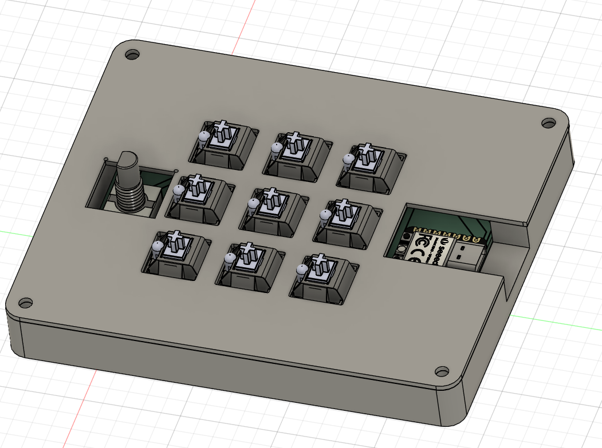
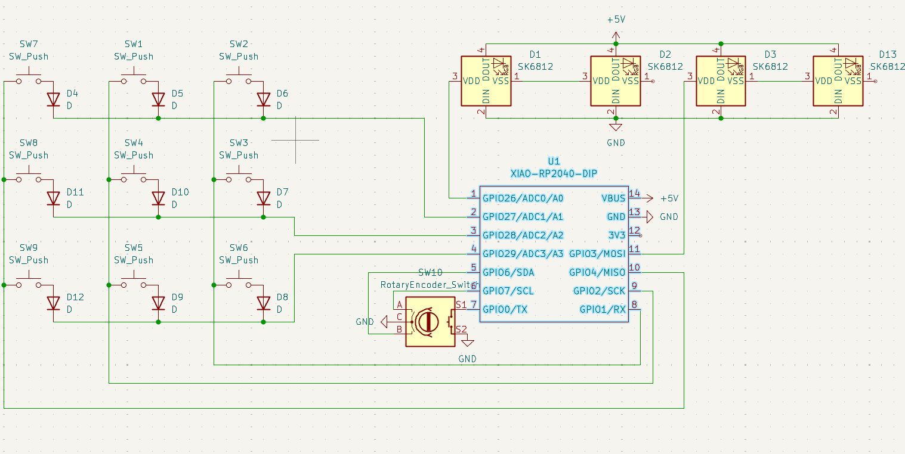
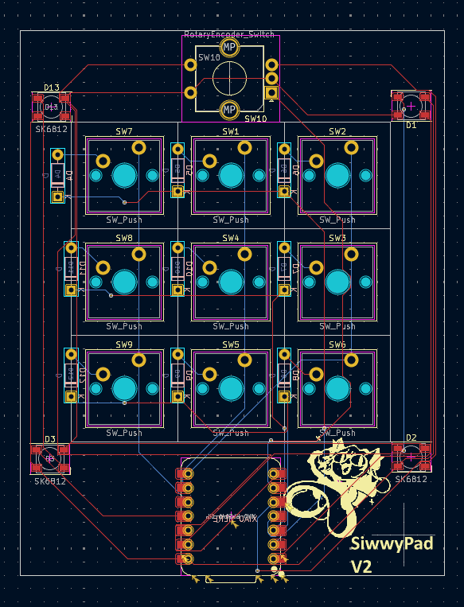
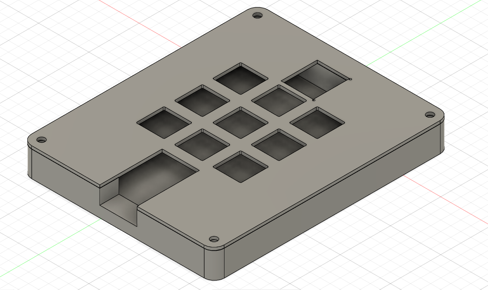

# SIWWYPAD!
This is my [HackClub](https://hackclub.com/) [HackPad](https://hackpad.hackclub.com/) Project!
It has 9 Keys, 4 LED's, a Rotary Encoder and uses KMK firmware.

## Inspiration
I was Inspired by those macropads OSU players use but i wanted some more buttons so i added some and added a rotary for easy volume control.
Another inspiration was the [MacroBoard](https://github.com/palmacas/MacroBoard).

## Challenges
One of the main Challenges was learning Fusion360 and all of its many many quirks.
Everything else was medium difficulty and could be done pretty quickly.

## hacpad!
This is it this is the hackpad in all its glory (minus the keycaps).

## the schem!
Its pretty simple and probably the best looking thing out of everything.

## the Pee Cee Bee!
The PCB in the KiCad View.

## the Case.
This is the case together (using m3 bolts)

## the Bill (Cypher) of Materials!

1x Seeed XIAO RP2040

9x Through-hole 1N4148 Diodes

9x Cherry MX Switches

1x EC11 Rotary encoder

9x Red DSA keycaps

4x SK6812 MINI-E LEDs

4x M3x16mm screws

4x M3x5mx4mm heatset inserts
