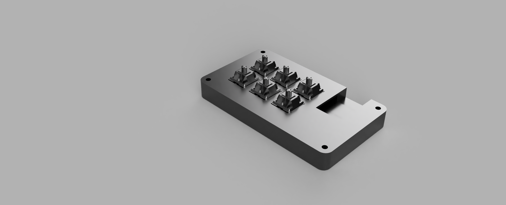
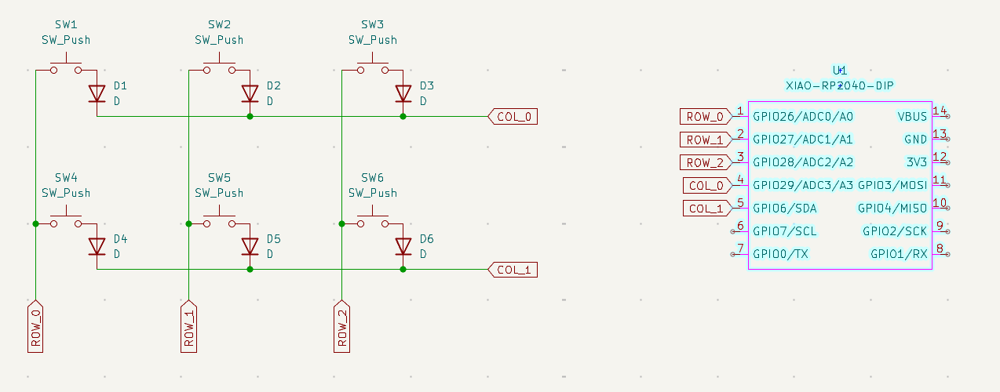
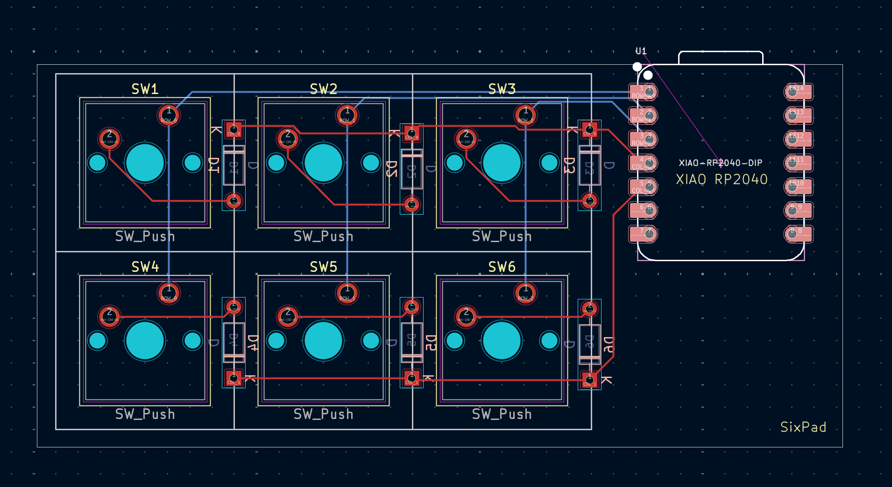
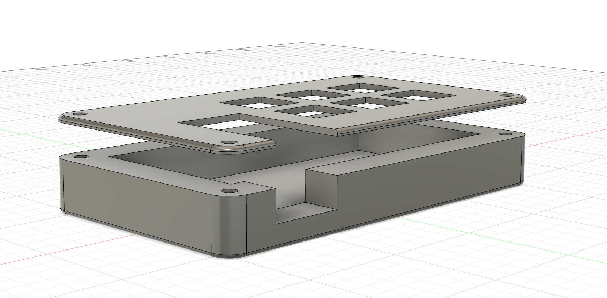

# SixPad

I didn't know what to name it so I just used the number of keys :)

## Images

### Full Render

### Schematic

### PCB

### Case

## Bill of Materials (BOM)

- 1 SEEEDUINO XIAO RP2040
- 6x Cherry MX-Style Switches
- 6x 1N4148 Diodes
- 4x Screws & Nuts (Same as Orpheus Pad, or whatever was on the CAD guide)

## Inspiration

I had actually been looking at DIYing a project like this for long before Hackpad was even created, but never could figure out how. I wanted to try something basic to start, which is where this design came from.

## Challenges

I struggled getting the dimensions of my hackpad to something that I was comfortable with, yet still had enough switches and things that I could use. Fixed this by moving around diodes, and mounting them elsewhere on the board to make it smaller.
