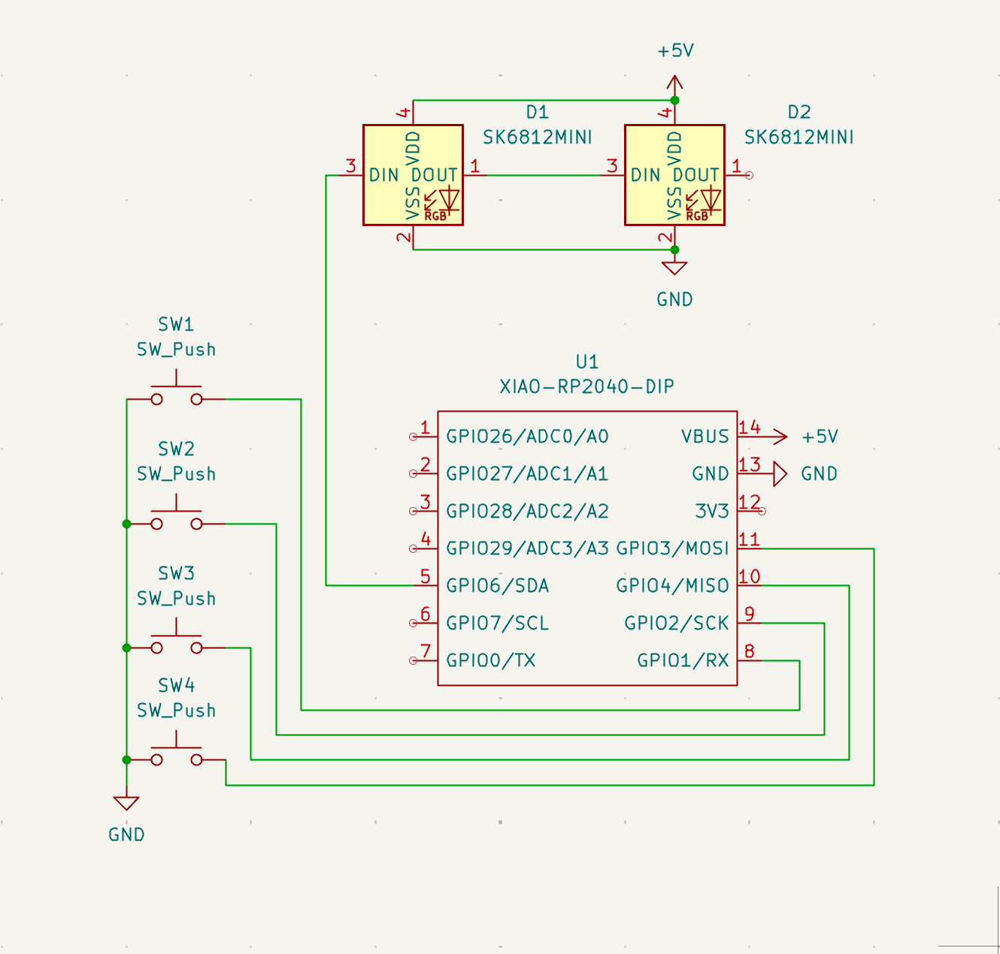
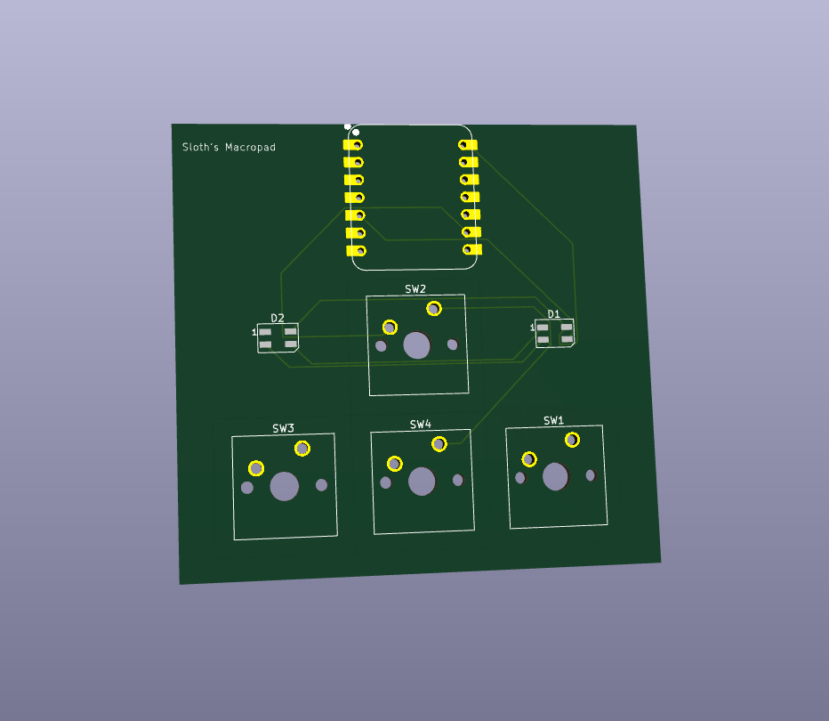
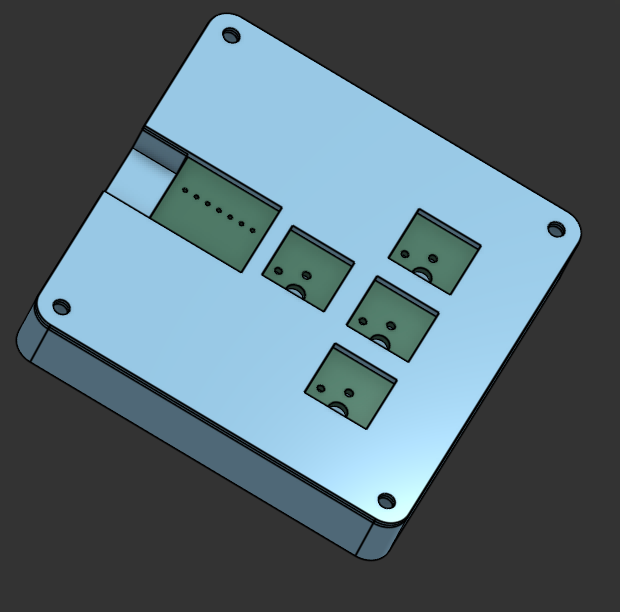

# Sloths Macropad

## Schematic

## PCB

## Full Hackpad

##Specifications
BOM:

4x Cherry MX Switches
2x SK6812 MINI Leds
1x XIAO RP2040
4x Blank DSA Keycaps
4x M3x16 Bolt
4x M3 Heatset
Others:

TOP.stl
BOTTOM.stl

#Inspiration and Challenges
This project marked my first time using KiCad for PCB design, which was difficult for me and required a lot of fixing.

I just wanted to create something electronic as I had never done so before

