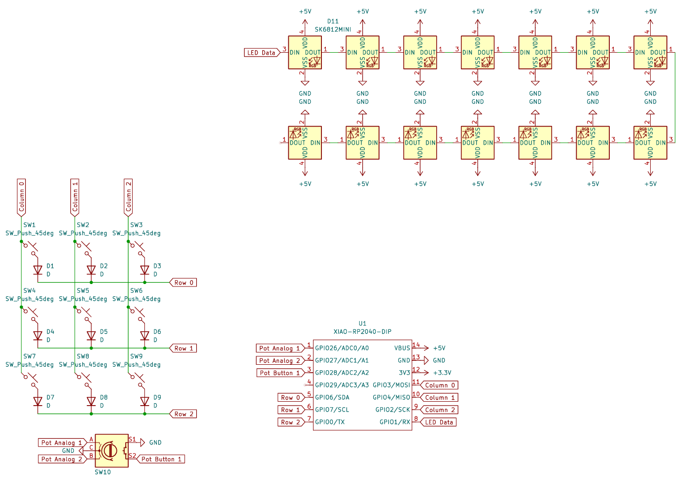
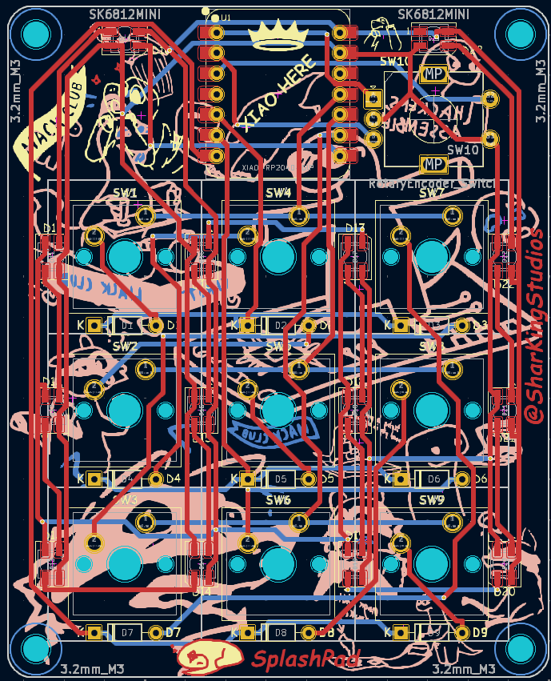

# SplashPad – Because You Deserve More Buttons  

### A Tiny, Glowing, Feature-Packed Macropad for Maximum Efficiency™  

*(Or just a cool way to press "Play" on your music.)*  

---

## Renders 
*Visuals because everyone loves eye candy.*

---
## BOM
All the bits and pieces needed can be found **[here](./BOM.md)**.

---

## What is this?  
It’s a **custom macropad** built with the **Seeed Studio XIAO RP2040**, **KMK firmware**, and **way too many LEDs**. Whether you’re gaming, editing, coding, or just pressing random buttons for fun, this thing’s got you covered.

### Features:
- **3x3 Matrix** – Nine glorious keys to map to whatever your heart desires.
- **Rotary Encoder** – Twist for volume, scroll, or secret hacker functions.
- **Clickable Encoder Button** – Because sometimes, twisting isn’t enough.
- **14 SK6812 Mini LEDs** – Way too many for a macropad this size. But hey, ✨blinkenlights✨.
- **Multiple LED Modes** – Solid, Rainbow, Wave, and Grid Fade, for when you need that cyberpunk aesthetic.
- **KMK Firmware** – Python-powered and open-source, because we like freedom.

---

## How It Works:
This macropad runs **KMK**, which means you get:
- **Custom Keymaps** – Map macros, media keys, or even full-blown scripts.
- **Dynamic Layers** – More functions per button? Yes, please.
- **LED Control** – Pulsing blue? Rainbow waves? Subtle grid fade? Pick your poison.
- **Rotary Encoder Support** – Spin for volume, brightness, scrolling, or **whatever**.

---

## Default Keymap (For the Lazy):
*(Change it if you want, I'm not your boss.)*

### **3x3 Button Layout:**
| Row   | Key 1  | Key 2      | Key 3           |
|-------|--------|------------|-----------------|
| **1** | Rewind | Play/Pause | Fast Forward    |
| **2** | Media  | Calculator | Cmd+R (Refresh) |
| **3** | Left   | Right      | Cmd+L (Lock)    |

### **Rotary Encoder:**
- **Left Turn** → Volume Down
- **Right Turn** → Volume Up
- **Press Button** → Cycle LED modes

---

## How to Use:  
1. **Flash KMK** onto your XIAO RP2040. *(If you don’t know how, Google it.)*
2. **Drop `kb.py` and `main.py`** onto your board.
3. **Plug it in.** Watch the lights do their thing.
4. **Press buttons.** Turn the knob. Make magic happen.

---

## LED Modes:
Because a macropad without RGB is just a fancy calculator.

- **Solid Mode** – A slow, pulsing blue (totally not just lazy coding).
- **Rainbow Mode** – Taste the colors.
- **Wave Mode** – Water flow effect because vibes.
- **Grid Fade Mode** – Simulates sunlight through water. Or something poetic like that.

*(Press the encoder button to switch between them.)*

---

## Why?
I built this macropad for [Hackpad](https://hackpad.hackclub.com/)—an awesome Hack Club YSWS project run by [Alex Ren](https://github.com/qcoral). With a the (hopeful) funding provided by the project, I wanted to create something that’s as practical as it is playful. Whether you're coding, gaming, or just jamming to your favorite tunes, this macropad is my way of saying:

#### why settle for ordinary when you can hack something extraordinary?

## The Biggest Challenge:
I wanted to use nice thick wires for my PCB (0.6mm) and routing all of these took quite a bit of effort. I think the time spent was definitely worth it, as the routing looks *awesome*.

---

## Future Plans (Maybe):  
- OLED Screen? 🤔  
- Bluetooth support? (If I hate myself enough to deal with that.)
- More layers? (How many is too many? Asking for a friend.)
- MIDI support? (Why not turn this into a DJ controller?)

---

## Contribute  
Want to make it better? Open a PR, suggest a feature, or just yell at me on GitHub.

---

## Disclaimer  
This project is 100% free, open-source, and powered by **vibes**. If it breaks, explodes, or opens a black hole, **that’s on you.**
