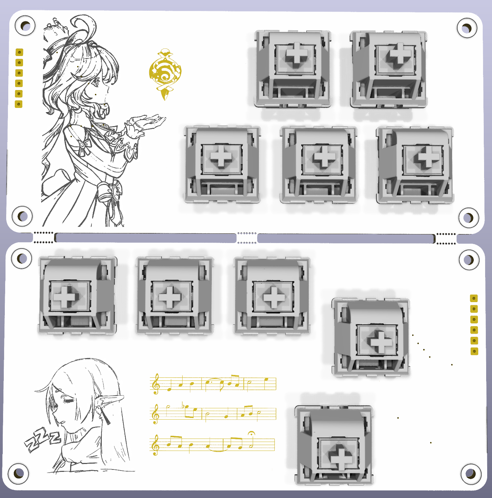

# Tetris Hackpad!!
Although now I think about it... it honestly feels like a keyboard.  

Either way, this was my first time designing a PCB, overall I think it went pretty well! The case is just a few sheets of acrylic with some standoffs to sandwhich the board in between.

# PCB
Could the PCB be white? Still working on the silksreen. Sneak peak:

# Bill of materials
| Component                                 | Quantity |
|-------------------------------------------|----------|
| Seeed Studio XIAO RP2040                  | 1        |
| Gateron Milky Yellows Cherry MX Switches	 | 10       |
| CherryMX 1.00u Kailh Sockets              | 10       |
| 1N4148W Diodes (D-SOD-123)                | 10       |
| USB C Receptacle 6P (GCT_USB4135-GF-A)    | 2        |
| M2 * 3mm Brass Standoffs                  | 8        |
| M2 * long Brass Standoffs (TBD)           | 8        |
| M2 screw smth-mm (TBD)                    | 8        |
| M2 nut                                    | 8        |

<small>Note: I'm pretty sure the USB C receptables don't have to be *exactly* the same.. just the same amount of pins</small>

# Acknowledgements
- Silkscreen 
  - Frieren by [zero808w](https://www.instagram.com/zero808w/p/CyAXmzevf3J/)
  - Genshin Impact: Furina | Phone Wallpaper by [Stefany Pauline Moyco](https://dribbble.com/shots/24052617-Genshin-Impact-Furina-Phone-Wallpaper)
  - Genshin Impact: Hydro Vision from [Genshin Wiki](https://genshin-impact.fandom.com/wiki/Vision?file=Item_Furina_Vision.png)
  - Github logo from [GitHub Logos and Usage](https://github.com/logos)
  - Hack Club banner from [Hack Club Brand](https://hackclub.com/brand/)
- Components
  - MX Cherry switches symbol, footprint and model from [sszczep/kicad-libraries/](https://github.com/sszczep/kicad-libraries/)

[@Jay](https://github.com/Jayx2u) I could not have figured out how to make the case, process images for the silkscreen, or render the PCB without you (or stay sane over the last two weeks for that matter). So, thank you!!