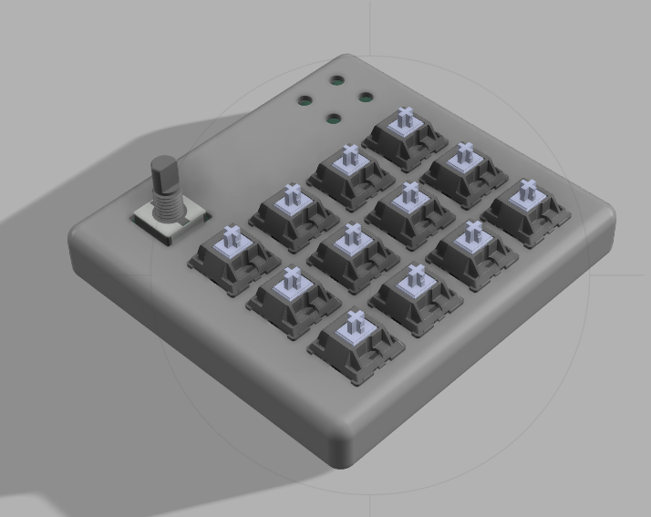
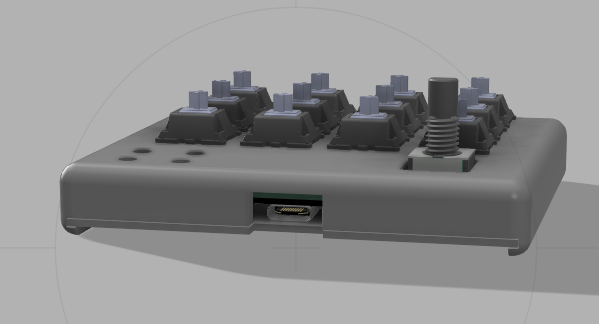
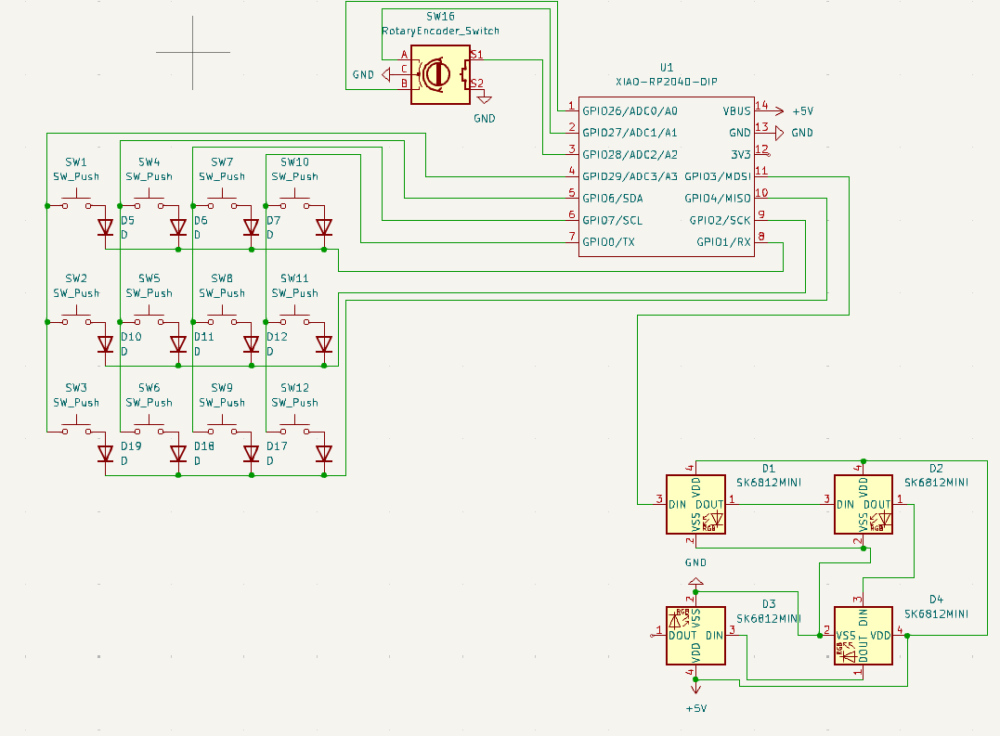
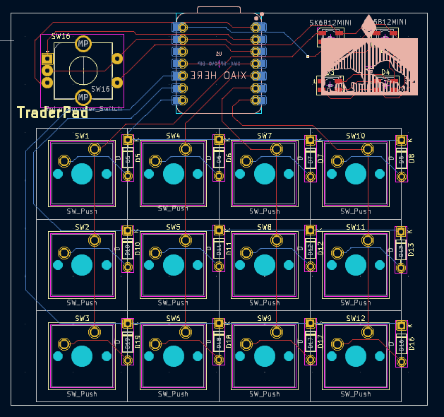
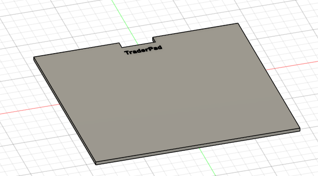
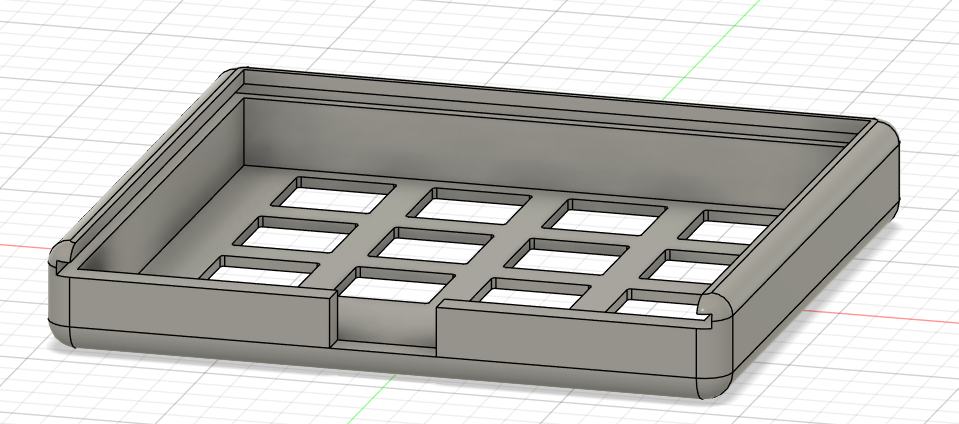

# TraderPad
TraderPad is a 12 keys, rotary encoder and 4 leds macropad. It uses kmk firmware and will be running on XIAO SEED RP2040 MCU.
I will most likely use to execute trades faster and automate the process.

## Cad (fully asseambled model):
It uses no screws design so thats why it's only 15mm thin an it's one of a kind.

### Note: If that is possible I would like my case to be printed in Gray colour, or in Black if gray is not an option.
## Below you can see my schematic:

## And there's the screenshot of my pcb (XIAO on the back):

## Case:
It uses 2 printed part(the top and the bottom plate which slides into the top part and close the case)
I'm planning on adding some stickers on my case which I got from High Seas (so it's not that ugly)
Here are two mentioned above parts:

There is branding on the bottom part. I really tried adding it to my upper part also, but my Fusion skills unfortunately wouldn't let me do that.

## BOM
- Seeed XIAO RP2040
- 1N4148 Diodes (12x)
- Cherry MX Switches (12x)
- EC11 Rotary encoders (1x)
- Blank DSA keycaps (black if possible, if not - white) (12x)
- SK6812 MINI-E LEDs (4x)
- 3d printed case (2 parts)
- custom pcb (from 20$ grant 1x)
- I would also like a soldering iron, since I don't have one

### Thanks for all Hack Club, it  was another amazing experience to design a hardware from scratch and taught me a lot. Thanks!! Can't wait to finaly asseamble one. The most challenging part was 3d  modeling in Fusion 360. It was really confusing sometimes, but I have overcame it and I'm kind of proud of that. Never give up!