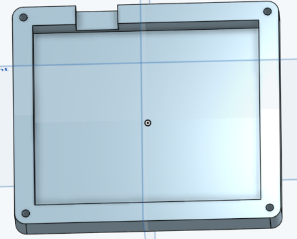
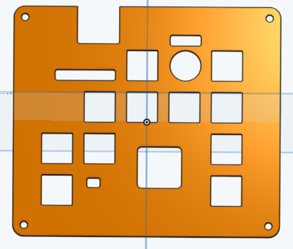
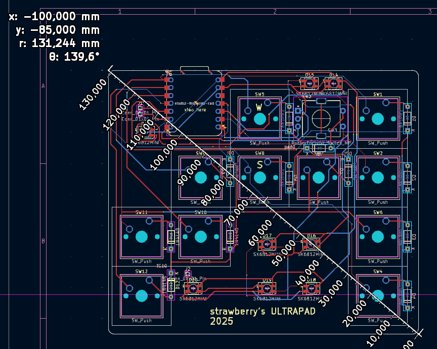
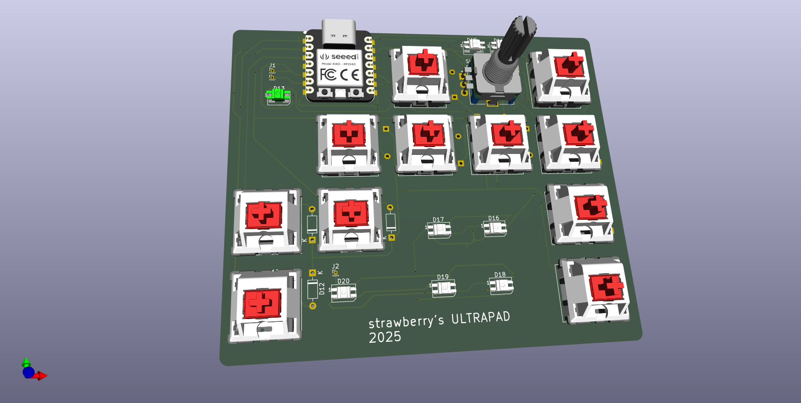
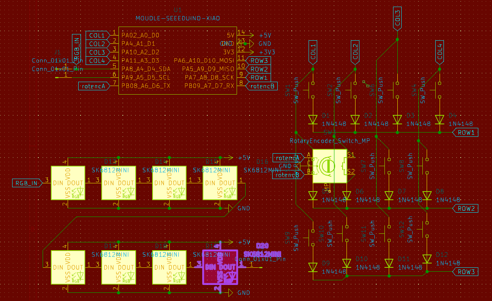

# Purpose
**12-key macropad intended for ultrakill gaming**
has all movement keys, macro for knuckleblaster punch without swapping, rotary encoder for weapon swapping and an extra key for a Railcannon
has RGB diodes intended for showing things like style/hard damage (if i can implement that)
I made it mainly because school keyboards suck and i wanted to P-rank in spite of that

# BOM
- Xiao RP2040 (THT?)
- 11x Cherry MX switches
- 11x Blank keycaps (8 blue, 3 red if possible) 
- 1x EC11E rotary encoder with switch
- 11x THT 1N4148 diodes
- 8x SMD SK6812MINI RGB diodes
- 4x M3 16mm screws
- 4x M3 heatset inserts

# Pictures:
case:

PCB:

render:

schematic:

