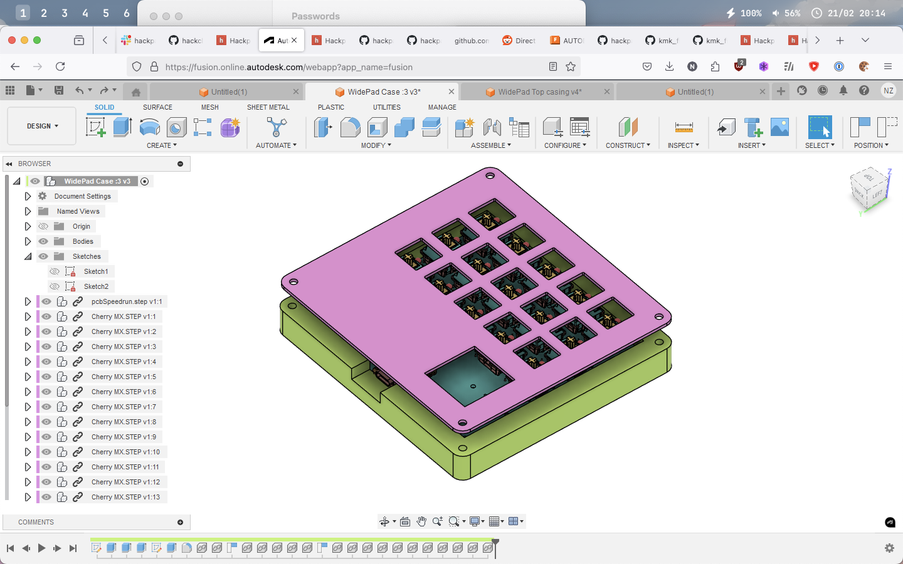
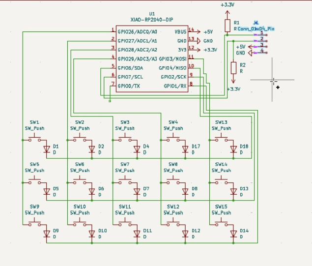
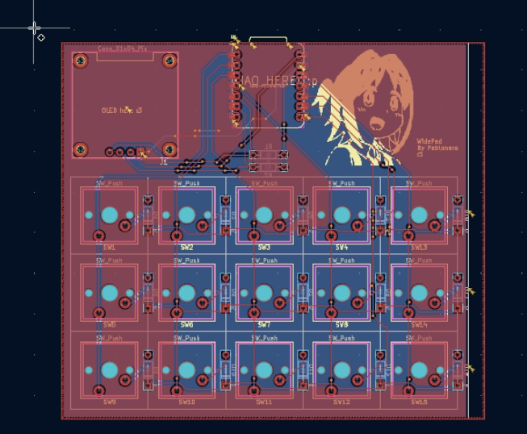
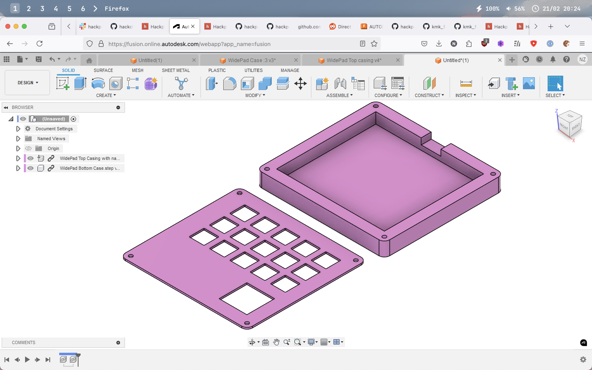

# WidePad

WidePad is a 15 key macropad with an OLED display. It uses diodes and switches in a matrix to 
achieve key rollover. Currently the test firmware is KMK, although it is very likely that 
WidePad will be migrated to use QMK.

## Features
- 0.96" OLED screen
- Silkscreen art
- 15! Cherry MX style switches
- A wide and large(ish) form factor
- KMK firmware!
- PCB is friction fit so no need for an extra screw :3

## Challenges

Too many to count. I did all the PCB design in a VM on my server (which only has 2.5" SMR 
disks, which was painfully slow). KiCad crashed multiple times. Additionally I made many 
routing mistakes and ended up redoing the whole board (I had LEDS in the first board I was 
designing, cost me 5 hours).  I did all of this in 
<24h and pulled an all nighter.

## BOM
- XIAO RP2040
- 15x Cherry MX style switches
- 15x Blank DSA keycaps
- 1x SSD1306 128x64O LED (5V VCC, 3.3V logic, I2C)
- 2x 4.7k ohm resistors
- 6x 1N4148 diodes
- 4x Same screws and heatset inserts as orpheuspad (M3 Bolts and heatset inserts?)

## Gallery

Note OLED screen not cadded because I can't find a model (or maybe the sleep loss is getting 
to me deadge)

Here are some pictures of my schematic, PCB, and case:

