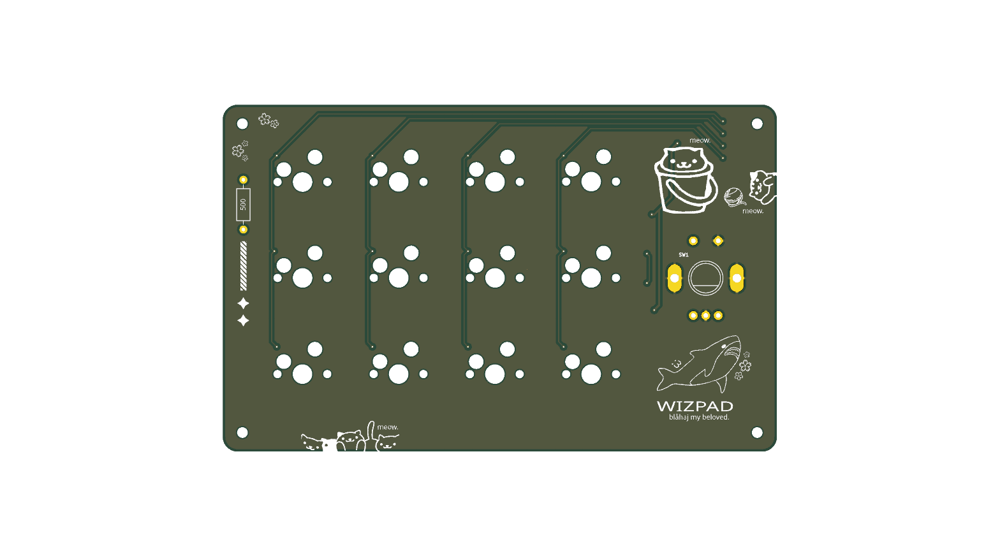
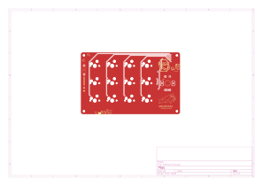
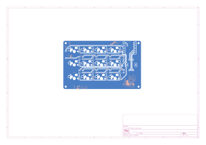

# WizPad

A custom 4x3 macropad with a rotary encoder, powered by the Seeed XIAO RP2040. Designed for productivity and a splash of RGB.

## Inspiration & Challenges
The WizPad was born out of a need for a compact, versatile tool to speed up my creative workflow. The main challenge was starting from zero experience and completing the design within a tight 2-hour window. I focused on a clean 4x3 matrix layout that balances functionality with a small footprint, ensuring it stays well within the 100mm limit.

## BOM (Bill of Materials)
| Component | Quantity | Description |
|-----------|----------|-------------|
| Seeed XIAO RP2040 | 1 | Main Microcontroller |
| MX Switches | 12 | Cherry MX compatible mechanical switches |
| Rotary Encoder | 1 | PEC11 style with push button |
| Diodes (1N4148) | 12 | SOD-123 surface mount diodes |
| NeoPixel LEDs | 8 | SK6812 Mini-E or similar |
| Acrylic Case | 1 | Custom 3mm laser-cut (Top & Bottom) |
| M3 Screws/Standoffs | 4 | For assembly |

## Renders & Photos
### Full Render

### Schematic

### PCB Layout
**Top View:**

**Bottom View:**

### Case
Files located in `/case`:
- `wizpad-top.dxf`
- `wizpad-bottom.dxf`

## Firmware
The firmware is built using KMK (CircuitPython).
- 4x3 Key Matrix
- Rotary Encoder mapped to Volume Control
- 8-LED RGB Backlight + Onboard RGB Control
