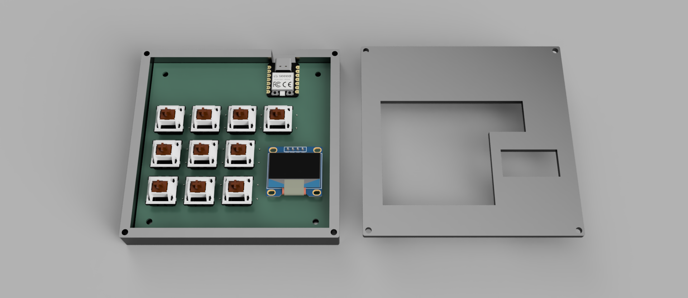
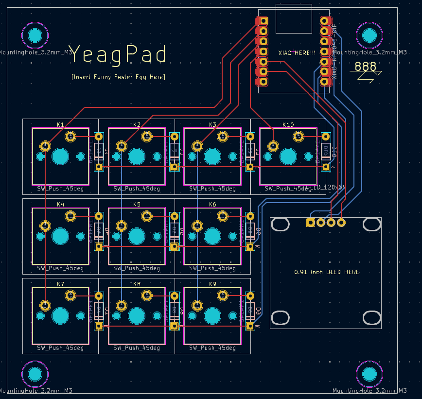
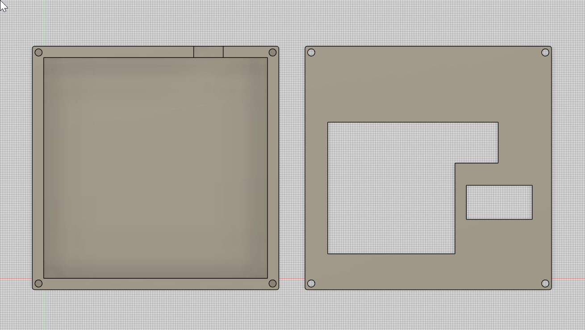

## YeagPad:
This is a 10 key general purpose macropad for stuff like... I don't know, playing games and whatever (。・ω・。)

## Inspiration:
I was a macropad that I could use for rhythm games and also for 3d enviroments, while also still having options incase I wanted to make my macropad a makeshift launchpad for music.

## Challenges:
~~Me being a dumbass~~ Honestly it was just me making everything harder that it was supposed to be. In, hindsight, making my macropad was actually pretty easy(-ish)

## Stuff:
- Simple design (Sleek!)
- Has an OLED (Cool!)
- KMK built with hopes and dreams as this is my first time doing this whole building a macropad thing (I really hope this works)
- Yeag! (Yeag!)

## BOM:
    1x XIAO RP2040
    10x Through-hole 1N4148 Diodes
    10x Cherry MX Switches
    1x 128x64 OLED
    10x Blank DSA Keycaps (Red)
    4x M3x16mm Screws
    4x M3x5mmx4mm Heatset Inserts
    1x 3D Printed Base
    1x 3D Printed Top Plate

## Schematic
)

## PCB

## Case

