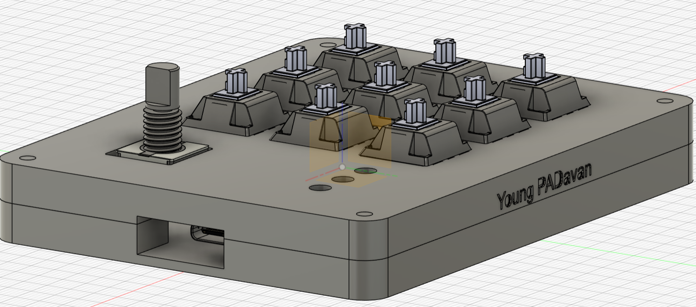
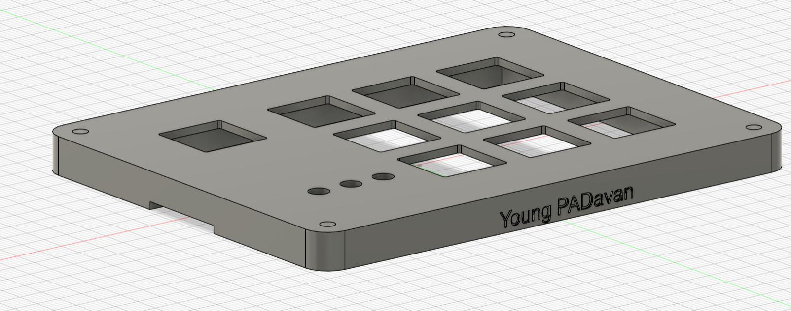
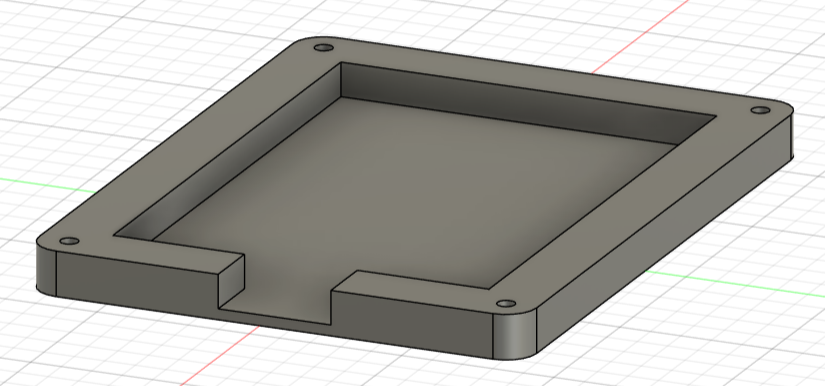
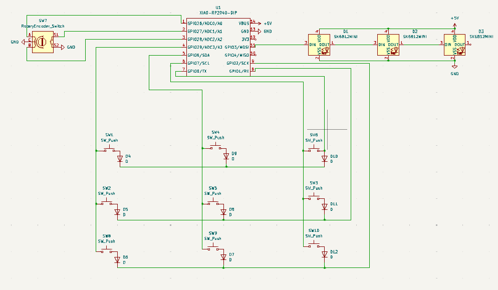
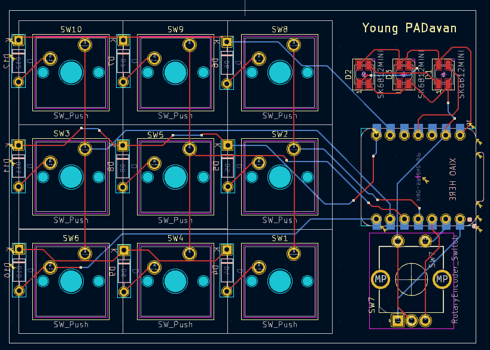

# Young PADavan

When I saw this YSWS challenge I knew I had to try it. I have never build a physical electronic thing like a macropad, so it was a new experience for me. The last thing that I can say about this journey is that it was easy, but I think it will be worth it. Having a macropad for shortcuts is useful when coding for example, and with my design the "Young PADavan" can perform 27 different shortcuts, which is more than enough. Overall a great experience, but I barely restrained myself not to destroy my desk when using this devil creature Fusion 360.

## CAD model

I think it looks pretty cool. Maybe it's basic, but I like how the rotary encoder is next to my thumb and the leds are easily visible (I would be using the macropad with my left hand).

(I'm sorry but I couldn't import the leds into fusion. Everything else is there and I of course made space for the leds as you can see.)

Made in Fusion 360...

## TOP:

## BOTTOM:

## PCB

Here are the images of my PCB made in KiCad:
- Schematic:

- PCB:

As you can see everything is layed out completely differently in the schematic than in the PCB or the actual 3d model. I changed my mind about the design during creating the PCB, so that's why the schematic looks odd. But everything works correctly of course 😊.

## Firmware

Although I have coding experience (mostly in javascript/svelte lately), I am not a genius programmer, but I was able to glue together this KMK script after watching some tutorials and scratching my head. I hope it works, but even if somehow it doesn't I will fix that when I get the macropad and ensure it works like 1M$.

## BOM:

Here should be everything you need to make this hackpad:
- 9x Cherry MX Switches
- 9x DSA keycaps
- 4x M3x12mm bolts (I will probably order them with the pcb)
- 3x SK6812 MINI LED
- 9x 1N4148 diodes
- 1x XIAO RP2040
- 1x EC11 Rotary Encoder
- 1x Case (2 printed parts- top and bottom)
- 1x Custom PCB