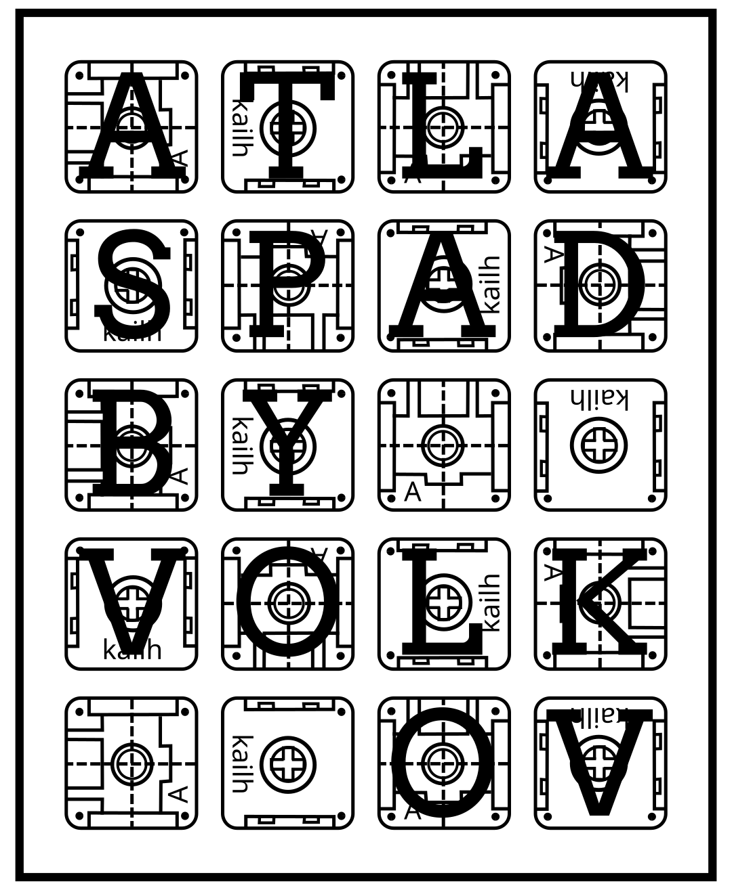
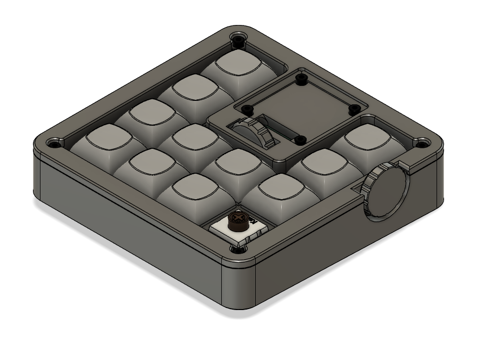
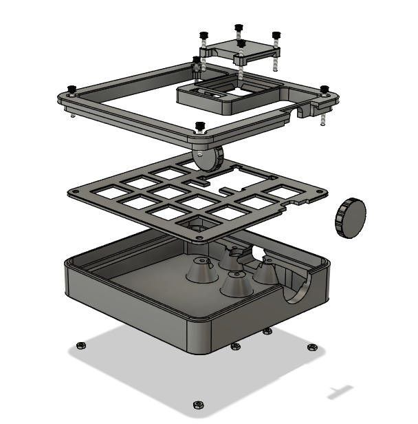
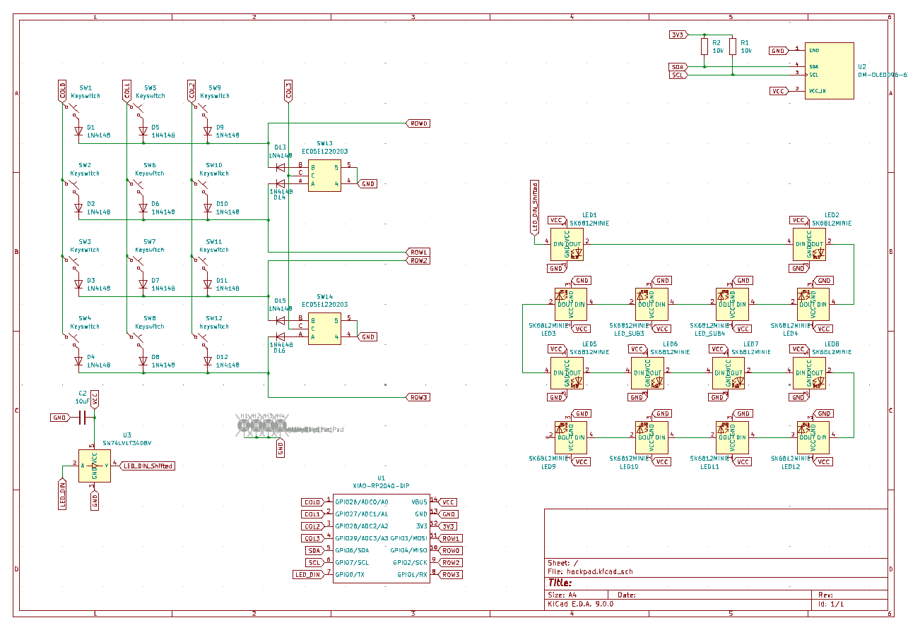
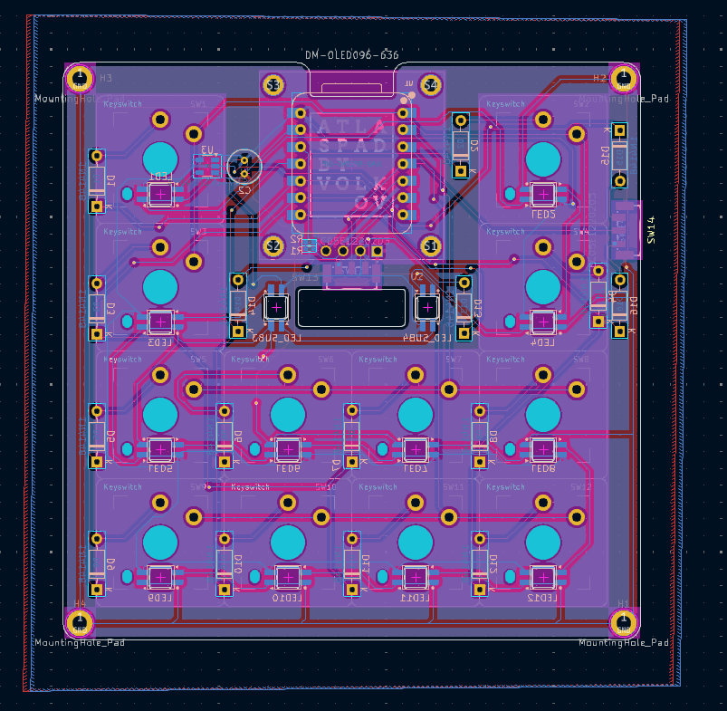
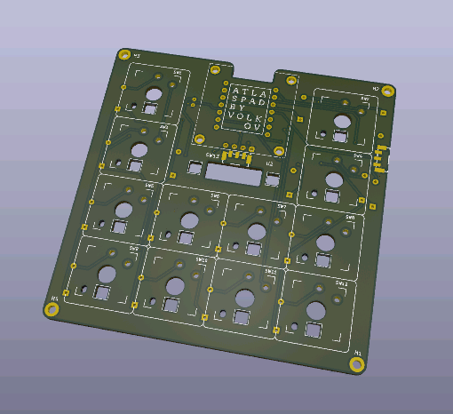
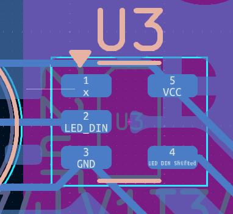

# Atlaspad

A compact Macropad based on a rp2040 xiao, packed with features!
(Originally intended as a Macropad for playing NMS, that functionality is WIP)

## Features:

-   12 ChocV2 Low-Profile Switches
-   14 Adressable LEDs Distributed across the Board
-   0.96" OLED Display
-   2 (Horizontal) Encoders

## CAD Model:

The model is based on a sandwich mount (Top,Plate,Base), but also includes the following parts:

-   2 custom wheels for the encoders (slightly slimmer one goes on the side, the thicker one in the middle)
-   an insert into the Top.stl piece thatll allow the OLED to be mounted slightly inset w/o any overhangs when printing

It's held together by 6 M2x16 (Back&OLED) and 2 M2x12 (Front) screws and corresponding hex nuts (DIN 912 & 934)

Exploded Assembly

(the wheels are press-fit for the encoders / have to be glued, these were the only encoders small enough i could find)
_Designed in Fusion360_

## PCB

Schematic:

Front side of PCB:

_Designed in KiCad_

## Firmware Overview

This hackpad uses [QMK](https://qmk.fm/) firmware for everything.

Since this is my first time using QMK, only a basic configuration using this layout (mainly for KiCad) is in place:

    /*
     * ┌───┬───────┬───┐
     * │/\ │       │Hom│
     * ├───┤       ├───┤
     * │\/ │       │End│
     * ├───┼───┬───┼───┤
     * │F1 │F2 │F3 │F4 │
     * ├───┼───┼───┼───┤
     * │F5 │F6 │F7 │F8 │
     * └───────┴───┴───┘
     */

The LEDS are in a rainbow pattern :3 and the encoders are configured to sideways scrolling and volume. (encoder configuration might still be a bit buggy)
The OLED currently only displays debug information.

### Features planned

Once i get a working hackpad i can debug on, these are the features i wanna add

-   Multiple layers for different tasks (Fusion Shortcuts, Emojis/Emoticons/ NMS shortcuts)
-   OLED displaying info on layers (maybe even showing the layout itself, as a kind of label for the keys) & Toggle keys
-   LEDs reacting to keypresses, custom wave animation (going out from the pressed key)

## BOM:

Here should be everything you need to make this hackpad besides the PCB and 3d printed parts:

#### Mechanical

-   2x M2x12 Screws
-   6x M2x16 Screws
-   8x M2 Hex nuts

#### Main Features

-   1x Seeed Studio rp2040 xiao
-   12x ChocV2 Switches
-   14x sk6812-mini-e LEDs (sk6812-mini have a different pinout)
-   1x .96" sd1306 OLED Display (if you wanna connect it through a pin header, make sure the Order is GND/VCC/SCL/SDA)
-   2x EC05E1220203 Rotary encoders (SMD)

#### Additional

-   16x 1N4148 THT Diodes

### Optional (but recommended)

-   2x 10k 0402 Resistors
-   1x 10uF Electrolytic cap
-   1x SN74LV1T34DBV level shifter

The hackpad might work w/o these components, but its better to add them.
Here is how to adjust when leaving them out:

-   Resistors are i2c pullups. leave empty
-   Capacitor is a buffer for the LEDs (the can draw >700mA at max Brightness). leave empty
-   Voltage shifter is to accomodate the specified 3.4V minimum data High level, just above the 3.3V outputted by the rp2040. It may work without, but possibly inconsistently. If leaving out, bridge the LED_DIN and LED_DIN_Shifted contacts of the IC Footprint (see below).

## Notes:

I hope this works lol .-.
