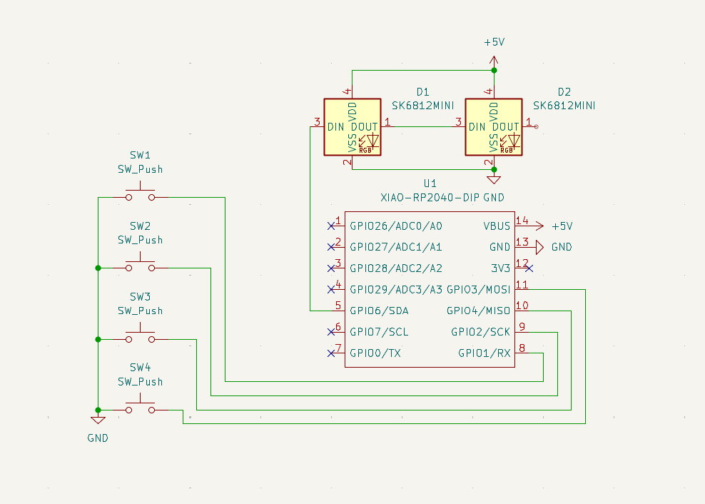
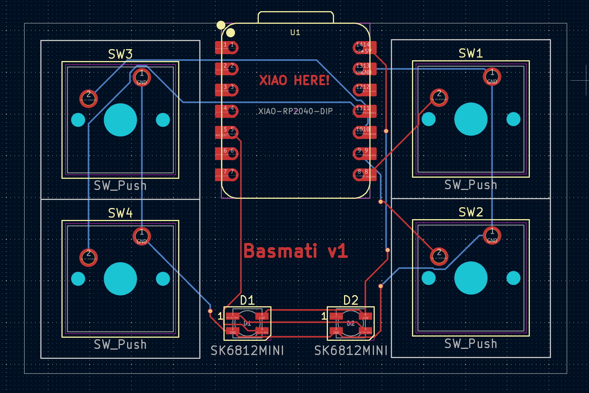
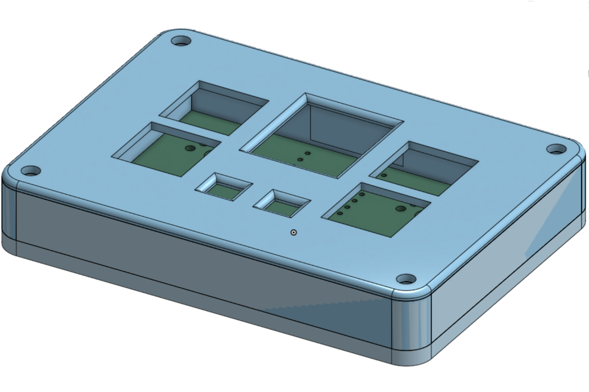

# basmati
Yet another macropad. Built for [hackpad](https://hackpad.hackclub.com).

## Designs

## Firmware

Firmware for basmati is made with [KMK](https://github.com/KMKfw/kmk_firmware). Located at `production/main.py`.

## BOM

- SK6812 Mini LEDs
- XIAO RP2040 Microcontroller
- SW Cherry MX Switches
- 3D-Printed Case (See `CAD/`)
- PCB (SEE `PCB/`)
- 4x Red DSA Keycaps
## Case

The case comes in two parts:
- The base holds the PCB, and has text engraved on the bottom.
- The top has holes for all the keys and LEDs, plus it exposes the RP2040 so you can be hacker.