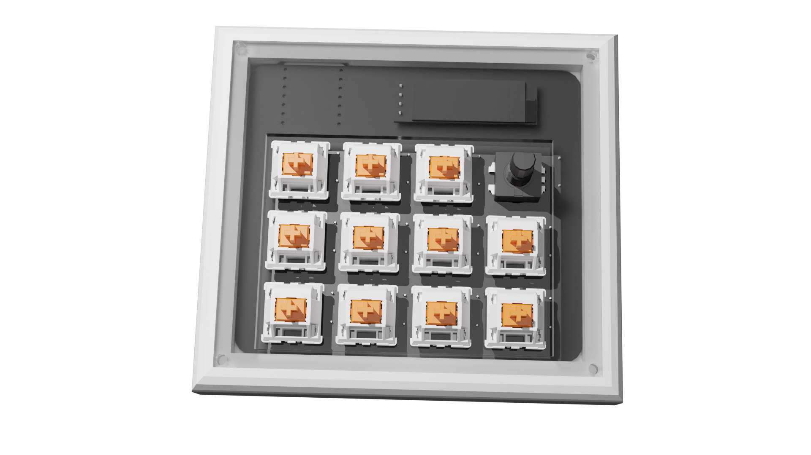

# Bear's Hack Pad

I wanted to create my macropad to help me with video editing and CAD. I enjoyed learning how to design PCBs however the QMK was a little bit difficult to get figured out, I finally got a version to compile once I fixed the key matrix but all it does is bind the keys to hotkeys, once I get my macropad I plan to experiment with the QMK further and implement different layers of macros as well as display which layer it is currently on on the display.

(case designed with shapr3d and rendered in blender)

# BOM (in seperate file aswell):

- 11 cherry mx switches
- 1x EC11 Encoder
- 3x PCB (it said somewhere yall would send 3 idk)
- 12x Through-hole 1N4148 Diodes
- 1x oled display (128x32 is what I used in the schematic)
- 1x seeeduino board
