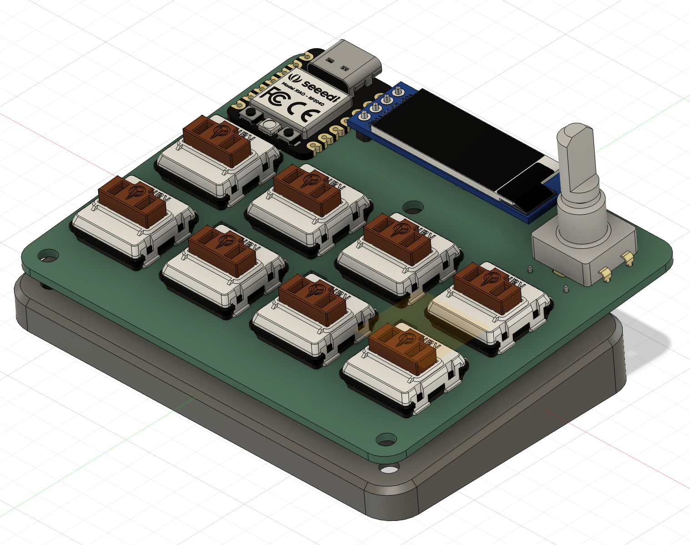
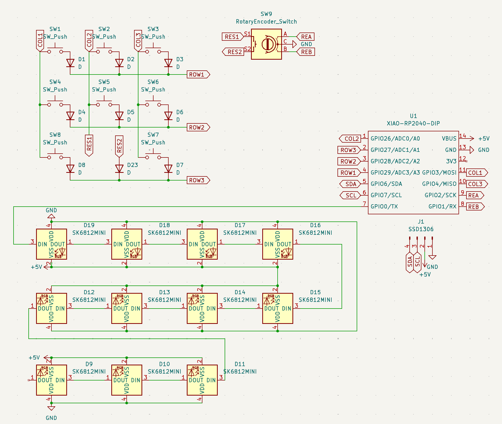
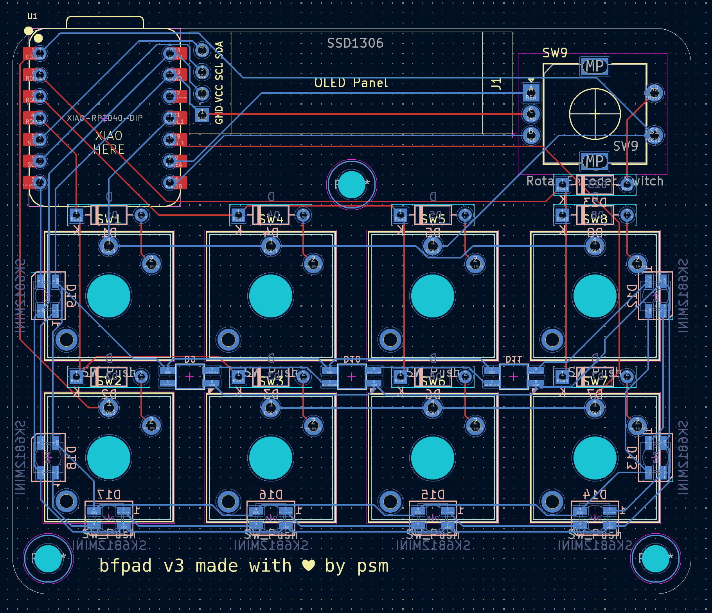

# bfpad

bfpad is an 8-key macropad with an additional 0.91 inch 128x32 OLED display and an EC11 rotary encoder. there are 3 reverse-mount neopixels to light under the keys, as well as 8 under the board. with limited keys on the pad, i figured interpreting a limited-character and simple language directly on the microcontroller would be a perfect fit. the goal is to write firmware to allow you to write and run [bf](https://en.wikipedia.org/wiki/Brainfuck) code directly on the keyboard. hopefully.

## case

i want to leave the PCB exposed, so i made a stand that can be attached to the PCB via m3 screws and held in place by hex nuts.

## schematic & pcb

the 8 keys (and secret 9th rotary encoder key) are addressed via a 3x3 key matrix, using only 6 pins of the RP2040.

this is the third iteration of the PCB.

## BOM

-   Seeed XIAO RP2040 (through-hole)
-   8x kailh choc v2 switches (and corresponding keycaps! any color)
-   9x 1N4148 DO-35 Diodes
-   1x EC11 rotary encoder
-   1x 0.91 inch OLED SSD1306 display
-   8x SK6812 MINI LEDs
-   3x SK6812 MINI-E reverse mount LEDs
-   3x M3 screws
-   9x M3 hex nuts
-   1x bottom stand
