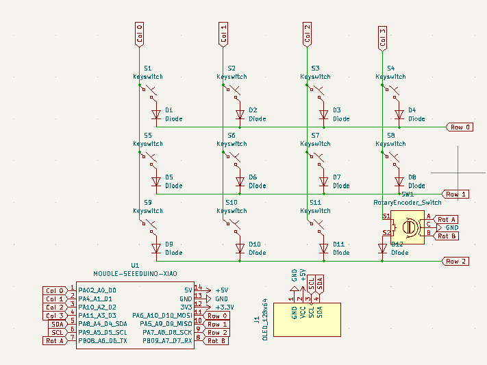
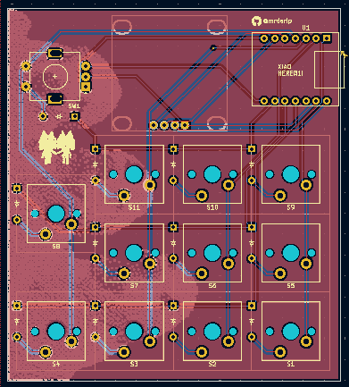
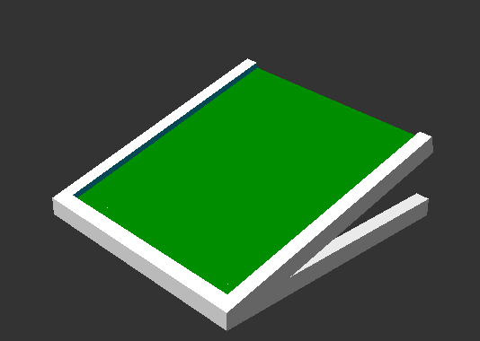

# bidirectional macropad
This is my submision! it is made to be a macropad, but it can also be used as a numpad, or a gamepad, or a keyboard, or a mouse, or a joystick, or a MIDI controller, or a... you get the idea.
It can be rotated to be used in a vertical or horizontal position, so its like a 2-in-1!

to get the case for the rotated version, you just change the x and y values in the `.scad` file, and you're good to go!

## Features
- cool silkcreen art
- a rotary encoder with push button
- An 0.96" OLED screen
- Cool silkcreen art
- 11x keys
- kmk firmware! with layers for different programs!

## PCB
Here are pictures of my pcb:

| **Schematic** | **PCB** |
|---------------|---------|
|||

Hope it looks pretty to you!

[x] I ran DRC and there are 0 errors

## CAD
Designed using OpenSCAD! I like it for allowing me to make fast changes (and a slower development process lol).

It's made to be 3D printed, and as it doesn't need supports nor any post processing, mass produce.

## Firmware

I wrote the firmware using kmk, you can see it inside the repo. It's pretty simple, but I'm proud of it!

## BOM
- 1 SEEEDUINO XIAO RP2040
- 11x switches (I guess any will do), although I like those red ones (I have no idea about keyswitches)
- 12x 1N4148 diodes
- 1x SSD1306 
- 1x rotary encoder

## IMPORTANT

- Dont send the 3d printed case  
    I'll print it myself so I'll get less customs fees.
- Don't send the OLED screen  
  I have a bunch of them, less customs fees.
- Don't send the soldering iron  
  I have one, less electronics waste, less customs fees.
