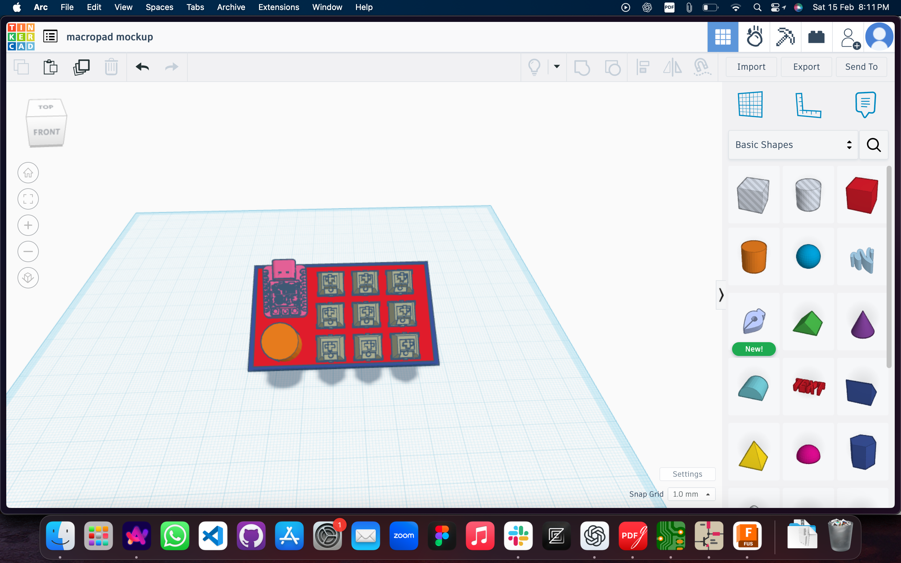
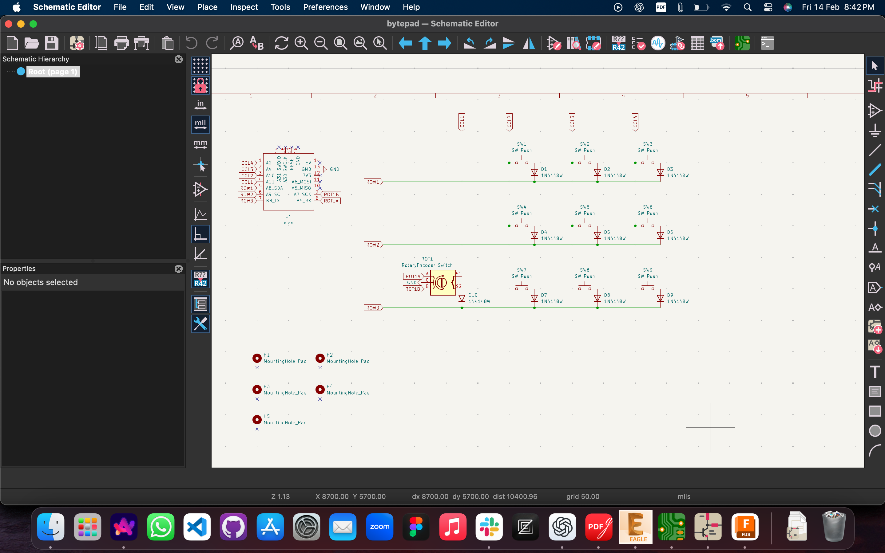
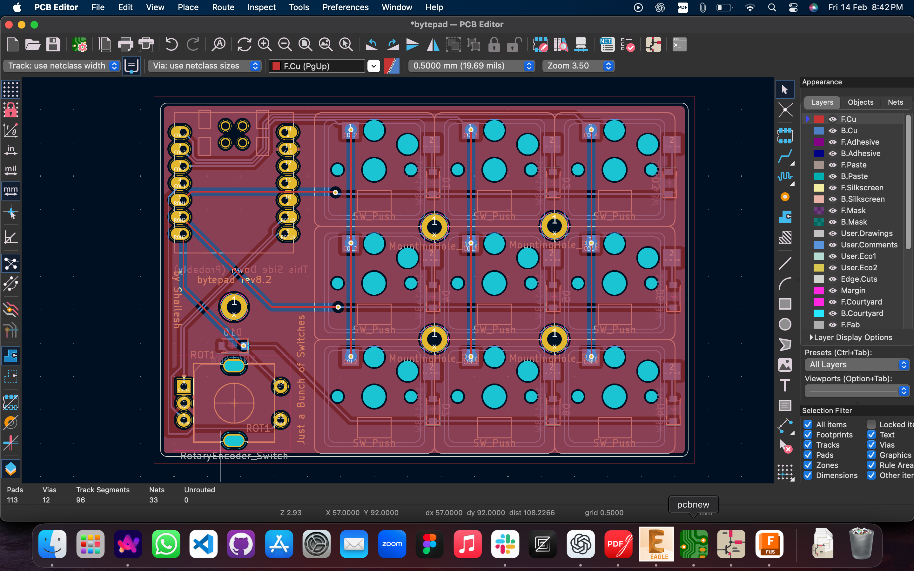

# 🎛️ BytePad – The Tiny But Mighty Macropad!  

BytePad is a **super compact, ultra-customizable** macropad built for **productivity, gaming, and just pressing buttons because it's fun.** Whether you're automating workflows, spamming memes, or controlling your spaceship (okay, maybe just your music), **BytePad has you covered.**  

## 🚀 Features  
✅ **9 programmable keys**  
✅ **Choc switches**  
✅ **Rotary encoder**  
✅ **Powered by Seeed Studio XIAO RP2040**  
✅ **Fully customizable with KMK firmware**  
✅ **DIY-friendly**  

---

## 📸 Screenshots  

### Hackpad Mockup  
  

### Schematic  
  

### PCB Design  
  

---

## 🔩 Bill of Materials (BOM)  

| Quantity | Component                        |
|----------|----------------------------------|
| 1        | **Seeed Studio XIAO RP2040**     |
| 10       | **SOD123 Diodes**                |
| 9        | **Choc Hotswap Sockets**         |
| 9        | **Choc Switches**                |
| 9        | **Keycaps**                      |
| 1        | **EC11 Encoder**                 |
| 1        | **Knob Cap** (for EC11 Encoder)  |
| 1        | **BytePad PCB**                  |
| 1        | **USB-C to USB-C Cable**         |

---

## 🖥️ Firmware  
BytePad runs on **KMK firmware** for easy Python-based customization.