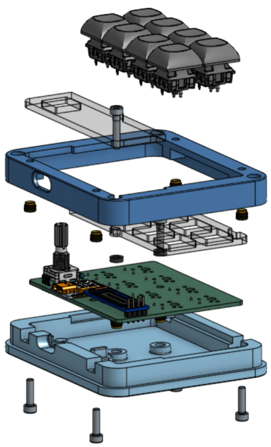
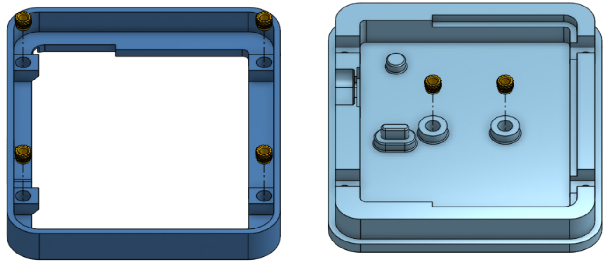
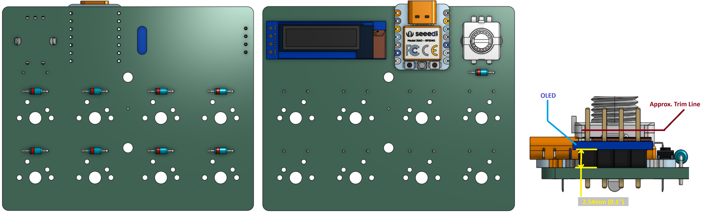
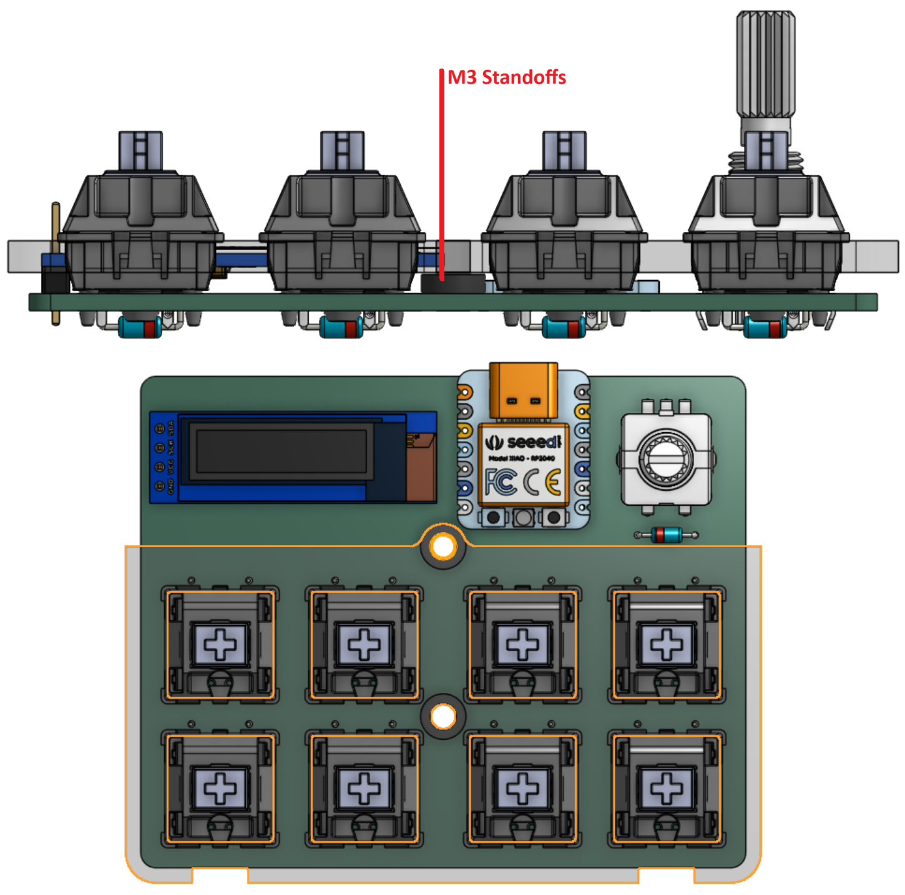
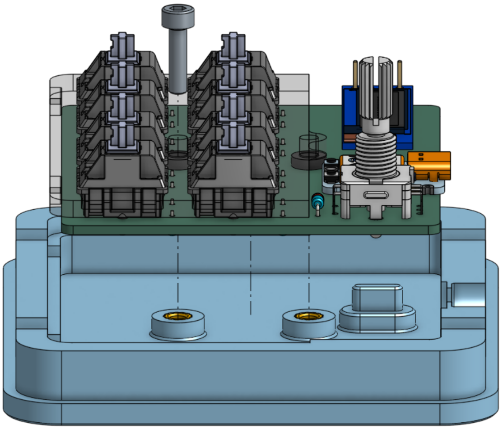
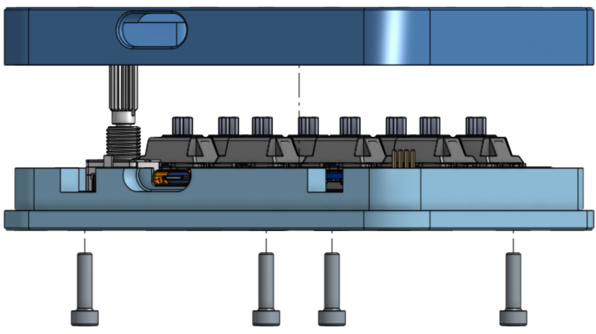
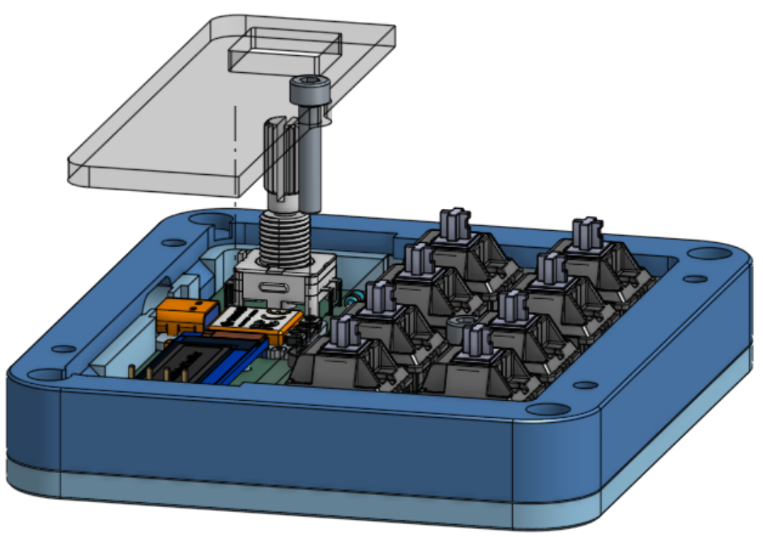

# Capslock Light ++
Writeup avalable [here](Writeup.md)
# BOM

| Part                                            | Quantity |                      Notes |
|:----------------------------------------------- |:--------:| --------------------------:|
| **Case**                                        |          |                            |
| [Case Bottom](production/case/Case_Bottom.step) |    1     |      3D Print - Azure Blue |
| [Case Top](production/case/Case_Top.step)       |    1     |      3D print - Azure Blue |
| [M3 Standoff](production/case/M3_standoff.step) |    2     |      3D print - Azure Blue |
| [Keyplate](production/case/Keyplate.dxf)        |    1     |       Lasercut - 3mm Clear |
| [Top Plate](production/case/Top_Plate.dxf)      |    1     |       Lasercut - 3mm Clear |
| M3 12mm Bolt                                    |    5     |                            |
| M3 16mm Bolt                                    |    1     |                            |
| M3 Heat set inserts                             |    6     |                            |
| **PCB**                                         |          |                            |
| [PCB](production/Gerbers.zip)                   |    1     | Purple w/ white silkscreen |
| XIAO RP2040                                     |    1     |                            |
| 1N4148 Diode                                    |    9     |               Through-hole |
| Cherry MX Keyswitch                             |    8     |                            |
| EC11 Encoder                                    |    1     |               Through-hole |
| .91" 128x32 OLED                                |    1     |                            |
| **Other**                                       |          |                            |
| DSA Keycaps                                     |    8     |                            |
| Dial                                            |    1     |                            |

# Assembly Guide
No promises that this is actually helpful, I have no experience with custom keyboard

1. Heat set the six M3 inserts into the case

2. Solder the PCB

    - 8 THT 1N4148 Diodes mount to the underside of the board
    - 1 Diode, The EC11 encoder, XAIO, & OLED atach to the top of the board
        - The OLED should be placed flush against the black spacer on its pins (0.1" or 2.54mm off the surface of the board)
        - Trim the pins of the OLED to below 5mm off the surface of the board (as close to flush with the OLED as possable is ideal)
        - The XAIO needs to be flush against the board to fit under the top plate
3. Install the keyswitches

    - Place the swiches in the larger acrylic plate
    - Possition the M3 standoffs over the holes in the middle of the board, This will be diffcult to do later
    - Install the plate on the board and solder the switches
4. Mount the board in the bottom case

    - Only install the lower 12mm M3 bolt at this stage
5. Install the top of the case

    - The top 3D printed case piece can be secured with four M3 12mm bolts from the bottom
6. Install the top plate

    - Secure in place with a M3 16mm bolt through the remaining hole in the PCB
7. Flash the firmware
    - I hope you know how to do this cause I don't :)
    - The dial is (0,0) in the matrix
8. Keycaps & Dial
