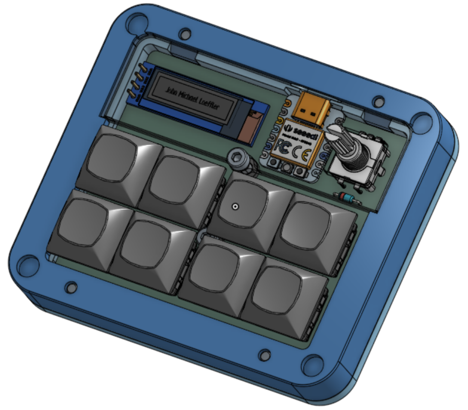

# Capslock Light ++
My keyboard doesn't have an LED for capslock, this is a completely overkill solution.

I have designed a pad featuring 8 keys, a rotary encoder & an OLED.

## Future Upgrades 
What's the point of a hackpad if you don't keep hacking on it? and my preferred method of hacking is in hardware.

1. RGB \
I added some solder points to the PCB that would allow me to connect WS2812b tape to it once I have time to re-design the case to accommodate such lighting.

2. MAGNETS!!! \
The case has points to glue 6x2mm magnets in for snap on customization.
These will include bezels that also show what the encoder dose, and stands that can interlock with the diamond pattern on the bottom for more rigidity than magnets alone could offer.

## Other Things I Did For Hackpad
Merge DXFs for laser cutting \
At the cost of AutoCAD borking my laptop no less than 6 times all the valid DXFs for the lasercut acrlyic plates we placed in one file. \
 \
Just claiming a little bit of credit :)