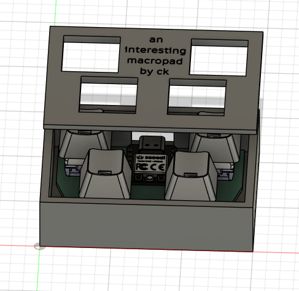
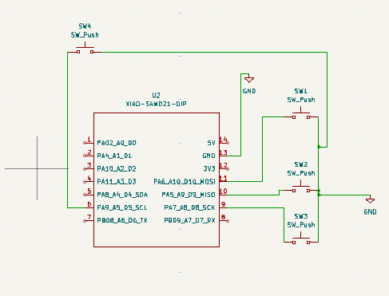
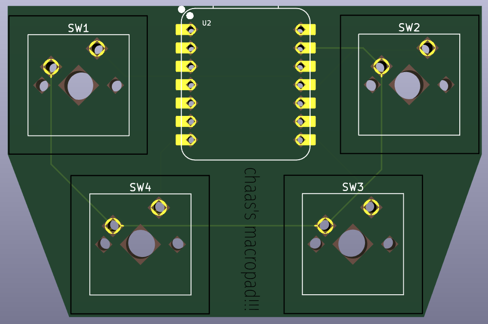
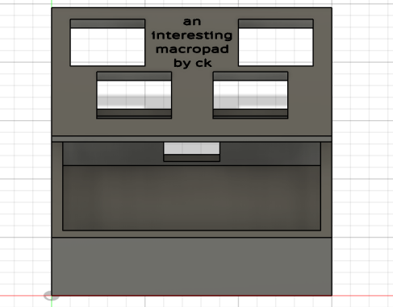

I really wanted to learn how to make a PCB, and get into the world of mechanical keyboards after spending lots of time lurking in the r/MechanicalKeyboards subreddit, so I thought that making a macropad would be a great start to learning about both of these! I learned how to use KiCAD, and also learned about how keyboards work and the different kinds of switches! I already know how to use F360 for basic things, but this was also the first project I did that combined multiple components and was slightly more complicated than the other ones. 

# BOM:

- 1x Case (I'll get this done with a 3D printer I have access to!)
- 1x PCB
- 1x XIAO RP2040
- 4x Kailh White switches (preferably, but any Cherry MX switch should work)
- 4x Keycaps
- 1x Soldering iron
