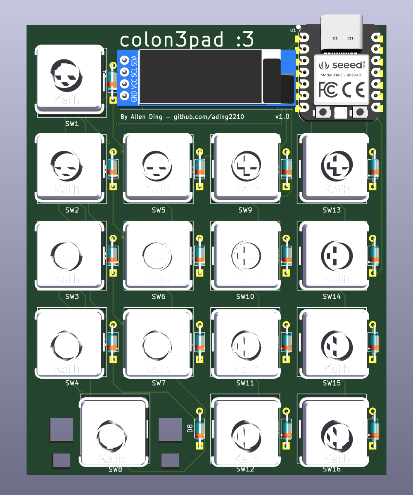
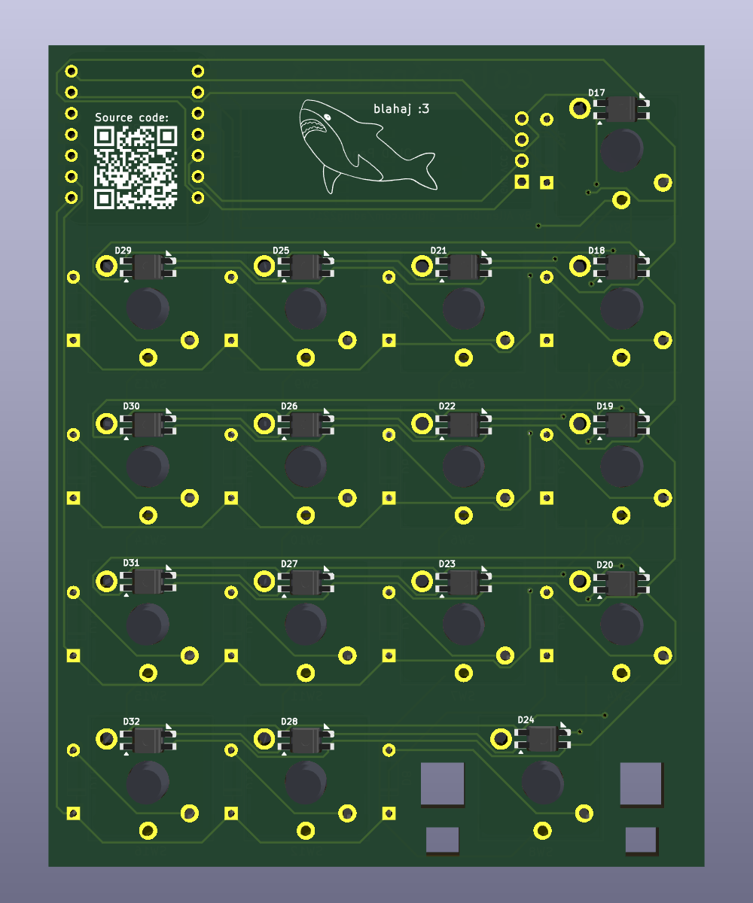
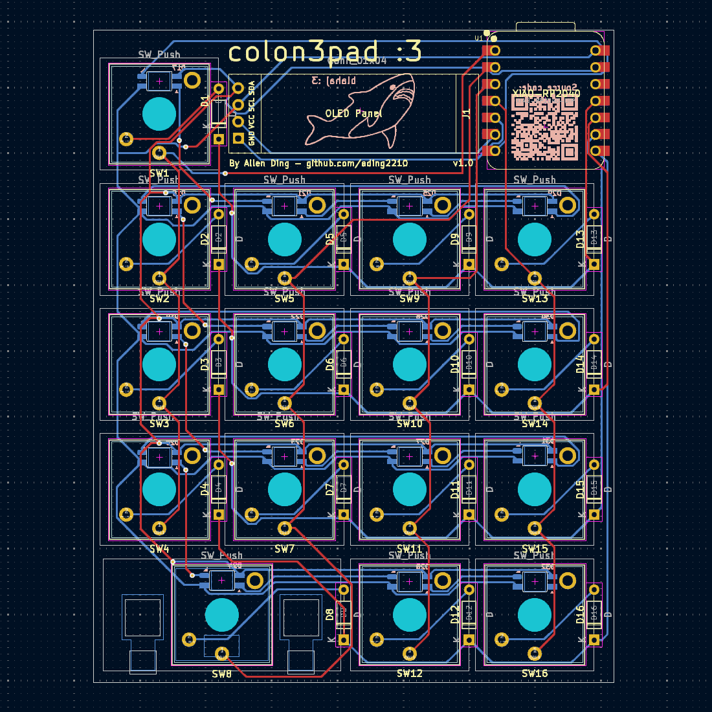
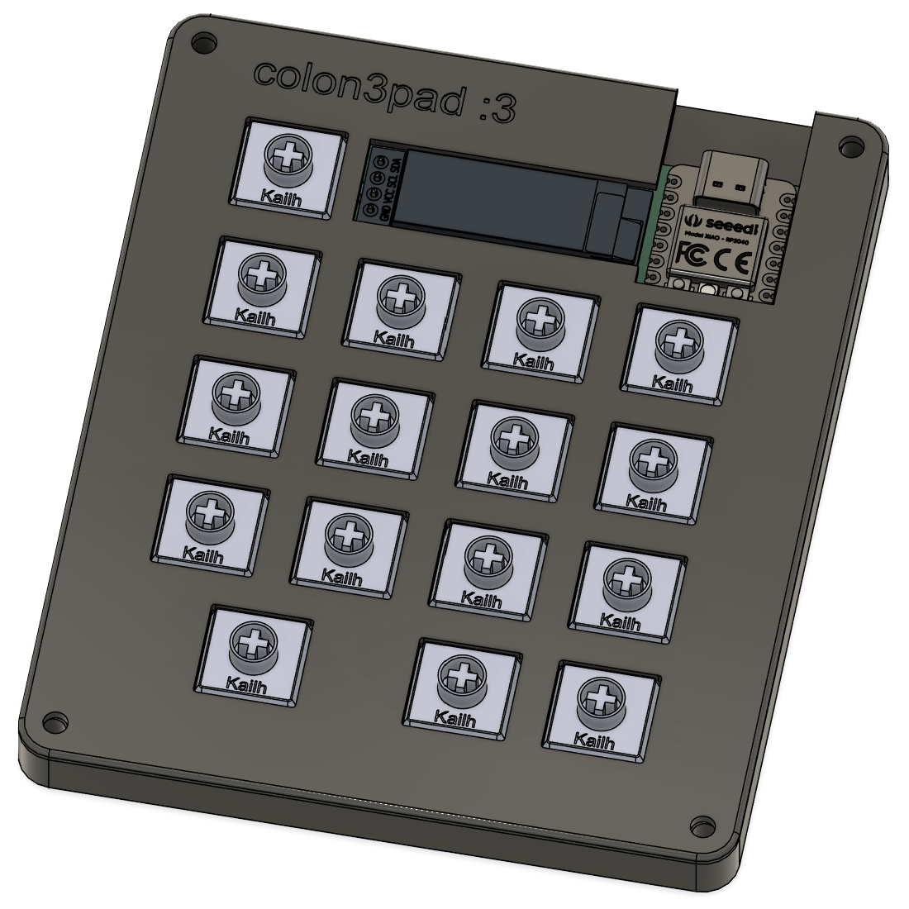
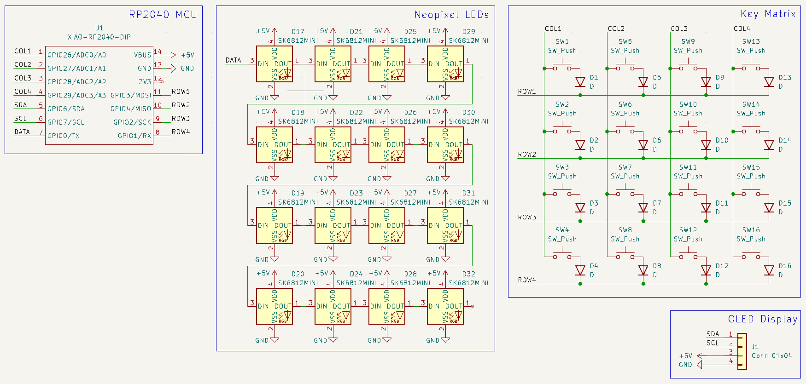

# colon3pad

This is a custom designed macro pad, created for the the [Hackpad](https://hackpad.hackclub.com/) event. It has 16 keys and a built in OLED display.

Note: this directory is missing the required submodules for the symbol and footprint libraries used. See https://github.com/ading2210/colon3pad for the full repository.

<p>
   
   
</p>
<p>
   
   
</p>
 

## Inspiration / Challenges:

I designed this so I could get more practice with designing PCBs in KiCad. The fact that I'm [getting this hardware for free](https://hackpad.hackclub.com) also gave me an excuse to work on it. 

A challenge that I had was that I had to redo parts of the design several times. For example, I had finished the PCB when I realized that all the switches needed to be rotated 180°, so that forced me to reroute everything. Also, information on the PCB footprints and dimensions needed for the Choc V2 switches is somewhat scarce, so a ton of research was required. 

## BOM:
For PCB:
- 1x Seeed Studio XIAO RP2040 
- 1x SSD1306 128x32 OLED 
- 16x Kailh Choc V2 switches
- 16x SK6812-E reverse mount NeoPixel LEDs
- 16x 1N4148 diodes 

For Case:
- Case is 3D printed with PLA
- 4x M3x12mm screws
- 4x M3 hex nuts
- 4x M3x5mx4mm heatset inserts
- 15x 1u low profile key caps ([compatibility list](https://docs.google.com/spreadsheets/d/1ylYmEZ1jNiPuHWl6rjiI3xzooOwUTS33BZfYSW-n7Ok/edit?gid=0#gid=0))
- 1x 2u low profile key cap

## License:
This project is licensed under the GNU GPL v3. 
```
ading2210/colon3pad - A custom macro pad
Copyright (C) 2025 ading2210

This program is free software: you can redistribute it and/or modify
it under the terms of the GNU General Public License as published by
the Free Software Foundation, either version 3 of the License, or
(at your option) any later version.

This program is distributed in the hope that it will be useful,
but WITHOUT ANY WARRANTY; without even the implied warranty of
MERCHANTABILITY or FITNESS FOR A PARTICULAR PURPOSE.  See the
GNU General Public License for more details.

You should have received a copy of the GNU General Public License
along with this program.  If not, see <https://www.gnu.org/licenses/>.
```