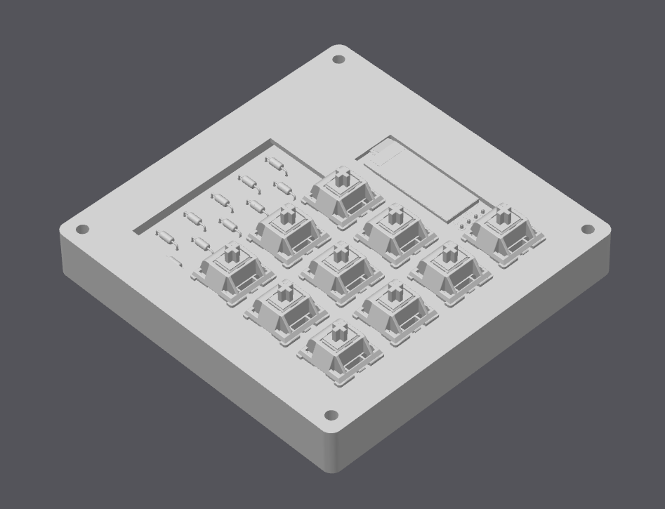
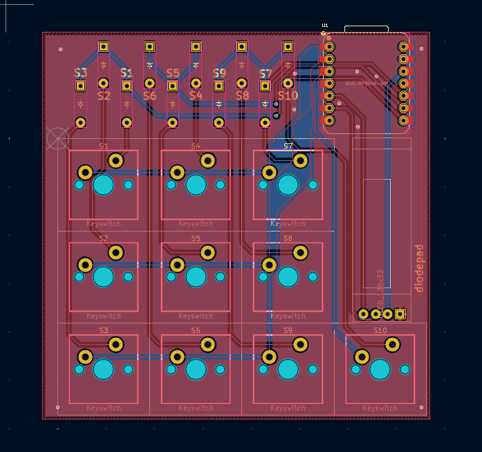

# Diodepad

Diodepad is a simple macropad with a 10 switches, visible diodes and a OLED screen.

## Features:

<ul>
    <li>128x32 OLED Display</li>
    <li>10 Keys</li>
    <li>Visible diodes ( they look cool )</li>
    <li>Minimalistic case</li>
</ul>

