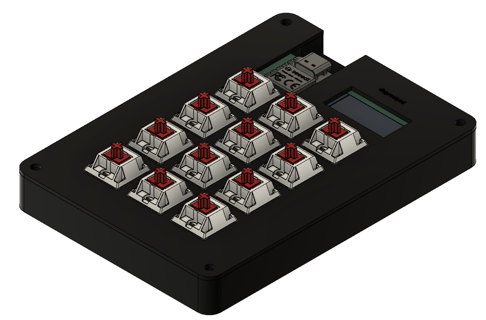
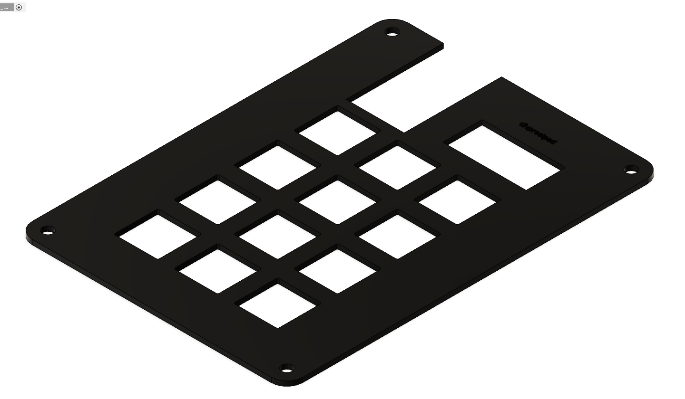
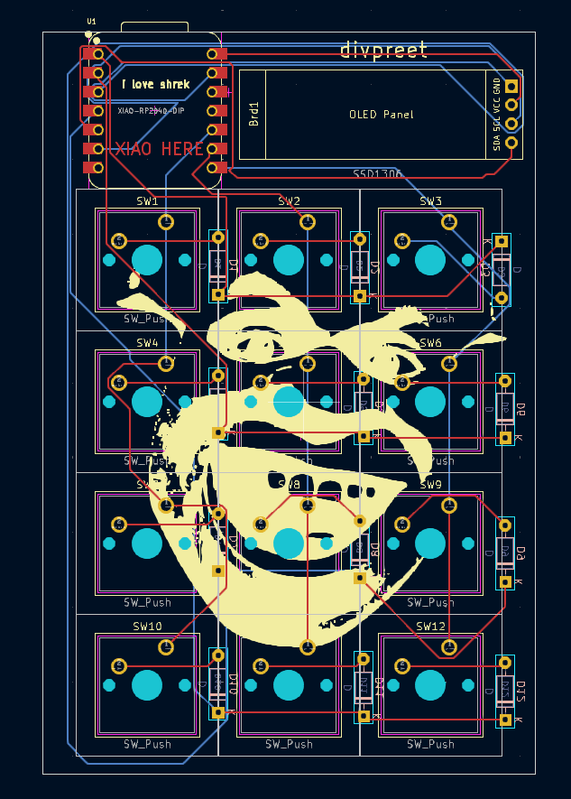
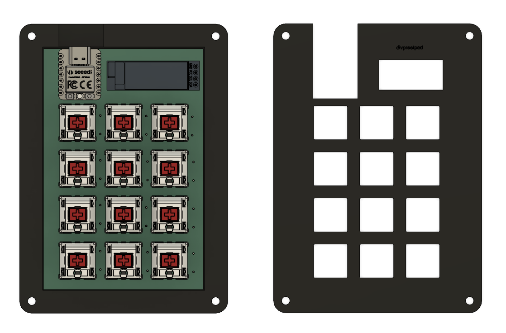

# divpreetpad
-- --
> a custom macropad i made to boost my productivity, or ruin it.
-- --

### Inspiration
After hours of binging custom macropad videos, i finally got the chance to make my own! and its REALLY fun, i didnt really have alot of time to spend (only two days!) but i did end up pulling it off, the journey is pretty fun! but at times it gets annoying, yup thanks but no thanks FreeCAD
-- --
### Challenges
It was my first time using a set of software like KiCad and Fusion! it was really frustruating since mouse controls in KiCad SUCK, but once you get the hang of it, they arent that bad! also i tried FreeCAD, which was my worst choice in the journey. spending almost two days on just the plate! im really greatful to @Cyao, @Daamin, and #hackpad for helping me out! 
-- --

-- --
### My Overall Journey
I'll try to keep this as short and simple as i can! so i first went ahead to make my schematics following the [guide](https://hackpad.hackclub.com), and stuff was going pretty well, until i wanted to add a display! so i spammed google, slack, and ChatPPT, and eventually i did get the OLED Screen ready! next was the routing, it seems pretty complicated, but once you get the hang of it and learn to keep one finger at V, its pretty easy! after that, we had to make the 3D Models! this part was where i messed up by choosing FreeCAD. it was less resource intensive, so i chose it! it took me TWO days to get the top plate, so i gave up and moved onto Fusion! in which i was able to make the whole case in a day (same day as PR)! after that every thing was pretty smooth, i did face problems in the measurements, but taking a closer look and asking for help got me a pretty great result! after that it was time for the firmware, the starter code and the documentation really helped in that too! oops too long 😭
-- --
Schematic            |  PCB         |   Case
:-------------------------:|:-------------------------:|:-------------------------:|
    |    | 

-- --
### Specifications

BOM:
- 12x Cherry MX Switches
- 12x 1N4148 diodes
- 1x XIAO RP2040
- Blank DSA Keycaps (6x Black, 6x White)
- 1x SSD1306 128x32 0.91" OLED (5V VCC, 3.3V logic, I2C)
- 4x M3x16 Bolt
- 4x M3 Heatset
- 1x Case (Top and Bottom)
- 1x PCB
  
-- --

Others:
- KMK Firmware
- Top.step
- Bottom.step
-- --
### Final Look
i love it

