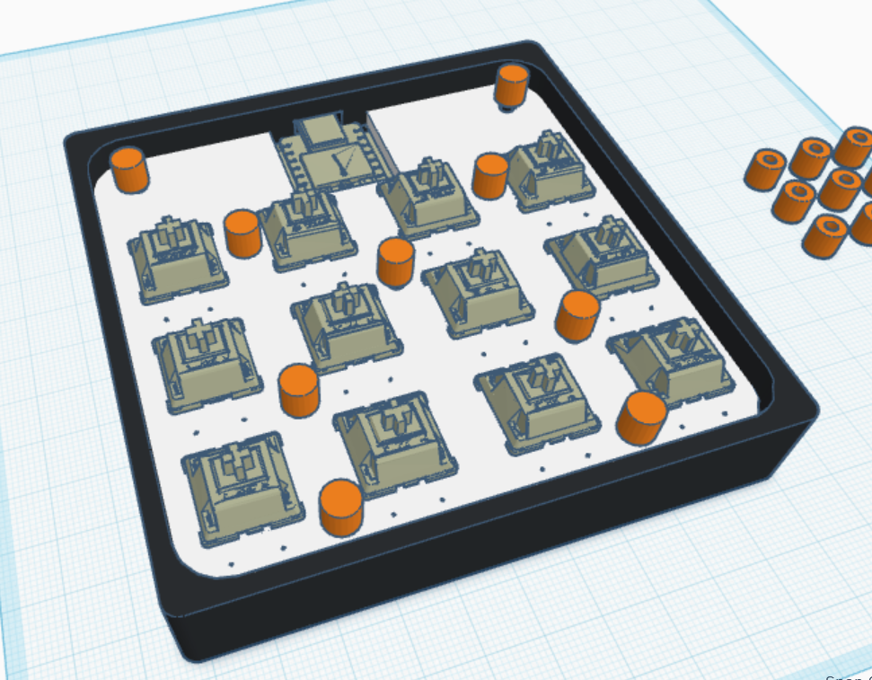

# Duck Pad V2 🦆~~🪿~~

### Inspiration

The inspiration remained from v1. It was my first PCB design, naturally, I messed up and couldn't get the macropad. So here's my entry for v2. Design is mostly similar with 12 keys and a xiao. Silkscreen was changed tho. Looks much better.

### Challenges

To be honest, it wasn't a challenge. The challenge was my first entry during v1. I messed up so many times and DRC kept throwing me off. So this time around, I changed to EasyEDA from KiCAD which imo is way cleaner for beginners. However, one thing I definitely struggled with was imprting the pcb 3D model into tinker for reference. Reducing the file size while keeping the model intact and useful enough is rather complicated.

### Specifications

BOM:

- 12x Cherry MX Switches (Blue)
- 1x XIAO RP2040
- 12x Blank DSA Keycaps (Preferably 4 of each color)
- 12x Through-hole 1N4148 Diodes
- 1x 3D Printed Case (Black)
- 1x 3D Printed Plate (preferably white or black)
- 9x 3D Printed lock (any color)

Others:

- QMK Firmware
- duckpad_v2_plate.stl
- duckpad_v2_case.stl
- duckpad_v2_lock.stl

|    Schematic    |       PCB       |      Case       |
| :-------------: | :-------------: | :-------------: |
|  |  |  |

Made with 🦆 ~~Not literally~~ by [Sayhan](https://hackclub.slack.com/team/U079F8DLN4X)
