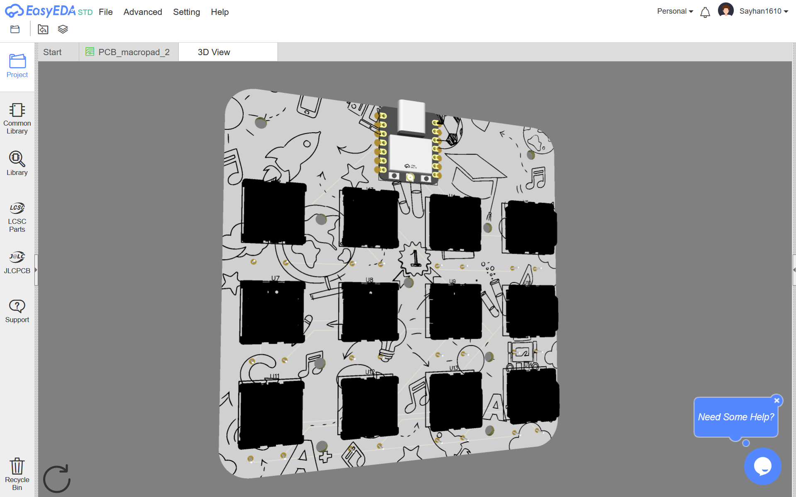
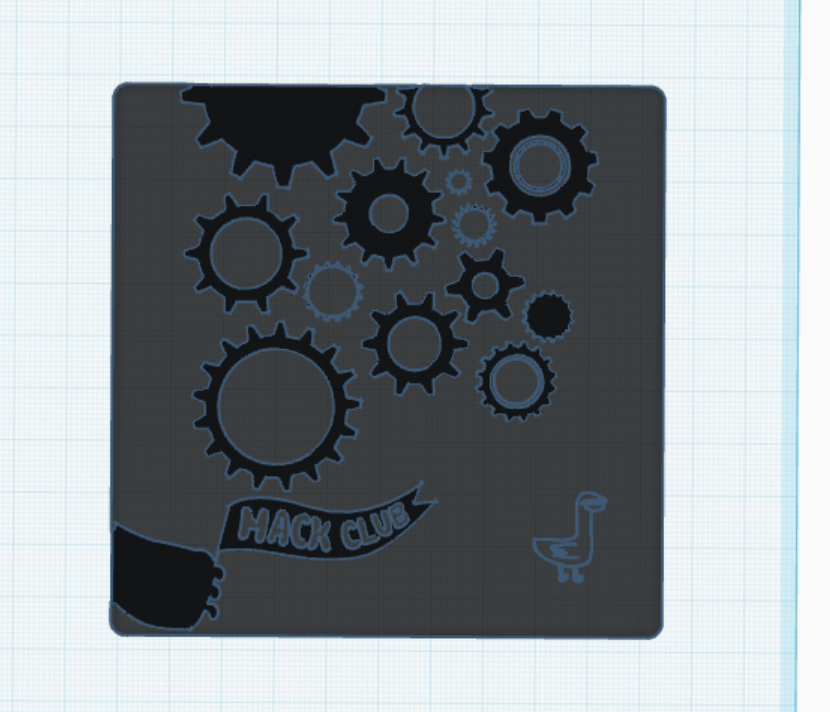

# Duck Pad V2 🦆~~🪿~~

# BOM:

| Item                             | Quantity |
| -------------------------------- | -------- |
| Cherry MX switches               | 12       |
| PCB                              | 1        |
| Through-hole 1N4148 Diodes       | 12       |
| Seeed XIAO RP2040                | 1        |
| 3D printed case (black)          | 1        |
| 3D printed case-lock (any color) | 4        |
| Acrylic laser-cut plate          | 1        |

Made with 🦆 ~~Not literally~~ by [Sayhan](https://hackclub.slack.com/team/U079F8DLN4X)
