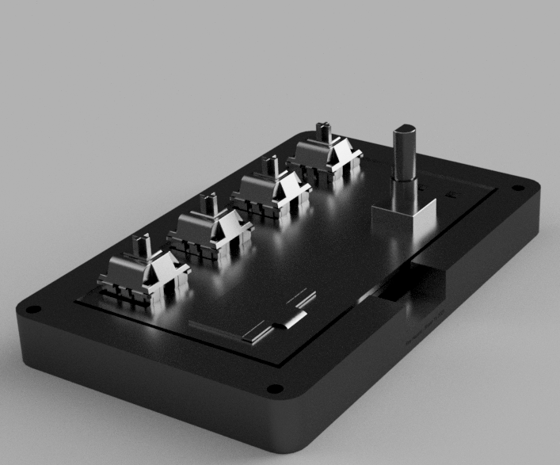

I was originally inspired to make this because I typically need to mute/deafen on calls a lot.

The hardest challenge I faced was attempting to CAD the case. I am very unfamiliar with CAD modeling.

BOM:
- 4x Cherry MX Switches
- 1x EC11 Encoder
- 6x SK6812 MINI Leds
- 1x 0.96in 128x32px OLED (SSD1306)
- 4x M3x20mm screws
- 1x Bottom case (3D Printed)
- 1x Top plate (3D Printed)
- 1x Seeed XIAO RP2040
- 4x Blank DSA Keycaps

