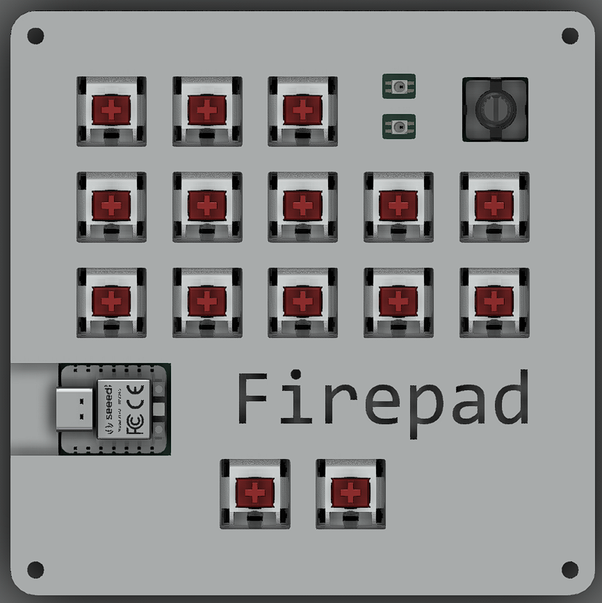
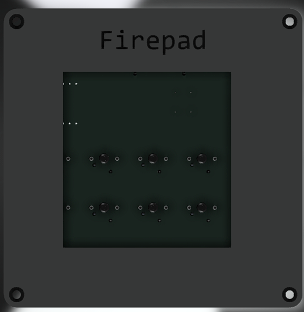

# Firepad
## Firepup's macropad

Primarily intended as a general-use hackpad, I intend to use most of the extra F-keys for stream keybinds, although I've given myself more of those then I needed.

### Pictures

#### Above

#### Diagonal

#### Below

#### PCB

#### 3D PCB

#### Schematic

### Frimware

The top three buttons (from left to right) are:
- Skip Backward
- Pause/Play
- Skip Forward

The next 5 buttons are F13-F17, the next five F18-F22, and the last two are F23 and F24.

The rotary encoder is volume control, and can be clicked to mute.

Clicking any button will slightly adjust the color of the power LED, and the mute key will switch on/off the mute LED, although it might be inverted, since I don't think I can detect host mute status.

### BOM
- 1x Seeed XIAO RP2040
- 15x Cherry MX Switches
- 1x EC11 Rotary encoder
- 15x Blank DSA keycaps (Red, preferably)
- 2x SK6812 MINI-E LEDs
- 4x M3x16mm screws
- 4x M3 hex nuts
- 4x M3x5mx4mm heatset inserts
- 1x MCP23017 io expander chip
- 1x Case (2 printed parts)

### TODO:
- Double check BOM & try to find prices
