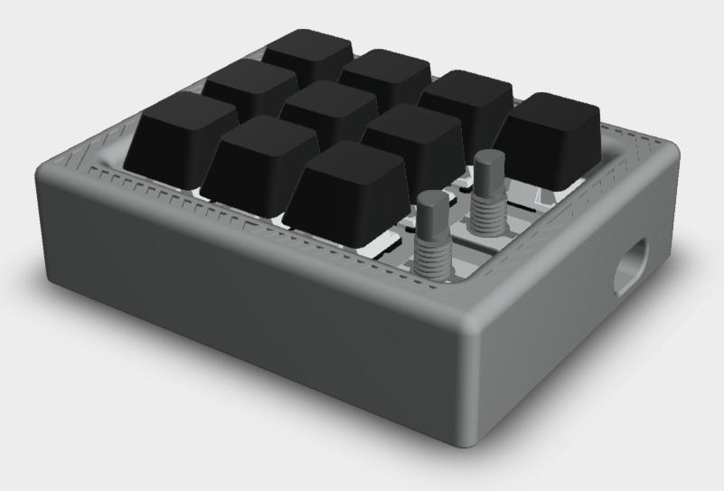

# frankz
Hello, this is my first macropad where I created the pcb, case, and firmware! I was informed about this YSWS from the hackclub started at my high school. I have learned actually so much, like wow, while making this and have had a lot of fun outside of the struggles with KiCad lol. Thank You [Hack Club](https://github.com/hackclub) for your support through the "You Ship, We Ship" program - [Hack Pad](https://github.com/hackclub/hackpad/tree/main).

# BOM:
- 1x PCB
- 1x Seeed XIAO RP2040 (through-hole)
- 2x EC11 Encoder
- 10x MX-Style switches - Gateron Milky Yellows
- 12x 1N4148 Diodes (through-hole)
- 10x Blank DSA keycaps
- 2x Encoder Knobs
- 4x M3 Heat-Set Inserts
- 4x M3x20mm Bolts
- 1x Case Base & Top (preferably black, otherwise white)
- 1x Case Plate (Laser Cut Acrylic)