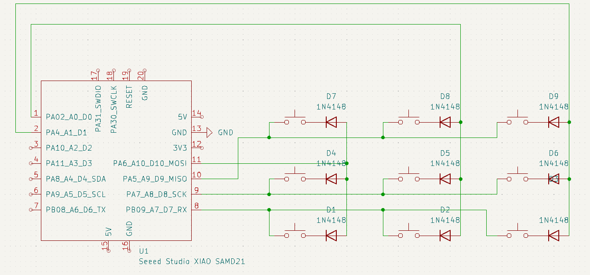
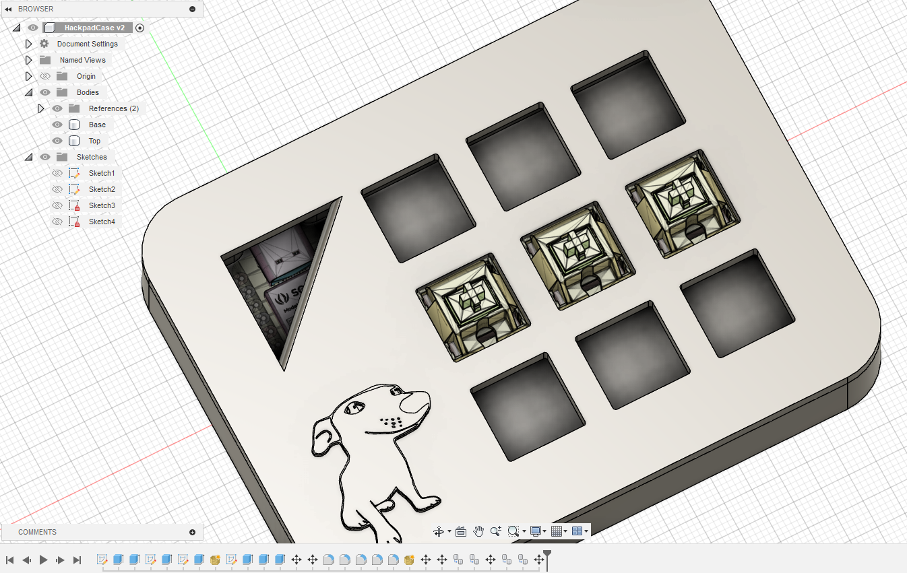

# Writeup
This is the part where he makes the writeup

## Overview of macropads
A macropad is basically just a mini keyboard, used for all kinda of purposes, mainly
- Productivity (macros)
- Gaming (wasd, ect)

and more

## PCB

The PCB is a keyboard matrix, which simply refers to creating a group of rows and columns to determine which key is pressed, rather than having one pin for each switch. Each switch has a 1N4148 diode which connects it to the column.

The macropad is 3x3, using the Seeed Studio controller as required.

## CAD

The model has a triangle hole to see the microcontroller, and it was used as a reference to position the USB C port properly, on the front face, you can see the funi dog, which is the logo for my development studio.

Links:
- https://github.com/hineybush/CherryMX
- https://grabcad.com/library/cherry-mx-switches-mx-1

## Firmware
Its just QMK, idk how any of it works but it does