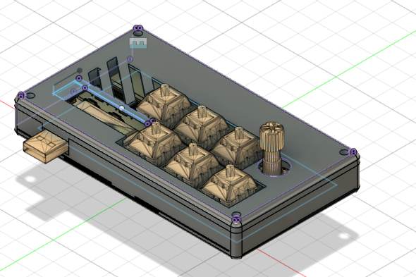
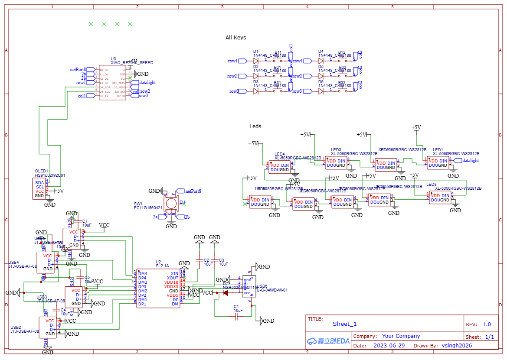
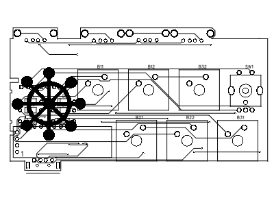
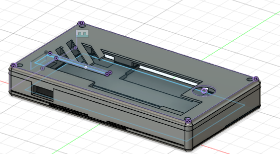

# MacroPad Project

## Overview
This is my custom-built MacroPad project.

## Images
### MacroPad

### Schematic

### PCB

### Case Assembly

## Bill of Materials (BOM) per Keyboard
- **6** MX-Style switches
- **6** through-hole 1N4148 Diodes
- **1** Seeed XIAO RP2040
- **1** EC11 Rotary Encoder
- **6** Black Blank DSA Keycaps
- **9** SK6812 MINI-E LEDs
- **4** M3x16mm Screws
- **4** M3 Hex Nuts
- **4** M3x5mmx4mm Heatset Inserts
- **4** USB 2.0 1 4P Female Type-A Plugin USB Connectors ROHS
- **1** 1A USB 2.0 1 Bend-in Male -40℃~+85℃ Type-A Plugin USB
- **1** CoreChips SOP-16 USB HUB Controller ROHS
- **7** 10V 10uF X5R ±10% 0603 Multilayer Ceramic Capacitors MLCC - SMD/SMT ROHS

## Assembly Instructions
- Solder the diodes to the PCB.
- Mount the MX-style switches.
- Attach the Seeed XIAO RP2040 microcontroller.
- Install the rotary encoder and LEDs.
- Secure all components with the necessary screws and heatset inserts.
- Connect the USB components as per the schematic.

This MacroPad is designed to be a versatile and customizable input device, perfect for various applications!

