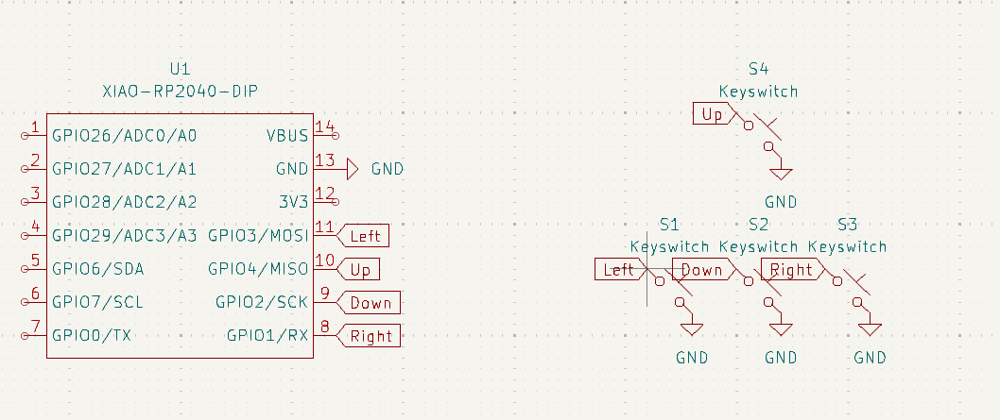

# gpad
a small keypad for playing games with relativly few controls

## Inspiration
Recently, I started to play games that required only a few amount of keys to play.  Combined with a heightened interest in hardware, I decided I wanted to create a small macropad to fulfil this interest.
Initially I decided to create two separate macropads but time and design constraints proved to be too tight for that to be realized.

### assembly

### cad

### pcb

### schematic

## BOM
- 2x 3D case (for top and bottom layer)
- 4x MX-Style switches
- 1x Seeed XIAO RP2040
- 4x White Blank DSA keycaps
- 4x M3x16mm screws
- 4x M3 hex nuts
