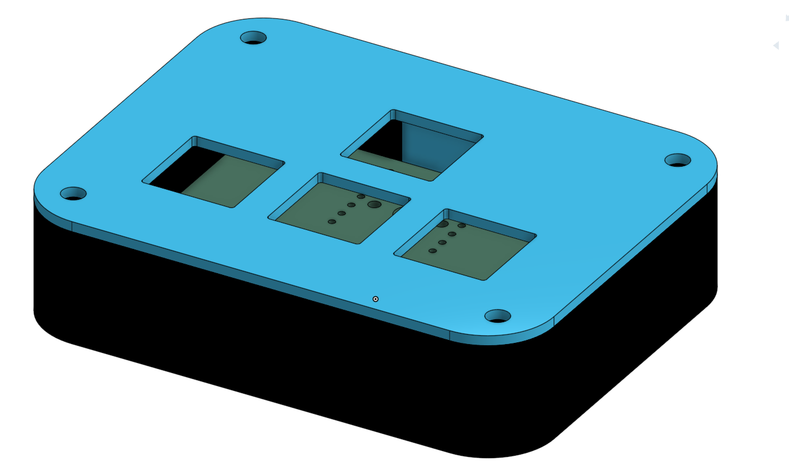

# gpad
a small keypad for playing games with relativly few controls

### assembly

### cad

### pcb

### schematic

## BOM
- 2x 3D case (for top and bottom layer)
- 4x MX-Style switches
- 1x Seeed XIAO RP2040
- 4x White Blank DSA keycaps
- 4x M3x16mm screws
- 4x M3 hex nuts
