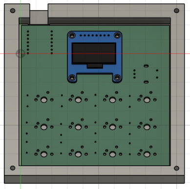

# GRASSPAD!!
A hackpad with a rotary encoder, some keys and an oled screen...

I didn't have enough time to make the firmware because i had to study for a math test :sob: BUT I will try and update it in the future with the firmware and everything I actually need to assemble it is here (case and pcb...) 

The case is also quite crude with the fitting of the usbc and how it works but I will fix it in later revisions since I have my own 3D printer

# BOM:
- 1x SSD1306 OLED display
- 1x Seeed Studio XIAO RP2040
- 12x Cherry MX Switches
- 12x 1N4148W diodes
- 1x EC11 Encoder

