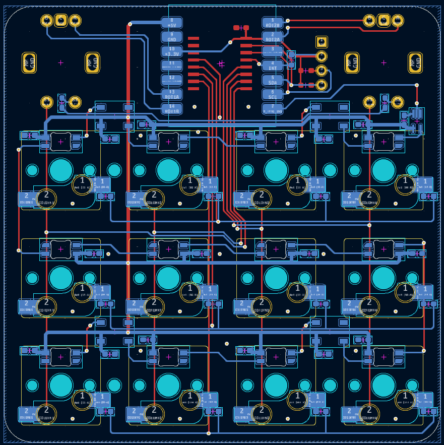

# Guerriacanpad

# BOM:
Electronic parts :
- 12x Cherry MX Brown RGB Switches
- 12x MX Style Kailh Hotswap sockets
- 2x EC11 Encoders

- 2x 0603 4k7 SMD Resistors
- 1x 0603 10k SMD Resistor
- 14x 0603 SMD Diodes
- 18x 0603 100nF SMD Capacitors

- 4x WS2812B SMD LEDs
- 12x SK6812-E reverse mount SMD LEDs

- 1x SSD1306 0.91 White OLED

- 1x PCF8574ADWR I/O expander
- 1x 74AHC1G125SE Level Shifter

- 4x M2 heatsets
- 4x M2 16mm screws

3D Print (Black PLA) :
- 1x case_middle.stl
- 4x spacer.stl
- 1x foot.stl

Laser cut (3mm Clear Acrylic) :
- 1x plate.dxf
