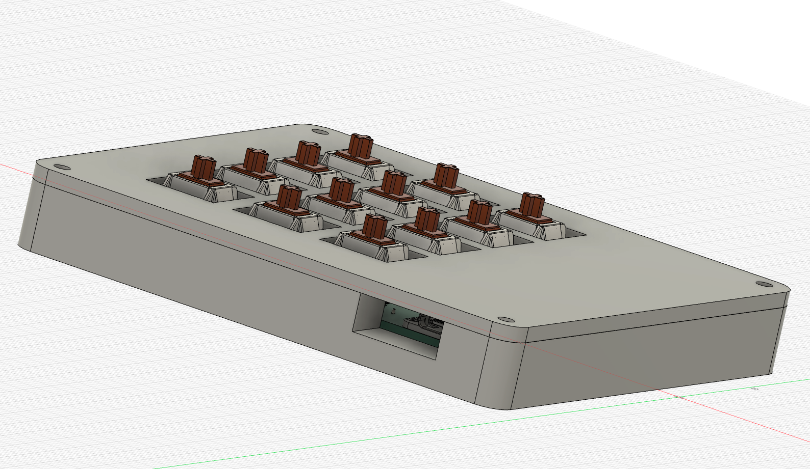

bom
1x SEEEDUINO XIAO RP2040
14x Cherry MX Switches
14x 1N4148 diodes
4x M3x16mm screws
4x M3 hex nuts
7x Neon Green DSA Keycaps for MX Compatible Switches
7x Dark Blue DSA Keycaps for MX Compatible Switches

^^ a few extra for backup incase it breaks or smt 

Inspiration:
 i got REALLY REALLY REALLLY BIG from my friend who i saw working on this project one day. i thought it was very interesting and i get it for free too i said why not i just do it? in the end i sunk about 30 hours into this in the span of a few days and many sleepless nights
Challenges
 while making this i faced ~a few~ challenges. most of which were the software but mostly time constraints as i found out about this ysws abit TOO late and had to speedrun this
 
 
 

