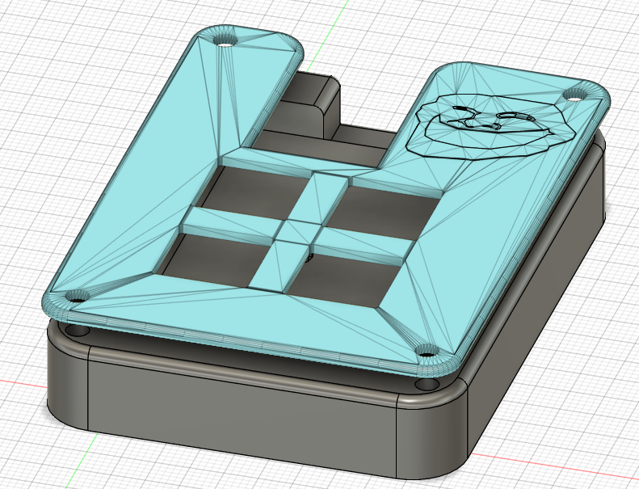
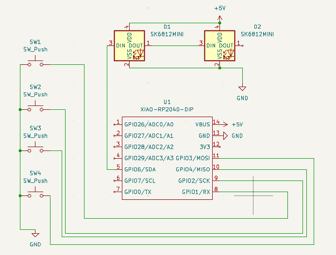
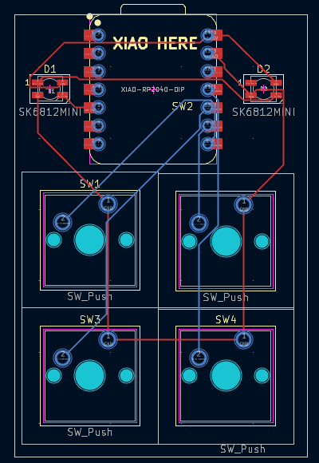

# TrollPad 
### 4 key macropad with trollface extruded design.
Made using KiCad and Fusion

### Images
Overall case:

Schematic:

PCB:

# BOM
- 4 Cherry MX style switches
- 4 MX-stem keycaps
- 2 SK6812 MINI Leds
- 1 XIAO RP2040 DIM
- 4 M3x16 Bolt and Heatset OR some tape :D
- KMK Firmware (provided)
- top and bottom case (provided)