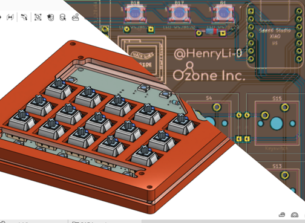

# Henry's Macropad

A macropad for common keybinds I use during CAD, programming, and art!

### BOM:
- 1x Seeed Studio XIAO SAMD21 (XIAO-Generic-Thruhole-14P-2.54-21X17.8MM)
- 1x PCB (PCB)
- 1x OLED_128x64 (SSD1306 128x64 OLED)
- 15x Keyswitch (SW_Cherry_MX_1.00u_PCB)
- 17x Diodes
- 10x WS2812B LEDs (LED_WS2812B)

### Credits!
- Hackclub Inside Silkscreen based off the Hackclub Inside sticker! (redrawn because of strange converter issues with the original)
- PCB designed in KiCad 8.0!
- Case CAD created in OnShape! See it [here](https://cad.onshape.com/documents/438be41ae666356798ec8417/w/c836207d4d537bed51863fed/e/56cbb681866eb12dbab233d4?renderMode=0&uiState=6718649bb86ce562fff9f6c5)!
- Programming done with KMK!
- Image put together in Google Slides (lol)